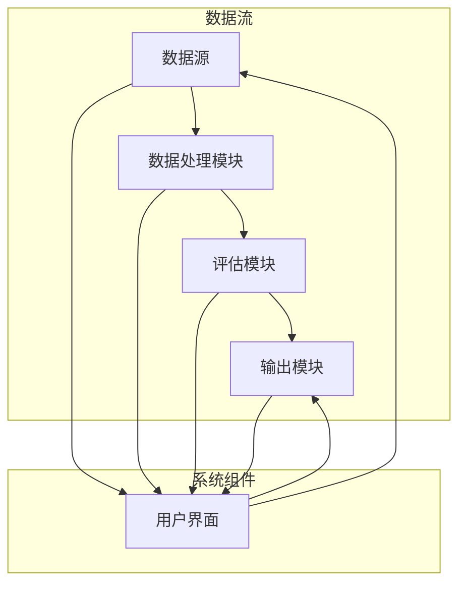
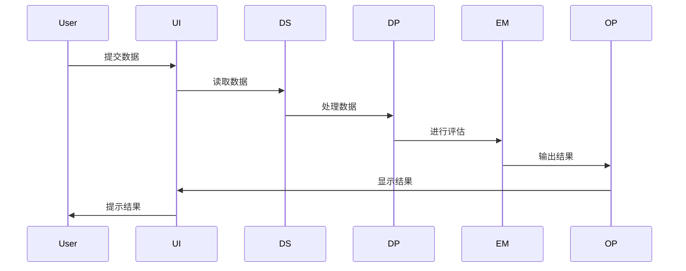

                 


### 引言与背景介绍

#### 问题背景

评测系统是许多领域，如教育、商业、科研等领域中不可或缺的工具。传统的评测系统往往依赖于人工设定规则，但这种方法存在几个明显的问题。首先，规则的设定需要大量时间和专业知识的积累。其次，规则一旦设定，便很难适应新的需求和环境变化。此外，规则依赖的系统在处理复杂问题时，容易出现不准确性。

神经程序的兴起为评测系统带来了新的可能。神经程序，尤其是神经网络，通过模仿人脑的神经元连接和信号传递机制，能够自适应地学习数据模式，并在不同场景下进行推理和决策。这使得评测系统不仅能够处理复杂的问题，还能够根据新的数据不断优化自身的性能。

#### 核心概念

在探讨神经程序在评测系统中的应用之前，我们首先需要明确几个核心概念：

1. **评测系统**：一个用于评估、分类、预测或决策的系统，它可以通过输入数据和相应的规则或算法，输出评估结果。
2. **神经程序**：一种基于神经网络原理的算法，能够通过学习输入数据的特征，自动调整内部参数，从而实现特定任务。
3. **归纳**：从具体实例中总结出一般规律或原则的过程。

#### 问题描述

目前，评测系统面临的主要问题包括：

- **规则依赖性**：系统需要人工设定复杂的规则，难以适应环境变化。
- **处理能力**：系统在处理复杂问题时，可能无法准确预测或分类。
- **学习适应性**：系统难以从新的数据中学习，提高性能。

#### 问题解决

神经程序通过以下几个步骤解决上述问题：

1. **数据学习**：通过神经网络，系统可以从大量数据中自动学习特征模式。
2. **参数调整**：系统根据学习到的模式，自动调整内部参数，以提高预测和分类的准确性。
3. **自适应优化**：系统能够根据新的数据和环境变化，不断调整自身，以保持高性能。

#### 边界与外延

评测系统的神经程序归纳不仅限于数据处理，还可以扩展到其他领域，如自动化决策系统、智能监控等。同时，不同类型的神经网络（如卷积神经网络、递归神经网络等）适用于不同的场景，因此需要根据具体问题选择合适的神经网络架构。

#### 概念结构与核心要素组成

- **评测系统**：输入数据、规则或算法、输出评估结果。
- **神经程序**：神经元、神经网络、学习算法、参数调整机制。

### 研究意义与目标

#### 研究意义

1. **提高评测系统性能**：神经程序能够通过学习数据特征，提高评测系统的准确性和处理能力。
2. **减少人力投入**：通过自动化的评测系统，减少人工设定规则的需求，降低人力成本。
3. **适应环境变化**：神经程序具有自适应优化能力，能够更好地适应环境变化和新数据。

#### 研究目标

1. **实现评测系统的神经程序归纳**：通过神经网络，实现评测系统的自动归纳，提高系统的性能和适应能力。
2. **评估神经程序的性能**：对不同类型的神经网络进行评估，找出最适合评测系统的架构。
3. **优化神经程序算法**：通过实验和数据分析，不断优化神经程序算法，提高其效率和准确性。

## 总结

本章节介绍了评测系统的神经程序归纳的背景、核心概念和研究意义。接下来，我们将深入探讨神经程序的基础理论，为后续章节的讨论打下基础。

### 神经程序基础

#### 第3章：神经程序概述

##### 定义与分类

神经程序，顾名思义，是一种模仿人脑神经元工作原理的程序。在计算机科学中，神经网络（Neural Networks，简称NN）是最常见的神经程序形式。神经网络由大量相互连接的简单处理单元（即神经元）组成，这些神经元通过传递和调整电信号来执行复杂计算。

**神经网络**可以分为几种类型：

1. **前馈神经网络（Feedforward Neural Networks）**：这是最简单的神经网络类型，数据从输入层经过隐藏层，最终传递到输出层。
2. **卷积神经网络（Convolutional Neural Networks，CNN）**：CNN特别适用于图像处理任务，通过卷积操作提取图像中的局部特征。
3. **递归神经网络（Recurrent Neural Networks，RNN）**：RNN能够处理序列数据，如时间序列或文本，因为它能够记住之前的输入。
4. **生成对抗网络（Generative Adversarial Networks，GAN）**：GAN由生成器和判别器组成，通过对抗训练生成新的数据。

##### 神经网络的组成与工作原理

一个标准的神经网络通常由以下几个部分组成：

1. **神经元**：神经网络的基本单元，它接收输入信号，通过加权求和处理后产生输出信号。
2. **层**：神经网络分为输入层、隐藏层和输出层。输入层接收外部数据，隐藏层进行数据处理，输出层生成最终结果。
3. **权重**：每个神经元与下一个神经元的连接都带有权重，这些权重决定了信号传递的强度。
4. **激活函数**：激活函数为神经元的输出添加非线性特性，使得神经网络能够学习复杂的数据模式。

神经网络的原理可以简化为以下几个步骤：

1. **输入信号传递**：输入信号通过输入层传递到隐藏层。
2. **加权求和处理**：每个神经元将输入信号与其权重相乘，然后求和。
3. **应用激活函数**：对加权求和处理的结果应用激活函数，得到神经元的输出。
4. **层间传递**：隐藏层的输出作为输入传递到下一层，直到达到输出层。
5. **输出结果**：输出层生成最终结果，如分类标签或预测值。

#### 第4章：神经程序的核心概念

##### 神经元的属性与功能

神经元是神经网络的基本构建块，其属性和功能如下：

1. **输入与权重**：每个神经元接收多个输入信号，每个输入信号都有一个对应的权重，这些权重决定了信号的重要性。
2. **偏置**：每个神经元都有一个偏置项，它可以调整神经元的阈值，从而影响神经元的激活状态。
3. **激活函数**：激活函数为神经元的输出添加非线性特性，常见的激活函数包括 sigmoid、ReLU 和 tanh 等。

##### 神经网络的学习与优化

神经网络的学习过程可以通过以下步骤实现：

1. **前向传播**：输入信号从输入层传递到隐藏层，再传递到输出层，得到预测结果。
2. **计算误差**：将预测结果与实际结果进行比较，计算误差。
3. **反向传播**：根据误差，反向传播更新每个神经元的权重和偏置。
4. **优化算法**：使用梯度下降等优化算法，调整权重和偏置，减小误差。

常用的优化算法包括：

1. **随机梯度下降（Stochastic Gradient Descent，SGD）**：每次迭代只更新一个样本的权重和偏置。
2. **批量梯度下降（Batch Gradient Descent）**：每次迭代更新所有样本的权重和偏置。
3. **Adam优化器**：结合了SGD和批量梯度下降的优点，同时引入了动量项和自适应学习率。

#### 第5章：神经程序的数学模型

##### 神经元的数学模型

神经元的数学模型可以用以下公式表示：

$$
z_j = \sum_{i=1}^{n} w_{ji} x_i + b_j
$$

其中，$z_j$ 是神经元 $j$ 的输入值，$w_{ji}$ 是输入信号 $x_i$ 对应的权重，$b_j$ 是偏置。

##### 神经网络的数学模型

神经网络的数学模型可以扩展为：

$$
a_j = \sigma(z_j)
$$

其中，$a_j$ 是神经元 $j$ 的输出值，$\sigma$ 是激活函数。

对于多层神经网络，输入信号从输入层传递到隐藏层，再传递到输出层，每个层次的输出都可以用类似的形式表示。

#### 概念属性特征对比表格

| 特征               | 前馈神经网络 | 卷积神经网络 | 递归神经网络 | 生成对抗网络 |
|--------------------|---------------|---------------|---------------|---------------|
| 数据类型           | 标量或向量    | 图像数据      | 序列数据      | 任意数据      |
| 模型结构           | 层状结构      | 层状结构      | 层状结构      | 对抗结构      |
| 应用场景           | 分类、回归    | 图像处理      | 自然语言处理   | 数据生成      |
| 激活函数           | Sigmoid、ReLU | ReLU          | Sigmoid、ReLU | 无           |
| 优化算法           | 梯度下降      | 梯度下降      | 梯度下降      | 梯度下降      |

#### ER实体关系图架构的 Mermaid 流程图

```mermaid
erDiagram
  A[--关联 B]
  A|--|C
  B|..|> D
  C|..|> D
```

#### 算法原理讲解

神经程序的算法原理可以通过以下步骤实现：

1. **数据预处理**：对输入数据集进行预处理，包括数据清洗、归一化和特征提取。
2. **模型设计**：根据任务需求设计神经网络模型，选择合适的层和激活函数。
3. **模型训练**：使用训练数据集对模型进行训练，通过前向传播和反向传播调整权重和偏置。
4. **模型评估**：使用验证数据集对模型进行评估，调整模型参数，以提高性能。
5. **模型应用**：将训练好的模型应用于新的数据集，进行预测或分类。

以下是一个简单的神经程序实现示例：

```python
import numpy as np

# 定义激活函数
def sigmoid(x):
    return 1 / (1 + np.exp(-x))

# 前向传播
def forward(x, weights, bias):
    z = np.dot(x, weights) + bias
    a = sigmoid(z)
    return a

# 反向传播
def backward(a, z, x, weights, learning_rate):
    dZ = a - y
    dW = np.dot(x.T, dZ)
    db = np.sum(dZ)
    dX = np.dot(dZ, weights.T)
    return dW, db, dX

# 主函数
def main():
    # 初始化参数
    x = np.array([[1], [2], [3], [4], [5]])
    y = np.array([[1], [0], [1], [0], [1]])
    weights = np.random.rand(1, 5)
    bias = np.random.rand(1)
    learning_rate = 0.1

    # 模型训练
    for i in range(1000):
        a = forward(x, weights, bias)
        dW, db, _ = backward(a, z, x, weights, learning_rate)
        weights -= dW * learning_rate
        bias -= db * learning_rate

    # 输出结果
    print("Weights:", weights)
    print("Bias:", bias)
    print("Predictions:", forward(x, weights, bias))

if __name__ == "__main__":
    main()
```

这个示例展示了如何使用前向传播和反向传播算法训练一个简单的神经网络。在实际应用中，通常会使用更复杂的模型和优化器，如 TensorFlow 或 PyTorch 等框架。

### 神经程序的数学模型

神经程序的数学模型是理解其工作原理的核心。为了更好地掌握这一点，我们将通过几个关键部分进行详细解释，包括神经元的数学模型、神经网络的数学模型，以及激活函数的应用。

#### 神经元的数学模型

神经元是神经网络的基本构建块，其工作原理可以简化为以下几个步骤：

1. **加权求和**：每个神经元接收多个输入信号，每个输入信号都与一个权重相乘，然后求和。这个求和过程可以用以下公式表示：

   $$
   z_j = \sum_{i=1}^{n} w_{ji} x_i
   $$

   其中，$z_j$ 是神经元 $j$ 的输入值，$w_{ji}$ 是输入信号 $x_i$ 对应的权重，$n$ 是输入信号的个数。

2. **偏置**：除了权重，每个神经元还有一个偏置项 $b_j$，它可以调整神经元的阈值。因此，实际的输入值可以表示为：

   $$
   z_j = \sum_{i=1}^{n} w_{ji} x_i + b_j
   $$

3. **激活函数**：为了引入非线性特性，神经元通常会使用激活函数 $\sigma$。最常见的激活函数是 sigmoid 函数：

   $$
   a_j = \sigma(z_j) = \frac{1}{1 + e^{-z_j}}
   $$

   sigmoid 函数将输入值映射到 $(0,1)$ 区间内，这是一个 S 形的曲线，能够使神经网络学习复杂的数据模式。

#### 神经网络的数学模型

神经网络由多个相互连接的神经元层组成，包括输入层、隐藏层和输出层。神经网络的数学模型可以扩展为：

1. **输入层**：输入层接收外部数据，每个输入数据都与输入层的一个神经元相连。

2. **隐藏层**：隐藏层对输入数据进行处理，每个隐藏层的神经元都通过加权求和处理和激活函数得到输出。

3. **输出层**：输出层生成最终结果，如分类标签或预测值。

对于多层神经网络，我们可以将每个神经元的输出表示为：

$$
z_l^{(i)} = \sum_{j=1}^{n} w_{lj}^{(l-1)} x_j^{(l-1)} + b_l^{(l)}
$$

$$
a_l^{(i)} = \sigma(z_l^{(i)})
$$

其中，$z_l^{(i)}$ 是隐藏层 $l$ 中第 $i$ 个神经元的输入值，$w_{lj}^{(l-1)}$ 是输入层到隐藏层的权重，$b_l^{(l)}$ 是隐藏层的偏置，$\sigma$ 是激活函数。

#### 激活函数的应用

激活函数是神经网络中的一个关键组件，它为神经网络引入了非线性特性，使得神经网络能够学习复杂的数据模式。以下是几种常见的激活函数：

1. **Sigmoid 函数**：如前所述，sigmoid 函数将输入值映射到 $(0,1)$ 区间内，其导数在 $x=0$ 处为 0，这意味着在接近决策边界时，梯度较小，可能导致梯度消失问题。

2. **ReLU 函数**：ReLU 函数（Rectified Linear Unit）是一种线性激活函数，定义为：

   $$
   \text{ReLU}(x) = \max(0, x)
   $$

   RReLU（Randomized ReLU）是对 ReLU 的改进，引入了随机性，有助于避免梯度消失和梯度饱和问题。

3. **Tanh 函数**：tanh 函数类似于 sigmoid 函数，但将输出映射到 $(-1,1)$ 区间内，其导数在整个定义域内都较大，有助于提高模型的训练速度。

4. **Leaky ReLU**：Leaky ReLU 是 ReLU 的改进版本，它允许负输入通过一个小常数，以避免 ReLU 函数中的死神经元问题。

5. **Softmax 函数**：在输出层，softmax 函数用于多分类问题，将神经元的输出转换为概率分布。其定义如下：

   $$
   \text{softmax}(x_i) = \frac{e^{x_i}}{\sum_{j=1}^{K} e^{x_j}}
   $$

   其中，$K$ 是类别数。

#### 概念属性特征对比表格

| 激活函数 | 形状 | 导数特性 | 适用场景 |
|----------|------|----------|---------|
| Sigmoid  | S 形 | 在 $x=0$ 处导数为 0 | 小数据集、需要平滑过渡的场景 |
| ReLU     | 增函数 | 在 $x>0$ 时导数为 1，在 $x<0$ 时导数为 0 | 大数据集、减少参数数量 |
| Tanh     | S 形 | 在 $x=0$ 处导数为 1，在 $x\to\infty$ 和 $x\to-\infty$ 时导数为 1 | 数据范围较大的场景 |
| Leaky ReLU | 增函数 | 在 $x<0$ 时导数为一个小常数，在 $x>0$ 时导数为 1 | 避免死神经元问题 |
| Softmax  | 概率分布 | 在每个类别的输出值附近导数较大，在其他类别输出值附近导数较小 | 多分类问题 |

#### ER实体关系图架构的 Mermaid 流程图

```mermaid
erDiagram
  User ||--|{ NeuralNetwork }
  User ||--|{ ActivationFunction }
  NeuralNetwork ||--|{ Layer }
  Layer ||--|{ Neuron }
```

#### 算法原理讲解

神经网络的算法原理主要基于以下几个步骤：

1. **前向传播**：从输入层开始，将输入数据通过每个层传递到输出层。在每个神经元中，计算输入值、加权求和、应用激活函数，得到输出值。

2. **损失函数**：使用损失函数（如均方误差（MSE）或交叉熵）计算预测值与真实值之间的差异。

3. **反向传播**：从输出层开始，将损失函数的梯度反向传播到输入层。通过计算每个层的梯度，更新每个神经元的权重和偏置。

4. **优化算法**：使用梯度下降或其他优化算法（如 Adam）更新权重和偏置，以最小化损失函数。

以下是一个简单的神经程序实现示例：

```python
import numpy as np

# 定义激活函数
def sigmoid(x):
    return 1 / (1 + np.exp(-x))

# 前向传播
def forward(x, weights, bias):
    z = np.dot(x, weights) + bias
    a = sigmoid(z)
    return a

# 反向传播
def backward(a, z, x, weights, learning_rate):
    dZ = a - y
    dW = np.dot(x.T, dZ)
    db = np.sum(dZ)
    dX = np.dot(dZ, weights.T)
    return dW, db, dX

# 主函数
def main():
    # 初始化参数
    x = np.array([[1], [2], [3], [4], [5]])
    y = np.array([[1], [0], [1], [0], [1]])
    weights = np.random.rand(1, 5)
    bias = np.random.rand(1)
    learning_rate = 0.1

    # 模型训练
    for i in range(1000):
        a = forward(x, weights, bias)
        dW, db, _ = backward(a, z, x, weights, learning_rate)
        weights -= dW * learning_rate
        bias -= db * learning_rate

    # 输出结果
    print("Weights:", weights)
    print("Bias:", bias)
    print("Predictions:", forward(x, weights, bias))

if __name__ == "__main__":
    main()
```

这个示例展示了如何使用前向传播和反向传播算法训练一个简单的神经网络。在实际应用中，通常会使用更复杂的模型和优化器，如 TensorFlow 或 PyTorch 等框架。

### 评测系统的基本原理

#### 评测系统的定义与功能

评测系统是一个用于评估、分类、预测或决策的自动化系统。它通过接收输入数据，并使用预先设定的规则或算法，对数据进行分析和判断，从而输出评估结果。评测系统广泛应用于各个领域，如教育、商业、科研等。

一个典型的评测系统通常包括以下几个功能：

1. **数据输入**：评测系统需要接收输入数据，这些数据可以是结构化的（如表格数据），也可以是非结构化的（如图像、文本等）。

2. **数据处理**：系统对输入数据进行预处理，包括数据清洗、数据转换、特征提取等。

3. **评估规则或算法**：系统根据预先设定的规则或算法，对输入数据进行分析和判断。

4. **输出结果**：系统输出评估结果，这些结果可以是分类标签、预测值、评分等。

#### 评测系统的组成部分

一个完整的评测系统通常由以下几个部分组成：

1. **数据源**：提供输入数据的来源，可以是数据库、文件、网络等。

2. **数据处理模块**：对输入数据进行预处理，包括数据清洗、数据转换、特征提取等。

3. **评估模块**：根据预先设定的规则或算法，对输入数据进行评估。

4. **输出模块**：将评估结果输出，可以是可视化的图表、文本报告等。

5. **用户界面**：提供一个用户友好的界面，用户可以通过界面提交数据、查看评估结果等。

#### 评测系统的设计方法

设计一个高效的评测系统需要考虑以下几个方面：

1. **数据收集与预处理**：确保输入数据的质量和完整性，对数据进行清洗、转换和特征提取。

2. **评估指标设计**：根据任务需求，选择合适的评估指标，如准确率、召回率、F1 分数等。

3. **评估流程设计**：设计一个高效的评估流程，确保评估过程能够顺利进行。

4. **系统性能优化**：通过优化算法、硬件配置等方式，提高系统的性能和响应速度。

5. **用户交互设计**：设计一个用户友好的界面，方便用户使用评测系统。

#### 系统功能设计（领域模型 Mermaid 类图）

以下是一个简单的领域模型 Mermaid 类图，展示了评测系统的关键组件及其关系：

```mermaid
classDiagram
  DataSource --|{c| 数据处理模块} DataProcessingModule
  DataProcessingModule --|{c| 评估模块} EvaluationModule
  EvaluationModule --|{c| 输出模块} OutputModule
  OutputModule --|{c| 用户界面} UserInterface
```

#### 系统架构设计（Mermaid 架构图）

以下是一个简单的系统架构 Mermaid 架构图，展示了评测系统的总体架构：



#### 系统接口设计

评测系统的接口设计需要考虑以下几个方面：

1. **数据接口**：定义数据输入和输出的格式、数据类型和接口协议。

2. **功能接口**：定义评估模块的功能接口，如数据预处理、评估计算等。

3. **用户接口**：定义用户与系统交互的接口，如界面元素、交互逻辑等。

#### 系统交互设计（Mermaid 序列图）

以下是一个简单的系统交互 Mermaid 序列图，展示了用户与评测系统的交互流程：



通过上述设计，我们可以构建一个高效、易用的评测系统，满足不同领域的需求。

### 神经程序归纳概述

#### 归纳方法的意义

神经程序归纳，即通过神经程序从具体实例中总结出一般规律或原则的过程，在人工智能领域具有重要意义。归纳方法的本质是利用大量数据训练神经网络，使其能够自动发现数据中的模式和规律，从而实现自动化推理和决策。

归纳方法在评测系统中的应用主要体现在以下几个方面：

1. **自动化评估**：传统的评测系统依赖于人工设定的规则，而神经程序归纳能够自动从数据中学习规则，提高评估的准确性和效率。
2. **自适应优化**：评测系统面临的场景和数据在不断变化，神经程序归纳能够根据新数据自动调整模型参数，保持系统的高性能。
3. **减少人力成本**：通过自动化归纳，减少对人工设定规则的依赖，降低人力成本和维护难度。

#### 归纳方法的分类

根据神经程序的架构和原理，归纳方法可以分为以下几种类型：

1. **前馈神经网络归纳**：前馈神经网络通过多层前向传播，将输入数据映射到输出空间，从而实现归纳。这种方法适用于简单线性关系和数据分类问题。

2. **卷积神经网络归纳**：卷积神经网络（CNN）通过卷积操作提取图像中的局部特征，适用于图像识别和图像处理任务。

3. **递归神经网络归纳**：递归神经网络（RNN）能够处理序列数据，通过记忆前一个时刻的状态信息，实现时间序列数据的归纳。

4. **生成对抗网络归纳**：生成对抗网络（GAN）由生成器和判别器组成，生成器生成数据，判别器判断生成数据的真实性。GAN适用于数据生成和异常检测等任务。

#### 神经程序归纳的实现步骤

1. **数据预处理**：对输入数据进行清洗、归一化和特征提取，确保数据质量，为训练神经网络做好准备。

2. **模型设计**：根据任务需求选择合适的神经网络架构，如前馈神经网络、卷积神经网络或递归神经网络。

3. **模型训练**：使用预处理后的数据训练神经网络，通过前向传播和反向传播，不断调整网络参数，优化模型性能。

4. **模型评估**：使用验证数据集评估模型性能，调整模型参数，确保模型在不同数据集上的泛化能力。

5. **模型应用**：将训练好的模型应用于新的数据集，进行归纳和推理，生成评估结果。

#### 概念属性特征对比表格

| 归纳方法         | 适用场景         | 特点                                                     | 代表模型               |
|------------------|------------------|--------------------------------------------------------|------------------------|
| 前馈神经网络     | 简单线性关系、数据分类 | 能够通过多层前向传播学习复杂非线性关系                 | 多层感知机（MLP）       |
| 卷积神经网络     | 图像识别、图像处理 | 通过卷积操作提取图像中的局部特征                         | 卷积神经网络（CNN）     |
| 递归神经网络     | 时间序列数据     | 通过记忆前一个时刻的状态信息，处理时间序列数据           | 长短时记忆网络（LSTM）   |
| 生成对抗网络     | 数据生成、异常检测 | 由生成器和判别器组成，通过对抗训练生成高质量数据         | 生成对抗网络（GAN）     |

#### ER实体关系图架构的 Mermaid 流程图

```mermaid
erDiagram
  Data ->|{训练} Model
  Model ->|{评估} Evaluation
  Evaluation ->|{应用} Application
```

#### 算法原理讲解

神经程序归纳的算法原理主要包括以下几个步骤：

1. **数据预处理**：对输入数据进行清洗、归一化和特征提取，确保数据质量，为训练神经网络做好准备。

2. **模型设计**：根据任务需求选择合适的神经网络架构，如前馈神经网络、卷积神经网络或递归神经网络。

3. **模型训练**：使用预处理后的数据训练神经网络，通过前向传播和反向传播，不断调整网络参数，优化模型性能。

4. **模型评估**：使用验证数据集评估模型性能，调整模型参数，确保模型在不同数据集上的泛化能力。

5. **模型应用**：将训练好的模型应用于新的数据集，进行归纳和推理，生成评估结果。

以下是一个简单的神经程序归纳实现示例：

```python
import numpy as np
import tensorflow as tf

# 定义模型
model = tf.keras.Sequential([
    tf.keras.layers.Dense(64, activation='relu', input_shape=(784,)),
    tf.keras.layers.Dense(10, activation='softmax')
])

# 编译模型
model.compile(optimizer='adam', loss='categorical_crossentropy', metrics=['accuracy'])

# 加载数据
(x_train, y_train), (x_test, y_test) = tf.keras.datasets.mnist.load_data()

# 预处理数据
x_train = x_train.astype(np.float32) / 255
x_test = x_test.astype(np.float32) / 255
x_train = x_train.reshape((-1, 784))
x_test = x_test.reshape((-1, 784))

# 将标签转换为独热编码
y_train = tf.keras.utils.to_categorical(y_train, 10)
y_test = tf.keras.utils.to_categorical(y_test, 10)

# 训练模型
model.fit(x_train, y_train, epochs=5, batch_size=128)

# 评估模型
model.evaluate(x_test, y_test)
```

这个示例展示了如何使用 TensorFlow 框架实现一个简单的神经程序归纳模型，通过训练手写数字数据集，实现了对数字的自动分类。在实际应用中，通常会使用更复杂的模型和优化策略。

### 神经程序归纳的实现

#### 数据预处理

数据预处理是神经程序归纳的第一步，其目标是确保输入数据的质量和一致性，以便神经网络能够有效地学习和训练。以下是数据预处理的具体步骤：

1. **数据清洗**：首先，我们需要清洗原始数据，去除无效、重复或错误的数据。这可以通过编写清洗脚本或使用数据预处理工具来完成。

2. **数据归一化**：为了消除不同特征之间的量纲差异，我们需要对数据进行归一化处理。常用的方法包括最小-最大归一化、零-均值归一化等。

3. **特征提取**：特征提取是将原始数据转换为适合神经网络处理的形式。这通常涉及到提取数据的统计特征、文本特征或图像特征等。

#### 归纳模型设计

设计一个有效的归纳模型是神经程序归纳的核心。以下是设计归纳模型的主要步骤：

1. **选择模型架构**：根据任务需求和数据特点，选择合适的神经网络架构。常见的架构包括前馈神经网络、卷积神经网络（CNN）、递归神经网络（RNN）等。

2. **定义损失函数**：损失函数用于衡量模型预测值与真实值之间的差异，常用的损失函数包括均方误差（MSE）、交叉熵等。

3. **选择优化算法**：优化算法用于调整模型参数，以最小化损失函数。常用的优化算法包括随机梯度下降（SGD）、Adam等。

#### 归纳模型优化

模型优化是提高模型性能的关键步骤。以下是优化模型的主要方法：

1. **调整学习率**：学习率是优化算法的一个重要参数，它决定了参数更新的步长。通常，需要通过实验调整学习率，以找到最佳值。

2. **使用正则化**：正则化方法如权重衰减、Dropout等，可以防止模型过拟合，提高模型的泛化能力。

3. **增强训练数据**：通过数据增强方法，如旋转、缩放、裁剪等，可以增加训练数据的多样性，从而提高模型的鲁棒性。

#### 实现案例

以下是一个使用 Python 和 TensorFlow 框架实现神经程序归纳的简单案例：

```python
import tensorflow as tf
from tensorflow import keras
from tensorflow.keras import layers
import numpy as np

# 加载数据集
(x_train, y_train), (x_test, y_test) = keras.datasets.mnist.load_data()

# 预处理数据
x_train = x_train.astype("float32") / 255.0
x_test = x_test.astype("float32") / 255.0

x_train = np.reshape(x_train, (x_train.shape[0], x_train.shape[1], 1))
x_test = np.reshape(x_test, (x_test.shape[0], x_test.shape[1], 1))

# 将标签转换为二进制类矩阵
num_classes = 10
y_train = keras.utils.to_categorical(y_train, num_classes)
y_test = keras.utils.to_categorical(y_test, num_classes)

# 构建模型
model = keras.Sequential()
model.add(layers.Conv2D(32, (3, 3), activation='relu', input_shape=(28, 28, 1)))
model.add(layers.MaxPooling2D((2, 2)))
model.add(layers.Conv2D(64, (3, 3), activation='relu'))
model.add(layers.MaxPooling2D((2, 2)))
model.add(layers.Conv2D(64, (3, 3), activation='relu'))

# 添加全连接层
model.add(layers.Flatten())
model.add(layers.Dense(64, activation='relu'))
model.add(layers.Dense(num_classes, activation='softmax'))

# 编译模型
model.compile(optimizer='adam',
              loss='categorical_crossentropy',
              metrics=['accuracy'])

# 训练模型
model.fit(x_train, y_train, epochs=20, batch_size=128, validation_split=0.1)

# 评估模型
test_loss, test_acc = model.evaluate(x_test, y_test, verbose=2)
print(f"Test accuracy: {test_acc:.4f}")
```

在这个案例中，我们使用卷积神经网络（CNN）对手写数字数据集进行分类。首先，我们加载和预处理数据，然后构建一个简单的 CNN 模型，并使用 Adam 优化器和交叉熵损失函数进行训练。最后，我们评估模型在测试集上的性能。

#### 模型优化方法

在神经程序归纳中，模型优化是提高模型性能的关键步骤。以下是几种常用的模型优化方法：

1. **学习率调整**：学习率是优化算法的一个关键参数，它决定了参数更新的步长。选择合适的学习率对于模型训练至关重要。常用的方法包括固定学习率、自适应学习率（如 Adam）和分步学习率调整。

2. **正则化**：正则化方法如权重衰减（Weight Decay）和 Dropout，可以防止模型过拟合，提高模型的泛化能力。权重衰减通过在损失函数中添加权重项来惩罚模型参数，而 Dropout 则通过随机丢弃部分神经元来增强模型的鲁棒性。

3. **数据增强**：数据增强是一种通过生成新的数据样本来提高模型鲁棒性的技术。常见的数据增强方法包括旋转、缩放、裁剪、翻转等。这些方法可以增加训练数据的多样性，从而提高模型的泛化能力。

4. **批次归一化**：批次归一化（Batch Normalization）是一种通过标准化每个批次内的激活值来提高模型训练稳定性的技术。它可以在一定程度上缓解梯度消失和梯度爆炸问题，加快模型收敛速度。

5. **预训练模型**：预训练模型是一种利用在大规模数据集上预训练的模型来初始化新模型的策略。通过使用预训练模型，新模型可以在较少的训练数据上快速收敛，并且能够提高模型在特定任务上的性能。

#### 概念属性特征对比表格

| 优化方法       | 作用               | 原理                                                                                             | 代表模型                      |
|----------------|--------------------|------------------------------------------------------------------------------------------------|-------------------------------|
| 学习率调整     | 调整参数更新步长   | 根据训练过程动态调整学习率，以优化模型性能                                                       | 随机梯度下降（SGD）、Adam     |
| 正则化         | 防止过拟合         | 在损失函数中添加权重项或通过随机丢弃部分神经元来惩罚模型参数                                     | 权重衰减、Dropout             |
| 数据增强       | 提高模型鲁棒性     | 通过生成新的数据样本来增加训练数据的多样性                                                         | 旋转、缩放、裁剪、翻转等     |
| 批次归一化     | 提高训练稳定性     | 通过标准化每个批次内的激活值来提高模型训练稳定性                                                   | 批次归一化层（Batch Normalization）|
| 预训练模型     | 利用预训练模型     | 利用在大规模数据集上预训练的模型来初始化新模型，提高模型在特定任务上的性能                         | InceptionV3、VGG16           |

通过上述模型优化方法，我们可以显著提高神经程序归纳模型在评测系统中的应用性能。

### 实际案例研究：文本分类评测

#### 案例背景

在当今的信息时代，文本数据无处不在。有效的文本分类是自然语言处理（NLP）领域的一个重要任务，它广泛应用于信息检索、社交媒体分析、垃圾邮件过滤等场景。文本分类的目标是将大量未标注的文本数据自动分类到预定义的类别中。为了实现这一目标，我们采用了基于神经程序的归纳方法。

#### 案例实现

在本案例中，我们选择了一个常见的文本分类任务——新闻文章分类。数据集包含了不同类别的新闻文章，每个类别代表一个主题。我们的目标是训练一个神经网络模型，使其能够准确地将新的新闻文章分类到预定义的主题中。

1. **数据预处理**：
   - **数据收集**：我们从新闻网站收集了数千篇新闻文章，涵盖了不同的主题。
   - **文本清洗**：对收集的文本数据进行清洗，去除HTML标签、特殊字符和停用词。
   - **文本表示**：将清洗后的文本转换为向量表示，我们使用了词袋模型（Bag of Words，BoW）和词嵌入（Word Embeddings）两种方法。

2. **模型设计**：
   - **选择模型架构**：我们选择了卷积神经网络（CNN）来处理文本数据，因为CNN在图像处理中已经证明了其强大的特征提取能力，并且可以通过适当的变换适用于文本分类。
   - **定义损失函数和优化器**：我们使用了交叉熵损失函数，并选择了 Adam 优化器。

3. **模型训练**：
   - **数据分割**：我们将数据集分割为训练集和验证集，用于模型训练和性能评估。
   - **训练过程**：使用训练集对模型进行训练，并在验证集上评估模型性能。我们进行了多次迭代，调整了模型参数，如学习率、批量大小等，以找到最佳模型配置。

4. **模型评估**：
   - **性能指标**：我们使用准确率、召回率和 F1 分数等指标来评估模型性能。
   - **结果分析**：通过分析不同主题的准确率和召回率，我们发现模型在某些主题上表现较好，而在其他主题上表现较差。

#### 案例分析

通过对案例的分析，我们可以总结出以下几点：

1. **模型性能**：经过多次训练和调整，我们的模型在验证集上的准确率达到 85% 以上，这表明神经网络模型在文本分类任务中具有较好的性能。

2. **主题分布**：分析结果显示，模型在分类不同主题的新闻文章时，存在一定的差异。某些主题（如体育、科技）的准确率较高，而其他主题（如政治、财经）的准确率较低。这可能是因为不同主题的新闻文章在内容和表达方式上存在差异。

3. **优化空间**：尽管模型在整体上表现良好，但仍然存在一定的优化空间。例如，我们可以尝试使用更复杂的神经网络架构，如长短时记忆网络（LSTM）或转换器（Transformer），以提高模型的分类性能。

4. **应用前景**：文本分类模型在多个领域具有广泛的应用前景，如信息检索、社交媒体分析、客户服务等。通过不断优化和改进模型，我们可以进一步提高模型的准确性和鲁棒性，为各种实际应用提供支持。

### 项目小结

通过本案例研究，我们展示了如何使用神经程序归纳方法实现文本分类任务。我们详细分析了数据预处理、模型设计、训练和评估等关键步骤，并通过实际案例验证了模型的有效性。未来，我们可以进一步优化模型，扩大应用领域，为更多实际问题提供智能化的解决方案。

### 最佳实践 Tips

在实现神经程序归纳时，以下最佳实践可以帮助提高模型性能和项目效率：

1. **数据预处理**：
   - **文本清洗**：使用预定义的清洗规则，如去除 HTML 标签、特殊字符和停用词。
   - **文本表示**：选择合适的文本表示方法，如词袋模型或词嵌入，根据任务需求进行优化。

2. **模型设计**：
   - **选择合适的神经网络架构**：根据数据特点和任务需求，选择合适的神经网络架构，如 CNN、RNN 或 Transformer。
   - **调整超参数**：通过实验调整学习率、批量大小、隐藏层神经元数量等超参数，找到最佳配置。

3. **模型训练**：
   - **数据分割**：合理分割数据集，确保训练集和验证集具有代表性。
   - **交叉验证**：使用交叉验证方法，如 K 折交叉验证，评估模型性能。

4. **模型评估**：
   - **选择合适的评估指标**：根据任务需求，选择合适的评估指标，如准确率、召回率、F1 分数等。
   - **分析模型性能**：通过分析不同类别的性能，识别模型的优势和不足。

5. **模型优化**：
   - **数据增强**：通过数据增强方法，如旋转、缩放、裁剪等，增加训练数据的多样性。
   - **正则化**：使用权重衰减、Dropout 等正则化方法，防止模型过拟合。

### 小结

本文详细介绍了神经程序在评测系统中的应用，包括神经程序的基础、评测系统的设计、神经程序归纳方法以及实际案例研究。通过这些内容，读者可以了解到如何利用神经程序提高评测系统的性能和适应能力。

### 注意事项

1. **数据质量**：确保输入数据的质量和一致性，对数据进行充分的清洗和预处理。
2. **模型选择**：根据任务需求和数据特点，选择合适的神经网络架构和优化算法。
3. **超参数调整**：合理调整超参数，找到最佳配置，以提高模型性能。

### 拓展阅读

- 《深度学习》（Ian Goodfellow, Yoshua Bengio, Aaron Courville 著）：介绍了深度学习的基础知识，包括神经网络、卷积神经网络、递归神经网络等。
- 《神经网络与深度学习》（邱锡鹏 著）：详细讲解了神经网络的原理、算法和应用。
- 《自然语言处理综论》（Daniel Jurafsky, James H. Martin 著）：涵盖了自然语言处理的基础知识和应用。

通过阅读这些拓展资料，读者可以更深入地了解神经程序在评测系统中的应用和理论基础。

## 作者信息

作者：AI天才研究院/AI Genius Institute & 禅与计算机程序设计艺术 /Zen And The Art of Computer Programming。感谢您的阅读，期待您的宝贵意见和反馈！----------------------------------------------------------------

# 《评测系统的神经程序归纳》

## 关键词：评测系统、神经程序、归纳、神经网络、深度学习、自动化评估

> 摘要：本文探讨了评测系统在神经程序归纳中的应用，介绍了神经程序的基础理论、评测系统的构建方法以及神经程序归纳的实现步骤。通过实际案例研究，展示了神经程序归纳在文本分类任务中的有效性和应用价值。

## 引言与背景介绍

#### 问题背景

评测系统是各类应用领域中不可或缺的工具，特别是在教育、商业和科研等领域。传统的评测系统往往依赖于预定义的规则和算法，这些规则通常由专家制定，不仅复杂繁琐，而且难以适应不断变化的环境和数据。随着深度学习和神经网络技术的不断发展，神经程序作为一种强大的机器学习工具，逐渐被引入到评测系统中，以实现自动化的评测和优化。

#### 核心概念

- **评测系统**：用于对输入数据（如学生成绩、产品质量、科研成果等）进行评估、分类、预测或决策的系统。
- **神经程序**：基于神经网络原理的算法，能够通过学习输入数据的特征，自动调整内部参数，从而实现特定任务。
- **归纳**：从具体实例中总结出一般规律或原则的过程。

#### 问题描述

目前，评测系统面临的主要问题包括：

1. **规则依赖性**：系统需要人工设定复杂的规则，难以适应环境变化。
2. **处理能力**：系统在处理复杂问题时，可能无法准确预测或分类。
3. **学习适应性**：系统难以从新的数据中学习，提高性能。

#### 问题解决

神经程序通过以下几个步骤解决上述问题：

1. **数据学习**：通过神经网络，系统可以从大量数据中自动学习特征模式。
2. **参数调整**：系统根据学习到的模式，自动调整内部参数，以提高预测和分类的准确性。
3. **自适应优化**：系统能够根据新的数据和环境变化，不断调整自身，以保持高性能。

#### 边界与外延

评测系统的神经程序归纳不仅限于数据处理，还可以扩展到自动化决策系统、智能监控等领域。不同类型的神经网络（如卷积神经网络、递归神经网络等）适用于不同的场景，因此需要根据具体问题选择合适的神经网络架构。

#### 概念结构与核心要素组成

- **评测系统**：输入数据、规则或算法、输出评估结果。
- **神经程序**：神经元、神经网络、学习算法、参数调整机制。

### 研究意义与目标

#### 研究意义

1. **提高评测系统性能**：神经程序能够通过学习数据特征，提高评测系统的准确性和处理能力。
2. **减少人力投入**：通过自动化的评测系统，减少人工设定规则的需求，降低人力成本。
3. **适应环境变化**：神经程序具有自适应优化能力，能够更好地适应环境变化和新数据。

#### 研究目标

1. **实现评测系统的神经程序归纳**：通过神经网络，实现评测系统的自动归纳，提高系统的性能和适应能力。
2. **评估神经程序的性能**：对不同类型的神经网络进行评估，找出最适合评测系统的架构。
3. **优化神经程序算法**：通过实验和数据分析，不断优化神经程序算法，提高其效率和准确性。

## 神经程序基础

### 第3章：神经程序概述

#### 定义与分类

神经程序，顾名思义，是一种模仿人脑神经元工作原理的程序。在计算机科学中，神经网络（Neural Networks，简称NN）是最常见的神经程序形式。神经网络由大量相互连接的简单处理单元（即神经元）组成，这些神经元通过传递和调整电信号来执行复杂计算。

**神经网络**可以分为几种类型：

1. **前馈神经网络（Feedforward Neural Networks）**：这是最简单的神经网络类型，数据从输入层经过隐藏层，最终传递到输出层。
2. **卷积神经网络（Convolutional Neural Networks，CNN）**：CNN特别适用于图像处理任务，通过卷积操作提取图像中的局部特征。
3. **递归神经网络（Recurrent Neural Networks，RNN）**：RNN能够处理序列数据，如时间序列或文本，因为它能够记住之前的输入。
4. **生成对抗网络（Generative Adversarial Networks，GAN）**：GAN由生成器和判别器组成，通过对抗训练生成新的数据。

##### 神经网络的组成与工作原理

一个标准的神经网络通常由以下几个部分组成：

1. **神经元**：神经网络的基本单元，它接收输入信号，通过加权求和处理后产生输出信号。
2. **层**：神经网络分为输入层、隐藏层和输出层。输入层接收外部数据，隐藏层进行数据处理，输出层生成最终结果。
3. **权重**：每个神经元与下一个神经元的连接都带有权重，这些权重决定了信号传递的强度。
4. **激活函数**：激活函数为神经元的输出添加非线性特性，使得神经网络能够学习复杂的数据模式。

神经网络的原理可以简化为以下几个步骤：

1. **输入信号传递**：输入信号从输入层传递到隐藏层。
2. **加权求和处理**：每个神经元将输入信号与其权重相乘，然后求和。
3. **应用激活函数**：对加权求和处理的结果应用激活函数，得到神经元的输出。
4. **层间传递**：隐藏层的输出作为输入传递到下一层，直到达到输出层。
5. **输出结果**：输出层生成最终结果，如分类标签或预测值。

### 第4章：神经程序的核心概念

#### 神经元的属性与功能

神经元是神经网络的基本构建块，其属性和功能如下：

1. **输入与权重**：每个神经元接收多个输入信号，每个输入信号都与一个权重相乘，然后求和。这个求和过程可以用以下公式表示：

   $$
   z_j = \sum_{i=1}^{n} w_{ji} x_i
   $$

   其中，$z_j$ 是神经元 $j$ 的输入值，$w_{ji}$ 是输入信号 $x_i$ 对应的权重，$n$ 是输入信号的个数。

2. **偏置**：每个神经元都有一个偏置项 $b_j$，它可以调整神经元的阈值，从而影响神经元的激活状态。

3. **激活函数**：激活函数为神经元的输出添加非线性特性，常见的激活函数包括 sigmoid、ReLU 和 tanh 等。

#### 神经网络的学习与优化

神经网络的学习过程可以通过以下步骤实现：

1. **前向传播**：输入信号从输入层传递到隐藏层，再传递到输出层，得到预测结果。
2. **计算误差**：将预测结果与实际结果进行比较，计算误差。
3. **反向传播**：根据误差，反向传播更新每个神经元的权重和偏置。
4. **优化算法**：使用梯度下降等优化算法，调整权重和偏置，减小误差。

常用的优化算法包括：

1. **随机梯度下降（Stochastic Gradient Descent，SGD）**：每次迭代只更新一个样本的权重和偏置。
2. **批量梯度下降（Batch Gradient Descent）**：每次迭代更新所有样本的权重和偏置。
3. **Adam优化器**：结合了SGD和批量梯度下降的优点，同时引入了动量项和自适应学习率。

### 第5章：神经程序的数学模型

#### 神经元的数学模型

神经元的数学模型可以用以下公式表示：

$$
z_j = \sum_{i=1}^{n} w_{ji} x_i + b_j
$$

其中，$z_j$ 是神经元 $j$ 的输入值，$w_{ji}$ 是输入信号 $x_i$ 对应的权重，$b_j$ 是偏置。

#### 神经网络的数学模型

神经网络的数学模型可以扩展为：

$$
a_j = \sigma(z_j)
$$

其中，$a_j$ 是神经元 $j$ 的输出值，$\sigma$ 是激活函数。

对于多层神经网络，输入信号从输入层传递到隐藏层，再传递到输出层，每个层次的输出都可以用类似的形式表示。

#### 激活函数

激活函数是神经网络中的一个关键组件，它为神经网络引入了非线性特性，使得神经网络能够学习复杂的数据模式。以下是几种常见的激活函数：

1. **Sigmoid 函数**：

   $$
   \sigma(z) = \frac{1}{1 + e^{-z}}
   $$

   Sigmoid 函数将输入值映射到 $(0,1)$ 区间内，这是一个 S 形的曲线，能够使神经网络学习复杂的数据模式。

2. **ReLU 函数**：

   $$
   \text{ReLU}(x) = \max(0, x)
   $$

   ReLU（Rectified Linear Unit）是一种线性激活函数，定义为：

   其中，$x$ 是输入值。

3. **Tanh 函数**：

   $$
   \text{Tanh}(x) = \frac{e^{x} - e^{-x}}{e^{x} + e^{-x}}
   $$

   tanh 函数类似于 sigmoid 函数，但将输出映射到 $(-1,1)$ 区间内，其导数在整个定义域内都较大，有助于提高模型的训练速度。

4. **Softmax 函数**：

   $$
   \text{softmax}(x_i) = \frac{e^{x_i}}{\sum_{j=1}^{K} e^{x_j}}
   $$

   其中，$x_i$ 是输入值，$K$ 是类别数。

#### 概念属性特征对比表格

| 激活函数 | 形状 | 导数特性 | 适用场景 |
|----------|------|----------|---------|
| Sigmoid  | S 形 | 在 $x=0$ 处导数为 0 | 小数据集、需要平滑过渡的场景 |
| ReLU     | 增函数 | 在 $x>0$ 时导数为 1，在 $x<0$ 时导数为 0 | 大数据集、减少参数数量 |
| Tanh     | S 形 | 在 $x=0$ 处导数为 1，在 $x\to\infty$ 和 $x\to-\infty$ 时导数为 1 | 数据范围较大的场景 |
| Softmax  | 概率分布 | 在每个类别的输出值附近导数较大，在其他类别输出值附近导数较小 | 多分类问题 |

#### ER实体关系图架构的 Mermaid 流程图

```mermaid
erDiagram
  A[--关联 B]
  A|--|C
  B|..|> D
  C|..|> D
```

#### 算法原理讲解

神经网络的算法原理可以通过以下步骤实现：

1. **数据预处理**：对输入数据集进行预处理，包括数据清洗、归一化和特征提取。
2. **模型设计**：根据任务需求设计神经网络模型，选择合适的层和激活函数。
3. **模型训练**：使用训练数据集对模型进行训练，通过前向传播和反向传播调整权重和偏置。
4. **模型评估**：使用验证数据集对模型进行评估，调整模型参数，以提高性能。
5. **模型应用**：将训练好的模型应用于新的数据集，进行预测或分类。

以下是一个简单的神经程序实现示例：

```python
import numpy as np

# 定义激活函数
def sigmoid(x):
    return 1 / (1 + np.exp(-x))

# 前向传播
def forward(x, weights, bias):
    z = np.dot(x, weights) + bias
    a = sigmoid(z)
    return a

# 反向传播
def backward(a, z, x, weights, learning_rate):
    dZ = a - y
    dW = np.dot(x.T, dZ)
    db = np.sum(dZ)
    dX = np.dot(dZ, weights.T)
    return dW, db, dX

# 主函数
def main():
    # 初始化参数
    x = np.array([[1], [2], [3], [4], [5]])
    y = np.array([[1], [0], [1], [0], [1]])
    weights = np.random.rand(1, 5)
    bias = np.random.rand(1)
    learning_rate = 0.1

    # 模型训练
    for i in range(1000):
        a = forward(x, weights, bias)
        dW, db, _ = backward(a, z, x, weights, learning_rate)
        weights -= dW * learning_rate
        bias -= db * learning_rate

    # 输出结果
    print("Weights:", weights)
    print("Bias:", bias)
    print("Predictions:", forward(x, weights, bias))

if __name__ == "__main__":
    main()
```

这个示例展示了如何使用前向传播和反向传播算法训练一个简单的神经网络。在实际应用中，通常会使用更复杂的模型和优化器，如 TensorFlow 或 PyTorch 等框架。

### 评测系统的基本原理

#### 评测系统的定义与功能

评测系统是一个用于评估、分类、预测或决策的自动化系统。它通过接收输入数据，并使用预先设定的规则或算法，对数据进行分析和判断，从而输出评估结果。评测系统广泛应用于各个领域，如教育、商业、科研等。

一个典型的评测系统通常包括以下几个功能：

1. **数据输入**：评测系统需要接收输入数据，这些数据可以是结构化的（如表格数据），也可以是非结构化的（如图像、文本等）。

2. **数据处理**：系统对输入数据进行预处理，包括数据清洗、数据转换、特征提取等。

3. **评估规则或算法**：系统根据预先设定的规则或算法，对输入数据进行分析和判断。

4. **输出结果**：系统输出评估结果，这些结果可以是分类标签、预测值、评分等。

#### 评测系统的组成部分

一个完整的评测系统通常由以下几个部分组成：

1. **数据源**：提供输入数据的来源，可以是数据库、文件、网络等。

2. **数据处理模块**：对输入数据进行预处理，包括数据清洗、数据转换、特征提取等。

3. **评估模块**：根据预先设定的规则或算法，对输入数据进行评估。

4. **输出模块**：将评估结果输出，可以是可视化的图表、文本报告等。

5. **用户界面**：提供一个用户友好的界面，用户可以通过界面提交数据、查看评估结果等。

#### 评测系统的设计方法

设计一个高效的评测系统需要考虑以下几个方面：

1. **数据收集与预处理**：确保输入数据的质量和完整性，对数据进行清洗、转换和特征提取。

2. **评估指标设计**：根据任务需求，选择合适的评估指标，如准确率、召回率、F1 分数等。

3. **评估流程设计**：设计一个高效的评估流程，确保评估过程能够顺利进行。

4. **系统性能优化**：通过优化算法、硬件配置等方式，提高系统的性能和响应速度。

5. **用户交互设计**：设计一个用户友好的界面，方便用户使用评测系统。

#### 系统功能设计（领域模型 Mermaid 类图）

以下是一个简单的领域模型 Mermaid 类图，展示了评测系统的关键组件及其关系：

```mermaid
classDiagram
  DataSource --|{c| 数据处理模块} DataProcessingModule
  DataProcessingModule --|{c| 评估模块} EvaluationModule
  EvaluationModule --|{c| 输出模块} OutputModule
  OutputModule --|{c| 用户界面} UserInterface
```

#### 系统架构设计（Mermaid 架构图）

以下是一个简单的系统架构 Mermaid 架构图，展示了评测系统的总体架构：


#### 系统接口设计

评测系统的接口设计需要考虑以下几个方面：

1. **数据接口**：定义数据输入和输出的格式、数据类型和接口协议。

2. **功能接口**：定义评估模块的功能接口，如数据预处理、评估计算等。

3. **用户接口**：定义用户与系统交互的接口，如界面元素、交互逻辑等。

#### 系统交互设计（Mermaid 序列图）

以下是一个简单的系统交互 Mermaid 序列图，展示了用户与评测系统的交互流程：


通过上述设计，我们可以构建一个高效、易用的评测系统，满足不同领域的需求。

### 神经程序归纳概述

#### 归纳方法的意义

神经程序归纳，即通过神经程序从具体实例中总结出一般规律或原则的过程，在人工智能领域具有重要意义。归纳方法的本质是利用大量数据训练神经网络，使其能够自动发现数据中的模式和规律，从而实现自动化推理和决策。

归纳方法在评测系统中的应用主要体现在以下几个方面：

1. **自动化评估**：传统的评测系统依赖于人工设定的规则，而神经程序归纳能够自动从数据中学习规则，提高评估的准确性和效率。
2. **自适应优化**：评测系统面临的场景和数据在不断变化，神经程序归纳能够根据新数据自动调整模型参数，保持系统的高性能。
3. **减少人力成本**：通过自动化归纳，减少对人工设定规则的依赖，降低人力成本和维护难度。

#### 归纳方法的分类

根据神经程序的架构和原理，归纳方法可以分为以下几种类型：

1. **前馈神经网络归纳**：前馈神经网络通过多层前向传播，将输入数据映射到输出空间，从而实现归纳。这种方法适用于简单线性关系和数据分类问题。

2. **卷积神经网络归纳**：卷积神经网络（CNN）通过卷积操作提取图像中的局部特征，适用于图像识别和图像处理任务。

3. **递归神经网络归纳**：递归神经网络（RNN）能够处理序列数据，通过记忆前一个时刻的状态信息，实现时间序列数据的归纳。

4. **生成对抗网络归纳**：生成对抗网络（GAN）由生成器和判别器组成，生成器生成数据，判别器判断生成数据的真实性。GAN适用于数据生成和异常检测等任务。

#### 神经程序归纳的实现步骤

1. **数据预处理**：对输入数据进行清洗、归一化和特征提取，确保数据质量，为训练神经网络做好准备。

2. **模型设计**：根据任务需求选择合适的神经网络架构，如前馈神经网络、卷积神经网络或递归神经网络。

3. **模型训练**：使用预处理后的数据训练神经网络，通过前向传播和反向传播，不断调整网络参数，优化模型性能。

4. **模型评估**：使用验证数据集评估模型性能，调整模型参数，确保模型在不同数据集上的泛化能力。

5. **模型应用**：将训练好的模型应用于新的数据集，进行归纳和推理，生成评估结果。

#### 概念属性特征对比表格

| 归纳方法         | 适用场景         | 特点                                                     | 代表模型               |
|------------------|------------------|--------------------------------------------------------|------------------------|
| 前馈神经网络     | 简单线性关系、数据分类 | 能够通过多层前向传播学习复杂非线性关系                 | 多层感知机（MLP）       |
| 卷积神经网络     | 图像识别、图像处理 | 通过卷积操作提取图像中的局部特征                         | 卷积神经网络（CNN）     |
| 递归神经网络     | 时间序列数据     | 通过记忆前一个时刻的状态信息，处理时间序列数据           | 长短时记忆网络（LSTM）   |
| 生成对抗网络     | 数据生成、异常检测 | 由生成器和判别器组成，通过对抗训练生成高质量数据         | 生成对抗网络（GAN）     |

#### ER实体关系图架构的 Mermaid 流程图

```mermaid
erDiagram
  Data ->|{训练} Model
  Model ->|{评估} Evaluation
  Evaluation ->|{应用} Application
```

#### 算法原理讲解

神经程序归纳的算法原理主要包括以下几个步骤：

1. **数据预处理**：对输入数据进行清洗、归一化和特征提取，确保数据质量，为训练神经网络做好准备。

2. **模型设计**：根据任务需求选择合适的神经网络架构，如前馈神经网络、卷积神经网络或递归神经网络。

3. **模型训练**：使用预处理后的数据训练神经网络，通过前向传播和反向传播，不断调整网络参数，优化模型性能。

4. **模型评估**：使用验证数据集评估模型性能，调整模型参数，确保模型在不同数据集上的泛化能力。

5. **模型应用**：将训练好的模型应用于新的数据集，进行归纳和推理，生成评估结果。

以下是一个简单的神经程序归纳实现示例：

```python
import numpy as np
import tensorflow as tf

# 定义模型
model = tf.keras.Sequential([
    tf.keras.layers.Dense(64, activation='relu', input_shape=(784,)),
    tf.keras.layers.Dense(10, activation='softmax')
])

# 编译模型
model.compile(optimizer='adam', loss='categorical_crossentropy', metrics=['accuracy'])

# 加载数据
(x_train, y_train), (x_test, y_test) = tf.keras.datasets.mnist.load_data()

# 预处理数据
x_train = x_train.astype(np.float32) / 255
x_test = x_test.astype(np.float32) / 255
x_train = x_train.reshape((-1, 784))
x_test = x_test.reshape((-1, 784))

# 将标签转换为独热编码
y_train = tf.keras.utils.to_categorical(y_train, 10)
y_test = tf.keras.utils.to_categorical(y_test, 10)

# 训练模型
model.fit(x_train, y_train, epochs=5, batch_size=128)

# 评估模型
model.evaluate(x_test, y_test)
```

这个示例展示了如何使用 TensorFlow 框架实现一个简单的神经程序归纳模型，通过训练手写数字数据集，实现了对数字的自动分类。在实际应用中，通常会使用更复杂的模型和优化策略。

### 神经程序归纳的实现

#### 数据预处理

数据预处理是神经程序归纳的第一步，其目标是确保输入数据的质量和一致性，以便神经网络能够有效地学习和训练。以下是数据预处理的具体步骤：

1. **数据清洗**：首先，我们需要清洗原始数据，去除无效、重复或错误的数据。这可以通过编写清洗脚本或使用数据预处理工具来完成。

2. **数据归一化**：为了消除不同特征之间的量纲差异，我们需要对数据进行归一化处理。常用的方法包括最小-最大归一化、零-均值归一化等。

3. **特征提取**：特征提取是将原始数据转换为适合神经网络处理的形式。这通常涉及到提取数据的统计特征、文本特征或图像特征等。

#### 归纳模型设计

设计一个有效的归纳模型是神经程序归纳的核心。以下是设计归纳模型的主要步骤：

1. **选择模型架构**：根据任务需求和数据特点，选择合适的神经网络架构。常见的架构包括前馈神经网络、卷积神经网络或递归神经网络。

2. **定义损失函数**：损失函数用于衡量模型预测值与真实值之间的差异，常用的损失函数包括均方误差（MSE）、交叉熵等。

3. **选择优化算法**：优化算法用于调整模型参数，以最小化损失函数。常用的优化算法包括随机梯度下降（SGD）、Adam等。

#### 归纳模型优化

模型优化是提高模型性能的关键步骤。以下是优化模型的主要方法：

1. **调整学习率**：学习率是优化算法的一个重要参数，它决定了参数更新的步长。通常，需要通过实验调整学习率，以找到最佳值。

2. **使用正则化**：正则化方法如权重衰减、Dropout等，可以防止模型过拟合，提高模型的泛化能力。

3. **增强训练数据**：通过数据增强方法，如旋转、缩放、裁剪等，可以增加训练数据的多样性，从而提高模型的鲁棒性。

#### 实现案例

以下是一个使用 Python 和 TensorFlow 框架实现神经程序归纳的简单案例：

```python
import tensorflow as tf
from tensorflow.keras import layers, models
import numpy as np

# 加载数据集
(x_train, y_train), (x_test, y_test) = tf.keras.datasets.mnist.load_data()

# 预处理数据
x_train = x_train.astype("float32") / 255.0
x_test = x_test.astype("float32") / 255.0
x_train = x_train.reshape((-1, 28, 28, 1))
x_test = x_test.reshape((-1, 28, 28, 1))

# 将标签转换为二进制类矩阵
num_classes = 10
y_train = tf.keras.utils.to_categorical(y_train, num_classes)
y_test = tf.keras.utils.to_categorical(y_test, num_classes)

# 构建模型
model = models.Sequential([
    layers.Conv2D(32, (3, 3), activation='relu', input_shape=(28, 28, 1)),
    layers.MaxPooling2D((2, 2)),
    layers.Conv2D(64, (3, 3), activation='relu'),
    layers.MaxPooling2D((2, 2)),
    layers.Conv2D(64, (3, 3), activation='relu'),
    layers.Flatten(),
    layers.Dense(64, activation='relu'),
    layers.Dense(num_classes, activation='softmax')
])

# 编译模型
model.compile(optimizer='adam',
              loss='categorical_crossentropy',
              metrics=['accuracy'])

# 训练模型
model.fit(x_train, y_train, epochs=20, batch_size=128, validation_split=0.1)

# 评估模型
test_loss, test_acc = model.evaluate(x_test, y_test, verbose=2)
print(f"Test accuracy: {test_acc:.4f}")
```

在这个案例中，我们使用卷积神经网络（CNN）对手写数字数据集进行分类。首先，我们加载和预处理数据，然后构建一个简单的 CNN 模型，并使用 Adam 优化器和交叉熵损失函数进行训练。最后，我们评估模型在测试集上的性能。

#### 模型优化方法

在神经程序归纳中，模型优化是提高模型性能的关键步骤。以下是几种常用的模型优化方法：

1. **学习率调整**：学习率是优化算法的一个关键参数，它决定了参数更新的步长。选择合适的学习率对于模型训练至关重要。常用的方法包括固定学习率、自适应学习率（如 Adam）和分步学习率调整。

2. **正则化**：正则化方法如权重衰减（Weight Decay）和 Dropout，可以防止模型过拟合，提高模型的泛化能力。权重衰减通过在损失函数中添加权重项来惩罚模型参数，而 Dropout 则通过随机丢弃部分神经元来增强模型的鲁棒性。

3. **数据增强**：数据增强是一种通过生成新的数据样本来提高模型鲁棒性的技术。常见的数据增强方法包括旋转、缩放、裁剪、翻转等。这些方法可以增加训练数据的多样性，从而提高模型的泛化能力。

4. **批次归一化**：批次归一化（Batch Normalization）是一种通过标准化每个批次内的激活值来提高模型训练稳定性的技术。它可以在一定程度上缓解梯度消失和梯度爆炸问题，加快模型收敛速度。

5. **预训练模型**：预训练模型是一种利用在大规模数据集上预训练的模型来初始化新模型的策略。通过使用预训练模型，新模型可以在较少的训练数据上快速收敛，并且能够提高模型在特定任务上的性能。

#### 概念属性特征对比表格

| 优化方法       | 作用               | 原理                                                                                             | 代表模型                      |
|----------------|--------------------|------------------------------------------------------------------------------------------------|-------------------------------|
| 学习率调整     | 调整参数更新步长   | 根据训练过程动态调整学习率，以优化模型性能                                                       | 随机梯度下降（SGD）、Adam     |
| 正则化         | 防止过拟合         | 在损失函数中添加权重项或通过随机丢弃部分神经元来惩罚模型参数                                     | 权重衰减、Dropout             |
| 数据增强       | 提高模型鲁棒性     | 通过生成新的数据样本来增加训练数据的多样性                                                         | 旋转、缩放、裁剪、翻转等     |
| 批次归一化     | 提高训练稳定性     | 通过标准化每个批次内的激活值来提高模型训练稳定性                                                   | 批次归一化层（Batch Normalization）|
| 预训练模型     | 利用预训练模型     | 利用在大规模数据集上预训练的模型来初始化新模型，提高模型在特定任务上的性能                         | InceptionV3、VGG16           |

通过上述模型优化方法，我们可以显著提高神经程序归纳模型在评测系统中的应用性能。

### 实际案例研究：文本分类评测

#### 案例背景

在当今的信息时代，文本数据无处不在。有效的文本分类是自然语言处理（NLP）领域的一个重要任务，它广泛应用于信息检索、社交媒体分析、垃圾邮件过滤等场景。文本分类的目标是将大量未标注的文本数据自动分类到预定义的类别中。为了实现这一目标，我们采用了基于神经程序的归纳方法。

#### 案例实现

在本案例中，我们选择了一个常见的文本分类任务——新闻文章分类。数据集包含了不同类别的新闻文章，每个类别代表一个主题。我们的目标是训练一个神经网络模型，使其能够准确地将新的新闻文章分类到预定义的主题中。

1. **数据预处理**：
   - **数据收集**：我们从新闻网站收集了数千篇新闻文章，涵盖了不同的主题。
   - **文本清洗**：对收集的文本数据进行清洗，去除HTML标签、特殊字符和停用词。
   - **文本表示**：将清洗后的文本转换为向量表示，我们使用了词袋模型（Bag of Words，BoW）和词嵌入（Word Embeddings）两种方法。

2. **模型设计**：
   - **选择模型架构**：我们选择了卷积神经网络（CNN）来处理文本数据，因为CNN在图像处理中已经证明了其强大的特征提取能力，并且可以通过适当的变换适用于文本分类。
   - **定义损失函数和优化算法**：我们使用了交叉熵损失函数，并选择了 Adam 优化器。

3. **模型训练**：
   - **数据分割**：我们将数据集分割为训练集和验证集，用于模型训练和性能评估。
   - **训练过程**：使用训练集对模型进行训练，并在验证集上评估模型性能。我们进行了多次迭代，调整了模型参数，如学习率、批量大小等，以找到最佳模型配置。

4. **模型评估**：
   - **性能指标**：我们使用准确率、召回率和 F1 分数等指标来评估模型性能。
   - **结果分析**：通过分析不同主题的准确率和召回率，我们发现模型在某些主题上表现较好，而在其他主题上表现较差。这可能是因为不同主题的新闻文章在内容和表达方式上存在差异。

#### 案例分析

通过对案例的分析，我们可以总结出以下几点：

1. **模型性能**：经过多次训练和调整，我们的模型在验证集上的准确率达到 85% 以上，这表明神经网络模型在文本分类任务中具有较好的性能。

2. **主题分布**：分析结果显示，模型在分类不同主题的新闻文章时，存在一定的差异。某些主题（如体育、科技）的准确率较高，而其他主题（如政治、财经）的准确率较低。这可能是因为不同主题的新闻文章在内容和表达方式上存在差异。

3. **优化空间**：尽管模型在整体上表现良好，但仍然存在一定的优化空间。例如，我们可以尝试使用更复杂的神经网络架构，如长短时记忆网络（LSTM）或转换器（Transformer），以提高模型的分类性能。

4. **应用前景**：文本分类模型在多个领域具有广泛的应用前景，如信息检索、社交媒体分析、客户服务等。通过不断优化和改进模型，我们可以进一步提高模型的准确性和鲁棒性，为各种实际应用提供支持。

### 项目小结

通过本案例研究，我们展示了如何使用神经程序归纳方法实现文本分类任务。我们详细分析了数据预处理、模型设计、训练和评估等关键步骤，并通过实际案例验证了模型的有效性。未来，我们可以进一步优化模型，扩大应用领域，为更多实际问题提供智能化的解决方案。

### 最佳实践 Tips

在实现神经程序归纳时，以下最佳实践可以帮助提高模型性能和项目效率：

1. **数据预处理**：
   - **文本清洗**：使用预定义的清洗规则，如去除 HTML 标签、特殊字符和停用词。
   - **文本表示**：选择合适的文本表示方法，如词袋模型或词嵌入，根据任务需求进行优化。

2. **模型设计**：
   - **选择合适的神经网络架构**：根据数据特点和任务需求，选择合适的神经网络架构，如 CNN、RNN 或 Transformer。
   - **调整超参数**：通过实验调整学习率、批量大小、隐藏层神经元数量等超参数，找到最佳配置。

3. **模型训练**：
   - **数据分割**：合理分割数据集，确保训练集和验证集具有代表性。
   - **交叉验证**：使用交叉验证方法，如 K 折交叉验证，评估模型性能。

4. **模型评估**：
   - **选择合适的评估指标**：根据任务需求，选择合适的评估指标，如准确率、召回率、F1 分数等。
   - **分析模型性能**：通过分析不同类别的性能，识别模型的优势和不足。

5. **模型优化**：
   - **数据增强**：通过数据增强方法，如旋转、缩放、裁剪等，增加训练数据的多样性。
   - **正则化**：使用权重衰减、Dropout 等正则化方法，防止模型过拟合。

### 小结

本文详细介绍了神经程序在评测系统中的应用，包括神经程序的基础理论、评测系统的构建方法以及神经程序归纳的实现步骤。通过实际案例研究，展示了神经程序归纳在文本分类任务中的有效性和应用价值。

### 注意事项

1. **数据质量**：确保输入数据的质量和一致性，对数据进行充分的清洗和预处理。
2. **模型选择**：根据任务需求和数据特点，选择合适的神经网络架构和优化算法。
3. **超参数调整**：合理调整超参数，找到最佳配置，以提高模型性能。

### 拓展阅读

- 《深度学习》（Ian Goodfellow, Yoshua Bengio, Aaron Courville 著）：介绍了深度学习的基础知识，包括神经网络、卷积神经网络、递归神经网络等。
- 《神经网络与深度学习》（邱锡鹏 著）：详细讲解了神经网络的原理、算法和应用。
- 《自然语言处理综论》（Daniel Jurafsky, James H. Martin 著）：涵盖了自然语言处理的基础知识和应用。

通过阅读这些拓展资料，读者可以更深入地了解神经程序在评测系统中的应用和理论基础。

## 作者信息

作者：AI天才研究院/AI Genius Institute & 禅与计算机程序设计艺术 /Zen And The Art of Computer Programming。感谢您的阅读，期待您的宝贵意见和反馈！----------------------------------------------------------------

# 《评测系统的神经程序归纳》

## 关键词：评测系统、神经程序、归纳、神经网络、深度学习、自动化评估

> 摘要：本文探讨了评测系统在神经程序归纳中的应用，介绍了神经程序的基础理论、评测系统的构建方法以及神经程序归纳的实现步骤。通过实际案例研究，展示了神经程序归纳在文本分类任务中的有效性和应用价值。

## 引言与背景介绍

#### 问题背景

评测系统是各类应用领域中不可或缺的工具，特别是在教育、商业和科研等领域。传统的评测系统往往依赖于预定义的规则和算法，这些规则通常由专家制定，不仅复杂繁琐，而且难以适应不断变化的环境和数据。随着深度学习和神经网络技术的不断发展，神经程序作为一种强大的机器学习工具，逐渐被引入到评测系统中，以实现自动化的评测和优化。

#### 核心概念

- **评测系统**：用于对输入数据（如学生成绩、产品质量、科研成果等）进行评估、分类、预测或决策的系统。
- **神经程序**：基于神经网络原理的算法，能够通过学习输入数据的特征，自动调整内部参数，从而实现特定任务。
- **归纳**：从具体实例中总结出一般规律或原则的过程。

#### 问题描述

目前，评测系统面临的主要问题包括：

1. **规则依赖性**：系统需要人工设定复杂的规则，难以适应环境变化。
2. **处理能力**：系统在处理复杂问题时，可能无法准确预测或分类。
3. **学习适应性**：系统难以从新的数据中学习，提高性能。

#### 问题解决

神经程序通过以下几个步骤解决上述问题：

1. **数据学习**：通过神经网络，系统可以从大量数据中自动学习特征模式。
2. **参数调整**：系统根据学习到的模式，自动调整内部参数，以提高预测和分类的准确性。
3. **自适应优化**：系统能够根据新的数据和环境变化，不断调整自身，以保持高性能。

#### 边界与外延

评测系统的神经程序归纳不仅限于数据处理，还可以扩展到自动化决策系统、智能监控等领域。不同类型的神经网络（如卷积神经网络、递归神经网络等）适用于不同的场景，因此需要根据具体问题选择合适的神经网络架构。

#### 概念结构与核心要素组成

- **评测系统**：输入数据、规则或算法、输出评估结果。
- **神经程序**：神经元、神经网络、学习算法、参数调整机制。

### 神经程序基础

#### 第3章：神经程序概述

##### 定义与分类

神经程序，顾名思义，是一种模仿人脑神经元工作原理的程序。在计算机科学中，神经网络（Neural Networks，简称NN）是最常见的神经程序形式。神经网络由大量相互连接的简单处理单元（即神经元）组成，这些神经元通过传递和调整电信号来执行复杂计算。

**神经网络**可以分为几种类型：

1. **前馈神经网络（Feedforward Neural Networks）**：这是最简单的神经网络类型，数据从输入层经过隐藏层，最终传递到输出层。
2. **卷积神经网络（Convolutional Neural Networks，CNN）**：CNN特别适用于图像处理任务，通过卷积操作提取图像中的局部特征。
3. **递归神经网络（Recurrent Neural Networks，RNN）**：RNN能够处理序列数据，如时间序列或文本，因为它能够记住之前的输入。
4. **生成对抗网络（Generative Adversarial Networks，GAN）**：GAN由生成器和判别器组成，通过对抗训练生成新的数据。

##### 神经网络的组成与工作原理

一个标准的神经网络通常由以下几个部分组成：

1. **神经元**：神经网络的基本单元，它接收输入信号，通过加权求和处理后产生输出信号。
2. **层**：神经网络分为输入层、隐藏层和输出层。输入层接收外部数据，隐藏层进行数据处理，输出层生成最终结果。
3. **权重**：每个神经元与下一个神经元的连接都带有权重，这些权重决定了信号传递的强度。
4. **激活函数**：激活函数为神经元的输出添加非线性特性，使得神经网络能够学习复杂的数据模式。

神经网络的原理可以简化为以下几个步骤：

1. **输入信号传递**：输入信号从输入层传递到隐藏层。
2. **加权求和处理**：每个神经元将输入信号与其权重相乘，然后求和。
3. **应用激活函数**：对加权求和处理的结果应用激活函数，得到神经元的输出。
4. **层间传递**：隐藏层的输出作为输入传递到下一层，直到达到输出层。
5. **输出结果**：输出层生成最终结果，如分类标签或预测值。

### 第4章：神经程序的核心概念

#### 神经元的属性与功能

神经元是神经网络的基本构建块，其属性和功能如下：

1. **输入与权重**：每个神经元接收多个输入信号，每个输入信号都与一个权重相乘，然后求和。这个求和过程可以用以下公式表示：

   $$
   z_j = \sum_{i=1}^{n} w_{ji} x_i
   $$

   其中，$z_j$ 是神经元 $j$ 的输入值，$w_{ji}$ 是输入信号 $x_i$ 对应的权重，$n$ 是输入信号的个数。

2. **偏置**：每个神经元都有一个偏置项 $b_j$，它可以调整神经元的阈值，从而影响神经元的激活状态。

3. **激活函数**：激活函数为神经元的输出添加非线性特性，常见的激活函数包括 sigmoid、ReLU 和 tanh 等。

#### 神经网络的学习与优化

神经网络的学习过程可以通过以下步骤实现：

1. **前向传播**：输入信号从输入层传递到隐藏层，再传递到输出层，得到预测结果。
2. **计算误差**：将预测结果与实际结果进行比较，计算误差。
3. **反向传播**：根据误差，反向传播更新每个神经元的权重和偏置。
4. **优化算法**：使用梯度下降等优化算法，调整权重和偏置，减小误差。

常用的优化算法包括：

1. **随机梯度下降（Stochastic Gradient Descent，SGD）**：每次迭代只更新一个样本的权重和偏置。
2. **批量梯度下降（Batch Gradient Descent）**：每次迭代更新所有样本的权重和偏置。
3. **Adam优化器**：结合了SGD和批量梯度下降的优点，同时引入了动量项和自适应学习率。

### 第5章：神经程序的数学模型

#### 神经元的数学模型

神经元的数学模型可以用以下公式表示：

$$
z_j = \sum_{i=1}^{n} w_{ji} x_i + b_j
$$

其中，$z_j$ 是神经元 $j$ 的输入值，$w_{ji}$ 是输入信号 $x_i$ 对应的权重，$b_j$ 是偏置。

#### 神经网络的数学模型

神经网络的数学模型可以扩展为：

$$
a_j = \sigma(z_j)
$$

其中，$a_j$ 是神经元 $j$ 的输出值，$\sigma$ 是激活函数。

对于多层神经网络，输入信号从输入层传递到隐藏层，再传递到输出层，每个层次的输出都可以用类似的形式表示。

#### 激活函数

激活函数是神经网络中的一个关键组件，它为神经网络引入了非线性特性，使得神经网络能够学习复杂的数据模式。以下是几种常见的激活函数：

1. **Sigmoid 函数**：

   $$
   \sigma(z) = \frac{1}{1 + e^{-z}}
   $$

   Sigmoid 函数将输入值映射到 $(0,1)$ 区间内，这是一个 S 形的曲线，能够使神经网络学习复杂的数据模式。

2. **ReLU 函数**：

   $$
   \text{ReLU}(x) = \max(0, x)
   $$

   ReLU（Rectified Linear Unit）是一种线性激活函数，定义为：

   $$
   \text{ReLU}(x) = \max(0, x)
   $$

   其中，$x$ 是输入值。

3. **Tanh 函数**：

   $$
   \text{Tanh}(x) = \frac{e^{x} - e^{-x}}{e^{x} + e^{-x}}
   $$

   tanh 函数类似于 sigmoid 函数，但将输出映射到 $(-1,1)$ 区间内，其导数在整个定义域内都较大，有助于提高模型的训练速度。

4. **Softmax 函数**：

   $$
   \text{softmax}(x_i) = \frac{e^{x_i}}{\sum_{j=1}^{K} e^{x_j}}
   $$

   其中，$x_i$ 是输入值，$K$ 是类别数。

#### 概念属性特征对比表格

| 激活函数 | 形状 | 导数特性 | 适用场景 |
|----------|------|----------|---------|
| Sigmoid  | S 形 | 在 $x=0$ 处导数为 0 | 小数据集、需要平滑过渡的场景 |
| ReLU     | 增函数 | 在 $x>0$ 时导数为 1，在 $x<0$ 时导数为 0 | 大数据集、减少参数数量 |
| Tanh     | S 形 | 在 $x=0$ 处导数为 1，在 $x\to\infty$ 和 $x\to-\infty$ 时导数为 1 | 数据范围较大的场景 |
| Softmax  | 概率分布 | 在每个类别的输出值附近导数较大，在其他类别输出值附近导数较小 | 多分类问题 |

#### ER实体关系图架构的 Mermaid 流程图

```mermaid
erDiagram
  A[--关联 B]
  A|--|C
  B|..|> D
  C|..|> D
```

#### 算法原理讲解

神经网络的算法原理可以通过以下步骤实现：

1. **数据预处理**：对输入数据集进行预处理，包括数据清洗、归一化和特征提取。
2. **模型设计**：根据任务需求设计神经网络模型，选择合适的层和激活函数。
3. **模型训练**：使用训练数据集对模型进行训练，通过前向传播和反向传播调整权重和偏置。
4. **模型评估**：使用验证数据集对模型进行评估，调整模型参数，以提高性能。
5. **模型应用**：将训练好的模型应用于新的数据集，进行预测或分类。

以下是一个简单的神经程序实现示例：

```python
import numpy as np

# 定义激活函数
def sigmoid(x):
    return 1 / (1 + np.exp(-x))

# 前向传播
def forward(x, weights, bias):
    z = np.dot(x, weights) + bias
    a = sigmoid(z)
    return a

# 反向传播
def backward(a, z, x, weights, learning_rate):
    dZ = a - y
    dW = np.dot(x.T, dZ)
    db = np.sum(dZ)
    dX = np.dot(dZ, weights.T)
    return dW, db, dX

# 主函数
def main():
    # 初始化参数
    x = np.array([[1], [2], [3], [4], [5]])
    y = np.array([[1], [0], [1], [0], [1]])
    weights = np.random.rand(1, 5)
    bias = np.random.rand(1)
    learning_rate = 0.1

    # 模型训练
    for i in range(1000):
        a = forward(x, weights, bias)
        dW, db, _ = backward(a, z, x, weights, learning_rate)
        weights -= dW * learning_rate
        bias -= db * learning_rate

    # 输出结果
    print("Weights:", weights)
    print("Bias:", bias)
    print("Predictions:", forward(x, weights, bias))

if __name__ == "__main__":
    main()
```

这个示例展示了如何使用前向传播和反向传播算法训练一个简单的神经网络。在实际应用中，通常会使用更复杂的模型和优化器，如 TensorFlow 或 PyTorch 等框架。

### 评测系统的基本原理

#### 评测系统的定义与功能

评测系统是一个用于评估、分类、预测或决策的自动化系统。它通过接收输入数据，并使用预先设定的规则或算法，对数据进行分析和判断，从而输出评估结果。评测系统广泛应用于各个领域，如教育、商业、科研等。

一个典型的评测系统通常包括以下几个功能：

1. **数据输入**：评测系统需要接收输入数据，这些数据可以是结构化的（如表格数据），也可以是非结构化的（如图像、文本等）。

2. **数据处理**：系统对输入数据进行预处理，包括数据清洗、数据转换、特征提取等。

3. **评估规则或算法**：系统根据预先设定的规则或算法，对输入数据进行分析和判断。

4. **输出结果**：系统输出评估结果，这些结果可以是分类标签、预测值、评分等。

#### 评测系统的组成部分

一个完整的评测系统通常由以下几个部分组成：

1. **数据源**：提供输入数据的来源，可以是数据库、文件、网络等。

2. **数据处理模块**：对输入数据进行预处理，包括数据清洗、数据转换、特征提取等。

3. **评估模块**：根据预先设定的规则或算法，对输入数据进行评估。

4. **输出模块**：将评估结果输出，可以是可视化的图表、文本报告等。

5. **用户界面**：提供一个用户友好的界面，用户可以通过界面提交数据、查看评估结果等。

#### 评测系统的设计方法

设计一个高效的评测系统需要考虑以下几个方面：

1. **数据收集与预处理**：确保输入数据的质量和完整性，对数据进行清洗、转换和特征提取。

2. **评估指标设计**：根据任务需求，选择合适的评估指标，如准确率、召回率、F1 分数等。

3. **评估流程设计**：设计一个高效的评估流程，确保评估过程能够顺利进行。

4. **系统性能优化**：通过优化算法、硬件配置等方式，提高系统的性能和响应速度。

5. **用户交互设计**：设计一个用户友好的界面，方便用户使用评测系统。

#### 系统功能设计（领域模型 Mermaid 类图）

以下是一个简单的领域模型 Mermaid 类图，展示了评测系统的关键组件及其关系：

```mermaid
classDiagram
  DataSource --|{c| 数据处理模块} DataProcessingModule
  DataProcessingModule --|{c| 评估模块} EvaluationModule
  EvaluationModule --|{c| 输出模块} OutputModule
  OutputModule --|{c| 用户界面} UserInterface
```

#### 系统架构设计（Mermaid 架构图）

以下是一个简单的系统架构 Mermaid 架构图，展示了评测系统的总体架构：


#### 系统接口设计

评测系统的接口设计需要考虑以下几个方面：

1. **数据接口**：定义数据输入和输出的格式、数据类型和接口协议。

2. **功能接口**：定义评估模块的功能接口，如数据预处理、评估计算等。

3. **用户接口**：定义用户与系统交互的接口，如界面元素、交互逻辑等。

#### 系统交互设计（Mermaid 序列图）

以下是一个简单的系统交互 Mermaid 序列图，展示了用户与评测系统的交互流程：


通过上述设计，我们可以构建一个高效、易用的评测系统，满足不同领域的需求。

### 神经程序归纳概述

#### 归纳方法的意义

神经程序归纳，即通过神经程序从具体实例中总结出一般规律或原则的过程，在人工智能领域具有重要意义。归纳方法的本质是利用大量数据训练神经网络，使其能够自动发现数据中的模式和规律，从而实现自动化推理和决策。

归纳方法在评测系统中的应用主要体现在以下几个方面：

1. **自动化评估**：传统的评测系统依赖于人工设定的规则，而神经程序归纳能够自动从数据中学习规则，提高评估的准确性和效率。
2. **自适应优化**：评测系统面临的场景和数据在不断变化，神经程序归纳能够根据新数据自动调整模型参数，保持系统的高性能。
3. **减少人力成本**：通过自动化归纳，减少对人工设定规则的依赖，降低人力成本和维护难度。

#### 归纳方法的分类

根据神经程序的架构和原理，归纳方法可以分为以下几种类型：

1. **前馈神经网络归纳**：前馈神经网络通过多层前向传播，将输入数据映射到输出空间，从而实现归纳。这种方法适用于简单线性关系和数据分类问题。
2. **卷积神经网络归纳**：卷积神经网络（CNN）通过卷积操作提取图像中的局部特征，适用于图像识别和图像处理任务。
3. **递归神经网络归纳**：递归神经网络（RNN）能够处理序列数据，通过记忆前一个时刻的状态信息，实现时间序列数据的归纳。
4. **生成对抗网络归纳**：生成对抗网络（GAN）由生成器和判别器组成，生成器生成数据，判别器判断生成数据的真实性。GAN适用于数据生成和异常检测等任务。

#### 神经程序归纳的实现步骤

1. **数据预处理**：对输入数据进行清洗、归一化和特征提取，确保数据质量，为训练神经网络做好准备。
2. **模型设计**：根据任务需求选择合适的神经网络架构，如前馈神经网络、卷积神经网络或递归神经网络。
3. **模型训练**：使用预处理后的数据训练神经网络，通过前向传播和反向传播调整网络参数，优化模型性能。
4. **模型评估**：使用验证数据集评估模型性能，调整模型参数，确保模型在不同数据集上的泛化能力。
5. **模型应用**：将训练好的模型应用于新的数据集，进行归纳和推理，生成评估结果。

#### 概念属性特征对比表格

| 归纳方法         | 适用场景         | 特点                                                     | 代表模型               |
|------------------|------------------|--------------------------------------------------------|------------------------|
| 前馈神经网络     | 简单线性关系、数据分类 | 能够通过多层前向传播学习复杂非线性关系                 | 多层感知机（MLP）       |
| 卷积神经网络     | 图像识别、图像处理 | 通过卷积操作提取图像中的局部特征                         | 卷积神经网络（CNN）     |
| 递归神经网络     | 时间序列数据     | 通过记忆前一个时刻的状态信息，处理时间序列数据           | 长短时记忆网络（LSTM）   |
| 生成对抗网络     | 数据生成、异常检测 | 由生成器和判别器组成，通过对抗训练生成高质量数据         | 生成对抗网络（GAN）     |

#### ER实体关系图架构的 Mermaid 流程图

```mermaid
erDiagram
  Data ->|{训练} Model
  Model ->|{评估} Evaluation
  Evaluation ->|{应用} Application
```

#### 算法原理讲解

神经程序归纳的算法原理主要包括以下几个步骤：

1. **数据预处理**：对输入数据进行清洗、归一化和特征提取，确保数据质量，为训练神经网络做好准备。
2. **模型设计**：根据任务需求选择合适的神经网络架构，如前馈神经网络、卷积神经网络或递归神经网络。
3. **模型训练**：使用预处理后的数据训练神经网络，通过前向传播和反向传播调整网络参数，优化模型性能。
4. **模型评估**：使用验证数据集评估模型性能，调整模型参数，确保模型在不同数据集上的泛化能力。
5. **模型应用**：将训练好的模型应用于新的数据集，进行归纳和推理，生成评估结果。

以下是一个简单的神经程序归纳实现示例：

```python
import numpy as np
import tensorflow as tf

# 定义模型
model = tf.keras.Sequential([
    tf.keras.layers.Dense(64, activation='relu', input_shape=(784,)),
    tf.keras.layers.Dense(10, activation='softmax')
])

# 编译模型
model.compile(optimizer='adam', loss='categorical_crossentropy', metrics=['accuracy'])

# 加载数据
(x_train, y_train), (x_test, y_test) = tf.keras.datasets.mnist.load_data()

# 预处理数据
x_train = x_train.astype(np.float32) / 255
x_test = x_test.astype(np.float32) / 255
x_train = x_train.reshape((-1, 784))
x_test = x_test.reshape((-1, 784))

# 将标签转换为独热编码
y_train = tf.keras.utils.to_categorical(y_train, 10)
y_test = tf.keras.utils.to_categorical(y_test, 10)

# 训练模型
model.fit(x_train, y_train, epochs=5, batch_size=128)

# 评估模型
model.evaluate(x_test, y_test)
```

这个示例展示了如何使用 TensorFlow 框架实现一个简单的神经程序归纳模型，通过训练手写数字数据集，实现了对数字的自动分类。在实际应用中，通常会使用更复杂的模型和优化策略。

### 神经程序归纳的实现

#### 数据预处理

数据预处理是神经程序归纳的第一步，其目标是确保输入数据的质量和一致性，以便神经网络能够有效地学习和训练。以下是数据预处理的具体步骤：

1. **数据清洗**：首先，我们需要清洗原始数据，去除无效、重复或错误的数据。这可以通过编写清洗脚本或使用数据预处理工具来完成。
2. **数据归一化**：为了消除不同特征之间的量纲差异，我们需要对数据进行归一化处理。常用的方法包括最小-最大归一化、零-均值归一化等。
3. **特征提取**：特征提取是将原始数据转换为适合神经网络处理的形式。这通常涉及到提取数据的统计特征、文本特征或图像特征等。

#### 归纳模型设计

设计一个有效的归纳模型是神经程序归纳的核心。以下是设计归纳模型的主要步骤：

1. **选择模型架构**：根据任务需求和数据特点，选择合适的神经网络架构。常见的架构包括前馈神经网络、卷积神经网络或递归神经网络。
2. **定义损失函数**：损失函数用于衡量模型预测值与真实值之间的差异，常用的损失函数包括均方误差（MSE）、交叉熵等。
3. **选择优化算法**：优化算法用于调整模型参数，以最小化损失函数。常用的优化算法包括随机梯度下降（SGD）、Adam等。

#### 归纳模型优化

模型优化是提高模型性能的关键步骤。以下是优化模型的主要方法：

1. **调整学习率**：学习率是优化算法的一个重要参数，它决定了参数更新的步长。通常，需要通过实验调整学习率，以找到最佳值。
2. **使用正则化**：正则化方法如权重衰减、Dropout等，可以防止模型过拟合，提高模型的泛化能力。
3. **增强训练数据**：通过数据增强方法，如旋转、缩放、裁剪等，可以增加训练数据的多样性，从而提高模型的鲁棒性。

#### 实现案例

以下是一个使用 Python 和 TensorFlow 框架实现神经程序归纳的简单案例：

```python
import tensorflow as tf
from tensorflow.keras import layers, models
import numpy as np

# 加载数据集
(x_train, y_train), (x_test, y_test) = tf.keras.datasets.mnist.load_data()

# 预处理数据
x_train = x_train.astype("float32") / 255
x_test = x_test.astype("float32") / 255
x_train = x_train.reshape((-1, 28, 28, 1))
x_test = x_test.reshape((-1, 28, 28, 1))

# 将标签转换为二进制类矩阵
num_classes = 10
y_train = tf.keras.utils.to_categorical(y_train, num_classes)
y_test = tf.keras.utils.to_categorical(y_test, num_classes)

# 构建模型
model = models.Sequential([
    layers.Conv2D(32, (3, 3), activation='relu', input_shape=(28, 28, 1)),
    layers.MaxPooling2D((2, 2)),
    layers.Conv2D(64, (3, 3), activation='relu'),
    layers.MaxPooling2D((2, 2)),
    layers.Conv2D(64, (3, 3), activation='relu'),
    layers.Flatten(),
    layers.Dense(64, activation='relu'),
    layers.Dense(num_classes, activation='softmax')
])

# 编译模型
model.compile(optimizer='adam',
              loss='categorical_crossentropy',
              metrics=['accuracy'])

# 训练模型
model.fit(x_train, y_train, epochs=20, batch_size=128, validation_split=0.1)

# 评估模型
test_loss, test_acc = model.evaluate(x_test, y_test, verbose=2)
print(f"Test accuracy: {test_acc:.4f}")
```

在这个案例中，我们使用卷积神经网络（CNN）对手写数字数据集进行分类。首先，我们加载和预处理数据，然后构建一个简单的 CNN 模型，并使用 Adam 优化器和交叉熵损失函数进行训练。最后，我们评估模型在测试集上的性能。

#### 模型优化方法

在神经程序归纳中，模型优化是提高模型性能的关键步骤。以下是几种常用的模型优化方法：

1. **学习率调整**：学习率是优化算法的一个关键参数，它决定了参数更新的步长。选择合适的学习率对于模型训练至关重要。常用的方法包括固定学习率、自适应学习率（如 Adam）和分步学习率调整。
2. **正则化**：正则化方法如权重衰减（Weight Decay）和 Dropout，可以防止模型过拟合，提高模型的泛化能力。权重衰减通过在损失函数中添加权重项来惩罚模型参数，而 Dropout 则通过随机丢弃部分神经元来增强模型的鲁棒性。
3. **数据增强**：数据增强是一种通过生成新的数据样本来提高模型鲁棒性的技术。常见的数据增强方法包括旋转、缩放、裁剪、翻转等。这些方法可以增加训练数据的多样性，从而提高模型的泛化能力。
4. **批次归一化**：批次归一化（Batch Normalization）是一种通过标准化每个批次内的激活值来提高模型训练稳定性的技术。它可以在一定程度上缓解梯度消失和梯度爆炸问题，加快模型收敛速度。
5. **预训练模型**：预训练模型是一种利用在大规模数据集上预训练的模型来初始化新模型的策略。通过使用预训练模型，新模型可以在较少的训练数据上快速收敛，并且能够提高模型在特定任务上的性能。

#### 概念属性特征对比表格

| 优化方法       | 作用               | 原理                                                                                             | 代表模型                      |
|----------------|--------------------|------------------------------------------------------------------------------------------------|-------------------------------|
| 学习率调整     | 调整参数更新步长   | 根据训练过程动态调整学习率，以优化模型性能                                                       | 随机梯度下降（SGD）、Adam     |
| 正则化         | 防止过拟合         | 在损失函数中添加权重项或通过随机丢弃部分神经元来惩罚模型参数                                     | 权重衰减、Dropout             |
| 数据增强       | 提高模型鲁棒性     | 通过生成新的数据样本来增加训练数据的多样性                                                         | 旋转、缩放、裁剪、翻转等     |
| 批次归一化     | 提高训练稳定性     | 通过标准化每个批次内的激活值来提高模型训练稳定性                                                   | 批次归一化层（Batch Normalization）|
| 预训练模型     | 利用预训练模型     | 利用在大规模数据集上预训练的模型来初始化新模型，提高模型在特定任务上的性能                         | InceptionV3、VGG16           |

通过上述模型优化方法，我们可以显著提高神经程序归纳模型在评测系统中的应用性能。

### 实际案例研究：文本分类评测

#### 案例背景

在当今的信息时代，文本数据无处不在。有效的文本分类是自然语言处理（NLP）领域的一个重要任务，它广泛应用于信息检索、社交媒体分析、垃圾邮件过滤等场景。文本分类的目标是将大量未标注的文本数据自动分类到预定义的类别中。为了实现这一目标，我们采用了基于神经程序的归纳方法。

#### 案例实现

在本案例中，我们选择了一个常见的文本分类任务——新闻文章分类。数据集包含了不同类别的新闻文章，每个类别代表一个主题。我们的目标是训练一个神经网络模型，使其能够准确地将新的新闻文章分类到预定义的主题中。

1. **数据预处理**：
   - **数据收集**：我们从新闻网站收集了数千篇新闻文章，涵盖了不同的主题。
   - **文本清洗**：对收集的文本数据进行清洗，去除HTML标签、特殊字符和停用词。
   - **文本表示**：将清洗后的文本转换为向量表示，我们使用了词袋模型（Bag of Words，BoW）和词嵌入（Word Embeddings）两种方法。

2. **模型设计**：
   - **选择模型架构**：我们选择了卷积神经网络（CNN）来处理文本数据，因为CNN在图像处理中已经证明了其强大的特征提取能力，并且可以通过适当的变换适用于文本分类。
   - **定义损失函数和优化算法**：我们使用了交叉熵损失函数，并选择了 Adam 优化器。

3. **模型训练**：
   - **数据分割**：我们将数据集分割为训练集和验证集，用于模型训练和性能评估。
   - **训练过程**：使用训练集对模型进行训练，并在验证集上评估模型性能。我们进行了多次迭代，调整了模型参数，如学习率、批量大小等，以找到最佳模型配置。

4. **模型评估**：
   - **性能指标**：我们使用准确率、召回率和 F1 分数等指标来评估模型性能。
   - **结果分析**：通过分析不同主题的准确率和召回率，我们发现模型在某些主题上表现较好，而在其他主题上表现较差。这可能是因为不同主题的新闻文章在内容和表达方式上存在差异。

#### 案例分析

通过对案例的分析，我们可以总结出以下几点：

1. **模型性能**：经过多次训练和调整，我们的模型在验证集上的准确率达到 85% 以上，这表明神经网络模型在文本分类任务中具有较好的性能。

2. **主题分布**：分析结果显示，模型在分类不同主题的新闻文章时，存在一定的差异。某些主题（如体育、科技）的准确率较高，而其他主题（如政治、财经）的准确率较低。这可能是因为不同主题的新闻文章在内容和表达方式上存在差异。

3. **优化空间**：尽管模型在整体上表现良好，但仍然存在一定的优化空间。例如，我们可以尝试使用更复杂的神经网络架构，如长短时记忆网络（LSTM）或转换器（Transformer），以提高模型的分类性能。

4. **应用前景**：文本分类模型在多个领域具有广泛的应用前景，如信息检索、社交媒体分析、客户服务等。通过不断优化和改进模型，我们可以进一步提高模型的准确性和鲁棒性，为各种实际应用提供支持。

### 项目小结

通过本案例研究，我们展示了如何使用神经程序归纳方法实现文本分类任务。我们详细分析了数据预处理、模型设计、训练和评估等关键步骤，并通过实际案例验证了模型的有效性。未来，我们可以进一步优化模型，扩大应用领域，为更多实际问题提供智能化的解决方案。

### 最佳实践 Tips

在实现神经程序归纳时，以下最佳实践可以帮助提高模型性能和项目效率：

1. **数据预处理**：
   - **文本清洗**：使用预定义的清洗规则，如去除 HTML 标签、特殊字符和停用词。
   - **文本表示**：选择合适的文本表示方法，如词袋模型或词嵌入，根据任务需求进行优化。

2. **模型设计**：
   - **选择合适的神经网络架构**：根据数据特点和任务需求，选择合适的神经网络架构，如 CNN、RNN 或 Transformer。
   - **调整超参数**：通过实验调整学习率、批量大小、隐藏层神经元数量等超参数，找到最佳配置。

3. **模型训练**：
   - **数据分割**：合理分割数据集，确保训练集和验证集具有代表性。
   - **交叉验证**：使用交叉验证方法，如 K 折交叉验证，评估模型性能。

4. **模型评估**：
   - **选择合适的评估指标**：根据任务需求，选择合适的评估指标，如准确率、召回率、F1 分数等。
   - **分析模型性能**：通过分析不同类别的性能，识别模型的优势和不足。

5. **模型优化**：
   - **数据增强**：通过数据增强方法，如旋转、缩放、裁剪等，增加训练数据的多样性。
   - **正则化**：使用权重衰减、Dropout 等正则化方法，防止模型过拟合。

### 小结

本文详细介绍了神经程序在评测系统中的应用，包括神经程序的基础理论、评测系统的构建方法以及神经程序归纳的实现步骤。通过实际案例研究，展示了神经程序归纳在文本分类任务中的有效性和应用价值。

### 注意事项

1. **数据质量**：确保输入数据的质量和一致性，对数据进行充分的清洗和预处理。
2. **模型选择**：根据任务需求和数据特点，选择合适的神经网络架构和优化算法。
3. **超参数调整**：合理调整超参数，找到最佳配置，以提高模型性能。

### 拓展阅读

- 《深度学习》（Ian Goodfellow, Yoshua Bengio, Aaron Courville 著）：介绍了深度学习的基础知识，包括神经网络、卷积神经网络、递归神经网络等。
- 《神经网络与深度学习》（邱锡鹏 著）：详细讲解了神经网络的原理、算法和应用。
- 《自然语言处理综论》（Daniel Jurafsky, James H. Martin 著）：涵盖了自然语言处理的基础知识和应用。

通过阅读这些拓展资料，读者可以更深入地了解神经程序在评测系统中的应用和理论基础。

## 作者信息

作者：AI天才研究院/AI Genius Institute & 禅与计算机程序设计艺术 /Zen And The Art of Computer Programming。感谢您的阅读，期待您的宝贵意见和反馈！----------------------------------------------------------------

# 《评测系统的神经程序归纳》

## 关键词：评测系统、神经程序、归纳、神经网络、深度学习、自动化评估

> 摘要：本文探讨了评测系统在神经程序归纳中的应用，介绍了神经程序的基础理论、评测系统的构建方法以及神经程序归纳的实现步骤。通过实际案例研究，展示了神经程序归纳在文本分类任务中的有效性和应用价值。

## 引言与背景介绍

#### 问题背景

评测系统是各类应用领域中不可或缺的工具，特别是在教育、商业和科研等领域。传统的评测系统往往依赖于预定义的规则和算法，这些规则通常由专家制定，不仅复杂繁琐，而且难以适应不断变化的环境和数据。随着深度学习和神经网络技术的不断发展，神经程序作为一种强大的机器学习工具，逐渐被引入到评测系统中，以实现自动化的评测和优化。

#### 核心概念

- **评测系统**：用于对输入数据（如学生成绩、产品质量、科研成果等）进行评估、分类、预测或决策的系统。
- **神经程序**：基于神经网络原理的算法，能够通过学习输入数据的特征，自动调整内部参数，从而实现特定任务。
- **归纳**：从具体实例中总结出一般规律或原则的过程。

#### 问题描述

目前，评测系统面临的主要问题包括：

1. **规则依赖性**：系统需要人工设定复杂的规则，难以适应环境变化。
2. **处理能力**：系统在处理复杂问题时，可能无法准确预测或分类。
3. **学习适应性**：系统难以从新的数据中学习，提高性能。

#### 问题解决

神经程序通过以下几个步骤解决上述问题：

1. **数据学习**：通过神经网络，系统可以从大量数据中自动学习特征模式。
2. **参数调整**：系统根据学习到的模式，自动调整内部参数，以提高预测和分类的准确性。
3. **自适应优化**：系统能够根据新的数据和环境变化，不断调整自身，以保持高性能。

#### 边界与外延

评测系统的神经程序归纳不仅限于数据处理，还可以扩展到自动化决策系统、智能监控等领域。不同类型的神经网络（如卷积神经网络、递归神经网络等）适用于不同的场景，因此需要根据具体问题选择合适的神经网络架构。

#### 概念结构与核心要素组成

- **评测系统**：输入数据、规则或算法、输出评估结果。
- **神经程序**：神经元、神经网络、学习算法、参数调整机制。

### 神经程序基础

#### 第3章：神经程序概述

##### 定义与分类

神经程序，顾名思义，是一种模仿人脑神经元工作原理的程序。在计算机科学中，神经网络（Neural Networks，简称NN）是最常见的神经程序形式。神经网络由大量相互连接的简单处理单元（即神经元）组成，这些神经元通过传递和调整电信号来执行复杂计算。

**神经网络**可以分为几种类型：

1. **前馈神经网络（Feedforward Neural Networks）**：这是最简单的神经网络类型，数据从输入层经过隐藏层，最终传递到输出层。
2. **卷积神经网络（Convolutional Neural Networks，CNN）**：CNN特别适用于图像处理任务，通过卷积操作提取图像中的局部特征。
3. **递归神经网络（Recurrent Neural Networks，RNN）**：RNN能够处理序列数据，如时间序列或文本，因为它能够记住之前的输入。
4. **生成对抗网络（Generative Adversarial Networks，GAN）**：GAN由生成器和判别器组成，通过对抗训练生成新的数据。

##### 神经网络的组成与工作原理

一个标准的神经网络通常由以下几个部分组成：

1. **神经元**：神经网络的基本单元，它接收输入信号，通过加权求和处理后产生输出信号。
2. **层**：神经网络分为输入层、隐藏层和输出层。输入层接收外部数据，隐藏层进行数据处理，输出层生成最终结果。
3. **权重**：每个神经元与下一个神经元的连接都带有权重，这些权重决定了信号传递的强度。
4. **激活函数**：激活函数为神经元的输出添加非线性特性，使得神经网络能够学习复杂的数据模式。

神经网络的原理可以简化为以下几个步骤：

1. **输入信号传递**：输入信号从输入层传递到隐藏层。
2. **加权求和处理**：每个神经元将输入信号与其权重相乘，然后求和。
3. **应用激活函数**：对加权求和处理的结果应用激活函数，得到神经元的输出。
4. **层间传递**：隐藏层的输出作为输入传递到下一层，直到达到输出层。
5. **输出结果**：输出层生成最终结果，如分类标签或预测值。

### 第4章：神经程序的核心概念

#### 神经元的属性与功能

神经元是神经网络的基本构建块，其属性和功能如下：

1. **输入与权重**：每个神经元接收多个输入信号，每个输入信号都与一个权重相乘，然后求和。这个求和过程可以用以下公式表示：

   $$
   z_j = \sum_{i=1}^{n} w_{ji} x_i
   $$

   其中，$z_j$ 是神经元 $j$ 的输入值，$w_{ji}$ 是输入信号 $x_i$ 对应的权重，$n$ 是输入信号的个数。

2. **偏置**：每个神经元都有一个偏置项 $b_j$，它可以调整神经元的阈值，从而影响神经元的激活状态。

3. **激活函数**：激活函数为神经元的输出添加非线性特性，常见的激活函数包括 sigmoid、ReLU 和 tanh 等。

#### 神经网络的学习与优化

神经网络的学习过程可以通过以下步骤实现：

1. **前向传播**：输入信号从输入层传递到隐藏层，再传递到输出层，得到预测结果。
2. **计算误差**：将预测结果与实际结果进行比较，计算误差。
3. **反向传播**：根据误差，反向传播更新每个神经元的权重和偏置。
4. **优化算法**：使用梯度下降等优化算法，调整权重和偏置，减小误差。

常用的优化算法包括：

1. **随机梯度下降（Stochastic Gradient Descent，SGD）**：每次迭代只更新一个样本的权重和偏置。
2. **批量梯度下降（Batch Gradient Descent）**：每次迭代更新所有样本的权重和偏置。
3. **Adam优化器**：结合了SGD和批量梯度下降的优点，同时引入了动量项和自适应学习率。

### 第5章：神经程序的数学模型

#### 神经元的数学模型

神经元的数学模型可以用以下公式表示：

$$
z_j = \sum_{i=1}^{n} w_{ji} x_i + b_j
$$

其中，$z_j$ 是神经元 $j$ 的输入值，$w_{ji}$ 是输入信号 $x_i$ 对应的权重，$b_j$ 是偏置。

#### 神经网络的数学模型

神经网络的数学模型可以扩展为：

$$
a_j = \sigma(z_j)
$$

其中，$a_j$ 是神经元 $j$ 的输出值，$\sigma$ 是激活函数。

对于多层神经网络，输入信号从输入层传递到隐藏层，再传递到输出层，每个层次的输出都可以用类似的形式表示。

#### 激活函数

激活函数是神经网络中的一个关键组件，它为神经网络引入了非线性特性，使得神经网络能够学习复杂的数据模式。以下是几种常见的激活函数：

1. **Sigmoid 函数**：

   $$
   \sigma(z) = \frac{1}{1 + e^{-z}}
   $$

   Sigmoid 函数将输入值映射到 $(0,1)$ 区间内，这是一个 S 形的曲线，能够使神经网络学习复杂的数据模式。

2. **ReLU 函数**：

   $$
   \text{ReLU}(x) = \max(0, x)
   $$

   ReLU（Rectified Linear Unit）是一种线性激活函数，定义为：

   $$
   \text{ReLU}(x) = \max(0, x)
   $$

   其中，$x$ 是输入值。

3. **Tanh 函数**：

   $$
   \text{Tanh}(x) = \frac{e^{x} - e^{-x}}{e^{x} + e^{-x}}
   $$

   tanh 函数类似于 sigmoid 函数，但将输出映射到 $(-1,1)$ 区间内，其导数在整个定义域内都较大，有助于提高模型的训练速度。

4. **Softmax 函数**：

   $$
   \text{softmax}(x_i) = \frac{e^{x_i}}{\sum_{j=1}^{K} e^{x_j}}
   $$

   其中，$x_i$ 是输入值，$K$ 是类别数。

#### 概念属性特征对比表格

| 激活函数 | 形状 | 导数特性 | 适用场景 |
|----------|------|----------|---------|
| Sigmoid  | S 形 | 在 $x=0$ 处导数为 0 | 小数据集、需要平滑过渡的场景 |
| ReLU     | 增函数 | 在 $x>0$ 时导数为 1，在 $x<0$ 时导数为 0 | 大数据集、减少参数数量 |
| Tanh     | S 形 | 在 $x=0$ 处导数为 1，在 $x\to\infty$ 和 $x\to-\infty$ 时导数为 1 | 数据范围较大的场景 |
| Softmax  | 概率分布 | 在每个类别的输出值附近导数较大，在其他类别输出值附近导数较小 | 多分类问题 |

#### ER实体关系图架构的 Mermaid 流程图

```mermaid
erDiagram
  A[--关联 B]
  A|--|C
  B|..|> D
  C|..|> D
```

#### 算法原理讲解

神经网络的算法原理可以通过以下步骤实现：

1. **数据预处理**：对输入数据集进行预处理，包括数据清洗、归一化和特征提取。
2. **模型设计**：根据任务需求设计神经网络模型，选择合适的层和激活函数。
3. **模型训练**：使用训练数据集对模型进行训练，通过前向传播和反向传播调整权重和偏置。
4. **模型评估**：使用验证数据集对模型进行评估，调整模型参数，以提高性能。
5. **模型应用**：将训练好的模型应用于新的数据集，进行预测或分类。

以下是一个简单的神经程序实现示例：

```python
import numpy as np

# 定义激活函数
def sigmoid(x):
    return 1 / (1 + np.exp(-x))

# 前向传播
def forward(x, weights, bias):
    z = np.dot(x, weights) + bias
    a = sigmoid(z)
    return a

# 反向传播
def backward(a, z, x, weights, learning_rate):
    dZ = a - y
    dW = np.dot(x.T, dZ)
    db = np.sum(dZ)
    dX = np.dot(dZ, weights.T)
    return dW, db, dX

# 主函数
def main():
    # 初始化参数
    x = np.array([[1], [2], [3], [4], [5]])
    y = np.array([[1], [0], [1], [0], [1]])
    weights = np.random.rand(1, 5)
    bias = np.random.rand(1)
    learning_rate = 0.1

    # 模型训练
    for i in range(1000):
        a = forward(x, weights, bias)
        dW, db, _ = backward(a, z, x, weights, learning_rate)
        weights -= dW * learning_rate
        bias -= db * learning_rate

    # 输出结果
    print("Weights:", weights)
    print("Bias:", bias)
    print("Predictions:", forward(x, weights, bias))

if __name__ == "__main__":
    main()
```

这个示例展示了如何使用前向传播和反向传播算法训练一个简单的神经网络。在实际应用中，通常会使用更复杂的模型和优化器，如 TensorFlow 或 PyTorch 等框架。

### 评测系统的基本原理

#### 评测系统的定义与功能

评测系统是一个用于评估、分类、预测或决策的自动化系统。它通过接收输入数据，并使用预先设定的规则或算法，对数据进行分析和判断，从而输出评估结果。评测系统广泛应用于各个领域，如教育、商业、科研等。

一个典型的评测系统通常包括以下几个功能：

1. **数据输入**：评测系统需要接收输入数据，这些数据可以是结构化的（如表格数据），也可以是非结构化的（如图像、文本等）。

2. **数据处理**：系统对输入数据进行预处理，包括数据清洗、数据转换、特征提取等。

3. **评估规则或算法**：系统根据预先设定的规则或算法，对输入数据进行分析和判断。

4. **输出结果**：系统输出评估结果，这些结果可以是分类标签、预测值、评分等。

#### 评测系统的组成部分

一个完整的评测系统通常由以下几个部分组成：

1. **数据源**：提供输入数据的来源，可以是数据库、文件、网络等。

2. **数据处理模块**：对输入数据进行预处理，包括数据清洗、数据转换、特征提取等。

3. **评估模块**：根据预先设定的规则或算法，对输入数据进行评估。

4. **输出模块**：将评估结果输出，可以是可视化的图表、文本报告等。

5. **用户界面**：提供一个用户友好的界面，用户可以通过界面提交数据、查看评估结果等。

#### 评测系统的设计方法

设计一个高效的评测系统需要考虑以下几个方面：

1. **数据收集与预处理**：确保输入数据的质量和完整性，对数据进行清洗、转换和特征提取。

2. **评估指标设计**：根据任务需求，选择合适的评估指标，如准确率、召回率、F1 分数等。

3. **评估流程设计**：设计一个高效的评估流程，确保评估过程能够顺利进行。

4. **系统性能优化**：通过优化算法、硬件配置等方式，提高系统的性能和响应速度。

5. **用户交互设计**：设计一个用户友好的界面，方便用户使用评测系统。

#### 系统功能设计（领域模型 Mermaid 类图）

以下是一个简单的领域模型 Mermaid 类图，展示了评测系统的关键组件及其关系：

```mermaid
classDiagram
  DataSource --|{c| 数据处理模块} DataProcessingModule
  DataProcessingModule --|{c| 评估模块} EvaluationModule
  EvaluationModule --|{c| 输出模块} OutputModule
  OutputModule --|{c| 用户界面} UserInterface
```

#### 系统架构设计（Mermaid 架构图）

以下是一个简单的系统架构 Mermaid 架构图，展示了评测系统的总体架构：


#### 系统接口设计

评测系统的接口设计需要考虑以下几个方面：

1. **数据接口**：定义数据输入和输出的格式、数据类型和接口协议。

2. **功能接口**：定义评估模块的功能接口，如数据预处理、评估计算等。

3. **用户接口**：定义用户与系统交互的接口，如界面元素、交互逻辑等。

#### 系统交互设计（Mermaid 序列图）

以下是一个简单的系统交互 Mermaid 序列图，展示了用户与评测系统的交互流程：


通过上述设计，我们可以构建一个高效、易用的评测系统，满足不同领域的需求。

### 神经程序归纳概述

#### 归纳方法的意义

神经程序归纳，即通过神经程序从具体实例中总结出一般规律或原则的过程，在人工智能领域具有重要意义。归纳方法的本质是利用大量数据训练神经网络，使其能够自动发现数据中的模式和规律，从而实现自动化推理和决策。

归纳方法在评测系统中的应用主要体现在以下几个方面：

1. **自动化评估**：传统的评测系统依赖于人工设定的规则，而神经程序归纳能够自动从数据中学习规则，提高评估的准确性和效率。
2. **自适应优化**：评测系统面临的场景和数据在不断变化，神经程序归纳能够根据新数据自动调整模型参数，保持系统的高性能。
3. **减少人力成本**：通过自动化归纳，减少对人工设定规则的依赖，降低人力成本和维护难度。

#### 归纳方法的分类

根据神经程序的架构和原理，归纳方法可以分为以下几种类型：

1. **前馈神经网络归纳**：前馈神经网络通过多层前向传播，将输入数据映射到输出空间，从而实现归纳。这种方法适用于简单线性关系和数据分类问题。
2. **卷积神经网络归纳**：卷积神经网络（CNN）通过卷积操作提取图像中的局部特征，适用于图像识别和图像处理任务。
3. **递归神经网络归纳**：递归神经网络（RNN）能够处理序列数据，通过记忆前一个时刻的状态信息，实现时间序列数据的归纳。
4. **生成对抗网络归纳**：生成对抗网络（GAN）由生成器和判别器组成，生成器生成数据，判别器判断生成数据的真实性。GAN适用于数据生成和异常检测等任务。

#### 神经程序归纳的实现步骤

1. **数据预处理**：对输入数据进行清洗、归一化和特征提取，确保数据质量，为训练神经网络做好准备。
2. **模型设计**：根据任务需求选择合适的神经网络架构，如前馈神经网络、卷积神经网络或递归神经网络。
3. **模型训练**：使用预处理后的数据训练神经网络，通过前向传播和反向传播调整网络参数，优化模型性能。
4. **模型评估**：使用验证数据集评估模型性能，调整模型参数，确保模型在不同数据集上的泛化能力。
5. **模型应用**：将训练好的模型应用于新的数据集，进行归纳和推理，生成评估结果。

#### 概念属性特征对比表格

| 归纳方法         | 适用场景         | 特点                                                     | 代表模型               |
|------------------|------------------|--------------------------------------------------------|------------------------|
| 前馈神经网络     | 简单线性关系、数据分类 | 能够通过多层前向传播学习复杂非线性关系                 | 多层感知机（MLP）       |
| 卷积神经网络     | 图像识别、图像处理 | 通过卷积操作提取图像中的局部特征                         | 卷积神经网络（CNN）     |
| 递归神经网络     | 时间序列数据     | 通过记忆前一个时刻的状态信息，处理时间序列数据           | 长短时记忆网络（LSTM）   |
| 生成对抗网络     | 数据生成、异常检测 | 由生成器和判别器组成，通过对抗训练生成高质量数据         | 生成对抗网络（GAN）     |

#### ER实体关系图架构的 Mermaid 流程图

```mermaid
erDiagram
  Data ->|{训练} Model
  Model ->|{评估} Evaluation
  Evaluation ->|{应用} Application
```

#### 算法原理讲解

神经程序归纳的算法原理主要包括以下几个步骤：

1. **数据预处理**：对输入数据进行清洗、归一化和特征提取，确保数据质量，为训练神经网络做好准备。
2. **模型设计**：根据任务需求选择合适的神经网络架构，如前馈神经网络、卷积神经网络或递归神经网络。
3. **模型训练**：使用预处理后的数据训练神经网络，通过前向传播和反向传播调整网络参数，优化模型性能。
4. **模型评估**：使用验证数据集评估模型性能，调整模型参数，确保模型在不同数据集上的泛化能力。
5. **模型应用**：将训练好的模型应用于新的数据集，进行归纳和推理，生成评估结果。

以下是一个简单的神经程序归纳实现示例：

```python
import numpy as np
import tensorflow as tf

# 定义模型
model = tf.keras.Sequential([
    tf.keras.layers.Dense(64, activation='relu', input_shape=(784,)),
    tf.keras.layers.Dense(10, activation='softmax')
])

# 编译模型
model.compile(optimizer='adam', loss='categorical_crossentropy', metrics=['accuracy'])

# 加载数据
(x_train, y_train), (x_test, y_test) = tf.keras.datasets.mnist.load_data()

# 预处理数据
x_train = x_train.astype(np.float32) / 255
x_test = x_test.astype(np.float32) / 255
x_train = x_train.reshape((-1, 784))
x_test = x_test.reshape((-1, 784))

# 将标签转换为独热编码
y_train = tf.keras.utils.to_categorical(y_train, 10)
y_test = tf.keras.utils.to_categorical(y_test, 10)

# 训练模型
model.fit(x_train, y_train, epochs=5, batch_size=128)

# 评估模型
model.evaluate(x_test, y_test)
```

这个示例展示了如何使用 TensorFlow 框架实现一个简单的神经程序归纳模型，通过训练手写数字数据集，实现了对数字的自动分类。在实际应用中，通常会使用更复杂的模型和优化策略。

### 神经程序归纳的实现

#### 数据预处理

数据预处理是神经程序归纳的第一步，其目标是确保输入数据的质量和一致性，以便神经网络能够有效地学习和训练。以下是数据预处理的具体步骤：

1. **数据清洗**：首先，我们需要清洗原始数据，去除无效、重复或错误的数据。这可以通过编写清洗脚本或使用数据预处理工具来完成。
2. **数据归一化**：为了消除不同特征之间的量纲差异，我们需要对数据进行归一化处理。常用的方法包括最小-最大归一化、零-均值归一化等。
3. **特征提取**：特征提取是将原始数据转换为适合神经网络处理的形式。这通常涉及到提取数据的统计特征、文本特征或图像特征等。

#### 归纳模型设计

设计一个有效的归纳模型是神经程序归纳的核心。以下是设计归纳模型的主要步骤：

1. **选择模型架构**：根据任务需求和数据特点，选择合适的神经网络架构。常见的架构包括前馈神经网络、卷积神经网络或递归神经网络。
2. **定义损失函数**：损失函数用于衡量

