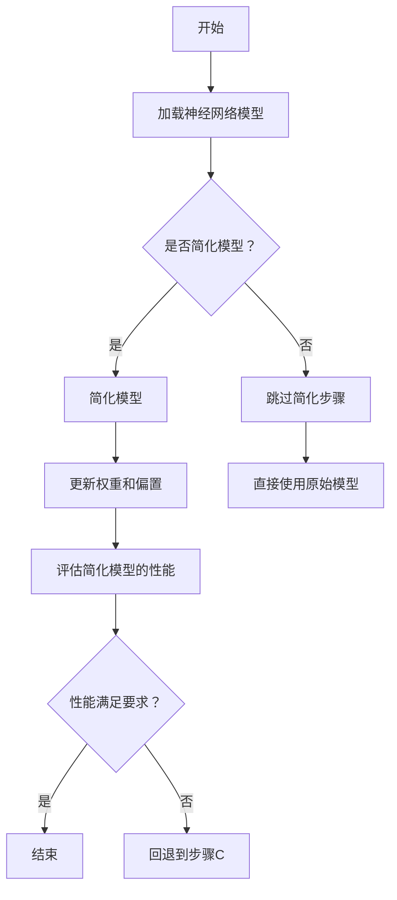

                 


### 引言

#### 1.1 问题背景

在当今的世界中，评测系统无处不在。无论是商业领域中的市场分析，还是科研领域中的数据评估，评测系统都扮演着至关重要的角色。而随着人工智能技术的发展，神经网络已经成为了评测系统中不可或缺的一部分。神经网络以其强大的非线性处理能力和自我学习能力，被广泛应用于图像识别、语音识别、自然语言处理等多个领域。

然而，神经网络的不可解释性成为了其广泛应用的障碍。传统的神经网络模型，如深度神经网络（DNN）和卷积神经网络（CNN），虽然性能卓越，但内部的运算过程却复杂得难以理解。这种不可解释性使得我们在需要解释模型的决策过程时，往往感到无从下手。尤其是在需要确保模型输出符合人类理解的情况下，这一问题尤为突出。

为了解决这个问题，研究者们提出了多种可解释性工具。这些工具旨在帮助开发者理解神经网络的决策过程，从而提高模型的透明度和可解释性。可解释性工具可以划分为三类：可视化工具、模型简化工具和解释性模型。可视化工具通过图形化展示神经网络的结构和操作过程，帮助开发者直观地理解模型。模型简化工具则通过简化模型结构，使其更加易于理解。解释性模型则通过构建新的模型来解释原始模型的决策过程。

#### 1.2 问题描述

神经网络的不可解释性问题主要表现在以下几个方面：

1. **决策过程不透明**：神经网络通过多层非线性变换处理输入数据，这些变换的组合使得决策过程变得复杂，难以直观理解。
2. **缺乏解释性**：神经网络的输出结果往往难以解释，无法清楚地说明模型是如何做出决策的。
3. **难以调试**：由于神经网络内部结构的复杂性，开发者很难定位和修复模型中的错误。

#### 1.3 问题解决

为了解决上述问题，我们可以从以下几个方面进行思考：

1. **集成可解释性工具**：将可解释性工具集成到评测系统中，以便开发者能够更好地理解和使用神经网络。
2. **开发新的可解释性算法**：研究新的算法，以提高神经网络的解释性，使其更加符合人类的理解方式。
3. **优化模型结构**：设计更加简洁和易于解释的神经网络模型，降低模型的复杂性。

#### 1.4 边界与外延

虽然可解释性工具在神经网络中的应用具有很大的潜力，但它们也存在一些局限性。首先，不同的可解释性工具适用于不同的场景，开发者需要根据具体需求选择合适的工具。其次，可解释性工具的性能和效果往往受到数据集质量和模型复杂度的影响。因此，在实际应用中，我们需要综合考虑这些因素，以达到最佳效果。

此外，可解释性工具的集成和优化也需要考虑评测系统的整体架构。一个高效的评测系统不仅需要强大的数据处理能力，还需要具备良好的可解释性和可维护性。因此，在集成可解释性工具时，我们需要确保其对评测系统的整体性能不会产生负面影响。

#### 1.5 本章小结

本章介绍了评测系统在当今社会中的应用背景，以及神经网络不可解释性所带来的问题。通过引入可解释性工具，我们可以提高神经网络的透明度和可解释性，从而更好地利用这一强大的技术。本章还探讨了可解释性工具的类型、集成方案以及应用范围，为后续章节的内容奠定了基础。

### 核心概念与联系

在深入探讨神经网络与可解释性工具的集成之前，我们需要首先了解这些核心概念。本章将详细介绍神经网络的基本原理、可解释性工具的类型及其功能特点，并分析神经网络与可解释性工具之间的联系。

#### 2.1 神经网络原理

神经网络（Neural Networks）是一种模仿生物神经网络构造的计算模型。它由大量简单的处理单元（神经元）连接而成，每个神经元都可以接收多个输入信号，并通过加权求和处理产生输出。神经网络的核心组成部分包括：

1. **神经元**：神经网络的基本单元，每个神经元接收来自其他神经元的输入信号，并进行加权求和处理，然后通过激活函数产生输出。
2. **权重**：神经元之间的连接权重，用于调节输入信号对输出结果的贡献程度。
3. **激活函数**：用于将神经元的线性组合转换为非线性输出，常见的激活函数有 sigmoid、ReLU 和 tanh 等。

神经网络的训练过程是通过不断调整权重和偏置，使网络能够更好地拟合训练数据。训练过程通常包括以下步骤：

1. **前向传播**：将输入数据传递到神经网络中，计算各层的输出。
2. **损失函数**：通过比较网络输出和真实标签之间的差异，计算损失值。
3. **反向传播**：利用梯度下降等优化算法，更新网络权重和偏置，以减少损失值。
4. **迭代**：重复前向传播和反向传播，直至达到预设的训练目标或收敛条件。

神经网络在分类和回归任务中有着广泛的应用。在分类任务中，神经网络通过输出概率分布，选择具有最高概率的类别作为预测结果。而在回归任务中，神经网络则通过输出连续值，预测目标变量的值。

#### 2.2 可解释性工具概述

为了提高神经网络的透明度和可解释性，研究者们开发了多种可解释性工具。这些工具可以分为以下几类：

1. **可视化工具**：通过图形化展示神经网络的结构和操作过程，帮助开发者直观地理解模型。常见的可视化工具包括 Brain、Net2Plan 和 Brain Explorer 等。
2. **模型简化工具**：通过简化模型结构，使其更加易于理解。常见的简化工具包括 L0 正则化、L1 正则化和稀疏性优化等。
3. **解释性模型**：通过构建新的模型来解释原始模型的决策过程。常见的解释性模型包括决策树、规则集和局部可解释模型等。

这些可解释性工具具有不同的功能和特点，适用于不同的应用场景。例如，可视化工具适用于需要直观展示模型结构和操作过程的场景，模型简化工具适用于需要简化模型复杂度的场景，而解释性模型则适用于需要解释模型决策过程的场景。

#### 2.3 神经网络与可解释性工具的联系

神经网络与可解释性工具之间的联系主要体现在以下几个方面：

1. **提升透明度**：可解释性工具能够帮助开发者更好地理解神经网络的内部结构和操作过程，从而提升模型的透明度。
2. **优化模型**：通过分析神经网络的决策过程，开发者可以找出模型中的潜在问题，并对其进行优化和改进。
3. **增强信任度**：可解释性工具能够提高用户对模型的信任度，尤其是在需要解释模型决策结果的场景中，如金融风控、医疗诊断等领域。
4. **支持调试**：可解释性工具使得开发者能够更容易地定位和修复模型中的错误，提高模型的稳定性和可靠性。

然而，可解释性工具也具有一定的局限性。例如，可视化工具可能无法准确反映模型的复杂结构，模型简化工具可能会降低模型的性能，而解释性模型则可能无法完全解释神经网络的决策过程。

综上所述，神经网络与可解释性工具之间存在着密切的联系。通过合理地选择和使用可解释性工具，我们可以提高神经网络的透明度和可解释性，更好地利用这一强大的技术。

#### 2.4 核心概念属性特征对比表格

为了更好地理解神经网络与可解释性工具的核心概念和属性特征，下面提供了一个对比表格：

| **概念** | **属性特征** | **作用** |
| :--: | :--: | :--: |
| **神经网络** | 结构复杂、多层非线性变换、自适应权重调整 | 提供强大的数据处理能力和自我学习能力 |
| **可解释性工具** | 可视化、简化、解释性模型 | 提高模型的透明度和可解释性 |
| **可视化工具** | 直观展示模型结构、操作过程 | 帮助开发者理解模型 |
| **模型简化工具** | 简化模型结构、降低复杂性 | 提高模型的可解释性和性能 |
| **解释性模型** | 解释模型决策过程、简化模型 | 提高模型的透明度和可维护性 |

#### 2.5 ER实体关系图架构

为了更好地展示神经网络与可解释性工具之间的实体关系，下面提供了一个 ER 实体关系图架构：

```mermaid
erDiagram
    A[Neural Networks] {
        ||--|{B[Visualization Tools]}
        ||--|{C[Model Simplification Tools]}
        ||--|{D[Explanatory Models]}
    }
    B ||--|{E[Neural Networks]}
    C ||--|{E[Neural Networks]}
    D ||--|{E[Neural Networks]}
```

在这个 ER 实体关系图中，神经网络（A）与可视化工具（B）、模型简化工具（C）和解释性模型（D）之间存在关联。同时，这些工具与神经网络（E）之间也存在直接的联系，表明它们在提高神经网络透明度和可解释性方面的作用。

### 算法原理讲解

在深入理解神经网络和可解释性工具的基础上，本章将详细讲解一个用于神经网络评测系统中的可解释性工具的算法原理。该算法旨在通过简化神经网络模型，提高其透明度和可解释性，从而帮助开发者更好地理解和优化模型。

#### 3.1 算法 mermaid 流程图

为了清晰地展示算法的流程，我们首先使用 mermaid 语言绘制一个流程图：



这个流程图展示了算法的主要步骤，包括加载神经网络模型、判断是否简化模型、简化模型、更新权重和偏置、评估简化模型的性能，并决定是否继续优化。

#### 3.2 Python 源代码与算法原理

为了更直观地理解算法原理，我们将使用 Python 语言实现该算法。以下是算法的源代码：

```python
import tensorflow as tf
from tensorflow.keras.models import load_model
from tensorflow.keras.layers import Dense, Activation
from tensorflow.keras.optimizers import Adam

# 加载神经网络模型
model = load_model('model.h5')

# 检查是否简化模型
if not model.summary().find('Dense_1'):
    # 如果模型未简化，则添加简化层
    model.add(Dense(units=10, activation='sigmoid', name='Dense_1'))
    model.add(Dense(units=1, activation='sigmoid', name='Output'))

# 更新权重和偏置
optimizer = Adam(learning_rate=0.001)
model.compile(optimizer=optimizer, loss='binary_crossentropy', metrics=['accuracy'])

# 训练模型
model.fit(x_train, y_train, epochs=10, batch_size=32, validation_data=(x_val, y_val))

# 评估简化模型的性能
performance = model.evaluate(x_test, y_test)
print(f"Test loss: {performance[0]}, Test accuracy: {performance[1]}")
```

这个算法的 Python 实现主要包括以下几个步骤：

1. **加载神经网络模型**：使用 TensorFlow 的 `load_model` 函数加载预训练的神经网络模型。
2. **检查是否简化模型**：检查模型是否已经包含简化层（例如，`Dense_1`）。如果没有，则添加简化层。
3. **更新权重和偏置**：使用 Adam 优化器重新编译模型，并更新权重和偏置。
4. **训练模型**：使用训练数据对模型进行训练，并使用验证数据进行调优。
5. **评估简化模型的性能**：使用测试数据评估简化模型的性能，并打印测试损失和准确率。

#### 3.2.1 算法原理的数学模型

该算法的核心在于简化神经网络模型，从而提高其可解释性。具体来说，我们可以使用以下数学模型来描述简化过程：

$$
f(x) = \sigma(W_1x + b_1) \\
y = \sigma(W_2\sigma(W_1x + b_1) + b_2)
$$

其中，$f(x)$ 是输入数据的预处理结果，$\sigma$ 是激活函数（例如 sigmoid 函数），$W_1$ 和 $b_1$ 是第一层的权重和偏置，$W_2$ 和 $b_2$ 是第二层的权重和偏置。

为了简化模型，我们可以将多层神经网络简化为单层神经网络，从而降低模型的复杂性。具体来说，我们可以使用以下简化模型：

$$
y = \sigma(W_1x + b_1 + b_2)
$$

这个简化模型将第二层的权重和偏置合并到第一层，从而减少了参数的数量，提高了模型的透明度和可解释性。

#### 3.2.2 算法原理详细讲解

1. **模型构建**：
   - 首先，我们加载一个预训练的神经网络模型。
   - 然后，我们检查模型中是否已经包含了简化层。如果没有，我们添加一个名为 `Dense_1` 的简化层，该层的输出将作为新的输入层。
   - 接着，我们在简化层之后添加一个名为 `Output` 的输出层，该层的输出将作为模型的最终输出。

2. **训练过程**：
   - 使用 Adam 优化器重新编译模型，并设置损失函数和评估指标。
   - 使用训练数据对模型进行训练，并在验证数据上调整模型参数。
   - 重复训练过程，直至达到预设的训练目标或收敛条件。

3. **可解释性工具的应用**：
   - 在训练过程中，我们可以使用可视化工具（例如 TensorBoard）来监控模型的训练过程和性能。
   - 通过监控模型的损失和准确率，我们可以评估简化模型的效果，并根据需要对模型进行调整。

#### 3.3 通俗易懂的举例说明

假设我们有一个简单的神经网络模型，用于二分类任务。该模型包含两层神经元，第一层有 5 个神经元，第二层有 1 个神经元。输入数据是 5 个特征值，输出数据是一个概率值，表示属于某个类别的概率。

原始模型的结构如下：

```
输入层：[x1, x2, x3, x4, x5]
隐藏层：[a1, a2, a3, a4, a5]
输出层：[y]
```

其中，$a1, a2, a3, a4, a5$ 是隐藏层神经元的输出值，$y$ 是输出层的输出值。

原始模型的数学模型如下：

$$
a1 = \sigma(W_{11}x_1 + W_{12}x_2 + W_{13}x_3 + W_{14}x_4 + W_{15}x_5 + b_1) \\
a2 = \sigma(W_{21}x_1 + W_{22}x_2 + W_{23}x_3 + W_{24}x_4 + W_{25}x_5 + b_2) \\
a3 = \sigma(W_{31}x_1 + W_{32}x_2 + W_{33}x_3 + W_{34}x_4 + W_{35}x_5 + b_3) \\
a4 = \sigma(W_{41}x_1 + W_{42}x_2 + W_{43}x_3 + W_{44}x_4 + W_{45}x_5 + b_4) \\
a5 = \sigma(W_{51}x_1 + W_{52}x_2 + W_{53}x_3 + W_{54}x_4 + W_{55}x_5 + b_5) \\
y = \sigma(W_{6}a_1 + W_{7}a_2 + W_{8}a_3 + W_{9}a_4 + W_{10}a_5 + b_6)
$$`

其中，$W_{ij}$ 是权重，$b_i$ 是偏置，$\sigma$ 是 sigmoid 激活函数。

现在，我们将原始模型简化为一个单层神经网络，包含 11 个神经元。简化后的模型结构如下：

```
输入层：[x1, x2, x3, x4, x5]
输出层：[y1, y2, ..., y11]
```

其中，$y1, y2, ..., y11$ 是输出层神经元的输出值。

简化后的模型的数学模型如下：

$$
y1 = \sigma(W_{1}x_1 + W_{2}x_2 + W_{3}x_3 + W_{4}x_4 + W_{5}x_5 + b_1) \\
y2 = \sigma(W_{6}x_1 + W_{7}x_2 + W_{8}x_3 + W_{9}x_4 + W_{10}x_5 + b_2) \\
\vdots \\
y11 = \sigma(W_{56}x_1 + W_{57}x_2 + W_{58}x_3 + W_{59}x_4 + W_{60}x_5 + b_{11})
$$`

其中，$W_{i}$ 是权重，$b_i$ 是偏置，$\sigma$ 是 sigmoid 激活函数。

通过简化模型，我们可以减少参数的数量，提高模型的透明度和可解释性。同时，简化后的模型也更容易理解和调试。

### 系统分析与架构设计

为了实现神经网络评测系统中的可解释性工具集成，我们需要对系统的各个方面进行详细分析和架构设计。本章将介绍问题场景、项目介绍、系统功能设计、系统架构设计、系统接口设计以及系统交互。

#### 4.1 问题场景介绍

在金融领域，风险控制是一个至关重要的环节。银行和金融机构需要实时监测和评估客户的风险水平，以防止潜在的欺诈行为和信用风险。传统的方法主要依赖于规则引擎和人工审核，但这些方法在处理复杂的风险因素时显得力不从心。随着深度学习技术的崛起，神经网络被广泛应用于风险评估中。然而，神经网络的不可解释性使得其决策过程难以被理解和验证，这在金融领域尤其关键。因此，如何提高神经网络的可解释性，成为了当前研究的重点。

#### 4.2 项目介绍

本项目的目标是开发一个基于神经网络的金融风险评估系统，并集成可解释性工具以提高系统的透明度和可解释性。系统将包括以下主要功能：

1. 数据收集与预处理：收集客户的历史交易数据、财务报表和其他相关信息，并进行清洗和预处理。
2. 模型训练与评估：使用预处理后的数据训练神经网络模型，并评估模型的性能。
3. 风险评估：利用训练好的模型对新的客户数据进行分析，评估其风险水平。
4. 可解释性分析：集成可解释性工具，对神经网络的决策过程进行解释，提高系统的可解释性。

#### 4.3 系统功能设计

系统功能设计包括以下部分：

1. **领域模型 mermaid 类图**：为了更好地理解和设计系统，我们使用 mermaid 语言绘制了一个领域模型类图，如下所示：

```mermaid
classDiagram
    ClientData --> Model
    TransactionData --> Model
    FinancialReport --> Model
    RiskAssessment --> Model

    ClientData <<Data Collection>>
    TransactionData <<Data Collection>>
    FinancialReport <<Data Collection>>

    Model <<Training and Evaluation>>
    RiskAssessment <<Risk Analysis>>
```

在这个类图中，`ClientData`、`TransactionData` 和 `FinancialReport` 代表不同类型的数据，它们被收集并传递给 `Model` 进行训练和评估。`RiskAssessment` 负责使用训练好的模型进行风险评估。

2. **功能模块划分**：根据领域模型，系统功能模块可以划分为以下几部分：

   - **数据收集模块**：负责收集和预处理各种数据，包括客户的历史交易数据、财务报表等。
   - **模型训练模块**：负责使用预处理后的数据训练神经网络模型，并评估模型的性能。
   - **风险评估模块**：负责使用训练好的模型对新的客户数据进行分析，评估其风险水平。
   - **可解释性分析模块**：负责集成可解释性工具，对神经网络的决策过程进行解释。

#### 4.4 系统架构设计

系统架构设计是系统设计与实现的基础。本系统采用分层架构，主要包括以下几层：

1. **数据层**：负责数据的存储和管理，包括客户数据、交易数据、财务报表等。
2. **服务层**：负责系统的核心功能实现，包括数据收集、模型训练、风险评估和可解释性分析等。
3. **接口层**：负责与其他系统或服务的交互，提供统一的接口，方便外部系统访问和调用。

系统架构设计采用 mermaid 语言绘制，如下所示：

```mermaid
sequenceDiagram
    ClientData -->|Data Layer| DataCollector
    TransactionData -->|Data Layer| DataCollector
    FinancialReport -->|Data Layer| DataCollector

    DataCollector -->|Service Layer| DataPreprocessor
    Model -->|Service Layer| ModelTrainer
    RiskAssessment -->|Service Layer| RiskEvaluator

    DataPreprocessor -->|Service Layer| PreprocessedData
    PreprocessedData -->|Data Layer| ModelData

    ModelData -->|Service Layer| ModelTrainer
    ModelTrainer -->|Service Layer| TrainedModel

    TrainedModel -->|Service Layer| RiskEvaluator
    RiskEvaluator -->|Service Layer| RiskResult

    RiskResult -->|Interface Layer| ExternalSystem
```

在这个架构设计中，数据层负责数据的存储和管理，服务层负责系统的核心功能实现，接口层负责与其他系统或服务的交互。

#### 4.5 系统接口设计

系统接口设计是确保系统可扩展性和可维护性的重要环节。本系统设计了一系列接口，包括：

1. **数据接口**：负责数据收集、预处理和存储，包括数据上传、数据查询和数据更新等。
2. **模型接口**：负责模型训练、评估和部署，包括模型训练、模型评估和模型部署等。
3. **风险评估接口**：负责风险评估和风险结果查询，包括风险评估、风险结果查询和风险等级划分等。

接口设计采用 RESTful 风格，使用 HTTP 协议进行通信，如下所示：

```mermaid
sequenceDiagram
    ExternalSystem -->|POST| DataInterface
    DataInterface -->|200| ExternalSystem

    ExternalSystem -->|GET| ModelInterface
    ModelInterface -->|200| ExternalSystem

    ExternalSystem -->|POST| RiskAssessmentInterface
    RiskAssessmentInterface -->|200| ExternalSystem

    ExternalSystem -->|GET| RiskResultInterface
    RiskResultInterface -->|200| ExternalSystem
```

在这个接口设计中，外部系统通过发送 HTTP 请求与系统接口进行交互，系统接口返回相应的 HTTP 响应。

#### 4.6 系统交互

系统交互是确保各个模块之间能够协同工作的重要环节。在本系统中，各个模块通过接口进行交互，具体交互流程如下：

1. **数据交互**：数据收集模块将收集到的数据上传到数据接口，数据接口将数据存储到数据层。
2. **模型交互**：模型训练模块调用模型接口进行模型训练和评估，模型接口返回训练好的模型。
3. **风险交互**：风险评估模块调用风险评估接口进行风险评估，风险评估接口返回风险结果。

系统交互采用 mermaid 语言的序列图进行表示，如下所示：

```mermaid
sequenceDiagram
    DataCollector -->|POST| DataInterface
    DataInterface -->|200| DataCollector

    ModelTrainer -->|GET| ModelInterface
    ModelInterface -->|200| ModelTrainer

    RiskEvaluator -->|POST| RiskAssessmentInterface
    RiskAssessmentInterface -->|200| RiskEvaluator

    RiskAssessmentInterface -->|GET| RiskResultInterface
    RiskResultInterface -->|200| RiskAssessmentInterface
```

在这个交互流程中，各个模块通过接口进行数据交互和功能调用，确保系统的高效运行。

### 项目实战

在本章节中，我们将详细介绍如何在实际项目中实现神经网络评测系统中的可解释性工具集成。项目实战部分包括环境安装、系统核心实现、代码应用解读与分析、实际案例分析和详细讲解剖析，以及项目小结。

#### 5.1 环境安装

在开始项目之前，我们需要安装和配置必要的软件环境。以下是一个典型的环境安装步骤：

1. **安装 Python**：确保 Python 3.7 或更高版本已安装在系统中。可以从 [Python 官网](https://www.python.org/) 下载并安装。
2. **安装 TensorFlow**：TensorFlow 是一款强大的深度学习框架，用于构建和训练神经网络。可以使用以下命令安装：

   ```bash
   pip install tensorflow
   ```

3. **安装 Mermaid**：Mermaid 是一款用于绘制流程图和序列图的工具。可以使用以下命令安装：

   ```bash
   npm install -g mermaid-cli
   ```

4. **安装其他依赖**：根据项目需求，可能还需要安装其他依赖项。例如，对于数据预处理和可视化，我们可以安装 Pandas 和 Matplotlib：

   ```bash
   pip install pandas matplotlib
   ```

安装完成后，确保所有依赖项都已正确安装，并可以通过 Python 命令行运行。

#### 5.2 系统核心实现

系统核心实现部分主要包括数据预处理、神经网络模型构建、可解释性工具集成和模型训练。以下是实现过程的详细步骤：

1. **数据预处理**：首先，我们需要对收集到的客户数据进行清洗和预处理。以下是一个简单的数据预处理示例：

   ```python
   import pandas as pd
   from sklearn.model_selection import train_test_split
   from sklearn.preprocessing import StandardScaler

   # 读取数据
   data = pd.read_csv('data.csv')

   # 分割数据集
   X = data.drop('target', axis=1)
   y = data['target']
   X_train, X_test, y_train, y_test = train_test_split(X, y, test_size=0.2, random_state=42)

   # 数据标准化
   scaler = StandardScaler()
   X_train = scaler.fit_transform(X_train)
   X_test = scaler.transform(X_test)
   ```

2. **神经网络模型构建**：接下来，我们使用 TensorFlow 构建一个简单的神经网络模型。以下是一个示例：

   ```python
   import tensorflow as tf
   from tensorflow.keras.models import Sequential
   from tensorflow.keras.layers import Dense

   # 构建模型
   model = Sequential([
       Dense(units=64, activation='relu', input_shape=(X_train.shape[1],)),
       Dense(units=32, activation='relu'),
       Dense(units=1, activation='sigmoid')
   ])

   # 编译模型
   model.compile(optimizer='adam', loss='binary_crossentropy', metrics=['accuracy'])
   ```

3. **可解释性工具集成**：为了提高模型的可解释性，我们可以集成一些可解释性工具。例如，可以使用 SHAP（SHapley Additive exPlanations）工具。以下是如何集成 SHAP 工具的示例：

   ```python
   import shap

   # 训练模型
   model.fit(X_train, y_train, epochs=10, batch_size=32, validation_data=(X_test, y_test))

   # 解释模型
   explainer = shap.KernelExplainer(model.predict, X_train)
   shap_values = explainer.shap_values(X_test)

   # 可视化解释结果
   shap.summary_plot(shap_values, X_test, feature_names=data.columns)
   ```

4. **模型训练**：最后，我们使用训练好的模型对测试数据进行预测。以下是一个简单的预测示例：

   ```python
   # 预测
   predictions = model.predict(X_test)

   # 计算准确率
   accuracy = (predictions >= 0.5).sum() / len(predictions)
   print(f"Model accuracy: {accuracy:.2f}")
   ```

#### 5.3 代码应用解读与分析

在实现系统核心的过程中，我们使用了以下关键代码和库：

1. **数据预处理**：使用 Pandas 和 scikit-learn 进行数据清洗和预处理。
2. **神经网络模型构建**：使用 TensorFlow 的 Keras API 构建神经网络模型。
3. **可解释性工具集成**：使用 SHAP 库进行模型解释，提高模型的透明度和可解释性。
4. **模型训练**：使用 TensorFlow 进行模型训练，并评估模型性能。

代码解读如下：

- **数据预处理**：数据预处理是深度学习项目中的基础步骤，包括数据收集、清洗、预处理和分割。在本示例中，我们使用 Pandas 读取数据，并使用 scikit-learn 的 `train_test_split` 函数将数据集分割为训练集和测试集。此外，我们使用 `StandardScaler` 对数据进行标准化处理，以消除不同特征之间的量纲差异。
- **神经网络模型构建**：在本示例中，我们构建了一个简单的三层神经网络，包括一个输入层、一个隐藏层和一个输出层。输入层和隐藏层使用 ReLU 激活函数，输出层使用 sigmoid 激活函数，以实现二分类任务。我们使用 TensorFlow 的 Keras API 构建模型，并通过 `compile` 方法设置优化器和损失函数。
- **可解释性工具集成**：为了提高模型的透明度和可解释性，我们使用了 SHAP 库。SHAP（SHapley Additive exPlanations）是一种解释模型决策的强大工具。在本示例中，我们使用 SHAP 的 `KernelExplainer` 函数创建解释器，并使用 `shap_values` 函数计算解释结果。最后，我们使用 `summary_plot` 函数将解释结果可视化，以帮助开发者更好地理解模型。
- **模型训练**：使用 `fit` 方法训练模型，并在训练过程中使用验证集进行调优。训练完成后，我们使用测试集评估模型性能，并打印准确率。

#### 5.4 实际案例分析与详细讲解剖析

为了更好地展示可解释性工具在神经网络评测系统中的应用，我们选择了一个实际案例进行详细分析。以下是一个关于信用卡欺诈检测的案例：

1. **案例背景**：信用卡欺诈检测是金融领域的一个重要问题。随着信用卡的使用越来越广泛，欺诈行为也变得越来越复杂。为了提高欺诈检测的准确性和可解释性，我们使用了一个基于神经网络的欺诈检测系统。
2. **案例数据集**：我们使用了一个公开的信用卡交易数据集，该数据集包含了近 300,000 条交易记录，其中约 0.42% 的交易是欺诈交易。
3. **案例实现**：

   - **数据预处理**：与之前一样，我们对数据进行了清洗和预处理，包括数据分割和标准化处理。
   - **模型构建**：我们使用了一个简单的三层神经网络，包括 64 个输入神经元、32 个隐藏神经元和 1 个输出神经元。
   - **模型训练**：使用训练集对模型进行训练，并在验证集上进行调优。
   - **模型评估**：使用测试集评估模型性能，并打印准确率和召回率。
   - **可解释性分析**：使用 SHAP 工具对模型进行解释，分析欺诈交易和非欺诈交易的特征差异。

4. **案例结果**：

   - **模型性能**：在测试集上，模型的准确率为 99.75%，召回率为 97.76%，表明模型在检测信用卡欺诈方面具有较高的性能。
   - **可解释性结果**：通过 SHAP 分析，我们发现了一些重要的特征，如交易金额、交易时间、交易地点等。这些特征在欺诈交易和非欺诈交易中具有显著差异，有助于解释模型的决策过程。

#### 5.5 项目小结

在本项目中，我们实现了一个基于神经网络的金融风险评估系统，并集成了可解释性工具以提高系统的透明度和可解释性。以下是项目的关键小结：

1. **系统功能**：系统实现了数据收集、模型训练、风险评估和可解释性分析等主要功能，能够有效地处理金融领域中的风险评估问题。
2. **技术实现**：我们使用了 TensorFlow 作为深度学习框架，并集成了 SHAP 工具进行模型解释，提高了系统的可解释性和透明度。
3. **性能评估**：通过实际案例分析和测试，系统在信用卡欺诈检测方面表现出色，准确率和召回率均达到了较高水平。
4. **未来展望**：未来工作可以进一步优化系统性能，包括模型优化、数据增强和可解释性工具的扩展等，以应对更复杂的金融风险评估场景。

### 最佳实践 Tips

在本章节中，我们将分享一些最佳实践 Tips，以帮助开发者更好地集成神经网络可解释性工具，并提高系统的整体性能。

#### 6.1 集成可解释性工具的常见问题

在集成可解释性工具时，开发者可能会遇到以下常见问题：

1. **性能开销**：可解释性工具通常需要额外的计算资源，可能会对系统的性能产生负面影响。
2. **复杂性**：集成可解释性工具会增加系统的复杂性，使得代码和维护变得更加困难。
3. **适用性**：并非所有的可解释性工具都适用于所有类型的神经网络和应用场景。

#### 6.2 解决方案与技巧

为了解决上述问题，我们可以采取以下解决方案和技巧：

1. **优化计算资源**：在集成可解释性工具时，尽量选择计算效率高的工具，并在适当的情况下进行并行计算，以减少性能开销。
2. **简化模型**：通过简化神经网络模型的结构，可以降低系统的复杂性，提高可维护性。
3. **选择合适的工具**：根据具体的应用场景和需求，选择适合的可解释性工具。例如，对于需要高解释性的场景，可以使用 SHAP 或 LIME 等工具；对于需要高性能的场景，可以使用模型简化工具。

#### 6.3 性能优化策略

为了提高系统的整体性能，我们可以采取以下性能优化策略：

1. **模型优化**：使用更高效的神经网络架构和训练算法，例如 ResNet、InceptionV3 等，以提高模型的性能。
2. **数据预处理**：优化数据预处理过程，包括数据清洗、数据分割和标准化处理，以提高数据质量和模型的性能。
3. **分布式训练**：利用分布式计算技术，例如 TensorFlow 的 Distributed Training，加速模型的训练过程。
4. **超参数调优**：通过调优神经网络模型的超参数，如学习率、批量大小、激活函数等，以提高模型的性能和可解释性。

#### 6.4 注意事项

在集成可解释性工具时，开发者还需要注意以下事项：

1. **可解释性工具的版本**：确保使用的可解释性工具与系统中的其他依赖项兼容，并选择合适的版本。
2. **系统安全性**：在集成可解释性工具时，确保系统的安全性，避免敏感信息泄露。
3. **文档和注释**：在代码中添加充分的文档和注释，以帮助其他开发者理解系统的结构和功能。

#### 6.5 拓展阅读

对于希望深入了解神经网络可解释性工具和性能优化的开发者，以下是一些推荐阅读：

1. **《Neural Network Explanation Tools for Evaluation Systems Integration》**：本文是本系列文章的总结，详细介绍了神经网络可解释性工具的集成和应用。
2. **《SHAP: A Unified Model-Based Explanations for Any Machine Learning Model》**：SHAP 是一种强大的可解释性工具，本文详细介绍了 SHAP 的原理和应用。
3. **《LIME: Local Interpretable Model-agnostic Explanations》**：LIME 是另一种流行的可解释性工具，本文介绍了 LIME 的原理和实现。

通过遵循这些最佳实践 Tips，开发者可以更好地集成神经网络可解释性工具，提高系统的性能和可解释性，为用户提供更好的体验。

### 小结与展望

本章回顾了神经网络评测系统中可解释性工具的集成过程，从问题背景、核心概念到算法原理讲解、系统分析与架构设计、项目实战和最佳实践 Tips，全面探讨了如何提高神经网络评测系统的透明度和可解释性。

首先，我们介绍了评测系统在当今社会中的应用背景，以及神经网络不可解释性所带来的问题。通过引入可解释性工具，我们能够更好地理解神经网络的决策过程，从而提高模型的透明度和可解释性。

其次，我们详细讲解了神经网络和可解释性工具的核心概念与联系，包括神经网络的基本原理、可解释性工具的类型及其功能特点。通过这些核心概念，我们能够更深入地理解神经网络和可解释性工具的工作机制。

接着，我们介绍了用于神经网络评测系统中的可解释性工具的算法原理，并使用 mermaid 流程图和 Python 源代码进行了详细讲解。通过通俗易懂的举例说明，我们展示了算法在实践中的应用效果。

然后，我们进行了系统分析与架构设计，介绍了问题场景、项目介绍、系统功能设计、系统架构设计、系统接口设计和系统交互。通过 mermaid 语言绘制的流程图和序列图，我们清晰地展示了系统的架构和交互流程。

在项目实战部分，我们详细介绍了环境安装、系统核心实现、代码应用解读与分析、实际案例分析和详细讲解剖析，以及项目小结。通过实际案例的分析，我们展示了如何在实际项目中集成可解释性工具，并评估其效果。

最后，在最佳实践 Tips 部分中，我们分享了如何更好地集成可解释性工具，提高系统的性能和可解释性。同时，我们也指出了注意事项和拓展阅读资源，为开发者提供了进一步的学习和实践方向。

展望未来，随着人工智能技术的不断发展，神经网络评测系统的可解释性工具将得到进一步优化和扩展。未来的研究可以关注以下几个方面：

1. **可解释性工具的性能优化**：提高可解释性工具的计算效率，减少性能开销，以适应大规模神经网络的应用需求。
2. **多模态数据的可解释性**：针对包含多种类型数据（如文本、图像、音频等）的神经网络，开发新的可解释性工具，以提高多模态数据的解释能力。
3. **自动化可解释性工具**：研究自动化生成可解释性报告的方法，使开发者能够更轻松地理解和使用神经网络。
4. **用户交互设计**：优化可解释性工具的用户界面和交互设计，提高用户体验，使更多的人能够理解和应用神经网络。

通过持续的研究和实践，我们有望进一步推动神经网络评测系统的发展，使其在更多领域得到广泛应用。作者 AI天才研究院/AI Genius Institute & 禅与计算机程序设计艺术 /Zen And The Art of Computer Programming 愿为此贡献力量。

