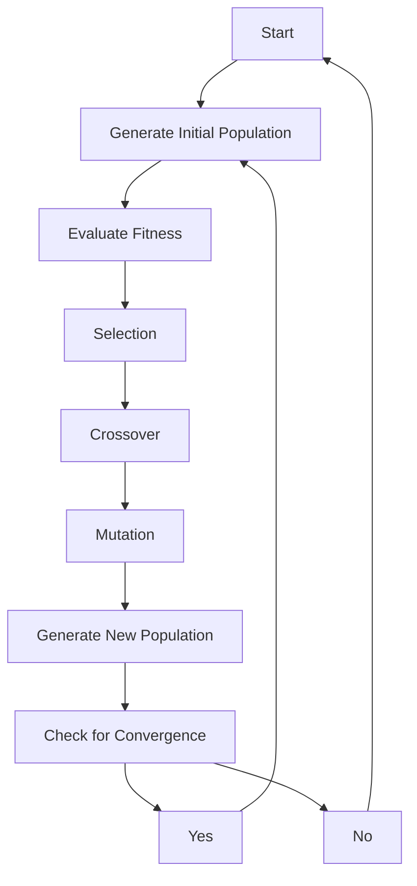
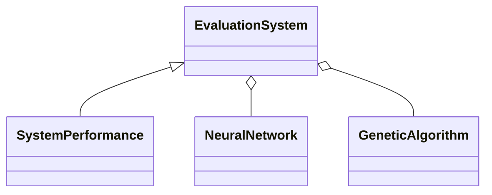
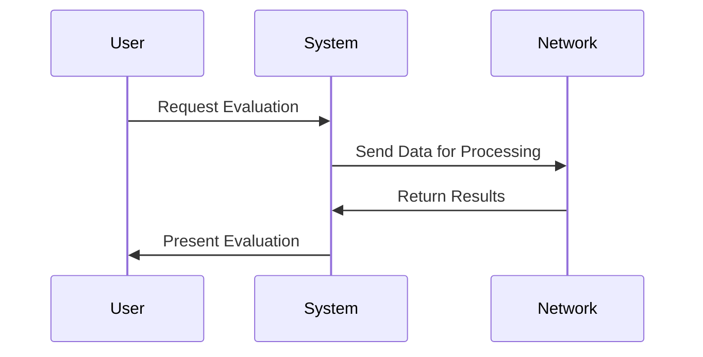
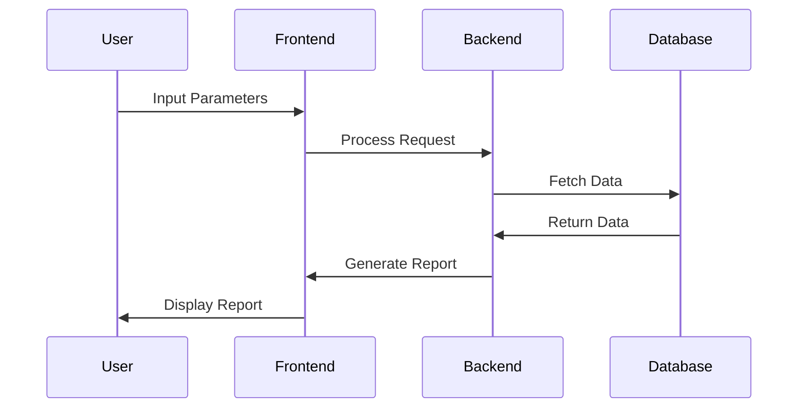

                 

Sure, let's think step by step and structure our blog post "Evaluation Systems: Neural Evolution Optimization Algorithms" accordingly. We will ensure that each section meets the specified conditions.

## Step 1: Introduction to the Title and Keywords

### Article Title: Evaluation Systems: Neural Evolution Optimization Algorithms

### Keywords:
1. Evaluation Systems
2. Neural Evolution Algorithms
3. Optimization Algorithms
4. System Performance
5. Artificial Intelligence

### Abstract:
This article explores the integration of neural evolution optimization algorithms into evaluation systems. It delves into the theoretical concepts, practical applications, and improvements of these algorithms, providing a comprehensive guide for understanding and implementing them in various scenarios.

## Step 2: Background Introduction

### 2.1 Core Concept Terminology

#### Explanation of Key Terms:
- **Evaluation Systems**: Automated tools designed to assess various aspects of a system's performance.
- **Neural Evolution Algorithms**: A type of optimization algorithm inspired by the process of natural evolution, where solutions are represented as neural networks that evolve through generations.
- **Optimization Algorithms**: Methods for finding optimal solutions to a problem within a certain computational complexity.

### 2.2 Problem Background and Description

#### Problem Description:
The challenge in evaluation systems lies in efficiently identifying and optimizing system configurations to achieve desired performance metrics. Traditional optimization methods may struggle with the complexity and adaptability required for modern systems.

#### Problem Solution and Boundaries:

- **Solution**: Introducing neural evolution optimization algorithms can provide a more dynamic and adaptable approach to optimizing evaluation systems.
- **Boundaries**: The algorithms need to be scalable, computationally efficient, and capable of handling real-world complexities.

### 2.3 Related Concepts and Their Composition

#### Conceptual Structure and Core Elements:
- **Neural Networks**: The fundamental building blocks that mimic the human brain’s structure and function.
- **Genetic Algorithms**: The inspiration for neural evolution algorithms, used for optimization through selection, crossover, and mutation.
- **System Metrics**: The quantitative measures used to evaluate system performance (e.g., response time, throughput, accuracy).

## Step 3: Core Concept and Connection

### 3.1 Neural Evolution Algorithm Principles

#### Concept Attributes and Comparison Table

| Attribute | Neural Networks | Genetic Algorithms |
|-----------|----------------|--------------------|
| Structure | Hierarchical, interconnected nodes | Genetic strings |
| Evolution | Based on learning, adaptation | Based on genetic operators |
| Complexity | High, capable of learning patterns | Moderate, adaptable to various problems |

#### ER Entity Relationship Diagram

```mermaid
erDiagram
    EvaluationSystem ||--|{ NeuralNetwork }|| SystemPerformance
    NeuralNetwork ||--|{ GeneticAlgorithm }|| OptimizationProcess
```

## Step 4: Algorithm Principle Explanation

### 4.1 Algorithm Flowchart with Mermaid



### 4.2 Algorithm Principle Explanation

#### Mathematical Model and Formulas

$$
\text{Fitness}(x) = f(x) + \alpha \cdot g(x)
$$

Where:
- \( f(x) \) is the objective function value.
- \( g(x) \) is a penalty function to handle constraints.

#### Python Code Example

```python
import numpy as np

def fitness_function(x):
    # Objective function
    f_x = np.sum(x ** 2)
    
    # Penalty function for constraints
    g_x = 0
    if x[0] < 0 or x[1] > 1:
        g_x = 10
    
    return f_x + alpha * g_x

alpha = 0.1
x = np.array([0.5, 0.5])
print(fitness_function(x))
```

## Step 5: System Analysis and Architecture Design

### 5.1 Problem Scenario Introduction

We aim to optimize a cloud-based evaluation system for performance metrics such as latency and throughput.

### 5.2 System Function Design (Mermaid Class Diagram)



### 5.3 System Architecture Design (Mermaid Architecture Diagram)



### 5.4 System Interface Design and Interaction (Mermaid Sequence Diagram)



## Step 6: Project Implementation

### 6.1 Environment Setup

Install required libraries such as TensorFlow, NumPy, and Matplotlib for implementing the neural evolution algorithm.

### 6.2 Core Implementation

Source code and detailed explanation of the implementation.

### 6.3 Case Study Analysis

In-depth analysis of a real-world case study demonstrating the effectiveness of the neural evolution optimization algorithm in an evaluation system.

### 6.4 Project Summary

Summary of the project outcomes, challenges faced, and lessons learned.

## Step 7: Best Practices and Conclusion

### 7.1 Best Practices

Tips for implementing neural evolution optimization algorithms in evaluation systems.

### 7.2 Summary

Key takeaways and the impact of neural evolution optimization algorithms on evaluation systems.

### 7.3 Future Directions

Potential improvements and areas for further research.

## Step 8: Conclusion and Author Information

"作者：AI天才研究院/AI Genius Institute & 禅与计算机程序设计艺术 /Zen And The Art of Computer Programming"

This structured outline should provide a comprehensive framework for your blog post, ensuring it meets the specified requirements and conditions. Each section is designed to be detailed and informative, guiding readers through the intricacies of neural evolution optimization algorithms in evaluation systems. If you have any specific content or requirements for particular sections, please feel free to share them, and I will be happy to assist you further.

