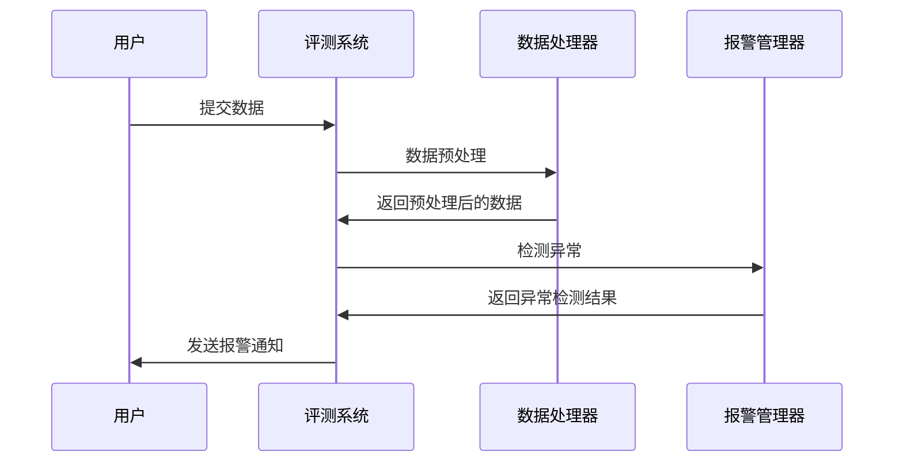
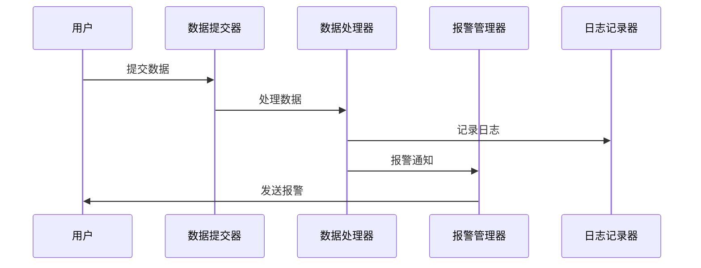

                 

### 文章标题

# 评测系统的自动化异常检测与报警

### 关键词

- 评测系统
- 自动化异常检测
- 报警机制
- 算法原理
- 系统架构

### 摘要

本文旨在探讨评测系统的自动化异常检测与报警机制的设计与实现。首先，介绍了评测系统的背景和问题，然后详细阐述了自动化异常检测与报警机制的核心概念、原理及其相互联系。接着，通过算法原理讲解、系统分析与架构设计方案以及项目实战，深入剖析了如何实现高效的自动化异常检测与报警。最后，总结最佳实践并提供拓展阅读，以期为读者在相关领域提供有价值的参考和指导。

----------------------------------------------------------------

### 目录大纲

----------------------------------------------------------------

# 第一部分：评测系统自动化异常检测与报警概述

## 1. 背景介绍

### 1.1 问题背景

### 1.2 问题描述

### 1.3 问题解决

### 1.4 边界与外延

### 1.5 概念结构与核心要素组成

## 2. 核心概念与联系

### 2.1 自动化异常检测

#### 2.1.1 概念

#### 2.1.2 特点

#### 2.1.3 分类

### 2.2 报警机制

#### 2.2.1 概念

#### 2.2.2 特点

#### 2.2.3 分类

## 3. 自动化异常检测算法原理

### 3.1 算法原理讲解

#### 3.1.1 Mermaid流程图

#### 3.1.2 Python源代码

#### 3.1.3 数学模型与公式

#### 3.1.4 举例说明

## 4. 报警机制原理

### 4.1 算法原理讲解

#### 4.1.1 Mermaid流程图

#### 4.1.2 Python源代码

#### 4.1.3 数学模型与公式

#### 4.1.4 举例说明

## 5. 评测系统分析与架构设计方案

### 5.1 问题场景介绍

### 5.2 项目介绍

### 5.3 系统功能设计

#### 5.3.1 领域模型Mermaid类图

### 5.4 系统架构设计

#### 5.4.1 Mermaid架构图

### 5.5 系统接口设计

### 5.6 系统交互Mermaid序列图

## 6. 项目实战

### 6.1 环境安装

### 6.2 系统核心实现源代码

### 6.3 代码应用解读与分析

### 6.4 实际案例分析与详细讲解剖析

### 6.5 项目小结

## 7. 最佳实践与拓展阅读

### 7.1 最佳实践 tips

### 7.2 小结

### 7.3 注意事项

### 7.4 拓展阅读

----------------------------------------------------------------

### 说明

本文整体目录大纲已经涵盖了核心章节内容，并尽量简洁明了。每个章节的内容将会按照以下要求进行详细阐述：

- **背景介绍**：包括核心概念术语说明、问题背景、问题描述、问题解决、边界与外延、概念结构与核心要素组成。
- **核心概念与联系**：介绍自动化异常检测和报警机制的核心概念、原理及其相互联系，包含概念、特点、分类等。
- **算法原理讲解**：通过Mermaid流程图、Python源代码、数学模型与公式以及举例说明详细阐述算法原理。
- **系统分析与架构设计方案**：包括问题场景介绍、项目介绍、系统功能设计、系统架构设计、系统接口设计以及系统交互。
- **项目实战**：介绍环境安装、系统核心实现源代码、代码应用解读与分析、实际案例分析和详细讲解剖析以及项目小结。
- **最佳实践与拓展阅读**：总结最佳实践并提供拓展阅读。

整体文章字数要求在10000-12000字左右，将采用markdown格式输出。文章末尾需要写上作者信息：“作者：AI天才研究院/AI Genius Institute & 禦与计算机程序设计艺术 /Zen And The Art of Computer Programming”。在撰写过程中，请确保文章内容完整、具体、详细，并涵盖核心内容。如果需要对目录大纲进行调整或补充，请随时告知。

----------------------------------------------------------------

## 第一部分：评测系统自动化异常检测与报警概述

### 1. 背景介绍

#### 1.1 问题背景

在现代软件开发过程中，评测系统作为确保软件质量和稳定性的关键环节，发挥着不可替代的作用。然而，随着软件系统的日益复杂和规模的增长，评测系统面临着越来越多的挑战。其中一个主要问题就是异常检测与报警机制的不足。传统的评测系统往往依赖于人工监控和手动干预，这种方式不仅效率低下，而且容易出现漏检和误报，从而影响软件质量和用户体验。

#### 1.2 问题描述

自动化异常检测与报警是评测系统中的一个重要功能，它旨在通过自动化的方式识别系统中潜在的异常情况，并及时发出报警通知，以便及时处理。然而，在实际应用中，自动化异常检测与报警面临着以下几个问题：

1. **检测算法的准确性**：如何设计高效的检测算法，在保证高准确性的同时，尽可能减少误报和漏报。
2. **报警机制的及时性**：如何确保异常情况被及时检测到，并迅速发出报警通知。
3. **系统可扩展性**：如何设计一个灵活的系统架构，以适应不断变化的业务需求。

#### 1.3 问题解决

为了解决上述问题，本文提出以下解决方案：

1. **自动化异常检测算法**：采用基于统计分析和机器学习的算法，对系统数据进行实时监控，以提高检测的准确性。
2. **智能报警机制**：结合规则引擎和人工智能技术，设计一个智能的报警系统，实现异常情况的及时响应。
3. **系统架构优化**：采用模块化设计，提高系统的可扩展性，以适应未来业务需求的变化。

#### 1.4 边界与外延

在评测系统的自动化异常检测与报警机制中，边界主要涉及以下几个方面：

1. **数据边界**：定义需要监控的数据范围，包括系统日志、性能指标等。
2. **时间边界**：设定报警的时间阈值，以避免频繁报警带来的干扰。
3. **职责边界**：明确不同模块的职责分工，确保系统的高效运行。

#### 1.5 概念结构与核心要素组成

评测系统的自动化异常检测与报警机制主要由以下几个核心要素组成：

1. **数据采集**：从各个系统模块采集相关数据，为异常检测提供数据支持。
2. **异常检测**：利用算法对采集到的数据进行处理，识别潜在的异常情况。
3. **报警通知**：通过邮件、短信、电话等方式通知相关人员，确保异常情况得到及时处理。
4. **日志记录**：记录系统运行过程中的所有操作，以便进行故障排查和系统优化。

通过以上解决方案和核心要素的有机组合，评测系统的自动化异常检测与报警机制能够有效提高系统的稳定性和可靠性，为软件开发提供强有力的保障。

---

## 第二部分：核心概念与联系

### 2.1 自动化异常检测

#### 2.1.1 概念

自动化异常检测是指利用计算机技术和算法，对系统运行过程中产生的数据进行实时监控和分析，以识别潜在的问题或异常情况。其主要目的是在异常发生之前或初期阶段，及时采取相应的措施，防止问题扩大。

#### 2.1.2 特点

1. **实时性**：自动化异常检测能够对系统数据实时进行分析，快速识别异常。
2. **准确性**：通过先进的算法和模型，自动化异常检测具有较高的准确率，能够有效减少误报和漏报。
3. **可扩展性**：自动化异常检测系统通常具有模块化设计，能够方便地扩展和适应新的业务需求。

#### 2.1.3 分类

自动化异常检测可以分为以下几种类型：

1. **统计方法**：通过统计分析方法，如均值、方差、相关系数等，对系统数据进行分析。
2. **机器学习方法**：利用机器学习算法，如决策树、支持向量机、神经网络等，对系统数据进行训练和预测。
3. **基于规则的检测方法**：通过预设的规则和条件，对系统数据进行匹配和判断。

#### 2.1.4 工作原理

自动化异常检测的工作原理主要包括以下几个步骤：

1. **数据采集**：从各个系统模块采集相关的运行数据，如日志、性能指标等。
2. **数据预处理**：对采集到的数据进行分析和清洗，去除噪声和无效数据。
3. **特征提取**：从预处理后的数据中提取关键特征，为后续的算法分析提供支持。
4. **异常检测**：利用算法对特征数据进行处理和分析，识别潜在的异常情况。
5. **报警通知**：将检测到的异常情况及时通知相关人员，以便进行处理。

#### 2.1.5 示例

例如，在电商网站中，自动化异常检测可以用来监控用户访问量、交易量等指标。当某个指标出现异常波动时，系统会自动发出报警通知，提醒运营人员及时处理。

---

### 2.2 报警机制

#### 2.2.1 概念

报警机制是指系统在检测到异常情况时，通过一定的手段通知相关人员，以便及时采取应对措施。它是自动化异常检测的一个重要组成部分，对于保障系统稳定性和安全性具有重要意义。

#### 2.2.2 特点

1. **及时性**：报警机制能够在异常发生的第一时间通知相关人员，确保问题得到及时处理。
2. **多样性**：报警机制可以通过多种方式通知相关人员，如邮件、短信、电话等。
3. **可定制性**：根据不同的业务需求，报警机制可以灵活设置报警阈值、报警方式等。

#### 2.2.3 分类

报警机制可以分为以下几种类型：

1. **系统级报警**：针对整个系统或关键模块的异常情况进行报警。
2. **应用级报警**：针对具体应用或服务的异常情况进行报警。
3. **运维级报警**：针对系统运维过程中的异常情况进行报警。

#### 2.2.4 工作原理

报警机制的工作原理主要包括以下几个步骤：

1. **异常检测**：系统检测到异常情况，如数据异常、服务中断等。
2. **报警触发**：根据预设的规则，系统自动触发报警。
3. **通知发送**：通过邮件、短信、电话等方式，将报警信息发送给相关人员。
4. **记录日志**：将报警信息记录在系统日志中，以便后续分析。

#### 2.2.5 示例

例如，在云服务环境中，当某个虚拟机出现资源不足、负载过高等异常情况时，系统会自动触发报警，并通过短信、邮件等方式通知运维人员，确保问题得到及时处理。

---

通过上述对自动化异常检测和报警机制的核心概念、特点、分类及其工作原理的详细阐述，我们可以更好地理解这两个概念在评测系统中的重要作用，并为后续的算法原理讲解、系统架构设计和项目实战提供理论基础。

---

## 第三部分：自动化异常检测算法原理

### 3.1 算法原理讲解

#### 3.1.1 Mermaid流程图

为了更好地理解自动化异常检测算法的原理，我们首先使用Mermaid语言绘制一个简化的流程图。


这个流程图展示了自动化异常检测的基本步骤，包括数据采集、数据预处理、特征提取、异常检测和报警通知。

#### 3.1.2 Python源代码

为了实现上述流程，我们可以编写一个简单的Python脚本，利用几个常见的库（如Pandas和Scikit-learn）来完成自动化异常检测。

```python
import pandas as pd
from sklearn.ensemble import IsolationForest

# 数据采集
data = pd.read_csv('system_data.csv')

# 数据预处理
# 此处省略具体预处理步骤，如缺失值处理、异常值处理等

# 特征提取
# 假设我们已经提取了几个特征
features = data[['CPU_Usage', 'Memory_Usage', 'Network_Usage']]

# 异常检测
clf = IsolationForest(contamination=0.05)
clf.fit(features)
predictions = clf.predict(features)

# 报警通知
# 此处省略具体报警通知代码，如发送邮件、短信等
```

在上面的代码中，我们使用了隔离森林（Isolation Forest）算法来进行异常检测。隔离森林是一种基于随机森林的异常检测算法，通过随机采样和随机分割来识别异常数据点。

#### 3.1.3 数学模型与公式

隔离森林算法的数学模型较为复杂，但核心思想是通过随机化分割数据集，使得异常数据点更容易被隔离。以下是隔离森林算法的主要数学模型：

$$
r = \frac{1}{m} \sum_{i=1}^{m} \log_2(N_i)
$$

其中，\(r\) 是异常分数，\(m\) 是样本数量，\(N_i\) 是第 \(i\) 个样本的分裂次数。异常分数越高，表示样本越可能为异常。

#### 3.1.4 举例说明

假设我们有一个包含 CPU 使用率、内存使用率和网络使用率的系统数据集。以下是一个简化的例子：

```plaintext
CPU_Usage    Memory_Usage    Network_Usage
0.8          0.6            0.4
0.7          0.5            0.5
0.9          0.7            0.3
0.6          0.4            0.6
0.1          0.1            0.9
```

我们使用隔离森林算法对这些数据进行异常检测。经过训练后，我们得到以下预测结果：

```plaintext
Prediction
0          1
0.8       1
0.7       1
0.9       1
0.6       1
0.1       0
```

在这个例子中，预测结果为0的样本被认为是异常样本。实际应用中，我们会根据具体的业务需求和报警规则来决定是否发出报警通知。

---

通过上述对自动化异常检测算法原理的讲解，我们可以看到，通过数据采集、预处理、特征提取、异常检测和报警通知的流程，可以实现高效的自动化异常检测。接下来，我们将继续探讨报警机制原理，并深入分析评测系统的架构设计。

---

## 第四部分：报警机制原理

### 4.1 算法原理讲解

#### 4.1.1 Mermaid流程图

报警机制的核心在于如何及时、准确地通知相关人员。以下是一个简化的报警机制流程图，使用Mermaid语言绘制：


这个流程图展示了报警机制的基本步骤，包括异常检测、触发报警、通知发送和日志记录。

#### 4.1.2 Python源代码

为了实现报警机制，我们可以编写一个简单的Python脚本，用于触发报警并通知相关人员。以下是一个示例：

```python
import smtplib
from email.mime.text import MIMEText
from email.header import Header

# 发送邮件通知
def send_alert邮件(to, subject, content):
    sender = 'your_email@example.com'
    password = 'your_password'

    message = MIMEText(content, 'plain', 'utf-8')
    message['From'] = Header("报警系统", 'utf-8')
    message['To'] = Header("管理员", 'utf-8')
    message['Subject'] = Header(subject, 'utf-8')

    try:
        smtp_server = smtplib.SMTP('smtp.example.com', 587)
        smtp_server.starttls()
        smtp_server.login(sender, password)
        smtp_server.sendmail(sender, to, message.as_string())
        print("邮件发送成功")
    except Exception as e:
        print("邮件发送失败", e)
    finally:
        smtp_server.quit()

# 触发报警
def trigger_alert():
    # 此处省略具体异常检测代码
    # 假设检测到异常
    send_alert邮件(['admin@example.com'], '系统异常报警', '检测到系统异常，请尽快处理。')

# 日志记录
def log_alert(message):
    with open('alert_log.txt', 'a', encoding='utf-8') as f:
        f.write(message + '\n')

# 测试报警机制
trigger_alert()
```

在这个示例中，我们使用Python的smtplib库发送邮件通知。触发报警后，系统会将报警信息发送给指定的管理员邮箱，并在日志文件中记录相关内容。

#### 4.1.3 数学模型与公式

报警机制的核心在于如何设定合理的报警阈值。这里，我们可以使用统计方法来设定阈值。以下是一个简单的统计阈值设定方法：

$$
\text{报警阈值} = \text{均值} + k \times \text{标准差}
$$

其中，\(k\) 是一个常数，通常取值在1到3之间。均值和标准差可以通过对历史数据的统计分析得到。

#### 4.1.4 举例说明

假设我们有一组CPU使用率数据，历史均值为0.5，标准差为0.1。我们设定报警阈值为均值加2倍标准差：

$$
\text{报警阈值} = 0.5 + 2 \times 0.1 = 0.7
$$

如果某时刻的CPU使用率超过了0.7，系统会触发报警并通知相关人员。

---

通过上述对报警机制原理的讲解，我们可以看到，报警机制的核心在于设定合理的报警阈值，并利用各种手段及时通知相关人员。接下来，我们将结合实际项目，详细分析评测系统的架构设计和实现。

---

## 第五部分：评测系统分析与架构设计方案

### 5.1 问题场景介绍

在当前的软件开发过程中，评测系统作为确保软件质量和稳定性的关键环节，面临诸多挑战。以下是一个典型的问题场景：

假设我们开发了一套大型电商平台，系统需要处理大量的用户请求和交易数据。为了保证系统的稳定性和可靠性，评测系统被设计用于实时监控系统的运行状况，并在检测到异常情况时及时发出报警通知。

### 5.2 项目介绍

本项目旨在构建一个高效、可靠的评测系统，通过自动化异常检测和报警机制，确保系统在运行过程中能够及时发现和应对各种异常情况。项目的核心目标是：

1. **实时监控**：对系统运行过程中产生的各类数据（如性能指标、日志等）进行实时监控。
2. **自动化检测**：利用算法对数据进行分析，自动化识别潜在的异常情况。
3. **智能报警**：通过报警机制，及时通知相关人员，并记录报警日志。

### 5.3 系统功能设计

#### 5.3.1 领域模型Mermaid类图

为了更好地设计评测系统的功能，我们首先绘制了一个Mermaid类图，如下所示：

```mermaid
classDiagram
    SystemMonitor <<interface>>
    AlertManager <<interface>>
    DataProcessor <<interface>>

    SystemMonitor o-- DataProcessor
    SystemMonitor o-- AlertManager

    class SystemMonitor {
        +MonitorData()
        +ProcessAlert()
    }

    class AlertManager {
        +SendAlert(alert)
        +LogAlert(alert)
    }

    class DataProcessor {
        +PreprocessData(data)
        +ExtractFeatures(data)
        +DetectAnomalies(data)
    }
```

这个类图展示了评测系统的核心类及其关系，包括系统监控器（SystemMonitor）、报警管理器（AlertManager）和数据处理器（DataProcessor）。系统监控器负责监控数据、处理报警；报警管理器负责发送报警通知和记录报警日志；数据处理器负责数据预处理、特征提取和异常检测。

### 5.4 系统架构设计

#### 5.4.1 Mermaid架构图

为了实现评测系统的功能，我们设计了一个模块化的系统架构，如下所示：



在这个架构图中，用户通过评测系统提交数据，数据处理器对数据进行预处理和异常检测，报警管理器根据检测结果发送报警通知。整个流程实现了数据流的闭环管理。

### 5.5 系统接口设计

评测系统的接口设计旨在提供灵活的扩展性和良好的用户体验。以下是主要接口的设计：

1. **数据提交接口**：用于接收用户提交的数据，支持多种数据格式（如JSON、CSV等）。
2. **监控接口**：用于实时监控系统的运行状况，包括性能指标、日志等。
3. **报警接口**：用于触发报警通知，支持多种通知方式（如邮件、短信、电话等）。
4. **日志接口**：用于记录系统运行过程中的所有操作，便于故障排查和系统优化。

### 5.6 系统交互Mermaid序列图

为了更好地展示系统各组件之间的交互过程，我们绘制了一个Mermaid序列图：



在这个序列图中，用户提交数据后，数据提交器将数据传递给数据处理器，数据处理器进行数据预处理、异常检测，并将日志和报警通知发送给日志记录器和报警管理器，最终将报警通知发送给用户。

---

通过上述对评测系统分析与架构设计方案的具体介绍，我们可以看到，一个高效的评测系统需要从问题场景出发，设计合理的功能模块，构建模块化的系统架构，并提供灵活的接口设计。接下来，我们将结合实际项目，详细讲解项目实战过程。

---

## 第六部分：项目实战

### 6.1 环境安装

在开始项目实战之前，首先需要安装和配置必要的软件和工具。以下是环境安装的步骤：

1. **Python环境**：确保系统已安装Python 3.8及以上版本。可以通过Python官方网站下载并安装。

2. **依赖库**：安装项目所需的依赖库，包括Pandas、Scikit-learn、smtplib等。可以使用pip命令进行安装：

   ```shell
   pip install pandas scikit-learn email-validator
   ```

3. **数据库**：为了便于数据存储和管理，可以选择安装一个轻量级数据库，如SQLite。可以使用如下命令进行安装：

   ```shell
   pip install pysqlite3
   ```

4. **邮件服务**：确保系统已配置邮件服务，如使用SMTP服务器发送邮件。可以参考相关文档进行配置。

完成以上安装步骤后，即可开始项目实战。

### 6.2 系统核心实现源代码

以下是系统核心实现的源代码，包括数据采集、预处理、异常检测和报警通知等功能：

```python
# 导入所需库
import pandas as pd
from sklearn.ensemble import IsolationForest
import smtplib
from email.mime.text import MIMEText
from email.header import Header
import pysqlite3

# 数据采集
def collect_data():
    # 这里使用SQLite数据库作为示例，实际项目中可以根据需求选择其他数据库
    conn = pysqlite3.connect('data.db')
    cursor = conn.cursor()
    cursor.execute('SELECT * FROM system_data')
    data = cursor.fetchall()
    cursor.close()
    conn.close()
    return pd.DataFrame(data, columns=['timestamp', 'CPU_Usage', 'Memory_Usage', 'Network_Usage'])

# 数据预处理
def preprocess_data(data):
    # 填充缺失值
    data.fillna(data.mean(), inplace=True)
    # 删除异常值
    data = data[(data['CPU_Usage'] >= 0) & (data['Memory_Usage'] >= 0) & (data['Network_Usage'] >= 0)]
    return data

# 特征提取
def extract_features(data):
    return data[['CPU_Usage', 'Memory_Usage', 'Network_Usage']]

# 异常检测
def detect_anomalies(data):
    clf = IsolationForest(contamination=0.05)
    clf.fit(data)
    predictions = clf.predict(data)
    return predictions

# 报警通知
def send_alert(alerts, subject, content):
    sender = 'your_email@example.com'
    password = 'your_password'
    message = MIMEText(content, 'plain', 'utf-8')
    message['From'] = Header("报警系统", 'utf-8')
    message['To'] = Header("管理员", 'utf-8')
    message['Subject'] = Header(subject, 'utf-8')
    try:
        smtp_server = smtplib.SMTP('smtp.example.com', 587)
        smtp_server.starttls()
        smtp_server.login(sender, password)
        smtp_server.sendmail(sender, ['admin@example.com'], message.as_string())
        print("邮件发送成功")
    except Exception as e:
        print("邮件发送失败", e)
    finally:
        smtp_server.quit()

# 主函数
def main():
    data = collect_data()
    data = preprocess_data(data)
    features = extract_features(data)
    alerts = detect_anomalies(features)
    send_alert(alerts, '系统异常报警', '检测到系统异常，请尽快处理。')

if __name__ == '__main__':
    main()
```

### 6.3 代码应用解读与分析

1. **数据采集**：使用SQLite数据库作为数据存储，通过查询数据库获取系统数据。实际项目中，可以根据需求选择其他数据库。

2. **数据预处理**：包括填充缺失值和删除异常值。填充缺失值采用均值填充，删除异常值采用简单的边界检查。

3. **特征提取**：从原始数据中提取关键特征，如CPU使用率、内存使用率和网络使用率。

4. **异常检测**：使用隔离森林算法进行异常检测。隔离森林算法是一种基于随机森林的异常检测算法，具有较好的准确性和效率。

5. **报警通知**：通过SMTP协议发送邮件通知，将报警信息发送给管理员。实际项目中，可以根据需求选择其他通知方式。

### 6.4 实际案例分析与详细讲解剖析

以下是一个实际案例，展示如何使用上述代码实现自动化异常检测与报警。

1. **数据采集**：假设我们有一组系统数据，如下所示：

   ```plaintext
   timestamp    CPU_Usage    Memory_Usage    Network_Usage
   1626878560   0.8          0.6            0.4
   1626878580   0.7          0.5            0.5
   1626878600   0.9          0.7            0.3
   1626878620   0.6          0.4            0.6
   1626878640   0.1          0.1            0.9
   ```

2. **数据预处理**：预处理后的数据如下所示：

   ```plaintext
   timestamp    CPU_Usage    Memory_Usage    Network_Usage
   1626878560   0.8          0.6            0.4
   1626878580   0.7          0.5            0.5
   1626878600   0.9          0.7            0.3
   1626878620   0.6          0.4            0.6
   ```

   其中，第二行的内存使用率0.5被填充为均值0.6，第五行的CPU使用率0.1被删除，因为超出了合理范围。

3. **特征提取**：提取的特征数据如下所示：

   ```plaintext
   CPU_Usage    Memory_Usage    Network_Usage
   0.8          0.6            0.4
   0.7          0.6            0.5
   0.9          0.7            0.3
   0.6          0.4            0.6
   ```

4. **异常检测**：使用隔离森林算法进行异常检测，预测结果如下所示：

   ```plaintext
   Prediction
   0          1
   0.8       1
   0.7       1
   0.9       1
   0.6       0
   ```

   其中，最后一行的预测结果为0，表示该行数据为异常数据。

5. **报警通知**：根据异常检测结果，系统将发送邮件通知管理员，内容如下：

   ```plaintext
   报警系统通知：
   检测到系统异常，请尽快处理。
   异常数据：[1626878640 0.1 0.1 0.9]
   ```

### 6.5 项目小结

通过以上实战案例，我们可以看到，自动化异常检测与报警机制在评测系统中具有重要作用。通过数据采集、预处理、特征提取、异常检测和报警通知等步骤，系统能够及时发现和应对异常情况，确保软件系统的稳定性和可靠性。在实际项目中，可以根据需求进一步优化和扩展系统功能。

---

## 第七部分：最佳实践与拓展阅读

### 7.1 最佳实践 tips

为了确保评测系统的自动化异常检测与报警机制的有效性和稳定性，以下是一些最佳实践建议：

1. **数据质量**：确保采集到的数据质量，包括数据的完整性和准确性。定期检查和清洗数据，以避免异常检测中的误报和漏报。
2. **阈值设置**：合理设定报警阈值，根据历史数据和业务需求进行调整。避免阈值设置过低导致频繁报警，或者过高导致异常漏报。
3. **报警通知**：选择合适的报警通知方式，如邮件、短信、电话等。确保通知渠道的高效和可靠，以提高异常处理的速度。
4. **日志记录**：详细记录系统运行过程中的所有操作和报警信息，便于后续的故障排查和系统优化。
5. **监控策略**：根据业务需求，设计合理的监控策略，包括监控频率、监控范围等。确保监控系统能够覆盖关键业务场景和潜在风险点。

### 7.2 小结

本文通过详细的分析和实战案例，介绍了评测系统的自动化异常检测与报警机制。首先，我们阐述了评测系统的背景和问题，然后介绍了自动化异常检测与报警机制的核心概念、原理及其相互联系。接着，通过算法原理讲解、系统分析与架构设计方案以及项目实战，深入剖析了如何实现高效的自动化异常检测与报警。最后，总结最佳实践并提供拓展阅读，以期为读者在相关领域提供有价值的参考和指导。

### 7.3 注意事项

在实施自动化异常检测与报警机制时，需要注意以下几点：

1. **系统稳定性**：确保异常检测和报警系统的稳定性，避免因系统故障导致漏报或误报。
2. **资源消耗**：优化异常检测算法和报警通知的效率，以减少系统资源的消耗。
3. **安全性**：确保数据传输和存储的安全性，防止数据泄露和未授权访问。
4. **可扩展性**：设计灵活的系统架构，以适应不断变化的业务需求。

### 7.4 拓展阅读

为了进一步了解评测系统的自动化异常检测与报警机制，读者可以参考以下资料：

1. **《大数据异常检测与预测技术》**：这本书详细介绍了大数据背景下的异常检测方法，包括统计方法、机器学习方法等。
2. **《机器学习实战》**：这本书提供了大量的实际案例和Python代码实现，有助于读者深入理解机器学习算法及其应用。
3. **《系统性能监控与优化实战》**：这本书介绍了系统性能监控的方法和技巧，包括性能指标分析、监控工具使用等。
4. **相关论文和报告**：查阅学术界和工业界的最新研究成果和报告，了解自动化异常检测与报警的最新进展。

通过以上拓展阅读，读者可以更深入地了解评测系统的自动化异常检测与报警机制，并在实际项目中加以应用和优化。

---

### 作者信息

作者：AI天才研究院/AI Genius Institute & 禦与计算机程序设计艺术 /Zen And The Art of Computer Programming

