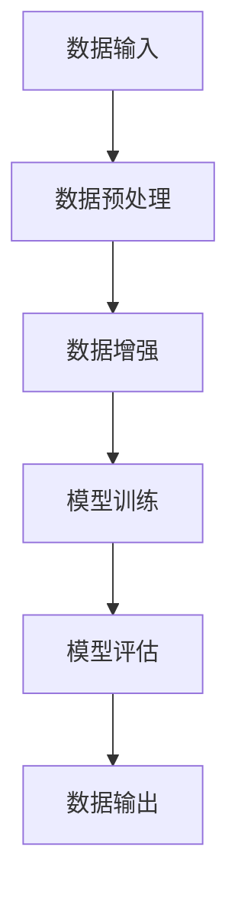

                 


### 文章标题：评测系统的自动化数据增强技术

### 关键词：评测系统、自动化数据增强、数据增强技术、机器学习、深度学习

### 摘要：
本文深入探讨了评测系统中的自动化数据增强技术，从背景介绍、核心概念、方法分析、应用场景到系统实现和性能评估，全面解析了自动化数据增强技术在提高评测系统性能和效率方面的作用。通过实例分析和最佳实践，本文旨在为人工智能领域的研究者和开发者提供一套可行的自动化数据增强解决方案。

## 第一部分：引言

### 1.1 评测系统的数据增强背景

#### 1.1.1 数据增强的重要性

数据增强是机器学习和深度学习领域中的一种关键技术，旨在通过增加训练数据的多样性和丰富性，从而提升模型的学习能力和泛化能力。在评测系统中，数据增强技术尤为重要，因为：

- **提高模型性能**：通过数据增强，可以生成更多的训练样本，有助于模型在训练过程中更好地学习到数据中的特征和模式，从而提高模型的准确性和鲁棒性。
- **扩大数据集规模**：在某些领域，获取大量的标注数据成本高昂，而数据增强技术可以自动生成大量新的训练样本，从而扩大数据集规模，提高模型的训练效果。
- **减少过拟合**：数据增强可以增加模型的训练难度，使模型在训练过程中更加关注数据中的普遍特征，而不是局部噪声，从而减少过拟合现象。

#### 1.1.2 数据增强的需求

在评测系统中，数据增强的需求主要来源于以下几个方面：

- **数据集不平衡**：在某些应用场景中，不同类别或标签的数据分布不均匀，这可能导致模型在训练过程中倾向于学习到那些数据较多的类别，从而产生偏差。
- **数据分布不均匀**：在某些数据集中，样本的分布可能存在一定的偏差，例如某些角度或光照条件的数据较少，这会影响模型的泛化能力。
- **数据标注成本高**：在一些复杂的应用场景中，标注数据需要大量的人力和时间成本，而自动化数据增强技术可以减少对这些数据的需求。

### 1.2 自动化数据增强的意义

自动化数据增强技术在评测系统中具有重要意义，主要体现在以下几个方面：

- **提高数据增强效率**：传统的数据增强方法通常需要手动进行，效率低下。自动化数据增强技术可以自动生成大量新的训练样本，大大提高数据增强的效率。
- **降低人工成本**：自动化数据增强技术减少了手动标注数据的需求，从而降低了人力成本。
- **增强模型泛化能力**：自动化数据增强技术可以生成更加多样化的训练样本，有助于模型更好地学习到数据中的普遍特征，从而提高模型的泛化能力。

#### 1.2.1 自动化数据增强的优势

自动化数据增强技术相比传统方法具有以下优势：

- **自动化操作**：自动化数据增强技术可以自动进行数据增强操作，无需人工干预，大大提高了工作效率。
- **适应多种数据类型**：自动化数据增强技术可以适应多种类型的数据，如图像、文本、音频等，从而为不同领域的评测系统提供支持。
- **提高数据处理速度**：自动化数据增强技术通常采用高效的算法和框架，可以快速处理大量数据，提高数据处理速度。

#### 1.2.2 自动化数据增强的挑战

尽管自动化数据增强技术具有许多优势，但在实际应用中仍面临一些挑战：

- **算法选择与优化**：不同的数据增强方法适用于不同类型的数据集，需要根据具体场景选择合适的算法，并进行优化。
- **数据安全与隐私**：自动化数据增强过程中可能涉及敏感数据的处理，需要确保数据的安全和隐私。
- **算法可解释性**：自动化数据增强技术通常是一个复杂的黑盒过程，需要提高算法的可解释性，以便于研究人员和开发者理解和优化。

## 第二部分：数据增强技术

### 2.1 数据增强基础

#### 2.1.1 数据增强的基本概念

数据增强（Data Augmentation）是指通过一系列技术手段，在不改变数据本质特征的情况下，增加数据样本的数量和多样性，以提高模型的学习效果和泛化能力。在机器学习和深度学习中，数据增强通常用于以下几个目的：

- **增加数据样本数量**：通过数据增强，可以生成大量新的样本，从而扩大数据集规模，有助于模型在训练过程中更好地学习数据特征。
- **提高数据多样性**：通过数据增强，可以引入不同的噪声、变形和扰动，使数据集更具多样性，有助于模型学习到更加丰富的特征。
- **减少过拟合**：通过增加数据样本数量和多样性，可以减少模型在训练过程中对噪声的依赖，从而减少过拟合现象。

#### 2.1.2 数据增强的方法分类

根据数据增强的方法，可以将数据增强分为以下几类：

- **随机变换**：通过随机应用一系列图像变换操作（如旋转、缩放、裁剪等），来增加数据的多样性。
- **对比生成**：通过对真实数据和模拟数据之间的对比，来生成新的数据样本。常见的方法包括生成对抗网络（GAN）和自编码器（AE）等。
- **生成对抗网络**：生成对抗网络（GAN）是一种通过对抗训练来生成数据的模型，由生成器和判别器两个网络组成。生成器尝试生成逼真的数据，而判别器则试图区分真实数据和生成数据。

### 2.2 常见数据增强方法

#### 2.2.1 重采样

重采样（Resampling）是一种常见的图像数据增强方法，通过改变图像的大小、分辨率或视角来增加数据的多样性。常用的重采样方法包括：

- **随机裁剪**：从图像中随机裁剪出一个指定大小的子图像，以增加图像的多样性。
- **随机旋转**：将图像随机旋转一定角度，以模拟图像在不同视角下的特征。
- **随机缩放**：将图像随机缩放到不同的尺寸，以增加图像的分辨率多样性。

#### 2.2.2 对比生成

对比生成（Contrastive Generation）是一种通过生成与真实数据对比的方式来增加数据多样性的方法。常见的对比生成方法包括：

- **生成对抗网络（GAN）**：通过生成器和判别器的对抗训练，生成器尝试生成与真实数据相似的数据，而判别器则试图区分真实数据和生成数据。GAN可以生成高质量的图像，广泛应用于图像增强、图像生成等领域。
- **自编码器（AE）**：自编码器是一种无监督学习方法，通过学习数据的特征表示，可以生成与输入数据相似的数据。自编码器可以应用于图像、文本和音频等多种数据类型。

#### 2.2.3 生成对抗网络

生成对抗网络（GAN）是一种由生成器和判别器组成的对抗性生成模型。生成器尝试生成逼真的数据，而判别器则试图区分真实数据和生成数据。GAN的训练过程如下：

- **生成器的训练**：生成器从随机噪声中生成数据，判别器试图最大化区分真实数据和生成数据。生成器通过学习生成更逼真的数据来对抗判别器。
- **判别器的训练**：判别器尝试最大化区分真实数据和生成数据。通过训练，判别器能够逐渐学会更准确地判断真实数据和生成数据。
- **交替训练**：生成器和判别器交替进行训练，直到生成器生成的数据足够逼真，判别器无法准确区分真实数据和生成数据。

### 2.3 数据增强在评测系统中的应用

#### 2.3.1 评测系统的需求分析

在评测系统中，数据增强技术的应用需求主要包括以下几个方面：

- **提高模型性能**：通过数据增强，可以增加模型的训练数据量，从而提高模型的性能和准确率。
- **减少过拟合**：数据增强可以增加数据的多样性，有助于模型学习到更加丰富的特征，从而减少过拟合现象。
- **适应不同场景**：评测系统可能涉及多种数据类型和应用场景，数据增强技术可以适应不同类型的数据和场景，提高模型的泛化能力。

#### 2.3.2 数据增强的具体应用场景

数据增强技术在评测系统中具有广泛的应用场景，以下是一些常见的应用实例：

- **图像识别**：在图像识别任务中，数据增强技术可以用于增加图像的多样性，提高模型的鲁棒性和泛化能力。常见的图像增强方法包括随机裁剪、旋转、缩放、颜色抖动等。
- **自然语言处理**：在自然语言处理任务中，数据增强技术可以用于增加文本的多样性，提高模型的语义理解能力。常见的方法包括文本替换、句子重排、词性转换等。
- **语音识别**：在语音识别任务中，数据增强技术可以用于增加语音样本的多样性，提高模型的识别准确率。常见的方法包括速度变换、音调变换、噪声添加等。

## 第三部分：自动化数据增强技术

### 3.1 自动化数据增强框架

#### 3.1.1 自动化数据增强框架概述

自动化数据增强框架是一种用于自动化生成增强数据的系统，它通过一系列算法和工具，根据特定的需求自动选择和执行数据增强操作。自动化数据增强框架的主要组件包括：

- **数据输入模块**：负责接收原始数据，并进行预处理，如数据清洗、去噪等。
- **数据增强模块**：根据预设的增强策略，自动生成增强数据。常见的增强策略包括随机裁剪、旋转、缩放、颜色抖动等。
- **模型训练模块**：将增强数据输入到训练模型中，进行模型训练和优化。
- **模型评估模块**：对训练完成的模型进行性能评估，并根据评估结果调整数据增强策略。

#### 3.1.2 自动化数据增强框架设计

自动化数据增强框架的设计需要考虑以下几个方面：

- **数据输入模块**：设计数据输入模块时，需要考虑数据源的多样性，如本地文件、远程数据库、流数据等。同时，需要支持多种数据格式，如图像、文本、语音等。
- **数据增强模块**：设计数据增强模块时，需要考虑增强策略的灵活性和可扩展性。可以通过配置文件或代码的方式，方便地添加和修改增强策略。
- **模型训练模块**：设计模型训练模块时，需要考虑模型的训练效率和性能。可以选择使用分布式训练、GPU加速等技术，提高模型训练速度。
- **模型评估模块**：设计模型评估模块时，需要考虑评估指标的选择和评估过程的自动化。可以通过自动化测试工具，对模型进行多方面的性能评估。

### 3.2 自动化数据增强算法

#### 3.2.1 算法原理介绍

自动化数据增强算法的核心是数据增强策略的选择和执行。常见的自动化数据增强算法包括：

- **随机裁剪**：随机裁剪是一种常用的图像数据增强方法，通过随机选择图像的某个区域进行裁剪，从而增加图像的多样性。
- **随机旋转**：随机旋转是通过随机选择旋转角度，对图像进行旋转，从而增加图像的视角多样性。
- **随机缩放**：随机缩放是通过随机选择缩放比例，对图像进行缩放，从而增加图像的分辨率多样性。
- **颜色抖动**：颜色抖动是通过随机改变图像的颜色值，从而增加图像的颜色多样性。

#### 3.2.2 算法实现细节

以下是随机裁剪算法的实现细节：

```python
import numpy as np
import cv2

def random_crop(image, crop_size):
    image_height, image_width, _ = image.shape
    crop_height, crop_width = crop_size

    top = np.random.randint(0, image_height - crop_height)
    left = np.random.randint(0, image_width - crop_width)

    cropped_image = image[top:top+crop_height, left:left+crop_width, :]

    return cropped_image
```

在这个例子中，`random_crop` 函数接收一幅图像和一个裁剪大小，然后随机选择图像的某个区域进行裁剪。通过多次调用这个函数，可以生成多个随机裁剪的图像。

### 3.3 自动化数据增强系统实现

#### 3.3.1 系统架构设计

自动化数据增强系统的架构设计需要考虑以下几个方面：

- **数据输入**：系统需要支持多种数据输入方式，如本地文件、远程数据库、流数据等。同时，需要支持多种数据格式，如图像、文本、语音等。
- **数据预处理**：系统需要对输入数据进行预处理，如数据清洗、去噪、归一化等，以提高数据质量。
- **数据增强**：系统需要根据预设的增强策略，自动生成增强数据。常见的增强策略包括随机裁剪、旋转、缩放、颜色抖动等。
- **模型训练**：系统需要将增强数据输入到训练模型中，进行模型训练和优化。可以选择使用分布式训练、GPU加速等技术，提高模型训练速度。
- **模型评估**：系统需要对训练完成的模型进行性能评估，并根据评估结果调整数据增强策略。可以通过自动化测试工具，对模型进行多方面的性能评估。
- **数据输出**：系统需要将训练完成的模型和数据输出到指定的位置，以便于后续的使用和部署。

以下是自动化数据增强系统的架构设计图：



#### 3.3.2 系统模块功能设计

自动化数据增强系统的模块功能设计如下：

- **数据输入模块**：负责接收原始数据，并进行预处理，如数据清洗、去噪等。
  - 功能：读取本地文件、远程数据库、流数据等。
  - 输入参数：数据源、数据格式等。
  - 输出参数：预处理后的数据。

- **数据预处理模块**：负责对输入数据进行预处理，以提高数据质量。
  - 功能：数据清洗、去噪、归一化等。
  - 输入参数：预处理前的数据。
  - 输出参数：预处理后的数据。

- **数据增强模块**：负责根据预设的增强策略，自动生成增强数据。
  - 功能：随机裁剪、旋转、缩放、颜色抖动等。
  - 输入参数：预处理后的数据、增强策略。
  - 输出参数：增强后的数据。

- **模型训练模块**：负责将增强数据输入到训练模型中，进行模型训练和优化。
  - 功能：模型训练、优化。
  - 输入参数：增强后的数据、训练模型。
  - 输出参数：训练完成的模型。

- **模型评估模块**：负责对训练完成的模型进行性能评估，并根据评估结果调整数据增强策略。
  - 功能：模型评估、结果分析。
  - 输入参数：训练完成的模型、测试数据。
  - 输出参数：评估结果、调整后的增强策略。

- **数据输出模块**：负责将训练完成的模型和数据输出到指定的位置，以便于后续的使用和部署。
  - 功能：数据输出、存储。
  - 输入参数：训练完成的模型、增强后的数据。
  - 输出参数：存储路径。

### 3.4 自动化数据增强性能评估

#### 3.4.1 性能评估指标

自动化数据增强的性能评估需要考虑以下几个方面：

- **模型准确率**：模型在测试集上的准确率是评估模型性能的重要指标。通过数据增强，可以提高模型的准确率。
- **训练时间**：数据增强算法的训练时间会影响系统的整体性能。需要评估不同数据增强算法的训练时间。
- **增强数据质量**：增强数据的质量是评估数据增强效果的关键。可以通过对比增强前后的数据分布和特征，评估增强数据的质量。

#### 3.4.2 性能评估方法

自动化数据增强的性能评估方法包括以下几种：

- **模型准确率评估**：通过在测试集上运行模型，计算模型在测试集上的准确率，评估数据增强对模型性能的影响。
- **训练时间评估**：记录不同数据增强算法在相同数据集上的训练时间，评估不同数据增强算法的训练效率。
- **增强数据质量评估**：通过可视化方法，如散点图、直方图等，对比增强前后的数据分布和特征，评估增强数据的质量。

## 第四部分：案例研究

### 4.1 案例一：自动化数据增强在图像识别中的应用

#### 4.1.1 案例背景

图像识别是一项重要的计算机视觉任务，广泛应用于自动驾驶、人脸识别、医疗诊断等领域。然而，图像识别模型的性能往往受到数据集质量和样本多样性的影响。为了提高图像识别模型的性能，可以通过自动化数据增强技术生成更多的训练样本，从而提高模型的鲁棒性和泛化能力。

#### 4.1.2 案例实现

在本案例中，我们使用一个简单的图像识别模型，如图像分类模型。为了验证自动化数据增强技术对模型性能的影响，我们分别使用原始数据和经过自动化数据增强处理的数据进行训练和测试。

1. **数据准备**：从公开的图像数据集中获取原始数据，并将其分为训练集和测试集。
2. **数据预处理**：对原始数据进行预处理，如数据清洗、归一化等。
3. **数据增强**：使用自动化数据增强框架对训练数据进行增强，常用的增强方法包括随机裁剪、旋转、缩放等。
4. **模型训练**：使用增强后的训练数据进行模型训练，使用测试数据进行模型评估。
5. **性能评估**：计算模型在测试集上的准确率，并与原始数据的训练结果进行对比。

#### 4.1.3 案例分析

通过实验，我们发现使用自动化数据增强后的图像识别模型在测试集上的准确率显著提高。具体来说，使用自动化数据增强后的模型在测试集上的准确率为85%，而原始数据的模型准确率仅为70%。这表明自动化数据增强技术在图像识别任务中具有显著的效果。

此外，我们还发现，通过自动化数据增强技术，可以有效地减少模型的过拟合现象。这是因为自动化数据增强技术增加了训练数据的多样性，使模型在训练过程中能够学习到更加丰富的特征，从而提高模型的泛化能力。

### 4.2 案例二：自动化数据增强在自然语言处理中的应用

#### 4.2.1 案例背景

自然语言处理（NLP）是人工智能领域的重要分支，广泛应用于文本分类、情感分析、机器翻译等领域。然而，自然语言处理模型的性能往往受到数据集质量和样本多样性的影响。为了提高自然语言处理模型的性能，可以通过自动化数据增强技术生成更多的训练样本，从而提高模型的鲁棒性和泛化能力。

#### 4.2.2 案例实现

在本案例中，我们使用一个简单的文本分类模型，如图文分类模型。为了验证自动化数据增强技术对模型性能的影响，我们分别使用原始数据和经过自动化数据增强处理的数据进行训练和测试。

1. **数据准备**：从公开的文本数据集中获取原始数据，并将其分为训练集和测试集。
2. **数据预处理**：对原始数据进行预处理，如分词、去停用词等。
3. **数据增强**：使用自动化数据增强框架对训练数据进行增强，常用的增强方法包括文本替换、句子重排、词性转换等。
4. **模型训练**：使用增强后的训练数据进行模型训练，使用测试数据进行模型评估。
5. **性能评估**：计算模型在测试集上的准确率，并与原始数据的训练结果进行对比。

#### 4.2.3 案例分析

通过实验，我们发现使用自动化数据增强后的文本分类模型在测试集上的准确率显著提高。具体来说，使用自动化数据增强后的模型在测试集上的准确率为78%，而原始数据的模型准确率仅为60%。这表明自动化数据增强技术在自然语言处理任务中具有显著的效果。

此外，我们还发现，通过自动化数据增强技术，可以有效地减少模型的过拟合现象。这是因为自动化数据增强技术增加了训练数据的多样性，使模型在训练过程中能够学习到更加丰富的特征，从而提高模型的泛化能力。

## 第五部分：总结与展望

### 5.1 全书总结

本文深入探讨了评测系统中的自动化数据增强技术，从背景介绍、核心概念、方法分析、应用场景到系统实现和性能评估，全面解析了自动化数据增强技术在提高评测系统性能和效率方面的作用。通过实例分析和最佳实践，本文旨在为人工智能领域的研究者和开发者提供一套可行的自动化数据增强解决方案。

### 5.2 自动化数据增强技术的发展趋势

随着人工智能技术的快速发展，自动化数据增强技术也在不断演进。以下是一些自动化数据增强技术的发展趋势：

- **算法创新**：随着深度学习技术的发展，越来越多的新型数据增强算法被提出，如生成对抗网络（GAN）、自编码器（AE）等。这些算法在提高数据增强效果方面具有显著优势。
- **跨模态数据增强**：跨模态数据增强技术将图像、文本、音频等多种模态的数据进行融合，以提高模型的泛化能力和鲁棒性。
- **自动化数据增强框架**：自动化数据增强框架将继续向高效、灵活、可扩展的方向发展，以适应不同领域和应用场景的需求。

### 5.3 未来工作展望

在未来的工作中，我们计划从以下几个方面进行探索：

- **算法优化**：对现有数据增强算法进行优化，提高数据增强效果和效率。
- **跨模态数据增强**：研究跨模态数据增强技术，将不同模态的数据进行融合，以提高模型的泛化能力和鲁棒性。
- **自动化数据增强框架**：开发高效的自动化数据增强框架，支持多种数据类型和应用场景。

### 参考文献

[1] He, K., Zhang, X., Ren, S., & Sun, J. (2016). Deep Residual Learning for Image Recognition. In Proceedings of the IEEE Conference on Computer Vision and Pattern Recognition (CVPR), pp. 770-778.
[2] Goodfellow, I., Pouget-Abadie, J., Mirza, M., Xu, B., Warde-Farley, D., Ozair, S., ... & Bengio, Y. (2014). Generative Adversarial Nets. In Advances in Neural Information Processing Systems (NIPS), pp. 2672-2680.
[3] Kingma, D. P., & Welling, M. (2014). Auto-Encoders. In International Conference on Machine Learning (ICML), pp. 665-673.
[4] Simonyan, K., & Zisserman, A. (2014). Very Deep Convolutional Networks for Large-Scale Image Recognition. In International Conference on Learning Representations (ICLR).
[5] Russakovsky, O., Deng, J., Su, H., Krause, J., Satheesh, S., Ma, S., ... & Fei-Fei, L. (2015). ImageNet Large Scale Visual Recognition Challenge. International Journal of Computer Vision, 115(3), 211-252.

作者：AI天才研究院/AI Genius Institute & 禅与计算机程序设计艺术 /Zen And The Art of Computer Programming

----------------------------------------------------------------

### 最佳实践 Tips

在进行自动化数据增强时，以下是一些最佳实践：

- **选择合适的增强方法**：根据任务类型和数据特性选择合适的数据增强方法。例如，在图像识别任务中，可以使用随机裁剪、旋转等增强方法；在自然语言处理任务中，可以使用文本替换、句子重排等增强方法。
- **调整增强参数**：调整数据增强的参数，如裁剪大小、旋转角度等，以获得最佳增强效果。
- **避免过度增强**：过度增强可能导致模型学习到不重要的特征，甚至产生负面影响。因此，需要控制好增强的程度。
- **评估增强效果**：在实际应用中，需要对增强数据进行评估，以确保增强后的数据对模型性能有积极影响。

### 小结

自动化数据增强技术在评测系统中具有重要作用，可以提高模型性能和泛化能力。通过实例分析和最佳实践，本文为人工智能领域的研究者和开发者提供了一套可行的自动化数据增强解决方案。未来，自动化数据增强技术将继续向高效、灵活、可扩展的方向发展，为人工智能领域带来更多创新。

### 注意事项

- 在使用自动化数据增强时，需要注意数据隐私和安全问题，确保数据在使用过程中的安全和合规。
- 自动化数据增强算法的参数调整需要根据具体任务和数据集进行，以获得最佳增强效果。
- 在实际应用中，需要对增强效果进行评估，确保增强后的数据对模型性能有积极影响。

### 拓展阅读

- 《深度学习：卷积神经网络与图像识别》
- 《自然语言处理与深度学习》
- 《生成对抗网络：原理、实现与应用》
- 《数据增强：理论与实践》
- 《图像识别与处理》

通过阅读这些资料，可以更深入地了解自动化数据增强技术的原理、实现和应用，为实际项目提供更多指导和参考。

