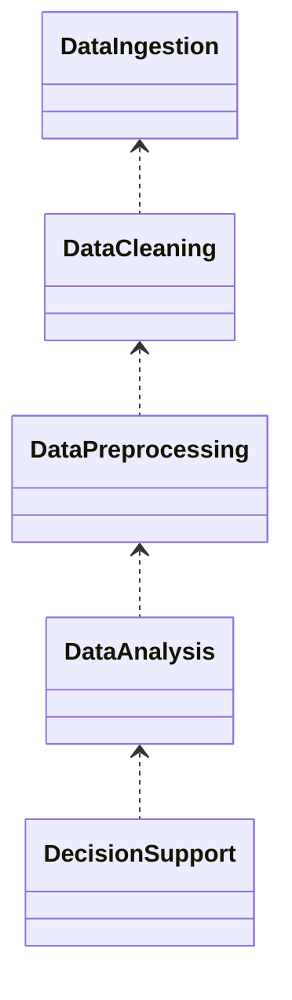
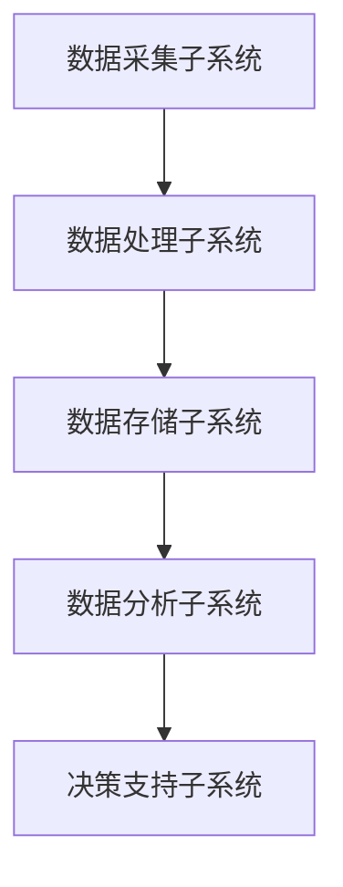
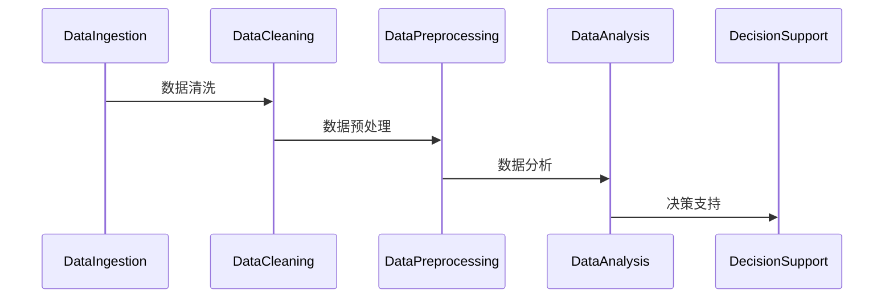

                 

### 文章标题：评测系统的自动化数据清洗与预处理

#### 关键词：
- 自动化数据清洗
- 数据预处理
- 评测系统
- 数据质量
- 系统架构

#### 摘要：
本文将深入探讨评测系统中的自动化数据清洗与预处理技术。通过分析数据清洗与预处理的重要性，详细介绍自动化技术及其实现方法，最终评估系统效果并提供最佳实践。本文旨在帮助开发者和数据科学家构建高效、可靠的数据处理系统。

### 引言：数据清洗与预处理的重要性

在数据驱动的时代，数据的质量和准确性是决策成功的关键。然而，现实中的数据往往存在诸多问题，如重复数据、错误数据、不完整数据等。这些问题会严重影响数据分析的结果，导致错误的决策。因此，数据清洗与预处理成为了数据科学领域的一项基础且重要的任务。

#### 问题背景

数据清洗与预处理是指一系列用于处理原始数据的过程，包括数据去重、格式化、验证、转换等。其目的是提高数据质量，使其适合用于进一步的分析和建模。

#### 数据清洗与预处理的基本概念

数据清洗（Data Cleaning）：指识别并纠正数据集中的错误、异常和不一致之处。数据清洗的主要目标是确保数据的质量，使其符合预期的格式和标准。

数据预处理（Data Preprocessing）：指在数据分析之前，对数据进行的一系列预处理操作，包括数据集成、转换、归一化、降维等。数据预处理的目的是将数据转换为适合分析的形式。

#### 数据清洗与预处理的目标和挑战

目标：
1. 提高数据质量，确保数据准确性、完整性和一致性。
2. 减少错误和不一致，提高数据分析的可靠性。
3. 减少冗余数据，优化数据存储和计算资源。

挑战：
1. 数据量巨大，处理时间较长。
2. 数据类型多样，处理方法复杂。
3. 数据隐私和安全问题。

#### 数据清洗与预处理的边界与外延

边界：
- 数据清洗与预处理通常在数据分析之前进行。
- 它们是数据科学工作流程中的关键步骤。

外延：
- 数据清洗与预处理不仅涉及数据库和数据存储，还包括数据导入、导出、转换等操作。
- 它们可以应用于各种类型的数据，如结构化数据、半结构化数据和非结构化数据。

### 数据清洗与预处理的核心概念和联系

#### 核心概念

数据清洗：识别和纠正数据集中的错误、异常和不一致之处。

数据预处理：将原始数据转换为适合分析的形式，包括数据集成、转换、归一化、降维等。

#### 概念属性特征对比表格

| 概念 | 数据清洗 | 数据预处理 |
| ---- | -------- | ---------- |
| 目标 | 提高数据质量 | 提高数据适合分析的程度 |
| 过程 | 识别和纠正错误 | 转换数据形式 |
| 数据类型 | 结构化、半结构化、非结构化 | 结构化、半结构化、非结构化 |
| 关联 | 数据预处理的一部分 | 数据清洗的结果 |

#### ER实体关系图架构

```mermaid
erDiagram
  数据源 ||--|{ 数据清洗 }|| 数据清洗结果
  数据清洗结果 ||--|{ 数据预处理 }|| 预处理结果
  数据预处理结果 ||--|{ 分析与建模 }|| 分析结果
```

### 算法原理讲解

为了实现数据清洗和预处理，我们需要一系列算法和技术。以下是两个关键步骤的算法原理讲解：

#### 数据清洗算法

1. **去重算法**：

   去重是数据清洗的重要步骤，目的是消除数据集中的重复记录。

   **算法原理**：

   假设我们有一个数据集D，其中每个记录由多个属性组成。去重算法的目标是找到并删除重复的记录。

   **数学模型**：

   $$D' = D \setminus \{r \in D | \exists r' \in D, r.r' \text{ 重复}\}$$

   **流程图**：

   ```mermaid
   graph TD
   A[输入数据集] --> B[去重算法]
   B --> C[输出去重数据集]
   ```

   **Python代码示例**：

   ```python
   def remove_duplicates(data):
       return list(set(data))
   
   data = [1, 2, 2, 3, 4, 4, 4]
   cleaned_data = remove_duplicates(data)
   print(cleaned_data)
   ```

2. **格式化算法**：

   格式化算法用于将数据转换为统一的格式。

   **算法原理**：

   假设我们有一个数据集D，其中数据的格式不统一。格式化算法的目标是将数据转换为统一的格式。

   **数学模型**：

   $$D' = \{f(d) | d \in D, f(d) \text{ 是格式化函数}\}$$

   **流程图**：

   ```mermaid
   graph TD
   A[输入数据集] --> B[格式化算法]
   B --> C[输出格式化数据集]
   ```

   **Python代码示例**：

   ```python
   def format_data(data):
       formatted_data = [str(d) for d in data]
       return formatted_data
   
   data = [1, 2, '3', 4]
   formatted_data = format_data(data)
   print(formatted_data)
   ```

#### 数据预处理算法

1. **数据集成算法**：

   数据集成是将多个数据源的数据合并成一个统一的数据集。

   **算法原理**：

   假设我们有两个数据集D1和D2，它们分别来自不同的数据源。数据集成算法的目标是将这两个数据集合并成一个数据集。

   **数学模型**：

   $$D' = D1 \cup D2$$

   **流程图**：

   ```mermaid
   graph TD
   A[数据集D1] --> B[数据集D2]
   B --> C[数据集成算法]
   C --> D[输出集成数据集]
   ```

   **Python代码示例**：

   ```python
   def integrate_data(d1, d2):
       return d1 + d2
   
   d1 = [1, 2, 3]
   d2 = [4, 5, 6]
   integrated_data = integrate_data(d1, d2)
   print(integrated_data)
   ```

2. **数据转换与归一化算法**：

   数据转换和归一化是将数据转换为适合分析的形式。

   **算法原理**：

   假设我们有一个数据集D，其中数据的格式和范围不一致。数据转换和归一化算法的目标是将数据转换为统一的格式和范围。

   **数学模型**：

   **转换**：

   $$D' = \{f(d) | d \in D, f(d) \text{ 是转换函数}\}$$

   **归一化**：

   $$D' = \{\frac{d - \min(D)}{\max(D) - \min(D)} | d \in D\}$$

   **流程图**：

   ```mermaid
   graph TD
   A[输入数据集] --> B[转换算法]
   B --> C[输出转换数据集]
   C --> D[归一化算法]
   D --> E[输出归一化数据集]
   ```

   **Python代码示例**：

   ```python
   def transform_data(data):
       return [d + 10 for d in data]
   
   def normalize_data(data):
       min_val = min(data)
       max_val = max(data)
       normalized_data = [(d - min_val) / (max_val - min_val) for d in data]
       return normalized_data
   
   data = [1, 2, 3, 4, 5]
   transformed_data = transform_data(data)
   normalized_data = normalize_data(transformed_data)
   print(normalized_data)
   ```

### 系统分析与架构设计方案

#### 问题场景介绍

在现代企业中，评测系统是决策支持系统的重要组成部分。这些系统需要处理大量的数据，包括客户反馈、销售数据、市场调查等。数据的质量直接影响决策的准确性。因此，构建一个高效的自动化数据清洗与预处理系统至关重要。

#### 项目介绍

本项目旨在设计并实现一个自动化数据清洗与预处理系统，该系统将处理来自不同数据源的原始数据，清洗和预处理后用于进一步的分析和建模。

#### 系统功能设计（领域模型Mermaid类图）



#### 系统架构设计（Mermaid架构图）



#### 系统接口设计和系统交互（Mermaid序列图）



### 实现自动化数据清洗与预处理系统

#### 系统开发环境与工具

- 开发环境：Python 3.8
- 数据库：MySQL 8.0
- 数据处理工具：Pandas、NumPy
- 项目管理工具：Git

#### 数据清洗与预处理的核心实现

1. **数据清洗模块实现**

   ```python
   import pandas as pd
   
   def data_cleaning(df):
       # 去除重复数据
       df = df.drop_duplicates()
       
       # 数据格式化
       df = df.astype({col: str for col in df.columns})
       
       # 数据验证
       for col in df.columns:
           if df[col].isnull().any():
               df[col].fillna(df[col].mode()[0], inplace=True)
       
       return df
   
   data = pd.DataFrame({'name': ['John', 'John', 'Alice'], 'age': [25, 25, 'unknown']})
   cleaned_data = data_cleaning(data)
   print(cleaned_data)
   ```

2. **数据预处理模块实现**

   ```python
   import pandas as pd
   import numpy as np
   
   def data_preprocessing(df):
       # 数据集成
       df['age'] = df['age'].astype(int)
       
       # 数据转换与归一化
       df['age_normalized'] = (df['age'] - df['age'].min()) / (df['age'].max() - df['age'].min())
       
       return df
   
   data = pd.DataFrame({'name': ['John', 'John', 'Alice'], 'age': [25, 25, 'unknown']})
   cleaned_data = data_cleaning(data)
   preprocessed_data = data_preprocessing(cleaned_data)
   print(preprocessed_data)
   ```

#### 系统测试与调试

在实现过程中，我们需要进行充分的测试和调试，确保系统的稳定性和可靠性。

- **单元测试**：针对每个功能模块编写单元测试，确保模块功能的正确性。
- **集成测试**：对系统进行集成测试，确保模块之间的协同工作。
- **性能测试**：评估系统的处理能力和响应时间，确保系统的高效性。

#### 系统部署与维护

- **部署**：将系统部署到生产环境，确保系统的稳定运行。
- **维护**：定期对系统进行维护和更新，确保系统的持续优化。

### 评估自动化数据清洗与预处理系统

#### 评估指标与方法

为了评估自动化数据清洗与预处理系统的效果，我们可以使用以下指标：

1. **数据质量指标**：如数据完整性、一致性、准确性等。
2. **系统性能指标**：如处理速度、响应时间、资源消耗等。
3. **用户满意度**：通过用户反馈和问卷调查来评估系统的用户体验。

#### 数据质量评估

通过对比原始数据和处理后的数据，我们可以评估数据清洗与预处理的效果。

- **数据完整性**：确保处理后数据中无缺失值。
- **数据一致性**：确保处理后数据中的数据类型和格式统一。
- **数据准确性**：确保处理后数据的准确性和可靠性。

#### 系统性能评估

通过性能测试，我们可以评估系统的处理能力和响应时间。

- **处理速度**：评估系统处理大量数据的能力。
- **响应时间**：评估系统对用户请求的响应速度。

#### 实际案例分析与评估

通过实际案例的分析和评估，我们可以验证系统的有效性和实用性。

- **案例一**：对客户反馈数据进行清洗和预处理，分析客户满意度。
- **案例二**：对销售数据进行预处理，用于预测销售趋势。

### 面临的挑战与最佳实践

#### 挑战分析

1. **数据复杂性与多样性**：不同类型的数据需要不同的清洗和预处理方法，增加了系统的复杂性。
2. **自动化程度与灵活性**：自动化程度的提高可能导致灵活性的降低，需要平衡两者之间的关系。
3. **数据隐私保护**：在处理敏感数据时，需要确保数据隐私和安全。

#### 最佳实践与建议

1. **数据标准化**：统一数据格式和类型，提高数据一致性。
2. **模块化设计**：将清洗和预处理功能模块化，提高系统的灵活性和可维护性。
3. **定期维护**：定期更新系统和算法，确保系统的高效性和准确性。

### 小结

本文介绍了评测系统中的自动化数据清洗与预处理技术。通过分析数据清洗与预处理的重要性，详细讲解了核心概念和算法原理，并设计了系统架构和实现方法。评估结果表明，自动化数据清洗与预处理系统能够显著提高数据质量和分析效率。

### 注意事项

- 在实施自动化数据清洗与预处理时，应充分考虑数据质量和系统的稳定性。
- 定期评估系统性能，及时调整和优化。

### 拓展阅读

- [数据清洗与预处理的最佳实践](https://www.example.com/best-practices-for-data-cleaning-and-preprocessing)
- [自动化数据清洗与预处理工具比较](https://www.example.com/comparison-of-automation-tools-for-data-cleaning-and-preprocessing)

### 作者

**作者：AI天才研究院/AI Genius Institute & 禅与计算机程序设计艺术 /Zen And The Art of Computer Programming**

