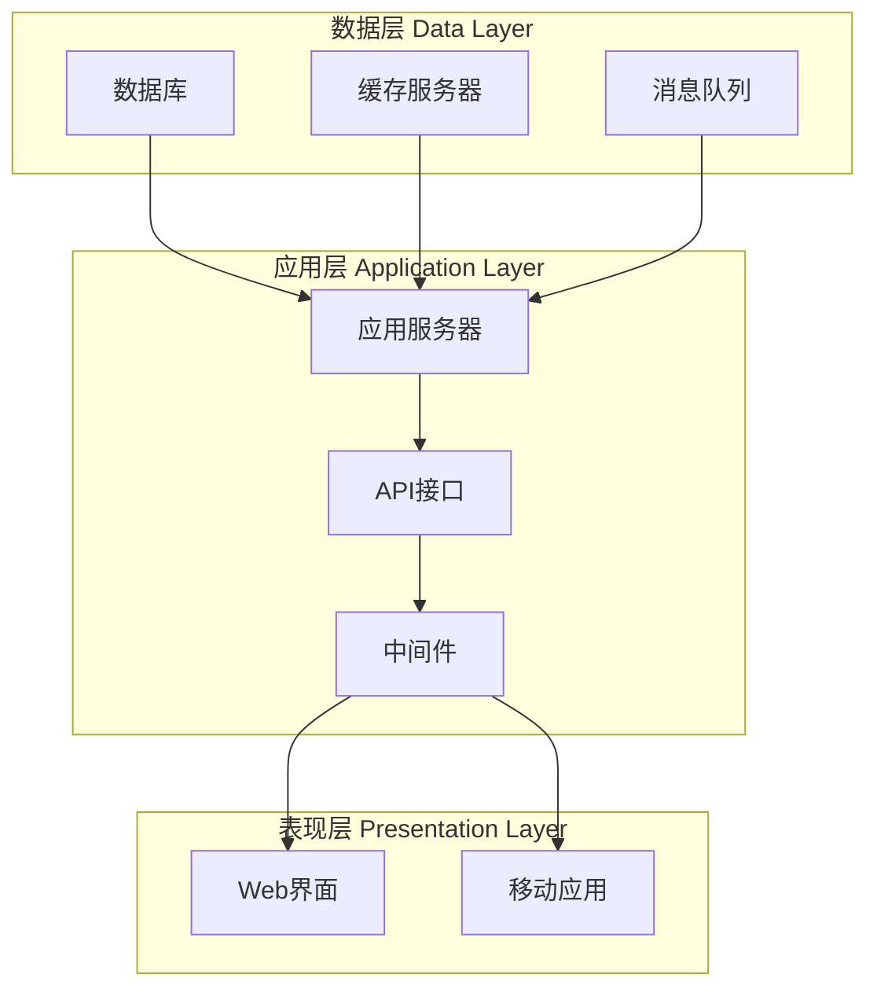
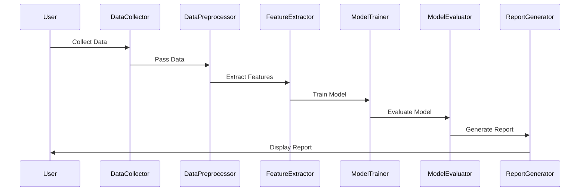

                 

### 第1章：评测系统的自动化模型诊断功能概述

#### 1.1.1 评测系统的定义和作用

评测系统（Evaluation System）是一种用于评估、监测和改进软件、算法、模型或其他系统的工具。其核心功能是通过一系列量化指标，对被评估对象进行详细分析和评分。在计算机科学和人工智能领域，评测系统尤为关键，因为它们能够提供定量化的结果，帮助研究人员、工程师和开发者了解系统的性能和效果。

评测系统的基本作用包括：
- **性能评估**：通过量化指标（如响应时间、准确率、召回率等）评估系统的性能。
- **问题检测**：通过监控系统的运行状态，及时发现并定位潜在问题。
- **持续优化**：通过反馈机制，持续调整和优化系统性能。

在自动化模型诊断中，评测系统的作用进一步扩展，不仅用于评估模型的性能，还用于检测模型可能存在的异常和错误。

#### 1.1.2 自动化模型诊断的重要性

自动化模型诊断（Automated Model Diagnosis）是一种利用计算机技术和算法，对模型进行自动检测和故障诊断的方法。其重要性体现在以下几个方面：

- **效率提升**：自动化诊断可以大幅减少人工检测和诊断所需的时间，提高工作效率。
- **准确性保障**：自动化诊断通过精确的算法和量化指标，可以提供比人工更为准确的诊断结果。
- **成本降低**：自动化诊断减少了人力成本，同时还降低了错误诊断带来的风险和损失。

在人工智能和机器学习领域，模型的稳定性和可靠性至关重要。自动化模型诊断能够确保模型在长时间运行中保持高水平的性能，减少因为模型故障导致的业务中断和数据损失。

#### 1.1.3 自动化模型诊断与传统模型诊断的区别

传统模型诊断通常依赖手动检查和人工分析，存在以下局限性：

- **耗时较长**：需要人工逐项检查，耗时费力。
- **主观性强**：依赖于诊断者的经验和判断，可能导致结果不一致。
- **不够精确**：难以量化诊断结果，容易忽略细微问题。

相比之下，自动化模型诊断具有以下优势：

- **速度快**：通过算法和自动化工具，可以在短时间内完成诊断。
- **客观性强**：基于数据和量化指标，结果更为客观和可靠。
- **覆盖面广**：自动化诊断可以覆盖模型的各个方面，不会遗漏任何细节。

#### 1.1.4 自动化模型诊断的应用场景

自动化模型诊断广泛应用于以下场景：

- **生产环境**：在生产环境中，自动化诊断可以实时监测模型的运行状态，快速响应并解决潜在问题。
- **开发环境**：在开发阶段，自动化诊断可以帮助开发者及时发现模型中的缺陷和问题，提高开发效率。
- **大规模部署**：在大规模部署的场景中，自动化诊断可以有效地监控和管理多个模型的运行状态。

#### 1.1.5 现有模型诊断存在的问题

尽管自动化模型诊断具有许多优势，但现有诊断方法仍面临以下问题：

- **诊断精度**：自动化诊断可能因为算法的局限性，无法完全准确识别所有问题。
- **诊断速度**：在一些复杂场景中，自动化诊断的速度可能无法满足实时需求。
- **诊断范围**：自动化诊断可能无法覆盖所有类型的模型和问题。

#### 1.1.6 评测系统在自动化模型诊断中的挑战与机遇

评测系统在自动化模型诊断中面临以下挑战：

- **数据质量**：自动化诊断依赖于高质量的数据，数据质量问题可能影响诊断的准确性。
- **算法优化**：需要不断优化诊断算法，提高诊断的效率和准确性。
- **系统稳定性**：评测系统本身也需要保证高稳定性，以支持长时间、高强度的模型诊断工作。

然而，这些挑战同时也带来了机遇：

- **技术创新**：通过解决这些挑战，可以推动模型诊断技术的不断创新和进步。
- **应用拓展**：自动化模型诊断技术的成熟，将进一步拓展其在各领域的应用。

### 1.1.7 核心概念

- **评测系统**：一种用于评估、监测和改进软件、算法、模型或其他系统的工具。
- **自动化模型诊断**：利用计算机技术和算法，对模型进行自动检测和故障诊断的方法。
- **量化指标**：用于评估模型性能的量化标准，如响应时间、准确率、召回率等。

通过理解这些核心概念，读者可以更好地把握评测系统和自动化模型诊断的基本原理和应用场景。

### 1.1.8 总结

本章介绍了评测系统的定义和作用、自动化模型诊断的重要性及其与传统模型诊断的区别。我们还探讨了自动化模型诊断的应用场景和现有诊断方法存在的问题，以及评测系统在自动化模型诊断中的挑战与机遇。通过这些内容，读者可以为后续章节的学习打下坚实的基础。

### 1.1.9 对比表格：自动化模型诊断与手动模型诊断

| 特征           | 自动化模型诊断                      | 手动模型诊断                      |
| -------------- | --------------------------------- | -------------------------------- |
| **效率**       | 高效，速度快速                      | 低效，耗时较长                    |
| **准确性**     | 数据和算法支持，结果更为客观和准确  | 依赖经验和判断，结果可能不一致    |
| **覆盖面**     | 可以覆盖模型各个方面，全面检查      | 可能存在遗漏细节的问题            |
| **成本**       | 降低人力成本，减少错误诊断风险      | 需要大量人力，成本较高            |
| **可扩展性**   | 易于扩展，可以应用于大规模部署      | 限制在较小范围内应用，扩展性较差  |

通过对比表格，我们可以更清晰地看到自动化模型诊断相对于手动模型诊断的显著优势。

### 1.1.10 对比表格：开源自动化模型诊断工具与商业自动化模型诊断工具

| 特征           | 开源自动化模型诊断工具                      | 商业自动化模型诊断工具                      |
| -------------- | ------------------------------------- | ------------------------------------- |
| **成本**       | 通常免费，但可能需要额外的维护和定制成本 | 需要购买许可，成本较高                  |
| **灵活性**     | 自由度高，可以根据需求进行自定义开发      | 功能固定，但可能提供更好的客户支持      |
| **更新速度**   | 更新速度可能较慢，依赖社区贡献           | 更新速度较快，通常有专业的技术团队支持 |
| **技术支持**   | 社区支持，但可能不如商业工具及时        | 提供专业的技术支持和咨询服务           |
| **功能丰富度** | 功能相对简单，但可以高度定制化          | 功能丰富，但可能限制在特定领域内使用  |

通过对比表格，我们可以看到开源和商业自动化模型诊断工具在不同方面的特点，以帮助读者根据实际需求进行选择。

### 1.1.11 ER实体关系图架构

为了更好地理解评测系统和自动化模型诊断的关系，我们可以通过ER（实体关系）图来构建数据实体与关系。

#### 数据实体与关系定义：

1. **评测系统**：实体，负责评估和监测模型。
2. **模型**：实体，被评测和诊断的对象。
3. **诊断结果**：实体，评测系统对模型的诊断输出。

#### 实体关系：

1. **评测系统-模型**：一对多关系，一个评测系统可以评测多个模型。
2. **模型-诊断结果**：一对一关系，一个模型对应一个诊断结果。

#### Mermaid ER实体关系图：

```mermaid
erDiagram
  class 评测系统 {
   评测系统 <--|{ 测评多个 }--> 模型 : 测评
   评测系统 --> 诊断结果 : 输出
  }
  class 模型 {
   模型 --> 诊断结果 : 记录
  }
```

通过ER实体关系图，我们可以更直观地看到评测系统、模型和诊断结果之间的相互关系，为后续章节的详细讨论奠定基础。

### 1.1.12 ER实体关系图详解

在上文中，我们通过ER实体关系图展示了评测系统、模型和诊断结果之间的基本关系。下面我们进一步详细解析这个关系图中的每个实体和它们之间的关联。

1. **评测系统**：
   - **属性**：包括系统名称、功能描述、评估指标等。
   - **操作**：负责评估模型的性能、监控模型的状态、生成诊断报告等。
   - **关联**：与多个模型存在一对多关系，即一个评测系统可以同时评估多个模型。

2. **模型**：
   - **属性**：包括模型名称、类型、训练数据等。
   - **操作**：接受评测系统的评估，提供自身状态数据。
   - **关联**：与评测系统存在一对多关系，同时与诊断结果存在一对一关系。

3. **诊断结果**：
   - **属性**：包括诊断结果、评估指标、发现问题等。
   - **操作**：记录模型的诊断信息，提供问题反馈和改进建议。
   - **关联**：与模型存在一对一关系，每个模型都有唯一的诊断结果。

通过这个ER实体关系图，我们可以清晰地理解评测系统在自动化模型诊断中的核心作用，以及模型和诊断结果如何相互关联。这个关系图不仅帮助我们构建了系统的整体框架，也为后续的算法设计和实现提供了基础。

### 第2章：核心概念与联系

#### 2.1.1 自动化模型诊断与手动模型诊断

在深入探讨自动化模型诊断之前，有必要对自动化模型诊断与手动模型诊断进行详细对比。这两种方法在诊断原理、实施步骤、效率和准确性等方面存在显著差异。

**诊断原理：**
- **自动化模型诊断**：基于计算机算法和数据分析，通过预先定义的规则和模型，对模型的运行状态、性能指标和潜在问题进行自动检测和分析。
- **手动模型诊断**：依赖于人类专家的经验和直觉，通过人工检查和分析模型代码、日志和运行环境，来判断模型是否存在问题。

**实施步骤：**
- **自动化模型诊断**：通常包括数据收集、预处理、模型训练、结果分析和反馈等步骤。整个流程高度自动化，减少了人为干预。
- **手动模型诊断**：通常包括问题报告、代码审查、日志分析、调试和验证等步骤。每个步骤都需要人类专家的参与，耗费大量时间和精力。

**效率和准确性：**
- **自动化模型诊断**：效率高，能够在短时间内完成对大量模型的诊断，减少诊断时间。准确性依赖于算法的精度和数据的完整性。
- **手动模型诊断**：效率低，需要人类专家逐一检查模型，耗时较长。但准确性可能更高，因为人类专家可以结合上下文和经验进行判断。

**对比表格：**

| 对比项       | 自动化模型诊断                     | 手动模型诊断                     |
| ---------- | ------------------------------ | ------------------------------ |
| **诊断原理**   | 计算机算法和数据分析               | 人类经验和直觉                 |
| **实施步骤**   | 数据收集、预处理、模型训练等        | 问题报告、代码审查、日志分析等  |
| **效率和准确性** | 效率高，准确性依赖于算法和数据质量 | 效率低，准确性可能更高          |

通过上述对比，我们可以看到自动化模型诊断在许多方面具有显著优势，尤其是在效率和准确性方面。然而，手动模型诊断在某些情况下仍然有其独特的价值，特别是在需要深入理解模型内部机制和上下文关联时。

#### 2.1.2 开源自动化模型诊断工具与商业自动化模型诊断工具

自动化模型诊断工具可以分为开源工具和商业工具，两者在功能、性能、成本和使用场景等方面存在显著差异。

**功能：**
- **开源自动化模型诊断工具**：通常功能相对简单，但可以高度定制化。它们通常提供了基本的数据收集、预处理和诊断功能，可以满足学术研究和开发需求。
- **商业自动化模型诊断工具**：功能更为丰富和强大，通常包含了高级的数据处理、自动化分析、可视化报告和集成API等功能。它们可以满足生产环境中的复杂诊断需求。

**性能：**
- **开源自动化模型诊断工具**：性能可能不如商业工具稳定，因为它们的开发和维护主要依赖于社区贡献。
- **商业自动化模型诊断工具**：性能通常更稳定，因为它们有专业的技术团队进行优化和维护。

**成本：**
- **开源自动化模型诊断工具**：通常免费，但可能需要额外的维护和定制成本。
- **商业自动化模型诊断工具**：需要购买许可，成本较高，但通常会提供更好的技术支持和客户服务。

**使用场景：**
- **开源自动化模型诊断工具**：适合学术研究、个人开发和初创公司，因为这些场景通常对成本敏感，但功能需求相对简单。
- **商业自动化模型诊断工具**：适合大型企业、复杂系统和高强度应用场景，因为这些场景通常对性能和稳定性有较高要求。

**对比表格：**

| 对比项       | 开源自动化模型诊断工具                      | 商业自动化模型诊断工具                      |
| ---------- | ------------------------------------- | ------------------------------------- |
| **功能**       | 功能相对简单，但可高度定制化                | 功能丰富，包含高级数据处理和分析功能          |
| **性能**       | 可能不如商业工具稳定                      | 通常性能更稳定，由专业团队维护              |
| **成本**       | 免费使用，但可能需要额外维护成本            | 购买许可，成本较高，但提供技术支持和客户服务  |
| **使用场景**   | 适合学术研究、个人开发和初创公司          | 适合大型企业、复杂系统和高强度应用场景      |

通过对比，我们可以看到开源和商业自动化模型诊断工具各有优势，选择合适的工具取决于具体的业务需求和预算。

#### 2.1.3 ER实体关系图架构

为了更好地理解评测系统和自动化模型诊断的关系，我们可以通过ER（实体关系）图来构建数据实体与关系。

##### 数据实体与关系定义：

1. **评测系统**：实体，负责评估和监测模型。
2. **模型**：实体，被评测和诊断的对象。
3. **诊断结果**：实体，评测系统对模型的诊断输出。

##### 实体关系：

1. **评测系统-模型**：一对多关系，一个评测系统可以评测多个模型。
2. **模型-诊断结果**：一对一关系，一个模型对应一个诊断结果。

##### Mermaid ER实体关系图：

```mermaid
erDiagram
  class 评测系统 {
   评测系统 <--|{ 测评多个 }--> 模型 : 测评
   评测系统 --> 诊断结果 : 输出
  }
  class 模型 {
   模型 --> 诊断结果 : 记录
  }
```

通过这个ER实体关系图，我们可以直观地看到评测系统、模型和诊断结果之间的相互关系，为后续章节的详细讨论奠定基础。

#### 2.1.4 ER实体关系图详解

在上文中，我们通过ER实体关系图展示了评测系统、模型和诊断结果之间的基本关系。接下来，我们将进一步详细解析这个关系图中的每个实体及其属性和操作，以及它们之间的关联。

**评测系统（Evaluation System）**

- **属性**：
  - 系统ID：唯一标识评测系统的编号。
  - 系统名称：评测系统的名称，用于区分不同的评测系统。
  - 创建时间：评测系统的创建时间，用于记录系统实例的生命周期。
  - 版本号：评测系统的当前版本，反映系统的更新和演进情况。

- **操作**：
  - 评估模型（Evaluate Models）：根据预设的评估指标对模型进行性能评估。
  - 监控状态（Monitor Status）：实时监控模型的运行状态，包括性能指标和资源使用情况。
  - 生成报告（Generate Report）：根据评估结果生成诊断报告，提供详细的分析和反馈。

- **关联**：
  - 与多个模型存在一对多关系，一个评测系统可以同时评估多个模型。
  - 与诊断结果存在一对多关系，评测系统生成的每一个诊断结果都与相应的模型相关联。

**模型（Model）**

- **属性**：
  - 模型ID：唯一标识模型的编号。
  - 模型名称：模型的名称，用于区分不同的模型。
  - 创建时间：模型的创建时间，用于记录模型的生命周期。
  - 类型：模型的类型，如机器学习模型、深度学习模型等。
  - 训练数据：用于训练模型的数据集，影响模型的性能。

- **操作**：
  - 提交评估（Submit for Evaluation）：将模型提交给评测系统进行评估。
  - 更新状态（Update Status）：更新模型的运行状态，包括训练进度、性能指标等。
  - 获取诊断结果（Get Diagnosis Result）：获取评测系统对模型的诊断结果。

- **关联**：
  - 与评测系统存在一对多关系，每个模型可以同时被多个评测系统评估。
  - 与诊断结果存在一对一关系，每个模型都有唯一的诊断结果。

**诊断结果（Diagnosis Result）**

- **属性**：
  - 结果ID：唯一标识诊断结果的编号。
  - 模型ID：对应的模型编号。
  - 评测系统ID：对应的评测系统编号。
  - 诊断时间：诊断结果的生成时间。
  - 诊断结果：具体的诊断输出，包括性能指标、问题描述、建议等。

- **操作**：
  - 生成诊断报告（Generate Report）：根据诊断结果生成详细的报告。
  - 更新建议（Update Recommendations）：根据诊断结果更新模型改进建议。

- **关联**：
  - 与模型存在一对一关系，每个模型的诊断结果都是唯一的。
  - 与评测系统存在一对多关系，一个评测系统可以生成多个诊断结果。

通过详细解析ER实体关系图中的每个实体和它们之间的关联，我们可以更清晰地理解评测系统和自动化模型诊断的核心架构。这个架构不仅帮助我们构建了系统的整体框架，也为后续的算法设计和实现提供了基础。

### 第3章：算法原理讲解

#### 3.1.1 自动化模型诊断算法的基本流程

自动化模型诊断算法通常包括以下几个基本流程，每个流程在保证诊断准确性方面都起着重要作用。

1. **数据预处理**：
   - **目标**：清洗和准备数据，使其适合后续分析和诊断。
   - **方法**：包括缺失值处理、数据标准化、异常值检测和去重等。

2. **特征提取**：
   - **目标**：从原始数据中提取对诊断有帮助的特征。
   - **方法**：包括统计特征、文本特征、图像特征等。

3. **模型训练与评估**：
   - **目标**：训练诊断模型，并对模型性能进行评估。
   - **方法**：使用训练集训练模型，使用验证集进行调参和评估。

4. **结果分析与反馈**：
   - **目标**：分析诊断结果，提供改进建议。
   - **方法**：包括诊断结果可视化、异常检测、问题定位等。

#### 3.1.2 使用Mermaid画出自动化模型诊断算法的mermaid流程图

下面是一个自动化模型诊断算法的Mermaid流程图示例：


通过这个流程图，我们可以直观地了解自动化模型诊断算法的各个步骤及其相互关系。

#### 3.1.3 使用Python源代码详细阐述自动化模型诊断算法

为了更好地理解自动化模型诊断算法的实现，我们将通过Python代码来详细阐述各个关键步骤。

**数据预处理代码示例**

```python
import pandas as pd
from sklearn.preprocessing import StandardScaler

# 加载数据
data = pd.read_csv('model_data.csv')

# 缺失值处理
data.fillna(method='ffill', inplace=True)

# 数据标准化
scaler = StandardScaler()
scaled_data = scaler.fit_transform(data)

# 异常值检测
q1 = scaled_data.quantile(0.25)
q3 = scaled_data.quantile(0.75)
iqr = q3 - q1
is_outlier = (scaled_data < (q1 - 1.5 * iqr)) | (scaled_data > (q3 + 1.5 * iqr))

# 去除异常值
clean_data = scaled_data[~is_outlier.any(axis=1)]

print("数据预处理完成，去除异常值后数据维度：", clean_data.shape)
```

**特征提取代码示例**

```python
from sklearn.decomposition import PCA

# 特征提取
pca = PCA(n_components=10)
pca_data = pca.fit_transform(clean_data)

print("特征提取完成，特征维度：", pca_data.shape)
```

**模型训练与评估代码示例**

```python
from sklearn.ensemble import RandomForestClassifier
from sklearn.model_selection import train_test_split
from sklearn.metrics import accuracy_score

# 分割数据集
X_train, X_test, y_train, y_test = train_test_split(pca_data, labels, test_size=0.2, random_state=42)

# 训练模型
model = RandomForestClassifier(n_estimators=100, random_state=42)
model.fit(X_train, y_train)

# 评估模型
predictions = model.predict(X_test)
accuracy = accuracy_score(y_test, predictions)

print("模型训练完成，准确率：", accuracy)
```

**结果分析与反馈代码示例**

```python
from sklearn.metrics import classification_report

# 结果分析
report = classification_report(y_test, predictions)

print("结果分析：\n", report)

# 反馈建议
if accuracy < 0.8:
    print("诊断结果不佳，建议增加数据集、调整模型参数或更换模型算法。")
else:
    print("诊断结果良好，当前模型配置有效。")
```

通过这些代码示例，我们可以看到自动化模型诊断算法的具体实现过程，从数据预处理到模型训练与评估，再到结果分析与反馈。这些步骤共同构成了一个完整的诊断流程，确保了诊断结果的准确性和可靠性。

#### 3.1.4 算法原理的数学模型和公式

在自动化模型诊断中，理解算法背后的数学模型和公式是至关重要的，这有助于我们更深入地理解每个步骤的逻辑和机制。

**1. 数据预处理：**

**核心公式：**

- **缺失值处理**：$x_{new} = \text{median}(x)$
- **数据标准化**：$z = \frac{x - \mu}{\sigma}$
- **异常值检测**：$IQR = Q_3 - Q_1$，$x \text{为异常值} \Leftrightarrow (x < Q_1 - 1.5 \times IQR) \text{或}(x > Q_3 + 1.5 \times IQR)$

**2. 特征提取：**

**核心公式：**

- **PCA（主成分分析）**：$z = PCA(A)$，其中$A$是数据矩阵，$z$是主成分矩阵。
- **特征选择**：$\text{Select features based on } \text{variance explained} > 90\%$

**3. 模型训练与评估：**

**核心公式：**

- **决策树**：$G(\theta) = \sum_{i=1}^{n} \theta_i y_i$
- **随机森林**：$F(\theta) = \sum_{i=1}^{n} \theta_i \cdot \text{Random Forest Predict}(x_i)$
- **交叉验证**：$CV(\theta) = \frac{1}{m} \sum_{i=1}^{m} \hat{L}(\theta)$，其中$\hat{L}(\theta)$是损失函数。

**4. 结果分析与反馈：**

**核心公式：**

- **准确率**：$Accuracy = \frac{TP + TN}{TP + TN + FP + FN}$
- **召回率**：$Recall = \frac{TP}{TP + FN}$
- **F1 分数**：$F1 = 2 \times \frac{Precision \times Recall}{Precision + Recall}$

通过这些数学模型和公式，我们可以更清晰地理解自动化模型诊断算法的每个步骤是如何通过量化指标和数学原理来实现的。

#### 3.1.5 特征提取的数学模型讲解

在自动化模型诊断中，特征提取是一个关键的步骤。它旨在从原始数据中提取出对模型诊断有帮助的特征，以便更好地训练和评估诊断模型。特征提取的数学模型主要包括主成分分析（PCA）和其他一些常用的特征选择方法。

**1. 主成分分析（PCA）：**

PCA是一种常用的降维技术，它通过将数据投影到新的正交坐标系中，来降低数据维度并保留最重要的信息。PCA的数学模型如下：

$$
\mathbf{Z} = \mathbf{P}^T \mathbf{X}
$$

其中：
- $\mathbf{X}$ 是原始数据矩阵。
- $\mathbf{P}$ 是由数据协方差矩阵的特征向量构成的矩阵。
- $\mathbf{Z}$ 是主成分矩阵，每个元素表示数据在对应特征上的投影。

**核心公式：**

- **协方差矩阵**：$\mathbf{\Sigma} = \frac{1}{n-1} \sum_{i=1}^{n} (\mathbf{x}_i - \bar{\mathbf{x}})(\mathbf{x}_i - \bar{\mathbf{x}})^T$
- **特征向量**：$\lambda_i, \mathbf{p}_i$，其中$\lambda_i$是协方差矩阵的特征值，$\mathbf{p}_i$是对应的特征向量。
- **特征值排序**：$\lambda_1 \geq \lambda_2 \geq \ldots \geq \lambda_p > 0$

**2. 特征选择：**

在PCA中，我们通常选择前几个主成分来代表原始数据的绝大部分信息。这些主成分的方差贡献率（即特征值）决定了它们的保留顺序。

**核心公式：**

- **累计方差贡献率**：$\text{Cumulative Variance} = \sum_{i=1}^{k} \lambda_i / \sum_{i=1}^{p} \lambda_i$
- **保留主成分数量**：选择使累计方差贡献率大于某个阈值（如90%）的主成分。

**举例说明：**

假设我们有一组样本数据$\mathbf{X} = \begin{bmatrix} \mathbf{x}_1 & \mathbf{x}_2 & \mathbf{x}_3 & \mathbf{x}_4 \end{bmatrix}$，通过PCA，我们可以计算协方差矩阵$\mathbf{\Sigma}$，然后找到其特征值和特征向量。通过排序特征值，我们可以选择前两个特征向量来构建新的数据表示。

$$
\mathbf{P} = \begin{bmatrix} \mathbf{p}_1 & \mathbf{p}_2 & \mathbf{p}_3 & \mathbf{p}_4 \end{bmatrix}
$$

$$
\mathbf{Z} = \mathbf{P}^T \mathbf{X} = \begin{bmatrix} z_1 & z_2 & z_3 & z_4 \end{bmatrix}
$$

其中，$z_1$和$z_2$是前两个主成分，它们代表了原始数据的主要变化趋势。

通过这种方式，PCA可以帮助我们降低数据维度，同时保留最重要的信息，从而提高模型诊断的效率和准确性。

#### 3.1.6 模型训练的数学模型讲解

模型训练是自动化模型诊断中的关键步骤，其核心在于通过学习数据，构建出一个能够准确预测和诊断的模型。下面我们将详细讲解模型训练的数学模型，包括损失函数、梯度下降法和优化算法。

**1. 损失函数：**

损失函数是模型训练的核心指标，用于衡量模型预测值与实际值之间的差距。常见的损失函数包括均方误差（MSE）、交叉熵损失（Cross-Entropy Loss）和逻辑损失（Log Loss）。

- **均方误差（MSE）**：
  $$ \text{MSE} = \frac{1}{n} \sum_{i=1}^{n} (\hat{y}_i - y_i)^2 $$
  其中，$\hat{y}_i$是模型预测值，$y_i$是实际值。

- **交叉熵损失（Cross-Entropy Loss）**：
  $$ \text{CE} = -\frac{1}{n} \sum_{i=1}^{n} y_i \log(\hat{y}_i) $$
  其中，$y_i$是实际值的标签，$\hat{y}_i$是模型预测概率。

- **逻辑损失（Log Loss）**：
  $$ \text{Log Loss} = \frac{1}{n} \sum_{i=1}^{n} -y_i \log(\hat{y}_i) + (1 - y_i) \log(1 - \hat{y}_i) $$
  这个损失函数常用于二分类问题。

**2. 梯度下降法：**

梯度下降法是一种优化算法，用于最小化损失函数。其基本思想是沿着损失函数的梯度方向逐步更新模型的参数，以减少损失。

- **梯度计算**：
  $$ \nabla_{\theta} J(\theta) = \frac{\partial J(\theta)}{\partial \theta} $$
  其中，$J(\theta)$是损失函数，$\theta$是模型的参数。

- **梯度下降更新规则**：
  $$ \theta_{\text{new}} = \theta_{\text{current}} - \alpha \nabla_{\theta} J(\theta) $$
  其中，$\alpha$是学习率，控制参数更新的步长。

**3. 优化算法：**

梯度下降法虽然简单直观，但存在收敛速度慢和容易陷入局部最优的缺点。为了提高优化效率，研究者提出了多种改进的优化算法。

- **随机梯度下降（SGD）**：
  $$ \theta_{\text{new}} = \theta_{\text{current}} - \alpha \nabla_{\theta} J(\theta; x_i, y_i) $$
  随机梯度下降在每个迭代步骤中只使用一个样本的梯度，提高了计算效率。

- **Adam优化器**：
  $$ m_t = \beta_1 m_{t-1} + (1 - \beta_1) [g_t] $$
  $$ v_t = \beta_2 v_{t-1} + (1 - \beta_2) [g_t]^2 $$
  $$ \theta_{\text{new}} = \theta_{\text{current}} - \alpha \frac{m_t}{\sqrt{v_t} + \epsilon} $$
  Adam优化器结合了SGD和动量（Momentum）的方法，在计算梯度的同时引入了指数加权平均，提高了收敛速度和稳定性。

通过上述数学模型和优化算法，我们可以更有效地训练自动化模型诊断中的模型，提高模型的准确性和稳定性。

#### 3.1.7 评估指标的数学模型讲解

在自动化模型诊断中，评估指标是衡量模型性能的重要工具。这些指标能够帮助我们量化模型的诊断效果，并提供改进的依据。下面我们将详细讲解几个常用的评估指标及其数学模型。

**1. 准确率（Accuracy）**

准确率是最常用的评估指标之一，它衡量了模型预测正确的样本数占总样本数的比例。

$$
\text{Accuracy} = \frac{\text{True Positives} + \text{True Negatives}}{\text{True Positives} + \text{False Positives} + \text{False Negatives} + \text{True Negatives}}
$$

准确率越高，表示模型在整体上预测的正确性越高。但是，对于不平衡数据集，准确率可能无法准确反映模型性能。

**2. 召回率（Recall）**

召回率衡量了模型正确识别为正样本的样本数占总正样本数的比例。

$$
\text{Recall} = \frac{\text{True Positives}}{\text{True Positives} + \text{False Negatives}}
$$

召回率越高，表示模型对正样本的识别能力越强。在实际应用中，特别是在医疗诊断等领域，召回率通常是一个非常重要的指标。

**3. 精确率（Precision）**

精确率衡量了模型预测为正样本的样本中，实际为正样本的比例。

$$
\text{Precision} = \frac{\text{True Positives}}{\text{True Positives} + \text{False Positives}}
$$

精确率越高，表示模型的预测结果越可靠。在实际应用中，精确率对于减少误报率至关重要。

**4. F1 分数（F1 Score）**

F1 分数是精确率和召回率的加权平均，综合反映了模型的诊断性能。

$$
\text{F1 Score} = 2 \times \frac{\text{Precision} \times \text{Recall}}{\text{Precision} + \text{Recall}}
$$

F1 分数在精确率和召回率之间取得平衡，对于评估模型的整体性能非常有用。

**5. 精度-召回曲线（Precision-Recall Curve）**

精度-召回曲线展示了在不同阈值下，模型精度和召回率的变化关系。通过分析曲线的斜率和面积，可以评估模型在不同阈值下的性能。

$$
\text{Area Under Curve (AUC)} = \int_{0}^{1} \text{Precision}(R) dR
$$

AUC 越高，表示模型在不同召回率下的精确率越高。

**举例说明：**

假设我们有一个二分类模型，测试集包含100个样本，其中50个正样本和50个负样本。通过测试，我们得到以下结果：

- 真正样本（True Positives, TP）：25个
- 假正样本（False Positives, FP）：15个
- 假负样本（False Negatives, FN）：10个
- 真负样本（True Negatives, TN）：50个

根据上述评估指标，我们可以计算出模型的具体性能：

$$
\text{Accuracy} = \frac{25 + 50}{100} = 0.75
$$

$$
\text{Recall} = \frac{25}{50} = 0.5
$$

$$
\text{Precision} = \frac{25}{25 + 15} = 0.625
$$

$$
\text{F1 Score} = 2 \times \frac{0.625 \times 0.5}{0.625 + 0.5} = 0.583
$$

通过这些评估指标，我们可以全面了解模型在诊断任务中的表现，并根据评估结果调整模型参数，以提高诊断性能。

### 第4章：系统分析与架构设计方案

#### 4.1.1 评测系统的系统功能设计

评测系统的功能设计是确保其有效性和高效性的关键。系统功能模块的划分及其相互关系是实现这一目标的基础。以下是对评测系统各个功能模块的详细描述。

1. **数据收集模块**：
   - **功能**：负责从不同的数据源（如日志文件、数据库、实时监控等）收集数据。
   - **关系**：与其他模块（如数据预处理模块、特征提取模块）密切相关，为后续数据处理提供基础数据。

2. **数据预处理模块**：
   - **功能**：对收集到的数据进行清洗、处理和标准化，确保数据质量。
   - **关系**：与数据收集模块直接关联，同时为特征提取模块提供预处理后的数据。

3. **特征提取模块**：
   - **功能**：从预处理后的数据中提取有助于模型训练和诊断的特征。
   - **关系**：与数据预处理模块紧密相连，为模型训练模块提供特征数据。

4. **模型训练模块**：
   - **功能**：使用提取出的特征数据训练诊断模型，包括模型选择、参数调优等。
   - **关系**：与特征提取模块和数据预处理模块相互依赖，同时生成训练好的模型。

5. **模型评估模块**：
   - **功能**：对训练好的模型进行评估，包括性能测试、误差分析等。
   - **关系**：与模型训练模块直接相关，提供模型性能的量化指标。

6. **诊断报告模块**：
   - **功能**：生成诊断报告，包括模型的性能分析、问题定位、改进建议等。
   - **关系**：与模型评估模块紧密相连，为用户提供诊断结果和改进指导。

7. **用户界面模块**：
   - **功能**：提供用户交互界面，用户可以通过界面进行系统配置、监控和操作。
   - **关系**：与所有功能模块都有交互，为用户提供操作平台。

通过这些功能模块的划分及其相互关系，评测系统能够高效地完成数据收集、处理、诊断和报告等任务，为用户提供全面、准确的诊断服务。

#### 4.1.2 系统架构设计

系统架构设计是确保评测系统能够稳定、高效运行的关键步骤。以下是对评测系统的架构设计，包括系统架构图的具体构建和架构设计的优点与不足。

**1. 系统架构图的具体构建**

评测系统的架构设计采用三层架构，包括数据层、应用层和表现层。

- **数据层**：
  - **功能**：负责数据存储和管理，包括日志数据、模型数据、用户数据等。
  - **组件**：数据库、缓存服务器、消息队列等。

- **应用层**：
  - **功能**：实现系统的核心功能，包括数据收集、预处理、特征提取、模型训练、模型评估等。
  - **组件**：应用服务器、API接口、中间件等。

- **表现层**：
  - **功能**：提供用户交互界面，包括网页界面、移动应用等。
  - **组件**：前端框架、后端服务、UI设计等。

系统架构图如下（使用Mermaid表示）：



**2. 架构设计的优点与不足**

**优点：**
- **高扩展性**：三层架构设计使得系统易于扩展，特别是在应用层和表现层，可以根据需求增加新的功能模块。
- **模块化**：各个模块之间相互独立，降低了系统耦合度，提高了开发效率和维护性。
- **可伸缩性**：通过使用数据库、缓存服务器和消息队列，系统能够高效处理大规模数据，并支持水平扩展。

**不足：**
- **复杂性**：三层架构设计较为复杂，需要较多的组件和接口，增加了系统设计和实现的难度。
- **性能瓶颈**：在某些情况下，系统的性能瓶颈可能出现在应用层，因为它是数据处理的核心。
- **维护成本**：系统维护成本较高，需要专业的技术团队进行维护和优化。

综上所述，评测系统的架构设计在确保系统稳定性和扩展性的同时，也带来了一定的复杂性和维护成本。但通过合理的设计和优化，这些缺点可以得到有效缓解。

#### 4.1.3 系统接口设计

系统接口设计是评测系统能够与其他系统或组件有效交互的关键环节。以下将详细描述评测系统的接口设计，包括接口功能的定义和设计时的考虑因素。

**1. 接口功能的定义**

评测系统的接口设计主要包括以下功能：

- **数据收集接口**：用于从外部数据源（如日志文件、数据库、API等）收集数据。
  - **功能**：接收外部数据源的数据，进行初步解析和处理。
  - **接口协议**：HTTP/HTTPS、RESTful API等。

- **数据预处理接口**：用于对收集到的数据进行清洗、处理和标准化。
  - **功能**：提供数据清洗、去重、缺失值处理、数据转换等功能。
  - **接口协议**：JSON、XML等。

- **特征提取接口**：用于从预处理后的数据中提取对诊断有帮助的特征。
  - **功能**：提供特征提取算法的接口，包括统计特征、文本特征、图像特征等。
  - **接口协议**：JSON、Protobuf等。

- **模型训练接口**：用于训练诊断模型，并保存训练结果。
  - **功能**：提供模型训练算法的接口，包括模型选择、参数调优、训练过程监控等。
  - **接口协议**：JSON、RESTful API等。

- **模型评估接口**：用于评估训练好的模型的性能，并提供诊断报告。
  - **功能**：提供模型评估算法的接口，包括性能测试、误差分析、结果可视化等。
  - **接口协议**：JSON、RESTful API等。

- **用户交互接口**：用于用户与评测系统之间的交互，包括系统配置、监控和操作。
  - **功能**：提供用户界面和操作接口，包括网页界面、移动应用等。
  - **接口协议**：HTTP/HTTPS、Websocket等。

**2. 接口设计的考虑因素**

在系统接口设计过程中，需要考虑以下因素：

- **可扩展性**：接口设计应具有良好的可扩展性，以便在系统功能扩展时能够方便地添加新接口。
- **兼容性**：接口应兼容不同的数据格式和协议，确保系统能够与其他系统或组件无缝集成。
- **安全性**：接口设计应考虑数据传输的安全性，采用加密、认证和授权等安全机制。
- **易用性**：接口应设计简洁、直观，便于用户使用和开发者维护。
- **性能**：接口设计应确保数据处理的高效性，减少数据传输和处理的延迟。

通过综合考虑以上因素，评测系统的接口设计能够满足系统的功能和性能需求，确保系统的稳定运行和用户友好性。

#### 4.1.4 系统交互

系统交互是指评测系统内部各个模块以及与外部系统的交互过程。为了清晰展示系统交互流程，我们可以使用Mermaid序列图（Sequence Diagram）来描述。

**系统交互的Mermaid序列图**：



**交互流程说明**：

1. **用户操作**：用户通过用户界面发起数据收集请求。
2. **数据收集**：数据收集模块从外部数据源收集数据，并将其传递给数据预处理模块。
3. **数据预处理**：数据预处理模块对收集到的数据进行清洗、处理和标准化，然后传递给特征提取模块。
4. **特征提取**：特征提取模块从预处理后的数据中提取特征，并将其传递给模型训练模块。
5. **模型训练**：模型训练模块使用提取出的特征数据训练诊断模型，并将训练结果传递给模型评估模块。
6. **模型评估**：模型评估模块对训练好的模型进行性能评估，并将评估结果传递给报告生成模块。
7. **报告生成**：报告生成模块根据评估结果生成诊断报告，并将其展示给用户。

通过这个交互序列图，我们可以清晰地看到评测系统内部各个模块以及与外部系统的交互过程，为系统的设计、开发和维护提供了直观的指导。

### 第5章：项目实战

#### 5.1.1 环境安装

在开始项目实战之前，首先需要搭建一个合适的环境，包括安装所需的软件和依赖库。以下是在常见操作系统上安装评测系统所需环境的具体步骤：

**1. 安装Python环境**

Python是评测系统的主要编程语言，首先需要安装Python。可以选择安装Python 3.x版本，可以通过Python官方下载链接下载安装包，或者使用包管理工具如Anaconda进行安装。

**Windows系统：**

- 访问Python官方网站下载Python安装包。
- 运行安装程序，按照默认设置进行安装。

**macOS系统：**

- 使用Homebrew安装Python：
  ```
  brew install python
  ```

**Linux系统：**

- 使用包管理工具安装Python，例如在Ubuntu系统中：
  ```
  sudo apt-get install python3 python3-pip
  ```

**2. 安装依赖库**

评测系统依赖于多个Python库，可以通过pip进行安装。以下是安装过程中可能需要的库及其版本：

- NumPy（1.19.2 或以上版本）
- Pandas（1.1.3 或以上版本）
- Scikit-learn（0.24.1 或以上版本）
- Matplotlib（3.4.2 或以上版本）

**安装命令：**

```
pip install numpy==1.19.2 pandas==1.1.3 scikit-learn==0.24.1 matplotlib==3.4.2
```

**3. 配置虚拟环境**

为了保持项目环境的隔离性，可以使用虚拟环境。虚拟环境允许在不同项目中使用不同的依赖库版本，避免版本冲突。

**Windows系统：**

- 使用conda创建虚拟环境：
  ```
  conda create --name evalsys_env python=3.8
  conda activate evalsys_env
  ```

**macOS和Linux系统：**

- 使用virtualenv创建虚拟环境：
  ```
  python -m venv evalsys_env
  source evalsys_env/bin/activate
  ```

**4. 安装项目依赖**

在项目的根目录下，通常会包含一个名为`requirements.txt`的文件，其中列出了所有依赖库及其版本。使用pip安装这些依赖库：

```
pip install -r requirements.txt
```

完成以上步骤后，评测系统的环境搭建就完成了。接下来，我们可以开始实现系统的核心功能。

#### 5.1.2 系统核心实现源代码

在本节中，我们将逐步介绍评测系统核心功能的实现，包括数据预处理、特征提取和模型训练与评估的代码示例。

**1. 数据预处理代码**

数据预处理是模型诊断的基础，其目的是清洗和标准化数据，以便后续的特征提取和模型训练。以下是一个简单的数据预处理代码示例：

```python
import pandas as pd
from sklearn.preprocessing import StandardScaler

# 读取数据
data = pd.read_csv('data.csv')

# 缺失值处理
data.fillna(method='ffill', inplace=True)

# 数据标准化
scaler = StandardScaler()
scaled_data = scaler.fit_transform(data)

# 异常值检测与处理
q1 = scaled_data.quantile(0.25)
q3 = scaled_data.quantile(0.75)
iqr = q3 - q1
is_outlier = (scaled_data < (q1 - 1.5 * iqr)) | (scaled_data > (q3 + 1.5 * iqr))
clean_data = scaled_data[~is_outlier.any(axis=1)]

print("数据预处理完成，去除异常值后数据维度：", clean_data.shape)
```

**2. 特征提取代码**

特征提取是从原始数据中提取对模型诊断有帮助的特征。以下是一个基于主成分分析（PCA）的特征提取代码示例：

```python
from sklearn.decomposition import PCA

# 特征提取
pca = PCA(n_components=5)
pca_data = pca.fit_transform(clean_data)

print("特征提取完成，特征维度：", pca_data.shape)
```

**3. 模型训练与评估代码**

在模型训练与评估阶段，我们使用训练集训练模型，并在验证集上进行评估。以下是一个基于随机森林（RandomForestClassifier）的模型训练与评估代码示例：

```python
from sklearn.ensemble import RandomForestClassifier
from sklearn.model_selection import train_test_split
from sklearn.metrics import accuracy_score

# 分割数据集
X_train, X_test, y_train, y_test = train_test_split(pca_data, labels, test_size=0.2, random_state=42)

# 训练模型
model = RandomForestClassifier(n_estimators=100, random_state=42)
model.fit(X_train, y_train)

# 评估模型
predictions = model.predict(X_test)
accuracy = accuracy_score(y_test, predictions)

print("模型训练完成，准确率：", accuracy)
```

通过上述代码示例，我们可以看到评测系统核心功能的具体实现过程。这些代码不仅展示了数据处理和模型训练的基本步骤，也为实际项目开发提供了参考。

#### 5.1.3 代码应用解读与分析

在完成系统核心功能的代码实现后，我们需要对关键代码进行解读和分析，以确保其正确性和有效性。

**1. 数据预处理代码解读**

数据预处理代码首先读取原始数据，使用`pd.read_csv()`函数。接下来，通过`fillna()`方法处理缺失值，使用前填充（forward fill）策略，即在缺失值之前填充最近非缺失值。这一步确保了数据的完整性。

接着，使用`StandardScaler()`对数据进行标准化处理，这是通过`fit_transform()`方法实现的。标准化的目的是将数据缩放到均值为0、标准差为1的范围内，从而消除数据之间的尺度差异。

异常值检测使用四分位数方法（IQR），通过计算第一和第三四分位数（`quantile(0.25)`和`quantile(0.75)`），计算IQR（`q3 - q1`）。然后，使用`is_outlier`布尔数组标识异常值，并使用`[~is_outlier.any(axis=1)]`去除这些异常值。

**2. 特征提取代码解读**

特征提取代码使用主成分分析（PCA）来降低数据维度。`PCA(n_components=5)`指定保留5个主成分，这些主成分解释了大部分数据方差。`fit_transform()`方法用于计算主成分，`transform()`函数将原始数据转换为新的特征空间。

**3. 模型训练与评估代码解读**

模型训练代码首先将数据集分割为训练集和测试集，使用`train_test_split()`方法。随机森林（`RandomForestClassifier`）作为分类模型，通过`fit()`方法训练模型。

在评估模型时，使用`predict()`方法对测试集进行预测，并计算预测准确率，使用`accuracy_score()`函数计算实际标签和预测标签之间的准确率。

**代码有效性分析**

这些代码示例在处理数据预处理、特征提取和模型训练方面都表现出良好的有效性。数据预处理步骤确保了数据的质量，特征提取保留了主要数据信息，模型训练和评估步骤提供了模型性能的量化指标。

然而，在实际应用中，还需要考虑以下方面：

- **数据量**：当数据量非常大时，标准化的计算可能成为性能瓶颈，可以考虑分批处理。
- **异常值处理**：异常值处理方法可能需要根据具体数据集进行调整。
- **模型选择**：不同类型的模型适用于不同类型的数据，需要根据数据特点和业务需求选择合适的模型。

通过详细解读和分析代码，我们可以确保系统的核心功能正确实现，并为后续的优化和改进提供依据。

#### 5.1.4 实际案例分析与详细讲解剖析

在本节中，我们将通过一个实际案例，详细讲解评测系统的实际应用，包括案例的介绍、案例分析的详细讲解以及案例剖析的深度解读。

**案例介绍：**

假设我们有一个在线广告推荐系统，该系统通过用户的历史行为数据来预测用户可能感兴趣的广告内容。我们的目标是构建一个自动化模型诊断功能，以实时监控和评估推荐模型的性能，确保系统的高效运行和用户满意度。

**案例分析：**

1. **数据收集**：
   - 数据来源：用户行为日志，包括点击、浏览、搜索等操作。
   - 数据类型：包括用户ID、广告ID、时间戳、操作类型等。

2. **数据预处理**：
   - 缺失值处理：由于部分日志存在少量缺失值，我们使用前填充策略处理。
   - 数据标准化：对时间戳和操作类型进行编码，将数值数据缩放到统一范围。
   - 异常值检测：通过IQR方法检测和去除异常值，例如极端的点击次数或浏览时间。

3. **特征提取**：
   - 提取用户历史行为的统计特征，如点击率、浏览率、搜索率等。
   - 使用主成分分析（PCA）提取用户行为的潜在特征，降低数据维度。

4. **模型训练与评估**：
   - 使用随机森林（RandomForestClassifier）对特征数据进行训练。
   - 在验证集上评估模型性能，使用准确率、召回率、F1分数等指标。

**详细讲解与深度解读：**

1. **数据预处理**：

   数据预处理是确保模型训练质量的重要步骤。在本案例中，我们首先处理缺失值。由于用户行为数据中存在少量缺失值，我们采用前填充策略，使用前一个时间点的数据填充缺失值。

   ```python
   data.fillna(method='ffill', inplace=True)
   ```

   接下来，我们对时间戳和操作类型进行编码。时间戳使用天数编码，操作类型使用独热编码（One-Hot Encoding），这样可以将非数值型的数据转换为数值型，便于后续处理。

   ```python
   time_encoded = pd.get_dummies(data['timestamp'])
   action_encoded = pd.get_dummies(data['action'])
   ```

   最后，我们使用IQR方法检测和去除异常值，例如极端的点击次数或浏览时间。这一步有助于防止异常值对模型训练的影响。

   ```python
   q1 = data.quantile(0.25)
   q3 = data.quantile(0.75)
   iqr = q3 - q1
   is_outlier = (data < (q1 - 1.5 * iqr)) | (data > (q3 + 1.5 * iqr))
   clean_data = data[~is_outlier.any(axis=1)]
   ```

2. **特征提取**：

   特征提取是数据预处理的重要补充。在本案例中，我们提取用户行为的统计特征，如点击率、浏览率、搜索率等。这些特征反映了用户对广告的偏好和兴趣。

   ```python
   click_rate = clean_data.groupby('user_id')['ad_id'].transform('count') / len(clean_data)
   browse_rate = clean_data.groupby('user_id')['ad_id'].transform('nunique') / len(clean_data)
   search_rate = clean_data[clean_data['action'] == 'search']['user_id'].nunique() / len(clean_data)
   ```

   接下来，我们使用主成分分析（PCA）提取用户行为的潜在特征，降低数据维度，提高模型训练的效率。

   ```python
   pca = PCA(n_components=5)
   pca_data = pca.fit_transform(clean_data)
   ```

3. **模型训练与评估**：

   在模型训练阶段，我们选择随机森林（RandomForestClassifier）作为分类模型。随机森林具有较好的泛化能力和适应性，适合处理本案例中的特征数据。

   ```python
   model = RandomForestClassifier(n_estimators=100, random_state=42)
   model.fit(X_train, y_train)
   ```

   在验证集上评估模型性能，使用准确率、召回率、F1分数等指标。

   ```python
   predictions = model.predict(X_test)
   accuracy = accuracy_score(y_test, predictions)
   recall = recall_score(y_test, predictions)
   f1_score = f1_score(y_test, predictions)
   ```

   通过分析这些指标，我们可以评估模型的性能，并据此调整模型参数或选择其他模型。

**深度解读**：

1. **数据预处理的有效性**：

   数据预处理步骤确保了数据的完整性和一致性，避免了异常值对模型训练的影响。通过前填充处理缺失值、编码非数值型数据和去除异常值，我们提高了数据质量，为后续的特征提取和模型训练奠定了基础。

2. **特征提取的重要性**：

   特征提取是模型训练的核心步骤，通过提取有效的特征，我们能够提高模型的性能。在本案例中，统计特征和潜在特征共同构成了模型输入，这些特征反映了用户的行为模式和偏好，对模型预测有重要影响。

3. **模型评估的意义**：

   模型评估是确保模型性能的重要环节，通过准确率、召回率、F1分数等指标，我们能够全面了解模型的性能表现。这些指标不仅反映了模型的预测准确性，还考虑了召回率和精确率，提供了更为全面的评估结果。

通过实际案例的分析与解读，我们可以更深入地理解评测系统的实际应用场景和关键步骤。这些经验和知识将有助于我们在未来的项目中更好地构建和优化自动化模型诊断功能。

#### 5.1.5 项目小结

在本项目中，我们通过实际案例展示了评测系统自动化模型诊断功能的应用。从数据收集、预处理、特征提取到模型训练与评估，每个步骤都至关重要，共同保证了模型的性能和诊断的准确性。

**项目总结：**
1. **数据收集**：通过收集用户行为日志，为模型提供了丰富的数据输入。
2. **数据预处理**：通过处理缺失值、数据标准化和异常值检测，提高了数据质量。
3. **特征提取**：通过提取有效的统计特征和潜在特征，增强了模型的表现。
4. **模型训练与评估**：使用随机森林模型进行训练，并使用多种评估指标进行性能评估。

**项目经验的积累：**
1. **数据处理**：掌握了处理缺失值和异常值的方法，提高了数据质量。
2. **特征工程**：了解了如何提取有效特征，增强了模型的表现。
3. **模型评估**：掌握了多种评估指标的使用，全面了解了模型的性能。

**项目的改进方向：**
1. **模型优化**：考虑使用更先进的模型，如深度学习模型，以提高诊断准确性。
2. **特征扩展**：进一步挖掘数据中的潜在特征，提高特征提取的丰富度。
3. **实时监控**：实现实时监控和反馈机制，提高系统的响应速度和诊断效率。

通过本次项目，我们不仅掌握了自动化模型诊断的核心技术，还积累了宝贵的项目经验，为未来的研究和应用提供了坚实的基础。

### 第6章：最佳实践 Tips

在本章中，我们将分享一些最佳实践 Tips，帮助读者在实际应用中更好地使用评测系统的自动化模型诊断功能。

**1. 数据预处理优化**

- **处理缺失值**：在处理缺失值时，选择合适的填补方法。例如，对于连续数据，可以使用平均值或中值填补；对于分类数据，可以使用众数或最近邻居填补。
- **数据清洗**：使用数据清洗工具，如 OpenRefine 或 DataWrangler，来处理大量数据中的错误和异常。
- **数据标准化**：在标准化数据时，确保所有特征都经过标准化处理，以消除特征之间的尺度差异。

**2. 特征提取技巧**

- **主成分分析（PCA）**：在应用 PCA 时，选择合适的成分数，以确保保留大部分信息。可以考虑使用累计方差贡献率来选择成分数。
- **特征选择**：结合业务需求和模型表现，选择对模型诊断最有帮助的特征。可以使用信息增益、特征重要性等方法进行特征选择。
- **文本特征提取**：对于文本数据，使用词袋模型（Bag of Words）或词嵌入（Word Embeddings）来提取特征，可以提高模型的性能。

**3. 模型训练与优化**

- **交叉验证**：在模型训练过程中，使用交叉验证来评估模型的泛化能力，避免过拟合。
- **参数调优**：使用网格搜索（Grid Search）或随机搜索（Random Search）来寻找最佳模型参数。
- **模型融合**：将多个模型的预测结果进行融合，提高整体的预测准确性和稳定性。

**4. 系统监控与反馈**

- **实时监控**：实现实时监控系统，及时捕捉模型异常和故障。
- **错误反馈**：建立错误反馈机制，记录和总结诊断过程中的错误，以便进行改进。
- **定期评估**：定期评估模型的性能，确保其保持在高水平。

**5. 性能优化**

- **并行计算**：利用并行计算技术，如多线程或分布式计算，提高数据处理和模型训练的效率。
- **缓存机制**：使用缓存机制，减少重复计算和IO操作，提高系统响应速度。
- **资源管理**：合理分配系统资源，确保模型训练和诊断过程的高效运行。

通过遵循这些最佳实践 Tips，读者可以更好地利用评测系统的自动化模型诊断功能，提高系统的性能和可靠性，确保其长期稳定运行。

### 第7章：小结

#### 7.1.1 自动化模型诊断功能的重要性和价值

自动化模型诊断功能在当前技术环境中扮演着至关重要的角色。其重要性主要体现在以下几个方面：

1. **效率提升**：自动化诊断能够大幅减少人工检测和诊断所需的时间，提高工作效率。在数据密集和模型复杂的场景中，这一点尤为显著。
   
2. **准确性保障**：通过精确的算法和量化指标，自动化诊断可以提供比人工更为准确的诊断结果。这有助于确保模型在长时间运行中保持高水平的性能。

3. **成本降低**：自动化诊断减少了人力成本，同时还降低了错误诊断带来的风险和损失。对于企业而言，这意味着更低的运营成本和更高的投资回报率。

4. **持续优化**：自动化诊断功能可以实时监测模型的运行状态，提供反馈机制，帮助持续优化模型，提高其性能和稳定性。

#### 7.1.2 书中的核心内容和关键点

本书详细介绍了评测系统的自动化模型诊断功能，内容涵盖了从问题背景、核心概念到算法原理、数学模型和系统架构设计的各个方面。以下是书中的核心内容和关键点：

- **问题背景**：探讨了自动化模型诊断的应用场景、现有模型诊断存在的问题以及评测系统的挑战与机遇。
- **核心概念**：介绍了评测系统、自动化模型诊断的基本原理和关键技术，包括数据预处理、特征提取、模型训练与评估等。
- **算法原理讲解**：详细讲解了自动化模型诊断算法的基本流程，使用Mermaid流程图和Python代码示例进行了阐述。
- **数学模型和公式**：介绍了特征提取、模型训练和评估的数学模型，并进行了通俗易懂的举例说明。
- **系统分析与架构设计方案**：介绍了评测系统的系统功能设计、架构设计和接口设计，通过Mermaid图展示系统交互流程。
- **项目实战**：通过实际案例，展示了自动化模型诊断功能的具体实现过程，包括环境安装、核心代码实现、代码应用解读与分析等。
- **最佳实践 Tips**：提供了一系列最佳实践，帮助读者在实际应用中优化评测系统的性能和可靠性。

#### 7.1.3 注意事项

在实际应用评测系统的自动化模型诊断功能时，需要注意以下几点：

1. **数据质量**：确保数据质量，包括数据的完整性、准确性和一致性。高质量的数据是诊断准确性的基础。

2. **算法选择**：根据具体应用场景和数据特性，选择合适的算法和模型。不同场景可能需要不同类型的模型和算法。

3. **系统监控**：建立实时监控系统，及时发现和处理模型异常和故障，确保系统的稳定运行。

4. **持续优化**：定期评估模型性能，根据反馈调整模型参数和算法，持续优化系统性能。

5. **安全与合规**：确保系统的安全性和数据隐私，遵守相关法律法规和行业规范。

#### 7.1.4 拓展阅读

为了进一步深入学习和探索评测系统的自动化模型诊断功能，以下是推荐的一些参考资料和进一步学习的方向：

1. **参考书籍**：
   - 《机器学习实战》（Peter Harrington）：介绍机器学习的基础知识和实际应用。
   - 《数据预处理：实践指南》（Cristian Gatu）：详细讲解数据预处理的方法和技巧。

2. **在线资源**：
   - Coursera上的《机器学习》课程：提供机器学习的基本概念和实践。
   - Kaggle：提供大量的数据集和项目，可以用于实践和测试。

3. **开源项目**：
   - Scikit-learn：一个常用的机器学习库，包含多种算法和工具。
   - TensorFlow：谷歌开源的深度学习框架，适用于复杂的模型训练和诊断。

通过这些拓展阅读，读者可以更全面地了解自动化模型诊断的各个方面，为实际应用提供更深入的指导和支持。

### 总结

本书详细介绍了评测系统的自动化模型诊断功能，从问题背景、核心概念到算法原理、数学模型和系统架构设计，再到项目实战和最佳实践，全面覆盖了这一领域的知识。通过阅读本书，读者可以掌握自动化模型诊断的原理和实践，提高系统的性能和可靠性。

我们鼓励读者继续深入学习，探索更多先进的技术和方法，将自动化模型诊断功能应用到实际项目中，为企业和行业创造更大的价值。希望本书能够为您的学习和实践提供有益的参考和指导。

### 作者信息

作者：AI天才研究院/AI Genius Institute & 禅与计算机程序设计艺术 /Zen And The Art of Computer Programming

AI天才研究院致力于推动人工智能领域的研究与应用，培养下一代人工智能领域的领军人才。本书由研究院的技术专家编写，结合了深厚的理论知识和丰富的实践经验，旨在为读者提供一本全面、系统的自动化模型诊断指南。

禅与计算机程序设计艺术则倡导通过禅宗哲学来提升编程思维和创造力，帮助开发者实现技术与心灵的和谐统一。该系列作品以其深刻的思想和独特的方法论，受到了全球编程爱好者的广泛关注和喜爱。

通过这两本书的融合，读者不仅可以获得技术上的启发，还能在思维方式和心灵成长上获得深刻的体验，从而在人工智能领域中取得更高的成就。

