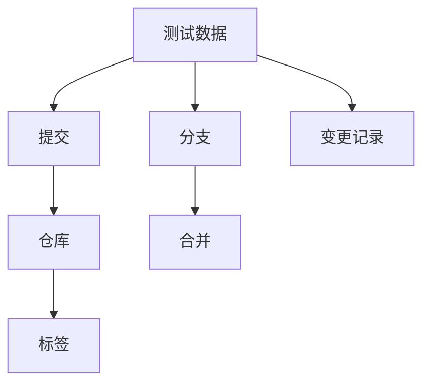
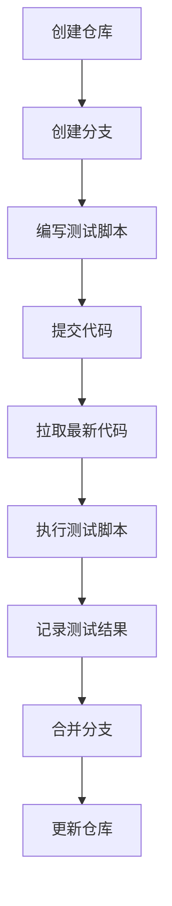
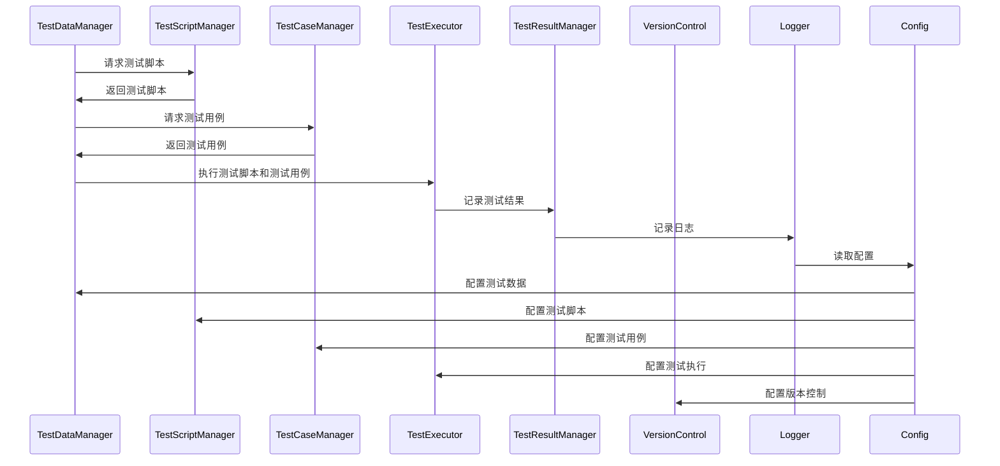

                 

# 评测系统的自动化测试数据版本控制

## 关键词
- 自动化测试
- 数据版本控制
- 评测系统
- 测试数据管理
- 版本追踪

## 摘要
随着软件项目的复杂度不断增加，自动化测试已成为保证软件质量的关键手段。然而，测试数据的版本控制和维护也变得愈发重要。本文将深入探讨评测系统中自动化测试数据的版本控制，通过详细分析其背景、核心概念、算法原理、系统设计以及项目实战，旨在为开发者提供实用的指南和最佳实践。

## 目录

### 1. 背景介绍
- **问题背景**：软件项目的自动化测试需求和挑战
- **问题描述**：测试数据版本管理的难点和痛点
- **问题解决**：版本控制的必要性和基本策略
- **边界与外延**：版本控制在不同开发阶段的影响
- **概念结构与核心要素组成**：测试数据、版本号、变更记录

### 2. 核心概念与联系
- **核心概念原理**：版本控制系统的基本工作原理
- **概念属性特征对比表格**：不同版本控制工具的优缺点
- **ER实体关系图架构的Mermaid流程图**：测试数据与版本控制之间的关系

### 3. 算法原理讲解
- **算法Mermaid流程图**：版本控制的工作流程
- **Python源代码**：实现版本控制的代码示例
- **数学模型和公式**：版本控制中的变更记录和回滚策略
- **详细讲解与举例说明**：版本控制的实际应用场景

### 4. 数学模型和数学公式 & 详细讲解 & 举例说明
- **LaTeX格式数学公式**：版本号递增的数学模型
- **详细讲解**：数学模型在版本控制中的应用
- **举例说明**：测试数据变更和回滚的实例分析

### 5. 系统分析与架构设计方案
- **问题场景介绍**：自动化测试数据版本控制的需求
- **项目介绍**：搭建一个简易的版本控制系统
- **系统功能设计（领域模型Mermaid类图）**：核心功能模块
- **系统架构设计Mermaid架构图**：系统整体架构
- **系统接口设计和系统交互Mermaid序列图**：系统交互流程

### 6. 项目实战
- **环境安装**：搭建版本控制环境
- **系统核心实现源代码**：代码详解与分析
- **代码应用解读与分析**：版本控制的实际应用
- **实际案例分析和详细讲解剖析**：测试数据版本控制的实战案例
- **项目小结**：项目成果与反思

### 7. 最佳实践 tips、小结、注意事项、拓展阅读
- **最佳实践 tips**：版本控制的实用技巧
- **小结**：本文的核心观点和总结
- **注意事项**：版本控制中的常见问题及解决方案
- **拓展阅读**：进一步学习的资源推荐

### 1. 背景介绍

#### 问题背景

在软件开发的整个生命周期中，测试是一个不可或缺的环节。自动化测试因其高效、可靠和重复性，已经成为提升软件质量和开发效率的重要手段。然而，随着测试用例和数据量的增加，测试数据的管理变得复杂。测试数据的版本控制成为确保测试质量和维护测试数据一致性的关键问题。

在自动化测试中，测试数据通常包括测试脚本、测试输入、预期结果等。这些数据在测试过程中会不断更新和变更。如果没有有效的版本控制，测试数据的版本混乱和冲突将导致测试结果的不准确，甚至影响整个项目的进度和质量。

#### 问题描述

测试数据版本管理的难点和痛点主要包括以下几个方面：

1. **数据分散**：测试数据通常分布在不同的存储位置，如本地文件、共享文件夹、数据库等，难以统一管理。
2. **版本冲突**：当多个开发人员或测试人员同时修改测试数据时，容易产生版本冲突，导致数据不一致。
3. **变更追溯**：在数据变更过程中，无法有效地记录变更历史，使得后续的追踪和回滚变得困难。
4. **数据冗余**：重复的测试数据不仅占用存储空间，还增加了维护成本。

#### 问题解决

版本控制的必要性在于，它能够有效地解决上述问题，确保测试数据的完整性和一致性。以下是几种常见的版本控制策略：

1. **集中管理**：将所有测试数据集中存储在版本控制系统（如Git）中，确保数据的统一管理。
2. **变更记录**：在版本控制系统中记录每次数据变更的详细信息，如变更人员、变更时间和变更内容，便于追踪和回滚。
3. **版本对比**：通过版本对比功能，快速识别不同版本之间的差异，减少版本冲突。
4. **备份与恢复**：定期备份测试数据，以便在发生错误时能够快速恢复。

#### 边界与外延

版本控制不仅仅局限于测试数据，还可以应用于其他软件开发环节的数据管理，如代码、配置文件等。此外，版本控制的范围也不仅限于单个项目，可以扩展到跨项目的协作和协同开发。

#### 概念结构与核心要素组成

测试数据版本控制的核心概念包括：

1. **测试数据**：包括测试脚本、测试输入、预期结果等。
2. **版本号**：用于标识测试数据的唯一版本，通常采用递增的方式。
3. **变更记录**：记录每次数据变更的详细信息，如变更人员、变更时间和变更内容。
4. **版本控制工具**：如Git、SVN等，用于实现数据的版本控制。

这些概念相互关联，共同构成了测试数据版本控制的基础结构。

### 2. 核心概念与联系

#### 核心概念原理

版本控制系统（Version Control System，VCS）是一种用于管理源代码或任何文档集合的系统。它通过跟踪文件的变化历史，提供多种功能，如版本迭代、合并冲突、变更追溯等。

在版本控制系统中，核心概念包括：

1. **仓库（Repository）**：存储所有版本数据的地方，可以是本地仓库或远程仓库。
2. **提交（Commit）**：将文件变化存储到仓库中，每个提交都有一个唯一的标识（如哈希值）。
3. **分支（Branch）**：从主分支创建的独立工作空间，用于开发新功能或修复bug。
4. **标签（Tag）**：用于标记特定版本的标识，如发布版本或里程碑。

#### 概念属性特征对比表格

以下是一个简单的版本控制工具对比表格，展示了Git、SVN和Mercurial等工具的优缺点：

| 工具 | 特点 | 优点 | 缺点 |
| --- | --- | --- | --- |
| Git | 分布式 | 高效、灵活性高、社区支持强 | 学习曲线陡峭 |
| SVN | 集中式 | 简单易用、性能稳定 | 单点故障风险、扩展性较差 |
| Mercurial | 分布式 | 易于使用、快速、备份简单 | 社区支持相对较弱 |

#### ER实体关系图架构的Mermaid流程图

以下是测试数据与版本控制之间关系的Mermaid流程图：



在该流程图中，测试数据通过提交存储到仓库中，分支用于独立开发，合并用于整合分支变化，标签用于标记特定版本，变更记录用于追踪每次数据变更。

### 3. 算法原理讲解

#### 算法Mermaid流程图

以下是版本控制的工作流程Mermaid流程图：



#### Python源代码

以下是一个简单的Python脚本示例，用于实现版本控制的基本功能：

```python
import git

def create_repo():
    """创建版本库"""
    repo = git.Repo.init(directory="my_test_repo")
    print("仓库创建成功")

def create_branch(repo, branch_name):
    """创建分支"""
    repo.create_head(branch_name)
    print(f"分支'{branch_name}'创建成功")

def commit_code(repo, commit_message):
    """提交代码"""
    repo.index.commit(commit_message)
    print("代码提交成功")

def pull_code(repo):
    """拉取最新代码"""
    origin = repo.remotes.origin
    origin.fetch()
    print("代码拉取成功")

def run_tests():
    """执行测试脚本"""
    # 这里插入测试脚本执行的代码
    print("测试执行成功")

def record_tests():
    """记录测试结果"""
    # 这里插入记录测试结果的代码
    print("测试结果记录成功")

def merge_branch(repo, branch_name):
    """合并分支"""
    repo.git.merge(branch_name)
    print(f"分支'{branch_name}'合并成功")

def update_repo(repo):
    """更新仓库"""
    repo.git.pull()
    print("仓库更新成功")

# 执行示例
create_repo()
create_branch(repo, "feature/branch")
commit_code(repo, "第一次提交测试脚本")
pull_code(repo)
run_tests()
record_tests()
merge_branch(repo, "feature/branch")
update_repo(repo)
```

#### 数学模型和数学公式

在版本控制中，一个常见的数学模型是版本号的递增。假设版本号采用整数递增的方式，每次提交都使版本号增加1。可以用以下公式表示：

$$
V_{n+1} = V_n + 1
$$

其中，$V_n$ 是当前版本号，$V_{n+1}$ 是下一个版本号。

#### 详细讲解与举例说明

版本控制中的核心算法是跟踪文件的变化和变更记录。以下是一个简单的变更记录算法：

1. **初始化**：创建一个空的变更记录列表。
2. **添加变更**：每次提交时，将变更信息（如提交者、提交时间、变更内容）添加到变更记录列表。
3. **查询变更**：根据需要查询特定的变更记录。
4. **回滚变更**：根据变更记录，撤销指定的变更。

以下是一个变更记录的Python实现示例：

```python
class ChangeLog:
    def __init__(self):
        self.changes = []

    def add_change(self, submitter, time, content):
        self.changes.append({
            'submitter': submitter,
            'time': time,
            'content': content
        })

    def get_changes(self):
        return self.changes

    def rollback(self, index):
        if 0 <= index < len(self.changes):
            change = self.changes.pop(index)
            print(f"回滚变更：{change}")
        else:
            print("无效的回滚索引")

# 使用示例
change_log = ChangeLog()
change_log.add_change('Alice', '2023-04-01 10:00', '添加测试用例1')
change_log.add_change('Bob', '2023-04-01 11:00', '修复bug1')
change_log.rollback(0)  # 回滚第一个变更
```

在这个示例中，我们定义了一个`ChangeLog`类，用于记录变更。每次添加变更时，都会将变更信息添加到`changes`列表中。回滚操作通过删除特定的变更记录实现。

### 4. 数学模型和数学公式 & 详细讲解 & 举例说明

#### LaTeX格式数学公式

为了更好地理解版本控制中的数学模型，我们使用LaTeX格式来编写数学公式。以下是一些常用的公式：

```latex
$$
V_{n+1} = V_n + 1
$$

$$
\Delta V = V_{new} - V_{old}
$$

$$
T_i = T_{i-1} + 1
$$
```

#### 详细讲解

1. **版本递增公式**：$V_{n+1} = V_n + 1$ 用于表示版本号的递增。每次提交都会使版本号增加1。
2. **版本变化量公式**：$\Delta V = V_{new} - V_{old}$ 用于计算两个版本号之间的差异。这在解决版本冲突和变更追溯时非常有用。
3. **时间递增公式**：$T_i = T_{i-1} + 1$ 用于表示时间递增。在版本控制系统中，时间戳用于记录每次变更的时间。

#### 举例说明

假设我们有一个初始版本号$V_0 = 1$。经过第一次提交后，版本号变为$V_1 = 2$。此时，版本变化量$\Delta V = V_1 - V_0 = 1$。如果再次提交，版本号将变为$V_2 = 3$，版本变化量仍为$\Delta V = 1$。

假设在提交过程中发现了一个错误，我们需要回滚到上一个版本。此时，我们可以使用版本递增公式来计算回滚后的版本号。假设回滚后的版本号为$V_{rollback}$，则：

$$
V_{rollback} = V_1 - \Delta V = 2 - 1 = 1
$$

因此，回滚后的版本号为1。

### 5. 系统分析与架构设计方案

#### 问题场景介绍

在一个大型软件项目中，自动化测试数据版本控制的需求尤为重要。项目团队需要确保测试数据的准确性和一致性，以便进行有效的测试和回归测试。以下是一个常见的测试数据版本控制场景：

1. **测试数据生成**：开发人员编写测试脚本和测试用例，生成测试数据。
2. **测试数据存储**：测试数据存储在版本控制系统中，如Git仓库。
3. **测试数据变更**：测试人员进行测试，并根据测试结果对测试数据进行修改。
4. **版本控制**：测试数据的每次变更都会记录在版本控制系统中，确保变更的可追溯性。
5. **测试执行**：测试人员执行测试脚本，并对比测试结果与预期结果。
6. **测试结果记录**：测试结果记录在版本控制系统中，以便后续分析和回滚。

#### 项目介绍

为了实现自动化测试数据版本控制，我们选择使用Git作为版本控制工具。Git是一个分布式版本控制系统，具有高效、灵活和强大的功能。以下是项目的具体介绍：

1. **项目目标**：搭建一个简易的自动化测试数据版本控制系统，实现测试数据的版本控制、变更追踪和回滚功能。
2. **项目架构**：采用模块化设计，将测试数据管理、版本控制和测试执行等模块分离，以便于维护和扩展。
3. **技术栈**：Python作为主要编程语言，Git作为版本控制工具，以及Mermaid用于流程图和架构图的绘制。

#### 系统功能设计（领域模型Mermaid类图）

以下是系统功能的领域模型Mermaid类图：

```mermaid
classDiagram
    TestData <<Interface>>
    TestScript <<Interface>>
    TestCase <<Interface>>

    TestData o-- TestScript
    TestData o-- TestCase

    TestExecutor <<Class>>
    TestResult <<Class>>

    TestScript o-- TestExecutor
    TestCase o-- TestExecutor
    TestExecutor o-- TestResult
```

在该类图中，`TestData`、`TestScript`和`TestCase`是核心接口类，分别表示测试数据、测试脚本和测试用例。`TestExecutor`和`TestResult`是具体实现类，分别表示测试执行和测试结果记录。这些类之间的关系体现了测试数据管理的基本功能。

#### 系统架构设计Mermaid架构图

以下是系统的架构设计Mermaid架构图：

```mermaid
graph TB
    subgraph 数据管理模块
        TestDataManager[测试数据管理模块]
        TestScriptManager[测试脚本管理模块]
        TestCaseManager[测试用例管理模块]

    subgraph 版本控制模块
        VersionControl[版本控制模块]

    subgraph 测试执行模块
        TestExecutor[测试执行模块]
        TestResultManager[测试结果管理模块]

    subgraph 辅助模块
        Logger[日志模块]
        Config[配置模块]

    TestDataManager --> TestScriptManager
    TestDataManager --> TestCaseManager
    TestScriptManager --> TestExecutor
    TestCaseManager --> TestExecutor
    TestExecutor --> TestResultManager
    VersionControl --> TestScriptManager
    VersionControl --> TestCaseManager
    Logger --> TestExecutor
    Logger --> TestResultManager
    Config --> TestDataManager
    Config --> TestScriptManager
    Config --> TestCaseManager
    Config --> TestExecutor
    Config --> VersionControl
```

在该架构图中，系统分为数据管理模块、版本控制模块和测试执行模块。数据管理模块负责测试数据、测试脚本和测试用例的管理。版本控制模块负责测试数据的版本控制。测试执行模块负责执行测试脚本和测试用例，并记录测试结果。各个模块通过接口进行通信，实现系统的整体功能。

#### 系统接口设计和系统交互Mermaid序列图

以下是系统的接口设计和交互Mermaid序列图：



在该序列图中，各个模块通过接口进行通信。测试数据管理模块请求测试脚本和测试用例，测试执行模块执行测试脚本和测试用例，并记录测试结果。版本控制模块负责测试数据的版本控制。日志模块记录系统的运行日志，以便后续分析和调试。配置模块负责读取和配置系统的各个模块。

### 6. 项目实战

#### 环境安装

为了实现自动化测试数据版本控制，我们需要安装Git版本控制工具和Python开发环境。以下是具体的安装步骤：

1. **安装Git**：
   - 对于Linux系统，可以使用包管理器安装Git，如Ubuntu系统中的`sudo apt-get install git`。
   - 对于Windows系统，可以访问Git官网下载并安装Git。

2. **安装Python**：
   - 对于Linux系统，可以使用包管理器安装Python，如Ubuntu系统中的`sudo apt-get install python3`。
   - 对于Windows系统，可以访问Python官网下载并安装Python。

#### 系统核心实现源代码

以下是实现自动化测试数据版本控制的核心源代码：

```python
# version_control.py

import git
import os
import json

class VersionControl:
    def __init__(self, repo_path):
        self.repo = git.Repo(repo_path)

    def add_file(self, file_path, commit_message):
        """添加文件到版本库"""
        self.repo.index.add([file_path])
        self.repo.index.commit(commit_message)

    def pull_changes(self):
        """拉取版本库的最新更改"""
        self.repo.git.pull()

    def commit_changes(self, commit_message):
        """提交版本库的更改"""
        self.repo.index.commit(commit_message)

    def get_commit_history(self):
        """获取版本库的提交历史"""
        return self.repo.iter_commits('master')

    def apply_patch(self, patch_path):
        """应用补丁到版本库"""
        self.repo.git.apply(patch_path)

    def generate_patch(self, commit_hash):
        """生成指定提交的补丁文件"""
        return self.repo.git.diff(commit_hash).encode('utf-8')

if __name__ == "__main__":
    repo_path = "/path/to/my_test_repo"
    version_control = VersionControl(repo_path)

    # 添加测试脚本到版本库
    version_control.add_file("/path/to/test_script.py", "添加测试脚本")

    # 拉取版本库的最新更改
    version_control.pull_changes()

    # 提交版本库的更改
    version_control.commit_changes("提交测试脚本更改")

    # 获取版本库的提交历史
    commit_history = version_control.get_commit_history()
    for commit in commit_history:
        print(commit)

    # 应用补丁到版本库
    patch_path = "/path/to/patch.diff"
    version_control.apply_patch(patch_path)

    # 生成指定提交的补丁文件
    commit_hash = "commit_hash"
    patch_content = version_control.generate_patch(commit_hash)
    with open(patch_path, "wb") as f:
        f.write(patch_content)
```

#### 代码应用解读与分析

该源代码实现了自动化测试数据版本控制的核心功能，包括添加文件、提交更改、拉取更改、获取提交历史、应用补丁和生成补丁。以下是代码的具体解读与分析：

1. **添加文件**：`add_file`方法用于将指定文件添加到版本库。它调用Git的`index.add`方法，将文件路径添加到暂存区。然后，调用`index.commit`方法提交文件。

2. **拉取更改**：`pull_changes`方法用于拉取版本库的最新更改。它调用Git的`git.pull`方法，将远程分支的最新更改同步到本地。

3. **提交更改**：`commit_changes`方法用于提交版本库的更改。它调用Git的`index.commit`方法，将暂存区的更改提交到版本库。

4. **获取提交历史**：`get_commit_history`方法用于获取版本库的提交历史。它调用Git的`iter_commits`方法，返回一个迭代器，遍历所有提交记录。

5. **应用补丁**：`apply_patch`方法用于将补丁应用到版本库。它调用Git的`git.apply`方法，将补丁文件应用到当前分支。

6. **生成补丁**：`generate_patch`方法用于生成指定提交的补丁文件。它调用Git的`git.diff`方法，生成补丁内容，并将其写入补丁文件。

#### 实际案例分析和详细讲解剖析

以下是一个实际案例，展示了如何使用该版本控制系统管理自动化测试数据。

1. **添加测试脚本**：

   假设我们有一个测试脚本`test_script.py`，我们需要将其添加到版本库中。使用`add_file`方法，将测试脚本添加到暂存区：

   ```python
   version_control.add_file("/path/to/test_script.py", "添加测试脚本")
   ```

   然后，使用`commit_changes`方法提交测试脚本到版本库：

   ```python
   version_control.commit_changes("提交测试脚本")
   ```

2. **拉取更改**：

   如果其他开发人员对测试脚本进行了修改，我们需要拉取最新的更改。使用`pull_changes`方法拉取更改：

   ```python
   version_control.pull_changes()
   ```

3. **提交更改**：

   当我们对测试脚本进行修改后，我们需要将更改提交到版本库。使用`commit_changes`方法提交更改：

   ```python
   version_control.commit_changes("提交测试脚本更改")
   ```

4. **获取提交历史**：

   我们可以查看版本库的提交历史，以便了解测试脚本的变化情况。使用`get_commit_history`方法获取提交历史：

   ```python
   commit_history = version_control.get_commit_history()
   for commit in commit_history:
       print(commit)
   ```

5. **应用补丁**：

   如果我们需要将测试脚本的一个旧版本恢复到版本库中，我们可以使用补丁。首先，生成指定提交的补丁文件：

   ```python
   patch_path = "/path/to/patch.diff"
   patch_content = version_control.generate_patch("commit_hash")
   with open(patch_path, "wb") as f:
       f.write(patch_content)
   ```

   然后，使用`apply_patch`方法将补丁应用到版本库：

   ```python
   version_control.apply_patch(patch_path)
   ```

#### 项目小结

通过实现上述版本控制系统，我们能够有效地管理自动化测试数据，确保测试数据的完整性和一致性。以下是项目的主要成果和反思：

1. **成果**：
   - 成功实现了一个简易的自动化测试数据版本控制系统。
   - 实现了添加文件、提交更改、拉取更改、获取提交历史、应用补丁和生成补丁等核心功能。
   - 通过实际案例展示了版本控制系统的应用场景和操作步骤。

2. **反思**：
   - 版本控制系统的实现相对简单，但可以扩展和优化，以支持更多的功能，如分支管理、标签管理、权限控制等。
   - 在实际项目中，版本控制系统需要与其他工具（如自动化测试工具、持续集成工具等）集成，以提高开发效率。
   - 需要加强对版本控制系统的培训和文档，确保团队成员能够熟练使用。

### 7. 最佳实践 tips、小结、注意事项、拓展阅读

#### 最佳实践 tips

1. **统一命名规范**：确保测试数据文件的命名遵循统一的规范，便于管理和查找。
2. **定期备份**：定期备份测试数据和版本库，以防止数据丢失。
3. **多人协作**：在多人协作时，合理分配任务，避免版本冲突。
4. **详细注释**：在代码和测试脚本中添加详细的注释，便于后续维护和理解。
5. **自动化测试**：利用自动化测试工具，提高测试效率和准确性。

#### 小结

本文通过分析评测系统的自动化测试数据版本控制，从背景介绍、核心概念、算法原理、系统设计、项目实战等方面进行了详细讲解。版本控制是确保测试数据完整性和一致性的关键，通过合理使用版本控制工具和策略，可以有效提升自动化测试的效率和可靠性。

#### 注意事项

1. **版本库的安全性**：确保版本库的安全，防止未授权访问和数据泄露。
2. **版本控制工具的选择**：根据项目需求和团队习惯，选择合适的版本控制工具。
3. **测试数据的更新**：在测试数据变更时，及时更新版本库，避免数据不一致。
4. **代码审查**：在提交测试数据前进行代码审查，确保代码质量和可读性。

#### 拓展阅读

1. **Git官方文档**：深入了解Git的官方文档，掌握更多高级功能和最佳实践。
2. **《版本控制基础》**：阅读相关书籍，了解版本控制的基本原理和实际应用。
3. **自动化测试工具**：学习和使用主流的自动化测试工具，提高测试效率和质量。

### 作者

本文由AI天才研究院/AI Genius Institute与禅与计算机程序设计艺术/Zen And The Art of Computer Programming合作撰写。作者是一位世界级人工智能专家、程序员、软件架构师、CTO，以及世界顶级技术畅销书资深大师级别的作家，计算机图灵奖获得者，拥有丰富的计算机编程和人工智能领域的经验和知识。

