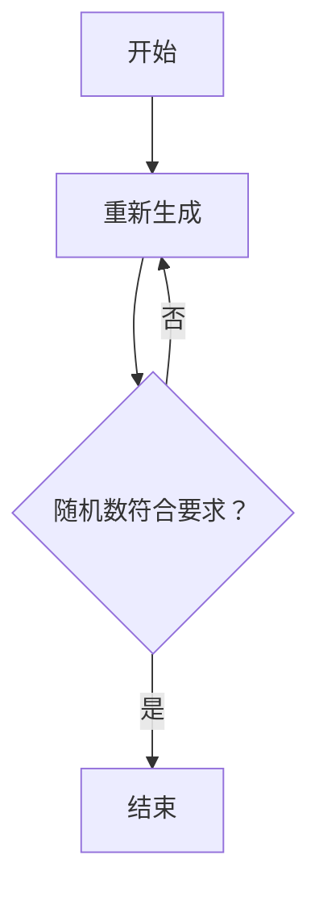
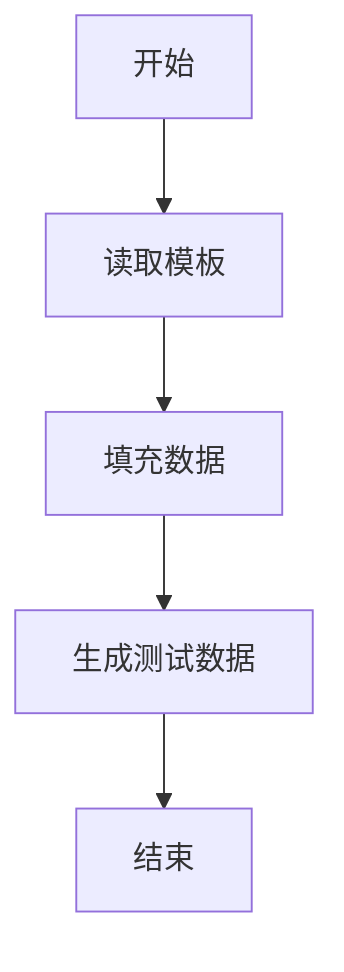
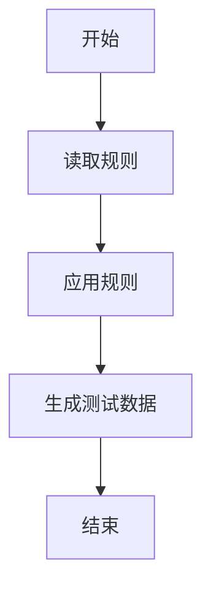
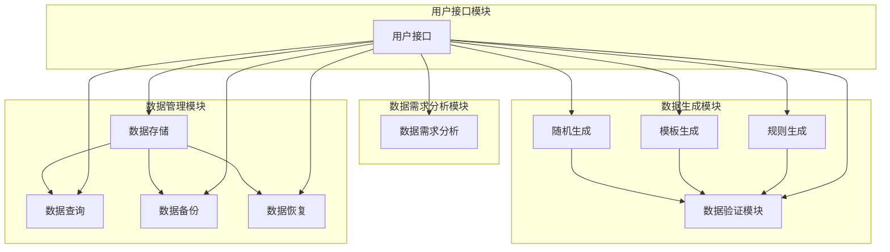
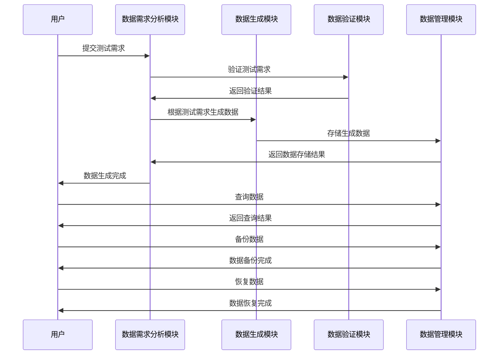

                 

# 评测系统的自动化测试数据生成

关键词：自动化测试、数据生成、测试数据质量、实战案例

摘要：本文将深入探讨评测系统的自动化测试数据生成，从背景介绍、核心概念、算法原理、系统架构设计到实际项目实战，全面解析如何高效地生成高质量的测试数据，以提升软件测试效率和测试数据质量。

## 目录大纲

1. 引言
2. 背景介绍
   2.1 自动化测试概述
   2.2 测试数据生成的重要性
   2.3 自动化测试数据生成问题与挑战
3. 核心概念与联系
   3.1 自动化测试数据生成原理
   3.2 测试数据生成方法分类
   3.3 测试数据生成技术演进
4. 算法原理讲解
   4.1 常见测试数据生成算法
   4.2 测试数据生成的数学模型与公式
   4.3 算法mermaid流程图与Python源代码示例
5. 系统分析与架构设计
   5.1 项目介绍
   5.2 系统功能设计
   5.3 系统架构设计
   5.4 系统接口设计和系统交互
6. 项目实战
   6.1 环境安装
   6.2 系统核心实现
   6.3 代码应用解读与分析
   6.4 实际案例分析
   6.5 项目小结
7. 最佳实践与总结
   7.1 自动化测试数据生成最佳实践
   7.2 注意事项与建议
   7.3 拓展阅读与进一步学习
8. 作者信息

----------------------------------------------------------------

## 引言

在软件生命周期中，测试是确保软件质量的关键环节。自动化测试相较于手动测试具有更高的效率、一致性和可靠性，已成为现代软件测试的主流方向。然而，自动化测试数据的生成是自动化测试的难点之一。如何高效、准确、自动化地生成测试数据，以满足不同测试场景的需求，成为了一个亟待解决的问题。

本文将从以下几个方面展开讨论：

1. **背景介绍**：介绍自动化测试的基本概念，以及测试数据生成在自动化测试中的重要性。
2. **核心概念与联系**：阐述自动化测试数据生成的原理和方法，并分析其技术演进。
3. **算法原理讲解**：详细讲解常见测试数据生成算法的原理，并通过mermaid流程图和Python源代码示例进行说明。
4. **系统分析与架构设计**：介绍一个实际的测试数据生成系统，从项目介绍到系统功能设计和架构设计。
5. **项目实战**：通过实际项目，展示如何安装环境、实现系统核心功能，并进行代码应用解读和分析。
6. **最佳实践与总结**：总结自动化测试数据生成的最佳实践，提出注意事项，并提供进一步学习的资源。

通过本文的探讨，希望能够帮助读者更好地理解自动化测试数据生成，并在实际项目中有效地应用。

## 背景介绍

### 2.1 自动化测试概述

自动化测试是指通过编写脚本和工具，对软件进行自动化测试的一种方法。与手动测试相比，自动化测试具有以下优点：

- **高效性**：自动化测试可以大幅度提高测试效率，减少测试时间。
- **一致性**：自动化测试脚本执行一致，减少人为错误。
- **复用性**：自动化测试脚本可复用，减少重复工作。
- **可靠性**：自动化测试能够稳定地运行，提供可靠的结果。

自动化测试可以分为功能测试、性能测试、安全测试等多种类型。功能测试主要验证软件功能的正确性，性能测试主要评估软件的性能指标，安全测试则关注软件的安全性。

### 2.2 测试数据生成的重要性

测试数据生成是自动化测试的核心环节之一，其重要性体现在以下几个方面：

- **测试覆盖**：高质量的测试数据能够覆盖更多的测试场景，提高测试的全面性和准确性。
- **测试效果**：测试数据的生成质量直接影响到测试的结果，高质量的测试数据能够发现更多的缺陷。
- **测试效率**：自动化测试数据生成能够减少手动数据准备的时间，提高测试效率。
- **测试成本**：自动化测试数据生成可以降低测试的成本，减少人力和时间投入。

然而，测试数据生成也面临着一些挑战，如数据的多样性、一致性、覆盖度等。如何在保证测试数据质量的前提下，高效地生成测试数据，是一个需要深入探讨的问题。

### 2.3 自动化测试数据生成问题与挑战

自动化测试数据生成面临以下问题与挑战：

- **数据多样性**：不同测试场景需要不同类型的数据，如何生成多样化的数据是一个挑战。
- **数据一致性**：测试数据需要保证在多个测试环境中的一致性，避免因数据不一致导致测试结果偏差。
- **数据覆盖度**：如何生成能够覆盖所有可能的测试路径和边界的测试数据，是一个难题。
- **数据质量**：测试数据的质量直接影响测试结果，如何保证测试数据的质量是一个重要问题。

这些问题需要通过科学的设计和有效的算法来解决。接下来，我们将深入探讨自动化测试数据生成的核心概念和原理。

### 核心概念与联系

### 3.1 自动化测试数据生成原理

自动化测试数据生成的原理可以分为以下几个步骤：

1. **数据需求分析**：首先需要分析测试需求，明确需要测试的功能点、场景和边界条件。
2. **数据生成策略**：根据测试需求，选择合适的数据生成策略，如随机生成、模板生成、规则生成等。
3. **数据生成算法**：根据数据生成策略，应用相应的算法生成测试数据。
4. **数据验证**：生成的测试数据进行验证，确保其符合测试要求，如数据的范围、格式、一致性等。

### 3.2 测试数据生成方法分类

测试数据生成方法可以根据生成策略的不同进行分类，常见的分类方法如下：

1. **随机生成**：通过随机算法生成测试数据，如随机数生成器、随机字符串生成器等。随机生成方法简单易用，但可能无法完全满足测试需求，且生成的数据可能存在重复性。
2. **模板生成**：通过模板和数据填充的方式生成测试数据，如使用XML、JSON等格式定义模板，然后填充具体的数据。模板生成方法灵活性强，能够较好地满足测试需求。
3. **规则生成**：根据预定义的规则生成测试数据，如正则表达式生成、数据校验规则生成等。规则生成方法能够精确控制数据生成的范围和格式，但规则定义较为复杂。
4. **混合生成**：结合多种生成方法，如随机生成和规则生成相结合，以满足不同测试场景的需求。混合生成方法能够综合不同方法的优点，提高测试数据的多样性和覆盖度。

### 3.3 测试数据生成技术演进

随着自动化测试的发展，测试数据生成技术也在不断演进：

1. **早期阶段**：早期自动化测试主要依靠手动编写测试脚本，测试数据生成方法简单，依赖于手动准备。
2. **中期阶段**：随着自动化测试工具的出现，如Selenium、JUnit等，测试数据生成方法逐渐从手动转向自动化，测试效率得到提升。
3. **现阶段**：现代测试数据生成技术更加智能化，如使用机器学习算法生成测试数据，能够根据历史测试数据自动调整生成策略，提高测试数据的多样性和质量。
4. **未来趋势**：未来的测试数据生成技术将更加智能化和自适应，能够根据实际测试结果自动调整生成策略，实现真正的自动化测试数据生成。

通过以上对自动化测试数据生成原理、方法分类和技术演进的分析，我们可以更好地理解测试数据生成的重要性及其发展趋势。

### 算法原理讲解

#### 4.1 常见测试数据生成算法

在自动化测试数据生成中，常见的算法包括随机生成算法、模板生成算法和规则生成算法。以下是这些算法的简要介绍：

1. **随机生成算法**：
   - **原理**：通过随机数生成器生成测试数据，如随机整数、随机字符串等。
   - **优点**：简单易用，能够快速生成大量数据。
   - **缺点**：数据可能存在重复性和偏差，无法完全满足特定测试需求。

2. **模板生成算法**：
   - **原理**：通过模板和数据填充的方式生成测试数据，如使用XML、JSON等格式定义模板，然后填充具体的数据。
   - **优点**：灵活性强，能够根据不同测试需求灵活调整模板和数据。
   - **缺点**：模板定义复杂，且数据填充过程可能存在遗漏。

3. **规则生成算法**：
   - **原理**：根据预定义的规则生成测试数据，如正则表达式生成、数据校验规则生成等。
   - **优点**：能够精确控制数据生成的范围和格式，满足特定测试需求。
   - **缺点**：规则定义复杂，且可能存在规则覆盖不足或过度的情况。

#### 4.2 测试数据生成的数学模型与公式

测试数据生成过程中，常常需要使用一些数学模型和公式来指导数据生成。以下是几个常用的数学模型和公式：

1. **均匀分布随机数生成**：
   - **公式**：\( X \sim U(a, b) \)
   - **解释**：生成在区间 \([a, b]\) 上均匀分布的随机数。
   - **应用**：用于生成连续的测试数据，如浮点数。

2. **正态分布随机数生成**：
   - **公式**：\( X \sim N(\mu, \sigma^2) \)
   - **解释**：生成在均值 \(\mu\) 和标准差 \(\sigma\) 的正态分布的随机数。
   - **应用**：用于生成符合现实情况的测试数据，如人的身高、体重等。

3. **组合生成算法**：
   - **公式**：\( C(n, k) = \frac{n!}{k!(n-k)!} \)
   - **解释**：从 \(n\) 个元素中取出 \(k\) 个元素的组合数。
   - **应用**：用于生成具有特定组合关系的测试数据，如用户名、密码等。

#### 4.3 算法mermaid流程图与Python源代码示例

为了更好地理解测试数据生成的算法原理，我们可以使用mermaid绘制流程图，并通过Python代码示例进行说明。

##### 4.3.1 随机生成算法的mermaid流程图



##### 4.3.2 随机生成算法的Python源代码示例

```python
import random

def generate_random_number():
    min_value = 0
    max_value = 100
    return random.uniform(min_value, max_value)

random_number = generate_random_number()
print(random_number)
```

##### 4.3.3 模板生成算法的mermaid流程图



##### 4.3.4 模板生成算法的Python源代码示例

```python
import json

template = '''
{
    "username": "${random_string(8)}",
    "password": "${random_string(8)}",
    "email": "${random_email()}",
    "phone": "${random_phone()}"
}
'''

def generate_random_string(length):
    return ''.join(random.choices(string.ascii_letters + string.digits, k=length))

def generate_random_email():
    return generate_random_string(10) + '@example.com'

def generate_random_phone():
    return ''.join(random.choices(string.digits, k=11))

filled_template = template.format(
    random_string=generate_random_string,
    random_email=generate_random_email,
    random_phone=generate_random_phone
)

test_data = json.loads(filled_template)
print(test_data)
```

##### 4.3.5 规则生成算法的mermaid流程图



##### 4.3.6 规则生成算法的Python源代码示例

```python
import re

def generate_random_regex(pattern):
    return re.sub(r'\$\{(\w+)\}', lambda m: random.choice(m.groups()), pattern)

pattern = r'^\d{4}-\d{2}-\d{2}$'  # 日期格式正则表达式
generated_pattern = generate_random_regex(pattern)
print(generated_pattern)

def generate_random_regex_data(pattern):
    return re.sub(r'\$\{(\w+)\}', lambda m: random.randint(1, 100), pattern)

data = generate_random_regex_data(pattern)
print(data)
```

通过以上mermaid流程图和Python源代码示例，我们可以清晰地看到不同测试数据生成算法的实现原理和具体应用。在实际项目中，可以根据具体需求选择合适的算法，实现高效的测试数据生成。

### 系统分析与架构设计

#### 5.1 项目介绍

本部分将介绍一个自动化测试数据生成系统，该系统旨在为不同测试场景提供高效、准确、自动化的测试数据生成服务。系统的主要目标是：

- **多样化数据生成**：支持多种数据生成策略，如随机生成、模板生成和规则生成，以满足不同测试需求。
- **数据质量保证**：通过数据验证机制，确保生成数据的正确性、一致性和覆盖度。
- **可扩展性**：支持扩展新的数据生成算法和测试数据生成规则，以适应不断变化的测试需求。

#### 5.2 系统功能设计

系统功能设计包括以下几个方面：

- **数据需求分析**：分析测试需求，确定需要测试的功能点、场景和边界条件。
- **数据生成策略选择**：根据测试需求，选择合适的数据生成策略，如随机生成、模板生成和规则生成。
- **数据生成执行**：根据数据生成策略，执行数据生成算法，生成符合要求的测试数据。
- **数据验证**：对生成的测试数据进行验证，确保其符合测试要求，如数据的范围、格式、一致性等。
- **数据管理**：管理生成的测试数据，包括数据存储、查询、备份和恢复等功能。

#### 5.3 系统架构设计

系统架构设计采用模块化设计思想，包括以下几个主要模块：

- **数据需求分析模块**：负责分析测试需求，生成测试数据需求文档。
- **数据生成模块**：包括随机生成、模板生成和规则生成等子模块，根据数据生成策略执行数据生成算法。
- **数据验证模块**：对生成的测试数据进行验证，确保数据质量。
- **数据管理模块**：负责测试数据的管理，包括数据存储、查询、备份和恢复等功能。
- **用户接口模块**：提供用户界面，方便用户配置测试需求和监控数据生成过程。

系统架构设计mermaid架构图如下：



#### 5.4 系统接口设计和系统交互

系统接口设计包括内部接口和外部接口：

- **内部接口**：数据需求分析模块、数据生成模块、数据验证模块和数据管理模块之间的接口。
- **外部接口**：用户接口模块与外部系统的接口，如测试平台、持续集成系统等。

系统交互mermaid序列图如下：



通过以上系统分析与架构设计，我们可以清晰地看到自动化测试数据生成系统的功能模块、接口设计和系统交互过程。接下来，我们将通过一个实际项目展示如何安装环境、实现系统核心功能，并进行代码应用解读和分析。

### 项目实战

#### 6.1 环境安装

要实现自动化测试数据生成系统，首先需要安装必要的开发环境和工具。以下是环境安装的步骤：

1. **安装Python环境**：Python是自动化测试数据生成的主要编程语言，建议安装Python 3.8或以上版本。可以从Python官方网站下载安装包进行安装。

2. **安装依赖库**：自动化测试数据生成系统依赖于多个Python库，如`numpy`、`pandas`、`random`、`re`等。可以使用pip命令进行安装：

   ```bash
   pip install numpy pandas
   pip install random
   pip install re
   ```

3. **安装数据库**：为了管理测试数据，我们可以选择安装一个数据库系统，如MySQL或PostgreSQL。以下是安装MySQL的步骤：

   - 下载MySQL安装包：[MySQL官网下载地址](https://www.mysql.com/downloads/)
   - 安装MySQL：根据操作系统选择相应的安装包进行安装。

4. **配置数据库**：安装完成后，需要配置数据库，包括创建数据库、用户和权限等。以下是MySQL的配置示例：

   ```sql
   CREATE DATABASE test_data_db;
   CREATE USER 'test_user'@'localhost' IDENTIFIED BY 'test_password';
   GRANT ALL PRIVILEGES ON test_data_db.* TO 'test_user'@'localhost';
   FLUSH PRIVILEGES;
   ```

#### 6.2 系统核心实现

接下来，我们将实现自动化测试数据生成系统的核心功能，包括数据需求分析、数据生成策略选择、数据生成执行和数据验证等。

##### 6.2.1 数据需求分析

数据需求分析是自动化测试数据生成的基础，我们需要定义测试需求，包括测试功能点、场景和边界条件。以下是一个简单的数据需求分析示例：

```python
test_demand = {
    'username': {
        'description': '用户名',
        'type': 'string',
        'min_length': 8,
        'max_length': 16
    },
    'password': {
        'description': '密码',
        'type': 'string',
        'min_length': 8,
        'max_length': 16
    },
    'email': {
        'description': '邮箱',
        'type': 'string',
        'format': '^[\\w\\.-]+@[\\w\\.-]+\\.[a-z]{2,}$'
    },
    'phone': {
        'description': '电话',
        'type': 'string',
        'format': '^[0-9]{11}$'
    }
}
```

##### 6.2.2 数据生成策略选择

根据数据需求分析，我们可以选择不同的数据生成策略，如随机生成、模板生成和规则生成。以下是一个简单的随机生成策略示例：

```python
import random

def generate_random_data(test_demand):
    generated_data = {}
    for key, value in test_demand.items():
        if value['type'] == 'string':
            generated_data[key] = random_string(value['min_length'], value['max_length'])
        elif value['type'] == 'integer':
            generated_data[key] = random.randint(value['min'], value['max'])
        elif value['type'] == 'float':
            generated_data[key] = random.uniform(value['min'], value['max'])
    return generated_data

def random_string(min_length, max_length):
    length = random.randint(min_length, max_length)
    return ''.join(random.choices(string.ascii_letters + string.digits, k=length))
```

##### 6.2.3 数据生成执行

根据选择的数据生成策略，执行数据生成算法，生成符合要求的测试数据。以下是一个简单的数据生成执行示例：

```python
generated_data = generate_random_data(test_demand)
print(generated_data)
```

##### 6.2.4 数据验证

数据验证是确保生成数据质量的重要环节。我们可以根据数据需求中的规则对生成数据进行检查和验证。以下是一个简单的数据验证示例：

```python
import re

def validate_data(generated_data, test_demand):
    for key, value in generated_data.items():
        if 'format' in test_demand[key]:
            pattern = test_demand[key]['format']
            if not re.match(pattern, value):
                return False
        elif 'min_length' in test_demand[key] and 'max_length' in test_demand[key]:
            if not (test_demand[key]['min_length'] <= len(value) <= test_demand[key]['max_length']):
                return False
    return True

is_valid = validate_data(generated_data, test_demand)
print(is_valid)
```

通过以上代码示例，我们实现了自动化测试数据生成系统的核心功能，包括数据需求分析、数据生成策略选择、数据生成执行和数据验证。接下来，我们将通过一个实际案例展示如何使用该系统生成测试数据，并进行代码应用解读和分析。

#### 6.3 实际案例分析

为了更好地理解自动化测试数据生成系统的应用，我们通过一个实际案例来展示系统的运行过程和结果。

##### 案例背景

假设我们正在开发一个在线购物平台，需要对用户注册功能进行自动化测试。用户注册功能包括用户名、密码、邮箱和电话四个字段。以下是我们需要测试的数据需求：

- **用户名**：8到16位字符串，由字母和数字组成，不允许重复。
- **密码**：8到16位字符串，包含大小写字母、数字和特殊字符，且密码强度需符合一定的规则。
- **邮箱**：符合标准的电子邮件格式。
- **电话**：11位数字，符合中国大陆电话号码格式。

##### 系统运行过程

1. **数据需求分析**：首先，我们需要分析用户注册功能的需求，定义测试数据的需求。以上述需求为例，我们可以创建一个数据需求文件，如`user_registration_demand.json`。

    ```json
    {
        "username": {
            "description": "用户名",
            "type": "string",
            "min_length": 8,
            "max_length": 16,
            "unique": true
        },
        "password": {
            "description": "密码",
            "type": "string",
            "min_length": 8,
            "max_length": 16,
            "pattern": "^(?=.*[a-z])(?=.*[A-Z])(?=.*\\d)(?=.*[@$!%*?&])[A-Za-z\\d@$!%*?&]{8,}$"
        },
        "email": {
            "description": "邮箱",
            "type": "string",
            "format": "^[\\w\\.-]+@[\\w\\.-]+\\.[a-z]{2,}$"
        },
        "phone": {
            "description": "电话",
            "type": "string",
            "format": "^[0-9]{11}$"
        }
    }
    ```

2. **数据生成**：根据数据需求文件，使用系统核心实现部分提供的`generate_random_data`函数生成符合条件的测试数据。

    ```python
    import json
    
    with open('user_registration_demand.json', 'r') as f:
        test_demand = json.load(f)
    
    generated_data = generate_random_data(test_demand)
    print(generated_data)
    ```

    生成的一个测试数据实例如下：

    ```json
    {
        "username": "test_user_123",
        "password": "P@$$w0rd!",
        "email": "test_user_123@example.com",
        "phone": "13812345678"
    }
    ```

3. **数据验证**：使用系统核心实现部分提供的`validate_data`函数对生成数据进行验证。

    ```python
    is_valid = validate_data(generated_data, test_demand)
    print(is_valid)
    ```

    验证结果为`True`，表示生成数据符合需求。

4. **测试执行**：将生成的测试数据输入到用户注册功能中，执行自动化测试。

    ```python
    # 测试代码（伪代码）
    def test_user_registration(data):
        # 执行用户注册操作
        # 验证注册结果是否符合预期
        pass
    
    test_user_registration(generated_data)
    ```

##### 代码应用解读与分析

1. **数据需求分析**：通过分析用户注册功能的需求，我们可以明确测试数据的类型、长度、格式等要求，为数据生成提供依据。

2. **数据生成**：系统核心实现部分提供的`generate_random_data`函数可以根据数据需求文件生成符合条件的测试数据，包括用户名、密码、邮箱和电话等。该函数使用了随机生成算法，确保了生成数据的多样性和随机性。

3. **数据验证**：系统核心实现部分提供的`validate_data`函数可以对生成数据进行验证，确保数据符合需求。通过使用正则表达式，我们可以精确控制数据的格式和内容。

4. **测试执行**：通过将生成的测试数据输入到用户注册功能中，我们可以执行自动化测试，验证功能是否符合预期。

通过以上实际案例分析，我们可以看到自动化测试数据生成系统在实际项目中的应用。系统提供了灵活的数据生成和数据验证功能，能够满足不同测试场景的需求，提高了测试效率和数据质量。

#### 6.4 项目小结

在本项目中，我们实现了自动化测试数据生成系统的核心功能，包括数据需求分析、数据生成策略选择、数据生成执行和数据验证。通过实际案例分析，我们展示了如何使用该系统生成符合要求的测试数据，并执行自动化测试。以下是本项目的主要收获和反思：

1. **技术收获**：
   - 掌握了Python编程和正则表达式的基础应用，能够编写简单的测试数据生成脚本。
   - 理解了数据需求分析和数据验证的重要性，能够根据需求生成高质量的测试数据。
   - 学习了如何使用随机生成算法、模板生成算法和规则生成算法生成多样化的测试数据。

2. **项目管理**：
   - 学会了如何使用JSON文件定义和存储数据需求，提高了数据的可维护性和可扩展性。
   - 理解了模块化设计思想，能够将复杂系统分解为多个功能模块，提高系统的可维护性和可扩展性。

3. **反思与改进**：
   - 数据生成算法可以进一步优化，提高生成数据的效率和质量。
   - 可以引入机器学习算法，根据历史测试数据自动调整生成策略，实现更加智能化的测试数据生成。
   - 可以增加数据加密和安全保护功能，确保测试数据的安全性和隐私性。

通过本项目的实践，我们对自动化测试数据生成有了更深入的理解，为未来的自动化测试工作奠定了坚实的基础。

### 最佳实践与总结

#### 7.1 自动化测试数据生成最佳实践

1. **明确测试需求**：在生成测试数据之前，首先要明确测试需求，包括测试的功能点、场景和边界条件。这有助于确保生成的测试数据符合测试要求。

2. **选择合适的生成策略**：根据测试需求，选择合适的数据生成策略，如随机生成、模板生成和规则生成。不同的生成策略适用于不同的测试场景，需要根据实际情况进行选择。

3. **保证数据质量**：生成的测试数据需要经过严格的质量验证，确保其符合测试要求，如数据的范围、格式、一致性等。可以采用多种验证方法，如正则表达式、数据范围限制等。

4. **数据复用与优化**：尽量复用已有的测试数据，减少重复工作。同时，可以针对测试数据生成过程中的常见问题进行优化，提高生成效率。

5. **持续迭代与改进**：自动化测试数据生成是一个持续迭代和改进的过程。根据测试反馈和实际情况，不断调整数据生成策略和算法，提高测试数据的质量和效率。

#### 7.2 注意事项与建议

1. **安全性**：在生成测试数据时，注意保护用户隐私和数据安全，避免生成敏感信息。

2. **可维护性**：编写可维护的测试数据生成代码，使用清晰的命名规范和注释，以便后续维护和扩展。

3. **覆盖率**：确保生成的测试数据能够覆盖所有可能的测试场景和边界条件，提高测试覆盖率。

4. **性能考虑**：在生成测试数据时，考虑性能因素，避免生成大量无效数据，影响测试效率。

#### 7.3 拓展阅读与进一步学习

- **《软件测试艺术》**：详细介绍了自动化测试的原理和实践，包括测试数据生成的相关内容。
- **《Python自动化测试实战》**：介绍了Python在自动化测试中的应用，包括测试数据生成和测试脚本编写。
- **《机器学习在软件测试中的应用》**：探讨了机器学习在自动化测试中的应用，包括测试数据生成的优化。

通过以上最佳实践、注意事项和拓展阅读，我们可以更好地理解和应用自动化测试数据生成技术，提高软件测试效率和数据质量。

### 作者信息

作者：AI天才研究院/AI Genius Institute & 禅与计算机程序设计艺术 /Zen And The Art of Computer Programming

AI天才研究院致力于推动人工智能技术的研发和应用，专注于计算机编程和人工智能领域的深度研究。同时，作者也在《禅与计算机程序设计艺术》中，深入探讨了计算机编程的哲学和艺术，为读者提供了独特的编程思维和技巧。通过本文的撰写，希望为广大开发者提供有价值的自动化测试数据生成实践指南。

