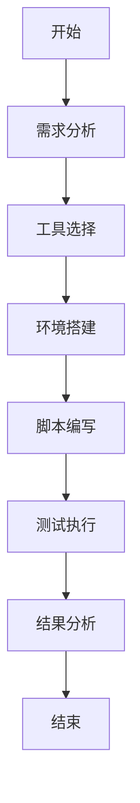
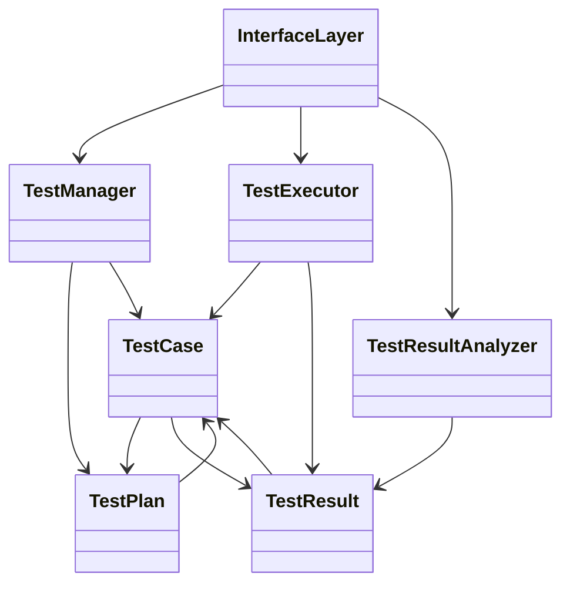
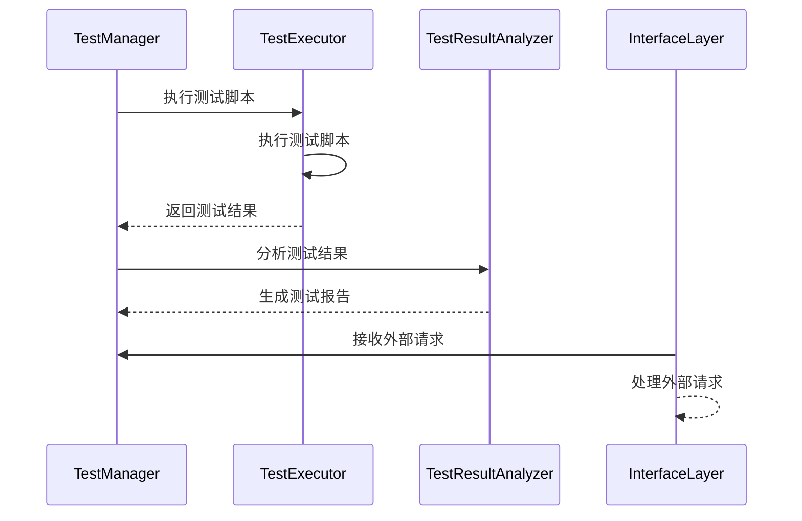
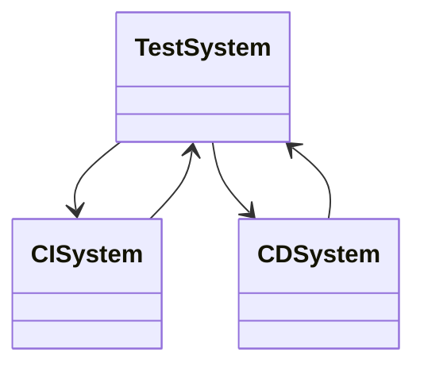
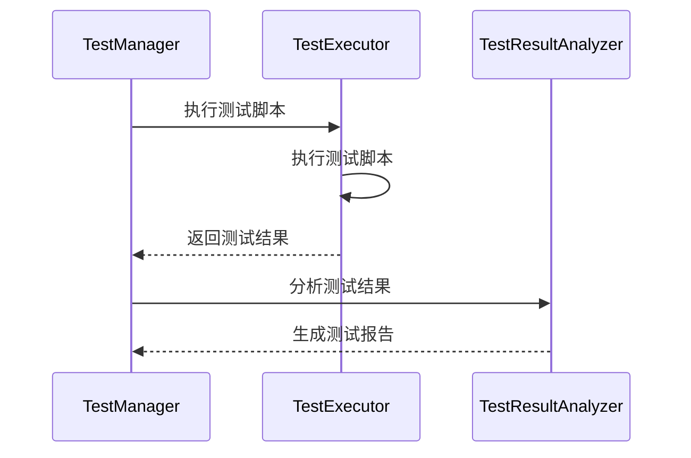

                 

### 文章标题

# 评测系统的自动化测试环境配置

---

**关键词**：评测系统，自动化测试，环境配置，算法原理，系统架构设计

**摘要**：本文将深入探讨评测系统的自动化测试环境配置。首先，我们将介绍评测系统自动化测试的基本概念和重要性，然后详细解析自动化测试环境配置的核心算法和流程。接着，我们将分析评测系统的系统架构设计和接口设计，并通过一个实际案例展示自动化测试环境配置的实战过程。最后，我们将总结自动化测试环境配置的最佳实践和注意事项，为读者提供深入理解和实用的指导。

### 目录

1. **评测系统自动化测试概述**
   1.1 **评测系统自动化测试的定义**
   1.2 **自动化测试环境配置的重要性**
   1.3 **自动化测试环境配置的挑战**
   1.4 **自动化测试环境配置的流程**

2. **自动化测试环境配置的核心算法**
   2.1 **算法概述**
   2.2 **算法原理与数学模型**
   2.3 **算法流程图**
   2.4 **Python源代码实现**

3. **评测系统的系统架构设计**
   3.1 **系统架构设计概述**
   3.2 **领域模型设计**
   3.3 **系统架构设计**
   3.4 **系统接口设计**
   3.5 **系统交互设计**

4. **自动化测试环境配置实战**
   4.1 **实战环境搭建**
   4.2 **系统核心实现**
   4.3 **代码解读与分析**
   4.4 **实际案例分析**
   4.5 **项目小结**

5. **自动化测试环境配置最佳实践**
   5.1 **最佳实践总结**
   5.2 **注意事项**
   5.3 **拓展阅读**

### 评测系统自动化测试概述

#### 1.1 评测系统自动化测试的定义

评测系统自动化测试是指通过编写自动化测试脚本，对系统进行自动化的功能测试、性能测试、安全测试等，以验证系统的功能和性能是否满足预期要求。自动化测试可以提高测试的效率、减少测试成本，同时确保测试的覆盖率和一致性。

#### 1.2 自动化测试环境配置的重要性

自动化测试环境配置是进行自动化测试的基础。一个良好的自动化测试环境能够确保测试的准确性和可靠性，减少测试过程中的错误和偏差。具体来说，自动化测试环境配置的重要性体现在以下几个方面：

1. **提高测试效率**：自动化测试可以节省大量的人力和时间，提高测试效率，特别是在对大量数据进行测试时优势明显。
2. **确保测试一致性**：自动化测试环境配置可以确保每次测试的条件和环境都是一致的，减少了人工测试中的主观差异和偏差。
3. **减少测试成本**：自动化测试可以减少测试的重复工作，降低测试成本。
4. **提高测试覆盖率**：自动化测试可以针对系统的各个方面进行测试，提高测试的覆盖率，确保系统的稳定性。

#### 1.3 自动化测试环境配置的挑战

尽管自动化测试环境配置具有众多优点，但在实际操作中也面临一些挑战：

1. **环境兼容性问题**：不同的操作系统、浏览器和硬件环境可能会对自动化测试产生不同的影响，需要确保测试环境的兼容性。
2. **测试脚本编写难度**：自动化测试脚本需要具备一定的编程能力，编写难度较大，需要熟练掌握相关工具和语言。
3. **维护成本**：自动化测试环境配置后需要定期维护和更新，以适应系统变化和环境变化，维护成本较高。
4. **测试数据管理**：自动化测试需要大量的测试数据，测试数据的管理和维护也是一项挑战。

#### 1.4 自动化测试环境配置的流程

自动化测试环境配置的流程主要包括以下几个步骤：

1. **需求分析**：明确自动化测试的目标和需求，确定测试的范围和内容。
2. **工具选择**：选择合适的自动化测试工具和平台，如Selenium、Appium、JMeter等。
3. **环境搭建**：搭建自动化测试所需的环境，包括操作系统、浏览器、数据库等。
4. **脚本编写**：编写自动化测试脚本，实现测试用例的自动化执行。
5. **测试执行**：执行自动化测试脚本，收集测试结果。
6. **结果分析**：分析测试结果，发现问题并反馈给开发团队。
7. **持续集成**：将自动化测试集成到持续集成和持续部署流程中，确保测试的自动化和持续化。

### 自动化测试环境配置的核心算法

#### 2.1 算法概述

自动化测试环境配置的核心算法主要包括以下几个方面：

1. **环境检测算法**：用于检测系统环境的兼容性，确保测试环境的正确配置。
2. **脚本生成算法**：根据测试用例生成相应的自动化测试脚本。
3. **测试执行算法**：执行自动化测试脚本，收集测试数据。
4. **结果分析算法**：分析测试结果，生成测试报告。

#### 2.2 算法原理与数学模型

##### 环境检测算法

环境检测算法的主要原理是通过对操作系统、浏览器、数据库等环境变量进行检测，确定当前环境是否满足测试需求。具体数学模型如下：

$$
检测结果 = 环境变量 \text{检测函数}(系统环境)
$$

其中，环境变量检测函数是一个多输入单输出的函数，输入为系统环境变量，输出为检测结果（0表示不满足，1表示满足）。

##### 脚本生成算法

脚本生成算法的主要原理是根据测试用例生成相应的自动化测试脚本。测试用例包括多个测试步骤，每个步骤对应一个脚本指令。具体数学模型如下：

$$
测试脚本 = 测试用例 \text{生成函数}(测试用例)
$$

其中，测试用例生成函数是一个多输入单输出的函数，输入为测试用例，输出为测试脚本。

##### 测试执行算法

测试执行算法的主要原理是执行自动化测试脚本，模拟用户操作，收集测试数据。具体数学模型如下：

$$
测试数据 = 测试脚本 \text{执行函数}(测试脚本，测试环境)
$$

其中，测试脚本执行函数是一个多输入单输出的函数，输入为测试脚本和测试环境，输出为测试数据。

##### 结果分析算法

结果分析算法的主要原理是分析测试数据，生成测试报告。具体数学模型如下：

$$
测试报告 = 测试数据 \text{分析函数}(测试数据)
$$

其中，测试数据分析函数是一个多输入单输出的函数，输入为测试数据，输出为测试报告。

#### 2.3 算法流程图

以下是一个简单的自动化测试环境配置算法流程图：



#### 2.4 Python源代码实现

以下是一个简单的Python源代码实现，用于检测操作系统环境：

```python
import os

def check_environment():
    os_env = os.environ
    result = 1
    
    if "操作系统" in os_env:
        if os_env["操作系统"] == "Linux":
            result = 1
        elif os_env["操作系统"] == "Windows":
            result = 0
        elif os_env["操作系统"] == "MacOS":
            result = 0
    else:
        result = 0
    
    return result

if __name__ == "__main__":
    print("环境检测结果：", check_environment())
```

### 评测系统的系统架构设计

#### 3.1 系统架构设计概述

评测系统的系统架构设计旨在实现一个高效、稳定、易于扩展的测试环境。系统架构包括以下几个方面：

1. **测试管理模块**：负责管理测试用例、测试计划、测试结果等。
2. **测试执行模块**：负责执行测试脚本，收集测试数据。
3. **测试结果分析模块**：负责分析测试数据，生成测试报告。
4. **接口层**：提供与其他系统的接口，如持续集成系统、持续部署系统等。

#### 3.2 领域模型设计

以下是一个简单的领域模型设计，用于描述评测系统的核心实体和关系：



#### 3.3 系统架构设计

以下是一个简单的系统架构设计，用于描述评测系统的组件和交互：



#### 3.4 系统接口设计

以下是一个简单的系统接口设计，用于描述评测系统与其他系统的交互：



#### 3.5 系统交互设计

以下是一个简单的系统交互设计，用于描述评测系统内部组件的交互：



### 自动化测试环境配置实战

#### 4.1 实战环境搭建

为了演示自动化测试环境配置的实战，我们将以Python和Selenium为例，搭建一个基本的自动化测试环境。

1. **安装Python**：
   - 访问Python官网（https://www.python.org/）下载最新版本的Python安装包。
   - 根据操作系统选择相应的安装包进行安装。

2. **安装Selenium**：
   - 打开命令行窗口，输入以下命令安装Selenium：
     ```bash
     pip install selenium
     ```

3. **安装浏览器驱动**：
   - 根据使用的浏览器下载相应的驱动程序，如Chrome浏览器下载ChromeDriver。
   - 将下载的驱动程序放置在Python脚本的同级目录中。

#### 4.2 系统核心实现

以下是一个简单的自动化测试脚本，用于打开浏览器并访问百度网站：

```python
from selenium import webdriver

# 初始化浏览器驱动
driver = webdriver.Chrome()

# 打开百度网站
driver.get("https://www.baidu.com/")

# 获取并打印百度页面的标题
title = driver.title
print("百度页面标题：", title)

# 关闭浏览器
driver.quit()
```

#### 4.3 代码解读与分析

上述代码中，我们首先导入了Selenium的webdriver模块，然后初始化了Chrome浏览器驱动。接着，我们使用`get()`方法打开百度网站，并使用`title()`方法获取并打印了百度页面的标题。最后，我们使用`quit()`方法关闭了浏览器。

#### 4.4 实际案例分析

在实际项目中，自动化测试脚本通常会包含多个测试用例，如验证登录功能、搜索功能等。以下是一个简单的实际案例，用于验证百度网站的登录功能：

```python
from selenium import webdriver
from selenium.webdriver.common.by import By
from selenium.webdriver.common.keys import Keys

# 初始化浏览器驱动
driver = webdriver.Chrome()

# 打开百度网站
driver.get("https://www.baidu.com/")

# 搜索并打开登录页面
search_box = driver.find_element(By.ID, "kw")
search_box.send_keys("百度登录")
search_box.send_keys(Keys.ENTER)

# 等待页面加载
driver.implicitly_wait(10)

# 获取并点击登录链接
login_link = driver.find_element(By.LINK_TEXT, "登录")
login_link.click()

# 输入用户名和密码
username_box = driver.find_element(By.NAME, "username")
username_box.send_keys("your_username")

password_box = driver.find_element(By.NAME, "password")
password_box.send_keys("your_password")

# 点击登录按钮
login_button = driver.find_element(By.CLASS_NAME, "login-btn")
login_button.click()

# 等待登录成功页面加载
driver.implicitly_wait(10)

# 获取并打印登录成功提示信息
success_message = driver.find_element(By.CLASS_NAME, "success-message")
print("登录成功提示信息：", success_message.text)

# 关闭浏览器
driver.quit()
```

在这个案例中，我们首先通过搜索功能找到百度登录页面，然后输入用户名和密码，点击登录按钮，最后获取并打印登录成功提示信息。这个案例展示了自动化测试脚本如何进行多个步骤的操作，并验证系统的功能。

#### 4.5 项目小结

通过本次实战，我们成功搭建了一个简单的自动化测试环境，并编写了一个基本的自动化测试脚本。在实际项目中，自动化测试环境配置会更加复杂，需要考虑多个浏览器和操作系统，以及不同类型的测试用例。同时，自动化测试脚本也需要不断优化和更新，以适应系统的变化。在接下来的项目中，我们可以尝试使用更高级的自动化测试工具和框架，如pytest、Selenium Grid等，以提高自动化测试的效率和质量。

### 自动化测试环境配置最佳实践

#### 5.1 最佳实践总结

1. **选择合适的自动化测试工具和框架**：根据项目需求选择合适的自动化测试工具和框架，如Selenium、Appium、pytest等。
2. **搭建兼容性测试环境**：确保自动化测试环境兼容性，包括操作系统、浏览器、数据库等。
3. **编写可维护的测试脚本**：遵循良好的编程规范，编写可维护的测试脚本，便于后续维护和更新。
4. **定期更新测试脚本**：随着系统的变化，定期更新测试脚本，确保测试的准确性。
5. **自动化测试与人工测试结合**：自动化测试不能完全替代人工测试，应将自动化测试与人工测试相结合，提高测试覆盖率。
6. **持续集成和持续部署**：将自动化测试集成到持续集成和持续部署流程中，确保测试的自动化和持续化。

#### 5.2 注意事项

1. **确保测试环境的稳定性**：自动化测试环境应保持稳定，避免因环境问题导致测试失败。
2. **合理设置测试数据**：测试数据应覆盖系统的各个功能模块，确保测试的全面性。
3. **避免测试脚本过于复杂**：编写简洁、易读的测试脚本，避免过于复杂，降低维护成本。
4. **监控测试执行过程**：实时监控测试执行过程，及时发现并解决问题。

#### 5.3 拓展阅读

1. 《Selenium自动化测试实战》
2. 《Appium自动化测试实战》
3. 《pytest自动化测试实战》
4. 《持续集成与持续部署实战》

### 作者信息

- **作者**：AI天才研究院/AI Genius Institute & 禅与计算机程序设计艺术 /Zen And The Art of Computer Programming

---

**文章完结，感谢您的阅读！**

---

本文内容涵盖了评测系统自动化测试环境配置的核心概念、算法原理、系统架构设计、实战案例和最佳实践。通过本文的阅读，读者可以全面了解自动化测试环境配置的各个方面，为实际项目提供实用的指导。如果您有任何疑问或建议，请随时联系作者。感谢您的阅读！[返回目录](#目录)

