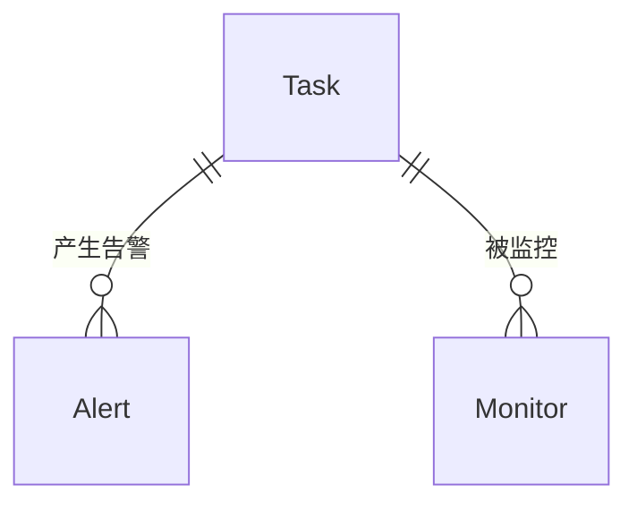
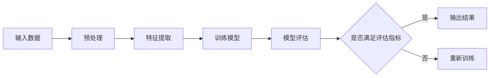
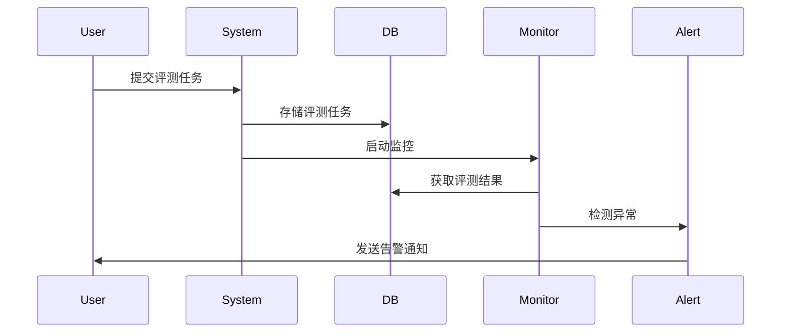

                 

# 评测系统的自动化评测流程监控与告警

> 关键词：评测系统、自动化监控、告警机制、流程监控、异常检测

> 摘要：本文将深入探讨评测系统的自动化评测流程监控与告警机制，通过详细的分析和实例讲解，阐述其核心概念、实现方法、算法原理以及系统架构设计，旨在为开发者提供全面的技术指导。

## 第一部分：评测系统的自动化评测流程监控与告警概述

### 第1章：问题背景与核心概念

#### 1.1 问题背景

在现代软件开发和维护过程中，评测系统的自动化评测流程监控与告警机制扮演着至关重要的角色。它不仅能够提高开发效率和软件质量，还能显著减少错误发生和修复成本。随着软件项目的复杂性不断增加，手工检查评测流程已无法满足快速迭代的需求。因此，自动化评测流程监控与告警成为提升软件质量和运维效率的关键手段。

#### 1.2 核心概念

- **自动化评测流程**：指通过软件工具自动完成测试用例的执行、结果收集和分析的过程。
- **流程监控**：实时跟踪评测流程的执行情况，确保流程按预定规则顺利进行。
- **告警机制**：当评测流程出现异常时，系统自动发出警告，提示相关人员进行干预。

### 第2章：自动化评测流程监控机制

#### 2.1 监控目标

- **评测任务的执行状态**：监控评测任务是否按时完成，是否出现异常中断。
- **评测结果的质量**：检查评测结果是否符合预期标准，是否存在错误或遗漏。
- **流程中各个环节的效率**：分析各个测试环节的执行时间，评估流程的整体效率。

#### 2.2 监控方法

- **定期检查**：定期对评测流程的关键节点进行检查，确保流程正常。
- **实时监控**：通过监控系统实时跟踪评测任务的执行情况。
- **异常检测**：利用算法自动检测流程中的异常情况，如评测失败、超时等。

### 第3章：告警机制的实现

#### 3.1 告警类型

- **立即告警**：发现异常立即发出告警。
- **定时告警**：在预定的时间点发出告警。

#### 3.2 告警策略

- **告警级别**：根据异常的严重程度设置不同的告警级别。
- **告警方式**：通过邮件、短信、即时通讯工具等方式通知相关人员。

### 第4章：核心概念与联系

#### 4.1 自动化评测流程监控与告警的核心概念

- **监控指标**：用于评估评测流程性能的量化指标。
- **告警规则**：定义告警触发条件的规则。

#### 4.2 核心概念属性特征对比

| 概念       | 属性特征                | 比较               |
|------------|------------------------|--------------------|
| 监控       | 实时性、准确性、全面性  | 确保流程正常执行    |
| 告警       | 及时性、多样性、针对性  | 提高问题解决效率   |

#### 4.3 ER实体关系图



### 第5章：算法原理讲解

#### 5.1 算法简介

本文将介绍一种基于机器学习的异常检测算法，用于自动化评测流程监控。

#### 5.2 算法mermaid流程图



#### 5.3 算法原理

- **输入数据**：评测流程中的监控数据和告警数据。
- **预处理**：清洗数据，处理缺失值和异常值。
- **特征提取**：从监控数据中提取有意义的特征。
- **训练模型**：使用机器学习算法训练异常检测模型。
- **模型评估**：评估模型性能，包括准确率、召回率等。
- **输出结果**：根据评估结果，输出监控数据和告警数据。

### 第6章：数学模型和公式

#### 6.1 数学模型

假设我们使用的是支持向量机（SVM）算法进行异常检测，其目标是最小化分类间隔。

$$
\min \frac{1}{2} \sum_{i=1}^{n} w_i^2
$$

其中，$w_i$ 为第 $i$ 个支持向量的权重。

#### 6.2 算法公式

支持向量机的主要公式如下：

$$
w = \arg\min \frac{1}{2} \sum_{i=1}^{n} w_i^2 + C \sum_{i=1}^{n} \max(0, 1 - y_i (w \cdot x_i + b))
$$

其中，$C$ 为惩罚参数，$y_i$ 为样本标签，$x_i$ 为样本特征向量，$w$ 和 $b$ 分别为权重向量和偏置。

### 第7章：系统分析与架构设计

#### 7.1 问题场景介绍

在某个软件开发项目中，需要对评测流程进行自动化监控与告警，以确保软件质量。

#### 7.2 系统功能设计

- **数据收集**：收集评测流程的监控数据。
- **数据分析**：分析监控数据，发现潜在问题。
- **告警通知**：根据分析结果，向相关人员发送告警通知。

### 第8章：系统架构设计

#### 8.1 系统架构图



#### 8.2 系统接口设计和系统交互

- **接口设计**：定义系统与外部系统的接口，包括数据收集接口、告警接口等。
- **系统交互**：通过mermaid序列图展示系统各模块之间的交互过程。

### 第9章：项目实战

#### 9.1 环境安装

- **安装Python环境**：安装Python 3.x版本。
- **安装依赖库**：安装Numpy、Pandas、Scikit-learn等依赖库。

#### 9.2 系统核心实现源代码

```python
# 示例代码：基于SVM的异常检测
from sklearn.svm import SVC
from sklearn.model_selection import train_test_split
from sklearn.metrics import classification_report

# 加载数据
data = load_data()

# 预处理数据
X, y = preprocess_data(data)

# 划分训练集和测试集
X_train, X_test, y_train, y_test = train_test_split(X, y, test_size=0.2)

# 训练模型
model = SVC(kernel='linear')
model.fit(X_train, y_train)

# 模型评估
predictions = model.predict(X_test)
print(classification_report(y_test, predictions))
```

#### 9.3 代码应用解读与分析

- **代码解读**：分析代码实现过程，理解各个模块的功能和作用。
- **案例分析**：通过实际案例展示系统在项目中的应用效果。

#### 9.4 项目小结

- **总结**：回顾项目实施过程，总结经验和教训。
- **展望**：讨论未来改进方向和潜在应用场景。

### 第10章：最佳实践 tips、小结、注意事项、拓展阅读

#### 10.1 最佳实践 tips

- **及时更新**：定期更新监控工具和告警机制，以适应项目需求的变化。
- **精细配置**：根据实际需求，精细配置监控指标和告警规则。

#### 10.2 小结

- **核心内容**：回顾文章的核心内容和关键技术。
- **收获**：总结从中学到的知识和技能。

#### 10.3 注意事项

- **数据安全**：确保监控数据和告警数据的安全，防止泄露。
- **系统稳定性**：确保监控系统的稳定运行，减少故障。

#### 10.4 拓展阅读

- **相关技术**：介绍与自动化评测流程监控与告警相关的其他技术。
- **推荐书籍**：推荐相关领域的优质书籍，供读者进一步学习。

## 作者

**作者：AI天才研究院/AI Genius Institute & 禅与计算机程序设计艺术 /Zen And The Art of Computer Programming**

