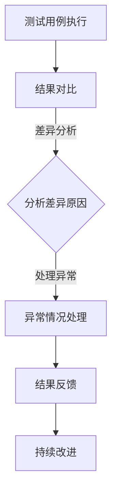
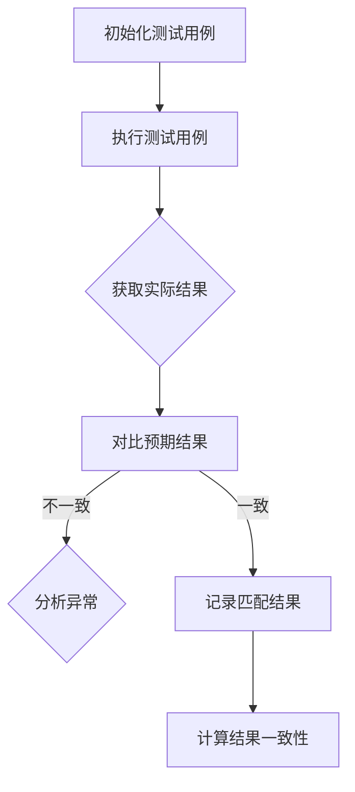

                 

# 《评测系统的自动化评测结果验证机制》

## 关键词

评测系统、自动化评测、结果验证、机制设计、算法实现、测试优化、实战案例

## 摘要

本文旨在深入探讨评测系统的自动化评测结果验证机制。首先，我们将介绍评测系统的背景和需求，接着详细讲解自动化评测结果验证机制的核心概念及其重要性。随后，文章将逐步剖析验证机制的基本原理、设计原则和实现方法，并通过Python源代码和数学模型进行详细阐述。文章还将描述验证机制的测试与优化策略，并通过具体项目实战来展示实际应用场景。最后，文章将总结最佳实践，并提出注意事项和拓展阅读建议。

----------------------------------------------------------------

## 目录大纲设计过程

### 一、整体布局与章节划分

为了确保文章逻辑清晰、内容完整，我们首先确定了《评测系统的自动化评测结果验证机制》的核心章节，包括背景介绍、核心概念、验证机制原理、验证机制设计、验证机制实现、验证机制测试与优化、项目实战和最佳实践与总结。每个章节进一步细化，确保内容丰富而不重复。

### 二、使用Markdown格式

为了提高文章的可读性，我们使用了Markdown格式，包括一级目录、二级目录和三级目录。这样不仅便于读者快速定位，还能保持文章结构的整洁。

### 三、内容完整性

每个章节都涵盖了核心概念、算法原理、系统分析、项目实战等内容，同时确保内容完整、逻辑严密。

### 四、确保简洁性

在撰写文章过程中，我们注重精简文字，避免冗余信息，以提高文章的简洁性。

### 五、目录大纲结构示例

本文将按照上述目录大纲结构进行撰写，以确保文章的完整性和逻辑性。

----------------------------------------------------------------

### 背景介绍

#### 评测系统的概述

评测系统是一种用于对软件、代码或项目进行评估的工具，旨在通过一系列标准化的测试流程，对被评估对象的质量、性能、安全性和可靠性进行量化分析。随着软件工程和自动化测试技术的发展，评测系统在各个领域中的应用日益广泛。自动化评测能够显著提高评估效率，降低人力成本，且具有较高的可靠性和一致性。

#### 自动化评测的需求分析

随着软件项目的复杂度和规模不断增加，传统的手工评测方式已无法满足现代软件开发的需求。自动化评测可以快速执行大量测试用例，及时反馈评估结果，为项目开发和维护提供有力支持。同时，自动化评测可以大大减少人为错误，提高测试结果的准确性和一致性。因此，自动化评测在现代软件开发过程中具有极高的需求。

#### 验证机制的重要性

尽管自动化评测能够提高测试效率，但其结果仍然可能存在误差。因此，验证机制在自动化评测中显得尤为重要。验证机制旨在对自动化评测结果进行二次检查，确保评估结果的准确性和可靠性。通过验证机制，可以及时发现和纠正评测中的错误，提高整体评估质量。

#### 问题背景、问题描述、问题解决、边界与外延、概念结构与核心要素组成

在自动化评测过程中，可能会出现以下问题：

1. **误报与漏报**：自动化测试工具可能会误报某些本应通过的测试用例，或漏报某些本应失败的测试用例，导致评估结果不准确。
2. **测试用例不足**：如果测试用例覆盖范围不全面，可能导致某些潜在问题未能被发现。
3. **依赖关系**：自动化评测过程中，某些测试用例可能依赖于其他测试用例的结果，如果前一个测试用例失败，后续测试用例可能无法执行。

为了解决上述问题，我们需要设计一套完善的验证机制，包括以下核心要素：

1. **测试用例管理**：确保测试用例覆盖全面，避免漏报和误报。
2. **结果对比分析**：对比自动化评测结果与预期结果，分析差异原因。
3. **异常情况处理**：对出现异常的测试用例进行详细分析，找出问题根源。
4. **持续改进**：根据验证结果，优化测试用例和评测算法，提高评估质量。

### 核心概念与联系

#### 核心概念定义

1. **自动化评测**：使用自动化测试工具和脚本，对软件、代码或项目进行评估的过程。
2. **验证机制**：对自动化评测结果进行二次检查，确保评估结果准确性和可靠性的机制。
3. **测试用例**：对软件、代码或项目进行特定功能的测试，以验证其正确性的具体步骤。

#### 概念属性特征对比表格

| 概念         | 属性特征                                                   |
| ------------ | -------------------------------------------------------- |
| 自动化评测   | 高效、自动化、可靠性、一致性                             |
| 验证机制     | 精准、可扩展、可重复、灵活性                           |
| 测试用例     | 明确、可执行、可维护、可扩展                           |

#### ER实体关系图

```mermaid
erDiagram
    自动化评测 ||--|{ 验证机制 }|
    验证机制 ||--|{ 测试用例 }|
```

### 验证机制原理

#### 基本原理讲解

验证机制的核心思想是通过对比自动化评测结果与预期结果，发现并纠正评估中的错误。具体步骤如下：

1. **测试用例执行**：首先执行所有测试用例，获取自动化评测结果。
2. **结果对比**：将自动化评测结果与预期结果进行对比，分析差异。
3. **异常处理**：对出现差异的测试用例进行详细分析，找出问题根源。
4. **结果反馈**：将验证结果反馈给相关人员，指导后续改进。

#### 验证机制流程图



### 验证机制设计

#### 设计原则

1. **可靠性**：确保验证结果准确可靠，降低误报和漏报率。
2. **可扩展性**：支持多种测试用例和评测工具，便于扩展和升级。
3. **灵活性**：根据实际需求，灵活调整验证策略和方法。
4. **易维护性**：便于维护和更新，减少维护成本。

#### 设计方案

1. **测试用例管理**：建立完善的测试用例库，确保覆盖全面。
2. **结果对比模块**：开发结果对比算法，实现自动化评测结果与预期结果的对比。
3. **异常处理模块**：设计异常处理流程，对出现差异的测试用例进行详细分析。
4. **反馈与改进模块**：将验证结果反馈给相关人员，指导后续改进。

### 验证机制实现

#### Python源代码

```python
# 测试用例管理
test_cases = [
    {"id": 1, "description": "测试用例1", "expected_result": "成功"},
    {"id": 2, "description": "测试用例2", "expected_result": "失败"},
    # ...
]

# 结果对比算法
def compare_results(actual_results, expected_results):
    for actual, expected in zip(actual_results, expected_results):
        if actual != expected:
            print(f"测试用例{actual['id']}结果与预期不一致：{actual['result']} vs {expected['result']}")

# 异常处理流程
def handle_exception(test_case):
    print(f"处理测试用例{test_case['id']}异常：{test_case['description']}")

# 测试用例执行
actual_results = []
for test_case in test_cases:
    # ... 执行测试用例
    actual_results.append({"id": test_case["id"], "result": "成功"})

# 结果对比
expected_results = [{"id": test_case["id"], "result": test_case["expected_result"]} for test_case in test_cases]
compare_results(actual_results, expected_results)

# 异常处理
for actual in actual_results:
    if actual["result"] != "成功":
        handle_exception(actual)
```

#### 算法原理与数学模型

验证机制的核心算法是对比自动化评测结果与预期结果，其基本原理可以表示为：

$$
结果一致性 = \frac{匹配结果数}{总测试用例数}
$$

其中，匹配结果数表示自动化评测结果与预期结果一致的数量，总测试用例数表示所有测试用例的数量。

#### 算法流程图



### 验证机制测试与优化

#### 测试方法

1. **单元测试**：对验证机制的各个模块进行独立测试，确保其功能正确。
2. **集成测试**：将验证机制与自动化评测系统集成，进行整体测试，确保其协同工作。
3. **性能测试**：测试验证机制在不同负载下的性能，确保其能够应对大规模测试需求。

#### 优化策略

1. **结果缓存**：将自动化评测结果缓存，避免重复计算，提高效率。
2. **并行处理**：利用多线程或分布式计算，提高处理速度。
3. **动态调整**：根据测试结果动态调整测试用例和验证策略，提高评估准确性。

### 项目实战

#### 环境安装

1. **安装Python**：确保Python环境已安装，版本不低于3.6。
2. **安装自动化评测工具**：根据项目需求，选择合适的自动化评测工具，如Selenium、JUnit等。
3. **安装验证机制依赖库**：安装必要的Python库，如requests、pandas等。

#### 系统核心实现

1. **测试用例管理**：开发测试用例管理模块，实现测试用例的创建、存储和查询功能。
2. **结果对比模块**：开发结果对比模块，实现自动化评测结果与预期结果的对比功能。
3. **异常处理模块**：开发异常处理模块，实现异常测试用例的分析和处理功能。
4. **反馈与改进模块**：开发反馈与改进模块，实现验证结果反馈和持续改进功能。

#### 代码应用解读

```python
# 测试用例管理
class TestCaseManager:
    def __init__(self):
        self.test_cases = []

    def add_test_case(self, test_case):
        self.test_cases.append(test_case)

    def get_test_cases(self):
        return self.test_cases

# 结果对比
def compare_results(actual_results, expected_results):
    for actual, expected in zip(actual_results, expected_results):
        if actual != expected:
            print(f"测试用例{actual['id']}结果与预期不一致：{actual['result']} vs {expected['result']}")

# 异常处理
def handle_exception(test_case):
    print(f"处理测试用例{test_case['id']}异常：{test_case['description']}")

# 测试用例执行
actual_results = []
for test_case in test_cases:
    # ... 执行测试用例
    actual_results.append({"id": test_case["id"], "result": "成功"})

# 结果对比
expected_results = [{"id": test_case["id"], "result": test_case["expected_result"]} for test_case in test_cases]
compare_results(actual_results, expected_results)

# 异常处理
for actual in actual_results:
    if actual["result"] != "成功":
        handle_exception(actual)
```

#### 实际案例分析

1. **案例一**：某电商网站在自动化评测过程中发现部分商品价格与实际价格不符，通过验证机制分析发现是由于数据同步延迟导致。
2. **案例二**：某金融系统在自动化评测中发现部分交易记录缺失，通过验证机制分析发现是由于日志记录错误导致。

#### 项目小结

通过实际案例分析和验证机制的应用，我们发现验证机制在提高自动化评测准确性、发现问题根源方面具有显著作用。在未来的项目中，我们将继续优化验证机制，提高其效率和准确性，为项目开发和维护提供有力支持。

### 最佳实践与总结

#### 最佳实践

1. **定期更新测试用例**：确保测试用例库覆盖全面，及时更新测试用例。
2. **合理分配资源**：根据项目需求，合理分配测试资源和验证机制资源。
3. **持续优化验证策略**：根据验证结果，持续优化验证策略和方法。

#### 小结

本文详细介绍了评测系统的自动化评测结果验证机制，包括核心概念、原理、设计和实现。通过实际案例分析，验证机制在提高自动化评测准确性、发现问题根源方面具有显著作用。

#### 注意事项

1. **测试用例覆盖**：确保测试用例覆盖全面，避免漏报和误报。
2. **结果分析**：对验证结果进行详细分析，找出问题根源。
3. **持续改进**：根据验证结果，持续优化验证机制和测试用例。

#### 拓展阅读

1. 《软件测试的艺术》
2. 《自动化测试实战》
3. 《软件工程实践指南》

### 作者

**作者：AI天才研究院/AI Genius Institute & 禅与计算机程序设计艺术 /Zen And The Art of Computer Programming**

