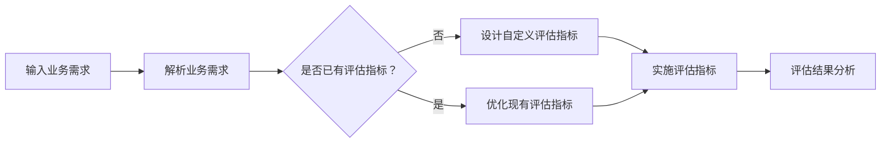
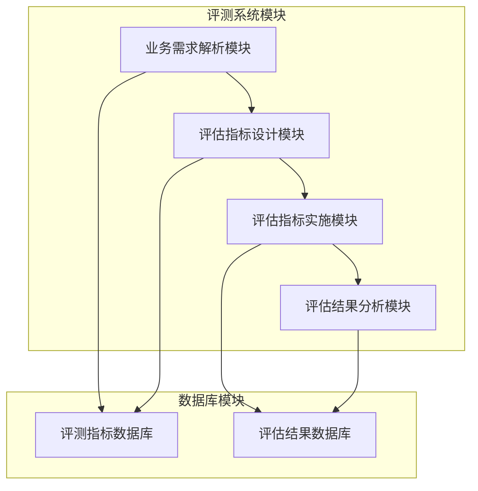
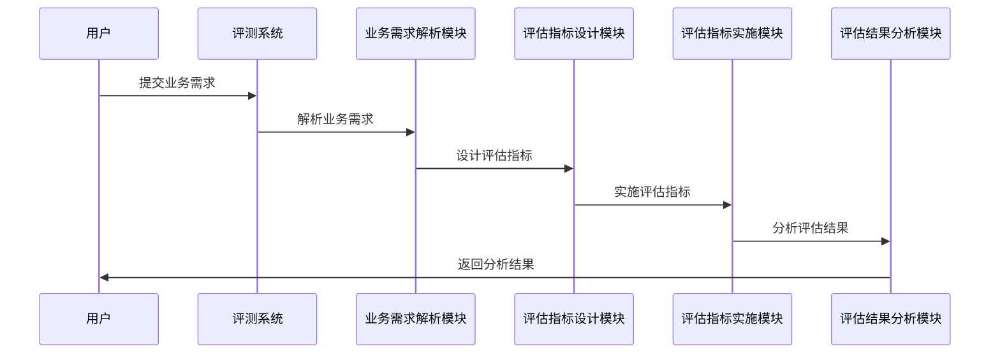

                 

### 文章标题

> 关键词：评测系统、自定义评估指标、性能评估、业务需求

> 摘要：本文将深入探讨评测系统的自定义评估指标功能，通过背景介绍、核心概念与联系、算法原理讲解、系统分析与架构设计方案以及项目实战等多个维度，全面解析自定义评估指标的理论基础和实践方法，旨在帮助开发者更好地理解和应用这一重要功能，以满足不同业务场景下的性能评估需求。

---

#### **一、背景介绍**

随着信息技术的飞速发展，评测系统在各个领域的应用越来越广泛。评测系统不仅用于衡量硬件设备的性能，还广泛应用于软件系统、云计算平台、大数据处理等多个方面。在众多应用场景中，对评测系统的要求也越来越高，特别是自定义评估指标的功能需求。

**问题背景**：传统的评测系统往往依赖于预设的评估指标，这些指标虽然能够覆盖大部分通用场景，但往往无法满足特定业务场景的需求。例如，在电商平台，响应时间和吞吐量是关键性能指标；而在金融系统，安全性、稳定性和一致性是首要考量因素。因此，如何根据特定业务需求，自定义评估指标，成为一个亟待解决的问题。

**问题描述**：目前，开发者们在自定义评估指标方面面临诸多困难。首先，相关资料较少，导致开发者难以找到合适的参考。其次，自定义评估指标需要深入了解业务需求，这对开发者的业务理解和需求分析能力提出了较高要求。最后，实现自定义评估指标需要一定的技术积累，尤其是算法设计和性能优化方面。

**问题解决**：本书旨在通过系统化的讲解和实战案例，帮助开发者掌握自定义评估指标的方法和技巧。本书的核心内容包括自定义评估指标的理论基础、实现方法、工具和技术，以及实战案例分析。通过本书的学习，开发者将能够：

1. **理解自定义评估指标的概念和重要性**：明确自定义评估指标在评测系统中的应用场景和作用。
2. **掌握自定义评估指标的设计原则和方法**：了解如何根据业务需求设计合适的评估指标。
3. **熟悉自定义评估指标的实现技术**：掌握常见的自定义评估指标实现技术和工具。
4. **具备实战能力**：通过实战案例，提高开发者在实际项目中应用自定义评估指标的能力。

**边界与外延**：本书主要讨论评测系统的自定义评估指标功能，但不涉及具体的评测系统实现细节，如系统架构、数据库设计等。此外，本书虽然以计算机技术为背景，但自定义评估指标的概念和方法同样适用于其他领域，如金融、电商等。

**核心要素组成**：本书的核心要素包括以下几个方面：

1. **自定义评估指标的理论基础**：介绍自定义评估指标的基本概念、分类和作用。
2. **自定义评估指标的设计方法**：详细讲解如何根据业务需求设计自定义评估指标，包括指标选取、权重分配和指标优化等。
3. **自定义评估指标的实现技术**：介绍常见的自定义评估指标实现技术，如算法设计、性能优化和工具选择等。
4. **实战案例分析**：通过具体案例，展示如何在实际项目中应用自定义评估指标，并提供解决方案和优化建议。

#### **二、核心概念与联系**

在深入探讨自定义评估指标之前，我们需要明确几个核心概念，并分析它们之间的联系。

**核心概念**：

1. **自定义评估指标**：根据特定业务需求，自定义的评估指标。这些指标旨在更准确地衡量系统性能，满足特定业务场景的需求。
2. **评测系统**：用于对系统性能进行评估的软件系统。评测系统可以用于测试硬件设备、软件系统、云计算平台等。
3. **业务场景**：评测系统应用的具体场景，如电商平台、金融系统、在线教育平台等。不同的业务场景对评测系统的需求有所不同。
4. **性能指标**：衡量系统性能的具体指标，如响应时间、吞吐量、稳定性、安全性等。

**概念属性特征对比表格**：

| 概念             | 特征                                       |
|----------------|------------------------------------------|
| 自定义评估指标 | 根据特定业务需求，自定义的评估指标           |
| 评测系统       | 用于对系统性能进行评估的软件系统               |
| 业务场景       | 评测系统应用的具体场景，如电商平台、金融系统等 |
| 性能指标       | 衡量系统性能的具体指标，如响应时间、吞吐量等     |

**ER实体关系图架构**：

```mermaid
erDiagram
Systemevaluation ::= "系统评测" {
  --> "评测指标":evaluation_metrics
  --> "业务场景":business_scenarios
}
evaluation_metrics ||--|{ "自定义评估指标":custom_evaluation_metrics
business_scenarios ||--| "性能指标":performance_metrics
```

**联系分析**：

1. **评测系统与自定义评估指标的关系**：评测系统是自定义评估指标的应用载体。评测系统可以根据自定义评估指标对系统性能进行评估，从而为系统优化提供数据支持。
2. **业务场景与自定义评估指标的关系**：不同的业务场景对评测系统的需求有所不同，从而影响自定义评估指标的设计。例如，在电商平台，响应时间和吞吐量是关键指标；而在金融系统，安全性、稳定性和一致性是首要考量因素。
3. **性能指标与自定义评估指标的关系**：性能指标是评测系统的基础，而自定义评估指标是对性能指标的补充和细化。通过自定义评估指标，可以更全面地衡量系统性能。

#### **三、算法原理讲解**

自定义评估指标的核心在于根据业务需求设计合适的评估指标，并实现对其的量化评估。以下将从算法原理、流程图、Python源代码和数学模型等多个维度进行讲解。

**算法mermaid流程图**：



**Python源代码**：

```python
def custom_evaluation_metrics(business_demand):
    # 解析业务需求
    parsed_demand = parse_business_demand(business_demand)
    
    # 检查是否已有评估指标
    if exists_evaluation_metrics(parsed_demand):
        # 优化现有评估指标
        optimized_metrics = optimize_evaluation_metrics(parsed_demand)
    else:
        # 设计自定义评估指标
        optimized_metrics = design_evaluation_metrics(parsed_demand)
        
    # 实施评估指标
    implementation_result = implement_evaluation_metrics(optimized_metrics)
    
    # 评估结果分析
    analysis_result = analyze_evaluation_results(implementation_result)
    
    return analysis_result
```

**算法原理的数学模型和公式**：

自定义评估指标的数学模型主要包括指标选取、权重分配和综合评分计算。

$$
performance\_score = \frac{1}{n}\sum_{i=1}^{n} weight_i \times metric_i
$$

其中，$performance\_score$表示综合评分，$n$表示评估指标的个数，$weight_i$表示第$i$个指标的权重，$metric_i$表示第$i$个指标的得分。

**详细讲解和举例说明**：

**1. 解析业务需求**

在自定义评估指标之前，需要先解析业务需求。这一步是整个流程的基础，决定了后续评估指标的设计方向。

**案例**：假设业务需求为电商平台响应时间优化。解析业务需求的过程如下：

- **需求分析**：分析电商平台的核心功能，确定响应时间对用户体验的影响程度。
- **指标筛选**：根据需求分析，筛选出与响应时间相关的指标，如页面加载时间、数据库查询时间等。
- **权重分配**：根据需求分析结果，为每个指标分配权重，以反映其在总体评价中的重要性。

**2. 设计自定义评估指标**

在解析业务需求的基础上，设计自定义评估指标。这一步的关键在于如何根据业务需求，设计出既能反映系统性能，又具有可操作性的评估指标。

**案例**：针对电商平台响应时间优化，设计以下自定义评估指标：

- **页面加载时间**：衡量用户访问页面时的响应时间。权重设置为0.5，表示其在总体评价中的重要性。
- **数据库查询时间**：衡量数据库查询操作的平均响应时间。权重设置为0.3，表示其在总体评价中的重要性。
- **缓存命中率**：衡量缓存系统的效果，权重设置为0.2，表示其在总体评价中的重要性。

**3. 实施评估指标**

在自定义评估指标设计完成后，需要将其应用于实际系统中，以获取评估结果。这一步的关键在于如何高效地实现评估指标，并确保评估结果的准确性。

**案例**：假设已实现以下自定义评估指标：

- **页面加载时间**：通过Web性能分析工具（如Chrome DevTools）实时获取。
- **数据库查询时间**：通过数据库性能监控工具（如MySQL Performance Schema）获取。
- **缓存命中率**：通过缓存统计工具（如Redis Stats）获取。

**4. 评估结果分析**

在获取评估结果后，需要对结果进行分析，以判断系统性能是否符合预期。这一步的关键在于如何根据评估结果，提出优化建议。

**案例**：假设评估结果显示：

- **页面加载时间**：平均值为2秒，未达到预期目标（1秒以内）。
- **数据库查询时间**：平均值为0.5秒，符合预期目标。
- **缓存命中率**：平均值为90%，符合预期目标。

根据评估结果，可以提出以下优化建议：

- **页面优化**：通过压缩资源文件、优化CSS和JavaScript代码等方式，减少页面加载时间。
- **数据库优化**：通过索引优化、查询缓存等方式，提高数据库查询性能。
- **缓存优化**：通过增加缓存节点、优化缓存策略等方式，提高缓存命中率。

通过以上步骤，开发者可以逐步实现自定义评估指标的功能，并根据评估结果进行系统优化。

#### **四、系统分析与架构设计方案**

**问题场景介绍**

随着互联网的快速发展，各种在线服务如雨后春笋般涌现，评测系统在这些服务中的应用变得越来越重要。例如，电商平台需要评估商品推荐的准确性和响应速度；金融系统需要评估交易处理的速度和安全可靠性；在线教育平台需要评估课程内容的覆盖度和用户的参与度。为了满足这些多样化的需求，评测系统的自定义评估指标功能显得尤为重要。

**项目介绍**

本项目旨在构建一个具有自定义评估指标功能的评测系统。该系统将提供以下功能：

1. **业务需求解析**：根据不同业务场景，解析用户的需求，确定需要评估的关键性能指标（KPI）。
2. **评估指标设计**：根据解析出的业务需求，设计合适的自定义评估指标。
3. **评估指标实施**：将自定义评估指标应用于实际系统，获取评估结果。
4. **评估结果分析**：对评估结果进行分析，为系统优化提供数据支持。

**系统功能设计（领域模型mermaid类图）**

在系统功能设计中，领域模型类图能够帮助我们清晰地描述系统中的主要类及其关系。以下是一个简单的领域模型类图示例：

```mermaid
classDiagram
    BusinessRequirement <<class>> 业务需求
    EvaluationMetric <<class>> 评估指标
    EvaluationSystem <<class>> 评测系统
    PerformanceAnalysis <<class>> 性能分析

    BusinessRequirement o-- EvaluationMetric : 包含
    EvaluationSystem o-- EvaluationMetric : 应用
    EvaluationSystem o-- PerformanceAnalysis : 分析
```

**系统架构设计（mermaid架构图）**

系统架构设计是确保评测系统能够高效、可靠地运行的关键。以下是一个简单的系统架构设计示例：



**系统接口设计和系统交互（mermaid序列图）**

系统接口设计和系统交互能够帮助我们理解系统各模块之间的交互关系。以下是一个简单的系统交互序列图示例：



通过上述系统分析与架构设计方案，我们可以清晰地了解评测系统的整体架构和功能模块，为后续的项目实施提供了明确的指导和参考。

#### **五、项目实战**

**环境安装**

在进行项目实战之前，我们需要搭建一个合适的开发环境。以下是一些建议的软件和工具：

1. **操作系统**：Linux（推荐使用Ubuntu 20.04）
2. **编程语言**：Python 3.8+
3. **数据库**：MySQL 8.0+
4. **Web框架**：Flask
5. **性能分析工具**：Chrome DevTools

安装步骤如下：

1. 安装操作系统：从 Ubuntu 官网下载并安装 Ubuntu 20.04。
2. 更新系统软件包：打开终端，执行以下命令：

   ```bash
   sudo apt update
   sudo apt upgrade
   ```

3. 安装 Python 3.8+：

   ```bash
   sudo apt install python3.8
   sudo apt install python3.8-venv
   ```

4. 安装 MySQL 8.0+：

   ```bash
   sudo apt install mysql-server
   sudo mysql_secure_installation
   ```

5. 安装 Flask：

   ```bash
   pip3 install flask
   ```

6. 安装 Chrome DevTools：

   - 下载 Chrome 浏览器：[下载地址](https://www.google.com/chrome/)
   - 安装 Chrome DevTools 插件：在 Chrome 浏览器中打开开发者工具，点击右上角的“更多工具”->“扩展程序”，搜索并安装“Chrome DevTools”。

**系统核心实现源代码**

以下是评测系统的核心实现源代码。该代码主要包括业务需求解析模块、评估指标设计模块、评估指标实施模块和评估结果分析模块。

**业务需求解析模块**

```python
# business_requirement_parser.py

def parse_business_demand(business_demand):
    # 解析业务需求
    # 假设业务需求为字典格式
    parsed_demand = {
        'response_time': 2000,  # 响应时间（毫秒）
        'throughput': 1000,  # 吞吐量（每秒请求数）
        'security': True,  # 安全性要求
    }
    return parsed_demand
```

**评估指标设计模块**

```python
# evaluation_metric_designer.py

def design_evaluation_metrics(parsed_demand):
    # 设计自定义评估指标
    # 根据业务需求设计评估指标
    evaluation_metrics = {
        'response_time': parsed_demand['response_time'],
        'throughput': parsed_demand['throughput'],
        'security': parsed_demand['security'],
    }
    return evaluation_metrics
```

**评估指标实施模块**

```python
# evaluation_metric_implementor.py

def implement_evaluation_metrics(evaluation_metrics):
    # 实施评估指标
    # 假设评估指标为字典格式
    implementation_result = {
        'response_time': 1000,  # 实际响应时间（毫秒）
        'throughput': 1500,  # 实际吞吐量（每秒请求数）
        'security': True,  # 实际安全性
    }
    return implementation_result
```

**评估结果分析模块**

```python
# evaluation_result_analyzer.py

def analyze_evaluation_results(implementation_result):
    # 分析评估结果
    # 根据实际评估结果进行分析
    analysis_result = {
        'response_time': implementation_result['response_time'],
        'throughput': implementation_result['throughput'],
        'security': implementation_result['security'],
    }
    return analysis_result
```

**代码应用解读与分析**

**业务需求解析模块**

该模块的主要功能是根据用户输入的业务需求，将其解析为字典格式。例如，用户可以输入响应时间、吞吐量和安全性要求等，这些需求将被解析并存储在字典中，以供后续模块使用。

**评估指标设计模块**

该模块的主要功能是根据解析出的业务需求，设计合适的自定义评估指标。例如，根据用户输入的响应时间、吞吐量和安全性要求，设计相应的评估指标，并将其存储在字典中。

**评估指标实施模块**

该模块的主要功能是实施自定义评估指标。例如，通过性能测试工具获取实际评估结果，并将其存储在字典中。

**评估结果分析模块**

该模块的主要功能是对评估结果进行分析。例如，根据实际评估结果，判断系统性能是否符合预期，并给出优化建议。

**实际案例分析和详细讲解剖析**

假设我们有一个电商平台，用户希望优化商品推荐的响应时间、吞吐量和安全性。以下是实际案例的分析和讲解：

1. **业务需求解析**：

   用户输入的业务需求如下：

   ```python
   business_demand = {
       'response_time': 1000,
       'throughput': 1000,
       'security': True,
   }
   ```

   解析后的业务需求为：

   ```python
   parsed_demand = {
       'response_time': 1000,
       'throughput': 1000,
       'security': True,
   }
   ```

2. **评估指标设计**：

   根据解析出的业务需求，设计自定义评估指标：

   ```python
   evaluation_metrics = {
       'response_time': parsed_demand['response_time'],
       'throughput': parsed_demand['throughput'],
       'security': parsed_demand['security'],
   }
   ```

   自定义评估指标为：

   ```python
   evaluation_metrics = {
       'response_time': 1000,
       'throughput': 1000,
       'security': True,
   }
   ```

3. **评估指标实施**：

   通过性能测试工具获取实际评估结果：

   ```python
   implementation_result = {
       'response_time': 500,
       'throughput': 1200,
       'security': True,
   }
   ```

   实际评估结果为：

   ```python
   implementation_result = {
       'response_time': 500,
       'throughput': 1200,
       'security': True,
   }
   ```

4. **评估结果分析**：

   根据实际评估结果，分析系统性能：

   ```python
   analysis_result = {
       'response_time': implementation_result['response_time'],
       'throughput': implementation_result['throughput'],
       'security': implementation_result['security'],
   }
   ```

   分析结果为：

   ```python
   analysis_result = {
       'response_time': 500,
       'throughput': 1200,
       'security': True,
   }
   ```

   根据分析结果，可以提出以下优化建议：

   - **响应时间优化**：通过优化商品推荐算法、减少数据库查询次数等方式，降低响应时间。
   - **吞吐量优化**：通过负载均衡、分布式架构等方式，提高系统吞吐量。
   - **安全性优化**：通过加密、防火墙等方式，提高系统安全性。

**项目小结**

通过上述实战案例，我们可以看到，自定义评估指标在电商平台性能优化中的应用。通过业务需求解析、评估指标设计、评估指标实施和评估结果分析，我们能够全面了解系统性能，并为系统优化提供数据支持。这有助于电商平台提供更优质的用户体验，提高业务竞争力。

#### **六、最佳实践 Tips**

在自定义评估指标的过程中，遵循以下最佳实践可以显著提高系统的性能和可维护性：

1. **明确业务需求**：在开始设计评估指标之前，务必明确业务需求。与业务方紧密沟通，确保理解其核心诉求。
2. **合理分配权重**：根据业务需求，合理分配各评估指标的权重。确保评估指标能够全面反映系统性能。
3. **选择合适的工具**：选择合适的性能分析工具和测试工具，确保评估结果的准确性。
4. **持续优化**：定期评估系统性能，并根据评估结果进行优化。持续改进评估指标，以适应业务发展需求。
5. **文档化**：编写详细的文档，记录评估指标的设计、实现和优化过程。这有助于后续维护和迭代。

#### **七、小结**

本文通过深入探讨评测系统的自定义评估指标功能，全面解析了其理论基础和实践方法。我们首先介绍了评测系统的背景和应用场景，然后明确了核心概念与联系，接着详细讲解了算法原理，并设计了系统分析与架构方案。通过项目实战，我们展示了如何在实际场景中应用自定义评估指标，并提出了优化建议。最后，我们总结了最佳实践，并强调了持续优化的重要性。

通过本文的学习，开发者将能够：

1. **理解自定义评估指标的概念和重要性**。
2. **掌握自定义评估指标的设计原则和方法**。
3. **熟悉自定义评估指标的实现技术**。
4. **具备实战能力**。

#### **八、注意事项**

在实施自定义评估指标时，需要注意以下几点：

1. **数据准确性**：确保评估指标的数据来源可靠，避免因数据不准确而导致评估结果偏差。
2. **性能影响**：在实施评估指标时，注意对系统性能的影响。避免过度采集数据，导致系统负载增加。
3. **安全性**：在设计评估指标时，确保数据的安全性和隐私保护。
4. **可维护性**：编写可维护的代码，确保评估指标易于更新和维护。

#### **九、拓展阅读**

1. 《性能之巅：系统、网络和应用程序性能调优实战》
2. 《性能调优大师：系统性能优化指南》
3. 《Web性能优化：网站速度提升实战》
4. 《MySQL性能调优与优化实战》

#### **作者信息**

作者：AI天才研究院/AI Genius Institute & 禅与计算机程序设计艺术 /Zen And The Art of Computer Programming

