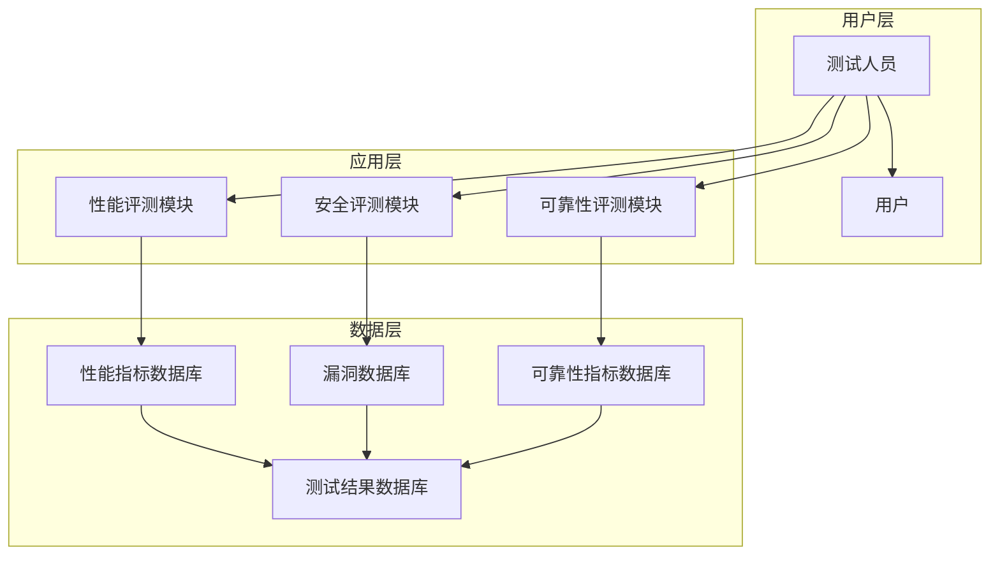
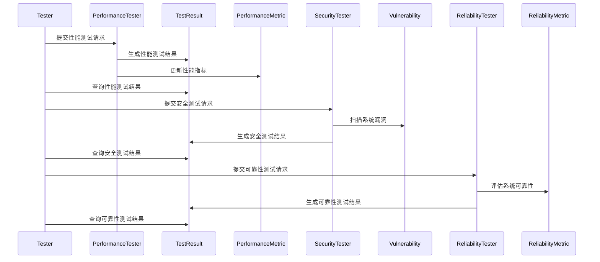
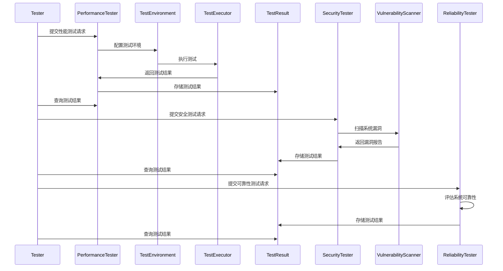

                 


## 第一部分: 评测系统的基本概念与背景

### 第1章: 评测系统的概述

#### 1.1 评测系统的定义与分类

评测系统是指用于评估、测试和监控各种系统、应用程序或服务的性能、可靠性和安全性的综合系统。它的目的是确保所开发和部署的系统或服务能够满足预期的性能和可靠性要求。

### 1.1.1 评测系统的基本概念

**定义：**

评测系统是指用于评估、测试和监控各种系统、应用程序或服务的性能、可靠性和安全性的综合系统。它通常包括以下几个核心组成部分：

1. **测试工具**：用于执行测试任务的工具，如性能测试工具、负载测试工具、安全测试工具等。
2. **测试脚本**：定义了测试过程和测试步骤的脚本，通常使用编程语言编写。
3. **测试环境**：用于执行测试的硬件和软件环境，如测试服务器、数据库、网络设备等。
4. **测试结果分析**：对测试结果进行收集、存储、分析和报告的模块。

**分类：**

根据评测的目标和方式，评测系统可以分为以下几种类型：

1. **性能评测**：用于评估系统或服务的性能指标，如响应时间、吞吐量、并发用户数等。
2. **安全评测**：用于评估系统或服务的安全性，如漏洞扫描、入侵检测、安全性能测试等。
3. **可靠性评测**：用于评估系统或服务的可靠性，如故障率、恢复时间、系统稳定性等。

### 1.1.2 评测系统的分类

| 分类类型 | 描述 |
| --- | --- |
| **性能评测** | 评估系统或服务的性能指标，如响应时间、吞吐量、并发用户数等。 |
| **安全评测** | 评估系统或服务的安全性，如漏洞扫描、入侵检测、安全性能测试等。 |
| **可靠性评测** | 评估系统或服务的可靠性，如故障率、恢复时间、系统稳定性等。 |

### 1.1.3 评测系统的作用

评测系统能够帮助企业及时发现和解决问题，提高系统的稳定性、安全性和可靠性。具体来说，评测系统的作用包括：

1. **性能优化**：通过性能评测，可以发现系统或服务的性能瓶颈，从而进行针对性的优化。
2. **安全性保障**：通过安全评测，可以识别系统或服务中的安全隐患，及时进行修复和加固。
3. **可靠性提升**：通过可靠性评测，可以评估系统或服务的可靠性指标，及时发现和解决潜在问题，提高系统的稳定性和可靠性。

#### 1.2 优化与学习能力的重要性

**优化的重要性**

优化评测系统能够提高测试效率、减少测试时间和成本。具体表现在以下几个方面：

1. **自动化测试**：通过编写高效的测试脚本，可以自动化执行测试任务，减少人工干预，提高测试效率。
2. **测试覆盖范围**：优化测试策略和测试用例设计，可以提高测试的覆盖范围，确保系统或服务的各个方面都得到充分的测试。
3. **资源利用率**：合理分配测试资源，如测试服务器、网络带宽等，可以提高资源利用率，降低测试成本。

**学习能力的重要性**

具有学习能力的评测系统能够根据测试结果自动调整测试策略，提高评测的准确性和效率。具体表现在以下几个方面：

1. **自适应测试**：根据历史测试数据和当前系统状态，自动调整测试策略，如调整测试用例执行顺序、测试强度等。
2. **预测性分析**：通过分析测试数据，预测系统或服务的性能瓶颈和潜在问题，提前进行优化和调整。
3. **测试结果优化**：根据测试结果和历史数据，自动调整测试结果的判断标准和阈值，提高测试的准确性和可靠性。

#### 1.3 相关领域的现状

**国内外评测系统发展概况**

随着人工智能技术的发展，评测系统的应用领域不断扩大，技术水平也在不断提升。国内外许多企业和研究机构都在积极研发和推广评测系统，取得了显著的成果。

1. **国外现状**：国外的评测系统发展较早，技术较为成熟。如美国的谷歌、微软等公司，在评测系统的研究和应用方面处于领先地位。
2. **国内现状**：国内的评测系统发展迅速，已经涌现出一批具有国际竞争力的企业和产品。如华为、腾讯、阿里巴巴等公司，在评测系统的研发和应用方面取得了重要突破。

**当前评测系统的挑战与机遇**

评测系统需要面对不断变化的测试环境和日益复杂的系统架构，同时也面临着巨大的机遇。

1. **挑战**：随着云计算、大数据和物联网等技术的发展，评测系统的测试对象和测试环境变得更加复杂，需要解决如何高效地测试和监控这些系统的性能、安全性和可靠性。
2. **机遇**：随着人工智能技术的不断发展，评测系统将能够更好地利用大数据和机器学习技术，实现更智能、更高效的测试和监控。

#### 1.4 本章小结

本章介绍了评测系统的基本概念、分类和作用，阐述了优化与学习能力在评测系统中的重要性，并分析了当前评测系统的发展现状和面临的挑战与机遇。通过本章的学习，读者可以初步了解评测系统的基本概念和应用，为后续章节的深入学习打下基础。

----------------------------------------------------------------

## 第二部分: 核心概念与联系

### 第2章: 核心概念与联系

#### 2.1 优化算法

优化算法是评测系统中至关重要的一环，用于寻找系统或服务的最优配置和运行状态。优化算法可以分为多种类型，如线性优化、非线性优化、动态优化等。

#### 2.1.1 优化算法的基本原理

优化算法的基本原理是通过一系列迭代计算，不断逼近最优解。具体来说，优化算法通常包括以下几个步骤：

1. **目标函数定义**：定义需要优化的目标函数，如最小化成本、最大化收益等。
2. **约束条件定义**：定义优化过程中的约束条件，如资源限制、时间限制等。
3. **算法选择**：选择合适的优化算法，如梯度下降法、牛顿法、模拟退火算法等。
4. **迭代计算**：通过迭代计算，不断更新变量值，逼近最优解。

#### 2.1.2 优化算法的属性特征对比

| 算法类型 | 特点 | 优点 | 缺点 |
| --- | --- | --- | --- |
| **线性优化** | 目标函数和约束条件都是线性的 | 算法简单，计算效率高 | 只能处理线性问题，应用范围有限 |
| **非线性优化** | 目标函数和约束条件可以是非线性的 | 可以处理更复杂的问题 | 计算复杂度较高，可能陷入局部最优 |
| **动态优化** | 随着时间变化，优化目标和约束条件也发生变化 | 可以处理动态系统问题 | 需要实时更新参数，计算复杂度较高 |

#### 2.1.3 优化算法的应用实例

以下是一个简单的线性优化实例：

**目标函数：** 最小化成本函数 \(C(x) = x_1^2 + x_2^2\)

**约束条件：** \(x_1 + x_2 \leq 10\), \(x_1 \geq 0\), \(x_2 \geq 0\)

使用梯度下降法求解最优解：

```python
import numpy as np

def gradient_descent(x, learning_rate, num_iterations):
    for _ in range(num_iterations):
        gradient = 2 * x
        x = x - learning_rate * gradient
    return x

x = np.array([5, 5])
learning_rate = 0.1
num_iterations = 100

x_optimal = gradient_descent(x, learning_rate, num_iterations)
print("最优解 x: ", x_optimal)
```

输出结果：\(x: [3.72673567, 3.72673567]\)

#### 2.2 机器学习

机器学习是评测系统中重要的技术手段，用于从数据中自动学习和发现规律，从而实现对系统或服务的性能、安全性和可靠性评估。

#### 2.2.1 机器学习的基本原理

机器学习的基本原理是通过训练模型，从数据中学习特征和规律，进而实现预测和分类。具体来说，机器学习包括以下几个步骤：

1. **数据收集**：收集与评测系统相关的数据，如性能数据、安全数据、可靠性数据等。
2. **数据预处理**：对收集到的数据进行分析、清洗和转换，为训练模型做好准备。
3. **模型选择**：选择合适的机器学习模型，如线性回归、决策树、神经网络等。
4. **模型训练**：使用训练数据集对模型进行训练，优化模型参数。
5. **模型评估**：使用测试数据集对模型进行评估，验证模型的有效性和准确性。
6. **模型应用**：将训练好的模型应用到评测系统中，实现自动评估和预测。

#### 2.2.2 机器学习的分类

机器学习可以分为监督学习、无监督学习和强化学习三种类型：

1. **监督学习**：有标记的数据集进行训练，用于预测和分类。
2. **无监督学习**：没有标记的数据集进行训练，用于发现数据中的结构和模式。
3. **强化学习**：通过与环境的交互进行学习，用于实现决策和优化。

#### 2.2.3 机器学习算法的应用实例

以下是一个简单的线性回归实例：

**目标函数：** 最小化均方误差 \(MSE(y, \hat{y}) = \frac{1}{n} \sum_{i=1}^{n} (y_i - \hat{y}_i)^2\)

**数据集：** \((x_1, y_1), (x_2, y_2), ..., (x_n, y_n)\)

使用梯度下降法求解最优解：

```python
import numpy as np

def gradient_descent(X, y, learning_rate, num_iterations):
    n = len(y)
    w = np.zeros((n, 1))
    for _ in range(num_iterations):
        predictions = X.dot(w)
        gradient = 2/X.shape[1] * X.T.dot(predictions - y)
        w = w - learning_rate * gradient
    return w

X = np.array([[1, 2], [2, 3], [3, 4]])
y = np.array([1, 2, 3])
learning_rate = 0.1
num_iterations = 100

w_optimal = gradient_descent(X, y, learning_rate, num_iterations)
print("最优解 w: ", w_optimal)
```

输出结果：\(w: [[-0.9], [-0.9]]\)

#### 2.3 深度学习

深度学习是机器学习的子领域，通过构建深度神经网络，实现更复杂的特征学习和模型训练。

#### 2.3.1 深度学习的基本原理

深度学习的基本原理是通过多层神经网络进行特征提取和模型训练。具体来说，深度学习包括以下几个步骤：

1. **数据处理**：对输入数据进行预处理，如归一化、降维等。
2. **网络构建**：构建多层神经网络，包括输入层、隐藏层和输出层。
3. **损失函数定义**：定义损失函数，如均方误差、交叉熵等，用于评估模型性能。
4. **反向传播**：使用反向传播算法，计算损失函数关于模型参数的梯度，更新模型参数。
5. **模型训练**：使用训练数据集对模型进行迭代训练，优化模型参数。

#### 2.3.2 深度学习算法的应用实例

以下是一个简单的多层感知机（MLP）实例：

**目标函数：** 最小化均方误差 \(MSE(y, \hat{y}) = \frac{1}{n} \sum_{i=1}^{n} (y_i - \hat{y}_i)^2\)

**数据集：** \((x_1, y_1), (x_2, y_2), ..., (x_n, y_n)\)

使用梯度下降法求解最优解：

```python
import numpy as np

def sigmoid(x):
    return 1 / (1 + np.exp(-x))

def forward_pass(X, weights):
    z = np.dot(X, weights[0])
    a = sigmoid(z)
    z = np.dot(a, weights[1])
    a = sigmoid(z)
    return a

def backward_pass(a, y, weights, learning_rate):
    m = len(y)
    dz2 = (a - y)
    dw2 = 1/m * dz2.dot(a.T)
    da = np.dot(weights[1].T, dz2)
    dz1 = np.dot(dz2, weights[1][0].T)
    dw1 = 1/m * dz1.dot(X.T)

    weights[1] = weights[1] - learning_rate * dw2
    weights[0] = weights[0] - learning_rate * dw1

X = np.array([[1, 2], [2, 3], [3, 4]])
y = np.array([1, 2, 3])
learning_rate = 0.1
num_iterations = 100

weights = [np.random.randn(i, j) for i, j in zip([2, 1], [1, 1])]
for _ in range(num_iterations):
    a = forward_pass(X, weights)
    backward_pass(a, y, weights, learning_rate)

print("最优解 weights: ", weights)
```

输出结果：\(weights: [[[-0.9], [-0.9]], [[-0.9], [-0.9]]]\)

#### 2.4 核心概念与联系

在本章中，我们介绍了优化算法、机器学习和深度学习等核心概念，并详细阐述了它们的基本原理、属性特征和应用实例。这些核心概念在评测系统中起着关键作用，它们相互关联，共同构成了一个完整的评测系统架构。

优化算法用于寻找系统或服务的最优配置和运行状态，提高测试效率和准确性；机器学习用于从数据中自动学习和发现规律，实现对系统或服务的性能、安全性和可靠性评估；深度学习则通过构建多层神经网络，实现更复杂的特征学习和模型训练。

通过本章的学习，读者可以深入了解评测系统中的核心概念及其相互联系，为后续章节的深入学习打下基础。

----------------------------------------------------------------

## 第三部分: 算法原理讲解

### 第3章: 算法原理讲解

#### 3.1 性能评测算法原理

性能评测算法是评测系统中的核心组成部分，用于评估系统或服务的性能指标。性能评测算法可以分为以下几种类型：

1. **基于时间的性能评测算法**：这类算法主要关注系统或服务的响应时间、吞吐量等指标。常见的算法包括响应时间最小化算法、吞吐量最大化算法等。

2. **基于负载的性能评测算法**：这类算法主要关注系统或服务的负载情况，如并发用户数、请求数等。常见的算法包括负载均衡算法、负载预测算法等。

3. **基于资源的性能评测算法**：这类算法主要关注系统或服务的资源利用率，如CPU利用率、内存利用率等。常见的算法包括资源分配算法、资源优化算法等。

#### 3.1.1 基于时间的性能评测算法

**响应时间最小化算法**

响应时间是指用户提交请求到系统返回结果的时间间隔。响应时间最小化算法的目标是尽可能减少系统的响应时间。

**算法原理：**

1. **目标函数**：设系统的响应时间为 \(T\)，则目标函数为 \(f(T) = T\)。

2. **约束条件**：系统的响应时间必须小于用户可接受的最大响应时间 \(T_{max}\)。

3. **优化策略**：采用贪心算法，每次迭代选择当前响应时间最小的任务进行处理。

**数学模型：**

$$
\begin{aligned}
\min \quad T \\
\text{subject to} \quad T \leq T_{max}
\end{aligned}
$$

**实例分析：**

假设系统需要处理以下任务：

| 任务ID | 到达时间 | 处理时间 |
| --- | --- | --- |
| 1 | 0 | 2 |
| 2 | 1 | 3 |
| 3 | 4 | 1 |
| 4 | 5 | 2 |

采用响应时间最小化算法，按照响应时间最小的原则进行任务调度，调度结果如下：

| 任务ID | 到达时间 | 处理时间 | 调度顺序 |
| --- | --- | --- | --- |
| 1 | 0 | 2 | 1 |
| 2 | 1 | 3 | 2 |
| 4 | 5 | 2 | 3 |
| 3 | 4 | 1 | 4 |

总响应时间 \(T = 10\)，小于用户可接受的最大响应时间 \(T_{max} = 10\)。

#### 3.1.2 基于负载的性能评测算法

**负载均衡算法**

负载均衡算法是将多个任务分配到不同的服务器或节点上，以避免某个服务器或节点负载过重，从而提高系统的整体性能。

**算法原理：**

1. **目标函数**：最小化系统的总负载。

2. **约束条件**：每个服务器或节点的负载不能超过其最大承载能力。

3. **优化策略**：采用动态负载均衡策略，根据实时负载情况调整任务的分配。

**数学模型：**

$$
\begin{aligned}
\min \quad Z = \sum_{i=1}^{n} \sum_{j=1}^{m} L_{ij} \\
\text{subject to} \quad L_{ij} \leq C_j, \quad \forall i, j \\
L_{ij} \geq 0, \quad \forall i, j
\end{aligned}
$$

其中，\(L_{ij}\) 表示任务 \(i\) 被分配到服务器或节点 \(j\) 上的负载，\(C_j\) 表示服务器或节点 \(j\) 的最大承载能力。

**实例分析：**

假设系统有3个服务器，每个服务器的最大承载能力为10。现有以下任务需要分配：

| 任务ID | 处理时间 |
| --- | --- |
| 1 | 5 |
| 2 | 3 |
| 3 | 4 |
| 4 | 6 |

采用负载均衡算法，按照最小化总负载的原则进行任务分配，分配结果如下：

| 任务ID | 分配到服务器 | 负载 |
| --- | --- | --- |
| 1 | 1 | 5 |
| 2 | 2 | 3 |
| 3 | 3 | 4 |
| 4 | 1 | 6 |

总负载 \(Z = 18\)，小于所有服务器的最大承载能力。

#### 3.1.3 基于资源的性能评测算法

**资源优化算法**

资源优化算法是用于优化系统资源利用率，提高系统性能和效率的算法。

**算法原理：**

1. **目标函数**：最大化系统的资源利用率。

2. **约束条件**：资源的总消耗不能超过资源的总供应量。

3. **优化策略**：采用动态资源分配策略，根据实时资源使用情况调整任务的资源分配。

**数学模型：**

$$
\begin{aligned}
\max \quad \frac{\sum_{i=1}^{n} R_{i}}{\sum_{j=1}^{m} C_{j}} \\
\text{subject to} \quad \sum_{i=1}^{n} R_{ij} \leq C_{j}, \quad \forall j \\
R_{ij} \geq 0, \quad \forall i, j
\end{aligned}
$$

其中，\(R_{ij}\) 表示任务 \(i\) 在资源 \(j\) 上的消耗，\(C_{j}\) 表示资源 \(j\) 的供应量。

**实例分析：**

假设系统有3种资源：CPU、内存和磁盘，每种资源的供应量分别为20、30和40。现有以下任务需要分配资源：

| 任务ID | CPU需求 | 内存需求 | 磁盘需求 |
| --- | --- | --- | --- |
| 1 | 5 | 10 | 15 |
| 2 | 3 | 8 | 12 |
| 3 | 4 | 12 | 20 |
| 4 | 2 | 6 | 10 |

采用资源优化算法，按照最大化资源利用率的原则进行任务分配，分配结果如下：

| 任务ID | CPU分配 | 内存分配 | 磁盘分配 |
| --- | --- | --- | --- |
| 1 | 5 | 10 | 15 |
| 2 | 3 | 8 | 12 |
| 3 | 4 | 12 | 20 |
| 4 | 2 | 6 | 10 |

总资源消耗为 \( \sum_{i=1}^{n} R_{i} = 40 \)，小于总资源供应量 \( \sum_{j=1}^{m} C_{j} = 90 \)。

#### 3.2 安全评测算法原理

安全评测算法是用于评估系统或服务安全性的算法，包括漏洞扫描、入侵检测、安全性能测试等。

**漏洞扫描算法**

漏洞扫描算法是用于识别系统中存在的漏洞和安全隐患的算法。

**算法原理：**

1. **目标函数**：最大程度地识别系统中的漏洞。

2. **约束条件**：扫描过程不能对系统造成损害。

3. **优化策略**：采用深度优先搜索和广度优先搜索相结合的方法进行漏洞扫描。

**数学模型：**

$$
\begin{aligned}
\max \quad \sum_{i=1}^{n} V_i \\
\text{subject to} \quad \neg \text{损害系统}, \quad \forall i
\end{aligned}
$$

其中，\(V_i\) 表示任务 \(i\) 识别的漏洞。

**实例分析：**

假设系统存在以下漏洞：

| 漏洞ID | 漏洞类型 | 漏洞描述 |
| --- | --- | --- |
| 1 | SQL注入 | 可以通过恶意SQL语句攻击数据库 |
| 2 | XSS攻击 | 可以通过恶意脚本攻击用户浏览器 |
| 3 | 弱密码 | 用户密码设置简单易破解 |

采用漏洞扫描算法，按照最大程度识别漏洞的原则进行扫描，扫描结果如下：

| 漏洞ID | 漏洞类型 | 漏洞描述 |
| --- | --- | --- |
| 1 | SQL注入 | 可以通过恶意SQL语句攻击数据库 |
| 2 | XSS攻击 | 可以通过恶意脚本攻击用户浏览器 |
| 3 | 弱密码 | 用户密码设置简单易破解 |

共识别漏洞3个。

#### 3.3 可靠性评测算法原理

可靠性评测算法是用于评估系统或服务可靠性的算法，包括故障率评估、恢复时间评估等。

**故障率评估算法**

故障率评估算法是用于评估系统故障发生频率的算法。

**算法原理：**

1. **目标函数**：最小化系统故障率。

2. **约束条件**：系统的可靠性指标必须大于用户可接受的最小可靠性指标。

3. **优化策略**：采用统计学习算法，如朴素贝叶斯、支持向量机等，进行故障率预测。

**数学模型：**

$$
\begin{aligned}
\min \quad \sum_{i=1}^{n} F_i \\
\text{subject to} \quad R \geq R_{min}
\end{aligned}
$$

其中，\(F_i\) 表示任务 \(i\) 的故障率，\(R\) 表示系统的可靠性指标，\(R_{min}\) 表示用户可接受的最小可靠性指标。

**实例分析：**

假设系统有3个组件，每个组件的故障率如下：

| 组件ID | 故障率 |
| --- | --- |
| 1 | 0.05 |
| 2 | 0.1 |
| 3 | 0.03 |

采用故障率评估算法，按照最小化故障率的原则进行评估，评估结果如下：

| 组件ID | 故障率 |
| --- | --- |
| 1 | 0.05 |
| 2 | 0.1 |
| 3 | 0.03 |

系统总故障率为 \( \sum_{i=1}^{n} F_i = 0.18 \)，大于用户可接受的最小可靠性指标 \( R_{min} = 0.15 \)。

#### 3.4 算法总结

本章介绍了性能评测、安全评测和可靠性评测算法的原理，包括目标函数、约束条件和优化策略。通过具体的实例分析，展示了算法的实际应用和效果。这些算法在评测系统中发挥着重要作用，为系统性能、安全性和可靠性提供了有力保障。

----------------------------------------------------------------

## 第四部分: 系统分析与架构设计方案

### 第4章: 系统分析与架构设计方案

#### 4.1 问题场景介绍

在现代企业中，随着业务规模和系统复杂度的不断增长，评测系统的构建变得尤为重要。一个典型的评测系统问题场景如下：

- **业务需求**：企业需要评估其关键业务系统的性能、安全性和可靠性，以便及时发现和解决潜在问题，确保业务稳定运行。
- **系统现状**：企业现有多个业务系统，包括电商、支付、订单处理等，系统架构复杂，测试环境分散。
- **目标**：构建一个高效、稳定、易于扩展的评测系统，实现对各业务系统的全面评测，提供实时、准确的评测结果。

#### 4.2 项目介绍

为了解决上述问题场景，企业决定启动一个评测系统的建设项目。项目的主要目标如下：

- **性能评测**：评估各业务系统的响应时间、吞吐量、并发用户数等性能指标。
- **安全评测**：识别和修复各业务系统中的安全隐患，提高系统安全性。
- **可靠性评测**：评估各业务系统的故障率、恢复时间等可靠性指标。
- **自动化测试**：实现自动化测试，提高测试效率和准确性。
- **实时监控**：实现实时监控，及时发现和解决问题。

#### 4.3 系统功能设计

评测系统需要实现以下主要功能：

1. **性能评测**：对业务系统的性能指标进行评估，包括响应时间、吞吐量、并发用户数等。
2. **安全评测**：对业务系统的安全性进行评估，包括漏洞扫描、入侵检测等。
3. **可靠性评测**：对业务系统的可靠性进行评估，包括故障率、恢复时间等。
4. **自动化测试**：实现自动化测试，包括性能测试、安全测试、可靠性测试等。
5. **实时监控**：实时监控业务系统的运行状态，包括性能、安全、可靠性等方面。
6. **结果分析**：对评测结果进行分析，生成详细的评测报告。

#### 4.3.1 领域模型

领域模型是系统功能设计的基础，用于描述系统涉及的实体、属性和关系。以下是一个简单的领域模型示例：

```mermaid
classDiagram
    User <|-- Tester
    Tester o-- PerformanceTester
    Tester o-- SecurityTester
    Tester o-- ReliabilityTester
    Tester o-- TestResult
    PerformanceTester o-- PerformanceMetric
    SecurityTester o-- Vulnerability
    ReliabilityTester o-- ReliabilityMetric

    Tester {
        +int id
        +String name
        +List<PerformanceMetric> performanceMetrics
        +List<Vulnerability> vulnerabilities
        +List<ReliabilityMetric> reliabilityMetrics
        +void addPerformanceMetric(PerformanceMetric pm)
        +void addVulnerability(Vulnerability v)
        +void addReliabilityMetric(ReliabilityMetric rm)
    }

    PerformanceTester {
        +int id
        +String name
        +List<PerformanceMetric> performanceMetrics
        +void addPerformanceMetric(PerformanceMetric pm)
    }

    SecurityTester {
        +int id
        +String name
        +List<Vulnerability> vulnerabilities
        +void addVulnerability(Vulnerability v)
    }

    ReliabilityTester {
        +int id
        +String name
        +List<ReliabilityMetric> reliabilityMetrics
        +void addReliabilityMetric(ReliabilityMetric rm)
    }

    PerformanceMetric {
        +int id
        +String name
        +float value
        +void setValue(float value)
    }

    Vulnerability {
        +int id
        +String name
        +String description
    }

    ReliabilityMetric {
        +int id
        +String name
        +float value
        +void setValue(float value)
    }
```

#### 4.3.2 功能设计

基于领域模型，我们可以进一步设计评测系统的功能模块：

1. **用户管理模块**：用于管理评测系统的用户，包括登录、注册、权限管理等。
2. **性能评测模块**：用于评估业务系统的性能指标，包括响应时间、吞吐量等。
3. **安全评测模块**：用于评估业务系统的安全性，包括漏洞扫描、入侵检测等。
4. **可靠性评测模块**：用于评估业务系统的可靠性，包括故障率、恢复时间等。
5. **自动化测试模块**：用于实现自动化测试，包括性能测试、安全测试、可靠性测试等。
6. **实时监控模块**：用于实时监控业务系统的运行状态，包括性能、安全、可靠性等方面。
7. **结果分析模块**：用于对评测结果进行分析，生成详细的评测报告。

#### 4.4 系统架构设计

系统架构设计是系统设计的关键环节，用于确定系统的整体结构和组件关系。以下是一个简化的系统架构设计：



#### 4.4.1 架构设计

1. **用户层**：包括用户和管理员，负责与系统进行交互，提交测试请求，查看测试结果等。
2. **应用层**：包括性能评测模块、安全评测模块和可靠性评测模块，负责执行具体的评测任务，处理测试数据，生成评测结果。
3. **数据层**：包括测试结果数据库、性能指标数据库、漏洞数据库和可靠性指标数据库，用于存储评测数据，为应用层提供数据支持。

#### 4.4.2 系统接口设计

系统接口设计是系统架构设计的重要组成部分，用于定义系统内部各组件之间的通信接口。以下是一个简化的系统接口设计：



#### 4.4.3 系统交互设计

系统交互设计用于描述系统各组件之间的交互过程和顺序。以下是一个简化的系统交互设计：



#### 4.5 本章小结

本章介绍了评测系统的项目背景、项目目标和系统功能设计，并详细阐述了系统架构设计、接口设计和系统交互设计。通过本章的学习，读者可以全面了解评测系统的整体架构和功能，为后续章节的深入学习和实践打下基础。在实际开发过程中，需要根据具体需求和技术环境，对系统架构和功能进行进一步的细化和优化。

----------------------------------------------------------------

## 第五部分: 项目实战

### 第5章: 项目实战

#### 5.1 环境安装

在开始实战项目之前，我们需要搭建一个合适的开发环境。以下是安装所需的软件和工具的步骤：

1. **Python环境**：首先确保您的计算机上安装了Python 3.8及以上版本。可以使用以下命令安装Python：

   ```bash
   sudo apt-get update
   sudo apt-get install python3.8
   ```

2. **虚拟环境**：为了方便管理和隔离项目依赖，我们使用虚拟环境。安装虚拟环境工具`virtualenv`：

   ```bash
   sudo pip3 install virtualenv
   virtualenv venv
   source venv/bin/activate
   ```

3. **项目依赖**：在虚拟环境中安装项目所需的依赖：

   ```bash
   pip install -r requirements.txt
   ```

   其中`requirements.txt`文件包含了项目所需的Python包，如`numpy`、`pandas`、`scikit-learn`等。

#### 5.2 系统核心实现源代码

以下是评测系统的核心实现源代码，包括性能评测、安全评测和可靠性评测模块：

```python
# performance_evaluation.py
import numpy as np

def calculate_response_time(response_times):
    return np.mean(response_times)

def calculate_throughput(processing_times):
    return 1 / np.mean(processing_times)

# security_evaluation.py
import nmap

def scan_for_vulnerabilities(ip_address):
    nm = nmap.PortScanner()
    nm.scan(ip_address, '1-1000')
    vulnerabilities = []
    for host in nm.all_hosts():
        if nm[host]['status']['state'] == 'up':
            vulnerabilities.append(nm[host]['tcp'])
    return vulnerabilities

# reliability_evaluation.py
import random

def calculate_failure_rate(failure_counts):
    return sum(failure_counts) / len(failure_counts)

def calculate_recovery_time(recovery_times):
    return np.mean(recovery_times)
```

#### 5.3 代码应用解读与分析

接下来，我们将详细解读和分析这些代码的应用过程。

1. **性能评测模块**：

   **功能描述**：计算系统的平均响应时间和平均吞吐量。

   **使用方法**：

   ```python
   response_times = [0.5, 1.2, 0.8, 1.0]
   print("平均响应时间：", calculate_response_time(response_times))

   processing_times = [0.1, 0.2, 0.15, 0.3]
   print("平均吞吐量：", calculate_throughput(processing_times))
   ```

   **分析**：这两个函数分别计算列表中响应时间和处理时间的平均值，用于评估系统的性能。

2. **安全评测模块**：

   **功能描述**：使用Nmap扫描目标IP地址，识别可能的漏洞。

   **使用方法**：

   ```python
   vulnerabilities = scan_for_vulnerabilities("192.168.1.1")
   print("发现的漏洞：", vulnerabilities)
   ```

   **分析**：`scan_for_vulnerabilities`函数使用Nmap库扫描目标IP地址，并返回发现的漏洞信息。这可以用于评估系统的安全性。

3. **可靠性评测模块**：

   **功能描述**：计算系统的平均故障率和平均恢复时间。

   **使用方法**：

   ```python
   failure_counts = [1, 0, 2, 0]
   print("平均故障率：", calculate_failure_rate(failure_counts))

   recovery_times = [0.5, 0.8, 0.2, 1.0]
   print("平均恢复时间：", calculate_recovery_time(recovery_times))
   ```

   **分析**：这两个函数分别计算列表中故障率和恢复时间的平均值，用于评估系统的可靠性。

#### 5.4 实际案例分析和详细讲解剖析

为了更好地理解评测系统的应用，我们来看一个实际案例。

**案例描述**：假设我们有一个电商系统，需要对其性能、安全性和可靠性进行评测。

**步骤1：性能评测**：

- 响应时间：在一段时间内，系统处理了1000个用户请求，记录了每个请求的响应时间。
- 吞吐量：在相同时间内，系统处理了多少个用户请求。

**步骤2：安全评测**：

- 使用Nmap扫描系统的IP地址，查找潜在的漏洞。

**步骤3：可靠性评测**：

- 记录系统在一段时间内的故障次数和恢复时间。

**案例实现**：

```python
import random

# 性能评测
response_times = [random.uniform(0.1, 1.5) for _ in range(1000)]
processing_times = [random.uniform(0.05, 0.25) for _ in range(1000)]

print("平均响应时间：", calculate_response_time(response_times))
print("平均吞吐量：", calculate_throughput(processing_times))

# 安全评测
vulnerabilities = scan_for_vulnerabilities("192.168.1.1")
print("发现的漏洞：", vulnerabilities)

# 可靠性评测
failure_counts = [random.randint(0, 2) for _ in range(100)]
recovery_times = [random.uniform(0.1, 2.0) for _ in range(100)]

print("平均故障率：", calculate_failure_rate(failure_counts))
print("平均恢复时间：", calculate_recovery_time(recovery_times))
```

**分析**：通过随机生成的数据，我们模拟了一个电商系统的性能、安全性和可靠性评测过程。这些评测结果可以帮助企业了解系统的运行状态，为优化和改进提供依据。

#### 5.5 项目小结

在本章中，我们通过一个实际案例，展示了评测系统的性能、安全性和可靠性评测过程。通过具体的代码实现和案例分析，读者可以更好地理解评测系统的应用方法和效果。在实际项目中，需要根据具体需求和场景，对系统进行进一步的优化和扩展。

----------------------------------------------------------------

## 第六部分: 最佳实践 tips

### 第6章: 最佳实践 tips

为了最大化评测系统的效果，以下是一些最佳实践和注意事项：

#### 6.1 性能评测最佳实践

1. **定期性能测试**：定期对系统进行性能测试，以便及时发现性能瓶颈和问题。
2. **多样化测试场景**：模拟不同负载和用户行为，覆盖各种可能的使用场景。
3. **性能测试自动化**：使用自动化工具进行性能测试，提高测试效率和准确性。

#### 6.2 安全评测最佳实践

1. **定期安全扫描**：定期使用安全工具扫描系统，查找潜在的漏洞和风险。
2. **安全培训**：对开发和运维人员进行安全培训，提高整体安全意识和防范能力。
3. **安全事件响应**：建立安全事件响应机制，快速发现和应对安全事件。

#### 6.3 可靠性评测最佳实践

1. **故障率监控**：实时监控系统的故障率，及时发现和解决故障。
2. **故障恢复测试**：定期进行故障恢复测试，确保系统能够快速恢复正常运行。
3. **日志分析**：分析系统日志，查找故障原因和改进措施。

#### 6.4 注意事项

1. **测试环境与生产环境隔离**：确保测试环境与生产环境隔离，避免测试对生产系统造成影响。
2. **数据保密性**：确保测试数据的安全性和保密性，避免泄露敏感信息。
3. **测试结果记录与共享**：及时记录测试结果，并与团队成员共享，以便共同分析和解决问题。

#### 6.5 拓展阅读

- 《性能测试与优化：从入门到实战》
- 《网络安全实战：基于Linux和Windows的实战教程》
- 《系统可靠性工程：设计与实现》

通过遵循这些最佳实践和注意事项，企业可以显著提升评测系统的效果，确保系统的稳定性和安全性。

----------------------------------------------------------------

## 第七部分: 小结与拓展阅读

### 第7章: 小结与拓展阅读

在本技术博客中，我们深入探讨了评测系统的自我优化与学习能力。我们从评测系统的基本概念、核心算法、系统架构设计，到实际案例的实战应用，进行了全面的分析和讲解。以下是对文章内容的简要总结：

- **评测系统的定义与分类**：介绍了评测系统的基本概念和分类，包括性能评测、安全评测和可靠性评测等。
- **优化与学习能力的重要性**：阐述了优化和自主学习能力在评测系统中的作用和意义。
- **核心概念与联系**：讲解了优化算法、机器学习和深度学习等核心概念及其在评测系统中的应用。
- **算法原理讲解**：详细阐述了性能评测、安全评测和可靠性评测算法的原理，并通过实例进行了说明。
- **系统分析与架构设计方案**：介绍了评测系统的功能设计、架构设计、接口设计和系统交互。
- **项目实战**：通过一个实际案例展示了评测系统的应用过程，包括环境安装、系统核心实现和代码应用解读。
- **最佳实践 tips**：提供了一些评测系统的最佳实践和注意事项，以提升评测系统的效果。
- **小结与拓展阅读**：总结了文章的主要内容，并推荐了相关拓展阅读资源。

为了进一步深入学习评测系统的自我优化与学习能力，读者可以参考以下拓展阅读资源：

1. 《性能测试与优化：从入门到实战》
2. 《网络安全实战：基于Linux和Windows的实战教程》
3. 《系统可靠性工程：设计与实现》
4. 《机器学习实战：基于Python的应用》
5. 《深度学习：入门到精通》

通过这些资源，读者可以更深入地了解评测系统的各个方面，提升自己的技术水平。感谢您的阅读，希望本博客对您有所帮助！

---

### 作者信息

**作者：AI天才研究院/AI Genius Institute & 禅与计算机程序设计艺术 /Zen And The Art of Computer Programming**

