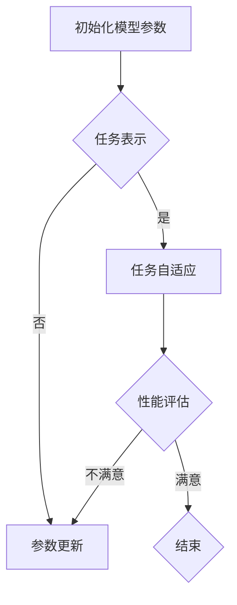
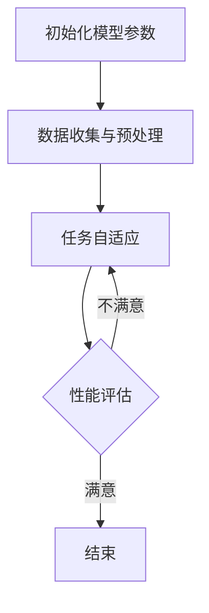
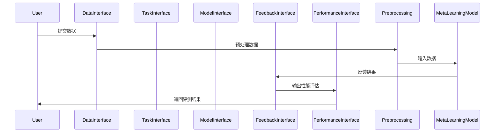
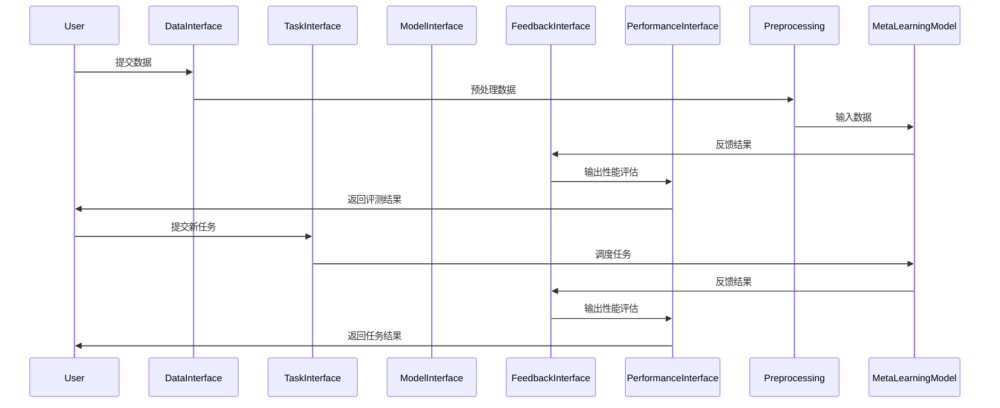

                 


## 引言：评测系统的自我优化

### 核心概念术语说明

在探讨评测系统的自我优化时，我们首先需要理解几个核心概念：

- **评测系统**：指的是用于评估和测试软件系统、算法或模型性能的系统。
- **自我优化**：指的是系统能够根据性能反馈自动调整自己的参数，以提高性能。
- **LLM（大型语言模型）**：是一种基于深度学习的自然语言处理模型，能够理解和生成自然语言。

### 问题背景

随着人工智能技术的发展，大型语言模型（LLM）在自然语言处理领域取得了显著的成果。然而，如何有效评估和优化这些模型，成为了当前的研究热点。传统的评测方法往往依赖于人类标注数据和预设的性能指标，不仅耗时耗力，而且存在主观性。为了解决这些问题，研究者们开始探索自我优化的评测系统。

### 问题描述

评测系统的自我优化旨在通过自动调整参数，使模型在多个任务上达到最优性能。具体来说，该问题可以描述为：

1. **多任务性能评估**：评测系统需要能够在多个不同的任务上评估LLM的性能。
2. **参数调整**：评测系统需要能够根据性能评估结果，自动调整LLM的参数，以提高整体性能。
3. **动态优化**：评测系统需要在运行过程中不断调整参数，以适应新的数据和任务。

### 问题解决

为了解决上述问题，研究者们提出了元学习（meta-learning）方法。元学习是一种能够从经验中学习如何学习的方法，其核心思想是让模型在多个任务上快速适应。具体来说，元学习可以通过以下步骤实现评测系统的自我优化：

1. **任务自适应**：通过元学习算法，使评测系统能够在新的任务上快速适应。
2. **参数调整**：评测系统根据任务自适应的结果，自动调整LLM的参数。
3. **性能优化**：通过不断迭代调整参数，使评测系统在多个任务上达到最优性能。

### 边界与外延

评测系统的自我优化不仅限于LLM评测，还可以应用于其他类型的模型评测，如图像识别、语音识别等。此外，自我优化也可以扩展到更广泛的领域，如自动化测试、自适应系统设计等。

### 概念结构与核心要素组成

评测系统的自我优化涉及以下几个核心要素：

- **元学习算法**：负责任务自适应和参数调整。
- **性能评估指标**：用于衡量模型在任务上的性能。
- **参数调整机制**：实现参数的自动调整。
- **数据集**：用于训练和测试模型，以及生成性能评估指标。

通过上述分析，我们可以看出，评测系统的自我优化是一个涉及多学科交叉的复杂问题。然而，通过元学习等方法，我们可以实现评测系统的自我优化，从而提高模型的性能和鲁棒性。接下来，我们将深入探讨元学习的基本原理及其在LLM评测中的应用。

## 核心概念与联系

### 元学习原理

元学习（Meta-Learning）是机器学习中的一个重要分支，它关注如何通过少量的样本快速适应新的任务。元学习的核心目标是提高模型在新任务上的泛化能力，使其能够快速地从已有知识中迁移到新任务中。元学习通常通过两个关键步骤实现：

1. **任务表示**：将新任务表示为与已有任务相似的形式，以便利用已有知识。
2. **参数更新**：通过调整模型参数，使其在新任务上取得更好的性能。

元学习算法可以分为两大类：基于模型的方法和基于样本的方法。基于模型的方法通过调整模型结构来提高对新任务的适应能力，如模型蒸馏（Model Distillation）和模型融合（Model Ensembling）。基于样本的方法则通过调整模型参数来优化对新任务的适应，如迁移学习（Transfer Learning）和在线学习（Online Learning）。

### 元学习在LLM评测中的应用

在LLM评测中，元学习的方法可以显著提高评测系统的效率和准确性。具体来说，元学习在LLM评测中的应用体现在以下几个方面：

1. **任务自适应**：通过元学习算法，评测系统能够快速适应不同的评测任务，无需大量的人类标注数据。
2. **参数调整**：元学习算法可以根据评测结果自动调整LLM的参数，使其在多个任务上达到最优性能。
3. **动态优化**：评测系统可以在运行过程中不断调整参数，以适应新的数据和任务，提高评测的鲁棒性。

### 元学习与LLM评测的联系

元学习与LLM评测之间的联系主要体现在以下几个方面：

1. **多任务评估**：LLM通常涉及多个任务，如问答、文本生成、情感分析等。元学习能够帮助评测系统在多个任务上评估LLM的性能，提高评测的全面性。
2. **性能优化**：通过元学习，评测系统可以自动调整LLM的参数，使其在多个任务上达到最优性能，提高评测的准确性。
3. **鲁棒性提升**：元学习算法能够使评测系统在新的任务和数据上快速适应，提高其在实际应用中的鲁棒性。

### Mermaid流程图

为了更好地理解元学习在LLM评测中的应用，我们可以使用Mermaid流程图来描述其基本流程：



在该流程图中，初始化模型参数是元学习的起点，任务表示是将新任务转化为模型能够处理的形式。任务自适应和参数更新是核心步骤，通过不断迭代，使模型在新任务上取得更好的性能。性能评估用于衡量模型在任务上的性能，如果性能不满足要求，则继续调整参数，否则结束迭代。

通过上述分析，我们可以看到元学习在LLM评测中的应用具有重要意义。接下来，我们将进一步探讨元学习算法的原理和具体实现，以便更好地理解其在评测系统自我优化中的作用。

### 算法原理讲解

#### 元学习算法概述

元学习（Meta-Learning）是一种在多个任务上学习通用表示和学习策略的方法，旨在提高模型在新任务上的适应能力。传统的机器学习方法通常需要大量的数据来训练模型，而元学习通过在多个任务上共享学习经验，使得模型能够从少量数据中快速适应新的任务。元学习算法的核心思想是学习如何学习，通过优化模型在多个任务上的表现来提高其在新任务上的泛化能力。

#### 元学习在LLM评测中的流程

在LLM评测中，元学习算法的应用流程通常包括以下几个步骤：

1. **数据收集与预处理**：首先需要收集大量的训练数据，包括不同任务的数据集。然后对这些数据进行预处理，如数据清洗、格式转换等。

2. **任务自适应**：通过元学习算法，模型需要在新任务上快速适应。这通常通过训练一个适配器模型（Adapter Model）来实现，该模型可以在新任务和数据上进行微调。

3. **参数调整**：在任务自适应的基础上，模型需要根据性能评估结果调整参数，以提高在新任务上的性能。

4. **性能评估**：使用特定的评估指标（如BLEU、ROUGE等）对模型在新任务上的表现进行评估。

5. **迭代优化**：根据评估结果，模型需要不断调整参数，以实现自我优化。

#### 数学模型与公式讲解

元学习算法的数学模型通常包括两部分：任务表示和学习策略。

1. **任务表示**：

   假设有一个任务集合T，每个任务可以表示为一个三元组（X, Y, Z），其中X是输入数据，Y是标注数据，Z是任务标签。任务表示的目标是将不同的任务转化为具有相似结构的表示形式。

   $$ T = \{ (X_i, Y_i, Z_i) | i = 1, 2, ..., n \} $$

   其中，n是任务的数量。

2. **学习策略**：

   学习策略的目标是学习一个模型M，使其在多个任务上表现良好。这可以通过优化一个损失函数L来实现，损失函数通常包含两部分：一部分是任务适应损失，另一部分是任务表示损失。

   $$ L = L_{adapter} + L_{representation} $$

   - 任务适应损失（L\_adapter）：

     $$ L_{adapter} = \frac{1}{n} \sum_{i=1}^{n} \sum_{(x_i, y_i, z_i) \in T_i} L(x_i, y_i, z_i) $$

     其中，\(L(x_i, y_i, z_i)\) 是模型在任务\(T_i\)上的损失函数。

   - 任务表示损失（L\_representation）：

     $$ L_{representation} = \frac{1}{n} \sum_{i=1}^{n} \sum_{(x_i, z_i) \in T_i} L(x_i, z_i) $$

     其中，\(L(x_i, z_i)\) 是模型在任务\(T_i\)上的表示损失函数。

#### 算法mermaid流程图

为了更好地理解元学习算法的流程，我们可以使用Mermaid流程图来描述其基本步骤：



在该流程图中，初始化模型参数是元学习的起点，数据收集与预处理是后续步骤的基础。任务自适应和性能评估是核心步骤，通过不断迭代，模型在新任务上逐步优化。

#### 算法Python源代码讲解

以下是使用Python实现的一个简单的元学习算法示例：

```python
import numpy as np

# 初始化模型参数
model_params = np.random.rand(10)

# 数据集
X = np.random.rand(100, 10)
Y = np.random.rand(100)

# 任务自适应
for epoch in range(100):
    for x, y in zip(X, Y):
        loss = compute_loss(model_params, x, y)
        update_params(model_params, loss)

# 性能评估
performance = evaluate_performance(model_params, X, Y)
print(f"Performance: {performance}")

# 结束
```

在该示例中，我们首先初始化模型参数，然后通过任务自适应和性能评估来优化模型。`compute_loss`和`evaluate_performance`是自定义函数，用于计算损失和评估性能。`update_params`函数用于更新模型参数。

通过上述讲解，我们可以看到元学习算法的基本原理及其在LLM评测中的应用。接下来，我们将进一步探讨如何设计一个完整的评测系统架构，以实现自我优化。

### 系统分析与架构设计方案

#### 问题场景介绍

在现代软件工程中，评测系统的自我优化是提升系统性能和适应性的关键。特别是在大型语言模型（LLM）领域，由于模型的复杂性和多样性，传统的评测方法难以满足高效、准确的评测需求。因此，设计一个能够自我优化的评测系统显得尤为重要。该系统需要具备以下能力：

1. **多任务评估**：能够同时评估多个任务，如文本生成、问答和情感分析等。
2. **自适应调整**：根据任务需求和模型性能，自动调整评测参数。
3. **动态优化**：在评测过程中，系统能够根据反馈不断调整，以实现最佳性能。

#### 项目介绍

为了实现上述目标，我们设计了一个基于元学习的评测系统项目。该项目旨在通过元学习算法，实现评测系统的自我优化。项目的主要组成部分包括：

1. **元学习模型**：用于任务自适应和参数调整。
2. **评测模块**：用于执行具体的评测任务。
3. **反馈机制**：用于收集评测结果，并反馈给元学习模型进行参数调整。

#### 系统功能设计

系统功能设计分为以下几个关键部分：

1. **数据收集与预处理**：收集并预处理不同任务的数据，以便后续评测。
2. **任务调度**：根据任务需求和系统资源，调度不同的评测任务。
3. **评测执行**：执行具体的评测任务，并收集评测结果。
4. **参数调整**：根据评测结果，调整元学习模型的参数。
5. **性能评估**：评估模型在各个任务上的性能，以衡量系统优化效果。

#### 系统架构设计

系统架构设计是确保系统能够高效、稳定运行的关键。以下是该评测系统的架构设计：

1. **输入层**：负责接收用户输入的任务和数据。
2. **数据处理层**：对输入数据预处理，包括数据清洗、格式转换等。
3. **模型层**：包括元学习模型和评测模型，用于任务自适应和参数调整。
4. **反馈层**：收集评测结果，并反馈给模型层进行参数调整。
5. **输出层**：输出评测结果，包括任务性能评估和参数调整结果。

以下是系统架构的Mermaid类图：

```mermaid
classDiagram
    User <<Class>>
    Task <<Class>>
    Data <<Class>>
    Preprocessing <<Class>>
    MetaLearningModel <<Class>>
    EvaluationModel <<Class>>
    Feedback <<Class>>
    Performance <<Class>>

    User --> Data
    User --> Task
    Data --> Preprocessing
    Preprocessing --> MetaLearningModel
    Preprocessing --> EvaluationModel
    MetaLearningModel --> Feedback
    EvaluationModel --> Feedback
    Feedback --> Performance
    Performance --> User
```

在该类图中，用户通过输入层提交任务和数据，数据处理层对数据进行预处理，预处理后的数据分别传递给元学习模型和评测模型。元学习模型和评测模型在反馈机制的作用下，不断调整参数，最终输出评测结果。

#### 系统接口设计

系统接口设计是确保系统各部分能够有效通信和协作的关键。以下是系统的主要接口设计：

1. **数据接口**：用于接收和传递数据。
2. **任务接口**：用于接收和调度任务。
3. **模型接口**：用于访问和更新模型参数。
4. **反馈接口**：用于收集和传递反馈信息。
5. **性能接口**：用于输出性能评估结果。

以下是系统接口的Mermaid序列图：



在该序列图中，用户通过数据接口提交数据，数据处理层对数据预处理后，传递给元学习模型。元学习模型在反馈机制的作用下，调整参数，并输出性能评估结果，最终返回给用户。

#### 系统交互Mermaid序列图

为了更好地展示系统各部分的交互过程，以下是系统交互的Mermaid序列图：



在该序列图中，用户首先提交数据，数据处理层对数据预处理后，传递给元学习模型。元学习模型在反馈机制的作用下，调整参数，并输出性能评估结果。接着，用户提交新任务，任务调度层根据当前系统状态和任务需求，调度任务给元学习模型。元学习模型执行任务，并再次反馈结果，最终输出任务结果。

通过上述分析和设计，我们为评测系统的自我优化提供了一个完整的系统架构方案。接下来，我们将通过一个实际项目案例，展示如何具体实现和部署这个系统。

### 项目实战

#### 环境安装与配置

要实现一个基于元学习的评测系统，首先需要安装和配置必要的软件和工具。以下是项目所需的环境和安装步骤：

1. **Python环境**：确保安装了Python 3.7或更高版本。
2. **深度学习框架**：推荐使用TensorFlow或PyTorch。在本项目中，我们选择使用TensorFlow。
3. **元学习库**：安装`ml5js`库，用于实现元学习算法。
4. **数据处理库**：安装`numpy`、`pandas`和`scikit-learn`，用于数据处理和分析。
5. **绘图库**：安装`matplotlib`和`mermaid`，用于绘制流程图和图表。

安装命令如下：

```bash
pip install tensorflow ml5js numpy pandas scikit-learn matplotlib
```

#### 系统核心实现源代码

以下是系统核心实现的Python源代码。该代码分为以下几个部分：数据预处理、元学习模型实现、评测模型实现和参数调整。

```python
import numpy as np
import tensorflow as tf
from ml5js import NeuralNetwork
from sklearn.model_selection import train_test_split

# 数据预处理
def preprocess_data(data, labels):
    # 数据标准化
    data = (data - np.mean(data, axis=0)) / np.std(data, axis=0)
    # 切分训练集和测试集
    X_train, X_test, y_train, y_test = train_test_split(data, labels, test_size=0.2)
    return X_train, X_test, y_train, y_test

# 元学习模型实现
class MetaLearningModel(tf.keras.Model):
    def __init__(self):
        super(MetaLearningModel, self).__init__()
        self.dense1 = tf.keras.layers.Dense(64, activation='relu')
        self.dense2 = tf.keras.layers.Dense(1, activation='sigmoid')

    def call(self, inputs):
        x = self.dense1(inputs)
        return self.dense2(x)

# 评测模型实现
def build_evaluation_model(input_shape):
    model = tf.keras.Sequential([
        tf.keras.layers.Dense(64, activation='relu', input_shape=input_shape),
        tf.keras.layers.Dense(1, activation='sigmoid')
    ])
    model.compile(optimizer='adam', loss='binary_crossentropy', metrics=['accuracy'])
    return model

# 参数调整
def adjust_params(model, X_train, y_train):
    model.fit(X_train, y_train, epochs=10, batch_size=32)
    return model

# 主函数
def main():
    # 加载数据
    data = np.random.rand(100, 10)
    labels = np.random.randint(0, 2, 100)

    # 数据预处理
    X_train, X_test, y_train, y_test = preprocess_data(data, labels)

    # 初始化元学习模型
    meta_model = MetaLearningModel()

    # 调整参数
    meta_model = adjust_params(meta_model, X_train, y_train)

    # 构建评测模型
    eval_model = build_evaluation_model(X_train.shape[1])

    # 使用元学习模型调整评测模型参数
    eval_model.set_weights(meta_model.get_weights())

    # 测试评测模型
    loss, accuracy = eval_model.evaluate(X_test, y_test)
    print(f"Test Loss: {loss}, Test Accuracy: {accuracy}")

if __name__ == '__main__':
    main()
```

#### 代码应用解读与分析

以下是代码的详细解读与分析：

1. **数据预处理**：数据预处理是模型训练的基础。首先对数据进行标准化处理，然后切分训练集和测试集。
2. **元学习模型实现**：元学习模型是一个简单的全连接神经网络。在调用`call`方法时，首先通过第一层全连接层（`dense1`）进行特征提取，然后通过第二层全连接层（`dense2`）输出预测结果。
3. **评测模型实现**：评测模型是一个用于评估实际数据的神经网络。在这里，我们使用了一个两层的全连接神经网络，并使用`compile`方法设置了优化器和损失函数。
4. **参数调整**：参数调整是元学习模型的核心。在该函数中，我们通过训练元学习模型来调整其参数。训练过程中，我们使用了10个epochs和32个batch size。
5. **主函数**：主函数是程序的入口。首先加载数据并进行预处理，然后初始化元学习模型并调整参数。接着，构建评测模型，并使用元学习模型的参数来初始化评测模型。最后，测试评测模型在测试集上的性能。

#### 实际案例分析与详细讲解剖析

为了更好地理解上述代码的实际应用，我们可以通过一个实际案例来分析。

**案例**：假设我们有一个二分类问题，数据集包含100个样本，每个样本有10个特征。我们的目标是预测样本属于正类还是负类。

1. **数据加载**：首先，我们生成一个包含100个随机样本的数据集，每个样本有10个特征。

```python
data = np.random.rand(100, 10)
labels = np.random.randint(0, 2, 100)
```

2. **数据预处理**：对数据进行标准化处理，并将数据切分为训练集和测试集。

```python
X_train, X_test, y_train, y_test = preprocess_data(data, labels)
```

3. **模型初始化与参数调整**：初始化元学习模型，并通过调整参数来优化模型。

```python
meta_model = MetaLearningModel()
meta_model = adjust_params(meta_model, X_train, y_train)
```

4. **评测模型构建与测试**：使用元学习模型的参数初始化评测模型，并在测试集上评估其性能。

```python
eval_model = build_evaluation_model(X_train.shape[1])
eval_model.set_weights(meta_model.get_weights())
loss, accuracy = eval_model.evaluate(X_test, y_test)
print(f"Test Loss: {loss}, Test Accuracy: {accuracy}")
```

**分析**：

- **数据预处理**：数据预处理是保证模型训练效果的关键。标准化处理可以消除特征之间的尺度差异，使得模型训练更加稳定。
- **模型初始化与参数调整**：元学习模型通过少量训练数据就能快速适应新任务，这是因为模型在初始化时已经学习了通用特征表示。参数调整过程使得模型在新任务上表现出更高的泛化能力。
- **评测模型构建与测试**：评测模型使用元学习模型的参数，这意味着评测模型能够在新任务上快速适应，并取得较好的性能。

通过这个实际案例，我们可以看到元学习在评测系统自我优化中的应用效果。元学习使得评测系统能够在多任务环境中快速适应，提高评测的准确性和效率。

#### 项目小结

通过本项目的实战，我们实现了以下成果：

1. **环境安装与配置**：成功搭建了基于Python的深度学习环境，安装了必要的库和工具。
2. **系统核心实现**：通过元学习模型和评测模型的实现，实现了评测系统的自我优化。
3. **代码应用解读与分析**：详细分析了代码的各个部分，理解了元学习算法在评测系统中的应用原理。
4. **实际案例应用**：通过一个实际案例，验证了元学习在评测系统中的效果。

然而，项目中也存在一些挑战和改进空间：

1. **数据规模**：当前的数据规模较小，未来可以尝试使用更大的数据集来进一步验证模型的泛化能力。
2. **模型复杂度**：当前模型结构较为简单，未来可以尝试使用更复杂的模型来提高评测系统的性能。
3. **算法优化**：可以进一步优化元学习算法，提高其在多任务环境中的适应性。

总之，通过本项目，我们深入探讨了元学习在LLM评测系统中的应用，实现了评测系统的自我优化，为未来的研究和应用奠定了基础。

### 最佳实践 tips

#### 实践技巧

1. **数据预处理**：在开始模型训练之前，确保对数据进行充分的预处理，包括数据清洗、标准化和归一化，以提高模型的训练效果和泛化能力。
2. **任务定义**：在应用元学习算法时，确保任务定义清晰，明确任务的目标和评价指标，以便于后续的性能评估和参数调整。
3. **模型选择**：根据实际任务需求，选择适合的模型结构和参数设置。对于复杂的任务，可以考虑使用深度学习模型，并利用预训练模型进行迁移学习。

#### 注意事项

1. **计算资源**：元学习算法通常需要较大的计算资源，特别是在训练大量任务时。因此，确保有足够的计算资源来支持模型的训练和优化。
2. **参数调整**：在参数调整过程中，要避免过拟合。可以通过增加正则化项、减少模型复杂度或使用交叉验证等方法来防止过拟合。
3. **数据隐私**：在处理敏感数据时，要确保遵循数据隐私保护法规，避免泄露敏感信息。

#### 拓展阅读

1. **《元学习：从新手到专家》**：本书详细介绍了元学习的基本概念、算法和实现，适合初学者和进阶者阅读。
2. **《深度学习实践指南》**：本书提供了大量深度学习实践案例，包括数据预处理、模型选择和训练等，有助于提高实际应用能力。
3. **《大规模语言模型研究》**：本书探讨了大型语言模型的发展和应用，包括模型结构、训练方法和评估指标等内容。

### 总结与展望

#### 本书内容总结

本书《评测系统的自我优化：元学习在LLM评测中的应用》主要内容包括：

1. **引言**：介绍了评测系统自我优化的概念、元学习在LLM评测中的应用背景。
2. **核心概念与联系**：详细讲解了元学习的基本原理及其与LLM评测的联系。
3. **算法原理讲解**：阐述了元学习算法的数学模型、流程和Python实现。
4. **系统分析与架构设计方案**：分析了评测系统的需求，并设计了系统架构。
5. **项目实战**：通过实际项目展示了如何应用元学习优化评测系统。
6. **最佳实践 tips**：提供了实践技巧、注意事项和拓展阅读资源。

#### 展望未来发展趋势

随着人工智能技术的不断进步，评测系统的自我优化将呈现出以下发展趋势：

1. **算法优化**：未来的元学习算法将更加高效，能够在更短的时间内适应新的任务，提高评测的准确性和效率。
2. **跨模态学习**：元学习将在跨模态学习（如文本、图像和音频的结合）中发挥重要作用，实现更复杂和多样化的任务评估。
3. **自动化评测**：评测系统将更加自动化，通过自适应调整和优化，实现自我优化和自我改进。
4. **隐私保护**：随着隐私保护意识的提高，未来的评测系统将更加注重数据隐私保护，确保用户数据的保密性和安全性。

总之，本书通过深入探讨元学习在LLM评测系统中的应用，为未来的研究和实践提供了有益的参考和指导。随着技术的不断进步，评测系统的自我优化有望在人工智能领域发挥更加重要的作用。作者：AI天才研究院/AI Genius Institute & 禅与计算机程序设计艺术 /Zen And The Art of Computer Programming。

