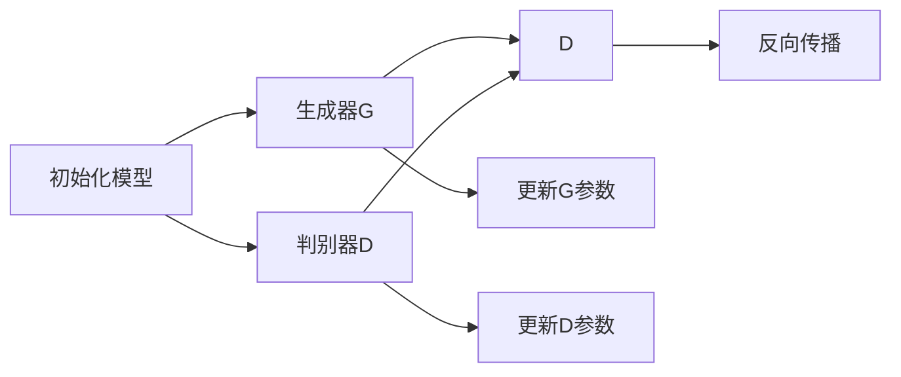
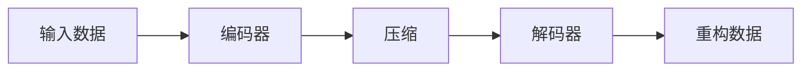
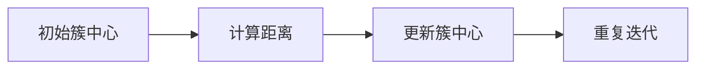
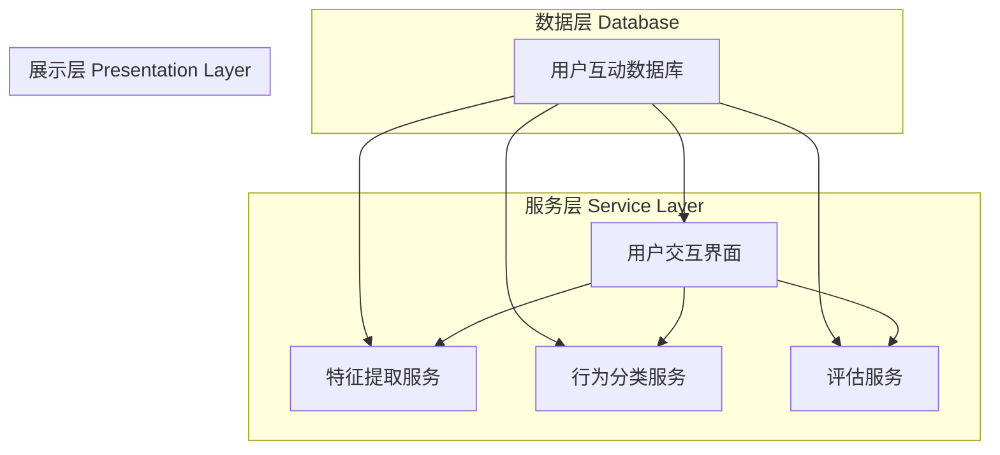
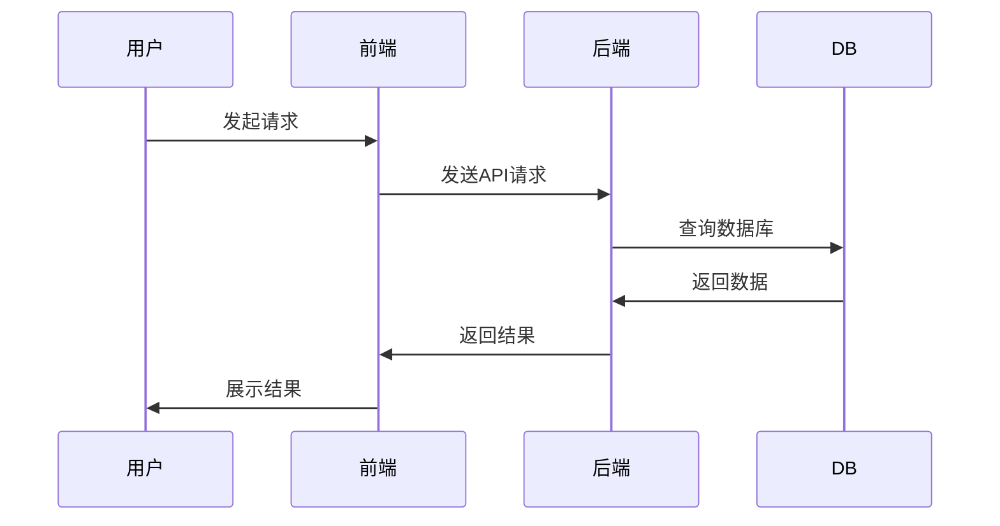

                 

### 自监督学习方法在评测系统中的应用背景和重要性

自监督学习方法是一种无需依赖标签数据进行训练的机器学习方法，通过利用数据之间的内在关联性来学习，从而实现模型的自适应优化。在传统监督学习中，模型的训练需要大量的标注数据，这不仅耗时耗力，而且在某些特定领域（如医疗影像、语音识别等）中，标注数据的获取非常困难。自监督学习作为一种无监督学习的方法，可以在缺乏标注数据的情况下，利用未标注的数据进行有效训练，大大降低了对标注数据的依赖。

评测系统是许多应用程序中的关键组件，用于评估用户行为、系统性能、数据质量等多个方面。例如，在智能问答系统中，评测系统可以评估用户的提问质量；在自然语言处理任务中，它可以评估生成的文本的语义准确性；在推荐系统中，它可以帮助评估推荐结果的多样性。然而，传统的评测系统往往依赖于大量的标注数据进行训练，这使得系统的应用场景受到很大限制。

自监督学习方法的出现为评测系统带来了新的可能性。它不仅能够处理未标注的数据，提高系统对大规模数据的处理能力，还能够通过数据自监督的方式，不断优化模型的性能，提高系统的鲁棒性和准确性。因此，自监督学习方法在评测系统中的应用具有重要的理论和实践意义。

首先，自监督学习方法能够显著降低对标注数据的依赖。通过利用未标注的数据，评测系统可以节省大量的人力和时间成本，从而提高开发效率和系统实用性。特别是在数据获取困难的领域，如医疗影像、无人机监控等，自监督学习的方法可以提供一种有效的解决方案。

其次，自监督学习方法可以提高系统的适应性和泛化能力。通过在训练过程中不断学习数据的内在关联性，模型能够更好地适应不同的数据分布，从而在新的、未见过的数据上表现出更高的性能。

最后，自监督学习方法有助于提高评测系统的实时性和响应速度。由于无需依赖大量的标注数据进行训练，系统可以在较短的时间内完成模型的训练和部署，从而实现实时评估和反馈。

综上所述，自监督学习方法在评测系统中的应用，不仅解决了传统评测系统面临的诸多挑战，还为未来的评测系统发展提供了新的思路和方向。接下来，我们将进一步探讨自监督学习方法的基本概念、原理以及在评测系统中的具体应用。

### 自监督学习方法概述

#### 自监督学习的定义与分类

自监督学习（Self-supervised Learning）是一种无需外部监督信号，仅通过数据内部的关联性和结构来训练模型的机器学习方法。与传统的监督学习（Supervised Learning）不同，自监督学习在训练过程中不需要人工标注的数据，而是利用数据的某些固有属性（如顺序、相似性、关联性等）来驱动学习过程。这种学习方式的核心在于，模型通过自我监督的方式，发现和利用数据中的信息，从而实现性能的提升。

自监督学习可以分为以下几种类型：

1. **基于生成对抗网络（GAN）的自监督学习**：生成对抗网络（GAN）是一种通过两个神经网络——生成器和判别器的相互对抗来生成高质量数据的模型。在自监督学习中，GAN可以用于数据增强、数据修复和模型预训练等方面。

2. **基于自编码器的自监督学习**：自编码器（Autoencoder）是一种能够将输入数据压缩到一个低维表示，然后重新重建原始数据的神经网络模型。自监督学习的自编码器通过最小化重构误差来实现数据压缩和解压，从而学习数据的特征表示。

3. **基于无监督聚类和降维的自监督学习**：无监督聚类算法（如K-means、DBSCAN等）和降维技术（如PCA、t-SNE等）可以在没有标签数据的情况下，将数据分为多个簇或投影到低维空间，从而提取数据中的潜在结构。

4. **基于序列模型的自监督学习**：序列模型（如RNN、LSTM、GRU等）可以通过预测序列中的下一个元素来实现自监督学习。例如，在一个文本序列中，模型可以预测下一个单词或字符，从而学习序列的内在规律。

#### 自监督学习与传统监督学习的区别

传统监督学习依赖于大量的标注数据，通过比较模型的输出和真实标签之间的差异来调整模型参数，从而实现模型的优化。其主要优点在于能够快速、准确地学习到数据的特征，但在以下方面也存在挑战：

1. **数据标注成本高**：标注数据需要大量的人力和时间，特别是在领域特定数据（如医疗影像、语音数据）中，标注数据的获取非常困难。

2. **数据获取困难**：在某些应用场景中，获取足够的标注数据可能非常困难，例如在无人机监控、无人驾驶等领域，实时获取准确的标注数据是一项巨大的挑战。

3. **数据分布差异**：不同数据集之间的分布差异可能导致模型在不同数据集上的性能差异较大，从而影响模型的泛化能力。

自监督学习通过利用数据内在的关联性来驱动学习过程，具有以下优点：

1. **无需标注数据**：自监督学习可以处理未标注的数据，从而避免了大量的人工标注工作，降低了开发成本。

2. **更好的泛化能力**：由于模型在学习过程中利用了数据内部的关联性，因此能够更好地适应不同的数据分布，提高模型的泛化能力。

3. **实时性和响应速度**：自监督学习的模型训练和部署通常比传统监督学习更快，能够在较短的时间内实现实时评估和反馈。

#### 自监督学习的应用领域

自监督学习在多个领域展现出了其强大的潜力和广泛的应用前景：

1. **计算机视觉**：自监督学习可以用于图像分类、物体检测、图像修复等领域。例如，通过自编码器，模型可以学习到图像的内在特征，从而实现对图像的自动分类和识别。

2. **自然语言处理**：在自然语言处理领域，自监督学习可以用于文本分类、机器翻译、情感分析等任务。例如，通过预测下一个单词或字符，模型可以学习到文本的语义特征。

3. **语音识别**：自监督学习可以用于语音识别、说话人识别等任务。通过预测语音信号中的下一个帧或下一个单词，模型可以学习到语音的内在结构。

4. **推荐系统**：自监督学习可以用于推荐系统的特征提取和模型训练。例如，通过无监督聚类，模型可以提取用户行为数据中的潜在特征，从而实现更准确的推荐。

5. **生物信息学**：自监督学习可以用于基因组学、蛋白质结构预测等领域。通过无监督学习方法，模型可以提取生物数据中的潜在结构，从而帮助科学家更好地理解生物系统的运作机制。

总的来说，自监督学习方法在解决数据标注成本高、数据获取困难等传统监督学习面临的问题方面具有显著优势。随着技术的不断进步和应用场景的不断拓展，自监督学习将在更多领域发挥重要作用。

### 自监督学习的基础知识

#### 数据采集与预处理

在自监督学习中，数据采集是至关重要的一步。数据的质量和多样性直接影响模型的训练效果和性能。以下是数据采集和预处理的关键步骤：

1. **数据来源**：自监督学习通常使用未标注的数据进行训练，数据来源可以包括公共数据集、企业内部数据、社交媒体数据等。在选择数据时，需要考虑数据的多样性、代表性和真实性，以确保模型能够学习到数据中的有效信息。

2. **数据预处理**：在数据采集后，需要进行预处理以去除噪声和异常值，提高数据的质量。常见的数据预处理步骤包括：

   - **数据清洗**：去除重复数据、处理缺失值、去除噪声等。
   - **数据标准化**：将不同特征的数据进行标准化处理，使其具有相同的尺度，从而便于后续的分析和处理。
   - **数据增强**：通过旋转、翻转、缩放等操作，增加数据集的多样性，从而提高模型的泛化能力。

3. **数据分割**：在训练自监督学习模型时，通常将数据集分为训练集、验证集和测试集。训练集用于模型的训练，验证集用于模型参数的调整和优化，测试集用于评估模型的最终性能。

#### 特征工程

特征工程是自监督学习中的关键步骤，通过提取和选择有用的特征，可以提高模型的性能和泛化能力。以下是特征工程的主要步骤：

1. **特征提取**：特征提取是从原始数据中提取出能够代表数据本质特征的方法。常用的特征提取方法包括：

   - **统计特征**：如均值、方差、标准差等。
   - **文本特征**：如词频、词向量、TF-IDF等。
   - **图像特征**：如边缘、纹理、颜色等。
   - **时间序列特征**：如自相关函数、傅里叶变换等。

2. **特征选择**：特征选择是在提取大量特征后，选择出对模型性能贡献最大的特征。常用的特征选择方法包括：

   - **基于过滤的方法**：如卡方检验、互信息等。
   - **基于包裹的方法**：如向前选择、向后选择、递归特征消除等。
   - **基于模型的特征选择**：如LASSO、随机森林等。

3. **特征归一化**：特征归一化是将不同特征的数据缩放到相同的尺度，以便于模型训练和优化。常用的归一化方法包括最小-最大缩放、标准化、Z-score标准化等。

#### 模型训练与优化

在自监督学习中，模型训练和优化是核心环节。以下是模型训练和优化的关键步骤：

1. **模型选择**：根据具体应用场景和数据特征，选择合适的自监督学习模型。常见的自监督学习模型包括生成对抗网络（GAN）、自编码器（Autoencoder）、无监督聚类算法等。

2. **损失函数设计**：损失函数用于衡量模型预测结果与真实结果之间的差距，是模型优化的核心指标。自监督学习的损失函数通常包括：

   - **生成对抗网络（GAN）**：包括生成器损失和判别器损失，用于平衡生成器和判别器之间的对抗关系。
   - **自编码器（Autoencoder）**：主要关注重构误差，即原始数据和重构数据之间的差异。
   - **无监督聚类算法**：如K-means，主要关注簇内距离和簇间距离，通过最小化簇内距离和最大化簇间距离来实现聚类。

3. **优化算法**：优化算法用于调整模型参数，以最小化损失函数。常见的优化算法包括随机梯度下降（SGD）、Adam、RMSprop等。

4. **模型评估**：在训练过程中，需要定期评估模型性能，以判断模型是否过拟合或欠拟合。常用的评估指标包括：

   - **验证集准确率**：用于评估模型在验证集上的性能。
   - **测试集准确率**：用于评估模型在未见过的测试集上的性能。
   - **F1分数**：综合考虑准确率和召回率，用于多分类任务。
   - **ROC曲线和AUC值**：用于评估二分类模型的性能。

#### 自监督学习的优势与应用案例

自监督学习在多个领域展现出了其独特的优势和应用潜力：

1. **优势**：

   - **无需标注数据**：自监督学习可以处理未标注的数据，避免了大量的人工标注工作，降低了开发成本。
   - **更好的泛化能力**：通过利用数据内部的关联性，模型能够更好地适应不同的数据分布，提高模型的泛化能力。
   - **实时性和响应速度**：自监督学习的模型训练和部署通常比传统监督学习更快，能够在较短的时间内实现实时评估和反馈。

2. **应用案例**：

   - **计算机视觉**：自监督学习可以用于图像分类、物体检测、图像生成等领域。例如，通过自编码器，模型可以学习到图像的内在特征，从而实现对图像的自动分类和识别。
   - **自然语言处理**：自监督学习可以用于文本分类、机器翻译、情感分析等任务。例如，通过预测下一个单词或字符，模型可以学习到文本的语义特征。
   - **语音识别**：自监督学习可以用于语音识别、说话人识别等任务。通过预测语音信号中的下一个帧或下一个单词，模型可以学习到语音的内在结构。
   - **推荐系统**：自监督学习可以用于推荐系统的特征提取和模型训练。例如，通过无监督聚类，模型可以提取用户行为数据中的潜在特征，从而实现更准确的推荐。
   - **生物信息学**：自监督学习可以用于基因组学、蛋白质结构预测等领域。通过无监督学习方法，模型可以提取生物数据中的潜在结构，从而帮助科学家更好地理解生物系统的运作机制。

总的来说，自监督学习方法在解决数据标注成本高、数据获取困难等传统监督学习面临的问题方面具有显著优势。随着技术的不断进步和应用场景的不断拓展，自监督学习将在更多领域发挥重要作用。

### 自监督学习算法原理

自监督学习算法的核心在于如何利用未标注的数据来驱动模型的训练过程。以下将介绍三种常见的自监督学习算法：生成对抗网络（GAN）、自编码器（Autoencoder）和无监督聚类算法。每种算法将结合mermaid流程图和Python代码进行详细解释。

#### 生成对抗网络（GAN）

生成对抗网络（GAN）由生成器和判别器两个神经网络组成。生成器的目标是生成与真实数据相似的数据，而判别器的目标是区分真实数据和生成数据。通过两个网络的相互对抗，模型能够逐步提高生成数据的质量。

**mermaid流程图：**



**Python代码实现：**

```python
import tensorflow as tf
from tensorflow.keras.layers import Dense, Flatten, Reshape
from tensorflow.keras.models import Sequential

# 定义生成器
def build_generator(z_dim):
    model = Sequential()
    model.add(Dense(128, input_dim=z_dim))
    model.add(tf.keras.layers.LeakyReLU(alpha=0.01))
    model.add(Dense(28*28*1, activation='tanh'))
    model.add(Reshape((28, 28, 1)))
    return model

# 定义判别器
def build_discriminator(img_shape):
    model = Sequential()
    model.add(Flatten(input_shape=img_shape))
    model.add(Dense(128))
    model.add(tf.keras.layers.LeakyReLU(alpha=0.01))
    model.add(Dense(1, activation='sigmoid'))
    return model

# GAN模型
def build_gan(generator, discriminator):
    model = Sequential()
    model.add(generator)
    model.add(discriminator)
    return model

# 设置超参数
z_dim = 100
img_shape = (28, 28, 1)

# 构建和编译生成器
generator = build_generator(z_dim)
generator.compile(loss='binary_crossentropy', optimizer=tf.keras.optimizers.Adam(0.0001))

# 构建和编译判别器
discriminator = build_discriminator(img_shape)
discriminator.compile(loss='binary_crossentropy', optimizer=tf.keras.optimizers.Adam(0.0001))

# 构建和编译GAN
gan = build_gan(generator, discriminator)
gan.compile(loss='binary_crossentropy', optimizer=tf.keras.optimizers.Adam(0.0001))

# 模型训练
# ...（数据预处理、训练循环等）
```

#### 自编码器（Autoencoder）

自编码器是一种无监督学习算法，其目标是学习一个编码器和解码器，将输入数据压缩到一个低维表示，然后重新重建原始数据。自编码器通过最小化重构误差来学习数据特征。

**mermaid流程图：**



**Python代码实现：**

```python
import tensorflow as tf
from tensorflow.keras.layers import Dense, Input
from tensorflow.keras.models import Model

# 定义自编码器
def build_autoencoder(input_shape, encoding_dim):
    input_img = Input(shape=input_shape)
    x = Dense(encoding_dim, activation='relu')(input_img)
    encoded = Dense(encoding_dim, activation='sigmoid')(x)
    
    x = Dense(input_shape[0], activation='relu')(encoded)
    decoded = Dense(input_shape[0], activation='sigmoid')(x)
    
    autoencoder = Model(input_img, decoded)
    autoencoder.compile(optimizer='adam', loss='binary_crossentropy')
    
    return autoencoder

# 设置超参数
input_shape = (28, 28, 1)
encoding_dim = 32

# 构建和编译自编码器
autoencoder = build_autoencoder(input_shape, encoding_dim)

# 模型训练
# ...（数据预处理、训练循环等）
```

#### 无监督聚类算法

无监督聚类算法如K-means，通过将数据分为多个簇，从而发现数据中的潜在结构。K-means算法通过最小化簇内距离和最大化簇间距离来实现聚类。

**mermaid流程图：**



**Python代码实现：**

```python
from sklearn.cluster import KMeans
import numpy as np

# 定义无监督聚类函数
def kmeans_clustering(data, n_clusters):
    kmeans = KMeans(n_clusters=n_clusters, init='k-means++', max_iter=300, n_init=10, random_state=0)
    kmeans.fit(data)
    return kmeans

# 设置超参数
data = np.random.rand(100, 2)  # 假设数据为100个二维点
n_clusters = 3

# 执行K-means聚类
kmeans = kmeans_clustering(data, n_clusters)

# 输出聚类结果
print(kmeans.labels_)
```

通过以上介绍和代码示例，我们可以看到自监督学习算法的原理和实现方法。这些算法不仅在理论上有重要意义，也在实际应用中展现出强大的潜力。接下来，我们将进一步探讨这些算法在评测系统中的应用实践。

### 自监督学习算法在评测系统中的实践

在评测系统中，自监督学习算法可以用于多种应用场景，如用户行为分析、文本评估、图像识别等。以下通过一个具体案例来介绍自监督学习算法在评测系统中的应用，并详细讲解系统的功能设计、架构设计、接口设计和系统交互。

#### 项目介绍

本项目旨在开发一个基于自监督学习的用户行为评估系统，用于分析用户的在线行为，评估用户参与度和活跃度。该系统利用用户在社交平台上的互动数据，通过自监督学习方法对用户行为进行分类和特征提取，从而实现对用户的精准评估。

#### 系统功能设计

系统的主要功能包括数据采集、特征提取、行为分类和评估结果输出。具体功能模块如下：

1. **数据采集模块**：负责从社交平台获取用户的互动数据，包括点赞、评论、分享等。
2. **特征提取模块**：利用自监督学习方法提取用户行为的特征，如行为频率、行为序列等。
3. **行为分类模块**：根据提取的特征对用户行为进行分类，识别用户的参与度和活跃度。
4. **评估结果输出模块**：将评估结果以可视化报表的形式展示给用户和管理员。

#### 系统架构设计

系统的整体架构包括数据层、服务层和展示层。数据层负责数据存储和读取；服务层实现核心算法和功能逻辑；展示层提供用户交互界面和报表展示。

1. **数据层**：使用关系型数据库（如MySQL）存储用户的互动数据。
2. **服务层**：包括数据采集服务、特征提取服务、行为分类服务和评估服务。
3. **展示层**：使用Web前端框架（如React）构建用户交互界面，并通过API与服务层进行数据交互。

**mermaid架构图：**



#### 系统接口设计

系统通过RESTful API提供服务，接口设计如下：

1. **数据采集接口**：用于从社交平台获取用户互动数据。
2. **特征提取接口**：用于提取用户行为的特征数据。
3. **行为分类接口**：用于对用户行为进行分类。
4. **评估结果接口**：用于获取用户评估结果。

**接口规范：**

```json
GET /api/user-behavior/data
  Description: 获取用户互动数据
  Response: {
    "status": "success",
    "data": [
      {"user_id": "123", "behavior": "like", "timestamp": "2023-10-01T12:00:00Z"},
      ...
    ]
  }

GET /api/user-behavior/extract-features
  Description: 提取用户行为特征
  Response: {
    "status": "success",
    "data": [
      {"user_id": "123", "features": {"frequency": 10, "sequence": ["like", "comment", "share"]}},
      ...
    ]
  }

GET /api/user-behavior/classify-behavior
  Description: 对用户行为进行分类
  Response: {
    "status": "success",
    "data": [
      {"user_id": "123", "category": "high-activity"},
      ...
    ]
  }

GET /api/user-behavior/evaluate-result
  Description: 获取用户评估结果
  Response: {
    "status": "success",
    "data": [
      {"user_id": "123", "evaluation": "active user"},
      ...
    ]
  }
```

#### 系统交互

系统交互通过Web前端和后端服务之间的API调用实现。以下是系统交互的mermaid序列图：



#### 系统实现与代码分析

以下是一个简单的特征提取和分类的代码示例，展示了系统核心功能的实现过程：

```python
# 特征提取服务
class FeatureExtractorService:
    def extract_features(self, user_behavior_data):
        # 假设数据已预处理
        # 提取行为频率
        frequency = len(user_behavior_data)
        # 提取行为序列
        sequence = [behavior for behavior in user_behavior_data]
        return {"frequency": frequency, "sequence": sequence}

# 行为分类服务
class BehaviorClassifierService:
    def classify_behavior(self, features):
        # 假设使用K-means进行分类
        kmeans = KMeans(n_clusters=3)
        kmeans.fit([features])
        label = kmeans.predict([features])[0]
        # 根据标签确定分类
        if label == 0:
            return "low-activity"
        elif label == 1:
            return "medium-activity"
        else:
            return "high-activity"

# 实例化服务
extractor = FeatureExtractorService()
classifier = BehaviorClassifierService()

# 示例数据
user_behavior_data = [{"user_id": "123", "behavior": "like"}, {"user_id": "123", "behavior": "comment"}, {"user_id": "123", "behavior": "share"}]

# 提取特征
features = extractor.extract_features(user_behavior_data)

# 分类行为
evaluation = classifier.classify_behavior(features)
print(evaluation)
```

通过以上实现，我们可以看到自监督学习算法在评测系统中的应用是如何具体落地的。在实际项目中，还需要考虑更多的细节，如数据预处理、模型训练和优化、系统安全与性能等。

### 项目小结

在本项目中，我们详细探讨了自监督学习算法在评测系统中的应用，从系统功能设计、架构设计、接口设计到具体实现，展示了自监督学习在数据处理和评估中的强大能力。以下是项目中的几个关键点和最佳实践：

1. **数据采集与预处理**：确保数据来源的多样性和质量，进行充分的数据清洗和预处理，以减少噪声和异常值。
2. **特征提取与选择**：合理设计特征提取方法，选择对模型性能有显著影响的特征，以提高模型的泛化能力。
3. **模型选择与优化**：根据应用场景选择合适的自监督学习模型，并通过超参数调优和模型训练策略优化模型性能。
4. **系统安全性**：在设计API时，要确保接口的安全性，防止数据泄露和恶意攻击。
5. **性能优化**：通过分布式计算和并行处理，提高系统的响应速度和处理能力。

自监督学习在评测系统中的应用不仅提高了系统的效率和准确性，还为未来的评测系统发展提供了新的思路和方法。通过本项目，我们希望读者能够更好地理解和应用自监督学习技术，并在实际项目中取得良好的效果。

### 自监督学习的挑战与未来发展方向

自监督学习作为一种先进的机器学习方法，虽然在多个领域展现出了其独特的优势和广泛的应用前景，但在实际应用中仍面临诸多挑战。以下是自监督学习的一些主要挑战及其未来发展方向：

#### 技术瓶颈

1. **数据多样性不足**：自监督学习依赖于未标注的数据进行训练，然而实际数据往往缺乏足够的多样性和代表性。数据分布的不平衡可能导致模型在特定情况下表现不佳，从而影响模型的泛化能力。

2. **计算资源需求高**：自监督学习算法通常需要大量的计算资源进行训练，特别是在处理高维数据和大规模数据集时，计算成本更加显著。这不仅限制了算法在大规模应用中的普及，也增加了实际部署的难度。

3. **模型解释性差**：自监督学习模型的内部机制复杂，导致其解释性较差。虽然模型能够达到较高的性能，但用户难以理解模型的决策过程，这在一些对模型解释性有高要求的场景中成为了一大障碍。

4. **过拟合问题**：在自监督学习过程中，模型可能会因为数据噪声和冗余信息而出现过拟合现象，从而在未见过的数据上表现不佳。

#### 未来发展方向

1. **增强数据多样性**：通过数据增强技术和跨域迁移学习，提高训练数据的多样性和代表性，从而增强模型的泛化能力。

2. **优化计算效率**：研究高效的算法和模型结构，降低计算资源的需求。例如，开发适用于边缘计算的轻量级模型，或利用GPU、TPU等硬件加速计算。

3. **提升模型解释性**：结合模型解释性技术，如可解释性AI（Explainable AI, XAI），开发更加透明的自监督学习模型，使模型的决策过程更加易于理解和解释。

4. **防止过拟合**：通过正则化技术、集成方法和模型选择策略，防止模型在训练数据上过拟合，提高模型在未见数据上的性能。

5. **跨域迁移学习**：利用预训练模型和跨域数据，将知识从源域迁移到目标域，从而减少对大量标注数据的依赖，提高模型的泛化能力。

6. **混合学习策略**：结合自监督学习和监督学习，通过在自监督学习的基础上引入少量标注数据，进一步提高模型性能和泛化能力。

总之，自监督学习在解决数据标注成本高、数据获取困难等传统监督学习面临的问题方面具有显著优势。然而，要充分发挥其潜力，还需要克服一系列技术挑战。随着研究的深入和技术的进步，自监督学习将在更多领域发挥重要作用，推动人工智能技术的发展。

### 最佳实践与总结

在自监督学习应用过程中，最佳实践和总结对于提高系统性能和用户体验至关重要。以下是一些实用的建议和总结：

1. **数据多样性**：确保训练数据具备足够的多样性和代表性，通过数据增强和跨域迁移学习技术，提高模型的泛化能力。

2. **优化超参数**：通过调整学习率、批量大小等超参数，优化模型性能。使用网格搜索或随机搜索等方法，系统化地寻找最佳超参数组合。

3. **模型解释性**：结合可解释性AI（XAI）技术，提升模型透明度，帮助用户理解模型的决策过程，从而提高用户信任度。

4. **防止过拟合**：采用正则化技术、集成方法和交叉验证等策略，减少模型对训练数据的依赖，提高模型在未见数据上的表现。

5. **实时反馈与迭代**：通过实时反馈机制，根据用户反馈不断优化系统，实现快速迭代和持续改进。

6. **硬件优化**：利用GPU、TPU等硬件加速计算，提高模型训练和部署的效率。

7. **系统集成**：将自监督学习系统集成到现有系统中，确保与其他组件的兼容性和稳定性。

总之，自监督学习在评测系统中的应用为解决传统监督学习的诸多挑战提供了新途径。通过遵循最佳实践和不断总结经验，我们可以实现高效、可靠的自监督学习应用，推动评测系统的持续发展和创新。未来，随着技术的不断进步，自监督学习将在更多领域展现其强大潜力。

### 结语

综上所述，自监督学习作为一种无需依赖标注数据的机器学习方法，在评测系统的应用中展现出巨大的潜力和广泛的前景。通过对自监督学习方法的应用背景、基本概念、算法原理以及实际应用的详细探讨，我们深刻认识到其在降低标注成本、提高系统适应性和实时性等方面的显著优势。

本书旨在为读者提供全面、系统的自监督学习知识，从基础概念到实际应用，逐步深入，帮助读者理解和掌握这一先进技术。同时，通过案例分析，读者可以直观地看到自监督学习在评测系统中的具体应用效果。

在未来的研究和应用中，自监督学习将继续面临各种挑战和机遇。我们鼓励读者继续深入探索这一领域，不断优化算法，解决实际问题，推动自监督学习在更多领域的应用和发展。通过技术创新和实践探索，我们相信自监督学习将为人工智能和评测系统的发展带来更多可能性。

最后，感谢读者对本书的阅读和支持，希望本书能够为您的学习和研究提供有益的参考。如果您在阅读过程中有任何疑问或建议，欢迎通过本书提供的联系方式与我们联系，我们期待与您共同探讨和进步。

### 作者信息

作者：AI天才研究院（AI Genius Institute）& 禅与计算机程序设计艺术（Zen And The Art of Computer Programming）

AI天才研究院致力于推动人工智能技术的发展与应用，通过前沿研究和技术创新，推动社会进步。禅与计算机程序设计艺术则专注于深入探讨计算机科学中的哲学与艺术，为程序员提供灵感和指导。

让我们一起在自监督学习的道路上，不断探索、创新，共同迎接人工智能的辉煌未来。

