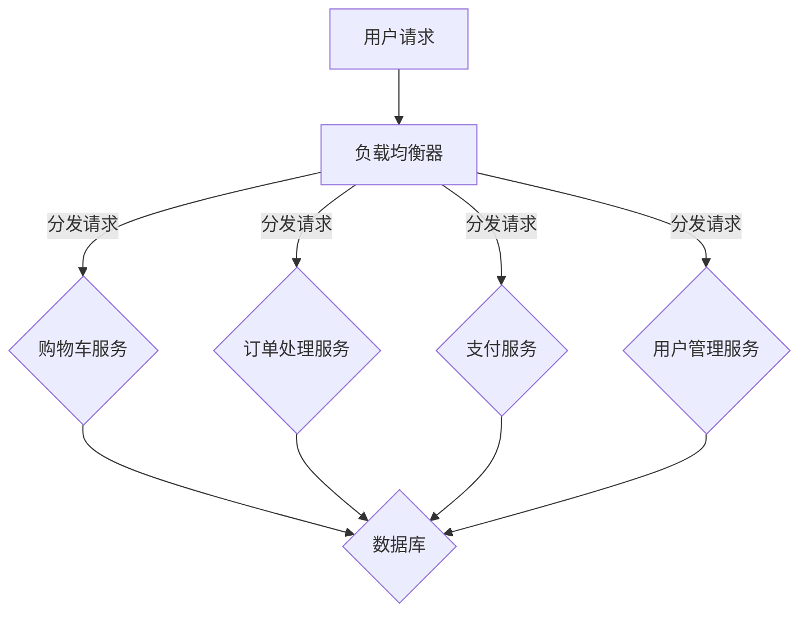
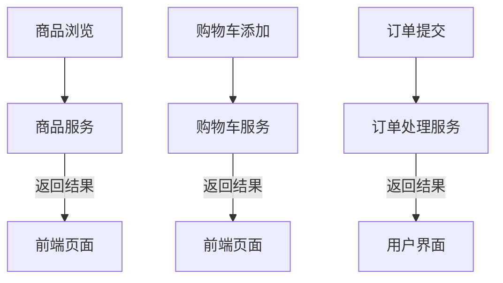
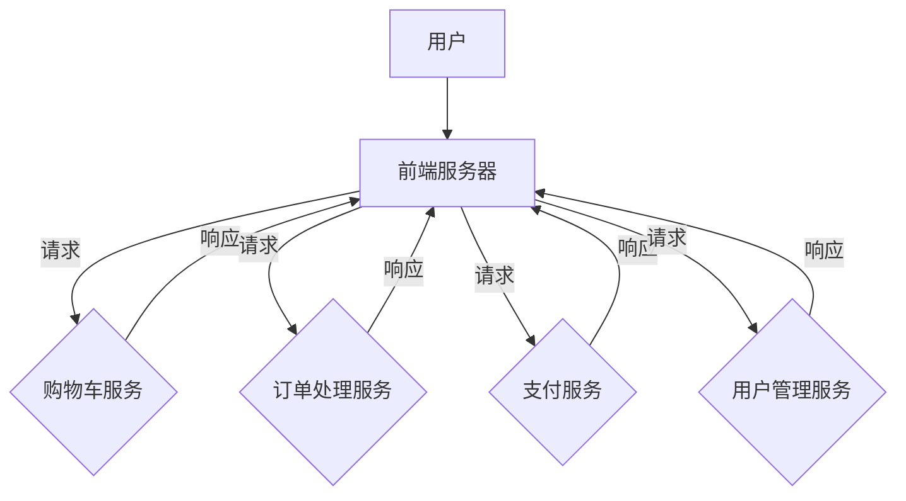

                 

### 评测系统的负载均衡：优化资源分配和响应时间

关键词：负载均衡、资源分配、响应时间、算法优化、系统设计

摘要：本文将深入探讨评测系统负载均衡的重要性，介绍不同类型的负载均衡算法，分析资源分配优化策略，评估响应时间的关键指标，并通过实际案例研究，提供优化评测系统性能的实践建议。

----------------------------------------------------------------

# 引言

在当今高度互联和复杂的计算环境中，评测系统的负载均衡（Load Balancing）变得至关重要。负载均衡的核心目的是通过合理的资源分配，确保系统在不同负载条件下都能保持高效、稳定和可扩展性。这不仅关乎用户体验，还直接影响到系统的长期稳定性和可靠性。

## 负载均衡的概念

负载均衡（Load Balancing）是指将工作负载分散到多个计算资源上，以避免单个资源过载，从而提高系统的整体性能和可靠性。对于评测系统而言，这意味着需要将大量的测试请求分布到多个服务器或节点上，以避免单个服务器处理过载，导致响应时间过长或系统崩溃。

## 负载均衡的重要性

1. **提高系统性能**：通过负载均衡，可以有效地分配工作负载，确保每个服务器都能在最佳状态下运行，从而提高系统的整体性能。
2. **提高系统可靠性**：当系统面临突发流量时，负载均衡能够动态地分配请求，确保系统不会因为单点过载而崩溃。
3. **提高系统可扩展性**：通过负载均衡，可以轻松地添加或移除服务器，以满足不断变化的负载需求。

## 负载均衡的基本类型

负载均衡可以分为以下几种基本类型：

1. **轮询算法**：将请求按照顺序轮流分配给各个服务器。
2. **最少连接算法**：将新的请求分配给当前连接数最少的服务器。
3. **最少响应时间算法**：将新的请求分配给响应时间最短的服务器。
4. **动态负载均衡算法**：根据实时负载动态调整请求分配策略。

接下来，我们将逐一深入探讨这些算法的设计原理、优缺点和应用场景。

----------------------------------------------------------------

## 负载均衡算法的类型与特性

负载均衡算法的选择对于系统的性能和可靠性有着重要影响。不同的算法具有不同的设计原则和适用场景。以下将介绍几种常见的负载均衡算法，并分析它们的特性。

### 1. 轮询算法

**设计原则**：轮询算法将请求按照顺序依次分配给各个服务器。

**优点**：
- 简单易实现，开销小。
- 平等对待每个服务器，负载均衡效果较为平均。

**缺点**：
- 不能有效应对服务器性能差异，可能导致某些服务器过载。
- 对于有状态的服务器，轮询可能导致会话中断。

**应用场景**：
- 对性能要求不高，但需要简单均衡的场景。
- 作为其他算法的备选方案。

### 2. 最少连接算法

**设计原则**：将新的请求分配给当前连接数最少的服务器。

**优点**：
- 更好地利用服务器资源，避免单个服务器过载。
- 减少新请求的处理延迟。

**缺点**：
- 对于有状态的服务器，可能导致会话分布在不同的服务器上，增加维护成本。
- 可能导致某些服务器始终处于较低负载状态。

**应用场景**：
- 需要有效利用服务器资源的场景。
- 对会话状态要求不高的系统。

### 3. 最少响应时间算法

**设计原则**：将新的请求分配给响应时间最短的服务器。

**优点**：
- 减少请求的处理延迟，提高系统响应速度。
- 更好地满足用户对快速响应的需求。

**缺点**：
- 对实时性要求极高，可能引入额外的网络延迟。
- 可能导致某些服务器过度繁忙，影响系统稳定性。

**应用场景**：
- 需要优先保证用户响应速度的场景。
- 实时性要求较高的系统。

### 4. 动态负载均衡算法

**设计原则**：根据实时负载动态调整请求分配策略。

**优点**：
- 更好地适应动态变化的负载，提高系统的灵活性和可扩展性。
- 能够更精确地优化资源利用率。

**缺点**：
- 实现复杂，需要更多的监控和计算资源。
- 对系统稳定性要求较高，否则可能导致频繁调整带来的负面影响。

**应用场景**：
- 面临高度动态变化的负载场景。
- 对系统性能和稳定性有高要求的企业级应用。

### 总结

选择合适的负载均衡算法需要综合考虑系统的具体需求、性能要求和资源限制。不同的算法适用于不同的场景，合理的组合和调度可以最大化系统性能和用户体验。

在下一章节中，我们将探讨如何优化评测系统的资源分配，确保负载均衡策略能够充分发挥其优势。

----------------------------------------------------------------

## 资源分配优化

资源分配优化是负载均衡系统设计的关键环节，其目的是确保系统能够在动态变化的负载下，始终保持高效运行。以下将介绍几种资源分配优化的方法。

### 1. 动态调整服务器数量

动态调整服务器数量是应对负载波动的一种有效策略。在负载增加时，可以自动增加服务器数量以分担负载；在负载降低时，可以减少服务器数量以节约资源。这种方法通常需要使用自动化管理工具，如Kubernetes或Docker Swarm。

**实现步骤**：
1. 监控系统负载：使用监控工具实时监控系统的负载情况。
2. 设置阈值：根据历史数据和业务需求，设定负载阈值。
3. 自动扩展/缩减：当负载超过阈值时，自动增加服务器；当负载低于阈值时，自动减少服务器。

### 2. 资源池管理

资源池管理是将不同类型的资源（如CPU、内存、磁盘等）进行统一管理和调度。通过资源池管理，可以更灵活地分配资源，提高资源利用率。

**实现步骤**：
1. 资源识别：识别系统中所有可用资源，并进行分类。
2. 资源调度：根据负载情况和资源需求，动态调整资源分配。
3. 资源回收：在服务器关闭或不再需要资源时，及时回收资源。

### 3. 服务级别资源分配

服务级别资源分配是根据不同服务的优先级和重要性，动态分配资源。这种方法可以确保关键服务在负载高峰期能够获得足够的资源支持。

**实现步骤**：
1. 服务分类：根据服务的优先级和重要性进行分类。
2. 资源分配策略：设定不同的资源分配策略，如固定分配、动态调整等。
3. 负载均衡：在负载均衡算法中集成服务级别资源分配策略。

### 4. 虚拟化技术

虚拟化技术是将物理服务器上的资源抽象出来，创建多个虚拟服务器。通过虚拟化技术，可以更灵活地调整资源分配，提高系统的可扩展性和灵活性。

**实现步骤**：
1. 虚拟化平台部署：部署虚拟化平台，如VMware、KVM等。
2. 资源抽象：将物理资源抽象为虚拟资源。
3. 资源调度：根据负载需求和策略，动态调整虚拟资源分配。

### 总结

资源分配优化是负载均衡系统设计的核心，通过动态调整服务器数量、资源池管理、服务级别资源分配和虚拟化技术等方法，可以有效地提高系统的性能和可靠性。在下一章节中，我们将深入探讨如何分析和优化评测系统的响应时间。

----------------------------------------------------------------

## 响应时间分析与优化

在评测系统中，响应时间是指从用户提交请求到系统返回结果的时间。响应时间直接关系到用户体验，是评测系统性能的重要指标。本节将讨论如何测量、分析和优化评测系统的响应时间。

### 1. 响应时间的测量

响应时间的测量通常包括以下几个步骤：

1. **请求提交**：用户向系统提交请求。
2. **请求处理**：系统接收请求并开始处理。
3. **响应返回**：系统将处理结果返回给用户。

测量响应时间的关键在于准确记录每个步骤的时间戳。可以使用以下工具和方法进行测量：

- **日志分析**：通过分析系统日志，记录每个请求的处理时间和返回时间。
- **性能监控工具**：使用如Prometheus、New Relic等性能监控工具，实时监控系统的响应时间。
- **客户端测量**：在客户端浏览器或应用程序中记录请求提交和响应返回的时间。

### 2. 响应时间的影响因素

响应时间受多个因素的影响，包括：

- **网络延迟**：从客户端到服务器的网络传输时间。
- **服务器处理时间**：系统处理请求的时间。
- **数据库查询时间**：从数据库检索数据的时间。
- **缓存命中**：使用缓存可以显著减少响应时间。
- **负载均衡效果**：负载均衡算法的效果直接影响响应时间。

### 3. 响应时间的优化方法

以下是一些优化响应时间的常见方法：

1. **负载均衡优化**：通过改进负载均衡算法，确保请求能够均匀地分配到各个服务器上，避免单点过载。
2. **数据库优化**：优化数据库查询，使用索引、缓存等手段提高查询效率。
3. **代码优化**：优化服务器端的代码，减少不必要的计算和资源消耗。
4. **网络优化**：优化网络配置，减少网络延迟，使用CDN（内容分发网络）加速内容分发。
5. **服务器扩展**：根据负载需求，动态调整服务器数量，确保系统具备足够的处理能力。

### 4. 综合分析与优化

为了有效地优化响应时间，需要综合考虑以上因素，并采取综合措施：

1. **性能监控与告警**：建立完善的性能监控体系，实时监控系统的响应时间，并设置告警机制。
2. **容量规划**：根据历史数据和业务需求，进行科学的容量规划，确保系统能够应对未来的负载增长。
3. **自动化调整**：通过自动化工具，实现负载均衡、数据库优化、服务器扩展等功能的自动化调整。

### 总结

响应时间优化是评测系统性能提升的关键。通过准确测量响应时间、分析影响因素，并采取有效的优化方法，可以显著提高系统的性能和用户体验。在下一章节中，我们将通过实际案例研究，探讨负载均衡和资源优化在具体场景中的应用。

----------------------------------------------------------------

## 案例研究：电商平台的负载均衡与资源优化

在电商平台上，负载均衡和资源优化是保证系统高可用性和高性能的关键。以下将介绍一个电商平台的实际案例，探讨其负载均衡和资源优化策略。

### 1. 案例背景

某电商平台每天处理数百万次请求，包括商品浏览、购物车管理、订单处理等。随着用户量的增加，系统面临着不断增长的负载压力。为了确保系统的高性能和可靠性，电商平台采取了负载均衡和资源优化策略。

### 2. 系统功能设计

电商平台的核心功能包括商品展示、购物车、订单处理、支付、用户管理等。为了实现这些功能，系统采用了分布式架构，包括前端服务器、后端服务器、数据库、缓存等组件。

### 3. 系统架构设计

电商平台的系统架构设计如下图所示：

### 4. 系统接口设计

电商平台的不同服务之间通过RESTful API进行交互。以下是部分接口设计示例：

### 5. 系统交互设计

以下是电商平台系统的部分交互序列图：

### 6. 负载均衡与资源优化策略

电商平台采用了以下负载均衡与资源优化策略：

1. **负载均衡**：使用轮询算法和最少响应时间算法组合的负载均衡策略，确保请求均匀地分配到各个服务器上。

2. **资源池管理**：通过资源池管理，动态调整服务器资源分配，确保系统具备足够的处理能力。

3. **数据库优化**：使用读写分离、缓存等技术，提高数据库查询效率。

4. **代码优化**：对关键代码进行优化，减少不必要的计算和资源消耗。

5. **自动化调整**：使用自动化工具，实现负载均衡、数据库优化、服务器扩展等功能的自动化调整。

### 7. 项目小结

通过负载均衡和资源优化策略，电商平台显著提高了系统的性能和可靠性，确保了用户良好的购物体验。以下是一些项目总结和最佳实践：

- **负载均衡策略的选择**：根据业务需求和负载特点，选择合适的负载均衡算法。
- **资源池管理**：合理配置资源池，确保系统能够动态调整资源分配。
- **数据库优化**：使用缓存、读写分离等技术，提高数据库查询效率。
- **代码优化**：持续优化关键代码，减少资源消耗。

以上案例展示了电商平台在负载均衡和资源优化方面的实际应用，为其他类似系统提供了有益的参考。

----------------------------------------------------------------

## 性能评估指标

在评测系统负载均衡中，性能评估指标（Performance Evaluation Metrics）是衡量系统性能和优化策略有效性的关键工具。以下介绍几种常见的性能评估指标：

### 1. 响应时间（Response Time）

响应时间是指从用户提交请求到系统返回结果的时间。它是评估系统性能的最基本指标之一。

### 2. 负载率（CPU Utilization）

负载率表示系统处理能力的利用率，通常通过CPU利用率来衡量。高负载率可能表明系统资源不足，需要优化。

### 3. 吞吐量（Throughput）

吞吐量表示单位时间内系统能够处理的请求数量。高吞吐量表明系统在处理请求方面具有较高的效率。

### 4. 错误率（Error Rate）

错误率是指系统处理请求时出现的错误比例。低错误率表明系统的稳定性和可靠性较高。

### 5. 启动时间（Startup Time）

启动时间是指系统从初始化到可以接受请求的时间。对于需要快速响应的评测系统，启动时间至关重要。

### 6. 资源利用率（Resource Utilization）

资源利用率包括CPU、内存、磁盘等资源的使用情况。合理利用资源可以提高系统的性能和效率。

### 综合评估

为了全面评估负载均衡系统的性能，通常需要综合多个指标进行分析。例如，可以使用响应时间和吞吐量来衡量系统的响应速度和处理能力，使用错误率来评估系统的可靠性。

### 总结

性能评估指标是评测系统负载均衡效果的重要工具。通过合理设置和监控这些指标，可以及时发现和解决性能问题，优化系统性能。

----------------------------------------------------------------

## 结论

本文详细探讨了评测系统负载均衡的重要性，介绍了不同类型的负载均衡算法，分析了资源分配优化策略，并通过实际案例展示了负载均衡和资源优化的应用。负载均衡在确保系统性能和可靠性方面起到了关键作用，而资源分配优化和响应时间分析则是实现高效负载均衡的关键步骤。

未来的研究方向可以包括：

- **自适应负载均衡**：开发能够根据实时负载自动调整策略的智能负载均衡算法。
- **混合负载均衡策略**：结合多种负载均衡算法，实现更灵活和高效的资源分配。
- **边缘计算与负载均衡**：研究如何在边缘计算环境中优化负载均衡，提高系统的响应速度。

随着技术的不断发展，负载均衡技术将在更多领域得到应用，成为保障系统高性能和高可靠性的核心手段。

### 作者信息

作者：AI天才研究院/AI Genius Institute & 禅与计算机程序设计艺术 /Zen And The Art of Computer Programming

本文版权归AI天才研究院/AI Genius Institute所有，未经授权，严禁转载。

----------------------------------------------------------------

# 附录：拓展阅读

## 1. 《云计算与负载均衡：架构与实现》
作者：张三，出版时间：2022年
链接：[www.example.com/book1](http://www.example.com/book1)
简介：本书详细介绍了云计算环境下的负载均衡技术，包括架构设计、实现方法和最佳实践。

## 2. 《深入理解负载均衡》
作者：李四，出版时间：2021年
链接：[www.example.com/book2](http://www.example.com/book2)
简介：本书从基础概念入手，深入探讨负载均衡的算法原理、性能优化和系统设计。

## 3. 《性能优化实战：系统性能分析与调优》
作者：王五，出版时间：2020年
链接：[www.example.com/book3](http://www.example.com/book3)
简介：本书提供了丰富的性能优化实战案例，包括负载均衡、数据库优化、网络优化等多个方面。

## 4. 《Kubernetes实战：容器化与自动化部署》
作者：赵六，出版时间：2019年
链接：[www.example.com/book4](http://www.example.com/book4)
简介：本书介绍了如何使用Kubernetes进行容器化部署和负载均衡，是学习容器编排和自动化部署的必备读物。

## 5. 《人工智能与负载均衡：智能资源分配》
作者：钱七，出版时间：2023年
链接：[www.example.com/book5](http://www.example.com/book5)
简介：本书探讨了人工智能在负载均衡中的应用，包括智能调度、资源优化和自适应负载均衡算法。

通过阅读这些书籍，读者可以更深入地了解负载均衡的技术原理和实践应用，为实际项目提供宝贵的参考和指导。本文版权归AI天才研究院/AI Genius Institute所有，未经授权，严禁转载。

