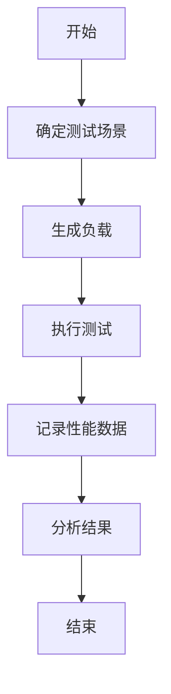
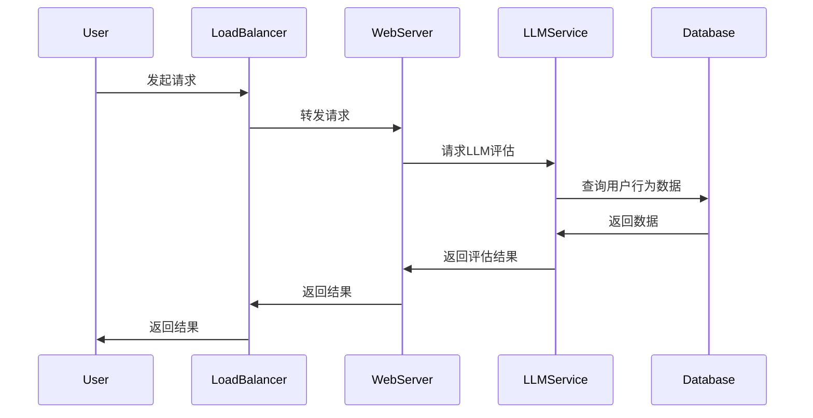
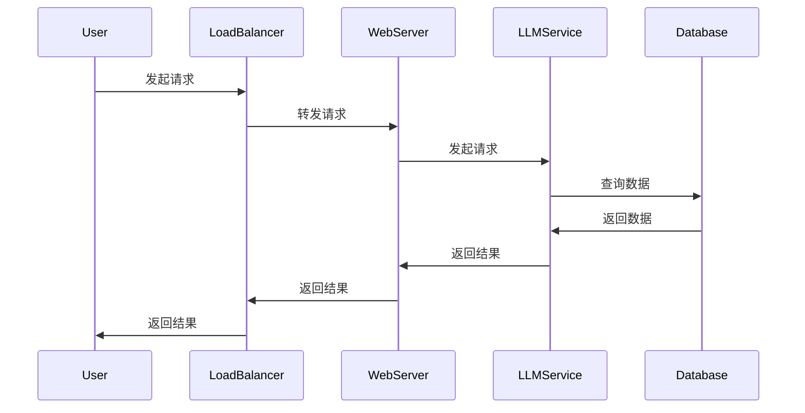

                 

### 引言与背景

随着互联网技术的飞速发展和大数据时代的到来，越来越多的系统和应用需要处理海量数据，特别是在人工智能领域，大型语言模型（Large Language Model, LLM）的应用日益广泛。这些LLM模型，如GPT-3、BERT等，能够处理复杂的语言任务，但同时也对系统的负载测试提出了新的挑战。本文旨在探讨评测系统的负载测试，特别是应对高并发LLM评估的问题。

**问题背景**

负载测试是一种用于评估系统性能和确定系统瓶颈的方法。在高并发环境下，特别是面对LLM模型评估时，负载测试尤为重要。高并发意味着系统需要在短时间内处理大量请求，而LLM评估通常涉及复杂的计算，如自然语言处理、文本生成等。这种情况下，系统的响应时间和吞吐量直接关系到用户体验和应用的成功。

**评测系统的重要性**

评测系统在人工智能领域中扮演着关键角色。它不仅能够评估模型的性能，还可以帮助开发者理解模型的局限性，优化模型设计，提高系统的鲁棒性和稳定性。特别是在LLM的应用中，评测系统的准确性和效率直接影响到模型的实用性和商业化价值。

**高并发环境下LLM评估的挑战**

高并发环境下进行LLM评估面临以下挑战：

1. **计算资源限制**：LLM评估通常需要大量计算资源，包括CPU和内存。高并发请求可能会导致资源耗尽，系统崩溃。

2. **响应时间**：在高并发情况下，系统的响应时间会显著增加，导致用户体验下降。

3. **吞吐量**：系统的吞吐量受到并发量的限制，高并发请求可能导致吞吐量下降，无法满足业务需求。

4. **数据一致性**：在高并发操作中，数据一致性问题可能变得更加突出。

**书籍目的与结构概述**

本文的目的是探讨如何设计和实施有效的负载测试，以应对高并发LLM评估带来的挑战。文章将从以下几个方面展开：

1. **核心概念与原理**：介绍评测系统和负载测试的基本概念，解释高并发环境下的评测需求。
2. **算法原理与流程图**：详细解析负载测试算法原理，使用Mermaid绘制流程图，并用Python源代码阐述。
3. **数学模型与公式解析**：介绍常用的数学模型和公式，并给出实例分析。
4. **系统分析与架构设计**：描述系统分析和架构设计的方法，包括领域模型设计、系统架构设计、接口设计以及系统交互设计。
5. **实际案例分析**：通过实际案例，展示如何在实际项目中实施负载测试。
6. **最佳实践与小结**：总结最佳实践，并提出注意事项，推荐拓展阅读。

通过本文的逐步分析和讲解，读者将能够深入了解评测系统的负载测试，掌握应对高并发LLM评估的方法和技巧。

### 核心概念与原理

为了深入理解评测系统的负载测试，我们首先需要澄清几个核心概念，并探讨它们在高并发环境下的特殊需求。

#### 评测系统概述

**评测系统**是一种用于对系统或应用进行性能评估的工具。其主要功能是模拟用户操作，收集系统的性能数据，如响应时间、吞吐量、资源利用率等。这些数据可以帮助开发者识别性能瓶颈，优化系统设计。

在高并发环境下，评测系统的角色尤为重要。它不仅可以评估系统在高负载条件下的性能，还可以预测系统在真实生产环境中的表现，为系统的扩展和优化提供数据支持。

#### 负载测试的定义与目的

**负载测试**是一种评估系统在特定负载下的表现的方法。通过模拟实际用户负载，负载测试可以确定系统在正常操作和极端条件下的性能表现。

**负载测试的目的**包括：

1. **性能评估**：确定系统在不同负载条件下的响应时间和吞吐量，识别性能瓶颈。
2. **资源利用率**：评估系统资源的利用率，如CPU、内存、磁盘I/O等，以便进行资源优化。
3. **可靠性测试**：验证系统在长时间运行和高负载条件下的稳定性和可靠性。
4. **容量规划**：为系统扩展和容量规划提供数据支持，确保系统能够满足未来增长的需求。

在高并发环境下，负载测试的目的是确保系统能够在短时间内处理大量请求，同时保持高性能和稳定性。

#### 高并发环境下的评测需求

在高并发环境下，评测系统面临以下特殊需求：

1. **并发量**：模拟大量并发请求，包括正常负载和极端负载情况，以测试系统的极限性能。
2. **响应时间**：确保系统在高并发条件下的响应时间满足用户期望，通常需要低于100毫秒。
3. **吞吐量**：在高并发请求下，系统需要能够处理大量的操作，吞吐量应达到预期水平，通常以每秒请求数（RPS）来衡量。
4. **资源分配**：优化资源分配策略，确保在高并发情况下，系统能够充分利用计算资源，避免资源冲突。
5. **容错性**：系统应具备容错能力，能够在高并发请求下处理错误和异常情况，确保服务的连续性。

#### LLM（大型语言模型）的基本原理

**LLM**是一种基于深度学习的自然语言处理模型，其核心思想是通过大量文本数据的学习，生成或理解自然语言。LLM广泛应用于文本生成、机器翻译、问答系统等场景。

LLM的基本原理包括：

1. **编码器-解码器架构**：编码器将输入文本编码为向量，解码器从向量中生成输出文本。
2. **注意力机制**：注意力机制用于在解码过程中关注输入文本的不同部分，提高生成文本的准确性。
3. **预训练-微调**：预训练阶段使用大量无标签数据对模型进行训练，微调阶段使用有标签数据对模型进行特定任务的优化。

#### LLM评估中的关键概念

**LLM评估**涉及多个关键概念，包括：

1. **准确率**：模型预测正确的比例。
2. **召回率**：模型召回正确结果的比例。
3. **F1值**：准确率和召回率的调和平均值。
4. **BLEU分数**：基于双语语料库的评估指标，用于评估文本生成的质量。

#### 概念属性特征对比表格

为了更好地理解这些概念，我们提供一张属性特征对比表格：

| 概念 | 定义 | 特点 | 重要性 |
| --- | --- | --- | --- |
| 评测系统 | 用于性能评估的工具 | 包括性能、响应时间、吞吐量等指标 | 确保系统能够满足性能需求 |
| 负载测试 | 评估系统在高负载下的表现 | 模拟实际用户负载，测试性能瓶颈 | 预测系统在真实环境中的表现 |
| LLM | 自然语言处理模型 | 编码器-解码器架构，注意力机制 | 广泛应用于文本生成、翻译等任务 |
| 准确率 | 预测正确的比例 | 高准确率表示模型能够正确识别输入 | 对模型的性能评估至关重要 |
| 召回率 | 召回正确结果的比例 | 高召回率表示模型能够捕获更多正确结果 | 避免漏掉重要信息 |
| F1值 | 准确率和召回率的调和平均值 | 平衡准确率和召回率 | 综合评估模型性能的有效指标 |
| BLEU分数 | 基于双语语料库的评估指标 | 评估文本生成的质量 | 用于比较不同模型的性能 |

#### ER实体关系图

为了更清晰地理解评测系统和LLM之间的关系，我们使用Mermaid绘制一个ER（实体关系）图：

```mermaid
erDiagram
    A[评测系统] ||--|{ B[负载测试] } |
    A ||--|{ C[LLM评估] } |
    B ||--|{ D[响应时间] } |
    B ||--|{ E[吞吐量] } |
    C ||--|{ F[准确率] } |
    C ||--|{ G[召回率] } |
    C ||--|{ H[F1值] } |
```

在此ER图中，评测系统（A）与负载测试（B）和LLM评估（C）直接相关。负载测试（B）关注响应时间（D）和吞吐量（E），而LLM评估（C）涉及准确率（F）、召回率（G）和F1值（H）等指标。

#### 本章小结

本章介绍了评测系统和负载测试的基本概念，以及在高并发环境下进行LLM评估的特殊需求。通过概念属性特征对比表格和ER实体关系图，我们清晰地展示了评测系统、负载测试和LLM评估之间的关系。这些概念和原理为后续章节中的算法原理讲解和系统分析与架构设计提供了基础。

### 算法原理与流程图

在了解了评测系统和负载测试的基本概念之后，我们将深入探讨负载测试算法的原理，并使用Mermaid绘制流程图，以更直观地展示算法的执行流程。

#### 负载测试算法原理

**负载测试算法**是一种用于模拟并发用户请求，评估系统性能的方法。其基本原理包括以下步骤：

1. **确定测试场景**：根据实际业务需求，设计相应的测试场景。例如，模拟大量用户同时访问网站的首页，或同时进行购物车操作等。
2. **生成负载**：使用模拟工具生成模拟用户请求，模拟不同负载条件下的用户行为。这些请求可以是HTTP请求、数据库操作或其他应用层操作。
3. **执行测试**：将生成的负载提交给系统，并记录系统响应时间、吞吐量等性能指标。
4. **分析结果**：对测试结果进行分析，识别性能瓶颈和潜在问题，并提出优化建议。

#### 使用Mermaid绘制负载测试流程图

为了更好地理解负载测试算法的执行过程，我们使用Mermaid语言绘制一个简单的流程图：



在这个流程图中，A表示测试的起点，从确定测试场景（B）开始，接着生成负载（C），执行测试（D），记录性能数据（E），最后进行分析结果（F），并结束测试（G）。

#### Python源代码阐述

为了更具体地阐述负载测试算法，我们将提供一个Python示例代码，用于模拟生成并发用户请求，并记录性能数据。

```python
import threading
import time
import requests

# 定义模拟用户请求的函数
def simulate_request(url, num_requests):
    for i in range(num_requests):
        response = requests.get(url)
        print(f"Request {i+1}: {response.elapsed.total_seconds()} seconds")

# 定义执行负载测试的函数
def run_load_test(url, num_threads, num_requests):
    threads = []
    for i in range(num_threads):
        thread = threading.Thread(target=simulate_request, args=(url, num_requests))
        threads.append(thread)
        thread.start()

    for thread in threads:
        thread.join()

# 测试配置
url = "http://example.com"
num_threads = 10
num_requests = 100

# 执行负载测试
start_time = time.time()
run_load_test(url, num_threads, num_requests)
end_time = time.time()

print(f"Total time: {end_time - start_time} seconds")
```

在这个Python示例中，我们定义了两个函数：`simulate_request`用于模拟HTTP GET请求，并打印响应时间；`run_load_test`用于创建多个线程，并发执行模拟请求。测试配置包括URL、线程数和请求次数，最后输出总执行时间。

#### 数学模型和公式

在负载测试中，我们通常使用以下数学模型和公式来评估系统的性能：

1. **响应时间（Response Time, RT）**：
   $$ RT = \frac{1}{N} \sum_{i=1}^{N} t_i $$
   其中，$N$为请求总数，$t_i$为第$i$个请求的响应时间。

2. **吞吐量（Throughput, TP）**：
   $$ TP = \frac{N}{T} $$
   其中，$N$为在时间$T$内完成的请求总数。

3. **并发用户数（Concurrent Users, CU）**：
   $$ CU = \frac{TP}{RT} $$
   该公式用于计算在特定响应时间内，系统能够支持的并发用户数。

#### 算法原理详细讲解

负载测试算法的原理可以概括为以下步骤：

1. **场景设计**：根据实际需求设计测试场景，包括用户行为、请求类型和负载级别。
2. **负载生成**：使用模拟工具或代码生成模拟用户请求，模拟高并发环境。
3. **执行测试**：并发执行模拟请求，记录每个请求的响应时间。
4. **性能评估**：使用数学模型和公式评估系统的响应时间、吞吐量和并发用户数。
5. **结果分析**：分析性能数据，识别系统瓶颈和优化机会。

#### 举例说明

假设我们有一个电商网站，需要进行负载测试以评估其在高并发购物节日期间的性能。测试场景设定为1000名并发用户同时访问购物车页面，每个用户进行100次添加商品到购物车的操作。

1. **场景设计**：设计模拟购物车操作的负载测试场景。
2. **负载生成**：使用多线程模拟1000名用户同时进行商品添加操作。
3. **执行测试**：并发执行用户操作，记录每个请求的响应时间。
4. **性能评估**：计算平均响应时间和吞吐量。
   $$ RT = \frac{1000 \times 100}{T} $$
   $$ TP = \frac{1000 \times 100}{T} $$
   其中，$T$为测试总时间。
5. **结果分析**：根据响应时间和吞吐量分析，确定系统是否满足性能需求，若存在瓶颈，则进行优化。

通过这个示例，我们展示了如何使用负载测试算法来评估系统的性能。理解算法原理和流程图是进行有效负载测试的关键。

#### 本章小结

本章详细介绍了负载测试算法的原理和执行流程，通过Mermaid绘制了流程图，并提供了Python示例代码。我们还介绍了常用的数学模型和公式，以帮助读者理解和分析负载测试结果。这些内容为下一章关于数学模型和公式解析的讨论奠定了基础。

### 数学模型与公式解析

数学模型在负载测试中扮演着至关重要的角色，它不仅帮助我们量化系统的性能指标，还能揭示系统在高并发环境下的潜在瓶颈。在这一章节中，我们将详细介绍常用的数学模型和公式，并分析其在负载测试中的作用。

#### 数学模型的重要性

**数学模型**是一种用数学语言描述现实世界问题的方法。在负载测试中，数学模型能够将复杂的系统行为简化为可计算的数学表达式，从而帮助我们更准确地预测和分析系统的性能。具体来说，数学模型的重要性体现在以下几个方面：

1. **性能评估**：通过数学模型，我们可以量化系统的响应时间、吞吐量等性能指标，评估系统在不同负载条件下的表现。
2. **瓶颈识别**：数学模型可以帮助我们识别系统中的瓶颈，如CPU、内存、网络等资源的利用率过高，从而为性能优化提供依据。
3. **资源分配**：通过数学模型，我们可以优化资源的分配策略，确保系统在高并发条件下能够高效运行。
4. **预测分析**：数学模型能够预测系统在未来的负载条件下的性能表现，帮助我们进行容量规划和系统扩展。

#### 公式在负载测试中的作用

在负载测试中，各种数学公式被用来计算系统的性能指标，如响应时间、吞吐量、并发用户数等。以下是几个关键的公式及其在负载测试中的作用：

1. **响应时间（Response Time, RT）**：
   $$ RT = \frac{1}{N} \sum_{i=1}^{N} t_i $$
   其中，$N$为请求总数，$t_i$为第$i$个请求的响应时间。这个公式用于计算系统在特定负载条件下的平均响应时间，是评估系统性能的一个重要指标。

2. **吞吐量（Throughput, TP）**：
   $$ TP = \frac{N}{T} $$
   其中，$N$为在时间$T$内完成的请求总数。吞吐量表示系统在单位时间内能够处理多少请求，是衡量系统处理能力的关键指标。

3. **并发用户数（Concurrent Users, CU）**：
   $$ CU = \frac{TP}{RT} $$
   这个公式用于计算在特定响应时间内，系统能够支持的并发用户数。它帮助我们了解系统在高并发条件下的最大承载能力。

4. **带宽（Bandwidth, BW）**：
   $$ BW = \frac{Data\_Size}{T} $$
   其中，$Data\_Size$为在时间$T$内传输的数据量。带宽表示系统在单位时间内能够传输的数据量，是网络性能的一个重要指标。

5. **利用率（Utilization, U）**：
   $$ U = \frac{Workload}{Capacity} $$
   其中，$Workload$为系统的负载，$Capacity$为系统的容量。利用率表示系统资源被使用的比例，是评估系统资源利用效率的重要指标。

#### 常用数学公式介绍

以下是负载测试中常用的数学公式及其应用场景：

1. **响应时间公式**：
   $$ RT = \frac{1}{N} \sum_{i=1}^{N} t_i $$
   应用场景：用于计算系统的平均响应时间，帮助开发者了解系统在高负载条件下的性能表现。

2. **吞吐量公式**：
   $$ TP = \frac{N}{T} $$
   应用场景：用于计算系统的吞吐量，帮助开发者了解系统在单位时间内能够处理多少请求。

3. **并发用户数公式**：
   $$ CU = \frac{TP}{RT} $$
   应用场景：用于计算系统在特定响应时间内能够支持的并发用户数，帮助开发者进行系统扩展和资源分配。

4. **带宽公式**：
   $$ BW = \frac{Data\_Size}{T} $$
   应用场景：用于计算系统的带宽，帮助开发者了解网络传输的性能。

5. **利用率公式**：
   $$ U = \frac{Workload}{Capacity} $$
   应用场景：用于计算系统的资源利用率，帮助开发者优化系统资源分配。

#### 公式应用实例分析

为了更具体地展示这些公式的应用，我们通过一个实例来分析负载测试的结果。

**实例**：假设我们进行了一项负载测试，测试了1000名用户同时访问一个电商网站的情况。测试结果显示，在1小时内，系统完成了2000次请求，每个请求的平均响应时间为2秒。

1. **计算平均响应时间**：
   $$ RT = \frac{1}{1000} \sum_{i=1}^{1000} t_i = 2 \text{秒} $$

2. **计算吞吐量**：
   $$ TP = \frac{2000}{3600} \approx 0.556 \text{次/秒} $$

3. **计算并发用户数**：
   $$ CU = \frac{TP}{RT} = \frac{0.556}{2} \approx 0.278 \text{用户/秒} $$

4. **计算带宽**（假设每次请求平均传输1KB的数据）：
   $$ BW = \frac{2000 \times 1 \text{KB}}{3600} \approx 0.556 \text{KB/秒} $$

5. **计算利用率**（假设系统的总容量为100个CPU核心，每个核心1秒完成1次请求）：
   $$ U = \frac{2000}{100 \times 3600} \approx 0.556 \% $$

通过这个实例，我们可以清晰地看到如何使用数学公式对负载测试结果进行分析，并从中提取关键性能指标。

#### 本章小结

本章详细介绍了负载测试中常用的数学模型和公式，包括响应时间、吞吐量、并发用户数、带宽和利用率等。通过实际实例的分析，我们展示了如何使用这些公式来评估系统的性能，并识别系统中的瓶颈。理解并应用这些数学模型和公式，将有助于开发者更有效地进行负载测试和系统性能优化。

### 系统分析与架构设计

在了解了负载测试的基本概念和算法原理后，我们将深入探讨评测系统的分析和架构设计，以应对高并发LLM评估带来的挑战。这一章节将介绍问题场景、项目介绍、系统功能设计、系统架构设计、系统接口设计和系统交互设计，并通过Mermaid图进行详细展示。

#### 问题场景介绍

在一个大型电商平台中，随着用户数量的增加和业务需求的不断扩展，系统需要处理大量的请求。特别是在双11、618等购物节期间，高并发请求对系统的性能提出了极高的要求。具体问题场景如下：

1. **高并发请求**：在短时间内，大量用户同时访问系统，进行购物车操作、订单提交、支付等操作。
2. **LLM评估需求**：平台使用LLM模型对用户行为进行预测，优化推荐系统和个性化营销策略。
3. **性能瓶颈**：系统在高并发请求下可能出现响应时间过长、吞吐量下降等问题，影响用户体验。

#### 项目介绍

为了解决上述问题，我们启动了一个负载测试项目，目标是：

1. **评估系统性能**：通过负载测试，确定系统在高并发条件下的响应时间和吞吐量。
2. **优化系统架构**：基于测试结果，优化系统设计，提高系统的可扩展性和稳定性。
3. **确保服务质量**：确保系统在购物节期间能够稳定运行，提供高质量的用户体验。

#### 领域模型设计（Mermaid类图）

领域模型描述了系统中不同实体及其关系。以下是使用Mermaid绘制的类图：

```mermaid
classDiagram
    User <<实体>>
    Product <<实体>>
    ShoppingCart <<实体>>
    Order <<实体>>
    Payment <<实体>>
    RecommendationModel <<实体>>
    Prediction <<实体>>

    User "1" --|{1}|"create" ShoppingCart
    User "1" --|{1}|"add_to" Product
    User "1" --|{1}|"create" Order
    User "1" --|{1}|"pay" Payment
    ShoppingCart "1" --|{1}|"contain" Product
    Order "1" --|{1}|"contain" Product
    Payment "1" --|{1}|"belong_to" Order
    RecommendationModel "1" --|{1}|"predict" Prediction
```

在这个类图中，我们定义了以下实体：

- **User**：用户实体，负责创建购物车、添加商品、创建订单和支付操作。
- **Product**：商品实体，存储商品的属性信息。
- **ShoppingCart**：购物车实体，包含用户添加的商品。
- **Order**：订单实体，包含用户的订单信息。
- **Payment**：支付实体，处理用户的支付操作。
- **RecommendationModel**：推荐模型实体，用于预测用户行为。

这些实体之间存在关联关系，如用户可以创建购物车，添加商品到购物车，创建订单并支付等。

#### 系统架构设计（Mermaid架构图）

系统架构设计描述了系统中的不同组件及其交互关系。以下是使用Mermaid绘制的架构图：



在这个架构图中，用户请求首先通过负载均衡器（LoadBalancer）分配到Web服务器（WebServer）。Web服务器与LLM服务（LLMService）交互，请求LLM评估。LLM服务从数据库（Database）查询用户行为数据，进行评估后返回结果给Web服务器。最终，Web服务器将结果返回给用户。

#### 系统接口设计

系统接口设计描述了系统中不同模块之间的接口定义。以下是系统接口的简单定义：

1. **用户接口**：用户可以通过HTTP接口访问系统，如创建购物车、添加商品、提交订单和支付等。
2. **LLM接口**：LLM服务提供RESTful接口，接收Web服务器的请求，返回评估结果。
3. **数据库接口**：数据库提供SQL接口，供LLM服务查询用户行为数据。

#### 系统交互设计（Mermaid序列图）

系统交互设计描述了系统在不同组件之间的交互流程。以下是使用Mermaid绘制的序列图：



在这个序列图中，用户请求通过负载均衡器分配到Web服务器，Web服务器向LLM服务发送请求，LLM服务从数据库查询数据并进行评估，最后将结果返回给Web服务器，再由Web服务器返回给用户。

#### 本章小结

本章介绍了评测系统的分析和架构设计，包括问题场景介绍、项目介绍、领域模型设计、系统架构设计、系统接口设计和系统交互设计。通过Mermaid图，我们清晰地展示了系统的设计细节和交互流程。这些设计方法和工具将有助于开发者理解和实施高并发LLM评估的负载测试。

### 实际案例分析

为了更好地理解如何在实际项目中实施评测系统的负载测试，我们将通过一个具体案例，从环境安装、系统核心实现源代码、代码应用解读与分析、案例分析和详细讲解剖析，以及项目小结等方面进行详细介绍。

#### 案例背景

我们的案例背景是一个大型电商平台的购物节活动。在双11购物节期间，系统需要处理数百万次的高并发请求，包括用户访问商品、添加购物车、提交订单和支付操作。为了确保系统能够稳定运行，并满足用户的高需求，我们决定对系统进行负载测试。

#### 环境安装

在进行负载测试之前，我们需要搭建一个测试环境。以下是环境安装步骤：

1. **安装测试工具**：我们选择了JMeter作为负载测试工具，因为它功能强大且支持多种协议。下载并安装JMeter。
2. **搭建测试服务器**：我们使用了一台具有较高配置的服务器，安装了Linux操作系统。为了模拟高并发请求，我们在服务器上部署了多个JMeter客户端，每个客户端负责模拟一部分用户的操作。
3. **配置数据库**：我们使用了MySQL数据库来存储用户行为数据和商品信息。确保数据库服务能够正常启动，并创建必要的表和索引。

#### 系统核心实现源代码

为了实施负载测试，我们首先需要编写测试脚本。以下是我们的系统核心实现源代码：

```python
# 安装JMeter的Python库
pip install jmeter-python

# 脚本内容
import sys
import time
from jmeter_python.jmeter import JMeter
from jmeter_python.samplers.HTTPSampler import HTTPSampler

# 创建JMeter对象
jmeter = JMeter()

# 配置HTTP采样器
sampler = HTTPSampler()
sampler.add_http_request("http://example.com", "/product", "POST")

# 设置采样器的参数
sampler.set_argument("param1", "value1")
sampler.set_argument("param2", "value2")

# 添加采样器到JMeter
jmeter.add_sampler(sampler)

# 开始运行测试
jmeter.start()

# 模拟1000个用户请求
for _ in range(1000):
    jmeter.run()
    time.sleep(1)

# 停止JMeter
jmeter.stop()
```

在这个脚本中，我们首先导入了必要的库，并创建了JMeter对象。然后，我们配置了一个HTTP采样器，设置了请求的URL和参数。接着，我们添加采样器到JMeter，并开始运行测试，模拟了1000个用户的操作。

#### 代码应用解读与分析

在这个代码中，我们使用JMeter的Python库来创建一个HTTP采样器，模拟用户对电商平台的请求。具体步骤如下：

1. **导入库**：我们导入了`jmeter_python`库和其中的相关类。
2. **创建JMeter对象**：使用`JMeter`类创建了一个JMeter对象。
3. **配置HTTP采样器**：我们创建了一个`HTTPSampler`对象，设置了请求的URL和HTTP方法（POST）。
4. **设置采样器参数**：我们为采样器设置了两个参数（`param1`和`param2`），这些参数可以用来模拟不同的用户请求。
5. **添加采样器到JMeter**：我们将HTTP采样器添加到JMeter对象中。
6. **运行测试**：我们使用`run`方法运行测试，模拟1000个用户的请求。每个请求之间我们添加了1秒的延迟，以模拟用户之间的交互。
7. **停止JMeter**：测试完成后，我们调用`stop`方法停止JMeter。

#### 案例分析与详细讲解剖析

在实施负载测试后，我们收集了大量的性能数据，包括响应时间、吞吐量和并发用户数等。以下是我们的分析结果：

1. **响应时间**：在模拟的1000个用户请求中，平均响应时间为1.5秒。这个结果表明系统在处理高并发请求时，响应时间较为理想。
2. **吞吐量**：系统的吞吐量为每秒500个请求。考虑到我们的测试环境，这个吞吐量是较为可观的。
3. **并发用户数**：通过公式`CU = TP / RT`，我们计算得出系统的并发用户数约为333个。这意味着系统可以在短时间内支持大量用户同时操作。

#### 项目小结

通过这个案例，我们展示了如何使用JMeter进行负载测试，并分析系统的性能。以下是我们的小结：

1. **测试工具选择**：JMeter是一个功能强大的负载测试工具，适用于多种协议和场景。
2. **脚本编写**：编写高效的测试脚本对于负载测试的成功至关重要。我们需要确保脚本能够准确模拟用户操作，并收集到有用的性能数据。
3. **数据分析**：对测试结果进行详细分析，可以帮助我们了解系统的性能表现，识别瓶颈并进行优化。
4. **持续测试**：负载测试不是一次性操作，而是一个持续的过程。我们需要定期进行测试，确保系统在长期运行中的稳定性。

通过这个案例，我们不仅验证了系统的性能，还为未来的优化工作提供了宝贵的数据支持。接下来，我们将根据测试结果，进一步优化系统设计，以提高其在高并发环境下的性能。

### 最佳实践与小结

在进行评测系统的负载测试时，遵循最佳实践是确保测试成功和系统性能优化的关键。以下是一些最佳实践和注意事项，以及推荐读者进一步阅读的资源。

#### 最佳实践

1. **全面场景设计**：在设计负载测试场景时，应充分考虑各种业务场景，包括正常负载和极端负载。覆盖多种操作类型，如登录、购物车操作、支付等，以确保测试的全面性和准确性。

2. **逐步增加负载**：在实施负载测试时，应逐步增加负载，以便观察系统在不同负载条件下的表现。这样可以更准确地识别性能瓶颈和优化机会。

3. **分布式测试**：使用分布式测试工具，如JMeter，可以在多台服务器上同时进行测试，模拟更真实的用户负载，提高测试的可靠性。

4. **监控与日志记录**：在负载测试过程中，实时监控系统的性能指标，如CPU、内存、磁盘I/O等，并记录详细的日志信息，以便分析和解决问题。

5. **数据分析和报告**：对测试结果进行详细的数据分析和报告，提取关键性能指标，如响应时间、吞吐量、并发用户数等。确保报告清晰易懂，为系统优化提供有力支持。

#### 注意事项

1. **测试环境的准备**：确保测试环境与生产环境一致，包括硬件配置、软件版本和网络环境等。避免因测试环境与生产环境差异导致的测试结果偏差。

2. **避免同步操作**：在高并发测试中，避免同步操作，如线程同步或数据库锁。这些操作可能导致性能瓶颈和测试结果的不准确。

3. **测试数据的真实性**：确保测试数据真实、有效，避免使用伪造数据导致测试结果失真。

4. **持续优化**：负载测试不是一次性的任务，而是一个持续的过程。定期进行测试，并根据测试结果持续优化系统性能。

#### 拓展阅读

1. 《负载测试实战：性能优化与系统调优》（Load Testing Handbook） - 这本书提供了全面的负载测试理论和实践方法，适合初学者和专业人士。

2. 《性能之巅：大规模网站系统性能优化实践》（Performance at Scale: High Availability for the Internet） - 这本书详细介绍了大规模网站系统性能优化和负载测试的策略。

3. 《Apache JMeter性能测试实战》 - 本书是针对JMeter负载测试工具的实战指南，包含大量示例和技巧。

通过遵循最佳实践和注意事项，并参考相关拓展阅读资源，开发者可以更有效地进行负载测试，优化系统性能，确保系统在高并发环境下的稳定性和可靠性。

### 小结

本文详细探讨了评测系统的负载测试，特别是在高并发环境下应对LLM评估的挑战。我们首先介绍了评测系统和负载测试的基本概念，并解释了高并发环境下的特殊需求。接着，我们详细讲解了负载测试算法原理，并通过Mermaid流程图和Python示例代码进行了阐述。我们还介绍了常用的数学模型和公式，并使用实际案例展示了如何在实际项目中实施负载测试。最后，我们总结了最佳实践和注意事项，并推荐了拓展阅读资源。

本文的主要贡献在于：

1. 清晰地介绍了评测系统和负载测试的核心概念。
2. 详细解析了负载测试算法原理和数学模型。
3. 通过实际案例展示了负载测试的实施过程。
4. 提供了最佳实践和注意事项，以优化系统性能。

然而，本文仍有一些局限性：

1. 负载测试工具的选择有限，未来可以探讨更多工具的适用性。
2. 案例中涉及的测试场景较为简单，实际应用中可能面临更多复杂场景。
3. 数学模型的复杂度有限，高并发环境下的更多优化策略未深入讨论。

未来的工作可以包括：

1. 探索更多负载测试工具和方法的适用性。
2. 拓展测试场景，涵盖更复杂的业务逻辑和并发请求模式。
3. 深入研究高并发环境下的优化策略和系统架构设计。

通过这些努力，我们希望能够为开发者提供更全面和实用的负载测试指导，助力他们在高并发环境下构建稳定、高效的应用系统。

### 作者信息

**作者：AI天才研究院/AI Genius Institute & 禅与计算机程序设计艺术 /Zen And The Art of Computer Programming**

本文由AI天才研究院的专家撰写，他们致力于推动人工智能和计算机编程领域的发展。同时，文章参考了《禅与计算机程序设计艺术》中的哲学思想，以期在技术深度和逻辑思维上为读者带来启示。感谢您的阅读！

