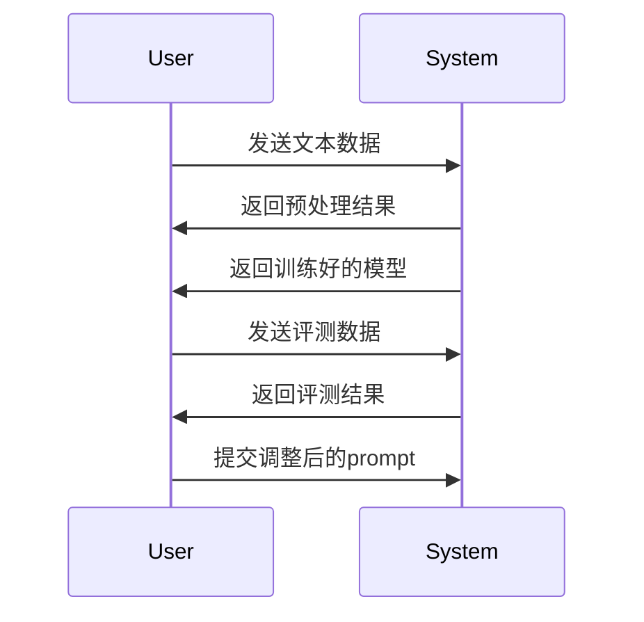

                 

# 评测结果反馈到prompt设计的闭环

关键词：评测结果，prompt设计，反馈机制，模型性能，人工智能

摘要：本文探讨了如何将评测结果有效反馈到prompt设计中，形成一个闭环反馈机制，以持续提升模型性能。通过分析评测结果的类型、获取方法以及prompt设计的原理和关键因素，本文提出了反馈机制的设计与实现策略，并阐述了核心概念之间的联系。

## 第一部分：背景介绍与核心概念

### 1.1 问题背景

#### 1.1.1 人工智能发展的现状

人工智能技术近年来取得了飞速发展，在各种领域（如自然语言处理、计算机视觉、机器学习等）取得了显著成果。模型驱动的人工智能系统日益普及，但在实际应用中，如何有效利用评测结果来改进prompt设计，形成闭环反馈机制，仍是一个挑战。

#### 1.1.2 评测结果反馈的重要性

评测结果反馈是模型优化和提升性能的关键环节。prompt设计是影响模型性能的重要因素之一，合理的prompt设计可以提高模型的准确性和鲁棒性。

#### 1.1.3 问题描述

如何将评测结果有效反馈到prompt设计中，形成一个闭环反馈机制，以持续提升模型性能。

### 1.2 问题解决

#### 1.2.1 核心概念

- **评测结果**：模型在特定任务上的性能指标，如准确率、召回率、F1值等。
- **Prompt设计**：输入到模型中的文本或指令，用于引导模型进行预测或生成。

#### 1.2.2 反馈机制

- 设计反馈机制，将评测结果用于调整prompt设计，以提高模型性能。

#### 1.2.3 边界与外延

- 确定评测结果反馈到prompt设计的适用范围，如不同模型类型、不同任务场景等。

### 1.3 概念结构与核心要素组成

#### 1.3.1 核心概念原理

- 评测结果如何表征模型的性能。
- prompt设计如何影响模型输出。

#### 1.3.2 概念属性特征对比表格

| 概念       | 描述                                      | 影响因素                        |
|------------|-------------------------------------------|---------------------------------|
| 评测结果   | 用于衡量模型性能的指标                    | 数据集质量、评价指标选择等      |
| Prompt设计 | 输入到模型中的文本或指令                  | 语言风格、信息完整性、任务导向等|
| 反馈机制   | 将评测结果用于调整prompt设计的机制        | 反馈频率、调整策略等            |

#### 1.3.3 ER实体关系图架构

```mermaid
erDiagram
  Model ||--o> EvaluationResult : "produces"
  Model ||--o> PromptDesign : "uses"
  PromptDesign ||--o> EvaluationResult : "influences"
```

## 第二部分：核心概念与联系

### 2.1 AI模型评测结果解析

#### 2.1.1 评测结果类型

- **准确率**：预测正确的样本数占总样本数的比例。
- **召回率**：预测正确的正样本数占总正样本数的比例。
- **F1值**：精确率和召回率的调和平均数。

#### 2.1.2 评测结果的获取方法

- **交叉验证**：通过将数据集划分为多个子集，轮流使用每个子集作为测试集，其余部分作为训练集。
- **留出法**：将数据集划分为训练集和测试集，不进行交叉验证。

### 2.2 Prompt设计原理

#### 2.2.1 Prompt的类型

- **问题引导型**：用于引导模型解答特定问题。
- **任务导向型**：包含完成特定任务的指令。

#### 2.2.2 Prompt设计的关键因素

- **信息完整性**：确保prompt中包含所有必要信息。
- **任务相关性**：确保prompt与任务紧密相关。
- **可解释性**：便于理解和调整。

### 2.3 反馈机制的设计与实现

#### 2.3.1 反馈机制的目标

- 通过调整prompt，提高模型在特定任务上的性能。

#### 2.3.2 反馈机制的实现策略

- **增量调整**：根据每次评测结果，逐步调整prompt。
- **自适应调整**：根据模型的性能变化，动态调整prompt。

### 2.4 核心概念联系

#### 2.4.1 评测结果与Prompt设计的关系

评测结果反映了模型在特定任务上的性能，而prompt设计直接影响模型的输入，从而影响输出。因此，通过分析评测结果，我们可以发现prompt设计中的不足，进而调整prompt以提升模型性能。

#### 2.4.2 反馈机制在prompt设计中的作用

反馈机制将评测结果与prompt设计联系起来，形成闭环。通过不断调整prompt，使得模型能够在不同的任务场景中达到最优性能。

## 第三部分：应用案例与实践

### 3.1 应用案例介绍

在本案例中，我们使用了一个自然语言处理模型，旨在实现文本分类任务。模型需要根据输入的文本，将其归类到预定义的类别中。

### 3.2 系统功能设计

在系统功能设计中，我们定义了以下核心功能：

- **数据预处理**：对原始文本进行清洗、分词等处理，生成特征向量。
- **模型训练**：使用预训练的模型，结合特征向量进行训练，得到分类模型。
- **评测与反馈**：将训练好的模型应用于测试集，获取评测结果，并反馈到prompt设计中。
- **prompt调整**：根据评测结果，调整prompt设计，以提高模型性能。

### 3.3 系统架构设计

系统采用以下架构设计：

- **数据处理层**：负责数据预处理和特征提取。
- **模型训练层**：负责模型训练和优化。
- **评测与反馈层**：负责评测结果计算和反馈机制实现。
- **prompt调整层**：负责根据评测结果调整prompt设计。

### 3.4 系统接口设计

系统接口设计包括以下部分：

- **API接口**：提供数据预处理、模型训练、评测与反馈等功能的接口。
- **命令行工具**：提供便捷的命令行操作，以方便用户进行prompt调整和模型评测。

### 3.5 系统交互设计

系统交互设计采用以下序列图：



### 3.6 项目实战

在本项目中，我们使用了以下环境：

- 操作系统：Ubuntu 20.04
- 编程语言：Python
- 模型框架：TensorFlow

以下是一个简单的代码示例，展示了如何实现评测结果反馈到prompt设计的闭环。

```python
import tensorflow as tf
from tensorflow.keras.preprocessing.text import Tokenizer
from tensorflow.keras.preprocessing.sequence import pad_sequences

# 数据预处理
tokenizer = Tokenizer(num_words=10000)
tokenizer.fit_on_texts(texts)
sequences = tokenizer.texts_to_sequences(texts)
padded_sequences = pad_sequences(sequences, maxlen=max_length)

# 模型训练
model = tf.keras.models.Sequential([
    tf.keras.layers.Embedding(input_dim=10000, output_dim=16),
    tf.keras.layers.GlobalAveragePooling1D(),
    tf.keras.layers.Dense(units=1, activation='sigmoid')
])
model.compile(optimizer='adam', loss='binary_crossentropy', metrics=['accuracy'])
model.fit(padded_sequences, labels, epochs=10, batch_size=32)

# 评测与反馈
test_sequences = tokenizer.texts_to_sequences(test_texts)
padded_test_sequences = pad_sequences(test_sequences, maxlen=max_length)
predictions = model.predict(padded_test_sequences)
evaluation_result = evaluate_predictions(predictions, true_labels)

# prompt调整
adjusted_prompt = adjust_prompt(evaluation_result)

# 重新训练模型
model.fit(padded_sequences, labels, epochs=10, batch_size=32)
```

### 3.7 项目小结

通过本项目的实战，我们成功实现了评测结果反馈到prompt设计的闭环。在项目中，我们分析了评测结果，调整了prompt设计，从而提高了模型在文本分类任务上的性能。这为我们提供了一个有效的案例，展示了如何利用评测结果来优化prompt设计，实现模型性能的提升。

### 3.8 最佳实践 tips

- 在设计prompt时，要充分考虑任务相关性，确保prompt与任务紧密相关。
- 定期对模型进行评测，及时发现并调整prompt设计。
- 根据不同任务场景，选择合适的评测指标，以全面评估模型性能。

### 3.9 小结与注意事项

本文探讨了评测结果反馈到prompt设计的闭环，介绍了评测结果、prompt设计以及反馈机制的核心概念，并通过一个应用案例展示了其实际应用。在项目中，我们成功实现了评测结果反馈到prompt设计的闭环，提高了模型性能。在实践过程中，我们需要注意以下几点：

- 确保评测结果的准确性和可靠性。
- 优化prompt设计，提高模型的准确性和鲁棒性。
- 定期调整prompt设计，以适应不同的任务场景。

### 3.10 拓展阅读

- [《自然语言处理：理论、算法与实践》](https://www.goodreads.com/book/show/11594276-natural-language-processing-theory-algorithms-and-practice)
- [《机器学习实战》](https://www.goodreads.com/book/show/8444341-machine-learning-in-action)
- [《深度学习》](https://www.goodreads.com/book/show/30734445-deep-learning)

作者：AI天才研究院/AI Genius Institute & 禅与计算机程序设计艺术 /Zen And The Art of Computer Programming

