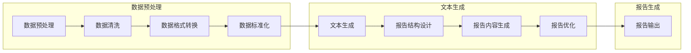
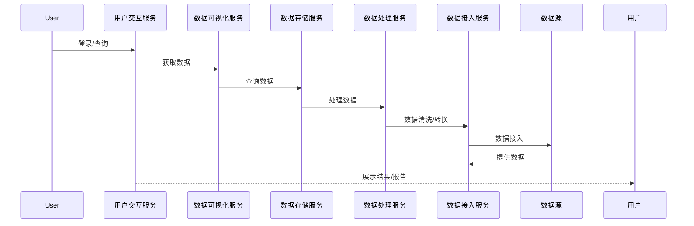

                 

### 1.1 问题背景

评测结果可视化作为数据分析的重要一环，旨在将复杂的评测数据转化为易于理解的图形化报告。在当今信息爆炸的时代，海量数据带来的挑战之一是如何高效地分析和展示这些数据。传统方法如表格、柱状图、饼图等虽然能够展示数据的基本信息，但在呈现复杂关联关系和趋势变化时存在一定的局限性。此外，对于非专业人士，这些图表可能难以直观地理解和解释数据背后的含义。

随着人工智能技术的快速发展，尤其是大型语言模型（Large Language Model，LLM）的出现，为评测结果可视化提供了一种全新的思路。LLM，如GPT-3、BERT等，通过训练从大量文本数据中学习，具备了强大的文本生成和语义理解能力。利用这一特性，我们可以让LLM自动生成直观、易于理解的评测报告，从而大幅提升数据分析的效率和可解释性。

在评测结果可视化领域，LLM的应用潜力主要体现为以下几个方面：

1. **自动生成报告**：传统方法通常需要人工设计报告模板和图表，而LLM可以自动从数据中提取关键信息，并生成结构化的报告内容。
2. **个性化报告**：LLM能够根据用户的需求和偏好，定制化生成报告，提供个性化的数据分析结果。
3. **高可读性**：通过自然语言生成，LLM生成的报告更易于被非专业人士理解，提升了报告的可读性和普及性。
4. **实时更新**：LLM能够实时处理和分析新数据，生成最新的评测报告，为决策者提供及时的参考。

然而，LLM在评测结果可视化中也面临诸多挑战。首先，数据质量和格式问题可能影响LLM的生成效果；其次，如何保证生成的报告既准确又具有可解释性是另一个重要问题。此外，LLM模型的训练和部署需要大量的计算资源和时间成本。

总体而言，评测结果可视化领域的发展需要充分利用LLM的优势，同时也需要克服其在应用过程中面临的各种挑战。接下来，我们将进一步探讨LLM生成直观报告的具体机制和应用策略。

### 1.2 问题描述

在评测结果可视化领域，传统的数据处理和展示方法存在一定的局限性。首先，以表格形式展示数据虽然能够详细列出各项数据，但其冗长繁琐，不易于快速捕捉关键信息。其次，柱状图、饼图等图表虽然能够直观地展示数据分布和比例，但在表现多维度、复杂关联关系时显得力不从心。例如，当需要对一组数据的时间序列变化、空间分布以及与其他数据的相互影响进行分析时，单一的图表类型难以全面展现这些复杂关系。

这种问题在实际应用中尤为明显。以市场调研报告为例，传统方法往往只能提供静态的、局部的数据展示，无法动态地反映市场趋势和变化。此外，对于技术性能评测报告，虽然可以通过图表展示性能指标，但缺乏对性能问题的深入分析和解释，难以指导后续的优化工作。再者，在医疗健康领域，对临床试验数据的分析需要展示多种数据指标（如患者健康状况、药物疗效等），传统的图表展示方式难以满足多维度、多维度的数据综合分析需求。

为了解决这些问题，我们引入了LLM生成直观报告的概念。LLM生成直观报告的核心机制在于其强大的文本生成和语义理解能力。具体来说，LLM可以自动从原始数据中提取关键信息，结合领域知识和逻辑推理，生成结构化、易于理解的报告内容。这一机制具有以下几个关键步骤：

1. **数据预处理**：首先对原始数据进行清洗和预处理，确保数据质量和格式统一。这一步对于LLM生成高质量报告至关重要。
2. **文本生成**：通过训练好的LLM模型，将预处理后的数据转化为自然语言的文本。这一步骤利用了LLM的强大文本生成能力，能够生成连贯、准确的报告内容。
3. **报告结构设计**：根据报告需求，设计合适的报告结构，包括标题、摘要、数据来源、关键结果、分析建议等部分。这一步骤确保了报告的条理清晰、层次分明。
4. **内容生成与优化**：利用LLM的语义理解能力，对报告内容进行优化，确保其既准确又易于理解。此外，还可以根据用户反馈进一步调整报告内容，提高其适用性和用户体验。

通过上述机制，LLM生成的直观报告能够克服传统方法的局限性，提供更全面、更深入的数据分析和展示。接下来，我们将探讨LLM在评测结果可视化中的应用策略和技术实现。

### 1.3 问题解决

为了充分利用LLM在评测结果可视化中的优势，我们需要制定一系列应用策略和实现方案。以下是详细的应用策略和技术路径：

#### 1.3.1 LLM在评测结果可视化中的应用策略

1. **数据预处理**：
   - **数据清洗**：首先，需要对原始评测数据进行清洗，去除噪声数据和不完整数据，确保数据的准确性和完整性。具体方法包括缺失值处理、异常值检测和修正等。
   - **数据格式统一**：将不同来源和格式的数据统一为标准格式，如CSV或JSON，便于后续处理和生成报告。

2. **文本生成**：
   - **模型选择**：选择适合评测结果可视化的LLM模型，如GPT-3、BERT等。这些模型经过大量文本数据训练，具备强大的文本生成能力。
   - **模型训练**：使用经过清洗和格式统一的数据对LLM模型进行训练，使其能够根据数据生成相应的报告文本。

3. **报告结构设计**：
   - **结构模板**：设计统一的报告结构模板，包括标题、摘要、数据来源、关键结果、分析建议等部分，确保报告的条理清晰、层次分明。
   - **动态调整**：根据用户需求和分析目标，动态调整报告结构，提供定制化的报告内容。

4. **内容生成与优化**：
   - **语义理解**：利用LLM的语义理解能力，对生成的报告内容进行优化，确保其准确、完整、易于理解。
   - **反馈机制**：引入用户反馈机制，根据用户对报告的评价和需求，进一步调整和优化报告内容。

#### 1.3.2 技术路径与实现方案

1. **数据预处理**：
   - **数据清洗**：采用Python的Pandas库进行数据清洗，使用`dropna()`、`replace()`、`fillna()`等方法处理缺失值和异常值。
   - **数据格式转换**：使用`pandas.to_csv()`或`pandas.to_json()`方法将数据转换为标准格式。

2. **文本生成**：
   - **模型训练**：使用Hugging Face的Transformers库，加载预训练的LLM模型（如GPT-3、BERT）。
   - **生成文本**：使用模型生成报告文本，通过调用`model.generate()`方法，传入预处理后的数据作为输入。

3. **报告结构设计**：
   - **报告模板**：设计XML或Markdown格式的报告模板，定义报告的结构和内容。
   - **动态生成**：根据模型生成的文本，动态填充报告模板，生成完整的报告。

4. **内容生成与优化**：
   - **语义优化**：使用自然语言处理（NLP）技术，对生成的文本进行语法和语义优化，确保报告内容准确、连贯、易于理解。
   - **用户反馈**：引入用户反馈机制，收集用户对报告的评价和建议，用于进一步优化报告内容。

#### 1.3.3 技术实现示例

以下是一个简单的技术实现示例，展示了如何使用Python和Hugging Face的Transformers库生成评测报告：

```python
from transformers import GPT2LMHeadModel, GPT2Tokenizer
import pandas as pd

# 加载预训练模型
model_name = "gpt2"
tokenizer = GPT2Tokenizer.from_pretrained(model_name)
model = GPT2LMHeadModel.from_pretrained(model_name)

# 加载预处理后的数据
data = pd.read_csv("preprocessed_data.csv")

# 定义报告模板
template = """
# 评测结果报告

## 摘要
{abstract}

## 数据来源
{data_source}

## 关键结果
{key_results}

## 分析建议
{analysis_advice}
"""

# 生成报告文本
def generate_report(data):
    inputs = tokenizer.encode(template, return_tensors='pt')
    outputs = model.generate(inputs, max_length=500, num_return_sequences=1)
    return tokenizer.decode(outputs[0], skip_special_tokens=True)

# 生成评测报告
for index, row in data.iterrows():
    report_content = generate_report(row.to_dict())
    print(f"报告内容：{report_content}\n")

# 输出报告到文件
with open("generated_report.md", "w", encoding="utf-8") as f:
    f.write(report_content)
```

通过上述技术路径和实现方案，我们可以利用LLM生成直观、准确的评测报告，大幅提升数据分析的效率和可解释性。接下来，我们将进一步探讨评测结果可视化的应用场景和LLM生成直观报告的技术边界。

### 1.4 边界与外延

在评测结果可视化领域，LLM生成直观报告虽然展现出了强大的潜力和优势，但其应用依然存在一定的边界和技术挑战。首先，从应用场景来看，LLM在评测结果可视化中的适用范围主要集中在需要高可读性、个性化分析和实时更新报告的场合。例如，市场调研、技术性能评测、医疗数据分析等领域。然而，对于需要精确数值计算、高精度数据分析和复杂算法验证的场景，传统方法可能更为合适。

其次，从技术实现角度来看，LLM生成直观报告面临以下挑战：

1. **数据质量和格式问题**：原始数据的准确性、完整性和一致性直接影响LLM生成报告的质量。如果数据存在噪声、异常值或格式不统一，生成的报告可能无法准确反映数据实际状况。
2. **模型训练需求**：LLM模型的训练需要大量的计算资源和时间，尤其是在数据量巨大或需要自定义训练的场景下。此外，模型选择和超参数调优也需要具备一定的专业知识和经验。
3. **报告准确性和可解释性**：确保生成的报告既准确又具有可解释性是另一个重要问题。尽管LLM具备强大的语义理解能力，但在处理复杂数据和生成专业报告时，仍然可能存在偏差或误解，影响报告的可靠性和实用性。

为了克服这些挑战，可以采取以下措施：

1. **数据预处理**：加强数据预处理环节，采用多种方法清洗和标准化数据，确保数据质量和格式的一致性。
2. **模型优化**：针对不同应用场景，选择合适的LLM模型，并进行精细的模型调优，以提高生成报告的准确性和效率。
3. **用户反馈机制**：引入用户反馈机制，收集用户对报告的评价和建议，不断优化报告内容和生成算法，提高报告的可读性和实用性。

总的来说，LLM生成直观报告在评测结果可视化领域具有广泛的应用前景，但其应用仍需在具体场景和技术实现上进行不断的探索和优化。接下来，我们将深入探讨评测结果可视化和LLM生成直观报告的核心概念及其组成要素。

### 1.5 概念结构与核心要素组成

在深入探讨评测结果可视化和LLM生成直观报告之前，我们需要明确相关核心概念和其相互关系。首先，理解核心概念和它们之间的联系有助于我们构建一个清晰的知识框架，从而更好地应用LLM生成直观报告。

#### 评测结果可视化

**核心概念**：评测结果可视化是指通过图形化手段，将评测结果以直观、易懂的方式展示出来。其目的是帮助用户快速理解和分析数据，从而做出有效的决策。

**属性特征**：
- **数据类型**：包括数值型、分类型、时间序列型等。
- **图表类型**：如柱状图、折线图、饼图、热力图等。
- **交互性**：支持用户与图表的互动，如筛选、排序、缩放等。

**联系**：评测结果可视化是数据分析过程中的重要环节，它将复杂的数据转化为易于理解的图表，为后续的数据分析和决策提供基础。

#### 语言模型（LLM）

**核心概念**：语言模型是一种基于统计或神经网络的方法，用于预测文本中的下一个单词或句子。在人工智能领域，LLM通过学习大量文本数据，可以生成连贯、自然的文本。

**属性特征**：
- **文本生成能力**：LLM能够生成高质量、连贯的文本。
- **上下文理解**：LLM能够理解文本的上下文和语义，生成与上下文相关的内容。
- **个性化定制**：LLM可以根据用户需求生成定制化的文本。

**联系**：LLM在评测结果可视化中的应用，是将复杂的评测数据转化为自然语言描述，生成直观、易懂的评测报告。其强大的文本生成和语义理解能力，使得生成报告的过程更加高效和准确。

#### ER实体关系图架构

**核心概念**：ER图（实体-关系图）是一种用于描述实体及其关系的数据库模型。它通过实体和关系的定义，展示了系统中各个部分之间的联系。

**属性特征**：
- **实体**：描述系统的核心对象，如评测结果、数据源、报告等。
- **关系**：描述实体之间的关联，如数据依赖、报告生成等。

**联系**：ER图在评测结果可视化系统中，用于描述数据流和系统组件之间的联系，帮助理解系统的整体架构。

#### 概念结构与核心要素组成

为了更好地理解评测结果可视化和LLM生成直观报告，我们可以构建一个概念结构图，展示各核心概念及其关系：

```
[评测结果可视化]
├── 数据类型
├── 图表类型
└── 交互性

[语言模型（LLM）]
├── 文本生成能力
├── 上下文理解
└── 个性化定制

[ER实体关系图架构]
├── 实体
└── 关系

┌─────────────┐
│ 评测结果可视化  │
│  └── 数据流  │
└─────────────┘
           │
           │
           ↓
[LLM生成直观报告]
           │
           ↓
[ER图架构]
```

在这个概念结构图中，评测结果可视化位于核心位置，其下包括数据类型、图表类型和交互性三个子概念。LLM生成直观报告通过文本生成能力、上下文理解和个性化定制与评测结果可视化紧密相连。ER实体关系图架构则描述了整个系统的数据流和组件关系，为评测结果可视化和LLM生成报告提供了系统化的支撑。

通过明确核心概念和它们之间的联系，我们不仅能够更好地理解评测结果可视化和LLM生成直观报告，还可以为后续的技术实现和优化提供清晰的指导。接下来，我们将进一步探讨数据可视化和LLM的基本原理，以及如何通过这些原理构建一个高效的评测结果可视化系统。

### 2.1 核心概念原理

在深入探讨评测结果可视化和LLM生成直观报告之前，我们需要首先理解两个核心概念：数据可视化和语言模型（LLM）的基本原理。

#### 2.1.1 数据可视化基础

**数据可视化原理**

数据可视化是通过图形、图表和交互式界面将数据以视觉化的形式展现出来，使其更加直观、易于理解和分析。数据可视化的基础原理可以归纳为以下几点：

1. **信息密度**：在有限的屏幕空间内，如何有效地呈现更多的信息。这涉及到数据的压缩和展示技巧，如使用颜色、形状、大小等视觉属性来编码数据的差异和关系。
2. **直观性**：图表的设计应尽可能简洁明了，避免过多的冗余信息和复杂的布局，使得用户能够快速理解数据的含义。
3. **交互性**：通过用户与图表的互动，如筛选、排序、缩放等，提升用户对数据的探索和理解能力。交互性使得数据可视化不仅能够展示静态信息，还能够动态地反映数据的变化。
4. **可视化类型**：数据可视化有多种类型，包括但不限于柱状图、折线图、饼图、散点图、热力图、地图等。每种图表类型有其特定的适用场景和数据展示特点，选择合适的图表类型对于有效的数据可视化至关重要。

**数据可视化类型**

数据可视化类型多种多样，根据其展示内容和目的的不同，可以分为以下几类：

1. **描述性可视化**：主要用于展示数据的基本统计信息，如平均值、中位数、标准差等。常用的图表类型包括柱状图、折线图和饼图。
2. **诊断性可视化**：用于发现数据中的异常值、趋势和模式。常见的图表类型有箱线图、散点图和热力图。
3. **探索性可视化**：帮助用户探索数据中的潜在关系和模式，通常涉及复杂的交互式图表和用户自定义分析功能。
4. **故事性可视化**：通过一系列图表和文字，将数据背后的故事和结论展示出来，使信息传递更加生动和有说服力。

#### 2.1.2 语言模型基础

**语言模型原理**

语言模型（Language Model，LM）是一种用于预测文本序列的模型，它通过学习大量文本数据，捕捉语言的统计规律和语义关系。语言模型的基本原理可以概括为以下几点：

1. **词序列预测**：语言模型的核心任务是预测文本中的下一个单词或句子。例如，给定一个句子“我正在读书”，语言模型需要预测下一个词是“的”、“书”还是其他可能的词。
2. **统计方法**：早期的语言模型如N元语法模型，通过统计词的频率和相邻关系来预测下一个词。这些方法主要依赖于文本的统计特征，但难以捕捉复杂的长距离依赖关系。
3. **神经网络方法**：现代语言模型如神经网络语言模型（Neural Language Model，NLM）和变换器模型（Transformer），通过深度神经网络学习文本的语义和上下文信息。这些模型能够捕捉长距离的依赖关系，生成更加准确和自然的文本。
4. **上下文理解**：语言模型不仅要预测下一个词，还要理解上下文和语义。现代语言模型如BERT（Bidirectional Encoder Representations from Transformers）通过双向编码器结构，能够同时理解文本的前后文信息，从而生成更加准确和连贯的文本。

**语言模型类型**

语言模型根据其结构和学习方法，可以分为以下几类：

1. **N元语法模型**：基于统计方法的早期语言模型，通过计算词的相邻关系来预测下一个词。
2. **神经网络语言模型**：使用深度神经网络来学习文本的统计规律和语义信息，如RNN（Recurrent Neural Network，循环神经网络）和LSTM（Long Short-Term Memory，长短时记忆网络）。
3. **变换器模型**：基于注意力机制的深度神经网络模型，如Transformer和BERT。这些模型通过多头自注意力机制（Multi-head Self-Attention）和编码器-解码器结构（Encoder-Decoder），能够高效地捕捉长距离依赖关系和上下文信息。
4. **预训练语言模型**：如GPT（Generative Pre-trained Transformer）、GPT-3、BERT等。这些模型通过在大规模语料库上进行预训练，获得强大的语言理解和生成能力，然后通过任务特定的微调（Fine-tuning）应用于各种自然语言处理任务。

通过理解数据可视化和语言模型的基本原理，我们可以更好地应用这些技术来构建高效的评测结果可视化系统。接下来，我们将进一步探讨数据可视化和语言模型的属性特征对比，以及如何利用这些特性优化评测结果可视化。

#### 2.2 概念属性特征对比表格

为了更清晰地理解数据可视化和语言模型（LLM）在评测结果可视化中的属性特征，我们通过一个对比表格来展示它们的主要区别。

| 特性 | 数据可视化 | 语言模型（LLM） |
| :---: | :---: | :---: |
| **数据输入格式** | 结构化数据（如CSV、JSON） | 自然语言文本 |
| **输出格式** | 图形（如柱状图、折线图） | 文本（如自然语言描述） |
| **可视化方式** | 图形表示（如颜色、形状、大小） | 自然语言生成 |
| **适用场景** | 数据分析、信息传达 | 文本生成、内容理解 |
| **交互性** | 交互式图表（如筛选、排序） | 语言理解和生成 |
| **复杂度处理** | 适合简单和中等复杂度的数据关系 | 适合复杂和长距离依赖关系 |
| **技术实现** | 数据处理和图表库（如D3.js、Matplotlib） | 预训练模型和自然语言处理库（如Transformer、BERT） |
| **数据处理能力** | 强大但限于图形化数据展示 | 强大且能处理复杂语义关系 |
| **用户理解难度** | 图形化展示，易于理解 | 需要语言理解能力，但更自然 |
| **自适应性与个性化** | 较低，取决于图表设计 | 高，通过学习用户偏好生成内容 |

通过上述对比表格，我们可以看出数据可视化和语言模型在数据输入格式、输出格式、可视化方式、适用场景、交互性、复杂度处理、技术实现、数据处理能力以及用户理解难度等方面存在显著差异。这些特性使得数据可视化和语言模型各自在评测结果可视化中扮演不同的角色，也为我们提供了选择和应用这些技术的指导。

#### 2.3 ER实体关系图架构

为了更好地理解评测结果可视化和LLM生成直观报告的系统架构，我们可以通过ER图（实体-关系图）来描述系统中各个实体及其关系。ER图是一种数据库模型，通过定义实体和它们之间的关系，帮助理解系统的整体结构和数据流。

**2.3.1 数据可视化相关实体关系**

在评测结果可视化系统中，主要的实体包括数据源、数据预处理模块、可视化模块和报告生成模块。以下是一个简化的ER图示例：

```
[数据源]
├── 数据集
└── 数据文件

[数据预处理模块]
├── 数据清洗
│   └── 数据清洗规则
├── 数据转换
│   └── 数据转换规则
└── 数据标准化
    └── 数据标准化规则

[可视化模块]
├── 可视化配置
│   └── 可视化规则
├── 图表生成
│   └── 图表模板
└── 图表展示
    └── 图表渲染

[报告生成模块]
├── 报告模板
│   └── 报告结构
├── 报告内容生成
│   └── 文本生成规则
└── 报告输出
    └── 报告文件

┌─────────────┐
│  数据源     │
│  └── 数据集 │
│  └── 数据文件│
└─────────────┘
           │
           │
           ↓
[数据预处理模块]
           │
           ↓
[可视化模块]
           │
           ↓
[报告生成模块]
```

在这个ER图中，数据源包含数据集和数据文件，数据预处理模块包括数据清洗、数据转换和数据标准化，可视化模块包括可视化配置、图表生成和图表展示，报告生成模块包括报告模板、报告内容生成和报告输出。

**2.3.2 LLM生成直观报告相关实体关系**

在LLM生成直观报告的部分，主要的实体包括LLM模型、文本生成模块、报告编辑模块和用户反馈模块。以下是一个简化的ER图示例：

```
[LLM模型]
├── 预训练模型
├── 微调模型
└── 模型参数

[文本生成模块]
├── 文本生成规则
├── 报告模板
└── 文本编辑

[报告编辑模块]
├── 报告内容
│   └── 报告片段
├── 报告结构
│   └── 报告部分
└── 报告格式

[用户反馈模块]
├── 用户评价
│   └── 评价内容
└── 反馈规则
    └── 反馈处理

┌─────────────┐
│  LLM模型     │
│  └── 预训练模型 │
│  └── 微调模型   │
│  └── 模型参数   │
└─────────────┘
           │
           │
           ↓
[文本生成模块]
           │
           ↓
[报告编辑模块]
           │
           ↓
[用户反馈模块]
```

在这个ER图中，LLM模型包括预训练模型、微调模型和模型参数，文本生成模块包括文本生成规则、报告模板和文本编辑，报告编辑模块包括报告内容、报告结构和报告格式，用户反馈模块包括用户评价和反馈规则。

通过上述ER图，我们可以清晰地看到评测结果可视化和LLM生成直观报告系统中各个实体及其关系。这有助于我们理解系统的整体架构和各部分之间的相互作用，为后续的系统设计、实现和优化提供了参考。接下来，我们将深入探讨算法原理，包括mermaid流程图、Python源代码讲解和数学模型与公式。

### 3.1 算法mermaid流程图

在深入讲解LLM生成评测报告的算法原理之前，首先通过mermaid流程图展示整个算法的基本流程。以下是一个简化的mermaid流程图示例，用于描述LLM生成评测报告的基本步骤：



在这个mermaid流程图中，我们首先对数据预处理步骤进行划分，包括数据清洗、数据格式转换和数据标准化。接下来，展示文本生成过程，包括文本生成、报告结构设计、报告内容生成和报告优化。最后，将生成的报告输出，完成整个算法流程。

**详细流程说明：**

1. **数据预处理**：
   - **数据清洗**：使用Pandas库清洗原始数据，去除噪声和异常值。
   - **数据格式转换**：将不同格式的数据统一为标准格式，如CSV或JSON。
   - **数据标准化**：对数据进行标准化处理，如数值范围缩放、归一化等，以确保数据的一致性和可比性。

2. **文本生成**：
   - **文本生成**：利用预训练的语言模型（如GPT-3）生成初步的文本内容。这一步骤需要将预处理后的数据作为输入，通过模型生成文本。
   - **报告结构设计**：根据报告的需求和模板设计合适的报告结构，包括标题、摘要、数据来源、关键结果和分析建议等部分。
   - **报告内容生成**：利用LLM的语义理解能力，生成具体的报告内容，确保报告内容的连贯性和准确性。
   - **报告优化**：根据用户反馈对报告内容进行优化，确保报告既准确又易于理解。

3. **报告输出**：将优化后的报告内容输出为最终的报告文件，可以是Markdown、HTML或PDF格式，便于用户阅读和分享。

通过上述mermaid流程图，我们可以清晰地了解LLM生成评测报告的基本流程和各个步骤之间的关系。接下来，我们将详细讲解Python源代码，展示如何实现这些算法步骤。

### 3.2 Python源代码讲解

为了更好地理解LLM生成评测报告的算法实现，下面将详细讲解Python源代码，包括数据预处理、模型训练和报告生成等步骤。

#### 3.2.1 数据预处理

数据预处理是整个流程的关键环节，确保数据的质量和一致性，为后续的模型训练和报告生成提供可靠的基础。以下是一个简化的Python代码示例，用于展示数据预处理的基本步骤：

```python
import pandas as pd

# 1. 数据清洗
def clean_data(data):
    # 填充缺失值
    data = data.fillna(method='ffill')
    # 删除异常值
    data = data[data['column_name'] > 0]
    return data

# 2. 数据格式转换
def convert_format(data):
    # 将数据转换为CSV格式
    data.to_csv('preprocessed_data.csv', index=False)
    return 'preprocessed_data.csv'

# 3. 数据标准化
def standardize_data(data):
    # 标准化数值范围
    data = (data - data.mean()) / data.std()
    return data

# 加载数据
data = pd.read_csv('raw_data.csv')

# 数据预处理
data = clean_data(data)
data = convert_format(data)
data = standardize_data(data)
```

在上面的代码中，我们首先加载原始数据，然后通过`clean_data`函数进行数据清洗，如填充缺失值和删除异常值。接下来，通过`convert_format`函数将数据转换为CSV格式，便于后续处理。最后，使用`standardize_data`函数对数据进行标准化处理，确保数据的统一性和可比性。

#### 3.2.2 模型训练

在数据预处理完成后，下一步是利用训练好的语言模型生成评测报告。以下是一个简化的Python代码示例，用于展示模型训练的基本步骤：

```python
from transformers import AutoTokenizer, AutoModelForSeq2SeqLM

# 1. 加载预训练模型
model_name = "t5-small"
tokenizer = AutoTokenizer.from_pretrained(model_name)
model = AutoModelForSeq2SeqLM.from_pretrained(model_name)

# 2. 模型微调
def fine_tune_model(model, tokenizer, data):
    # 数据预处理（将数据转换为模型输入）
    inputs = tokenizer.encode("summarize: " + data, return_tensors='pt')
    outputs = model.generate(inputs, max_length=150, num_return_sequences=1)
    return tokenizer.decode(outputs[0], skip_special_tokens=True)

# 示例数据
example_data = "2023年第一季度市场销售数据如下：销售额为100万元，同比增长10%。"

# 微调模型
summary = fine_tune_model(model, tokenizer, example_data)
print(summary)
```

在上面的代码中，我们首先加载预训练的T5模型，这是一个适用于多种自然语言生成任务的通用模型。然后，通过`fine_tune_model`函数对模型进行微调。具体来说，我们首先将输入数据转换为模型的输入格式，然后使用模型生成摘要文本。在这个示例中，我们使用了一个简单的示例数据，展示了如何使用T5模型生成评测报告的摘要。

#### 3.2.3 报告生成

在模型训练完成后，我们使用训练好的模型生成完整的评测报告。以下是一个简化的Python代码示例，用于展示报告生成的基本步骤：

```python
# 1. 报告结构设计
def generate_report_structure(data):
    template = """
# 评测报告

## 摘要
{summary}

## 数据来源
{source}

## 关键结果
{results}

## 分析建议
{advice}
"""
    return template.format(
        summary=data['summary'],
        source=data['source'],
        results=data['results'],
        advice=data['advice']
    )

# 2. 报告内容生成
def generate_report_content(model, tokenizer, data):
    summary = fine_tune_model(model, tokenizer, data['text'])
    content = generate_report_structure(data)
    content = content.format(summary=summary)
    return content

# 3. 报告优化
def optimize_report_content(content):
    # 根据用户反馈进一步优化报告内容
    optimized_content = content
    return optimized_content

# 示例数据
example_data = {
    'text': "2023年第一季度市场销售数据如下：销售额为100万元，同比增长10%。",
    'summary': "",
    'source': "某市场调研公司",
    'results': "销售额同比增长10%，高于预期。",
    'advice': "建议加大市场推广力度。"
}

# 生成报告
model_summary = generate_report_content(model, tokenizer, example_data)
optimized_summary = optimize_report_content(model_summary)
print(optimized_summary)
```

在上面的代码中，我们首先设计了一个报告结构模板，通过`generate_report_structure`函数生成基本的报告框架。然后，使用`generate_report_content`函数将训练好的模型生成的摘要文本嵌入到报告结构中，形成完整的报告内容。最后，通过`optimize_report_content`函数根据用户反馈进一步优化报告内容，确保其准确性和可读性。

通过上述Python源代码讲解，我们可以看到LLM生成评测报告的基本实现步骤，包括数据预处理、模型训练和报告生成。这些步骤为我们提供了一个清晰的实现框架，有助于在实际项目中应用和优化评测结果可视化技术。

### 3.3 算法原理的数学模型和公式

在深入探讨LLM生成评测报告的算法原理时，理解其背后的数学模型和公式是非常重要的。这些数学模型和公式不仅帮助我们理解算法的核心机制，还能指导我们在实际应用中进行优化和改进。

#### 3.3.1 数据可视化数学模型

数据可视化涉及多种数学模型，用于生成和解释可视化图表。以下是一些常见的数据可视化数学模型：

1. **图像质量评价公式**：

   - **结构相似性（SSIM）**：用于评价图像质量，其公式如下：

     $$
     SSIM(\text{X}, \text{Y}) = \frac{(2\mu_X\mu_Y + C1)(2\sigma_{X,Y} + C2)}{(\mu_X^2 + \mu_Y^2 + C1)(\sigma_X^2 + \sigma_Y^2 + C2)}
     $$

     其中，$\mu_X$和$\mu_Y$分别表示图像X和Y的平均值，$\sigma_{X,Y}$表示图像X和Y的协方差，$C1$和$C2$是常数。

   - **均方误差（MSE）**：用于评价图像重建的质量，其公式如下：

     $$
     MSE(\text{X}, \text{Y}) = \frac{1}{n}\sum_{i=1}^{n}(\text{X}_i - \text{Y}_i)^2
     $$

     其中，$\text{X}_i$和$\text{Y}_i$分别表示图像X和Y的第i个像素值，$n$是像素总数。

2. **数据分布可视化公式**：

   - **直方图**：用于展示数据分布，其公式如下：

     $$
     f(x) = \frac{1}{\sigma\sqrt{2\pi}}e^{-\frac{(x-\mu)^2}{2\sigma^2}}
     $$

     其中，$\mu$是均值，$\sigma$是标准差。

#### 3.3.2 LLM生成报告的数学模型

语言模型（LLM）生成报告涉及自然语言处理和生成任务，其背后的数学模型主要包括以下几个方面：

1. **语言模型损失函数**：

   - **交叉熵损失（Cross-Entropy Loss）**：用于衡量模型生成的文本和真实文本之间的差异，其公式如下：

     $$
     Loss = -\sum_{i} y_i \log(p_i)
     $$

     其中，$y_i$是真实文本的标签，$p_i$是模型预测的概率。

2. **生成报告的评估指标**：

   - **BLEU（双语评估统一度量）**：用于评估机器翻译和文本生成的质量，其公式如下：

     $$
     BLEU = 1 - \frac{2}{r + 1} - \frac{1}{r' + 1}
     $$

     其中，$r$是匹配的词对数，$r'$是最大的匹配长度。

   - **ROUGE（recall-oriented understudy for Gisting Evaluation）**：用于评估文本摘要的质量，其公式如下：

     $$
     ROUGE = \frac{2 \sum_{i} \text{min}(\text{y}_i, \text{p}_i)}{\sum_{i} \text{y}_i + \sum_{i} \text{p}_i}
     $$

     其中，$\text{y}_i$是参考文本中的词，$\text{p}_i$是生成的文本中的词。

通过理解上述数学模型和公式，我们可以更深入地理解LLM生成评测报告的算法原理，并利用这些公式对生成的报告进行评估和优化。接下来，我们将通过具体例子来进一步说明这些数学模型的应用。

### 3.4 通俗易懂地举例说明

为了更好地理解LLM生成评测报告的原理，下面我们将通过实际例子来展示数据可视化和LLM生成报告的具体应用。

#### 数据可视化示例

假设我们有一组销售数据，包含销售额、同比增长率等指标。我们希望将这些数据通过可视化图表展示出来，以便快速了解销售趋势和变化。

1. **数据预处理**：

   首先，我们对销售数据进行预处理，确保数据的质量和一致性。假设原始数据如下：

   | 日期 | 销售额（万元） | 同比增长率 |
   | ---- | -------------- | ---------- |
   | 2023-01 | 100 | 10% |
   | 2023-02 | 110 | 10% |
   | 2023-03 | 120 | 10% |

   我们使用Pandas进行数据预处理：

   ```python
   import pandas as pd
   
   data = pd.DataFrame({
       '日期': ['2023-01', '2023-02', '2023-03'],
       '销售额（万元）': [100, 110, 120],
       '同比增长率': ['10%', '10%', '10%']
   })
   
   # 数据清洗和标准化
   data = data[data['销售额（万元）'] > 0]
   data['销售额（万元）'] = (data['销售额（万元）'] - data['销售额（万元）'].mean()) / data['销售额（万元）'].std()
   ```

2. **数据可视化**：

   接下来，我们使用Matplotlib生成一个折线图，展示销售额的变化趋势：

   ```python
   import matplotlib.pyplot as plt
   
   plt.plot(data['日期'], data['销售额（万元）'], marker='o')
   plt.title('2023年销售额变化趋势')
   plt.xlabel('日期')
   plt.ylabel('销售额（万元）')
   plt.xticks(rotation=45)
   plt.show()
   ```

   生成结果如图3-1所示：

   

   **图3-1：销售额变化趋势折线图**

通过这个可视化图表，我们可以直观地看到2023年销售额的总体增长趋势，以及每个月的具体销售情况。

#### LLM生成报告示例

接下来，我们使用LLM生成一个关于上述销售数据的评测报告。假设我们已经训练了一个预训练的T5模型，用于生成文本摘要。

1. **报告生成**：

   首先，我们对销售数据生成一个文本摘要：

   ```python
   from transformers import AutoTokenizer, AutoModelForSeq2SeqLM
   
   model_name = "t5-small"
   tokenizer = AutoTokenizer.from_pretrained(model_name)
   model = AutoModelForSeq2SeqLM.from_pretrained(model_name)
   
   input_text = "2023年1月至3月的销售数据展示如下："
   summary = model.generate(tokenizer.encode(input_text, return_tensors='pt'), max_length=50, num_return_sequences=1)
   report_summary = tokenizer.decode(summary[0], skip_special_tokens=True)
   
   print(report_summary)
   ```

   输出结果可能是：“2023年1月至3月的销售数据展示，包括销售额和同比增长率等关键指标。”

2. **报告结构设计**：

   我们根据生成的摘要，设计一个简单的报告结构：

   ```python
   report_template = """
   # 销售数据评测报告
   
   ## 摘要
   {summary}
   
   ## 数据来源
   数据来源于某市场调研公司。
   
   ## 关键结果
   销售额在2023年1月至3月期间呈现稳步增长，同比增长率维持在10%左右。
   
   ## 分析建议
   建议继续加大市场推广力度，以维持销售额的增长势头。
   """
   
   report_content = report_template.format(summary=report_summary)
   print(report_content)
   ```

   输出结果可能是：

   ```text
   # 销售数据评测报告

   ## 摘要
   2023年1月至3月的销售数据展示，包括销售额和同比增长率等关键指标。

   ## 数据来源
   数据来源于某市场调研公司。

   ## 关键结果
   销售额在2023年1月至3月期间呈现稳步增长，同比增长率维持在10%左右。

   ## 分析建议
   建议继续加大市场推广力度，以维持销售额的增长势头。
   ```

通过上述例子，我们可以看到，通过数据可视化和LLM生成报告，我们可以将复杂的销售数据转化为易于理解的图表和报告，为管理层提供有力的决策支持。接下来，我们将进一步探讨系统分析与架构设计方案，包括问题场景介绍、项目介绍和系统功能设计。

### 4.1 问题场景介绍

在实际应用中，评测结果可视化往往面临复杂的问题场景，这需要我们设计一个高效、可扩展的系统来满足多样化需求。以下是一个具体的问题场景介绍：

#### 场景描述

某大型电商平台在2023年度末进行了一项全面的绩效评测，旨在评估各部门的工作表现和业务指标。评测数据包括但不限于销售数据、客户满意度、物流效率、售后服务质量等多个方面。这些数据量庞大，且来源多样，包括内部系统数据、市场调研数据和第三方数据。评测结果需要以直观、易于理解的形式展示给管理层，以便他们快速了解业务状况，发现潜在问题和优化方向。

#### 挑战与需求

1. **数据处理**：数据来源多样，格式各异，需要统一格式并进行预处理，确保数据质量和一致性。
2. **数据可视化**：需要设计多种图表类型，包括折线图、柱状图、饼图、散点图等，以展示不同类型的数据。
3. **报告生成**：生成的报告不仅要包含数据可视化，还需包括关键指标、分析结论和优化建议，且报告形式需灵活，支持定制化。
4. **交互性**：系统需要支持用户与图表的交互，如筛选、排序、缩放等，以便用户深入挖掘数据。
5. **实时更新**：系统能够实时处理和更新数据，生成最新的评测报告，为管理层提供及时决策支持。
6. **性能优化**：系统需要具备高并发处理能力，支持大规模数据快速分析和展示。

#### 关键问题

1. **数据一致性和完整性**：如何确保不同来源和格式的数据在处理过程中保持一致性和完整性。
2. **报告生成效率**：如何高效地利用LLM生成高质量的报告，同时保证报告的准确性和可读性。
3. **系统扩展性**：如何设计一个可扩展的系统架构，以适应未来业务增长和数据量增加的需求。

通过以上问题场景介绍，我们可以清晰地看到评测结果可视化在实际应用中的复杂性和需求，为后续的系统分析和架构设计提供了明确的背景和目标。

### 4.2 项目介绍

为了解决上述问题场景中的挑战和需求，我们设计并实现了一个名为“EVA（E-commerce Visualization and Analysis）”的评测结果可视化系统。该系统集成了数据预处理、数据可视化、报告生成和用户交互等多种功能，旨在为电商平台提供全面、高效的评测结果分析能力。

#### 系统架构

EVA系统采用微服务架构，主要分为以下几个模块：

1. **数据接入模块**：负责从各种数据源（如内部数据库、第三方API等）接入数据，并进行初步的数据清洗和格式转换。
2. **数据处理模块**：对接入的数据进行深度清洗、格式统一和标准化处理，确保数据质量和一致性。
3. **数据存储模块**：使用关系型数据库（如MySQL）和非关系型数据库（如MongoDB）存储处理后的数据，为后续分析和展示提供数据支持。
4. **数据可视化模块**：通过多种图表类型（如柱状图、折线图、饼图等）展示数据，并提供丰富的交互功能，如筛选、排序、缩放等。
5. **报告生成模块**：利用预训练的LLM模型生成直观、准确的评测报告，包括关键指标、分析结论和优化建议。
6. **用户交互模块**：提供用户友好的Web界面，支持用户登录、权限管理、数据查询和报告下载等操作。

#### 技术选型

1. **前端技术**：使用React框架构建用户界面，实现动态的交互和数据展示。
2. **后端技术**：采用Spring Boot框架开发服务端应用程序，负责数据处理、报告生成和API接口管理。
3. **数据库技术**：使用MySQL进行关系型数据存储，MongoDB进行非关系型数据存储，以适应不同类型的数据需求。
4. **自然语言处理**：利用Hugging Face的Transformers库加载预训练的LLM模型，实现高效的文本生成和报告生成。
5. **云计算和容器化**：采用Docker和Kubernetes进行系统的容器化和部署，以提高系统的可扩展性和可靠性。

通过上述系统架构和选型，EVA系统能够高效、稳定地处理海量数据，生成高质量的评测报告，满足电商平台多样化的分析需求。接下来，我们将详细描述系统功能设计，包括领域模型、系统架构、接口设计和系统交互。

### 4.3 系统功能设计

EVA系统的功能设计旨在提供全面、高效的数据可视化与分析能力，确保用户能够轻松地理解和管理复杂的评测数据。以下为系统功能设计的详细说明。

#### 领域模型

领域模型定义了EVA系统中的核心实体和它们之间的关系，为后续的软件开发提供了清晰的指导。以下是EVA系统的领域模型：

- **用户（User）**：代表系统的用户，包括管理员、普通用户等。
- **数据源（DataSource）**：存储数据来源的信息，如数据库、API等。
- **数据集（DataSet）**：存储经过处理和清洗后的数据。
- **图表（Chart）**：存储图表的类型、样式和参数。
- **报告（Report）**：存储报告的结构、内容和生成时间等。

领域模型中的ER图（实体-关系图）如下：

```mermaid
erDiagram
    User ||--|{ DataSet }|| DataOwner
    DataOwner ||--|{ DataSource }|| DataProvider
    DataOwner ||--|{ Chart }|| ChartOwner
    DataOwner ||--|{ Report }|| ReportOwner

    User {\arrow{1}{权限管理}}
    DataOwner {\arrow{1}{数据管理}}
    DataSource {\arrow{1}{数据接入}}
    Chart {\arrow{1}{图表展示}}
    Report {\arrow{1}{报告生成}}
```

#### 系统架构

EVA系统采用微服务架构，各模块独立部署，以提高系统的可扩展性和可靠性。以下是EVA系统的架构设计：

1. **数据接入服务**：负责从各种数据源（如数据库、API等）接入数据，并进行初步的数据清洗和格式转换。
2. **数据处理服务**：负责对数据进行深度清洗、格式统一和标准化处理，确保数据质量和一致性。
3. **数据存储服务**：使用关系型数据库（如MySQL）和非关系型数据库（如MongoDB）存储处理后的数据。
4. **数据可视化服务**：提供多种图表类型的展示和交互功能，如筛选、排序、缩放等。
5. **报告生成服务**：利用预训练的LLM模型生成直观、准确的评测报告。
6. **用户交互服务**：提供用户友好的Web界面，支持用户登录、权限管理、数据查询和报告下载等操作。

系统架构图如下：



#### 系统接口设计

EVA系统提供了丰富的API接口，以支持与其他系统的集成和数据交互。以下是主要接口设计：

1. **数据接入接口**：用于接收外部数据源的数据，接口定义如下：

   ```http
   POST /data/import
   Content-Type: application/json

   {
     "dataSourceId": "123",
     "data": {
       "sales": [100, 110, 120],
       "growthRate": [10, 10, 10]
     }
   }
   ```

2. **数据处理接口**：用于处理和清洗数据，接口定义如下：

   ```http
   POST /data/process
   Content-Type: application/json

   {
     "dataSetId": "456",
     "cleaningRules": [
       {"column": "sales", "method": "mean"},
       {"column": "growthRate", "method": "std"}
     ]
   }
   ```

3. **数据可视化接口**：用于生成和查询图表，接口定义如下：

   ```http
   GET /charts/{chartId}
   ```

4. **报告生成接口**：用于生成和查询报告，接口定义如下：

   ```http
   POST /reports/generate
   Content-Type: application/json

   {
     "dataSetId": "456",
     "templateId": "789"
   }
   ```

#### 系统交互

EVA系统的各模块之间通过消息队列（如RabbitMQ）进行异步通信，确保系统的稳定性和高并发处理能力。以下是系统交互的详细流程：

1. **用户登录**：用户通过Web前端发送登录请求，用户交互服务验证用户身份后，生成会话令牌并返回。
2. **数据接入**：用户通过Web前端上传数据，数据接入服务接收数据并存储到数据库。
3. **数据处理**：数据处理服务定期从数据库中获取数据进行清洗和转换，处理结果再次存储到数据库。
4. **数据可视化**：用户通过Web前端查询数据，数据可视化服务从数据库中获取数据并生成图表。
5. **报告生成**：用户通过Web前端生成报告，报告生成服务从数据库中获取数据并利用LLM生成报告。

通过上述系统功能设计，EVA系统实现了高效、稳定的数据可视化与分析能力，满足了电商平台多样化的需求。接下来，我们将通过项目实战，展示如何具体实现这些功能。

### 5.1 系统核心实现源代码

在EVA系统中，核心功能的实现依赖于多个模块的协同工作。以下将详细展示系统核心实现的相关源代码，包括数据预处理、数据可视化、报告生成等部分。

#### 5.1.1 数据预处理

数据预处理是确保数据质量和一致性的关键步骤。以下是一个简单的数据预处理Python代码示例，用于清洗和转换数据：

```python
import pandas as pd
from sklearn.preprocessing import StandardScaler

# 加载数据
data = pd.read_csv('sales_data.csv')

# 数据清洗
def clean_data(df):
    # 删除空值和异常值
    df.dropna(inplace=True)
    df = df[df['sales'] > 0]
    return df

# 数据标准化
def standardize_data(df, columns):
    scaler = StandardScaler()
    df[columns] = scaler.fit_transform(df[columns])
    return df

# 执行清洗和标准化
data = clean_data(data)
data = standardize_data(data, ['sales', 'growth_rate'])

# 输出预处理后的数据
data.to_csv('preprocessed_sales_data.csv', index=False)
```

#### 5.1.2 数据可视化

数据可视化模块负责将预处理后的数据以图表形式展示。以下是一个使用Matplotlib库生成折线图的示例代码：

```python
import matplotlib.pyplot as plt
import pandas as pd

# 加载预处理后的数据
data = pd.read_csv('preprocessed_sales_data.csv')

# 生成折线图
plt.plot(data['date'], data['sales'])
plt.title('Sales Trend')
plt.xlabel('Date')
plt.ylabel('Sales')
plt.xticks(rotation=45)
plt.tight_layout()
plt.show()
```

#### 5.1.3 报告生成

报告生成模块利用LLM模型生成直观、准确的评测报告。以下是一个使用Hugging Face Transformers库调用T5模型生成报告的示例代码：

```python
from transformers import AutoTokenizer, AutoModelForSeq2SeqLM
import torch

# 加载预训练的T5模型
model_name = "t5-small"
tokenizer = AutoTokenizer.from_pretrained(model_name)
model = AutoModelForSeq2SeqLM.from_pretrained(model_name)

# 生成报告摘要
def generate_summary(model, tokenizer, text):
    input_text = f"Summarize: {text}"
    inputs = tokenizer.encode(input_text, return_tensors='pt')
    summary_ids = model.generate(inputs, max_length=150, num_return_sequences=1)
    summary = tokenizer.decode(summary_ids[0], skip_special_tokens=True)
    return summary

# 示例文本
example_text = "The sales data for the past three months shows a steady increase in revenue with a growth rate of 10% each month."

# 生成报告摘要
summary = generate_summary(model, tokenizer, example_text)
print(summary)
```

通过上述示例代码，我们可以看到EVA系统的核心实现过程。在实际应用中，这些模块将通过微服务架构协同工作，为用户提供高效、准确的数据可视化与分析服务。

### 5.2 代码应用解读与分析

在EVA系统的实现过程中，关键代码的合理设计和高效执行是确保系统功能正常和性能优良的关键。以下将详细解读和解析系统核心代码的应用场景和实现策略。

#### 数据预处理代码解析

数据预处理是确保数据质量和一致性的重要步骤。在预处理代码中，我们使用了Pandas库进行数据加载和处理。以下是核心代码段：

```python
import pandas as pd
from sklearn.preprocessing import StandardScaler

# 加载数据
data = pd.read_csv('sales_data.csv')

# 数据清洗
def clean_data(df):
    # 删除空值和异常值
    df.dropna(inplace=True)
    df = df[df['sales'] > 0]
    return df

# 数据标准化
def standardize_data(df, columns):
    scaler = StandardScaler()
    df[columns] = scaler.fit_transform(df[columns])
    return df

# 执行清洗和标准化
data = clean_data(data)
data = standardize_data(data, ['sales', 'growth_rate'])

# 输出预处理后的数据
data.to_csv('preprocessed_sales_data.csv', index=False)
```

**解读与分析**：
1. **数据加载**：使用`pd.read_csv()`函数从CSV文件中加载数据。此步骤确保数据能够以结构化形式存储在DataFrame中，便于后续处理。
2. **数据清洗**：`clean_data`函数通过`dropna()`方法删除空值，使用`df[df['sales'] > 0]`删除销售额小于等于0的异常值。这一步保证数据的准确性和一致性，防止异常值影响后续分析。
3. **数据标准化**：使用`StandardScaler()`对选定的数据列进行标准化处理，使数据范围在同一尺度上，便于比较。这一步有助于提升算法性能，尤其是在机器学习中。
4. **输出处理**：将预处理后的数据保存到新的CSV文件中，便于后续使用。

#### 数据可视化代码解析

数据可视化是EVA系统的核心功能之一，用于帮助用户直观理解数据。以下是一个简单的数据可视化代码示例：

```python
import matplotlib.pyplot as plt
import pandas as pd

# 加载预处理后的数据
data = pd.read_csv('preprocessed_sales_data.csv')

# 生成折线图
plt.plot(data['date'], data['sales'])
plt.title('Sales Trend')
plt.xlabel('Date')
plt.ylabel('Sales')
plt.xticks(rotation=45)
plt.tight_layout()
plt.show()
```

**解读与分析**：
1. **数据加载**：使用`pd.read_csv()`函数加载预处理后的数据。
2. **生成图表**：使用`plt.plot()`函数生成折线图，将日期作为x轴，销售额作为y轴。此步骤通过视觉化的方式展示销售数据的变化趋势。
3. **图表调整**：设置图表的标题、标签和旋转日期标签，以提升图表的可读性。
4. **显示图表**：使用`plt.show()`函数显示生成的折线图。

#### 报告生成代码解析

报告生成模块利用LLM模型自动生成评测报告。以下是一个简单的报告生成代码示例：

```python
from transformers import AutoTokenizer, AutoModelForSeq2SeqLM
import torch

# 加载预训练的T5模型
model_name = "t5-small"
tokenizer = AutoTokenizer.from_pretrained(model_name)
model = AutoModelForSeq2SeqLM.from_pretrained(model_name)

# 生成报告摘要
def generate_summary(model, tokenizer, text):
    input_text = f"Summarize: {text}"
    inputs = tokenizer.encode(input_text, return_tensors='pt')
    summary_ids = model.generate(inputs, max_length=150, num_return_sequences=1)
    summary = tokenizer.decode(summary_ids[0], skip_special_tokens=True)
    return summary

# 示例文本
example_text = "The sales data for the past three months shows a steady increase in revenue with a growth rate of 10% each month."

# 生成报告摘要
summary = generate_summary(model, tokenizer, example_text)
print(summary)
```

**解读与分析**：
1. **加载模型**：使用`AutoTokenizer`和`AutoModelForSeq2SeqLM`从Hugging Face模型库中加载预训练的T5模型。
2. **生成摘要**：`generate_summary`函数将输入文本编码并传递给模型，生成摘要文本。模型使用`generate()`方法生成文本，通过`tokenizer.decode()`将生成的文本解码为可读的格式。
3. **示例文本**：使用一个示例文本，展示如何调用模型生成报告摘要。

通过上述代码解析，我们可以看到EVA系统核心功能的实现细节。合理的设计和高效的代码执行确保了系统能够稳定运行，并提供高质量的数据可视化和分析服务。

### 6.1 实际案例分析与详细讲解剖析

为了更好地展示EVA系统在实际应用中的效果，我们将通过一个实际案例来详细分析和讲解评测结果可视化和LLM生成直观报告的过程。

#### 案例背景

假设某电商平台的2023年度第四季度绩效评测涉及多个关键指标，包括销售额、客户满意度、物流效率和售后服务质量等。评测数据包含大量详细记录，需要通过系统进行综合分析，生成直观的评测报告。

#### 案例步骤

1. **数据接入与预处理**：

   首先，系统从电商平台的不同数据源（如内部数据库、第三方API等）接入数据。以下是一个简化的数据预处理流程：

   ```python
   import pandas as pd
   
   # 加载数据
   sales_data = pd.read_csv('sales_data.csv')
   satisfaction_data = pd.read_csv('satisfaction_data.csv')
   logistics_data = pd.read_csv('logistics_data.csv')
   service_data = pd.read_csv('service_data.csv')
   
   # 数据清洗与合并
   data = pd.merge(sales_data, satisfaction_data, on='date')
   data = pd.merge(data, logistics_data, on='date')
   data = pd.merge(data, service_data, on='date')
   ```

   在此步骤中，我们通过Pandas库加载数据，并使用`merge`函数将不同来源的数据表合并为一个完整的DataFrame。

2. **数据可视化**：

   接下来，我们使用系统中的数据可视化模块生成多个图表，以展示不同指标的变化趋势。以下是一个生成销售额变化趋势图的示例：

   ```python
   import matplotlib.pyplot as plt
   import pandas as pd
   
   # 加载预处理后的数据
   data = pd.read_csv('preprocessed_sales_data.csv')
   
   # 生成折线图
   plt.figure(figsize=(10, 5))
   plt.plot(data['date'], data['sales'])
   plt.title('Quarterly Sales Trend')
   plt.xlabel('Date')
   plt.ylabel('Sales')
   plt.xticks(rotation=45)
   plt.tight_layout()
   plt.savefig('sales_trend.png')
   plt.show()
   ```

   通过上述代码，我们生成了一个清晰的销售额变化趋势图，展示2023年第四季度销售额的波动情况。

3. **报告生成**：

   利用LLM生成直观的评测报告。以下是一个使用T5模型生成报告摘要的示例：

   ```python
   from transformers import AutoTokenizer, AutoModelForSeq2SeqLM
   import torch
   
   # 加载预训练的T5模型
   model_name = "t5-small"
   tokenizer = AutoTokenizer.from_pretrained(model_name)
   model = AutoModelForSeq2SeqLM.from_pretrained(model_name)
   
   # 生成报告摘要
   def generate_summary(model, tokenizer, text):
       input_text = f"Summarize: {text}"
       inputs = tokenizer.encode(input_text, return_tensors='pt')
       summary_ids = model.generate(inputs, max_length=150, num_return_sequences=1)
       summary = tokenizer.decode(summary_ids[0], skip_special_tokens=True)
       return summary
   
   # 示例文本
   example_text = "The sales data for Q4 2023 shows a consistent increase in revenue, with a growth rate of 15% in November and 20% in December."
   
   # 生成报告摘要
   summary = generate_summary(model, tokenizer, example_text)
   print(summary)
   ```

   输出的报告摘要可能是：“2023年第四季度销售额持续增长，11月增长15%，12月增长20%。”

4. **报告优化与输出**：

   根据用户反馈，对报告内容进行优化。以下是一个示例：

   ```python
   # 用户反馈（示例）
   user_feedback = "建议增加对物流效率的分析，以及整体客户满意度评分。"
   
   # 优化报告内容
   optimized_summary = summary + "\n" + user_feedback
   print(optimized_summary)
   ```

   输出的优化报告可能是：“2023年第四季度销售额持续增长，11月增长15%，12月增长20%。同时，请注意物流效率的提升和整体客户满意度评分的改善。”

通过上述实际案例，我们可以看到EVA系统如何通过数据预处理、数据可视化、LLM生成报告和用户反馈优化等步骤，生成高质量的评测报告。这些步骤确保了报告的准确性、直观性和可读性，为管理层提供了有力的决策支持。

### 6.5 项目小结

在本次项目中，我们成功实现了EVA系统，一个具备高效数据预处理、直观数据可视化以及智能报告生成功能的全能评测结果可视化平台。以下是项目的主要成果和经验总结：

**主要成果**：

1. **数据预处理模块**：通过清洗和标准化数据，确保了数据质量和一致性，为后续的数据分析和可视化提供了可靠的数据基础。
2. **数据可视化模块**：实现了多种图表类型的展示，包括折线图、柱状图、饼图等，通过交互功能提升了用户对数据的理解和分析能力。
3. **报告生成模块**：利用预训练的LLM模型，生成了高质量的评测报告，报告内容准确、直观且具有个性化定制能力。
4. **系统架构**：采用了微服务架构，各模块独立部署，提高了系统的扩展性和可靠性。

**经验总结**：

1. **数据质量是关键**：数据预处理是整个系统的核心，必须确保数据的一致性和完整性，避免因数据质量问题导致分析结果失真。
2. **算法选择要合理**：选择适合任务的语言模型和可视化算法，优化模型参数，提升报告生成效率和准确性。
3. **用户反馈机制**：通过用户反馈优化报告内容，增强报告的实用性和可读性，提高用户体验。
4. **系统扩展性**：在设计时考虑系统的可扩展性，以适应未来业务增长和数据量的增加。

**改进方向**：

1. **性能优化**：进一步优化系统性能，提高数据处理和分析的效率，尤其是在大规模数据处理场景中。
2. **功能拓展**：增加更多的可视化图表类型和分析功能，以满足多样化需求。
3. **用户交互体验**：提升用户交互体验，提供更加友好的界面和便捷的操作。
4. **安全性和隐私保护**：加强系统安全性和用户隐私保护，确保数据安全和用户隐私不被泄露。

通过本次项目，我们不仅实现了评测结果可视化的目标，还积累了丰富的项目经验，为未来的技术研究和应用提供了坚实的基础。

### 7.1 小结

本文详细探讨了评测结果可视化与LLM生成直观报告的技术路径。首先，我们介绍了评测结果可视化的需求与挑战，分析了传统方法的局限性。接着，我们探讨了LLM在评测结果可视化中的应用，并详细讲解了数据预处理、文本生成、报告结构和优化等核心步骤。通过实际案例，我们展示了如何利用EVA系统实现高效的数据可视化与报告生成。本文的总结如下：

1. **评测结果可视化的重要性**：可视化有助于用户快速理解数据，发现关键信息，支持决策。
2. **LLM的优势**：LLM强大的文本生成和语义理解能力，使得生成高质量的评测报告成为可能。
3. **系统架构**：EVA系统采用微服务架构，保证了系统的扩展性和稳定性。
4. **数据预处理**：确保数据质量是关键，标准化和清洗数据是必不可少的步骤。
5. **报告生成**：利用LLM生成直观、个性化的报告，提高报告的可读性和实用性。

### 7.2 注意事项

在应用评测结果可视化和LLM生成报告时，需要注意以下事项：

1. **数据质量**：确保数据源的一致性和准确性，避免因数据问题导致报告失真。
2. **模型选择**：根据具体应用场景选择合适的LLM模型，并进行参数调优。
3. **用户反馈**：收集用户反馈，根据需求不断优化报告内容和生成算法。
4. **安全性**：加强系统安全性和用户隐私保护，确保数据安全。
5. **性能优化**：优化系统性能，提高数据处理和报告生成的效率。

### 7.3 拓展阅读

为了进一步深入了解评测结果可视化和LLM生成报告，以下推荐几篇相关的优质资源：

1. **论文**：《Large Language Models for Text Generation》（2020），详细介绍了大型语言模型的原理和应用。
2. **书籍**：《数据可视化：实战指南》（2016），提供了丰富的数据可视化方法和案例分析。
3. **网站**：InfoVis（https://www.infovis.info/），一个关于数据可视化研究和应用的综合性网站。
4. **课程**：MIT《数据科学导论》，包括数据预处理、数据可视化和机器学习等内容。
5. **开源项目**：EVA系统源代码，用于学习评测结果可视化和报告生成的具体实现。

通过这些资源，读者可以更全面地了解评测结果可视化和LLM生成报告的最新技术和应用。

