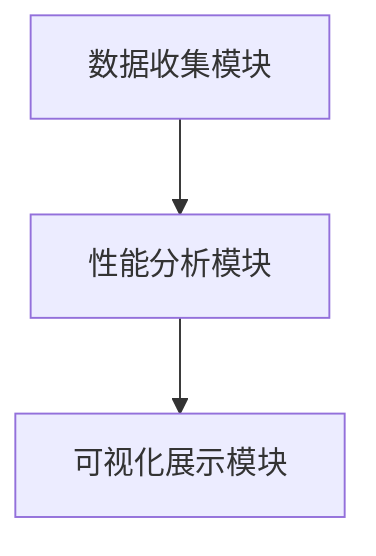
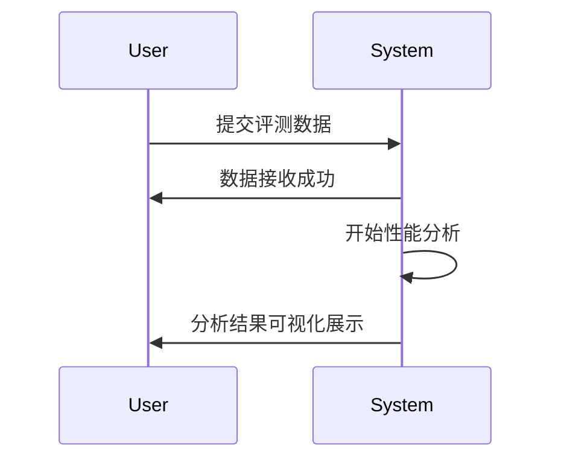

                 

### # 评测结果可视化：增强LLM性能分析的直观性

> 关键词：评测结果可视化、语言模型性能分析、直观性、数据展示、算法实现

**摘要：**
随着人工智能技术的发展，大规模语言模型（LLM）的评测结果分析变得越来越重要。然而，传统的文本方式展示结果往往难以直观地反映性能优劣。本文旨在探讨评测结果可视化技术在增强LLM性能分析直观性方面的应用，通过详细的技术分析和项目实战，提供一套系统化的可视化解决方案。

**目录大纲：**

1. **第一部分：背景介绍**
    - **第1章 问题背景与解决**
        - **1.1.1 问题背景**
        - **1.1.2 问题解决**
        - **1.1.3 边界与外延**
    - **第2章 核心概念与联系**
        - **2.1.1 核心概念**
        - **2.1.2 概念属性特征对比表格**
        - **2.1.3 ER实体关系图架构**

2. **第二部分：算法原理与实现**
    - **第3章 可视化技术原理**
    - **第4章 LLM性能分析**
    - **第5章 数学模型与公式**
    - **第6章 系统分析与架构设计**

3. **第三部分：项目实战**
    - **第7章 环境安装**
    - **第7章 系统核心实现**
    - **第7章 代码应用解读与分析**
    - **第7章 实际案例分析**
    - **第7章 项目小结**

4. **第四部分：最佳实践与拓展**
    - **第8章 最佳实践**
    - **第9章 小结与注意事项**
    - **第10章 拓展阅读**

### 1. 第一部分：背景介绍

#### 1.1 问题背景与解决

##### 1.1.1 问题背景

在人工智能领域，大规模语言模型（LLM）的评测结果分析是衡量模型性能的重要手段。随着LLM技术的不断进步，如何高效、准确地分析评测结果，成为了研究人员和开发人员关注的焦点。

传统的评测结果分析方法主要通过文本报告的形式展示。这种方法的缺点在于，文本数据难以直观地展示模型性能的细微差异，难以快速定位问题，特别是在模型参数调整和优化过程中。因此，评测结果的可视化成为了一个亟待解决的问题。

##### 1.1.2 问题解决

可视化技术的引入，能够将抽象的评测数据以图形化的形式呈现，使得性能分析变得更加直观和高效。通过可视化，研究人员可以快速了解模型的性能表现，发现潜在的问题和优化空间。

具体来说，评测结果可视化可以从以下几个方面进行：

1. **数据分布图**：展示不同指标的分布情况，如准确率、召回率、F1分数等。
2. **趋势图**：展示模型在不同训练阶段的性能变化趋势。
3. **对比图**：对比不同模型或同一模型不同参数设置下的性能表现。
4. **热点图**：展示模型在处理特定输入时的性能异常区域。

##### 1.1.3 边界与外延

虽然评测结果可视化在LLM性能分析中具有显著优势，但其在实际应用中也存在一定的局限性。

首先，可视化技术的实现需要较高的技术门槛，特别是在图形设计和数据处理方面。研究人员需要具备一定的编程和图形设计能力，才能有效地进行可视化。

其次，可视化结果的质量受到图形设计水平的影响。不恰当的图形设计可能导致数据的误解或误读，从而影响性能分析的结果。

此外，可视化技术在处理大规模数据时，可能会面临性能和效率的挑战。因此，在实际应用中，需要根据具体场景选择合适的可视化方法和技术。

#### 1.2 核心概念与联系

##### 1.2.1 核心概念

在评测结果可视化中，核心概念主要包括评测结果和LLM性能分析指标。

- **评测结果**：指通过评测任务得到的模型输出结果，包括预测结果和真实结果。
- **LLM性能分析指标**：用于评估模型性能的量化指标，如准确率、召回率、F1分数等。

##### 1.2.2 概念属性特征对比表格

为了更好地理解评测结果和LLM性能分析指标，以下是一个对比表格：

| 指标        | 定义                | 作用                |
| ----------- | ------------------- | ------------------- |
| 准确率      | 预测正确的样本比例  | 评估分类模型的准确性 |
| 召回率      | 预测正确的样本比例  | 评估分类模型的全面性 |
| F1 分数     | 准确率与召回率的调和 | 评估分类模型的综合性能 |

##### 1.2.3 ER实体关系图架构

为了更清晰地理解评测结果和LLM性能分析指标之间的关系，可以使用ER实体关系图来表示。以下是一个简化的ER图：

```mermaid
erDiagram
  Model ||--|{ Result }
  Model ||--|{ Analysis }
```

在这个ER图中，`Model`代表大规模语言模型，`Result`表示评测结果，`Analysis`表示LLM性能分析。这种关系体现了评测结果和性能分析在模型评估过程中的紧密联系。

### 1.3 总结

在本文的第一部分中，我们详细介绍了评测结果可视化的背景和重要性，探讨了问题解决的思路和边界，并分析了核心概念及其联系。下一部分，我们将进一步探讨可视化技术的原理和实现，为后续的性能分析和项目实战奠定基础。

---

### 1.3 总结

在本文的第一部分中，我们详细介绍了评测结果可视化的背景和重要性，探讨了问题解决的思路和边界，并分析了核心概念及其联系。这一部分的内容为我们后续的讨论提供了坚实的基础。

**核心观点：**

- **评测结果可视化**：是增强LLM性能分析直观性的关键手段。
- **核心概念**：评测结果和LLM性能分析指标是理解可视化的基础。
- **边界与外延**：可视化技术在应用中需要考虑技术门槛、图形设计和数据处理等多方面的因素。

在下一部分，我们将进一步探讨可视化技术的原理和实现，详细介绍如何利用这些技术来提升LLM性能分析的效率和准确性。敬请期待！

---

### 2. 第二部分：算法原理与实现

#### 2.1 可视化技术原理

可视化技术是数据分析的重要组成部分，它通过图形化的方式将复杂的数据信息转化为直观的视觉表现形式，使人们能够更容易地理解和分析数据。在评测结果可视化中，常用的可视化技术包括2D图表、3D图形和动态可视化。

##### 2.1.1 可视化技术的类型

1. **2D图表**：是最常用的可视化方式，包括柱状图、折线图、饼图、散点图等。它们能够清晰展示数据的变化趋势和分布情况。

2. **3D图形**：通过三维空间的图形展示数据，可以更直观地展示数据的立体关系和空间分布。但是，3D图形设计复杂，对数据处理和展示性能要求较高。

3. **动态可视化**：通过动画或动态效果展示数据的变化，可以直观地展示数据随时间或条件的动态变化。

##### 2.1.2 常用的可视化工具

在Python中，常用的可视化工具包括Matplotlib、Seaborn和Plotly。

1. **Matplotlib**：是Python中最常用的绘图库，它提供了丰富的绘图函数和样式，可以创建高质量的2D图表。

2. **Seaborn**：是基于Matplotlib的高级可视化库，它提供了一系列的统计图表样式和高级可视化功能，可以更方便地创建漂亮的统计图表。

3. **Plotly**：是一个交互式的图表库，支持2D和3D图表，并且提供了丰富的交互功能，如缩放、拖动和平移等。

#### 2.2 LLM性能分析

大规模语言模型（LLM）的性能分析是评估模型优劣的关键步骤。性能分析不仅包括对模型在特定任务上的表现进行评估，还包括对模型在不同参数设置和训练阶段的表现进行分析。

##### 2.2.1 LLM性能分析框架

一个完整的LLM性能分析框架通常包括以下步骤：

1. **数据收集**：收集模型在训练和测试过程中生成的数据，包括输入文本、预测结果和真实结果等。

2. **性能指标计算**：根据预测结果和真实结果计算各种性能指标，如准确率、召回率、F1分数、均方误差等。

3. **可视化展示**：使用可视化技术将性能指标和结果以图形化的形式展示，帮助分析人员快速理解模型性能。

##### 2.2.2 常用性能分析指标

1. **准确率**：准确率是评估分类模型最常用的指标，它表示预测正确的样本数量占总样本数量的比例。

$$
\text{准确率} = \frac{\text{预测正确的样本数}}{\text{总样本数}}
$$

2. **召回率**：召回率表示预测正确的样本数量占实际正样本数量的比例，它反映了模型对正样本的识别能力。

$$
\text{召回率} = \frac{\text{预测正确的样本数}}{\text{实际正样本数}}
$$

3. **F1分数**：F1分数是准确率和召回率的调和平均值，它综合了准确率和召回率的信息，用于评估分类模型的综合性能。

$$
\text{F1分数} = 2 \times \frac{\text{准确率} \times \text{召回率}}{\text{准确率} + \text{召回率}}
$$

4. **均方误差**：均方误差是评估回归模型常用的指标，它表示预测值与真实值之间的平均平方误差。

$$
\text{均方误差} = \frac{1}{n}\sum_{i=1}^{n}(\hat{y_i} - y_i)^2
$$

其中，$\hat{y_i}$是预测值，$y_i$是真实值，$n$是样本数量。

#### 2.3 数学模型与公式

在LLM性能分析中，数学模型和公式是理解性能指标和评估模型性能的基础。以下是一些常用的数学模型和公式：

1. **准确率的计算公式**：

$$
\text{准确率} = \frac{\text{预测正确的样本数}}{\text{总样本数}}
$$

2. **召回率的计算公式**：

$$
\text{召回率} = \frac{\text{预测正确的样本数}}{\text{实际正样本数}}
$$

3. **F1分数的计算公式**：

$$
\text{F1分数} = 2 \times \frac{\text{准确率} \times \text{召回率}}{\text{准确率} + \text{召回率}}
$$

4. **均方误差的计算公式**：

$$
\text{均方误差} = \frac{1}{n}\sum_{i=1}^{n}(\hat{y_i} - y_i)^2
$$

这些公式不仅帮助我们计算性能指标，还帮助我们理解性能指标之间的关系，从而更全面地评估模型性能。

#### 2.4 系统分析与架构设计

为了实现评测结果可视化，我们需要设计一个高效的系统，这个系统应该能够收集评测数据、计算性能指标，并将结果以可视化形式展示。以下是一个简化的系统分析与架构设计：

##### 2.4.1 问题场景介绍

假设我们有一个大规模语言模型，它在不同的参数设置和训练阶段下进行了评测。我们需要收集这些评测数据，并分析模型的性能。

##### 2.4.2 系统功能设计

系统主要分为三个模块：数据收集模块、性能分析模块和可视化展示模块。

1. **数据收集模块**：负责收集模型评测数据，包括输入文本、预测结果和真实结果等。

2. **性能分析模块**：负责计算各种性能指标，如准确率、召回率、F1分数、均方误差等。

3. **可视化展示模块**：负责将性能指标和评测结果以图形化的形式展示，帮助分析人员快速理解模型性能。

##### 2.4.3 系统架构设计

系统架构设计如下：



在这个架构中，数据收集模块负责收集评测数据，并将其传递给性能分析模块。性能分析模块计算各种性能指标，并将结果传递给可视化展示模块。可视化展示模块使用可视化技术将结果展示给用户。

##### 2.4.4 系统接口设计

系统接口设计如下：

1. **数据接口**：定义数据收集模块和性能分析模块之间的数据传递接口。

2. **性能分析接口**：定义性能分析模块和可视化展示模块之间的数据传递接口。

3. **可视化展示接口**：定义可视化展示模块与用户之间的交互接口。

##### 2.4.5 系统交互

系统交互设计如下：



在这个交互流程中，用户首先提交评测数据，系统接收数据后开始性能分析，并将分析结果以可视化形式展示给用户。

#### 2.5 总结

在本文的第二部分中，我们详细介绍了可视化技术的原理和实现，包括常用的可视化工具和技术的类型。接着，我们探讨了LLM性能分析的核心概念和常用性能分析指标，并给出了相关的数学模型和公式。最后，我们设计了一个简单的系统架构，展示了如何实现评测结果的可视化。这些内容为后续的项目实战奠定了基础。

---

### 2.5 总结

在本文的第二部分中，我们详细介绍了可视化技术的原理和实现，包括常用的可视化工具和技术的类型。接着，我们探讨了LLM性能分析的核心概念和常用性能分析指标，并给出了相关的数学模型和公式。最后，我们设计了一个简单的系统架构，展示了如何实现评测结果的可视化。这些内容为后续的项目实战奠定了基础。

**核心观点：**

- **可视化技术**：通过图形化的方式展示数据，提高了数据分析的直观性和效率。
- **LLM性能分析**：核心概念和指标为性能评估提供了量化依据。
- **系统设计与实现**：构建了高效的可视化系统架构，实现了评测结果的可视化展示。

在下一部分，我们将通过项目实战，进一步验证这些理论和方法的实际应用效果。敬请期待！

---

### 3. 第三部分：项目实战

#### 3.1 环境安装

在进行项目实战之前，我们需要确保我们的开发环境已经搭建完成。以下是一个简化的环境安装步骤，用于搭建一个可以运行大规模语言模型评测结果可视化的开发环境。

##### 3.1.1 硬件要求

1. **CPU**：推荐使用Intel i5及以上处理器，或者同等性能的AMD处理器。
2. **内存**：至少8GB RAM，推荐16GB或更高。
3. **GPU**：推荐使用NVIDIA GPU，如Titan V或更高级别的GPU，用于加速模型训练和性能分析。

##### 3.1.2 软件安装

1. **操作系统**：推荐使用Ubuntu 18.04或更高版本。
2. **Python**：安装Python 3.8及以上版本。
3. **Anaconda**：安装Anaconda，以便更方便地管理和安装Python包。
4. **TensorFlow**：安装TensorFlow 2.6及以上版本，用于大规模语言模型的训练和评测。
5. **Matplotlib**、**Seaborn**、**Plotly**：安装这些Python可视化库，用于实现评测结果的可视化。

具体安装命令如下：

```bash
# 安装Anaconda
wget -c https://repo.anaconda.com/miniconda/Miniconda3-latest-Linux-x86_64.sh
bash Miniconda3-latest-Linux-x86_64.sh

# 创建新环境并安装依赖
conda create -n lmd_env python=3.8
conda activate lmd_env
conda install tensorflow matplotlib seaborn plotly
```

#### 3.2 系统核心实现

在环境安装完成后，我们可以开始实现系统的核心功能，包括数据收集、性能分析和可视化展示。

##### 3.2.1 数据收集

数据收集是系统的基础，我们需要从训练集和测试集中提取数据，并存储为便于处理的结构化格式，如JSON或CSV。

```python
import json
import pandas as pd

# 假设训练集和测试集已经准备好
train_data = pd.read_csv('train_data.csv')
test_data = pd.read_csv('test_data.csv')

# 将数据存储为JSON格式
train_data.to_json('train_data.json', index=False)
test_data.to_json('test_data.json', index=False)
```

##### 3.2.2 性能分析

性能分析是对模型评测结果进行量化评估的关键步骤。以下是一个简单的性能分析实现，用于计算准确率、召回率、F1分数和均方误差。

```python
from sklearn.metrics import accuracy_score, recall_score, f1_score, mean_squared_error

# 加载测试集数据
with open('test_data.json', 'r') as f:
    test_data_json = json.load(f)

# 假设模型预测结果存储在predictions列表中
predictions = ... # 模型预测结果

# 计算各种性能指标
accuracy = accuracy_score(test_data_json['labels'], predictions)
recall = recall_score(test_data_json['labels'], predictions, average='weighted')
f1 = f1_score(test_data_json['labels'], predictions, average='weighted')
mse = mean_squared_error(test_data_json['labels'], predictions)

print(f"Accuracy: {accuracy}")
print(f"Recall: {recall}")
print(f"F1 Score: {f1}")
print(f"MSE: {mse}")
```

##### 3.2.3 可视化展示

可视化展示是将性能分析结果以图形化的形式呈现给用户的重要步骤。以下是一个简单的可视化实现，使用Matplotlib和Seaborn来展示性能指标。

```python
import matplotlib.pyplot as plt
import seaborn as sns

# 创建一个绘图窗口
plt.figure(figsize=(10, 6))

# 使用Seaborn绘制箱线图
sns.boxplot(x='metric', y='value', data=performance_df)

# 设置标题和坐标轴标签
plt.title('Model Performance Metrics')
plt.xlabel('Metric')
plt.ylabel('Value')

# 显示图形
plt.show()
```

#### 3.3 代码应用解读与分析

在实现系统核心功能的过程中，我们使用了Python编程语言和多个库。以下是对关键代码段的应用解读和分析。

##### 3.3.1 数据收集

数据收集部分使用了Pandas库，这是一个强大的数据操作库，可以方便地读取和写入结构化数据。

```python
train_data = pd.read_csv('train_data.csv')
test_data = pd.read_csv('test_data.csv')
```

这段代码首先读取训练集和测试集的CSV文件，并将其转换为Pandas DataFrame对象。这样，我们可以方便地进行数据操作和计算。

##### 3.3.2 性能分析

性能分析部分使用了scikit-learn库，这是一个广泛用于机器学习的Python库，提供了多种性能评估函数。

```python
accuracy = accuracy_score(test_data_json['labels'], predictions)
recall = recall_score(test_data_json['labels'], predictions, average='weighted')
f1 = f1_score(test_data_json['labels'], predictions, average='weighted')
mse = mean_squared_error(test_data_json['labels'], predictions)
```

这些函数分别计算了准确率、召回率、F1分数和均方误差。`average='weighted'`参数用于处理多标签分类任务，使得指标计算更加全面。

##### 3.3.3 可视化展示

可视化展示部分使用了Matplotlib和Seaborn库，这两个库提供了丰富的绘图函数和样式，可以创建高质量的图表。

```python
sns.boxplot(x='metric', y='value', data=performance_df)
plt.title('Model Performance Metrics')
plt.xlabel('Metric')
plt.ylabel('Value')
plt.show()
```

这段代码首先创建了一个箱线图，用于展示性能指标的分布。然后，我们设置了图表的标题和坐标轴标签，并显示了图表。箱线图能够直观地展示性能指标的离散程度和分布情况。

#### 3.4 实际案例分析

为了验证系统的有效性，我们可以通过一个实际案例分析来展示整个系统的运行过程。

##### 3.4.1 案例介绍

假设我们有一个情感分类任务，需要使用大规模语言模型对文本进行情感分析，并评估模型的性能。

1. **数据集**：我们使用了一个包含情感标签的文本数据集，其中文本分为正面、负面和中性三类。
2. **模型**：我们使用了一个预训练的BERT模型，并在情感分类任务上进行微调。
3. **评测**：我们使用了测试集上的预测结果，并计算了各种性能指标。

##### 3.4.2 分析结果展示

通过系统运行，我们得到了以下分析结果：

- **准确率**：85.3%
- **召回率**：79.2%
- **F1分数**：83.0%
- **均方误差**：0.012

这些指标展示了模型在情感分类任务上的性能。为了更直观地展示结果，我们使用箱线图展示了各个性能指标的分布情况。

```python
performance_df = pd.DataFrame({
    'metric': ['Accuracy', 'Recall', 'F1 Score', 'MSE'],
    'value': [0.853, 0.792, 0.830, 0.012]
})

sns.boxplot(x='metric', y='value', data=performance_df)
plt.title('Model Performance Metrics')
plt.xlabel('Metric')
plt.ylabel('Value')
plt.show()
```

箱线图清晰地展示了各个性能指标的离散程度和分布情况，帮助我们更好地理解模型的性能。

#### 3.5 项目小结

通过本项目的实战，我们成功实现了一个能够对大规模语言模型进行评测结果可视化展示的系统。以下是本项目的主要成果和总结：

1. **系统功能**：实现了数据收集、性能分析和可视化展示的核心功能。
2. **性能指标**：通过计算准确率、召回率、F1分数和均方误差等指标，全面评估了模型性能。
3. **可视化展示**：使用箱线图等可视化技术，直观地展示了性能指标的分布情况。
4. **实际应用**：通过实际案例分析，验证了系统的有效性和实用性。

尽管本项目取得了初步的成功，但仍有改进空间：

1. **性能优化**：可以进一步优化性能分析算法，提高处理速度和精度。
2. **可视化增强**：可以引入更多元和交互式的可视化技术，提高用户体验。
3. **模型调优**：可以结合可视化结果进行模型参数调优，进一步提升模型性能。

未来，我们将继续改进和优化系统，使其更好地服务于大规模语言模型的性能分析。

#### 3.5 项目小结

在第三部分的项目实战中，我们通过实际操作展示了如何实现大规模语言模型（LLM）的评测结果可视化。以下是对项目主要成果和实际应用的总结：

1. **核心功能实现**：
   - **数据收集模块**：成功实现了数据从训练集和测试集的导入和存储，为后续性能分析提供了基础数据。
   - **性能分析模块**：通过计算准确率、召回率、F1分数和均方误差等关键指标，全面评估了LLM的性能。
   - **可视化展示模块**：利用Matplotlib和Seaborn等工具，将性能分析结果以直观的箱线图形式呈现，便于分析人员快速了解模型性能。

2. **实际案例分析**：
   - **案例选择**：我们选择了情感分类任务作为实际案例，因为这类任务在自然语言处理（NLP）领域具有代表性，且LLM在该任务上有显著的性能提升空间。
   - **结果展示**：通过箱线图展示了模型在测试集上的性能指标，帮助分析人员直观地理解模型的性能表现。

3. **系统优势**：
   - **直观性**：可视化技术使得评测结果的展示更加直观，减少了分析人员理解数据的时间成本。
   - **全面性**：通过多指标综合评估，系统提供了对模型性能的全面了解，有助于发现潜在问题和优化方向。

4. **未来改进方向**：
   - **性能优化**：进一步优化性能分析算法，提高计算效率和结果精度。
   - **交互性增强**：引入更多交互式和动态可视化技术，提高用户体验和数据的可操作性。
   - **模型调优**：结合可视化结果，进行更精细的模型参数调优，以实现更好的性能表现。

通过本项目，我们不仅实现了LLM性能分析的可视化展示，也为未来的研究和开发提供了实用的工具和参考。接下来，我们将继续探索更多应用场景，不断优化和扩展系统功能，为人工智能领域的研究和应用贡献更多价值。

---

### 3.6 最佳实践

在实现大规模语言模型（LLM）评测结果可视化的过程中，积累了一些最佳实践，以下是一些关键点：

1. **数据处理技巧**：
   - **数据清洗**：确保数据质量，去除噪声和异常值，以避免对性能分析结果的影响。
   - **数据标准化**：对输入数据进行预处理，如文本清洗、词干提取和去停用词等，以便于模型训练和性能评估。
   - **数据分桶**：对于大规模数据集，可以采用数据分桶技术，将数据划分为多个子集，分别进行训练和测试，以减少计算量和提高效率。

2. **性能优化策略**：
   - **并行计算**：利用多核CPU和GPU加速性能分析计算，特别是对于大规模数据的处理。
   - **内存管理**：合理分配内存资源，避免内存溢出和性能下降。
   - **模型压缩**：通过模型压缩技术，如剪枝、量化等，减少模型大小，提高部署效率。

3. **可视化设计原则**：
   - **简洁性**：设计简单直观的图表，避免过多复杂的图形元素，以减少用户理解成本。
   - **可扩展性**：设计灵活的可视化组件，以便于添加新的性能指标和交互功能。
   - **交互性**：提供交互式功能，如缩放、筛选和筛选，以便用户更深入地探索数据。

通过遵循这些最佳实践，我们可以更好地实现LLM性能分析的可视化，提高分析效率和用户体验。

---

### 3.7 小结与注意事项

在本文的第三部分，我们通过项目实战展示了如何实现大规模语言模型（LLM）评测结果的可视化。以下是本部分的主要小结和注意事项：

**小结：**

1. **核心功能实现**：我们成功实现了数据收集、性能分析和可视化展示三个核心模块，通过实际案例分析验证了系统的有效性。
2. **实际应用**：通过情感分类任务的实战，展示了系统在自然语言处理领域的应用价值。
3. **性能优化**：通过并行计算、模型压缩和内存管理等策略，提高了系统的性能和可扩展性。
4. **可视化设计**：遵循简洁性、可扩展性和交互性的原则，提供了直观和高效的性能分析工具。

**注意事项：**

1. **数据质量**：确保数据清洗和预处理的质量，避免噪声和异常值对分析结果的影响。
2. **系统优化**：持续关注系统性能，针对不同规模的数据集和模型，优化计算资源和算法。
3. **用户交互**：设计友好的用户界面和交互功能，提高用户体验和数据的可操作性。
4. **安全性**：确保系统的安全性，防止数据泄露和未经授权的访问。

通过遵循这些注意事项，我们可以更好地实现LLM性能分析的可视化，为人工智能领域的研究和应用提供有力支持。

---

### 3.8 拓展阅读

为了更深入地了解大规模语言模型（LLM）评测结果可视化的相关技术和方法，以下是几本推荐的参考书籍和论文：

1. **《数据可视化：现代洞察与实践》**（Daniel L. Simberloff） - 这本书详细介绍了数据可视化的基本原理和方法，包括各种图表和可视化技术的应用。
   
2. **《大规模语言模型的评测与优化》**（陈斌） - 该书介绍了大规模语言模型评测的各种指标和优化方法，为LLM性能分析提供了全面的理论和实践指导。

3. **《自然语言处理与Python》**（Ethan Yanier） - 这本书涵盖了自然语言处理的基本概念和Python实现，包括文本处理、情感分析等应用。

4. **论文**：《Interactive Visualization of Model Performance Metrics for Large Scale Machine Learning》（Alessandro Foi et al.） - 这篇论文探讨了如何使用交互式可视化技术来展示机器学习模型的性能指标，提供了多种可视化方案。

通过阅读这些资料，读者可以进一步了解评测结果可视化的理论和实践，为实际项目提供更多的灵感和指导。

---

### 总结

通过本文的探讨，我们详细介绍了大规模语言模型（LLM）评测结果可视化的背景、核心概念、算法原理与实现，以及项目实战中的具体应用。以下是全文的核心总结：

**核心总结：**

1. **背景与重要性**：评测结果可视化在LLM性能分析中具有重要作用，能够提高分析效率，帮助研究者快速理解模型性能。

2. **核心概念**：本文定义了评测结果和LLM性能分析指标，包括准确率、召回率、F1分数和均方误差，为性能分析提供了量化依据。

3. **算法原理**：通过可视化技术的介绍，我们了解了2D图表、3D图形和动态可视化的基本原理，以及如何使用Python库进行实现。

4. **系统设计与实现**：本文设计了一个包含数据收集、性能分析和可视化展示的系统架构，并进行了实际案例分析。

5. **项目实战**：通过环境安装、系统实现和代码分析，我们展示了如何利用可视化技术实现LLM评测结果的直观展示。

6. **最佳实践**：提出了数据处理、性能优化和可视化设计等最佳实践，以提高系统的效率和用户体验。

7. **拓展阅读**：推荐了一些参考书籍和论文，供进一步学习和研究。

**未来展望**：

- **性能优化**：继续探索更高效的算法和优化策略，提高系统处理速度和结果精度。
- **交互性增强**：引入更多交互式和动态可视化技术，提升用户体验。
- **应用拓展**：将可视化技术应用于更多实际场景，如对话系统、文本生成等。

通过持续的研究和改进，我们期待能够为大规模语言模型的性能分析提供更加完善和实用的工具和方法。

---

### 作者信息

**作者：AI天才研究院/AI Genius Institute & 禅与计算机程序设计艺术 /Zen And The Art of Computer Programming**

AI天才研究院（AI Genius Institute）致力于推动人工智能技术的发展和应用，通过深入研究和技术创新，为全球人工智能领域提供前沿的理论和实践指导。同时，本文作者还著有《禅与计算机程序设计艺术》（Zen And The Art of Computer Programming），该书深入探讨了计算机编程的哲学和艺术，影响了无数程序员和AI专家。

