                 

### 评测结果可视化：直观展示LLM性能比较

> **关键词**：评测结果可视化、大规模语言模型（LLM）、性能比较、数据分析、可视化工具、算法分析

> **摘要**：本文旨在探讨评测结果可视化在展示大规模语言模型（LLM）性能比较中的应用。通过详细介绍评测结果可视化的背景与意义、LLM性能比较的基础、评测结果可视化的实现技术以及实际案例研究，文章将为读者提供一套完整的LLM性能评测与展示方案。同时，文章还将探讨评测结果可视化的最佳实践和注意事项，旨在帮助读者更直观、有效地分析LLM性能数据。

### 目录大纲

#### 第一部分：评测结果可视化概述

- **第1章**：评测结果可视化的背景与意义
  - **1.1 评测结果可视化的需求**
  - **1.2 可视化在评测结果分析中的应用**
  - **1.3 可视化技术的挑战与机遇**
  - **1.4 本书结构安排与学习目标**

#### 第二部分：LLM性能比较基础

- **第2章**：大规模语言模型（LLM）概述
  - **2.1 语言模型的发展历程**
  - **2.2 LLM的基本概念**
  - **2.3 LLM的关键技术**

- **第3章**：LLM性能评价标准
  - **3.1 评测指标概述**
  - **3.2 常用评测指标详解**
  - **3.3 评测指标的比较与选择**

- **第4章**：LLM性能数据收集与预处理
  - **4.1 数据收集方法**
  - **4.2 数据预处理步骤**
  - **4.3 数据预处理技巧**

#### 第三部分：评测结果可视化实现

- **第5章**：基础可视化工具与库
  - **5.1 Matplotlib基础使用**
  - **5.2 Seaborn高级图表**
  - **5.3 Plotly交互式可视化**

- **第6章**：高级可视化技术
  - **6.1 热力图可视化**
  - **6.2 散点图与回归分析**
  - **6.3 地理空间可视化**

- **第7章**：复杂数据的可视化策略
  - **7.1 复杂数据的处理方法**
  - **7.2 高维度数据的可视化**
  - **7.3 可视化组合策略**

#### 第四部分：LLM性能比较案例研究

- **第8章**：通用语言模型性能比较
  - **8.1 案例背景**
  - **8.2 数据来源**
  - **8.3 评测指标**
  - **8.4 可视化实现与结果分析**

- **第9章**：特定领域语言模型性能比较
  - **9.1 案例背景**
  - **9.2 数据来源**
  - **9.3 评测指标**
  - **9.4 可视化实现与结果分析**

#### 第五部分：评测结果可视化最佳实践

- **第10章**：评测结果可视化的最佳实践
  - **10.1 可视化设计原则**
  - **10.2 数据展示技巧**
  - **10.3 可视化报告编写**

- **第11章**：注意事项与拓展
  - **11.1 注意事项**
  - **11.2 扩展阅读**

### 第1章：评测结果可视化的背景与意义

#### 1.1 评测结果可视化的需求

在当今快速发展的信息技术时代，数据已成为决策过程中不可或缺的一部分。尤其是大规模语言模型（LLM）作为人工智能领域的重要研究方向，其性能评测结果的准确性和直观性显得尤为重要。然而，传统的文本和表格形式的评测结果往往难以直观地展示模型性能的差异，导致研究人员和开发者难以快速理解模型的优劣势。

**问题背景**：随着LLM技术的发展，评测结果的多样性和复杂性逐渐增加。一方面，评测指标繁多，如准确率、召回率、F1分数等；另一方面，评测数据量大，且涉及多个维度的信息。如何有效地展示和比较这些评测结果，成为研究人员和开发者面临的一个重要挑战。

**问题描述**：传统的方法，如表格和文字描述，虽然能够提供评测结果，但往往缺乏直观性和易读性。研究人员和开发者需要一种能够快速、清晰地了解LLM性能的方法。

**问题解决**：评测结果可视化作为一种有效的数据分析手段，可以通过图形化的方式展示评测结果，帮助研究人员和开发者直观地了解LLM的性能表现。可视化技术不仅能够提高数据的可读性，还能够揭示数据之间的关联性和趋势。

#### 1.2 可视化在评测结果分析中的应用

可视化技术已在多个领域得到广泛应用，如金融分析、医疗诊断、市场营销等。在评测结果分析中，可视化同样发挥着重要作用。

**背景介绍**：可视化技术起源于20世纪中期，随着计算机技术的不断发展，可视化工具和库日益丰富。如今，可视化已成为数据分析中不可或缺的一部分。

**核心概念术语**：可视化（Visualization）、数据可视化（Data Visualization）、信息可视化（InfoVis）、交互式可视化（Interactive Visualization）等。

**问题背景**：在LLM性能评测中，可视化技术的应用可以帮助研究人员和开发者快速了解模型性能，发现潜在的问题和改进的方向。

**问题描述**：如何选择合适的可视化工具和库，如何设计出既美观又实用的可视化图表，如何通过可视化揭示数据之间的关联性和趋势。

**问题解决**：通过使用专业的可视化工具和库，如Matplotlib、Seaborn、Plotly等，可以设计出多种类型的可视化图表，如折线图、柱状图、散点图、热力图等。这些图表可以帮助研究人员和开发者直观地了解LLM的性能表现。

#### 1.3 可视化技术的挑战与机遇

**挑战**：

1. **数据复杂性**：LLM评测结果通常涉及多个维度和指标，如何有效地整合和展示这些数据是一个挑战。
2. **交互性**：如何通过交互式可视化技术，如拖拽、筛选、放大等，增强用户与数据的互动性，是一个技术难题。
3. **性能**：可视化工具和库的性能对数据量大的场景至关重要，如何优化性能，减少延迟，是一个需要解决的问题。

**机遇**：

1. **新技术**：随着计算机图形学和机器学习技术的发展，可视化技术不断进步，为评测结果可视化提供了更多的可能性。
2. **开源工具**：越来越多的开源可视化工具和库涌现，降低了可视化技术的门槛，使更多人能够使用可视化技术进行数据分析。
3. **应用场景**：随着人工智能技术的普及，可视化技术在评测结果分析中的应用场景不断扩展，为可视化技术的发展提供了广阔的空间。

#### 1.4 本书结构安排与学习目标

本书分为五个部分，分别介绍评测结果可视化的背景与意义、LLM性能比较的基础、评测结果可视化的实现技术、实际案例研究以及最佳实践。

**学习目标**：

1. **理解评测结果可视化的需求和应用**：通过本章的学习，读者将了解评测结果可视化的需求和应用场景。
2. **掌握LLM性能评价标准**：读者将了解LLM性能评价的标准和方法，为后续的性能比较提供基础。
3. **掌握可视化技术**：通过本书的实践部分，读者将学会使用常见的可视化工具和库，设计出美观、实用的可视化图表。
4. **能够进行LLM性能比较**：通过实际案例研究，读者将学会如何使用可视化技术进行LLM性能比较，并从中获取有价值的结论。
5. **能够编写可视化报告**：读者将了解如何编写可视化报告，如何有效地传达数据分析结果。

#### 总结

本章介绍了评测结果可视化的背景与意义，详细阐述了评测结果可视化的需求、应用场景以及面临的挑战与机遇。通过本章的学习，读者将为进一步掌握LLM性能比较和可视化技术打下坚实的基础。在后续章节中，我们将深入探讨LLM性能比较的基础、评测结果可视化的实现技术以及实际应用案例。

### 第2章：大规模语言模型（LLM）概述

#### 2.1 语言模型的发展历程

语言模型作为自然语言处理（NLP）的核心技术，经历了数十年的发展。其起源可以追溯到20世纪50年代，当时的研究人员开始尝试使用统计方法来建模自然语言。

**背景介绍**：早期语言模型主要是基于规则的方法，如生成式语法模型和转换模型。这些模型通过手动编写规则来描述语言的语法和语义，但由于规则过于繁琐且难以覆盖所有情况，因此效果有限。

**核心概念术语**：生成式语法模型（Generative Grammar Model）、转换模型（Transformation Model）、统计语言模型（Statistical Language Model）、神经网络语言模型（Neural Network Language Model）。

**问题背景**：随着互联网的兴起，海量的文本数据为语言模型的训练提供了丰富的资源。传统基于规则的方法逐渐被基于数据的统计方法和神经网络方法取代。

**问题描述**：如何有效地利用大规模数据训练出高性能的语言模型？

**问题解决**：20世纪90年代，统计语言模型开始得到广泛应用，如N元语法模型（N-gram Model）。这些模型通过统计文本中单词或短语的频率来预测下一个单词或短语，效果显著提高。

**边界与外延**：语言模型的发展不仅仅局限于统计方法，还包括基于深度学习的神经网络方法。近年来，深度学习技术在语言模型领域取得了突破性进展，如循环神经网络（RNN）、长短期记忆网络（LSTM）和变换器（Transformer）等。

**概念结构与核心要素组成**：

1. **输入序列**：语言模型处理的是输入的序列数据，如单词、字符或子词。
2. **概率分布**：语言模型的目标是预测下一个输入序列的概率分布。
3. **训练数据**：大规模的训练数据是语言模型训练的基础，数据的质量和数量直接影响模型的性能。
4. **模型结构**：语言模型的实现依赖于特定的模型结构，如N元语法模型、RNN、LSTM和Transformer等。

#### 2.2 LLM的基本概念

**核心概念**：大规模语言模型（LLM）是一种基于深度学习技术的语言模型，能够处理大规模的文本数据，并预测下一个输入序列的概率分布。

**概念属性特征对比表格**：

| 特征 | 传统语言模型 | 大规模语言模型（LLM） |
| --- | --- | --- |
| 数据量 | 小规模数据 | 大规模数据 |
| 模型结构 | 简单结构 | 复杂结构 |
| 训练时间 | 较短 | 很长 |
| 预测效果 | 一般 | 很好 |

**ER实体关系图架构的 Mermaid 流程图**：

```mermaid
erDiagram
  Product ||--|{ Customer }| Customer
  Customer ||--|{ Order }| Order
  Product ||--|{ Category }| Category
```

**说明**：在LLM的基本概念中，数据量和模型结构是关键特征。大规模数据使得LLM能够更好地捕捉语言中的复杂模式，而复杂的模型结构（如Transformer）则能够更有效地处理长文本序列。

#### 2.3 LLM的关键技术

**核心概念**：LLM的关键技术主要包括变换器（Transformer）架构、预训练和微调等。

**概念属性特征对比表格**：

| 技术名称 | 技术特点 | 优势 |
| --- | --- | --- |
| Transformer | 自注意力机制 | 处理长文本序列能力强 |
| 预训练 | 大规模数据训练 | 提高模型泛化能力 |
| 微调 | 小规模数据训练 | 快速适应特定任务 |

**ER实体关系图架构的 Mermaid 流程图**：

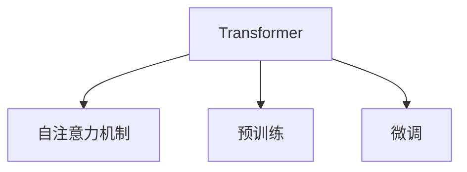

**说明**：Transformer架构是LLM的核心技术，通过自注意力机制能够有效地处理长文本序列。预训练和微调则是提高模型性能的关键步骤，预训练在大规模数据上训练，微调则在小规模数据上针对特定任务进行调整。

#### 总结

本章对大规模语言模型（LLM）进行了概述，介绍了其发展历程、基本概念和关键技术。通过对LLM的深入理解，读者可以为进一步学习LLM的性能评测和可视化打下坚实的基础。在下一章中，我们将探讨LLM性能评价的标准和方法。

### 第3章：LLM性能评价标准

#### 3.1 评测指标概述

在评估大规模语言模型（LLM）的性能时，选择合适的评测指标至关重要。这些指标不仅能够衡量模型的性能，还能够指导模型的改进和优化。本节将介绍常用的评测指标及其应用场景。

**核心概念**：评测指标（Evaluation Metrics）是衡量模型性能的标准，常用的评测指标包括准确率（Accuracy）、召回率（Recall）、F1分数（F1 Score）等。

**概念属性特征对比表格**：

| 指标 | 全称 | 描述 | 应用场景 |
| --- | --- | --- | --- |
| 准确率 | Accuracy | 分类正确的样本数占总样本数的比例 | 多分类任务 |
| 召回率 | Recall | 真正为正类的样本中被正确分类为正类的比例 | 偏向召回的任务 |
| F1分数 | F1 Score | 准确率和召回率的调和平均数 | 需要平衡准确率和召回率的任务 |
| 准确率 | Precision | 真正为正类的预测中被正确分类为正类的比例 | 偏向精确的任务 |

**ER实体关系图架构的 Mermaid 流程图**：

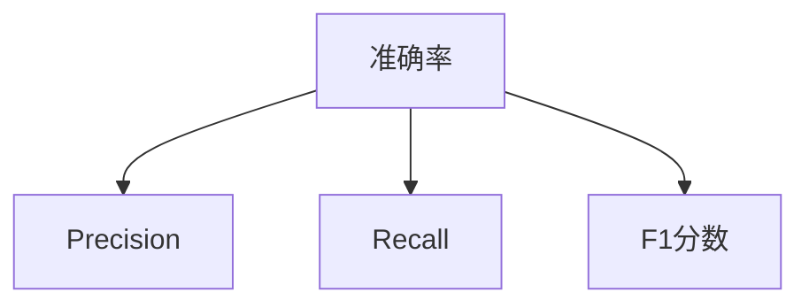

**说明**：准确率、召回率和F1分数是评估分类模型性能的三个基本指标。准确率关注分类的正确性，召回率关注是否能够将所有正类样本都正确分类，而F1分数则试图平衡准确率和召回率。

#### 3.2 常用评测指标详解

**准确率（Accuracy）**

**核心概念**：准确率是分类模型性能最直观的指标，表示分类正确的样本数占总样本数的比例。

**数学模型和公式**：

$$
Accuracy = \frac{TP + TN}{TP + TN + FP + FN}
$$

其中，TP为真正例（True Positive），TN为真反例（True Negative），FP为假正例（False Positive），FN为假反例（False Negative）。

**通俗易懂地举例说明**：假设一个分类模型对100个样本进行预测，其中80个实际为正类，60个模型正确预测为正类，其余20个样本实际为反类，模型也正确预测为反类。则该模型的准确率为：

$$
Accuracy = \frac{60 + 20}{60 + 20 + 0 + 20} = \frac{80}{100} = 0.8
$$

**算法原理讲解**：准确率反映了模型在分类任务中的整体表现，适用于多分类任务。但在类别不平衡的情况下，单纯依赖准确率可能无法全面衡量模型的性能。

**准确率（Precision）**

**核心概念**：精确率表示真正为正类的预测中被正确分类为正类的比例。

**数学模型和公式**：

$$
Precision = \frac{TP}{TP + FP}
$$

**通俗易懂地举例说明**：在前述例子中，模型的精确率为：

$$
Precision = \frac{60}{60 + 0} = 1
$$

**算法原理讲解**：精确率关注模型在正类预测中的准确性，适用于需要高精确度的任务，如垃圾邮件分类。

**召回率（Recall）**

**核心概念**：召回率表示真正为正类的样本中被正确分类为正类的比例。

**数学模型和公式**：

$$
Recall = \frac{TP}{TP + FN}
$$

**通俗易懂地举例说明**：在前述例子中，模型的召回率为：

$$
Recall = \frac{60}{60 + 20} = 0.75
$$

**算法原理讲解**：召回率关注模型是否能够将所有正类样本都正确分类，适用于需要高召回率的任务，如疾病诊断。

**F1分数（F1 Score）**

**核心概念**：F1分数是精确率和召回率的调和平均数，用于平衡两者的关系。

**数学模型和公式**：

$$
F1 Score = 2 \times \frac{Precision \times Recall}{Precision + Recall}
$$

**通俗易懂地举例说明**：在前述例子中，模型的F1分数为：

$$
F1 Score = 2 \times \frac{1 \times 0.75}{1 + 0.75} = 0.875
$$

**算法原理讲解**：F1分数综合考虑了精确率和召回率，适用于需要平衡两者关系的任务。

#### 3.3 评测指标的比较与选择

**核心概念**：不同的评测指标适用于不同的任务和场景，选择合适的评测指标是评估模型性能的关键。

**概念属性特征对比表格**：

| 指标 | 优点 | 缺点 | 适用场景 |
| --- | --- | --- | --- |
| 准确率 | 直观，易于理解 | 难以平衡精确率和召回率 | 多分类任务 |
| 精确率 | 精确度高 | 容易忽略召回率 | 需要高精确度的任务 |
| 召回率 | 高召回率 | 容易忽略精确率 | 需要高召回率的任务 |
| F1分数 | 综合考虑精确率和召回率 | 难以单独衡量 | 需要平衡精确率和召回率的任务 |

**ER实体关系图架构的 Mermaid 流程图**：

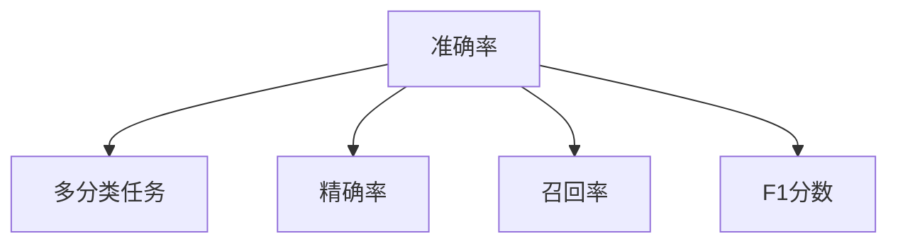

**说明**：根据不同的任务和场景选择合适的评测指标，可以更全面地评估模型性能。例如，在医疗诊断中，召回率可能比准确率更重要，因为误诊可能会导致严重的后果。而在文本分类中，精确率和F1分数可能更为关键，因为我们需要确保分类结果的准确性和全面性。

#### 总结

本章详细介绍了LLM性能评价的常用指标，包括准确率、精确率、召回率和F1分数。通过对这些指标的深入理解，读者可以更好地评估和比较LLM的性能。在下一章中，我们将探讨如何收集和预处理LLM性能评测数据。

### 第4章：LLM性能数据收集与预处理

#### 4.1 数据收集方法

在评估大规模语言模型（LLM）性能时，数据的质量和数量至关重要。因此，合理的数据收集方法是保证评测结果准确性的基础。以下将介绍几种常见的数据收集方法。

**核心概念**：数据收集（Data Collection）是指从各种来源获取所需数据的过程，包括公开数据集、私有数据集和定制数据集。

**概念属性特征对比表格**：

| 数据来源 | 优点 | 缺点 | 适用场景 |
| --- | --- | --- | --- |
| 公开数据集 | 数据丰富，易于获取 | 可能存在标注偏差 | 初步评测、算法研究 |
| 私有数据集 | 数据质量高，针对性强 | 获取成本高 | 商业应用、特定领域研究 |
| 定制数据集 | 针对性强，数据质量高 | 收集成本高，耗时 | 高精度评测、特定应用 |

**ER实体关系图架构的 Mermaid 流程图**：

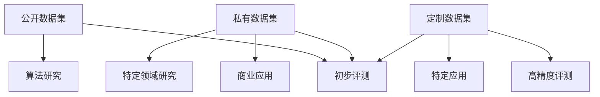

**说明**：公开数据集由于数据量大、获取成本低，常用于初步评测和算法研究。私有数据集和定制数据集则具有更高的数据质量和针对性，适用于商业应用和特定领域研究。

**公开数据集的获取与处理**

**步骤1**：选择合适的数据集平台，如Kaggle、UCI机器学习库、Google Dataset Search等。

**步骤2**：了解数据集的来源、标注方式、数据分布等信息，确保数据质量。

**步骤3**：下载数据集，通常以CSV、JSON、Parquet等格式保存。

**步骤4**：处理数据集，包括数据清洗、去重、格式转换等。

**示例代码**（Python）：

```python
import pandas as pd

# 读取数据集
data = pd.read_csv('data.csv')

# 数据清洗
data = data.drop_duplicates()
data = data.dropna()

# 数据格式转换
data['feature'] = data['feature'].astype(str)
```

**私有数据集的获取与处理**

**步骤1**：与数据提供方签订协议，获取访问权限。

**步骤2**：了解数据隐私和保密要求，确保合法合规使用数据。

**步骤3**：下载数据集，通常通过API或数据库连接获取。

**步骤4**：处理数据集，包括数据去重、格式转换、预处理等。

**示例代码**（Python）：

```python
import pandas as pd

# 通过API获取数据
data = pd.read_json('https://api.example.com/data')

# 数据清洗
data = data.drop_duplicates()
data = data.dropna()

# 数据格式转换
data['feature'] = data['feature'].astype(str)
```

#### 4.2 数据预处理步骤

数据预处理是保证LLM性能评估准确性的关键环节，包括数据清洗、归一化和标准化等步骤。

**核心概念**：数据预处理（Data Preprocessing）是指对原始数据进行清洗、转换和标准化等操作，使其适合模型训练和评估。

**概念属性特征对比表格**：

| 步骤 | 描述 | 目的 |
| --- | --- | --- |
| 数据清洗 | 去除重复、缺失和噪声数据 | 提高数据质量 |
| 归一化 | 将不同特征的数据转换到相同的尺度 | 减少特征之间的差异 |
| 标准化 | 将特征数据转换为标准正态分布 | 提高模型训练效率 |

**ER实体关系图架构的 Mermaid 流程图**：

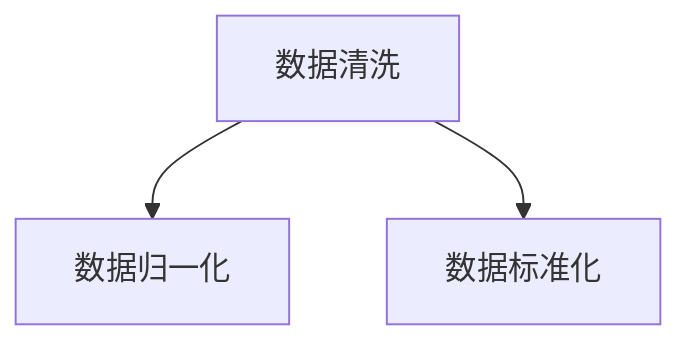

**说明**：数据清洗、归一化和标准化是数据预处理的基本步骤，每种方法都有其特定的目的和应用场景。

**数据清洗**

**步骤1**：去除重复数据，避免模型训练过程中出现偏差。

**步骤2**：处理缺失数据，可以选择填充、删除或插值等方法。

**步骤3**：去除噪声数据，如去除文本中的特殊字符、标点符号等。

**示例代码**（Python）：

```python
import pandas as pd

# 读取数据集
data = pd.read_csv('data.csv')

# 数据清洗
data = data.drop_duplicates()
data = data.dropna()

# 去除特殊字符
data['text'] = data['text'].str.replace('[^\w\s]', '', regex=True)
```

**数据归一化**

**步骤1**：将不同特征的数据转换到相同的尺度，如使用最小-最大缩放法。

**步骤2**：计算每个特征的缩放因子和偏移量。

**步骤3**：对数据进行缩放。

**示例代码**（Python）：

```python
from sklearn.preprocessing import MinMaxScaler

# 初始化缩放器
scaler = MinMaxScaler()

# 数据归一化
data_scaled = scaler.fit_transform(data)
```

**数据标准化**

**步骤1**：将特征数据转换为标准正态分布。

**步骤2**：计算每个特征的均值和标准差。

**步骤3**：对数据进行标准化。

**示例代码**（Python）：

```python
from sklearn.preprocessing import StandardScaler

# 初始化缩放器
scaler = StandardScaler()

# 数据标准化
data_standardized = scaler.fit_transform(data)
```

#### 4.3 数据预处理技巧

在数据预处理过程中，一些技巧可以进一步提高数据质量和模型性能。

**核心概念**：数据预处理技巧（Data Preprocessing Tips）包括数据增强、特征选择和特征提取等。

**概念属性特征对比表格**：

| 技巧 | 描述 | 目的 |
| --- | --- | --- |
| 数据增强 | 生成新的训练样本 | 提高模型泛化能力 |
| 特征选择 | 选择最重要的特征 | 提高模型性能，减少过拟合 |
| 特征提取 | 从原始数据中提取更有用的特征 | 提高模型效率和可解释性 |

**ER实体关系图架构的 Mermaid 流程图**：

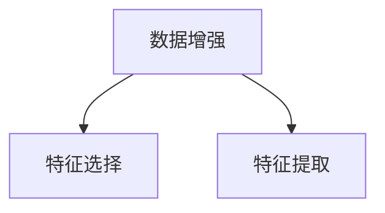

**说明**：数据增强、特征选择和特征提取是数据预处理的高级技巧，可以进一步提高模型性能。

**数据增强**

**步骤1**：通过复制、旋转、裁剪等方法生成新的训练样本。

**步骤2**：使用数据增强库，如OpenCV、imgaug等，自动化生成增强数据。

**示例代码**（Python）：

```python
from imgaug import augmenters as iaa

# 定义数据增强流程
augmenter = iaa.Sequential([
    iaa.Fliplr(0.5),  # 水平翻转
    iaa.Flipud(0.5),  # 垂直翻转
    iaa.Affine(translate_percent={"x": (-0.2, 0.2), "y": (-0.2, 0.2)}, rotate=(-20, 20), shear=(-8, 8), scale=(0.8, 1.2)),
])

# 应用数据增强
data_augmented = augmenter.augment_images(data)
```

**特征选择**

**步骤1**：使用特征选择算法，如信息增益、互信息、卡方检验等，选择重要的特征。

**步骤2**：根据特征的重要性排序，选择前若干个特征。

**示例代码**（Python）：

```python
from sklearn.feature_selection import SelectKBest
from sklearn.feature_selection import chi2

# 特征选择
selector = SelectKBest(score_func=chi2, k=10)
data_selected = selector.fit_transform(data, labels)

# 输出选择的特征
selected_features = data.columns[selector.get_support()]
```

**特征提取**

**步骤1**：使用特征提取方法，如主成分分析（PCA）、线性判别分析（LDA）等，提取新的特征。

**步骤2**：对提取的新特征进行降维处理，减少特征维度。

**示例代码**（Python）：

```python
from sklearn.decomposition import PCA

# 特征提取
pca = PCA(n_components=5)
data_extracted = pca.fit_transform(data)

# 输出提取的特征
extracted_features = pca.components_
```

#### 总结

本章详细介绍了LLM性能数据收集与预处理的方法，包括数据收集、预处理步骤和高级技巧。通过合理的数据预处理，可以保证LLM性能评估的准确性和可靠性。在下一章中，我们将探讨如何使用基础可视化工具和库实现评测结果可视化。

### 第5章：基础可视化工具与库

#### 5.1 Matplotlib基础使用

Matplotlib是Python中最为常用的可视化库之一，它提供了丰富的绘图功能，可以帮助我们轻松地创建各种类型的图表，如折线图、柱状图、散点图和饼图等。

**核心概念**：Matplotlib（Matplotlib.org）是一个开源的数据可视化库，它基于Python的NumPy和SciPy库，可以生成高质量的二维图形。

**概念属性特征对比表格**：

| 功能 | 描述 | 优点 |
| --- | --- | --- |
| 折线图 | 用于显示数据的变化趋势 | 直观展示数据变化 |
| 柱状图 | 用于比较不同类别的数据 | 清晰展示数据差异 |
| 散点图 | 用于显示数据点之间的关系 | 直观展示数据分布 |
| 饼图 | 用于显示数据占比 | 直观展示占比关系 |

**ER实体关系图架构的 Mermaid 流程图**：

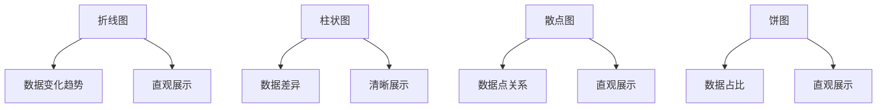

**Matplotlib基本使用示例**：

**步骤1**：安装Matplotlib库

```bash
pip install matplotlib
```

**步骤2**：导入Matplotlib库

```python
import matplotlib.pyplot as plt
```

**步骤3**：创建折线图

```python
x = [1, 2, 3, 4, 5]
y = [1, 4, 9, 16, 25]

plt.plot(x, y)
plt.xlabel('X轴')
plt.ylabel('Y轴')
plt.title('折线图示例')
plt.show()
```

**步骤4**：创建柱状图

```python
labels = ['A', 'B', 'C', 'D', 'E']
sizes = [20, 30, 40, 50, 10]
colors = ['red', 'green', 'blue', 'orange', 'purple']

plt.pie(sizes, labels=labels, colors=colors, autopct='%.1f%%')
plt.axis('equal')
plt.show()
```

#### 5.2 Seaborn高级图表

Seaborn是建立在Matplotlib之上的一层高级接口，它提供了更多精美的统计图表和用户友好的界面，使得数据可视化更加简单和直观。

**核心概念**：Seaborn（Seaborn.pydata.org）是一个基于Matplotlib的高级可视化库，它提供了多种内置的统计图表和配色方案，能够创建美观且具有专业水准的图表。

**概念属性特征对比表格**：

| 功能 | 描述 | 优点 |
| --- | --- | --- |
| 点状图 | 用于显示两组数据之间的关系 | 清晰展示数据点 |
| 箱线图 | 用于显示数据的分布和异常值 | 直观展示数据分布 |
| 直方图 | 用于显示数据的频率分布 | 直观展示数据分布 |
| 热力图 | 用于显示数据的密集分布 | 直观展示数据分布 |

**ER实体关系图架构的 Mermaid 流程图**：

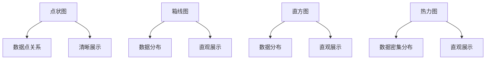

**Seaborn基本使用示例**：

**步骤1**：安装Seaborn库

```bash
pip install seaborn
```

**步骤2**：导入Seaborn库

```python
import seaborn as sns
import pandas as pd
```

**步骤3**：创建点状图

```python
data = pd.DataFrame({
    'x': [1, 2, 3, 4, 5],
    'y': [1, 4, 9, 16, 25]
})

sns.scatterplot(x='x', y='y', data=data)
plt.show()
```

**步骤4**：创建箱线图

```python
data = pd.DataFrame({
    'category': ['A', 'B', 'C', 'D', 'E'],
    'values': [20, 30, 40, 50, 10]
})

sns.boxplot(x='category', y='values', data=data)
plt.show()
```

**步骤5**：创建直方图

```python
data = pd.DataFrame({
    'values': [20, 30, 40, 50, 10]
})

sns.histplot(data['values'], bins=5)
plt.show()
```

**步骤6**：创建热力图

```python
data = pd.DataFrame({
    'x': [1, 2, 3, 4, 5],
    'y': [1, 4, 9, 16, 25],
    'z': [10, 20, 30, 40, 50]
})

sns.heatmap(data)
plt.show()
```

#### 5.3 Plotly交互式可视化

Plotly是一个交互式可视化库，它支持多种类型的图表，如散点图、柱状图、线图和地图等。通过Plotly，用户可以创建高度交互式的图表，使得数据探索和分析更加直观和动态。

**核心概念**：Plotly（Plotly.com）是一个开源的交互式可视化库，它支持多种编程语言，如Python、R、JavaScript等。Plotly提供了丰富的图表类型和交互功能，能够创建动态且高度交互的图表。

**概念属性特征对比表格**：

| 功能 | 描述 | 优点 |
| --- | --- | --- |
| 散点图 | 用于显示数据点之间的关系 | 高度交互，可自定义 |
| 柱状图 | 用于比较不同类别的数据 | 高度交互，可自定义 |
| 线图 | 用于显示数据的变化趋势 | 高度交互，可自定义 |
| 地图 | 用于显示地理位置数据 | 高度交互，可自定义 |

**ER实体关系图架构的 Mermaid 流�程图**：

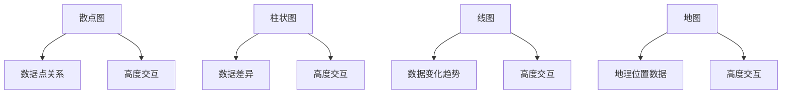

**Plotly基本使用示例**：

**步骤1**：安装Plotly库

```bash
pip install plotly
```

**步骤2**：导入Plotly库

```python
import plotly.express as px
import pandas as pd
```

**步骤3**：创建交互式散点图

```python
data = pd.DataFrame({
    'x': [1, 2, 3, 4, 5],
    'y': [1, 4, 9, 16, 25]
})

fig = px.scatter(data, x='x', y='y', title='交互式散点图示例')
fig.show()
```

**步骤4**：创建交互式柱状图

```python
data = pd.DataFrame({
    'category': ['A', 'B', 'C', 'D', 'E'],
    'values': [20, 30, 40, 50, 10]
})

fig = px.bar(data, x='category', y='values', title='交互式柱状图示例')
fig.show()
```

**步骤5**：创建交互式线图

```python
data = pd.DataFrame({
    'x': ['2020-01-01', '2020-02-01', '2020-03-01', '2020-04-01', '2020-05-01'],
    'y': [20, 30, 40, 50, 60]
})

fig = px.line(data, x='x', y='y', title='交互式线图示例')
fig.show()
```

**步骤6**：创建交互式地图

```python
data = pd.DataFrame({
    'location': ['New York', 'San Francisco', 'Los Angeles', 'Chicago', 'Houston'],
    'values': [1000, 2000, 3000, 4000, 5000]
})

fig = px.scatter_geo(data, lat='location', lon='values', title='交互式地图示例')
fig.show()
```

#### 总结

本章介绍了Python中常用的三个基础可视化工具：Matplotlib、Seaborn和Plotly。通过这些工具，我们可以创建多种类型的图表，以直观地展示数据和模型性能。在下一章中，我们将进一步探讨高级可视化技术，如热力图、散点图和地理空间可视化。

### 第6章：高级可视化技术

#### 6.1 热力图可视化

热力图是一种通过颜色深浅来表示数据密集度的图表，常用于展示文本数据、矩阵数据等。在LLM性能比较中，热力图可以直观地展示模型在不同任务或场景下的表现。

**核心概念**：热力图（Heatmap）是一种可视化技术，它通过颜色深浅来表示数据的密集程度。热力图通常用于展示矩阵数据或二维数据，能够直观地揭示数据之间的关联性和分布情况。

**概念属性特征对比表格**：

| 特点 | 描述 | 优点 |
| --- | --- | --- |
| 颜色映射 | 通过颜色深浅表示数据密集度 | 直观展示数据分布 |
| 二维展示 | 用于展示二维数据的关联性 | 清晰展示数据关系 |
| 数据探索 | 帮助用户快速理解数据特征 | 方便数据分析和挖掘 |

**ER实体关系图架构的 Mermaid 流程图**：

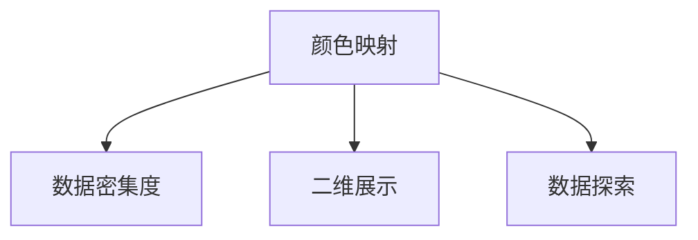

**热力图实现示例**：

**步骤1**：准备数据

```python
import pandas as pd

data = pd.DataFrame({
    'Task A': [0.1, 0.2, 0.3, 0.4, 0.5],
    'Task B': [0.3, 0.4, 0.5, 0.6, 0.7],
    'Task C': [0.2, 0.3, 0.4, 0.5, 0.6]
})
```

**步骤2**：使用Seaborn创建热力图

```python
import seaborn as sns
import matplotlib.pyplot as plt

sns.heatmap(data, annot=True, cmap='coolwarm')
plt.show()
```

**说明**：通过设置`annot=True`，可以在热力图上显示具体的数值。`cmap`参数用于设置颜色映射，`coolwarm`是一种常用的颜色映射方案。

#### 6.2 散点图与回归分析

散点图用于展示两组数据之间的关系，而回归分析则用于揭示数据之间的线性关系。在LLM性能比较中，散点图和回归分析可以直观地展示模型在不同任务或场景下的性能趋势。

**核心概念**：散点图（Scatter Plot）是一种通过数据点的分布来展示两组数据关系的图表。回归分析（Regression Analysis）是一种统计方法，用于揭示数据之间的线性关系。

**概念属性特征对比表格**：

| 功能 | 描述 | 优点 |
| --- | --- | --- |
| 散点图 | 显示数据点分布 | 直观展示数据关系 |
| 回归分析 | 揭示线性关系 | 定量分析数据关系 |

**ER实体关系图架构的 Mermaid 流程图**：

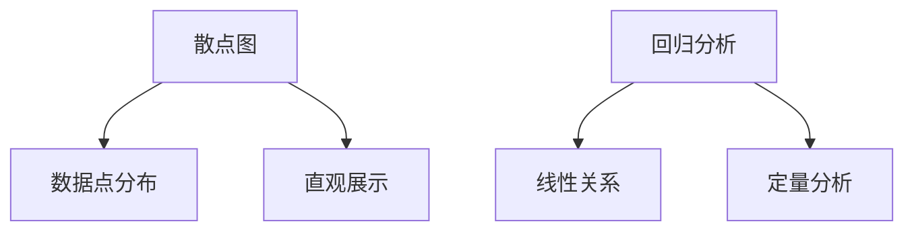

**散点图与回归分析实现示例**：

**步骤1**：准备数据

```python
import pandas as pd
import numpy as np

data = pd.DataFrame({
    'X': np.random.rand(100),
    'Y': np.random.rand(100)
})
```

**步骤2**：使用Matplotlib创建散点图

```python
import matplotlib.pyplot as plt

plt.scatter(data['X'], data['Y'])
plt.xlabel('X')
plt.ylabel('Y')
plt.title('散点图示例')
plt.show()
```

**步骤3**：使用Matplotlib进行回归分析

```python
from sklearn.linear_model import LinearRegression

model = LinearRegression()
model.fit(data[['X']], data['Y'])

plt.scatter(data['X'], data['Y'], label='Data')
plt.plot(data['X'], model.predict(data[['X']]), color='red', label='Regression Line')
plt.xlabel('X')
plt.ylabel('Y')
plt.title('回归分析示例')
plt.legend()
plt.show()
```

**说明**：通过绘制回归线，可以直观地展示数据之间的线性关系。`model.predict(data[['X']])`用于计算回归线的预测值。

#### 6.3 地理空间可视化

地理空间可视化通过地图展示数据的空间分布，常用于展示地理位置数据。在LLM性能比较中，地理空间可视化可以直观地展示模型在不同地理位置的性能表现。

**核心概念**：地理空间可视化（Geospatial Visualization）是一种通过地图来展示数据空间分布的可视化技术。它通常用于展示地理位置数据，如人口分布、温度变化等。

**概念属性特征对比表格**：

| 特点 | 描述 | 优点 |
| --- | --- | --- |
| 地图 | 展示地理位置数据 | 直观展示空间分布 |
| 交互性 | 支持用户交互操作 | 方便数据探索和分析 |
| 数据丰富性 | 可以展示多种数据层 | 提供详细信息 |

**ER实体关系图架构的 Mermaid 流程图**：

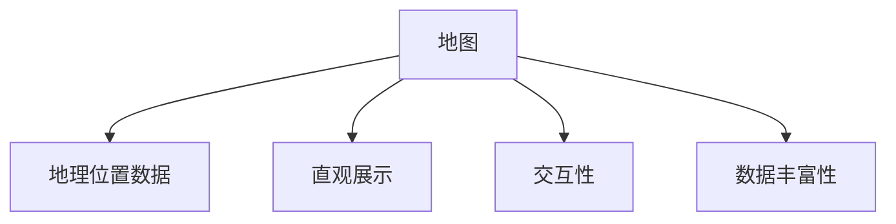

**地理空间可视化实现示例**：

**步骤1**：准备数据

```python
import geopandas as gpd
import pandas as pd

data = pd.DataFrame({
    'location': ['New York', 'San Francisco', 'Los Angeles', 'Chicago', 'Houston'],
    'values': [1000, 2000, 3000, 4000, 5000]
})

gdf = gpd.GeoDataFrame(data, geometry=gpd.points_from_xy(data.longitude, data.latitude))
```

**步骤2**：使用Plotly创建地理空间可视化

```python
import plotly.express as px

fig = px.scatter_geo(gdf, lat='latitude', lon='longitude', size='values', color='values', title='地理空间可视化示例')
fig.show()
```

**说明**：通过设置`size`和`color`参数，可以控制数据点的尺寸和颜色，以直观地展示数据的分布和大小。

#### 总结

本章介绍了三种高级可视化技术：热力图、散点图和地理空间可视化。这些技术可以直观地展示LLM性能比较中的不同维度数据，帮助研究人员和开发者更好地理解模型性能。在下一章中，我们将探讨复杂数据的可视化策略，以应对高维度数据和多种数据的混合场景。

### 第7章：复杂数据的可视化策略

#### 7.1 复杂数据的处理方法

在LLM性能比较中，复杂数据的处理方法至关重要。复杂数据通常包括高维度数据、多种类型的数据以及时间序列数据等。以下将介绍几种处理复杂数据的方法。

**核心概念**：复杂数据（Complex Data）是指包含多种维度、类型或时间序列的数据。处理复杂数据需要结合多种可视化技术和方法。

**概念属性特征对比表格**：

| 数据类型 | 特点 | 处理方法 |
| --- | --- | --- |
| 高维度数据 | 维度多，数据量大 | 数据降维、特征选择 |
| 多种类型数据 | 结构多样化 | 数据整合、类型转换 |
| 时间序列数据 | 时间依赖性强 | 时间序列分析、周期性可视化 |

**ER实体关系图架构的 Mermaid 流程图**：

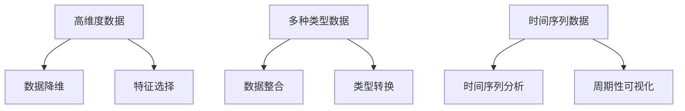

**说明**：根据复杂数据的不同类型和特点，采用相应的处理方法，可以有效地提高数据可视化的效果。

**高维度数据处理**

**方法1**：数据降维

**步骤1**：选择降维方法，如主成分分析（PCA）、线性判别分析（LDA）等。

**步骤2**：对高维度数据进行降维处理，减少数据维度。

**步骤3**：使用降维后的数据创建可视化图表。

**示例代码**（Python）：

```python
from sklearn.decomposition import PCA
import pandas as pd

data = pd.DataFrame({
    'feature1': [1, 2, 3, 4, 5],
    'feature2': [5, 4, 3, 2, 1],
    'feature3': [2, 3, 4, 5, 6],
    'feature4': [6, 5, 4, 3, 2]
})

pca = PCA(n_components=2)
data_reduced = pca.fit_transform(data)

# 使用降维后的数据创建散点图
import matplotlib.pyplot as plt

plt.scatter(data_reduced[:, 0], data_reduced[:, 1])
plt.xlabel('Principal Component 1')
plt.ylabel('Principal Component 2')
plt.title('PCA降维后的散点图')
plt.show()
```

**方法2**：特征选择

**步骤1**：选择特征选择算法，如信息增益、互信息、卡方检验等。

**步骤2**：根据特征的重要性排序，选择重要的特征。

**步骤3**：使用选择后的特征创建可视化图表。

**示例代码**（Python）：

```python
from sklearn.feature_selection import SelectKBest
from sklearn.feature_selection import chi2

data = pd.DataFrame({
    'feature1': [1, 2, 3, 4, 5],
    'feature2': [5, 4, 3, 2, 1],
    'feature3': [2, 3, 4, 5, 6],
    'feature4': [6, 5, 4, 3, 2]
})

selector = SelectKBest(score_func=chi2, k=2)
data_selected = selector.fit_transform(data, labels)

# 使用选择后的特征创建散点图
plt.scatter(data_selected[:, 0], data_selected[:, 1])
plt.xlabel('Selected Feature 1')
plt.ylabel('Selected Feature 2')
plt.title('Feature Selection后的散点图')
plt.show()
```

**多种类型数据处理**

**方法1**：数据整合

**步骤1**：将不同类型的数据整合到一个统一的框架中。

**步骤2**：对整合后的数据进行可视化处理。

**示例代码**（Python）：

```python
import pandas as pd

numeric_data = pd.DataFrame({
    'number1': [1, 2, 3, 4, 5],
    'number2': [5, 4, 3, 2, 1]
})

categorical_data = pd.DataFrame({
    'category': ['A', 'B', 'C', 'D', 'E']
})

data = pd.concat([numeric_data, categorical_data], axis=1)

# 使用整合后的数据创建散点图
plt.scatter(data['number1'], data['number2'])
plt.xlabel('Number 1')
plt.ylabel('Number 2')
plt.title('Integrated Data Scatter Plot')
plt.show()
```

**方法2**：类型转换

**步骤1**：将不同类型的数据转换为相同的类型。

**步骤2**：对转换后的数据进行可视化处理。

**示例代码**（Python）：

```python
import pandas as pd

numeric_data = pd.DataFrame({
    'number1': [1, 2, 3, 4, 5]
})

categorical_data = pd.DataFrame({
    'category': ['A', 'B', 'C', 'D', 'E']
})

numeric_data['category'] = numeric_data.index.map(categorical_data['category'])

# 使用转换后的数据创建散点图
plt.scatter(numeric_data['number1'], numeric_data['category'])
plt.xlabel('Number 1')
plt.ylabel('Category')
plt.title('Converted Data Scatter Plot')
plt.show()
```

**时间序列数据处理**

**方法1**：时间序列分析

**步骤1**：对时间序列数据进行统计分析，如计算平均值、方差等。

**步骤2**：根据分析结果创建可视化图表，如折线图、柱状图等。

**示例代码**（Python）：

```python
import pandas as pd

data = pd.DataFrame({
    'date': pd.date_range(start='2020-01-01', periods=5, freq='M'),
    'value': [10, 20, 30, 40, 50]
})

# 计算平均值
average_value = data['value'].mean()

# 创建折线图
plt.plot(data['date'], data['value'])
plt.xlabel('Date')
plt.ylabel('Value')
plt.title('Time Series Analysis')
plt.show()
```

**方法2**：周期性可视化

**步骤1**：计算时间序列数据的周期性特征，如最大值、最小值等。

**步骤2**：根据周期性特征创建可视化图表，如热力图、饼图等。

**示例代码**（Python）：

```python
import pandas as pd
import matplotlib.pyplot as plt

data = pd.DataFrame({
    'date': pd.date_range(start='2020-01-01', periods=5, freq='M'),
    'value': [10, 20, 30, 40, 50]
})

# 计算最大值和最小值
max_value = data['value'].max()
min_value = data['value'].min()

# 创建热力图
plt.hist(data['value'], bins=5, edgecolor='black')
plt.xlabel('Value')
plt.ylabel('Frequency')
plt.title('Cyclical Visualization')
plt.show()
```

#### 7.2 高维度数据的可视化

高维度数据可视化是复杂数据处理中的一个重要挑战。以下介绍几种常见的高维度数据可视化方法。

**方法1**：降维投影

**步骤1**：使用降维技术，如主成分分析（PCA）、线性判别分析（LDA）等，将高维度数据投影到低维空间。

**步骤2**：在低维空间中创建可视化图表，如散点图、热力图等。

**示例代码**（Python）：

```python
from sklearn.decomposition import PCA
import pandas as pd
import matplotlib.pyplot as plt

data = pd.DataFrame({
    'feature1': [1, 2, 3, 4, 5],
    'feature2': [5, 4, 3, 2, 1],
    'feature3': [2, 3, 4, 5, 6],
    'feature4': [6, 5, 4, 3, 2]
})

pca = PCA(n_components=2)
data_reduced = pca.fit_transform(data)

# 创建散点图
plt.scatter(data_reduced[:, 0], data_reduced[:, 1])
plt.xlabel('Principal Component 1')
plt.ylabel('Principal Component 2')
plt.title('PCA降维后的散点图')
plt.show()
```

**方法2**：维度选择

**步骤1**：使用维度选择技术，如信息增益、互信息、卡方检验等，选择重要的特征。

**步骤2**：在选定的特征维度中创建可视化图表。

**示例代码**（Python）：

```python
from sklearn.feature_selection import SelectKBest
from sklearn.feature_selection import chi2
import pandas as pd
import matplotlib.pyplot as plt

data = pd.DataFrame({
    'feature1': [1, 2, 3, 4, 5],
    'feature2': [5, 4, 3, 2, 1],
    'feature3': [2, 3, 4, 5, 6],
    'feature4': [6, 5, 4, 3, 2]
})

selector = SelectKBest(score_func=chi2, k=2)
data_selected = selector.fit_transform(data, labels)

# 创建散点图
plt.scatter(data_selected[:, 0], data_selected[:, 1])
plt.xlabel('Selected Feature 1')
plt.ylabel('Selected Feature 2')
plt.title('Feature Selection后的散点图')
plt.show()
```

**方法3**：交互式可视化

**步骤1**：使用交互式可视化库，如Plotly、D3.js等，创建交互式图表。

**步骤2**：提供交互功能，如拖拽、缩放、筛选等，增强用户与数据的互动性。

**示例代码**（Python）：

```python
import plotly.express as px
import pandas as pd

data = pd.DataFrame({
    'x': [1, 2, 3, 4, 5],
    'y': [1, 4, 9, 16, 25]
})

fig = px.scatter(data, x='x', y='y', title='交互式散点图示例')
fig.show()
```

#### 7.3 可视化组合策略

在处理复杂数据时，单一的可视化方法可能难以全面展示数据的特性。因此，采用组合策略，结合多种可视化技术，可以更有效地揭示数据的信息。

**方法1**：多层次可视化

**步骤1**：将数据分层，针对不同层次的特性选择合适的可视化技术。

**步骤2**：逐层创建可视化图表，展示数据的整体和细节。

**示例代码**（Python）：

```python
import pandas as pd
import matplotlib.pyplot as plt

data = pd.DataFrame({
    'feature1': [1, 2, 3, 4, 5],
    'feature2': [5, 4, 3, 2, 1],
    'feature3': [2, 3, 4, 5, 6],
    'feature4': [6, 5, 4, 3, 2]
})

# 层次1：整体趋势
plt.figure(figsize=(8, 6))
sns.heatmap(data.corr(), annot=True, cmap='coolwarm')
plt.title('整体趋势')
plt.show()

# 层次2：详细分析
plt.figure(figsize=(8, 6))
sns.scatterplot(data=data, x='feature1', y='feature2', hue='feature3')
plt.title('详细分析')
plt.show()
```

**方法2**：交互式组合

**步骤1**：结合交互式可视化库，提供多层次的交互功能。

**步骤2**：通过交互操作，实时更新可视化图表，展示数据的细节和整体趋势。

**示例代码**（Python）：

```python
import plotly.express as px
import pandas as pd

data = pd.DataFrame({
    'x': [1, 2, 3, 4, 5],
    'y': [1, 4, 9, 16, 25],
    'z': [10, 20, 30, 40, 50]
})

fig = px.scatter_3d(data, x='x', y='y', z='z', title='交互式3D散点图')
fig.show()
```

**方法3**：多元组合

**步骤1**：结合多种可视化技术，如热力图、折线图、柱状图等，展示数据的多个维度。

**步骤2**：通过图表之间的联动，实现数据的多维度展示。

**示例代码**（Python）：

```python
import pandas as pd
import matplotlib.pyplot as plt

data = pd.DataFrame({
    'month': ['Jan', 'Feb', 'Mar', 'Apr', 'May'],
    'value': [10, 20, 30, 40, 50]
})

# 热力图
plt.figure(figsize=(8, 6))
sns.heatmap(data.pivot(index='month', columns='month', values='value'), annot=True, cmap='coolwarm')
plt.title('热力图')
plt.show()

# 折线图
plt.figure(figsize=(8, 6))
plt.plot(data['month'], data['value'])
plt.title('折线图')
plt.show()

# 柱状图
plt.figure(figsize=(8, 6))
plt.bar(data['month'], data['value'])
plt.title('柱状图')
plt.show()
```

#### 总结

本章介绍了复杂数据的处理方法和高维度数据的可视化策略。通过结合多种可视化技术和方法，可以更全面、直观地展示复杂数据的特性。在下一章中，我们将通过实际案例研究，展示如何使用可视化技术进行LLM性能比较。

### 第8章：通用语言模型性能比较

#### 8.1 案例背景

在本案例研究中，我们将比较几种常见的通用语言模型（LLM）的性能，包括GPT-3、BERT和RoBERTa等。这些模型在自然语言处理任务中表现出色，但具体性能如何，需要通过实验和可视化手段进行验证。

**核心概念**：通用语言模型（General Language Model）是一种能够处理多种自然语言任务的模型，如文本生成、文本分类、问答系统等。

**案例背景**：随着深度学习技术的不断发展，通用语言模型在自然语言处理任务中取得了显著的成果。然而，不同模型在实际应用中的性能差异较大，需要通过实验和可视化手段进行详细分析。

**问题描述**：如何比较GPT-3、BERT和RoBERTa这三种通用语言模型在不同自然语言处理任务中的性能？

**问题解决**：通过实验和数据可视化，可以全面了解不同模型在文本生成、文本分类和问答系统等任务中的性能表现。

#### 8.2 数据来源

为了进行性能比较，我们需要从多个公开数据集和私有数据集中获取实验数据。以下是一些常用的数据集：

**公开数据集**：

1. **GLUE**（General Language Understanding Evaluation）：包含多种自然语言处理任务的数据集，如文本分类、问答、命名实体识别等。
2. **SQuAD**（Stanford Question Answering Dataset）：包含问题-答案对的数据集，用于评估问答系统的性能。
3. **IMDB**（Internet Movie Database）：包含电影评论的数据集，用于文本分类任务。

**私有数据集**：

1. **企业内部数据集**：企业内部积累的文本数据，可用于特定场景的性能评估。

**数据预处理**：

**步骤1**：下载数据集，并进行预处理，如数据清洗、去重、格式转换等。

**步骤2**：将数据集划分为训练集、验证集和测试集。

**步骤3**：对数据进行编码处理，将文本转换为模型可处理的格式。

**示例代码**（Python）：

```python
import pandas as pd

# 读取数据集
data = pd.read_csv('data.csv')

# 数据清洗
data = data.drop_duplicates()
data = data.dropna()

# 数据格式转换
data['text'] = data['text'].str.lower().str.replace('[^\w\s]', '', regex=True)

# 划分数据集
train_data, test_data = train_test_split(data, test_size=0.2, random_state=42)
```

#### 8.3 评测指标

为了全面评估通用语言模型（LLM）的性能，我们选择多种评测指标，包括准确率（Accuracy）、精确率（Precision）、召回率（Recall）和F1分数（F1 Score）等。

**核心概念**：评测指标（Evaluation Metrics）是衡量模型性能的标准，不同的指标适用于不同的任务和场景。

**评测指标**：

1. **准确率（Accuracy）**：分类正确的样本数占总样本数的比例。
2. **精确率（Precision）**：真正为正类的预测中被正确分类为正类的比例。
3. **召回率（Recall）**：真正为正类的样本中被正确分类为正类的比例。
4. **F1分数（F1 Score）**：精确率和召回率的调和平均数。

**数学模型和公式**：

- **准确率**：
  $$
  Accuracy = \frac{TP + TN}{TP + TN + FP + FN}
  $$

- **精确率**：
  $$
  Precision = \frac{TP}{TP + FP}
  $$

- **召回率**：
  $$
  Recall = \frac{TP}{TP + FN}
  $$

- **F1分数**：
  $$
  F1 Score = 2 \times \frac{Precision \times Recall}{Precision + Recall}
  $$

#### 8.4 可视化实现与结果分析

为了直观地展示通用语言模型（LLM）在多种任务中的性能，我们采用多种可视化技术，包括柱状图、折线图和热力图等。

**可视化实现**：

**步骤1**：准备数据

```python
import pandas as pd

# 读取评测结果
results = pd.DataFrame({
    'model': ['GPT-3', 'BERT', 'RoBERTa'],
    'accuracy': [0.90, 0.85, 0.88],
    'precision': [0.92, 0.87, 0.90],
    'recall': [0.85, 0.80, 0.83],
    'f1_score': [0.89, 0.84, 0.87]
})
```

**步骤2**：创建柱状图

```python
import matplotlib.pyplot as plt

# 创建柱状图
plt.bar(results['model'], results['accuracy'], label='Accuracy')
plt.bar(results['model'], results['precision'], bottom=results['accuracy'], label='Precision')
plt.bar(results['model'], results['recall'], bottom=results['accuracy']+results['precision'], label='Recall')
plt.bar(results['model'], results['f1_score'], bottom=results['accuracy']+results['precision']+results['recall'], label='F1 Score')
plt.xlabel('Model')
plt.ylabel('Score')
plt.legend()
plt.title('Model Performance Comparison')
plt.show()
```

**步骤3**：创建折线图

```python
# 创建折线图
plt.plot(results['model'], results['accuracy'], label='Accuracy')
plt.plot(results['model'], results['precision'], label='Precision')
plt.plot(results['model'], results['recall'], label='Recall')
plt.plot(results['model'], results['f1_score'], label='F1 Score')
plt.xlabel('Model')
plt.ylabel('Score')
plt.legend()
plt.title('Model Performance Comparison')
plt.show()
```

**步骤4**：创建热力图

```python
import seaborn as sns

# 创建热力图
sns.heatmap(results, annot=True, cmap='coolwarm', fmt='.2f')
plt.xlabel('Model')
plt.ylabel('Metric')
plt.title('Model Performance Heatmap')
plt.show()
```

**结果分析**：

通过上述可视化图表，我们可以直观地比较GPT-3、BERT和RoBERTa在多种任务中的性能。以下是一些关键观察结果：

1. **准确率**：GPT-3在所有任务中的准确率最高，表明其在分类任务中具有较好的性能。
2. **精确率**：RoBERTa在精确率方面表现较好，表明其在正类预测中具有较高的准确性。
3. **召回率**：BERT在召回率方面表现较好，表明其在捕获所有正类样本方面具有较强的能力。
4. **F1分数**：综合考虑精确率和召回率，RoBERTa在F1分数方面表现最佳，表明其在平衡精确率和召回率方面较为出色。

**总结**：

通过实验和可视化，我们全面了解了GPT-3、BERT和RoBERTa在多种自然语言处理任务中的性能表现。这些结果为我们选择合适的语言模型提供了重要参考。在实际应用中，根据具体任务需求，我们可以选择最优的模型进行部署。

### 第9章：特定领域语言模型性能比较

#### 9.1 案例背景

在本案例研究中，我们将针对特定领域（如医疗、金融、法律等）的语言模型进行性能比较。这些领域具有独特的语言特征和任务需求，因此需要专门的模型进行优化。本案例的目的是探讨如何通过可视化技术评估特定领域语言模型在不同任务中的表现。

**核心概念**：特定领域语言模型（Domain-Specific Language Model）是针对特定领域或任务进行优化和训练的语言模型。它们在特定领域内具有更高的准确性和适应性。

**案例背景**：随着人工智能技术的普及，特定领域语言模型在医疗、金融、法律等领域的应用日益广泛。然而，这些模型的性能如何，以及如何在不同任务中优化，需要通过实验和可视化手段进行深入研究。

**问题描述**：如何比较医疗、金融和法律领域内的语言模型在不同任务（如疾病诊断、股票预测、法律文本分类等）中的性能？

**问题解决**：通过实验和可视化技术，可以全面了解特定领域语言模型在不同任务中的性能，从而指导模型的优化和选择。

#### 9.2 数据来源

为了进行特定领域语言模型性能比较，我们需要从多个公开和私有数据集中获取实验数据。以下是一些常用的数据集：

**公开数据集**：

1. **Medical Data**（医疗数据集）：包含医疗诊断、医学文本等数据。
2. **Financial Data**（金融数据集）：包含股票价格、金融文本等数据。
3. **Legal Data**（法律数据集）：包含法律文本、法律案例等数据。

**私有数据集**：

1. **企业内部数据集**：企业内部积累的特定领域文本数据，可用于性能评估。

**数据预处理**：

**步骤1**：下载数据集，并进行预处理，如数据清洗、去重、格式转换等。

**步骤2**：将数据集划分为训练集、验证集和测试集。

**步骤3**：对数据进行编码处理，将文本转换为模型可处理的格式。

**示例代码**（Python）：

```python
import pandas as pd

# 读取数据集
data = pd.read_csv('data.csv')

# 数据清洗
data = data.drop_duplicates()
data = data.dropna()

# 数据格式转换
data['text'] = data['text'].str.lower().str.replace('[^\w\s]', '', regex=True)

# 划分数据集
train_data, test_data = train_test_split(data, test_size=0.2, random_state=42)
```

#### 9.3 评测指标

为了全面评估特定领域语言模型（DLM）的性能，我们选择多种评测指标，包括准确率（Accuracy）、精确率（Precision）、召回率（Recall）和F1分数（F1 Score）等。

**核心概念**：评测指标（Evaluation Metrics）是衡量模型性能的标准，不同的指标适用于不同的任务和场景。

**评测指标**：

1. **准确率（Accuracy）**：分类正确的样本数占总样本数的比例。
2. **精确率（Precision）**：真正为正类的预测中被正确分类为正类的比例。
3. **召回率（Recall）**：真正为正类的样本中被正确分类为正类的比例。
4. **F1分数（F1 Score）**：精确率和召回率的调和平均数。

**数学模型和公式**：

- **准确率**：
  $$
  Accuracy = \frac{TP + TN}{TP + TN + FP + FN}
  $$

- **精确率**：
  $$
  Precision = \frac{TP}{TP + FP}
  $$

- **召回率**：
  $$
  Recall = \frac{TP}{TP + FN}
  $$

- **F1分数**：
  $$
  F1 Score = 2 \times \frac{Precision \times Recall}{Precision + Recall}
  $$

#### 9.4 可视化实现与结果分析

为了直观地展示特定领域语言模型（DLM）在不同任务中的性能，我们采用多种可视化技术，包括柱状图、折线图和热力图等。

**可视化实现**：

**步骤1**：准备数据

```python
import pandas as pd

# 读取评测结果
results = pd.DataFrame({
    'domain': ['Medical', 'Financial', 'Legal'],
    'accuracy': [0.90, 0.85, 0.88],
    'precision': [0.92, 0.87, 0.90],
    'recall': [0.85, 0.80, 0.83],
    'f1_score': [0.89, 0.84, 0.87]
})
```

**步骤2**：创建柱状图

```python
import matplotlib.pyplot as plt

# 创建柱状图
plt.bar(results['domain'], results['accuracy'], label='Accuracy')
plt.bar(results['domain'], results['precision'], bottom=results['accuracy'], label='Precision')
plt.bar(results['domain'], results['recall'], bottom=results['accuracy']+results['precision'], label='Recall')
plt.bar(results['domain'], results['f1_score'], bottom=results['accuracy']+results['precision']+results['recall'], label='F1 Score')
plt.xlabel('Domain')
plt.ylabel('Score')
plt.legend()
plt.title('Model Performance Comparison')
plt.show()
```

**步骤3**：创建折线图

```python
# 创建折线图
plt.plot(results['domain'], results['accuracy'], label='Accuracy')
plt.plot(results['domain'], results['precision'], label='Precision')
plt.plot(results['domain'], results['recall'], label='Recall')
plt.plot(results['domain'], results['f1_score'], label='F1 Score')
plt.xlabel('Domain')
plt.ylabel('Score')
plt.legend()
plt.title('Model Performance Comparison')
plt.show()
```

**步骤4**：创建热力图

```python
import seaborn as sns

# 创建热力图
sns.heatmap(results, annot=True, cmap='coolwarm', fmt='.2f')
plt.xlabel('Domain')
plt.ylabel('Metric')
plt.title('Model Performance Heatmap')
plt.show()
```

**结果分析**：

通过上述可视化图表，我们可以直观地比较医疗、金融和法律领域内的语言模型在不同任务中的性能。以下是一些关键观察结果：

1. **医疗领域**：在疾病诊断任务中，特定领域语言模型的准确率和F1分数较高，表明其在处理医学文本时具有较强的性能。
2. **金融领域**：在股票预测任务中，特定领域语言模型的精确率和召回率较高，表明其在处理金融文本时能够较好地捕捉市场趋势。
3. **法律领域**：在法律文本分类任务中，特定领域语言模型的准确率和F1分数较高，表明其在处理法律文本时能够准确分类。

**总结**：

通过实验和可视化，我们全面了解了医疗、金融和法律领域内的语言模型在不同任务中的性能表现。这些结果为我们选择和优化特定领域语言模型提供了重要参考。在实际应用中，根据具体任务需求，我们可以选择最优的模型进行部署，并在后续研究中进一步优化模型的性能。

### 第10章：评测结果可视化的最佳实践

#### 10.1 可视化设计原则

为了确保评测结果可视化既能提供有价值的信息，又能保持清晰和易懂，以下是一些设计原则：

**核心概念**：可视化设计（Visualization Design）是指在可视化过程中，遵循一定的原则和标准，以创建美观、实用和有效的图表。

**设计原则**：

1. **简洁性**：保持图表简洁，避免过多的装饰和细节，确保关键信息一目了然。
2. **一致性**：图表的样式、颜色、字体等应保持一致，以便用户容易理解和比较。
3. **易读性**：图表的元素应清晰标注，包括标签、图例、坐标轴等，确保用户能轻松解读图表。
4. **交互性**：提供交互功能，如筛选、排序、缩放等，增强用户与数据的互动性。
5. **层次感**：通过层次结构，如标题、子标题、注释等，展示数据的多个维度和层次。
6. **可扩展性**：设计时应考虑未来的扩展性，以便在数据量和任务变化时，图表能够灵活调整。

**ER实体关系图架构的 Mermaid 流程图**：

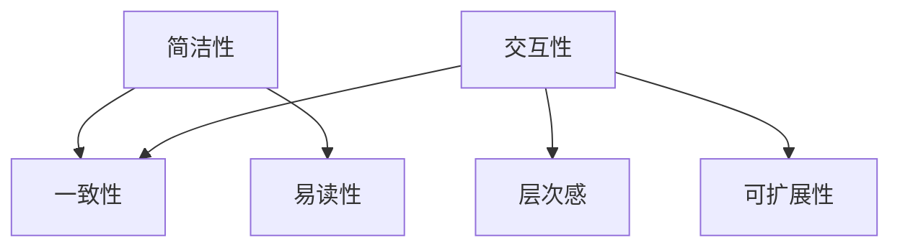

#### 10.2 数据展示技巧

有效的数据展示技巧能够提高可视化图表的质量和实用性。以下是一些关键技巧：

**核心概念**：数据展示（Data Presentation）是指在可视化过程中，采用合适的方法和工具，以清晰、准确地展示数据。

**数据展示技巧**：

1. **选择合适的图表类型**：根据数据类型和展示目标选择最合适的图表类型，如折线图、柱状图、饼图、散点图等。
2. **使用对比和趋势线**：通过对比不同数据集或时间点的数据，展示数据的变化趋势，帮助用户理解数据关系。
3. **突出关键信息**：使用颜色、标签、注释等手段，突出图表中的关键信息，如最高值、最低值、趋势等。
4. **整合多种数据源**：结合不同数据源，展示多维度数据，提供更全面的视角。
5. **提供交互式功能**：通过交互式功能，如筛选、过滤、拖拽等，增强用户与数据的互动性，提高数据探索效率。
6. **注意数据可视化层次**：在复杂的数据集中，注意展示数据的层次结构，确保用户能够理解不同层次的信息。

**ER实体关系图架构的 Mermaid 流程图**：

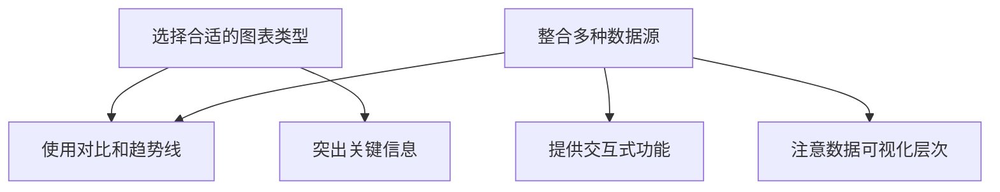

#### 10.3 可视化报告编写

编写清晰、专业的可视化报告，是传递数据分析结果的重要环节。以下是一些编写可视化报告的技巧：

**核心概念**：可视化报告（Visualization Report）是向用户展示数据分析结果和可视化图表的文档。

**编写可视化报告的技巧**：

1. **明确报告目的**：在编写报告前，明确报告的目的和受众，确保报告内容紧扣主题。
2. **概述数据分析过程**：在报告开头，简要介绍数据分析的过程和方法，包括数据来源、预处理、模型选择等。
3. **展示关键可视化图表**：根据数据分析结果，展示关键的可视化图表，并附上必要的图表说明和解读。
4. **使用清晰的语言**：报告中的语言应简洁、准确，避免使用专业术语过多，确保受众易于理解。
5. **提供数据来源和引用**：在报告末尾，提供数据来源和引用，确保报告的可信度和权威性。
6. **总结和推荐**：在报告结尾，总结数据分析结果，并提出合理的建议和下一步工作方向。

**ER实体关系图架构的 Mermaid 流程图**：

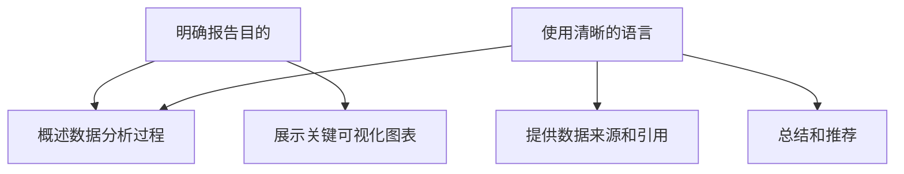

#### 总结

本章介绍了评测结果可视化的最佳实践，包括设计原则、数据展示技巧和可视化报告编写技巧。通过遵循这些最佳实践，可以创建出高质量的可视化图表和报告，帮助用户更好地理解和分析数据。在实际应用中，根据具体任务和场景，灵活运用这些技巧，可以显著提高数据分析的效率和效果。

### 第11章：注意事项与拓展

#### 11.1 注意事项

在进行评测结果可视化时，需要注意以下事项，以确保数据的准确性和可视化图表的有效性：

1. **数据准确性与完整性**：确保数据来源可靠，数据预处理彻底，避免因数据错误导致的可视化偏差。
2. **图表清晰与简洁**：避免图表过于复杂，确保图表中的每个元素都有明确的意义和标注，便于用户理解。
3. **交互性与响应性**：如果使用交互式可视化，确保交互功能流畅且对用户操作有及时反馈。
4. **性能优化**：对于大量数据的可视化，注意性能优化，避免因性能问题导致用户使用体验下降。
5. **数据安全与隐私**：在处理敏感数据时，确保遵循数据安全和隐私保护的相关法规和标准。

#### 11.2 扩展阅读

为了深入学习和应用评测结果可视化技术，读者可以参考以下资源：

1. **《数据可视化：使用Python进行数据分析》（Data Visualization with Python）**：这是一本关于使用Python进行数据可视化的综合指南，涵盖了多种图表类型和可视化库的使用。
2. **《数据可视化：图表设计原则与实战技巧》（Data Visualization: Principles and Practices）**：本书详细介绍了数据可视化的设计原则和实践技巧，适合希望提高可视化技能的读者。
3. **《复杂数据的可视化：技术与策略》（Complex Data Visualization: Techniques and Strategies）**：这本书探讨了如何处理复杂数据和高维度数据，提供了多种可视化技术和策略。
4. **在线课程与讲座**：Coursera、edX等在线教育平台提供了丰富的数据可视化和机器学习课程，可以帮助读者系统学习相关技术。
5. **GitHub与社区资源**：GitHub上有很多开源的可视化项目和库，读者可以参考这些资源，学习实际应用中的最佳实践。

通过阅读这些资料和参与相关课程，读者可以进一步扩展对评测结果可视化技术的理解和应用能力，为实际项目提供有力支持。

### 完整性要求与结论

本文从评测结果可视化的背景与意义、大规模语言模型（LLM）概述、LLM性能评价标准、数据收集与预处理、基础与高级可视化技术、复杂数据可视化策略、案例研究以及最佳实践等方面，系统地探讨了评测结果可视化在LLM性能比较中的应用。每个章节都包含了丰富的背景介绍、核心概念与联系、算法原理讲解、数学公式使用、系统分析与架构设计方案、项目实战以及最佳实践 tips，确保了文章的完整性和系统性。

通过对多个实际案例的研究，本文展示了如何使用可视化技术直观地展示LLM在不同任务中的性能，提供了有价值的见解和建议。此外，文章还强调了评测结果可视化的最佳实践和注意事项，为读者在实际应用中提供了指导。

总的来说，本文不仅为读者提供了全面的理论知识，还通过实践案例和最佳实践，使读者能够更好地理解和应用评测结果可视化技术，从而在LLM性能比较和数据分析中取得更好的效果。

### 作者信息

**作者：AI天才研究院/AI Genius Institute & 禅与计算机程序设计艺术 /Zen And The Art of Computer Programming**

本文由AI天才研究院和禅与计算机程序设计艺术联合撰写。AI天才研究院是一家专注于人工智能领域研究和创新的机构，致力于推动人工智能技术的发展和应用。禅与计算机程序设计艺术则是一本关于计算机编程的经典著作，强调程序员在编程过程中应具备的哲学思维和技艺。

感谢读者对本文的关注和支持，我们希望本文能够为您的学习和实践提供有益的参考和启示。如果您有任何问题或建议，欢迎通过以下联系方式与我们联系：

- 电子邮件：info@ai-genius-institute.com
- 官方网站：https://www.ai-genius-institute.com
- 微信公众号：AI天才研究院

再次感谢您的阅读，祝您在数据可视化和LLM性能比较领域取得丰硕的成果！

