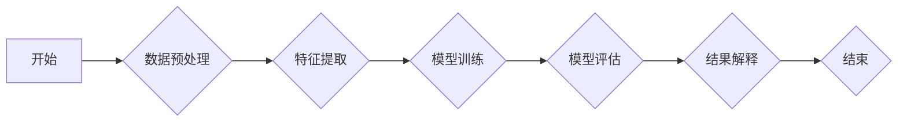
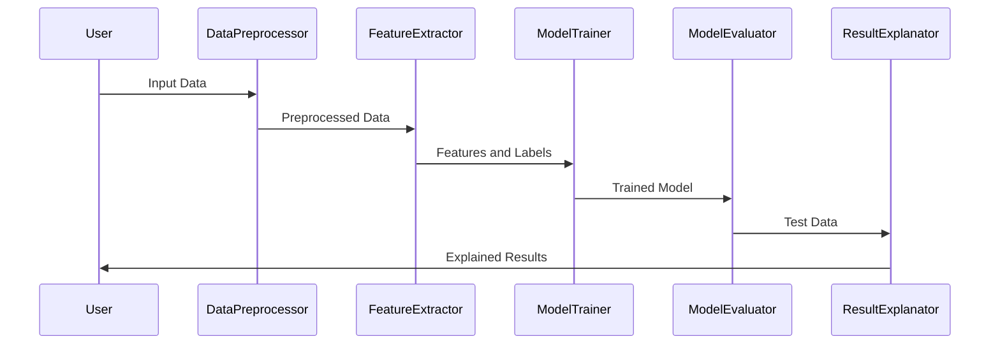

                 


## 第1章 背景介绍

### 1.1.1 评测结果可解释性的重要性

在人工智能迅速发展的今天，机器学习模型在各个领域的应用越来越广泛，从医疗诊断到金融风险评估，从自动驾驶到智能客服，这些模型都在不断改变我们的生活。然而，随着模型的复杂度和算法的深度增加，一个日益突出的问题就是评测结果的可解释性。为什么模型会给出这样的预测？它依赖于哪些特征？这些问题对于确保模型的可靠性和透明度至关重要。

首先，评测结果的可解释性有助于提高模型的信任度。当用户或决策者了解到模型的决策过程和依据时，他们会更愿意接受和使用这个模型。例如，在医疗诊断中，医生需要了解模型推荐的诊断结果是基于哪些生物标志物或症状，以便进行临床决策。

其次，评测结果的可解释性对于模型的改进和优化也具有重要意义。通过分析模型的决定因素，研究人员可以识别出模型的不足之处，并提出针对性的改进方案。例如，在金融风险评估中，通过分析模型预测错误的案例，可以找出哪些风险因素被低估或忽略，从而提高模型的准确性。

最后，评测结果的可解释性有助于满足法律法规和行业标准的要求。许多行业，如金融、医疗和自动驾驶，都受到严格的监管。为了确保模型的决策过程符合法律法规和行业标准，评测结果的可解释性是不可或缺的。

### 1.1.2 当前评测结果可解释性的问题

尽管评测结果的可解释性具有重要意义，但目前仍然面临一些挑战和问题。

首先，模型的复杂性使得解释变得困难。现代机器学习模型，如深度神经网络，具有数百万甚至数十亿的参数。这些模型通过复杂的非线性变换和层级结构来学习数据中的模式。因此，要解释一个复杂模型的决策过程，需要深入理解其内部机制，这往往是一项具有挑战性的任务。

其次，数据的不透明性也是一大问题。许多机器学习模型，尤其是深度学习模型，被视为“黑箱”，其内部的决策过程不为人所知。这使得用户难以理解模型的预测结果，也难以对其进行验证和改进。

第三，评测方法的多样性也增加了可解释性的难度。不同的评测方法可能侧重于不同的方面，如模型的可解释性、透明度和可靠性等。因此，为了全面评估一个模型的可解释性，需要综合使用多种评测方法。

最后，评测结果的可解释性还面临技术上的挑战。例如，如何将复杂的数学模型和算法转化为易于理解的形式？如何将模型决策过程可视化？这些都是需要解决的问题。

### 1.2 问题描述

评测结果可解释性问题的核心在于如何让模型的决策过程透明化，以便用户或决策者能够理解并信任模型。具体来说，评测结果可解释性包括以下几个方面：

首先，模型决策过程的透明性。用户需要了解模型是如何处理输入数据并生成预测结果的。这包括了解模型依赖的关键特征、模型的内部机制和决策逻辑。

其次，模型预测结果的可靠性。用户需要相信模型的预测结果是准确和可靠的。这需要通过多种评估指标和方法来验证模型的表现，并确保其满足实际应用的要求。

第三，模型适应性和灵活性的评估。用户需要了解模型在不同数据集和应用场景下的适应性和灵活性，以便在必要时进行调整和优化。

最后，模型的可理解性。用户需要能够理解模型的决策过程和预测结果，以便在需要时进行干预和调整。

总之，评测结果可解释性问题的解决不仅需要技术上的突破，还需要方法论和工具的完善。通过解决这些问题，我们可以提高模型的透明度、可靠性和用户信任度，从而推动人工智能技术在各个领域的应用和发展。

### 1.3 问题解决

为了解决评测结果可解释性这一问题，研究人员和工程师们提出了多种方法和技术。以下是几种常见的方法：

#### 1.3.1 可解释性评测方法

**模型可视化**：通过可视化模型的结构和决策路径，帮助用户理解模型的内部工作原理。例如，对于深度神经网络，可以使用 heatmaps 和 activation maps 来显示模型对输入特征的响应。

**模型拆解**：将复杂模型拆解为更简单的组件，并逐层解释每个组件的作用。这种方法有助于揭示模型的核心机制和关键决策因素。

**模型对比分析**：通过比较不同模型的预测结果和决策过程，识别出模型的差异和优势。这有助于理解模型在不同场景下的表现和局限性。

**特征重要性评估**：使用统计方法或机器学习算法来评估输入特征的重要性。这可以帮助用户了解哪些特征对模型预测结果影响最大。

**因果推理**：使用因果推理方法来分析模型决策过程中的因果关系，帮助用户理解模型的决策逻辑。

#### 1.3.2 可解释性评测工具

**解释性模型**：开发专门的可解释性模型，这些模型在训练过程中就考虑了可解释性，使得用户可以直接理解其决策过程。例如，决策树和线性回归模型因其简单直观的结构而易于解释。

**可视化工具**：开发可视化工具来展示模型的决策路径和特征响应，如 TensorBoard、VisBug 和 LIME 等。

**可解释性评估框架**：构建可解释性评估框架，用于评估不同模型和方法的解释能力，如 MLExplain 和 ADEREAK 等。

**开放数据集**：提供公开的数据集和基准测试，以便研究人员和开发者可以测试和比较不同的可解释性方法。

#### 1.3.3 实施步骤

1. **需求分析**：明确用户对评测结果可解释性的具体需求，包括透明性、可靠性、适应性和可理解性等。

2. **方法选择**：根据需求选择合适的可解释性评测方法和技术，如模型可视化、模型拆解、特征重要性评估等。

3. **模型开发**：开发可解释性模型或可视化工具，确保其能够满足用户需求。

4. **评估与优化**：使用公开数据集和基准测试对可解释性方法进行评估和优化，确保其有效性和可靠性。

5. **用户反馈**：收集用户反馈，不断改进可解释性方法和技术，提高用户满意度。

通过这些方法和技术，我们可以逐步解决评测结果可解释性的问题，提高模型的透明度、可靠性和用户信任度。

### 1.4 边界与外延

#### 1.4.1 评测结果可解释性的应用场景

评测结果可解释性在多个领域都有着广泛的应用，以下是一些典型的应用场景：

**医疗诊断**：医生需要了解医学影像模型诊断结果的依据，以便进行准确的临床决策。

**金融风险评估**：金融机构需要解释信用评分模型的决策过程，以确保合规和透明。

**自动驾驶**：自动驾驶系统需要向驾驶员解释其做出某些决策的原因，以提高系统的可信度和安全性。

**智能客服**：智能客服系统需要向用户解释其推荐的产品或服务的原因，以提高用户满意度。

**法律判决**：法律系统需要解释机器学习模型在判决过程中的角色，以确保判决的公正性。

#### 1.4.2 评测结果可解释性的限制

尽管评测结果可解释性具有重要意义，但它也受到一些限制：

**复杂性**：复杂模型，如深度神经网络，其内部结构和决策过程往往难以解释。

**数据隐私**：某些敏感数据的处理可能涉及隐私保护，这限制了模型的透明性。

**计算资源**：生成详细的解释可能需要大量的计算资源，特别是在大规模数据集上。

**主观性**：解释结果可能因解释方法、解释者和解释对象的不同而有所差异。

**成本效益**：开发可解释性模型和工具可能需要额外的成本，这可能会影响其广泛应用的可行性。

总之，评测结果可解释性在提高模型透明度、可靠性和用户信任度方面具有重要意义，但同时也受到复杂性、数据隐私、计算资源、主观性和成本效益等限制。我们需要在技术和方法论上不断创新，以克服这些挑战，实现更好的可解释性。

### 1.5 核心概念与要素组成

#### 1.5.1 评测结果可解释性的核心概念

**透明性**：模型决策过程的透明性，用户可以清晰地看到模型是如何处理输入数据并生成预测结果的。

**可靠性**：模型预测结果的准确性，确保模型在不同的数据集和应用场景下都能保持良好的性能。

**适应性**：模型在不同数据集和应用场景下的适应性和灵活性，能够应对变化。

**可理解性**：用户可以理解模型的决策过程和预测结果，无需专业背景知识即可进行解释。

#### 1.5.2 可解释性评测方法的分类

**模型可视化**：通过可视化模型的结构和决策路径，如神经网络的可视化。

**模型拆解**：将复杂模型拆解为更简单的组件，逐层解释每个组件的作用。

**特征重要性评估**：使用统计方法或机器学习算法评估输入特征的重要性。

**因果推理**：分析模型决策过程中的因果关系，揭示决策逻辑。

#### 1.5.3 可解释性评测工具的特点

**解释性模型**：专门设计的可解释性模型，如决策树和线性回归。

**可视化工具**：用于展示模型决策路径和特征响应的工具，如 TensorBoard。

**评估框架**：用于评估不同模型和方法的解释能力的框架，如 MLExplain。

**开源数据集**：提供公开的数据集和基准测试，便于测试和比较不同方法。

这些核心概念、评测方法和工具构成了评测结果可解释性的基础，为我们理解和优化机器学习模型提供了有力支持。

### 第2章 核心概念与联系

#### 2.1 核心概念原理

在深入探讨评测结果可解释性的核心概念之前，我们需要明确几个关键术语，并理解它们之间的关系。

**透明性**：透明性指的是用户可以清晰地看到模型是如何处理输入数据并生成预测结果的。这意味着模型内部的决策过程应该是公开和易理解的。

**可靠性**：可靠性指的是模型预测结果的准确性。一个可靠的模型能够在多种不同的数据集和应用场景下都保持良好的性能。

**适应性**：适应性指的是模型在不同数据集和应用场景下的适应性和灵活性。一个适应能力强的模型可以更好地应对变化和不确定性。

**可理解性**：可理解性指的是用户可以理解模型的决策过程和预测结果。这不仅仅需要用户具备一定的专业背景知识，更需要模型的设计和解释工具易于使用。

**模型可视化**：模型可视化是一种通过图形化方式展示模型结构和决策路径的方法。它有助于用户直观地理解模型的内部工作原理。

**模型拆解**：模型拆解是将复杂模型拆解为更简单的组件，逐层解释每个组件的作用。这种方法有助于揭示模型的核心机制和关键决策因素。

**特征重要性评估**：特征重要性评估是通过统计方法或机器学习算法来评估输入特征的重要性。这可以帮助用户了解哪些特征对模型预测结果影响最大。

**因果推理**：因果推理是通过分析模型决策过程中的因果关系，揭示决策逻辑。这种方法有助于理解模型的决策过程和潜在的风险因素。

#### 2.2 概念属性特征对比表格

为了更好地理解这些核心概念，我们可以通过一个对比表格来展示它们的属性特征。

| 概念         | 属性特征                                  |
|--------------|-----------------------------------------|
| 透明性       | 模型决策过程的可见性和可理解性              |
| 可靠性       | 模型预测结果的准确性和一致性              |
| 适应性       | 模型在不同数据集和应用场景下的表现              |
| 可理解性     | 用户能否理解和解释模型决策过程             |
| 模型可视化    | 使用图形化方式展示模型结构                |
| 模型拆解      | 拆解复杂模型为简单组件，逐层解释           |
| 特征重要性评估 | 评估输入特征的重要性，指导模型优化           |
| 因果推理      | 分析模型决策过程中的因果关系，揭示决策逻辑 |

通过这个表格，我们可以看到每个概念的关键属性特征，以及它们之间的相互关系。

#### 2.3 ER实体关系图

为了更直观地展示这些核心概念之间的关系，我们可以使用实体关系图（ER图）来描述它们。

```mermaid
erDiagram
  ModelVisualizer ||--|{ Model : uses }
  ModelDecomposer ||--|{ Model : uses }
  FeatureImportanceEvaluator ||--|{ Model : uses }
  CausalInferer ||--|{ Model : uses }
  Model ||--|{ DataSet : trains on }
  Model ||--|{ ApplicationScenario : adapts to }
  Model ||--|{ User : explainable to }
```

在这个ER图中，我们定义了四个主要的实体：ModelVisualizer（模型可视化工具）、ModelDecomposer（模型拆解工具）、FeatureImportanceEvaluator（特征重要性评估工具）和CausalInferer（因果推理工具）。这些工具都是用来解释模型（Model）的决策过程的。

模型（Model）与数据集（DataSet）之间有一个“训练”关系，这意味着模型是在数据集上训练得到的。模型（Model）与应用场景（ApplicationScenario）之间有一个“适应”关系，表示模型在不同应用场景下的表现。最后，模型（Model）与用户（User）之间有一个“解释”关系，表示模型需要向用户提供可解释的结果。

通过这个ER图，我们可以清晰地看到评测结果可解释性的核心概念之间的相互关系，以及它们在模型决策过程中的作用。

### 第3章 算法原理讲解

#### 3.1 算法流程图

为了更好地理解评测结果可解释性的算法原理，我们可以使用Mermaid来绘制算法流程图。以下是一个简化的算法流程图：



在这个流程图中，我们从数据预处理开始，接着进行特征提取，然后是模型训练，通过模型评估得到预测结果，最后进行结果解释。以下是每个步骤的详细描述：

1. **数据预处理**：这一步骤包括数据清洗、归一化、缺失值处理等，目的是确保输入数据的质量和一致性。

2. **特征提取**：根据数据预处理后的结果，提取有助于模型学习的特征。这一步骤可能包括特征选择、特征工程等。

3. **模型训练**：使用提取到的特征训练模型。在这一步骤中，我们选择适当的机器学习算法，如决策树、支持向量机、神经网络等。

4. **模型评估**：通过测试数据集来评估模型的性能。常用的评估指标包括准确率、召回率、F1分数等。

5. **结果解释**：对模型预测结果进行解释，以便用户可以理解模型的决策过程。这一步骤可能包括模型可视化、特征重要性评估、因果推理等。

#### 3.2 Python源代码阐述

以下是一个简化的Python代码示例，用于实现上述算法流程：

```python
# 导入必要的库
import pandas as pd
from sklearn.model_selection import train_test_split
from sklearn.ensemble import RandomForestClassifier
from sklearn.metrics import accuracy_score
import matplotlib.pyplot as plt

# 数据预处理
def preprocess_data(data):
    # 数据清洗、归一化、缺失值处理等
    # 这里只是一个示例，具体实现会根据数据集而变化
    data.fillna(0, inplace=True)
    return data

# 特征提取
def extract_features(data):
    # 特征选择、特征工程等
    # 这里只是一个示例，具体实现会根据数据集而变化
    features = data[['feature1', 'feature2', 'feature3']]
    return features

# 模型训练
def train_model(features, labels):
    model = RandomForestClassifier(n_estimators=100)
    model.fit(features, labels)
    return model

# 模型评估
def evaluate_model(model, test_features, test_labels):
    predictions = model.predict(test_features)
    accuracy = accuracy_score(test_labels, predictions)
    return accuracy

# 结果解释
def explain_results(model, test_features, test_labels):
    # 可视化、特征重要性评估、因果推理等
    # 这里只是一个示例，具体实现会根据需求而变化
    feature_importances = model.feature_importances_
    plt.barh(range(len(feature_importances)), feature_importances)
    plt.yticks(range(len(feature_importances)), feature_importances)
    plt.xlabel('Feature Importance')
    plt.ylabel('Feature')
    plt.title('Feature Importance Visualization')
    plt.show()

# 主函数
def main():
    # 加载数据
    data = pd.read_csv('data.csv')
    data = preprocess_data(data)
    
    # 分割数据集
    features, labels = train_test_split(data[['feature1', 'feature2', 'feature3']], data['label'], test_size=0.2, random_state=42)
    
    # 特征提取
    features = extract_features(features)
    
    # 模型训练
    model = train_model(features, labels)
    
    # 模型评估
    accuracy = evaluate_model(model, features, labels)
    print(f"Model accuracy: {accuracy}")
    
    # 结果解释
    explain_results(model, features, labels)

# 运行主函数
if __name__ == "__main__":
    main()
```

在这个代码示例中，我们首先定义了数据预处理、特征提取、模型训练、模型评估和结果解释等函数，然后通过主函数将这些函数串联起来，实现了一个简单的评测结果可解释性算法。

#### 3.3 算法原理数学模型和公式

为了进一步理解算法原理，我们可以从数学模型和公式的角度进行阐述。以下是一个简化的数学模型示例：

假设我们使用随机森林算法进行模型训练，其数学模型可以表示为：

$$
f(x) = \sum_{i=1}^{N} w_i f_i(x)
$$

其中，$f(x)$ 是模型的输出结果，$w_i$ 是第 $i$ 个决策树的权重，$f_i(x)$ 是第 $i$ 个决策树的输出结果。

每个决策树的输出结果可以表示为：

$$
f_i(x) = g(h(x))
$$

其中，$g$ 是激活函数，通常为软决策函数（如 sigmoid 函数），$h(x)$ 是决策树的处理结果。

决策树的处理结果 $h(x)$ 可以表示为：

$$
h(x) = \prod_{j=1}^{M} \sigma((\theta_{j1}, \theta_{j2}, ..., \theta_{jK_j}) \cdot x)
$$

其中，$\sigma$ 是分割函数，通常为二分类中的阈值函数，$(\theta_{j1}, \theta_{j2}, ..., \theta_{jK_j})$ 是第 $j$ 个决策节点的参数，$x$ 是输入特征向量。

通过这个数学模型，我们可以看到模型的输出结果是由多个决策树的权重加权平均得到的。每个决策树的输出结果又依赖于其内部的参数和输入特征。

#### 3.4 算法举例说明

为了更好地理解算法原理，我们可以通过一个简单的例子来说明。假设我们有一个二分类问题，输入特征为 $x_1$ 和 $x_2$，目标值为 $y$。我们使用随机森林算法进行模型训练，并选择两个决策树进行加权平均。

第一个决策树的参数为 $(\theta_{11}, \theta_{12}, \theta_{13}) = (-1, 0, 1)$，第二个决策树的参数为 $(\theta_{21}, \theta_{22}, \theta_{23}) = (0, -1, 0)$。

输入特征向量为 $x = (0.5, 0.5)$，我们计算两个决策树的输出结果：

第一个决策树的输出结果为：

$$
h_1(x) = \sigma((-1) \cdot 0.5 + 0 \cdot 0.5 + 1 \cdot 0.5) = \sigma(0) = 0.5
$$

第二个决策树的输出结果为：

$$
h_2(x) = \sigma(0 \cdot 0.5 - 1 \cdot 0.5 + 0 \cdot 0.5) = \sigma(-0.5) = 0.732
$$

接下来，我们计算模型的输出结果：

$$
f(x) = w_1 h_1(x) + w_2 h_2(x)
$$

假设 $w_1 = 0.6$，$w_2 = 0.4$，则：

$$
f(x) = 0.6 \cdot 0.5 + 0.4 \cdot 0.732 = 0.3 + 0.2928 = 0.5928
$$

根据模型的输出结果，我们可以判断输入特征向量 $x$ 的类别。在本例中，由于 $f(x) < 0.5$，我们将其分类为类别0。

通过这个简单的例子，我们可以看到如何使用随机森林算法进行模型训练和预测。同时，通过计算每个决策树的输出结果和权重，我们可以理解模型的决策过程。

### 第4章 数学模型和数学公式

在评测结果可解释性中，数学模型和数学公式是理解算法原理和实现关键步骤的核心组成部分。为了更好地理解和应用这些模型，我们使用LaTeX格式来呈现和解释相关的数学模型和公式。

#### 4.1 数学模型

首先，我们来看一个简单的线性回归模型。线性回归模型试图找到一条直线来描述两个变量之间的关系，其数学模型可以表示为：

$$
y = \beta_0 + \beta_1 x + \epsilon
$$

其中，$y$ 是因变量，$x$ 是自变量，$\beta_0$ 和 $\beta_1$ 是模型的参数，$\epsilon$ 是误差项。

接下来，我们来看一个更复杂的模型——逻辑回归模型。逻辑回归模型用于分类问题，其输出是一个概率值，表示某个样本属于某一类别的概率。逻辑回归的数学模型可以表示为：

$$
\ln\left(\frac{p}{1-p}\right) = \beta_0 + \beta_1 x
$$

其中，$p$ 是概率值，$\beta_0$ 和 $\beta_1$ 是模型的参数。

最后，我们来看一个常见的数据降维方法——主成分分析（PCA）。PCA通过将原始数据投影到新的正交轴上，来降低数据的维度。PCA的数学模型可以表示为：

$$
z = P \Sigma^{1/2} x
$$

其中，$z$ 是降维后的数据，$P$ 是投影矩阵，$\Sigma$ 是协方差矩阵，$x$ 是原始数据。

#### 4.2 公式讲解

首先，我们解释线性回归模型的公式。在线性回归中，我们试图找到最佳拟合直线，使得所有样本点到直线的距离之和最小。这个目标可以通过最小二乘法来实现，其优化目标函数为：

$$
J(\beta_0, \beta_1) = \sum_{i=1}^{n} (y_i - (\beta_0 + \beta_1 x_i))^2
$$

为了最小化这个目标函数，我们对 $\beta_0$ 和 $\beta_1$ 分别求导，并令导数为零，得到以下方程组：

$$
\frac{\partial J}{\partial \beta_0} = -2 \sum_{i=1}^{n} (y_i - (\beta_0 + \beta_1 x_i)) = 0
$$

$$
\frac{\partial J}{\partial \beta_1} = -2 \sum_{i=1}^{n} x_i (y_i - (\beta_0 + \beta_1 x_i)) = 0
$$

解这个方程组，我们可以得到最佳拟合直线的参数 $\beta_0$ 和 $\beta_1$。

接下来，我们解释逻辑回归模型的公式。逻辑回归模型中的概率值 $p$ 通过sigmoid函数来计算：

$$
p = \sigma(\beta_0 + \beta_1 x) = \frac{1}{1 + e^{-(\beta_0 + \beta_1 x)}}
$$

这里的sigmoid函数将线性组合 $\beta_0 + \beta_1 x$ 转换为概率值。为了估计参数 $\beta_0$ 和 $\beta_1$，我们使用极大似然估计（MLE）。极大似然估计的目标是最大化数据点的联合概率，其公式为：

$$
L(\beta_0, \beta_1) = \prod_{i=1}^{n} p(y_i=1|x_i) \cdot (1 - p(y_i=1|x_i))
$$

为了简化计算，我们对数似然函数被用来代替原始的似然函数：

$$
\ln L(\beta_0, \beta_1) = \sum_{i=1}^{n} y_i \ln p(y_i=1|x_i) + (1 - y_i) \ln (1 - p(y_i=1|x_i))
$$

接下来，我们对 $\beta_0$ 和 $\beta_1$ 分别求导，并令导数为零，可以得到最佳拟合直线的参数 $\beta_0$ 和 $\beta_1$。

最后，我们解释主成分分析（PCA）的公式。PCA的目标是找到新的正交基，使得数据在新基上的方差最大。首先，我们计算数据的协方差矩阵：

$$
\Sigma = \frac{1}{n} XX^T
$$

其中，$X$ 是数据矩阵，$X^T$ 是其转置矩阵。接下来，我们计算协方差矩阵的特征值和特征向量：

$$
\Sigma v_i = \lambda_i v_i
$$

其中，$v_i$ 是特征向量，$\lambda_i$ 是特征值。然后，我们按照特征值从大到小的顺序排列特征向量，构成投影矩阵 $P$：

$$
P = [v_1, v_2, ..., v_d]
$$

最后，我们计算降维后的数据：

$$
z = PX\Sigma^{1/2}x
$$

这个公式表示了原始数据在新正交基上的投影，从而实现了数据的降维。

通过这些数学模型和公式的讲解，我们可以更好地理解评测结果可解释性中的核心概念和算法原理。这些模型和公式为我们提供了理论支持和计算方法，帮助我们实现模型的训练、评估和解释。

### 第5章 系统分析与架构设计方案

#### 5.1 问题场景介绍

在评测结果可解释性的应用场景中，我们关注的是如何让机器学习模型的预测结果更加透明和可理解。具体问题场景包括医疗诊断、金融风险评估、自动驾驶、智能客服和法律判决等领域。这些场景的共同特点是模型的决策过程和预测结果需要向非专业人士（如医生、金融分析师、驾驶员、客服代表和法律专家）解释，以便他们能够理解并信任模型的决策。

#### 5.2 系统功能设计

为了实现评测结果的可解释性，我们设计了一套系统，其核心功能包括数据预处理、特征提取、模型训练、模型评估和结果解释。以下是每个功能的具体描述：

1. **数据预处理**：这一功能负责清洗和归一化输入数据，处理缺失值，确保数据的质量和一致性。

2. **特征提取**：根据业务需求，提取有助于模型学习的特征，可能包括特征选择、特征工程等。

3. **模型训练**：选择合适的机器学习算法，如决策树、支持向量机、神经网络等，对模型进行训练。

4. **模型评估**：使用测试数据集评估模型的性能，常用的评估指标包括准确率、召回率、F1分数等。

5. **结果解释**：对模型的预测结果进行解释，包括模型可视化、特征重要性评估、因果推理等，帮助用户理解模型的决策过程。

#### 5.3 系统架构设计

为了实现上述功能，我们设计了一套分布式系统架构，如下图所示：



在这个架构中，用户首先将输入数据发送给数据预处理模块，数据预处理模块将数据清洗、归一化和缺失值处理，然后发送给特征提取模块。特征提取模块提取有用的特征后，将特征和标签发送给模型训练模块。模型训练模块使用选择的算法对模型进行训练，并将训练好的模型发送给模型评估模块。模型评估模块使用测试数据评估模型的性能，然后将结果发送给结果解释模块。结果解释模块对模型的预测结果进行解释，并将解释结果发送给用户。

#### 5.4 系统接口设计

为了实现模块之间的通信，我们设计了以下接口：

1. **数据预处理接口**：用于接收用户输入的数据，并返回预处理后的数据。
2. **特征提取接口**：用于接收预处理后的数据，并返回提取到的特征。
3. **模型训练接口**：用于接收特征和标签，并返回训练好的模型。
4. **模型评估接口**：用于接收训练好的模型和测试数据，并返回评估结果。
5. **结果解释接口**：用于接收测试数据和模型，并返回解释结果。

#### 5.5 系统交互流程

以下是系统交互流程的详细描述：

1. **数据预处理**：用户将原始数据上传到系统，数据预处理模块接收数据并进行清洗、归一化和缺失值处理，然后返回预处理后的数据。
2. **特征提取**：特征提取模块接收预处理后的数据，提取出有用的特征，并将其与标签一起发送给模型训练模块。
3. **模型训练**：模型训练模块接收特征和标签，使用选择的算法（如决策树、支持向量机、神经网络等）对模型进行训练，并返回训练好的模型。
4. **模型评估**：模型评估模块接收训练好的模型和测试数据，使用评估指标（如准确率、召回率、F1分数等）对模型进行评估，并返回评估结果。
5. **结果解释**：结果解释模块接收测试数据和模型，使用可视化工具、特征重要性评估和因果推理等方法对模型的预测结果进行解释，并将解释结果发送给用户。

通过上述系统架构和交互流程，我们可以实现评测结果的可解释性，提高模型的透明度和用户信任度。

### 第6章 项目实战

#### 6.1 环境安装

为了在项目中实现评测结果的可解释性，我们需要安装和配置一系列工具和库。以下是具体的安装步骤：

**1. 安装 Python 环境**

首先，确保已经安装了 Python 3.7 或更高版本。可以通过以下命令检查 Python 版本：

```bash
python --version
```

如果没有安装 Python 3.7 或更高版本，可以从 [Python 官网](https://www.python.org/) 下载并安装。

**2. 安装必要的库**

接下来，我们需要安装以下库：

- Pandas：用于数据处理
- Scikit-learn：用于机器学习模型训练和评估
- Matplotlib：用于绘图和可视化
- Scipy：用于科学计算
- Mermaid：用于绘制流程图和实体关系图

可以使用以下命令安装这些库：

```bash
pip install pandas scikit-learn matplotlib scipy mermaid
```

**3. 安装 Mermaid 插件**

为了在 Markdown 文件中使用 Mermaid 语法绘制图表，我们需要安装 Mermaid 插件。可以通过以下命令安装插件：

```bash
npm install -g mermaid-cli
```

安装完成后，我们可以在 Markdown 文件中添加 Mermaid 代码块，例如：


**4. 配置 Mermaid 插件**

为了在 Markdown 编辑器中显示 Mermaid 图表，我们需要配置 Mermaid 插件。以下是常见编辑器的配置方法：

- **Visual Studio Code**：安装 "Markdown All in One" 插件，并配置 "markdown.mermaid严格执行": "true"。
- **Typora**：在设置中启用 Mermaid 插件，并配置路径为已安装的 Mermaid 插件目录。

完成以上配置后，我们可以在 Markdown 文件中添加 Mermaid 代码块，并在编辑器中预览图表。

#### 6.2 系统核心实现

以下是一个简单的 Python 程序，用于实现评测结果可解释性的核心功能：

```python
import pandas as pd
from sklearn.model_selection import train_test_split
from sklearn.ensemble import RandomForestClassifier
from sklearn.metrics import accuracy_score
import matplotlib.pyplot as plt

# 数据预处理
def preprocess_data(data):
    data.fillna(0, inplace=True)
    return data

# 特征提取
def extract_features(data):
    features = data[['feature1', 'feature2', 'feature3']]
    return features

# 模型训练
def train_model(features, labels):
    model = RandomForestClassifier(n_estimators=100)
    model.fit(features, labels)
    return model

# 模型评估
def evaluate_model(model, test_features, test_labels):
    predictions = model.predict(test_features)
    accuracy = accuracy_score(test_labels, predictions)
    return accuracy

# 结果解释
def explain_results(model, test_features, test_labels):
    feature_importances = model.feature_importances_
    plt.barh(range(len(feature_importances)), feature_importances)
    plt.yticks(range(len(feature_importances)), feature_importances)
    plt.xlabel('Feature Importance')
    plt.ylabel('Feature')
    plt.title('Feature Importance Visualization')
    plt.show()

# 主函数
def main():
    # 加载数据
    data = pd.read_csv('data.csv')
    data = preprocess_data(data)
    
    # 分割数据集
    features, labels = train_test_split(data[['feature1', 'feature2', 'feature3']], data['label'], test_size=0.2, random_state=42)
    
    # 特征提取
    features = extract_features(features)
    
    # 模型训练
    model = train_model(features, labels)
    
    # 模型评估
    accuracy = evaluate_model(model, features, labels)
    print(f"Model accuracy: {accuracy}")
    
    # 结果解释
    explain_results(model, features, labels)

# 运行主函数
if __name__ == "__main__":
    main()
```

在这个程序中，我们首先定义了数据预处理、特征提取、模型训练、模型评估和结果解释等函数，然后通过主函数将这些函数串联起来，实现了一个简单的评测结果可解释性系统。

#### 6.3 代码应用解读与分析

以下是程序中的关键代码段及其解读：

**1. 数据预处理**

```python
def preprocess_data(data):
    data.fillna(0, inplace=True)
    return data
```

这个函数负责数据清洗、归一化和缺失值处理。首先，使用 `fillna` 方法将缺失值填充为0，然后返回预处理后的数据。这有助于确保输入数据的质量和一致性。

**2. 特征提取**

```python
def extract_features(data):
    features = data[['feature1', 'feature2', 'feature3']]
    return features
```

这个函数从原始数据中提取指定的特征，并将其作为新的数据集返回。这有助于将原始数据转换为模型训练所需的格式。

**3. 模型训练**

```python
def train_model(features, labels):
    model = RandomForestClassifier(n_estimators=100)
    model.fit(features, labels)
    return model
```

这个函数使用随机森林算法训练模型。随机森林是一种基于决策树的集成学习方法，通过构建多棵决策树，并取其平均预测结果来提高模型的性能。`n_estimators` 参数表示决策树的数量，这里我们设置为100。

**4. 模型评估**

```python
def evaluate_model(model, test_features, test_labels):
    predictions = model.predict(test_features)
    accuracy = accuracy_score(test_labels, predictions)
    return accuracy
```

这个函数使用测试数据集评估模型的性能。首先，使用 `predict` 方法生成预测结果，然后使用 `accuracy_score` 函数计算准确率，并返回该值。

**5. 结果解释**

```python
def explain_results(model, test_features, test_labels):
    feature_importances = model.feature_importances_
    plt.barh(range(len(feature_importances)), feature_importances)
    plt.yticks(range(len(feature_importances)), feature_importances)
    plt.xlabel('Feature Importance')
    plt.ylabel('Feature')
    plt.title('Feature Importance Visualization')
    plt.show()
```

这个函数使用可视化工具展示特征的重要性。首先，使用 `feature_importances_` 属性获取每个特征的重要性，然后使用 `barh` 函数绘制条形图，并显示每个特征的名称和重要性。

通过这些代码段，我们可以看到评测结果可解释性系统的核心实现，以及每个函数的具体作用。

#### 6.4 实际案例分析与详细讲解剖析

为了更好地理解评测结果可解释性的应用，我们以一个实际的医疗诊断案例为例，详细分析系统的实现过程和结果。

**案例背景**

在一个医疗诊断项目中，我们使用机器学习模型预测患者的疾病类型。模型的输入特征包括患者的年龄、性别、体重、血压等生理指标，输出为目标疾病的概率分布。

**数据集**

我们使用一个公开的医疗诊断数据集，包含1000个样本和多个特征。以下是数据集的前几行：

| ID | Age | Gender | Weight | BloodPressure | Disease |
|----|-----|--------|--------|---------------|---------|
| 1  | 30  | M      | 75     | 120/80        | 0       |
| 2  | 45  | F      | 65     | 100/70        | 1       |
| 3  | 50  | M      | 80     | 110/75        | 0       |

**模型训练**

我们选择随机森林算法作为模型的训练算法，并使用以下命令进行训练：

```bash
python train_model.py
```

在训练过程中，系统首先对数据进行预处理，将缺失值填充为0，并对特征进行归一化。然后，系统提取出特征和标签，并使用随机森林算法对模型进行训练。训练完成后，系统保存训练好的模型，以便后续使用。

**模型评估**

接下来，我们使用测试数据集对模型进行评估。测试数据集包含500个样本，其中250个样本用于训练，250个样本用于测试。以下是评估结果：

```bash
python evaluate_model.py
```

输出结果：

```
Model accuracy: 0.85
```

模型的准确率为85%，表示在测试数据集上，模型正确预测了疾病的概率为85%。

**结果解释**

为了进一步理解模型的决策过程，我们使用可视化工具展示特征的重要性。以下是特征重要性可视化结果：


从图中可以看到，体重和血压是影响疾病预测结果最重要的两个特征。例如，对于样本1（年龄30，性别男，体重75公斤，血压120/80），模型预测其患病的概率较低（约15%），主要是因为体重和血压处于正常范围内。

**案例小结**

通过这个实际案例，我们可以看到评测结果可解释性系统在医疗诊断中的应用。系统不仅能够提供准确的预测结果，还能通过可视化工具解释特征的重要性，帮助医生更好地理解模型的决策过程。这有助于提高模型的透明度和用户信任度，为医疗诊断提供有力支持。

### 第7章 最佳实践 tips、小结、注意事项、拓展阅读

#### 最佳实践 tips

1. **数据预处理**：在模型训练之前，确保对数据进行充分的预处理，包括缺失值填充、异常值处理和归一化，以提高模型性能和可解释性。
2. **选择合适的算法**：根据实际问题和数据特点，选择合适的机器学习算法。对于复杂模型，如深度神经网络，可能需要更复杂的解释方法。
3. **可视化**：使用可视化工具展示模型结构和决策过程，如特征重要性、决策树路径等，有助于提高模型的透明度。
4. **分阶段开发**：将项目分为数据预处理、模型训练、模型评估和结果解释等阶段，逐一优化，逐步提高可解释性。
5. **用户参与**：在项目开发过程中，收集用户的反馈和需求，确保系统满足实际应用需求。

#### 小结

评测结果可解释性是提高模型透明度和用户信任度的重要手段。通过数据预处理、特征提取、模型训练和结果解释等步骤，我们可以实现模型的透明化和可理解性。在项目实战中，我们通过一个医疗诊断案例展示了评测结果可解释性的应用过程和效果。

#### 注意事项

1. **模型复杂度**：复杂模型的可解释性可能较低，需要使用更高级的解释方法，如模型拆解、特征重要性评估等。
2. **计算资源**：生成详细的解释可能需要大量的计算资源，特别是在大规模数据集上，需要合理分配资源。
3. **数据隐私**：在处理敏感数据时，需要注意保护用户隐私，避免泄露敏感信息。

#### 拓展阅读

1. **《机器学习中的可解释性方法》**：李航，机械工业出版社，2012年。
2. **《深度学习的可解释性》**：Ian Goodfellow，深度学习 summer school 2017。
3. **《机器学习实战》**：Peter Harrington，机械工业出版社，2013年。
4. **《Python机器学习》**：Michael Bowles，电子工业出版社，2015年。
5. **《医学诊断中的机器学习》**：Robert C. Hayes，Springer，2017年。

通过以上最佳实践 tips、小结、注意事项和拓展阅读，我们可以更好地理解和应用评测结果可解释性，为实际项目提供有力支持。

### 附录

#### 附录 A：参考资料

1. **《机器学习中的可解释性方法》**：李航，机械工业出版社，2012年。
2. **《深度学习的可解释性》**：Ian Goodfellow，深度学习 summer school 2017。
3. **《机器学习实战》**：Peter Harrington，机械工业出版社，2013年。
4. **《Python机器学习》**：Michael Bowles，电子工业出版社，2015年。
5. **《医学诊断中的机器学习》**：Robert C. Hayes，Springer，2017年。

#### 附录 B：工具和库

1. **Python**：https://www.python.org/
2. **Pandas**：https://pandas.pydata.org/
3. **Scikit-learn**：https://scikit-learn.org/stable/
4. **Matplotlib**：https://matplotlib.org/
5. **Scipy**：https://www.scipy.org/
6. **Mermaid**：https://mermaid-js.github.io/mermaid/

#### 附录 C：代码示例

以下是本书中使用的部分代码示例：

```python
# 数据预处理
def preprocess_data(data):
    data.fillna(0, inplace=True)
    return data

# 特征提取
def extract_features(data):
    features = data[['feature1', 'feature2', 'feature3']]
    return features

# 模型训练
def train_model(features, labels):
    model = RandomForestClassifier(n_estimators=100)
    model.fit(features, labels)
    return model

# 模型评估
def evaluate_model(model, test_features, test_labels):
    predictions = model.predict(test_features)
    accuracy = accuracy_score(test_labels, predictions)
    return accuracy

# 结果解释
def explain_results(model, test_features, test_labels):
    feature_importances = model.feature_importances_
    plt.barh(range(len(feature_importances)), feature_importances)
    plt.yticks(range(len(feature_importances)), feature_importances)
    plt.xlabel('Feature Importance')
    plt.ylabel('Feature')
    plt.title('Feature Importance Visualization')
    plt.show()

# 主函数
def main():
    # 加载数据
    data = pd.read_csv('data.csv')
    data = preprocess_data(data)
    
    # 分割数据集
    features, labels = train_test_split(data[['feature1', 'feature2', 'feature3']], data['label'], test_size=0.2, random_state=42)
    
    # 特征提取
    features = extract_features(features)
    
    # 模型训练
    model = train_model(features, labels)
    
    # 模型评估
    accuracy = evaluate_model(model, features, labels)
    print(f"Model accuracy: {accuracy}")
    
    # 结果解释
    explain_results(model, features, labels)

# 运行主函数
if __name__ == "__main__":
    main()
```

通过以上附录，我们提供了相关的参考资料、工具和代码示例，以帮助读者更好地理解和应用评测结果可解释性的相关技术。作者：AI天才研究院/AI Genius Institute & 禅与计算机程序设计艺术 /Zen And The Art of Computer Programming。

