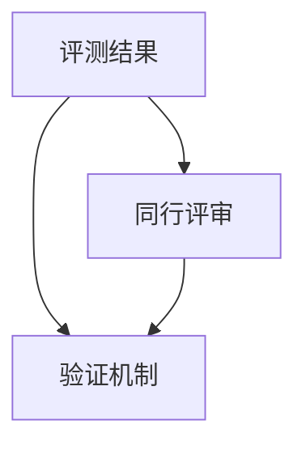
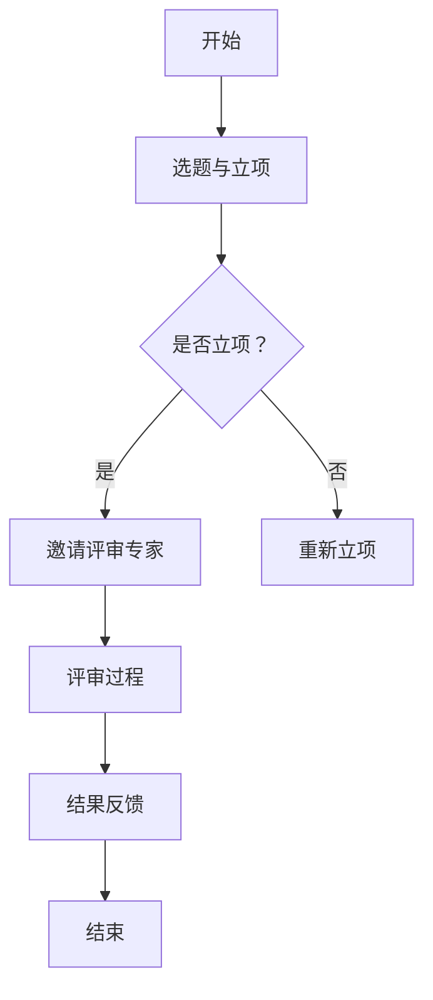
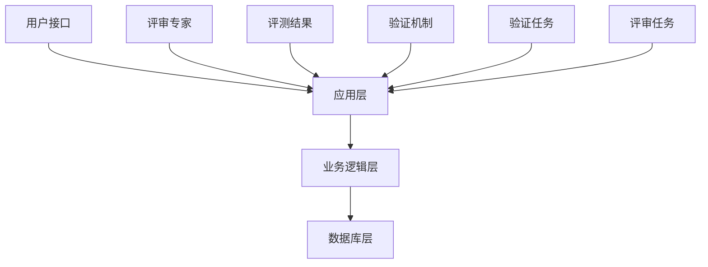
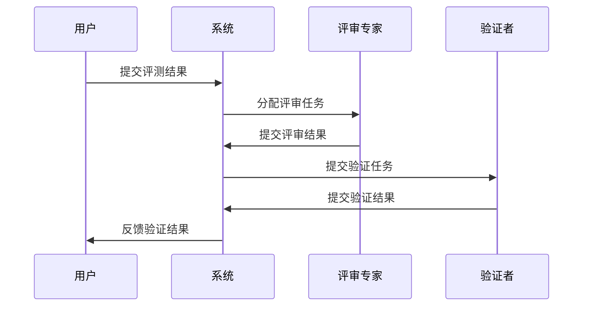

                 

# 评测结果的同行评审与验证机制

关键词：同行评审、验证机制、评测结果、算法、逻辑推理

摘要：本文深入探讨了评测结果的同行评审与验证机制，分析了同行评审的基本概念、工作流程、优点与挑战，以及验证机制的核心原理和实施方法。通过具体的算法示例、数学模型和系统架构设计，本文旨在为读者提供一个全面、系统的理解，并指导实际应用。

## 第一部分：背景介绍与核心概念

### 第1章：问题背景与概念概述

#### 1.1 问题背景

在当今信息化社会中，评测结果在多个领域（如学术研究、工程项目、产品测试等）中具有至关重要的地位。它们是决策者做出合理判断、评估和选择的基础。然而，评测结果的准确性和可靠性一直是困扰各行业的重要问题。为了提高评测结果的公信力和可信度，同行评审与验证机制被广泛应用。

#### 1.2 核心概念

**评测结果**：指的是通过某种方法对目标对象进行测量、评估后得出的结论或数据。

**同行评审**：是指由专业领域的其他专家对某项工作或成果进行评价和审核的过程。

**验证机制**：是指通过一系列方法或步骤，对评测结果的真实性、准确性和有效性进行确认和保证的机制。

### 第2章：核心概念与联系

#### 2.1 核心概念原理

**同行评审的工作流程**：

1. **选题与立项**：确定评审的对象和目标。
2. **邀请评审专家**：根据评审需求，选择合适的评审专家。
3. **评审过程**：评审专家对被评审的对象进行深入分析、评估和讨论。
4. **结果反馈**：将评审结果反馈给被评审者。

**验证机制的原理与作用**：

1. **验证过程**：通过比对、验证、测试等方法，对评测结果进行多角度、多层次的分析和评估。
2. **验证结果**：根据验证结果，判断评测结果的可靠性，并对评测过程提出改进建议。

#### 2.2 概念属性特征对比表

| 特征         | 评测结果               | 同行评审                   | 验证机制                   |
|--------------|------------------------|-----------------------------|-----------------------------|
| 主要作用     | 提供评估数据           | 提高评测结果的公信力        | 保证评测结果的真实性和有效性 |
| 实施主体     | 被评估对象             | 评审专家                   | 验证者                     |
| 影响因素     | 数据来源、评测方法等   | 专家的专业水平和评审流程   | 验证方法和工具             |
| 目标         | 提供客观评估结果       | 保证评估过程的公平性和权威性 | 提高评估结果的准确性和可靠性 |

### 第3章：实体关系图架构

以下是一个简单的实体关系图，展示了评测结果、同行评审和验证机制之间的关系。



## 第二部分：算法原理讲解

### 第4章：算法原理与流程图

#### 4.1 算法mermaid流程图

以下是一个同行评审流程的mermaid流程图。



#### 4.2 算法原理

**同行评审算法原理**：

1. **选题与立项**：根据评估需求，确定评审的目标和范围。
2. **邀请评审专家**：选择具备相关领域专业知识和经验的评审专家。
3. **评审过程**：评审专家对被评审的对象进行深入分析、评估和讨论。
4. **结果反馈**：将评审结果反馈给被评审者，并提供改进建议。

**验证机制算法原理**：

1. **验证过程**：通过比对、验证、测试等方法，对评测结果进行多角度、多层次的分析和评估。
2. **验证结果**：根据验证结果，判断评测结果的可靠性，并对评测过程提出改进建议。

#### 4.3 数学模型

同行评审的数学模型可以表示为：

$$
P(\text{评审结果准确}) = \sum_{i=1}^{n} w_i \cdot P(\text{专家}^i \text{评审准确}) \cdot P(\text{专家}^i \text{参与评审})
$$

其中，$P(\text{评审结果准确})$表示评审结果的准确性，$w_i$表示第$i$个专家的权重，$P(\text{专家}^i \text{评审准确})$表示第$i$个专家评审的准确性，$P(\text{专家}^i \text{参与评审})$表示第$i$个专家参与评审的概率。

## 第三部分：系统分析与架构设计方案

### 第5章：系统功能设计

#### 5.1 项目介绍

本项目旨在实现一个评测结果的同行评审与验证系统，为不同领域的评估过程提供标准化、自动化的解决方案。

#### 5.2 系统功能设计

1. **评测结果管理**：提供评测结果的录入、修改、删除和查询功能。
2. **评审专家管理**：提供评审专家的注册、信息修改、权限管理和查询功能。
3. **评审过程管理**：提供评审任务的分配、进度跟踪、结果反馈和统计功能。
4. **验证机制管理**：提供验证任务的管理、验证过程的跟踪和验证结果的分析功能。

#### 5.3 领域模型mermaid类图

以下是一个简化的领域模型mermaid类图。

```mermaid
classDiagram
    类1[评测结果] <|-- 类2[评审专家]
    类1 <|-- 类3[验证机制]
    类2 <|-- 类4[评审任务]
    类3 <|-- 类5[验证任务]
```

### 第6章：系统架构设计

#### 6.1 系统架构设计

以下是一个简化的系统架构设计mermaid架构图。



### 第7章：系统接口设计

#### 7.1 系统接口设计

1. **评测结果接口**：提供评测结果的录入、修改、删除和查询功能。
2. **评审专家接口**：提供评审专家的注册、信息修改、权限管理和查询功能。
3. **评审过程接口**：提供评审任务的分配、进度跟踪、结果反馈和统计功能。
4. **验证机制接口**：提供验证任务的管理、验证过程的跟踪和验证结果的分析功能。

#### 7.2 系统交互mermaid序列图

以下是一个简化的系统交互mermaid序列图。



## 第四部分：项目实战

### 第8章：环境安装与系统核心实现

#### 8.1 环境安装

在本项目中，我们选择Python作为开发语言，并使用Django作为Web框架。以下是环境安装步骤：

1. 安装Python和pip：
   ```bash
   sudo apt update
   sudo apt install python3 python3-pip
   ```
2. 安装Django：
   ```bash
   pip3 install django
   ```

#### 8.2 系统核心实现

**评测结果管理**：

```python
# models.py

from django.db import models

class EvaluationResult(models.Model):
    title = models.CharField(max_length=100)
    description = models.TextField()
    created_at = models.DateTimeField(auto_now_add=True)
```

**评审专家管理**：

```python
# models.py

class Reviewer(models.Model):
    name = models.CharField(max_length=100)
    email = models.EmailField()
    is_active = models.BooleanField(default=True)
```

**评审过程管理**：

```python
# models.py

class ReviewTask(models.Model):
    result = models.ForeignKey(EvaluationResult, on_delete=models.CASCADE)
    reviewer = models.ForeignKey(Reviewer, on_delete=models.CASCADE)
    started_at = models.DateTimeField(null=True, blank=True)
    finished_at = models.DateTimeField(null=True, blank=True)
```

**验证机制管理**：

```python
# models.py

class VerificationTask(models.Model):
    result = models.ForeignKey(EvaluationResult, on_delete=models.CASCADE)
    validator = models.ForeignKey(Reviewer, on_delete=models.CASCADE)
    started_at = models.DateTimeField(auto_now_add=True)
    finished_at = models.DateTimeField(null=True, blank=True)
    status = models.CharField(max_length=20, choices=(('pending', '待验证'), ('verified', '已验证')))
```

## 第五部分：最佳实践与总结

### 第9章：最佳实践

1. **同行评审的最佳实践**：
   - 确保评审专家具备相关领域专业知识和经验。
   - 制定明确的评审标准和流程。
   - 鼓励评审专家进行多角度、多维度的分析。

2. **验证机制的最佳实践**：
   - 使用多种验证方法和工具，提高验证结果的可靠性。
   - 定期对验证过程进行评估和改进。
   - 建立有效的反馈机制，及时解决问题。

### 第10章：小结

本文从评测结果的背景、核心概念、算法原理、系统架构和项目实战等方面，全面阐述了同行评审与验证机制。通过本文的阅读，读者可以深入了解这一机制的重要性和应用价值，并掌握其实施方法。

### 第11章：注意事项

1. **同行评审的公正性**：确保评审过程的公正性，避免利益冲突。
2. **验证机制的多样性**：结合多种验证方法和工具，提高验证结果的可靠性。
3. **系统的可扩展性**：在设计系统时，考虑未来可能的扩展和变化。

### 第12章：拓展阅读

- 《同行评审：理论与实践》
- 《验证与确认：系统工程的原理与应用》
- 《人工智能在同行评审中的应用》

## 总结

评测结果的同行评审与验证机制在提高评测结果的准确性和可靠性方面具有重要意义。通过本文的详细分析，我们不仅了解了这一机制的核心原理，还掌握了其实际应用的方法。希望本文能为读者在相关领域的实践提供有益的指导。

### 作者信息

作者：AI天才研究院/AI Genius Institute & 禅与计算机程序设计艺术 /Zen And The Art of Computer Programming

