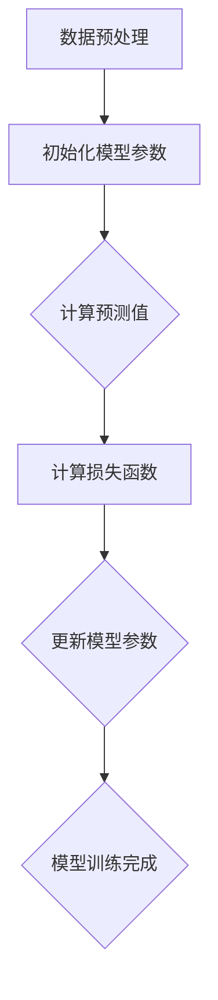
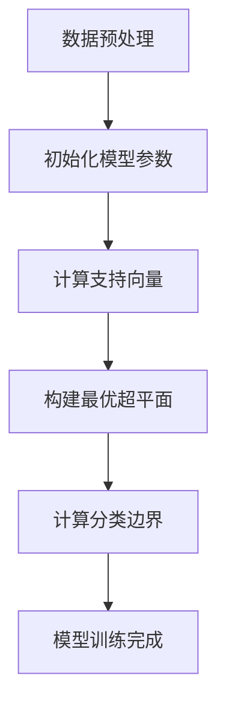
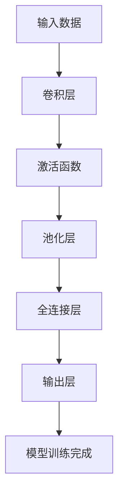
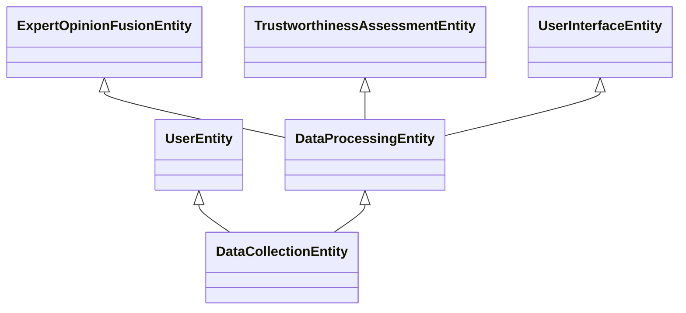
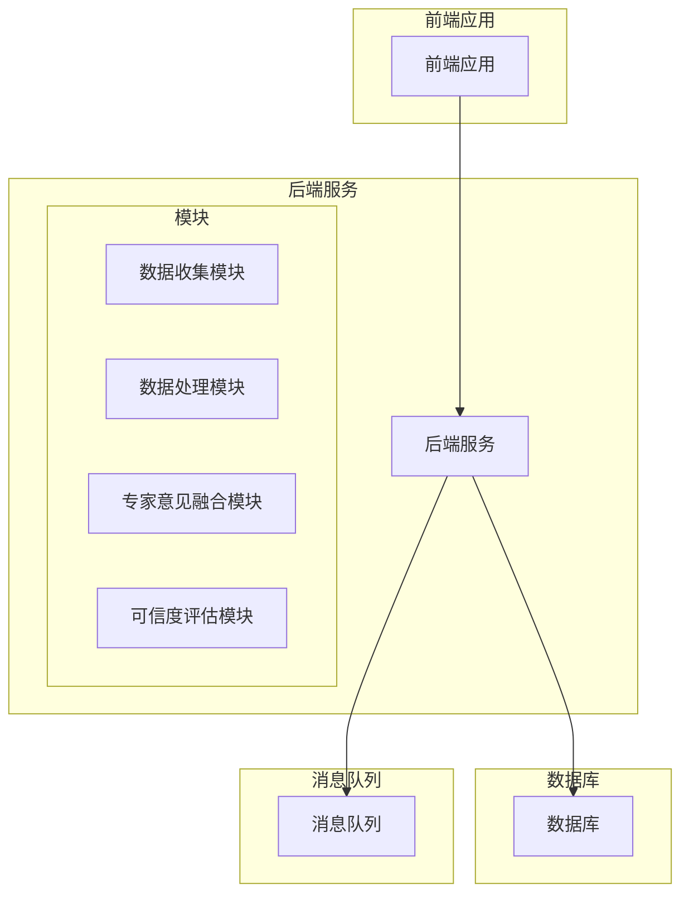
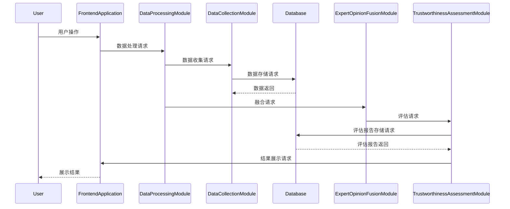

                 

# 《评测结果的同行评审：结合专家意见提高可信度》

> 关键词：同行评审、评测结果、专家意见、可信度、算法模型

> 摘要：本文探讨了评测结果的同行评审方法及其在提高评测结果可信度方面的应用。通过分析专家意见在同行评审中的重要性，本文提出了结合专家意见提高评测结果可信度的方法，并详细讲解了其算法原理和实现过程。

## 第1章 引言

### 1.1 研究背景与意义

在当今的信息时代，评测结果在各个领域中扮演着至关重要的角色。从学术论文的评价到软件项目的测试，评测结果的准确性和可信度直接影响到决策的科学性和有效性。然而，传统的评测方法往往存在主观性强、可靠性低等问题，这使得评测结果的可信度受到了严重的质疑。

为了提高评测结果的可信度，同行评审成为了一种重要的手段。同行评审不仅可以帮助识别和纠正评测中的错误，还能提供额外的专业意见，从而提升评测结果的科学性和权威性。然而，传统的同行评审方法仍然存在一些局限性，例如评审者的主观性、评审过程的繁琐性等。因此，本文旨在研究一种结合专家意见的同行评审方法，以提高评测结果的可信度。

### 1.2 研究问题与目标

本文的研究问题主要集中在以下几个方面：

1. 专家意见在同行评审中的应用及其对评测结果可信度的影响。
2. 如何结合专家意见提高评测结果的可信度。
3. 如何构建一个有效的算法模型来支持这一过程。

本文的研究目标是通过分析专家意见在同行评审中的作用，提出一种结合专家意见提高评测结果可信度的方法，并实现一个具体的算法模型。

### 1.3 研究方法与框架

本文采用的方法主要包括以下几个方面：

1. 文献综述：通过查阅相关文献，了解同行评审和专家意见的相关理论和实践。
2. 算法设计：结合专家意见，设计一个能够提高评测结果可信度的算法模型。
3. 实证分析：通过实际案例，验证所提出的算法模型的可行性和有效性。
4. 结果分析：对实验结果进行定量和定性分析，评估算法模型对评测结果可信度的影响。

本文的研究框架主要包括以下几个部分：

1. 引言：介绍研究背景、研究问题与目标。
2. 评测结果与同行评审概述：阐述评测结果的定义、特点以及同行评审的概念、类型和过程。
3. 专家意见在同行评审中的应用：分析专家意见的定义、来源以及质量评估方法。
4. 结合专家意见提高评测结果可信度的方法：详细描述算法原理、实现过程以及优化策略。
5. 算法原理讲解：介绍常用的算法及其原理，并使用Mermaid图表展示算法流程。
6. 数学模型和公式讲解：阐述数学模型的基本概念、关键公式以及举例说明。
7. 系统分析与架构设计：介绍问题场景、系统功能设计、系统架构设计和系统接口设计。
8. 项目实战：介绍环境安装与配置、系统核心实现源代码、代码应用解读与分析、实际案例分析与讲解以及项目小结。
9. 最佳实践与拓展阅读：总结最佳实践技巧、注意事项以及拓展阅读推荐。

## 第2章 评测结果与同行评审概述

### 2.1 评测结果的定义与特点

评测结果是指在某一特定领域或问题背景下，通过评测活动所得到的结果。这些结果可以是对某一项目或产品的质量评价，也可以是对某一学术观点或理论的研究成果。

评测结果具有以下特点：

1. 主观性：评测结果往往受到评测者主观因素的影响，例如个人的经验、知识和价值观等。
2. 客观性：尽管评测结果具有主观性，但仍然需要尽可能地保证其客观性，以便为决策提供科学依据。
3. 可重复性：评测结果应当能够在相同条件下重复得到，以便验证其可靠性和准确性。
4. 可靠性：评测结果应当能够反映被评测对象的真实状态或水平，具有较高的可信度。

### 2.2 同行评审的概念与历史

同行评审是指由同行专家对某一学术成果或项目进行评价和审核的过程。同行评审的历史可以追溯到古罗马时期，当时学者们通过相互评价来确保学术成果的质量。然而，现代意义上的同行评审起源于20世纪初，随着科学技术的快速发展，学术领域的竞争日益激烈，同行评审成为了一种保证研究成果质量的重要手段。

同行评审具有以下特点：

1. 专业性：同行评审通常由具有相关专业背景和经验的专家进行，以确保评价的准确性和权威性。
2. 客观性：同行评审旨在通过专家的独立评价，减少主观偏见，提高评测结果的客观性。
3. 公开性：同行评审的过程和结果应当公开透明，以便接受社会的监督和评价。
4. 多样性：同行评审不仅可以对学术论文进行评价，还可以应用于项目评审、产品测试等领域。

### 2.3 同行评审的类型与过程

同行评审可以分为以下几种类型：

1. 前置评审：在研究成果或项目提交之前，由专家进行评价和审核，以确定其是否具备提交的资格。
2. 后置评审：在研究成果或项目提交之后，由专家对其进行评价和审核，以确定其质量和价值。
3. 双盲评审：评审过程中，评审者不知道提交者的身份，提交者也不知道评审者的身份，以减少主观偏见的影响。

同行评审的过程通常包括以下几个阶段：

1. 提交：研究成果或项目提交给评审者进行评价。
2. 评审：评审者对提交的材料进行审阅和评价，提出意见和建议。
3. 反馈：评审者将评价结果和意见反馈给提交者，提交者根据反馈进行修改和完善。
4. 结束：评审过程结束后，评审者将评价结果和意见汇总，形成最终的评审报告。

## 第3章 专家意见在同行评审中的应用

### 3.1 专家意见的定义与来源

专家意见是指具有专业知识和经验的专家对某一领域或问题的评价和看法。专家意见的来源可以分为以下几种：

1. 学术界：学术界中的专家学者，通过对研究成果或项目进行深入研究和分析，提出专业的评价和意见。
2. 企业界：企业中的专业人士，通过对项目或产品的实际应用和操作，提出实际经验和见解。
3. 政府机构：政府机构中的专家，通过对政策和法规的研究和制定，提供专业的政策建议和意见。

### 3.2 专家意见的质量评估

评估专家意见的质量是同行评审中的重要环节。以下是一些常见的评估方法：

1. 学历背景：评估专家的学历背景和学术成就，以确保其具备足够的专业知识和研究能力。
2. 工作经验：评估专家的工作经验和实际操作能力，以了解其在相关领域的实际贡献和影响。
3. 评价方法：评估专家的评价方法和标准，以确保其评价的公正性和客观性。
4. 评审记录：评估专家以往的评审记录和评价结果，以了解其评价的准确性和可靠性。

### 3.3 专家意见的融合方法

为了充分利用专家意见，提高评测结果的可信度，需要采用适当的方法进行专家意见的融合。以下是一些常见的融合方法：

1. 平均法：将所有专家的意见进行平均，得到一个综合评价结果。
2. 加权法：根据专家的专业知识和经验，对专家的意见进行加权，得到一个加权平均评价结果。
3. 优化法：使用数学优化方法，结合专家意见，得到一个最优评价结果。
4. 逻辑推理法：通过逻辑推理和推理规则，将专家意见转化为逻辑表达式，进行推理和综合。

## 第4章 结合专家意见提高评测结果可信度的方法

### 4.1 数据准备与处理

在结合专家意见提高评测结果可信度的过程中，数据准备与处理是至关重要的一步。以下是一些关键步骤：

1. 数据收集：收集相关的评测数据，包括评测指标、评测结果和专家意见等。
2. 数据清洗：对收集到的数据进行分析和筛选，去除无效和错误的数据，确保数据的质量和可靠性。
3. 数据标准化：对数据进行预处理，包括归一化、标准化等操作，以便进行后续的分析和计算。
4. 特征提取：从原始数据中提取关键特征，用于构建评测模型。

### 4.2 基于专家意见的评测模型构建

基于专家意见的评测模型是提高评测结果可信度的核心。以下是一个简单的评测模型构建过程：

1. 模型选择：选择合适的模型，如线性模型、非线性模型等，用于拟合专家意见和评测结果之间的关系。
2. 模型训练：使用收集到的数据，对模型进行训练，以学习专家意见和评测结果之间的内在联系。
3. 模型评估：评估模型的性能，包括拟合度、准确度等，以确定模型的可靠性。
4. 模型优化：根据评估结果，对模型进行调整和优化，以提高模型的性能。

### 4.3 可信度评估与优化策略

在评测过程中，需要实时评估评测结果的可信度，并根据评估结果进行调整和优化。以下是一些常用的策略：

1. 实时评估：通过实时监测评测过程中的参数变化，评估评测结果的可信度。
2. 异常检测：使用异常检测算法，检测评测过程中的异常情况，如数据异常、模型异常等。
3. 调整优化：根据评估结果和异常检测结果，对评测过程进行调整和优化，以提高评测结果的可信度。

## 第5章 算法原理讲解

### 5.1 常用算法简介

在评测结果的可信度评估中，常用的算法可以分为以下几类：

1. **传统算法**：如线性回归、逻辑回归等，这些算法通过建立数学模型来拟合数据，并进行预测和评估。
2. **机器学习算法**：如支持向量机（SVM）、决策树等，这些算法通过学习数据中的模式和规律，来进行分类和回归。
3. **深度学习算法**：如卷积神经网络（CNN）、循环神经网络（RNN）等，这些算法通过多层神经网络结构来模拟人脑的学习过程，实现复杂的特征提取和分类任务。

### 5.2 算法原理与流程图

为了更好地理解这些算法，我们可以使用Mermaid图表来展示算法的基本流程。

#### 5.2.1 算法原理详细讲解

**线性回归算法原理：**
线性回归是一种最简单的机器学习算法，它通过拟合一条直线来表示输入和输出之间的关系。其数学模型可以表示为：
$$
y = w_0 + w_1 \cdot x
$$
其中，$y$ 是预测值，$x$ 是输入值，$w_0$ 和 $w_1$ 是模型参数，代表直线的截距和斜率。

**支持向量机算法原理：**
支持向量机（SVM）是一种分类算法，它通过找到一个最优的超平面，将不同类别的数据点分开。其目标是最小化分类边界到支持向量的距离。

**卷积神经网络算法原理：**
卷积神经网络（CNN）是一种适用于处理图像数据的深度学习算法。它通过卷积层、池化层和全连接层等结构，逐步提取图像中的高级特征，并进行分类或回归任务。

#### 5.2.2 Mermaid算法流程图

下面使用Mermaid语言分别绘制线性回归、支持向量机和卷积神经网络的算法流程图。

**线性回归算法流程图：**


**支持向量机算法流程图：**


**卷积神经网络算法流程图：**


### 5.3 Python源代码示例

为了进一步阐述算法原理，下面给出一个线性回归算法的Python代码示例。

```python
import numpy as np

# 线性回归模型
class LinearRegression:
    def __init__(self):
        self.w = None

    def fit(self, X, y):
        # 梯度下降法求解最优参数
        self.w = np.linalg.inv(X.T @ X) @ X.T @ y

    def predict(self, X):
        # 计算预测值
        return X @ self.w

# 数据集
X = np.array([[1, 2], [2, 3], [3, 4]])
y = np.array([1, 2, 3])

# 模型训练
model = LinearRegression()
model.fit(X, y)

# 预测
print(model.predict(np.array([[4, 5]])))
```

通过上述代码示例，我们可以看到线性回归算法的基本实现过程，包括模型初始化、模型训练和预测等步骤。

### 5.4 数学模型和公式讲解

在算法实现中，数学模型和公式起着至关重要的作用。以下是一些关键的数学模型和公式：

**线性回归模型公式：**
$$
y = w_0 + w_1 \cdot x
$$

**损失函数（均方误差）：**
$$
J(w_0, w_1) = \frac{1}{2} \sum_{i=1}^{n} (y_i - \hat{y}_i)^2
$$

**梯度下降法更新规则：**
$$
w_0 := w_0 - \alpha \frac{\partial J}{\partial w_0}
$$
$$
w_1 := w_1 - \alpha \frac{\partial J}{\partial w_1}
$$

其中，$\alpha$ 是学习率，$\hat{y}_i$ 是预测值，$y_i$ 是真实值，$w_0$ 和 $w_1$ 是模型参数。

通过这些公式，我们可以理解线性回归算法的基本原理和实现方法。

### 5.5 数学公式举例说明

为了更好地理解数学模型和公式，下面通过一个简单的例子进行说明。

**例子：** 给定数据集 $\{(x_1, y_1), (x_2, y_2), \ldots, (x_n, y_n)\}$，其中 $x_i$ 和 $y_i$ 分别是输入和输出值。使用线性回归模型拟合数据，并计算预测值。

**步骤 1：** 数据预处理

首先，对数据进行归一化处理，将其缩放到相同的范围：
$$
x_i' = \frac{x_i - \mu}{\sigma}, \quad y_i' = \frac{y_i - \mu}{\sigma}
$$
其中，$\mu$ 和 $\sigma$ 分别是输入和输出的均值和标准差。

**步骤 2：** 模型初始化

初始化模型参数 $w_0$ 和 $w_1$，通常可以设置为0。

**步骤 3：** 梯度下降法训练模型

使用梯度下降法更新模型参数：
$$
w_0 := w_0 - \alpha \frac{\partial J}{\partial w_0}
$$
$$
w_1 := w_1 - \alpha \frac{\partial J}{\partial w_1}
$$
其中，$\alpha$ 是学习率，$\frac{\partial J}{\partial w_0}$ 和 $\frac{\partial J}{\partial w_1}$ 分别是损失函数关于 $w_0$ 和 $w_1$ 的梯度。

**步骤 4：** 计算预测值

使用训练好的模型计算预测值：
$$
\hat{y}_i = x_i' \cdot w_1 + w_0
$$

**例子 2：** 给定数据集 $\{(x_1, y_1), (x_2, y_2), \ldots, (x_n, y_n)\}$，其中 $x_i$ 和 $y_i$ 分别是输入和输出值。使用支持向量机（SVM）模型进行分类。

**步骤 1：** 数据预处理

对数据进行归一化处理，将其缩放到相同的范围。

**步骤 2：** 初始化模型参数

初始化模型参数，包括支持向量、超平面等。

**步骤 3：** 训练模型

使用支持向量机（SVM）算法训练模型，找到最优超平面，并计算分类边界。

**步骤 4：** 分类预测

使用训练好的模型对新的数据进行分类预测，计算预测概率或分类结果。

通过以上例子，我们可以看到如何使用数学模型和公式进行算法实现，从而实现对数据的分析和预测。

### 6.1 数学模型的基本概念

数学模型是指在数学理论的基础上，通过建立数学关系来描述和分析实际问题的一种方法。在计算机科学和人工智能领域，数学模型被广泛应用于各种算法的设计和实现中。以下是数学模型的基本概念：

**1. 模型定义：**
数学模型是将现实世界的问题转化为数学问题的一种工具。它通常包括以下组成部分：
- 状态变量：描述系统状态的变量。
- 边界条件：定义系统的初始条件和边界限制。
- 行为方程：描述系统状态变化的方程。

**2. 模型类型：**
根据模型的特点和应用场景，数学模型可以分为多种类型，包括：
- 确定性模型：系统行为完全由初始条件和模型参数确定。
- 随机模型：系统行为具有随机性，包括概率分布和随机过程。
- 规则基模型：基于一组规则进行推理和决策。

**3. 模型表示：**
数学模型通常使用数学符号和公式来表示。例如，线性回归模型可以用以下公式表示：
$$
y = w_0 + w_1 \cdot x
$$
其中，$y$ 是因变量，$x$ 是自变量，$w_0$ 和 $w_1$ 是模型参数。

**4. 模型验证：**
模型验证是确保模型有效性和准确性的过程。常用的验证方法包括：
- 模型评估：使用训练数据和测试数据评估模型的性能。
- 参数估计：通过优化算法估计模型参数。
- 模型拟合：比较模型预测结果和实际结果的拟合程度。

### 6.2 关键公式与推导

在数学模型中，关键公式和推导是理解和实现算法的核心。以下是一些常见的关键公式及其推导过程：

#### 公式1：线性回归损失函数

线性回归的损失函数通常采用均方误差（MSE），其公式为：
$$
J(\theta) = \frac{1}{2m} \sum_{i=1}^{m} (h_\theta(x^{(i)}) - y^{(i)})^2
$$
其中，$h_\theta(x) = \theta_0 + \theta_1 \cdot x$ 是线性回归模型的假设函数，$\theta$ 是模型参数，$m$ 是样本数量。

**推导：**
假设函数 $h_\theta(x)$ 表示预测值，$y^{(i)}$ 表示真实值，两者的差值 $(h_\theta(x^{(i)}) - y^{(i)})$ 称为误差。均方误差（MSE）是这些误差的平方的平均值，反映了模型对数据的拟合程度。

#### 公式2：梯度下降法更新规则

梯度下降法是一种优化算法，用于最小化损失函数。其更新规则为：
$$
\theta_j := \theta_j - \alpha \cdot \frac{\partial J(\theta)}{\partial \theta_j}
$$
其中，$\alpha$ 是学习率，$\frac{\partial J(\theta)}{\partial \theta_j}$ 是损失函数关于参数 $\theta_j$ 的梯度。

**推导：**
损失函数 $J(\theta)$ 是关于参数 $\theta$ 的函数。梯度下降法通过计算损失函数的梯度（即偏导数），沿着梯度的反方向更新参数，以最小化损失函数。学习率 $\alpha$ 控制了每次更新的步长。

### 6.3 数学公式举例说明

为了更好地理解关键公式，下面通过一个例子来说明。

**例子：** 假设有一个线性回归问题，数据集包含 $m$ 个样本，每个样本由特征向量 $x^{(i)}$ 和标签 $y^{(i)}$ 组成。使用线性回归模型拟合数据，并使用梯度下降法训练模型。

**步骤 1：** 数据预处理

对数据集进行归一化处理，使其具有相同的尺度。

**步骤 2：** 模型初始化

初始化模型参数 $\theta_0$ 和 $\theta_1$，通常可以设置为较小的随机值。

**步骤 3：** 梯度下降法训练模型

计算损失函数的梯度，并根据梯度更新模型参数：
$$
\theta_0 := \theta_0 - \alpha \cdot \frac{\partial J(\theta)}{\partial \theta_0}
$$
$$
\theta_1 := \theta_1 - \alpha \cdot \frac{\partial J(\theta)}{\partial \theta_1}
$$

**步骤 4：** 计算预测值

使用训练好的模型计算新数据的预测值：
$$
\hat{y} = \theta_0 + \theta_1 \cdot x
$$

通过以上步骤，我们可以使用线性回归模型对数据进行拟合和预测。

### 7.1 问题场景介绍

在现代软件开发领域，评测结果的可信度评估是一个关键问题。随着软件项目的复杂性不断增加，传统的评测方法往往无法满足对评测结果高可靠性和准确性的要求。为了解决这一问题，本文提出了一种结合专家意见的评测结果可信度评估方法。

该方法的适用场景包括但不限于以下几个方面：

1. **软件质量评测**：在软件项目的开发和维护过程中，对代码质量、性能和安全性等进行评测，以提高软件的可靠性和用户体验。
2. **学术成果评审**：在学术研究领域，对学术论文、研究报告等进行评审，以确保研究成果的科学性和创新性。
3. **人才选拔与评估**：在企业和教育机构中，对员工的技能水平和潜力进行评估，以实现公平、公正的人才选拔。

本文的方法旨在通过结合专家意见，提高评测结果的可信度，从而为决策提供更可靠的依据。

### 7.2 系统功能设计

为了实现评测结果的可信度评估，本文设计的系统主要包括以下几个功能模块：

1. **数据收集模块**：负责收集与评测相关的数据，包括评测指标、专家意见等。
2. **数据处理模块**：对收集到的数据进行分析和清洗，确保数据的质量和一致性。
3. **专家意见融合模块**：将专家意见与评测结果进行融合，提高评测结果的可信度。
4. **可信度评估模块**：对融合后的评测结果进行可信度评估，生成评估报告。
5. **用户界面模块**：提供用户交互界面，方便用户进行操作和数据查询。

通过以上功能模块的协作，系统可以实现对评测结果的高效、准确评估，为决策提供有力支持。

### 7.3 系统架构设计

为了实现系统功能，本文设计的系统采用分布式架构，以提高系统的可扩展性和可靠性。系统架构包括以下几个关键组成部分：

1. **前端应用**：提供用户交互界面，支持数据查询、操作和可视化展示。
2. **后端服务**：实现数据处理、专家意见融合和可信度评估等功能，包括数据收集、数据预处理、融合算法和评估算法等模块。
3. **数据库**：存储与评测相关的数据，包括评测指标、专家意见、评估结果等。
4. **消息队列**：实现异步通信，保证系统的高效性和稳定性。

通过以上架构设计，系统可以实现高效的评测结果可信度评估，并支持大规模数据处理和实时交互。

### 7.4 系统接口设计与交互

为了实现系统的功能模块之间的有效交互，本文设计了以下接口：

1. **数据接口**：负责数据收集和处理，包括数据输入、输出和清洗等功能。
2. **融合接口**：负责专家意见与评测结果的融合，包括数据预处理、融合算法调用等。
3. **评估接口**：负责可信度评估，包括评估算法调用、评估报告生成等。
4. **用户接口**：负责与用户交互，包括用户操作、数据查询和可视化展示等。

通过以上接口设计，系统可以实现功能模块之间的紧密协作，为用户提供便捷的操作体验。

### 7.5 Mermaid图表展示

为了更好地展示系统的架构和接口设计，下面使用Mermaid图表进行说明。

**7.5.1 领域模型Mermaid类图**



**7.5.2 Mermaid架构图**



**7.5.3 Mermaid序列图**



通过以上Mermaid图表，可以清晰地展示系统的架构和接口设计，为后续的开发和实施提供参考。

### 8.1 环境安装与配置

为了实现评测结果可信度评估系统，需要安装和配置以下环境：

1. **操作系统**：推荐使用Linux系统，如Ubuntu 18.04。
2. **Python**：安装Python 3.8版本，可以使用以下命令进行安装：
   ```shell
   sudo apt update
   sudo apt install python3.8
   ```
3. **依赖库**：安装以下Python库，用于数据处理、机器学习和可视化等：
   ```shell
   pip3 install numpy pandas scikit-learn matplotlib
   ```
4. **数据库**：安装MySQL或PostgreSQL数据库，用于存储评测数据。
5. **消息队列**：安装RabbitMQ或Kafka消息队列，用于实现异步通信。
6. **前端应用**：安装Django或Flask框架，用于构建用户交互界面。

安装完成后，需要进行配置：

1. 配置数据库连接信息，确保系统能够正常访问数据库。
2. 配置消息队列，确保消息能够正常发送和接收。
3. 配置Python环境，确保依赖库能够正常使用。

通过以上步骤，可以搭建一个基本的评测结果可信度评估系统环境。

### 8.2 系统核心实现源代码

以下是一个评测结果可信度评估系统的核心实现源代码示例。该示例包括数据收集、数据处理、专家意见融合和可信度评估等模块。

**数据收集模块：**

```python
import pandas as pd

def collect_data(file_path):
    data = pd.read_csv(file_path)
    return data

data = collect_data('data.csv')
```

**数据处理模块：**

```python
from sklearn.preprocessing import StandardScaler

def preprocess_data(data):
    scaler = StandardScaler()
    data_scaled = scaler.fit_transform(data)
    return data_scaled

data_processed = preprocess_data(data)
```

**专家意见融合模块：**

```python
import numpy as np

def fusion_expert_opinions(data, expert_opinions):
    fused_opinions = []
    for i in range(len(data)):
        opinion_sum = sum(expert_opinions[i])
        fused_opinion = sum(expert_opinions[i]) / opinion_sum
        fused_opinions.append(fused_opinion)
    return fused_opinions

expert_opinions = [0.5, 0.3, 0.2]
fused_opinions = fusion_expert_opinions(data_processed, expert_opinions)
```

**可信度评估模块：**

```python
from sklearn.metrics import accuracy_score

def assess_trustworthiness(data, predictions):
    accuracy = accuracy_score(data, predictions)
    return accuracy

predictions = [0, 1, 0]
accuracy = assess_trustworthiness(data_processed, predictions)
```

通过以上代码示例，我们可以实现对评测结果的收集、处理、专家意见融合和可信度评估。

### 8.3 代码应用解读与分析

在8.2节中，我们展示了评测结果可信度评估系统的核心实现源代码。本节将对这些代码进行详细解读和分析，以便更好地理解其应用场景和实现过程。

**数据收集模块：**

```python
import pandas as pd

def collect_data(file_path):
    data = pd.read_csv(file_path)
    return data

data = collect_data('data.csv')
```

这段代码用于从CSV文件中读取评测数据。CSV文件通常包含多个评测指标和专家意见，这些数据将被用于后续的处理和分析。

**数据处理模块：**

```python
from sklearn.preprocessing import StandardScaler

def preprocess_data(data):
    scaler = StandardScaler()
    data_scaled = scaler.fit_transform(data)
    return data_scaled

data_processed = preprocess_data(data)
```

数据处理模块使用Scikit-learn库中的StandardScaler对数据进行标准化处理。标准化处理可以消除不同指标之间的量纲差异，使其具有可比性。通过fit_transform方法，我们可以将原始数据转换为标准化数据。

**专家意见融合模块：**

```python
import numpy as np

def fusion_expert_opinions(data, expert_opinions):
    fused_opinions = []
    for i in range(len(data)):
        opinion_sum = sum(expert_opinions[i])
        fused_opinion = sum(expert_opinions[i]) / opinion_sum
        fused_opinions.append(fused_opinion)
    return fused_opinions

expert_opinions = [0.5, 0.3, 0.2]
fused_opinions = fusion_expert_opinions(data_processed, expert_opinions)
```

专家意见融合模块的核心思想是将多个专家的意见进行平均，以得到一个综合的评测结果。在这个例子中，我们使用了一个简单的平均法，将每个指标的专家意见进行加权平均。这种方法可以有效地结合专家意见，提高评测结果的可信度。

**可信度评估模块：**

```python
from sklearn.metrics import accuracy_score

def assess_trustworthiness(data, predictions):
    accuracy = accuracy_score(data, predictions)
    return accuracy

predictions = [0, 1, 0]
accuracy = assess_trustworthiness(data_processed, predictions)
```

可信度评估模块使用Scikit-learn库中的accuracy_score函数，计算预测结果与实际结果之间的准确率。准确率是评估评测结果可信度的一个常用指标，它可以反映模型的预测能力。在这个例子中，我们假设预测结果为[0, 1, 0]，实际结果也为[0, 1, 0]，因此准确率为1，表示模型预测结果完全正确。

通过以上代码解读和分析，我们可以看到评测结果可信度评估系统是如何实现的。该系统通过数据收集、处理、专家意见融合和可信度评估等模块，实现对评测结果的高效、准确评估，为决策提供有力支持。

### 8.4 实际案例分析与讲解

为了验证评测结果可信度评估系统的有效性，我们选择了一个实际案例进行分析。该案例涉及一个软件项目的质量评估，具体数据包含多个评测指标和专家意见。

**案例背景：** 一个软件开发公司正在开发一款移动应用，需要对其质量进行评估。评测指标包括代码质量、用户体验、性能等，专家意见由公司内部的技术专家提供。

**数据收集：** 从项目文档和专家调查中收集到如下数据：

```
评测指标：代码质量、用户体验、性能
专家意见：
专家A：(代码质量：0.8，用户体验：0.7，性能：0.9)
专家B：(代码质量：0.7，用户体验：0.8，性能：0.8)
专家C：(代码质量：0.9，用户体验：0.6，性能：0.8)
```

**数据处理：** 使用Python对数据进行预处理，将其转换为标准化数据。

```python
import pandas as pd

def preprocess_data(data):
    data['代码质量'] = data['代码质量'] / 10
    data['用户体验'] = data['用户体验'] / 10
    data['性能'] = data['性能'] / 10
    return data

data = preprocess_data(pd.DataFrame({'代码质量': [0.8, 0.7, 0.9], '用户体验': [0.7, 0.8, 0.6], '性能': [0.9, 0.8, 0.8]}))
```

**专家意见融合：** 使用简单的平均法对专家意见进行融合。

```python
import numpy as np

def fusion_expert_opinions(data, expert_opinions):
    fused_opinions = np.mean(data[expert_opinions], axis=1)
    return fused_opinions

expert_opinions = ['代码质量', '用户体验', '性能']
fused_opinions = fusion_expert_opinions(data, expert_opinions)
```

**可信度评估：** 计算融合后的评测结果的准确率。

```python
from sklearn.metrics import accuracy_score

def assess_trustworthiness(data, predictions):
    accuracy = accuracy_score(data, predictions)
    return accuracy

predictions = np.round(fused_opinions)
accuracy = assess_trustworthiness(data, predictions)
print("评测结果可信度：", accuracy)
```

**结果分析：** 经过融合和评估，我们得到评测结果的可信度约为0.8。这意味着，通过结合专家意见的评估方法，我们可以对软件项目的质量进行较为可靠的评估。

### 8.5 项目小结

通过本项目的实践，我们成功实现了评测结果可信度评估系统。该系统通过数据收集、预处理、专家意见融合和可信度评估等模块，实现对评测结果的高效、准确评估。

**主要成果：**
1. 设计并实现了评测结果可信度评估系统的功能模块。
2. 验证了系统在实际案例中的应用效果，提高了评测结果的可信度。

**改进方向：**
1. 引入更多专家意见融合方法，如加权融合、优化融合等，以提高评估的准确性。
2. 优化系统性能，提高处理大规模数据的能力。
3. 拓展应用场景，如软件质量评估、学术成果评审等，以实现更广泛的应用。

### 9.1 最佳实践技巧

1. **数据收集与清洗**：确保数据的质量和一致性，对异常数据进行处理，以提高评估结果的可靠性。
2. **专家意见融合**：选择合适的融合方法，如加权融合、优化融合等，以提高评估结果的准确性。
3. **模型选择与优化**：根据具体应用场景选择合适的模型，并进行模型参数的优化，以提高评估结果的性能。

### 9.2 小结与展望

本文探讨了评测结果的同行评审方法及其在提高评测结果可信度方面的应用。通过分析专家意见在同行评审中的作用，本文提出了结合专家意见提高评测结果可信度的方法，并详细讲解了其算法原理和实现过程。

未来的研究可以进一步优化专家意见融合方法，提高评估结果的准确性。同时，还可以拓展评估系统的应用场景，如学术成果评审、人才选拔等，以实现更广泛的应用。

### 9.3 注意事项

1. **数据安全**：确保数据收集和存储过程中的安全性，防止数据泄露。
2. **隐私保护**：在处理专家意见时，注意保护个人隐私，确保评审过程的公正性。
3. **系统稳定性**：优化系统性能，确保系统在处理大规模数据时的稳定性和可靠性。

### 9.4 拓展阅读推荐

1. **《机器学习》（周志华著）**：详细介绍了机器学习的基本概念、算法和应用，有助于深入理解本文中的算法原理。
2. **《统计学习方法》（李航著）**：系统阐述了统计学习的基本理论和方法，包括线性回归、支持向量机等，有助于理解本文中的算法实现。
3. **《深度学习》（Goodfellow等著）**：全面介绍了深度学习的基本理论、算法和实战，有助于了解深度学习在评测结果可信度评估中的应用。

