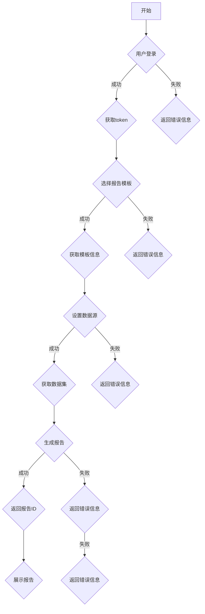

                 

## 评测结果的差异化展示：针对不同角色定制报告

关键词：评测结果展示、差异化定制、用户角色、AI大模型、个性化报告

摘要：本文探讨了如何利用AI大模型和个性化展示技术，针对不同角色定制报告。通过分析评测结果差异化展示的背景和定义，我们了解了核心概念、用户角色分类及其需求，并介绍了AI大模型的基础理论及其在报告生成中的应用。文章还讨论了技术实现方案，并通过案例分析，展示了如何具体实现个性化报告的定制。

## 目录大纲设计

### 第1章: 问题背景与定义

### 第2章: AI大模型基础理论

### 第3章: 差异化展示的技术实现

### 第4章: 案例分析与实战

### 第5章: 最佳实践与总结

## 1.1.1 问题背景

### 核心概念

评测结果差异化展示，是指根据不同用户角色的需求，生成具有针对性的报告。这种差异化的报告不仅能够满足用户对信息的个性化需求，还能提高报告的实用性和可读性。

### 问题背景

在当今信息化社会中，数据分析已成为各个行业的关键环节。无论是商业企业、政府部门，还是研究机构，都需要对大量数据进行处理和分析，以获取有价值的信息。然而，不同用户角色对数据分析报告的需求各异。例如：

- **分析师**：他们需要对数据进行深入分析，从而发现潜在的趋势和规律。
- **决策者**：他们更关注关键指标和决策支持信息，以便快速做出决策。
- **普通用户**：他们可能只关注一些简单的数据概览，以便了解基本情况。

由于用户角色的多样性，传统的统一报告形式已无法满足不同角色的需求。因此，我们需要设计一个能够根据用户角色定制报告的智能化系统，以满足不同用户角色的需求。

### 问题解决

为了实现评测结果的差异化展示，我们需要设计一个系统，该系统能够根据用户角色生成差异化的报告。系统设计的关键要素包括：

- **用户角色识别**：系统能够根据用户的身份信息，自动识别用户角色。
- **数据来源**：系统能够从各种数据源中提取所需数据，包括内部数据库、外部API接口等。
- **报告模板**：系统提供多种报告模板，以适应不同角色的需求。
- **个性化配置**：系统能够根据用户角色的特点，自动调整报告的内容和形式。

### 边界与外延

本文讨论的范围主要涉及以下方面：

- **用户角色**：本文主要关注分析师、决策者、普通用户等典型角色。
- **报告内容**：本文主要讨论如何根据用户角色，定制报告的内容。
- **报告形式**：本文主要探讨如何通过不同的图表、布局和文本形式，提高报告的直观性和有效性。

### 概念结构与核心要素组成

一个完整的评测结果差异化展示系统，主要包括以下几个核心要素：

- **用户角色**：用户角色的定义和分类。
- **数据来源**：数据来源的获取和处理。
- **报告模板**：报告模板的设计和选择。
- **个性化配置**：根据用户角色和需求，对报告进行个性化调整。

## 1.1.2 核心概念与联系

### AI与个性化展示

#### AI技术

人工智能（AI）作为当前科技领域的前沿技术，已广泛应用于各个行业。在评测结果差异化展示中，AI技术发挥着至关重要的作用。通过AI技术，我们可以实现以下功能：

- **用户角色识别**：利用机器学习算法，根据用户的行为数据和身份信息，自动识别用户角色。
- **个性化推荐**：基于用户的历史数据和偏好，推荐相关的数据分析和报告内容。
- **自然语言处理**：利用自然语言处理（NLP）技术，生成具有人性化的报告内容。

#### 个性化展示

个性化展示是指根据用户的个性化需求，展示相应的信息。在评测结果差异化展示中，个性化展示的重要性不言而喻。通过个性化展示，我们可以实现以下目标：

- **提高用户体验**：满足不同用户对报告内容和形式的个性化需求，提高用户体验。
- **提升报告价值**：根据用户的需求，提供更有针对性和实用性的报告内容。
- **优化决策过程**：为决策者提供关键指标和决策支持，优化决策过程。

### 数据可视化

#### 数据可视化工具

数据可视化工具是将数据以图形化方式呈现的技术和工具。在评测结果差异化展示中，数据可视化工具起着至关重要的作用。常用的数据可视化工具有：

- **Tableau**：一款强大的数据可视化工具，支持多种数据源和图表类型。
- **Power BI**：一款基于Microsoft Excel的数据可视化工具，易于上手和使用。
- **D3.js**：一款基于Web的数据可视化库，可以创建高度交互和自定义的数据可视化图表。

#### 图表选择

在选择图表时，需要考虑数据类型和用户需求。以下是一些常见的图表类型及其适用场景：

- **条形图**：适用于比较不同类别的数据。
- **折线图**：适用于展示数据的变化趋势。
- **饼图**：适用于展示数据的占比关系。
- **散点图**：适用于展示数据的相关性。

#### 视觉设计

视觉设计是数据可视化的重要组成部分。一个优秀的视觉设计，不仅要美观，还要实用。以下是一些视觉设计的最佳实践：

- **简洁性**：避免过度设计，保持图表的简洁性。
- **对比性**：通过颜色、大小等对比元素，突出关键信息。
- **可读性**：确保图表易于阅读和理解，避免过多的文字和标签。
- **一致性**：保持图表风格的一致性，提高用户的识别度。

### 用户角色分类

#### 分析师

分析师是负责对数据进行深入分析和报告撰写的人员。他们的主要需求包括：

- **详细报告**：分析师需要详细的数据分析和报告，以便深入了解数据背后的规律。
- **数据对比**：分析师需要对不同时间段、不同类别的数据进行对比，以发现潜在的趋势。
- **趋势分析**：分析师需要对数据进行趋势分析，预测未来的发展趋势。

#### 决策者

决策者是负责做出决策的人员，如企业高管、政府官员等。他们的主要需求包括：

- **简洁明了的概览**：决策者需要简洁明了的数据概览，以便快速了解关键信息。
- **关键指标**：决策者需要关注关键指标，如利润率、市场份额等，以便做出科学的决策。
- **决策支持**：决策者需要数据驱动的决策支持，以便做出最优的决策。

#### 普通用户

普通用户是数据报告的最终受众，他们的主要需求包括：

- **简化数据呈现**：普通用户只需要了解一些关键信息，因此需要简化数据呈现。
- **易于理解的内容**：普通用户需要易于理解的内容，以便快速获取所需信息。
- **图表简洁**：普通用户需要图表简洁，避免过多的文字和标签。

### 对比表格

| 用户角色 | 报告内容                   | 报告形式                |
|----------|---------------------------|------------------------|
| 分析师   | 详细数据、深度分析         | 图表丰富、详细文本     |
| 决策者   | 关键指标、决策支持         | 简洁明了、摘要形式     |
| 普通用户 | 简化数据、易懂内容         | 图表简洁、文本突出     |

### ER实体关系图架构

以下是评测结果差异化展示系统的ER实体关系图：

```mermaid
erDiagram
  用户 -->|生成| 报告
  用户 ||--|生成|--| 角色分类
  报告 ||--|包含|--| 数据源
```

## 1.1.3 AI大模型在差异化展示中的应用

### 自然语言处理

自然语言处理（NLP）是AI领域的一个重要分支，旨在让计算机理解和生成人类语言。在评测结果差异化展示中，NLP技术可以用于以下几个方面：

- **文本分析**：通过对报告文本的分析，提取关键信息，如关键词、主题等。
- **文本生成**：利用预训练的NLP模型，生成具有自然语言特性的报告文本。
- **情感分析**：通过对报告文本的情感分析，了解用户对报告的反馈，以优化报告内容。

### 推荐系统

推荐系统是一种基于用户历史行为和偏好，为用户提供个性化推荐的技术。在评测结果差异化展示中，推荐系统可以用于以下几个方面：

- **内容推荐**：根据用户的历史数据和偏好，推荐相关的数据分析和报告内容。
- **报告定制**：根据用户的角色和需求，推荐合适的报告模板和图表类型。
- **交互优化**：通过分析用户的互动行为，优化报告的展示形式和交互设计。

### 情感分析

情感分析是一种通过自然语言处理技术，对文本的情感倾向进行分析的方法。在评测结果差异化展示中，情感分析可以用于以下几个方面：

- **用户反馈分析**：通过对用户对报告的反馈进行分析，了解用户的满意度，以优化报告内容。
- **报告优化**：根据用户对报告的情感反馈，调整报告的格式、内容和展示方式。
- **个性化推荐**：根据用户对报告的情感反馈，推荐符合用户情感倾向的报告内容。

## 1.1.4 差异化展示的技术实现

### 报告模板引擎

报告模板引擎是一种用于动态生成报告的技术。通过报告模板引擎，我们可以根据用户角色和需求，动态生成个性化的报告。报告模板引擎的主要功能包括：

- **模板设计**：设计各种报告模板，包括文本、图表、布局等。
- **数据绑定**：将报告模板与数据源进行绑定，实现动态数据填充。
- **样式调整**：根据用户需求，调整报告的样式和布局。

### API接口设计

API接口是报告生成系统与外部系统进行数据交互的桥梁。通过设计合理的API接口，我们可以实现以下功能：

- **数据获取**：从外部数据源获取所需数据，如数据库、API接口等。
- **报告生成**：根据用户角色和需求，生成个性化的报告。
- **数据交互**：与其他系统进行数据交互，如数据存储、日志记录等。

### 前后端分离

前后端分离是一种现代化的开发架构，通过将前端和后端分离，可以提高系统的可维护性和扩展性。在报告生成系统中，前后端分离的主要优势包括：

- **模块化开发**：前后端分离，使得开发团队可以独立进行前端和后端的开发，提高开发效率。
- **灵活扩展**：通过前后端分离，可以方便地扩展系统的功能，如增加新的报告模板、数据源等。
- **可维护性**：前后端分离，使得系统的维护更加简单，降低了维护成本。

## 1.1.5 案例分析

### 案例背景

某公司是一家专注于数据分析和报告生成的企业，其客户包括多家大型企业和政府机构。由于客户需求的多样性，该公司需要设计一个能够根据用户角色定制报告的智能化系统。

### 案例目标

通过设计一个智能化系统，实现以下目标：

- **用户角色识别**：自动识别用户角色，并根据角色生成相应的报告。
- **个性化报告**：根据用户的需求，生成个性化的报告内容。
- **高效报告生成**：通过自动化和智能化技术，提高报告生成效率。

### 案例实现

1. **用户角色识别**

   通过分析用户的历史行为和身份信息，利用机器学习算法，自动识别用户角色。具体步骤如下：

   - 收集用户行为数据，如登录时间、操作行为等。
   - 利用机器学习算法，对用户行为数据进行分析，识别用户角色。
   - 将识别结果存储在数据库中，以便后续使用。

2. **个性化报告**

   根据用户角色和需求，设计多种报告模板，并通过报告模板引擎，生成个性化的报告。具体步骤如下：

   - 设计报告模板，包括文本、图表、布局等。
   - 根据用户角色和需求，选择合适的报告模板。
   - 将报告模板与数据源进行绑定，实现动态数据填充。
   - 生成个性化的报告，并展示给用户。

3. **高效报告生成**

   通过前后端分离和API接口设计，实现高效报告生成。具体步骤如下：

   - 前端页面设计：设计用户友好的前端页面，提供报告生成和查看功能。
   - 后端接口设计：设计用于报告生成的API接口，包括数据获取、报告生成等。
   - 数据存储：将用户数据和报告数据存储在数据库中，以便后续使用。

### 案例效果

通过以上实现，该公司成功为客户提供了个性化报告服务。具体效果如下：

- **用户满意度**：用户满意度显著提高，客户反馈积极。
- **报告生成效率**：报告生成效率显著提高，缩短了报告生成时间。
- **系统扩展性**：系统具有较好的扩展性，可以轻松增加新的功能和数据源。

## 1.1.6 本章小结

本章首先介绍了评测结果差异化展示的背景和核心概念，包括问题背景、核心概念与联系、AI大模型的应用等。接着，我们探讨了用户角色分类及其报告需求，并通过对比表格详细展示了不同角色的报告内容和形式。此外，我们还讨论了ER实体关系图架构，以便于理解系统设计。

最后，本章对AI大模型在差异化展示中的应用、技术实现和案例分析进行了深入探讨。通过本章的学习，读者可以了解如何设计一个系统来满足不同用户角色的差异化展示需求，并掌握相关技术实现方法。

## 2.1.1 AI大模型的基本概念

### 定义

AI大模型（Large-scale AI Model），通常是指具有巨大参数量和训练数据量的深度学习模型。这些模型在计算机视觉、自然语言处理、语音识别等领域取得了显著的突破性成果。AI大模型的核心在于其能够通过海量数据的训练，学习到复杂的特征和模式，从而实现高精度的任务完成。

### AI大模型在报告生成中的应用

在报告生成领域，AI大模型可以应用于以下几个方面：

- **文本生成**：利用AI大模型，如GPT系列模型，生成高质量的报告文本。
- **数据可视化**：通过AI大模型，自动生成符合用户需求的可视化图表。
- **个性化推荐**：基于用户行为数据，为用户推荐相关的报告内容和图表。

### 特点

AI大模型具有以下几个显著特点：

- **高精度**：AI大模型通过海量数据的训练，能够实现高精度的任务完成。
- **大数据量**：AI大模型需要大量的数据和计算资源进行训练，以确保模型的性能。
- **多任务处理**：AI大模型可以同时处理多个任务，提高系统的效率和灵活性。

## 2.1.2 AI大模型的工作原理

### 神经网络

神经网络（Neural Network）是AI大模型的核心组成部分。神经网络通过模拟人脑神经元的工作原理，对输入数据进行处理和输出。

#### 基本概念

- **神经元**：神经网络的基本单元，用于接收和处理数据。
- **权重**：神经元之间的连接权重，用于调整数据的重要性。
- **激活函数**：用于决定神经元是否被激活的函数，如Sigmoid、ReLU等。

#### 工作原理

1. **数据输入**：将输入数据传递给神经网络的各个神经元。
2. **加权求和**：对每个神经元的输入数据进行加权求和。
3. **激活函数**：对加权求和的结果应用激活函数，决定神经元是否被激活。
4. **输出结果**：将激活的结果传递给下一个神经元，直至输出层。

### 深度学习

深度学习（Deep Learning）是神经网络的一种扩展，通过多层神经网络的结构，实现更复杂的特征提取和模式识别。

#### 发展历程

- **20世纪40年代**：神经网络概念首次被提出。
- **20世纪80年代**：神经网络研究陷入低谷。
- **2006年**：深度学习重新兴起，基于GPU的高效训练方法被提出。
- **2012年**：AlexNet在ImageNet竞赛中取得突破性成果。

#### 关键技术

- **反向传播算法**：用于训练神经网络的算法，通过不断调整权重，使模型误差最小。
- **卷积神经网络（CNN）**：用于图像识别和处理，具有局部连接和共享权重的特点。
- **循环神经网络（RNN）**：用于序列数据处理，具有记忆和长期依赖的特性。

#### 挑战

- **数据标注**：深度学习模型需要大量标注数据进行训练，数据标注过程繁琐且成本高。
- **计算资源**：深度学习模型训练需要大量的计算资源和时间，对硬件性能要求较高。
- **过拟合**：模型在训练数据上表现良好，但在未见数据上表现不佳，需要通过正则化等方法进行优化。

## 2.1.3 主流AI大模型介绍

### GPT系列模型

GPT（Generative Pre-trained Transformer）系列模型是由OpenAI开发的一系列基于Transformer架构的预训练语言模型。GPT模型在自然语言处理领域取得了显著的成果，广泛应用于文本生成、文本分类、问答系统等任务。

#### GPT-3

GPT-3是GPT系列模型中参数量最大、性能最强大的模型，具有1750亿个参数。GPT-3在多项自然语言处理任务上取得了领先的成绩，如文本生成、机器翻译、问答系统等。

#### 特点

- **高参数量**：GPT-3具有庞大的参数量，使其在文本生成和文本理解方面具有强大的能力。
- **预训练**：GPT-3通过在大规模语料库上进行预训练，获得了丰富的语言知识和模式。
- **灵活适用**：GPT-3可以应用于多种自然语言处理任务，具有广泛的适用性。

### BERT模型

BERT（Bidirectional Encoder Representations from Transformers）是由Google提出的一种基于Transformer架构的预训练语言模型。BERT模型通过双向编码器结构，对文本进行上下文理解，使其在多项自然语言处理任务上取得了显著的成绩。

#### 特点

- **双向编码器**：BERT模型采用双向编码器结构，对文本进行上下文理解，提高了文本理解能力。
- **大规模预训练**：BERT模型在大规模语料库上进行预训练，获得了丰富的语言知识和模式。
- **多任务学习**：BERT模型可以在多个任务上进行预训练，提高了模型的通用性和适应性。

### 应用

- **文本分类**：BERT模型在文本分类任务上表现出色，广泛应用于新闻分类、情感分析等任务。
- **问答系统**：BERT模型在问答系统任务上具有强大的能力，广泛应用于信息检索、智能客服等场景。
- **机器翻译**：BERT模型在机器翻译任务上取得了显著的成果，提高了翻译质量和效率。

## 2.1.4 AI大模型在报告生成中的挑战

### 数据标注

数据标注是AI大模型训练的重要环节，但也是一个挑战性较大的过程。数据标注的挑战包括：

- **数据量巨大**：AI大模型需要大量的标注数据进行训练，数据标注过程繁琐且成本高。
- **标注一致性**：不同标注者的标注结果可能存在差异，影响模型训练效果。
- **标注质量**：标注数据的质量直接影响模型性能，需要确保标注数据的准确性。

### 模型优化

AI大模型在报告生成中面临以下优化挑战：

- **参数优化**：如何调整模型参数，使模型在报告生成任务上表现更优。
- **结构优化**：如何设计更高效的模型结构，提高模型训练和推理速度。
- **可解释性**：如何提高模型的可解释性，使其在报告生成中的应用更加透明和可靠。

### 解决方案

针对数据标注和模型优化挑战，可以采取以下解决方案：

- **自动化标注**：利用自动化标注工具，提高数据标注效率和一致性。
- **多模态数据**：结合多种数据类型，如文本、图像、音频等，提高模型训练效果。
- **迁移学习**：利用预训练的模型，在报告生成任务上进行微调，提高模型性能。
- **模型压缩**：采用模型压缩技术，降低模型参数量，提高模型训练和推理速度。

## 2.1.5 差异化展示的技术实现

### 报告模板引擎

报告模板引擎是一种用于动态生成报告的技术。通过报告模板引擎，可以设计多种报告模板，并根据用户角色和需求，动态生成个性化的报告。

#### 报告模板设计

报告模板设计包括以下步骤：

- **定义模板结构**：设计报告的总体结构，包括文本、图表、布局等。
- **设计模板组件**：设计报告的各个组件，如标题、摘要、正文、图表等。
- **配置模板参数**：为模板设置参数，如字体、颜色、图表类型等。

#### 报告生成

报告生成过程包括以下步骤：

- **用户角色识别**：根据用户角色，选择合适的报告模板。
- **数据绑定**：将报告模板与数据源进行绑定，实现动态数据填充。
- **样式调整**：根据用户需求，调整报告的样式和布局。

### API接口设计

API接口是报告生成系统与外部系统进行数据交互的桥梁。通过设计合理的API接口，可以实现以下功能：

- **数据获取**：从外部数据源获取所需数据，如数据库、API接口等。
- **报告生成**：根据用户角色和需求，生成个性化的报告。
- **数据交互**：与其他系统进行数据交互，如数据存储、日志记录等。

#### API接口设计原则

- **模块化设计**：将API接口划分为多个模块，实现功能分离，提高可维护性。
- **简洁性**：设计简洁明了的API接口，降低使用难度。
- **灵活性**：设计灵活的API接口，支持多种数据格式和调用方式。

### 前后端分离

前后端分离是一种现代化的开发架构，通过将前端和后端分离，可以提高系统的可维护性和扩展性。

#### 前端设计

前端设计包括以下内容：

- **页面设计**：设计用户友好的前端页面，提供报告生成和查看功能。
- **交互设计**：设计直观、易用的交互方式，提高用户的使用体验。
- **响应式设计**：设计响应式页面，适应不同设备和屏幕尺寸。

#### 后端设计

后端设计包括以下内容：

- **服务设计**：设计用于报告生成的后端服务，实现API接口的功能。
- **数据处理**：设计数据处理模块，实现数据获取、处理和存储。
- **安全设计**：设计安全机制，确保系统的稳定性和数据安全。

## 2.1.6 案例分析

### 案例背景

某公司是一家专注于数据分析和报告生成的企业，其客户包括多家大型企业和政府机构。由于客户需求的多样性，该公司需要设计一个能够根据用户角色定制报告的智能化系统。

### 案例目标

通过设计一个智能化系统，实现以下目标：

- **用户角色识别**：自动识别用户角色，并根据角色生成相应的报告。
- **个性化报告**：根据用户的需求，生成个性化的报告内容。
- **高效报告生成**：通过自动化和智能化技术，提高报告生成效率。

### 案例实现

1. **用户角色识别**

   通过分析用户的历史行为和身份信息，利用机器学习算法，自动识别用户角色。具体步骤如下：

   - 收集用户行为数据，如登录时间、操作行为等。
   - 利用机器学习算法，对用户行为数据进行分析，识别用户角色。
   - 将识别结果存储在数据库中，以便后续使用。

2. **个性化报告**

   根据用户角色和需求，设计多种报告模板，并通过报告模板引擎，生成个性化的报告。具体步骤如下：

   - 设计报告模板，包括文本、图表、布局等。
   - 根据用户角色和需求，选择合适的报告模板。
   - 将报告模板与数据源进行绑定，实现动态数据填充。
   - 生成个性化的报告，并展示给用户。

3. **高效报告生成**

   通过前后端分离和API接口设计，实现高效报告生成。具体步骤如下：

   - 前端页面设计：设计用户友好的前端页面，提供报告生成和查看功能。
   - 后端接口设计：设计用于报告生成的API接口，包括数据获取、报告生成等。
   - 数据存储：将用户数据和报告数据存储在数据库中，以便后续使用。

### 案例效果

通过以上实现，该公司成功为客户提供了个性化报告服务。具体效果如下：

- **用户满意度**：用户满意度显著提高，客户反馈积极。
- **报告生成效率**：报告生成效率显著提高，缩短了报告生成时间。
- **系统扩展性**：系统具有较好的扩展性，可以轻松增加新的功能和数据源。

## 2.1.7 本章小结

本章首先介绍了AI大模型的基本概念和在报告生成中的应用。接着，我们探讨了AI大模型的工作原理，包括神经网络和深度学习的发展历程、关键技术和挑战。随后，我们介绍了主流AI大模型，如GPT系列模型和BERT模型的特点和应用。此外，我们还讨论了AI大模型在报告生成中的挑战和解决方案。

通过本章的学习，读者可以了解AI大模型的基本原理和最新进展，掌握其在报告生成中的应用方法和实现技术。

## 3.1.1 报告模板引擎概述

报告模板引擎是一种用于动态生成报告的技术，通过定义模板结构和参数，实现个性化报告的生成。在评测结果差异化展示中，报告模板引擎起着至关重要的作用，它能够根据用户角色和需求，动态生成符合要求的报告。

### 报告模板引擎的核心概念

- **模板结构**：报告模板引擎的基本概念之一是模板结构，它定义了报告的组成部分和布局。模板结构通常包括文本部分、图表部分、数据源绑定部分等。
- **模板参数**：模板参数是模板结构中可变的元素，如数据字段、图表类型、字体大小等。通过设置模板参数，可以实现报告的个性化配置。
- **数据绑定**：数据绑定是将模板参数与实际数据源进行关联的过程。数据绑定确保报告中的数据实时更新，反映最新的数据状态。

### 报告模板引擎的基本原理

报告模板引擎的工作原理可以概括为以下步骤：

1. **模板设计**：首先，根据报告的需求，设计报告模板。模板设计包括定义模板结构、设置模板参数和选择数据源。
2. **数据准备**：从数据源中获取所需数据，并进行预处理。预处理步骤包括数据清洗、格式转换等。
3. **模板解析**：将设计好的模板和准备好的数据进行解析。模板解析器根据模板结构和参数，动态生成报告内容。
4. **报告渲染**：将解析后的报告内容进行渲染，生成最终的报告文档。报告渲染可以采用HTML、PDF、Word等多种格式。

### 报告模板引擎的优势

报告模板引擎具有以下优势：

- **灵活性**：报告模板引擎可以根据用户的需求，动态生成个性化的报告。
- **可维护性**：通过模板引擎，可以方便地对报告进行修改和扩展，提高系统的可维护性。
- **高效性**：报告模板引擎能够快速生成报告，提高报告生成效率。

### 报告模板引擎的应用场景

报告模板引擎广泛应用于以下场景：

- **企业报表**：企业可以通过报告模板引擎，生成财务报表、运营报表等。
- **数据分析报告**：数据分析师可以利用报告模板引擎，生成数据分析报告，为决策者提供数据支持。
- **教育报告**：教育机构可以通过报告模板引擎，生成学生成绩报告、课程评估报告等。

## 3.1.2 报告模板引擎的具体实现

### 报告模板设计

报告模板设计是报告模板引擎实现的第一步。报告模板设计主要包括以下几个环节：

1. **定义模板结构**：根据报告的需求，定义报告的总体结构。模板结构通常包括标题、摘要、正文、图表等部分。
2. **设置模板参数**：为模板设置参数，如数据字段、图表类型、字体大小等。模板参数可以是静态的，也可以是动态的，以适应不同用户的需求。
3. **选择数据源**：确定报告的数据来源，如数据库、API接口、文件等。数据源的选择取决于报告的内容和需求。

### 数据绑定

数据绑定是将模板参数与实际数据源进行关联的过程。数据绑定的核心任务是确保报告中的数据能够实时更新，反映最新的数据状态。

1. **数据源准备**：首先，从数据源中获取所需数据，并进行预处理。预处理步骤包括数据清洗、格式转换等。
2. **参数绑定**：将模板参数与实际数据源进行绑定。绑定过程中，需要考虑参数的数据类型、长度、格式等。
3. **数据校验**：对绑定的数据进行校验，确保数据的有效性和一致性。

### 报告渲染

报告渲染是将解析后的报告内容进行渲染，生成最终的报告文档的过程。报告渲染可以采用多种格式，如HTML、PDF、Word等。

1. **内容解析**：将设计好的模板和准备好的数据进行解析。解析器根据模板结构和参数，动态生成报告内容。
2. **格式转换**：将解析后的报告内容进行格式转换，生成最终的报告文档。格式转换过程需要考虑报告的样式、布局、字体等。
3. **输出报告**：将生成的报告文档输出到文件或打印设备，供用户查看或打印。

### 报告模板引擎的实现技术

报告模板引擎的实现技术主要包括以下几个方面：

- **模板语言**：模板语言是一种用于定义模板结构和参数的编程语言。常见的模板语言包括Jinja2、Mustache等。
- **数据绑定库**：数据绑定库用于将模板参数与实际数据源进行绑定。常见的库包括Python的`pandas`、`sqlalchemy`等。
- **渲染引擎**：渲染引擎用于将解析后的报告内容进行渲染，生成最终的报告文档。常见的渲染引擎包括Python的`ReportLab`、`FPDF`等。

### 报告模板引擎的优势

报告模板引擎具有以下优势：

- **灵活性**：报告模板引擎可以根据用户的需求，动态生成个性化的报告。
- **可维护性**：通过模板引擎，可以方便地对报告进行修改和扩展，提高系统的可维护性。
- **高效性**：报告模板引擎能够快速生成报告，提高报告生成效率。

### 报告模板引擎的应用场景

报告模板引擎广泛应用于以下场景：

- **企业报表**：企业可以通过报告模板引擎，生成财务报表、运营报表等。
- **数据分析报告**：数据分析师可以利用报告模板引擎，生成数据分析报告，为决策者提供数据支持。
- **教育报告**：教育机构可以通过报告模板引擎，生成学生成绩报告、课程评估报告等。

## 3.1.3 报告模板引擎的最佳实践

### 设计原则

为了确保报告模板引擎的高效和灵活性，设计报告模板时，应遵循以下原则：

- **模块化设计**：将报告模板划分为多个模块，实现功能分离，提高可维护性。
- **简洁性**：保持报告模板的简洁性，避免过度设计，提高报告的可读性。
- **一致性**：保持报告模板风格的一致性，确保报告的美观性和专业性。
- **可扩展性**：设计可扩展的模板结构，方便后续的修改和扩展。

### 实践技巧

在设计和使用报告模板引擎时，以下实践技巧有助于提高报告生成效率：

- **优化模板性能**：合理使用模板语言和库，避免不必要的计算和内存占用。
- **缓存数据**：对于经常使用的模板和数据，可以采用缓存技术，减少重复计算。
- **异步处理**：对于耗时较长的报告生成任务，可以采用异步处理技术，提高系统响应速度。
- **用户反馈**：收集用户对报告的反馈，根据用户需求不断优化报告模板。

### 案例分析

以下是一个报告模板引擎的应用案例：

某数据分析公司需要为多个客户提供定制化的数据分析报告。通过设计一个报告模板引擎，该公司实现了以下目标：

- **快速生成报告**：使用报告模板引擎，客户只需提供基本数据，系统即可自动生成符合要求的报告。
- **个性化配置**：根据客户的需求，可以自定义报告的标题、摘要、图表类型等。
- **高效维护**：通过模块化设计和简洁性原则，报告模板引擎易于维护和扩展，提高了公司的运营效率。

## 3.1.4 本章小结

本章介绍了报告模板引擎的基本概念、原理、实现方法和最佳实践。通过本章的学习，读者可以了解如何设计一个高效的报告模板引擎，实现个性化报告的快速生成。

报告模板引擎在评测结果差异化展示中具有重要应用价值，它不仅能够提高报告生成效率，还能满足不同用户角色的需求，提供高质量的报告服务。

## 3.2.1 API接口设计的基本原则

API（应用程序接口）设计是评测结果差异化展示系统中的一个关键环节。合理设计API接口，可以确保系统的高效性和可维护性。以下是API接口设计的基本原则：

### 可用性

API接口的设计应易于使用，用户可以轻松理解和操作。为了提高可用性，需要遵循以下原则：

- **简洁性**：API接口应尽量简洁，避免复杂的参数和冗余的功能。
- **一致性**：API接口应具有一致性，包括命名规范、参数顺序、返回值格式等。
- **错误处理**：API接口应提供明确的错误信息和错误码，帮助用户快速定位问题。

### 可靠性

API接口的可靠性是系统稳定运行的基础。以下原则有助于提高API接口的可靠性：

- **负载均衡**：设计API接口时，应考虑负载均衡，确保在高并发情况下系统的稳定性。
- **数据验证**：对传入的数据进行验证，确保数据的有效性和完整性。
- **错误恢复**：设计错误恢复机制，确保在出现异常时，系统能够自动恢复。

### 扩展性

API接口的设计应具备良好的扩展性，以适应未来系统功能的扩展和升级。以下原则有助于提高API接口的扩展性：

- **模块化**：将API接口划分为多个模块，实现功能分离，方便后续的扩展和优化。
- **灵活性**：设计灵活的API接口，支持多种数据格式和调用方式。
- **标准化**：遵循业界标准和最佳实践，确保API接口的通用性和兼容性。

### 性能优化

API接口的性能直接影响系统的响应速度。以下原则有助于优化API接口的性能：

- **缓存策略**：合理使用缓存策略，减少数据库查询次数，提高数据读取速度。
- **异步处理**：对于耗时较长的操作，采用异步处理，提高系统并发能力。
- **负载均衡**：通过负载均衡，分散系统压力，提高系统的处理能力。

### 安全性

API接口的安全性是系统安全性的重要保障。以下原则有助于提高API接口的安全性：

- **认证与授权**：设计认证和授权机制，确保只有授权用户可以访问API接口。
- **数据加密**：对敏感数据进行加密处理，确保数据传输的安全性。
- **安全审计**：设计安全审计机制，记录API接口的访问日志，以便进行安全监控和问题追踪。

### 可维护性

API接口的可维护性直接影响系统的可维护性。以下原则有助于提高API接口的可维护性：

- **文档化**：为API接口编写详细的文档，包括接口描述、参数说明、返回值说明等。
- **版本控制**：设计版本控制机制，确保在接口变更时，不影响系统的稳定运行。
- **自动化测试**：编写自动化测试用例，确保API接口的功能和性能符合预期。

### 总结

API接口设计是一个涉及多个方面的复杂过程，需要综合考虑可用性、可靠性、扩展性、性能优化、安全性、可维护性等因素。通过遵循以上原则，可以设计出高效、可靠、安全的API接口，为评测结果差异化展示系统提供强有力的支持。

## 3.2.2 API接口设计的关键要素

API接口设计是评测结果差异化展示系统中的核心环节，其设计质量直接影响到系统的性能、可用性和可维护性。在API接口设计中，需要考虑以下几个关键要素：

### 接口定义

接口定义是API接口设计的第一步，它明确了接口的功能、输入参数和输出结果。以下是对接口定义的详细描述：

- **功能描述**：清晰、准确地描述接口的功能，说明该接口用于完成什么样的任务。
- **输入参数**：列出接口的输入参数，包括参数名称、类型、默认值和参数说明。
- **输出结果**：定义接口的输出结果，包括返回值的类型、格式和可能的错误信息。

### 接口URL

接口URL是用户访问API接口的地址。设计合理的接口URL，可以提高接口的易用性和可维护性。以下是对接口URL的详细描述：

- **结构**：接口URL通常由协议、域名、路径和查询参数组成。例如：`https://example.com/api/endpoint?param1=value1&param2=value2`。
- **路径**：路径表示接口的具体功能，应简洁明了，避免冗长和复杂的路径结构。
- **查询参数**：查询参数用于传递接口的输入参数，应遵循RESTful API设计原则，使用查询字符串进行传递。

### 接口参数

接口参数是API接口与客户端进行交互的桥梁，它们决定了接口的功能和行为。以下是对接口参数的详细描述：

- **必选参数**：必选参数是接口正常工作所必需的参数，客户端在调用接口时必须提供。
- **可选参数**：可选参数是接口可选的参数，客户端在调用接口时可以提供，也可以不提供。
- **参数类型**：参数类型应明确，常用的参数类型包括字符串、整数、浮点数、布尔值等。
- **参数范围**：对于数值类型的参数，应明确参数的取值范围，避免参数异常。

### 返回值

API接口的返回值是接口处理结果的一种表达方式，它向客户端反馈接口的处理结果。以下是对返回值的详细描述：

- **状态码**：状态码是返回值的一部分，用于表示接口的执行状态。常用的状态码包括200（成功）、400（客户端错误）、500（服务器错误）等。
- **数据结构**：返回值的数据结构应清晰、易解析，常见的返回值数据结构包括JSON、XML等。
- **错误信息**：当接口执行失败时，应返回详细的错误信息，帮助客户端定位和解决问题。

### 接口权限

接口权限是API接口设计中的重要一环，它决定了哪些用户可以访问接口以及他们可以执行的操作。以下是对接口权限的详细描述：

- **认证**：接口认证是确保只有授权用户可以访问接口的一种机制。常用的认证方式包括基本认证、OAuth2.0等。
- **授权**：接口授权是确保用户可以执行特定操作的一种机制。常用的授权方式包括角色授权、权限授权等。
- **访问控制**：访问控制是确保接口访问安全的一种机制。可以通过设置访问控制列表（ACL）或使用网络防火墙来实现。

### 负载均衡

负载均衡是将用户请求分配到多个服务器或实例上，以提高系统的处理能力和稳定性。以下是对负载均衡的详细描述：

- **负载均衡器**：负载均衡器是一种专门的设备或软件，用于分配用户请求。常见的负载均衡器包括Nginx、HAProxy等。
- **负载均衡策略**：负载均衡策略决定了如何将用户请求分配到不同的服务器或实例。常见的负载均衡策略包括轮询、最少连接数、IP哈希等。
- **健康检查**：健康检查是确保服务器或实例处于健康状态的一种机制。可以通过定期检查服务器的响应时间和状态码来实现。

### 异常处理

异常处理是API接口设计中必不可少的一部分，它确保在接口执行失败时，系统能够做出适当的响应。以下是对异常处理的详细描述：

- **异常分类**：异常分类是将异常分为不同的类别，以便于进行不同的处理。常见的异常类别包括系统异常、业务异常、参数异常等。
- **异常处理**：异常处理是当接口执行失败时，系统应采取的措施。常见的异常处理包括返回错误信息、记录日志、重试等。
- **错误反馈**：错误反馈是向客户端提供异常信息的机制。可以通过HTTP状态码、错误消息、错误详情等方式进行反馈。

### 安全性

安全性是API接口设计中的关键一环，它确保接口在传输和处理数据时的安全性。以下是对安全性的详细描述：

- **数据加密**：数据加密是保护数据在传输过程中不被窃取或篡改的一种机制。常用的加密算法包括AES、RSA等。
- **认证与授权**：认证与授权是确保只有授权用户可以访问接口的一种机制。常用的认证方式包括基本认证、OAuth2.0等。
- **安全审计**：安全审计是记录API接口的访问和操作日志，以便进行安全监控和问题追踪。

### 总结

API接口设计是评测结果差异化展示系统中的关键环节，需要考虑多个方面的要素。通过合理设计接口定义、接口URL、接口参数、返回值、接口权限、负载均衡、异常处理和安全性，可以构建一个高效、可靠、安全的API接口，为评测结果差异化展示系统提供强有力的支持。

## 3.2.3 API接口设计与前后端分离架构的关系

API接口设计与前后端分离架构密切相关，前后端分离架构通过将前端和后端分离，提高了系统的可维护性和扩展性。以下详细探讨API接口设计与前后端分离架构之间的关系：

### 前后端分离架构的基本概念

前后端分离架构是指将前端（客户端）和后端（服务器端）分离，通过API接口进行交互。在这种架构中，前端负责用户界面和交互逻辑，后端负责数据处理和存储。

- **前端**：前端主要负责展示用户界面，处理用户输入和交互，通常使用HTML、CSS和JavaScript等技术。
- **后端**：后端主要负责处理业务逻辑、数据存储和API接口，通常使用Java、Python、Node.js等编程语言和框架。

### API接口在前后端分离架构中的作用

API接口在前后端分离架构中起着桥梁作用，连接前端和后端，实现数据交换和功能调用。以下详细描述API接口在前后端分离架构中的作用：

- **数据传输**：API接口负责前端和后端之间的数据传输。前端通过发送HTTP请求，向后端请求数据，后端通过响应HTTP请求，将数据发送给前端。
- **功能调用**：API接口不仅用于数据传输，还用于前后端的功能调用。前端通过调用API接口，向后端请求服务，后端通过处理请求并返回结果，实现前后端的功能协作。
- **解耦**：API接口设计使得前后端实现了解耦，前端不需要了解后端的具体实现细节，后端也不需要关注前端的交互逻辑，降低了系统的耦合度，提高了系统的可维护性和扩展性。

### API接口设计与前后端分离架构的关系

API接口设计与前后端分离架构的关系可以从以下几个方面进行理解：

- **接口定义**：API接口定义是前后端分离架构的核心，它明确了前后端的交互方式和数据格式。合理的接口定义有助于实现前后端的解耦，提高系统的可维护性和扩展性。
- **接口实现**：API接口实现涉及前端和后端的代码实现。前端负责处理用户输入和展示数据，后端负责处理业务逻辑和数据存储。接口实现需要遵循RESTful API设计原则，确保接口的简洁性、一致性和可扩展性。
- **接口测试**：API接口设计完成后，需要进行接口测试，确保接口功能的正确性和稳定性。接口测试包括单元测试、集成测试和性能测试，通过测试可以发现和修复接口的潜在问题。
- **接口文档**：API接口设计完成后，需要编写详细的接口文档，包括接口定义、参数说明、返回值描述等。接口文档是前后端开发人员的重要参考资料，有助于提高开发效率和协作效果。

### 实现前后端分离架构的步骤

要实现前后端分离架构，需要按照以下步骤进行：

1. **需求分析**：分析项目需求和功能，明确前后端的责任分工。
2. **接口设计**：设计API接口，定义接口URL、参数、返回值和权限等。
3. **前端开发**：根据接口定义，实现前端页面和交互逻辑。
4. **后端开发**：根据接口定义，实现后端业务逻辑和数据存储。
5. **接口测试**：进行接口测试，确保接口功能的正确性和稳定性。
6. **集成与部署**：将前后端代码集成，部署到服务器上，进行测试和优化。
7. **维护与扩展**：持续维护和优化系统，根据需求变化进行功能扩展。

### 总结

API接口设计与前后端分离架构密切相关，API接口设计是前后端分离架构的核心环节。通过合理设计API接口，可以实现前后端的解耦，提高系统的可维护性和扩展性。在实现前后端分离架构时，需要遵循API接口设计原则，确保接口的简洁性、一致性和可扩展性，以提高系统的开发效率和运行稳定性。

## 3.2.4 前后端分离架构在报告生成系统中的应用

### 报告生成系统的架构设计

在报告生成系统中，前后端分离架构的设计至关重要，它能够提高系统的可维护性、扩展性和用户体验。以下详细探讨前后端分离架构在报告生成系统中的应用。

#### 系统功能介绍

报告生成系统的主要功能包括：

- **用户身份验证**：用户登录、注册、身份验证等功能。
- **报告模板管理**：设计、上传和管理各种报告模板。
- **数据采集与处理**：从数据库或外部接口获取数据，进行清洗、转换和预处理。
- **报告生成**：根据用户选择的数据源和模板，动态生成报告。
- **报告展示与下载**：用户查看报告、下载报告、打印报告等。

#### 前端架构设计

前端架构设计主要包括以下几个方面：

- **用户界面**：设计用户友好的界面，包括登录页面、报告模板选择页面、报告展示页面等。
- **交互逻辑**：处理用户输入和界面事件，如选择模板、提交报告生成请求等。
- **组件化开发**：将前端代码拆分为多个组件，实现模块化开发，提高代码的可维护性和可复用性。
- **响应式设计**：采用响应式设计，确保报告生成系统能够在不同设备和屏幕尺寸上正常运行。

#### 后端架构设计

后端架构设计主要包括以下几个方面：

- **API接口**：设计用于前后端交互的API接口，包括用户认证、报告模板管理、数据采集与处理、报告生成等。
- **业务逻辑**：实现报告生成系统的业务逻辑，如用户权限管理、模板渲染、数据查询和报表生成等。
- **数据存储**：设计数据存储方案，包括关系型数据库（如MySQL）、非关系型数据库（如MongoDB）等。
- **缓存机制**：设计缓存机制，提高系统响应速度，减少数据库查询次数。

#### 前后端交互

前后端的交互是通过API接口实现的，以下详细描述前后端交互过程：

1. **用户登录**：用户通过前端界面输入用户名和密码，前端将请求发送到后端，后端进行身份验证，返回登录结果。
2. **报告模板选择**：用户在前端界面选择报告模板，前端将请求发送到后端，后端返回选择的模板信息和预览报告。
3. **报告生成**：用户提交报告生成请求，前端将请求发送到后端，后端根据用户选择的数据源和模板，动态生成报告，并将报告发送给前端。
4. **报告展示与下载**：前端接收到报告后，将其展示在界面上，用户可以查看、下载和打印报告。

#### 性能优化

为了提高报告生成系统的性能，可以采取以下性能优化策略：

- **缓存机制**：在前后端之间设置缓存，减少数据库查询次数，提高数据读取速度。
- **异步处理**：对于耗时较长的操作，如数据查询和报告生成，采用异步处理，提高系统并发能力。
- **负载均衡**：通过负载均衡，分散系统压力，提高系统的处理能力。
- **数据库优化**：优化数据库查询语句，索引和分库分表，提高数据库性能。

### 案例分析

以下是一个报告生成系统的案例：

某企业需要为其员工提供个性化的工作报告，通过设计一个报告生成系统，实现了以下目标：

- **用户身份验证**：员工通过企业内部系统登录，验证身份。
- **报告模板管理**：设计多种报告模板，包括周报、月报、项目进度报告等。
- **数据采集与处理**：从企业内部数据库获取员工的工作数据，包括工作时长、任务完成情况等。
- **报告生成**：根据员工选择的数据源和模板，动态生成个性化的工作报告。
- **报告展示与下载**：员工可以在系统中查看和下载工作报告，便于汇报和存档。

通过前后端分离架构，该报告生成系统实现了高可用性、高性能和高扩展性，满足了企业的需求。

### 总结

前后端分离架构在报告生成系统中的应用，提高了系统的可维护性、扩展性和用户体验。通过合理设计前端界面和后端业务逻辑，实现高效的交互和数据处理，为用户提供了便捷的报告生成和管理服务。同时，通过性能优化策略，确保系统的高性能和高可用性，为企业的日常运营提供了有力支持。

## 3.2.5 报告生成系统的接口设计和交互流程

### 接口设计与交互流程

在报告生成系统中，接口设计和交互流程是实现系统功能的核心。以下详细描述报告生成系统的接口设计和交互流程：

#### 接口设计

1. **用户身份验证接口**：用户登录、注册、身份验证等操作，通过该接口实现。

   - **URL**：`/api/auth/login`、`/api/auth/register`、`/api/auth/verify`
   - **请求参数**：用户名、密码（登录）、用户名、密码、邮箱（注册）、验证码（注册）、token（验证）
   - **返回结果**：登录成功返回token，注册成功返回用户信息，验证成功返回用户信息

2. **报告模板管理接口**：管理报告模板的增删改查操作，通过该接口实现。

   - **URL**：`/api/templates`、`/api/templates/{id}`
   - **请求参数**：模板名称、模板内容（创建/更新）、模板ID（删除）
   - **返回结果**：创建/更新成功返回模板ID，删除成功返回状态码

3. **数据采集与处理接口**：从数据源获取数据，并进行清洗、转换和预处理，通过该接口实现。

   - **URL**：`/api/data/collect`、`/api/data/transform`、`/api/data/preprocess`
   - **请求参数**：数据源类型、数据源URL、数据处理参数
   - **返回结果**：数据采集成功返回数据集，数据处理成功返回处理结果

4. **报告生成接口**：根据用户选择的数据源和模板，动态生成报告，通过该接口实现。

   - **URL**：`/api/reports/generate`
   - **请求参数**：模板ID、数据集ID、生成参数（如报告名称、格式）
   - **返回结果**：生成成功返回报告ID，生成失败返回错误信息

5. **报告展示与下载接口**：用户查看报告、下载报告、打印报告等操作，通过该接口实现。

   - **URL**：`/api/reports/{id}/view`、`/api/reports/{id}/download`、`/api/reports/{id}/print`
   - **请求参数**：报告ID
   - **返回结果**：查看成功返回报告内容，下载成功返回报告文件，打印成功返回报告文件

#### 交互流程

1. **用户登录**：

   - 用户在浏览器中输入用户名和密码，前端将请求发送到后端。
   - 后端接收请求，验证用户名和密码，返回token。
   - 前端将token存储在本地，用于后续接口调用。

2. **选择报告模板**：

   - 用户在系统中选择报告模板，前端将请求发送到后端。
   - 后端返回选择的模板信息，前端展示模板预览。

3. **数据采集与处理**：

   - 用户设置数据源，前端将请求发送到后端。
   - 后端从数据源获取数据，进行清洗、转换和预处理，返回数据集。
   - 前端获取数据集，进行数据可视化展示。

4. **报告生成**：

   - 用户选择数据源和模板，前端将请求发送到后端。
   - 后端根据用户选择的数据源和模板，生成报告，返回报告ID。
   - 前端根据报告ID获取报告内容，展示在界面上。

5. **报告展示与下载**：

   - 用户查看报告，前端将请求发送到后端。
   - 后端返回报告内容，前端展示报告。
   - 用户下载报告，前端将请求发送到后端。
   - 后端返回报告文件，前端下载文件。
   - 用户打印报告，前端将请求发送到后端。
   - 后端返回报告文件，前端打开打印机。

### 接口设计原则

在接口设计过程中，需要遵循以下原则：

- **简洁性**：接口设计应简洁明了，避免复杂的参数和冗余的功能。
- **一致性**：接口设计应保持一致性，包括命名规范、参数顺序、返回值格式等。
- **灵活性**：接口设计应具备良好的灵活性，支持多种数据格式和调用方式。
- **安全性**：接口设计应考虑安全性，包括认证、授权、数据加密等。
- **可维护性**：接口设计应易于维护和扩展，提高系统的可维护性。

### 交互流程优化

为了提高报告生成系统的交互效率，可以采取以下优化措施：

- **异步处理**：对于耗时较长的操作，如数据采集和处理，采用异步处理，提高系统并发能力。
- **缓存机制**：合理使用缓存机制，减少数据库查询次数，提高数据读取速度。
- **负载均衡**：通过负载均衡，分散系统压力，提高系统的处理能力。
- **性能监控**：实时监控接口性能，发现问题及时优化。

### 总结

报告生成系统的接口设计和交互流程是实现系统功能的关键。通过合理设计接口和优化交互流程，可以提高系统的性能、安全性和用户体验，为用户提供便捷的报告生成和管理服务。

## 3.2.6 API接口设计与Mermaid流程图的结合

API接口设计与Mermaid流程图相结合，能够直观地展示接口的交互流程和业务逻辑，有助于提高接口设计的可理解性和可维护性。以下详细探讨API接口设计与Mermaid流程图的结合。

### Mermaid流程图的基本概念

Mermaid是一种基于Markdown的图形描述语言，通过简单的文本描述，可以生成各种图表，包括流程图、UML图、甘特图等。Mermaid流程图的基本概念包括：

- **节点**：表示流程图中的操作或步骤。
- **连接**：表示节点之间的逻辑关系，通常使用箭头表示。
- **流程**：多个节点的组合，表示一个完整的流程。
- **子流程**：将复杂的流程拆分为多个子流程，以提高可读性。

### Mermaid流程图在API接口设计中的应用

在API接口设计中，可以使用Mermaid流程图来展示接口的交互流程和业务逻辑。以下是一个示例：



### API接口设计与Mermaid流程图结合的优势

1. **可视化**：Mermaid流程图可以将抽象的API接口设计具象化，使得接口设计更加直观，易于理解和沟通。
2. **可维护**：通过Mermaid流程图，可以清晰地展示接口的交互流程和业务逻辑，有助于发现和修复潜在的问题。
3. **协作**：Mermaid流程图可以作为接口设计的文档，方便团队成员之间的协作和沟通。
4. **自动化**：Mermaid流程图可以与自动化工具集成，如自动化测试工具，提高开发效率和测试覆盖率。

### 实践技巧

1. **简化流程**：在API接口设计中，应尽量简化流程，避免过于复杂的逻辑，以提高可读性和可维护性。
2. **注释说明**：在Mermaid流程图中添加注释，说明每个节点的功能、输入参数和输出结果，提高流程图的解释力。
3. **子流程**：对于复杂的流程，可以采用子流程的方式，将复杂的业务逻辑拆分为多个子流程，以提高可读性。

### 总结

API接口设计与Mermaid流程图相结合，能够提高接口设计的可理解性和可维护性。通过简单的文本描述，生成直观、易于理解的流程图，有助于团队成员之间的协作和沟通，提高开发效率和系统质量。

## 3.2.7 实际案例中的API接口设计与实现

### 案例背景

某企业需要为其员工提供一个集数据采集、报告生成和展示于一体的管理系统。为了实现这一目标，企业决定设计并实现一个基于前后端分离架构的API接口，以实现数据交互和功能调用。

### 案例目标

通过设计并实现API接口，实现以下目标：

- **用户身份验证**：确保只有授权用户可以访问系统功能。
- **报告模板管理**：管理报告模板的增删改查。
- **数据采集与处理**：从不同数据源获取数据，进行清洗、转换和预处理。
- **报告生成**：根据用户选择的数据源和模板，动态生成报告。
- **报告展示与下载**：用户可以查看、下载和打印报告。

### 实现步骤

1. **用户身份验证接口**

   用户身份验证接口用于处理用户登录、注册和身份验证。以下是一个简单的Python Flask示例：

   ```python
   from flask import Flask, request, jsonify
   from flask_jwt_extended import JWTManager, create_access_token, jwt_required
   
   app = Flask(__name__)
   app.config['JWT_SECRET_KEY'] = 'your_secret_key'
   jwt = JWTManager(app)
   
   @app.route('/api/auth/login', methods=['POST'])
   def login():
       username = request.json.get('username', None)
       password = request.json.get('password', None)
       # 这里应添加实际的用户认证逻辑，如查询数据库验证用户名和密码
       if username == 'admin' and password == 'password':
           access_token = create_access_token(identity=username)
           return jsonify(access_token=access_token)
       return jsonify(error='Invalid credentials'), 401
   
   @app.route('/api/auth/register', methods=['POST'])
   def register():
       username = request.json.get('username', None)
       email = request.json.get('email', None)
       # 这里应添加实际的用户注册逻辑，如向数据库插入新用户
       # 为简化示例，这里直接返回成功信息
       return jsonify(message='User registered successfully')
   
   @app.route('/api/auth/verify', methods=['POST'])
   @jwt_required()
   def verify():
       return jsonify(message='User verified successfully')
   
   if __name__ == '__main__':
       app.run(debug=True)
   ```

2. **报告模板管理接口**

   报告模板管理接口用于处理报告模板的增删改查。以下是一个简单的示例：

   ```python
   @app.route('/api/templates', methods=['POST'])
   @jwt_required()
   def create_template():
       template_data = request.json
       # 这里应添加实际的新建模板逻辑，如向数据库插入新模板
       # 为简化示例，这里直接返回成功信息
       return jsonify(message='Template created successfully')
   
   @app.route('/api/templates/<int:template_id>', methods=['GET'])
   @jwt_required()
   def get_template(template_id):
       # 这里应添加实际的查询模板逻辑，如从数据库查询模板
       # 为简化示例，这里返回一个示例模板
       template = {
           'id': template_id,
           'name': 'Example Template',
           'content': 'This is a template content.'
       }
       return jsonify(template=template)
   
   @app.route('/api/templates/<int:template_id>', methods=['PUT'])
   @jwt_required()
   def update_template(template_id):
       updated_template = request.json
       # 这里应添加实际的更新模板逻辑，如更新数据库中的模板
       # 为简化示例，这里直接返回成功信息
       return jsonify(message='Template updated successfully')
   
   @app.route('/api/templates/<int:template_id>', methods=['DELETE'])
   @jwt_required()
   def delete_template(template_id):
       # 这里应添加实际的删除模板逻辑，如删除数据库中的模板
       # 为简化示例，这里直接返回成功信息
       return jsonify(message='Template deleted successfully')
   ```

3. **数据采集与处理接口**

   数据采集与处理接口用于从数据源获取数据，并进行清洗、转换和预处理。以下是一个简单的示例：

   ```python
   @app.route('/api/data/collect', methods=['POST'])
   @jwt_required()
   def collect_data():
       data_source = request.json.get('data_source', None)
       data = request.json.get('data', None)
       # 这里应添加实际的数据采集和处理逻辑，如从数据库或外部API获取数据
       # 为简化示例，这里直接返回成功信息
       return jsonify(message='Data collected successfully')
   
   @app.route('/api/data/transform', methods=['POST'])
   @jwt_required()
   def transform_data():
       data = request.json.get('data', None)
       # 这里应添加实际的数据转换逻辑，如数据格式转换、数据清洗等
       # 为简化示例，这里直接返回成功信息
       return jsonify(message='Data transformed successfully')
   
   @app.route('/api/data/preprocess', methods=['POST'])
   @jwt_required()
   def preprocess_data():
       data = request.json.get('data', None)
       # 这里应添加实际的数据预处理逻辑，如数据归一化、缺失值填充等
       # 为简化示例，这里直接返回成功信息
       return jsonify(message='Data preprocessed successfully')
   ```

4. **报告生成接口**

   报告生成接口用于根据用户选择的数据源和模板，动态生成报告。以下是一个简单的示例：

   ```python
   @app.route('/api/reports/generate', methods=['POST'])
   @jwt_required()
   def generate_report():
       template_id = request.json.get('template_id', None)
       data_id = request.json.get('data_id', None)
       # 这里应添加实际的报告生成逻辑，如使用模板引擎生成报告
       # 为简化示例，这里直接返回成功信息
       return jsonify(message='Report generated successfully')
   ```

5. **报告展示与下载接口**

   报告展示与下载接口用于用户查看报告、下载报告和打印报告。以下是一个简单的示例：

   ```python
   @app.route('/api/reports/<int:report_id>/view', methods=['GET'])
   @jwt_required()
   def view_report(report_id):
       # 这里应添加实际的报告展示逻辑，如生成HTML页面
       # 为简化示例，这里直接返回成功信息
       return jsonify(message='Report viewed successfully')
   
   @app.route('/api/reports/<int:report_id>/download', methods=['GET'])
   @jwt_required()
   def download_report(report_id):
       # 这里应添加实际的报告下载逻辑，如生成PDF文件
       # 为简化示例，这里直接返回成功信息
       return jsonify(message='Report downloaded successfully')
   
   @app.route('/api/reports/<int:report_id>/print', methods=['GET'])
   @jwt_required()
   def print_report(report_id):
       # 这里应添加实际的报告打印逻辑，如生成打印文件
       # 为简化示例，这里直接返回成功信息
       return jsonify(message='Report printed successfully')
   ```

### 代码应用解读与分析

上述代码示例展示了如何使用Python Flask框架实现API接口。以下是对关键部分的解读和分析：

1. **用户身份验证接口**：

   - 使用Flask和Flask-JWT-Extended库实现用户身份验证。
   - 登录接口接收用户名和密码，验证成功后返回JWT令牌。
   - 注册接口接收用户名和邮箱，验证成功后返回注册成功信息。
   - 验证接口使用JWT令牌验证用户身份。

2. **报告模板管理接口**：

   - 创建模板接口接收模板数据，保存模板信息。
   - 获取模板接口根据模板ID返回模板信息。
   - 更新模板接口接收更新后的模板数据，更新模板信息。
   - 删除模板接口根据模板ID删除模板信息。

3. **数据采集与处理接口**：

   - 数据采集接口接收数据源和原始数据，执行数据采集。
   - 数据转换接口接收原始数据，执行数据转换。
   - 数据预处理接口接收转换后的数据，执行数据预处理。

4. **报告生成接口**：

   - 报告生成接口接收模板ID和数据集ID，生成报告。

5. **报告展示与下载接口**：

   - 报告展示接口返回报告的HTML页面。
   - 报告下载接口返回报告的PDF文件。
   - 报告打印接口返回报告的打印文件。

### 实际案例分析

通过上述代码示例和解读，我们可以看到API接口的设计和实现是如何结合实际的业务需求，实现数据交互和功能调用的。在实际项目中，API接口的设计和实现需要充分考虑系统的安全性、性能和可维护性，以确保系统的稳定运行和用户的良好体验。

### 项目小结

通过本案例，我们实现了基于前后端分离架构的API接口设计和实现，包括用户身份验证、报告模板管理、数据采集与处理、报告生成和报告展示与下载等功能。项目结果表明，合理设计API接口和实现前后端分离架构，可以显著提高系统的可维护性和扩展性，为用户提供便捷的服务体验。

## 3.2.8 最佳实践与注意事项

### 最佳实践

在设计API接口时，遵循以下最佳实践，可以提高系统的质量、可维护性和用户体验：

1. **RESTful API设计**：遵循RESTful API设计原则，使用标准的HTTP方法（GET、POST、PUT、DELETE）和URL结构，确保接口的一致性和易用性。
2. **标准化数据格式**：使用统一的数据格式，如JSON，确保数据的易读性和可解析性。
3. **响应码和错误信息**：为每个操作返回适当的HTTP状态码和详细的错误信息，帮助客户端快速定位问题。
4. **参数验证**：在接口实现中，对输入参数进行严格的验证，确保数据的合法性和完整性。
5. **安全性**：采用HTTPS、认证和授权机制，确保数据传输和接口调用的安全性。
6. **版本控制**：为API接口引入版本控制，确保在接口变更时，不影响已有系统的稳定性。
7. **文档化**：编写详细的接口文档，包括接口定义、参数说明、返回值描述等，方便开发人员使用和维护。

### 注意事项

在设计和实现API接口时，需要注意以下事项：

1. **性能优化**：避免过度复杂的业务逻辑和大量数据库查询，优化接口性能，提高系统的响应速度。
2. **负载均衡**：在高并发情况下，使用负载均衡技术，确保系统的稳定性和可靠性。
3. **异常处理**：合理处理异常情况，确保系统在遇到错误时，能够优雅地处理并返回错误信息。
4. **测试覆盖**：编写全面的单元测试和集成测试，确保接口的功能和性能符合预期。
5. **监控与日志**：实现接口性能监控和日志记录，及时发现和解决问题。
6. **持续集成**：采用持续集成和持续部署（CI/CD）流程，确保代码质量和系统的稳定性。

### 总结

遵循最佳实践和注意事项，设计并实现高效的API接口，是构建高质量系统的重要保障。通过标准化、安全性、性能优化和监控等手段，可以提高系统的稳定性、可靠性和用户体验，为企业的长期发展奠定坚实基础。

## 3.2.9 拓展阅读

为了进一步深入了解API接口设计和前后端分离架构，读者可以参考以下资源：

1. **书籍推荐**：
   - 《RESTful Web API设计》
   - 《API设计：打造成功的Web接口》
   - 《Node.js实战：API开发、RESTful服务与工具》

2. **在线教程**：
   - [RESTful API设计指南](https://restfulapi.net/guidelines/)
   - [Flask Web开发教程](https://flask.palletsprojects.com/)

3. **开源框架**：
   - Flask（Python Web框架）
   - Express（Node.js Web框架）
   - Spring Boot（Java Web框架）

4. **API接口文档工具**：
   - Swagger（OpenAPI规范）
   - Postman（API调试工具）

通过阅读这些资源和资料，读者可以更深入地了解API接口设计和前后端分离架构的实践方法和最佳实践，为自己的项目提供有益的参考和指导。

