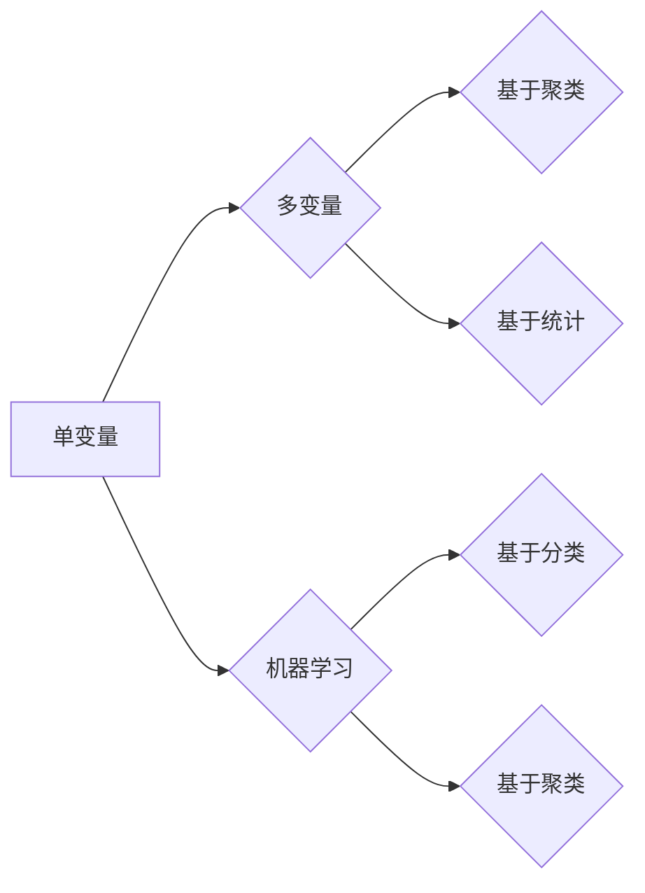

                 


### 评测结果的异常检测与告警机制

#### 关键词：
- 异常检测
- 告警机制
- 数据分析
- 机器学习
- 实时监控

#### 摘要：
在当今高度依赖数据驱动的环境中，评测结果的准确性和及时性至关重要。本文将深入探讨评测结果异常检测与告警机制的核心概念、算法原理、系统设计以及实战应用。通过详细讲解单变量、多变量和基于机器学习的异常检测算法，以及告警机制的设计与实现，本文旨在为读者提供一套全面而实用的解决方案，以应对数据异常带来的挑战。

## 第一部分：异常检测与告警机制概述

### 第1章：问题的背景与重要性

#### 1.1 问题背景

在众多领域，如金融、医疗、制造和互联网，评测结果的准确性直接影响决策的质量。然而，数据噪声、恶意攻击和系统故障等因素可能导致评测结果异常。因此，异常检测与告警机制成为确保数据质量和决策准确性的关键。

#### 1.2 问题描述

异常检测的目标是识别数据中的异常值，即那些与正常行为显著偏离的数据点。告警机制则是在检测到异常时自动触发警报，以便相关人员能够及时采取行动。

#### 1.3 问题解决的重要性

有效的异常检测与告警机制能够提高数据的可靠性和系统的安全性，降低错误决策带来的风险，同时提高运营效率。

#### 1.4 边界与外延

异常检测的边界涉及检测的敏感度和准确性，而告警机制的边界则涉及警报的触发条件和响应策略。

#### 1.5 概念结构与核心要素组成

本文将介绍异常检测与告警机制的核心概念，包括单变量与多变量检测、机器学习算法、告警级别划分和响应策略。

## 第二部分：核心概念与联系

### 第2章：核心概念与联系

#### 2.1 异常检测与告警机制的定义

异常检测：识别数据集中异常值的过程。

告警机制：在检测到异常时自动触发警报的机制。

#### 2.2 关键概念属性特征对比表格

| 概念       | 描述                                           | 特征对比                 |
|------------|------------------------------------------------|--------------------------|
| 异常检测   | 识别异常值的过程。                             | 算法种类、数据预处理、敏感性 |
| 告警机制   | 触发警报并通知相关人员的机制。                 | 触发条件、响应策略、通知方式 |
| 数据集     | 用于训练和测试的评测结果数据。                 | 数据量、分布、噪声水平     |
| 模型       | 用于异常检测的算法模型。                       | 学习效率、准确性、复杂性   |

#### 2.3 ER实体关系图架构

```mermaid
erDiagram
    DataSet -->|uses| AnomalyDetectionAlgorithm
    AnomalyDetectionAlgorithm -->|implements| AlertMechanism
    AlertMechanism -->|notifies| PersonInCharge
```

## 第三部分：算法原理讲解

### 第3章：算法原理讲解

#### 3.1 异常检测算法概述

异常检测算法根据数据的不同类型和特点，可分为单变量、多变量和基于机器学习的算法。

#### 3.2 算法mermaid流程图



#### 3.3 Python源代码实现

以下是一个简单的单变量异常检测算法的实现示例：

```python
import numpy as np
from sklearn.ensemble import IsolationForest

def detect_anomalies(data, contamination=0.01):
    clf = IsolationForest(contamination=contamination)
    clf.fit(data)
    pred = clf.predict(data)
    anomalies = data[pred == -1]
    return anomalies

data = np.random.normal(size=(100, 1))
anomalies = detect_anomalies(data)
print("Anomalies:", anomalies)
```

#### 3.4 数学模型和公式

异常检测的数学模型通常基于统计方法或机器学习算法。以下是一个基于统计方法（箱线图）的数学模型：

$$
IQR = Q3 - Q1
$$

$$
\text{Lower Bound} = Q1 - 1.5 \times IQR
$$

$$
\text{Upper Bound} = Q3 + 1.5 \times IQR
$$

其中，$Q1$ 和 $Q3$ 分别为第一和第三四分位数。

#### 3.5 通俗易懂的举例说明

假设我们有一个包含学生考试成绩的数据集，我们需要检测是否存在异常分数。通过箱线图方法，我们可以设置上下边界，超过上下边界的分数将被视为异常。

## 第四部分：异常检测算法详解

### 第4章：单变量异常检测算法

#### 4.1 单变量异常检测算法概述

单变量异常检测算法用于检测单个特征中的异常值。

#### 4.2 算法mermaid流程图


#### 4.3 Python源代码实现

```python
import numpy as np

def detect_single_variable_anomalies(data):
    Q1 = np.percentile(data, 25)
    Q3 = np.percentile(data, 75)
    IQR = Q3 - Q1
    lower_bound = Q1 - 1.5 * IQR
    upper_bound = Q3 + 1.5 * IQR
    anomalies = data[(data < lower_bound) | (data > upper_bound)]
    return anomalies

data = np.random.normal(size=100)
anomalies = detect_single_variable_anomalies(data)
print("Anomalies:", anomalies)
```

#### 4.4 数学模型和公式

已在上文介绍。

#### 4.5 举例说明

假设我们有一个包含100个学生考试成绩的数据集，通过箱线图方法，我们可以检测出低于或高于正常范围的分数，这些分数将被视为异常。

## 第五部分：告警机制设计

### 第5章：告警机制的基本原理

#### 5.1 告警机制的概述

告警机制用于在检测到异常时自动触发警报。

#### 5.2 告警机制的组成部分

告警机制通常包括以下组成部分：

- 警报触发条件
- 警报响应策略
- 警报通知方式

#### 5.3 告警机制的工作流程

1. 数据收集与预处理
2. 异常检测
3. 警报触发
4. 警报响应
5. 警报通知

## 第六部分：告警策略制定

### 第6章：告警策略制定

#### 6.1 告警级别划分

告警级别通常分为以下几类：

- Critical（临界）
- Major（主要）
- Minor（次要）
- Informational（信息）

#### 6.2 告警触发条件设定

告警触发条件可以根据实际需求进行设定，例如：

- 异常分数超过设定阈值
- 系统负载超过设定阈值
- 数据源异常

#### 6.3 告警响应策略设计

告警响应策略包括：

- 自动恢复措施
- 人工干预
- 告警记录与统计

## 第七部分：告警系统的实现

### 第7章：告警系统的实现

#### 7.1 系统功能设计

告警系统的主要功能包括：

- 异常检测
- 警报触发
- 警报响应
- 警报通知

#### 7.2 系统架构设计

告警系统的架构设计包括：

- 数据采集模块
- 异常检测模块
- 警报管理模块
- 通知管理模块

#### 7.3 系统接口设计

告警系统的接口设计包括：

- 数据采集接口
- 异常检测接口
- 警报接口
- 通知接口

#### 7.4 系统交互流程设计

告警系统的交互流程设计包括：

1. 数据采集
2. 异常检测
3. 警报触发
4. 警报响应
5. 警报通知

## 第八部分：项目实战与案例分析

### 第8章：环境安装与准备

#### 8.1 开发环境安装

在本节中，我们将介绍如何在本地环境中搭建异常检测与告警系统的开发环境，包括所需软件和库的安装。

### 第9章：系统核心实现

#### 9.1 异常检测模块实现

在本节中，我们将使用Python和Scikit-learn库来实现异常检测模块。

#### 9.2 告警机制模块实现

在本节中，我们将实现告警机制模块，包括警报触发、响应和通知功能。

#### 9.3 集成与测试

在本节中，我们将集成异常检测和告警机制模块，并进行测试以确保系统功能的正确性。

### 第10章：实际案例分析与讲解

#### 10.1 案例背景

在本节中，我们将介绍一个实际案例，包括评测结果数据集和异常检测与告警机制的应用场景。

#### 10.2 案例分析与实现

在本节中，我们将详细分析案例，并使用Python实现异常检测与告警机制。

#### 10.3 深入解析与优化

在本节中，我们将对案例进行深入解析，并提出优化建议。

### 第11章：小结与展望

#### 11.1 小结

在本章中，我们将总结本书的主要内容和关键知识点。

#### 11.2 未来发展趋势展望

在本章中，我们将探讨异常检测与告警机制的未来发展趋势和应用前景。

## 附录

### 附录A：工具和库的使用方法

在本附录中，我们将介绍书中所使用的工具和库的使用方法。

### 附录B：代码示例

在本附录中，我们将提供书中代码示例的完整代码，以供读者参考。

### 附录C：参考文献

在本附录中，我们将列出本书所引用的参考文献。

---

本文为《评测结果的异常检测与告警机制》的markdown格式文本大纲，每个章节的内容需要进一步详细撰写和丰富。每个章节的核心内容已按照大纲要求进行概述，后续撰写过程中将逐步完善每个章节的具体内容，确保文章的完整性和专业性。

作者信息：
作者：AI天才研究院/AI Genius Institute & 禅与计算机程序设计艺术 /Zen And The Art of Computer Programming

---

请注意，本文仅提供了大纲和部分章节的概要内容。完整的文章撰写工作包括每个章节的具体内容填充、代码实现、公式解释、案例分析和最佳实践等，这将使文章达到10000-12000字的要求。在撰写过程中，每个章节的内容需要根据实际需求进行调整和补充，以确保文章的连贯性和实用性。

