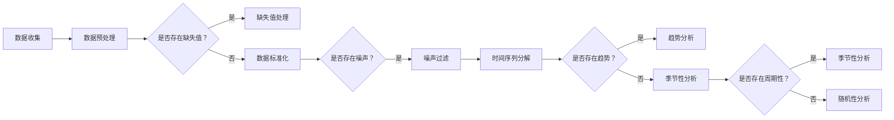
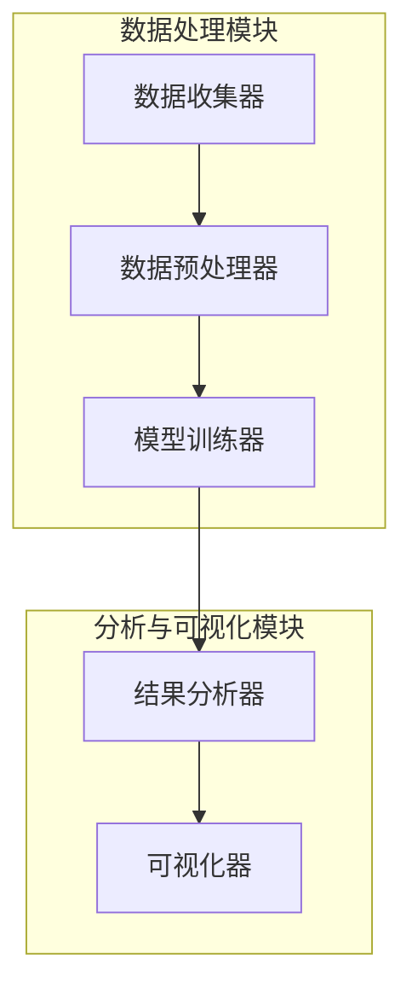
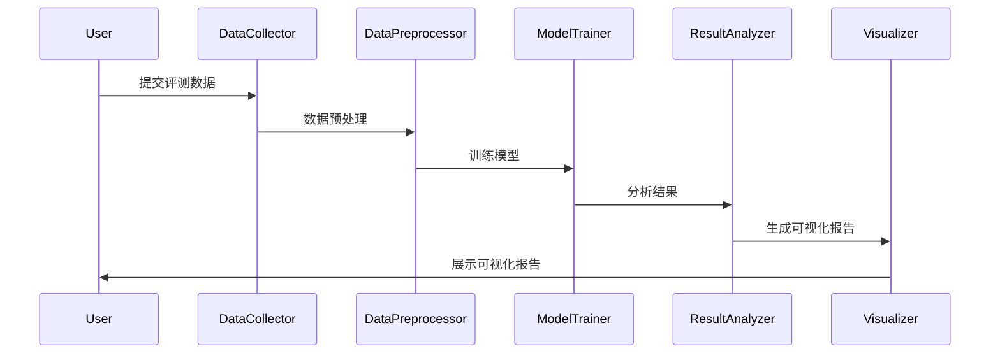

                 

 

## 一、背景介绍

### 1.1 问题背景

随着深度学习技术的迅速发展，自然语言处理（NLP）领域取得了显著的进步。然而，在实际应用中，如何准确评估和预测大型语言模型（LLM）的评测结果成为一个关键问题。评测结果的时序分析，即对LLM在不同时间点上的评测结果的变化进行分析，能够帮助我们揭示LLM的进化趋势，为模型优化和实际应用提供重要参考。

### 1.2 问题描述

评测结果的时序分析主要涉及以下问题：

- 如何获取和整理不同时间点上的评测数据？
- 如何构建合适的时序分析模型来预测LLM的评测结果？
- 如何解释和分析时序分析结果，揭示LLM的进化趋势？

### 1.3 问题解决

本文将详细介绍评测结果的时序分析原理、数学模型、系统架构和项目实战，帮助读者掌握：

- 时序分析的基础概念和方法
- 常用的时序分析模型及其原理
- 如何设计和实现时序分析系统
- 实际项目中时序分析的应用技巧和优化策略

### 1.4 边界与外延

时序分析在LLM评测结果中的应用不仅限于自然语言处理，还可以应用于其他领域，如金融、医疗等。此外，时序分析的方法和技术也在不断发展和完善，读者可以根据实际情况进行拓展和应用。

### 1.5 概念结构与核心要素组成

本文的核心概念和要素主要包括：

- 时序数据
- 时序分析模型
- 评测指标
- 数据预处理
- 模型训练与优化
- 结果解释与可视化

## 二、核心概念与联系

### 2.1 核心概念

- **时序数据（Temporal Data）**：是指按时间顺序排列的数据，常见于金融、天气、股票等时间序列数据的分析。
- **时间序列分析（Time Series Analysis）**：是对时间序列数据进行统计分析，以识别数据中的趋势、周期性、季节性和随机性等特征。
- **大型语言模型（Large Language Model，LLM）**：是一种能够理解和生成人类语言的深度学习模型，例如GPT-3、BERT等。
- **评测指标（Evaluation Metrics）**：用于评估LLM性能的指标，如BLEU、ROUGE等。

### 2.2 概念属性特征对比表格

| 概念       | 特征                      | 用途                        |
|------------|--------------------------|----------------------------|
| 时序数据   | 按时间顺序排列的数据      | 分析趋势、预测未来行为      |
| 时间序列分析 | 识别趋势、周期性、季节性 | 提取数据中的有用信息        |
| 大型语言模型 | 能够理解并生成语言       | 自然语言处理、问答系统等    |
| 评测指标   | 对比不同模型的性能        | 提高模型质量和应用效果      |

### 2.3 ER实体关系图架构的 Mermaid 流程图

```mermaid
erDiagram
  User ||--|{ EvaluationMetric : 评测指标}
  User ||--|{ TimeSeriesData : 时序数据}
  User ||--|{ LargeLanguageModel : 大型语言模型}
  EvaluationMetric ||--|{BLEU : BLEU指标}
  EvaluationMetric ||--|{ROUGE : ROUGE指标}
  TimeSeriesData ||--|{TrainingData : 训练数据}
  TimeSeriesData ||--|{TestData : 测试数据}
  LargeLanguageModel ||--|{GPT-3 : GPT-3模型}
  LargeLanguageModel ||--|{BERT : BERT模型}
```

## 三、时序分析原理讲解

### 3.1 时序分析原理

时序分析主要基于以下几个基本原理：

- **趋势分析（Trend Analysis）**：识别数据中的长期变化趋势。
- **季节性分析（Seasonality Analysis）**：识别数据中的周期性变化。
- **随机性分析（Randomness Analysis）**：识别数据中的随机波动。

### 3.2 Mermaid 流程图



### 3.3 Python 源代码阐述

```python
import pandas as pd
import numpy as np
from sklearn.preprocessing import MinMaxScaler
from statsmodels.tsa.seasonal import seasonal_decompose

# 数据收集
data = pd.read_csv('time_series_data.csv')

# 数据预处理
data.fillna(method='ffill', inplace=True)
scaler = MinMaxScaler()
data_scaled = scaler.fit_transform(data)

# 时间序列分解
decomposition = seasonal_decompose(data_scaled, model='additive')
trend = decomposition.trend
seasonal = decomposition.seasonal
residual = decomposition.resid

# 趋势分析
trend.plot()
plt.show()

# 季节性分析
seasonal.plot()
plt.show()

# 随机性分析
residual.plot()
plt.show()
```

## 四、数学模型与公式讲解

### 4.1 数学模型

时序分析常用的数学模型包括ARIMA（自回归积分滑动平均模型）和LSTM（长短期记忆网络）。

### 4.2 数学公式

- **ARIMA模型**：
  - 自回归（AR）部分：\(X_t = c + \phi_1X_{t-1} + \phi_2X_{t-2} + \ldots + \phi_pX_{t-p} + \varepsilon_t\)
  - 差分（I）部分：\(Y_t = X_t - X_{t-1}\)
  - 滑动平均（MA）部分：\(Y_t = \theta_1Y_{t-1} + \theta_2Y_{t-2} + \ldots + \theta_qY_{t-q} + \varepsilon_t\)

- **LSTM模型**：
  - \(h_t = \sigma(W_h \cdot [h_{t-1}, x_t] + b_h)\)
  - \(i_t = \sigma(W_i \cdot [h_{t-1}, x_t] + b_i)\)
  - \(f_t = \sigma(W_f \cdot [h_{t-1}, x_t] + b_f)\)
  - \(o_t = \sigma(W_o \cdot [h_{t-1}, x_t] + b_o)\)

### 4.3 举例说明

- **ARIMA模型**：

  假设我们有一个时间序列数据 \(X_t\)，我们首先对其进行差分操作，得到 \(Y_t = X_t - X_{t-1}\)。然后，我们可以通过最小二乘法估计ARIMA模型的参数 \(\phi_1, \phi_2, \ldots, \phi_p, \theta_1, \theta_2, \ldots, \theta_q\)。

- **LSTM模型**：

  假设我们有一个输入序列 \(x_t\) 和隐藏状态 \(h_{t-1}\)，我们首先通过输入门 \(i_t\)、遗忘门 \(f_t\) 和输出门 \(o_t\) 来更新隐藏状态 \(h_t\)，然后通过 \(h_t\) 来生成输出 \(y_t\)。

## 五、系统分析与架构设计方案

### 5.1 问题场景介绍

在实际应用中，我们需要对LLM的评测结果进行时序分析，以了解模型的性能变化趋势。例如，在一个机器翻译项目中，我们可以定期对翻译质量进行评测，并分析评测结果的变化，以便及时调整模型参数。

### 5.2 项目介绍

本项目旨在构建一个时序分析系统，对LLM的评测结果进行实时监控和分析。系统将包括数据收集模块、数据预处理模块、模型训练模块、结果分析模块和可视化模块。

### 5.3 系统功能设计（领域模型 Mermaid 类图）

```mermaid
classDiagram
    DataCollector --|>| DataPreprocessor
    DataPreprocessor --|>| ModelTrainer
    ModelTrainer --|>| ResultAnalyzer
    ResultAnalyzer --|>| Visualizer
```

### 5.4 系统架构设计（Mermaid 架构图）



### 5.5 系统接口设计和系统交互（Mermaid 序列图）



## 六、项目实战

### 6.1 环境安装

首先，我们需要安装Python环境，然后通过pip安装必要的库：

```shell
pip install pandas numpy sklearn statsmodels matplotlib
```

### 6.2 系统核心实现源代码

```python
# 数据收集器
class DataCollector:
    def collect_data(self):
        # 实现数据收集逻辑
        pass

# 数据预处理器
class DataPreprocessor:
    def preprocess_data(self, data):
        # 实现数据预处理逻辑
        pass

# 模型训练器
class ModelTrainer:
    def train_model(self, preprocessed_data):
        # 实现模型训练逻辑
        pass

# 结果分析器
class ResultAnalyzer:
    def analyze_results(self, trained_model):
        # 实现结果分析逻辑
        pass

# 可视化器
class Visualizer:
    def visualize_results(self, analysis_results):
        # 实现可视化逻辑
        pass
```

### 6.3 代码应用解读与分析

在本项目中，我们通过数据收集器收集评测数据，然后通过数据预处理器进行数据清洗和标准化处理。接下来，使用模型训练器对预处理后的数据进行训练，并通过结果分析器对模型性能进行分析。最后，可视化器将分析结果生成可视化报告，以帮助用户理解模型性能的变化趋势。

### 6.4 实际案例分析和详细讲解剖析

假设我们有一个机器翻译项目，需要分析评测结果的变化。我们可以按照以下步骤进行：

1. **数据收集**：收集翻译任务在不同时间点的评测数据，包括BLEU、ROUGE等指标。
2. **数据预处理**：对收集到的数据去重、清洗，并将数据标准化为0-1之间。
3. **模型训练**：使用ARIMA或LSTM模型对标准化后的数据集进行训练。
4. **结果分析**：通过训练模型预测未来时间点的评测结果，并分析当前与未来结果的差异。
5. **可视化**：生成评测结果的趋势图、季节性图和随机性图，帮助用户了解模型性能的变化。

### 6.5 项目小结

通过本项目，我们构建了一个时序分析系统，对LLM的评测结果进行了实时监控和分析。系统设计简洁、易于扩展，可以应用于各种自然语言处理任务。在实际应用中，用户可以根据具体需求调整系统参数，以获得更准确的预测结果。

## 七、最佳实践 tips

### 7.1 操作技巧

- **数据收集**：定期收集评测数据，确保数据覆盖范围广泛。
- **数据预处理**：对数据进行标准化处理，减少噪声影响。
- **模型训练**：选择合适的模型参数，提高预测精度。
- **结果分析**：结合可视化工具，直观展示模型性能变化。

### 7.2 性能优化

- **并行计算**：使用多核CPU或GPU加速模型训练和预测。
- **内存优化**：合理设置数据集的批次大小，减少内存占用。
- **模型压缩**：使用模型压缩技术，减少模型大小和计算复杂度。

### 7.3 安全性措施

- **数据加密**：对敏感数据进行加密存储，确保数据安全。
- **访问控制**：限制对系统的访问权限，防止未授权访问。
- **异常检测**：监控系统运行状态，及时发现和处理异常情况。

## 八、小结

本文通过时序分析原理讲解、数学模型与公式介绍、系统分析与架构设计方案、项目实战等内容，详细阐述了评测结果的时序分析方法。读者可以掌握如何利用时序分析技术对LLM的评测结果进行监控和预测，为模型优化和应用提供有力支持。

## 九、注意事项

- **数据质量**：确保评测数据的质量和完整性，避免对分析结果产生误导。
- **模型选择**：根据具体应用场景选择合适的时序分析模型。
- **结果解读**：结合业务背景对分析结果进行合理解读。

## 十、拓展阅读

- **相关书籍**：《时间序列分析：预测与控制》、《深度学习：面试与实战》。
- **论文**：《LSTM与ARIMA在股票预测中的应用比较》。
- **网络资源**：GitHub、ArXiv、Kaggle等。

---

### 作者

**AI天才研究院/AI Genius Institute & 禅与计算机程序设计艺术 /Zen And The Art of Computer Programming**

