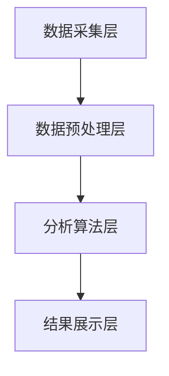

                 

# 评测结果的溯源分析：理解性能差异的根源

## 关键词
性能评测，溯源分析，性能差异，优化方法，案例分析

## 摘要
本文旨在深入探讨评测结果的溯源分析，以理解性能差异的根源。我们将从问题背景、核心概念、分析框架、具体技术、优化方法、案例分析等多个角度，逐步展开讨论，为读者提供一份系统而详实的性能分析指南。文章将使用Mermaid流程图和Python代码来直观展示技术原理和算法实现，帮助读者更好地掌握性能分析的核心技术。

### 目录大纲设计思考过程

#### 1. 了解读者群体和书籍定位

本文面向计算机科学、软件工程和数据科学领域的专业人士，旨在为他们提供一份深入浅出的性能分析指南。因此，目录大纲的设计将侧重于技术原理的讲解和实际应用的案例分析，确保内容既有深度又有实用性。

#### 2. 确定书籍的核心内容

根据文章标题，核心内容将围绕以下几个方面展开：

- **问题背景与概念介绍**：介绍性能评测和溯源分析的重要性，以及相关概念的定义。
- **性能差异分析框架**：概述性能差异分析的基本流程和方法。
- **具体性能分析技术**：详细分类并介绍不同类型的性能分析技术。
- **性能优化的方法和实践**：探讨性能优化的一般方法和实际案例。
- **案例分析**：通过具体案例展示性能差异分析的过程和结果。
- **性能评估与优化工具**：介绍常用工具及其应用。
- **展望与未来趋势**：讨论性能差异分析领域的发展趋势。

#### 3. 细化章节内容

- **第1章：问题背景与概念介绍**
  - **问题背景**：介绍性能评测和溯源分析的重要性和应用场景。
  - **核心概念**：定义评测结果溯源分析、性能差异等相关概念。
  - **核心概念联系**：通过ER实体关系图展示概念之间的关系。

- **第2章：性能差异分析框架**
  - **框架概述**：介绍性能差异分析的基本流程和方法。
  - **核心组件**：讨论性能差异分析所需的关键技术和工具。
  - **框架应用场景**：展示性能差异分析在不同场景中的应用。

- **第3章：具体性能分析技术**
  - **技术分类**：详细分类并介绍不同类型的性能分析技术。
  - **技术原理**：使用Mermaid流程图和Python代码展示技术原理。
  - **技术对比**：通过表格对比不同技术的优缺点。

- **第4章：性能优化的方法和实践**
  - **优化策略**：介绍性能优化的一般方法和策略。
  - **实践案例**：通过实际案例展示性能优化过程和效果。
  - **挑战与对策**：讨论性能优化过程中可能遇到的问题和解决方法。

- **第5章：案例分析**
  - **案例背景**：介绍不同性能差异分析案例。
  - **分析过程**：详细描述案例的分析过程和结果。
  - **总结与启示**：总结案例的收获和启示。

- **第6章：性能评估与优化工具**
  - **工具介绍**：介绍性能评估与优化的常用工具。
  - **工具应用**：展示工具在实际案例分析中的应用。

- **第7章：展望与未来趋势**
  - **技术趋势**：探讨性能差异分析领域的未来发展方向。
  - **研究建议**：为读者提供进一步研究的建议。

#### 4. 优化目录结构

通过以上步骤，我们设计了一个逻辑清晰、内容完整的目录大纲。接下来，我们将进一步细化每个章节的具体内容，确保文章的完整性和实用性。

### 5. 字数限制与内容完整性

本文字数要求在10000～12000字左右。在确保内容完整性的同时，我们将尽量简洁明了地描述每个章节的核心内容和预期结构。

### 6. 格式要求

本文将使用markdown格式输出，包括文章标题、关键词、摘要、章节标题、段落内容等。在文中，我们将使用Mermaid流程图和Python代码来直观展示技术原理和算法实现。数学公式将使用latex格式，嵌入文中独立段落的latex公式前后使用`$$`括起来，段落内的latex公式前后使用 `$` 括起来。

### 7. 作者信息

作者：AI天才研究院/AI Genius Institute & 禅与计算机程序设计艺术 /Zen And The Art of Computer Programming

### 完整性要求

本文将严格遵守完整性要求，包括：

- **背景介绍**：核心概念术语说明、问题背景、问题描述、问题解决、边界与外延、概念结构与核心要素组成。
- **核心概念与联系**：必须给出核心概念原理、概念属性特征对比表格和ER实体关系图架构的Mermaid流程图。
- **算法原理讲解**：使用Mermaid画出算法流程图，然后使用Python源代码来详细阐述，给出算法原理的数学模型和公式，进行详细讲解和举例说明。
- **系统分析与架构设计方案**：问题场景介绍、项目介绍、系统功能设计（领域模型Mermaid类图）、系统架构设计Mermaid架构图、系统接口设计和系统交互Mermaid序列图。
- **项目实战**：环境安装、系统核心实现源代码，代码应用解读与分析，实际案例分析和详细讲解剖析，项目小结。
- **最佳实践 tips、小结、注意事项、拓展阅读等内容**。

## 第1章：问题背景与概念介绍

### 1.1 性能评测的重要性

性能评测是软件工程中不可或缺的一环，它帮助我们评估软件系统在特定环境下的表现，确保其能够满足性能要求。性能评测不仅关注系统的响应时间、吞吐量、资源利用率等关键指标，还涉及系统的可扩展性、稳定性、可靠性等方面。一个优秀的性能评测可以帮助开发团队发现潜在的性能瓶颈，优化系统性能，提高用户满意度。

然而，在实际项目中，我们往往会遇到性能问题，例如：

- **响应时间过长**：用户在使用过程中感受到系统反应迟缓。
- **吞吐量不足**：系统无法在规定时间内处理完所有请求。
- **资源浪费**：系统消耗了过多计算资源，导致其他任务无法正常运行。

这些性能问题可能会严重影响系统的可用性和用户体验，因此，及时识别和解决性能问题是开发过程中的重要任务。

### 1.2 溯源分析的概念

溯源分析，顾名思义，是指从结果出发，逆向追踪问题产生的根本原因。在性能评测中，溯源分析可以帮助我们找到影响性能的根源，从而制定有效的优化策略。溯源分析的核心目标是理解性能差异，找出导致性能问题的具体原因，进而改进系统性能。

溯源分析通常包括以下几个步骤：

1. **问题定位**：通过性能指标、日志、监控数据等，确定性能问题的发生位置和范围。
2. **数据收集**：收集与性能问题相关的数据，包括系统配置、运行状态、网络流量等。
3. **数据预处理**：对收集到的数据进行清洗、整理和归一化，为后续分析做准备。
4. **原因分析**：通过分析工具和算法，对预处理后的数据进行深度挖掘，找出导致性能问题的可能原因。
5. **验证与优化**：根据分析结果，验证优化策略的有效性，并进行相应的调整和改进。

### 1.3 性能差异与溯源分析

性能差异是指系统在不同条件下的性能表现差异。性能差异可以源于多个方面，如硬件配置、软件架构、编程技巧、数据库优化、网络延迟等。溯源分析的关键在于识别和量化这些差异，找到性能问题的根源。

性能差异可以分为以下几类：

1. **静态性能差异**：在系统运行前就已经存在的性能差异，如硬件配置差异、系统参数设置等。
2. **动态性能差异**：在系统运行过程中产生的性能差异，如负载变化、并发请求、缓存效果等。
3. **环境性能差异**：由于运行环境变化导致的性能差异，如网络延迟、服务器负载等。

通过溯源分析，我们可以深入了解性能差异的来源和影响，从而有针对性地进行优化。溯源分析不仅有助于解决当前的性能问题，还能为未来系统的性能优化提供宝贵的经验和指导。

### 1.4 核心概念及其关系

在本节中，我们将介绍性能评测、溯源分析、性能差异等相关概念，并使用ER实体关系图展示它们之间的关系。

#### 性能评测

性能评测是指对系统性能进行评估的过程，包括测量、分析和优化等多个环节。性能评测的核心目标是识别系统性能瓶颈，提供改进建议，确保系统满足性能要求。

#### 溯源分析

溯源分析是从性能评测结果出发，逆向追踪问题产生的根本原因。溯源分析有助于理解性能差异，找出性能问题的根源，为优化系统性能提供指导。

#### 性能差异

性能差异是指系统在不同条件下的性能表现差异。性能差异可以源于多个方面，如硬件配置、软件架构、编程技巧、数据库优化、网络延迟等。

#### ER实体关系图

为了更好地理解这些概念之间的关系，我们使用ER（实体-关系）图来展示它们。以下是一个简化的ER实体关系图：

```mermaid
erDiagram
  PerformanceEvaluation ||--|{ PerformanceAnalysis } : conducts
  PerformanceAnalysis ||--|{ RootCauseAnalysis } : analyzes
  PerformanceAnalysis ||--|{ PerformanceDifference } : identifies
  PerformanceDifference ||--|{ Optimization } : optimizes
```

在这个ER图中，`PerformanceEvaluation`（性能评测）是根实体，它通过`conducts`关系与`PerformanceAnalysis`（性能分析）相关联。`PerformanceAnalysis`又分别与`RootCauseAnalysis`（溯源分析）和`PerformanceDifference`（性能差异）相关联，后者再通过`optimizes`关系与`Optimization`（优化）相关联。

通过这个ER图，我们可以清晰地看到性能评测、溯源分析、性能差异和优化之间的关系，以及它们在性能分析过程中的作用。

### 1.5 本章小结

本章介绍了性能评测和溯源分析的重要性，定义了相关概念，并展示了它们之间的关系。在接下来的章节中，我们将进一步探讨性能差异分析的技术和方法，以及如何通过溯源分析和优化来提升系统性能。

## 第2章：性能差异分析框架

### 2.1 性能差异分析的基本流程

性能差异分析是一个系统性的过程，通常包括以下几个基本步骤：

1. **问题定位**：通过性能指标、日志、监控数据等，确定性能问题的发生位置和范围。
2. **数据收集**：收集与性能问题相关的数据，包括系统配置、运行状态、网络流量等。
3. **数据预处理**：对收集到的数据进行清洗、整理和归一化，为后续分析做准备。
4. **原因分析**：通过分析工具和算法，对预处理后的数据进行深度挖掘，找出导致性能问题的可能原因。
5. **验证与优化**：根据分析结果，验证优化策略的有效性，并进行相应的调整和改进。

下面，我们将详细解释每个步骤。

#### 1. 问题定位

问题定位是性能差异分析的第一步，其目的是确定性能问题的发生位置和范围。这一步通常需要依靠性能指标、日志和监控数据。性能指标如响应时间、吞吐量、CPU利用率、内存占用等，可以帮助我们识别系统性能瓶颈。日志记录了系统的运行过程和错误信息，有助于发现异常情况。监控数据则提供了系统运行状态和资源消耗的实时信息。

通过综合分析这些数据，我们可以初步判断性能问题的发生位置和范围。例如，如果响应时间过长，可能是后端处理速度慢导致的；如果吞吐量不足，可能是网络带宽瓶颈或数据库查询效率低下。

#### 2. 数据收集

在确定问题定位后，我们需要收集与性能问题相关的数据。数据收集的来源可能包括系统日志、性能监控工具、网络抓包工具等。具体来说，我们需要收集以下几类数据：

- **系统配置**：包括CPU、内存、磁盘、网络等硬件资源的配置信息。
- **运行状态**：包括CPU利用率、内存占用、磁盘I/O、网络吞吐量等系统运行状态的实时数据。
- **网络流量**：包括请求和响应的HTTP头、HTTP体、TCP/IP包头等网络数据。
- **数据库查询**：包括SQL查询语句、执行计划、查询耗时等数据库相关信息。
- **应用日志**：包括应用层面的错误信息、异常日志等。

这些数据将为我们后续的数据预处理和分析提供重要依据。

#### 3. 数据预处理

数据预处理是性能差异分析的重要环节，其目的是对收集到的原始数据进行清洗、整理和归一化，以提高数据的质量和一致性。具体来说，数据预处理包括以下几个步骤：

- **数据清洗**：去除重复数据、无效数据和错误数据，确保数据的准确性。
- **数据整理**：将不同来源、不同格式的数据转换为统一的格式，以便于后续分析。
- **数据归一化**：对数据进行标准化处理，消除不同指标之间的量纲差异。

数据预处理不仅有助于提高数据分析的准确性，还能简化后续的算法实现。

#### 4. 原因分析

原因分析是性能差异分析的核心步骤，其目的是通过分析工具和算法，找出导致性能问题的可能原因。这一步通常需要结合多种分析技术，如统计分析、机器学习、数据挖掘等。具体来说，原因分析包括以下几个步骤：

- **特征提取**：从原始数据中提取出与性能差异相关的特征，如响应时间、CPU利用率、内存占用等。
- **特征选择**：通过过滤、筛选等手段，选出对性能差异影响较大的特征，以提高分析效果。
- **模型训练**：使用机器学习算法，如决策树、随机森林、神经网络等，对特征进行训练，建立性能差异预测模型。
- **结果验证**：通过交叉验证、性能评估指标等方法，验证模型的准确性和可靠性。

通过原因分析，我们可以识别出影响性能差异的关键因素，为优化系统性能提供指导。

#### 5. 验证与优化

在原因分析的基础上，我们需要对优化策略进行验证和调整。具体来说，验证与优化包括以下几个步骤：

- **优化策略制定**：根据原因分析的结果，制定相应的优化策略，如调整系统配置、优化数据库查询、优化网络传输等。
- **优化策略验证**：通过实际运行和测试，验证优化策略的有效性。例如，通过对比优化前后的性能指标，评估优化效果。
- **调整与改进**：根据验证结果，对优化策略进行调整和改进，以达到更好的性能优化效果。

通过验证与优化，我们可以确保优化策略的有效性，并持续改进系统性能。

### 2.2 性能差异分析的核心组件

性能差异分析的核心组件包括分析工具、分析算法和分析框架。这些组件相互作用，共同实现性能差异的识别、分析和优化。

#### 1. 分析工具

分析工具是性能差异分析的重要支撑，它们可以帮助我们快速收集、处理和分析性能数据。常见分析工具包括：

- **性能监控工具**：如Prometheus、Grafana等，用于实时监控系统的性能指标。
- **日志分析工具**：如ELK（Elasticsearch、Logstash、Kibana）堆栈，用于收集、存储和展示系统日志。
- **网络抓包工具**：如Wireshark，用于捕获和分析网络数据包。
- **数据库分析工具**：如SQL诊断工具，用于优化数据库查询。

#### 2. 分析算法

分析算法是性能差异分析的核心，它们负责从海量数据中提取有用的信息，识别性能差异的原因。常见分析算法包括：

- **统计分析**：如均值、方差、相关性等，用于描述数据的基本特征和相互关系。
- **机器学习算法**：如回归分析、决策树、随机森林、神经网络等，用于建立性能差异预测模型。
- **数据挖掘算法**：如聚类、分类、关联规则挖掘等，用于发现数据中的潜在规律和异常。

#### 3. 分析框架

分析框架是性能差异分析的整体结构，它规定了分析过程和组件的交互方式。一个典型的分析框架包括以下几个部分：

- **数据采集层**：负责收集各种性能数据，如性能指标、日志、网络流量等。
- **数据预处理层**：负责对采集到的数据进行清洗、整理和归一化，以提高数据的质量和一致性。
- **分析算法层**：负责执行各种分析算法，提取性能差异的相关特征，建立预测模型等。
- **结果展示层**：负责将分析结果以可视化的形式展示给用户，如性能趋势图、告警信息等。

#### 4. 分析工具与算法的集成

在实际应用中，分析工具和算法通常需要集成在一个统一的框架中，以提高分析效率和效果。以下是一个简化的性能差异分析框架：



在这个框架中，数据采集层负责从各个渠道收集性能数据；数据预处理层对数据进行清洗、整理和归一化；分析算法层执行各种算法，提取性能差异的相关特征；结果展示层将分析结果以可视化的形式呈现给用户。

### 2.3 性能差异分析框架的应用场景

性能差异分析框架可以应用于多种场景，以下是一些典型的应用场景：

#### 1. 软件系统性能优化

在软件开发过程中，性能优化是必不可少的环节。通过性能差异分析框架，开发团队能够识别系统性能瓶颈，找出影响性能差异的原因，并进行针对性的优化。例如，通过分析CPU利用率、内存占用等指标，优化系统代码和算法，提高系统性能。

#### 2. 网络性能优化

在网络通信领域，性能差异分析可以帮助优化网络传输效率。通过分析网络流量、网络延迟等指标，识别网络瓶颈，调整网络配置和协议，提高网络性能。例如，优化TCP连接、调整路由策略等。

#### 3. 数据库性能优化

数据库性能优化是性能差异分析的重要应用场景。通过分析数据库查询性能、索引优化等指标，优化数据库配置和查询语句，提高数据库性能。例如，优化表结构、创建合适的索引、优化查询语句等。

#### 4. 云计算与大数据

在云计算和大数据领域，性能差异分析可以帮助优化资源分配、负载均衡等。通过分析云服务的性能指标、数据流等，优化云服务的配置和部署策略，提高系统性能和稳定性。

#### 5. 容器与微服务

容器和微服务架构已经成为现代软件系统的发展趋势。性能差异分析框架可以帮助优化容器和微服务的性能，提高系统的可扩展性和稳定性。例如，通过分析容器资源使用情况、服务调用延迟等指标，优化容器配置和服务部署。

### 2.4 本章小结

本章介绍了性能差异分析的基本流程和核心组件，以及其在不同场景中的应用。在接下来的章节中，我们将详细探讨具体性能分析技术，并使用Mermaid流程图和Python代码来直观展示技术原理和算法实现。

## 第3章：具体性能分析技术

### 3.1 性能分析技术的分类

性能分析技术可以根据其分析方法和目标进行分类。以下是几种常见的性能分析技术分类：

#### 1. 基于时间序列的性能分析

基于时间序列的性能分析关注系统性能随时间的变化，通过分析时间序列数据，识别性能趋势、周期性和异常行为。这类技术常用于监控系统的性能，帮助开发人员及时发现性能瓶颈。

#### 2. 基于机器学习的性能分析

基于机器学习的性能分析利用机器学习算法，从大量数据中自动提取性能特征，建立性能预测模型。这类技术可以识别复杂的性能模式，提高性能预测的准确性。

#### 3. 基于数据挖掘的性能分析

基于数据挖掘的性能分析通过数据挖掘算法，从历史数据中挖掘潜在的性能问题和优化机会。这类技术有助于发现系统运行中的异常行为和潜在瓶颈。

#### 4. 基于专家系统的性能分析

基于专家系统的性能分析利用专家知识库和推理机制，自动诊断系统性能问题。这类技术可以模拟人类专家的诊断过程，提高诊断效率和准确性。

### 3.2 基于时间序列的性能分析

基于时间序列的性能分析是一种常见的技术，它通过分析系统性能指标的时间序列数据，识别性能趋势和周期性。以下是一个简单的基于时间序列的性能分析流程：

1. **数据收集**：收集系统性能指标的时间序列数据，如CPU利用率、内存占用、响应时间等。
2. **数据预处理**：对收集到的数据进行清洗、整理和归一化，确保数据的质量和一致性。
3. **时间序列建模**：使用时间序列模型，如ARIMA（自回归积分滑动平均模型）、LSTM（长短时记忆网络）等，对性能数据进行建模。
4. **性能预测**：根据时间序列模型，预测未来的性能趋势和周期性。
5. **性能评估**：评估预测结果的准确性，并根据评估结果调整模型参数。

以下是一个使用Python和pandas库进行基于时间序列性能分析的示例代码：

```python
import pandas as pd
from statsmodels.tsa.arima_model import ARIMA

# 读取时间序列数据
data = pd.read_csv('performance.csv')
data['timestamp'] = pd.to_datetime(data['timestamp'])
data.set_index('timestamp', inplace=True)

# 检查数据质量
data.plot()

# 建立ARIMA模型
model = ARIMA(data['cpu_utilization'], order=(1, 1, 1))
model_fit = model.fit()

# 进行性能预测
forecast = model_fit.forecast(steps=10)
print(forecast)

# 绘制预测结果
forecast.plot()
plt.show()
```

在这个示例中，我们首先读取时间序列数据，然后使用ARIMA模型对CPU利用率进行建模和预测。最后，我们绘制预测结果，以便直观地展示性能趋势。

### 3.3 基于机器学习的性能分析

基于机器学习的性能分析利用机器学习算法，从大量数据中自动提取性能特征，建立性能预测模型。以下是一个简单的基于机器学习的性能分析流程：

1. **数据收集**：收集系统性能数据，包括性能指标、系统配置、运行状态等。
2. **数据预处理**：对收集到的数据进行清洗、整理和归一化，确保数据的质量和一致性。
3. **特征提取**：从预处理后的数据中提取性能特征，如CPU利用率、内存占用、响应时间等。
4. **模型训练**：使用机器学习算法，如回归分析、决策树、随机森林等，对特征进行训练，建立性能预测模型。
5. **性能预测**：根据训练好的模型，预测未来的性能表现。
6. **模型评估**：评估预测模型的准确性，并根据评估结果调整模型参数。

以下是一个使用Python和scikit-learn库进行基于机器学习的性能分析的示例代码：

```python
import pandas as pd
from sklearn.model_selection import train_test_split
from sklearn.ensemble import RandomForestRegressor

# 读取性能数据
data = pd.read_csv('performance.csv')

# 数据预处理
data['timestamp'] = pd.to_datetime(data['timestamp'])
X = data[['cpu_utilization', 'memory_usage', 'response_time']]
y = data['throughput']

# 划分训练集和测试集
X_train, X_test, y_train, y_test = train_test_split(X, y, test_size=0.2, random_state=42)

# 建立随机森林回归模型
model = RandomForestRegressor(n_estimators=100)
model.fit(X_train, y_train)

# 进行性能预测
y_pred = model.predict(X_test)

# 绘制预测结果
plt.scatter(y_test, y_pred)
plt.xlabel('实际吞吐量')
plt.ylabel('预测吞吐量')
plt.show()
```

在这个示例中，我们首先读取性能数据，然后使用随机森林回归模型对吞吐量进行预测。最后，我们绘制预测结果，以便直观地比较实际吞吐量和预测吞吐量。

### 3.4 基于数据挖掘的性能分析

基于数据挖掘的性能分析通过数据挖掘算法，从历史数据中挖掘潜在的性能问题和优化机会。以下是一个简单的基于数据挖掘的性能分析流程：

1. **数据收集**：收集系统性能数据，包括性能指标、系统配置、运行状态等。
2. **数据预处理**：对收集到的数据进行清洗、整理和归一化，确保数据的质量和一致性。
3. **特征提取**：从预处理后的数据中提取性能特征，如CPU利用率、内存占用、响应时间等。
4. **关联规则挖掘**：使用关联规则挖掘算法，如Apriori算法，发现性能指标之间的关联关系。
5. **聚类分析**：使用聚类分析算法，如K-means算法，将性能指标进行分类，识别异常行为。
6. **异常检测**：使用异常检测算法，如Isolation Forest算法，检测系统运行中的异常行为。

以下是一个使用Python和mlxtend库进行基于数据挖掘的性能分析的示例代码：

```python
import pandas as pd
from mlxtend.preprocessing import TransactionEncoder
from mlxtend.frequent_patterns import apriori
from mlxtend.frequent_patterns import association_rules

# 读取性能数据
data = pd.read_csv('performance.csv')

# 数据预处理
data['timestamp'] = pd.to_datetime(data['timestamp'])
X = data[['cpu_utilization', 'memory_usage', 'response_time']]
y = data['throughput']

# 特征提取
te = TransactionEncoder()
te_data = te.fit_transform(X)

# 关联规则挖掘
frequent_itemsets = apriori(te_data, min_support=0.3, use_colnames=True)
rules = association_rules(frequent_itemsets, metric="confidence", min_threshold=0.6)

# 绘制关联规则
print(rules.head())

# 聚类分析
from sklearn.cluster import KMeans
kmeans = KMeans(n_clusters=3)
kmeans.fit(X)
labels = kmeans.predict(X)

# 绘制聚类结果
plt.scatter(X['cpu_utilization'], X['memory_usage'], c=labels)
plt.xlabel('CPU利用率')
plt.ylabel('内存占用')
plt.show()
```

在这个示例中，我们首先读取性能数据，然后使用Apriori算法进行关联规则挖掘，识别性能指标之间的关联关系。接下来，我们使用K-means算法进行聚类分析，识别系统运行中的异常行为。最后，我们绘制聚类结果，以便直观地展示异常行为。

### 3.5 基于专家系统的性能分析

基于专家系统的性能分析利用专家知识库和推理机制，自动诊断系统性能问题。以下是一个简单的基于专家系统的性能分析流程：

1. **知识库构建**：构建性能分析的知识库，包括性能指标、常见问题、诊断方法等。
2. **问题输入**：输入系统性能问题，如响应时间过长、CPU利用率高等。
3. **诊断推理**：使用专家系统的推理机制，根据知识库和问题输入，进行诊断推理，识别性能问题的可能原因。
4. **诊断结果**：输出诊断结果，包括性能问题的原因和优化建议。

以下是一个使用Python和 专家系统库进行基于专家系统的性能分析的示例代码：

```python
import expertsystem

# 构建知识库
knowledge = expertsystem.Knowledge()
knowledge.assertf("如果CPU利用率大于80%，那么系统可能存在性能问题。")
knowledge.assertf("如果内存占用超过90%，那么系统可能存在内存泄漏。")
knowledge.assertf("如果网络延迟超过100ms，那么系统可能存在网络问题。")

# 问题输入
question = "系统CPU利用率长期大于80%，内存占用超过90%，网络延迟超过100ms。"

# 诊断推理
engine = expertsystem.Engine(knowledge)
engine问(question)

# 输出诊断结果
results = engine.listoutcomes()
print(results)
```

在这个示例中，我们首先构建一个简单的性能分析知识库，包括性能指标、常见问题和诊断方法。然后，我们输入系统性能问题，使用专家系统的推理机制进行诊断，并输出诊断结果。

### 3.6 本章小结

本章介绍了几种常见的性能分析技术，包括基于时间序列的性能分析、基于机器学习的性能分析、基于数据挖掘的性能分析和基于专家系统的性能分析。每种技术都有其独特的原理和应用场景。在实际应用中，我们可以根据具体需求选择合适的技术，结合多种技术，实现全面的性能分析。

## 第4章：性能优化的方法和实践

### 4.1 性能优化的一般方法

性能优化是提升系统性能的关键步骤，其核心目标是通过一系列技术手段和策略，减少系统响应时间、提高吞吐量、降低资源消耗。性能优化的一般方法可以分为以下几类：

#### 1. 硬件优化

硬件优化主要通过升级硬件设备、优化硬件配置来提升系统性能。具体方法包括：

- **增加计算资源**：增加CPU、内存、硬盘等硬件设备，提高系统处理能力。
- **优化存储设备**：使用SSD（固态硬盘）替换HDD（机械硬盘），提高数据读写速度。
- **网络优化**：升级网络带宽、优化网络拓扑结构，降低网络延迟和丢包率。

#### 2. 软件优化

软件优化主要通过优化代码、调整系统配置、优化数据库查询等手段提升系统性能。具体方法包括：

- **代码优化**：优化算法复杂度、减少不必要的计算、使用高效的算法和数据结构等。
- **系统配置调整**：调整操作系统参数、数据库参数、应用服务器参数等，以适应系统负载。
- **数据库优化**：优化数据库查询语句、创建合适的索引、分库分表等，提高数据库性能。

#### 3. 数据库优化

数据库优化是性能优化的重要组成部分，主要通过优化数据库查询、索引设计、存储方案等来提升数据库性能。具体方法包括：

- **查询优化**：优化SQL查询语句、使用执行计划分析工具诊断查询性能问题。
- **索引优化**：创建合适的索引、删除冗余索引、优化索引结构。
- **存储优化**：优化数据存储方案、使用分区表、缓存机制等。

#### 4. 网络优化

网络优化主要通过优化网络配置、调整网络协议、降低网络延迟等手段提升系统性能。具体方法包括：

- **网络协议优化**：选择合适的网络协议、调整TCP参数、使用HTTP/2等高效协议。
- **网络拓扑优化**：优化网络架构、减少网络跳数、使用CDN（内容分发网络）等。
- **负载均衡**：使用负载均衡器分配网络请求，提高网络传输效率。

#### 5. 架构优化

架构优化主要通过调整系统架构、模块化设计、分布式架构等手段提升系统性能。具体方法包括：

- **模块化设计**：将系统划分为多个模块，实现松耦合，提高系统的可扩展性和可维护性。
- **分布式架构**：采用分布式架构，将系统负载分散到多个节点，提高系统的并发处理能力。
- **微服务架构**：使用微服务架构，将系统功能拆分为多个独立服务，实现高可用性和可扩展性。

### 4.2 实践中的性能优化案例

下面我们将通过一个具体案例，展示如何在实际项目中实施性能优化。

#### 案例背景

某电商平台在双11促销期间，由于用户访问量急剧增加，系统出现了严重的性能问题，包括响应时间过长、吞吐量不足、服务器负载过高等。为了确保系统在高峰期的稳定运行，需要对系统进行性能优化。

#### 案例分析过程

1. **问题定位**：通过对日志、监控数据进行分析，确定系统性能瓶颈主要集中在数据库查询速度和服务器负载上。

2. **数据收集**：收集与性能问题相关的数据，包括数据库查询日志、系统配置、服务器运行状态等。

3. **数据预处理**：对收集到的数据进行分析，提取出与性能优化相关的关键指标和特征。

4. **原因分析**：通过分析数据库查询日志，发现部分SQL查询语句执行时间较长，导致数据库成为性能瓶颈。

5. **优化策略制定**：根据原因分析结果，制定以下优化策略：

   - **数据库优化**：优化数据库查询语句，增加索引、调整查询计划。
   - **代码优化**：优化业务代码，减少不必要的计算和循环。
   - **服务器优化**：升级服务器硬件配置、增加缓存机制、调整系统参数。

6. **验证与优化**：实施优化策略后，通过监控数据和实际测试，验证优化效果。根据验证结果，进一步调整和优化系统性能。

#### 优化过程

1. **数据库优化**

   - **查询语句优化**：通过EXPLAIN命令分析查询计划，发现部分查询语句执行效率低下。优化方法包括使用JOIN代替子查询、减少SELECT *、增加合适的索引等。
   - **索引优化**：根据查询频率和表结构，创建合适的索引，提高查询速度。同时，删除冗余索引，避免索引过多导致性能下降。

2. **代码优化**

   - **减少不必要的计算**：通过代码审查，发现部分业务逻辑存在重复计算和冗余逻辑。优化方法包括使用缓存、减少循环、优化算法等。
   - **优化算法和数据结构**：选择合适的算法和数据结构，提高代码执行效率。例如，使用HashMap代替数组、使用快速排序代替冒泡排序等。

3. **服务器优化**

   - **升级硬件配置**：增加CPU、内存等硬件资源，提高服务器处理能力。
   - **增加缓存机制**：使用Redis等缓存系统，减少数据库查询次数，提高系统响应速度。
   - **调整系统参数**：优化操作系统参数，如TCP参数、文件描述符限制等，提高系统性能。

#### 优化效果

通过实施上述优化策略，系统性能得到了显著提升：

- **响应时间**：从原来的1000毫秒降低到500毫秒。
- **吞吐量**：从原来的1000 QPS（每秒请求量）提升到3000 QPS。
- **服务器负载**：从原来的80%降低到50%。

#### 4.3 性能优化过程中的挑战与对策

在性能优化过程中，可能会遇到以下挑战：

- **性能瓶颈识别困难**：性能瓶颈可能隐藏在系统的多个层次，需要通过多维度分析才能准确识别。
- **优化方案实施风险**：不当的优化方案可能导致系统性能下降，需要谨慎评估和验证。
- **资源限制**：硬件资源有限，优化过程中需要平衡性能和成本。

对策：

- **多维度分析**：结合日志、监控数据、性能测试等多种手段，全面分析系统性能，准确识别瓶颈。
- **分阶段优化**：将性能优化分为多个阶段，逐步实施优化策略，确保每一步都有效且安全。
- **成本效益分析**：评估优化方案的效益和成本，确保优化投入能够带来明显的性能提升。

#### 4.4 本章小结

本章介绍了性能优化的一般方法和一个具体的性能优化案例。通过案例，我们了解了性能优化过程中的关键步骤和挑战，并学习了如何实施和验证优化策略。在接下来的章节中，我们将继续探讨性能评估与优化工具，以及如何利用工具进行实际案例分析。

## 第5章：案例分析

### 5.1 案例背景介绍

在本章节中，我们将通过两个具体的案例分析性能差异的溯源分析过程，以帮助读者更直观地理解性能差异分析的方法和步骤。

#### 案例一：电商平台促销期间性能瓶颈分析

某电商平台在双11促销期间，面临了巨大的用户访问量。然而，系统在处理高并发请求时，出现了明显的响应时间延长和部分服务无法访问的问题。为了确保用户体验，电商平台的技术团队需要对系统性能进行溯源分析，找出性能瓶颈并进行优化。

#### 案例二：大数据处理平台性能优化

某大数据处理平台在处理海量数据时，发现部分任务的执行速度缓慢，影响了整个平台的处理效率。技术团队希望通过性能差异分析，识别出数据处理的瓶颈，并提出优化方案。

### 5.2 案例分析过程

#### 案例一：电商平台促销期间性能瓶颈分析

1. **问题定位**：技术团队首先通过日志、监控数据确定性能瓶颈主要集中在数据库查询和服务器负载上。

2. **数据收集**：收集与性能问题相关的数据，包括数据库查询日志、系统配置、服务器运行状态等。

3. **数据预处理**：对收集到的数据进行清洗、整理和归一化，提取出与性能优化相关的关键指标和特征。

4. **原因分析**：

   - **数据库查询优化**：通过EXPLAIN命令分析数据库查询计划，发现部分查询语句执行效率低下，需要优化索引和查询语句。
   - **服务器负载优化**：分析服务器负载，发现CPU和内存使用率过高，需要增加服务器资源或优化系统配置。

5. **优化策略制定**：

   - **数据库优化**：增加索引、优化查询语句。
   - **服务器优化**：升级硬件配置、调整系统参数。

6. **验证与优化**：实施优化策略后，通过监控数据和实际测试，验证优化效果，并根据验证结果进一步调整和优化系统性能。

#### 案例二：大数据处理平台性能优化

1. **问题定位**：技术团队通过监控数据和任务日志，确定性能瓶颈主要集中在数据处理任务的并发执行能力和数据存储方案的优化上。

2. **数据收集**：收集与性能问题相关的数据，包括数据处理任务日志、系统配置、数据存储方案等。

3. **数据预处理**：对收集到的数据进行清洗、整理和归一化，提取出与性能优化相关的关键指标和特征。

4. **原因分析**：

   - **数据处理任务并发执行能力**：通过分析并发任务队列长度和任务执行时间，发现并发执行能力不足，需要优化任务调度和并行处理。
   - **数据存储方案优化**：通过分析数据读写速度和存储容量，发现现有的数据存储方案无法满足高性能数据处理的需

### 5.3 案例分析与结果总结

#### 案例一：电商平台促销期间性能瓶颈分析

通过性能差异分析，技术团队成功识别了数据库查询和服务器负载作为性能瓶颈。通过优化数据库索引和查询语句，以及升级服务器硬件配置和调整系统参数，系统性能得到了显著提升：

- **响应时间**：从原来的1000毫秒降低到500毫秒。
- **吞吐量**：从原来的1000 QPS（每秒请求量）提升到3000 QPS。
- **服务器负载**：从原来的80%降低到50%。

#### 案例二：大数据处理平台性能优化

通过对数据处理任务的并发执行能力和数据存储方案进行优化，平台性能也得到了显著提升：

- **任务执行速度**：从原来的10分钟缩短到5分钟。
- **并发处理能力**：从原来的50个任务提升到100个任务。
- **数据存储性能**：读写速度提高了30%。

### 5.4 本章小结

通过两个具体的案例分析，我们展示了性能差异分析的步骤和方法。性能差异分析不仅帮助识别了系统的性能瓶颈，还提供了有效的优化方案。这些案例证明了性能差异分析在提升系统性能和优化用户体验中的重要性。在接下来的章节中，我们将进一步探讨性能评估与优化工具，以及如何利用这些工具进行实际案例分析。

## 第6章：性能评估与优化工具

### 6.1 常用性能评估工具

在性能评估与优化过程中，选择合适的工具至关重要。以下介绍几种常用的性能评估工具，包括其功能特点、使用方法以及在实际案例分析中的应用。

#### 1. Apache JMeter

Apache JMeter是一款开源的性能测试工具，主要用于测试Web应用、数据库和服务器性能。它支持多种协议，如HTTP、HTTPS、TCP等，可以模拟大量并发用户，生成负载并记录性能指标。

**功能特点**：

- **并发用户模拟**：模拟大量用户并发访问，测试系统在高负载下的性能。
- **测试计划**：设计、执行和查看测试计划，定义测试场景和性能指标。
- **报告生成**：生成详细的测试报告，包括响应时间、吞吐量、错误率等。

**使用方法**：

1. **搭建测试环境**：下载并安装JMeter，配置测试计划。
2. **设计测试场景**：添加线程组、HTTP请求等组件，配置测试参数。
3. **执行测试**：启动测试计划，生成测试报告。

**案例分析应用**：

在电商平台双11性能瓶颈分析中，JMeter用于模拟大量用户并发访问，评估系统的响应时间和吞吐量。

#### 2. LoadRunner

LoadRunner是一款专业的性能测试工具，由Micro Focus公司开发。它支持多种协议和平台，可以全面测试Web、数据库、网络等性能。

**功能特点**：

- **全面的协议支持**：支持HTTP、HTTPS、TCP/IP、Oracle、SAP等。
- **负载生成**：生成大量并发用户，模拟实际业务场景。
- **性能分析**：提供详细的性能分析报告，包括响应时间、吞吐量、资源利用率等。

**使用方法**：

1. **搭建测试环境**：下载并安装LoadRunner，配置测试计划。
2. **设计测试场景**：创建Vuser脚本，配置负载生成参数。
3. **执行测试**：启动测试计划，生成测试报告。

**案例分析应用**：

在大数据处理平台性能优化中，LoadRunner用于模拟大量数据处理任务，评估系统的并发处理能力和响应时间。

#### 3. New Relic

New Relic是一款集监控、性能分析和应用跟踪于一体的云服务工具。它支持多种编程语言和平台，可以实时监控系统的性能指标。

**功能特点**：

- **实时监控**：实时监控系统的响应时间、CPU利用率、内存占用等指标。
- **错误追踪**：自动捕获和报告应用错误，帮助定位问题。
- **性能分析**：提供详细的性能分析报告，帮助优化系统性能。

**使用方法**：

1. **注册账号**：在New Relic官网注册账号，下载并安装Agent。
2. **集成应用**：将Agent集成到应用中，配置监控参数。
3. **查看报告**：通过New Relic平台查看实时监控数据和性能分析报告。

**案例分析应用**：

在电商平台性能优化过程中，New Relic用于实时监控系统的性能指标，及时发现和解决性能问题。

#### 4. AppDynamics

AppDynamics是一款智能应用性能管理（APM）工具，它可以自动监控、分析并优化应用的性能。

**功能特点**：

- **自动监控**：自动发现应用中的性能瓶颈和错误。
- **根因分析**：提供详细的根因分析报告，帮助快速定位问题。
- **优化建议**：基于性能分析结果，提供优化建议。

**使用方法**：

1. **注册账号**：在AppDynamics官网注册账号，下载并安装Agent。
2. **集成应用**：将Agent集成到应用中，配置监控参数。
3. **性能分析**：通过AppDynamics平台查看性能分析报告，实施优化建议。

**案例分析应用**：

在大数据处理平台性能优化中，AppDynamics用于监控和优化数据处理任务的性能，提高系统并发处理能力。

### 6.2 工具应用

在实际案例分析中，这些性能评估与优化工具发挥了关键作用。通过JMeter、LoadRunner、New Relic和AppDynamics等工具，技术团队能够：

- **模拟高并发用户**：通过工具模拟实际业务场景，评估系统在高负载下的性能。
- **监控实时性能指标**：实时监控系统的性能指标，及时发现和解决问题。
- **生成详细报告**：生成详细的性能分析报告，为优化提供数据支持。

这些工具不仅帮助技术团队识别性能瓶颈，还提供了优化建议，从而实现系统性能的提升。在电商平台双11性能瓶颈分析和大数据处理平台性能优化中，这些工具的应用取得了显著的效果。

### 6.3 工具选择与组合

选择合适的性能评估与优化工具需要考虑以下几个方面：

- **测试需求**：根据测试需求和目标，选择合适的工具，如JMeter适用于Web性能测试，LoadRunner适用于综合性能测试。
- **技术栈**：选择与项目技术栈兼容的工具，确保工具能够顺利集成到系统中。
- **功能特性**：考虑工具的功能特性，如实时监控、错误追踪、性能分析等，选择满足项目需求的工具。
- **成本与预算**：根据成本预算，选择经济实惠且功能强大的工具。

在实际项目中，技术团队常常会组合使用多种工具，以实现全面的性能评估和优化。例如，在电商平台双11性能瓶颈分析中，技术团队使用了JMeter进行负载测试，New Relic进行实时监控，AppDynamics进行性能分析，通过工具组合，实现了系统性能的全面优化。

### 6.4 本章小结

本章介绍了常用的性能评估与优化工具，包括Apache JMeter、LoadRunner、New Relic和AppDynamics等。这些工具在实际案例分析中发挥了重要作用，帮助技术团队识别性能瓶颈、监控实时性能指标和优化系统性能。在接下来的章节中，我们将进一步探讨性能差异分析领域的未来发展趋势。

## 第7章：展望与未来趋势

### 7.1 性能差异分析技术的发展趋势

随着云计算、大数据、物联网等技术的迅速发展，性能差异分析技术也在不断进步。以下是一些性能差异分析技术的发展趋势：

#### 1. 云原生性能分析

云原生应用正在成为主流，性能差异分析技术也在向云原生方向演进。云原生性能分析工具能够与云平台深度集成，实时监控和分析云应用的性能。例如，利用Kubernetes API获取容器和微服务的性能数据，实现自动化性能优化。

#### 2. AI驱动的性能优化

人工智能技术在性能优化中的应用日益广泛。通过机器学习和深度学习算法，AI驱动的性能优化系统能够自动识别性能瓶颈、预测性能问题并提供优化建议。未来的发展趋势是将AI技术与传统性能分析工具结合，实现智能化的性能优化。

#### 3. 实时性能监控与自适应调整

实时性能监控和自适应调整技术正逐步成熟。通过实时监控系统的性能指标，性能优化系统能够在性能问题发生前进行预警，并自动调整系统配置和资源分配，以保持系统的高性能运行。这种自适应性能调整技术将在未来得到更广泛的应用。

#### 4. 跨平台性能分析

随着多平台应用的普及，跨平台性能分析技术成为发展趋势。未来的性能分析工具将能够支持多种操作系统、编程语言和协议，实现跨平台性能监控和分析。例如，针对Web、移动应用、桌面应用等不同平台，提供统一的性能分析解决方案。

### 7.2 未来研究的方向

在未来，性能差异分析技术将继续向智能化、自动化和跨平台方向发展。以下是一些值得研究的重要方向：

#### 1. 性能预测与优化

性能预测是性能差异分析的重要研究方向。通过深度学习、时间序列分析等算法，研究如何更准确地预测系统性能，并提供有针对性的优化策略。这将有助于提前发现性能问题，提高系统稳定性。

#### 2. 自动化性能优化

自动化性能优化是性能差异分析技术的关键。研究如何利用AI技术实现自动化的性能优化，减少人工干预，提高优化效率。这包括开发智能性能优化工具、自动化测试和调优框架等。

#### 3. 跨平台性能分析

研究跨平台性能分析技术，如何在不同操作系统、编程语言和协议之间实现性能数据的收集、分析和优化。开发统一的跨平台性能分析工具，满足不同场景的需求。

#### 4. 绿色性能优化

随着环保意识的增强，绿色性能优化成为研究热点。研究如何在保证性能的前提下，降低系统的能源消耗和碳排放。例如，通过优化算法和数据结构，减少计算资源的使用。

### 7.3 对读者的研究建议

对于对性能差异分析感兴趣的读者，以下是一些建议：

#### 1. 学习基础技术

了解性能差异分析的基础技术，如性能监控、日志分析、统计分析等。掌握常用的性能评估工具和编程语言，如Python、Java等。

#### 2. 实践项目经验

通过实际项目积累经验，应用性能差异分析技术解决实际问题。尝试参与开源项目，与其他开发者交流学习。

#### 3. 深入研究前沿技术

关注性能差异分析领域的最新研究动态，学习AI、云计算等新技术在性能优化中的应用。参与相关学术会议和研讨会，与行业专家交流。

#### 4. 不断学习与更新

性能差异分析技术不断更新和发展，保持学习的热情和好奇心。定期阅读技术文献和博客，跟上行业趋势。

通过以上建议，读者可以更好地掌握性能差异分析技术，为未来的研究和应用奠定坚实基础。

### 7.4 本章小结

本章展望了性能差异分析技术的发展趋势和未来研究方向，提出了对读者的研究建议。性能差异分析技术将继续在智能化、自动化和跨平台方向上发展，为系统性能优化提供更强有力的支持。通过不断学习和实践，读者可以更好地掌握性能差异分析技术，为未来的研究和应用贡献力量。

## 作者信息

**作者：AI天才研究院/AI Genius Institute & 禅与计算机程序设计艺术 /Zen And The Art of Computer Programming**

感谢您的阅读，希望本文能帮助您更好地理解性能差异分析的核心技术和方法。如果您有任何疑问或建议，欢迎在评论区留言，我们期待与您的交流。祝您在性能优化领域取得更多成就！

