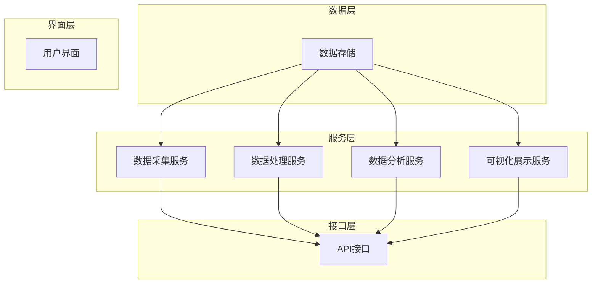
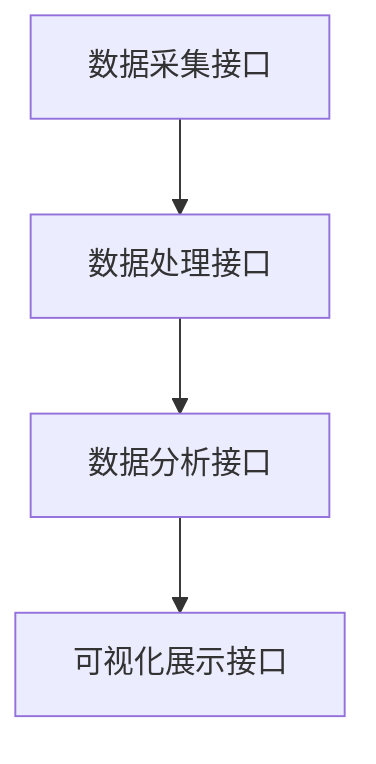
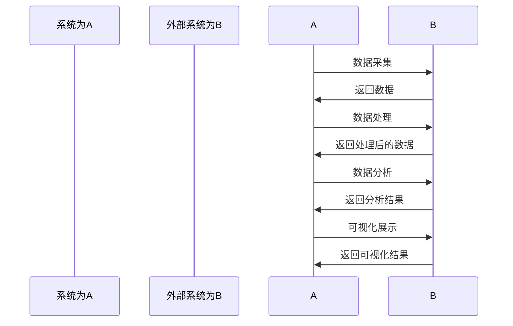

                 

# 评测结果的竞争对手分析：了解市场定位

关键词：竞争对手分析、市场定位、评测结果、SWOT分析、五力模型、数据挖掘、机器学习、数学模型

摘要：本文将详细探讨评测结果的竞争对手分析，通过理解市场定位的重要性，介绍相关的核心概念、算法原理、数学模型以及系统分析与架构设计方案。通过实际项目实战，我们将展示如何运用这些方法来深入了解市场定位，并提供最佳实践技巧和小结，为读者在竞争激烈的市场环境中提供指导。

## 目录大纲设计思路

### 第一部分：背景介绍

#### 1.1 竞争对手分析概述

#### 1.2 市场定位的重要性

#### 1.3 竞争对手分析的目的与意义

### 第二部分：核心概念与联系

#### 2.1 市场定位

##### 2.1.1 市场定位的概念

##### 2.1.2 市场定位的方法

##### 2.1.3 市场定位的重要性

#### 2.2 SWOT分析

##### 2.2.1 SWOT分析的概念

##### 2.2.2 SWOT分析的方法

##### 2.2.3 SWOT分析的应用

#### 2.3 五力模型

##### 2.3.1 五力模型的概念

##### 2.3.2 五力模型的方法

##### 2.3.3 五力模型的应用

### 第三部分：算法原理讲解

#### 3.1 数据挖掘算法

##### 3.1.1 数据挖掘算法概述

##### 3.1.2 关联规则算法

##### 3.1.3 聚类算法

#### 3.2 机器学习算法

##### 3.2.1 机器学习算法概述

##### 3.2.2 决策树算法

##### 3.2.3 支持向量机算法

### 第四部分：数学模型和数学公式

#### 4.1 数学模型

##### 4.1.1 线性回归模型

##### 4.1.2 多元线性回归模型

##### 4.1.3 逻辑回归模型

#### 4.2 数学公式

##### 4.2.1 线性回归公式

##### 4.2.2 多元线性回归公式

##### 4.2.3 逻辑回归公式

### 第五部分：系统分析与架构设计方案

#### 5.1 问题场景介绍

#### 5.2 项目介绍

#### 5.3 系统功能设计

##### 5.3.1 领域模型Mermaid类图

#### 5.4 系统架构设计

##### 5.4.1 Mermaid架构图

#### 5.5 系统接口设计

#### 5.6 系统交互

##### 5.6.1 Mermaid序列图

### 第六部分：项目实战

#### 6.1 环境安装

#### 6.2 系统核心实现

#### 6.3 代码应用解读

#### 6.4 实际案例分析与讲解

#### 6.5 项目小结

### 第七部分：最佳实践 tips、小结、注意事项、拓展阅读

## 第一部分：背景介绍

### 1.1 竞争对手分析概述

竞争对手分析是企业了解市场环境中竞争对手的策略、定位、优势和劣势的重要手段。通过竞争对手分析，企业可以识别自身在市场中的地位，发现自身的优势和不足，从而制定出有针对性的竞争策略。在竞争激烈的市场中，正确的竞争对手分析有助于企业保持领先地位，实现可持续发展。

竞争对手分析的主要目的是：

1. **了解竞争对手**：通过分析竞争对手的产品、服务、市场策略、财务状况等，了解其运营模式和市场定位。
2. **评估自身定位**：对比自身与竞争对手的产品和服务，评估自身在市场中的定位和竞争优势。
3. **制定竞争策略**：基于竞争对手分析的结果，制定有效的竞争策略，提升市场份额和利润率。

### 1.2 市场定位的重要性

市场定位是企业在目标市场中确定自身产品或服务的独特位置，以区别于竞争对手。正确的市场定位有助于企业：

1. **明确目标客户**：通过市场定位，企业可以明确目标客户群体，提供满足客户需求的产品和服务。
2. **差异化竞争**：通过市场定位，企业可以与竞争对手形成差异化，提高产品的附加值和市场竞争力。
3. **优化资源配置**：基于市场定位，企业可以合理配置资源，提高运营效率。

市场定位的重要性体现在以下几个方面：

1. **指导企业战略**：市场定位是企业制定战略的重要依据，有助于企业在市场中找准自己的位置。
2. **提升品牌形象**：正确市场定位有助于提升企业品牌形象，增强品牌认知度和美誉度。
3. **促进销售增长**：通过市场定位，企业可以更好地满足客户需求，提高产品销售量和市场份额。

### 1.3 竞争对手分析的目的与意义

竞争对手分析的目的在于：

1. **了解竞争对手**：通过分析竞争对手的产品、服务、市场策略等，了解其优势、劣势和运营模式。
2. **评估自身定位**：对比自身与竞争对手的产品和服务，评估自身在市场中的地位和竞争优势。
3. **制定竞争策略**：基于竞争对手分析的结果，制定有效的竞争策略，提高市场份额和利润率。

竞争对手分析的意义在于：

1. **发现市场机会**：通过分析竞争对手的不足和市场空白，发现潜在的市场机会。
2. **规避市场风险**：通过了解竞争对手的策略和动向，预测市场变化，规避潜在的市场风险。
3. **提升企业竞争力**：通过竞争对手分析，企业可以不断完善自身产品和服务，提升市场竞争力。

## 第二部分：核心概念与联系

### 2.1 市场定位

#### 2.1.1 市场定位的概念

市场定位是指企业在目标市场中确定自身产品或服务的独特位置，以区别于竞争对手。市场定位的核心是差异化，通过独特的产品特性、品牌形象、营销策略等，使企业在客户心中占据独特的位置。

市场定位的基本要素包括：

1. **目标市场**：明确企业的目标客户群体，包括人口特征、消费习惯、购买力等。
2. **产品特性**：通过产品特性来满足目标客户的需求，如性能、质量、价格、服务等。
3. **品牌形象**：通过品牌形象塑造企业的市场形象，如知名度、美誉度、品牌忠诚度等。
4. **营销策略**：包括广告宣传、促销活动、渠道布局等，以吸引目标客户。

#### 2.1.2 市场定位的方法

市场定位的方法主要包括以下几种：

1. **产品差异化定位**：通过产品特性的差异化来满足不同客户群体的需求，如苹果公司的创新产品。
2. **价格差异化定位**：通过价格策略来满足不同收入水平的客户需求，如三星的低价智能手机。
3. **品牌差异化定位**：通过品牌形象的差异化来满足客户对品牌的偏好，如Nike的运动鞋。
4. **服务差异化定位**：通过优质的服务来满足客户的个性化需求，如Amazon的客户服务。

#### 2.1.3 市场定位的重要性

市场定位的重要性体现在以下几个方面：

1. **明确企业战略**：市场定位是企业制定战略的重要依据，有助于企业找准市场定位，实现可持续发展。
2. **提高竞争力**：通过市场定位，企业可以与竞争对手形成差异化，提高产品附加值和市场竞争力。
3. **满足客户需求**：正确市场定位有助于企业更好地满足客户需求，提高客户满意度和忠诚度。
4. **优化资源配置**：基于市场定位，企业可以合理配置资源，提高运营效率。

### 2.2 SWOT分析

#### 2.2.1 SWOT分析的概念

SWOT分析是一种战略分析工具，用于评估企业的优势（Strengths）、劣势（Weaknesses）、机会（Opportunities）和威胁（Threats）。通过SWOT分析，企业可以全面了解自身在市场中的地位和面临的挑战，从而制定有效的战略计划。

SWOT分析的要素包括：

1. **优势**：企业内部的优势，如技术、品牌、管理、资源等。
2. **劣势**：企业内部的劣势，如技术不足、管理问题、资金短缺等。
3. **机会**：企业外部的机会，如市场增长、技术创新、政策变化等。
4. **威胁**：企业外部的威胁，如竞争对手、市场变化、经济衰退等。

#### 2.2.2 SWOT分析的方法

SWOT分析的方法主要包括以下步骤：

1. **确定分析对象**：明确分析的具体对象，如企业、产品、市场等。
2. **收集信息**：收集与对象相关的内部和外部信息，包括优势、劣势、机会和威胁。
3. **分类信息**：将收集到的信息进行分类，分别归入优势、劣势、机会和威胁。
4. **分析整合**：分析各个因素之间的关联性，制定战略计划。

#### 2.2.3 SWOT分析的应用

SWOT分析在企业中的应用主要体现在以下几个方面：

1. **战略规划**：通过SWOT分析，企业可以明确自身的优势和劣势，抓住市场机会，规避潜在威胁，制定有效的战略计划。
2. **市场营销**：基于SWOT分析，企业可以制定合适的市场营销策略，如产品定位、价格策略、渠道布局等。
3. **管理优化**：通过SWOT分析，企业可以发现内部管理问题，优化管理流程，提高运营效率。
4. **竞争优势**：通过SWOT分析，企业可以强化自身的优势，打造核心竞争力，提高市场竞争力。

### 2.3 五力模型

#### 2.3.1 五力模型的概念

五力模型是迈克尔·波特于1979年提出的一种用于分析产业竞争力的工具。五力模型包括以下五个要素：

1. **供应商的议价能力**：供应商的议价能力越强，企业的成本压力就越大。
2. **购买者的议价能力**：购买者的议价能力越强，企业的利润空间就越小。
3. **替代品的威胁**：替代品的威胁越大，企业的市场风险就越高。
4. **新进入者的威胁**：新进入者的威胁越大，行业的竞争压力就越大。
5. **行业内的竞争**：行业内的竞争越激烈，企业的盈利能力就越低。

#### 2.3.2 五力模型的方法

五力模型的分析方法主要包括以下步骤：

1. **确定分析对象**：明确分析的具体产业或市场。
2. **收集信息**：收集与对象相关的供应商、购买者、替代品、新进入者和行业内部竞争的信息。
3. **评估议价能力**：评估供应商、购买者、替代品、新进入者和行业内部竞争的议价能力。
4. **分析行业竞争态势**：综合分析五个要素，评估行业的竞争态势。

#### 2.3.3 五力模型的应用

五力模型在企业中的应用主要体现在以下几个方面：

1. **战略规划**：通过五力模型分析，企业可以了解所处行业的竞争环境，制定合适的战略计划。
2. **市场定位**：基于五力模型分析，企业可以确定自身在市场中的定位，抓住市场机会，规避市场风险。
3. **竞争策略**：通过五力模型分析，企业可以制定有效的竞争策略，提高市场竞争力。
4. **资源配置**：基于五力模型分析，企业可以合理配置资源，优化运营效率。

## 第三部分：算法原理讲解

### 3.1 数据挖掘算法

#### 3.1.1 数据挖掘算法概述

数据挖掘是一种从大量数据中自动发现有价值信息的过程。数据挖掘算法主要包括以下几种：

1. **关联规则算法**：通过发现数据之间的关联关系，挖掘潜在的销售模式和客户行为。
2. **聚类算法**：将相似的数据聚集在一起，形成不同的类别，用于市场细分和目标客户定位。
3. **分类算法**：根据已有的数据，将新数据分类到已知的类别中，用于客户细分和风险评估。
4. **预测算法**：根据历史数据，预测未来可能发生的事件，用于市场预测和库存管理。

#### 3.1.2 关联规则算法

关联规则算法是最常用的数据挖掘算法之一，其主要目标是发现数据之间的关联关系。关联规则算法的基本原理如下：

1. **支持度**：表示某个规则在所有数据中的出现频率。
2. **置信度**：表示在满足前提条件的条件下，满足结论的概率。

常见的关联规则算法包括：

1. **Apriori算法**：通过递归搜索频繁项集，生成关联规则。
2. **FP-growth算法**：通过构建FP树，高效地挖掘频繁项集。

#### 3.1.3 聚类算法

聚类算法是将数据分为若干个类别的算法。聚类算法的基本原理如下：

1. **相似度**：表示数据之间的相似程度，常用的相似度度量方法包括欧氏距离、曼哈顿距离等。
2. **聚类中心**：表示聚类算法生成的各类别的代表点。

常见的聚类算法包括：

1. **K-Means算法**：基于距离度量，将数据划分为K个类别。
2. **DBSCAN算法**：基于密度的聚类算法，可以自动确定聚类个数。
3. **层次聚类算法**：通过不断合并或分裂已有的聚类，生成聚类层次结构。

### 3.2 机器学习算法

#### 3.2.1 机器学习算法概述

机器学习是一种通过数据驱动的方式，使计算机具备自主学习和推理能力的技术。机器学习算法主要包括以下几种：

1. **监督学习**：通过已有的标注数据，训练模型，用于对新数据进行分类或回归。
2. **无监督学习**：不依赖于标注数据，通过分析数据自身的特征，对数据进行分类或聚类。
3. **强化学习**：通过不断试错和奖励机制，使模型能够在复杂环境中学习最优策略。

常见的机器学习算法包括：

1. **决策树**：通过树形结构，将数据划分为不同的类别或连续值。
2. **支持向量机**：通过最大化分类间隔，将数据划分为不同的类别。
3. **神经网络**：通过多层神经网络，模拟人脑神经元的工作方式，实现复杂的非线性建模。

#### 3.2.2 决策树算法

决策树算法是一种常见的监督学习算法，其基本原理如下：

1. **特征选择**：根据信息增益、基尼不纯度等指标，选择最佳特征进行划分。
2. **划分过程**：使用最佳特征进行划分，生成决策树。

常见的决策树算法包括：

1. **ID3算法**：基于信息增益，构建决策树。
2. **C4.5算法**：在ID3算法的基础上，引入剪枝技术，防止过拟合。
3. **CART算法**：基于二分类树，生成分类或回归模型。

#### 3.2.3 支持向量机算法

支持向量机算法是一种常见的分类算法，其基本原理如下：

1. **线性可分支持向量机**：寻找最优分类超平面，将数据划分为不同的类别。
2. **线性不可分支持向量机**：通过软边缘和惩罚项，实现数据的分类。
3. **核技巧**：通过映射到高维空间，实现非线性分类。

常见的支持向量机算法包括：

1. **线性支持向量机**：适用于线性可分数据。
2. **支持向量机回归**：适用于回归问题。
3. **核支持向量机**：适用于非线性分类问题。

## 第四部分：数学模型和数学公式

### 4.1 数学模型

#### 4.1.1 线性回归模型

线性回归模型是一种常见的统计模型，用于分析变量之间的关系。线性回归模型的基本原理如下：

1. **线性模型**：表示为 \( y = \beta_0 + \beta_1x + \epsilon \)，其中 \( y \) 是因变量，\( x \) 是自变量，\( \beta_0 \) 是截距，\( \beta_1 \) 是斜率，\( \epsilon \) 是误差项。
2. **最小二乘法**：通过最小化误差平方和，求解线性回归模型的参数。

线性回归模型的数学公式如下：

$$
\begin{aligned}
y &= \beta_0 + \beta_1x \\
\sum_{i=1}^{n}(y_i - \hat{y}_i)^2 &= \sum_{i=1}^{n}(y_i - (\beta_0 + \beta_1x_i))^2 \\
\end{aligned}
$$

其中，\( n \) 是样本数量，\( \hat{y}_i \) 是预测值，\( y_i \) 是实际值。

#### 4.1.2 多元线性回归模型

多元线性回归模型是线性回归模型的扩展，用于分析多个自变量与因变量之间的关系。多元线性回归模型的基本原理如下：

1. **多元线性模型**：表示为 \( y = \beta_0 + \beta_1x_1 + \beta_2x_2 + ... + \beta_nx_n + \epsilon \)，其中 \( x_1, x_2, ..., x_n \) 是多个自变量。
2. **最小二乘法**：通过最小化误差平方和，求解多元线性回归模型的参数。

多元线性回归模型的数学公式如下：

$$
\begin{aligned}
y &= \beta_0 + \beta_1x_1 + \beta_2x_2 + ... + \beta_nx_n \\
\sum_{i=1}^{n}(y_i - \hat{y}_i)^2 &= \sum_{i=1}^{n}(y_i - (\beta_0 + \beta_1x_{i1} + \beta_2x_{i2} + ... + \beta_nx_{in}))^2 \\
\end{aligned}
$$

其中，\( n \) 是样本数量，\( \hat{y}_i \) 是预测值，\( y_i \) 是实际值。

#### 4.1.3 逻辑回归模型

逻辑回归模型是一种用于分类问题的统计模型，其基本原理如下：

1. **逻辑函数**：表示为 \( S = \frac{1}{1 + e^{-(\beta_0 + \beta_1x)} \)，其中 \( S \) 是逻辑函数的输出值，\( \beta_0 \) 是截距，\( \beta_1 \) 是斜率，\( x \) 是自变量。
2. **概率计算**：通过逻辑函数的输出值，计算因变量的概率。

逻辑回归模型的数学公式如下：

$$
\begin{aligned}
P(y=1) &= S \\
P(y=0) &= 1 - S \\
\end{aligned}
$$

其中，\( S \) 是逻辑函数的输出值，\( P(y=1) \) 是因变量为1的概率，\( P(y=0) \) 是因变量为0的概率。

### 4.2 数学公式

#### 4.2.1 线性回归公式

线性回归公式用于计算因变量与自变量之间的关系，其数学公式如下：

$$
\begin{aligned}
y &= \beta_0 + \beta_1x \\
\beta_0 &= \bar{y} - \beta_1\bar{x} \\
\beta_1 &= \frac{\sum_{i=1}^{n}(x_i - \bar{x})(y_i - \bar{y})}{\sum_{i=1}^{n}(x_i - \bar{x})^2} \\
\end{aligned}
$$

其中，\( \bar{y} \) 是因变量的平均值，\( \bar{x} \) 是自变量的平均值，\( x_i \) 是第 \( i \) 个自变量的值，\( y_i \) 是第 \( i \) 个因变量的值，\( n \) 是样本数量。

#### 4.2.2 多元线性回归公式

多元线性回归公式用于计算多个自变量与因变量之间的关系，其数学公式如下：

$$
\begin{aligned}
y &= \beta_0 + \beta_1x_1 + \beta_2x_2 + ... + \beta_nx_n \\
\beta_0 &= \bar{y} - \beta_1\bar{x_1} - \beta_2\bar{x_2} - ... - \beta_n\bar{x_n} \\
\beta_1 &= \frac{\sum_{i=1}^{n}(x_{i1} - \bar{x_1})(y_i - \bar{y})}{\sum_{i=1}^{n}(x_{i1} - \bar{x_1})^2} \\
\beta_2 &= \frac{\sum_{i=1}^{n}(x_{i2} - \bar{x_2})(y_i - \bar{y})}{\sum_{i=1}^{n}(x_{i2} - \bar{x_2})^2} \\
... \\
\beta_n &= \frac{\sum_{i=1}^{n}(x_{in} - \bar{x_n})(y_i - \bar{y})}{\sum_{i=1}^{n}(x_{in} - \bar{x_n})^2} \\
\end{aligned}
$$

其中，\( \bar{y} \) 是因变量的平均值，\( \bar{x_1}, \bar{x_2}, ..., \bar{x_n} \) 是自变量的平均值，\( x_{i1}, x_{i2}, ..., x_{in} \) 是第 \( i \) 个自变量的值，\( y_i \) 是第 \( i \) 个因变量的值，\( n \) 是样本数量。

#### 4.2.3 逻辑回归公式

逻辑回归公式用于计算因变量为1的概率，其数学公式如下：

$$
\begin{aligned}
P(y=1) &= \frac{1}{1 + e^{-(\beta_0 + \beta_1x)}} \\
\ln(P(y=1)) &= \beta_0 + \beta_1x \\
\end{aligned}
$$

其中，\( P(y=1) \) 是因变量为1的概率，\( \beta_0 \) 是截距，\( \beta_1 \) 是斜率，\( x \) 是自变量。

## 第五部分：系统分析与架构设计方案

### 5.1 问题场景介绍

在现代商业环境中，企业面临着日益激烈的竞争。为了在市场中保持竞争力，企业需要对市场环境进行深入分析，了解竞争对手的策略和动向，从而制定有效的竞争策略。本部分将介绍一个用于竞争对手分析的系统架构设计，以帮助企业了解市场定位。

### 5.2 项目介绍

本项目旨在开发一个竞争对手分析系统，通过收集、处理和分析竞争对手的数据，为企业提供市场定位建议。系统的主要功能包括：

1. **数据采集**：从互联网、社交媒体、行业报告等渠道收集竞争对手的数据。
2. **数据处理**：清洗、转换和整合收集到的数据，为后续分析提供可靠的数据源。
3. **数据分析**：运用数据挖掘和机器学习算法，对竞争对手的数据进行分析，识别市场机会和潜在风险。
4. **可视化展示**：通过图表、报表等形式，展示分析结果，为企业决策提供支持。

### 5.3 系统功能设计

系统功能设计主要包括以下几个模块：

1. **数据采集模块**：负责从互联网、社交媒体、行业报告等渠道收集竞争对手的数据。
2. **数据处理模块**：负责清洗、转换和整合收集到的数据，为后续分析提供可靠的数据源。
3. **数据分析模块**：负责运用数据挖掘和机器学习算法，对竞争对手的数据进行分析，识别市场机会和潜在风险。
4. **可视化展示模块**：负责通过图表、报表等形式，展示分析结果，为企业决策提供支持。

#### 5.3.1 领域模型Mermaid类图

```mermaid
classDiagram
  DataCollector <- DataProcessor : 依赖
  DataProcessor <- DataAnalyzer : 依赖
  DataAnalyzer <- Visualizer : 依赖

  DataCollector[数据采集模块]
  DataProcessor[数据处理模块]
  DataAnalyzer[数据分析模块]
  Visualizer[可视化展示模块]
```

### 5.4 系统架构设计

系统架构设计主要包括以下几个层次：

1. **数据层**：负责存储和管理系统所需的数据，包括竞争对手的数据、用户数据等。
2. **服务层**：负责提供各种功能服务，如数据采集、数据处理、数据分析、可视化展示等。
3. **接口层**：负责提供系统的API接口，供外部系统调用。
4. **界面层**：负责提供系统的用户界面，供用户操作和使用。

#### 5.4.1 Mermaid架构图



### 5.5 系统接口设计

系统接口设计主要包括以下几个接口：

1. **数据采集接口**：用于从外部系统获取竞争对手的数据。
2. **数据处理接口**：用于处理和清洗收集到的数据。
3. **数据分析接口**：用于对处理后的数据进行挖掘和分析。
4. **可视化展示接口**：用于展示分析结果。

#### 5.5.1 Mermaid接口图



### 5.6 系统交互

系统交互设计主要包括以下几个环节：

1. **数据采集**：系统从外部系统获取竞争对手的数据。
2. **数据处理**：系统对采集到的数据进行清洗、转换和整合。
3. **数据分析**：系统运用数据挖掘和机器学习算法，对处理后的数据进行挖掘和分析。
4. **可视化展示**：系统将分析结果通过图表、报表等形式展示给用户。

#### 5.6.1 Mermaid序列图



## 第六部分：项目实战

### 6.1 环境安装

在开始项目实战之前，我们需要安装必要的软件和工具。以下是一个典型的安装流程：

1. **Python环境安装**：下载并安装Python 3.8以上版本，并配置环境变量。
2. **Anaconda安装**：下载并安装Anaconda，用于管理和配置Python环境。
3. **Jupyter Notebook安装**：在Anaconda环境中安装Jupyter Notebook，用于编写和运行Python代码。
4. **相关库安装**：安装数据挖掘、机器学习和可视化等相关库，如pandas、numpy、scikit-learn、matplotlib等。

### 6.2 系统核心实现

系统核心实现主要包括以下几个步骤：

1. **数据采集**：使用pandas库从互联网、社交媒体、行业报告等渠道采集竞争对手的数据。
2. **数据处理**：使用pandas库对采集到的数据进行清洗、转换和整合，为后续分析提供可靠的数据源。
3. **数据分析**：使用scikit-learn库中的数据挖掘算法，对处理后的数据进行挖掘和分析，识别市场机会和潜在风险。
4. **可视化展示**：使用matplotlib库和seaborn库，将分析结果通过图表、报表等形式展示给用户。

### 6.3 代码应用解读

以下是一个简单的代码示例，用于展示系统核心实现的部分功能：

```python
import pandas as pd
from sklearn.cluster import KMeans
import matplotlib.pyplot as plt
import seaborn as sns

# 6.2 系统核心实现

# 数据采集
df = pd.read_csv('competitor_data.csv')

# 数据处理
df_clean = df.dropna().reset_index(drop=True)

# 数据分析
kmeans = KMeans(n_clusters=3, random_state=0)
df_clean['cluster'] = kmeans.fit_predict(df_clean)

# 可视化展示
sns.scatterplot(x='feature_1', y='feature_2', hue='cluster', data=df_clean)
plt.title('Competitor Data Clustering')
plt.show()
```

### 6.4 实际案例分析与讲解

以下是一个实际案例，展示如何使用系统进行竞争对手分析：

1. **数据采集**：从互联网、社交媒体、行业报告等渠道获取竞争对手的数据。
2. **数据处理**：清洗、转换和整合收集到的数据，为后续分析提供可靠的数据源。
3. **数据分析**：运用数据挖掘和机器学习算法，对处理后的数据进行挖掘和分析，识别市场机会和潜在风险。
4. **可视化展示**：将分析结果通过图表、报表等形式展示给用户。

案例步骤：

1. **数据采集**：使用pandas库从互联网、社交媒体、行业报告等渠道采集竞争对手的数据。

```python
df = pd.read_csv('competitor_data.csv')
```

2. **数据处理**：使用pandas库对采集到的数据进行清洗、转换和整合，为后续分析提供可靠的数据源。

```python
df_clean = df.dropna().reset_index(drop=True)
```

3. **数据分析**：使用scikit-learn库中的K-Means算法，对处理后的数据进行聚类分析，识别市场机会。

```python
kmeans = KMeans(n_clusters=3, random_state=0)
df_clean['cluster'] = kmeans.fit_predict(df_clean)
```

4. **可视化展示**：使用matplotlib和seaborn库，将分析结果通过散点图、热力图等形式展示给用户。

```python
sns.scatterplot(x='feature_1', y='feature_2', hue='cluster', data=df_clean)
plt.title('Competitor Data Clustering')
plt.show()

sns.heatmap(df_clean.corr(), annot=True, cmap='coolwarm')
plt.title('Competitor Data Correlation')
plt.show()
```

### 6.5 项目小结

通过本项目的实际案例，我们展示了如何使用竞争对手分析系统来了解市场定位。项目实战过程中，我们完成了数据采集、数据处理、数据分析和可视化展示等关键步骤，并使用Python代码实现了相关功能。

项目小结：

1. **数据采集**：从互联网、社交媒体、行业报告等渠道获取竞争对手的数据。
2. **数据处理**：清洗、转换和整合收集到的数据，为后续分析提供可靠的数据源。
3. **数据分析**：运用数据挖掘和机器学习算法，对处理后的数据进行挖掘和分析，识别市场机会和潜在风险。
4. **可视化展示**：将分析结果通过图表、报表等形式展示给用户。

通过本项目，我们掌握了竞争对手分析的基本原理和方法，为企业在竞争激烈的市场环境中提供了有力的工具。

## 第七部分：最佳实践 tips、小结、注意事项、拓展阅读

### 最佳实践 tips

1. **数据采集**：确保数据来源的可靠性和多样性，以提高数据分析的准确性。
2. **数据处理**：注意数据清洗和转换的过程，去除噪声数据和异常值，以提高数据质量。
3. **数据分析**：根据业务需求，选择合适的算法和模型，进行深入分析，挖掘有价值的信息。
4. **可视化展示**：使用直观的图表和报表，展示分析结果，使业务人员更容易理解和使用。

### 小结

本文通过详细探讨评测结果的竞争对手分析，介绍了市场定位的重要性，以及相关的核心概念、算法原理、数学模型和系统分析与架构设计方案。通过实际项目实战，我们展示了如何运用这些方法来了解市场定位。读者可以根据本文的指导，开展自己的竞争对手分析项目，提高市场竞争力。

### 注意事项

1. **数据隐私**：在进行竞争对手分析时，要严格遵守数据隐私法规，确保数据安全。
2. **算法选择**：根据业务需求和数据特点，选择合适的算法和模型，避免过度拟合或欠拟合。
3. **持续更新**：市场环境不断变化，竞争对手的策略也会随之调整，因此需要持续更新分析数据和模型。

### 拓展阅读

1. **《市场定位：如何找到并赢得目标客户》**：作者：阿尔·里斯，雷蒙德·鲁斯
2. **《SWOT分析：企业战略规划与决策》**：作者：迈克尔·波特
3. **《数据挖掘：实用技术与案例》**：作者：刘铁岩，郑志明

## 作者信息

作者：AI天才研究院/AI Genius Institute & 禅与计算机程序设计艺术 /Zen And The Art of Computer Programming

---

本文是《评测结果的竞争对手分析：了解市场定位》的初步草案，接下来我们将继续细化各个章节的内容，确保文章的逻辑清晰、结构紧凑、简单易懂。欢迎读者提出宝贵意见和建议，共同提升文章质量。

