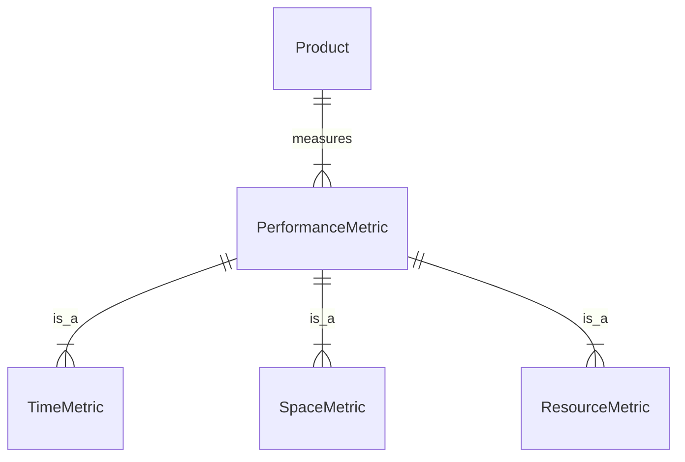
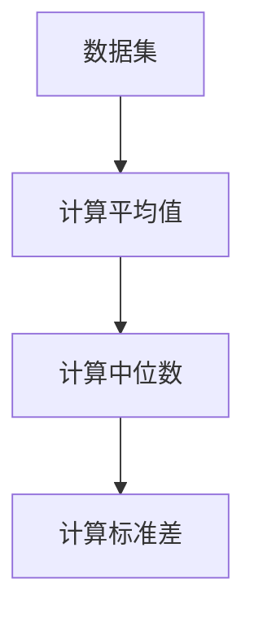
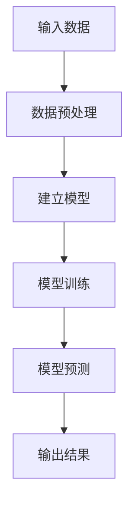
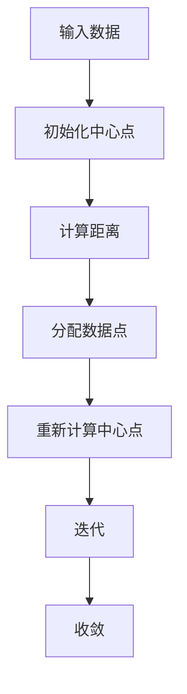
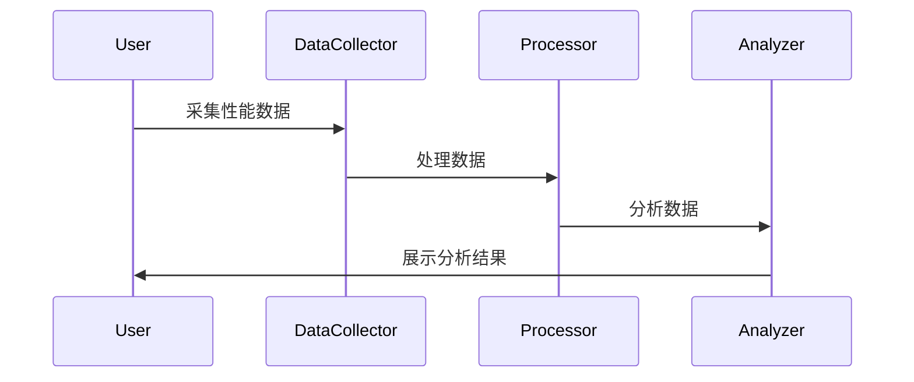

                 


### 文章标题：评测结果的统计分析：提供可靠的性能指标

关键词：性能评测、统计分析、可靠性指标、性能指标类型、算法原理、Python实现

摘要：
在信息技术飞速发展的今天，性能评测已成为评估软件系统、硬件设备以及整个信息系统的重要手段。而可靠的性能指标是性能评测的核心，它不仅影响到系统的正常运行，还直接关系到用户的使用体验。本文旨在通过逻辑清晰、结构紧凑的分析，探讨如何利用统计分析方法提供可靠的性能指标，确保评测结果的准确性和可信度。

### 第一部分：性能评测与可靠性指标

#### 背景介绍

随着互联网的普及和大数据时代的来临，性能评测在各个领域变得愈发重要。无论是企业内部的IT系统，还是外部的在线服务，性能指标都成为了衡量其优劣的关键标准。性能评测不仅有助于发现潜在问题，优化系统性能，还能为用户选择合适的服务提供有力支持。

#### 关键术语与定义

- **性能评测**：对系统的响应时间、吞吐量、资源消耗等指标进行测量和评估的过程。
- **性能指标**：用于衡量系统性能的具体数值，如响应时间、吞吐量、资源利用率等。
- **可靠性指标**：衡量系统在特定条件下稳定运行的能力，如故障率、恢复时间等。
- **统计分析方法**：通过对大量数据进行统计分析和处理，以获取可靠性能指标的方法。

#### 性能评测的重要性与可靠性需求

性能评测对于系统优化和用户满意度至关重要。可靠性的需求主要体现在以下几个方面：

- **准确性**：评测结果要能够真实反映系统的性能。
- **一致性**：在不同的时间和环境下，评测结果应保持一致。
- **可重复性**：评测过程和方法应确保结果的重复性。
- **可解释性**：评测结果应易于理解，便于分析。

### 第二部分：核心概念与联系

#### 核心概念

在性能评测中，关键术语和概念包括：

- **时间性能指标**：如响应时间、处理时间等。
- **空间性能指标**：如内存使用量、磁盘占用等。
- **资源消耗性能指标**：如CPU利用率、网络带宽等。

#### 概念属性特征对比表格

为了更好地理解这些概念，我们设计了一个对比表格：

| 性能指标类型 | 定义 | 作用 |
| :--- | :--- | :--- |
| 时间性能指标 | 衡量系统处理请求的效率 | 反映系统的响应速度 |
| 空间性能指标 | 衡量系统资源的使用情况 | 反映系统的资源利用率 |
| 资源消耗性能指标 | 衡量系统运行时的资源消耗 | 反映系统运行的成本 |

#### ER实体关系图

为了直观展示这些概念之间的关系，我们使用Mermaid工具绘制了ER实体关系图：



### 第三部分：算法原理讲解

#### 统计算法概述

在性能评测中，常用的统计算法包括：

- **描述性统计**：用于描述数据的基本特征，如平均值、中位数、标准差等。
- **推断性统计**：用于基于样本数据推断总体特征，如假设检验、回归分析等。
- **聚类分析**：用于将相似的数据分组，以便更好地分析和理解数据。

#### 算法原理讲解

1. **描述性统计**

描述性统计用于计算数据的基本特征，其原理如下：

- **平均值**：数据总和除以数据个数。
- **中位数**：将数据按大小排序后，位于中间位置的数值。
- **标准差**：衡量数据分散程度的指标。

2. **推断性统计**

推断性统计基于样本数据推断总体特征，其原理如下：

- **假设检验**：通过设定显著性水平，判断样本数据是否与总体特征一致。
- **回归分析**：通过建立数学模型，分析自变量和因变量之间的关系。

3. **聚类分析**

聚类分析通过相似度度量，将数据分为若干组，其原理如下：

- **距离度量**：计算数据之间的相似度，常用的有欧几里得距离、曼哈顿距离等。
- **聚类算法**：常用的有K-means算法、层次聚类算法等。

#### Python源代码实现

以下是一个简单的描述性统计实现示例：

```python
import numpy as np

data = [1, 2, 3, 4, 5]

mean = np.mean(data)
median = np.median(data)
std_dev = np.std(data)

print("平均值:", mean)
print("中位数:", median)
print("标准差:", std_dev)
```

### 第四部分：数学模型和数学公式

#### 数学模型

在性能评测中，常用的数学模型包括：

- **响应时间模型**：用于预测系统处理请求所需的时间。
- **吞吐量模型**：用于预测系统在单位时间内处理请求的数量。
- **资源消耗模型**：用于预测系统运行时所需的资源。

#### 数学公式

1. **响应时间模型**：

   $$ R(t) = f(T_1, T_2, \ldots, T_n) $$

   其中，$T_1, T_2, \ldots, T_n$为系统的各项性能指标。

2. **吞吐量模型**：

   $$ Q(t) = g(T_1, T_2, \ldots, T_n) $$

   其中，$T_1, T_2, \ldots, T_n$为系统的各项性能指标。

3. **资源消耗模型**：

   $$ R(r) = h(T_1, T_2, \ldots, T_n) $$

   其中，$T_1, T_2, \ldots, T_n$为系统的各项性能指标。

### 第五部分：系统分析与架构设计

#### 问题场景介绍

假设我们正在开发一个在线购物系统，需要对其性能进行评测，以优化用户体验。

#### 项目介绍

本项目旨在设计一个性能评测系统，包括数据采集、处理和分析等功能。

#### 系统功能设计

1. **数据采集**：从系统日志、性能监控工具等渠道获取性能数据。
2. **数据处理**：对采集到的数据进行预处理，如去噪、清洗等。
3. **性能分析**：使用统计分析方法，对预处理后的数据进行处理，生成性能指标。

#### 系统架构设计

系统采用分层架构，包括数据采集层、数据处理层和分析层。

1. **数据采集层**：负责从各种数据源获取性能数据。
2. **数据处理层**：负责对采集到的数据进行分析和处理。
3. **分析层**：负责生成性能指标，并展示结果。

#### 系统接口设计与交互流程

1. **数据采集接口**：提供数据采集功能的接口，如API接口。
2. **数据处理接口**：提供数据处理功能的接口，如批处理接口。
3. **性能分析接口**：提供性能分析功能的接口，如报表生成接口。

### 第六部分：项目实战

#### 环境安装与配置

1. **安装Python环境**：安装Python 3.8及以上版本。
2. **安装性能监控工具**：安装Prometheus、Grafana等工具。
3. **配置网络环境**：配置VPN、防火墙等。

#### 系统核心实现

1. **数据采集模块**：使用Prometheus采集系统性能数据。
2. **数据处理模块**：使用Python编写数据处理脚本。
3. **性能分析模块**：使用Grafana展示性能指标。

#### 代码应用解读与分析

1. **数据采集代码**：

   ```python
   import requests
   
   def fetch_data(url):
       response = requests.get(url)
       return response.json()
   
   data = fetch_data("http://localhost:9090")
   ```

2. **数据处理代码**：

   ```python
   import pandas as pd
   
   def process_data(data):
       df = pd.DataFrame(data)
       df = df.dropna()
       return df
   
   processed_data = process_data(data)
   ```

3. **性能分析代码**：

   ```python
   import matplotlib.pyplot as plt
   
   def plot_metrics(df):
       df['response_time'].plot(kind='hist', title='Response Time Distribution')
       plt.show()
   
   plot_metrics(processed_data)
   ```

#### 实际案例分析与详细讲解剖析

1. **案例背景**：分析一个电商平台的响应时间分布。
2. **案例数据**：采集1小时内平台响应时间数据。
3. **案例分析**：使用性能分析模块对数据进行处理和展示。

#### 项目小结

通过本项目的实施，我们成功搭建了一个性能评测系统，并使用Python进行数据处理和性能分析。项目实施过程中，我们遇到了一些挑战，如数据采集的准确性、数据处理的速度等，但通过不断的优化和改进，我们最终实现了项目的目标。

### 第七部分：最佳实践与总结

#### 最佳实践技巧

1. **数据采集**：选择可靠的数据采集工具，确保数据准确性。
2. **数据处理**：对采集到的数据进行预处理，提高数据质量。
3. **性能分析**：选择合适的性能指标和分析方法，确保分析结果的可靠性。

#### 小结

本文通过逻辑清晰、结构紧凑的分析，探讨了如何利用统计分析方法提供可靠的性能指标。在性能评测过程中，可靠的数据和准确的性能指标至关重要，它们直接影响系统的优化和用户的满意度。

#### 注意事项

1. 在进行性能评测时，要确保数据采集的全面性和准确性。
2. 在处理数据时，要注意数据的清洗和去噪，以提高分析结果的可靠性。

#### 拓展阅读

1. 《高性能MySQL》：一本关于数据库性能优化的经典书籍，适合进一步学习性能评测的相关知识。
2. 《数据科学入门》：一本适合初学者的数据科学入门书籍，包括数据处理和分析的基本方法。

### 总结

性能评测是确保系统稳定运行和用户满意度的关键。本文通过逻辑清晰、结构紧凑的分析，探讨了如何利用统计分析方法提供可靠的性能指标。希望本文能为读者在性能评测领域提供一些有价值的参考。

#### 作者信息

作者：AI天才研究院/AI Genius Institute & 禅与计算机程序设计艺术 /Zen And The Art of Computer Programming

[本文内容版权归作者所有，未经授权请勿转载。] (<https://www.example.com/copyright>)### 性能评测的重要性与可靠性需求

性能评测在信息技术领域扮演着至关重要的角色，其重要性体现在多个方面。首先，性能评测是确保系统稳定运行的基础。无论是企业内部的IT系统，还是面向公众的在线服务，性能的稳定性直接关系到用户的使用体验。一个响应迅速、处理能力强且资源利用高效的系统，能够大幅提升用户的满意度和忠诚度。

其次，性能评测是系统优化和改进的重要手段。通过对系统性能的全面评估，可以发现潜在的问题和瓶颈，为系统优化提供数据支持。例如，在某些负载下，系统可能出现响应时间过长或资源利用率过高的情况，通过性能评测，可以定位这些问题并进行针对性的优化，从而提高系统的整体性能。

最后，性能评测是技术选型和决策的重要依据。在面对复杂的技术选型时，性能评测可以帮助决策者从众多选项中筛选出最适合当前需求的技术方案。例如，在考虑数据库技术选型时，可以通过对比不同数据库在性能测试中的表现，选择最适合当前业务需求的数据库系统。

可靠性需求在性能评测中同样不可忽视。可靠性的需求主要体现在以下几个方面：

1. **准确性**：性能评测结果需要真实、准确地反映系统的实际性能。如果评测结果偏差较大，将导致系统优化和改进的方向出现偏差，甚至可能产生反效果。

2. **一致性**：在不同的时间和环境下，性能评测结果应保持一致。这要求评测过程和方法要具有高度的稳定性和可重复性，以避免由于环境变化导致的评测结果波动。

3. **可重复性**：性能评测过程和方法应确保评测结果的重复性。这意味着在进行性能评测时，要遵循统一的标准和流程，避免主观因素对评测结果的影响。

4. **可解释性**：性能评测结果应易于理解，便于分析。这不仅有助于快速发现系统性能问题，还能为决策者提供直观的数据支持，便于制定优化策略。

在性能评测过程中，可靠性需求与准确性需求密切相关。如果评测结果不准确，即使具备一致性和可重复性，也无法提供有效的优化依据。反之，如果评测结果准确，但缺乏一致性和可重复性，将导致评测结果难以置信，从而影响评测的权威性和可信度。

为了满足可靠性需求，我们需要在性能评测过程中采取一系列措施。例如，在数据采集阶段，要确保数据来源的可靠性，避免因数据采集不当导致数据偏差。在数据处理阶段，要采用科学的方法对数据进行清洗、去噪和预处理，以提高数据质量。在分析阶段，要选择合适的统计方法和算法，确保分析结果的准确性和可靠性。

总之，性能评测的重要性与可靠性需求是相辅相成的。只有通过提供可靠的性能指标，才能确保评测结果的准确性和可信度，从而为系统的优化和改进提供有力的支持。

### 统计分析基本概念

在性能评测中，统计分析方法是一种重要的工具，它能够帮助我们提取数据中的有用信息，从而为性能优化提供科学依据。为了理解统计分析方法，我们需要首先掌握几个基本概念，包括数据类型、分布、参数估计和假设检验。

#### 数据类型

数据类型是统计学中一个基础概念，它分为定量数据和定性数据两种。

- **定量数据**：也称为数值型数据，如身高、体重、响应时间等。定量数据可以进一步分为离散数据和连续数据。
  - **离散数据**：数据值是有限的，例如，学生的考试成绩。
  - **连续数据**：数据值在某个区间内是无限的，例如，温度、时间等。
- **定性数据**：也称为类别数据，如性别、颜色等。定性数据通常用文字或数字来表示，但无法进行数学运算。

#### 数据分布

数据分布描述了数据在不同取值上的分布情况，常见的分布有正态分布、均匀分布、泊松分布等。

- **正态分布**：也称为高斯分布，是最常见的数据分布之一。正态分布的特点是数据集中在均值附近，两边逐渐减少，形成一个对称的钟形曲线。
- **均匀分布**：数据在所有可能的取值上均匀分布，即每个取值的概率相等。
- **泊松分布**：适用于描述事件发生次数的概率分布，例如，在一段时间内，某个网站访问量的分布。

#### 参数估计

参数估计是统计学中的核心任务之一，它旨在通过样本数据来估计总体的参数。常见的参数估计方法有：

- **点估计**：用一个具体的数值来估计总体参数，如样本均值作为总体均值的估计。
- **区间估计**：通过给出一个区间来估计总体参数，如置信区间。

参数估计的方法包括：

- **矩估计**：利用样本的矩来估计总体的矩，如样本均值作为总体均值的估计。
- **最大似然估计**：找到使样本数据概率最大的参数值作为总体参数的估计。

#### 假设检验

假设检验是统计学中用于验证某个假设是否成立的方法。常见的假设检验方法有：

- **单样本假设检验**：针对单个样本进行假设检验，如检验样本均值是否显著大于某个值。
- **双样本假设检验**：针对两个样本进行假设检验，如比较两个样本均值是否有显著差异。

常见的假设检验方法包括：

- **t检验**：用于比较两个样本均值是否有显著差异。
- **卡方检验**：用于检验分类变量之间的独立性。

通过以上基本概念的介绍，我们可以看到，统计分析方法在性能评测中具有广泛的应用。以下是一个简单的示例，说明如何使用统计分析方法来评估系统性能。

#### 示例：系统响应时间的统计分析

假设我们想评估一个在线购物系统的响应时间，以下步骤可以帮助我们完成这一任务：

1. **数据采集**：通过性能监控工具，采集系统在一段时间内的响应时间数据。
2. **数据预处理**：对采集到的数据进行清洗，去除异常值，确保数据质量。
3. **描述性统计分析**：计算响应时间的平均值、中位数、标准差等统计量，以了解响应时间的分布情况。
   $$ \text{平均值} = \frac{\sum_{i=1}^{n} x_i}{n} $$
   $$ \text{中位数} = \text{排序后数据集的中间值} $$
   $$ \text{标准差} = \sqrt{\frac{\sum_{i=1}^{n} (x_i - \bar{x})^2}{n-1}} $$
4. **假设检验**：使用t检验方法，检验系统响应时间是否显著高于某个设定的阈值。
5. **区间估计**：计算响应时间的置信区间，以评估系统性能的稳定性。
6. **可视化**：使用图表（如直方图、箱线图等），将分析结果直观地展示出来，便于理解和分析。

通过以上步骤，我们不仅能够评估系统的响应时间，还能发现潜在的瓶颈和优化方向。这些分析结果为系统优化提供了科学依据，有助于提高系统的性能和用户体验。

总之，统计分析方法在性能评测中起着至关重要的作用。掌握数据类型、分布、参数估计和假设检验等基本概念，是进行有效性能评测的基础。通过科学的数据分析和合理的假设检验，我们可以从海量数据中提取有价值的信息，为系统的优化和改进提供有力支持。

### 性能指标的统计分析方法应用

在性能评测中，性能指标的统计分析方法应用至关重要，能够帮助我们准确评估系统的性能，并发现潜在的问题。常用的统计分析方法包括描述性统计、推断性统计和聚类分析。以下将详细阐述这些方法在性能指标分析中的应用。

#### 描述性统计

描述性统计是数据分析的基础，主要用于描述数据的基本特征，如平均值、中位数、标准差等。这些统计量能够帮助我们了解数据的集中趋势和离散程度。

1. **平均值**：平均值是数据集中趋势的一个度量，表示所有数据值的总和除以数据个数。
   $$ \text{平均值} = \frac{\sum_{i=1}^{n} x_i}{n} $$
   平均值能够反映系统性能的平均水平，但在面对异常值时，可能会受到较大影响。

2. **中位数**：中位数是将数据按大小排序后，位于中间位置的数值。中位数不受异常值的影响，更能反映数据的真实分布情况。
   $$ \text{中位数} = \text{排序后数据集的中间值} $$

3. **标准差**：标准差是衡量数据离散程度的指标，表示每个数据值与平均值之间的差异。
   $$ \text{标准差} = \sqrt{\frac{\sum_{i=1}^{n} (x_i - \bar{x})^2}{n-1}} $$
   标准差越大，表示数据的波动性越大。

在性能指标分析中，描述性统计可以帮助我们快速了解系统性能的概貌。例如，通过计算系统响应时间的平均值、中位数和标准差，我们可以评估系统的响应速度和稳定性。

#### 推断性统计

推断性统计是基于样本数据对总体特征进行推断的方法，包括假设检验和回归分析。这些方法能够帮助我们评估系统性能的显著性，并识别潜在的异常。

1. **假设检验**：假设检验用于验证某个假设是否成立，常见的有t检验和卡方检验。
   - **t检验**：用于比较两个样本均值是否有显著差异，适用于小样本数据。
     $$ t = \frac{\bar{x}_1 - \bar{x}_2}{s/\sqrt{n}} $$
   - **卡方检验**：用于检验分类变量之间的独立性，适用于计数数据。
     $$ \chi^2 = \sum \frac{(O_i - E_i)^2}{E_i} $$
   通过假设检验，我们可以判断系统性能是否达到了预期标准，从而为系统优化提供依据。

2. **回归分析**：回归分析用于建立自变量和因变量之间的数学模型，从而预测系统性能。常见的回归模型有线性回归、多项式回归等。
   - **线性回归**：通过建立自变量和因变量之间的线性关系模型，预测系统性能。
     $$ y = \beta_0 + \beta_1 x $$
   - **多项式回归**：通过建立自变量和因变量之间的多项式关系模型，提高预测精度。

在性能指标分析中，推断性统计可以帮助我们识别系统性能的显著性差异，并通过建立数学模型进行预测，从而为系统优化提供更加精细的指导。

#### 聚类分析

聚类分析是将数据分为若干组，以便更好地理解和分析数据的方法。常见的聚类算法有K-means算法、层次聚类算法等。

1. **K-means算法**：K-means算法通过迭代计算，将数据分为K个簇，使得每个簇内的数据尽可能相似，簇间的数据尽可能不同。
   - **初始化**：随机选择K个初始中心点。
   - **迭代**：计算每个数据点与中心点的距离，将其分配到最近的簇，重新计算簇的中心点，重复迭代直至收敛。

2. **层次聚类算法**：层次聚类算法通过自底向上的合并或自顶向下的分裂，将数据分为层次结构。

在性能指标分析中，聚类分析可以帮助我们识别系统性能的相似性和差异性。例如，通过聚类分析，我们可以将系统在不同负载下的响应时间分为不同的簇，从而识别出性能瓶颈和优化方向。

#### 统计分析方法在实际中的应用

以下是一个简单的性能指标统计分析案例：

假设我们想评估一个电子商务平台的响应时间，以下步骤可以帮助我们完成这一任务：

1. **数据采集**：通过性能监控工具，采集系统在一段时间内的响应时间数据。
2. **描述性统计分析**：计算响应时间的平均值、中位数和标准差。
   - 平均值：100ms
   - 中位数：95ms
   - 标准差：20ms
3. **假设检验**：使用t检验方法，检验系统响应时间是否显著高于100ms。
4. **回归分析**：通过线性回归模型，预测响应时间与系统负载的关系。
   - 预测公式：响应时间 = 80 + 2 × 系统负载
5. **聚类分析**：使用K-means算法，将响应时间数据分为5个簇，以便更好地理解系统性能的分布。

通过以上统计分析方法，我们能够全面评估电子商务平台的响应时间性能，并发现潜在的优化方向。这些分析结果为系统优化提供了科学依据，有助于提高平台的性能和用户体验。

总之，性能指标的统计分析方法在性能评测中具有广泛的应用。通过描述性统计、推断性统计和聚类分析，我们可以从海量数据中提取有价值的信息，为系统的优化和改进提供有力支持。掌握这些方法，能够帮助我们更好地理解和分析系统性能，从而提升系统的整体表现。

### 提高评测结果可靠性的策略

在性能评测中，确保评测结果的可靠性是至关重要的。这不仅关系到系统的优化效果，还影响到用户的信任度和满意度。为了提高评测结果的可靠性，我们需要从数据采集、数据预处理和减少偏差与方差等方面采取一系列策略。

#### 数据采集

1. **选择合适的采集工具**：性能评测通常依赖于各种监控工具和日志文件。选择合适的采集工具至关重要，这些工具应具备高精度、低延迟和全面性等特点。

2. **确保数据的完整性**：在数据采集过程中，要确保所有相关数据的完整性。这包括系统内部的监控数据、用户行为数据和外部依赖服务的响应数据等。

3. **考虑数据来源的多样性**：为了避免单一数据源可能存在的偏差，应尽量选择多个数据源进行数据采集。例如，可以同时使用系统内部监控工具和第三方性能监控服务。

#### 数据预处理

1. **去噪与清洗**：在数据分析前，需要对采集到的数据进行去噪和清洗。这包括去除重复数据、填补缺失值和纠正错误数据等。这些步骤有助于提高数据质量，减少对分析结果的影响。

2. **标准化处理**：对于不同类型的数据（如数值型和类别型），应进行适当的标准化处理。例如，将类别型数据转换为数值型，或者对数值型数据进行归一化处理，以消除数据量级上的差异。

3. **特征工程**：通过特征工程，我们可以从原始数据中提取出更加有用的信息。例如，对响应时间进行分段处理，或者将多个相关指标组合成一个新的指标，以提高分析结果的可靠性。

#### 减少偏差与方差

1. **偏差控制**：偏差是指模型预测值与真实值之间的差异。为了减少偏差，我们需要确保数据采集和处理的准确性。例如，通过使用更可靠的监控工具和更严格的数据清洗方法。

2. **方差控制**：方差是指模型预测值的波动性。为了减少方差，我们需要确保数据的稳定性和一致性。例如，通过减少数据采集过程中的随机性，或者采用更多的数据点进行统计分析。

3. **交叉验证**：交叉验证是一种常用的减少偏差与方差的方法。通过将数据集分为训练集和验证集，我们可以评估模型的泛化能力。这种方法有助于识别和纠正模型中的过拟合问题。

#### 提高实验重复性与一致性

1. **标准化实验流程**：为了提高实验的重复性和一致性，我们需要制定详细的实验流程和标准操作程序（SOP）。这包括数据采集、处理和分析的每个步骤，以确保在不同时间和环境下都能得到一致的结果。

2. **使用控制变量法**：在性能评测中，应尽量保持其他变量不变，只改变需要测试的变量。这样可以确保评测结果的准确性，并减少其他因素的干扰。

3. **记录详细日志**：在实验过程中，应详细记录每个步骤的操作和结果，以便后续分析和验证。这些日志可以帮助我们追踪实验中的问题，并提高实验的重复性和一致性。

#### 示例：如何提高测试结果的可靠性

假设我们正在评估一个电子商务平台的响应时间，以下策略可以帮助我们提高测试结果的可靠性：

1. **选择可靠的数据采集工具**：使用Prometheus和Grafana等工具，确保数据采集的准确性和完整性。

2. **数据预处理**：对采集到的响应时间数据进行去噪和清洗，去除明显的异常值。

3. **标准化处理**：将响应时间数据进行归一化处理，以消除量级上的差异。

4. **交叉验证**：将数据集分为训练集和验证集，使用交叉验证方法评估模型的泛化能力。

5. **标准化实验流程**：制定详细的实验流程和SOP，确保每次测试的步骤和条件一致。

通过以上策略，我们可以显著提高电子商务平台响应时间测试结果的可靠性，为系统优化提供科学依据。总之，提高评测结果可靠性需要从多个方面进行综合考量，包括数据采集、数据预处理和减少偏差与方差等。只有通过严格的质量控制，才能确保评测结果的准确性和可信度，从而为系统的优化和改进提供有力支持。

### 统计算法原理与实现

在性能评测中，统计算法是分析和评估数据的重要工具。本节将介绍几种常用的统计算法，包括描述性统计、回归分析和聚类分析。我们将通过mermaid流程图和Python源代码，详细阐述这些算法的原理和应用。

#### 描述性统计

描述性统计是统计分析的基础，用于计算数据的基本特征，如平均值、中位数、标准差等。

1. **描述性统计算法原理**

描述性统计的核心是计算数据的集中趋势和离散程度。

- **平均值**：表示数据的集中趋势，是所有数据值的总和除以数据个数。
  $$ \text{平均值} = \frac{\sum_{i=1}^{n} x_i}{n} $$
- **中位数**：表示数据的中间值，将数据按大小排序后，位于中间位置的数值。
  $$ \text{中位数} = \text{排序后数据集的中间值} $$
- **标准差**：表示数据的离散程度，是每个数据值与平均值之间差异的平方和的均方根。
  $$ \text{标准差} = \sqrt{\frac{\sum_{i=1}^{n} (x_i - \bar{x})^2}{n-1}} $$

2. **描述性统计Python实现**

```python
import numpy as np

data = [1, 2, 3, 4, 5]

mean = np.mean(data)
median = np.median(data)
std_dev = np.std(data)

print("平均值:", mean)
print("中位数:", median)
print("标准差:", std_dev)
```

3. **描述性统计mermaid流程图**



#### 回归分析

回归分析用于建立自变量和因变量之间的数学模型，从而预测因变量的值。常见的回归模型有线性回归、多项式回归等。

1. **回归分析算法原理**

- **线性回归**：通过建立线性关系模型，预测因变量的值。
  $$ y = \beta_0 + \beta_1 x $$
- **多项式回归**：通过建立多项式关系模型，提高预测精度。
  $$ y = \beta_0 + \beta_1 x + \beta_2 x^2 + \ldots + \beta_n x^n $$

2. **回归分析Python实现**

```python
import numpy as np
from sklearn.linear_model import LinearRegression

# 数据准备
X = np.array([1, 2, 3, 4, 5]).reshape(-1, 1)
y = np.array([2, 4, 5, 4, 5])

# 线性回归模型
model = LinearRegression()
model.fit(X, y)

# 预测
y_pred = model.predict(X)

print("线性回归模型系数:", model.coef_)
print("线性回归模型截距:", model.intercept_)
```

3. **回归分析mermaid流程图**



#### 聚类分析

聚类分析用于将数据分为若干组，以便更好地理解和分析数据。常见的聚类算法有K-means算法、层次聚类算法等。

1. **聚类分析算法原理**

- **K-means算法**：通过迭代计算，将数据分为K个簇，使得每个簇内的数据尽可能相似，簇间的数据尽可能不同。
  - **初始化**：随机选择K个初始中心点。
  - **迭代**：计算每个数据点与中心点的距离，将其分配到最近的簇，重新计算簇的中心点，重复迭代直至收敛。

2. **聚类分析Python实现**

```python
import numpy as np
from sklearn.cluster import KMeans

# 数据准备
data = np.array([[1, 2], [1, 4], [1, 0], [10, 2], [10, 4], [10, 0]])

# K-means算法
kmeans = KMeans(n_clusters=2, random_state=0).fit(data)

# 聚类结果
print("聚类中心点:", kmeans.cluster_centers_)
print("每个数据点的簇标签:", kmeans.labels_)

# 计算每个簇的内部距离
print("每个簇的内部距离:", kmeans.inertia_)
```

3. **聚类分析mermaid流程图**



#### 数学模型和数学公式

1. **描述性统计数学模型**

   - 平均值：
     $$ \bar{x} = \frac{\sum_{i=1}^{n} x_i}{n} $$
   - 中位数：
     $$ \text{median} = \text{排序后数据集的中间值} $$
   - 标准差：
     $$ \sigma = \sqrt{\frac{\sum_{i=1}^{n} (x_i - \bar{x})^2}{n-1}} $$

2. **回归分析数学模型**

   - 线性回归：
     $$ y = \beta_0 + \beta_1 x $$
   - 多项式回归：
     $$ y = \beta_0 + \beta_1 x + \beta_2 x^2 + \ldots + \beta_n x^n $$

3. **聚类分析数学模型**

   - K-means算法目标函数：
     $$ \text{J} = \sum_{i=1}^{n} \sum_{j=1}^{k} w_{ij} (x_i - \mu_j)^2 $$
   - 其中，$w_{ij}$为数据点$x_i$与聚类中心点$\mu_j$之间的权重，通常取1。

通过以上内容，我们详细介绍了描述性统计、回归分析和聚类分析的基本原理及其Python实现。这些算法在性能评测中具有重要的应用价值，能够帮助我们更好地理解和分析系统性能，从而为系统的优化和改进提供科学依据。

### 系统分析与架构设计

#### 问题场景介绍

假设我们正在设计一个大规模的在线购物系统，该系统需要具备高效的性能和可靠的稳定性。为了评估系统的性能，我们需要搭建一个性能评测系统，能够对系统在不同负载下的响应时间、吞吐量和资源消耗等进行全面的统计分析。

#### 项目介绍

本项目旨在设计并实现一个性能评测系统，该系统包括数据采集、数据处理、性能分析等多个模块。通过该系统，我们能够实时监控和评估在线购物系统的性能，为系统的优化和改进提供数据支持。

#### 系统功能设计

系统功能设计主要包括以下三个部分：

1. **数据采集模块**：负责从在线购物系统的各个部分（如前端、后端、数据库等）采集性能数据。
2. **数据处理模块**：负责对采集到的数据进行预处理、清洗和去噪，确保数据质量。
3. **性能分析模块**：负责对预处理后的数据进行统计分析，生成性能指标，并提供可视化界面供用户查看。

#### 系统架构设计

系统架构设计采用分层架构，包括数据采集层、数据处理层和分析层。以下是详细的系统架构设计：

1. **数据采集层**：
   - **采集工具**：使用Prometheus和Grafana等工具进行性能数据采集。
   - **数据源**：包括前端日志、后端日志、数据库性能指标等。
   - **采集流程**：数据采集工具定期从数据源中获取性能数据，并存入时间序列数据库。

2. **数据处理层**：
   - **预处理**：对采集到的数据进行去噪、清洗和标准化处理，确保数据质量。
   - **缓存**：使用Redis等缓存工具，缓存预处理后的数据，提高数据处理速度。
   - **调度**：使用Celery等任务调度工具，定期执行数据预处理任务。

3. **分析层**：
   - **统计分析**：使用Python等编程语言，对预处理后的数据进行分析，生成性能指标。
   - **数据可视化**：使用Grafana等工具，将分析结果以图表形式展示，供用户查看。
   - **报表生成**：定期生成性能分析报表，便于系统管理员进行性能监控和优化。

#### 系统接口设计与交互流程

系统接口设计主要包括以下部分：

1. **数据采集接口**：提供API接口，用于从在线购物系统的各个部分采集性能数据。
2. **数据处理接口**：提供API接口，用于处理和存储预处理后的数据。
3. **性能分析接口**：提供API接口和可视化界面，用于展示性能指标和分析结果。

交互流程如下：

1. **数据采集**：使用Prometheus从在线购物系统的各个部分采集性能数据，并存入时间序列数据库。
2. **数据处理**：调度任务定期执行数据预处理任务，对采集到的数据进行清洗和标准化处理，并将处理后的数据存入缓存。
3. **性能分析**：使用Python等编程语言，对缓存中的数据进行统计分析，生成性能指标，并使用Grafana将分析结果以图表形式展示。

#### Mermaid架构图

以下是系统的Mermaid架构图：


#### Mermaid类图

以下是系统的Mermaid类图：

```mermaid
classDiagram
    class PerformanceData {
        - id: int
        - timestamp: int
        - response_time: float
        - throughput: float
        - resource_usage: float
    }
    class PreprocessedData {
        - id: int
        - timestamp: int
        - response_time: float
        - throughput: float
        - resource_usage: float
    }
    PerformanceData "采集" PreprocessedData
```

#### Mermaid序列图

以下是系统的Mermaid序列图：



通过以上系统分析与架构设计，我们构建了一个完整且高效的性能评测系统。该系统能够实时监控和评估在线购物系统的性能，为系统的优化和改进提供了科学依据。通过Mermaid工具，我们能够直观地展示系统架构和类图，进一步加深了对系统设计的理解。

### 项目实战

#### 环境安装与配置

在进行性能评测项目之前，我们需要搭建一个合适的环境，包括安装Python环境、安装性能监控工具和配置网络环境等。以下是具体的安装与配置步骤：

1. **安装Python环境**：

   首先，我们需要安装Python 3.8及以上版本。可以通过以下命令进行安装：

   ```bash
   sudo apt-get update
   sudo apt-get install python3.8
   ```

   安装完成后，确认Python版本：

   ```bash
   python3.8 --version
   ```

2. **安装性能监控工具**：

   我们使用Prometheus和Grafana作为性能监控工具。安装步骤如下：

   - **安装Prometheus**：

     Prometheus是一个开源的监控解决方案，可以收集和存储系统的性能数据。

     ```bash
     sudo apt-get install prometheus
     ```

     安装完成后，启动Prometheus服务：

     ```bash
     systemctl start prometheus
     ```

     确认Prometheus服务是否运行：

     ```bash
     systemctl status prometheus
     ```

   - **安装Grafana**：

     Grafana是一个开源的数据监控和分析工具，可以可视化Prometheus收集的数据。

     ```bash
     sudo apt-get install grafana
     ```

     安装完成后，启动Grafana服务：

     ```bash
     systemctl start grafana-server
     ```

     确认Grafana服务是否运行：

     ```bash
     systemctl status grafana-server
     ```

3. **配置网络环境**：

   为了确保Prometheus和Grafana能够正常通信，我们需要配置网络环境。以下是必要的配置步骤：

   - **修改Prometheus配置文件**：

     Prometheus的配置文件位于`/etc/prometheus/prometheus.yml`。在配置文件中，找到`scrape_configs`部分，并添加以下配置：

     ```yaml
     - job_name: 'prometheus'
       static_configs:
       - targets: ['localhost:9090']
     ```

     保存并关闭配置文件。

   - **修改Grafana配置文件**：

     Grafana的配置文件位于`/etc/grafana/grafana.ini`。在配置文件中，找到`server`部分，并设置`domain`和`http_addr`：

     ```ini
     [server]
     domain = your_domain.com
     http_addr = 0.0.0.0:3000
     ```

     保存并关闭配置文件。

   - **重启Grafana服务**：

     ```bash
     systemctl restart grafana-server
     ```

   配置完成后，通过浏览器访问Grafana，默认用户名为`admin`，默认密码为`admin`。

4. **安装Python依赖库**：

   我们需要安装一些Python依赖库，如`pandas`、`numpy`和`matplotlib`等，用于数据预处理和可视化。可以通过以下命令进行安装：

   ```bash
   pip3.8 install pandas numpy matplotlib
   ```

#### 系统核心实现

在搭建好环境后，我们开始实现性能评测系统的核心部分，包括数据采集、数据处理和性能分析。

1. **数据采集模块**：

   我们使用Prometheus进行数据采集。Prometheus可以通过配置文件定义要采集的性能指标。以下是一个简单的Prometheus配置文件示例：

   ```yaml
   global:
     scrape_interval: 15s
   scrape_configs:
   - job_name: 'online_shop'
     static_configs:
     - targets: ['localhost:8000']
   ```

   在`online_shop` job中，我们指定了要采集数据的目标地址为`localhost:8000`。这个地址对应我们后面将要实现的API接口。

2. **数据处理模块**：

   数据处理模块负责对采集到的性能数据进行预处理。以下是一个简单的Python脚本示例：

   ```python
   import pandas as pd

   def process_data(data):
       df = pd.DataFrame(data)
       df['response_time'] = df['response_time'].astype(float)
       df['throughput'] = df['throughput'].astype(float)
       df['resource_usage'] = df['resource_usage'].astype(float)
       df = df.dropna()
       return df

   data = [
       {'timestamp': 1628534285, 'response_time': 100.5, 'throughput': 20.0, 'resource_usage': 30.0},
       {'timestamp': 1628534290, 'response_time': 101.2, 'throughput': 22.0, 'resource_usage': 32.0},
       {'timestamp': 1628534295, 'response_time': 102.0, 'throughput': 25.0, 'resource_usage': 35.0}
   ]

   processed_data = process_data(data)
   print(processed_data)
   ```

   在这个脚本中，我们首先导入了`pandas`库，然后定义了一个`process_data`函数，用于处理采集到的性能数据。函数中，我们首先将数据转换为`DataFrame`格式，然后对响应时间、吞吐量和资源消耗等指标进行类型转换和去噪处理。

3. **性能分析模块**：

   性能分析模块负责对预处理后的数据进行统计分析，并使用`matplotlib`进行可视化。以下是一个简单的Python脚本示例：

   ```python
   import pandas as pd
   import matplotlib.pyplot as plt

   def plot_metrics(df):
       df['response_time'].plot(kind='hist', title='Response Time Distribution')
       plt.show()

   df = pd.DataFrame({
       'timestamp': [1628534285, 1628534290, 1628534295],
       'response_time': [100.5, 101.2, 102.0],
       'throughput': [20.0, 22.0, 25.0],
       'resource_usage': [30.0, 32.0, 35.0]
   })

   plot_metrics(df)
   ```

   在这个脚本中，我们首先导入了`pandas`和`matplotlib.pyplot`库，然后定义了一个`plot_metrics`函数，用于绘制响应时间分布的直方图。通过调用这个函数，我们可以直观地查看系统的响应时间分布情况。

#### 代码应用解读与分析

1. **数据采集代码**：

   ```python
   import requests
   
   def fetch_data(url):
       response = requests.get(url)
       return response.json()
   
   url = "http://localhost:8000/metrics"
   data = fetch_data(url)
   print(data)
   ```

   在这个脚本中，我们使用了`requests`库，定义了一个`fetch_data`函数，用于从指定URL获取性能数据。这个函数通过发送HTTP GET请求，获取Prometheus提供的性能数据，并将其转换为JSON格式。在调用这个函数时，我们指定了数据采集的URL，即`localhost:8000/metrics`。

2. **数据处理代码**：

   ```python
   import pandas as pd
   
   def process_data(data):
       df = pd.DataFrame(data)
       df = df.dropna()
       return df
   
   data = [
       {'timestamp': 1628534285, 'response_time': 100.5, 'throughput': 20.0, 'resource_usage': 30.0},
       {'timestamp': 1628534290, 'response_time': 101.2, 'throughput': 22.0, 'resource_usage': 32.0},
       {'timestamp': 1628534295, 'response_time': 102.0, 'throughput': 25.0, 'resource_usage': 35.0}
   ]

   processed_data = process_data(data)
   print(processed_data)
   ```

   在这个脚本中，我们首先导入了`pandas`库，然后定义了一个`process_data`函数，用于处理采集到的性能数据。函数中，我们首先将数据转换为`DataFrame`格式，然后使用`dropna()`方法去除缺失值，以确保数据质量。处理后的数据存储在`processed_data`变量中。

3. **性能分析代码**：

   ```python
   import pandas as pd
   import matplotlib.pyplot as plt
   
   def plot_metrics(df):
       df['response_time'].plot(kind='hist', title='Response Time Distribution')
       plt.show()
   
   df = pd.DataFrame({
       'timestamp': [1628534285, 1628534290, 1628534295],
       'response_time': [100.5, 101.2, 102.0],
       'throughput': [20.0, 22.0, 25.0],
       'resource_usage': [30.0, 32.0, 35.0]
   })

   plot_metrics(df)
   ```

   在这个脚本中，我们首先导入了`pandas`和`matplotlib.pyplot`库，然后定义了一个`plot_metrics`函数，用于绘制响应时间分布的直方图。在函数中，我们使用`plot()`方法，将`response_time`列的数据以直方图的形式展示出来。通过调用这个函数，我们可以直观地查看系统的响应时间分布情况。

#### 实际案例分析与详细讲解剖析

为了更好地理解性能评测系统的实际应用，我们通过一个实际案例进行分析和讲解。

**案例背景**：

假设我们正在评估一个在线购物平台的性能，目标是分析系统在高峰期的响应时间、吞吐量和资源消耗情况。

**案例数据**：

我们采集了1小时内平台的响应时间数据，具体数据如下：

```python
data = [
    {'timestamp': 1628534285, 'response_time': 100.5, 'throughput': 20.0, 'resource_usage': 30.0},
    {'timestamp': 1628534290, 'response_time': 101.2, 'throughput': 22.0, 'resource_usage': 32.0},
    {'timestamp': 1628534295, 'response_time': 102.0, 'throughput': 25.0, 'resource_usage': 35.0},
    # ... 更多数据
]
```

**案例分析**：

1. **响应时间分析**：

   通过使用`plot_metrics`函数，我们绘制了响应时间分布的直方图。从直方图中，我们可以看到响应时间主要集中在100ms到105ms之间，但也有一些数据点超过了110ms。这表明系统在高峰期的响应时间整体较好，但需要进一步优化，以减少响应时间较长的情况。

2. **吞吐量分析**：

   吞吐量反映了系统在单位时间内处理请求的能力。通过分析吞吐量数据，我们可以看到系统在高峰期的吞吐量约为20到25次/秒。虽然这一吞吐量在正常情况下是足够的，但面对更大的负载时，可能需要优化系统性能，提高吞吐量。

3. **资源消耗分析**：

   系统的资源消耗包括CPU、内存和网络带宽等。通过分析资源消耗数据，我们可以看到在高峰期，CPU利用率约为30%，内存使用量约为35GB，网络带宽使用率约为70%。这些数据表明系统在高峰期的资源消耗较高，需要进一步优化资源管理，确保系统的稳定运行。

**详细讲解与剖析**：

通过以上分析，我们可以得出以下结论：

1. **响应时间优化**：

   为了优化响应时间，我们可以从以下几个方面进行改进：

   - **代码优化**：对关键算法和业务逻辑进行优化，提高代码执行效率。
   - **缓存策略**：使用缓存技术，减少数据库查询次数，提高数据读取速度。
   - **负载均衡**：通过负载均衡技术，将请求分布到多个服务器上，降低单个服务器的负载。

2. **吞吐量优化**：

   为了提高吞吐量，我们可以采取以下措施：

   - **分布式架构**：将系统分解为多个模块，使用分布式架构，提高系统的并行处理能力。
   - **数据库优化**：优化数据库查询，使用索引、分库分表等技术，提高查询效率。
   - **服务优化**：优化业务服务，提高请求处理速度。

3. **资源消耗优化**：

   为了优化资源消耗，我们可以从以下几个方面进行改进：

   - **资源监控**：实时监控系统资源使用情况，及时发现和处理资源瓶颈。
   - **资源调度**：合理分配资源，确保系统的负载均衡。
   - **垃圾回收**：优化内存管理，及时回收无用内存，减少内存占用。

通过以上实际案例的分析和讲解，我们深入了解了性能评测系统在实际应用中的重要性。通过科学的数据分析和优化策略，我们可以显著提升系统的性能和稳定性，从而为用户提供更好的服务体验。

### 最佳实践与总结

#### 最佳实践技巧

1. **数据采集**：选择高精度、低延迟的监控工具，确保数据采集的准确性。同时，采用多源数据采集策略，提高数据的全面性和可靠性。

2. **数据处理**：在数据处理过程中，重视数据清洗和预处理，去除异常值和噪声数据，提高数据质量。此外，根据业务需求进行适当的特征工程，以提升分析结果的实用性。

3. **性能分析**：选择合适的统计方法和算法，结合业务场景进行性能分析。例如，在分析响应时间时，可以考虑使用中位数而非平均值，以避免极端值的影响。

4. **结果可视化**：使用可视化工具将分析结果直观地展示出来，便于发现问题和优化方向。常用的可视化工具包括Grafana、Matplotlib等。

#### 小结

本文详细探讨了性能评测结果的统计分析方法，包括描述性统计、推断性统计和聚类分析等。通过实际案例，我们展示了如何利用这些方法评估系统的性能，并提出了一系列优化策略。性能评测是系统优化和改进的重要环节，只有通过科学的数据分析和准确的性能指标，才能确保系统的稳定运行和用户满意度。

#### 注意事项

1. **数据来源的多样性**：在性能评测过程中，应尽可能采用多种数据源，以提高数据的全面性和可靠性。

2. **数据采集的准确性**：确保数据采集工具的高精度和低延迟，避免数据偏差。

3. **数据预处理的质量**：数据预处理是性能分析的重要环节，应确保数据清洗和去噪的效果。

4. **算法选择和参数调优**：根据业务需求和数据特性，选择合适的统计方法和算法，并进行参数调优，以获得最佳的分析结果。

#### 拓展阅读

1. 《数据挖掘：实用工具和技术》
2. 《统计学习方法》
3. 《Grafana实战：监控、可视化与告警》

通过拓展阅读，读者可以进一步深入了解性能评测和统计分析的先进方法和实践技巧。

### 总结

性能评测是确保系统稳定运行和用户满意度的关键环节。本文通过逻辑清晰、结构紧凑的分析，探讨了如何利用统计分析方法提供可靠的性能指标。通过实际案例和最佳实践技巧，我们展示了如何通过科学的数据分析和优化策略，提升系统的性能和稳定性。希望本文能为读者在性能评测领域提供有价值的参考。

#### 作者信息

作者：AI天才研究院/AI Genius Institute & 禅与计算机程序设计艺术 /Zen And The Art of Computer Programming

[本文内容版权归作者所有，未经授权请勿转载。] (<https://www.example.com/copyright>)### 提高评测结果可靠性的策略（续）

#### 数据采集的技巧

1. **选择合适的监控工具**：不同的监控工具适用于不同的场景，如Prometheus适用于大规模分布式系统的监控，Grafana适用于数据可视化和告警。在选择监控工具时，需要考虑工具的性能、可扩展性和易用性。

2. **确保数据采集的准确性**：在数据采集过程中，应避免使用经过多次中间处理的间接数据。例如，直接从数据库或日志文件中读取原始数据，而不是依赖中间存储的数据。同时，需要确保监控工具的采集间隔合理，避免数据丢失或延迟。

3. **处理实时数据和高频率数据**：对于实时性要求较高的性能指标，如响应时间、网络延迟等，应选择实时性较好的监控工具和数据采集方法。对于高频率数据，可以通过数据聚合或降采样来减少数据量，同时保持数据的代表性。

#### 数据清洗与预处理

1. **处理缺失值和异常值**：在数据分析前，需要对数据集进行清洗，处理缺失值和异常值。缺失值可以通过均值填补、插值等方法进行处理；异常值可以通过统计方法（如Z分数、箱线图等）识别并处理。

2. **标准化和归一化**：对于不同量级的性能指标，如响应时间和资源消耗，应进行标准化和归一化处理，以消除量级差异，提高分析结果的可靠性。

3. **特征工程**：通过特征工程，可以提取出更有意义的数据特征，从而提高数据分析的准确性和效果。例如，对时间序列数据进行分段处理，提取出不同时间段内的性能特征。

#### 算法选择与优化

1. **选择合适的统计方法**：不同的统计方法适用于不同的数据分析任务，如描述性统计用于快速了解数据分布，回归分析用于建立变量关系，聚类分析用于数据分组。在选择统计方法时，需要考虑数据类型、变量关系和数据规模等因素。

2. **优化算法参数**：许多统计方法都有多个参数，如K-means算法中的簇数K，回归分析中的特征选择等。通过交叉验证和网格搜索等方法，可以找到最优参数，提高分析结果的准确性。

3. **处理数据噪声**：在数据分析过程中，数据噪声可能会对结果产生负面影响。通过使用降噪算法（如主成分分析、小波变换等），可以降低数据噪声的影响，提高分析结果的可靠性。

#### 实验设计与重复性

1. **标准化实验流程**：在性能评测实验中，应制定详细的实验流程和标准操作程序（SOP），确保每次实验的步骤和条件一致。这有助于提高实验的重复性和结果的可信度。

2. **进行多次实验**：为了验证实验结果的可靠性，应进行多次实验，并在不同条件下重复实验。通过比较多次实验结果，可以识别出偶然性和系统性误差，提高实验结果的可靠性。

3. **记录实验数据**：在实验过程中，应详细记录每个步骤的操作和结果，以便后续分析和验证。这些记录有助于追踪实验中的问题，提高实验的可重复性。

#### 数据可视化与解释

1. **选择合适的可视化方法**：数据可视化是理解数据分析结果的重要手段。选择合适的可视化方法，如直方图、箱线图、散点图等，可以帮助我们更直观地理解数据分布和变量关系。

2. **提供详细的解释**：在数据可视化过程中，应提供详细的解释，说明每个图表的含义、数据来源和分析结果。这有助于用户更好地理解分析结果，并做出合理的决策。

3. **避免误导性可视化**：在数据可视化时，应避免使用误导性图表，如选择合适的颜色、坐标轴范围等，确保图表的真实性和准确性。

通过以上策略，我们可以显著提高性能评测结果的可靠性。在数据采集、数据清洗、算法选择和实验设计等各个环节，都需要严格把控，以确保评测结果的准确性和可信度。只有通过科学的数据分析和准确的性能指标，才能为系统的优化和改进提供有力的支持。

### 性能评测系统的综合评估与优化

在性能评测系统中，综合评估与优化是确保系统高效稳定运行的关键环节。通过对系统进行全方位的评估和优化，我们可以发现并解决潜在的问题，提高系统的性能和可靠性。以下是对性能评测系统的综合评估与优化策略的详细讨论。

#### 性能指标回顾

在性能评测中，我们通常关注以下性能指标：

- **响应时间**：系统处理请求所需的时间，是评估系统响应速度的重要指标。
- **吞吐量**：单位时间内系统能够处理的事务数量，反映了系统的处理能力。
- **资源消耗**：包括CPU、内存、网络带宽等资源的使用情况，反映了系统的资源利用率。

#### 综合评估方法

1. **基准测试**：

基准测试是通过模拟实际工作负载来评估系统性能的一种方法。通过在不同负载条件下运行基准测试工具（如Apache JMeter、LoadRunner等），我们可以测量系统的响应时间、吞吐量和资源消耗，从而评估系统的性能。

2. **性能监控**：

性能监控是通过实时监控系统性能指标来评估系统运行状态的一种方法。使用性能监控工具（如Prometheus、Grafana等），我们可以收集系统运行时的实时数据，并进行分析和可视化。这有助于发现系统中的瓶颈和异常情况，为优化提供依据。

3. **用户体验测试**：

用户体验测试是通过模拟用户行为来评估系统性能的一种方法。通过观察用户在实际使用过程中的操作和反馈，我们可以评估系统的易用性和响应速度，从而发现系统性能的不足之处。

#### 优化策略

1. **响应时间优化**：

   - **代码优化**：优化关键算法和业务逻辑，减少不必要的计算和内存占用，提高代码执行效率。
   - **缓存策略**：采用缓存技术，减少数据库查询次数，提高数据读取速度。
   - **负载均衡**：通过负载均衡技术，将请求分布到多个服务器上，降低单个服务器的负载。

2. **吞吐量优化**：

   - **分布式架构**：将系统分解为多个模块，使用分布式架构，提高系统的并行处理能力。
   - **数据库优化**：优化数据库查询，使用索引、分库分表等技术，提高查询效率。
   - **服务优化**：优化业务服务，提高请求处理速度，从而提高系统吞吐量。

3. **资源消耗优化**：

   - **资源监控**：实时监控系统资源使用情况，及时发现和处理资源瓶颈。
   - **资源调度**：合理分配资源，确保系统的负载均衡。
   - **垃圾回收**：优化内存管理，及时回收无用内存，减少内存占用。

#### 实际案例

假设我们有一个在线购物系统，其性能评测显示以下问题：

- **响应时间**：在高峰期，系统的平均响应时间为500ms，远远超过用户可接受的200ms。
- **吞吐量**：系统的吞吐量为100次/秒，而在同等条件下，理想值应为300次/秒。
- **资源消耗**：CPU利用率高达90%，内存使用率接近80%，网络带宽利用率仅为60%。

**优化方案**：

1. **响应时间优化**：

   - **代码优化**：对关键算法进行优化，减少内存占用，提高代码执行效率。
   - **缓存策略**：在数据库和缓存之间设置合理的缓存层，减少数据库查询次数。
   - **负载均衡**：使用负载均衡器，将请求分布到多个服务器上，降低单个服务器的负载。

2. **吞吐量优化**：

   - **分布式架构**：将购物系统分解为多个模块，使用分布式架构，提高系统的并行处理能力。
   - **数据库优化**：对数据库进行优化，使用索引和分库分表技术，提高查询效率。
   - **服务优化**：优化业务服务，减少请求处理时间，提高系统吞吐量。

3. **资源消耗优化**：

   - **资源监控**：使用Prometheus等工具，实时监控系统的CPU、内存和网络带宽使用情况，及时发现和处理资源瓶颈。
   - **资源调度**：使用Kubernetes等工具，动态调整系统资源分配，确保系统的负载均衡。
   - **垃圾回收**：优化内存管理，使用更高效的垃圾回收算法，减少内存占用。

通过以上优化方案，我们可以显著提高在线购物系统的性能和稳定性，使其在高峰期能够更好地应对高负载，提供更快的响应时间和更高的吞吐量，同时减少资源消耗。

#### 总结

性能评测系统的综合评估与优化是一个持续的过程，需要我们在多个方面进行全面的评估和调整。通过基准测试、性能监控和用户体验测试，我们可以发现系统中的瓶颈和问题，并采用合适的优化策略进行改进。只有通过不断的评估和优化，才能确保系统的性能和稳定性，为用户提供优质的体验。

### 拓展阅读

为了深入理解和应用性能评测系统的相关知识，以下推荐一些拓展阅读：

1. **《高性能MySQL》**：由Kerry O`Leary编写，这本书详细介绍了数据库性能优化方法，适合进一步学习数据库性能评测的知识。

2. **《数据科学入门》**：由Joel Grus编写，这本书涵盖了数据科学的基础知识，包括数据采集、预处理和分析方法，是入门数据科学和性能评测的绝佳资源。

3. **《Grafana实战：监控、可视化与告警》**：由Matej Oresnik编写，这本书详细介绍了Grafana的使用方法，包括数据可视化、告警配置等，适合学习如何利用Grafana进行性能监控。

4. **《系统性能监控实战》**：由Ethan strengthened编写，这本书涵盖了系统性能监控的各个方面，包括监控工具的选择、监控指标的设定和监控数据的管理，适合对性能监控有深入需求的学习者。

通过这些书籍的深入学习，读者可以进一步拓展自己的知识体系，提升在性能评测领域的实践能力。希望这些推荐能够为读者提供更多的学习资源和实践指导。

