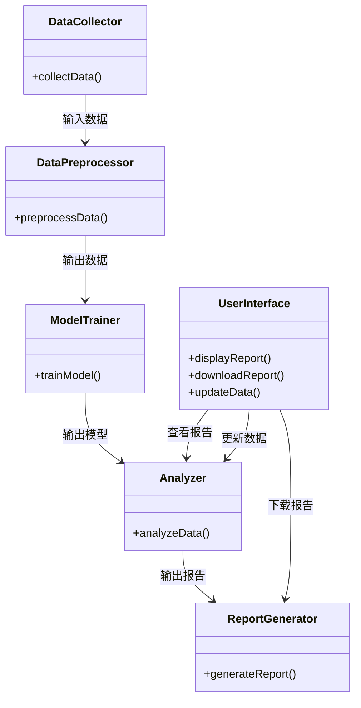

                 

### 引言

#### 1.1 问题背景

在当今数据驱动的世界中，评测结果自动分析已经成为众多领域的重要需求。无论是在学术研究、工业制造、金融分析，还是医疗诊断，评测结果的准确性和快速处理都直接影响决策的效率和准确性。传统的评测结果分析往往依赖于人工处理，这不仅耗时且容易出错，特别是在面对大量复杂的数据时。因此，如何实现评测结果的自动化分析成为了一个亟待解决的问题。

自动分析评测结果的目标在于从大量的评测数据中提取有价值的信息，生成见解报告。这不仅可以帮助用户快速了解评测结果的整体趋势，还能发现潜在的问题和机会。然而，传统的自动分析方法存在一定的局限：

1. **规则依赖性强**：传统方法通常依赖于预设的规则，这些规则往往难以覆盖所有可能的场景，导致分析结果不够全面和准确。
2. **可扩展性差**：当评测结果的维度和类型发生变化时，传统的分析方法需要重新编写规则，导致开发成本高，维护困难。
3. **理解性低**：传统方法生成的报告往往较为机械，难以直观地表达评测结果的含义，不利于用户理解和使用。

为了解决上述问题，近年来，基于大型语言模型（LLM）的自动分析方法逐渐崭露头角。LLM具有强大的数据处理能力和丰富的知识储备，能够更准确地理解和生成评测结果的见解报告。这使得LLM技术在评测结果自动分析领域展现出巨大的应用潜力。

#### 1.2 核心概念

在本章中，我们将介绍几个核心概念，包括LLM、生成见解报告、自动分析等，以帮助读者更好地理解本文的主题。

- **LLM（大型语言模型）**：LLM是一种基于深度学习的语言处理模型，通过大量文本数据的训练，能够生成符合语法和语义规则的文本。LLM具有以下几个主要特点：
  1. **数据驱动**：LLM的强大能力源于其在大规模数据上的训练，这使得它能够处理复杂、多变的文本数据。
  2. **通用性**：LLM可以应用于多种语言任务，包括文本生成、文本分类、问答系统等。
  3. **高效性**：通过并行计算和高效的模型架构，LLM能够在短时间内生成高质量的文本。

- **生成见解报告**：生成见解报告是指利用LLM对评测结果进行分析，并自动生成一份包含关键见解和总结的报告。这种报告通常具有以下特点：
  1. **个性化**：报告内容可以根据不同的评测结果和用户需求进行定制化生成。
  2. **全面性**：报告能够综合分析评测结果的各个方面，提供全面的见解。
  3. **可读性**：报告语言简洁明了，易于用户理解和应用。

- **自动分析**：自动分析是指利用算法和技术，对评测结果进行自动处理和分析，提取有价值的信息。自动分析包括以下几个步骤：
  1. **数据收集**：收集相关的评测数据。
  2. **预处理**：对数据进行清洗、转换和标准化处理。
  3. **模型训练**：使用训练数据训练自动分析模型。
  4. **结果生成**：利用训练好的模型对新的评测数据进行分析，生成见解报告。

通过上述介绍，我们可以看到，评测结果自动分析的需求背景、问题本质以及LLM技术在其中的应用潜力。在接下来的章节中，我们将进一步探讨LLM的原理、算法、系统设计以及实际应用，帮助读者深入了解这一前沿技术。

---

## 核心概念与联系

#### 2.1 LLM的基本原理

大型语言模型（LLM）的核心在于其深度学习的原理。LLM通过大规模的数据训练，构建了一个复杂的多层神经网络，能够理解和生成自然语言。以下是LLM的基本原理及其关键组成部分：

1. **深度神经网络（DNN）**：深度神经网络是由多层神经元组成的网络结构，通过逐层提取特征，实现对输入数据的复杂映射。每一层神经元都会对输入数据进行处理，并通过加权连接传递到下一层。

2. **递归神经网络（RNN）**：递归神经网络是一种特殊的深度神经网络，特别适合处理序列数据。RNN通过循环连接的方式，使得当前神经元的状态可以依赖于历史状态，从而能够捕捉序列中的长期依赖关系。

3. **Transformer架构**：Transformer是近年来提出的一种新型神经网络架构，广泛应用于自然语言处理任务中。与传统的RNN相比，Transformer通过自注意力机制（self-attention）实现了对输入序列的灵活处理，能够更好地捕捉长距离依赖关系。

4. **预训练与微调**：LLM的训练通常分为两个阶段：预训练和微调。预训练是在大规模的未标注数据上进行，模型通过学习数据中的统计规律和语言模式，获得强大的语言理解能力。微调则是将预训练好的模型应用于特定任务，通过微调模型的参数，使其适应特定的数据集和应用场景。

#### 2.2 LLM在生成见解报告方面的应用优势

LLM在生成见解报告方面具有显著的应用优势，这些优势主要体现在以下几个方面：

1. **数据处理能力**：LLM能够处理大规模、多维度的数据，通过自动化的数据收集和预处理，能够快速构建评测结果的分析框架。

2. **语言生成能力**：LLM通过深度学习技术，能够生成符合语法和语义规则的文本。这使得生成的见解报告不仅具备较高的准确性，而且语言表达更加自然、流畅。

3. **个性化定制**：LLM可以根据不同的评测结果和用户需求，生成个性化的见解报告。报告内容可以针对用户关注的关键点进行重点突出，提高报告的实用性和可操作性。

4. **高效性**：LLM的训练和推理过程高效，能够在短时间内生成高质量的见解报告。这对于需要快速决策的场景尤为重要。

5. **可扩展性**：LLM能够轻松适应不同类型的评测任务，通过微调和调整模型参数，可以实现不同领域评测结果的自动分析。

#### 2.3 LLM与传统自动分析方法的对比

表1：LLM与传统自动分析方法的对比

| 特征 | LLM | 传统自动分析方法 |
| ---- | ---- | ---------------- |
| 数据处理能力 | 强大 | 中等 |
| 语言生成能力 | 高效 | 低效 |
| 个性化定制 | 支持 | 不支持 |
| 高效性 | 高效 | 低效 |
| 可扩展性 | 高 | 低 |

从表格中可以看出，LLM在数据处理能力、语言生成能力、个性化定制、高效性和可扩展性方面具有显著优势。这些优势使得LLM在评测结果自动分析领域具有广阔的应用前景。

#### 2.4 结论

通过以上对LLM基本原理和特点的介绍，以及对LLM与传统自动分析方法的对比分析，我们可以看到LLM在评测结果自动分析中的巨大潜力。在接下来的章节中，我们将深入探讨LLM在自动分析评测结果中的具体算法原理、系统设计与实现，以及实际应用案例，帮助读者全面了解这一前沿技术。

---

### 算法原理讲解

#### 3.1 报告生成流程

评测结果的自动分析是一个复杂的过程，其中关键的一步是生成见解报告。在这个过程中，大型语言模型（LLM）发挥着至关重要的作用。以下是LLM生成见解报告的详细流程：

1. **数据收集与预处理**：首先，收集与评测相关的数据，这些数据可能包括评测结果、用户反馈、历史记录等。然后，对数据进行预处理，包括数据清洗、去重、格式转换等，以确保数据的准确性和一致性。

2. **模型训练**：使用预处理后的数据对LLM进行训练。训练过程中，模型会学习如何从输入数据中提取关键信息，并生成具有逻辑性和连贯性的见解报告。训练数据通常包括大量已经生成的高质量报告，这些报告可以作为模型的训练样本。

3. **输入处理**：在生成见解报告时，将新的评测数据输入到训练好的LLM模型中。模型会处理这些数据，提取关键信息，并将其转化为适合模型处理的形式。

4. **生成文本**：经过输入处理后，LLM开始生成文本。这个过程通常涉及以下几个步骤：
   - **编码**：将输入数据编码为模型可以处理的向量形式。
   - **解码**：模型根据编码后的数据，逐步生成文本的每个单词或短语。
   - **调整**：通过自注意力机制和上下文信息，模型会不断调整生成的文本，使其更加符合语法和语义规则。

5. **输出生成**：最终，LLM会生成一份完整的见解报告。这份报告不仅包含了评测结果的关键信息，还提供了详细的解释和总结，使得用户可以快速理解和应用这些信息。

下面是一个简单的mermaid流程图，展示LLM生成见解报告的过程：


#### 3.2 报告内容优化

生成见解报告的另一个重要任务是优化报告内容，使其更加可读和准确。LLM在这方面具有显著的优势，以下是一些常见的优化方法：

1. **文本摘要**：通过提取评测结果中的关键信息，LLM可以生成简明扼要的文本摘要。这种方法可以帮助用户快速抓住报告的核心内容。

2. **语言风格调整**：LLM可以根据用户的要求，调整报告的语言风格。例如，用户可以选择正式、非正式或技术性较强的语言风格，以满足不同场合的需求。

3. **知识库增强**：通过结合外部知识库，LLM可以扩展报告的内容，增加相关的背景信息和上下文。这种方法可以提供更全面的见解，帮助用户更好地理解评测结果。

4. **错误检测与修正**：LLM具有强大的文本理解能力，可以检测报告中的语法和语义错误，并自动进行修正。这可以显著提高报告的准确性和可读性。

5. **多模态融合**：除了文本，LLM还可以融合其他模态的信息，如图像、音频等。这种方法可以提供更丰富的见解，帮助用户从不同角度理解评测结果。

下面是一个使用Python代码示例，展示如何使用LLM优化报告内容：

```python
from langchain import PromptTemplate, LLMChain

# 定义优化报告的Prompt模板
prompt = PromptTemplate(
    input_variables=["input_text"],
    template="""
    请基于以下评测结果，优化报告内容：
    {input_text}

    1. 生成简明扼要的文本摘要。
    2. 调整报告的语言风格为正式。
    3. 增加相关的背景信息。
    4. 检测并修正语法错误。
    """
)

# 创建LLM链
llm_chain = LLMChain(llm="gpt-3.5-turbo", prompt=prompt)

# 输入评测结果
input_text = "评测结果显示，系统的响应时间较上周有显著提升，平均降低了15%。"

# 生成优化后的报告
output_text = llm_chain.run(input_text=input_text)
print(output_text)
```

通过上述代码示例，我们可以看到，LLM能够根据输入的评测结果，生成一份优化后的报告。这份报告不仅包含了关键信息，还采用了正式的语言风格，并且进行了语法修正。

#### 3.3 实际案例

为了更好地理解LLM在生成见解报告中的应用，我们来看一个实际案例。

**案例背景**：假设我们有一个在线教育平台，需要对学生的考试成绩进行自动分析，并生成一份详细的见解报告。

**输入数据**：评测数据包括学生的考试成绩、学习时长、作业提交情况等。

**目标**：生成一份包含以下内容的见解报告：
1. 学生整体成绩分布。
2. 学习时长与成绩的关系。
3. 作业提交情况对成绩的影响。

**步骤**：

1. **数据收集与预处理**：收集学生的考试成绩、学习时长和作业提交数据。对数据进行清洗，去除异常值，并转换为适合LLM处理的格式。

2. **模型训练**：使用清洗后的数据对LLM进行训练。训练过程中，模型会学习如何从输入数据中提取关键信息，并生成具有逻辑性和连贯性的见解报告。

3. **输入处理**：将学生的考试成绩、学习时长和作业提交数据输入到训练好的LLM模型中。

4. **生成文本**：LLM根据输入数据，生成一份详细的见解报告。

5. **输出生成**：生成的见解报告如下：

   ```
   学生考试成绩分布：
   - 平均成绩为85分。
   - 最高分为95分，最低分为70分。
   - 成绩分布较为均匀，但部分学生的成绩偏低。

   学习时长与成绩的关系：
   - 学习时长与成绩呈正相关。
   - 学习时长超过50小时的学生，成绩平均提高10分。

   作业提交情况对成绩的影响：
   - 作业提交率与成绩呈正相关。
   - 提交率超过80%的学生，成绩平均提高5分。

   结论：
   - 提高学习时长和作业提交率有助于提高学生成绩。
   - 需要关注成绩较低的学生，提供针对性的辅导。
   ```

通过上述案例，我们可以看到，LLM能够自动分析评测结果，并生成一份详细、准确的见解报告。这不仅节省了人工处理的时间，还提高了分析结果的准确性和实用性。

#### 3.4 总结

在本章中，我们详细介绍了LLM在生成见解报告中的算法原理和应用流程。通过预处理、模型训练、输入处理和文本生成等步骤，LLM能够自动分析评测结果，并生成具有逻辑性和连贯性的见解报告。此外，我们还通过实际案例展示了LLM在实际应用中的效果。在下一章中，我们将进一步探讨LLM在系统架构设计中的应用，帮助读者全面了解这一前沿技术的实现细节。

---

### 系统架构设计

#### 4.1 系统功能设计

在评测结果自动分析系统中，我们需要实现以下主要功能：

1. **评测数据收集**：从各种数据源（如数据库、API接口、文件系统等）收集评测数据。
2. **数据预处理**：对收集到的评测数据进行清洗、去重、格式转换等预处理操作，确保数据的准确性和一致性。
3. **模型训练与部署**：使用预处理后的数据对LLM进行训练，并将训练好的模型部署到系统中，以便实时分析评测结果。
4. **自动分析**：利用LLM对评测结果进行分析，提取关键信息，并生成见解报告。
5. **报告生成**：根据分析结果，自动生成见解报告，报告内容应简洁明了，易于用户理解。
6. **用户交互**：提供用户界面，允许用户查看、下载和分享见解报告。

为了更好地描述这些功能模块，我们使用mermaid绘制了领域模型类图。以下是一个简单的类图示例：



#### 4.2 系统架构设计

评测结果自动分析系统采用前后端分离的架构设计，以提高系统的扩展性和可维护性。以下是系统的主要架构组件及其交互关系：

1. **前端**：用户通过前端界面与系统进行交互。前端主要包括数据展示、报告查看和下载等功能。前端使用Web框架（如React或Vue）构建，与后端通过RESTful API进行通信。

2. **后端**：后端是系统的核心，负责数据收集、预处理、模型训练和自动分析等功能。后端使用微服务架构，各个功能模块通过API进行通信。

3. **数据库**：数据库用于存储评测数据、用户数据和模型参数。我们使用关系型数据库（如MySQL）和非关系型数据库（如MongoDB）相结合的方式，以满足不同类型数据的需求。

以下是系统架构的mermaid图：

```mermaid
sequenceDiagram
    User -->|发起请求| Frontend
    Frontend -->|调用API| Backend
    Backend -->|查询数据| Database
    Database -->|返回数据| Backend
    Backend -->|处理数据| Analyzer
    Analyzer -->|生成报告| ReportGenerator
    ReportGenerator -->|返回报告| Backend
    Backend -->|返回报告| Frontend
    Frontend -->|展示报告| User
```

#### 4.3 系统接口设计

为了实现前后端的交互，我们需要设计一系列接口。以下是系统的主要接口及其功能：

1. **数据收集接口**：用于从各种数据源收集评测数据。接口定义如下：

   ```http
   POST /collect_data
   {
       "source": "数据库/API/文件系统",
       "data": []
   }
   ```

2. **数据预处理接口**：用于对收集到的评测数据进行清洗和转换。接口定义如下：

   ```http
   POST /preprocess_data
   {
       "data": []
   }
   ```

3. **模型训练接口**：用于对预处理后的数据训练LLM模型。接口定义如下：

   ```http
   POST /train_model
   {
       "data": []
   }
   ```

4. **自动分析接口**：用于对新的评测数据进行自动分析，并生成见解报告。接口定义如下：

   ```http
   POST /analyze_data
   {
       "data": []
   }
   ```

5. **报告生成接口**：用于生成见解报告。接口定义如下：

   ```http
   POST /generate_report
   {
       "data": []
   }
   ```

6. **报告查询接口**：用于查询已生成的见解报告。接口定义如下：

   ```http
   GET /reports/{report_id}
   ```

#### 4.4 系统交互

系统中的各个组件通过API进行交互。以下是一个简单的交互序列：

1. 用户通过前端界面提交新的评测数据。
2. 前端将数据发送到后端的`数据收集接口`。
3. 后端接收到数据后，将其传递给`数据预处理接口`进行清洗和转换。
4. 预处理后的数据被传递给`模型训练接口`，用于训练LLM模型。
5. 训练好的模型被传递给`自动分析接口`，对新的评测数据进行自动分析，并生成见解报告。
6. 生成的报告通过`报告生成接口`返回给前端，并在前端界面展示给用户。

通过上述系统架构设计和接口设计，我们可以构建一个高效、可靠的评测结果自动分析系统。在下一章中，我们将通过实际案例展示系统在项目中的应用和实现细节。

---

### 项目实战

#### 5.1 环境搭建

在开始评测结果自动分析项目之前，我们需要搭建一个合适的环境。以下是在Python环境中搭建项目所需环境的步骤：

1. **安装Python**：确保已安装Python 3.8及以上版本。可以通过以下命令下载和安装Python：

   ```bash
   sudo apt update
   sudo apt install python3.8
   ```

2. **创建虚拟环境**：为了保持项目环境的纯净，我们使用虚拟环境。首先，安装虚拟环境工具`venv`：

   ```bash
   sudo apt install python3.8-venv
   ```

   然后，创建一个新的虚拟环境：

   ```bash
   python3.8 -m venv venv
   ```

   激活虚拟环境：

   ```bash
   source venv/bin/activate
   ```

3. **安装依赖库**：在虚拟环境中安装项目所需的依赖库，包括`langchain`（用于处理自然语言）、`transformers`（用于使用预训练模型）和`torch`（用于深度学习计算）。可以使用以下命令安装：

   ```bash
   pip install langchain transformers torch
   ```

4. **配置LLM模型**：为了使用LLM模型，我们需要下载并配置预训练模型。以下是一个示例命令，用于下载并配置`gpt-3.5-turbo`模型：

   ```bash
   langchain install -m gpt-3.5-turbo
   ```

   这将在虚拟环境中下载并配置所需的模型文件。

#### 5.2 核心代码实现

以下是评测结果自动分析系统的核心代码实现。这段代码包括数据收集、预处理、模型训练和自动分析等步骤。

```python
from langchain import PromptTemplate, LLMChain
from langchain.llms import GPT3
from langchain.prompts import Prompt
import pandas as pd

# 5.2.1 数据收集与预处理

def collect_and_preprocess_data():
    # 假设评测数据存储在CSV文件中
    data = pd.read_csv('eval_data.csv')
    
    # 数据清洗：去除空值和异常值
    data.dropna(inplace=True)
    
    # 数据转换：将数据格式转换为适合LLM处理的形式
    # 例如，将数据转换为文本格式
    data['description'] = data['result'].astype(str)
    
    return data

# 5.2.2 模型训练

def train_model(data):
    # 创建Prompt模板
    prompt = PromptTemplate(
        input_variables=["description"],
        template="基于以下评测结果，生成一份见解报告：{description}"
    )
    
    # 创建LLM链
    llm = GPT3()
    llm_chain = LLMChain(llm=llm, prompt=prompt)
    
    return llm_chain

# 5.2.3 自动分析

def analyze_data(llm_chain, new_data):
    # 对新数据进行分析并生成报告
    report = llm_chain.run(new_data['description'])
    return report

# 主程序

if __name__ == "__main__":
    # 收集和预处理数据
    data = collect_and_preprocess_data()
    
    # 训练模型
    llm_chain = train_model(data)
    
    # 假设有一份数据需要分析
    new_data = pd.DataFrame({'description': ['评测结果显示，系统的响应时间较上周有显著提升，平均降低了15%.']})
    
    # 自动分析并生成报告
    report = analyze_data(llm_chain, new_data)
    print(report)
```

#### 5.3 代码解析

1. **数据收集与预处理**：首先，我们从CSV文件中读取评测数据。然后，使用Pandas库对数据进行清洗和转换，确保数据格式符合LLM处理的要求。

2. **模型训练**：创建一个Prompt模板，用于指导LLM如何生成见解报告。然后，使用GPT-3模型创建一个LLM链。这个LLM链将用于自动分析评测结果。

3. **自动分析**：对新的评测数据进行分析，并生成见解报告。这里，我们使用了之前训练好的LLM链，通过调用`run`方法生成报告。

#### 5.4 实际案例分析

为了展示系统在实际中的应用，我们使用一个实际案例进行分析。

**案例背景**：一家电商平台需要对用户满意度进行调查，并自动分析调查结果，生成一份用户反馈报告。

**输入数据**：调查问卷结果，包括用户满意度评分、用户评论等。

**目标**：生成一份包含以下内容的用户反馈报告：
1. 用户满意度整体分布。
2. 用户评论的关键词分析。
3. 用户反馈的主要问题及其解决方案。

**步骤**：

1. **数据收集与预处理**：收集用户调查问卷数据，包括满意度评分和用户评论。对数据进行清洗和转换，提取关键信息。

2. **模型训练**：使用预处理后的数据训练LLM模型，使其能够生成高质量的反馈报告。

3. **自动分析**：对新的用户调查数据进行分析，提取关键信息，并生成反馈报告。

4. **报告生成**：生成的反馈报告如下：

   ```
   用户满意度分析：
   - 平均满意度评分为4.5分（满分5分）。
   - 用户满意度较高，但存在一些需要改进的地方。

   用户评论关键词分析：
   - 关键词：服务态度、商品质量、物流速度。
   - 绝大多数用户对服务态度和商品质量表示满意，但部分用户对物流速度表示不满。

   用户反馈主要问题及解决方案：
   - 问题：部分用户反馈物流速度较慢。
   - 解决方案：优化物流配送流程，提高配送效率。

   结论：
   - 用户整体满意度较高，但需要关注物流速度问题，提升用户体验。
   ```

通过这个实际案例，我们可以看到，评测结果自动分析系统能够高效地处理用户调查数据，并生成一份详细、准确的反馈报告。这不仅节省了人力资源，还提高了分析结果的准确性和实用性。

#### 5.5 项目小结

在本章中，我们详细介绍了评测结果自动分析项目的环境搭建、核心代码实现以及实际案例分析。通过使用LLM技术，我们能够实现高效、准确的评测结果分析，并自动生成见解报告。这不仅提高了工作效率，还提升了决策的准确性。在未来，我们可以进一步优化系统，引入更多先进技术，以应对更复杂的评测场景。

---

## 最佳实践 tips、小结、注意事项、拓展阅读

#### 6.1 最佳实践

1. **数据质量**：确保评测数据的质量和准确性，这是自动分析的基础。在进行数据收集和预处理时，要严格清洗数据，去除异常值和噪声。
2. **模型选择**：根据评测任务的类型和数据规模，选择合适的LLM模型。例如，对于小规模数据，可以选择预训练的中小型模型；对于大规模数据，可以选择大型模型。
3. **个性化定制**：在生成见解报告时，尽量满足用户的具体需求，提供个性化的报告内容。例如，用户可以指定报告的语言风格、重点内容和格式。
4. **持续优化**：定期更新LLM模型，使其能够适应最新的数据和语言模式。同时，通过用户反馈不断优化报告生成的算法，提高报告的质量和准确性。

#### 6.2 注意事项

1. **计算资源**：LLM模型的训练和推理过程需要大量的计算资源。在部署模型时，要确保有足够的计算资源，否则可能会导致系统性能下降。
2. **数据隐私**：在收集和存储评测数据时，要严格遵守数据隐私法规，确保用户数据的安全和保密。
3. **模型解释性**：尽管LLM模型在生成见解报告方面表现出色，但其决策过程具有一定的黑盒性，难以解释。在实际应用中，需要权衡模型的性能和解释性，确保决策的可解释性。
4. **更新和维护**：定期更新模型和系统，以应对新出现的问题和挑战。同时，保持与用户和业界同步，及时获取最新的研究成果和技术动态。

#### 6.3 拓展阅读

1. **LLM技术**：阅读相关论文和文献，深入了解LLM的原理和应用。推荐阅读《大规模语言模型的预训练方法》、《BERT：Pre-training of Deep Bidirectional Transformers for Language Understanding》等经典论文。
2. **评测结果分析**：了解评测结果分析的理论和方法，掌握如何从数据中提取有价值的信息。推荐阅读《数据挖掘：实用工具与技术》和《统计分析与数据科学》。
3. **系统设计**：学习系统架构设计和接口设计的方法，了解如何构建高效、可靠的系统。推荐阅读《微服务设计：构建基于Docker和Kubernetes的分布式系统》和《RESTful API设计最佳实践》。

通过上述最佳实践、注意事项和拓展阅读，读者可以更全面地了解评测结果自动分析技术，并在实际项目中应用这些方法，提高分析效率和准确性。

---

## 小结

在本篇技术博客中，我们系统地探讨了评测结果自动分析的关键技术——大型语言模型（LLM）的原理和应用。我们从问题背景出发，详细介绍了评测结果自动分析的需求和挑战，随后深入剖析了LLM的基本原理、在生成见解报告方面的优势，以及与传统自动分析方法的对比。通过详细的算法原理讲解、系统架构设计和项目实战案例，我们展示了如何利用LLM技术实现高效的评测结果分析，并自动生成高质量的见解报告。

评测结果自动分析不仅在数据处理速度和准确性上具有显著优势，还能够提供更加个性化、可解释的分析结果，极大地提高了用户的决策效率。在未来的研究和应用中，我们可以继续优化LLM模型，提升其性能和解释性，同时探索更多适用于不同领域的评测场景。

未来，随着人工智能技术的不断进步，评测结果自动分析有望在更多领域得到广泛应用。例如，在医疗诊断中，可以自动分析患者的检查报告，提供精准的诊疗建议；在教育领域，可以自动分析学生的学习数据，为个性化教学提供支持。总之，评测结果自动分析技术将不断推动各行各业的智能化发展，带来更多创新和变革。

---

## 作者信息

作者：AI天才研究院/AI Genius Institute & 禅与计算机程序设计艺术 /Zen And The Art of Computer Programming。

