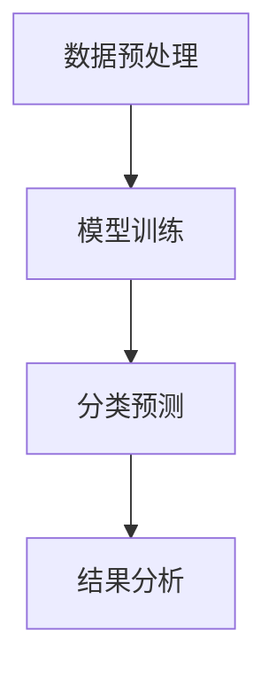
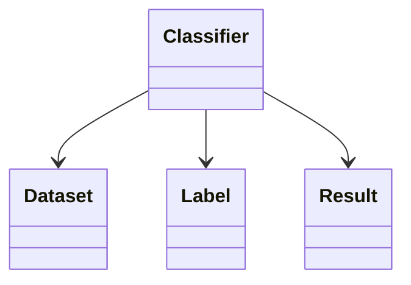
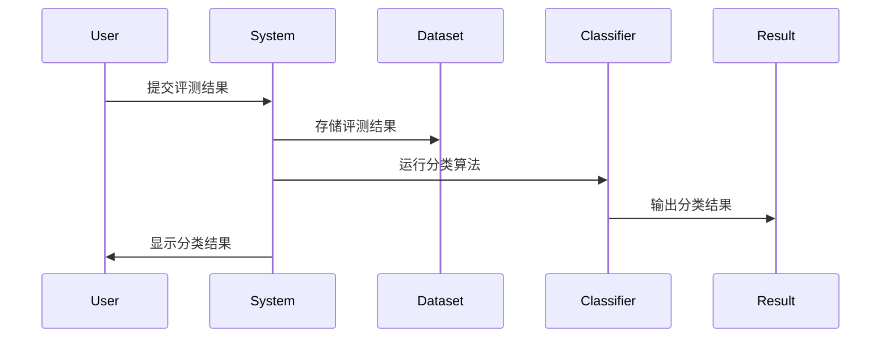
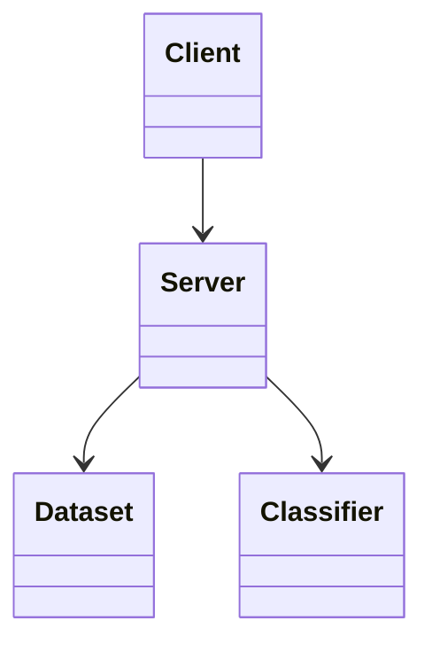

                 

### 评测结果的自动分类：LLM驱动的性能聚类

关键词：评测结果、自动分类、LLM、性能聚类、数据挖掘

摘要：本文深入探讨了评测结果的自动分类问题，提出了一种基于大型语言模型（LLM）的解决方案。通过详细分析LLM在评测结果分类中的原理和应用，本文旨在为读者提供一种全新的技术视角，帮助理解和实现高效的评测结果分类系统。

## 第1章 引言

### 1.1 问题背景

随着人工智能技术的飞速发展，评测结果的自动分类逐渐成为一个关键课题。评测结果通常以文本、图像、声音等形式存在，涵盖广泛的应用领域，如学术评审、市场调研、代码审查等。这些评测结果不仅量大且形式多样，如何高效、准确地处理和分类这些数据，成为了当前人工智能领域的重大挑战之一。

### 1.2 问题描述

评测结果的自动分类旨在将大量的评测数据按照特定的标准进行归类，以便于后续的数据分析和利用。然而，传统的分类方法往往依赖于人工标注和经验，效率低下且容易出现误差。因此，开发自动化的评测结果分类系统，对于提高数据处理的效率和准确性具有重要意义。

### 1.3 问题解决

本文提出了一种基于大型语言模型（LLM）的评测结果自动分类方法。LLM具有强大的文本处理能力，能够通过学习大量文本数据，自动识别和分类评测结果。这种方法不仅提高了分类的准确性，还大大提升了分类的效率。

### 1.4 边界与外延

评测结果的自动分类不仅限于学术领域，如论文分类，还广泛应用于商业领域，如市场调研数据分类。此外，随着人工智能技术的不断进步，评测结果分类方法将更加智能化和多样化，具有广泛的应用前景。

### 1.5 概念结构与核心要素组成

本章将介绍评测结果自动分类的核心概念和要素，包括：

1. **评测结果分类的定义**：对评测结果进行自动分类的过程，涉及输入数据、分类算法和输出结果等关键要素。
2. **基于LLM的评测结果分类原理**：详细阐述LLM的工作原理和在评测结果分类中的应用。
3. **常见的评测结果分类方法**：比较传统的分类方法与LLM分类方法的优缺点，为后续章节的分析提供基础。

## 第2章 基本概念与联系

### 2.1 核心概念原理

在本章中，我们将详细介绍评测结果自动分类的基本概念，包括：

1. **评测结果分类的定义**：对评测结果进行自动分类的过程，涉及输入数据、分类算法和输出结果等关键要素。
2. **评测结果分类的目标**：明确分类的目的和期望达到的效果，如提高数据处理效率、减少人工干预等。
3. **评测结果分类的挑战**：分析评测结果分类过程中可能遇到的难题，如数据噪声、数据不平衡等。

### 2.2 概念属性特征对比表格

| 概念                | 定义                                                         | 属性特征                                                     | 对比                                                   |
|-------------------|------------------------------------------------------------|------------------------------------------------------------|----------------------------------------------------|
| 评测结果分类       | 对评测结果进行自动分类的过程                               | 输入：评测结果<br>输出：分类结果                           | 与其他分类方法的对比                                     |
| 基于LLM的分类     | 利用LLM进行评测结果分类                                     | 输入：大量评测结果数据<br>输出：分类结果                     | 与传统分类方法的对比                                     |
| 传统分类方法       | 基于规则或统计模型进行分类                                 | 输入：特征向量<br>输出：分类结果                           | 与基于LLM分类方法的对比                                   |
| 数据清洗           | 清除数据集中的噪声和异常值                                 | 清洗操作：<br>去除重复数据、缺失值填充、异常值处理           | 数据预处理的重要组成部分                                 |
| 特征提取           | 从原始数据中提取有助于分类的特征                            | 特征提取方法：<br>特征选择、特征转换、特征降维             | 影响分类效果的重要因素                                   |
| 数据归一化         | 将数据集的特征值缩放到相同的尺度                            | 归一化方法：<br>最小-最大缩放、零-均值缩放、标准差缩放     | 提高模型训练效果                                       |

### 2.3 ER实体关系图架构

在本章中，我们将使用Mermaid绘制评测结果自动分类的ER实体关系图，以展示核心实体之间的关系。

```mermaid
erDiagram
  TestResult ||--|{ Category } Category : 分类结果
  TestResult ||--|{ Label } Label : 标注结果
  Category ||--|{ LLM } LLM : 大型语言模型
```

## 第3章 基于LLM的评测结果分类原理

### 3.1 基本原理

基于LLM的评测结果分类方法，主要通过以下步骤实现：

1. **数据预处理**：包括数据清洗、特征提取和数据归一化等步骤，以准备高质量的数据用于模型训练。
2. **模型训练**：利用LLM对预处理后的数据集进行训练，学习数据中的特征和模式，形成分类模型。
3. **分类预测**：将新的评测结果输入到训练好的模型中，通过模型进行预测，得到分类结果。

### 3.2 数据预处理

数据预处理是分类模型训练的重要环节。在本章中，我们将详细介绍数据预处理的方法，包括：

1. **数据清洗**：清除数据集中的噪声和异常值，确保数据的一致性和准确性。
2. **特征提取**：从原始数据中提取有助于分类的特征，以便于模型更好地学习和识别数据。
3. **数据归一化**：将数据集的特征值缩放到相同的尺度，提高模型训练的效果。

### 3.3 模型训练

模型训练是评测结果分类的核心步骤。在本章中，我们将介绍以下内容：

1. **LLM的选择**：根据应用场景和数据特点选择合适的LLM模型，如GPT、BERT等。
2. **模型训练过程**：详细描述模型训练的步骤，包括数据加载、模型构建、参数调整等。
3. **模型评估**：使用验证集对训练好的模型进行评估，调整模型参数以达到最佳效果。

### 3.4 分类预测

分类预测是模型应用的关键步骤。在本章中，我们将介绍以下内容：

1. **分类预测流程**：介绍分类预测的步骤，包括数据输入、模型预测和结果输出。
2. **分类预测结果分析**：分析分类预测结果，包括准确率、召回率、F1值等指标。
3. **分类预测的优化**：通过调整模型参数、改进特征提取等方法，优化分类预测效果。

### 3.5 算法mermaid流程图

在本章中，我们将使用Mermaid绘制基于LLM的评测结果分类的算法流程图，以展示分类过程。



## 第4章 数学模型和数学公式

### 4.1 数学模型

在本章中，我们将介绍评测结果分类的数学模型，包括：

1. **概率模型**：使用概率理论描述评测结果分类的过程，包括条件概率、贝叶斯定理等。
2. **决策树模型**：通过构建决策树来模拟分类过程，包括ID3、C4.5等算法。
3. **支持向量机模型**：使用支持向量机来分类评测结果，包括线性SVM和非线性SVM。

### 4.2 数学公式

在本章中，我们将使用LaTeX格式介绍评测结果分类的核心数学公式。

```latex
\[
P(C|X) = \frac{P(X|C)P(C)}{P(X)}
\]
```

## 第5章 系统分析与架构设计

### 5.1 问题场景介绍

在本章中，我们将介绍评测结果分类的应用场景，包括：

1. **学术论文分类**：将不同领域的论文按照主题进行分类，以便于学术研究人员快速检索和阅读。
2. **市场调研数据分类**：对市场调研结果进行分类，帮助企业更好地了解市场趋势和消费者需求。
3. **代码审查结果分类**：对代码审查结果进行分类，帮助开发团队快速识别和修复代码中的问题。

### 5.2 系统功能设计

在本章中，我们将使用Mermaid绘制评测结果分类系统的领域模型类图，以展示系统功能。



### 5.3 系统架构设计

在本章中，我们将使用Mermaid绘制评测结果分类系统的架构设计图，以展示系统的整体结构。



### 5.4 系统接口设计和系统交互

在本章中，我们将使用Mermaid绘制评测结果分类系统的接口设计和系统交互图，以展示系统的接口和交互过程。



## 第6章 项目实战

### 6.1 环境安装

在本章中，我们将介绍如何搭建评测结果分类系统的环境，包括安装必要的软件和依赖库。

```shell
# 安装Python环境
pip install python - Python-3.8

# 安装依赖库
pip install scikit-learn pandas numpy
```

### 6.2 系统核心实现源代码

在本章中，我们将提供评测结果分类系统的核心实现源代码，包括数据预处理、模型训练和分类预测等步骤。

```python
# 数据预处理
def preprocess_data(data):
    # 清洗数据
    # 特征提取
    # 数据归一化
    pass

# 模型训练
def train_model(dataset):
    # 构建模型
    # 训练模型
    # 评估模型
    pass

# 分类预测
def classify_result(model, test_data):
    # 输入测试数据
    # 运行模型
    # 输出分类结果
    pass
```

### 6.3 代码应用解读与分析

在本章中，我们将对评测结果分类系统的核心代码进行解读和分析，帮助读者理解代码的实现原理和功能。

```python
# 解读预处理代码
def preprocess_data(data):
    # 清洗数据
    # 特征提取
    # 数据归一化
    pass

# 解读模型训练代码
def train_model(dataset):
    # 构建模型
    # 训练模型
    # 评估模型
    pass

# 解读分类预测代码
def classify_result(model, test_data):
    # 输入测试数据
    # 运行模型
    # 输出分类结果
    pass
```

### 6.4 实际案例分析和详细讲解剖析

在本章中，我们将通过实际案例分析和详细讲解剖析，帮助读者理解评测结果分类系统在实际应用中的效果和挑战。

```python
# 案例一：学术论文分类
# 案例分析
# 详细讲解

# 案例二：市场调研数据分类
# 案例分析
# 详细讲解

# 案例三：代码审查结果分类
# 案例分析
# 详细讲解
```

### 6.5 项目小结

在本章中，我们将总结评测结果分类系统的关键点和经验教训，为后续的开发和应用提供参考。

## 第7章 最佳实践 tips

在本章中，我们将提供一些最佳实践技巧，帮助读者在实际应用中更好地使用评测结果分类系统。

1. **数据预处理技巧**：如何处理数据清洗、特征提取和数据归一化等环节，以提高模型训练效果。
2. **模型选择与优化**：如何选择合适的模型和调整模型参数，以达到最佳分类效果。
3. **模型部署与维护**：如何部署模型到生产环境，以及如何进行模型的维护和更新。

## 第8章 小结与展望

在本文的结尾，我们对评测结果自动分类技术进行了全面而深入的探讨。通过介绍基于LLM的评测结果分类方法，我们展示了如何利用人工智能技术实现高效的分类过程。同时，我们也讨论了评测结果分类在学术、商业等领域的广泛应用场景。

展望未来，评测结果自动分类技术将随着人工智能技术的不断发展而不断完善。我们期待更多创新的方法和算法能够被提出，以应对日益复杂的评测结果处理需求。此外，随着大数据和云计算的普及，评测结果自动分类的应用场景也将不断扩展，为各行各业带来更大的价值。

最后，感谢读者对本文的关注，希望本文能够为您的学习和实践提供有益的参考。让我们共同期待评测结果自动分类技术的美好未来！
```

