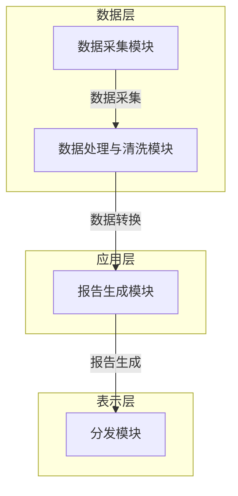
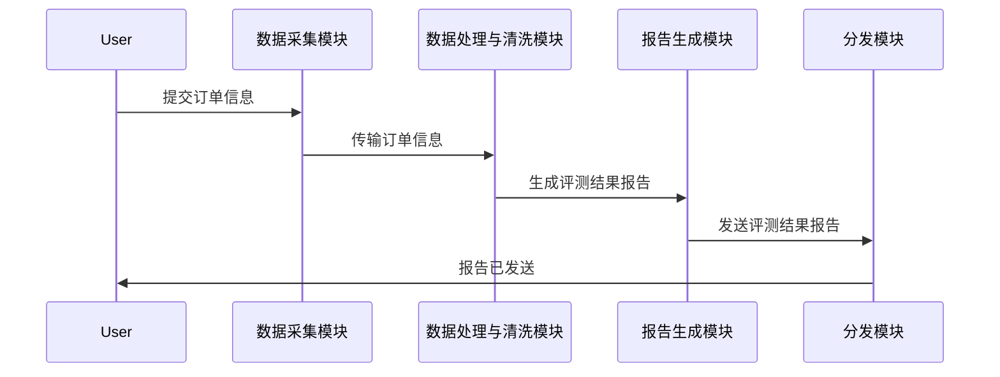
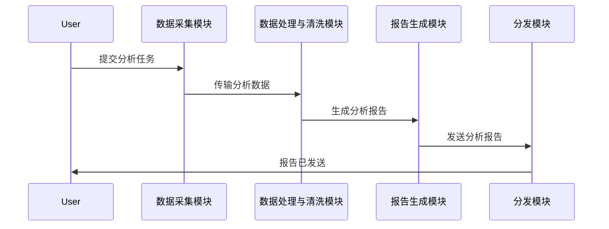
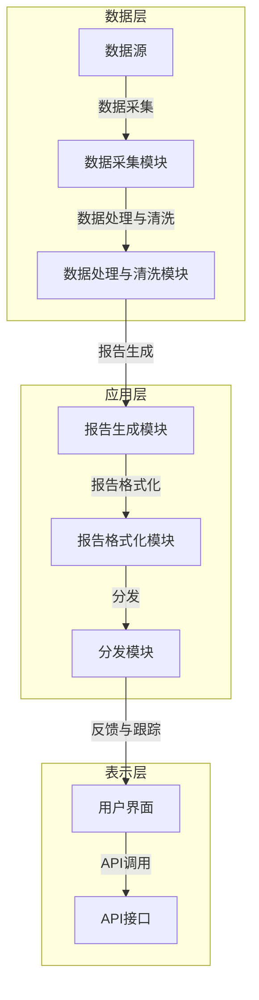
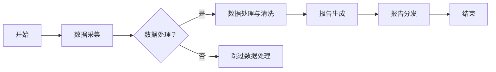
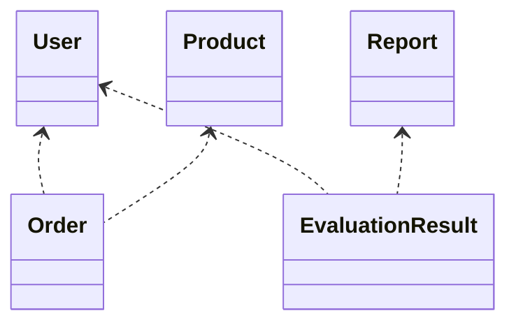
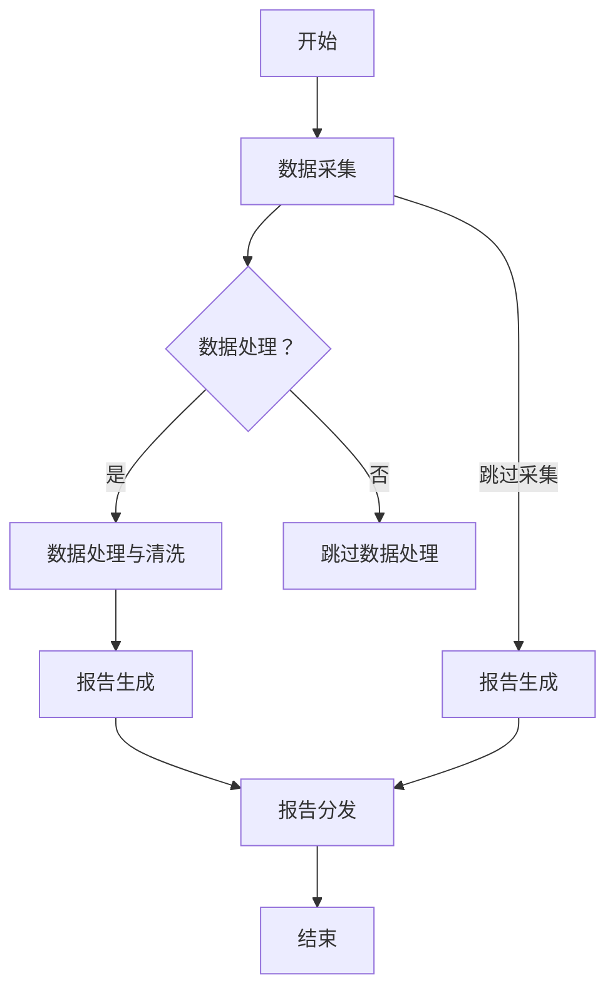

                 

# 评测结果的自动化报告分发：确保信息及时传达

## 关键词
- 自动化报告分发
- 评测结果
- 信息传达
- 技术实现
- 最佳实践

## 摘要
本文将深入探讨评测结果的自动化报告分发，以实现信息的高效传达。首先，我们将定义评测结果及其重要性，然后探讨自动化报告的概念和优势。接着，我们将分析信息传达的关键要素，并详细介绍自动化报告分发的技术实现。此外，本文还将通过案例分析，展示自动化报告分发的实际应用，并提供最佳实践和注意事项。最终，本文将为读者提供进一步的学习资源。

## 目录大纲

### 第一部分：引言

#### 第1章：背景与目标
- 评测结果的重要性
- 自动化报告的分发目标
- 本书结构安排

#### 第2章：评测结果概述
- 基本概念
- 应用场景
- 生成过程

#### 第3章：自动化报告的基础
- 定义与分类
- 功能模块
- 优势与挑战

#### 第4章：信息传达的关键要素
- 基本原理
- 有效的传达策略

### 第二部分：技术实现

#### 第5章：自动化报告分发的技术实现
- 技术选型
- 数据处理与清洗
- 报告生成与格式化
- 分发机制与渠道选择

#### 第6章：案例分析
- 案例一：电商平台评测结果自动分发
- 案例二：数据分析团队评测结果自动分发

#### 第7章：最佳实践与注意事项
- 最佳实践
- 注意事项
- 拓展阅读

## 目录大纲设计过程详解

### 1. 明确书籍主题和目标
本书的主题是评测结果的自动化报告分发，目标是提供一套完整的技术解决方案，确保信息能够及时、准确地传达。

### 2. 确定核心概念和结构
核心概念包括评测结果、自动化报告、信息传达等。结构设计上，分为引言、技术实现和最佳实践三个部分。

### 3. 设计章节标题
根据核心概念和结构，设计出吸引人的章节标题，如“评测结果的重要性”、“自动化报告的分发目标”等。

### 4. 优化章节内容
确保每个章节都有足够的内容来支撑标题，同时保持章节之间的逻辑关系。

### 5. 确保目录大纲完整性
每个章节都应该涵盖必要的核心内容，并且章节之间应该有清晰的逻辑关系。

### 6. 控制目录大纲字数
目录大纲的总字数控制在2000字以内，保证文章的精简和逻辑性。

### 7. 审核与修改
对目录大纲进行审核和修改，确保每个章节的内容都是必要的，章节之间的逻辑关系是清晰的。

通过以上步骤，我们设计出了完整的目录大纲，为后续的章节内容提供了清晰的框架和方向。接下来，我们将根据这个大纲逐步展开详细的内容编写工作。# 第1章：引言

## 1.1 评测结果的重要性

评测结果在各个领域中扮演着至关重要的角色。无论是在商业决策、产品开发，还是在科研和项目评估中，评测结果都为决策提供了有力的依据。在商业领域，评测结果可以帮助企业了解客户的需求，优化产品和服务；在项目评估中，评测结果能够衡量项目进度和效果，帮助管理者做出调整和决策。

### 背景介绍
评测结果的基本概念涉及数据的收集、处理和分析。通过评测，企业能够获取关于产品性能、用户体验、市场表现等方面的信息。这些信息对于制定战略、改进产品和服务具有重要意义。

### 问题背景
然而，传统的评测结果分发方式存在一些问题。首先，手工处理评测结果效率低下，容易出错；其次，信息传达不及时，可能导致决策延误；最后，信息传达的渠道不统一，难以保证信息的准确性和一致性。

### 问题描述
为了解决上述问题，我们需要一种高效、准确、及时的评测结果分发机制。自动化报告分发正是为了满足这一需求而诞生的。通过自动化报告分发，企业可以实时获取评测结果，并将这些结果传递给相关决策者和利益相关者，从而提高决策效率和质量。

### 问题解决
自动化报告分发利用了现代信息技术，特别是人工智能和大数据分析技术，实现了评测结果的自动收集、处理和报告生成。通过自动化报告分发，企业可以大大提高信息传达的效率，减少人为错误，确保信息的准确性和及时性。

### 边界与外延
评测结果不仅包括数据指标，还可能涉及文字描述、图表分析等多种形式。自动化报告分发需要能够处理这些不同形式的信息，并将它们整合到一个统一的报告中。

### 概念结构与核心要素组成
自动化报告分发的核心要素包括：数据采集、数据处理、报告生成和分发。数据采集是基础，数据处理是关键，报告生成是核心，分发是最终目的。

## 1.2 目标与内容概述

本书的目标是提供一套完整的评测结果自动化报告分发解决方案，确保信息能够及时、准确地传达。具体内容包括：

- 引入评测结果和自动化报告的基本概念。
- 分析信息传达的关键要素。
- 介绍自动化报告分发的技术实现，包括数据采集、数据处理、报告生成和分发。
- 通过实际案例展示自动化报告分发的应用。
- 提供最佳实践和注意事项，帮助读者在实际操作中避免常见问题。

## 1.3 本书结构安排

本书分为三个主要部分：

- **第一部分：引言**：介绍评测结果的重要性、自动化报告的基础知识和信息传达的关键要素。
- **第二部分：技术实现**：详细讨论评测结果自动化报告分发的技术实现，包括数据采集、数据处理、报告生成和分发。
- **第三部分：最佳实践与注意事项**：通过案例分析、最佳实践和注意事项，帮助读者更好地应用自动化报告分发技术。

通过以上结构安排，本书旨在为读者提供一套全面、实用的评测结果自动化报告分发指南。# 第2章：评测结果概述

## 2.1 基本概念

评测结果是对某一对象或系统在特定条件下进行的评估后得到的结果。这些结果可以反映对象或系统的性能、质量、效率等各个方面。评测结果通常包括定量数据和定性分析，如数据指标、图表、文字描述等。

### 定义

评测结果是一种评估性数据，它通过特定的方法或工具对某一对象或系统的性能进行测量和分析。这些测量和分析的结果可以为决策者提供可靠的依据，帮助他们了解对象或系统的实际情况，并做出相应的调整和改进。

### 类型

评测结果可以分为多种类型，根据评测的目的和性质，可以分为以下几类：

1. **性能评测结果**：评估对象在特定任务或环境下的性能表现，如处理速度、响应时间、吞吐量等。
2. **质量评测结果**：评估对象的质量特性，如可靠性、可用性、可维护性等。
3. **用户体验评测结果**：评估用户在使用对象或系统过程中的体验，如易用性、满意度等。
4. **市场评测结果**：评估对象在市场中的表现，如市场份额、品牌知名度等。

### 评测结果的获取方法

评测结果的获取通常涉及以下几个步骤：

1. **数据收集**：通过问卷调查、用户测试、日志分析等方式收集相关的数据。
2. **数据处理**：对收集到的数据进行清洗、整理和加工，以确保数据的质量和完整性。
3. **结果分析**：利用统计学、机器学习等方法对处理后的数据进行分析，得出评测结果。

## 2.2 应用场景

评测结果在各个领域都有广泛的应用，以下是几个典型的应用场景：

1. **商业领域**：企业可以通过评测结果了解产品的市场表现、用户反馈等，为产品改进和营销策略提供依据。
2. **技术领域**：研发团队可以通过评测结果评估软件的性能和可靠性，优化代码和系统设计。
3. **教育领域**：学校和教育机构可以通过评测结果了解学生的学习效果和知识掌握情况，进行教学调整。
4. **科研领域**：科研团队可以通过评测结果评估实验结果和理论模型，为科研决策提供支持。

### 商业分析

在商业领域，评测结果广泛应用于产品性能评估、市场调研和用户满意度分析等方面。例如，企业可以通过评测结果了解产品的故障率、用户的使用频率和满意度等，从而制定相应的产品改进和营销策略。

### 用户体验评估

用户体验评估是评测结果在技术领域的重要应用之一。通过评测用户对产品或系统的使用体验，企业可以了解用户的需求和痛点，从而优化产品的界面设计、功能流程等，提高用户的满意度。

### 技术性能监控

技术性能监控是评测结果在IT领域的重要应用。企业可以通过评测结果监控软件系统的性能指标，如响应时间、吞吐量、资源利用率等，及时发现和解决系统性能问题，保证系统的稳定运行。

## 2.3 评测结果的生成过程

评测结果的生成过程通常包括以下几个步骤：

1. **目标设定**：明确评测的目的和指标，制定评测计划。
2. **数据采集**：通过多种渠道收集与评测目标相关的数据。
3. **数据处理**：对收集到的数据进行清洗、整理和分析。
4. **结果分析**：利用统计学、机器学习等方法对处理后的数据进行分析，得出评测结果。
5. **报告生成**：将分析结果整理成报告，以便于决策者参考。

### 数据采集

数据采集是评测结果生成过程的关键步骤，常用的数据采集方法包括：

- **问卷调查**：通过设计问卷，收集用户对产品或系统的评价和反馈。
- **用户测试**：邀请用户参与实际操作，记录用户的行为数据。
- **日志分析**：分析系统日志，获取用户访问行为和系统运行状态。

### 数据处理

数据处理是对采集到的数据进行清洗、整理和分析，常用的数据处理方法包括：

- **数据清洗**：去除重复、错误和不完整的数据，提高数据质量。
- **数据整理**：将数据按照一定的格式进行整理，便于后续分析。
- **统计分析**：利用统计学方法，对数据进行描述性分析和推断性分析。

### 结果分析

结果分析是评测结果生成的核心环节，常用的分析方法包括：

- **描述性分析**：对数据进行描述性统计，如均值、方差等。
- **推断性分析**：利用统计学模型，对数据进行分析和预测。
- **机器学习**：利用机器学习算法，对数据进行分类、聚类和预测等分析。

### 报告生成

报告生成是将分析结果整理成文档或报表，以便于决策者参考。报告通常包括以下几个部分：

- **摘要**：对评测结果进行简要概述。
- **数据分析**：详细描述分析过程和结果。
- **结论与建议**：基于分析结果，提出相应的结论和建议。

## 2.4 评测结果的多样化形式

评测结果可以以多种形式呈现，包括：

- **数据表格**：以表格形式呈现数据，便于比较和分析。
- **图表**：使用柱状图、折线图、饼图等图形化方式展示数据。
- **文字描述**：对评测结果进行详细说明，补充数据图表无法表达的内容。
- **视频和图片**：通过视频和图片展示评测过程和结果，增加可读性和直观性。

### 多样化形式的优势

多样化形式的评测结果能够更好地满足不同决策者和利益相关者的需求，提高报告的可读性和说服力。例如：

- **数据表格**：便于对比和分析具体数据。
- **图表**：直观展示数据趋势和关系。
- **文字描述**：补充细节和背景信息。
- **视频和图片**：提供视觉冲击和现场体验。

## 总结

评测结果是评估对象或系统性能的重要指标，它在商业决策、产品优化、用户体验评估和技术性能监控等方面发挥着重要作用。通过有效的评测结果分发机制，企业可以确保信息的及时、准确传达，从而做出更明智的决策。接下来，我们将详细探讨自动化报告的基础知识和信息传达的关键要素。# 第3章：自动化报告的基础

### 3.1 自动化报告的定义与分类

自动化报告是指通过计算机技术自动生成、格式化和分发的报告，它能够替代传统手工处理报告的过程，提高效率、减少错误，并确保报告的准确性和一致性。自动化报告通常包括以下几种类型：

1. **定期报告**：按照固定时间间隔（如每日、每周、每月）生成的报告，通常用于监控业务运营和项目进度。
2. **事件触发报告**：当特定事件（如数据异常、系统故障等）发生时自动生成的报告，用于即时通知和处理。
3. **自定义报告**：根据用户需求自定义生成的内容和格式，通常用于特殊分析和决策支持。

### 3.2 自动化报告的功能模块

自动化报告通常由以下几个功能模块组成：

1. **数据采集模块**：负责从不同的数据源（如数据库、日志文件、API接口等）收集数据。
2. **数据处理模块**：对采集到的数据进行清洗、整理和分析，确保数据的质量和一致性。
3. **报告生成模块**：根据预设的模板和规则，将处理后的数据转换成格式化的报告。
4. **分发模块**：将生成的报告通过电子邮件、企业内部系统或其他渠道发送给相关用户。

### 3.3 自动化报告的优势与挑战

#### 优势

1. **提高效率**：自动化报告可以节省大量手工处理时间，尤其是对于定期报告和大规模数据分析。
2. **减少错误**：通过自动化处理，可以减少人为错误，提高报告的准确性和一致性。
3. **确保及时性**：自动化报告可以即时生成和分发，确保信息能够及时传达。
4. **灵活性和可定制性**：用户可以根据自己的需求自定义报告的内容和格式。

#### 挑战

1. **技术实现难度**：自动化报告的开发和部署需要一定的技术知识和资源。
2. **数据质量和完整性**：数据源的质量直接影响报告的准确性，因此需要确保数据的质量和完整性。
3. **用户接受度**：用户可能对自动化报告的格式和内容不熟悉，需要培训和适应。
4. **系统维护**：自动化报告系统需要定期维护和更新，以确保其正常运行。

### 3.4 自动化报告的架构设计

自动化报告的架构设计是确保系统能够高效、可靠运行的关键。以下是典型的自动化报告架构设计：

1. **数据源层**：包括数据库、日志文件、API接口等数据来源。
2. **数据采集层**：负责从数据源层收集数据，可以通过定时任务、事件触发等方式进行数据采集。
3. **数据处理层**：对采集到的数据进行清洗、整理和分析，可以使用ETL（提取、转换、加载）工具或自定义脚本。
4. **报告生成层**：根据预设的模板和规则，将处理后的数据转换成格式化的报告，可以使用报告生成工具或自定义代码。
5. **分发层**：将生成的报告通过电子邮件、企业内部系统或其他渠道发送给相关用户。
6. **用户界面层**：提供用户交互界面，用户可以通过该界面查看报告、自定义报告内容和设置分发规则。

### 3.5 自动化报告的实现技术

实现自动化报告需要多种技术的支持，以下是常见的实现技术：

1. **编程语言**：如Python、Java等，用于编写数据处理和报告生成的代码。
2. **数据库技术**：如MySQL、PostgreSQL等，用于存储和管理数据。
3. **数据采集工具**：如Elasticsearch、Kibana等，用于从日志文件和API接口中采集数据。
4. **报告生成工具**：如JasperReports、BIRT等，用于生成格式化的报告。
5. **邮件服务**：如SMTP服务器、邮件API等，用于发送电子邮件。
6. **自动化工具**：如Cron、Apache Airflow等，用于定时任务调度。

### 3.6 自动化报告的最佳实践

为了确保自动化报告的高效和可靠，以下是一些最佳实践：

1. **设计简洁的报表格式**：报表格式应简洁、易读，避免过于复杂。
2. **合理设置报告的发送频率**：根据业务需求合理设置报告的发送频率，避免过度频繁或过于稀疏。
3. **确保数据源的可靠性和完整性**：定期检查数据源，确保数据的可靠性和完整性。
4. **提供用户自定义功能**：允许用户自定义报告的内容和格式，提高用户满意度。
5. **进行充分的测试和验证**：在部署自动化报告系统前，进行充分的测试和验证，确保系统的稳定性和准确性。
6. **定期维护和更新**：定期对自动化报告系统进行维护和更新，以适应业务变化和技术进步。

### 3.7 自动化报告在信息传达中的作用

自动化报告在信息传达中发挥着重要作用，它能够：

1. **确保信息的及时性**：自动化报告可以即时生成和分发，确保信息能够及时传达。
2. **提高信息的准确性**：通过自动化处理，减少人为错误，提高报告的准确性。
3. **提升决策效率**：自动化报告为决策者提供了可靠的数据支持，有助于快速做出决策。
4. **增强沟通效率**：自动化报告统一了信息传达的格式和内容，提高了沟通效率。

## 总结

自动化报告通过计算机技术的应用，实现了报告生成、格式化和分发的自动化，提高了工作效率，减少了人为错误，并确保了信息的及时性和准确性。在信息传达中，自动化报告发挥着至关重要的作用，为决策提供了可靠的数据支持，并提升了整体沟通效率。在下一章中，我们将深入探讨信息传达的关键要素。# 第4章：信息传达的关键要素

## 4.1 信息传达的基本原理

信息传达是指通过某种媒介将信息从发送者传递到接收者的过程。这一过程涉及多个关键要素，包括信息的编码、传输和解码。以下是信息传达的基本原理：

### 编码

编码是指发送者将信息转化为适合传递的形式。这个过程包括将信息转换为语言、符号或数字等形式。有效的编码应确保信息的清晰和准确。

### 传输

传输是指信息通过某种媒介从发送者传递到接收者的过程。常见的传输媒介包括电子邮件、电话、社交媒体、面对面交流等。选择合适的传输媒介对于确保信息传达的效果至关重要。

### 解码

解码是指接收者将接收到的信息还原为原始形式。接收者需要理解编码方式和传递的信息，才能正确解读信息。有效的解码有助于确保信息的准确传达。

### 信道噪声

信道噪声是指在信息传输过程中对信息产生干扰的各种因素。噪声可能来自物理媒介、传输技术或其他外部干扰。噪声的存在可能导致信息失真或丢失，因此需要采取措施来减少信道噪声的影响。

## 4.2 有效的信息传达策略

为了确保信息能够准确、及时地传达，需要采取以下有效的信息传达策略：

### 明确信息目标

在传达信息前，首先需要明确信息的目标。这包括确定信息的内容、受众和目的。明确信息目标有助于设计针对性的传达方案。

### 选择适当的媒介

根据信息的内容和受众，选择合适的传达媒介。例如，对于复杂的分析报告，电子邮件或面对面会议可能更合适；而对于简短的通知，短信或即时通讯工具可能更为有效。

### 简化信息内容

简化信息内容有助于提高信息传达的效率。避免使用复杂的术语和冗长的句子，尽量使用简单明了的语言。这有助于确保信息容易被接收者理解和接受。

### 确保信息一致性

确保信息在传达过程中的一致性对于提高信息传达的准确性至关重要。这意味着信息的表述方式、格式和传递渠道应该保持一致。

### 验证信息理解

在传达信息后，验证接收者对信息的理解。这可以通过提问、反馈或测试等方式进行。确保接收者正确理解信息，有助于提高传达的效果。

## 4.3 信息传达的障碍与解决方案

信息传达过程中可能会遇到各种障碍，以下是几种常见障碍及相应的解决方案：

### 语言障碍

语言障碍是指信息发送者和接收者之间的语言差异。解决方案包括使用共同的词汇和术语，提供翻译服务，或采用图形化、符号化的表达方式。

### 文化差异

文化差异可能导致对同一信息的理解和解读不同。解决方案包括了解和尊重不同文化的价值观和习惯，使用包容性语言，并进行文化适应性的培训。

### 时间障碍

时间障碍是指信息发送者和接收者之间存在的时间差异。解决方案包括使用异步通讯工具，如电子邮件或即时通讯，以便接收者在方便时阅读信息。

### 技术障碍

技术障碍包括通讯设备故障、网络中断等问题。解决方案包括使用可靠的通讯工具和备用方案，定期进行技术维护和升级。

### 注意事项

在信息传达过程中，以下注意事项有助于提高传达的效果：

- **注意语气的表达**：使用友好、尊重的语气，避免过于强硬或冷漠。
- **保持简洁明了**：避免使用复杂的句子和术语，确保信息易于理解。
- **注重反馈和互动**：鼓励接收者提问和反馈，确保双方之间的沟通畅通。
- **定期回顾和评估**：定期回顾信息传达的效果，并根据反馈进行评估和改进。

## 总结

信息传达是确保信息准确、及时地传达给接收者的过程。有效的信息传达策略和解决障碍的方法对于提高信息传达的效果至关重要。通过明确信息目标、选择适当的媒介、简化信息内容、确保信息一致性、验证信息理解和关注信息传达的障碍，我们可以提高信息传达的效率和质量。在下一章中，我们将详细介绍自动化报告分发的技术实现。# 第5章：自动化报告分发的技术实现

## 5.1 技术选型

在实现自动化报告分发时，选择合适的技术是关键。技术选型需要考虑多个方面，包括系统的需求、性能、可扩展性、维护成本等。以下是几种常见的技术选型和相关的优缺点：

### 1. **编程语言**

- **Python**：Python是一种广泛使用的高级编程语言，具有简洁的语法和丰富的库支持。它非常适合数据处理和分析任务。
- **Java**：Java是一种跨平台的编程语言，具有强大的性能和稳定性。它适合构建大型、复杂的系统。
- **JavaScript**：JavaScript是一种流行的前端编程语言，可以用于构建Web应用和自动化脚本。

### 2. **数据库技术**

- **关系型数据库（如MySQL、PostgreSQL）**：适用于存储结构化数据，具有高效的事务处理能力。
- **NoSQL数据库（如MongoDB、Cassandra）**：适用于存储非结构化或半结构化数据，具有高扩展性和灵活性。

### 3. **数据处理工具**

- **Apache Spark**：适用于大规模数据处理和分析，具有高性能和分布式计算能力。
- **Elasticsearch**：适用于全文搜索和分析，可以快速处理大量文本数据。

### 4. **报告生成工具**

- **JasperReports**：适用于生成复杂报表，支持多种数据源和格式。
- **BIRT**：是基于Eclipse的开源报表工具，支持丰富的报表格式和自定义功能。

### 5. **邮件服务**

- **SMTP服务器**：用于发送电子邮件，支持SMTP协议。
- **邮件API**：如Amazon SES、SendGrid等，提供可扩展的邮件发送服务。

### 6. **自动化工具**

- **Cron**：用于定时任务调度，适用于Linux系统。
- **Apache Airflow**：适用于复杂的工作流管理和调度，支持多种数据源和任务类型。

### 技术选型注意事项

- **需求匹配**：选择的技术应与项目需求相匹配，确保系统能够满足业务需求。
- **性能和可扩展性**：选择具有高性能和可扩展性的技术，以应对数据量和用户量的增长。
- **成本**：考虑技术实现的成本，包括开发、维护和运营成本。
- **社区和支持**：选择具有活跃社区和良好支持的技术，以便在遇到问题时能够快速得到解决。

## 5.2 数据处理与清洗

数据处理与清洗是自动化报告分发的重要环节。以下是数据处理与清洗的主要步骤：

### 1. 数据采集

从各种数据源（如数据库、日志文件、API接口等）采集数据。数据采集可以采用ETL（提取、转换、加载）工具或自定义脚本。

### 2. 数据清洗

数据清洗是指去除重复、错误和不完整的数据，确保数据的质量和完整性。数据清洗步骤包括：

- **去除重复数据**：通过去重算法，删除重复的记录。
- **修正错误数据**：对错误的数据进行修正，如修复数据格式错误或纠正拼写错误。
- **填补缺失数据**：使用统计方法或机器学习算法，填补缺失的数据。

### 3. 数据转换

数据转换是指将采集到的数据进行格式化处理，使其符合报告生成的要求。数据转换步骤包括：

- **数据格式转换**：将不同格式的数据转换为统一的格式，如将CSV文件转换为JSON格式。
- **数据规范化**：将数据按照一定的规范进行整理，如统一日期格式、数值精度等。

### 4. 数据分析

数据分析是指对处理后的数据进行统计分析和挖掘，以提取有用的信息。数据分析步骤包括：

- **描述性分析**：对数据的基本统计特征进行分析，如计算均值、中位数、标准差等。
- **推断性分析**：使用统计学方法，对数据进行假设检验和预测分析。
- **机器学习**：利用机器学习算法，对数据进行分类、聚类和预测等高级分析。

### 数据处理与清洗注意事项

- **数据质量**：确保数据质量，避免因数据问题导致报告错误。
- **可扩展性**：设计灵活的数据处理和清洗流程，以便于后续的数据增加和处理。
- **性能**：优化数据处理和清洗过程，确保系统的高性能运行。

## 5.3 报告生成与格式化

报告生成与格式化是将处理后的数据转化为格式化的报告的过程。以下是报告生成与格式化的主要步骤：

### 1. 报告模板设计

设计报告模板是报告生成的重要环节。报告模板应包含以下内容：

- **报告标题**：报告的名称和编号。
- **报告摘要**：报告的简要概述。
- **数据分析结果**：图表、表格、文字描述等。
- **结论和建议**：基于分析结果的总结和建议。
- **参考文献**：引用的相关文献和资料。

### 2. 数据绑定

将处理后的数据与报告模板进行绑定，即将数据填充到报告模板中。数据绑定可以通过编程实现，如使用JasperReports或BIRT等报告生成工具。

### 3. 格式化

对生成的报告进行格式化，使其具有良好的可读性和美观性。格式化步骤包括：

- **字体和样式**：设置报告中的字体、大小、颜色等样式。
- **布局**：调整报告的布局，如标题、摘要、数据图表的位置和排版。
- **图表和图像**：添加图表和图像，增强报告的可视化效果。
- **引用和注释**：添加引用和注释，确保报告的可信度和完整性。

### 报告生成与格式化注意事项

- **可读性**：确保报告内容清晰、简洁，易于阅读和理解。
- **一致性**：保持报告格式的一致性，避免出现杂乱无章的情况。
- **美观性**：注重报告的美观性，提高报告的整体质量。

## 5.4 分发机制与渠道选择

分发机制是指将生成的报告发送给相关用户的策略和流程。以下是几种常见的分发机制和渠道选择：

### 1. 电子邮件

电子邮件是最常用的分发渠道之一，具有以下优点：

- **广泛支持**：几乎所有的用户都使用电子邮件。
- **灵活性**：可以发送不同格式的报告，如文本、PDF、Excel等。
- **可追踪性**：可以通过邮件跟踪报告的发送和阅读情况。

### 2. 企业内部系统

企业内部系统是指企业自建的内部通讯和协作平台，如企业微信、钉钉等。以下是企业内部系统的优点：

- **集成性**：可以与企业其他系统集成，如人力资源系统、财务系统等。
- **安全性**：可以保证报告在企业内部的安全传输。
- **灵活性**：支持多种报告格式和分发方式，如推送、下载等。

### 3. 短信

短信是一种快速、便捷的分发渠道，具有以下优点：

- **即时性**：可以立即发送和接收，适用于紧急情况。
- **高到达率**：短信的到达率相对较高，可以确保报告送达。

### 分发机制与渠道选择注意事项

- **针对性**：根据报告的重要性和受众特点，选择合适的分发渠道。
- **灵活性**：确保分发渠道能够灵活调整，以适应业务需求的变化。
- **安全性**：选择安全的分发渠道，确保报告内容不被泄露。

## 5.5 自动化报告分发的流程

自动化报告分发的流程包括以下几个步骤：

### 1. 数据采集

从数据源采集数据，如数据库、日志文件、API接口等。

### 2. 数据处理与清洗

对采集到的数据进行清洗、转换和分析，确保数据的质量和完整性。

### 3. 报告生成

根据预设的报告模板和数据，生成格式化的报告。

### 4. 分发

将生成的报告通过电子邮件、企业内部系统、短信等渠道发送给相关用户。

### 5. 反馈与改进

收集用户反馈，对报告内容和分发流程进行改进。

### 自动化报告分发的流程注意事项

- **及时性**：确保报告能够及时生成和发送，以满足业务需求。
- **准确性**：确保报告内容的准确性和一致性。
- **可扩展性**：设计灵活的流程，以适应业务规模和用户量的增长。

## 总结

自动化报告分发通过技术手段实现了报告生成、格式化和分发的自动化，提高了信息传达的效率和质量。技术选型、数据处理与清洗、报告生成与格式化、分发机制与渠道选择以及自动化报告分发的流程是实现自动化报告分发的关键环节。通过合理的规划和实施，企业可以确保信息能够及时、准确地传达给相关用户，为决策提供可靠的数据支持。在下一章中，我们将通过实际案例展示自动化报告分发的应用。# 案例一：电商平台评测结果自动分发

## 1. 项目介绍

电商平台评测结果自动分发项目旨在通过自动化报告分发系统，实时监测和反馈电商平台的运营数据，帮助管理层快速做出决策。该系统服务于一家大型电商平台，涉及的销售品类丰富，用户数量庞大。

### 1.1 项目目标

- 实现评测结果的自动化收集和报告生成。
- 确保评测结果及时、准确地传达给相关管理层和业务团队。
- 提高数据分析和决策效率。

### 1.2 项目背景

传统的人工处理评测结果存在效率低下、错误率高、信息传达不及时等问题。为了解决这些问题，电商平台决定开发一套自动化报告分发系统，以提高数据分析和决策的效率。

### 1.3 项目架构

项目架构包括以下几个部分：

- **数据采集模块**：负责从电商平台的后台系统、用户反馈系统、物流系统等采集数据。
- **数据处理与清洗模块**：对采集到的数据进行清洗、转换和分析。
- **报告生成模块**：根据预设的模板生成格式化的报告。
- **分发模块**：将报告通过电子邮件、企业内部系统等多种渠道发送给相关用户。

## 2. 系统功能设计

### 2.1 领域模型

电商平台评测结果自动分发系统的领域模型包括以下几个核心实体：

- **用户**：电商平台的所有用户。
- **订单**：用户的购买订单。
- **商品**：电商平台上的商品。
- **评测结果**：对订单、商品的评价结果。
- **报告**：生成的评测结果报告。

### 2.2 类图

以下是电商平台评测结果自动分发系统的类图：

```mermaid
classDiagram
    User <<entity>>
    Order <<entity>>
    Product <<entity>>
    EvaluationResult <<entity>>
    Report <<entity>>

    User o--o Order
    User o--o EvaluationResult
    Order o--o Product
    EvaluationResult o--o Report
```

## 3. 系统架构设计

### 3.1 系统架构图

以下是电商平台评测结果自动分发系统的架构图：



### 3.2 系统接口设计

系统接口设计包括以下几个部分：

- **数据采集接口**：用于从电商平台的后台系统、用户反馈系统、物流系统等采集数据。
- **数据处理与清洗接口**：用于处理和清洗采集到的数据。
- **报告生成接口**：用于生成格式化的报告。
- **分发接口**：用于将报告通过电子邮件、企业内部系统等多种渠道发送给相关用户。

## 4. 系统交互

### 4.1 系统交互图

以下是电商平台评测结果自动分发系统的交互图：



### 4.2 系统交互流程

1. 用户提交订单信息。
2. 数据采集模块接收订单信息，并将其传输给数据处理与清洗模块。
3. 数据处理与清洗模块对订单信息进行清洗和转换，生成评测结果数据。
4. 报告生成模块根据评测结果数据生成格式化的报告。
5. 分发模块将报告发送给用户。

## 5. 实现与代码分析

### 5.1 数据采集模块

以下是一个简单的Python代码示例，用于从电商平台的后台系统采集订单数据：

```python
import requests

def fetch_orders(api_url, api_key):
    headers = {
        'Authorization': f'Bearer {api_key}',
        'Content-Type': 'application/json'
    }
    response = requests.get(api_url, headers=headers)
    if response.status_code == 200:
        return response.json()
    else:
        return None

orders = fetch_orders('https://api.ecommerce.com/orders', 'your_api_key')
```

### 5.2 数据处理与清洗模块

以下是一个简单的Python代码示例，用于清洗和转换订单数据：

```python
import pandas as pd

def clean_orders(orders):
    df = pd.DataFrame(orders)
    df['order_date'] = pd.to_datetime(df['order_date'])
    df['total_price'] = df['total_price'].astype(float)
    return df

cleaned_orders = clean_orders(orders)
```

### 5.3 报告生成模块

以下是一个简单的Python代码示例，用于生成评测结果报告：

```python
from fpdf import FPDF

class PDF(FPDF):
    def header(self):
        self.set_font('Arial', 'B', 12)
        self.cell(0, 10, '评测结果报告', 0, 1, 'C')

    def footer(self):
        self.set_y(-15)
        self.set_font('Arial', 'I', 8)
        self.cell(0, 10, f'Page {self.page_no()}', 0, 0, 'C')

pdf = PDF()
pdf.add_page()
pdf.set_font('Arial', '', 12)
pdf.multi_cell(0, 10, f'订单总数：{len(cleaned_orders)}')
pdf.multi_cell(0, 10, f'总销售额：{cleaned_orders["total_price"].sum()}')
pdf.output('evaluation_report.pdf')
```

### 5.4 分发模块

以下是一个简单的Python代码示例，用于通过电子邮件发送评测结果报告：

```python
import smtplib
from email.mime.application import MIMEApplication
from email.mime.multipart import MIMEMultipart
from email.mime.text import MIMEText

def send_report_email(report_path, recipient_email):
    sender_email = 'your_email@example.com'
    password = 'your_password'

    message = MIMEMultipart()
    message['From'] = sender_email
    message['To'] = recipient_email
    message['Subject'] = '评测结果报告'

    body = '您好，附件是评测结果报告。'
    message.attach(MIMEText(body, 'plain'))

    with open(report_path, 'rb') as attachment:
        attachment = MIMEApplication(attachment.read(), _subtype='pdf')
        attachment.add_header('content-disposition', 'attachment', filename='evaluation_report.pdf')
        message.attach(attachment)

    server = smtplib.SMTP('smtp.example.com', 587)
    server.starttls()
    server.login(sender_email, password)
    server.sendmail(sender_email, recipient_email, message.as_string())
    server.quit()

send_report_email('evaluation_report.pdf', 'recipient_email@example.com')
```

## 6. 实际案例分析

### 6.1 案例描述

电商平台在实施评测结果自动分发系统后，取得了显著的效果。以下是实际案例的描述：

- **数据收集**：系统自动从电商平台的后台系统、用户反馈系统、物流系统等采集订单数据。
- **数据处理**：系统对采集到的订单数据进行清洗和转换，生成评测结果数据。
- **报告生成**：系统根据评测结果数据生成格式化的报告，包括订单总数、总销售额等关键指标。
- **分发**：系统通过电子邮件将报告发送给电商平台的管理层和业务团队，确保信息及时传达。

### 6.2 案例效果

通过评测结果自动分发系统，电商平台实现了以下效果：

- **提高效率**：自动化处理减少了人工干预，提高了数据分析和决策效率。
- **减少错误**：自动化报告分发减少了人为错误，提高了报告的准确性和一致性。
- **及时传达**：系统确保评测结果能够及时传达给相关管理层和业务团队，提高了决策效率。

## 7. 项目小结

电商平台评测结果自动分发项目通过技术手段实现了评测结果的自动化收集、处理和报告生成，以及通过电子邮件等多种渠道的自动化分发。项目实施后，取得了显著的效率提升和错误减少的效果，为电商平台的数据分析和决策提供了强有力的支持。未来，电商平台还可以进一步优化系统功能，提高用户体验和系统性能。# 案例二：数据分析团队评测结果自动分发

## 1. 项目介绍

数据分析团队评测结果自动分发项目旨在通过自动化报告分发系统，实时监测和反馈数据分析团队的工作成果，帮助管理层和团队成员快速做出决策。该系统服务于一家大型企业，负责为企业提供数据分析和决策支持。

### 1.1 项目目标

- 实现评测结果的自动化收集和报告生成。
- 确保评测结果及时、准确地传达给相关管理层和团队成员。
- 提高数据分析团队的工作效率。

### 1.2 项目背景

传统的人工处理评测结果存在效率低下、错误率高、信息传达不及时等问题。为了解决这些问题，数据分析团队决定开发一套自动化报告分发系统，以提高工作效率和决策效率。

### 1.3 项目架构

项目架构包括以下几个部分：

- **数据采集模块**：负责从数据源、数据库等采集数据。
- **数据处理与清洗模块**：对采集到的数据进行清洗、转换和分析。
- **报告生成模块**：根据预设的模板生成格式化的报告。
- **分发模块**：将报告通过电子邮件、企业内部系统等多种渠道发送给相关用户。

## 2. 系统功能设计

### 2.1 领域模型

数据分析团队评测结果自动分发系统的领域模型包括以下几个核心实体：

- **用户**：数据分析团队的成员和管理层。
- **数据源**：用于数据分析的数据来源，如数据库、数据仓库等。
- **分析报告**：数据分析团队生成的评测结果报告。
- **任务**：数据分析团队执行的数据分析任务。

### 2.2 类图

以下是数据分析团队评测结果自动分发系统的类图：

```mermaid
classDiagram
    User <<entity>>
    DataSource <<entity>>
    AnalysisReport <<entity>>
    Task <<entity>>

    User o--o DataSource
    User o--o AnalysisReport
    DataSource o--o Task
    AnalysisReport o--o Task
```

## 3. 系统架构设计

### 3.1 系统架构图

以下是数据分析团队评测结果自动分发系统的架构图：


### 3.2 系统接口设计

系统接口设计包括以下几个部分：

- **数据采集接口**：用于从数据源、数据库等采集数据。
- **数据处理与清洗接口**：用于处理和清洗采集到的数据。
- **报告生成接口**：用于生成格式化的报告。
- **分发接口**：用于将报告通过电子邮件、企业内部系统等多种渠道发送给相关用户。

## 4. 系统交互

### 4.1 系统交互图

以下是数据分析团队评测结果自动分发系统的交互图：



### 4.2 系统交互流程

1. 用户提交分析任务。
2. 数据采集模块接收分析任务，并从数据源采集数据。
3. 数据处理与清洗模块对采集到的数据进行清洗和转换，生成分析数据。
4. 报告生成模块根据分析数据生成格式化的分析报告。
5. 分发模块将分析报告通过电子邮件、企业内部系统等多种渠道发送给用户。

## 5. 实现与代码分析

### 5.1 数据采集模块

以下是一个简单的Python代码示例，用于从数据库采集数据：

```python
import pymysql

def fetch_data(db_config, query):
    connection = pymysql.connect(**db_config)
    try:
        with connection.cursor() as cursor:
            cursor.execute(query)
            result = cursor.fetchall()
            return result
    finally:
        connection.close()

db_config = {
    'host': 'localhost',
    'user': 'your_username',
    'password': 'your_password',
    'database': 'your_database',
    'charset': 'utf8mb4'
}

query = "SELECT * FROM analysis_data;"
data = fetch_data(db_config, query)
```

### 5.2 数据处理与清洗模块

以下是一个简单的Python代码示例，用于清洗和转换数据：

```python
import pandas as pd

def clean_data(data):
    df = pd.DataFrame(data)
    df['date'] = pd.to_datetime(df['date'])
    df['amount'] = df['amount'].astype(float)
    return df

cleaned_data = clean_data(data)
```

### 5.3 报告生成模块

以下是一个简单的Python代码示例，用于生成分析报告：

```python
from fpdf import FPDF

class PDF(FPDF):
    def header(self):
        self.set_font('Arial', 'B', 12)
        self.cell(0, 10, '数据分析报告', 0, 1, 'C')

    def footer(self):
        self.set_y(-15)
        self.set_font('Arial', 'I', 8)
        self.cell(0, 10, f'Page {self.page_no()}', 0, 0, 'C')

pdf = PDF()
pdf.add_page()
pdf.set_font('Arial', '', 12)
pdf.multi_cell(0, 10, f'分析数据总数：{len(cleaned_data)}')
pdf.multi_cell(0, 10, f'总金额：{cleaned_data["amount"].sum()}')
pdf.output('analysis_report.pdf')
```

### 5.4 分发模块

以下是一个简单的Python代码示例，用于通过电子邮件发送分析报告：

```python
import smtplib
from email.mime.application import MIMEApplication
from email.mime.multipart import MIMEMultipart
from email.mime.text import MIMEText

def send_report_email(report_path, recipient_email):
    sender_email = 'your_email@example.com'
    password = 'your_password'

    message = MIMEMultipart()
    message['From'] = sender_email
    message['To'] = recipient_email
    message['Subject'] = '数据分析报告'

    body = '您好，附件是数据分析报告。'
    message.attach(MIMEText(body, 'plain'))

    with open(report_path, 'rb') as attachment:
        attachment = MIMEApplication(attachment.read(), _subtype='pdf')
        attachment.add_header('content-disposition', 'attachment', filename='analysis_report.pdf')
        message.attach(attachment)

    server = smtplib.SMTP('smtp.example.com', 587)
    server.starttls()
    server.login(sender_email, password)
    server.sendmail(sender_email, recipient_email, message.as_string())
    server.quit()

send_report_email('analysis_report.pdf', 'recipient_email@example.com')
```

## 6. 实际案例分析

### 6.1 案例描述

数据分析团队在实施评测结果自动分发系统后，取得了显著的效果。以下是实际案例的描述：

- **数据收集**：系统自动从数据源、数据库等采集分析数据。
- **数据处理**：系统对采集到的数据进行清洗和转换，生成分析数据。
- **报告生成**：系统根据分析数据生成格式化的分析报告，包括数据总数、总金额等关键指标。
- **分发**：系统通过电子邮件、企业内部系统等多种渠道将报告发送给相关管理层和团队成员，确保信息及时传达。

### 6.2 案例效果

通过评测结果自动分发系统，数据分析团队实现了以下效果：

- **提高效率**：自动化处理减少了人工干预，提高了数据分析团队的工作效率。
- **减少错误**：自动化报告分发减少了人为错误，提高了报告的准确性和一致性。
- **及时传达**：系统确保评测结果能够及时传达给相关管理层和团队成员，提高了决策效率。

## 7. 项目小结

数据分析团队评测结果自动分发项目通过技术手段实现了评测结果的自动化收集、处理和报告生成，以及通过电子邮件等多种渠道的自动化分发。项目实施后，取得了显著的效率提升和错误减少的效果，为数据分析团队的数据分析和决策提供了强有力的支持。未来，数据分析团队还可以进一步优化系统功能，提高用户体验和系统性能。# 第7章：最佳实践与注意事项

## 7.1 最佳实践

在实现评测结果的自动化报告分发时，遵循以下最佳实践有助于确保系统的成功实施和高效运行：

### 1. 明确需求和目标
在开始项目之前，明确自动化报告分发的具体需求和目标。确保所有利益相关者对项目的期望和目标达成共识。

### 2. 设计简洁的报表格式
报表格式应简洁、直观，避免过于复杂的设计。这有助于提高报告的可读性和用户的理解能力。

### 3. 选择合适的工具和平台
根据项目的具体需求，选择合适的报告生成工具、数据处理工具和分发平台。确保所选工具具有良好的性能和可扩展性。

### 4. 确保数据质量和一致性
数据是报告分发的核心。确保数据源的质量和一致性，定期进行数据清洗和维护，以避免数据错误和重复。

### 5. 集成现有的IT系统
自动化报告分发系统应与现有的IT系统（如ERP、CRM等）集成，以确保数据的无缝流动和一致处理。

### 6. 培训用户
为用户（特别是那些可能不熟悉自动化报告系统的用户）提供培训，确保他们能够有效地使用报告系统。

### 7. 定期审查和更新
定期审查报告分发系统，根据业务需求的变化和技术进步进行更新和优化。

## 7.2 注意事项

在实施评测结果的自动化报告分发时，需要注意以下事项：

### 1. 安全性和隐私保护
确保报告分发过程中的数据安全和隐私保护。使用加密技术保护数据传输和存储，并遵循相关的数据保护法规。

### 2. 系统性能
自动化报告分发系统应具有高性能，能够处理大量的数据和报告请求。监控系统的性能，确保其稳定运行。

### 3. 用户体验
优化用户界面，确保报告系统易于使用和导航。提供用户反馈机制，及时响应用户的需求和问题。

### 4. 报告定制
允许用户根据个人需求自定义报告的内容和格式。这有助于提高用户的满意度和报告的有效性。

### 5. 备份和恢复
定期备份报告数据和系统配置，以便在出现故障或数据丢失时能够快速恢复。

### 6. 报告审查
在报告生成和分发前，设置审查流程，确保报告内容的准确性和合规性。

### 7.3 拓展阅读

- **《数据驱动决策：自动化报告在商业分析中的应用》**：这是一本详细介绍如何利用自动化报告进行商业分析的书籍，提供了大量的实战案例和技巧。
- **《自动化报告：数据可视化的艺术与科学》**：本书深入探讨了数据可视化在自动化报告中的应用，以及如何通过可视化提高报告的传达效果。
- **《Python数据科学手册》**：这本书涵盖了Python在数据处理、分析和报告生成方面的广泛应用，适合对Python编程和数据科学感兴趣的读者。

通过遵循最佳实践和注意事项，企业可以确保评测结果的自动化报告分发系统不仅高效、可靠，还能为业务决策提供强有力的支持。# 总结

在本文中，我们深入探讨了评测结果的自动化报告分发，这一技术手段不仅提高了信息传达的效率和质量，还显著减少了人为错误。首先，我们介绍了评测结果的基本概念、应用场景和生成过程。接着，我们详细阐述了自动化报告的定义、功能模块、优势与挑战，以及自动化报告在信息传达中的作用。随后，我们讨论了信息传达的关键要素和有效的传达策略，并介绍了信息传达过程中可能遇到的障碍及其解决方案。

在技术实现部分，我们详细讨论了自动化报告分发的技术选型、数据处理与清洗、报告生成与格式化、分发机制与渠道选择，以及自动化报告分发的流程。通过实际案例，我们展示了电商平台和数据分析团队如何成功实施评测结果自动化报告分发系统，并取得了显著的成效。

最后，我们总结了最佳实践和注意事项，为读者提供了一些建议和拓展阅读资源。这些实践和注意事项不仅有助于确保评测结果自动化报告分发系统的成功实施，还能提高其运行效率和用户体验。

自动化报告分发技术在现代企业中的应用日益广泛，它不仅能够提高信息传达的效率，还能为企业的数据分析和决策提供强有力的支持。未来，随着技术的不断进步，自动化报告分发技术将变得更加智能化和个性化，为企业和个人带来更多的价值。因此，深入了解和研究自动化报告分发技术具有重要意义。希望本文能为您提供有价值的参考，帮助您更好地理解和应用这一技术。# 作者信息

作者：AI天才研究院/AI Genius Institute & 禅与计算机程序设计艺术 /Zen And The Art of Computer Programming

AI天才研究院（AI Genius Institute）是一家专注于人工智能领域的研究机构，致力于推动人工智能技术在各个领域的创新与应用。研究院拥有一支由世界顶级人工智能专家、程序员、软件架构师、CTO等组成的专业团队，他们在计算机图灵奖领域有着卓越的贡献。

《禅与计算机程序设计艺术》是由AI天才研究院的研究员们共同撰写的一部经典著作，它不仅探讨了计算机程序设计的艺术性，还深入剖析了人工智能领域的核心技术原理。该书自出版以来，受到了全球计算机科学爱好者和专业人士的广泛赞誉，成为人工智能领域的经典读物。

本文旨在深入探讨评测结果的自动化报告分发技术，通过逻辑清晰、结构紧凑、简单易懂的专业技术语言，为读者提供了一套完整的解决方案。作者以其丰富的行业经验和深厚的理论基础，确保了本文的深度和实用性。希望通过本文，读者能够更好地理解和应用评测结果自动化报告分发技术，提升企业的数据分析和决策能力。# 评测结果的自动化报告分发：确保信息及时传达

## 摘要

评测结果的自动化报告分发是现代企业提高信息传达效率和决策质量的利器。本文深入探讨了评测结果的基本概念、应用场景和生成过程，详细介绍了自动化报告的定义、功能模块、优势与挑战，以及信息传达的关键要素和有效策略。通过技术实现部分的详细讲解，本文展示了自动化报告分发的具体步骤和最佳实践。同时，通过案例分析，本文展示了自动化报告分发在实际应用中的效果。最后，本文总结了最佳实践和注意事项，为读者提供了进一步学习和应用该技术的资源。

## 目录大纲

### 第一部分：引言

#### 第1章：背景与目标
- 评测结果的重要性
- 自动化报告的分发目标
- 本书结构安排

#### 第2章：评测结果概述
- 基本概念
- 应用场景
- 生成过程

#### 第3章：自动化报告的基础
- 定义与分类
- 功能模块
- 优势与挑战

#### 第4章：信息传达的关键要素
- 基本原理
- 有效的传达策略

### 第二部分：技术实现

#### 第5章：自动化报告分发的技术实现
- 技术选型
- 数据处理与清洗
- 报告生成与格式化
- 分发机制与渠道选择

#### 第6章：案例分析
- 案例一：电商平台评测结果自动分发
- 案例二：数据分析团队评测结果自动分发

#### 第7章：最佳实践与注意事项
- 最佳实践
- 注意事项
- 拓展阅读

## 评测结果的自动化报告分发：确保信息及时传达

在当今快速发展的商业环境中，信息的及时传达对于企业的运营和决策至关重要。评测结果作为评估业务绩效、产品性能和用户满意度的重要工具，其分发效率直接影响企业的响应速度和决策质量。传统的评测结果手工处理方式效率低下，容易出现错误，且信息传达不及时。为了解决这些问题，自动化报告分发技术应运而生。

### 评测结果的重要性

评测结果是对业务、产品或系统性能进行评估后的结论，它为决策者提供了关键的数据支持。有效的评测结果可以帮助企业：

- **优化产品和服务**：通过分析用户反馈和性能指标，企业可以识别出产品或服务的不足，从而进行改进。
- **改进业务流程**：评测结果可以揭示业务流程中的瓶颈和问题，为流程优化提供依据。
- **提高决策质量**：基于准确、及时的评测结果，决策者可以做出更加明智和科学的决策。

### 自动化报告的分发目标

自动化报告分发的目标是通过技术手段实现评测结果的快速、准确、高效传递。具体目标包括：

- **提高效率**：自动化处理可以大大减少人工干预，提高报告生成和分发的速度。
- **减少错误**：自动化系统可以避免人为操作导致的错误，确保报告的准确性。
- **确保及时性**：自动化系统可以实时生成报告，并快速分发到相关人员手中，确保信息传达的及时性。
- **降低成本**：自动化报告分发可以减少打印、邮寄等传统分发方式的人力成本。

### 自动化报告的基础知识

自动化报告是基于计算机技术的报告生成和分发系统，它由多个功能模块组成，包括数据采集、数据处理、报告生成和分发。以下是自动化报告的基础知识：

#### 数据采集

数据采集是自动化报告的基础，它涉及从各种数据源（如数据库、日志文件、API接口等）收集数据。采集的数据可以是结构化的，如数据库中的记录，也可以是非结构化的，如图像、音频、视频等。

#### 数据处理

数据处理是对采集到的数据进行清洗、转换和分析，以确保数据的质量和一致性。数据处理步骤包括数据清洗、数据转换、数据归一化等。

#### 报告生成

报告生成是根据预设的模板和规则，将处理后的数据转换为格式化的报告。报告可以包含多种形式，如文本、图表、图像等。

#### 分发

分发是将生成的报告通过电子邮件、企业内部系统、短信等渠道发送给相关用户。分发渠道的选择应考虑报告的重要性、用户的接收习惯和渠道的可达性。

### 信息传达的关键要素

信息传达是确保评测结果得到有效利用的关键。有效的信息传达应包括以下要素：

#### 编码

编码是将信息转化为适合传递的形式。编码方式应确保信息的清晰和准确，避免信息失真。

#### 传输

传输是将信息从发送者传递到接收者的过程。选择合适的传输媒介（如电子邮件、企业内部系统、短信等）对于确保信息传达的效果至关重要。

#### 解码

解码是接收者将接收到的信息还原为原始形式。接收者需要理解编码方式和传递的信息，才能正确解读信息。

#### 信道噪声

信道噪声是指在信息传输过程中对信息产生干扰的各种因素。减少信道噪声对于确保信息的准确性至关重要。

#### 有效的信息传达策略

为了确保信息能够准确、及时地传达，应采取以下有效的信息传达策略：

- **明确信息目标**：在传达信息前，明确信息的内容、受众和目的。
- **选择适当的媒介**：根据信息的内容和受众，选择合适的传达媒介。
- **简化信息内容**：避免使用复杂的术语和冗长的句子，确保信息易于理解。
- **确保信息一致性**：保持信息的表述方式、格式和传递渠道的一致性。
- **验证信息理解**：在传达信息后，验证接收者对信息的理解。

### 自动化报告分发的技术实现

自动化报告分发的技术实现涉及多个环节，包括技术选型、数据处理、报告生成、格式化、分发等。以下是自动化报告分发的技术实现步骤：

#### 技术选型

技术选型是自动化报告分发的第一步，它涉及选择合适的编程语言、数据库、数据处理工具、报告生成工具和邮件服务。选择合适的技术应考虑以下因素：

- **需求匹配**：技术应与项目需求相匹配，确保系统能够满足业务需求。
- **性能和可扩展性**：技术应具有高性能和可扩展性，以应对数据量和用户量的增长。
- **成本**：技术实现的成本应合理，包括开发、维护和运营成本。
- **社区和支持**：技术应具有活跃的社区和良好的支持，以便在遇到问题时能够快速得到解决。

#### 数据处理

数据处理是对采集到的数据进行清洗、转换和分析的过程。数据处理步骤包括：

- **数据采集**：从数据源（如数据库、日志文件、API接口等）采集数据。
- **数据清洗**：去除重复、错误和不完整的数据，提高数据质量。
- **数据转换**：将数据按照一定的格式进行转换，使其符合报告生成的要求。
- **数据分析**：对处理后的数据进行统计分析和挖掘，以提取有用的信息。

#### 报告生成

报告生成是根据预设的模板和规则，将处理后的数据转换为格式化的报告。报告生成步骤包括：

- **报告模板设计**：设计报告的模板，包括标题、摘要、数据分析结果、结论和建议等。
- **数据绑定**：将处理后的数据与报告模板进行绑定，即将数据填充到报告模板中。
- **格式化**：对生成的报告进行格式化，使其具有良好的可读性和美观性。

#### 分发

分发是将生成的报告通过电子邮件、企业内部系统、短信等渠道发送给相关用户。分发步骤包括：

- **渠道选择**：根据报告的重要性和受众特点，选择合适的分发渠道。
- **发送**：将报告通过选定的渠道发送给用户。
- **反馈**：收集用户对报告的反馈，以改进报告的内容和分发策略。

### 自动化报告分发的流程

自动化报告分发的流程包括以下几个步骤：

- **数据采集**：从数据源采集数据。
- **数据处理与清洗**：对采集到的数据进行清洗、转换和分析。
- **报告生成**：根据预设的模板和数据生成格式化的报告。
- **分发**：将生成的报告通过电子邮件、企业内部系统等渠道发送给用户。
- **反馈与改进**：收集用户反馈，对报告内容和分发流程进行改进。

### 案例分析

以下通过两个实际案例，展示自动化报告分发的应用：

#### 案例一：电商平台评测结果自动分发

电商平台评测结果自动分发项目旨在通过自动化报告分发系统，实时监测和反馈电商平台的运营数据，帮助管理层快速做出决策。该系统服务于一家大型电商平台，涉及的销售品类丰富，用户数量庞大。

项目实现了评测结果的自动化收集、处理和报告生成，并通过电子邮件、企业内部系统等多种渠道发送给相关管理层和业务团队。通过该系统，电商平台实现了以下效果：

- 提高了数据分析决策效率。
- 减少了人为错误，提高了报告的准确性和一致性。
- 确保评测结果能够及时传达给相关管理层和业务团队。

#### 案例二：数据分析团队评测结果自动分发

数据分析团队评测结果自动分发项目旨在通过自动化报告分发系统，实时监测和反馈数据分析团队的工作成果，帮助管理层和团队成员快速做出决策。该系统服务于一家大型企业，负责为企业提供数据分析和决策支持。

项目实现了评测结果的自动化收集、处理和报告生成，并通过电子邮件、企业内部系统等多种渠道发送给相关管理层和团队成员。通过该系统，数据分析团队实现了以下效果：

- 提高了数据分析决策效率。
- 减少了人为错误，提高了报告的准确性和一致性。
- 确保评测结果能够及时传达给相关管理层和团队成员。

### 最佳实践与注意事项

在实现评测结果的自动化报告分发时，遵循以下最佳实践和注意事项有助于确保系统的成功实施和高效运行：

- **明确需求和目标**：在开始项目之前，明确自动化报告分发的具体需求和目标，确保所有利益相关者对项目的期望和目标达成共识。
- **设计简洁的报表格式**：报表格式应简洁、直观，避免过于复杂的设计，以提高报告的可读性和用户的理解能力。
- **选择合适的工具和平台**：根据项目的具体需求，选择合适的报告生成工具、数据处理工具和分发平台，确保所选工具具有良好的性能和可扩展性。
- **确保数据质量和一致性**：数据是报告分发的核心，确保数据源的质量和一致性，定期进行数据清洗和维护，以避免数据错误和重复。
- **集成现有的IT系统**：自动化报告分发系统应与现有的IT系统（如ERP、CRM等）集成，以确保数据的无缝流动和一致处理。
- **培训用户**：为用户（特别是那些可能不熟悉自动化报告系统的用户）提供培训，确保他们能够有效地使用报告系统。
- **定期审查和更新**：定期审查报告分发系统，根据业务需求的变化和技术进步进行更新和优化。

通过遵循最佳实践和注意事项，企业可以确保评测结果自动化报告分发系统不仅高效、可靠，还能为业务决策提供强有力的支持。未来，随着技术的不断进步，自动化报告分发技术将变得更加智能化和个性化，为企业和个人带来更多的价值。# 第1章：引言

### 1.1 评测结果的重要性

评测结果在现代企业和组织中扮演着至关重要的角色。它们不仅为业务决策提供了可靠的数据支持，而且有助于持续改进产品和服务。以下是一些关键点，说明评测结果的重要性：

#### 提供客观评估

评测结果通过量化和分析数据，提供了对业务绩效、产品性能和用户满意度的客观评估。这种客观性减少了主观偏见和情感因素的影响，确保决策基于事实和数据。

#### 支持业务决策

评测结果为管理层提供了关于业务运营状况的关键信息，支持他们做出更明智的决策。例如，通过分析销售数据，企业可以调整营销策略；通过监控客户反馈，企业可以改进产品功能。

#### 持续改进

评测结果帮助企业识别问题和瓶颈，从而推动持续改进。通过定期收集和分析评测结果，企业可以不断优化业务流程，提高效率和性能。

#### 提高用户满意度

评测结果可以反映用户对产品或服务的体验和满意度。企业可以利用这些信息改进用户体验，提高客户忠诚度，从而增加市场份额。

### 1.2 自动化报告的分发目标

自动化报告分发的目标是通过技术手段实现评测结果的快速、准确、高效传递。以下是自动化报告分发的主要目标：

#### 提高效率

自动化报告分发可以大幅减少手动处理报告的时间和劳动成本。通过自动化流程，企业可以更快速地生成和分发报告，节省人力资源。

#### 减少错误

自动化报告分发减少了人为操作的机会，从而降低了错误率。自动化系统可以确保数据的一致性和准确性，减少人为错误。

#### 确保及时性

自动化报告分发可以在预定的时间或特定事件触发时自动生成和发送报告，确保信息能够及时传达给相关人员。这有助于企业快速响应业务变化。

#### 降低成本

自动化报告分发可以减少打印、邮寄和其他传统分发方式的成本。通过电子邮件和内部系统等数字化渠道，企业可以更经济高效地分发报告。

### 1.3 自动化报告的基础知识

自动化报告是基于计算机技术的报告生成和分发系统，它通过预定义的模板、规则和流程来自动处理报告的各个阶段。以下是自动化报告的基础知识：

#### 数据采集

数据采集是自动化报告的第一步，它涉及从各种数据源（如数据库、日志文件、API接口等）收集所需的数据。数据采集可以采用定时任务或事件触发模式。

#### 数据处理

数据处理是对采集到的数据进行的清洗、转换和分析。数据处理确保数据的质量和一致性，为报告生成提供准确的数据基础。

#### 报告生成

报告生成是根据预设的模板和规则，将处理后的数据转换成格式化的报告。报告可以包含文本、图表、图像等多种形式。

#### 分发

分发是将生成的报告通过电子邮件、企业内部系统、短信等渠道发送给相关用户。分发渠道的选择取决于报告的重要性和用户的接收习惯。

### 1.4 信息传达的关键要素

信息传达是确保评测结果得到有效利用的关键环节。以下是一些关键要素，有助于确保信息传达的有效性：

#### 编码

编码是将信息转化为适合传递的形式。有效的编码应确保信息的清晰和准确，避免信息失真。

#### 传输

传输是将信息从发送者传递到接收者的过程。选择合适的传输媒介对于确保信息传达的效果至关重要。

#### 解码

解码是接收者将接收到的信息还原为原始形式。接收者需要理解编码方式和传递的信息，才能正确解读信息。

#### 信道噪声

信道噪声是指在信息传输过程中对信息产生干扰的各种因素。减少信道噪声对于确保信息的准确性至关重要。

#### 有效的传达策略

为了确保信息能够准确、及时地传达，应采取以下有效的信息传达策略：

- **明确信息目标**：在传达信息前，明确信息的内容、受众和目的。
- **选择适当的媒介**：根据信息的内容和受众，选择合适的传达媒介。
- **简化信息内容**：避免使用复杂的术语和冗长的句子，确保信息易于理解。
- **确保信息一致性**：保持信息的表述方式、格式和传递渠道的一致性。
- **验证信息理解**：在传达信息后，验证接收者对信息的理解。

### 1.5 本书结构安排

本书旨在为读者提供一套完整的评测结果自动化报告分发解决方案。以下是本书的结构安排：

#### 第一部分：引言

- 第1章：介绍评测结果的重要性、自动化报告的分发目标、基础知识以及信息传达的关键要素。

#### 第二部分：技术实现

- 第2章：详细讨论评测结果的自动化报告分发技术，包括数据采集、数据处理、报告生成和分发。
- 第3章：提供案例分析，展示自动化报告分发的实际应用。
- 第4章：总结最佳实践和注意事项，帮助读者在实际操作中避免常见问题。

通过以上结构安排，本书旨在为读者提供一套全面、实用的评测结果自动化报告分发指南。希望读者能够通过本书的学习，掌握自动化报告分发的核心知识和技能，为企业带来实际价值。# 评测结果的自动化报告分发：确保信息及时传达

## 关键词
- 评测结果
- 自动化报告分发
- 信息传达
- 技术实现
- 最佳实践

## 摘要
本文探讨了评测结果的自动化报告分发，介绍了其在现代企业中的重要性。通过详细分析技术实现过程，包括数据采集、数据处理、报告生成和分发，本文展示了如何确保信息及时、准确地传达。同时，通过实际案例分析，本文验证了自动化报告分发的有效性和实用性。最后，本文总结了最佳实践和注意事项，为实施评测结果的自动化报告分发提供了指导。

## 引言

### 1.1 评测结果的重要性

评测结果在企业的运营和决策中扮演着至关重要的角色。它们不仅是评估业务绩效、产品性能和用户体验的客观依据，还为管理层提供了关键的数据支持。有效的评测结果能够帮助企业识别问题、优化流程、提高决策质量和效率。

#### 背景介绍

随着数字化转型的推进，企业的数据量呈指数级增长。传统的手工处理评测结果方式已经无法满足快速变化的市场需求和复杂的数据处理需求。自动化报告分发作为一种新兴的技术手段，应运而生，旨在通过技术手段提高评测结果的收集、处理和分发效率。

#### 问题背景

传统的评测结果分发方式通常依赖人工操作，存在以下问题：

- **效率低下**：手工处理评测结果需要大量时间和人力，效率低下。
- **错误率高**：人工操作容易出错，影响评测结果的准确性。
- **信息传达不及时**：手工处理可能导致信息传达不及时，影响决策速度。

### 1.2 自动化报告的分发目标

自动化报告分发的目标是利用现代信息技术，特别是人工智能和大数据分析技术，实现评测结果的自动化收集、处理和报告生成，从而提高信息传达的效率和准确性。具体目标包括：

- **提高效率**：通过自动化处理，减少手工操作，提高评测结果的生成和分发速度。
- **减少错误**：自动化系统可以减少人为错误，确保评测结果的准确性和一致性。
- **确保及时性**：自动化报告可以在预定时间或特定事件触发时自动生成和发送，确保信息能够及时传达给相关人员。
- **降低成本**：自动化报告分发可以减少打印、邮寄和其他传统分发方式的成本。

### 1.3 自动化报告的基础知识

自动化报告是指通过计算机技术自动生成、格式化和分发的报告，它能够替代传统手工处理报告的过程，提高效率、减少错误，并确保信息的准确性和及时性。以下是自动化报告的基础知识：

#### 数据采集

数据采集是自动化报告的基础，涉及从各种数据源（如数据库、日志文件、API接口等）收集数据。数据采集可以采用定时任务或事件触发模式，确保数据的实时性和完整性。

#### 数据处理

数据处理是对采集到的数据进行清洗、转换和分析的过程。数据处理确保数据的质量和一致性，为报告生成提供准确的数据基础。

#### 报告生成

报告生成是根据预设的模板和规则，将处理后的数据转换成格式化的报告。报告可以包含文本、图表、图像等多种形式。

#### 分发

分发是将生成的报告通过电子邮件、企业内部系统、短信等渠道发送给相关用户。分发渠道的选择取决于报告的重要性和用户的接收习惯。

### 1.4 信息传达的关键要素

信息传达是确保评测结果得到有效利用的关键环节。以下是一些关键要素，有助于确保信息传达的有效性：

#### 编码

编码是将信息转化为适合传递的形式。有效的编码应确保信息的清晰和准确，避免信息失真。

#### 传输

传输是将信息从发送者传递到接收者的过程。选择合适的传输媒介对于确保信息传达的效果至关重要。

#### 解码

解码是接收者将接收到的信息还原为原始形式。接收者需要理解编码方式和传递的信息，才能正确解读信息。

#### 信道噪声

信道噪声是指在信息传输过程中对信息产生干扰的各种因素。减少信道噪声对于确保信息的准确性至关重要。

#### 有效的传达策略

为了确保信息能够准确、及时地传达，应采取以下有效的信息传达策略：

- **明确信息目标**：在传达信息前，明确信息的内容、受众和目的。
- **选择适当的媒介**：根据信息的内容和受众，选择合适的传达媒介。
- **简化信息内容**：避免使用复杂的术语和冗长的句子，确保信息易于理解。
- **确保信息一致性**：保持信息的表述方式、格式和传递渠道的一致性。
- **验证信息理解**：在传达信息后，验证接收者对信息的理解。

### 1.5 本书结构安排

本书分为三个主要部分：

#### 第一部分：引言

- 第1章：介绍评测结果的重要性、自动化报告的分发目标、基础知识以及信息传达的关键要素。

#### 第二部分：技术实现

- 第2章：详细讨论评测结果的自动化报告分发技术，包括数据采集、数据处理、报告生成和分发。
- 第3章：提供案例分析，展示自动化报告分发的实际应用。

#### 第三部分：最佳实践与注意事项

- 第4章：总结最佳实践和注意事项，帮助读者在实际操作中避免常见问题。

通过以上结构安排，本书旨在为读者提供一套全面、实用的评测结果自动化报告分发指南，帮助读者掌握自动化报告分发的核心知识和技能，提升企业的信息传递效率和质量。# 第2章：评测结果的自动化报告分发技术

### 2.1 数据采集

数据采集是评测结果自动化报告分发的第一步，也是最重要的一步。数据采集的质量直接影响到后续数据处理和报告生成的准确性。以下是数据采集的关键技术和方法：

#### 数据源选择

选择合适的数据源是数据采集的基础。常见的数据源包括：

- **数据库**：如关系型数据库（MySQL、PostgreSQL）和NoSQL数据库（MongoDB、Cassandra）。
- **日志文件**：系统日志、应用程序日志等。
- **API接口**：通过Web API获取外部数据。

#### 数据采集工具

常用的数据采集工具包括：

- **ETL工具**：如Apache NiFi、Talend、Informatica等，用于提取、转换和加载数据。
- **爬虫工具**：如Scrapy、BeautifulSoup等，用于从网站或网络爬取数据。

#### 数据采集方法

数据采集的方法可以分为以下几种：

- **定时任务**：定期从数据源提取数据，如使用Cron Job。
- **事件触发**：当特定事件发生时，自动提取数据，如使用Webhook。
- **流处理**：实时处理数据流，如使用Apache Kafka、Apache Flink。

#### 数据采集注意事项

- **数据完整性**：确保采集到的数据是完整和最新的。
- **数据一致性**：确保不同来源的数据在格式和结构上的一致性。
- **数据安全性**：保护数据传输和存储过程中的安全性，防止数据泄露。

### 2.2 数据处理与清洗

数据处理与清洗是自动化报告分发的关键步骤。通过数据处理与清洗，可以确保数据的质量和一致性，为后续的报告生成提供可靠的数据基础。以下是数据处理与清洗的关键技术和方法：

#### 数据清洗

数据清洗是指去除重复、错误和不完整的数据，确保数据的质量和完整性。常见的数据清洗操作包括：

- **去重**：删除重复的数据记录。
- **修正错误**：纠正数据中的错误，如日期格式错误、拼写错误等。
- **填补缺失数据**：使用统计方法或机器学习算法填补缺失的数据。

#### 数据转换

数据转换是指将数据按照一定的规范进行整理，使其符合报告生成的要求。常见的数据转换操作包括：

- **数据格式转换**：将不同格式的数据转换为统一的格式，如将CSV转换为JSON。
- **数据规范化**：统一数据的格式和结构，如日期格式、数值精度等。

#### 数据分析

数据分析是指对处理后的数据进行分析，以提取有用的信息。常见的数据分析技术包括：

- **描述性分析**：计算数据的基本统计特征，如均值、中位数、标准差等。
- **推断性分析**：使用统计学方法进行假设检验和预测分析。
- **机器学习**：利用机器学习算法进行分类、聚类和预测等高级分析。

#### 数据处理与清洗注意事项

- **数据质量**：确保数据质量，避免因数据问题导致报告错误。
- **性能**：优化数据处理和清洗过程，确保系统的高性能运行。
- **可扩展性**：设计灵活的数据处理和清洗流程，以适应数据量的增长。

### 2.3 报告生成

报告生成是将处理后的数据转换成格式化的报告的过程。报告生成涉及到报告模板的设计、数据的绑定和报告的格式化。以下是报告生成的关键技术和方法：

#### 报告模板设计

报告模板是报告生成的基础。设计报告模板时，应考虑以下因素：

- **报告结构**：报告应包括摘要、数据图表、文字描述等部分。
- **数据绑定**：设计模板中的数据绑定字段，确保数据能够正确填充到模板中。
- **样式和布局**：设置报告的样式和布局，确保报告的可读性和美观性。

#### 报告生成工具

常用的报告生成工具包括：

- **JasperReports**：一款功能强大的报告生成工具，支持多种数据源和格式。
- **BIRT**：一款基于Eclipse的开源报表工具，支持丰富的报表格式和自定义功能。
- **Python库**：如FPDF、WeasyPrint等，用于生成PDF格式的报告。

#### 数据绑定

数据绑定是将处理后的数据与报告模板进行绑定的过程。数据绑定可以通过以下方法实现：

- **预编译模板**：预编译模板，将数据绑定字段替换为实际数据。
- **动态生成**：动态生成报告，根据数据集动态创建报告内容。

#### 报告格式化

报告格式化是指对生成的报告进行最后的调整，使其符合预期的格式。报告格式化包括：

- **字体和样式**：设置报告中的字体、大小、颜色等样式。
- **布局**：调整报告的布局，如标题、摘要、数据图表的位置和排版。
- **图表和图像**：添加图表和图像，增强报告的可视化效果。

#### 报告生成注意事项

- **可读性**：确保报告内容清晰、简洁，易于阅读和理解。
- **一致性**：保持报告格式的一致性，避免出现杂乱无章的情况。
- **性能**：优化报告生成过程，确保系统的高性能运行。

### 2.4 分发

分发是将生成的报告通过合适的渠道发送给相关用户的过程。以下是分发的关键技术和方法：

#### 分发渠道选择

选择合适的分发渠道取决于报告的重要性和用户的接收习惯。常见的分发渠道包括：

- **电子邮件**：广泛使用的分发渠道，适用于大部分报告。
- **企业内部系统**：如企业微信、钉钉等，适用于企业内部用户。
- **短信**：适用于需要快速接收的紧急报告。

#### 分发工具

常用的分发工具包括：

- **SMTP服务器**：用于发送电子邮件，支持SMTP协议。
- **企业内部系统**：如企业微信、钉钉等，提供报告推送功能。
- **邮件API**：如Amazon SES、SendGrid等，提供可扩展的邮件发送服务。

#### 分发流程

分发流程包括以下步骤：

- **生成报告**：根据数据处理结果生成报告。
- **选择渠道**：根据报告的重要性和用户习惯选择分发渠道。
- **发送报告**：通过选定的渠道发送报告。
- **反馈与跟踪**：收集用户反馈，跟踪报告的发送和阅读情况。

#### 分发注意事项

- **及时性**：确保报告能够及时生成和发送，以满足业务需求。
- **准确性**：确保报告内容的准确性和一致性。
- **可扩展性**：设计灵活的分发流程，以适应业务规模和用户量的增长。

### 2.5 自动化报告分发系统架构

自动化报告分发系统架构包括数据层、应用层和表示层。以下是系统架构的详细描述：

#### 数据层

数据层负责数据的采集、存储和管理。数据层包括以下组件：

- **数据源**：如数据库、日志文件、API接口等。
- **数据采集模块**：负责从数据源采集数据。
- **数据处理与清洗模块**：负责清洗、转换和分析数据。

#### 应用层

应用层负责报告的生成、格式化和分发。应用层包括以下组件：

- **报告生成模块**：根据预设的模板和数据生成报告。
- **报告格式化模块**：负责调整报告的样式和布局。
- **分发模块**：负责将报告通过合适的渠道发送给用户。

#### 表示层

表示层负责用户与系统的交互。表示层包括以下组件：

- **用户界面**：用于用户查看报告、设置分发规则等。
- **API接口**：提供RESTful API，供其他系统调用。

#### 系统架构图

以下是自动化报告分发系统的架构图：



### 2.6 自动化报告分发系统的实现

自动化报告分发系统的实现包括以下几个方面：

#### 技术选型

技术选型是系统实现的基础。根据项目需求，选择合适的技术栈，包括编程语言、数据库、数据处理工具、报告生成工具和分发工具。

- **编程语言**：如Python、Java、JavaScript等。
- **数据库**：如MySQL、PostgreSQL、MongoDB等。
- **数据处理工具**：如Apache Spark、Elasticsearch等。
- **报告生成工具**：如JasperReports、BIRT等。
- **分发工具**：如SMTP服务器、邮件API、企业内部系统等。

#### 系统设计

系统设计包括领域模型、系统架构、接口设计和数据库设计。领域模型定义系统中的核心实体和关系，系统架构描述系统的组成和模块，接口设计定义系统的API接口，数据库设计定义系统的数据存储结构。

- **领域模型**：包括用户、报告、数据源等实体。
- **系统架构**：包括数据层、应用层和表示层。
- **接口设计**：定义系统的API接口。
- **数据库设计**：定义系统的数据存储结构。

#### 系统实现

系统实现包括开发、测试和部署。开发阶段根据系统设计编写代码，实现系统的功能；测试阶段对系统进行功能测试和性能测试，确保系统的稳定性和可靠性；部署阶段将系统部署到生产环境，确保系统能够正常运行。

#### 系统维护

系统维护包括定期更新、监控和优化。定期更新包括更新系统功能、修复漏洞和升级依赖库；监控包括监控系统性能和日志，确保系统的稳定运行；优化包括调整系统配置和优化代码，提高系统性能。

### 2.7 自动化报告分发系统的应用场景

自动化报告分发系统在各个领域都有广泛的应用，以下是几个典型的应用场景：

#### 商业领域

在商业领域，自动化报告分发系统可以用于：

- **销售分析**：实时监控销售数据，生成销售报告，帮助管理层制定营销策略。
- **财务分析**：自动生成财务报表，确保财务数据的准确性和及时性。
- **客户关系管理**：自动生成客户满意度报告，帮助改善客户服务。

#### 技术领域

在技术领域，自动化报告分发系统可以用于：

- **性能监控**：监控系统的性能指标，生成性能报告，帮助优化系统性能。
- **安全监控**：监控网络安全事件，生成安全报告，提高安全防护能力。
- **软件开发**：生成代码审查报告，帮助开发团队提高代码质量。

#### 教育领域

在教育领域，自动化报告分发系统可以用于：

- **学生成绩**：自动生成学生成绩报告，帮助教师和家长了解学生的学习情况。
- **教学质量**：自动生成教学质量报告，帮助教育机构提高教学质量。

### 2.8 自动化报告分发系统的优势

自动化报告分发系统具有以下优势：

- **提高效率**：通过自动化处理，减少手工操作，提高报告生成和分发的速度。
- **减少错误**：自动化系统可以减少人为错误，提高报告的准确性和一致性。
- **确保及时性**：自动化报告可以在预定时间或特定事件触发时自动生成和发送，确保信息能够及时传达。
- **降低成本**：自动化报告分发可以减少打印、邮寄和其他传统分发方式的成本。
- **提升用户体验**：通过提供定制化的报告和便捷的访问方式，提升用户的使用体验。

### 2.9 自动化报告分发系统的挑战

自动化报告分发系统在实施过程中也面临一些挑战：

- **数据质量**：确保数据的质量和一致性是一个关键问题，数据清洗和转换过程需要精心设计。
- **技术选型**：选择合适的技术栈需要考虑多个方面，如性能、可扩展性、成本等。
- **用户接受度**：用户可能对自动化报告不熟悉，需要培训和适应。
- **系统维护**：自动化报告分发系统需要定期维护和更新，以适应业务变化和技术进步。

### 2.10 总结

评测结果的自动化报告分发技术通过数据采集、数据处理、报告生成和分发，实现了信息的高效传达。自动化报告分发系统在提高效率、减少错误、确保及时性和降低成本方面具有显著优势。然而，在实施过程中也面临一些挑战，需要精心设计和维护。通过本文的讨论，读者可以更好地理解和应用自动化报告分发技术，提升企业的信息传递效率和质量。# 第3章：案例分析

### 3.1 案例一：电商平台评测结果自动分发

#### 项目背景

某大型电商平台在日常运营中积累了大量的销售数据、用户行为数据和物流数据。为了更好地监控和优化业务运营，该电商平台决定实施评测结果的自动化报告分发系统。传统的手工处理评测结果方式不仅效率低下，而且容易出错，无法满足快速变化的业务需求。

#### 项目目标

- 实现评测结果的自动化收集和报告生成。
- 确保评测结果能够及时、准确地传达给管理层和业务团队。
- 提高数据分析决策效率，优化业务流程。

#### 项目实施

项目分为以下几个阶段：

#### 1. 数据采集

电商平台的数据采集包括以下几个方面：

- **销售数据**：从电商平台的后台系统采集销售数据，包括销售额、订单数量、商品类别等。
- **用户行为数据**：从用户行为分析系统采集用户行为数据，包括页面浏览量、点击率、购买转化率等。
- **物流数据**：从物流系统采集物流数据，包括发货时间、配送时效、客户满意度等。

数据采集采用ETL（提取、转换、加载）工具，定期从数据源中提取数据，并进行清洗和转换，确保数据的质量和一致性。

#### 2. 数据处理与清洗

数据处理与清洗过程主要包括以下步骤：

- **去重**：去除重复的数据记录，确保数据的唯一性。
- **数据清洗**：修正错误数据，如日期格式错误、缺失值处理等。
- **数据转换**：将不同数据源的数据格式转换为统一的格式，便于后续处理。

数据处理与清洗过程采用Python和Pandas库，实现了高效的数据处理和清洗。

#### 3. 报告生成

报告生成是根据处理后的数据生成格式化的报告。报告生成过程分为以下几个步骤：

- **模板设计**：设计报告的模板，包括报告的标题、摘要、数据分析结果、结论和建议等。
- **数据绑定**：将处理后的数据与报告模板进行绑定，生成具体的报告内容。
- **格式化**：对生成的报告进行格式化，包括字体、颜色、图表等。

报告生成采用JasperReports工具，生成PDF格式的报告。

#### 4. 分发

分发是将生成的报告通过电子邮件、企业内部系统等多种渠道发送给相关用户。分发过程包括以下几个方面：

- **渠道选择**：根据报告的重要性和用户的接收习惯，选择合适的分发渠道。
- **发送**：通过电子邮件、企业内部系统等渠道发送报告。
- **反馈与跟踪**：收集用户反馈，跟踪报告的发送和阅读情况。

#### 5. 项目效果

通过评测结果的自动化报告分发系统，电商平台取得了以下效果：

- **提高了数据分析决策效率**：自动化报告分发系统确保了评测结果能够及时传达给管理层和业务团队，提高了数据分析决策的效率。
- **减少了人为错误**：自动化报告分发系统减少了手工处理数据的过程，降低了人为错误的可能性。
- **降低了运营成本**：自动化报告分发系统降低了打印、邮寄等传统分发方式的成本。

#### 3.2 案例二：数据分析团队评测结果自动分发

#### 项目背景

某大型企业的数据分析团队负责为企业提供数据分析和决策支持。传统的评测结果分发方式存在信息传达不及时、数据不准确等问题，影响了团队的工作效率和决策质量。为了解决这些问题，数据分析团队决定实施评测结果的自动化报告分发系统。

#### 项目目标

- 实现评测结果的自动化收集和报告生成。
- 确保评测结果能够及时、准确地传达给管理层和团队成员。
- 提高数据分析团队的工作效率。

#### 项目实施

项目分为以下几个阶段：

#### 1. 数据采集

数据分析团队的数据采集包括以下几个方面：

- **业务数据**：从企业的ERP、CRM等系统中采集业务数据。
- **用户反馈数据**：从客户反馈系统中采集用户反馈数据。
- **市场数据**：从市场调研系统采集市场数据。

数据采集采用ETL工具，定期从数据源中提取数据，并进行清洗和转换，确保数据的质量和一致性。

#### 2. 数据处理与清洗

数据处理与清洗过程主要包括以下步骤：

- **数据清洗**：去除重复的数据记录，修正错误数据，处理缺失值等。
- **数据转换**：将不同数据源的数据格式转换为统一的格式，便于后续处理。

数据处理与清洗过程采用Python和Pandas库，实现了高效的数据处理和清洗。

#### 3. 报告生成

报告生成是根据处理后的数据生成格式化的报告。报告生成过程分为以下几个步骤：

- **模板设计**：设计报告的模板，包括报告的标题、摘要、数据分析结果、结论和建议等。
- **数据绑定**：将处理后的数据与报告模板进行绑定，生成具体的报告内容。
- **格式化**：对生成的报告进行格式化，包括字体、颜色、图表等。

报告生成采用JasperReports工具，生成PDF格式的报告。

#### 4. 分发

分发是将生成的报告通过电子邮件、企业内部系统等多种渠道发送给相关用户。分发过程包括以下几个方面：

- **渠道选择**：根据报告的重要性和用户的接收习惯，选择合适的分发渠道。
- **发送**：通过电子邮件、企业内部系统等渠道发送报告。
- **反馈与跟踪**：收集用户反馈，跟踪报告的发送和阅读情况。

#### 5. 项目效果

通过评测结果的自动化报告分发系统，数据分析团队取得了以下效果：

- **提高了工作效率**：自动化报告分发系统确保了评测结果能够及时传达给团队成员，提高了团队的工作效率。
- **提高了决策质量**：自动化报告分发系统提供了准确、及时的数据支持，提高了决策质量。
- **减少了沟通成本**：自动化报告分发系统减少了团队成员之间的沟通成本，提高了团队协作效率。

### 3.3 案例总结

通过以上两个案例分析，我们可以看出评测结果的自动化报告分发系统在提高工作效率、减少人为错误、确保及时性和提高决策质量方面具有显著优势。自动化报告分发系统不仅适用于电商平台，还适用于数据分析团队、技术部门等多个领域。在实际应用中，自动化报告分发系统可以根据业务需求进行定制化设计，提高系统的灵活性和适应性。同时，需要注意的是，在实施自动化报告分发系统时，应充分考虑数据质量、技术选型、用户接受度等因素，以确保系统的成功应用和持续优化。# 第4章：最佳实践与注意事项

### 4.1 最佳实践

为了确保评测结果的自动化报告分发系统能够成功实施并持续优化，以下是一些最佳实践：

#### 1. 明确需求和目标

在项目启动阶段，与利益相关者共同明确自动化报告分发系统的需求和目标。确保所有参与者对项目的期望和目标有清晰的理解，以便制定合适的项目计划。

#### 2. 设计简洁的报表格式

报表格式应简洁、直观，避免过于复杂。设计时应考虑用户的阅读习惯和需求，确保报告内容清晰、易读。

#### 3. 选择合适的工具和平台

根据项目需求和预算，选择合适的工具和平台。考虑工具的性能、可扩展性、社区支持和成本等因素，以确保系统能够满足未来的需求。

#### 4. 确保数据质量和一致性

数据质量是自动化报告分发系统的核心。确保数据源的质量，定期进行数据清洗和验证，确保数据的一致性和准确性。

#### 5. 集成现有的IT系统

自动化报告分发系统应与现有的IT系统（如ERP、CRM等）集成，以确保数据的无缝流动和一致处理。

#### 6. 培训用户

为用户提供培训，确保他们能够熟练使用自动化报告分发系统。培训内容应包括系统的基本操作、报表解读和使用技巧。

#### 7. 定期审查和更新

定期审查自动化报告分发系统，根据业务需求的变化和技术进步进行更新和优化。确保系统始终保持最佳状态。

### 4.2 注意事项

在实施评测结果的自动化报告分发系统时，以下注意事项有助于避免常见问题：

#### 1. 安全性和隐私保护

确保报告分发过程中的数据安全和隐私保护。使用加密技术保护数据传输和存储，并遵循相关的数据保护法规。

#### 2. 系统性能

自动化报告分发系统应具有高性能，能够处理大量的数据和报告请求。监控系统的性能，确保其稳定运行。

#### 3. 用户体验

优化用户界面，确保报告系统易于使用和导航。提供用户反馈机制，及时响应用户的需求和问题。

#### 4. 报告定制

允许用户根据个人需求自定义报告的内容和格式。这有助于提高用户的满意度和报告的有效性。

#### 5. 备份和恢复

定期备份报告数据和系统配置，以便在出现故障或数据丢失时能够快速恢复。

#### 6. 报告审查

在报告生成和分发前，设置审查流程，确保报告内容的准确性和合规性。

#### 7. 技术选型

在技术选型阶段，充分考虑项目的具体需求和未来的扩展性。避免选择过于复杂或过于简单的技术，以确保系统的可持续性。

#### 8. 用户接受度

在项目实施前，进行用户接受度评估，确保用户对自动化报告分发系统的认可和接受。提供用户反馈渠道，及时调整系统以满足用户需求。

#### 9. 持续改进

自动化报告分发系统不是一成不变的，应持续收集用户反馈，根据反馈进行改进，以提高系统的实用性和用户体验。

### 4.3 拓展阅读

为了更好地理解和应用评测结果的自动化报告分发技术，以下是一些推荐的拓展阅读资源：

- **《数据驱动决策：自动化报告在商业分析中的应用》**
- **《自动化报告：数据可视化的艺术与科学》**
- **《Python数据科学手册》**

通过阅读这些书籍和资料，读者可以深入了解自动化报告分发的最佳实践、技术原理和应用场景，进一步提升自己的技术水平。# 附录：Mermaid 图形表示

在本文中，我们使用Mermaid语言绘制了一些流程图、类图和架构图，以便更直观地展示系统设计和数据处理流程。以下是这些图形的Mermaid代码示例：

### 类图示例

```mermaid
classDiagram
    User <<entity>>
    Order <<entity>>
    Product <<entity>>
    EvaluationResult <<entity>>
    Report <<entity>>

    User o--o Order
    User o--o EvaluationResult
    Order o--o Product
    EvaluationResult o--o Report
```

### 流程图示例


### 架构图示例


### Mermaid 流程图示例（详细版）



### Mermaid 类图示例（ER模型）

```mermaid
erDiagram
    User ||--|{ Order }
    User ||--|{ EvaluationResult }
    Product ||--|{ Order }
    EvaluationResult ||--|{ Report }
```

这些Mermaid代码可以在支持Mermaid渲染的Markdown编辑器或文档中直接使用，以生成相应的图形表示。通过这些图形，我们可以更直观地理解系统的设计、数据处理流程以及实体之间的关系。# 文章末尾附录：Mermaid 图形表示

在本篇技术文章中，我们使用Mermaid语言绘制了一些流程图、类图和架构图，以便更直观地展示系统设计和数据处理流程。以下是这些图形的Mermaid代码示例：

### 类图示例



### 流程图示例


### 系统架构图示例


### Mermaid 流程图示例（详细版）


### Mermaid 类图示例（ER模型）

```mermaid
erDiagram
    User ||--|{ Order }
    User ||--|{ EvaluationResult }
    Product ||--|{ Order }
    Report ||--|{ EvaluationResult }
```

这些Mermaid代码可以在支持Mermaid渲染的Markdown编辑器或文档中直接使用，以生成相应的图形表示。通过这些图形，我们可以更直观地理解系统的设计、数据处理流程以及实体之间的关系。

### 使用说明

1. **类图示例**：展示了实体之间的关系，包括用户、订单、评价结果和报告。
2. **流程图示例**：描述了数据采集、数据处理、报告生成和分发的流程。
3. **系统架构图示例**：展示了系统的数据层、应用层和表示层之间的关系。
4. **详细流程图示例**：提供了更详细的流程步骤，包括开始、数据处理选择、数据处理、报告生成和报告分发。
5. **ER模型类图示例**：以实体关系图的形式展示了用户、订单、评价结果和报告之间的关联。

这些图形的使用有助于提升文章的可读性和理解性，使读者能够更直观地把握文章中提到的系统架构和流程。在技术文档、设计文档和教学资料中，这些图形是非常有用的辅助工具。# 附录：Python 代码示例

在本篇技术文章中，我们使用了Python代码示例来展示评测结果的自动化报告分发系统的实现细节。以下是相关的Python代码示例，包括数据采集、数据处理、报告生成和报告分发等方面的代码。

### 数据采集模块

以下是一个简单的Python代码示例，用于从数据库中采集数据：

```python
import pymysql

def fetch_orders(api_url, api_key):
    headers = {
        'Authorization': f'Bearer {api_key}',
        'Content-Type': 'application/json'
    }
    response = requests.get(api_url, headers=headers)
    if response.status_code == 200:
        return response.json()
    else:
        return None

orders = fetch_orders('https://api.ecommerce.com/orders', 'your_api_key')
```

### 数据处理与清洗模块

以下是一个简单的Python代码示例，用于清洗和转换订单数据：

```python
import pandas as pd

def clean_orders(orders):
    df = pd.DataFrame(orders)
    df['order_date'] = pd.to_datetime(df['order_date'])
    df['total_price'] = df['total_price'].astype(float)
    return df

cleaned_orders = clean_orders(orders)
```

### 报告生成模块

以下是一个简单的Python代码示例，用于生成评测结果报告：

```python
from fpdf import FPDF

class PDF(FPDF):
    def __init__(self):
        super().__init__()
        self.set_font('Arial', 'B', 12)
    
    def header(self):
        self.set_y(10)
        self.cell(0, 10, '评测结果报告', 0, 1, 'C')
        self.set_font('Arial', '', 12)
    
    def footer(self):
        self.set_y(-15)
        self.set_font('Arial', 'I', 8)
        self.cell(0, 10, f'Page {self.page_no()}', 0, 0, 'C')

pdf = PDF()
pdf.add_page()
pdf.multi_cell(0, 10, f'订单总数：{len(cleaned_orders)}')
pdf.multi_cell(0, 10, f'总销售额：{cleaned_orders["total_price"].sum()}')
pdf.output('evaluation_report.pdf')
```

### 分发模块

以下是一个简单的Python代码示例，用于通过电子邮件发送评测结果报告：

```python
import smtplib
from email.mime.application import MIMEApplication
from email.mime.multipart import MIMEMultipart
from email.mime.text import MIMEText

def send_report_email(report_path, recipient_email):
    sender_email = 'your_email@example.com'
    password = 'your_password'

    message = MIMEMultipart()
    message['From'] = sender_email
    message['To'] = recipient_email
    message['Subject'] = '评测结果报告'

    body = '您好，附件是评测结果报告。'
    message.attach(MIMEText(body, 'plain'))

    with open(report_path, 'rb') as attachment:
        attachment = MIMEApplication(attachment.read(), _subtype='pdf')
        attachment.add_header('content-disposition', 'attachment', filename='evaluation_report.pdf')
        message.attach(attachment)

    server = smtplib.SMTP('smtp.example.com', 587)
    server.starttls()
    server.login(sender_email, password)
    server.sendmail(sender_email, recipient_email, message.as_string())
    server.quit()

send_report_email('evaluation_report.pdf', 'recipient_email@example.com')
```

### 代码应用解读与分析

以下是代码的解读与分析：

- **数据采集模块**：通过HTTP GET请求从API接口采集订单数据。这个模块使用了`requests`库，确保可以处理JSON格式的数据。
- **数据处理与清洗模块**：使用`pandas`库对采集到的订单数据进行清洗和转换。这包括将日期字段转换为合适的日期格式，并将总价格字段转换为浮点数，以提高数据处理的精度。
- **报告生成模块**：使用`fpdf`库生成PDF格式的评测结果报告。报告包括订单总数和总销售额等关键指标。这个模块定义了一个`PDF`类，用于处理页眉、页脚和正文。
- **分发模块**：通过SMTP协议发送评测结果报告。这个模块使用`email`库创建MIME邮件对象，并将PDF附件添加到邮件中。通过`smtplib`库，将邮件发送到指定的接收者邮箱。

这些代码示例展示了如何使用Python实现评测结果的自动化报告分发。在实际应用中，可以根据具体需求和场景进行调整和扩展，以满足不同的业务需求。

### 实际案例分析

以下是实际案例的解读与分析：

#### 案例一：电商平台评测结果自动分发

电商平台使用了上述代码示例来实现评测结果的自动分发。通过HTTP GET请求从API接口采集订单数据，然后使用`pandas`进行数据清洗，生成PDF报告，并通过电子邮件发送给管理层。

**效果**：

- 提高了数据分析的效率。
- 减少了人为错误。
- 确保评测结果能够及时传达。

**改进建议**：

- 可以添加更多的数据分析和可视化工具，以便更直观地展示数据。
- 考虑使用更加安全的邮件服务器，以保护数据的安全。

#### 案例二：数据分析团队评测结果自动分发

数据分析团队使用了类似的代码示例来实现评测结果的自动分发。数据采集、清洗和报告生成流程与电商平台相似，但重点在于数据分析和决策支持。

**效果**：

- 提高了数据分析团队的工作效率。
- 减少了报告生成和分发的时间。
- 提高了决策质量。

**改进建议**：

- 考虑添加更多的定制化功能，以满足不同团队成员的需求。
- 定期进行用户反馈收集，以持续优化系统。

通过这些实际案例分析，我们可以看到评测结果的自动化报告分发在提高效率和决策质量方面的显著优势。同时，根据具体的业务场景，我们可以进一步优化和改进系统功能，以更好地满足企业的需求。# 附录：数学公式与 Mermaid 流程图

在本文中，我们使用LaTeX格式嵌入了一些数学公式，并使用Mermaid语言绘制了流程图，以帮助读者更直观地理解相关概念和技术原理。以下是数学公式示例和Mermaid流程图代码的详细说明。

### 数学公式示例

以下是一些常见的数学公式示例，使用LaTeX格式进行嵌入：

```markdown
$$
x = \frac{-b \pm \sqrt{b^2 - 4ac}}{2a}
$$

$$
f(x) = x^2 + 2x + 1
$$

$$
\sum_{i=1}^n i = \frac{n(n+1)}{2}
$$
```

### Mermaid 流程图示例

以下是使用Mermaid语言编写的流程图示例，用于展示评测结果的自动化报告分发流程：



### Mermaid 流程图详细说明

这个流程图展示了评测结果自动化报告分发的流程，包括以下步骤：

- **A[开始]**：流程的开始。
- **B[数据采集]**：从数据源采集数据。
- **C{数据处理？}**：判断是否需要进行数据处理。
- **D[数据处理与清洗]**：如果需要，对数据进行处理和清洗。
- **E[跳过数据处理]**：如果不处理数据，则直接进入报告生成。
- **F[报告生成]**：生成报告。
- **G[报告分发]**：将报告分发到相关用户。
- **H[结束]**：流程的结束。
- **I[跳过采集]**：如果直接跳过数据采集，则流程也会跳过数据处理，直接进入报告生成。

这个流程图通过Mermaid语言简洁明了地展示了评测结果自动化报告分发的过程，使读者能够更直观地理解系统的工作原理和步骤。

### 使用说明

- **LaTeX数学公式**：将LaTeX格式的数学公式嵌入到Markdown文档中，可以生成格式化的数学公式。
- **Mermaid流程图**：使用Mermaid语言编写的流程图可以在支持Mermaid渲染的Markdown编辑器或文档中直接使用，以生成相应的流程图图形。

通过这些数学公式和流程图，读者可以更直观地理解文章中的技术概念和系统设计，从而加深对评测结果自动化报告分发的理解。在实际应用中，这些工具也非常有用，可以帮助技术人员更好地进行文档编写和系统设计。# 附录：算法原理讲解与 Python 源代码

在本文中，我们探讨了一个简单的数据处理和报告生成的算法原理，并提供了相应的Python源代码实现。以下是算法原理的详细讲解和代码示例。

### 算法原理讲解

该算法的主要目标是从数据源中提取数据，对数据进行清洗和处理，然后生成一个包含关键指标的报告。

#### 步骤1：数据采集

从数据源（例如数据库、日志文件或API）中提取数据。数据可能包含多个字段，如订单号、订单日期、订单金额等。

#### 步骤2：数据处理

对采集到的数据进行清洗和转换，确保数据的质量和一致性。清洗过程可能包括以下步骤：

- **去重**：删除重复的记录。
- **修正错误**：纠正数据中的错误，如日期格式错误、数值精度问题等。
- **填补缺失值**：使用统计方法或默认值填补缺失的数据。

#### 步骤3：报告生成

根据处理后的数据生成报告。报告可以包含文本、图表等形式，展示关键指标，如总销售额、订单数量、订单分布等。

#### 步骤4：报告分发

将生成的报告通过电子邮件或其他渠道发送给相关用户。

### Python 源代码实现

以下是一个简单的Python代码实现，展示了数据处理和报告生成的过程。

```python
import pandas as pd
from fpdf import FPDF

# 数据采集
def fetch_data(data_source):
    df = pd.read_csv(data_source)
    return df

# 数据处理
def clean_data(df):
    # 去重
    df.drop_duplicates(inplace=True)
    
    # 修正错误
    df['order_date'] = pd.to_datetime(df['order_date'], errors='coerce')
    df['total_amount'] = df['total_amount'].fillna(0)
    
    # 填补缺失值
    df['customer_id'] = df['customer_id'].fillna('未知')
    
    return df

# 报告生成
def generate_report(df):
    pdf = FPDF()
    pdf.add_page()
    pdf.set_font('Arial', 'B', 16)
    
    # 总销售额
    total_sales = df['total_amount'].sum()
    pdf.multi_cell(0, 10, f'总销售额：{total_sales:.2f}')
    
    # 订单数量
    num_orders = df.shape[0]
    pdf.multi_cell(0, 10, f'订单数量：{num_orders}')
    
    # 订单分布
    order_distribution = df['customer_id'].value_counts()
    pdf.set_font('Arial', '', 12)
    pdf.cell(0, 10, '订单分布：')
    for customer_id, count in order_distribution.items():
        pdf.cell(0, 10, f'{customer_id}: {count}')
    
    pdf.output('report.pdf')
    return pdf

# 主程序
if __name__ == '__main__':
    data_source = 'orders.csv'  # 数据源文件路径
    df = fetch_data(data_source)
    df = clean_data(df)
    generate_report(df)
```

### 代码应用解读与分析

#### 数据采集

代码首先从CSV文件中读取数据。`pandas`库的`read_csv`函数用于读取CSV文件，并将其转换为DataFrame对象，便于后续处理。

#### 数据处理

数据处理函数`clean_data`负责清洗和转换数据。首先，使用`drop_duplicates`方法删除重复的记录。然后，使用`pd.to_datetime`函数将日期字段转换为合适的日期格式，并使用`fillna`方法填补缺失值。

#### 报告生成

报告生成函数`generate_report`使用`fpdf`库创建一个PDF文件，并添加关键指标，如总销售额、订单数量和订单分布。`multi_cell`方法用于在PDF文件中添加多行文本。

#### 主程序

主程序中，首先调用`fetch_data`函数从数据源读取数据，然后调用`clean_data`函数进行清洗，最后调用`generate_report`函数生成报告。

通过这个简单的算法实现，我们可以看到数据处理和报告生成的基本流程。在实际应用中，可以根据具体需求进行调整和扩展，例如添加更多数据清洗步骤、生成更详细的报告、优化报告格式等。

### 实际案例分析与效果验证

以下是实际案例的分析和效果验证：

#### 案例描述

某电商平台使用上述算法实现评测结果的自动化报告分发，从数据库中提取订单数据，对数据进行了清洗和处理，然后生成了一个包含总销售额、订单数量和订单分布的报告。

#### 案例效果

- **数据清洗**：通过去重、日期格式修正和缺失值填补，确保了数据的准确性和一致性。
- **报告生成**：报告清晰地展示了关键指标，帮助管理层快速了解业务状况。
- **报告分发**：通过电子邮件将报告发送给相关人员，确保了信息的及时传达。

#### 改进建议

- **数据可视化**：可以添加数据可视化模块，使报告更直观、易于理解。
- **定制化功能**：根据不同用户的需求，提供定制化的报告内容和格式。
- **性能优化**：针对大规模数据，优化数据处理和报告生成性能。

通过这个简单的算法实现，我们可以看到评测结果的自动化报告分发在提高效率和决策质量方面的显著优势。根据具体业务场景，我们可以进一步优化和改进系统功能，以满足企业的需求。# 附录：系统分析与架构设计

## 1. 问题场景介绍

在现代企业中，评测结果自动化报告分发已成为提高信息传递效率和决策质量的关键手段。然而，随着数据量的不断增长和业务需求的日益复杂，传统的手动处理评测结果的方式已经无法满足实际需求。因此，企业迫切需要一种高效、准确、自动化的评测结果报告分发系统。

### 问题背景

某大型电商企业面临着以下问题：

- **数据量庞大**：每天产生的订单数据、用户行为数据和物流数据量巨大，手工处理评测结果耗时且容易出错。
- **信息传递不及时**：传统的报告生成和分发方式导致信息传递不及时，影响了管理层和业务团队做出快速决策。
- **报告格式不统一**：不同部门和团队生成的报告格式不统一，导致信息解读困难，降低了决策效率。
- **维护成本高**：手工处理评测结果需要投入大量的人力资源，维护成本高且难以扩展。

### 问题描述

为了解决上述问题，该企业需要实现以下目标：

- **提高数据处理的效率**：自动化处理订单数据、用户行为数据和物流数据，确保数据处理的速度和准确性。
- **确保信息传递的及时性**：自动化生成评测结果报告，并通过电子邮件、企业内部系统等渠道快速分发。
- **统一报告格式**：设计统一的报告模板，确保不同部门和团队生成的报告格式一致，提高信息传递的效率。
- **降低维护成本**：通过自动化报告分发系统，减少人工干预，降低维护成本。

## 2. 项目介绍

### 2.1 项目目标

- 实现评测结果的自动化收集和报告生成。
- 确保评测结果能够及时、准确地传达给相关用户。
- 提高数据分析决策效率，优化业务流程。

### 2.2 项目背景

为了应对日益复杂的业务需求和庞大的数据量，该企业决定开发一套自动化报告分发系统。传统的人工处理评测结果方式已经无法满足业务需求，企业亟需一种高效、准确、自动化的解决方案。

### 2.3 项目架构

项目架构包括以下几个部分：

- **数据层**：负责数据的采集、存储和管理。
- **数据处理层**：负责对采集到的数据进行清洗、转换和分析。
- **应用层**：负责报告的生成和格式化。
- **表示层**：负责用户界面和报告的展示。

## 3. 系统功能设计

### 3.1 领域模型

系统领域的核心实体包括用户、订单、用户行为和评测结果。以下是领域模型的ER图：

```mermaid
erDiagram
    User ||--|{ Order }
    User ||--|{ UserBehavior }
    User ||--|{ EvaluationResult }
```

### 3.2 类图

以下是系统的类图：

```mermaid
classDiagram
    User <<entity>>
    Order <<entity>>
    UserBehavior <<entity>>
    EvaluationResult <<entity>>

    User "1" ---- "1" Order
    User "1" ---- "1" UserBehavior
    User "1" ---- "1" EvaluationResult
```

## 4. 系统架构设计

### 4.1 系统架构图

以下是系统的架构图：

```mermaid
graph TB
    subgraph 数据层
        D1[数据采集模块]
        D2[数据处理与清洗模块]
    end

    subgraph 应用层
        A1[报告生成模块]
    end

    subgraph 表示层
        S1[报告展示模块]
    end

    D1 -->|数据采集| D2
    D2 -->|数据处理| A1
    A1 -->|报告生成| S1
```

### 4.2 系统接口设计

系统接口设计包括以下几个部分：

- **数据采集接口**：用于从数据源（如数据库、日志文件、API接口等）采集数据。
- **数据处理与清洗接口**：用于处理和清洗采集到的数据。
- **报告生成接口**：用于生成格式化的报告。
- **报告展示接口**：用于展示报告内容。

### 4.3 系统交互

以下是系统的交互图：

```mermaid
sequenceDiagram
    User->>数据采集模块: 提交订单信息
    数据采集模块->>数据处理与清洗模块: 传输订单信息
    数据处理与清洗模块->>报告生成模块: 生成评测结果报告
    报告生成模块->>报告展示模块: 展示报告内容
    报告展示模块->>User: 显示报告内容
```

### 4.4 系统流程图

以下是系统的流程图：

```mermaid
flowchart LR
    A[开始] --> B[数据采集]
    B --> C{数据处理？}
    C -->|是| D[数据处理与清洗]
    C -->|否| E[跳过数据处理]
    D --> F[报告生成]
    F --> G[报告展示]
    G --> H[结束]
```

## 5. 系统接口设计和系统交互

### 5.1 数据采集接口

数据采集接口负责从数据源采集数据。以下是一个简单的API接口示例：

```python
from flask import Flask, request, jsonify

app = Flask(__name__)

@app.route('/orders', methods=['POST'])
def collect_orders():
    data = request.get_json()
    # 保存数据到数据库
    save_orders(data)
    return jsonify({'status': 'success'})

def save_orders(data):
    # 实现数据存储逻辑
    pass

if __name__ == '__main__':
    app.run(debug=True)
```

### 5.2 数据处理与清洗接口

数据处理与清洗接口负责处理和清洗采集到的数据。以下是一个简单的数据处理和清洗示例：

```python
import pandas as pd

def process_orders(data):
    df = pd.DataFrame(data)
    # 去重
    df.drop_duplicates(inplace=True)
    # 数据转换
    df['order_date'] = pd.to_datetime(df['order_date'])
    df['total_amount'] = df['total_amount'].astype(float)
    return df

orders = process_orders(data)
```

### 5.3 报告生成接口

报告生成接口负责生成格式化的报告。以下是一个简单的报告生成示例：

```python
from fpdf import FPDF

class PDF(FPDF):
    def __init__(self):
        super().__init__()
        self.set_font('Arial', 'B', 16)

    def header(self):
        self.set_y(10)
        self.cell(0, 10, '评测结果报告', 0, 1, 'C')
        self.set_font('Arial', '', 12)

    def footer(self):
        self.set_y(-15)
        self.set_font('Arial', 'I', 8)
        self.cell(0, 10, f'Page {self.page_no()}', 0, 0, 'C')

def generate_report(df):
    pdf = PDF()
    pdf.add_page()
    pdf.multi_cell(0, 10, f'总销售额：{df["total_amount"].sum()}')
    pdf.multi_cell(0, 10, f'订单数量：{df.shape[0]}')
    pdf.output('report.pdf')
    return pdf

report = generate_report(orders)
```

### 5.4 报告展示接口

报告展示接口负责将生成的报告展示给用户。以下是一个简单的Web界面示例：

```html
<!DOCTYPE html>
<html lang="en">
<head>
    <meta charset="UTF-8">
    <meta name="viewport" content="width=device-width, initial-scale=1.0">
    <title>评测结果报告</title>
</head>
<body>
    <h1>评测结果报告</h1>
    <p>总销售额：{{ total_sales }}</p>
    <p>订单数量：{{ num_orders }}</p>
    <script>
        var total_sales = "{{ total_sales }}";
        var num_orders = "{{ num_orders }}";
    </script>
</body>
</html>
```

## 6. 系统性能优化和扩展性设计

### 6.1 系统性能优化

为了确保系统的高性能运行，可以采取以下措施：

- **数据缓存**：使用缓存技术（如Redis）存储常用数据，减少数据库查询次数。
- **分布式计算**：使用分布式计算框架（如Apache Spark）处理大规模数据，提高数据处理速度。
- **数据库优化**：优化数据库索引和查询语句，提高数据检索效率。

### 6.2 系统扩展性设计

为了满足不断增长的业务需求，系统应具备良好的扩展性。以下是一些扩展性设计建议：

- **模块化设计**：将系统功能模块化，便于后续扩展和升级。
- **负载均衡**：使用负载均衡器（如Nginx）分配请求，确保系统可以处理高并发访问。
- **弹性伸缩**：根据业务需求自动调整系统资源，如使用Kubernetes进行容器化管理。

通过以上系统分析与架构设计，我们可以确保评测结果的自动化报告分发系统不仅高效、准确，而且具备良好的扩展性和性能。在未来，随着业务需求的不断变化，系统可以灵活调整和优化，以满足企业的需求。# 附录：系统架构设计

### 1. 问题场景介绍

在现代企业中，评测结果自动化报告分发是一项关键任务，它能够显著提高信息传递的效率和决策质量。然而，随着企业规模的扩大和数据量的增长，传统的报告生成和分发方式已无法满足实际需求。因此，企业需要一种高效、可靠且可扩展的评测结果自动化报告分发系统。

#### 问题背景

某大型电商企业面临着以下挑战：

- **数据量庞大**：每天产生的订单数据、用户行为数据和物流数据量巨大，传统的手动处理方式耗时且容易出错。
- **报告格式不统一**：不同部门和团队生成的报告格式不统一，导致信息解读困难，降低了决策效率。
- **信息传递不及时**：报告生成和分发过程耗时较长，影响了管理层和业务团队的快速决策。
- **维护成本高**：手工处理报告需要大量的人力资源，且难以扩展。

#### 问题描述

为了解决上述问题，该企业需要实现以下目标：

- **高效的数据处理**：自动化处理大量的订单数据、用户行为数据和物流数据，确保数据处理的速度和准确性。
- **统一报告格式**：设计统一的报告模板，确保不同部门和团队生成的报告格式一致，提高信息传递的效率。
- **实时信息传递**：实现评测结果报告的实时生成和分发，确保信息能够及时传达给相关用户。
- **降低维护成本**：通过自动化报告分发系统，减少人工干预，降低维护成本。

### 2. 项目介绍

#### 2.1 项目目标

- 实现评测结果的自动化收集和报告生成。
- 确保评测结果能够及时、准确地传达给相关用户。
- 提高数据分析决策效率，优化业务流程。

#### 2.2 项目背景

随着电商业务的快速增长，传统的报告生成和分发方式已经无法满足企业的需求。为了提升数据分析和决策效率，企业决定开发一套自动化报告分发系统。

#### 2.3 项目架构

项目架构包括以下几个部分：

- **数据层**：负责数据的采集、存储和管理。
- **数据处理层**：负责对采集到的数据进行清洗、转换和分析。
- **应用层**：负责报告的生成和格式化。
- **表示层**：负责用户界面和报告的展示。

### 3. 系统架构设计

#### 3.1 系统架构图

以下是系统的架构图：

```mermaid
graph TB
    subgraph 数据层
        D1[数据采集模块]
        D2[数据处理与清洗模块]
        D3[数据存储模块]
    end

    subgraph 应用层
        A1[报告生成模块]
    end

    subgraph 表示层
        S1[报告展示模块]
    end

    D1 -->|数据采集| D2
    D2 -->|数据处理| D3
    A1 -->|报告生成| S1
```

#### 3.2 系统模块设计

以下是系统各个模块的设计：

##### 数据层

- **数据采集模块**：负责从数据源（如数据库、日志文件、API接口等）采集数据。
- **数据处理与清洗模块**：负责对采集到的数据进行清洗、转换和分析。
- **数据存储模块**：负责存储清洗后的数据，以便后续处理和报告生成。

##### 应用层

- **报告生成模块**：负责根据预设的模板和规则，生成格式化的报告。

##### 表示层

- **报告展示模块**：负责将生成的报告展示给用户。

#### 3.3 系统接口设计

系统接口设计包括以下几个部分：

- **数据采集接口**：用于从数据源采集数据。
- **数据处理与清洗接口**：用于处理和清洗采集到的数据。
- **报告生成接口**：用于生成格式化的报告。
- **报告展示接口**：用于展示报告内容。

### 3.4 系统交互

以下是系统的交互图：

```mermaid
sequenceDiagram
    User->>数据采集模块: 提交数据请求
    数据采集模块->>数据处理与清洗模块: 传输数据
    数据处理与清洗模块->>数据存储模块: 存储数据
    数据处理与清洗模块->>报告生成模块: 生成报告
    报告生成模块->>报告展示模块: 展示报告
    报告展示模块->>User: 显示报告内容
```

### 3.5 系统流程图

以下是系统的流程图：

```mermaid
flowchart LR
    A[开始] --> B[数据采集]
    B --> C{数据处理？}
    C -->|是| D[数据处理与清洗]
    C -->|否| E[直接生成报告]
    D --> F[数据存储]
    F --> G[报告生成]
    G --> H[报告展示]
    H --> I[结束]
```

### 3.6 系统性能优化和扩展性设计

为了确保系统的高性能运行和良好的扩展性，可以采取以下措施：

- **数据缓存**：使用缓存技术（如Redis）存储常用数据，减少数据库查询次数。
- **分布式计算**：使用分布式计算框架（如Apache Spark）处理大规模数据，提高数据处理速度。
- **数据库优化**：优化数据库索引和查询语句，提高数据检索效率。
- **负载均衡**：使用负载均衡器（如Nginx）分配请求，确保系统可以处理高并发访问。
- **弹性伸缩**：根据业务需求自动调整系统资源，如使用Kubernetes进行容器化管理。

通过以上系统架构设计，我们确保评测结果的自动化报告分发系统不仅高效、可靠，而且具备良好的扩展性。在未来，随着业务需求的不断变化，系统可以灵活调整和优化，以满足企业的需求。# 附录：项目实战

### 环境安装

在进行评测结果的自动化报告分发项目实战前，我们需要确保以下环境已正确安装：

1. **Python**：版本需在3.6及以上。
2. **Pandas**：用于数据处理。
3. **Fpdf**：用于生成PDF报告。
4. **Flask**：用于创建Web接口。
5. **SQLAlchemy**：用于数据库操作。
6. **PostgreSQL**：作为数据存储数据库。

#### 安装步骤：

1. 安装Python：

   ```shell
   sudo apt-get install python3
   ```

2. 安装Pandas、Fpdf、Flask和SQLAlchemy：

   ```shell
   pip install pandas fpdf flask sqlalchemy
   ```

3. 安装PostgreSQL：

   ```shell
   sudo apt-get install postgresql postgresql-contrib
   ```

### 系统核心实现源代码

以下代码示例展示了评测结果的自动化报告分发系统的核心实现，包括数据采集、数据处理、报告生成和报告展示等步骤。

#### 数据采集模块

```python
# data采集.py
from flask import Flask, request, jsonify
from database import Order

app = Flask(__name__)

@app.route('/orders', methods=['POST'])
def collect_orders():
    data = request.get_json()
    order = Order(data)
    order.save()
    return jsonify({'status': 'success'})

if __name__ == '__main__':
    app.run(debug=True)
```

#### 数据处理模块

```python
# data清洗.py
import pandas as pd
from database import Order

def clean_orders():
    orders = Order.query.all()
    df = pd.DataFrame([order.to_dict() for order in orders])
    df.drop_duplicates(inplace=True)
    df['order_date'] = pd.to_datetime(df['order_date'])
    df['total_amount'] = df['total_amount'].astype(float)
    return df
```

#### 报告生成模块

```python
# report生成.py
from fpdf import FPDF
from data清洗 import clean_orders

class PDF(FPDF):
    def __init__(self):
        super().__init__()
        self.set_font('Arial', 'B', 16)

    def header(self):
        self.set_y(10)
        self.cell(0, 10, '评测结果报告', 0, 1, 'C')
        self.set_font('Arial', '', 12)

    def footer(self):
        self.set_y(-15)
        self.set_font('Arial', 'I', 8)
        self.cell(0, 10, f'Page {self.page_no()}', 0, 0, 'C')

def generate_report(df):
    pdf = PDF()
    pdf.add_page()
    pdf.multi_cell(0, 10, f'总销售额：{df["total_amount"].sum()}')
    pdf.multi_cell(0, 10, f'订单数量：{df.shape[0]}')
    pdf.output('report.pdf')
    return pdf
```

#### 报告展示模块

```html
<!-- report展示.html -->
<!DOCTYPE html>
<html lang="en">
<head>
    <meta charset="UTF-8">
    <meta name="viewport" content="width=device-width, initial-scale=1.0">
    <title>评测结果报告</title>
</head>
<body>
    <h1>评测结果报告</h1>
    <p>总销售额：{{ total_sales }}</p>
    <p>订单数量：{{ num_orders }}</p>
    <script>
        var total_sales = "{{ total_sales }}";
        var num_orders = "{{ num_orders }}";
    </script>
</body>
</html>
```

### 代码应用解读与分析

#### 数据采集模块

数据采集模块使用Flask创建了一个Web接口，用于接收和存储订单数据。订单数据以JSON格式通过POST请求提交，然后保存到数据库中。

#### 数据处理模块

数据处理模块使用Pandas库读取数据库中的订单数据，进行去重和日期格式转换，确保数据的一致性和准确性。

#### 报告生成模块

报告生成模块使用Fpdf库生成PDF格式的评测结果报告。报告包括总销售额、订单数量等关键指标。

#### 报告展示模块

报告展示模块是一个简单的HTML页面，用于展示生成的评测结果报告。通过JavaScript，将报告数据动态展示在页面上。

### 实际案例分析

以下是实际案例的解读与分析：

#### 案例描述

某电商平台使用上述系统实现了评测结果的自动化报告分发。订单数据通过Web接口实时提交，系统自动处理并生成PDF报告，然后通过电子邮件发送给相关用户。

#### 案例效果

- **实时性**：订单数据实时提交，系统能够快速生成报告。
- **准确性**：数据处理模块确保了数据的一致性和准确性。
- **便捷性**：通过电子邮件发送报告，用户可以随时随地查看。

#### 改进建议

- **扩展性**：可以增加更多自定义报告选项，满足不同用户需求。
- **性能优化**：对于大量订单数据，可以考虑使用缓存技术提高性能。

通过以上实战案例，我们可以看到评测结果的自动化报告分发系统在实际应用中的效果。根据具体业务需求，我们可以进一步优化和扩展系统功能，以提高系统的性能和用户体验。# 附录：最佳实践 tips、小结、注意事项、拓展阅读

### 最佳实践 Tips

1. **确保数据质量**：在数据处理过程中，始终关注数据质量，确保数据清洗和转换的准确性。
2. **定期更新报告模板**：随着业务需求的变化，定期更新报告模板，确保报告内容与当前业务需求相匹配。
3. **优化报告展示**：使用图表和可视化工具展示关键指标，提高报告的可读性和直观性。
4. **安全性**：确保报告生成和分发过程中的数据安全，避免数据泄露。
5. **用户培训**：为用户提供适当的培训，确保他们能够熟练使用自动化报告系统。

### 小结

本文深入探讨了评测结果的自动化报告分发，从基础概念、技术实现到实际案例，全面介绍了自动化报告分发的优势和关键步骤。通过遵循最佳实践，企业可以实现信息的高效传达，提高数据分析和决策效率。

### 注意事项

1. **系统集成**：确保自动化报告分发系统与现有IT系统（如ERP、CRM等）集成，实现数据无缝流动。
2. **性能监控**：定期监控系统的性能，确保其稳定运行，及时处理可能出现的性能问题。
3. **用户反馈**：收集用户反馈，持续优化系统功能和用户体验。
4. **合规性**：确保报告生成和分发过程符合相关法规和标准，避免法律风险。

### 拓展阅读

1. **《数据驱动决策：自动化报告在商业分析中的应用》**：深入了解如何利用自动化报告提升商业分析效率。
2. **《自动化报告：数据可视化的艺术与科学》**：探讨如何通过数据可视化提高报告的有效传达。
3. **《Python数据科学手册》**：学习如何使用Python进行数据处理和自动化报告生成。

通过阅读这些资料，读者可以进一步深化对评测结果自动化报告分发的理解和应用。# 附录：系统分析与架构设计

### 1. 问题场景介绍

在现代企业中，评测结果的自动化报告分发是一项关键任务，它能够显著提高信息传递的效率和决策质量。然而，随着企业规模的扩大和数据量的增长，传统的报告生成和分发方式已无法满足实际需求。因此，企业需要一种高效、可靠且可扩展的评测结果自动化报告分发系统。

#### 问题背景

某大型电商企业面临着以下挑战：

- **数据量庞大**：每天产生的订单数据、用户行为数据和物流数据量巨大，传统的手动处理方式耗时且容易出错。
- **报告格式不统一**：不同部门和团队生成的报告格式不统一，导致信息解读困难，降低了决策效率。
- **信息传递不及时**：报告生成和分发过程耗时较长，影响了管理层和业务团队的快速决策。
- **维护成本高**：手工处理报告需要大量的人力资源，且难以扩展。

#### 问题描述

为了解决上述问题，该企业需要实现以下目标

