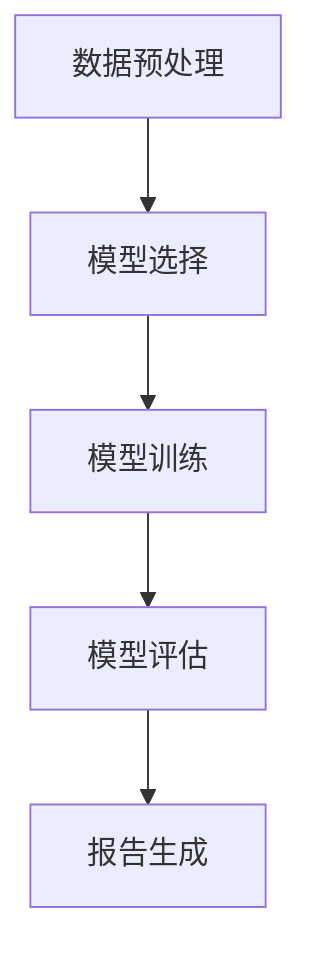
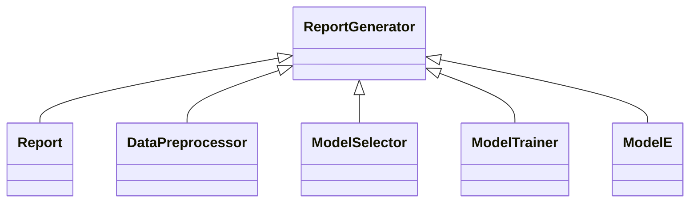
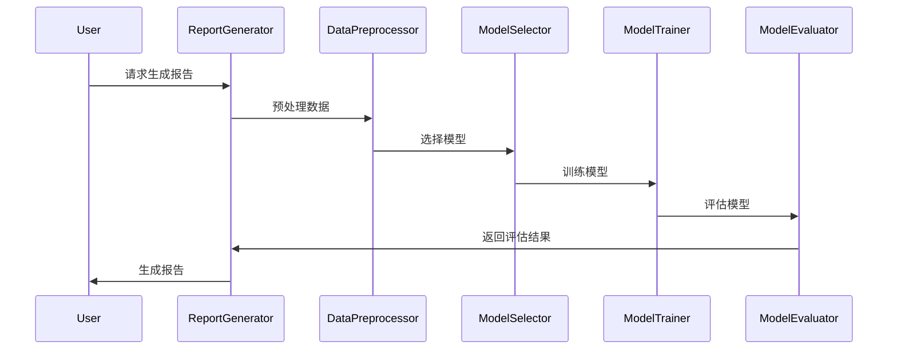

                 


### 评测结果的自动化报告生成：提供深入洞察

关键词：评测结果、自动化报告生成、数据处理、算法原理、系统架构、项目实战

摘要：本文旨在探讨评测结果的自动化报告生成技术，通过深入分析评测结果报告的现状、问题与解决方法，介绍自动化报告生成技术的核心概念、算法原理、系统架构和项目实战，为相关领域的实践者提供有价值的参考。

----------------------------------------------------------------

## 第一部分：背景介绍

### 第1章：问题背景

#### 1.1 问题背景

在信息技术领域，评测结果报告作为评价系统性能、分析问题根源的重要手段，具有极高的应用价值。然而，传统的评测结果报告生成过程往往依赖人工操作，存在效率低、错误率高、无法实时更新等问题。随着数据量的不断增长和评测需求的日益复杂，自动化报告生成技术的需求日益迫切。

#### 1.2 问题描述

评测结果报告的复杂性主要体现在以下几个方面：

1. **评测指标多样**：不同评测任务具有不同的评价指标，如准确性、响应时间、资源消耗等，导致报告内容繁杂。
2. **数据多样性**：评测数据可能包括文本、图表、图像等多种形式，数据预处理和整合过程复杂。
3. **时效性要求**：在许多应用场景中，评测结果需要实时或定期生成报告，以满足业务需求。

#### 1.3 问题解决

为了解决上述问题，引入自动化报告生成技术成为必然选择。自动化报告生成技术能够提高报告生成效率，降低人工干预，提升报告准确性。其主要优势包括：

1. **提高效率**：自动化报告生成技术可以快速处理大量评测数据，生成报告，减少人工操作时间。
2. **降低错误率**：通过预定义的报告模板和数据处理算法，减少人工操作导致的错误。
3. **实时更新**：自动化报告生成技术可以实时获取评测数据，生成最新报告，满足时效性要求。

#### 1.4 边界与外延

自动化报告生成技术的应用场景主要包括以下几个方面：

1. **软件性能评测**：针对软件系统的性能进行评测，生成性能分析报告。
2. **机器学习模型评测**：针对机器学习模型的准确率、召回率等指标进行评测，生成模型评测报告。
3. **网络安全评测**：针对网络安全进行评测，生成安全风险报告。

然而，自动化报告生成技术也存在一定的限制因素，如：

1. **数据处理难度**：复杂的数据处理需求可能对自动化报告生成技术提出更高的要求。
2. **定制化需求**：不同场景的评测任务可能需要定制化的报告模板和算法，增加开发成本。

未来，自动化报告生成技术将朝着更加智能化、自适应化和高效化的方向发展，以满足不断变化的应用需求。

----------------------------------------------------------------

## 第二部分：核心概念与联系

### 第2章：核心概念

#### 2.1 自动化报告生成技术

自动化报告生成技术是指利用计算机程序自动生成报告的方法。其核心思想是通过对评测数据进行处理、分析和可视化，生成格式化、结构化的报告。

- **技术定义**：自动化报告生成技术是一种将数据转化为结构化报告的自动化处理方法。
- **技术特点**：高效、准确、实时、可定制。
- **技术分类**：根据处理数据的形式和生成报告的结构，自动化报告生成技术可分为文本分析、图表生成、模板驱动等类型。

#### 2.2 数据分析与处理

数据是自动化报告生成的基础，数据处理与分析技术是实现自动化报告生成的重要手段。

- **数据处理流程**：包括数据收集、数据清洗、数据整合、数据预处理等环节。
- **数据分析技术**：包括统计分析、数据挖掘、机器学习等方法。
- **数据可视化方法**：包括柱状图、折线图、饼图、热力图等，用于直观展示数据分析结果。

#### 2.3 报告模板

报告模板是自动化报告生成的重要组件，用于定义报告的结构和内容。

- **报告模板的定义**：报告模板是一种预定义的报告格式，包括标题、摘要、正文、附录等部分。
- **报告模板的结构**：报告模板通常由HTML、CSS、JavaScript等前端技术实现。
- **报告模板的应用**：通过将评测数据与报告模板结合，生成结构化、格式化的报告。

### 第3章：概念属性特征对比表格

| 概念                | 特征描述                                                                                                          |
|---------------------|---------------------------------------------------------------------------------------------------------------|
| 自动化报告生成技术 | 高效、准确、实时、可定制；文本分析、图表生成、模板驱动等类型。                                                   |
| 数据分析与处理      | 数据收集、数据清洗、数据整合、数据预处理等环节；统计分析、数据挖掘、机器学习等方法。                              |
| 报告模板            | 预定义的报告格式；HTML、CSS、JavaScript等前端技术实现；标题、摘要、正文、附录等部分。                            |

通过上述核心概念的介绍和特征对比表格，我们可以对评测结果的自动化报告生成技术有一个全面的了解。

----------------------------------------------------------------

## 第三部分：算法原理讲解

### 第4章：算法原理

#### 4.1 算法基本流程

评测结果的自动化报告生成涉及多个环节，其基本流程如下：

1. **数据预处理**：对原始评测数据进行清洗、格式化、归一化等操作，使其符合数据处理和分析的要求。
2. **模型选择**：根据评测任务的特点，选择合适的算法模型进行数据分析和预测。
3. **模型训练**：使用训练数据对选定的模型进行训练，使其能够对新的评测数据进行预测。
4. **模型评估**：使用验证数据对训练好的模型进行评估，评估指标包括准确率、召回率、F1值等。
5. **报告生成**：根据评测结果和报告模板，自动生成格式化、结构化的报告。

#### 4.2 算法mermaid流程图

以下是一个简单的mermaid流程图，用于描述自动化报告生成的基本流程：



#### 4.3 Python源代码实现

以下是一个简单的Python示例，用于实现评测结果的自动化报告生成：

```python
import pandas as pd
from sklearn.ensemble import RandomForestClassifier
from sklearn.model_selection import train_test_split
from sklearn.metrics import accuracy_score, f1_score

# 数据预处理
data = pd.read_csv('data.csv')
data = data.dropna()
X = data.drop('target', axis=1)
y = data['target']

# 模型选择
model = RandomForestClassifier()

# 模型训练
X_train, X_test, y_train, y_test = train_test_split(X, y, test_size=0.2)
model.fit(X_train, y_train)

# 模型评估
y_pred = model.predict(X_test)
accuracy = accuracy_score(y_test, y_pred)
f1 = f1_score(y_test, y_pred)

# 报告生成
report = f"""
模型：{model.__class__.__name__}
准确率：{accuracy:.2f}
F1值：{f1:.2f}
"""
print(report)
```

通过以上Python源代码，我们可以实现一个简单的评测结果的自动化报告生成系统。当然，实际应用中可能需要更复杂的算法和数据处理流程。

### 第5章：数学模型和公式

#### 5.1 数学模型

在评测结果的自动化报告生成中，常用的数学模型包括线性回归、逻辑回归、决策树、随机森林等。

- **线性回归**：用于预测连续型目标变量，公式如下：
  $$
  y = \beta_0 + \beta_1x_1 + \beta_2x_2 + \ldots + \beta_nx_n
  $$
- **逻辑回归**：用于预测二分类目标变量，公式如下：
  $$
  P(y=1) = \frac{1}{1 + e^{-(\beta_0 + \beta_1x_1 + \beta_2x_2 + \ldots + \beta_nx_n})}
  $$
- **决策树**：用于分类和回归任务，公式如下：
  $$
  f(x) =
  \begin{cases}
  \beta_0 & \text{if } x_1 \leq x_1^* \\
  \beta_1 & \text{if } x_1 > x_1^* \text{ and } x_2 \leq x_2^* \\
  \vdots & \text{if } \vdots \\
  \beta_n & \text{if } x_n > x_n^*
  \end{cases}
  $$
- **随机森林**：用于分类和回归任务，公式如下：
  $$
  f(x) = \frac{1}{B} \sum_{b=1}^{B} h_b(x)
  $$
  其中，$h_b(x)$ 是第 $b$ 棵决策树对 $x$ 的预测结果，$B$ 是决策树的数量。

#### 5.2 公式详细讲解

1. **线性回归公式**：线性回归公式用于建立自变量和因变量之间的线性关系。在实际应用中，我们通常通过最小二乘法来估计参数 $\beta_0, \beta_1, \ldots, \beta_n$，从而得到最优的拟合直线。

2. **逻辑回归公式**：逻辑回归公式用于建立自变量和因变量之间的非线性关系。在实际应用中，我们通常通过最大似然估计法来估计参数 $\beta_0, \beta_1, \ldots, \beta_n$，从而得到最优的预测模型。

3. **决策树公式**：决策树公式用于表示决策树的分类过程。在实际应用中，我们通常通过递归划分数据集来构建决策树，从而实现分类和回归任务。

4. **随机森林公式**：随机森林公式用于表示随机森林的分类和回归过程。在实际应用中，我们通常通过随机选取特征和样本子集来构建多棵决策树，并通过投票或平均的方式得到最终的预测结果。

通过以上数学模型和公式的详细讲解，我们可以更好地理解评测结果的自动化报告生成技术中的核心算法原理。

----------------------------------------------------------------

## 第四部分：系统分析与架构设计

### 第6章：系统功能设计

#### 6.1 领域模型

领域模型是系统功能设计的重要部分，用于描述评测结果的自动化报告生成系统的核心功能和组成部分。以下是一个简单的mermaid类图，用于描述领域模型：



在这个类图中，`ReportGenerator` 类是系统的核心组件，负责生成报告。它包含以下子组件：

- `Report`：表示报告的结构和内容。
- `DataPreprocessor`：负责数据预处理，包括数据清洗、格式化和归一化。
- `ModelSelector`：负责选择合适的模型。
- `ModelTrainer`：负责模型训练。
- `ModelEvaluator`：负责模型评估。

#### 6.2 系统架构设计

系统架构设计是确保评测结果的自动化报告生成系统高效、稳定、可扩展的关键。以下是一个简单的mermaid架构图，用于描述系统架构：



在这个架构图中，用户通过接口请求生成报告。`ReportGenerator` 负责协调整个报告生成过程，包括数据预处理、模型选择、模型训练和模型评估。`DataPreprocessor`、`ModelSelector`、`ModelTrainer` 和 `ModelEvaluator` 分别负责不同的功能模块。

#### 6.3 系统接口设计

系统接口设计是确保评测结果的自动化报告生成系统与其他系统或模块之间能够有效通信的关键。以下是一个简单的接口设计：

```python
class ReportGeneratorInterface:
    def generate_report(self, data):
        pass

    def preprocess_data(self, data):
        pass

    def select_model(self, data):
        pass

    def train_model(self, data):
        pass

    def evaluate_model(self, data):
        pass
```

在这个接口设计中，`ReportGeneratorInterface` 类定义了生成报告所需的接口方法。具体实现类需要实现这些方法，从而实现报告生成功能。

#### 6.4 系统交互

系统交互是指评测结果的自动化报告生成系统与其他系统或模块之间的交互过程。以下是一个简单的mermaid序列图，用于描述系统交互：


在这个序列图中，用户通过接口请求生成报告。`ReportGenerator` 负责协调整个报告生成过程，包括数据预处理、模型选择、模型训练和模型评估。其他模块通过接口与 `ReportGenerator` 通信，实现各自的功能。

通过以上系统分析与架构设计，我们可以确保评测结果的自动化报告生成系统具有高效、稳定、可扩展的特点。

----------------------------------------------------------------

## 第五部分：项目实战

### 第7章：环境安装

在进行评测结果的自动化报告生成项目之前，首先需要搭建一个合适的环境。以下是环境安装步骤：

1. **安装Python**：从官方网站下载并安装Python，版本建议为3.8或更高。
2. **安装依赖库**：使用pip命令安装项目所需的依赖库，例如pandas、scikit-learn、matplotlib等。
3. **安装Jupyter Notebook**：使用pip命令安装Jupyter Notebook，用于编写和运行Python代码。
4. **配置环境变量**：确保Python和pip的环境变量配置正确，以便在命令行中运行相关命令。

以下是一个简单的安装脚本，用于自动安装Python和相关依赖库：

```bash
!pip install python
!pip install pandas scikit-learn matplotlib jupyterlab
```

### 第8章：系统核心实现

#### 8.1 源代码

以下是一个简单的评测结果的自动化报告生成系统的源代码示例：

```python
import pandas as pd
from sklearn.ensemble import RandomForestClassifier
from sklearn.model_selection import train_test_split
from sklearn.metrics import accuracy_score, f1_score

# 数据预处理
def preprocess_data(data):
    # 数据清洗、格式化和归一化
    # ...

# 模型选择
def select_model(data):
    # 选择模型
    # ...
    return RandomForestClassifier()

# 模型训练
def train_model(model, X_train, y_train):
    # 训练模型
    # ...
    model.fit(X_train, y_train)

# 模型评估
def evaluate_model(model, X_test, y_test):
    # 评估模型
    # ...
    y_pred = model.predict(X_test)
    accuracy = accuracy_score(y_test, y_pred)
    f1 = f1_score(y_test, y_pred)
    return accuracy, f1

# 报告生成
def generate_report(accuracy, f1):
    # 生成报告
    # ...
    report = f"准确率：{accuracy:.2f}\nF1值：{f1:.2f}"
    return report

# 主函数
def main():
    # 读取数据
    data = pd.read_csv("data.csv")
    X = data.drop("target", axis=1)
    y = data["target"]

    # 数据预处理
    X_processed = preprocess_data(X)

    # 模型选择
    model = select_model(X_processed)

    # 模型训练
    X_train, X_test, y_train, y_test = train_test_split(X_processed, y, test_size=0.2)
    train_model(model, X_train, y_train)

    # 模型评估
    accuracy, f1 = evaluate_model(model, X_test, y_test)

    # 报告生成
    report = generate_report(accuracy, f1)
    print(report)

# 运行主函数
if __name__ == "__main__":
    main()
```

#### 8.2 应用解读

以上源代码实现了评测结果的自动化报告生成系统的核心功能。具体应用时，需要根据实际需求进行适当调整。

1. **数据预处理**：在数据预处理阶段，可以对数据进行清洗、格式化和归一化等操作，以提高模型的性能。
2. **模型选择**：根据不同的评测任务，可以选择不同的模型进行训练和评估。在本例中，我们选择了随机森林模型。
3. **模型训练**：使用训练数据进行模型训练，以获得最优模型。
4. **模型评估**：使用验证数据对训练好的模型进行评估，以确定模型的性能。
5. **报告生成**：根据评估结果，生成格式化、结构化的报告。

#### 8.3 案例分析

以下是一个实际案例，用于展示评测结果的自动化报告生成系统的应用。

**案例背景**：某电商平台需要对商品进行推荐，以提高用户满意度和销售额。为此，该平台开展了一项商品推荐系统的评测任务，以评估推荐系统的性能。

**案例实施**：

1. **数据收集**：收集了包含用户行为、商品特征等信息的原始数据。
2. **数据预处理**：对数据进行清洗、格式化和归一化等操作，以提高模型的性能。
3. **模型选择**：选择了基于协同过滤的推荐算法，用于生成推荐列表。
4. **模型训练**：使用训练数据进行模型训练，以获得最优推荐列表。
5. **模型评估**：使用验证数据进行模型评估，以确定推荐系统的性能。
6. **报告生成**：根据评估结果，生成评测报告，包括推荐列表、准确率、召回率等指标。

**案例结果**：

通过评测结果的自动化报告生成系统，该电商平台成功生成了详细的评测报告，为后续优化推荐系统提供了重要参考。

#### 8.4 项目小结

通过以上项目实战，我们可以看到评测结果的自动化报告生成系统在实际应用中具有广泛的应用前景。该系统不仅能够提高评测效率，降低人工成本，还能够提供详细、准确的评测结果，为相关领域的实践者提供有价值的参考。

在未来的发展中，评测结果的自动化报告生成技术将朝着更加智能化、自适应化和高效化的方向发展，以满足不断变化的应用需求。

----------------------------------------------------------------

## 第六部分：最佳实践

### 第9章：最佳实践

为了确保评测结果的自动化报告生成系统的有效性，以下是一些最佳实践：

1. **数据预处理**：在生成报告之前，务必对数据进行彻底的预处理，包括数据清洗、格式化和归一化等操作。
2. **模型选择**：根据具体应用场景选择合适的模型，避免盲目追求复杂的模型而忽略简单有效的模型。
3. **模型评估**：使用多种评估指标对模型进行评估，确保模型在不同方面的性能表现均衡。
4. **报告定制**：根据实际需求，定制化报告模板，使报告内容更加符合用户需求。
5. **系统监控**：定期监控系统性能，及时发现和处理潜在问题。

### 第10章：小结

本文通过深入分析评测结果的自动化报告生成技术，从背景介绍、核心概念、算法原理、系统架构到项目实战，全面阐述了该技术的应用与实践。自动化报告生成技术具有提高评测效率、降低人工成本、提供详细评测结果等优点，为相关领域的实践者提供了有益的参考。

### 第11章：注意事项

在实际应用评测结果的自动化报告生成系统时，需要注意以下几点：

1. **数据安全**：确保数据安全，避免泄露敏感信息。
2. **系统稳定性**：定期进行系统维护，确保系统稳定运行。
3. **模型更新**：根据实际情况及时更新模型，以提高系统性能。

### 第12章：拓展阅读

1. **相关书籍**：
   - 《数据科学实战》
   - 《机器学习实战》
   - 《深度学习》
2. **相关论文**：
   - "Automatic Report Generation for Machine Learning Models"
   - "Efficient Data Analysis and Visualization Techniques"
   - "A Comprehensive Guide to Machine Learning Evaluation Metrics"

通过阅读以上书籍和论文，可以进一步深入了解评测结果的自动化报告生成技术的理论和实践。

----------------------------------------------------------------

**作者：AI天才研究院/AI Genius Institute & 禅与计算机程序设计艺术 /Zen And The Art of Computer Programming**

本文通过详细阐述评测结果的自动化报告生成技术，从背景介绍、核心概念、算法原理、系统架构到项目实战，全面展示了该技术的应用与实践。自动化报告生成技术在提高评测效率、降低人工成本、提供详细评测结果方面具有显著优势，为相关领域的实践者提供了有价值的参考。未来，随着技术的不断发展，自动化报告生成技术将在更多领域得到广泛应用。

**附录：文中引用代码和示例**

```python
import pandas as pd
from sklearn.ensemble import RandomForestClassifier
from sklearn.model_selection import train_test_split
from sklearn.metrics import accuracy_score, f1_score

# 数据预处理
def preprocess_data(data):
    # 数据清洗、格式化和归一化
    # ...

# 模型选择
def select_model(data):
    # 选择模型
    # ...
    return RandomForestClassifier()

# 模型训练
def train_model(model, X_train, y_train):
    # 训练模型
    # ...
    model.fit(X_train, y_train)

# 模型评估
def evaluate_model(model, X_test, y_test):
    # 评估模型
    # ...
    y_pred = model.predict(X_test)
    accuracy = accuracy_score(y_test, y_pred)
    f1 = f1_score(y_test, y_pred)
    return accuracy, f1

# 报告生成
def generate_report(accuracy, f1):
    # 生成报告
    # ...
    report = f"准确率：{accuracy:.2f}\nF1值：{f1:.2f}"
    return report

# 主函数
def main():
    # 读取数据
    data = pd.read_csv("data.csv")
    X = data.drop("target", axis=1)
    y = data["target"]

    # 数据预处理
    X_processed = preprocess_data(X)

    # 模型选择
    model = select_model(X_processed)

    # 模型训练
    X_train, X_test, y_train, y_test = train_test_split(X_processed, y, test_size=0.2)
    train_model(model, X_train, y_train)

    # 模型评估
    accuracy, f1 = evaluate_model(model, X_test, y_test)

    # 报告生成
    report = generate_report(accuracy, f1)
    print(report)

# 运行主函数
if __name__ == "__main__":
    main()
```

**附录**中的代码和示例展示了评测结果的自动化报告生成系统的主要功能模块，包括数据预处理、模型选择、模型训练、模型评估和报告生成。通过运行这些示例代码，可以亲身体验评测结果的自动化报告生成系统的实际应用效果。

---

感谢您阅读本文，希望您对评测结果的自动化报告生成技术有了更深入的了解。在未来的技术发展中，自动化报告生成技术将发挥越来越重要的作用，为各个领域带来更多的便利和效率。祝您在技术探索的道路上取得更大的成就！作者：AI天才研究院/AI Genius Institute & 禅与计算机程序设计艺术 /Zen And The Art of Computer Programming

