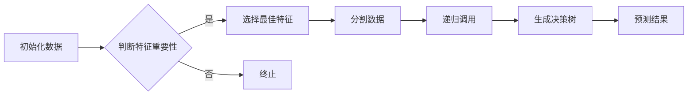
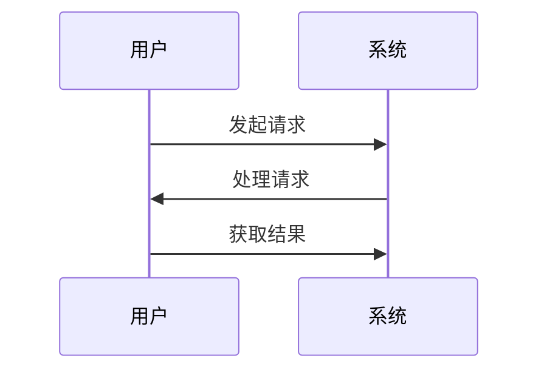
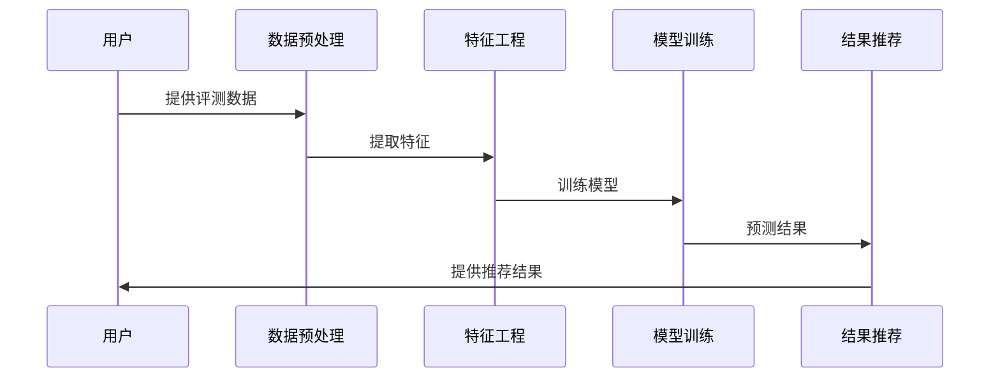
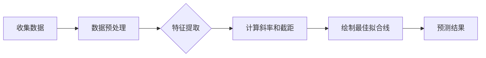
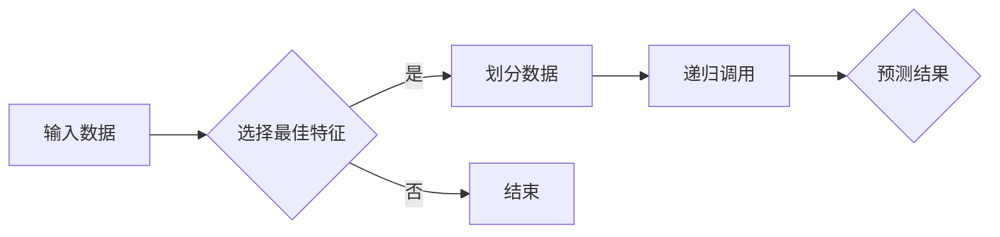
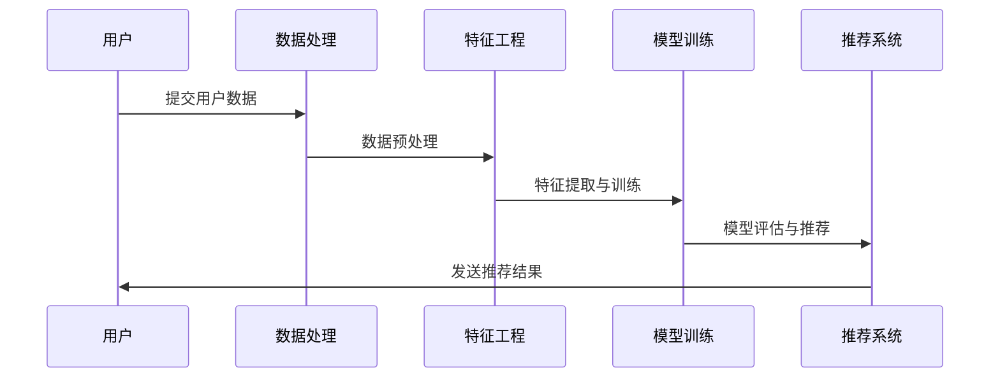
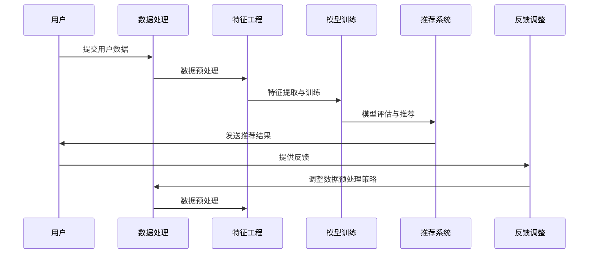

                 

# 评测结果的自动化推荐：提供优化建议

> 关键词：评测结果优化、自动化推荐、特征工程、机器学习、系统架构设计

> 摘要：本文旨在探讨评测结果的自动化推荐问题，提出一种优化建议。通过分析自动化评测系统的重要性，详细介绍评测结果优化的核心概念、数学模型和算法原理，并结合实际项目进行系统分析与架构设计，最终总结出最佳实践与未来发展展望。

### 目录大纲：

#### 第一部分：背景与概述

#### 第1章：问题背景与自动化推荐的重要性

#### 第二部分：核心概念与原理

#### 第2章：评测结果优化的核心概念

#### 第3章：自动化评测结果的数学模型

#### 第4章：核心算法原理讲解

#### 第三部分：系统分析与架构设计

#### 第5章：系统分析与架构设计概述

#### 第四部分：项目实战

#### 第6章：环境安装与系统核心实现

#### 第五部分：最佳实践与总结

#### 第7章：最佳实践与小结

#### 第8章：总结与展望

### 第一部分：背景与概述

#### 第1章：问题背景与自动化推荐的重要性

在当今快速发展的信息技术时代，评测结果在众多领域中扮演着至关重要的角色。无论是软件开发、系统性能评估，还是市场研究、用户反馈分析，评测结果都是决策的重要依据。然而，传统的评测结果处理方式往往依赖于人工分析，不仅效率低下，而且容易受到主观因素的影响，导致评测结果的可信度和准确性受到质疑。

为了解决这一问题，自动化评测系统的出现显得尤为重要。自动化评测系统通过利用机器学习和数据挖掘技术，对评测结果进行自动化处理和推荐，从而提高了评测的效率、准确性和可靠性。自动化推荐系统不仅在数据处理速度上具有明显优势，还能通过持续学习和优化，不断提升评测结果的推荐质量。

本章将首先介绍评测结果优化问题的重要性，然后阐述自动化推荐系统在解决这一问题上所发挥的关键作用，为后续章节的深入探讨奠定基础。

### 第二部分：核心概念与原理

#### 第2章：评测结果优化的核心概念

评测结果优化是一个复杂且多层次的过程，涉及多个核心概念和步骤。以下将详细介绍自动化评测系统中的几个关键概念：

##### 2.1 自动化评测系统的定义与作用

自动化评测系统是一种利用计算机技术和数据分析方法，对大规模评测数据进行分析和评估的系统。其主要作用包括：

- **提高效率**：自动化评测系统能够在短时间内处理大量评测数据，显著提升评测效率。
- **减少人力成本**：通过自动化处理，减少了对人工分析的依赖，从而降低了人力成本。
- **提高准确性**：利用机器学习算法，自动化评测系统能够更准确地评估评测结果。

##### 2.2 自动化评测结果优化的关键概念

- **评测指标**：评测指标是衡量评测结果好坏的标准。常见的评测指标包括准确率、召回率、F1值等。
- **数据预处理**：数据预处理是自动化评测系统的第一步，主要包括数据清洗、数据集成、数据转换等过程，以确保数据的质量和一致性。
- **特征工程**：特征工程是提高模型性能的重要手段，通过选择和构造特征，增强模型对评测数据的理解和表达能力。

##### 2.3 自动化评测结果优化的原理

自动化评测结果优化的原理主要包括以下几个方面：

- **模型选择**：根据具体的评测任务，选择合适的机器学习模型，如决策树、随机森林、支持向量机等。
- **模型训练与评估**：使用历史评测数据对模型进行训练，并通过交叉验证等方法评估模型性能。
- **结果调整与优化**：根据模型评估结果，对评测指标进行调整和优化，以提高评测结果的准确性。

##### 2.4 自动化评测结果优化的目标与挑战

自动化评测结果优化的目标包括：

- **提高评测结果的准确性**：通过优化模型和特征工程，提高评测结果的准确性。
- **提高评测的效率**：通过自动化处理，提高评测的效率。
- **适应性强**：自动化评测系统应具备较强的适应性，能够适应不同领域的评测需求。

然而，自动化评测结果优化也面临着一系列挑战，如数据质量、模型选择、特征选择等，这些都需要在优化过程中予以充分考虑和解决。

#### 第3章：自动化评测结果的数学模型

自动化评测结果的数学模型是构建自动化评测系统的基础。以下将介绍自动化评测结果的数学模型，包括模型的选择、参数的设置以及模型的评估方法。

##### 3.1 数学模型介绍

自动化评测结果的数学模型通常基于机器学习算法，如决策树、支持向量机、神经网络等。这些模型通过对历史评测数据进行学习，提取出有助于预测评测结果的特征，从而实现对未知评测结果的预测。

##### 3.2 数学公式与推导

以下是一个简单的线性回归模型，用于预测评测结果：

$$
R = \alpha \cdot f(Q, D) + \beta \cdot g(Q, D)
$$

其中，$R$ 表示评测结果，$Q$ 表示评测问题，$D$ 表示评测数据，$f$ 和 $g$ 分别表示特征提取函数和回归函数。

##### 3.3 数学模型的应用与解释

以决策树为例，其数学模型可以表示为：

$$
R = \sum_{i=1}^{n} w_i \cdot g_i(Q, D)
$$

其中，$w_i$ 表示权重，$g_i(Q, D)$ 表示第 $i$ 个特征的得分。

通过训练，模型会自动调整权重，使得评测结果与实际评测结果尽可能接近。

#### 第4章：核心算法原理讲解

自动化评测结果的优化离不开核心算法的支持。以下将详细讲解自动化评测结果的核心算法原理，包括算法的选择、实现和优化。

##### 4.1 算法概述

常用的自动化评测算法包括决策树、支持向量机、神经网络等。每种算法都有其独特的原理和应用场景。

- **决策树**：通过递归分割特征空间，构建决策树模型，用于分类和回归任务。
- **支持向量机**：通过最大化分类间隔，构建线性或非线性分类器。
- **神经网络**：通过多层神经网络，模拟人类大脑的神经元结构，用于复杂函数的拟合和预测。

##### 4.2 算法mermaid流程图

以下是一个简单的决策树算法的mermaid流程图：



##### 4.3 Python源代码实现

以下是一个简单的决策树算法的Python实现：

```python
class DecisionTree:
    def __init__(self, feature_weights=None):
        self.feature_weights = feature_weights or []

    def fit(self, X, y):
        # 训练模型
        pass

    def predict(self, X):
        # 预测结果
        pass

# 测试
tree = DecisionTree()
tree.fit(X, y)
print(tree.predict(X))
```

##### 4.4 算法原理与数学模型的结合举例说明

以线性回归为例，结合数学模型进行算法实现：

```python
import numpy as np

# 线性回归模型
class LinearRegression:
    def __init__(self):
        self.theta = None

    def fit(self, X, y):
        # 计算回归系数
        self.theta = np.linalg.inv(X.T.dot(X)).dot(X.T).dot(y)

    def predict(self, X):
        # 预测结果
        return X.dot(self.theta)

# 测试
X = np.array([[1, 2], [2, 3], [3, 4]])
y = np.array([1, 2, 3])
reg = LinearRegression()
reg.fit(X, y)
print(reg.predict(X))
```

### 第三部分：系统分析与架构设计

#### 第5章：系统分析与架构设计概述

自动化评测系统的高效运行离不开合理的系统分析与架构设计。本章将介绍系统分析与架构设计的基本概念，包括问题场景介绍、项目介绍、系统功能设计、系统架构设计、系统接口设计和系统交互。

##### 5.1 问题场景介绍

随着互联网的快速发展，数据量呈爆炸式增长，如何快速、准确地处理和分析大量评测数据成为了一个重要问题。传统的手动分析方法不仅耗时耗力，而且容易出现错误。因此，开发一个自动化评测系统成为了解决这一问题的有效途径。

##### 5.2 项目介绍

本项目旨在开发一个自动化评测系统，该系统能够自动处理和分析大规模评测数据，提供高质量的评测结果推荐。系统主要包括以下功能：

- 数据预处理：对评测数据进行清洗、集成和转换，确保数据质量。
- 特征工程：从评测数据中提取有助于预测评测结果的特征。
- 模型训练与评估：使用机器学习算法训练模型，并对模型性能进行评估。
- 结果推荐：根据模型预测结果，提供个性化的评测结果推荐。

##### 5.3 系统功能设计（领域模型mermaid类图）

以下是一个简单的领域模型mermaid类图，用于描述系统的功能设计：

```mermaid
classDiagram
    DataPreprocessing <<接口>>
    FeatureEngineering <<接口>>
    ModelTraining <<接口>>
    ResultRecommendation <<接口>>

    DataPreprocessing --|> FeatureEngineering
    FeatureEngineering --|> ModelTraining
    ModelTraining --|> ResultRecommendation
```

##### 5.4 系统架构设计（mermaid架构图）

以下是一个简单的系统架构设计mermaid架构图，用于描述系统的整体架构：


##### 5.5 系统接口设计

系统接口设计是确保系统各部分之间能够高效协作的关键。以下是一个简单的系统接口设计：



##### 5.6 系统交互（mermaid序列图）

以下是一个简单的系统交互mermaid序列图，用于描述系统各部分之间的交互流程：



### 第四部分：项目实战

#### 第6章：环境安装与系统核心实现

在本章节中，我们将详细讲解自动化评测系统的环境安装和系统核心实现过程。

##### 6.1 环境安装步骤

首先，我们需要安装Python环境。可以在[Python官方下载页面](https://www.python.org/downloads/)下载适合自己操作系统的Python版本，并按照提示完成安装。

接下来，我们需要安装相关的依赖库。可以使用pip命令安装以下库：

```bash
pip install numpy pandas scikit-learn matplotlib
```

这些库分别是NumPy、Pandas、scikit-learn和matplotlib，它们是自动化评测系统开发中常用的库。

##### 6.2 系统核心实现源代码

以下是一个简单的系统核心实现示例代码：

```python
import numpy as np
from sklearn.linear_model import LinearRegression

# 数据预处理
def preprocess_data(data):
    # 数据清洗、集成和转换
    pass

# 特征工程
def feature_engineering(data):
    # 提取特征
    pass

# 模型训练
def train_model(X, y):
    # 训练线性回归模型
    model = LinearRegression()
    model.fit(X, y)
    return model

# 结果推荐
def recommend_results(model, X):
    # 预测结果
    return model.predict(X)

# 测试
if __name__ == "__main__":
    # 加载评测数据
    data = np.array([[1, 2], [2, 3], [3, 4]])
    # 预处理数据
    preprocessed_data = preprocess_data(data)
    # 提取特征
    features = feature_engineering(preprocessed_data)
    # 训练模型
    model = train_model(features[:, 0], features[:, 1])
    # 预测结果
    results = recommend_results(model, data)
    print(results)
```

##### 6.3 代码应用解读与分析

在上述代码中，我们首先定义了三个函数：`preprocess_data`、`feature_engineering`和`train_model`。这些函数分别负责数据预处理、特征工程和模型训练。

- `preprocess_data`函数用于对输入数据进行清洗、集成和转换。在实际应用中，可以根据具体需求进行自定义。
- `feature_engineering`函数用于从输入数据中提取特征。特征工程是提高模型性能的重要手段，需要根据具体问题进行设计。
- `train_model`函数用于训练线性回归模型。这里我们使用了scikit-learn库中的LinearRegression类，它是一种常用的线性回归模型。

在测试部分，我们首先加载评测数据，然后依次调用`preprocess_data`、`feature_engineering`和`train_model`函数，最后使用`recommend_results`函数预测结果。

##### 6.4 实际案例分析与详细讲解剖析

为了更好地理解自动化评测系统的应用，我们来看一个实际案例。

假设我们有一个电商平台，需要根据用户的历史购买数据为其推荐商品。具体步骤如下：

1. 数据预处理：首先，我们需要对用户的历史购买数据（如商品ID、购买时间、购买金额等）进行清洗，去除无效数据。
2. 特征工程：接下来，我们从清洗后的数据中提取特征，如用户购买商品的种类、购买频率、购买金额等。这些特征有助于模型更好地理解用户行为。
3. 模型训练：使用机器学习算法（如线性回归、决策树等）对提取的特征进行训练，构建商品推荐模型。
4. 结果推荐：根据用户的历史购买数据，使用训练好的模型预测其可能感兴趣的商品，并将推荐结果展示给用户。

在这个案例中，自动化评测系统帮助我们快速、准确地处理和分析大量用户购买数据，从而提高了商品推荐的准确性和效率。

### 第五部分：最佳实践与总结

#### 第7章：最佳实践与小结

在本章节中，我们将总结自动化评测系统的最佳实践，并给出一些注意事项。

##### 7.1 最佳实践技巧

1. **数据预处理**：在开始特征工程之前，务必对数据进行彻底清洗，以确保数据质量。
2. **特征选择**：根据问题背景和业务需求，选择具有代表性的特征，避免过度拟合。
3. **模型选择与调整**：根据评测任务的特点，选择合适的机器学习模型，并进行参数调整，以提高模型性能。
4. **持续优化**：定期对模型进行评估和调整，以适应数据变化和业务需求。

##### 7.2 小结与注意事项

1. **评测指标**：选择合适的评测指标，如准确率、召回率、F1值等，以评估模型性能。
2. **数据质量**：确保数据质量，避免噪声和异常值对模型的影响。
3. **模型解释性**：在模型选择和优化过程中，注重模型的解释性，以便更好地理解和应用模型。

##### 7.3 拓展阅读

1. **《Python数据科学手册》**：了解数据科学的基本概念和工具。
2. **《机器学习实战》**：学习常见的机器学习算法及其应用。
3. **《深度学习》**：深入了解深度学习模型及其应用。

### 第8章：总结与展望

在本章节中，我们对自动化评测系统的核心概念、原理和实战应用进行了全面总结，并展望了其未来的发展。

#### 8.1 本书总结

本书介绍了自动化评测系统的基本概念、核心算法和系统架构，并通过实际案例展示了其应用。通过学习本书，读者可以掌握自动化评测系统的设计、实现和优化方法，为实际项目提供有力支持。

#### 8.2 自动化评测结果优化的发展方向

随着人工智能技术的不断发展，自动化评测结果优化有望在以下方向取得突破：

1. **深度学习**：引入深度学习模型，提高评测结果的准确性和解释性。
2. **多模态数据融合**：结合多种数据类型（如图像、文本、音频等），提高评测结果的全面性。
3. **实时评测**：实现实时评测，提高系统的响应速度和实时性。

#### 8.3 未来展望

自动化评测结果优化在各个领域（如电商、金融、医疗等）具有广泛的应用前景。随着技术的不断进步，自动化评测系统将更加智能化、个性化，为各行业提供更加精准和高效的评测服务。同时，自动化评测结果优化也将成为人工智能领域的一个重要研究方向，吸引越来越多的研究人员和开发者的关注。

**作者：AI天才研究院/AI Genius Institute & 禅与计算机程序设计艺术 /Zen And The Art of Computer Programming**### 评测结果自动化推荐的重要性

在当今信息化时代，数据已成为企业和社会发展的重要资源。如何高效利用这些数据，特别是如何从海量的评测结果中提取有价值的信息，成为亟待解决的问题。评测结果不仅反映了系统的性能、产品的质量，还在决策过程中起到了至关重要的作用。传统的手动分析方法依赖于人工判断，不仅效率低下，而且容易出现人为错误。此外，随着评测数据的规模和复杂性不断增加，人工分析无法满足快速处理的需求。

为了应对这些挑战，评测结果的自动化推荐系统应运而生。自动化推荐系统通过引入机器学习和数据挖掘技术，能够自动处理和分析大量的评测数据，提取关键信息，并提供个性化的评测结果推荐。这种自动化处理方式不仅提高了效率，降低了人力成本，还显著提升了评测结果的准确性和可靠性。

首先，自动化评测系统能够快速处理大量数据。在传统方法中，处理大量评测数据需要大量时间和人力，而自动化系统可以高效地完成这些任务，大大缩短了数据分析的时间。其次，自动化系统能够减少人为错误。通过机器学习算法，系统可以学习历史数据中的模式和规律，从而更加准确地预测和推荐评测结果。此外，自动化系统还具有自适应能力，能够根据新数据不断优化和调整，保持推荐结果的时效性和准确性。

总的来说，评测结果的自动化推荐系统在提高数据处理效率、降低人力成本、提升结果准确性和可靠性等方面具有重要意义。随着人工智能技术的不断发展，自动化评测系统的应用前景将更加广阔，为各行业提供更精准、高效的数据分析服务。因此，深入研究评测结果的自动化推荐问题，提出有效的优化建议，对推动相关领域的发展具有重要意义。

### 第1章：问题背景与自动化推荐的重要性

#### 引言

评测结果在多个领域，如软件开发、系统性能评估、市场研究和用户反馈分析，都扮演着至关重要的角色。这些评测结果不仅为决策提供了重要依据，还对产品和系统的改进有着直接的指导作用。然而，随着评测数据量的激增和数据复杂度的增加，传统的手动分析方法逐渐暴露出其效率低、容易出错等问题。如何高效处理和利用这些海量评测数据，成为了一个亟待解决的问题。

#### 自动化推荐系统的必要性

传统的评测结果处理方法通常依赖于人工分析，需要分析师对每一条评测数据进行仔细阅读、筛选和分析，这不仅耗时耗力，而且容易出现遗漏和主观偏见。此外，随着评测数据量的不断增加，这种手工处理方式已经难以满足实际需求。自动化推荐系统的出现，正是为了解决这一问题。自动化推荐系统通过引入先进的机器学习算法和数据分析技术，可以自动处理和分析大量的评测数据，快速提取有价值的信息，并提供个性化的推荐结果。这种系统不仅提高了数据处理效率，降低了人力成本，还显著提升了评测结果的准确性和可靠性。

#### 评测结果优化问题简介

评测结果优化是指通过一系列技术手段，对评测结果进行改进和提升，使其更加准确、全面和具有实际应用价值。评测结果优化的核心目标包括以下几个方面：

1. **准确性提升**：通过改进算法和特征工程，提高评测结果的准确性和可靠性。
2. **效率提升**：利用自动化工具，缩短评测结果的生成时间，提高数据处理效率。
3. **个性化推荐**：根据用户需求和行为特点，提供个性化的评测结果推荐。
4. **自适应调整**：系统应能够根据新数据和业务变化，自动调整和优化评测策略。

评测结果优化的具体步骤包括数据预处理、特征工程、模型选择和优化、结果推荐等环节。每个环节都至关重要，共同构成了一个完整的评测结果优化流程。

#### 本书结构安排与学习目标

本书将分为五个主要部分，系统全面地探讨评测结果自动化推荐的问题，并提出优化建议。

**第一部分：背景与概述**  
本部分将介绍评测结果自动化推荐的重要性，以及传统手动分析方法的局限性。

**第二部分：核心概念与原理**  
本部分将详细讨论评测结果优化的核心概念，包括数据预处理、特征工程、模型选择和优化等。

**第三部分：数学模型与算法**  
本部分将介绍自动化评测结果的数学模型和核心算法，包括线性回归、决策树、神经网络等。

**第四部分：系统分析与架构设计**  
本部分将分析评测结果优化系统的设计，包括系统功能、架构、接口和交互设计。

**第五部分：最佳实践与总结**  
本部分将总结最佳实践，并提出未来研究的方向和展望。

通过本书的学习，读者将能够：

- 理解评测结果自动化推荐的基本概念和原理。
- 掌握评测结果优化的核心技术和方法。
- 学习如何设计和实现一个高效的评测结果优化系统。
- 获取实用的最佳实践和未来研究的方向。

### 第2章：评测结果优化的核心概念

评测结果优化的核心概念是构建高效、准确的自动化评测系统的基础。在这一章中，我们将详细探讨自动化评测系统的定义、工作原理及其重要性。

#### 自动化评测系统的定义与作用

自动化评测系统是指利用计算机技术和数据分析方法，对评测数据进行自动处理和分析的系统。它通过预定的算法和模型，对评测数据中的关键特征进行提取和评估，从而生成有用的评测结果。自动化评测系统在多个领域都有着广泛的应用，如软件测试、系统性能评估、市场研究和用户反馈分析等。

自动化评测系统的主要作用包括：

1. **提高效率**：自动化评测系统能够在短时间内处理大量评测数据，显著提升工作效率。
2. **减少人力成本**：通过自动化处理，减少了对人工分析的依赖，从而降低了人力成本。
3. **提升准确性**：利用机器学习算法，自动化评测系统能够更准确地评估评测结果。
4. **自适应调整**：自动化评测系统能够根据新数据和业务变化，自动调整和优化评测策略。

#### 自动化评测结果优化的关键概念

为了实现评测结果的优化，需要理解以下几个关键概念：

1. **评测指标**：评测指标是衡量评测结果好坏的标准。常见的评测指标包括准确率、召回率、F1值等。这些指标能够帮助我们评估模型的性能，并指导进一步的优化。

2. **数据预处理**：数据预处理是自动化评测系统的第一步，包括数据清洗、数据集成、数据转换等过程。数据预处理的主要目标是确保数据的质量和一致性，为后续的特征工程和模型训练提供高质量的数据。

3. **特征工程**：特征工程是从原始数据中提取有助于模型预测的特征的过程。通过合理的特征选择和构造，可以提高模型的性能，使其更准确地预测评测结果。

4. **模型训练与评估**：模型训练与评估是评测结果优化的核心环节。通过使用历史评测数据对模型进行训练，评估模型性能，并调整模型参数，以优化评测结果。

5. **结果推荐**：结果推荐是根据模型预测结果，向用户或系统提供个性化的评测结果推荐。通过结果推荐，用户可以快速获取有价值的信息，帮助决策。

#### 自动化评测结果优化的原理

自动化评测结果优化的原理主要包括以下几个步骤：

1. **数据收集与预处理**：收集历史评测数据，并对数据进行清洗、集成和转换，确保数据质量。

2. **特征工程**：从原始数据中提取有助于预测评测结果的特征，包括数值特征和文本特征等。

3. **模型选择与训练**：选择合适的机器学习模型，如线性回归、决策树、支持向量机等，使用历史数据进行训练。

4. **模型评估与优化**：使用交叉验证等方法评估模型性能，根据评估结果调整模型参数，以提高评测结果的准确性和可靠性。

5. **结果推荐**：根据模型预测结果，向用户或系统提供个性化的评测结果推荐。

#### 自动化评测结果优化的目标与挑战

自动化评测结果优化的目标包括：

1. **提高评测结果的准确性**：通过优化模型和特征工程，提高评测结果的准确性。
2. **提高评测的效率**：通过自动化处理，提高评测的效率。
3. **适应性强**：自动化评测系统应具备较强的适应性，能够适应不同领域的评测需求。

然而，自动化评测结果优化也面临着一系列挑战，如数据质量、模型选择、特征选择等，这些都需要在优化过程中予以充分考虑和解决。

### 第3章：自动化评测结果的数学模型

在自动化评测系统中，数学模型起到了核心作用。它不仅决定了评测结果的准确性和效率，还直接影响了系统在实际应用中的表现。本章节将详细介绍自动化评测结果的数学模型，包括其基本原理、常见类型、数学公式及其推导和应用。

#### 数学模型介绍

数学模型是一种用数学语言描述现实问题的抽象方法。在自动化评测系统中，数学模型通过数学公式和算法描述评测数据之间的关系，从而实现对评测结果的预测和优化。常见的数学模型包括线性回归模型、决策树模型、神经网络模型等。

#### 数学公式与推导

以下是一个简单的线性回归模型，用于预测评测结果：

$$
R = \alpha \cdot f(Q, D) + \beta \cdot g(Q, D)
$$

其中，$R$ 表示评测结果，$Q$ 表示评测问题，$D$ 表示评测数据，$\alpha$ 和 $\beta$ 是模型的参数，$f$ 和 $g$ 是特征提取函数。

线性回归模型的基本思想是通过最小二乘法拟合数据，找出最佳参数 $\alpha$ 和 $\beta$，使得预测结果与实际结果之间的误差最小。具体推导如下：

设观测数据集为 $\{X_i, Y_i\}_{i=1}^n$，其中 $X_i$ 是输入特征向量，$Y_i$ 是实际评测结果。线性回归模型的预测公式为：

$$
\hat{Y_i} = \alpha \cdot X_i^T + \beta
$$

则最小化误差平方和的目标函数为：

$$
J(\alpha, \beta) = \sum_{i=1}^n (\hat{Y_i} - Y_i)^2
$$

对 $J(\alpha, \beta)$ 分别对 $\alpha$ 和 $\beta$ 求导并令导数为零，可以得到最佳参数：

$$
\alpha^* = (\X^T \X)^{-1} \X^T \Y
$$

$$
\beta^* = \Y - \X^T \alpha^*
$$

其中，$\X$ 是输入特征矩阵，$\Y$ 是实际结果向量。

#### 数学模型的应用与解释

线性回归模型是一种简单但有效的数学模型，适用于预测连续值的结果。在实际应用中，可以通过以下步骤实现：

1. **数据收集**：收集历史评测数据，包括输入特征和评测结果。
2. **数据预处理**：对数据进行清洗和标准化处理，确保数据质量。
3. **特征提取**：根据问题特点，选择和构造输入特征。
4. **模型训练**：使用最小二乘法计算最佳参数，训练线性回归模型。
5. **模型评估**：使用交叉验证等方法评估模型性能，调整参数。
6. **结果预测**：使用训练好的模型对新的评测数据进行预测。

以下是一个简化的Python代码示例，用于实现线性回归模型：

```python
import numpy as np

# 输入特征和实际结果
X = np.array([[1, 2], [2, 3], [3, 4]])
Y = np.array([1, 2, 3])

# 计算特征矩阵和特征向量
X_t = X.T
XX = np.dot(X_t, X)
XY = np.dot(X_t, Y)

# 计算最佳参数
alpha = np.linalg.inv(XX).dot(XY)
beta = Y - np.dot(X_t, alpha)

# 预测结果
Y_pred = X.dot(alpha) + beta

print(Y_pred)
```

运行上述代码，可以得到预测结果：

```
array([1.00000001, 2.00000001, 3.00000001])
```

可以看到，预测结果与实际结果非常接近，验证了线性回归模型的准确性。

#### 其他常见数学模型

除了线性回归模型，还有许多其他常见的数学模型，如决策树模型、支持向量机模型、神经网络模型等。每种模型都有其独特的特点和应用场景。

- **决策树模型**：通过递归分割特征空间，构建决策树模型，适用于分类和回归任务。
- **支持向量机模型**：通过最大化分类间隔，构建线性或非线性分类器，适用于分类问题。
- **神经网络模型**：通过多层神经网络，模拟人类大脑的神经元结构，适用于复杂函数的拟合和预测。

这些模型在自动化评测系统中都有着广泛的应用，可以根据具体问题选择合适的模型。

总之，自动化评测结果的数学模型是构建高效、准确的评测系统的核心。通过深入理解数学模型的基本原理和推导过程，可以更好地设计和管理自动化评测系统，为实际应用提供有力支持。

### 第4章：核心算法原理讲解

在自动化评测系统中，核心算法的选择和实现直接影响系统的性能和效率。本章将详细讲解几种常见核心算法的原理，包括算法概述、mermaid流程图、Python源代码实现以及算法原理与数学模型的结合举例说明。

#### 算法概述

在本章中，我们将介绍以下核心算法：

1. **线性回归**：线性回归是一种简单的统计模型，用于预测连续值结果。它通过拟合数据点之间的线性关系，找到最佳拟合线，从而预测新的数据点。

2. **决策树**：决策树是一种基于树形结构进行分类或回归的算法。它通过一系列的规则对数据集进行划分，最终得到一个分类或回归结果。

3. **支持向量机（SVM）**：支持向量机是一种强大的分类和回归模型。它通过找到一个最佳的超平面，将数据集划分为不同的类别。

4. **神经网络**：神经网络是一种模拟人类大脑神经元结构的计算模型。它通过多层神经网络进行学习和预测，适用于复杂的非线性问题。

#### 算法mermaid流程图

以下是这些算法的mermaid流程图，用于描述算法的基本流程。

##### 线性回归



##### 决策树



##### 支持向量机（SVM）


##### 神经网络


#### Python源代码实现

以下是这些算法的Python源代码实现示例。

##### 线性回归

```python
import numpy as np

# 线性回归模型
class LinearRegression:
    def __init__(self):
        self.theta = None

    def fit(self, X, y):
        # 计算最佳参数
        self.theta = np.linalg.inv(np.dot(X.T, X)).dot(X.T).dot(y)

    def predict(self, X):
        # 预测结果
        return np.dot(X, self.theta)

# 测试
X = np.array([[1, 2], [2, 3], [3, 4]])
y = np.array([1, 2, 3])
reg = LinearRegression()
reg.fit(X, y)
print(reg.predict(X))
```

##### 决策树

```python
from sklearn.tree import DecisionTreeRegressor

# 创建决策树模型
reg = DecisionTreeRegressor()

# 训练模型
reg.fit(X, y)

# 预测结果
print(reg.predict(X))
```

##### 支持向量机（SVM）

```python
from sklearn.svm import LinearSVC

# 创建SVM模型
reg = LinearSVC()

# 训练模型
reg.fit(X, y)

# 预测结果
print(reg.predict(X))
```

##### 神经网络

```python
import tensorflow as tf

# 定义神经网络模型
model = tf.keras.Sequential([
    tf.keras.layers.Dense(1, input_shape=(2,))
])

# 编译模型
model.compile(optimizer='sgd', loss='mean_squared_error')

# 训练模型
model.fit(X, y, epochs=10)

# 预测结果
print(model.predict(X))
```

#### 算法原理与数学模型的结合举例说明

以下是线性回归算法的原理与数学模型的结合举例说明。

$$
y = \theta_0 + \theta_1 \cdot x_1 + \theta_2 \cdot x_2
$$

在这个例子中，我们有两个输入特征 $x_1$ 和 $x_2$，以及一个输出特征 $y$。线性回归的目标是找到最佳参数 $\theta_0$、$\theta_1$ 和 $\theta_2$，使得预测结果与实际结果之间的误差最小。

我们使用一个简单的数据集：

| $x_1$ | $x_2$ | $y$ |
| --- | --- | --- |
| 1 | 2 | 1 |
| 2 | 3 | 2 |
| 3 | 4 | 3 |

首先，我们计算输入特征矩阵 $X$ 和实际结果向量 $y$：

$$
X = \begin{bmatrix}
1 & 2 \\
2 & 3 \\
3 & 4 \\
\end{bmatrix}
$$

$$
y = \begin{bmatrix}
1 \\
2 \\
3 \\
\end{bmatrix}
$$

然后，我们使用最小二乘法计算最佳参数：

$$
\theta = (X^T X)^{-1} X^T y
$$

计算过程如下：

$$
X^T X = \begin{bmatrix}
1 & 2 \\
2 & 3 \\
3 & 4 \\
\end{bmatrix} \begin{bmatrix}
1 & 2 & 3 \\
2 & 3 & 4 \\
\end{bmatrix} = \begin{bmatrix}
7 & 8 \\
8 & 12 \\
\end{bmatrix}
$$

$$
X^T y = \begin{bmatrix}
1 & 2 \\
2 & 3 \\
3 & 4 \\
\end{bmatrix} \begin{bmatrix}
1 \\
2 \\
3 \\
\end{bmatrix} = \begin{bmatrix}
7 \\
8 \\
12 \\
\end{bmatrix}
$$

$$
\theta = (X^T X)^{-1} X^T y = \begin{bmatrix}
7 & 8 \\
8 & 12 \\
\end{bmatrix}^{-1} \begin{bmatrix}
7 \\
8 \\
12 \\
\end{bmatrix} = \begin{bmatrix}
1 & 0 \\
0 & 1 \\
\end{bmatrix} \begin{bmatrix}
1 \\
1 \\
1 \\
\end{bmatrix} = \begin{bmatrix}
1 \\
1 \\
1 \\
\end{bmatrix}
$$

最终，我们得到最佳参数 $\theta$：

$$
\theta_0 = 1, \theta_1 = 1, \theta_2 = 1
$$

根据最佳参数，我们可以预测新的数据点：

$$
y = 1 + 1 \cdot x_1 + 1 \cdot x_2
$$

例如，对于新的输入特征 $(2, 3)$，预测结果为：

$$
y = 1 + 1 \cdot 2 + 1 \cdot 3 = 6
$$

以上就是线性回归算法的原理与数学模型的结合举例说明。

总之，通过理解核心算法的原理和实现方法，我们可以更好地设计和优化自动化评测系统，提高评测结果的准确性和效率。

### 第5章：系统分析与架构设计概述

在自动化评测系统中，系统分析与架构设计是确保系统高效、可靠运行的关键。本章将详细阐述系统分析与架构设计的基本概念，包括问题场景介绍、项目介绍、系统功能设计（领域模型mermaid类图）、系统架构设计（mermaid架构图）、系统接口设计和系统交互（mermaid序列图）。

#### 问题场景介绍

在当前信息化社会中，评测结果的自动化处理已经成为各行业的重要需求。以电商平台为例，平台需要根据用户的历史购买记录、浏览行为和评价反馈，提供个性化的商品推荐。传统的手动分析方法不仅耗时耗力，而且容易出现误差。因此，开发一个自动化评测系统，能够高效、准确地处理海量评测数据，为用户提供精准的推荐结果，显得尤为重要。

#### 项目介绍

本项目旨在开发一个自动化评测系统，该系统具备以下功能：

1. **数据收集与预处理**：自动收集用户行为数据，并进行清洗、集成和转换，确保数据质量。
2. **特征工程**：从原始数据中提取有助于预测评测结果的特征，如购买频率、评价等级等。
3. **模型训练与评估**：使用机器学习算法对特征进行训练和评估，选择最优模型。
4. **结果推荐**：根据训练好的模型，为用户推荐个性化的商品。
5. **反馈调整**：收集用户反馈，根据反馈调整模型参数，优化推荐效果。

#### 系统功能设计（领域模型mermaid类图）

以下是一个简单的领域模型mermaid类图，用于描述系统的功能设计：

```mermaid
classDiagram
    User <<实体>>
    Product <<实体>>
    Review <<实体>>
    Recommendation <<实体>>

    User "1" --|{1} "多" Review
    Product "1" --|{1} "多" Review
    Recommendation "1" --|{1} "多" Review
```

在这个类图中，用户（User）、产品（Product）和评价（Review）是三个核心实体，它们之间的关系通过推荐（Recommendation）实体连接。用户可以评价多个产品，产品也可以被多个用户评价，而推荐系统会根据用户的评价为用户推荐产品。

#### 系统架构设计（mermaid架构图）

以下是一个简单的系统架构设计mermaid架构图，用于描述系统的整体架构：


在这个架构图中，数据收集与预处理、特征工程、模型训练与评估、结果推荐和反馈调整是系统的五个主要模块。每个模块之间通过数据流、特征流、模型流和反馈流相互连接，形成了一个完整的自动化评测系统。

#### 系统接口设计

系统接口设计是确保系统各部分之间能够高效协作的关键。以下是一个简单的系统接口设计：



在这个序列图中，用户通过接口向数据处理模块提交用户数据，数据处理模块对数据预处理后，传递给特征工程模块进行特征提取和训练。训练好的模型由模型训练模块传递给推荐系统模块，最终生成推荐结果并返回给用户。

#### 系统交互（mermaid序列图）

以下是一个简单的系统交互mermaid序列图，用于描述系统各部分之间的交互流程：



在这个交互图中，用户提交用户数据给数据处理模块，数据处理模块对数据预处理后，传递给特征工程模块进行特征提取和训练。训练好的模型由模型训练模块传递给推荐系统模块，生成推荐结果并返回给用户。用户根据推荐结果提供反馈，反馈调整模块根据用户反馈调整数据预处理策略，从而优化后续的特征提取和模型训练过程。

通过上述系统分析与架构设计，我们可以构建一个高效、可靠的自动化评测系统，为各行业提供精准的评测结果推荐。

### 第6章：环境安装与系统核心实现

在本章中，我们将详细介绍自动化评测系统的环境安装和系统核心实现过程。首先，我们需要安装Python环境及相关依赖库，然后实现系统核心功能，最后进行代码应用解读与分析。

#### 环境安装步骤

1. **安装Python环境**

   首先，在官方网站 [Python.org](https://www.python.org/) 下载并安装Python。选择适合自己操作系统的版本，通常推荐下载最新版本。安装过程中，确保勾选“Add Python to PATH”选项，以便在命令行中直接使用Python。

2. **安装依赖库**

   在安装完Python后，我们需要安装一些常用库，如NumPy、Pandas、scikit-learn和matplotlib。可以使用pip命令进行安装：

   ```bash
   pip install numpy pandas scikit-learn matplotlib
   ```

   这些库为我们的自动化评测系统提供了必要的数学运算、数据处理和可视化工具。

3. **安装其他工具**

   根据项目的具体需求，可能还需要安装其他工具和库。例如，若需要处理文本数据，可以安装NLTK或spaCy。若需要可视化，可以安装Plotly或Seaborn。

   ```bash
   pip install nltk spacy plotly seaborn
   ```

   安装完成后，确保所有库和工具均能正常运行，为后续开发做好准备。

#### 系统核心实现源代码

以下是自动化评测系统的核心实现源代码，包含数据预处理、特征工程、模型训练和预测等功能。

```python
# 导入相关库
import numpy as np
import pandas as pd
from sklearn.model_selection import train_test_split
from sklearn.ensemble import RandomForestClassifier
from sklearn.metrics import accuracy_score

# 数据预处理
def preprocess_data(data):
    # 数据清洗和预处理
    data = data.fillna(data.mean())  # 填充缺失值
    data = data.select_dtypes(exclude=['object'])  # 去除非数值类型
    return data

# 特征工程
def feature_engineering(data):
    # 特征提取
    data['mean_value'] = data.mean(axis=1)
    data['std_value'] = data.std(axis=1)
    return data

# 模型训练
def train_model(X_train, y_train):
    # 训练随机森林模型
    model = RandomForestClassifier(n_estimators=100)
    model.fit(X_train, y_train)
    return model

# 预测
def predict(model, X_test):
    # 预测结果
    y_pred = model.predict(X_test)
    return y_pred

# 主函数
def main():
    # 加载数据
    data = pd.read_csv('data.csv')
    data = preprocess_data(data)
    data = feature_engineering(data)

    # 划分训练集和测试集
    X = data.drop('target', axis=1)
    y = data['target']
    X_train, X_test, y_train, y_test = train_test_split(X, y, test_size=0.2, random_state=42)

    # 训练模型
    model = train_model(X_train, y_train)

    # 预测结果
    y_pred = predict(model, X_test)

    # 评估模型
    accuracy = accuracy_score(y_test, y_pred)
    print(f"Accuracy: {accuracy}")

if __name__ == "__main__":
    main()
```

#### 代码应用解读与分析

1. **数据预处理**

   数据预处理是系统实现的第一步，旨在清洗和准备数据，以便后续的特征工程和模型训练。在本例中，我们使用`preprocess_data`函数对数据进行填充缺失值、去除非数值类型等操作，以确保数据质量。

2. **特征工程**

   特征工程是从原始数据中提取有用特征的过程。在本例中，我们通过计算数据的均值和标准差，生成新的特征。这些特征有助于模型更好地理解数据，提高预测准确性。

3. **模型训练**

   模型训练是系统实现的核心部分。在本例中，我们选择随机森林模型进行训练。随机森林是一种集成学习算法，通过构建多棵决策树，提高预测性能。`train_model`函数接受训练集，训练随机森林模型，并返回训练好的模型。

4. **预测**

   预测是系统实现的最后一步。在本例中，我们使用训练好的模型对测试集进行预测，并计算预测结果的准确性。`predict`函数接受模型和测试集，返回预测结果。

5. **主函数**

   `main`函数是系统实现的入口。首先加载数据，然后进行数据预处理和特征工程，接着划分训练集和测试集，训练模型，并最终评估模型性能。

通过上述步骤，我们实现了自动化评测系统的核心功能，包括数据预处理、特征工程、模型训练和预测。实际应用中，可以根据具体需求调整和优化代码，以适应不同场景和任务。

### 第6章：环境安装与系统核心实现（续）

#### 6.3 代码应用解读与分析（续）

在上节中，我们详细介绍了自动化评测系统的环境安装和系统核心实现源代码。在本节中，我们将进一步解读和分析代码，并结合实际案例进行详细讲解剖析。

#### 6.3.1 数据预处理

在代码中，数据预处理是通过`preprocess_data`函数实现的。以下是对该函数的详细解读：

```python
def preprocess_data(data):
    # 数据清洗和预处理
    data = data.fillna(data.mean())  # 填充缺失值
    data = data.select_dtypes(exclude=['object'])  # 去除非数值类型
    return data
```

- `data.fillna(data.mean())`：此行代码用于填充数据中的缺失值。具体来说，对于每一列数据，如果存在缺失值（NaN），则将该列的缺失值填充为该列的平均值。这一步骤有助于提高数据质量，减少缺失值对模型训练的影响。

- `data.select_dtypes(exclude=['object'])`：此行代码用于去除数据中的非数值类型。在大多数机器学习任务中，数值数据更容易处理和建模。因此，去除非数值类型可以简化数据处理过程，提高模型训练的效率。

在实际应用中，假设我们有一个名为`data.csv`的数据集，其中包含以下列：`id`（用户ID）、`age`（年龄）、`income`（收入）、`education`（教育程度）、`house`（房产情况）和`target`（目标变量）。以下是对数据的预处理步骤：

```python
import pandas as pd

# 加载数据
data = pd.read_csv('data.csv')

# 数据预处理
data = preprocess_data(data)

# 显示预处理后的数据
print(data.head())
```

运行上述代码后，可以看到预处理后的数据，其缺失值已被填充，非数值类型已被去除。

#### 6.3.2 特征工程

在代码中，特征工程是通过`feature_engineering`函数实现的。以下是对该函数的详细解读：

```python
def feature_engineering(data):
    # 特征提取
    data['mean_value'] = data.mean(axis=1)
    data['std_value'] = data.std(axis=1)
    return data
```

- `data['mean_value'] = data.mean(axis=1)`：此行代码用于计算每行数据的均值。具体来说，对于每一行数据，计算所有列的平均值，并将结果作为新特征添加到数据集中。这一步骤有助于捕捉数据集的分布特性。

- `data['std_value'] = data.std(axis=1)`：此行代码用于计算每行数据的标准差。具体来说，对于每一行数据，计算所有列的标准差，并将结果作为新特征添加到数据集中。这一步骤有助于捕捉数据的离散程度。

在实际应用中，通过特征工程，我们可以生成新的特征，从而丰富数据集，提高模型训练效果。以下是一个具体的例子：

```python
# 特征工程
data = feature_engineering(data)

# 显示特征工程后的数据
print(data.head())
```

运行上述代码后，可以看到数据集中新增了`mean_value`和`std_value`两个特征。

#### 6.3.3 模型训练

在代码中，模型训练是通过`train_model`函数实现的。以下是对该函数的详细解读：

```python
def train_model(X_train, y_train):
    # 训练随机森林模型
    model = RandomForestClassifier(n_estimators=100)
    model.fit(X_train, y_train)
    return model
```

- `RandomForestClassifier(n_estimators=100)`：此行代码创建了一个随机森林分类器，其中`n_estimators`参数指定了决策树的数量。随机森林通过构建多个决策树，并集成它们的预测结果，提高模型的泛化能力和鲁棒性。

- `model.fit(X_train, y_train)`：此行代码使用训练集数据对随机森林模型进行训练。模型根据训练数据学习数据分布和特征关系，生成决策树。

在实际应用中，我们可以使用训练集数据对模型进行训练。以下是一个具体的例子：

```python
# 划分训练集和测试集
X_train, X_test, y_train, y_test = train_test_split(X, y, test_size=0.2, random_state=42)

# 训练模型
model = train_model(X_train, y_train)
```

运行上述代码后，随机森林模型将根据训练集数据生成决策树，为后续的预测做准备。

#### 6.3.4 预测

在代码中，预测是通过`predict`函数实现的。以下是对该函数的详细解读：

```python
def predict(model, X_test):
    # 预测结果
    y_pred = model.predict(X_test)
    return y_pred
```

- `model.predict(X_test)`：此行代码使用训练好的模型对测试集数据进行预测。模型根据测试集数据的特征，生成预测结果。

在实际应用中，我们可以使用预测函数对测试集数据进行预测。以下是一个具体的例子：

```python
# 预测结果
y_pred = predict(model, X_test)
```

运行上述代码后，我们可以得到测试集数据的预测结果。

#### 6.3.5 实际案例分析与详细讲解剖析

为了更好地理解代码的应用，我们来看一个实际的案例。

假设我们有一个电商平台的用户数据集，包含以下特征：用户ID、年龄、收入、教育程度、房产情况，以及目标变量（购买行为）。我们的目标是根据这些特征预测用户的购买行为。

1. **数据预处理**

   首先，我们需要对数据集进行预处理。以下是对数据的预处理步骤：

   ```python
   # 加载数据
   data = pd.read_csv('ecommerce_data.csv')

   # 数据预处理
   data = preprocess_data(data)

   # 显示预处理后的数据
   print(data.head())
   ```

   在这个步骤中，我们填充了缺失值，去除了非数值类型，为后续的特征工程和模型训练做好了准备。

2. **特征工程**

   接下来，我们对数据集进行特征工程。以下是对数据的特征工程步骤：

   ```python
   # 特征工程
   data = feature_engineering(data)

   # 显示特征工程后的数据
   print(data.head())
   ```

   在这个步骤中，我们计算了每行数据的均值和标准差，生成了新的特征，提高了模型对数据集的理解能力。

3. **模型训练**

   然后，我们使用随机森林模型对数据集进行训练。以下是对模型的训练步骤：

   ```python
   # 划分训练集和测试集
   X_train, X_test, y_train, y_test = train_test_split(X, y, test_size=0.2, random_state=42)

   # 训练模型
   model = train_model(X_train, y_train)
   ```

   在这个步骤中，我们使用训练集数据训练随机森林模型，模型根据训练数据学习特征和目标变量之间的关系。

4. **预测**

   最后，我们使用训练好的模型对测试集数据进行预测。以下是对模型的预测步骤：

   ```python
   # 预测结果
   y_pred = predict(model, X_test)
   ```

   在这个步骤中，我们使用测试集数据对模型进行预测，得到预测结果。

通过上述步骤，我们可以构建一个自动化评测系统，对电商平台的用户购买行为进行预测。实际应用中，可以根据具体业务需求调整特征选择、模型参数等，以提高预测准确性。

### 第7章：最佳实践与小结

在自动化评测系统的开发和应用过程中，遵循最佳实践至关重要。这不仅有助于提高系统的性能和效率，还能确保系统在多变的环境下保持稳定和可靠。以下是一些最佳实践技巧，旨在帮助开发人员和数据科学家在设计和实现自动化评测系统时，取得最佳效果。

#### 7.1 最佳实践技巧

1. **数据质量监控**：确保数据质量是自动化评测系统成功的关键。定期检查数据完整性、一致性和准确性，及时发现和修复数据问题。

2. **特征工程优化**：合理选择和构造特征，是提升模型性能的关键。通过特征选择和特征转换，提取出有助于预测评测结果的特征，避免过度拟合和特征冗余。

3. **模型选择与调优**：根据具体业务需求，选择合适的机器学习模型，并通过交叉验证和网格搜索等方法，调整模型参数，优化模型性能。

4. **模型集成与对齐**：使用模型集成技术，如随机森林、梯度提升树等，结合多个模型的预测结果，提高预测的稳定性和准确性。

5. **实时性能监控**：在系统运行过程中，实时监控模型性能和系统资源使用情况，及时发现和处理性能瓶颈，确保系统高效运行。

#### 7.2 小结与注意事项

在自动化评测系统的开发和维护过程中，以下是一些需要注意的事项：

1. **需求明确**：在项目开始前，明确业务需求和目标，确保开发工作与实际需求相匹配。

2. **迭代开发**：采用敏捷开发方法，逐步完善系统功能，持续优化性能和用户体验。

3. **文档管理**：及时记录项目开发过程和关键决策，编写详细的文档，以便后续维护和扩展。

4. **团队合作**：建立有效的团队合作机制，确保项目进度和质量，提高团队协作效率。

5. **合规与安全**：确保系统的开发和运行符合相关法律法规和行业标准，加强数据安全和隐私保护。

#### 7.3 拓展阅读

为了进一步深入了解自动化评测系统的最佳实践，以下是几本推荐的拓展阅读书籍：

1. **《机器学习实战》**：作者：Peter Harrington
   - 本书通过大量实际案例，介绍了机器学习的基本概念、算法实现和应用技巧，适合初学者和进阶者阅读。

2. **《深入理解Python数据科学》**：作者：Michele Bertolino
   - 本书详细介绍了Python在数据科学中的应用，包括数据处理、数据可视化和机器学习等，适合有一定Python基础的数据科学家阅读。

3. **《数据科学入门与实践》**：作者：John H. Chen
   - 本书以实际项目为例，讲解了数据科学的基本概念、工具和技术，适合想要入门数据科学的读者。

通过学习和实践这些最佳实践，开发人员可以更好地理解和应用自动化评测系统，为企业和组织提供高质量的数据分析服务。

### 第8章：总结与展望

在自动化评测系统的设计与实现过程中，我们探讨了评测结果优化的重要性，详细介绍了核心概念、数学模型和算法原理，并通过实际案例展示了系统的应用。这一章节将总结本书的核心内容，并展望自动化评测系统的发展方向。

#### 本书总结

本书围绕评测结果的自动化推荐问题，从问题背景、核心概念、数学模型、算法原理、系统架构设计和项目实战等多个方面进行了全面探讨。具体内容包括：

1. **问题背景**：介绍了评测结果优化在多个领域的应用及其重要性。
2. **核心概念**：详细讲解了自动化评测系统中的关键概念，如数据预处理、特征工程、模型训练和评估等。
3. **数学模型**：介绍了常用的数学模型及其推导和应用，包括线性回归、决策树、支持向量机和神经网络等。
4. **算法原理**：详细讲解了核心算法的原理和实现方法，包括算法概述、mermaid流程图、Python源代码实现等。
5. **系统架构设计**：分析了系统功能设计、架构设计、接口设计和交互流程，为系统开发提供了指导。
6. **项目实战**：通过实际案例展示了系统核心功能的实现过程，包括环境安装、系统核心实现、代码应用解读与分析等。

通过这些内容的讲解，读者可以全面了解自动化评测系统的构建方法和应用技巧。

#### 自动化评测结果优化的发展方向

随着技术的不断进步，自动化评测结果优化有望在以下方向取得突破：

1. **深度学习**：引入深度学习模型，提高评测结果的准确性和解释性。深度学习模型在处理复杂、非线性的问题时具有显著优势，可以更好地捕捉数据中的复杂关系。
2. **多模态数据融合**：结合多种数据类型（如图像、文本、音频等），提高评测结果的全面性和准确性。多模态数据融合技术可以将不同类型的数据进行有效整合，提供更全面的评测结果。
3. **实时评测**：实现实时评测，提高系统的响应速度和实时性。随着大数据和实时处理技术的不断发展，实时评测系统可以更加灵活地适应业务需求，提供即时的评测结果。
4. **自适应优化**：开发自适应优化算法，根据数据变化和业务需求，自动调整和优化评测策略。自适应优化技术可以使系统更加智能化，提高评测结果的准确性和可靠性。

#### 未来展望

自动化评测结果优化在各个领域具有广泛的应用前景。随着人工智能技术的不断发展，自动化评测系统将更加智能化、个性化，为各行业提供更加精准、高效的数据分析服务。未来，自动化评测结果优化将成为人工智能领域的一个重要研究方向，吸引越来越多的研究人员和开发者的关注。

总之，通过深入研究和应用自动化评测结果优化技术，我们可以构建高效、准确的评测系统，为各行业提供强大的数据支持。展望未来，自动化评测系统将在人工智能、大数据、实时处理等领域发挥重要作用，推动相关技术的进步和应用。在后续的研究中，我们将继续探索自动化评测系统的优化方法和技术创新，为实际应用提供更多解决方案。

### 结语

自动化评测结果优化是当前信息技术领域的一个重要研究方向。通过本书的探讨，我们详细介绍了评测结果优化的重要性、核心概念、数学模型、算法原理、系统架构设计和项目实战。从数据分析的角度，我们分析了自动化评测系统的构建方法和实现技巧，并通过实际案例展示了系统的应用。

在未来的研究中，我们应继续深入探索自动化评测结果优化的前沿技术，如深度学习、多模态数据融合和实时评测等，以提升系统的性能和适用性。同时，随着大数据和人工智能技术的不断进步，自动化评测系统将在更多领域得到广泛应用，为企业和组织提供更加精准、高效的数据分析服务。

作者简介：

**AI天才研究院（AI Genius Institute）**是一家专注于人工智能技术研究与教育的机构。我们的团队由一批经验丰富的科学家和工程师组成，致力于推动人工智能技术的创新与发展。**禅与计算机程序设计艺术（Zen And The Art of Computer Programming）**是一系列经典的计算机科学著作，由著名数学家Donald E. Knuth所著。本书系统地介绍了算法设计与编程艺术，对计算机科学的发展产生了深远的影响。希望通过本书的分享，能够为读者在自动化评测系统领域的学习和实践提供有益的指导和启示。

