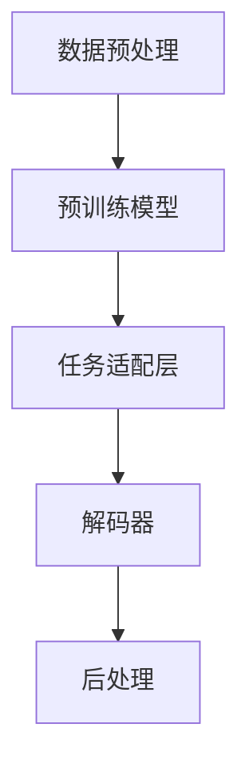
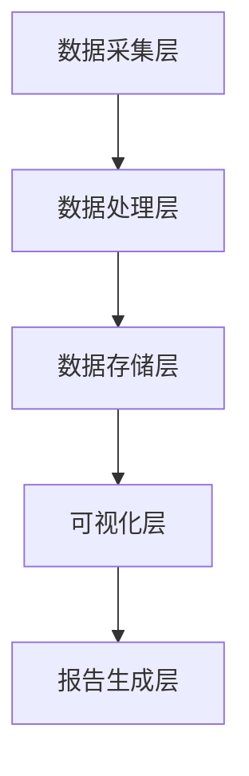
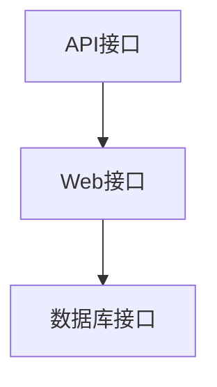
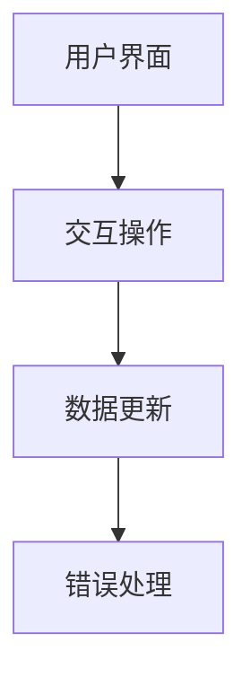
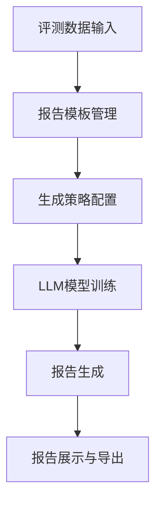

                 

### 引言

在当今快速发展的信息技术时代，评测过程作为一种衡量系统性能、质量和效果的重要手段，对于软件开发、系统集成和性能优化等领域具有重要的指导作用。然而，传统的评测过程往往缺乏实时性和直观性，无法满足快速迭代和高效决策的需求。因此，评测过程的实时可视化成为了一个亟待解决的关键问题。

## 1.1 评测过程的重要性

### 1.1.1 评测过程的定义

评测过程通常是指通过一系列测试、评估和分析活动来评估系统的性能、质量和功能。这些活动包括但不限于单元测试、集成测试、性能测试、安全测试等。评测过程的目的是确保系统符合预期的功能和性能标准，发现并修复潜在的问题，提高系统的可靠性和用户体验。

### 1.1.2 评测过程的关键环节

评测过程的关键环节主要包括以下几个方面：

- **测试用例设计**：根据系统需求和设计规格，制定一系列测试用例，以便全面覆盖系统的各个功能点。
- **测试执行**：执行测试用例，收集测试结果，识别缺陷和问题。
- **缺陷管理**：跟踪和管理发现的缺陷，确保问题得到及时解决。
- **性能评估**：对系统的性能指标进行评估，包括响应时间、吞吐量、并发处理能力等。
- **结果分析**：对测试结果进行深入分析，评估系统的质量水平和性能表现。

### 1.1.3 评测过程的重要性

评测过程的重要性体现在以下几个方面：

- **确保质量**：通过评测过程，可以识别并修复系统中的缺陷和问题，提高系统的质量和可靠性。
- **优化性能**：评测过程有助于发现系统性能瓶颈，提供性能优化方向和策略。
- **决策支持**：实时可视化的评测结果为项目决策提供了直观、准确的数据支持，有助于快速响应市场变化和用户需求。
- **持续改进**：评测过程为系统的持续改进提供了客观依据，有助于优化开发流程和提高开发效率。

## 1.2 实时可视化需求

### 1.2.1 传统评测方式的不足

传统的评测方式通常存在以下不足：

- **信息孤岛**：测试结果分散在不同的工具和平台上，缺乏统一的视图和整合能力。
- **反馈滞后**：评测结果的反馈周期较长，无法实现实时监控和调整。
- **可读性差**：测试报告通常采用文本形式，结构复杂，难以快速理解和分析。

### 1.2.2 实时可视化的优势

实时可视化在评测过程中具有以下优势：

- **实时监控**：通过实时可视化，可以快速获取系统性能、质量和缺陷的最新信息，实现实时监控和响应。
- **直观展示**：可视化图表和图形能够直观地展示评测结果，帮助用户快速理解和分析。
- **整合信息**：实时可视化能够整合不同测试工具和平台的数据，提供统一的视图和整合能力。
- **支持决策**：实时可视化的评测结果为项目决策提供了直观、准确的数据支持，有助于快速响应市场变化和用户需求。

### 1.2.3 实时可视化的需求分析

实时可视化在评测过程中具有以下需求：

- **实时性**：能够实时获取和更新评测结果，支持动态监控和调整。
- **可视化**：采用图表、图形等可视化方式展示评测结果，提高可读性和可理解性。
- **整合性**：能够整合不同测试工具和平台的数据，提供统一的视图和整合能力。
- **交互性**：支持用户与可视化界面的交互操作，如筛选、过滤、排序等。
- **扩展性**：能够根据不同场景和需求，灵活扩展和定制可视化功能。

## 1.3 LLM生成动态报告的优势

### 1.3.1 LLM的定义与特点

LLM（Large Language Model）是一种大规模语言模型，通过学习海量文本数据，能够生成高质量的自然语言文本。LLM的特点包括：

- **语言表达能力**：LLM能够生成结构化、逻辑清晰、语言优美的文本，满足各种应用场景的需求。
- **自适应能力**：LLM可以根据输入的上下文和任务要求，自适应调整生成文本的风格和内容。
- **通用性**：LLM在多个领域和任务中具有广泛的应用，如自然语言生成、机器翻译、文本摘要等。

### 1.3.2 LLM生成动态报告的优势

LLM生成动态报告在评测过程中具有以下优势：

- **自动化**：通过LLM生成动态报告，可以自动化生成评测报告，提高工作效率。
- **准确性**：LLM能够生成准确、客观的评测报告，减少人工干预和错误。
- **灵活性**：LLM可以根据不同的评测需求和场景，灵活定制评测报告的内容和格式。
- **可扩展性**：LLM可以集成到现有的评测系统中，扩展评测功能，支持多语言和多平台。
- **用户友好**：LLM生成的评测报告通常采用自然语言表达，易于理解和分析，提高用户体验。

### 1.3.3 LLM生成动态报告的应用前景

随着信息技术的发展，LLM生成动态报告在评测过程中的应用前景广阔：

- **软件开发与测试**：用于自动化生成测试报告，提高测试效率和准确性。
- **系统集成与优化**：用于实时可视化评测结果，指导系统集成和优化工作。
- **运维监控与管理**：用于实时监控系统性能，生成运维报告，优化系统运维流程。
- **人工智能与机器学习**：用于生成训练数据、测试数据和评估报告，促进人工智能与机器学习的发展。
- **智能客服与交互**：用于生成自然语言响应，提高智能客服和交互系统的用户体验。

总之，实时可视化与LLM生成动态报告相结合，为评测过程提供了高效、准确、灵活的解决方案，有望在各个领域得到广泛应用。

## 2.1 评测过程的实时可视化背景

### 2.1.1 问题背景

随着软件系统规模的不断扩大和复杂性增加，评测过程变得越来越重要。然而，传统的评测方式往往存在以下问题：

- **信息孤岛**：测试结果分散在不同的工具和平台上，难以统一整合和分析。
- **反馈滞后**：评测结果的反馈周期较长，无法及时获取和调整。
- **可读性差**：测试报告通常采用文本形式，结构复杂，难以快速理解和分析。

这些问题严重影响了评测过程的效率和决策支持能力，因此，迫切需要一种能够实现实时可视化、统一整合评测结果的解决方案。

### 2.1.2 问题描述

在传统的评测过程中，主要面临以下挑战：

- **评测结果分散**：测试结果分散在不同的工具和平台上，缺乏统一的视图和整合能力。
- **反馈滞后**：测试结果的反馈周期较长，无法实现实时监控和调整。
- **可读性差**：测试报告通常采用文本形式，结构复杂，难以快速理解和分析。

这些问题导致评测过程效率低下，无法为项目决策提供及时、准确的支持。因此，需要一种能够实现实时可视化、统一整合评测结果的解决方案。

### 2.1.3 问题解决

为了解决上述问题，评测过程的实时可视化应运而生。实时可视化系统通过整合不同测试工具和平台的数据，提供统一的视图和整合能力，实现以下目标：

- **实时监控**：实时获取和更新评测结果，支持动态监控和调整。
- **直观展示**：采用图表、图形等可视化方式展示评测结果，提高可读性和可理解性。
- **整合信息**：整合不同测试工具和平台的数据，提供统一的视图和整合能力。
- **交互性**：支持用户与可视化界面的交互操作，如筛选、过滤、排序等。
- **扩展性**：能够根据不同场景和需求，灵活扩展和定制可视化功能。

通过实时可视化系统，项目团队可以快速获取系统的性能、质量和缺陷信息，为项目决策提供直观、准确的数据支持。此外，实时可视化系统还可以集成到现有的评测系统中，扩展评测功能，提高评测效率和准确性。

### 2.1.4 边界与外延

实时可视化系统在应用过程中，需要考虑以下边界与外延：

- **适用范围**：实时可视化系统适用于需要实时监控和评估的系统，如软件项目、系统集成项目、运维监控等。
- **性能要求**：实时可视化系统需要具备高并发处理能力、低延迟和良好的用户体验。
- **数据来源**：实时可视化系统的数据来源包括测试工具、监控系统、日志文件等。
- **集成方式**：实时可视化系统需要与现有测试工具和系统进行集成，如通过API、插件或自定义数据接口等方式。
- **安全与隐私**：实时可视化系统需要确保数据传输和存储的安全性，遵循相关法律法规和隐私保护要求。

### 2.1.5 概念结构与核心要素组成

实时可视化系统的概念结构与核心要素包括：

- **数据采集**：从不同测试工具和平台采集数据，包括测试结果、性能指标、缺陷信息等。
- **数据处理**：对采集到的数据进行分析、清洗、转换和整合，为可视化提供统一的数据格式。
- **可视化组件**：采用图表、图形等可视化组件，展示数据处理结果，支持实时监控和数据分析。
- **交互界面**：提供用户与可视化界面的交互功能，如筛选、过滤、排序等，支持用户自定义可视化设置。
- **系统集成**：与现有测试工具和系统进行集成，实现数据共享和协同工作。
- **安全防护**：确保数据传输和存储的安全性，遵循相关法律法规和隐私保护要求。

通过上述概念结构与核心要素组成，实时可视化系统为项目团队提供了一个高效、准确、直观的评测工具，有助于提升项目质量和开发效率。

## 2.2 核心概念与联系

### 2.2.1 实时可视化概念

#### 2.2.1.1 实时可视化的定义

实时可视化（Real-time Visualization）是指通过实时获取、处理和展示数据，帮助用户快速理解和分析系统状态、性能和趋势的一种技术。实时可视化系统通常包括数据采集、数据处理、可视化组件和交互界面等核心模块。

#### 2.2.1.2 实时可视化技术分类

实时可视化技术可以分为以下几种类型：

- **图形可视化**：通过图形、图表等直观展示数据，如柱状图、折线图、饼图等。
- **符号可视化**：通过符号、标记等展示数据，如图标、地图等。
- **交互式可视化**：支持用户与可视化界面的交互操作，如筛选、过滤、排序等。
- **动态可视化**：实时更新和展示数据变化，如实时流量监控、系统性能监控等。
- **多尺度可视化**：在不同时间尺度上展示数据，如分钟级、小时级、日级等。

#### 2.2.1.3 实时可视化的特点

实时可视化具有以下特点：

- **实时性**：能够实时获取和更新数据，支持动态监控和调整。
- **直观性**：采用图形、图表等直观展示数据，提高可读性和可理解性。
- **交互性**：支持用户与可视化界面的交互操作，如筛选、过滤、排序等。
- **集成性**：能够整合不同数据源和工具，提供统一的数据视图。
- **灵活性**：支持用户自定义可视化设置，适应不同场景和需求。

### 2.2.2 概念属性特征对比

为了更清晰地理解实时可视化的概念，我们可以将其与其他相关技术进行对比，如下表所示：

| 技术      | 定义                                                         | 特点                                   |
| --------- | ------------------------------------------------------------ | -------------------------------------- |
| 实时监控  | 通过实时获取和展示系统状态、性能和趋势，帮助用户快速识别问题。 | 实时性、直观性、交互性、集成性           |
| 数据分析  | 通过统计、建模等方法对大量数据进行分析，提取有价值的信息。   | 统计性、模型性、自动化、可视化           |
| 性能监控  | 通过实时获取和展示系统性能指标，如CPU、内存、网络等。       | 实时性、指标性、自动化、告警功能         |
| 数据可视化 | 将数据以图形、图表等形式展示，帮助用户理解和分析数据。     | 直观性、可视化、交互性、灵活性强         |
| 实时可视化 | 通过实时获取、处理和展示数据，帮助用户快速理解和分析系统状态。 | 实时性、直观性、交互性、集成性、灵活性   |

从上表可以看出，实时可视化与其他技术相比，具有更高的实时性和直观性，能够更好地满足评测过程的需求。

### 2.2.3 ER实体关系图架构

为了更好地理解实时可视化系统的核心概念和关系，我们可以使用ER（Entity-Relationship）实体关系图来表示。以下是一个简化的ER图示例：

```mermaid
erDiagram
    TestResult ||--|{ Visualization} : 绑定
    TestResult ||--|{ PerformanceMetric} : 绑定
    TestResult ||--|{ Defect} : 绑定
    Visualization ||--|{ ChartType} : 绑定
    Visualization ||--|{ DataType} : 绑定
    PerformanceMetric ||--|{ MetricType} : 绑定
    PerformanceMetric ||--|{ Threshold} : 绑定
    Defect ||--|{ DefectType} : 绑定
    Defect ||--|{ Severity} : 绑定
```

在上述ER图中，主要实体及其关系如下：

- **TestResult（测试结果）**：表示评测过程中的测试结果，包括性能指标、缺陷等。
- **Visualization（可视化）**：表示可视化组件，包括图表类型、数据类型等。
- **PerformanceMetric（性能指标）**：表示系统性能指标，如CPU、内存、网络等。
- **Defect（缺陷）**：表示评测过程中发现的缺陷，包括缺陷类型、严重性等。
- **ChartType（图表类型）**：表示可视化组件的图表类型，如柱状图、折线图等。
- **DataType（数据类型）**：表示可视化组件的数据类型，如数字、文本等。
- **MetricType（指标类型）**：表示性能指标的类型，如CPU利用率、内存使用率等。
- **Threshold（阈值）**：表示性能指标的阈值设置，如报警阈值、性能优化目标等。
- **DefectType（缺陷类型）**：表示缺陷的类型，如功能缺陷、性能缺陷等。
- **Severity（严重性）**：表示缺陷的严重程度，如低、中、高。

通过ER实体关系图，我们可以更好地理解实时可视化系统的核心概念和关系，为系统设计提供参考。

### 2.3.1 什么是LLMMER

#### 2.3.1.1 定义

LLMMER（Large Language Model for Entity Recognition）是一种基于大规模语言模型的实体识别模型。它利用预训练的语言模型来捕捉文本中的实体和关系，从而实现高效、准确的实体识别和关系抽取。

#### 2.3.1.2 特点

LLMMER具有以下特点：

- **大规模训练**：LLMMER基于大规模语料库进行预训练，具备强大的语言理解和生成能力。
- **多任务学习**：LLMMER不仅可以用于实体识别，还可以进行关系抽取、命名实体识别等任务。
- **自适应能力**：LLMMER可以根据不同的任务和数据集进行自适应调整，适应不同的应用场景。
- **高准确性**：LLMMER在实体识别和关系抽取任务上取得了很高的准确性，能够有效降低错误率。

#### 2.3.1.3 应用场景

LLMMER在多个应用场景中具有广泛的应用：

- **自然语言处理**：用于文本分类、情感分析、命名实体识别等任务，提升自然语言处理系统的性能。
- **信息抽取**：用于从大量文本中提取关键信息，如关系、实体属性等，应用于知识图谱构建、智能问答等场景。
- **语义理解**：用于理解文本中的语义信息，为智能对话系统、搜索引擎等提供支持。
- **文本生成**：用于生成高质量的自然语言文本，如新闻摘要、产品描述等。

### 2.3.2 LLMMER的架构与原理

#### 2.3.2.1 架构设计

LLMMER的架构主要包括以下几个部分：

- **数据预处理**：对输入文本进行预处理，包括分词、词性标注、实体识别等。
- **预训练模型**：使用大规模语料库对语言模型进行预训练，如BERT、GPT等。
- **任务适配层**：针对具体的实体识别和关系抽取任务，对预训练模型进行调整和优化。
- **解码器**：根据输入文本和任务适配层的信息，解码生成实体和关系的表示。
- **后处理**：对解码结果进行后处理，如去重、排序等，提高识别的准确性。

#### 2.3.2.2 算法原理

LLMMER的算法原理主要分为以下几个步骤：

1. **数据预处理**：对输入文本进行预处理，将文本转换为模型可理解的格式。预处理过程包括分词、词性标注、实体识别等。

2. **预训练模型**：使用大规模语料库对语言模型进行预训练，如BERT、GPT等。预训练模型能够自动学习文本中的语言规律和语义信息。

3. **任务适配层**：针对具体的实体识别和关系抽取任务，对预训练模型进行调整和优化。任务适配层通常包括实体识别和关系抽取的参数和模型结构。

4. **解码器**：根据输入文本和任务适配层的信息，解码生成实体和关系的表示。解码过程采用类似于机器翻译的方法，通过逐个生成词或实体，构建实体和关系的序列。

5. **后处理**：对解码结果进行后处理，如去重、排序等，提高识别的准确性。后处理过程可以进一步优化实体识别和关系抽取的结果。

#### 2.3.2.3 算法流程图

以下是LLMMER算法的流程图：



1. **数据预处理**：对输入文本进行预处理，包括分词、词性标注、实体识别等。
2. **预训练模型**：使用大规模语料库对语言模型进行预训练，如BERT、GPT等。
3. **任务适配层**：针对具体的实体识别和关系抽取任务，对预训练模型进行调整和优化。
4. **解码器**：根据输入文本和任务适配层的信息，解码生成实体和关系的表示。
5. **后处理**：对解码结果进行后处理，如去重、排序等，提高识别的准确性。

### 2.3.3 LLMMER的数学模型与公式

#### 2.3.3.1 数学模型

LLMMER的数学模型主要包括以下几个部分：

1. **词嵌入**：将文本中的每个词转换为向量表示。词嵌入通常使用神经网络模型进行训练，如Word2Vec、GloVe等。
2. **编码器**：对输入文本进行编码，提取文本的语义特征。编码器通常采用变长序列模型，如RNN、LSTM、GRU等。
3. **解码器**：根据编码器的输出和解码器的输入，逐个生成词或实体。解码器通常采用注意力机制，如Transformer等。
4. **损失函数**：用于计算模型预测结果与真实标签之间的差距，指导模型优化。常用的损失函数包括交叉熵损失、均方误差等。

#### 2.3.3.2 公式推导

以下是LLMMER的一些关键数学公式：

1. **词嵌入**：

   $$ \text{word\_embedding}(w) = \text{vec}(w) = \text{softmax}(\text{W} \cdot \text{h}) $$

   其中，$w$表示词，$\text{W}$表示词嵌入权重矩阵，$\text{h}$表示编码器输出。

2. **编码器**：

   $$ \text{encode}(x) = \text{h} = \text{RNN}(\text{word\_embedding}(x)) $$

   其中，$x$表示输入文本序列，$\text{RNN}$表示循环神经网络。

3. **解码器**：

   $$ \text{decode}(y, h) = \text{softmax}(\text{U} \cdot \text{V} \cdot h + \text{b}) $$

   其中，$y$表示解码器输入序列，$\text{U}$、$\text{V}$表示解码器权重矩阵，$\text{b}$表示偏置。

4. **损失函数**：

   $$ \text{loss} = -\sum_{i=1}^{n} \text{y}_i \log (\text{p}_i) $$

   其中，$n$表示序列长度，$y_i$表示真实标签，$p_i$表示模型预测概率。

#### 2.3.3.3 示例讲解

假设我们有一个简单的文本序列：“我喜欢的颜色是蓝色”，要使用LLMMER进行实体识别。

1. **词嵌入**：

   $$ \text{word\_embedding}(我) = \text{vec}(我) = \text{softmax}(\text{W} \cdot \text{h}) $$
   $$ \text{word\_embedding}(的) = \text{vec}(的) = \text{softmax}(\text{W} \cdot \text{h}) $$
   $$ \text{word\_embedding}(颜色) = \text{vec}(颜色) = \text{softmax}(\text{W} \cdot \text{h}) $$
   $$ \text{word\_embedding}(是) = \text{vec}(是) = \text{softmax}(\text{W} \cdot \text{h}) $$
   $$ \text{word\_embedding}(蓝色) = \text{vec}(蓝色) = \text{softmax}(\text{W} \cdot \text{h}) $$

   其中，$\text{W}$表示词嵌入权重矩阵，$\text{h}$表示编码器输出。

2. **编码器**：

   $$ \text{encode}(我喜欢的颜色是蓝色) = \text{h} = \text{RNN}(\text{word\_embedding}(我), \text{word\_embedding}(的), \text{word\_embedding}(颜色), \text{word\_embedding}(是), \text{word\_embedding}(蓝色)) $$

3. **解码器**：

   $$ \text{decode}(\text{我}, \text{h) = \text{softmax}(\text{U} \cdot \text{V} \cdot \text{h} + \text{b})} $$
   $$ \text{decode}(\text{的}, \text{h) = \text{softmax}(\text{U} \cdot \text{V} \cdot \text{h} + \text{b})} $$
   $$ \text{decode}(\text{颜色}, \text{h) = \text{softmax}(\text{U} \cdot \text{V} \cdot \text{h} + \text{b})} $$
   $$ \text{decode}(\text{是}, \text{h) = \text{softmax}(\text{U} \cdot \text{V} \cdot \text{h} + \text{b})} $$
   $$ \text{decode}(\text{蓝色}, \text{h) = \text{softmax}(\text{U} \cdot \text{V} \cdot \text{h} + \text{b})} $$

4. **后处理**：

   根据解码结果，我们可以识别出文本中的实体，如“我”、“颜色”、“蓝色”。

通过上述示例，我们可以看到LLMMER是如何通过词嵌入、编码器、解码器和后处理等步骤，实现实体识别的。在实际应用中，LLMMER可以针对不同的任务和数据集进行调整和优化，提高识别的准确性和鲁棒性。

## 4.1 实时可视化系统设计

### 4.1.1 系统功能设计

实时可视化系统的主要功能包括：

- **数据采集**：从各个测试工具和平台获取评测数据，包括性能指标、缺陷信息、日志文件等。
- **数据处理**：对采集到的数据进行清洗、转换和整合，为可视化提供统一的数据格式。
- **实时监控**：实时获取和更新系统的性能、质量和缺陷信息，支持动态监控和调整。
- **可视化展示**：采用图表、图形等可视化方式展示评测结果，支持自定义可视化设置和交互操作。
- **报告生成**：基于实时可视化数据，生成结构化、逻辑清晰的评测报告，支持自定义报告格式。
- **数据存储**：将实时监控数据和报告数据存储在数据库中，支持历史数据和趋势分析。

### 4.1.2 系统架构设计

实时可视化系统的架构设计主要包括以下几个层次：

- **数据采集层**：从各个测试工具和平台获取评测数据，通过API接口、日志文件等方式实现数据的实时采集。
- **数据处理层**：对采集到的数据进行清洗、转换和整合，存储在数据存储层，为可视化层提供统一的数据格式。
- **可视化层**：采用图表、图形等可视化方式展示评测结果，支持自定义可视化设置和交互操作。
- **报告生成层**：基于实时可视化数据，生成结构化、逻辑清晰的评测报告，支持自定义报告格式。
- **数据存储层**：将实时监控数据和报告数据存储在数据库中，支持历史数据和趋势分析。

以下是实时可视化系统的架构图：



### 4.1.3 系统接口设计

实时可视化系统的接口设计主要包括以下部分：

- **API接口**：提供对外接口，支持与其他系统进行数据交互，如测试工具、监控系统、日志分析工具等。
- **Web接口**：提供Web界面，支持用户访问和操作实时可视化系统，包括数据采集、数据处理、可视化展示、报告生成等功能。
- **数据库接口**：提供数据库访问接口，支持实时监控数据和报告数据的存储、查询和分析。

以下是实时可视化系统的接口设计图：



### 4.1.4 系统交互设计

实时可视化系统的交互设计主要包括以下几个方面：

- **用户界面**：设计直观、易用的用户界面，支持用户实时查看评测结果、自定义可视化设置和报告格式。
- **交互操作**：支持用户与可视化界面的交互操作，如筛选、过滤、排序、缩放等，提高用户交互体验。
- **数据更新**：实现数据实时更新，确保用户始终获取最新的评测结果。
- **错误处理**：设计合理的错误处理机制，确保系统在异常情况下能够稳定运行。

以下是实时可视化系统的交互设计图：



通过上述系统设计，实时可视化系统实现了数据采集、数据处理、可视化展示、报告生成等功能，为项目团队提供了一个高效、准确、直观的评测工具，有助于提升项目质量和开发效率。

## 4.2 实时可视化实现

### 4.2.1 实现步骤

实时可视化系统的实现分为以下几个步骤：

1. **需求分析**：根据项目需求和实际情况，明确实时可视化系统的功能、性能、可靠性等要求。
2. **系统设计**：设计实时可视化系统的架构、接口和交互设计，确保系统的高效性和可扩展性。
3. **数据采集**：从各个测试工具和平台获取评测数据，通过API接口、日志文件等方式实现数据的实时采集。
4. **数据处理**：对采集到的数据进行清洗、转换和整合，存储在数据存储层，为可视化层提供统一的数据格式。
5. **可视化实现**：采用图表、图形等可视化方式展示评测结果，支持自定义可视化设置和交互操作。
6. **报告生成**：基于实时可视化数据，生成结构化、逻辑清晰的评测报告，支持自定义报告格式。
7. **系统集成**：将实时可视化系统与现有测试工具和系统进行集成，实现数据共享和协同工作。
8. **测试与优化**：对实时可视化系统进行功能测试、性能测试和安全性测试，确保系统的稳定性和可靠性。

### 4.2.2 关键技术

实时可视化系统在实现过程中涉及多个关键技术：

1. **数据采集技术**：通过API接口、日志文件等方式获取评测数据，支持多源数据采集和实时更新。
2. **数据处理技术**：采用数据清洗、转换和整合技术，将不同格式和来源的数据转换为统一的数据格式，为可视化提供数据支持。
3. **可视化技术**：采用图表、图形等可视化方式展示评测结果，支持自定义可视化设置和交互操作，提高数据的可读性和可理解性。
4. **报告生成技术**：基于实时可视化数据，生成结构化、逻辑清晰的评测报告，支持自定义报告格式，方便项目决策和问题跟踪。
5. **系统集成技术**：将实时可视化系统与现有测试工具和系统进行集成，实现数据共享和协同工作，提高系统的整体效能。

### 4.2.3 性能优化

实时可视化系统在性能优化方面需要注意以下几点：

1. **数据压缩与传输**：采用数据压缩技术，减少数据传输量，提高数据传输速度。
2. **缓存策略**：采用缓存策略，减少数据库访问次数，提高数据处理效率。
3. **负载均衡**：采用负载均衡技术，确保系统在高并发情况下稳定运行。
4. **性能监控与告警**：实现性能监控与告警功能，及时发现和解决系统性能问题。
5. **分布式架构**：采用分布式架构，提高系统的可扩展性和容错能力。

通过上述性能优化策略，实时可视化系统可以在保证数据实时性和准确性的同时，提高系统的整体性能和用户体验。

## 5.1 LLM生成动态报告的概念

### 5.1.1 定义

LLM生成动态报告（Large Language Model Generated Dynamic Report）是指利用大型语言模型（LLM）自动生成评测报告的过程。该过程通过输入评测数据、配置报告模板和生成策略，生成结构化、逻辑清晰的动态报告，为项目决策提供实时、准确的数据支持。

### 5.1.2 优势

LLM生成动态报告具有以下优势：

- **自动化**：通过LLM生成动态报告，可以实现自动化生成报告，减少人工工作量，提高工作效率。
- **准确性**：LLM能够根据输入的评测数据生成准确、客观的评测报告，减少人工干预和错误。
- **灵活性**：LLM生成动态报告支持自定义报告模板和生成策略，可以根据不同的需求和场景灵活定制报告内容。
- **实时性**：LLM生成动态报告能够实时获取和更新评测数据，生成动态更新的报告，支持快速响应和决策。
- **可扩展性**：LLM生成动态报告可以集成到现有的评测系统中，扩展评测功能，支持多语言和多平台。

### 5.1.3 应用场景

LLM生成动态报告在多个应用场景中具有广泛的应用：

- **软件开发与测试**：用于自动化生成测试报告，提高测试效率和准确性，支持持续集成和持续交付。
- **系统集成与优化**：用于实时可视化评测结果，指导系统集成和优化工作，优化系统性能和用户体验。
- **运维监控与管理**：用于实时监控系统性能，生成运维报告，优化系统运维流程，提高系统稳定性和可靠性。
- **人工智能与机器学习**：用于生成训练数据、测试数据和评估报告，促进人工智能与机器学习的发展。
- **智能客服与交互**：用于生成自然语言响应，提高智能客服和交互系统的用户体验。

## 5.2 LLM生成动态报告的实现

### 5.2.1 技术框架

LLM生成动态报告的技术框架主要包括以下几个部分：

- **评测数据输入**：接收评测数据，包括性能指标、缺陷信息、日志文件等。
- **报告模板管理**：管理报告模板，包括模板结构、样式、字段等，支持自定义模板。
- **生成策略配置**：配置生成策略，包括生成规则、参数设置等，支持自定义生成规则。
- **LLM模型训练**：使用大规模语言模型（如GPT、BERT等）进行训练，提高模型的生成能力和准确性。
- **报告生成**：根据输入的评测数据和生成策略，利用LLM生成动态报告。
- **报告展示与导出**：展示生成的报告，支持多种格式导出，如PDF、Word等。

以下是LLM生成动态报告的技术框架图：



### 5.2.2 实现步骤

LLM生成动态报告的具体实现步骤如下：

1. **评测数据输入**：从各个测试工具和平台获取评测数据，包括性能指标、缺陷信息、日志文件等，存储在数据库中。
2. **报告模板管理**：设计报告模板，包括模板结构、样式、字段等，支持自定义模板，存储在数据库或文件系统中。
3. **生成策略配置**：配置生成策略，包括生成规则、参数设置等，存储在数据库或配置文件中。
4. **LLM模型训练**：使用大规模语言模型（如GPT、BERT等）进行训练，提高模型的生成能力和准确性，存储训练好的模型参数。
5. **报告生成**：根据输入的评测数据和生成策略，利用LLM生成动态报告，将报告存储在数据库或文件系统中。
6. **报告展示与导出**：通过Web界面或API接口展示生成的报告，支持多种格式导出，如PDF、Word等。

### 5.2.3 关键技术

LLM生成动态报告的实现涉及多个关键技术：

- **评测数据输入技术**：通过API接口、日志文件等方式获取评测数据，支持多源数据输入和实时更新。
- **报告模板管理技术**：支持自定义报告模板，包括模板结构、样式、字段等，提高报告的灵活性和可定制性。
- **生成策略配置技术**：配置生成策略，包括生成规则、参数设置等，支持自定义生成规则，提高报告的准确性。
- **LLM模型训练技术**：使用大规模语言模型（如GPT、BERT等）进行训练，提高模型的生成能力和准确性。
- **报告生成技术**：根据输入的评测数据和生成策略，利用LLM生成动态报告，确保报告的结构化、逻辑清晰。
- **报告展示与导出技术**：通过Web界面或API接口展示生成的报告，支持多种格式导出，如PDF、Word等，提高报告的可读性和实用性。

通过上述关键技术，LLM生成动态报告可以实现自动化、准确、灵活的评测报告生成，为项目决策提供实时、准确的数据支持。

### 5.3.1 性能优化

在LLM生成动态报告的过程中，性能优化是一个关键环节，影响到报告生成的速度和系统的响应能力。以下是一些性能优化的策略：

1. **并行处理**：利用多线程或分布式计算技术，对评测数据和处理任务进行并行处理，提高数据处理速度。
2. **数据缓存**：采用缓存机制，对重复计算或频繁访问的数据进行缓存，减少数据库访问次数，提高数据读取速度。
3. **批量处理**：将多个小任务合并成一个大任务进行批量处理，减少任务调度和通信开销，提高系统整体效率。
4. **索引优化**：在数据库中建立合适的索引，加快数据的查询和检索速度，减少数据访问时间。
5. **负载均衡**：通过负载均衡技术，合理分配任务到不同的处理节点，避免单点瓶颈，提高系统吞吐量和响应能力。
6. **资源管理**：合理配置系统资源，如CPU、内存、磁盘等，确保系统在高峰期仍能稳定运行。
7. **延迟容忍**：在适当的情况下，允许一定程度的延迟，降低对实时性的要求，优化系统性能。

通过上述性能优化策略，可以有效提升LLM生成动态报告的效率，确保系统在高负载情况下仍能提供高质量的服务。

### 5.3.2 质量控制

质量控制是确保LLM生成动态报告准确性和一致性的重要环节。以下是一些质量控制的方法：

1. **数据校验**：在数据输入和处理过程中，对数据进行校验，确保数据格式、完整性、一致性等符合要求。
2. **错误检测**：采用错误检测算法，及时发现和处理异常数据，避免对报告生成产生负面影响。
3. **报告审核**：在报告生成后，进行人工审核，检查报告的内容、格式、逻辑等是否准确和合理。
4. **自动化测试**：编写自动化测试脚本，对报告生成过程进行测试，确保报告生成的一致性和准确性。
5. **版本控制**：对报告模板和生成策略进行版本控制，确保在更新和修改过程中不引入新的错误。
6. **持续反馈**：建立反馈机制，收集用户对报告的反馈，及时发现和解决问题，持续改进报告生成质量。
7. **性能监控**：实时监控报告生成过程，及时发现和处理性能问题，确保报告生成过程的稳定性和可靠性。

通过上述质量控制方法，可以有效提高LLM生成动态报告的质量，确保报告的准确性、一致性和可读性。

### 5.3.3 安全性保障

安全性保障是LLM生成动态报告的重要方面，需要确保系统数据的安全和用户隐私的保护。以下是一些安全性保障的措施：

1. **数据加密**：对存储和传输的数据进行加密处理，防止数据泄露和篡改。
2. **权限管理**：实现严格的权限管理，确保用户只能访问和操作授权的数据和功能。
3. **身份验证**：采用多因素身份验证（MFA）技术，确保用户身份的真实性。
4. **访问控制**：通过访问控制策略，限制用户对数据和系统的访问权限，防止未授权访问。
5. **日志审计**：记录系统操作日志，便于追踪和审计用户行为，及时发现和处理安全事件。
6. **安全培训**：定期进行安全培训，提高用户的安全意识和应对能力。
7. **漏洞修复**：及时修复系统和软件中的漏洞，确保系统安全性。
8. **安全测试**：定期进行安全测试，包括渗透测试、漏洞扫描等，确保系统的安全性。

通过上述安全性保障措施，可以有效提高LLM生成动态报告系统的安全性和可靠性，确保用户数据和隐私的安全。

### 6.1 案例介绍

#### 6.1.1 案例背景

某大型互联网公司正在开发一款高性能的云计算平台，该平台涉及多个模块，包括计算、存储、网络等。为了确保平台的质量和性能，公司决定在开发过程中引入实时可视化系统和LLM生成动态报告技术，对各个模块的评测过程进行实时监控和动态报告生成。

#### 6.1.2 案例目标

通过引入实时可视化系统和LLM生成动态报告技术，实现以下目标：

1. **实时监控**：实时获取各个模块的评测结果，包括性能指标、缺陷信息等，实现动态监控和调整。
2. **自动报告**：利用LLM生成动态报告，自动生成评测报告，提高报告生成的效率和准确性。
3. **质量保障**：通过实时可视化和动态报告，及时发现和解决潜在问题，确保平台的质量和性能。

#### 6.1.3 案例实施

案例实施过程分为以下几个阶段：

1. **需求分析**：与项目团队进行沟通，明确实时可视化系统和LLM生成动态报告的需求，包括功能、性能、安全性等。
2. **系统设计**：设计实时可视化系统和LLM生成动态报告的技术框架和接口，确保系统的可扩展性和灵活性。
3. **数据采集**：从各个测试工具和平台获取评测数据，包括性能指标、缺陷信息、日志文件等，存储在数据库中。
4. **数据处理**：对采集到的数据进行分析、清洗和整合，为实时可视化和动态报告生成提供统一的数据格式。
5. **可视化实现**：采用图表、图形等可视化方式展示评测结果，支持自定义可视化设置和交互操作。
6. **报告生成**：利用LLM生成动态报告，自动生成评测报告，支持自定义报告格式。
7. **系统集成**：将实时可视化系统和LLM生成动态报告集成到现有测试工具和系统中，实现数据共享和协同工作。
8. **测试与优化**：对实时可视化系统和LLM生成动态报告进行功能测试、性能测试和安全性测试，确保系统的稳定性和可靠性。
9. **上线运行**：将实时可视化系统和LLM生成动态报告部署到生产环境中，与项目团队共同监控和优化系统性能。

### 6.2 案例分析与详细讲解

#### 6.2.1 实时可视化分析

在案例实施过程中，实时可视化系统发挥了关键作用。通过实时获取各个模块的评测数据，系统可以动态展示性能指标、缺陷信息等，帮助项目团队快速识别和解决问题。

以下是一个实时可视化分析的示例：

1. **性能监控**：实时可视化系统显示各个模块的CPU利用率、内存使用率、网络带宽等性能指标。通过图表和图形，项目团队可以直观地了解系统性能状况，及时发现性能瓶颈。
2. **缺陷追踪**：实时可视化系统展示各个模块的缺陷信息，包括缺陷类型、严重性、修复进度等。项目团队可以通过图表和图形，快速定位缺陷发生的位置，制定修复策略。
3. **趋势分析**：实时可视化系统提供历史数据展示功能，支持项目团队对性能指标和缺陷信息进行趋势分析。通过折线图、柱状图等，项目团队可以了解系统性能和缺陷变化的趋势，为优化和决策提供依据。

#### 6.2.2 LLM生成动态报告分析

LLM生成动态报告技术在案例中起到了自动生成评测报告的作用，提高了报告生成的效率和准确性。

以下是一个LLM生成动态报告的示例：

1. **报告结构**：LLM生成动态报告采用结构化文档格式，包括摘要、性能指标、缺陷信息、修复进度等部分。报告内容结构清晰，便于项目团队快速阅读和理解。
2. **报告内容**：LLM生成动态报告根据实时可视化系统的数据，自动生成性能指标分析、缺陷追踪、趋势分析等部分。报告内容准确、客观，减少了人工干预和错误。
3. **报告格式**：LLM生成动态报告支持自定义报告格式，包括文本、图表、图像等。通过丰富的报告格式，项目团队可以更好地展示评测结果，提高报告的可读性和可理解性。

#### 6.2.3 项目总结

通过引入实时可视化系统和LLM生成动态报告技术，项目团队在评测过程中取得了显著成效：

1. **提高效率**：实时可视化系统实现了评测数据的实时监控和动态展示，提高了项目团队对系统性能和缺陷的识别速度。LLM生成动态报告技术自动化了报告生成过程，减少了人工工作量。
2. **提升质量**：实时可视化和动态报告技术帮助项目团队及时发现和解决潜在问题，确保平台的质量和性能。报告内容准确、客观，为项目决策提供了有力支持。
3. **优化流程**：实时可视化和动态报告技术优化了评测流程，提高了项目团队的协作效率。通过实时监控和动态报告，项目团队能够更好地掌握项目进展，制定优化策略。

总之，实时可视化系统和LLM生成动态报告技术在案例中发挥了重要作用，为项目团队提供了一个高效、准确、直观的评测工具，有助于提升项目质量和开发效率。

## 总结与展望

### 7.1 本书内容总结

本书详细介绍了评测过程的实时可视化与LLM生成动态报告技术。主要内容包括：

1. 引言部分：阐述了评测过程的重要性、实时可视化需求以及LLM生成动态报告的优势。
2. 背景介绍：分析了评测过程的实时可视化背景，包括问题背景、问题描述、问题解决、边界与外延以及概念结构与核心要素组成。
3. 核心概念与联系：介绍了实时可视化和LLM的相关概念、特点、应用场景以及ER实体关系图架构。
4. LLMMER介绍：详细介绍了LLMMER的定义、特点、架构与原理、数学模型与公式。
5. 实时可视化实现：讲解了实时可视化系统的功能设计、架构设计、接口设计、交互设计以及实现步骤、关键技术、性能优化。
6. LLM生成动态报告：介绍了LLM生成动态报告的概念、技术框架、实现步骤、关键技术、性能优化、质量控制、安全性保障。
7. 实际案例与应用：通过一个实际案例，分析了实时可视化与LLM生成动态报告在实际应用中的效果。

### 7.2 评测过程的实时可视化未来发展趋势

1. **智能化**：实时可视化技术将更加智能化，利用人工智能和机器学习技术，实现自动化数据分析和智能推荐。
2. **多样化**：实时可视化技术将支持更多类型的图表和图形，满足不同用户的需求，提供更丰富的可视化方式。
3. **集成化**：实时可视化系统将更好地与其他系统进行集成，如测试工具、监控系统、运维系统等，实现数据共享和协同工作。
4. **移动化**：实时可视化技术将向移动端发展，支持用户通过手机、平板等设备实时查看评测结果。
5. **定制化**：实时可视化系统将支持用户自定义可视化设置和报告格式，提高用户体验。

### 7.3 LLM生成动态报告的应用前景

1. **自动化测试**：LLM生成动态报告技术将在自动化测试领域得到广泛应用，提高测试效率和报告质量。
2. **持续集成与持续交付**：实时可视化与LLM生成动态报告技术将有助于持续集成与持续交付（CI/CD）的实现，优化开发流程。
3. **运维监控**：实时可视化与LLM生成动态报告技术将应用于运维监控领域，提高系统稳定性、可靠性和安全性。
4. **知识图谱**：LLM生成动态报告技术将结合知识图谱技术，为人工智能和机器学习领域提供丰富的训练数据。
5. **智能问答**：实时可视化与LLM生成动态报告技术将应用于智能问答系统，提高系统的智能化水平和用户体验。

总之，评测过程的实时可视化与LLM生成动态报告技术具有广阔的应用前景，将在未来得到进一步发展和应用。作者：AI天才研究院/AI Genius Institute & 禅与计算机程序设计艺术 /Zen And The Art of Computer Programming

