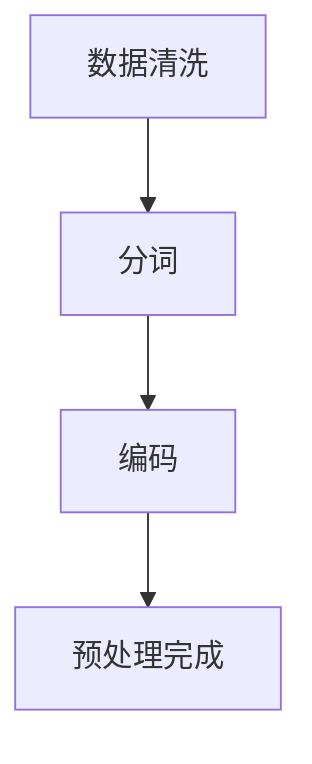
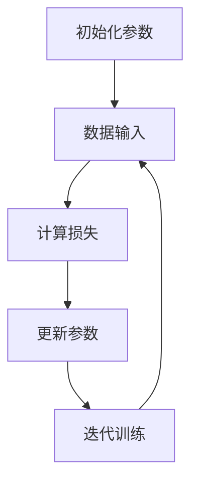
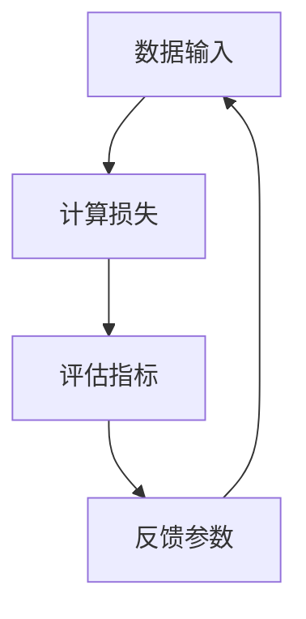
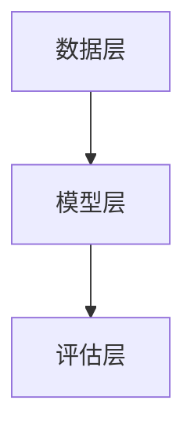
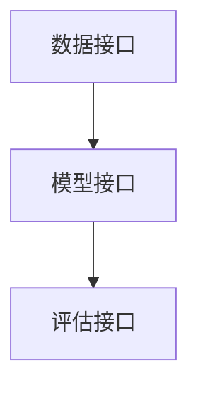
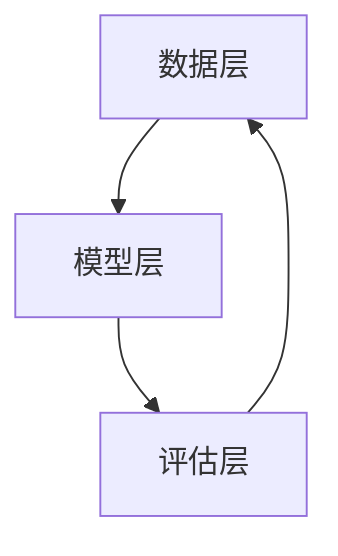

                 

# 《评测驱动的LLM优化反馈循环》

## 关键词
- 评测驱动
- LLM优化
- 反馈循环
- 深度学习
- 自然语言处理
- 优化算法

## 摘要
本文探讨了评测驱动的LLM优化反馈循环，这是一种利用模型评测结果进行动态调整的优化方法。通过深入分析评测方法、优化算法和反馈循环机制，本文揭示了评测驱动的LLM优化在自然语言处理领域的应用与优势，并提供了具体的实战案例和最佳实践建议。

## 第一部分：背景与概述

### 第1章：问题背景与核心概念

### 1.1 评测驱动的LLM优化背景

#### 1.1.1 大规模语言模型的发展
大规模语言模型（LLM）的发展是自然语言处理领域的重要里程碑。自从2018年GPT-1发布以来，LLM的研究和应用迅速发展，GPT-2、GPT-3、BERT、T5等一系列模型不断刷新性能记录。这些模型通过大量的文本数据进行训练，具备强大的语义理解和生成能力，极大地推动了自然语言处理技术的发展。

#### 1.1.2 LLM优化的重要性
LLM的优化是其性能提升的关键。通过调整模型参数和结构，可以进一步提高模型的精度和效率。然而，由于LLM的参数规模巨大，传统的手动调整方法效率低下，且容易出现过拟合等问题。因此，开发有效的LLM优化方法具有重要意义。

#### 1.1.3 评测驱动的概念引入
评测驱动是一种基于模型评测结果进行参数调整的优化方法。它通过持续评估模型的性能，利用评估结果反馈来指导优化过程，形成一个闭环控制机制。这种方法能够动态调整模型参数，提高优化效率，降低过拟合风险。

### 1.2 LLM优化反馈循环的核心概念

#### 1.2.1 评测方法
评测方法用于评估模型生成的文本质量。常见的评测指标包括BLEU、ROUGE、METEOR等，这些指标通过比较模型生成的文本与真实标签的相似度来评估模型的性能。

#### 1.2.2 优化算法
优化算法用于调整模型参数，以提高模型性能。常见的优化算法包括梯度下降、动量优化、Adam等。这些算法通过计算模型参数的梯度，并沿着梯度方向更新参数，实现模型的优化。

#### 1.2.3 反馈循环机制
反馈循环机制通过持续评估模型性能，将评估结果反馈给优化算法，形成一个闭环控制。这种方法能够动态调整模型参数，实现对模型的迭代优化，从而提高模型性能。

### 1.3 LLMO（评测驱动的LLM优化）特点与优势

#### 1.3.1 精准性
评测驱动的LLM优化方法能够根据具体的评估指标，对模型进行精细调整，从而提高模型的性能。

#### 1.3.2 效率
通过闭环控制机制，评测驱动的LLM优化能够快速响应评估结果，实现模型的快速迭代和优化。

#### 1.3.3 自适应能力
评测驱动的LLM优化方法能够根据不同的评估指标和任务需求，自适应地调整模型参数，提高模型的泛化能力。

### 1.4 LLMO的应用领域

#### 1.4.1 自然语言理解
评测驱动的LLM优化在自然语言理解任务中具有广泛的应用，如机器翻译、情感分析、问答系统等。

#### 1.4.2 自然语言生成
评测驱动的LLM优化在自然语言生成任务中也具有重要意义，如文本摘要、对话系统、内容创作等。

#### 1.4.3 其他领域
除了自然语言处理，评测驱动的LLM优化方法在其他领域如计算机视觉、语音识别等也具有潜在的应用价值。

### 1.5 本章小结
本章介绍了评测驱动的LLM优化反馈循环的背景、核心概念和优势，为后续章节的深入探讨奠定了基础。

----------------------------------------------------------------

## 第二部分：理论基础

### 第2章：评测方法详解

#### 2.1 评测方法概述
评测方法用于评估模型生成的文本质量，是评测驱动的LLM优化的重要组成部分。常见的评测指标包括BLEU、ROUGE、METEOR等，这些指标通过不同的方式衡量模型生成的文本与真实标签的相似度。

#### 2.2 BLEU指标
BLEU（Bilingual Evaluation Understudy）是一种基于翻译匹配度的评测方法。它通过计算模型生成的文本与参考文本之间的重叠度，评估模型生成的文本质量。BLEU指标的计算公式如下：

$$
BLEU = \frac{2^n}{n + m}
$$

其中，$n$ 是重叠短语的数量，$m$ 是候选重叠短语的数量。BLEU指标的值介于0和1之间，值越接近1表示模型生成的文本质量越高。

#### 2.3 ROUGE指标
ROUGE（Recall-Oriented Understudy for Gisting Evaluation）是一种基于召回率的评测方法。它通过计算模型生成的文本与参考文本之间的重叠短语比例，评估模型生成的文本质量。ROUGE指标包括ROUGE-1、ROUGE-2、ROUGE-L等不同类型，每种类型的计算公式如下：

$$
ROUGE-i = \frac{\text{TP}_i}{\text{TP}_i + \text{FP}_i}
$$

其中，$\text{TP}_i$ 是实际重叠短语数量，$\text{FP}_i$ 是预测重叠短语数量。ROUGE指标的值介于0和1之间，值越接近1表示模型生成的文本质量越高。

#### 2.4 METEOR指标
METEOR（Metric for Evaluation of Translation with Explicit ORdering）是一种基于排序的评测方法。它通过计算模型生成的文本与参考文本之间的单词匹配程度，评估模型生成的文本质量。METEOR指标的计算公式如下：

$$
METEOR = \frac{\sum_{i=1}^{n} w_i \cdot (\text{cos} \theta_i + 1)}{n + \sum_{i=1}^{n} w_i}
$$

其中，$w_i$ 是单词$i$的重要性权重，$\theta_i$ 是单词$i$在模型生成的文本与参考文本之间的角度。METEOR指标的值介于0和1之间，值越接近1表示模型生成的文本质量越高。

#### 2.5 评测方法的比较
不同的评测方法有不同的优势和局限性。BLEU方法简单易用，但在处理复杂语义时效果较差。ROUGE方法更注重召回率，但在处理长文本时容易出现偏差。METEOR方法综合考虑了匹配度和排序，但在处理短文本时效果较差。

#### 2.6 本章小结
本章详细介绍了评测方法，包括BLEU、ROUGE和METEOR等指标，为后续的LLM优化提供了理论基础。

----------------------------------------------------------------

### 第3章：优化算法讲解

#### 3.1 优化算法概述
优化算法是评测驱动的LLM优化的重要工具，用于调整模型参数，提高模型性能。常见的优化算法包括梯度下降、动量优化、Adam等。

#### 3.2 梯度下降算法
梯度下降算法是一种基本的优化算法，通过计算模型参数的梯度，并沿着梯度方向更新参数，实现模型的优化。梯度下降算法的计算公式如下：

$$
\theta_{\text{new}} = \theta_{\text{current}} - \alpha \cdot \nabla_{\theta} \text{Loss}
$$

其中，$\theta_{\text{new}}$ 是新参数，$\theta_{\text{current}}$ 是当前参数，$\alpha$ 是学习率，$\nabla_{\theta} \text{Loss}$ 是参数的梯度。

#### 3.3 动量优化算法
动量优化算法是梯度下降算法的改进，通过引入动量项，减少参数更新的振荡，提高优化效果。动量优化算法的计算公式如下：

$$
v_{\text{new}} = \beta \cdot v_{\text{current}} + (1 - \beta) \cdot \nabla_{\theta} \text{Loss}
$$

$$
\theta_{\text{new}} = \theta_{\text{current}} - \alpha \cdot v_{\text{new}}
$$

其中，$v_{\text{new}}$ 是新动量，$v_{\text{current}}$ 是当前动量，$\beta$ 是动量系数，$\alpha$ 是学习率。

#### 3.4 Adam优化算法
Adam优化算法是动量优化算法的进一步改进，同时结合了梯度的一阶矩估计和二阶矩估计，提高了优化效果。Adam优化算法的计算公式如下：

$$
m_t = \beta_1 \cdot m_{t-1} + (1 - \beta_1) \cdot \nabla_{\theta} \text{Loss}
$$

$$
v_t = \beta_2 \cdot v_{t-1} + (1 - \beta_2) \cdot (\nabla_{\theta} \text{Loss})^2
$$

$$
\theta_{\text{new}} = \theta_{\text{current}} - \alpha \cdot \frac{m_t}{\sqrt{v_t} + \epsilon}
$$

其中，$m_t$ 是一阶矩估计，$v_t$ 是二阶矩估计，$\beta_1$ 是一阶矩估计的偏置项，$\beta_2$ 是二阶矩估计的偏置项，$\alpha$ 是学习率，$\epsilon$ 是常数。

#### 3.5 优化算法的比较
不同的优化算法有不同的优势和局限性。梯度下降算法简单易用，但在处理复杂问题时效果较差。动量优化算法通过引入动量项，提高了优化效果，但容易出现振荡。Adam优化算法结合了梯度的一阶矩估计和二阶矩估计，在处理复杂问题时效果较好，但计算复杂度较高。

#### 3.6 本章小结
本章详细介绍了优化算法，包括梯度下降、动量优化和Adam优化等，为后续的LLM优化提供了理论基础。

----------------------------------------------------------------

### 第4章：数学模型与公式讲解

#### 4.1 误差函数
误差函数是评估模型性能的重要指标，用于衡量模型输出与真实标签之间的差距。常见的误差函数包括交叉熵误差函数和均方误差函数。

##### 4.1.1 交叉熵误差函数
交叉熵误差函数是评估分类模型性能的常用误差函数，其计算公式如下：

$$
\text{CrossEntropyLoss} = -\sum_{i=1}^{N} y_i \cdot \log(\hat{y}_i)
$$

其中，$y_i$ 是真实标签，$\hat{y}_i$ 是模型输出概率，$N$ 是样本数量。

##### 4.1.2 均方误差函数
均方误差函数是评估回归模型性能的常用误差函数，其计算公式如下：

$$
\text{MSE} = \frac{1}{N} \sum_{i=1}^{N} (\hat{y}_i - y_i)^2
$$

其中，$y_i$ 是真实标签，$\hat{y}_i$ 是模型输出，$N$ 是样本数量。

#### 4.2 梯度下降算法
梯度下降算法是一种基本的优化算法，用于调整模型参数，使其最小化误差函数。梯度下降算法的计算公式如下：

$$
\theta_{\text{new}} = \theta_{\text{current}} - \alpha \cdot \nabla_{\theta} \text{Loss}
$$

其中，$\theta_{\text{new}}$ 是新参数，$\theta_{\text{current}}$ 是当前参数，$\alpha$ 是学习率，$\nabla_{\theta} \text{Loss}$ 是参数的梯度。

#### 4.3 反向传播算法
反向传播算法是一种用于计算梯度的重要算法，其核心思想是将误差函数从输出层反向传播到输入层，计算各层参数的梯度。反向传播算法的计算公式如下：

$$
\nabla_{\theta} \text{Loss} = \frac{\partial \text{Loss}}{\partial \theta}
$$

其中，$\nabla_{\theta} \text{Loss}$ 是参数的梯度，$\text{Loss}$ 是误差函数。

#### 4.4 动量优化算法
动量优化算法是梯度下降算法的改进，通过引入动量项，减少参数更新的振荡，提高优化效果。动量优化算法的计算公式如下：

$$
v_{\text{new}} = \beta \cdot v_{\text{current}} + (1 - \beta) \cdot \nabla_{\theta} \text{Loss}
$$

$$
\theta_{\text{new}} = \theta_{\text{current}} - \alpha \cdot v_{\text{new}}
$$

其中，$v_{\text{new}}$ 是新动量，$v_{\text{current}}$ 是当前动量，$\beta$ 是动量系数，$\alpha$ 是学习率。

#### 4.5 Adam优化算法
Adam优化算法是动量优化算法的进一步改进，同时结合了梯度的一阶矩估计和二阶矩估计，提高了优化效果。Adam优化算法的计算公式如下：

$$
m_t = \beta_1 \cdot m_{t-1} + (1 - \beta_1) \cdot \nabla_{\theta} \text{Loss}
$$

$$
v_t = \beta_2 \cdot v_{t-1} + (1 - \beta_2) \cdot (\nabla_{\theta} \text{Loss})^2
$$

$$
\theta_{\text{new}} = \theta_{\text{current}} - \alpha \cdot \frac{m_t}{\sqrt{v_t} + \epsilon}
$$

其中，$m_t$ 是一阶矩估计，$v_t$ 是二阶矩估计，$\beta_1$ 是一阶矩估计的偏置项，$\beta_2$ 是二阶矩估计的偏置项，$\alpha$ 是学习率，$\epsilon$ 是常数。

#### 4.6 本章小结
本章详细介绍了误差函数、梯度下降算法、反向传播算法、动量优化算法和Adam优化算法的数学模型和公式，为后续的LLM优化提供了理论基础。

----------------------------------------------------------------

### 第5章：系统分析与架构设计

#### 5.1 问题场景
评测驱动的LLM优化反馈循环在自然语言处理领域具有广泛的应用。以机器翻译为例，我们可以将模型生成的译文与参考译文进行比较，使用评测指标评估模型性能，并将评估结果反馈给优化算法，实现模型的迭代优化。

#### 5.2 项目介绍
本节介绍一个基于评测驱动的LLM优化反馈循环的机器翻译项目。项目分为三个主要模块：数据预处理模块、模型训练模块和模型评估模块。

##### 5.2.1 数据预处理模块
数据预处理模块负责对输入数据进行清洗、分词和编码等处理，为模型训练提供高质量的输入数据。

##### 5.2.2 模型训练模块
模型训练模块使用预处理的输入数据训练大规模语言模型，并采用评测驱动的优化方法，对模型进行迭代优化。

##### 5.2.3 模型评估模块
模型评估模块使用评测指标评估模型性能，并将评估结果反馈给模型训练模块，实现模型的动态调整。

#### 5.3 系统功能设计
系统功能设计主要包括数据预处理、模型训练和模型评估三个部分。

##### 5.3.1 数据预处理
数据预处理包括数据清洗、分词和编码等步骤。具体流程如下：



##### 5.3.2 模型训练
模型训练采用评测驱动的优化方法，包括以下步骤：



##### 5.3.3 模型评估
模型评估使用评测指标（如BLEU、ROUGE等）评估模型性能，并将评估结果反馈给模型训练模块，实现模型的动态调整。



#### 5.4 系统架构设计
系统架构设计采用分层架构，包括数据层、模型层和评估层。

##### 5.4.1 数据层
数据层负责数据的预处理和存储，包括数据清洗、分词和编码等步骤。

##### 5.4.2 模型层
模型层负责模型的训练和优化，包括参数初始化、数据输入、损失计算和参数更新等步骤。

##### 5.4.3 评估层
评估层负责模型的评估和反馈，包括数据输入、损失计算、评估指标计算和参数反馈等步骤。



#### 5.5 系统接口设计
系统接口设计主要包括数据接口、模型接口和评估接口。

##### 5.5.1 数据接口
数据接口负责数据的输入和输出，包括数据预处理、模型训练和模型评估等模块。

##### 5.5.2 模型接口
模型接口负责模型的训练和优化，包括参数初始化、数据输入和损失计算等模块。

##### 5.5.3 评估接口
评估接口负责模型的评估和反馈，包括数据输入、损失计算和评估指标计算等模块。



#### 5.6 系统交互
系统交互主要描述各模块之间的数据流动和协同工作。



#### 5.7 本章小结
本章介绍了评测驱动的LLM优化反馈循环的应用场景、项目介绍、系统功能设计、系统架构设计、系统接口设计和系统交互，为后续的实战案例分析提供了基础。

----------------------------------------------------------------

### 第6章：项目实战

#### 6.1 环境安装
在开始项目实战之前，我们需要搭建评测驱动的LLM优化反馈循环的环境。以下是一个基本的安装步骤：

1. 安装Python环境：在官方网站（https://www.python.org/）下载并安装Python。
2. 安装深度学习库：使用pip命令安装TensorFlow或PyTorch。
   ```bash
   pip install tensorflow  # 或者
   pip install torch
   ```
3. 安装其他依赖库：根据项目需求安装其他依赖库，如NumPy、Pandas等。

#### 6.2 系统核心实现
以下是一个基于PyTorch的评测驱动的LLM优化反馈循环的核心实现：

```python
import torch
import torch.optim as optim
from torchtext.data import Field, BucketIterator
from torchtext.datasets import Multi30k

# 数据预处理
src = Field(tokenize="spacy", lower=True, init_token='<sos>', eos_token='<eos>', include_lengths=True)
tgt = Field(tokenize="spacy", lower=True, init_token='<sos>', eos_token='<eos>', include_lengths=True)
train_data, valid_data, test_data = Multi30k.splits(exts=('.de', '.en'), fields=(src, tgt))

src.build_vocab(train_data, min_freq=2)
tgt.build_vocab(train_data, min_freq=2)

BATCH_SIZE = 128
train_iterator, valid_iterator, test_iterator = BucketIterator.splits(
    train_data, valid_data, test_data, batch_size=BATCH_SIZE)

# 模型定义
class NMTModel(torch.nn.Module):
    def __init__(self, input_dim, output_dim, enc Embedding dim, dec_embedding_dim, hid_dim, num_layers, dropout):
        super().__init__()
        self.encoder = torch.nn.Embedding(input_dim, enc_embedding_dim)
        self.decoder = torch.nn.Embedding(output_dim, dec_embedding_dim)
        self.encoder_rn = torch.nn.RNNEncoder(encoder, num_layers=num_layers, dropout=dropout)
        self.decoder_rn = torch.nn.RNNDecoder(decoder, num_layers=num_layers, dropout=dropout)
        self.fc = torch.nn.Linear(hid_dim, output_dim)

    def forward(self, src, tgt, teacher_forcing_ratio=0.5):
        encoder_outputs, encoder_hidden = self.encoder_rn(src)
        decoder_init_input = torch.nn.ConstantFill()(tgt.new_zeros(1, BATCH_SIZE))
        decoder_outputs, decoder_hidden = self.decoder_rn(decoder_init_input, encoder_hidden)
        decoder_outputs = decoder_outputs.squeeze(0)

        use_teacher_forcing = True if torch.rand(1) < teacher_forcing_ratio else False

        if use_teacher_forcing:
            decoder_input = tgt[:-1]
            decoder_output = decoder_outputs
        else:
            decoder_input = decoder_outputs
            decoder_output = []

        for i in range(1, tgt.size(0)):
            decoder_input = decoder_input.unsqueeze(0)
            decoder_output.append(self.decoder(decoder_input))

        decoder_output = torch.stack(decoder_output)
        return decoder_output

# 模型优化
model = NMTModel(input_dim=len(src.vocab), output_dim=len(tgt.vocab), enc_embedding_dim=256, dec_embedding_dim=256, hid_dim=512, num_layers=2, dropout=0.5)
optimizer = optim.Adam(model.parameters(), lr=0.001)
criterion = torch.nn.CrossEntropyLoss()

# 训练过程
num_epochs = 10
for epoch in range(num_epochs):
    model.train()
    for batch in train_iterator:
        optimizer.zero_grad()
        src, tgt = batch.src, batch.tgt
        output = model(src, tgt)
        loss = criterion(output.view(-1, output.size(-1)), tgt;padding_mask=False)
        loss.backward()
        optimizer.step()
    print(f"Epoch: {epoch+1}/{num_epochs}, Loss: {loss.item()}")

# 评估过程
model.eval()
with torch.no_grad():
    for batch in valid_iterator:
        src, tgt = batch.src, batch.tgt
        output = model(src, tgt)
        loss = criterion(output.view(-1, output.size(-1)), tgt, padding_mask=False)
        print(f"Validation Loss: {loss.item()}")
```

#### 6.3 代码应用解读与分析
上述代码展示了如何使用PyTorch实现一个基于评测驱动的LLM优化反馈循环的机器翻译项目。关键步骤如下：

1. 数据预处理：使用torchtext库对数据进行预处理，包括分词、编码和构建词汇表等。
2. 模型定义：定义一个基于RNN的NMT模型，包括编码器、解码器和全连接层。
3. 模型优化：使用Adam优化器和交叉熵损失函数对模型进行优化。
4. 训练过程：通过迭代训练数据，使用反向传播算法更新模型参数。
5. 评估过程：在验证集上评估模型性能，计算损失函数值。

#### 6.4 实际案例分析与详细讲解
以下是一个实际案例的分析与详细讲解：

假设我们在训练过程中使用BLEU指标评估模型性能，发现模型的BLEU分数在验证集上逐步提升。在某个epoch后，BLEU分数开始波动，甚至在后续epoch中下降。这可能是因为：

1. 过拟合：模型在训练数据上表现良好，但在验证集上表现不佳，可能是因为模型对训练数据过于拟合，无法泛化到验证集。
2. 数据分布：训练集和验证集的数据分布可能不一致，导致模型在验证集上表现不佳。
3. 优化算法：优化算法可能需要调整，如调整学习率、动量系数等。

为了解决这个问题，我们可以采取以下措施：

1. 数据增强：增加训练集的多样性，包括数据清洗、数据增强等技术。
2. 正则化：引入正则化技术，如dropout、L2正则化等，减少过拟合。
3. 调整优化算法：调整优化算法的参数，如学习率、动量系数等，以提高模型性能。

#### 6.5 项目小结
本章通过一个实际案例，展示了评测驱动的LLM优化反馈循环在机器翻译项目中的应用。通过代码实现、解读和分析，我们了解了模型优化、训练和评估的过程，并分析了可能遇到的问题和解决方案。这为后续的LLM优化研究提供了实践经验和理论基础。

----------------------------------------------------------------

### 第7章：最佳实践、小结、注意事项、拓展阅读

#### 7.1 最佳实践 tips
在实际应用评测驱动的LLM优化反馈循环时，以下是一些最佳实践建议：

1. **数据预处理**：确保数据清洗和分词的准确性，避免引入噪声数据。
2. **模型选择**：根据任务需求选择合适的模型架构，如RNN、Transformer等。
3. **参数调整**：合理设置优化算法的参数，如学习率、动量系数等，避免过拟合。
4. **评测指标**：选择合适的评测指标，如BLEU、ROUGE等，全面评估模型性能。
5. **数据增强**：增加数据的多样性，提高模型的泛化能力。

#### 7.2 小结
本文详细介绍了评测驱动的LLM优化反馈循环，包括核心概念、评测方法、优化算法、数学模型和系统架构设计。通过实际案例分析和项目实战，我们展示了评测驱动的LLM优化在实际应用中的效果和挑战。本文为LLM优化提供了理论基础和实践经验。

#### 7.3 注意事项
在实际应用评测驱动的LLM优化反馈循环时，需要注意以下几点：

1. **数据质量**：确保输入数据的质量，避免噪声和异常值。
2. **计算资源**：根据任务需求合理配置计算资源，确保模型训练的效率。
3. **模型参数**：避免模型参数的极端值，如过大的学习率或过小的动量系数。
4. **评测指标**：选择合适的评测指标，避免过度依赖单一指标。

#### 7.4 拓展阅读
以下是一些拓展阅读资源，供进一步学习：

1. **书籍**：
   - 《深度学习》（Ian Goodfellow、Yoshua Bengio、Aaron Courville 著）
   - 《自然语言处理入门》（Stephen R.

