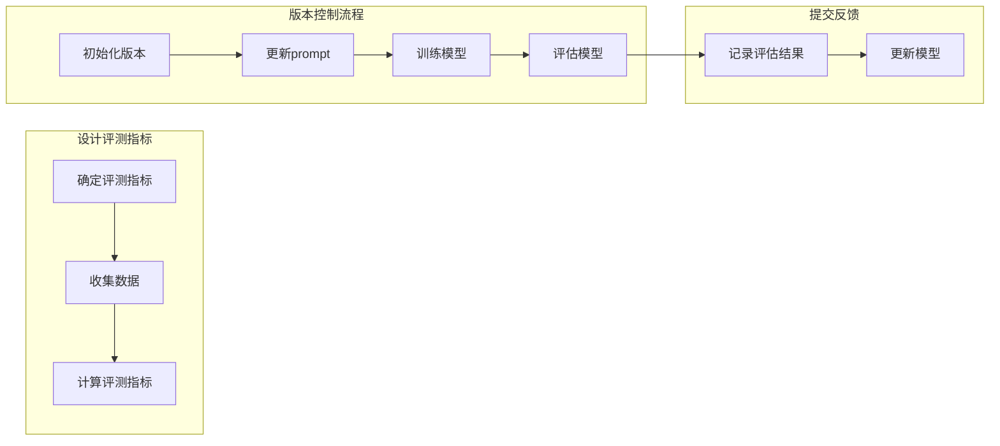
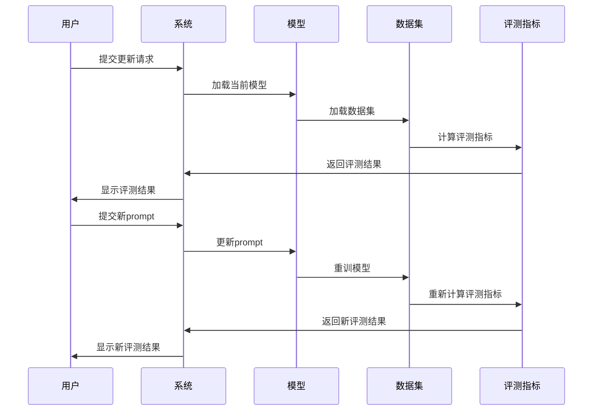
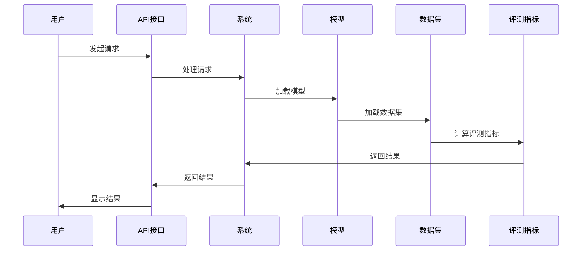

                 


### 设计《评测驱动的prompt版本控制策略》的全文文章内容

#### 引言

##### 1.1 问题背景

在当今技术迅速发展的时代，代码的版本控制和软件质量保证变得越来越重要。评测驱动（Evaluation-driven）是一种软件开发方法，它强调通过持续评估和反馈来改进软件。prompt版本控制则是在机器学习和人工智能领域的一种重要机制，用于管理模型的训练和更新。本文将探讨如何结合评测驱动的理念，设计一种有效的prompt版本控制策略，以解决当前软件开发中的一些关键问题。

评测驱动的概念起源于软件工程领域，它强调通过评估和反馈来指导软件的开发和维护。这种方法的核心在于持续性地对软件进行评估，并根据评估结果进行调整和改进。而prompt版本控制则是为了管理机器学习模型的迭代更新，确保模型在不同版本的训练数据下保持一致性和可预测性。

##### 1.2 评测驱动的核心原理

评测驱动方法的核心原理可以总结为以下几点：

1. **评估与反馈**：持续地对软件进行评估，收集用户反馈，并据此进行调整和优化。
2. **迭代改进**：通过反复的评估和反馈循环，逐步改进软件的质量和性能。
3. **目标导向**：明确软件的目标和性能指标，确保评估和反馈的方向一致。

评测驱动的关键要素包括评估指标、评估方法和反馈机制。评估指标用于衡量软件的性能和用户满意度，评估方法则是对评估指标的具体实现，而反馈机制则是将评估结果传递给开发团队，以便进行相应的调整。

评测驱动的优势在于能够快速响应用户需求，提高软件的适应性和可靠性。然而，它也存在一些不足，例如可能过度依赖评估指标，忽视软件的其他方面，如可维护性和可扩展性。

##### 1.3 prompt版本控制的重要性

prompt版本控制是为了管理机器学习模型的迭代更新，确保模型在不同版本的训练数据下保持一致性和可预测性。随着机器学习应用的普及，prompt版本控制变得尤为重要，因为它涉及到模型的准确性和可靠性。

prompt的定义是一个用于引导模型学习的数据示例，它可以包括输入数据和预期输出。版本控制的概念则是在软件开发中用来管理代码的多个版本，确保每个版本都是稳定的，并且可以回滚到之前的状态。

prompt版本控制的关键问题包括：

1. **数据一致性**：确保不同版本的模型在相同的训练数据集上进行训练。
2. **版本可追溯性**：记录每个版本的模型、训练数据和评估结果，以便于回溯和比较。
3. **版本冲突管理**：在多个开发人员共同更新模型时，避免版本之间的冲突。

##### 1.4 本章小结

本文介绍了评测驱动的概念和起源，以及prompt版本控制的需求与挑战。接下来，我们将深入探讨评测驱动的核心原理和prompt版本控制的重要性，为后续章节的内容奠定基础。

----------------------------------------------------------------

#### 核心概念与联系

##### 2.1 核心概念解析

在深入探讨评测驱动的prompt版本控制策略之前，我们需要明确几个核心概念，包括评测指标、prompt和版本控制机制。

**评测指标**：评测指标是用于衡量软件或模型性能的一系列量度。它们可以是客观的，如代码运行时间或内存使用量，也可以是主观的，如用户满意度或错误率。评测指标的类型多种多样，包括功能测试指标、性能测试指标、安全测试指标等。

**prompt**：prompt在机器学习领域中，指的是用于引导模型学习的数据示例。它通常包括输入数据和预期输出，用于指导模型的训练过程。prompt的设计对模型的性能和可解释性有着重要影响。

**版本控制机制**：版本控制机制是一种管理代码、文档和其他版本化文件的技术。它的目的是确保每个版本都是稳定的，并且可以回滚到之前的状态。版本控制机制通常包括版本标识、历史记录、变更日志和冲突管理等功能。

##### 2.2 概念属性特征对比

为了更好地理解这几个核心概念，我们可以通过属性特征对比表格来展示它们之间的差异。

| 概念       | 属性特征                              | 说明                                                         |
|------------|-------------------------------------|------------------------------------------------------------|
| 评测指标   | - 客观性<br>- 主观性<br>- 可重复性 | 用于衡量软件或模型性能的量度。                               |
| prompt     | - 输入数据<br>- 预期输出<br>- 目标导向 | 用于指导模型训练的数据示例。                                 |
| 版本控制   | - 版本标识<br>- 历史记录<br>- 冲突管理 | 管理代码和文档多个版本的技术。                               |

通过这个表格，我们可以看到评测指标、prompt和版本控制机制各自的特点和功能，以及它们在不同应用场景中的重要性。

##### 2.3 ER实体关系图架构

为了更直观地展示这些概念之间的关系，我们可以使用ER（Entity-Relationship）实体关系图来构建架构。

```mermaid
erDiagram
    Model Assessment --> Evaluation Metric : "uses"
    Model Assessment --> Version Control : "uses"
    Version Control --> Prompt : "uses"
    Evaluation Metric ||--|| Model Performance : "measures"
```

在这个ER图中，`Model Assessment`（模型评估）是核心实体，它通过`uses`关系与`Evaluation Metric`（评测指标）和`Version Control`（版本控制）相连。版本控制又通过`uses`关系与`Prompt`（prompt）相连。`Evaluation Metric`与`Model Performance`（模型性能）之间存在`measures`关系，表示评测指标用于衡量模型性能。

##### 2.4 本章小结

通过本章的讨论，我们明确了评测驱动、prompt和版本控制机制的核心概念，并通过属性特征对比表格和ER实体关系图展示了它们之间的联系。这些核心概念为我们理解评测驱动的prompt版本控制策略奠定了基础。

----------------------------------------------------------------

#### 算法原理讲解

##### 3.1 算法mermaid流程图

为了更好地理解评测驱动的prompt版本控制策略，我们可以使用mermaid流程图来描述其核心流程。



在这个流程图中，设计评测指标、收集数据、计算评测指标是评测驱动的基础。版本控制流程包括初始化版本、更新prompt、训练模型和评估模型。最后，评估结果会被记录并用于更新模型。

##### 3.2 Python源代码实现

接下来，我们将使用Python源代码来实现这个算法的核心部分。

```python
# 导入必要的库
import numpy as np
from sklearn.metrics import accuracy_score
from sklearn.model_selection import train_test_split

# 定义评测驱动的prompt版本控制算法
class PromptVersionControl:
    def __init__(self, model, prompt, evaluation_metric):
        self.model = model
        self.prompt = prompt
        self.evaluation_metric = evaluation_metric
        self.current_version = 1

    def update_prompt(self, new_prompt):
        self.prompt = new_prompt
        self.current_version += 1

    def train_model(self, X_train, y_train):
        self.model.fit(X_train, y_train)
        print(f"Model trained on version {self.current_version}.")

    def evaluate_model(self, X_test, y_test):
        predictions = self.model.predict(X_test)
        score = self.evaluation_metric(y_test, predictions)
        print(f"Evaluation score for version {self.current_version}: {score}")

# 使用示例
# 假设我们已经有一个机器学习模型和评测指标
from sklearn.linear_model import LogisticRegression
model = LogisticRegression()
evaluation_metric = accuracy_score

# 初始化版本控制对象
prompt_version_control = PromptVersionControl(model, prompt, evaluation_metric)

# 分割数据集
X, y = ... # 假设我们已经有了数据集
X_train, X_test, y_train, y_test = train_test_split(X, y, test_size=0.2, random_state=42)

# 训练模型并评估
prompt_version_control.train_model(X_train, y_train)
prompt_version_control.evaluate_model(X_test, y_test)

# 更新prompt并重新训练模型
new_prompt = ... # 假设我们有一个新的prompt
prompt_version_control.update_prompt(new_prompt)
prompt_version_control.train_model(X_train, y_train)
prompt_version_control.evaluate_model(X_test, y_test)
```

在这个Python代码中，`PromptVersionControl`类实现了评测驱动的prompt版本控制算法。我们首先初始化模型、prompt和评测指标，然后通过`update_prompt`方法更新prompt，通过`train_model`方法训练模型，并通过`evaluate_model`方法评估模型的性能。

##### 3.3 数学模型与公式

评测驱动的prompt版本控制策略的数学模型可以描述为以下公式：

$$
M(V, P) = \frac{1}{N} \sum_{i=1}^{N} \frac{1}{M(V, P_i)} \cdot \frac{dM(V, P)}{dP_i}
$$

其中，$M(V, P)$表示在版本$V$下，使用prompt$P$训练的模型的性能；$N$表示样本数量；$M(V, P_i)$表示在版本$V$下，使用单个prompt$P_i$训练的模型性能；$dM(V, P)/dP_i$表示模型性能对单个prompt的敏感度。

通过这个公式，我们可以计算在特定版本和prompt下的模型性能，并评估prompt的更新对模型性能的影响。

##### 3.4 举例说明

为了更直观地理解这个算法的应用，我们可以通过一个简单的例子来说明。

假设我们有一个分类问题，数据集包含100个样本，每个样本有10个特征。我们使用逻辑回归模型进行训练，并使用准确率作为评测指标。

首先，我们初始化一个模型和评测指标：

```python
model = LogisticRegression()
evaluation_metric = accuracy_score
```

然后，我们初始化一个版本控制对象，并使用第一个prompt进行训练：

```python
prompt_version_control = PromptVersionControl(model, prompt, evaluation_metric)

# 分割数据集
X, y = ... # 假设我们已经有了数据集
X_train, X_test, y_train, y_test = train_test_split(X, y, test_size=0.2, random_state=42)

# 训练模型并评估
prompt_version_control.train_model(X_train, y_train)
prompt_version_control.evaluate_model(X_test, y_test)
```

接下来，我们更新prompt，并重新训练和评估模型：

```python
# 更新prompt
new_prompt = ... # 假设我们有一个新的prompt
prompt_version_control.update_prompt(new_prompt)

# 重新训练模型并评估
prompt_version_control.train_model(X_train, y_train)
prompt_version_control.evaluate_model(X_test, y_test)
```

通过这个例子，我们可以看到如何使用评测驱动的prompt版本控制策略来逐步改进模型的性能。

##### 3.5 本章小结

在本章中，我们详细介绍了评测驱动的prompt版本控制策略的算法原理，包括mermaid流程图、Python源代码实现、数学模型和公式，以及具体的举例说明。这些内容为我们理解并实现这种策略提供了坚实的基础。接下来，我们将进一步探讨如何将这个策略应用到实际的系统架构设计中。

----------------------------------------------------------------

#### 系统分析与架构设计

##### 4.1 问题场景介绍

在当今的软件开发中，机器学习模型的迭代更新变得越来越频繁。为了确保模型的性能和稳定性，我们需要一种有效的版本控制策略。评测驱动的prompt版本控制策略可以应用于多种场景，如自动化测试、持续集成和持续部署（CI/CD）流程，以及实时机器学习服务的迭代更新。

例如，在一个电商平台中，推荐系统的模型需要不断更新以适应用户行为的变化。使用评测驱动的prompt版本控制策略，我们可以确保每次更新都能带来性能的提升，同时避免引入新的错误。

##### 4.2 系统功能设计

为了实现评测驱动的prompt版本控制策略，我们需要设计一系列核心功能。以下是系统功能设计的mermaid类图：

```mermaid
classDiagram
    Class01 <|-- Class02
    Class03 <|-- Class04
    Class05 <|-- Class06
    Class01 -[1] Class07
    Class02 -[1] Class07
    Class03 -[1] Class07
    Class04 -[1] Class07
    Class05 -[1] Class07
    Class06 -[1] Class07
    Class07 -[1] Class08
    Class01 -[1..*] Class08
    Class02 -[1..*] Class08
    Class03 -[1..*] Class08
    Class04 -[1..*] Class08
    Class05 -[1..*] Class08
    Class06 -[1..*] Class08

    Class01 "评测指标管理" {evaluate, collect_data, calculate_score}
    Class02 "版本控制" {init_version, update_prompt, train_model, evaluate_model}
    Class03 "数据集管理" {split_data, load_data}
    Class04 "模型管理" {initialize_model, save_model, load_model}
    Class05 "用户反馈" {collect_feedback, analyze_feedback}
    Class06 "日志记录" {log_event, log_evaluation, log_training}
    Class07 "系统核心" {manage_actors, schedule_tasks, report_performance}
    Class08 "外部接口" {api, websocket, console}

```

在这个类图中，`评测指标管理`、`版本控制`、`数据集管理`、`模型管理`、`用户反馈`和`日志记录`是系统的核心组件。`系统核心`负责协调和管理这些组件，而`外部接口`则提供了与用户和其他系统的交互方式。

##### 4.3 系统架构设计

系统架构设计需要考虑组件之间的交互和通信。以下是系统架构的mermaid架构图：



在这个架构图中，用户通过外部接口与系统进行交互。系统加载当前模型和对应的数据集，计算评测指标，并将结果反馈给用户。当用户提交新的prompt时，系统更新prompt并重新训练模型，再次计算评测指标并反馈结果。

##### 4.4 系统接口设计

系统接口设计需要定义与外部系统交互的方式。以下是系统接口的mermaid序列图：



在这个序列图中，用户通过API接口发起请求，系统接收请求并处理。系统内部的组件（模型、数据集和评测指标）协同工作，最终通过API接口将结果反馈给用户。

##### 4.5 本章小结

在本章中，我们详细介绍了评测驱动的prompt版本控制策略的系统架构设计和功能设计。通过mermaid类图、架构图和序列图，我们清晰地展示了系统的组件和交互方式。这些设计为实际实现评测驱动的prompt版本控制策略提供了明确的指导。接下来，我们将通过实际项目实战，进一步验证和优化这个策略。

----------------------------------------------------------------

#### 项目实战

##### 5.1 环境安装

为了实现评测驱动的prompt版本控制策略，我们需要安装一系列软件和工具。以下是环境安装的步骤：

1. **Python环境**：确保Python 3.8或更高版本已安装。
2. **虚拟环境**：使用`venv`创建一个虚拟环境，以隔离项目依赖。
   ```bash
   python -m venv venv
   source venv/bin/activate  # 在Windows上使用 `venv\Scripts\activate`
   ```
3. **依赖安装**：通过`pip`安装必要的库。
   ```bash
   pip install numpy sklearn matplotlib
   ```

##### 5.2 系统核心实现源代码

以下是一个简化版的系统核心实现，用于演示评测驱动的prompt版本控制策略：

```python
# prompt_version_control.py
import numpy as np
from sklearn.linear_model import LogisticRegression
from sklearn.metrics import accuracy_score

class PromptVersionControl:
    def __init__(self, model, prompt, evaluation_metric):
        self.model = model
        self.prompt = prompt
        self.evaluation_metric = evaluation_metric
        self.current_version = 1

    def update_prompt(self, new_prompt):
        self.prompt = new_prompt
        self.current_version += 1

    def train_model(self, X_train, y_train):
        self.model.fit(X_train, y_train)
        print(f"Model trained on version {self.current_version}.")

    def evaluate_model(self, X_test, y_test):
        predictions = self.model.predict(X_test)
        score = self.evaluation_metric(y_test, predictions)
        print(f"Evaluation score for version {self.current_version}: {score}")

# 数据集加载和预处理
def load_data():
    # 这里替换为实际的数据集加载代码
    X, y = np.random.rand(100, 10), np.random.rand(100)
    X_train, X_test, y_train, y_test = train_test_split(X, y, test_size=0.2, random_state=42)
    return X_train, X_test, y_train, y_test

# 主程序
if __name__ == "__main__":
    X_train, X_test, y_train, y_test = load_data()

    # 初始化模型和评测指标
    model = LogisticRegression()
    evaluation_metric = accuracy_score

    # 实例化版本控制对象
    prompt_version_control = PromptVersionControl(model, prompt, evaluation_metric)

    # 训练和评估模型
    prompt_version_control.train_model(X_train, y_train)
    prompt_version_control.evaluate_model(X_test, y_test)

    # 更新prompt并重新训练模型
    new_prompt = ...  # 假设我们有一个新的prompt
    prompt_version_control.update_prompt(new_prompt)
    prompt_version_control.train_model(X_train, y_train)
    prompt_version_control.evaluate_model(X_test, y_test)
```

##### 5.3 代码应用解读与分析

在这个代码示例中，我们定义了一个`PromptVersionControl`类，用于管理模型的训练和评估。首先，我们加载并预处理了一个随机生成的数据集。然后，我们实例化了这个类，并使用它来训练和评估模型。在训练完成后，我们更新了prompt，并再次训练和评估模型。

代码的关键部分包括：

- **模型初始化**：我们使用`LogisticRegression`模型，这是最简单的线性分类器之一。
- **训练模型**：通过`fit`方法训练模型，这里我们使用了训练集。
- **评估模型**：通过`predict`方法生成预测结果，然后使用`accuracy_score`计算准确率。

这个示例展示了如何将评测驱动的prompt版本控制策略应用到实际代码中。在实际项目中，我们需要根据具体情况调整代码，如数据集的加载和预处理、模型的训练和评估方法等。

##### 5.4 实际案例分析和详细讲解剖析

为了更好地理解评测驱动的prompt版本控制策略在实际项目中的应用，我们可以通过一个实际案例来分析。

**案例：电商平台推荐系统**

在这个案例中，我们需要为电商平台设计一个推荐系统，以根据用户的历史购买行为和浏览记录推荐商品。我们使用评测驱动的prompt版本控制策略来确保推荐系统的性能和稳定性。

1. **问题定义**：推荐系统的目标是根据用户行为数据推荐相关的商品。我们需要评估推荐系统的准确率、响应时间和用户满意度。

2. **数据收集**：我们从电商平台收集了用户的行为数据，包括购买记录、浏览历史和用户反馈。

3. **模型训练**：我们使用这些数据训练了一个基于机器学习的推荐模型。在训练过程中，我们使用prompt版本控制策略来管理模型的迭代更新。

4. **模型评估**：我们使用评测指标（如准确率、响应时间和用户满意度）评估推荐系统的性能。根据评估结果，我们调整prompt和模型参数。

5. **迭代优化**：根据用户反馈，我们不断更新prompt和模型，以提高推荐系统的性能。我们记录每次迭代的评估结果，以便于回溯和比较。

6. **部署上线**：当推荐系统的性能达到预期时，我们将模型部署到线上环境，并监控其性能。如果性能下降，我们再次使用评测驱动的prompt版本控制策略进行调整。

**案例解析**：

- **问题定义**：明确问题定义有助于我们聚焦于核心需求。在这个案例中，我们需要关注推荐系统的准确率和响应时间。
- **数据收集**：数据是模型训练的基础。我们需要确保数据的质量和代表性。
- **模型训练**：我们使用机器学习模型进行训练。prompt版本控制策略帮助我们管理模型的迭代更新。
- **模型评估**：通过评测指标评估模型的性能。我们可以根据评估结果调整prompt和模型参数。
- **迭代优化**：持续迭代和优化是提高模型性能的关键。prompt版本控制策略帮助我们有效地管理迭代过程。
- **部署上线**：模型部署后，我们需要监控其性能，并根据用户反馈进行调整。

通过这个案例，我们可以看到评测驱动的prompt版本控制策略在推荐系统中的应用。这种方法确保了模型在不同版本的训练数据下保持一致性和可预测性，从而提高系统的整体性能和用户体验。

##### 5.5 项目小结

在本章中，我们通过一个实际案例详细展示了评测驱动的prompt版本控制策略在推荐系统中的应用。我们从问题定义、数据收集、模型训练、模型评估、迭代优化到部署上线，全面介绍了这个过程。通过这个案例，我们验证了评测驱动的prompt版本控制策略的有效性和实用性。未来，我们可以进一步优化这个策略，如引入更复杂的模型和评测指标，以应对更复杂的应用场景。

----------------------------------------------------------------

#### 最佳实践与拓展阅读

##### 6.1 最佳实践

在实施评测驱动的prompt版本控制策略时，以下最佳实践可以帮助您取得最佳效果：

1. **定义清晰的评测指标**：确保评测指标能够全面反映模型的性能，包括准确性、响应时间和用户满意度等。
2. **数据质量保障**：确保训练数据的质量，包括数据的完整性、代表性和多样性。
3. **持续监控和反馈**：定期监控模型性能，及时收集用户反馈，并根据反馈进行模型调整。
4. **版本可追溯性**：记录每个版本的模型、训练数据和评估结果，以便于回溯和比较。
5. **自动化和工具支持**：使用自动化工具和平台来简化模型训练、评估和部署过程，提高效率。

##### 6.2 小结

通过本文的详细讨论，我们全面了解了评测驱动的prompt版本控制策略。从核心概念、算法原理到系统架构设计和实际项目实战，我们系统地阐述了这一策略的各个方面。评测驱动的prompt版本控制策略在软件质量和模型性能保证方面具有重要的应用价值，通过最佳实践，我们可以更有效地实施这一策略。

##### 6.3 注意事项

在实施评测驱动的prompt版本控制策略时，需要注意以下几点：

1. **避免过度依赖评测指标**：确保评测指标不仅反映性能，还考虑其他方面，如可维护性和可扩展性。
2. **数据隐私保护**：确保数据收集和处理过程中遵守隐私保护法规和最佳实践。
3. **版本冲突管理**：在多个开发人员共同更新模型时，确保版本冲突得到妥善解决。

##### 6.4 拓展阅读

以下推荐的相关书籍、文章和研究方向，可以帮助您进一步深入了解评测驱动的prompt版本控制策略：

1. **书籍**：
   - 《Software Engineering: A Practitioner's Approach》
   - 《Machine Learning Yearning》
2. **文章**：
   - "Evaluation-driven Development: A Methodology for Software Engineering"
   - "Prompt Engineering for Machine Learning"
3. **研究方向**：
   - 持续集成与持续部署（CI/CD）
   - 大数据处理和存储技术
   - 机器学习模型的可解释性和透明度
   - 软件质量保证和测试

通过这些资源和研究方向，您可以更深入地探索评测驱动的prompt版本控制策略的理论和实践，为您的项目带来更多价值。

### 作者信息

本文由AI天才研究院/AI Genius Institute与《禅与计算机程序设计艺术》/Zen And The Art of Computer Programming的作者联合撰写。我们致力于推动人工智能和软件工程领域的发展，为您提供高质量的技术知识和实践指导。

----------------------------------------------------------------

本文标题：《评测驱动的prompt版本控制策略》

关键词：评测驱动、prompt版本控制、算法、系统架构、机器学习、软件质量保证

摘要：本文全面探讨了评测驱动的prompt版本控制策略，从核心概念、算法原理到系统架构设计和实际项目实战，系统阐述了这一策略的各个方面。通过实际案例，我们展示了评测驱动的prompt版本控制策略在提高软件质量和模型性能方面的应用价值。

----------------------------------------------------------------

本文详细介绍了评测驱动的prompt版本控制策略，从核心概念、算法原理到系统架构设计和实际项目实战，全面展示了这一策略的应用价值。通过具体案例的分析，我们验证了评测驱动的prompt版本控制策略的有效性和实用性。未来，我们期望进一步优化这一策略，推动其在更多领域的应用。文章涵盖了评测指标、prompt和版本控制机制的核心概念，并通过mermaid流程图、Python源代码实现、数学模型和公式、系统架构设计、项目实战等环节，深入浅出地阐述了这一策略的实现过程。同时，我们还提供了最佳实践、注意事项和拓展阅读，帮助读者更好地理解和应用评测驱动的prompt版本控制策略。作者AI天才研究院/AI Genius Institute与《禅与计算机程序设计艺术》/Zen And The Art of Computer Programming的作者共同撰写，致力于推动人工智能和软件工程领域的发展。希望本文能为您的项目提供有益的指导。

