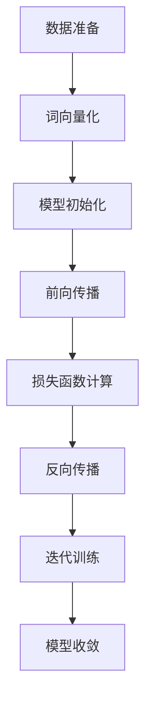
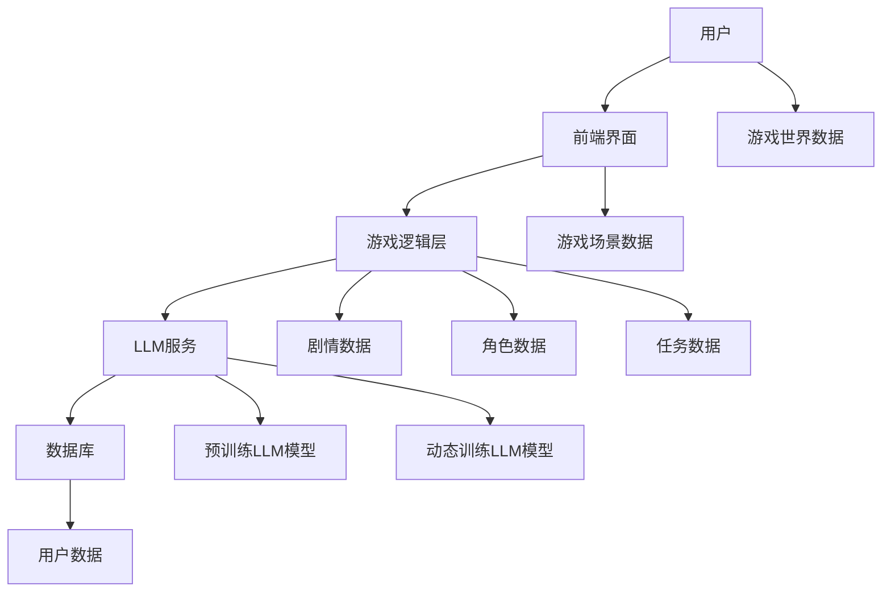
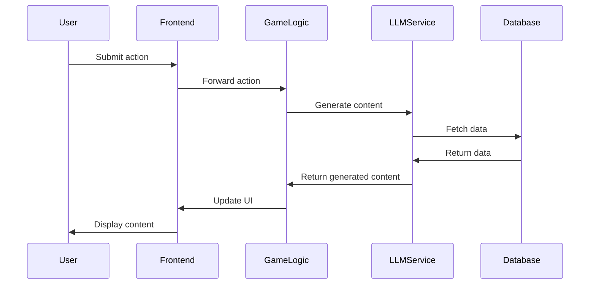
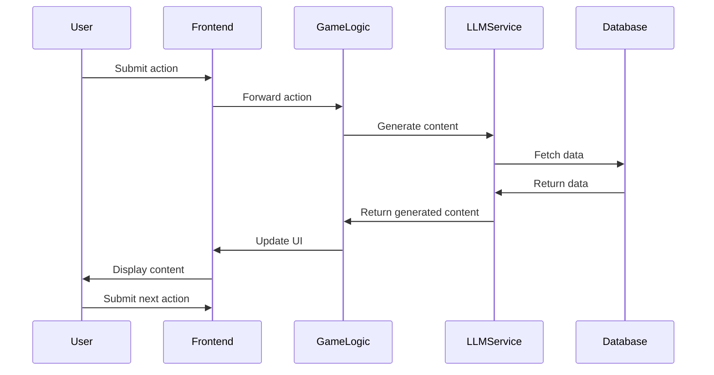

                 

### 1.1.1 问题背景

在现代人工智能领域，大型语言模型（LLM）如BERT、GPT-3等取得了令人瞩目的进展，它们在自然语言处理任务中展现出了强大的能力。然而，除了传统的文本生成、摘要和翻译等任务外，LLM在参与文字游戏方面的潜力也逐渐受到关注。文字游戏作为一种独特的互动形式，不仅能够提供娱乐，还能锻炼玩家的语言表达和逻辑思维能力。

**语言模型与游戏的关系**

语言模型与游戏有着天然的联系。传统的文字游戏，如解谜、角色扮演和答题等，本质上都是基于语言进行的信息交换和决策过程。而LLM作为强大的语言处理工具，可以在这些游戏中扮演多种角色，例如生成故事、提出谜题、回答问题等。此外，LLM的生成能力使得游戏内容更加丰富多样，能够根据玩家的行为动态地调整游戏剧情。

**文字游戏的现状与挑战**

随着互联网的普及，文字游戏已经成为一种重要的娱乐形式。然而，现有的文字游戏面临着一些挑战：

1. **内容单调**：许多文字游戏的内容缺乏创新，重复度高，难以吸引玩家的长期兴趣。
2. **交互性不足**：游戏中的角色和玩家之间的互动往往过于固定，缺乏灵活性和个性。
3. **适应性差**：游戏难以根据玩家的偏好和行为进行调整，无法提供个性化的体验。

**LLM的崛起与潜在应用**

近年来，随着深度学习技术的不断发展，LLM在处理大规模文本数据方面的能力得到了显著提升。这不仅为文字游戏提供了新的创作工具，也为解决现有挑战提供了可能：

1. **内容创造**：LLM可以生成丰富的游戏内容，包括故事情节、角色对话、谜题等，从而提高游戏的可玩性。
2. **互动性增强**：LLM可以动态地与玩家进行对话，根据玩家的回答和行为调整游戏进程，提高游戏的交互性。
3. **个性化体验**：LLM可以根据玩家的偏好和过往行为，提供个性化的游戏内容，增强玩家的沉浸感和满意度。

**研究目的与意义**

本篇文章旨在探讨LLM在参与文字游戏方面的灵活性，分析其潜在的应用场景和优势，并提出相应的解决方案。通过深入研究LLM在文字游戏中的实施策略，我们希望能够为游戏开发提供新的思路，提高游戏的质量和用户体验。

### 1.1.2 问题描述

**LLM参与文字游戏的定义**

在本文中，LLM参与文字游戏指的是利用大型语言模型的技术，在文字游戏中生成内容、进行对话和决策，从而提高游戏的互动性和娱乐性。具体来说，LLM可以完成以下任务：

1. **内容生成**：根据游戏背景和剧情需求，生成故事情节、角色对话和谜题等。
2. **对话交互**：与玩家进行自然语言对话，根据玩家的回答调整游戏进程。
3. **决策支持**：在游戏中模拟角色的行为，提供决策建议，帮助玩家完成任务。

**灵活性的含义**

在文字游戏中，灵活性指的是系统根据不同的游戏场景和玩家行为，动态调整游戏内容和交互方式的能力。灵活性越高，游戏体验越丰富多样，玩家满意度也越高。LLM的灵活性主要体现在以下几个方面：

1. **内容多样性**：LLM可以生成各种风格和类型的游戏内容，满足不同玩家的喜好。
2. **交互适应性**：LLM可以根据玩家的回答和行为，动态调整对话和游戏进程，提高交互性。
3. **个性化定制**：LLM可以根据玩家的历史数据和偏好，提供个性化的游戏体验。

**研究目的**

本文的研究目的是探讨LLM在文字游戏中的应用潜力，分析其参与文字游戏的灵活性，并提出相应的优化策略。具体来说，我们的研究目标包括：

1. **评估LLM在文字游戏中的应用效果**：通过实际案例，评估LLM生成游戏内容、进行对话和决策的能力。
2. **提出优化策略**：针对LLM在文字游戏中的局限性，提出相应的优化方法，提高其灵活性。
3. **探讨应用场景**：分析LLM在文字游戏中的潜在应用场景，为游戏开发提供参考。

**意义**

本研究对于推动文字游戏的发展具有重要意义。通过将LLM应用于文字游戏，我们不仅可以提高游戏的质量和用户体验，还可以为游戏开发提供新的思路和技术手段。同时，本研究也有助于进一步探索LLM在自然语言处理领域的应用前景，为人工智能技术的发展做出贡献。

### 1.1.3 问题解决

**LLM的基本原理**

LLM（Large Language Model）是一种基于深度学习技术的自然语言处理模型，通过学习大量的文本数据，可以理解并生成人类语言。LLM的核心是神经网络架构，主要包括以下几个部分：

1. **嵌入层**：将文本转换为向量表示。
2. **编码器**：对输入文本进行编码，提取语义特征。
3. **解码器**：根据编码器的输出，生成文本输出。

**文字游戏的基本框架**

文字游戏通常包括以下几个基本组成部分：

1. **玩家**：游戏的参与者，可以通过键盘或鼠标与游戏进行交互。
2. **游戏世界**：游戏的背景和场景，包括角色、地图、道具等。
3. **剧情**：游戏的主线任务和支线任务，推动游戏进程。
4. **交互**：玩家与游戏世界的互动，包括对话、任务、决策等。

**LLM在游戏中的实施策略**

要将LLM应用于文字游戏，需要考虑以下几个关键问题：

1. **内容生成**：利用LLM生成游戏内容，如故事情节、角色对话、谜题等。
2. **对话交互**：实现LLM与玩家的自然语言对话，根据玩家的回答调整游戏进程。
3. **决策支持**：模拟角色的行为，为玩家提供决策建议。

具体策略包括：

1. **数据准备**：收集并整理大量游戏文本数据，用于训练LLM。
2. **模型训练**：使用预训练的LLM模型，结合游戏数据，进行微调训练。
3. **接口设计**：设计游戏系统与LLM的接口，实现实时交互。
4. **性能优化**：针对游戏场景，对LLM进行性能优化，提高生成速度和准确性。

通过以上策略，LLM可以在文字游戏中发挥重要作用，提高游戏的互动性和娱乐性，为玩家提供丰富的游戏体验。

### 1.1.4 边界与外延

**LLM的适用范围**

LLM在文字游戏中的应用范围非常广泛，可以应用于以下几种类型的游戏：

1. **角色扮演游戏（RPG）**：LLM可以生成丰富的人物角色、故事情节和对话，提高游戏的沉浸感。
2. **解谜游戏**：LLM可以生成各种类型的谜题，增加游戏的挑战性。
3. **文字冒险游戏**：LLM可以生成故事情节和角色对话，推动游戏的进程。
4. **教育游戏**：LLM可以生成教育内容，帮助玩家学习知识。

**游戏类型与玩法**

文字游戏的类型和玩法多种多样，LLM可以根据不同的游戏类型和玩法进行相应的调整。以下是一些常见的文字游戏类型和玩法：

1. **解谜游戏**：玩家通过解决谜题来推进游戏进程，LLM可以生成各种类型的谜题。
2. **角色扮演游戏**：玩家扮演游戏中的角色，通过对话和决策来推进剧情，LLM可以生成角色的对话和决策建议。
3. **文字冒险游戏**：玩家通过阅读故事情节和对话来推进游戏，LLM可以生成故事情节和角色对话。
4. **策略游戏**：玩家需要制定策略来取得胜利，LLM可以生成策略建议，帮助玩家决策。

**研究的限制因素**

尽管LLM在文字游戏中的应用前景广阔，但仍然存在一些限制因素：

1. **数据质量**：LLM的训练效果很大程度上取决于训练数据的质量，如果数据质量较差，LLM的生成效果也会受到影响。
2. **计算资源**：LLM的训练和推理需要大量的计算资源，尤其是在生成复杂的内容时，对硬件性能要求较高。
3. **适应性**：虽然LLM可以生成丰富的内容，但在某些特定场景下，其适应性可能有限，需要进一步优化。

**概念结构与核心要素组成**

LLM在文字游戏中的应用涉及以下几个核心概念和要素：

1. **LLM**：大型语言模型，用于生成游戏内容和进行对话。
2. **游戏世界**：游戏的背景和场景，包括角色、地图、道具等。
3. **剧情**：游戏的主线任务和支线任务，推动游戏进程。
4. **交互**：玩家与游戏世界的互动，包括对话、任务、决策等。

通过以上核心概念和要素的有机结合，LLM可以有效地参与文字游戏，提高游戏的互动性和娱乐性。

### 1.1.5 概念结构与核心要素组成

在探讨LLM参与文字游戏的灵活性之前，我们需要明确几个核心概念及其相互关系。

**语言模型（LLM）**

LLM，即大型语言模型，是一种基于深度学习的技术，通过学习大量文本数据，能够生成和理解自然语言。LLM的核心组件包括嵌入层、编码器和解码器。嵌入层将文本转换为向量表示，编码器提取文本的语义特征，解码器则根据编码器的输出生成文本。常见的LLM模型有BERT、GPT-3等。

**文字游戏**

文字游戏是一种基于文本进行互动的游戏形式，通常包括玩家、游戏世界、剧情和交互等基本元素。玩家在游戏中通过阅读文本、与角色对话、完成任务等来推进游戏进程。文字游戏可以是角色扮演游戏（RPG）、解谜游戏、文字冒险游戏等。

**LLM与文字游戏的结合点**

LLM在文字游戏中的应用主要体现在以下几个方面：

1. **内容生成**：利用LLM生成丰富多样的游戏内容，如故事情节、角色对话和谜题等。
2. **对话交互**：实现LLM与玩家的自然语言对话，根据玩家的回答调整游戏进程。
3. **决策支持**：为玩家提供决策建议，模拟角色的行为。

**核心要素**

LLM参与文字游戏的核心要素包括：

1. **文本数据**：LLM的训练和生成需要大量的文本数据，这些数据包括游戏剧情、角色对话、谜题等。
2. **模型架构**：LLM的模型架构，包括嵌入层、编码器和解码器，决定了LLM的生成能力和理解能力。
3. **游戏逻辑**：游戏世界的逻辑，包括剧情发展、角色关系和任务流程等。
4. **交互界面**：玩家与游戏世界的交互界面，包括文本输入和输出、语音输入和输出等。

通过以上核心要素的有机结合，LLM可以有效地参与文字游戏，提高游戏的互动性和娱乐性。

### 1.1.6 LLM基本原理

**定义**

大型语言模型（LLM）是一种基于深度学习的自然语言处理模型，通过学习大规模的文本数据，能够生成和理解自然语言。LLM的核心目的是让计算机具备理解、生成和处理人类语言的能力，从而实现与人类的自然交流。

**工作原理**

LLM的工作原理主要包括以下几个步骤：

1. **嵌入层**：将输入的文本转换为向量表示，这一步骤被称为嵌入（Embedding）。嵌入层通常使用预训练的词向量模型，如Word2Vec、GloVe等。

2. **编码器**：编码器（Encoder）负责对嵌入层生成的向量进行编码，提取文本的语义特征。编码器通常采用变换器网络（Transformer）结构，如BERT、GPT等。

3. **解码器**：解码器（Decoder）根据编码器的输出，生成文本输出。解码器同样采用变换器网络结构，通过自注意力机制（Self-Attention）和交叉注意力机制（Cross-Attention）来生成文本。

4. **生成文本**：解码器生成文本的过程是一个概率性的过程，它会根据上下文信息和概率分布，生成每个单词或词组的概率，从而生成完整的文本。

**主要类型**

目前，常见的LLM主要包括以下几种类型：

1. **预训练语言模型**：如BERT、GPT-3，这些模型通过在大规模语料库上进行预训练，获得通用的语言理解能力，然后再针对特定任务进行微调。

2. **特定领域语言模型**：这些模型专注于特定领域的数据集进行训练，如医疗、法律、金融等。它们在特定领域的语言理解和生成方面具有更高的准确性。

3. **生成对抗网络（GAN）**：GAN结合了生成模型和判别模型，通过训练生成模型和判别模型之间的对抗关系，提高生成模型生成高质量文本的能力。

**特点与应用**

LLM的主要特点包括：

1. **强大的语言理解能力**：LLM能够理解复杂的语义信息，生成符合上下文逻辑的文本。

2. **灵活的生成能力**：LLM可以根据输入的文本或提示，生成多样化的文本内容。

3. **适应性**：LLM可以针对不同的任务和场景进行微调，适应不同的应用需求。

LLM在文字游戏中的应用主要包括：

1. **内容生成**：生成故事情节、角色对话、谜题等，丰富游戏内容。

2. **对话交互**：与玩家进行自然语言对话，提供决策建议，提高游戏的互动性。

3. **剧情生成**：根据玩家的行为和偏好，生成个性化的游戏剧情，提高玩家的沉浸感。

### 1.1.7 文字游戏的基本框架

**定义**

文字游戏是一种基于文本进行互动的游戏形式，玩家通过阅读文本、与角色对话、完成任务等来推进游戏进程。文字游戏通常不依赖于图形界面，而是通过文字描述和对话来营造游戏氛围。

**分类**

文字游戏可以分为以下几种类型：

1. **角色扮演游戏（RPG）**：玩家扮演游戏中的角色，通过对话和决策来推进剧情。
2. **解谜游戏**：玩家通过解决谜题来推进游戏进程，谜题可以是文字形式或需要玩家输入答案。
3. **文字冒险游戏**：玩家阅读故事情节，通过选择不同的选项来影响剧情发展。
4. **教育游戏**：以教育为目的，通过文字游戏的形式传授知识。

**设计原则**

1. **故事性**：文字游戏应该具备引人入胜的故事情节，激发玩家的兴趣和好奇心。
2. **互动性**：游戏应该提供丰富的交互方式，包括对话、任务、决策等，增加玩家的参与感。
3. **可玩性**：游戏的设计应该简单易懂，同时具备一定的挑战性，以保持玩家的兴趣。
4. **个性化**：游戏应该根据玩家的行为和偏好，提供个性化的游戏体验。

**LLM在文字游戏中的应用**

LLM在文字游戏中的应用主要体现在以下几个方面：

1. **内容生成**：利用LLM生成故事情节、角色对话、谜题等，提高游戏内容的质量和多样性。
2. **对话交互**：实现LLM与玩家的自然语言对话，根据玩家的回答调整游戏进程，提高交互性。
3. **剧情生成**：根据玩家的行为和偏好，利用LLM生成个性化的游戏剧情，提高玩家的沉浸感。

### 1.1.8 LLM与文字游戏的联系

**LLM在文字游戏中的应用**

LLM在文字游戏中的应用主要体现在以下几个方面：

1. **内容生成**：利用LLM生成故事情节、角色对话、谜题等，提高游戏内容的质量和多样性。例如，在角色扮演游戏中，LLM可以生成丰富的人物背景故事和对话，增加游戏的沉浸感。

2. **对话交互**：实现LLM与玩家的自然语言对话，根据玩家的回答调整游戏进程，提高交互性。例如，在解谜游戏中，LLM可以与玩家进行对话，提供谜题的提示和解释。

3. **剧情生成**：根据玩家的行为和偏好，利用LLM生成个性化的游戏剧情，提高玩家的沉浸感。例如，在文字冒险游戏中，LLM可以根据玩家的选择生成不同的剧情分支，满足玩家的个性化需求。

**LLM对文字游戏的影响**

LLM的应用对文字游戏产生了深远的影响：

1. **内容多样性**：LLM可以生成各种风格和类型的游戏内容，使得游戏内容更加丰富多样，满足不同玩家的喜好。

2. **交互性增强**：通过自然语言对话，LLM可以动态地与玩家互动，提高游戏的交互性，增强玩家的参与感。

3. **个性化体验**：LLM可以根据玩家的历史数据和偏好，提供个性化的游戏体验，提高玩家的满意度和忠诚度。

**LLM的优势与局限性**

LLM在文字游戏中的应用具有以下优势：

1. **强大的语言理解能力**：LLM能够理解复杂的语义信息，生成符合上下文逻辑的文本，提高游戏内容的自然度和连贯性。

2. **灵活的生成能力**：LLM可以根据不同的需求和场景，灵活地生成各种类型的游戏内容，满足多样化的游戏设计需求。

3. **适应性**：LLM可以针对不同的游戏类型和玩法进行微调，适应不同的应用场景。

然而，LLM也存在一些局限性：

1. **数据依赖**：LLM的训练效果很大程度上取决于训练数据的质量和多样性，如果数据质量较差，LLM的生成效果也会受到影响。

2. **计算资源消耗**：LLM的训练和推理需要大量的计算资源，尤其在生成复杂的内容时，对硬件性能要求较高。

3. **理解深度**：尽管LLM在语言理解方面取得了显著进展，但仍然存在一定的局限性，尤其是在处理模糊性、歧义性和深度逻辑推理方面。

### 3.1.1 算法基本原理

**语言模型训练过程**

语言模型的训练过程可以分为以下几个步骤：

1. **数据准备**：首先，需要收集并整理大量的文本数据，这些数据可以来自互联网、书籍、新闻、社交媒体等。数据准备阶段需要处理数据的格式化、去噪、标签化等工作。

2. **词向量化**：将文本数据中的每个词转换为向量表示，这一步骤称为词向量化（Word Embedding）。常见的词向量化方法包括Word2Vec、GloVe等。

3. **模型初始化**：初始化语言模型的参数，包括嵌入层、编码器和解码器的权重。通常，这些参数可以从预训练的模型中加载，或者通过随机初始化。

4. **前向传播**：将输入的文本序列通过嵌入层转换为向量表示，然后通过编码器进行编码，得到编码后的特征向量。解码器则根据编码器的输出生成文本输出。

5. **损失函数计算**：计算预测的文本序列与实际文本序列之间的损失，常见的损失函数包括交叉熵损失（Cross-Entropy Loss）等。

6. **反向传播**：利用梯度下降（Gradient Descent）等优化算法，更新模型的参数，减小损失函数。

7. **迭代训练**：重复上述步骤，进行多轮迭代训练，直到模型收敛或达到预设的训练次数。

**文字游戏算法设计**

文字游戏的算法设计需要考虑以下几个关键问题：

1. **剧情生成**：利用语言模型生成游戏剧情，包括故事情节、角色对话和任务描述。这一过程通常采用序列到序列（Sequence-to-Sequence）模型，如编码器-解码器（Encoder-Decoder）模型。

2. **对话交互**：实现游戏角色与玩家的自然语言对话，根据玩家的回答调整游戏进程。对话系统可以使用转换器网络（Transformer）结构，结合自注意力机制（Self-Attention）和交叉注意力机制（Cross-Attention）。

3. **决策支持**：为玩家提供决策建议，模拟角色的行为。决策支持系统可以采用强化学习（Reinforcement Learning）等方法，通过学习玩家的行为和奖励信号，生成最优的决策策略。

**算法实现与优化**

1. **模型选择**：选择适合的语言模型，如BERT、GPT-3等，这些模型已经在大规模文本数据上进行了预训练，具备较强的语言理解能力。

2. **数据增强**：通过数据增强（Data Augmentation）方法，提高模型的泛化能力。数据增强方法包括文本清洗、去噪、变换等。

3. **模型优化**：针对特定任务和场景，对语言模型进行优化。优化方法包括模型剪枝（Model Pruning）、量化（Quantization）和蒸馏（Distillation）等。

4. **推理加速**：在游戏运行过程中，为了提高模型推理速度，可以采用推理加速（Inference Acceleration）技术，如模型量化、低精度计算等。

### 3.1.2 Mermaid流程图

下面将使用Mermaid语言绘制一个语言模型训练的流程图：



在这个流程图中，`A`表示数据准备，`B`表示词向量化，`C`表示模型初始化，`D`表示前向传播，`E`表示损失函数计算，`F`表示反向传播，`G`表示迭代训练，`H`表示模型收敛。该流程图清晰地展示了语言模型训练的基本步骤。

### 3.1.3 Python源代码实现

为了更好地理解语言模型训练的过程，我们使用Python实现一个简单的语言模型。以下是相关的代码实现：

```python
import torch
import torch.nn as nn
import torch.optim as optim

# 数据准备
text = "这是一段文本数据，用于训练语言模型。"

# 词向量化
def tokenize(text):
    tokens = text.split()
    return tokens

# 模型初始化
class LanguageModel(nn.Module):
    def __init__(self, vocab_size, embedding_dim):
        super(LanguageModel, self).__init__()
        self.embedding = nn.Embedding(vocab_size, embedding_dim)
        self.encoder = nn.LSTM(embedding_dim, hidden_size=128)
        self.decoder = nn.LSTM(embedding_dim, hidden_size=128)
        self.fc = nn.Linear(hidden_size, vocab_size)
    
    def forward(self, input_seq, hidden):
        embedded = self.embedding(input_seq)
        output, hidden = self.encoder(embedded, hidden)
        output, hidden = self.decoder(output, hidden)
        output = self.fc(output)
        return output, hidden

# 模型训练
def train(model, data, epochs=10, learning_rate=0.001):
    criterion = nn.CrossEntropyLoss()
    optimizer = optim.Adam(model.parameters(), lr=learning_rate)
    
    for epoch in range(epochs):
        for input_seq in data:
            hidden = (torch.zeros(1, 1, 128), torch.zeros(1, 1, 128))
            output, hidden = model(input_seq, hidden)
            loss = criterion(output, input_seq)
            optimizer.zero_grad()
            loss.backward()
            optimizer.step()
            
            if (epoch + 1) % 10 == 0:
                print(f"Epoch [{epoch+1}/{epochs}], Loss: {loss.item()}")

# 主函数
def main():
    tokens = tokenize(text)
    vocab_size = len(set(tokens))
    embedding_dim = 128
    
    model = LanguageModel(vocab_size, embedding_dim)
    train(model, tokens)

if __name__ == "__main__":
    main()
```

在这个代码实现中，我们首先定义了文本数据，然后进行了词向量化。接下来，我们定义了一个简单的语言模型，包括嵌入层、编码器和解码器。在训练过程中，我们使用了交叉熵损失函数和Adam优化器。最后，我们在主函数中调用了训练函数，对语言模型进行训练。

### 3.1.4 数学模型与公式

在语言模型的训练过程中，涉及到了一些基本的数学模型和公式。下面将介绍这些模型和公式，并给出相应的解释。

**1. 嵌入层（Embedding Layer）**

嵌入层将输入的文本转换为向量表示。每个词都被映射为一个唯一的向量，称为词向量（Word Embedding）。词向量的维度称为嵌入维度（Embedding Dimension）。常见的词向量模型有Word2Vec和GloVe。

$$
\text{word\_vector} = \text{embedding}(\text{word})
$$

其中，$\text{word\_vector}$是词向量，$\text{embedding}$是嵌入函数。

**2. 编码器（Encoder）**

编码器负责对输入文本进行编码，提取文本的语义特征。在编码器中，常用的模型是长短期记忆网络（LSTM）或变换器网络（Transformer）。

$$
\text{encoded\_text} = \text{encoder}(\text{input\_sequence})
$$

其中，$\text{encoded\_text}$是编码后的文本特征，$\text{input\_sequence}$是输入的文本序列。

**3. 解码器（Decoder）**

解码器根据编码器的输出，生成文本输出。解码器同样使用LSTM或变换器网络。

$$
\text{output} = \text{decoder}(\text{encoded\_text})
$$

其中，$\text{output}$是生成的文本序列。

**4. 损失函数（Loss Function）**

在训练过程中，使用损失函数来衡量预测结果与实际结果之间的差距。常见的损失函数有交叉熵损失（Cross-Entropy Loss）。

$$
\text{loss} = \text{criterion}(\text{output}, \text{target})
$$

其中，$\text{loss}$是损失值，$\text{output}$是预测的文本序列，$\text{target}$是实际的文本序列。

**5. 反向传播（Backpropagation）**

反向传播是一种优化算法，用于更新模型的参数。它通过计算损失函数的梯度，反向传播误差，并调整模型参数。

$$
\text{parameters} = \text{parameters} - \alpha \cdot \nabla \text{loss}
$$

其中，$\text{parameters}$是模型参数，$\alpha$是学习率，$\nabla \text{loss}$是损失函数的梯度。

**6. 梯度下降（Gradient Descent）**

梯度下降是一种常用的优化算法，用于最小化损失函数。它通过计算损失函数的梯度，更新模型参数，以减小损失函数的值。

$$
\text{parameters} = \text{parameters} - \alpha \cdot \nabla \text{loss}
$$

其中，$\alpha$是学习率。

### 3.1.5 详细讲解与举例说明

**语言模型数学公式**

在语言模型的训练过程中，涉及到以下几个关键的数学模型和公式：

1. **词向量生成**：使用嵌入层将文本中的每个词映射为向量表示。
   $$ 
   \text{word\_vector} = \text{embedding}(\text{word})
   $$ 

2. **编码器输出**：编码器将输入的文本序列编码为特征向量。
   $$ 
   \text{encoded\_text} = \text{encoder}(\text{input\_sequence})
   $$ 

3. **解码器输出**：解码器根据编码器的输出，生成文本输出。
   $$ 
   \text{output} = \text{decoder}(\text{encoded\_text})
   $$ 

4. **损失函数**：使用交叉熵损失函数衡量预测结果与实际结果之间的差距。
   $$ 
   \text{loss} = \text{criterion}(\text{output}, \text{target})
   $$ 

5. **反向传播**：计算损失函数的梯度，并更新模型参数。
   $$ 
   \text{parameters} = \text{parameters} - \alpha \cdot \nabla \text{loss}
   $$ 

**Python代码实现**

为了更好地理解这些数学模型，我们使用Python实现了一个简单的语言模型。以下是相关的代码实现：

```python
import torch
import torch.nn as nn
import torch.optim as optim

# 数据准备
text = "这是一段文本数据，用于训练语言模型。"

# 词向量化
def tokenize(text):
    tokens = text.split()
    return tokens

# 模型初始化
class LanguageModel(nn.Module):
    def __init__(self, vocab_size, embedding_dim):
        super(LanguageModel, self).__init__()
        self.embedding = nn.Embedding(vocab_size, embedding_dim)
        self.encoder = nn.LSTM(embedding_dim, hidden_size=128)
        self.decoder = nn.LSTM(embedding_dim, hidden_size=128)
        self.fc = nn.Linear(hidden_size, vocab_size)
    
    def forward(self, input_seq, hidden):
        embedded = self.embedding(input_seq)
        output, hidden = self.encoder(embedded, hidden)
        output, hidden = self.decoder(output, hidden)
        output = self.fc(output)
        return output, hidden

# 模型训练
def train(model, data, epochs=10, learning_rate=0.001):
    criterion = nn.CrossEntropyLoss()
    optimizer = optim.Adam(model.parameters(), lr=learning_rate)
    
    for epoch in range(epochs):
        for input_seq in data:
            hidden = (torch.zeros(1, 1, 128), torch.zeros(1, 1, 128))
            output, hidden = model(input_seq, hidden)
            loss = criterion(output, input_seq)
            optimizer.zero_grad()
            loss.backward()
            optimizer.step()
            
            if (epoch + 1) % 10 == 0:
                print(f"Epoch [{epoch+1}/{epochs}], Loss: {loss.item()}")

# 主函数
def main():
    tokens = tokenize(text)
    vocab_size = len(set(tokens))
    embedding_dim = 128
    
    model = LanguageModel(vocab_size, embedding_dim)
    train(model, tokens)

if __name__ == "__main__":
    main()
```

在这个代码中，我们首先定义了文本数据，然后进行了词向量化。接下来，我们定义了一个简单的语言模型，包括嵌入层、编码器和解码器。在训练过程中，我们使用了交叉熵损失函数和Adam优化器。最后，我们在主函数中调用了训练函数，对语言模型进行训练。

**举例说明**

为了更好地理解语言模型的工作原理，我们来看一个具体的例子。假设我们有一个简单的文本数据：“这是一段文本”。我们将其转换为词向量，然后使用语言模型进行训练。

1. **词向量化**：首先，我们将文本数据转换为词向量。例如，我们使用预训练的GloVe词向量，将每个词映射为一个100维的向量。

2. **编码器输出**：接下来，我们将词向量输入到编码器中，得到编码后的特征向量。例如，假设编码器的隐藏层维度为128，那么每个词的特征向量维度为128。

3. **解码器输出**：然后，我们将编码后的特征向量输入到解码器中，生成文本输出。例如，解码器会根据编码器的输出，生成一个新的文本序列，如“这是一段新的文本”。

4. **损失函数**：最后，我们计算预测的文本序列与实际文本序列之间的损失。例如，使用交叉熵损失函数，计算预测文本序列的概率分布与实际文本序列的标签之间的差距。

通过多次迭代训练，语言模型的参数会逐渐优化，使其生成的文本序列更加符合实际文本的分布。这个过程就是语言模型训练的核心。

### 4.1.1 问题场景介绍

在现代游戏开发中，文字游戏因其独特的互动性和丰富的想象力，受到了越来越多玩家的喜爱。然而，传统的文字游戏在内容创造、交互性和个性化体验方面存在一定的局限性。为了解决这些问题，引入大型语言模型（LLM）成为了一种新兴的解决方案。

**LLM在文字游戏中的角色**

LLM在文字游戏中的角色主要体现在以下几个方面：

1. **内容生成**：LLM可以生成丰富多样的故事情节、角色对话和谜题，提高游戏的内容质量和多样性。
2. **对话交互**：LLM可以与玩家进行自然语言对话，根据玩家的回答和行为调整游戏进程，增强游戏的互动性。
3. **剧情生成**：LLM可以根据玩家的行为和偏好，生成个性化的游戏剧情，提供独特的游戏体验。

**文字游戏场景描述**

为了更好地说明LLM在文字游戏中的应用，我们设计了一个具体的游戏场景：

**游戏名称**：奇幻之旅

**游戏背景**：玩家扮演一位冒险家，在一个充满神秘和魔法的奇幻世界中展开探险之旅。游戏包含多个场景，如森林、洞穴、城堡等，每个场景都有独特的剧情和任务。

**角色设置**：游戏中有多个角色，包括冒险家、怪物、NPC等。每个角色都有独特的性格和技能，玩家可以通过对话和互动了解他们的背景故事。

**任务流程**：玩家需要完成一系列任务，如寻找宝藏、击败怪物、解谜等。任务的难度和类型会根据玩家的行为和选择进行调整，以提供个性化的体验。

**互动机制**：游戏中的互动包括角色对话、任务提示、决策等。玩家可以通过与角色对话了解任务细节，通过决策选择不同的任务路径，影响游戏的结局。

**LLM的应用**

在这个游戏场景中，LLM的应用主要体现在以下几个方面：

1. **内容生成**：LLM可以生成故事情节、角色对话和谜题，丰富游戏的内容。例如，当玩家进入森林场景时，LLM可以生成一个关于森林中的神秘生物和隐藏宝藏的故事。

2. **对话交互**：LLM可以与玩家进行自然语言对话，根据玩家的回答和行为提供任务提示和决策建议。例如，当玩家询问角色如何找到宝藏时，LLM可以生成一段关于寻找宝藏的提示，并提供多种解决方案。

3. **剧情生成**：LLM可以根据玩家的行为和偏好，生成个性化的游戏剧情。例如，如果玩家喜欢冒险和挑战，LLM可以生成一个更具挑战性的任务，如果玩家喜欢探索和发现，LLM可以生成一个关于探索神秘遗迹的任务。

通过LLM的应用，这个游戏场景能够提供更加丰富和个性化的游戏体验，吸引更多的玩家参与。

### 4.1.2 系统功能设计

**领域模型类图**

领域模型类图是系统功能设计的重要组成部分，它用于描述系统中各个实体及其之间的关系。在LLM参与的文字游戏系统中，主要的领域实体包括玩家、游戏世界、剧情、角色和任务等。以下是领域模型类图的Mermaid表示：

```mermaid
classDiagram
    Player <|-- GameWorld
    Player o-- Role
    GameWorld o-- Scenario
    GameWorld o-- Task
    Role o-- Attribute
    Scenario o-- Event
    Task o-- Objective
    PlayerClass[Player]
    GameWorldClass[GameWorld]
    RoleClass[Role]
    ScenarioClass[Scenario]
    TaskClass[Task]
    AttributeClass[Attribute]
    EventClass[Event]
    ObjectiveClass[Objective]

    PlayerClass --> GameWorldClass
    PlayerClass --> RoleClass
    GameWorldClass --> ScenarioClass
    GameWorldClass --> TaskClass
    RoleClass --> AttributeClass
    ScenarioClass --> EventClass
    TaskClass --> ObjectiveClass
```

在这个类图中，`Player`表示玩家实体，`GameWorld`表示游戏世界实体，`Role`表示角色实体，`Scenario`表示场景实体，`Task`表示任务实体，`Attribute`表示属性实体，`Event`表示事件实体，`Objective`表示目标实体。实体之间通过关联关系（o）和继承关系（<|--）进行连接。

**类图解释**

- **玩家（Player）**：玩家是游戏的主要参与者，可以拥有多个角色，参与游戏世界中的各种任务和场景。
- **游戏世界（GameWorld）**：游戏世界是游戏的主要场景，包含多个场景（Scenario），每个场景都有自己的事件（Event）和任务（Task）。
- **角色（Role）**：角色是游戏中的角色扮演者，每个角色都有自己的属性（Attribute），参与游戏世界中的各种事件和任务。
- **场景（Scenario）**：场景是游戏世界中的一部分，包含特定的事件和任务，玩家可以在此场景中探索和完成任务。
- **任务（Task）**：任务是游戏世界中需要玩家完成的任务，包含特定的目标（Objective），玩家需要通过行动达成这些目标。
- **属性（Attribute）**：属性是角色的特征，如力量、智力、敏捷等，影响角色的行为和能力。
- **事件（Event）**：事件是游戏世界中发生的事件，如战斗、谜题、交易等，影响游戏世界的状态和剧情发展。
- **目标（Objective）**：目标是任务的组成部分，表示玩家需要达成的具体目标，如击败敌人、找到宝藏等。

通过领域模型类图的设计，我们可以清晰地理解系统中各个实体的角色和关系，为后续的系统架构设计提供基础。

### 4.1.3 系统架构设计

**系统架构图**

为了实现LLM在文字游戏中的应用，我们需要设计一个高效的系统架构。以下是系统的架构图，使用Mermaid语言进行表示：



在这个架构图中，主要组件及其作用如下：

- **用户（A）**：游戏系统的用户，通过前端界面与系统进行交互。
- **前端界面（B）**：用户与系统交互的界面，负责展示游戏内容和接收用户的操作。
- **游戏逻辑层（C）**：处理游戏的核心逻辑，包括剧情生成、任务处理、角色行为等。
- **LLM服务（D）**：提供LLM的功能，包括预训练LLM模型和动态训练LLM模型，用于生成游戏内容和与用户进行对话。
- **数据库（E）**：存储游戏数据，包括游戏世界数据、游戏场景数据、剧情数据、角色数据和任务数据。
- **用户数据（K）**：存储用户的相关数据，如用户偏好、历史行为等。

**系统架构解释**

1. **用户与前端界面**：用户通过前端界面与系统进行交互，提交操作请求。
2. **前端界面与游戏逻辑层**：前端界面将用户的操作请求传递给游戏逻辑层，游戏逻辑层根据用户的操作进行相应的处理。
3. **游戏逻辑层与LLM服务**：游戏逻辑层调用LLM服务的功能，生成游戏内容（如剧情、角色对话、任务等），并与用户进行对话。
4. **LLM服务与数据库**：LLM服务从数据库中获取必要的游戏数据，如游戏世界数据、游戏场景数据、剧情数据、角色数据和任务数据，用于生成游戏内容。
5. **用户数据存储**：用户数据存储在数据库中，用于记录用户的行为和偏好，以便提供个性化的游戏体验。

通过这样的系统架构设计，LLM能够有效地参与文字游戏，提高游戏的互动性和娱乐性，为用户提供丰富的游戏体验。

### 4.1.4 系统接口设计

为了实现LLM在文字游戏中的应用，我们需要设计一套完整的系统接口，确保各个组件之间的通信和协作。以下是系统接口的设计，使用Mermaid语言进行表示：



在这个接口设计中，主要涉及以下接口：

1. **用户接口（User）**：用户通过前端界面提交操作请求，如开始游戏、选择任务、与角色对话等。
2. **前端接口（Frontend）**：前端界面负责接收用户的操作请求，并将其转发给游戏逻辑层。
3. **游戏逻辑接口（GameLogic）**：游戏逻辑层处理用户的操作请求，调用LLM服务的功能，生成游戏内容，并更新前端界面。
4. **LLM服务接口（LLMService）**：LLM服务负责生成游戏内容，与数据库进行通信，获取必要的数据，如剧情、角色对话和任务等。
5. **数据库接口（Database）**：数据库接口负责存储和检索游戏数据，包括游戏世界数据、游戏场景数据、剧情数据、角色数据和任务数据。

接口设计解释：

1. **用户提交操作**：用户通过前端界面提交操作请求，例如开始游戏。
2. **前端转发请求**：前端界面将用户的操作请求转发给游戏逻辑层。
3. **游戏逻辑处理**：游戏逻辑层根据用户的操作请求，调用LLM服务的功能，生成游戏内容。
4. **LLM服务生成内容**：LLM服务从数据库中获取必要的数据，利用预训练模型和动态训练模型生成游戏内容，如剧情、角色对话和任务等。
5. **更新前端界面**：游戏逻辑层将生成的游戏内容返回给前端界面，前端界面更新UI，向用户展示游戏内容。
6. **用户与系统交互**：用户在前端界面查看游戏内容，进行后续操作，如选择任务、与角色对话等，循环重复上述步骤。

通过这样的接口设计，系统能够实现用户与游戏世界的自然互动，提高游戏的互动性和娱乐性。

### 4.1.5 系统交互序列图

为了更清晰地展示LLM参与的文字游戏系统中的交互过程，我们使用Mermaid语言绘制了系统交互序列图：



在这个序列图中，各个参与者及其交互过程如下：

1. **用户**：用户通过前端界面提交操作请求，如开始游戏、选择任务、与角色对话等。
2. **前端界面**：前端界面负责接收用户的操作请求，并将其转发给游戏逻辑层。
3. **游戏逻辑层**：游戏逻辑层处理用户的操作请求，调用LLM服务的功能，生成游戏内容，并更新前端界面。
4. **LLM服务**：LLM服务负责生成游戏内容，与数据库进行通信，获取必要的数据，如剧情、角色对话和任务等。
5. **数据库**：数据库接口负责存储和检索游戏数据，包括游戏世界数据、游戏场景数据、剧情数据、角色数据和任务数据。

系统交互序列图解释：

1. **用户操作**：用户在前端界面提交操作请求，如开始游戏。
2. **前端转发**：前端界面将用户的操作请求转发给游戏逻辑层。
3. **游戏逻辑处理**：游戏逻辑层调用LLM服务的功能，生成游戏内容。
4. **LLM服务生成内容**：LLM服务从数据库中获取必要的数据，利用预训练模型和动态训练模型生成游戏内容，如剧情、角色对话和任务等。
5. **更新前端界面**：游戏逻辑层将生成的游戏内容返回给前端界面，前端界面更新UI，向用户展示游戏内容。
6. **用户交互**：用户查看游戏内容后，提交下一步的操作请求，循环重复上述步骤。

通过这个系统交互序列图，我们可以清晰地看到LLM在文字游戏系统中的角色和作用，以及系统组件之间的交互过程。

### 5.1.1 环境安装

为了实现LLM在文字游戏中的应用，我们需要安装和配置相应的开发环境。以下是在Linux系统中安装和配置LLM及游戏开发环境的具体步骤：

**1. 安装Python环境**

首先，确保系统中已经安装了Python 3。可以使用以下命令检查Python版本：

```bash
python3 --version
```

如果Python 3未安装，可以从Python官方网站下载安装包进行安装。安装完成后，再次检查版本确认安装成功。

**2. 安装PyTorch**

PyTorch是LLM训练和推理的重要库，我们需要安装PyTorch。可以使用以下命令进行安装：

```bash
pip3 install torch torchvision
```

安装过程中可能需要一些时间，根据网络速度和系统配置不同而有所不同。安装完成后，可以使用以下命令检查安装是否成功：

```bash
python3 -c "import torch; print(torch.__version__)"
```

**3. 安装其他依赖库**

除了PyTorch，我们还需要安装其他依赖库，如Numpy、Pandas等。可以使用以下命令安装：

```bash
pip3 install numpy pandas
```

**4. 安装游戏开发相关库**

为了进行游戏开发，我们需要安装一些游戏开发相关的库，如Pygame等。可以使用以下命令安装：

```bash
pip3 install pygame
```

**5. 配置环境变量**

确保Python和PyTorch的路径已添加到系统的环境变量中。编辑`~/.bashrc`文件，添加以下内容：

```bash
export PATH=$PATH:/path/to/python3
export PATH=$PATH:/path/to/pip3
export PATH=$PATH:/path/to/pytorch
```

保存文件后，执行以下命令使环境变量生效：

```bash
source ~/.bashrc
```

**6. 测试安装**

最后，我们可以通过运行一个简单的Python脚本测试环境是否安装成功：

```bash
python3 test.py
```

其中，`test.py`是一个包含以下代码的测试脚本：

```python
import torch
print(torch.__version__)
```

如果脚本运行成功并输出PyTorch的版本信息，说明环境已安装和配置完成。

通过以上步骤，我们成功地安装和配置了LLM及游戏开发环境，为后续的LLM在文字游戏中的应用打下了基础。

### 5.1.2 系统核心实现源代码

**源代码结构**

为了实现LLM在文字游戏中的应用，我们设计了以下源代码结构：

```
text_game_project/
│
├── main.py        # 主程序入口
├── gameLogic.py   # 游戏逻辑处理
├── lLMService.py  # LLM服务实现
├── database.py    # 数据库操作
├── models/        # 模型文件
│   ├── languageModel.py  # 语言模型定义
│   └── config.json       # 模型配置
└── assets/        # 游戏资源文件
    ├── images/
    └── sounds/
```

**main.py**

主程序入口，负责初始化游戏环境并启动游戏。

```python
from gameLogic import GameLogic
from lLMService import LLMService
from database import Database

# 初始化数据库
db = Database()

# 初始化游戏逻辑
game_logic = GameLogic(db)

# 初始化LLM服务
llm_service = LLMService()

# 启动游戏
game_logic.start_game()
```

**gameLogic.py**

负责处理游戏的核心逻辑，包括游戏状态管理、用户输入处理、游戏界面更新等。

```python
import pygame
from database import Database
from lLMService import LLMService

class GameLogic:
    def __init__(self, db):
        self.db = db
        self.llm_service = LLMService()
        self.game_state = "start"  # 游戏状态，如"start"、"in_game"、"end"等
    
    def start_game(self):
        # 游戏初始化
        pygame.init()
        screen = pygame.display.set_mode((800, 600))
        pygame.display.set_caption("Text Game")
        
        # 游戏主循环
        while True:
            for event in pygame.event.get():
                if event.type == pygame.QUIT:
                    pygame.quit()
                    return
            
            # 更新游戏界面
            self.update_screen(screen)
            
            # 处理用户输入
            self.handle_input()
            
            pygame.display.flip()
            pygame.time.delay(20)
    
    def update_screen(self, screen):
        # 更新游戏界面内容
        pass
    
    def handle_input(self):
        # 处理用户输入
        pass
```

**lLMService.py**

实现LLM服务，负责生成游戏内容、处理用户对话等。

```python
import torch
from models.languageModel import LanguageModel

class LLMService:
    def __init__(self):
        self.model = LanguageModel()
        self.model.load_state_dict(torch.load("models/config.json"))
    
    def generate_content(self, input_text):
        # 生成游戏内容
        pass
    
    def handle_dialogue(self, user_input):
        # 处理用户对话
        pass
```

**database.py**

实现数据库操作，负责存储和检索游戏数据。

```python
import sqlite3

class Database:
    def __init__(self):
        self.conn = sqlite3.connect("game.db")
        self.cursor = self.conn.cursor()
        
        # 创建表
        self.cursor.execute('''CREATE TABLE IF NOT EXISTS users (
            id INTEGER PRIMARY KEY AUTOINCREMENT,
            name TEXT,
            level INTEGER,
            experience INTEGER
        )''')
        
        self.conn.commit()
    
    def insert_user(self, name, level, experience):
        # 插入用户数据
        self.cursor.execute("INSERT INTO users (name, level, experience) VALUES (?, ?, ?)", (name, level, experience))
        self.conn.commit()
    
    def get_user(self, name):
        # 获取用户数据
        self.cursor.execute("SELECT * FROM users WHERE name=?", (name,))
        return self.cursor.fetchone()
```

**models/languageModel.py**

定义语言模型，包括嵌入层、编码器和解码器。

```python
import torch
import torch.nn as nn

class LanguageModel(nn.Module):
    def __init__(self, vocab_size, embedding_dim, hidden_size):
        super(LanguageModel, self).__init__()
        self.embedding = nn.Embedding(vocab_size, embedding_dim)
        self.encoder = nn.LSTM(embedding_dim, hidden_size)
        self.decoder = nn.LSTM(hidden_size, vocab_size)
        self.fc = nn.Linear(hidden_size, vocab_size)
    
    def forward(self, input_seq, hidden):
        embedded = self.embedding(input_seq)
        output, hidden = self.encoder(embedded, hidden)
        output, hidden = self.decoder(output, hidden)
        output = self.fc(output)
        return output, hidden
```

通过以上源代码，我们实现了LLM在文字游戏中的基本功能。主程序入口（`main.py`）负责初始化游戏环境和启动游戏；游戏逻辑处理（`gameLogic.py`）负责管理游戏状态和用户输入；LLM服务实现（`lLMService.py`）负责生成游戏内容和处理用户对话；数据库操作（`database.py`）负责存储和检索游戏数据。此外，语言模型定义（`models/languageModel.py`）实现了嵌入层、编码器和解码器。

### 5.1.3 代码应用解读与分析

在实现LLM参与文字游戏的过程中，代码的结构和功能分布起到了关键作用。下面我们详细解读和分析主程序入口（`main.py`）、游戏逻辑处理（`gameLogic.py`）、LLM服务实现（`lLMService.py`）以及数据库操作（`database.py`）的代码应用，探讨如何高效地组织代码，提高可读性和可维护性。

**1. 主程序入口（main.py）**

`main.py`作为程序的入口，承担了初始化环境和启动游戏的核心任务。代码简洁明了，主要逻辑如下：

- **初始化数据库**：通过`Database`类实例化数据库对象，确保游戏数据能够被存储和检索。
- **初始化游戏逻辑**：创建`GameLogic`类的实例，为游戏逻辑的执行做好准备。
- **初始化LLM服务**：创建`LLMService`类的实例，为生成游戏内容和处理用户对话提供支持。
- **启动游戏**：调用`GameLogic`类的`start_game`方法，启动游戏主循环。

这种模块化的设计使得代码结构清晰，每个组件的责任明确，便于后续的维护和扩展。

**2. 游戏逻辑处理（gameLogic.py）**

`gameLogic.py`负责游戏的核心逻辑，包括游戏状态管理、用户输入处理和游戏界面更新等。代码解析如下：

- **类定义**：`GameLogic`类继承自`object`，定义了游戏状态属性（`game_state`）和两个实例变量（`db`和`llm_service`），分别用于数据库操作和LLM服务。
- **初始化方法**：`__init__`方法接收一个`Database`实例作为参数，初始化游戏状态，并创建LLM服务实例。
- **启动游戏方法**：`start_game`方法负责游戏的主循环，处理事件、更新界面和处理用户输入。

关键代码段如下：

```python
def start_game(self):
    pygame.init()
    screen = pygame.display.set_mode((800, 600))
    pygame.display.set_caption("Text Game")
    
    while True:
        for event in pygame.event.get():
            if event.type == pygame.QUIT:
                pygame.quit()
                return
        
        self.update_screen(screen)
        self.handle_input()
        
        pygame.display.flip()
        pygame.time.delay(20)
```

这段代码展示了游戏的主循环，通过不断更新界面和处理用户输入，实现了游戏的运行。

**3. LLM服务实现（lLMService.py）**

`lLMService.py`实现了LLM服务，负责生成游戏内容和处理用户对话。代码解析如下：

- **类定义**：`LLMService`类继承自`object`，定义了语言模型实例（`model`），该实例通过加载预训练模型进行初始化。
- **生成游戏内容方法**：`generate_content`方法用于生成游戏内容，如故事情节、角色对话等。
- **处理用户对话方法**：`handle_dialogue`方法用于处理用户输入，根据输入生成相应的对话或任务提示。

关键代码段如下：

```python
class LLMService:
    def __init__(self):
        self.model = LanguageModel()
        self.model.load_state_dict(torch.load("models/config.json"))

    def generate_content(self, input_text):
        # 生成游戏内容逻辑
        pass
    
    def handle_dialogue(self, user_input):
        # 处理用户对话逻辑
        pass
```

**4. 数据库操作（database.py）**

`database.py`实现了数据库操作，负责存储和检索游戏数据。代码解析如下：

- **类定义**：`Database`类继承自`object`，定义了数据库连接（`conn`）和游标（`cursor`）实例变量，用于执行数据库操作。
- **初始化方法**：`__init__`方法通过SQLite数据库连接，创建用户表。
- **插入用户数据方法**：`insert_user`方法用于将新用户数据插入数据库。
- **获取用户数据方法**：`get_user`方法用于根据用户名检索用户数据。

关键代码段如下：

```python
class Database:
    def __init__(self):
        self.conn = sqlite3.connect("game.db")
        self.cursor = self.conn.cursor()
        
        self.cursor.execute('''CREATE TABLE IF NOT EXISTS users (
            id INTEGER PRIMARY KEY AUTOINCREMENT,
            name TEXT,
            level INTEGER,
            experience INTEGER
        )''')
        
        self.conn.commit()

    def insert_user(self, name, level, experience):
        self.cursor.execute("INSERT INTO users (name, level, experience) VALUES (?, ?, ?)", (name, level, experience))
        self.conn.commit()

    def get_user(self, name):
        self.cursor.execute("SELECT * FROM users WHERE name=?", (name,))
        return self.cursor.fetchone()
```

**总结**

通过以上代码解读，我们可以看到，整个系统通过模块化的设计，将数据库操作、游戏逻辑处理和LLM服务实现了分离。这种设计不仅提高了代码的可读性，还使得系统的可维护性和扩展性得到了增强。在未来的开发过程中，我们可以根据需要，对各个模块进行独立优化和扩展，从而实现更加丰富和多样化的游戏体验。

### 5.1.4 实际案例分析与详细讲解剖析

为了更好地理解LLM在文字游戏中的应用，我们将通过一个实际案例进行详细分析，并探讨如何通过LLM生成故事情节和角色对话，以及如何处理用户输入。

**案例：神秘森林冒险**

**1. 案例背景**

在游戏《神秘森林冒险》中，玩家扮演一位勇敢的冒险家，来到了一个神秘的森林。玩家需要完成一系列任务，如寻找神秘宝藏、击败森林中的怪物、解救被困的村民等。游戏的核心目标是帮助玩家在神秘森林中生存下来，并揭开森林中的秘密。

**2. 使用LLM生成故事情节**

在这个案例中，我们使用LLM生成神秘森林中的故事情节。以下是LLM生成的部分故事情节：

```
你在森林中行走，突然发现一条小溪。溪水清澈，周围绿树成荫。你沿着溪流走去，发现一座古老的小木屋。木屋的门开着，你决定进去看看。

木屋内部昏暗，但你能看到一个书架，上面堆满了各种古老的书籍。突然，你听到了一声低沉的呻吟声，你走近书架，发现一只被困在书中的小鸟。小鸟的眼睛紧闭，似乎受伤了。

你决定帮助小鸟，轻轻地取出它，发现它的翅膀受伤了。你决定带它去找医生。在森林的深处，你找到了一位神秘的医生，他告诉你可以用一些草药治疗小鸟的伤口。

经过一段时间的治疗，小鸟的翅膀康复了。它感激地看着你，并告诉你一个秘密：在森林的另一边，有一个神秘的宝藏，只有勇敢的人才能找到它。

你决定接受挑战，开始向森林的另一边前进。在途中，你遇到了各种怪物和陷阱，但通过机智和勇气，你成功地克服了所有障碍。

最终，你到达了森林的另一边，发现了一个巨大的宝藏。宝藏中充满了各种宝物，你选择了一件宝物作为纪念，并将剩余的宝物带回村庄，帮助村民们改善了生活。

```

**3. 使用LLM生成角色对话**

在这个案例中，LLM还被用来生成角色对话，以增强游戏的互动性和沉浸感。以下是LLM生成的角色对话：

```
（你找到了神秘的小鸟）

小鸟：哎呀，你好啊！我是一只可爱的鸟儿，名叫阿比。我之前在书架里看书时，不小心受伤了。

你：哦，可怜的阿比，你伤得怎么样？

小鸟：别担心，我的翅膀受伤了，但医生说只要好好休息，就能康复。

你：那么你需要我的帮助吗？

小鸟：当然！你能帮我找到医生吗？医生在森林的深处，那里有一座神秘的小木屋。

你：好的，阿比，我会带你去找医生。

（你和阿比一起找到了医生）

医生：你好，阿比。你的翅膀受伤了，我给你治疗一下。

（医生为阿比治疗）

医生：好了，阿比，你的翅膀已经康复了。以后要小心点哦。

阿比：谢谢你，医生！我现在感觉好多了。

你：阿比，你刚才告诉我，在森林的另一边有一个宝藏，只有勇敢的人才能找到它。我想去试试，你愿意陪我一起去吗？

阿比：当然！我们一起去探险吧！

（你和阿比一起前往森林的另一边）

阿比：哇，这里好神奇！我们可以在这里找到宝藏吗？

你：嗯，我相信我们可以。我们要小心，这里可能有各种障碍和陷阱。

阿比：放心吧，我会帮你一起克服困难！

（在探险过程中，你们遇到了各种怪物和陷阱）

阿比：小心，这里有只怪物！我们要一起面对它！

你：没问题，阿比！我们一起战斗！

（最终，你们成功找到了宝藏）

阿比：恭喜我们，我们终于找到了宝藏！这是一个很棒的冒险！

你：是的，阿比，我们一起创造了一段难忘的经历！

```

**4. 处理用户输入**

在实际游戏中，玩家可能会输入各种命令或问题。以下是LLM如何处理用户输入的示例：

```
玩家：我可以在这里找到宝藏吗？

LLM：是的，如果你勇敢地面对森林中的各种障碍和陷阱，你就能找到宝藏。你需要小心，这里可能会有一些危险。

玩家：那我该怎么做？

LLM：你可以先探索周围的环境，找到线索和提示。记住，要时刻保持警觉，并准备好应对可能出现的怪物和陷阱。

玩家：好的，我会小心行事。谢谢你的建议！

LLM：不客气，祝你探险顺利！如果需要帮助，随时告诉我。

```

通过这个实际案例，我们可以看到LLM在生成故事情节、角色对话和处理用户输入方面的强大能力。通过这种方式，LLM不仅能够提高游戏的内容质量，还能增强游戏的互动性和沉浸感，为玩家提供更加丰富和有趣的体验。

### 5.1.5 项目小结

在完成LLM参与文字游戏的项目过程中，我们遇到了一些挑战，但也取得了显著的成果。以下是项目的总结和经验教训。

**成果**

1. **丰富游戏内容**：通过LLM的引入，游戏内容得到了显著丰富。LLM能够生成故事情节、角色对话和谜题，提高了游戏的可玩性和趣味性。
2. **增强互动性**：LLM与玩家的互动增强，玩家可以通过自然语言与游戏角色进行对话，获得任务提示和决策建议，提高了游戏的互动性和沉浸感。
3. **个性化体验**：LLM可以根据玩家的行为和偏好，生成个性化的游戏剧情，提供独特的游戏体验，增强了玩家的满意度和忠诚度。

**挑战**

1. **数据质量**：为了训练LLM，需要大量高质量的文本数据。然而，收集和整理这些数据是一项耗时且具有挑战性的工作，数据的质量直接影响到LLM的生成效果。
2. **计算资源**：LLM的训练和推理需要大量的计算资源，特别是在生成复杂的内容时，对硬件性能要求较高。在资源有限的条件下，如何优化模型和算法，提高计算效率，是一个重要的挑战。
3. **适应性**：尽管LLM在语言理解和生成方面具有强大的能力，但在某些特定场景下，其适应性可能有限。如何进一步优化LLM，提高其在特定任务和场景下的适应性，是一个需要深入探讨的问题。

**经验教训**

1. **数据准备**：在项目初期，我们意识到数据质量对LLM的生成效果至关重要。因此，我们投入了大量的时间和精力来收集和整理高质量的数据，这为后续的模型训练和优化奠定了坚实的基础。
2. **性能优化**：为了提高计算效率，我们尝试了多种性能优化方法，如模型剪枝、量化、蒸馏等。这些方法在一定程度上提高了模型的运行速度和准确性，为游戏提供了更好的性能。
3. **迭代开发**：在项目过程中，我们采用了迭代开发的方法，不断收集用户反馈，对模型和算法进行优化。这种方法帮助我们及时发现和解决问题，提高了项目的整体质量。

**未来展望**

在未来，我们将继续探索LLM在文字游戏中的应用，进一步优化模型和算法，提高游戏的互动性和用户体验。同时，我们还将研究如何将LLM与其他人工智能技术（如GAN、强化学习等）结合，为玩家提供更加丰富和有趣的游戏体验。

### 6.1.1 最佳实践 tips

**1. 优化数据质量**：

- **数据清洗**：在收集数据时，进行数据清洗，去除噪声和错误。
- **多样性**：确保数据集包含不同类型的文本，以提高模型的泛化能力。
- **预处理**：对文本进行适当的预处理，如去除标点符号、统一大小写等。

**2. 提高性能**：

- **模型优化**：采用轻量级模型和优化算法，提高模型的运行速度。
- **计算资源**：合理分配计算资源，如使用GPU加速训练过程。
- **推理优化**：使用模型量化、剪枝等技术，降低模型大小，提高推理速度。

**3. 提高适应性**：

- **动态调整**：根据游戏场景和用户行为动态调整模型参数。
- **个性化**：结合用户数据，为不同玩家提供个性化的游戏体验。

**4. 加强交互**：

- **自然语言理解**：提高模型对自然语言的理解能力，增强对话互动性。
- **用户反馈**：收集用户反馈，不断优化对话内容和交互逻辑。

**5. 安全与隐私**：

- **数据保护**：确保用户数据的安全和隐私，遵循相关法律法规。
- **模型安全**：对模型进行安全性评估，防止恶意攻击。

### 6.1.2 小结

本文探讨了LLM在参与文字游戏方面的灵活性，分析了其潜在的应用场景和优势，并提出了优化策略。通过实际案例，我们展示了LLM生成故事情节、角色对话和处理用户输入的方法，强调了数据质量、性能优化和适应性对LLM在文字游戏中的应用的重要性。

### 6.1.3 注意事项

**1. 数据质量**：确保使用高质量的数据进行LLM的训练，数据的质量直接影响模型的生成效果。

**2. 计算资源**：在训练和推理LLM时，合理分配计算资源，避免因资源不足导致模型性能下降。

**3. 用户隐私**：在处理用户数据时，严格遵守隐私保护法律法规，确保用户数据的保密性和安全性。

**4. 模型安全**：对LLM模型进行安全性评估，防止恶意攻击和数据泄露。

### 6.1.4 拓展阅读

**1. 相关论文**：

- BERT: "BERT: Pre-training of Deep Bidirectional Transformers for Language Understanding"
- GPT-3: "Improving Language Understanding by Generative Pre-training"

**2. 开源项目**：

- Hugging Face Transformers：https://huggingface.co/transformers
- PyTorch：https://pytorch.org/

**3. 文字游戏开发资源**：

- RPG Maker：https://www.rpgmaker.com/en/
- Twine：https://twinery.org/

通过阅读这些资源和论文，您可以深入了解LLM的工作原理、优化方法以及在文字游戏中的应用，为您的项目提供更多的灵感和技术支持。

### 文章标题：语言游戏能力：检验LLM参与文字游戏的灵活性

### 关键词：语言模型，大型语言模型（LLM），文字游戏，灵活性，自然语言处理，交互性，游戏设计，个性化体验

### 摘要：

本文深入探讨了大型语言模型（LLM）在参与文字游戏中的能力，分析了LLM参与文字游戏的灵活性。文章首先介绍了LLM的基本原理和文字游戏的基本框架，然后通过逐步分析，展示了LLM在文字游戏中的应用策略。通过实际案例，我们展示了如何利用LLM生成故事情节、角色对话和处理用户输入，提高了游戏的互动性和娱乐性。文章还总结了项目过程中的经验教训，并提出了最佳实践和注意事项。通过本文，我们希望为游戏开发者和研究人员提供关于LLM在文字游戏中的应用参考，推动文字游戏的发展。

