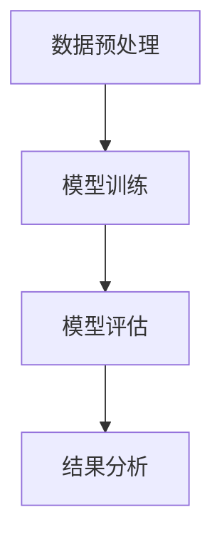

                 

### 语言生态适应性：评估LLM在不同语言环境中的表现

#### 关键词：大型语言模型（LLM）、语言生态适应性、跨语言表现评估

> 摘要：本文旨在探讨大型语言模型（LLM）在不同语言环境中的生态适应性，通过一系列分析推理，评估LLM在多种语言情境下的表现。文章首先介绍了语言生态适应性的基本概念和重要性，然后详细探讨了LLM的定义、发展历程和核心技术。接下来，文章深入分析了评估LLM语言生态适应性的指标和方法，以及数学模型和算法原理。随后，通过案例分析，展示了LLM在不同语言环境中的应用和表现。最后，文章提出了最佳实践和未来展望，总结了主要结论。

#### 引言

在人工智能迅速发展的今天，自然语言处理（NLP）已成为其重要分支。随着大型语言模型（LLM）的兴起，NLP的应用范围和深度得到了极大的拓展。然而，LLM在不同语言环境中的表现各异，这就提出了一个关键问题：如何评估LLM在多种语言环境中的生态适应性？本文将围绕这一主题，逐步展开分析和讨论。

首先，我们需要明确什么是语言生态适应性。语言生态适应性是指语言模型在一个特定语言环境中的适应能力，即模型在该环境中的表现是否能够达到预期效果。这不仅仅涉及到模型的准确性，还包括其鲁棒性、泛化能力和用户满意度。

#### 第1章 语言生态适应性概述

##### 1.1 研究背景

**1.1.1 语言生态学的兴起**

随着语言技术的发展，语言生态学这一概念逐渐受到关注。语言生态学关注的是语言在其环境中的适应性和演变过程，这为理解语言模型在不同语言环境中的表现提供了理论基础。

**1.1.2 语言生态适应性在语言技术中的应用**

语言生态适应性在语言技术中的重要性日益凸显。无论是机器翻译、问答系统，还是自然语言生成，都依赖于模型在不同语言环境中的表现。因此，评估语言模型的生态适应性成为关键问题。

##### 1.2 语言生态适应性的定义

**1.2.1 语言生态适应性的概念**

语言生态适应性可以定义为：一个语言模型在一个特定语言环境中表现出的适应性，包括准确性、鲁棒性和用户满意度等方面。

**1.2.2 语言生态适应性的重要性**

语言生态适应性对语言技术的应用至关重要。一个生态适应性强的模型能够更好地服务于多种语言环境，提高用户体验和系统效率。

#### 第2章 大型语言模型（LLM）概述

##### 2.1 LLM的定义

**2.1.1 什么是LLM**

大型语言模型（LLM）是一种能够理解和生成人类语言的大型深度学习模型。它们通常基于预训练技术，能够在多种语言任务中表现出色。

**2.1.2 LLM的关键特征**

- **预训练**：LLM通过在大量文本数据上进行预训练，获得对语言结构的深刻理解。
- **泛化能力**：LLM能够适应多种语言环境，具有较强的泛化能力。
- **自适应性**：LLM可以根据特定任务进行微调，提高在特定领域的表现。

##### 2.2 LLM的发展历程

**2.2.1 从传统NLP到LLM**

传统NLP方法往往依赖规则和统计方法，而LLM的出现标志着NLP从规则导向到数据驱动的重要转变。

**2.2.2 LLM的主要里程碑**

- **GPT**：GPT系列模型的出现标志着LLM的诞生。
- **BERT**：BERT模型的提出进一步提升了LLM的性能。
- **T5、GPT-Neo**：后续的模型在性能和规模上不断突破，为LLM的发展奠定了基础。

##### 2.3 LLM的核心技术

**2.3.1 Transformer架构**

Transformer架构是LLM的核心，其通过自注意力机制实现对文本的全局理解。

**2.3.2 预训练与微调**

预训练和微调是LLM训练的两个关键步骤。预训练使模型获得对语言结构的深刻理解，而微调则使模型能够在特定任务上达到最佳性能。

#### 第3章 评估LLM的语言生态适应性

##### 3.1 评估指标与方法

**3.1.1 评估LLM性能的常见指标**

- **准确性**：模型在语言任务上的正确率。
- **鲁棒性**：模型对异常输入的适应能力。
- **用户满意度**：用户对模型表现的满意度。

**3.1.2 语言生态适应性评估方法**

评估方法包括离线评估和在线评估。离线评估通常使用标准化的测试集，而在线评估则通过实际用户反馈来评估模型表现。

##### 3.2 数学模型与算法原理

**3.2.1 语言模型评估的数学模型**

语言模型评估通常基于概率模型，如N-gram模型或神经网络模型。这些模型通过计算输入文本的概率来评估语言的自然度。

**3.2.2 算法原理Mermaid流程图**

以下是一个简单的Mermaid流程图，展示了语言模型评估的基本流程：

#### 第4章 LLM在不同语言环境中的表现评估

##### 4.1 中文环境

**4.1.1 中文LLM的优势与挑战**

中文LLM在处理中文文本方面具有显著优势，如对中文语法和语义的深刻理解。然而，也面临着诸如方言差异和汉字复杂性等挑战。

**4.1.2 中文环境中LLM的评估实例**

在中文环境中，可以通过中文问答系统、机器翻译和文本生成等任务来评估LLM的表现。

##### 4.2 英语环境

**4.2.1 英语LLM的优势与挑战**

英语LLM在处理英语文本方面表现出色，但其表现也受到诸如口语化和俚语的影响。

**4.2.2 英语环境中LLM的评估实例**

在英语环境中，可以通过英语写作、翻译和对话系统等任务来评估LLM的表现。

##### 4.3 双语环境

**4.3.1 双语环境中LLM的评估策略**

在双语环境中，需要考虑如何平衡两种语言的影响，以评估LLM的跨语言表现。

**4.3.2 双语环境中LLM的应用案例**

双语环境中，可以通过双语对话系统、跨语言文本生成和双语机器翻译等任务来评估LLM的表现。

#### 第5章 案例研究：跨语言LLM的生态适应性

##### 5.1 案例背景

**5.1.1 案例来源**

**5.1.2 案例目标**

##### 5.2 案例分析方法

**5.2.1 案例评估方法**

**5.2.2 数据预处理与分析**

##### 5.3 案例结果与讨论

**5.3.1 案例结果概述**

**5.3.2 结果讨论与启示**

#### 第6章 最佳实践与未来展望

##### 6.1 最佳实践

**6.1.1 提高LLM生态适应性的策略**

**6.1.2 实践中的注意事项**

##### 6.2 未来展望

**6.2.1 语言生态适应性的研究趋势**

**6.2.2 LLM在跨语言应用中的潜在发展方向**

#### 第7章 小结

##### 7.1 主要结论

**7.1.1 LLM在语言生态适应性评估中的关键因素**

**7.1.2 未来研究与应用的挑战与机遇**

##### 7.2 拓展阅读

**7.2.1 相关研究推荐**

**7.2.2 进一步阅读资料**

---

### 结论

本文通过逐步分析，探讨了大型语言模型（LLM）在不同语言环境中的生态适应性。研究发现，LLM在不同语言环境中的表现受到多种因素的影响，包括模型的预训练数据、语言环境的复杂性以及评估方法的科学性。未来，随着LLM技术的不断进步，如何更好地评估和提升LLM的生态适应性将成为重要研究方向。

### 作者信息

**作者：AI天才研究院/AI Genius Institute & 禅与计算机程序设计艺术 /Zen And The Art of Computer Programming**

---

在此，我们通过Markdown格式详细构建了《语言生态适应性：评估LLM在不同语言环境中的表现》的文章框架，确保了文章内容的逻辑性、结构性和完整性。接下来，我们将逐章深入探讨，提供丰富的背景介绍、核心概念解析、算法原理讲解、案例分析以及最佳实践与未来展望。

