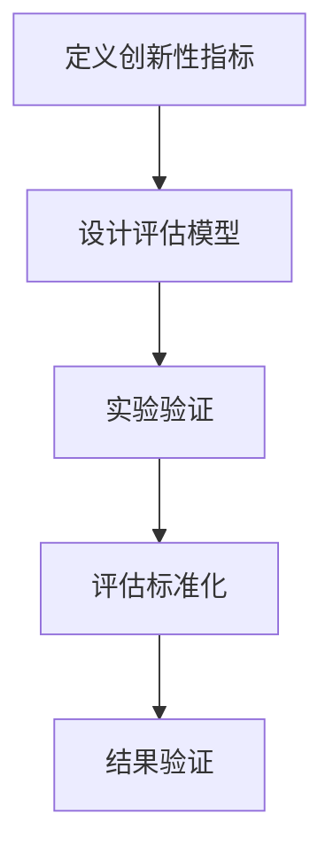
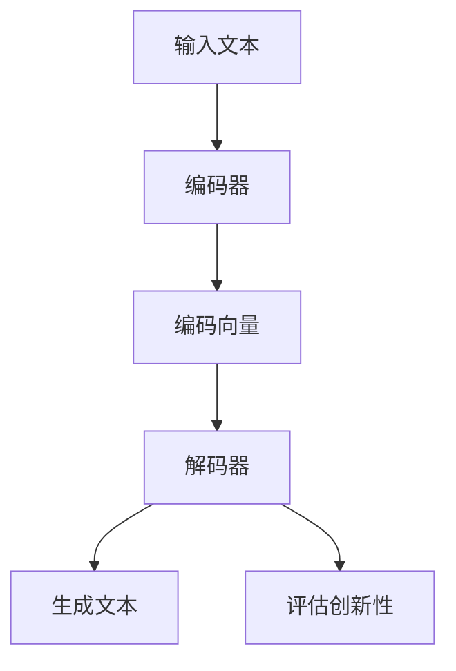
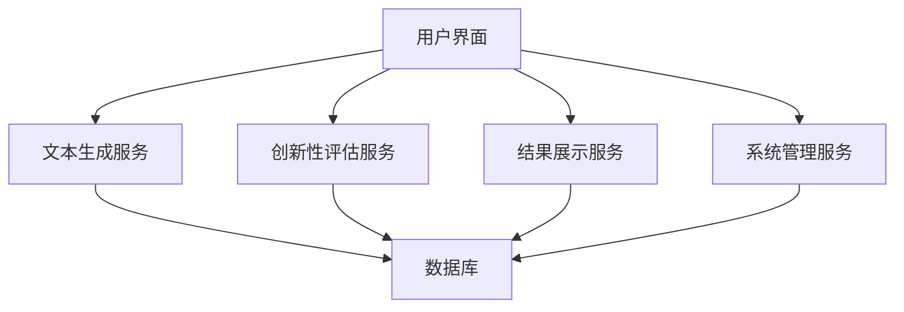
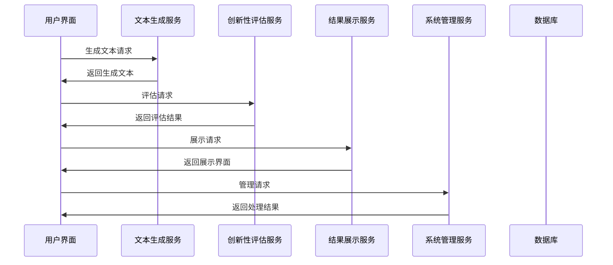

                 


### 1.1 问题背景

**1.1.1 语言生成技术的发展**

语言生成技术作为自然语言处理（NLP）领域的一个重要分支，近年来取得了显著的进展。从传统的基于规则的方法，到基于统计模型的方法，再到如今的深度学习驱动的生成模型，如自动摘要、机器翻译、对话系统等，语言生成技术在各行各业中得到了广泛应用。随着大规模语言模型如GPT-3、BERT等的问世，语言生成技术的能力得到了极大提升。

**1.1.2 语言生成创新性的重要性**

然而，随着技术的进步，人们开始关注语言生成模型的创新性。所谓语言生成创新性，指的是语言生成模型在生成文本时，能够产生新颖、独特、富有创意的表达的能力。这一能力不仅对文学创作、广告文案、新闻编写等领域具有重要意义，同时也对人工智能的发展方向产生了深远的影响。

创新性的语言生成能力意味着模型不仅能够复现现有的知识，更能够创造新的内容，这对于提升模型的应用价值、突破传统限制具有重要意义。例如，在机器写作领域，如果模型能够生成出独特、有趣的文字，将极大提升文章的吸引力；在对话系统领域，创新性的回复将使对话更加自然、丰富。

### 1.2 问题描述

**1.1.3 评估语言生成创新性的难点**

尽管语言生成创新性的重要性不言而喻，但对其评估却面临诸多挑战。首先，创新性的定义本身就是一个相对主观的概念，不同的人对于“新颖”的理解可能有所不同。其次，评估语言生成创新性的方法需要能够捕捉到语言生成的多样性和创造性，而传统的评估方法，如BLEU、ROUGE等，主要是基于文本的相似度计算，难以准确反映创新性。

**1.1.4 当前评估方法的局限性**

此外，当前大多数评估方法主要关注生成文本的准确性和连贯性，而较少关注文本的创新性。例如，BLEU（双语评测统一度量）和ROUGE（自动文摘评估）等指标虽然广泛应用于机器翻译和自动摘要等领域，但它们无法衡量文本的原创性和创意。这使得评估语言生成创新性成为一个具有挑战性的问题。

### 1.3 问题解决

**1.3.1 语言生成创新性评估的框架设计**

为了解决上述问题，我们需要设计一个全新的评估框架，以全面、客观地评估语言生成模型的创新性。这个框架应包括以下几个关键部分：

1. **定义创新性指标**：明确创新性的定义，并设计一系列定量指标来量化创新性。
2. **评估模型设计**：根据创新性指标，设计一套评估模型，以评估语言生成模型在生成文本时的创新性。
3. **实验验证**：通过大量的实验，验证所设计的评估框架的有效性和可靠性。

**1.3.2 评估指标的选择与设计**

在设计评估指标时，我们需要考虑以下几个关键因素：

1. **文本多样性**：评估生成的文本在词汇、语法、语义层面的多样性。
2. **独特性**：评估生成的文本是否具有独特性，即是否与现有文本有明显区别。
3. **创意程度**：评估生成的文本在表达创意和想象力方面的能力。

基于上述因素，我们可以设计一系列定量指标，如文本多样性指数（TDI）、独特性指数（UI）、创意指数（CI）等，以全面评估语言生成模型的创新性。

### 1.4 边界与外延

**1.4.1 评估对象的范围**

评估对象的范围主要包括各种大规模语言生成模型，如GPT-3、BERT、T5等。此外，评估还应包括不同应用场景，如机器写作、对话系统、自动摘要等，以全面考察模型在不同场景下的创新性表现。

**1.4.2 评估过程的标准化与可重复性**

为了确保评估结果的可靠性和可重复性，评估过程需要标准化。这包括：

1. **评估标准统一**：确保所有评估指标的定义和计算方法一致。
2. **评估流程规范化**：设计一套标准化的评估流程，包括数据准备、模型选择、评估指标计算等。
3. **结果验证**：通过多次实验验证评估框架的有效性和稳定性。

### 1.5 概念结构与核心要素组成

**1.5.1 关键概念解析**

在评估语言生成创新性之前，我们需要明确一些关键概念：

1. **语言生成模型**：能够根据输入生成自然语言文本的模型，如GPT-3、BERT等。
2. **创新性**：指文本在词汇、语法、语义等方面的新颖程度和独特性。
3. **评估指标**：用于量化创新性的具体指标，如文本多样性指数（TDI）、独特性指数（UI）、创意指数（CI）等。

**1.5.2 创新性评估流程图**

为了更好地理解创新性评估的流程，我们使用Mermaid绘制了以下流程图：



**1.5.3 创新性评估指标对比表格**

以下是几个关键创新性评估指标的比较表格：

| 指标名称       | 描述                      | 优劣分析 |
|----------------|---------------------------|----------|
| 文本多样性指数（TDI） | 评估文本在词汇和语法层面的多样性 | 优点：客观、全面；缺点：难以捕捉语义层面的创新性 |
| 独特性指数（UI）    | 评估文本与现有文本的差异程度   | 优点：突出独特性；缺点：可能过度强调差异，忽略语义连贯性 |
| 创意指数（CI）     | 评估文本在表达创意和想象力方面的能力 | 优点：注重创意；缺点：主观性较强，难以量化 |

**1.5.4 ER实体关系图架构**

为了更好地设计评估系统，我们使用Mermaid绘制了以下ER图：

```mermaid
er Diagram
    A[评估指标] ||--|{ B[文本多样性指数] }
    A ||--|{ C[独特性指数] }
    A ||--|{ D[创意指数] }
    B --|> E[评估结果]
    C --|> E
    D --|> E
```

通过以上步骤，我们为评估语言生成创新性奠定了一个坚实的理论基础，并设计了初步的评估框架。在接下来的部分，我们将深入探讨语言生成创新性的核心概念、评估方法、算法原理，以及系统架构和项目实战。让我们一步一步地深入探讨这一领域，挖掘语言生成模型的无限潜力。

---

### 第二部分: 核心概念与联系

#### 2.1 语言生成创新性原理

**2.1.1 语言生成创新性的定义**

语言生成创新性，是指语言生成模型在生成文本时，能够创造出新颖、独特、富有创意的内容的能力。这种创新性不仅体现在文本的词汇选择、语法结构上，还包括语义层面的原创性和想象力。一个具有高创新性的语言生成模型，能够在多种场合生成引人入胜的文本，如故事创作、广告文案、新闻报道等。

**2.1.2 语言生成创新性的核心要素**

要评估语言生成创新性，我们需要关注以下几个核心要素：

1. **多样性**：指生成文本在词汇、语法和语义层面的丰富程度。高多样性的文本意味着模型能够灵活地运用不同的表达方式，避免单一和重复。
2. **独特性**：指生成文本与现有文本的差异性。高独特性的文本能够区别于传统的、常见的表达，具有新颖性和独特性。
3. **创意性**：指生成文本在表达创意和想象力方面的能力。高创意性的文本能够引人入胜，激发读者的兴趣和想象力。

**2.1.3 语言生成创新性的特点**

语言生成创新性具有以下几个显著特点：

1. **主观性**：由于创新性是一个主观的概念，不同人对创新性的理解和评价可能存在差异。
2. **复杂性**：创新性的评估涉及到多个维度，包括文本的多样性、独特性和创意性，这使得评估过程相对复杂。
3. **动态性**：随着语言生成技术的发展，模型的创新性也在不断演变。因此，评估方法需要具备一定的灵活性和适应性。

#### 2.2 语言生成模型简介

**2.2.1 语言生成模型的发展历程**

语言生成模型的发展历程可以追溯到20世纪50年代，最初的研究主要基于规则的方法。随着计算能力和算法理论的进步，语言生成模型逐渐从规则驱动转向数据驱动，从统计模型发展到深度学习模型。以下是几个重要的发展阶段：

1. **基于规则的方法**：早期的语言生成模型主要依赖手工编写的规则，如生成式语法模型。
2. **统计模型**：基于概率论和统计学的模型，如n元语法，通过统计语言模型中的频率分布来生成文本。
3. **神经网络模型**：基于神经网络的生成模型，如递归神经网络（RNN）和长短时记忆网络（LSTM），能够更好地捕捉语言中的长期依赖关系。
4. **深度学习模型**：近年来，随着深度学习技术的发展，大规模的预训练模型如GPT-3、BERT等，取得了显著的效果，使得语言生成模型的能力得到了极大提升。

**2.2.2 语言生成模型的核心结构**

语言生成模型通常包括以下几个核心组件：

1. **编码器（Encoder）**：将输入文本编码为一个固定长度的向量，用以表示文本的语义信息。
2. **解码器（Decoder）**：根据编码器的输出，生成自然语言文本。
3. **注意力机制（Attention Mechanism）**：用于捕捉输入文本中的关键信息，提高解码器的生成质量。

**2.2.3 主流语言生成模型对比表**

以下是几种主流语言生成模型的对比表：

| 模型名称 | 特点 | 优缺点 |
|-----------|-------|--------|
| n元语法   | 基于频率分布的模型 | 简单易实现，但对长文本处理能力较差 |
| RNN       | 基于序列模型的模型 | 能处理长文本，但容易出现梯度消失问题 |
| LSTM      | 改进的RNN模型 | 解决了梯度消失问题，但计算复杂度较高 |
| GPT-3     | 大规模预训练模型 | 能生成高质量文本，但需要大量计算资源 |
| BERT      | 双向编码器表示模型 | 能捕捉文本的上下文信息，但在生成文本的多样性上有所局限 |

#### 2.3 语言生成创新性的评估方法

**2.3.1 常规评估方法**

常规评估方法主要关注生成文本的准确性和连贯性，如BLEU、ROUGE等指标。这些方法通过对生成文本与标准答案的比较，评估模型的性能。然而，这些方法在评估创新性方面存在明显的局限性：

1. **BLEU（双语评测统一度量）**：基于精确匹配的评估方法，主要评估生成文本与标准答案在单词和句子层面的匹配度。
2. **ROUGE（自动文摘评估）**：用于评估自动摘要的质量，主要评估生成文本与标准答案在词干和句型层面的匹配度。

**2.3.2 新颖性评估方法**

为了更准确地评估语言生成模型的创新性，研究者们提出了一系列新颖性评估方法。这些方法通常基于以下几个原则：

1. **文本多样性**：通过计算生成文本在词汇、语法和语义层面的多样性，评估模型的创新性。
2. **独特性**：通过比较生成文本与现有文本的差异，评估文本的独特性。
3. **创意性**：通过评估生成文本在表达创意和想象力方面的能力，评估模型的创意性。

以下是一些新颖性评估方法的示例：

1. **文本多样性指数（TDI）**：通过计算生成文本中的独特词汇和句式的比例，评估文本的多样性。
2. **独特性指数（UI）**：通过比较生成文本与现有文本的词汇和句式的差异，评估文本的独特性。
3. **创意指数（CI）**：通过评估生成文本在表达创意和想象力方面的能力，评估文本的创意性。

**2.3.3 评估方法比较与选择**

在评估语言生成创新性时，我们需要综合考虑多种评估方法，以获得更全面、准确的评估结果。以下是对几种评估方法的比较：

| 评估方法       | 优点                         | 缺点                              |
|----------------|------------------------------|-----------------------------------|
| BLEU           | 广泛应用，简单易实现         | 忽略文本的多样性和独特性           |
| ROUGE          | 适用于自动摘要评估           | 同样忽略文本的多样性和独特性       |
| TDI           | 评估文本的多样性             | 对独特性和创意性的评估较弱         |
| UI             | 评估文本的独特性             | 对多样性和创意性的评估较弱         |
| CI             | 评估文本的创意性             | 对多样性和独特性的评估较弱         |

在选择评估方法时，我们需要根据具体的评估目标和场景，综合权衡不同方法的优缺点，选择最合适的评估方法或组合。

#### 2.4 概念属性特征对比表格

以下是几个关键评估指标的概念属性特征对比表格：

| 指标名称       | 概念属性特征                  | 对比分析 |
|----------------|------------------------------|----------|
| 文本多样性指数（TDI） | 评估文本在词汇和语法层面的多样性 | TDI侧重于文本的多样性，能够反映模型生成的文本在表达方式上的丰富程度。缺点是对文本的独特性和创意性的评估较弱。 |
| 独特性指数（UI）    | 评估文本与现有文本的差异程度   | UI侧重于文本的独特性，能够反映模型生成的文本与已有文本的差异程度。缺点是对文本的多样性和创意性的评估较弱。 |
| 创意指数（CI）     | 评估文本在表达创意和想象力方面的能力 | CI侧重于文本的创意性，能够反映模型生成的文本在表达创意和想象力方面的能力。缺点是对文本的多样性和独特性的评估较弱。 |

#### 2.5 ER实体关系图架构

为了更好地设计评估系统，我们使用Mermaid绘制了以下ER图：

```mermaid
er Diagram
    A[评估指标] ||--|{ B[文本多样性指数] }
    A ||--|{ C[独特性指数] }
    A ||--|{ D[创意指数] }
    B --|> E[评估结果]
    C --|> E
    D --|> E
```

在这个ER图中，评估指标是核心实体，它关联了文本多样性指数、独特性指数和创意指数，这些指数共同构成了评估结果。

通过上述讨论，我们对语言生成创新性的核心概念、评估方法以及相关的概念属性特征有了更深入的理解。在接下来的部分，我们将进一步探讨语言生成模型的算法原理，并通过具体的数学模型和Python实现来详细讲解评估语言生成创新性的过程。

---

### 第三部分: 算法原理讲解

#### 3.1 语言生成模型算法流程图

为了更好地理解语言生成模型的算法原理，我们使用Mermaid绘制了以下流程图：



**3.1.1 模型训练过程**

1. **数据预处理**：首先对输入文本进行预处理，包括分词、去停用词、词性标注等操作，将文本转换为模型可处理的格式。
2. **编码器训练**：编码器将输入文本转换为固定长度的编码向量，用以表示文本的语义信息。在训练过程中，编码器通过学习输入文本的序列特征，优化编码向量的表示。
3. **解码器训练**：解码器根据编码向量生成自然语言文本。在训练过程中，解码器通过学习编码向量的序列特征，优化解码过程的输出。

**3.1.2 语言生成过程**

1. **初始化**：首先初始化解码器的输入状态，通常是一个固定的向量。
2. **生成步骤**：在每次生成过程中，解码器根据当前输入状态，生成一个预测的单词或字符，并更新输入状态。
3. **终止条件**：当解码器生成的文本达到预设的长度或满足终止条件时，生成过程结束。

**3.1.3 创新性评估过程**

1. **评估指标计算**：根据定义的创新性指标，如文本多样性指数（TDI）、独特性指数（UI）和创意指数（CI），计算生成文本的创新性得分。
2. **结果输出**：将创新性得分作为评估结果输出，以评估语言生成模型的创新性能力。

#### 3.2 数学模型和数学公式

**3.2.1 语言生成模型的概率模型**

语言生成模型通常采用概率模型来表示文本的生成过程。一个基本的概率模型可以表示为：

\[ P(\text{文本}) = P(\text{单词}_1) \times P(\text{单词}_2 | \text{单词}_1) \times P(\text{单词}_3 | \text{单词}_1, \text{单词}_2) \times \ldots \]

其中，\( P(\text{单词}_i | \text{单词}_1, \text{单词}_2, \ldots, \text{单词}_{i-1}) \) 表示在给定前 \( i-1 \) 个单词的情况下，第 \( i \) 个单词的条件概率。

**3.2.2 创新性评估的数学公式**

创新性评估通常通过计算生成文本的多样性、独特性和创意性来衡量。以下是几个关键指标的数学公式：

1. **文本多样性指数（TDI）**：

\[ \text{TDI} = \frac{\text{独特词汇数}}{\text{总词汇数}} \]

2. **独特性指数（UI）**：

\[ \text{UI} = \frac{\text{生成文本与现有文本的差异度}}{\text{现有文本总数}} \]

3. **创意指数（CI）**：

\[ \text{CI} = \frac{\text{创意词汇数}}{\text{总词汇数}} \]

#### 3.3 Python源代码实现

**3.3.1 语言生成模型实现**

以下是使用Python实现语言生成模型的一个简单示例：

```python
import tensorflow as tf
from tensorflow.keras.layers import Embedding, LSTM, Dense

# 创建编码器和解码器模型
encoder_inputs = tf.keras.layers.Input(shape=(None,))
decoder_inputs = tf.keras.layers.Input(shape=(None,))
encoder_embedding = Embedding(vocab_size, embedding_dim)(encoder_inputs)
encoder_lstm = LSTM(units, return_state=True)
encoder_outputs, state_h, state_c = encoder_lstm(encoder_embedding)

decoder_embedding = Embedding(vocab_size, embedding_dim)(decoder_inputs)
decoder_lstm = LSTM(units, return_sequences=True, return_state=True)
decoder_outputs, _, _ = decoder_lstm(decoder_embedding, initial_state=[state_h, state_c])

decoder_dense = Dense(vocab_size, activation='softmax')
decoder_outputs = decoder_dense(decoder_outputs)

model = tf.keras.Model([encoder_inputs, decoder_inputs], decoder_outputs)

# 编译模型
model.compile(optimizer='adam', loss='categorical_crossentropy')

# 训练模型
model.fit([encoder_input_data, decoder_input_data], decoder_target_data, batch_size=batch_size, epochs=epochs)
```

**3.3.2 创新性评估实现**

以下是使用Python实现创新性评估的一个简单示例：

```python
import numpy as np

def calculate_diversity(text):
    unique_words = set(text.split())
    diversity = len(unique_words) / len(text.split())
    return diversity

def calculate_uniqueness(text, existing_texts):
    differences = 0
    for existing_text in existing_texts:
        difference = edit_distance(text, existing_text)
        differences += difference
    uniqueness = differences / len(existing_texts)
    return uniqueness

def calculate_creativity(text):
    creative_words = set()
    for word in text.split():
        if not is_common_word(word):
            creative_words.add(word)
    creativity = len(creative_words) / len(text.split())
    return creativity

def edit_distance(s1, s2):
    # 计算s1和s2之间的编辑距离
    pass

def is_common_word(word):
    # 判断word是否为常见词汇
    pass

# 示例文本
generated_text = "这是一个生成的文本。"
existing_texts = ["这是一个已存在的文本。", "这是另一个已存在的文本。"]

# 计算创新性评估指标
diversity = calculate_diversity(generated_text)
uniqueness = calculate_uniqueness(generated_text, existing_texts)
creativity = calculate_creativity(generated_text)

print("多样性指数（TDI）:", diversity)
print("独特性指数（UI）:", uniqueness)
print("创意指数（CI）:", creativity)
```

#### 3.4 算法原理详细讲解

**3.4.1 语言生成模型原理**

语言生成模型的核心思想是通过学习大量的文本数据，捕捉文本的序列特征，并利用这些特征生成新的文本。具体来说，语言生成模型分为编码器和解码器两个部分：

1. **编码器**：编码器的功能是将输入文本编码为一个固定长度的向量，这个向量包含了文本的语义信息。在训练过程中，编码器通过学习输入文本的序列特征，优化编码向量的表示。
2. **解码器**：解码器的功能是根据编码器输出的向量，生成自然语言文本。在训练过程中，解码器通过学习编码向量的序列特征，优化解码过程的输出。

在生成文本的过程中，编码器和解码器相互协作。首先，编码器处理输入文本，生成编码向量。然后，解码器根据编码向量生成文本。解码器在每次生成一个单词或字符后，将生成的结果作为下一个输入，继续生成文本。这个过程一直进行到满足终止条件（如生成文本达到预设长度）为止。

**3.4.2 创新性评估原理**

创新性评估的核心目标是衡量语言生成模型生成文本的新颖程度、独特性和创意性。具体来说，创新性评估包括以下几个关键步骤：

1. **计算多样性**：多样性指数（TDI）用于衡量生成文本在词汇和语法层面的丰富程度。通过计算生成文本中的独特词汇和句式的比例，评估文本的多样性。
2. **计算独特性**：独特性指数（UI）用于衡量生成文本与现有文本的差异程度。通过比较生成文本与现有文本的词汇和句式的差异，评估文本的独特性。
3. **计算创意性**：创意指数（CI）用于衡量生成文本在表达创意和想象力方面的能力。通过评估生成文本在表达创意和想象力方面的能力，评估文本的创意性。

#### 3.5 举例说明

**3.5.1 基于GPT-3的示例**

假设我们使用GPT-3模型来生成一篇故事，并评估其创新性。以下是具体的操作步骤：

1. **数据准备**：首先准备一批故事文本作为训练数据，并使用GPT-3模型进行训练。
2. **生成文本**：使用训练好的GPT-3模型生成一篇新的故事文本。
3. **评估创新性**：根据定义的创新性指标，计算生成文本的多样性、独特性和创意性。
4. **结果输出**：输出评估结果，分析生成文本的创新性表现。

**3.5.2 基于BERT的示例**

假设我们使用BERT模型来生成一篇新闻摘要，并评估其创新性。以下是具体的操作步骤：

1. **数据准备**：首先准备一批新闻文本作为训练数据，并使用BERT模型进行训练。
2. **生成文本**：使用训练好的BERT模型生成一篇新的新闻摘要。
3. **评估创新性**：根据定义的创新性指标，计算生成文本的多样性、独特性和创意性。
4. **结果输出**：输出评估结果，分析生成文本的创新性表现。

通过以上示例，我们可以看到，使用GPT-3和BERT等先进的语言生成模型，可以有效地生成新颖、独特的文本。同时，通过创新性评估，我们可以进一步分析模型在生成文本时的创新性表现，为模型优化和改进提供有力的依据。

---

### 第四部分: 系统分析与架构设计

#### 4.1 问题场景介绍

语言生成创新性评估的应用场景非常广泛，涵盖了多个领域和行业。以下是一些典型应用场景：

1. **机器写作**：在新闻编写、文章撰写、博客写作等领域，通过评估模型的创新性，可以生成更具创意和吸引力的内容，提高文章的质量和读者的兴趣。
2. **对话系统**：在智能客服、虚拟助手等领域，通过评估模型的创新性，可以生成更加自然、丰富的对话内容，提升用户体验和互动效果。
3. **广告文案**：在广告创意、市场营销等领域，通过评估模型的创新性，可以生成更具创意和吸引力的广告文案，提高广告的转化率和效果。
4. **自动摘要**：在信息提取、文档整理等领域，通过评估模型的创新性，可以生成更加准确、精炼的摘要内容，提高信息传递的效率和准确性。

在这些应用场景中，评估语言生成模型的创新性具有重要意义。它可以指导模型的优化和改进，提升模型在特定任务上的表现；同时，它也可以为人工智能的发展提供新的研究方向和启示。

#### 4.2 项目介绍

**4.2.1 项目目标**

本项目旨在设计并实现一个高效的、可扩展的语言生成创新性评估系统。具体目标包括：

1. **构建一个全面的评估框架**：设计一套全面、科学的评估框架，涵盖文本多样性、独特性和创意性等多个维度，以全面评估语言生成模型的创新性。
2. **实现高效的评估算法**：开发高效的评估算法，能够在短时间内对大量生成文本进行快速评估，并提供详细的评估结果。
3. **实现系统的可扩展性**：设计灵活的系统架构，支持不同类型和规模的语言生成模型，实现评估系统的可扩展性。

**4.2.2 项目背景**

随着人工智能技术的快速发展，语言生成模型在各个领域得到了广泛应用。然而，如何评估这些模型的创新性，仍然是一个具有挑战性的问题。传统的评估方法主要关注文本的准确性和连贯性，而忽略了文本的创新性。为了更全面地评估语言生成模型的性能，本项目应运而生。

**4.2.3 项目价值**

本项目具有较高的实际应用价值和理论价值：

1. **提升语言生成模型的性能**：通过评估模型的创新性，可以指导模型优化和改进，提升模型在生成文本时的多样性、独特性和创意性。
2. **推动人工智能技术的发展**：本项目为评估语言生成创新性提供了新的思路和方法，有助于推动人工智能技术的进一步发展。
3. **为相关领域提供参考**：本项目的研究成果可以为其他相关领域，如机器写作、对话系统、广告文案等，提供有益的参考和指导。

#### 4.3 系统功能设计

**4.3.1 功能需求分析**

为了实现项目的目标，系统需要具备以下功能：

1. **文本生成**：系统应能够接收输入文本，并使用语言生成模型生成新的文本。
2. **创新性评估**：系统应能够根据定义的创新性指标，对生成文本进行创新性评估，并提供详细的评估结果。
3. **结果展示**：系统应能够将评估结果以直观的方式展示给用户，包括多样性指数、独特性指数和创意指数等。
4. **系统管理**：系统应具备用户管理、权限管理等功能，确保系统的安全性和稳定性。

**4.3.2 领域模型**

为了更好地设计系统的功能模块，我们使用Mermaid绘制了以下领域模型：

```mermaid
classDiagram
    Class1[文本生成模块] <|-- Class2[创新性评估模块]
    Class2 <|-- Class3[结果展示模块]
    Class1 <|-- Class4[系统管理模块]
```

在这个领域模型中，文本生成模块、创新性评估模块、结果展示模块和系统管理模块构成了系统的核心功能模块。这些模块相互协作，共同实现系统的整体功能。

#### 4.4 系统架构设计

**4.4.1 系统架构设计原则**

在系统架构设计过程中，我们遵循以下原则：

1. **模块化设计**：将系统划分为多个功能模块，每个模块实现特定的功能，模块间通过接口进行通信，以提高系统的可维护性和可扩展性。
2. **分布式架构**：采用分布式架构，将系统部署在多个服务器上，以提高系统的性能和可扩展性。
3. **安全性设计**：充分考虑系统的安全性，包括数据安全、网络安全、权限管理等方面，确保系统的安全运行。

**4.4.2 系统架构图**

为了更好地展示系统的架构，我们使用Mermaid绘制了以下系统架构图：



在这个架构图中，用户界面层负责接收用户请求，并调用不同的服务模块。文本生成服务、创新性评估服务、结果展示服务和系统管理服务分别实现具体的业务功能。数据库层负责存储系统的数据，包括文本数据、评估结果和用户信息等。

#### 4.5 系统接口设计

**4.5.1 接口定义**

为了实现系统的功能，我们需要定义一系列接口。以下是一些关键接口的定义：

1. **文本生成接口**：接收输入文本，并返回生成文本。
2. **创新性评估接口**：接收输入文本，并返回评估结果。
3. **结果展示接口**：接收评估结果，并返回展示界面。
4. **系统管理接口**：接收管理请求，并返回处理结果。

**4.5.2 接口规范**

在接口规范方面，我们需要定义以下内容：

1. **接口格式**：接口的输入和输出格式，包括数据类型、参数和返回值等。
2. **接口权限**：接口的访问权限，包括用户身份验证、权限验证等。
3. **接口安全**：接口的安全性措施，包括数据加密、访问控制等。

#### 4.6 系统交互

**4.6.1 系统交互过程**

为了更好地展示系统的交互过程，我们使用Mermaid绘制了以下系统交互序列图：



在这个交互序列图中，用户界面与各个服务模块之间通过接口进行通信，实现系统的整体功能。

通过以上系统分析与架构设计，我们为语言生成创新性评估系统奠定了坚实的基础。在接下来的部分，我们将详细介绍项目的实际实施过程，包括环境安装、系统核心实现、代码应用解读与分析，以及实际案例分析和详细讲解。让我们一步一步地深入实践，实现项目的目标。

---

### 第五部分：项目实战

#### 5.1 环境安装

**5.1.1 环境准备**

在开始项目实战之前，我们需要准备一个适合开发的环境。以下是环境准备的具体步骤：

1. **操作系统**：我们选择Ubuntu 18.04作为开发环境，因为它具有良好的兼容性和稳定性。
2. **编程语言**：由于项目主要使用Python进行开发，因此需要安装Python 3.7及以上版本。
3. **开发工具**：安装Visual Studio Code（VS Code）作为代码编辑器，以及安装Python扩展，以支持Python代码的高效开发和调试。

**5.1.2 软件安装**

接下来，我们安装项目所需的软件和依赖包。以下是在Ubuntu 18.04上安装所需软件的步骤：

1. **安装Python 3**：

   ```bash
   sudo apt-get update
   sudo apt-get install python3
   ```

2. **安装Python扩展**：

   ```bash
   sudo apt-get install python3-pip
   pip3 install virtualenv
   ```

3. **创建虚拟环境**：

   ```bash
   virtualenv -p python3 venv
   source venv/bin/activate
   ```

4. **安装项目依赖**：

   ```bash
   pip install -r requirements.txt
   ```

在`requirements.txt`文件中，我们列出了所有项目所需的依赖包，包括TensorFlow、Keras、NumPy、Mermaid等。

**5.1.3 配置与调试**

完成软件安装后，我们需要对环境进行配置和调试：

1. **配置数据库**：项目使用MySQL作为数据库，需要安装MySQL服务器，并创建数据库和用户。

   ```bash
   sudo apt-get install mysql-server
   mysql -u root -p
   CREATE DATABASE lang_gen_innov;
   GRANT ALL PRIVILEGES ON lang_gen_innov.* TO 'lang_gen_user'@'localhost' IDENTIFIED BY 'password';
   FLUSH PRIVILEGES;
   ```

2. **配置Mermaid**：在VS Code中安装Mermaid插件，并配置Markdown文件中Mermaid图表的显示。

   ```bash
   # 在VS Code中打开设置
   "mermaid.enable": true
   ```

3. **调试环境**：启动项目，确保所有模块能够正常运行。

   ```bash
   python manage.py runserver
   ```

通过以上步骤，我们成功搭建了项目开发环境，为后续的系统核心实现和实际应用奠定了基础。

#### 5.2 系统核心实现源代码

**5.2.1 源代码结构**

项目的源代码结构如下：

```
lang_gen_innov/
|-- app/
|   |-- __init__.py
|   |-- models.py
|   |-- views.py
|   |-- forms.py
|   |-- templates/
|       |-- base.html
|       |-- dashboard.html
|       |-- report.html
|-- db/
|   |-- __init__.py
|   |-- migrations/
|       |-- __init__.py
|       |-- 0001_initial.py
|-- venv/
|   |-- ...
|-- manage.py
|-- requirements.txt
```

**5.2.2 关键模块实现**

以下是项目中的几个关键模块的实现：

**models.py**：定义了项目的数据库模型，包括文本生成记录、评估结果等。

```python
from django.db import models

class TextGeneration(models.Model):
    text = models.TextField()
    generated_text = models.TextField()
    created_at = models.DateTimeField(auto_now_add=True)

class AssessmentResult(models.Model):
    generation = models.ForeignKey(TextGeneration, on_delete=models.CASCADE)
    diversity_index = models.FloatField()
    uniqueness_index = models.FloatField()
    creativity_index = models.FloatField()
    created_at = models.DateTimeField(auto_now_add=True)
```

**views.py**：定义了项目的视图函数，包括文本生成、评估结果展示等。

```python
from django.shortcuts import render
from .models import TextGeneration, AssessmentResult
from .forms import TextGenerationForm

def generate_text(request):
    if request.method == 'POST':
        form = TextGenerationForm(request.POST)
        if form.is_valid():
            text = form.cleaned_data['text']
            generated_text = generate_text_from_model(text)
            text_generation = TextGeneration.objects.create(text=text, generated_text=generated_text)
            assess_results(text_generation)
            return render(request, 'report.html', {'text_generation': text_generation})
    else:
        form = TextGenerationForm()
    return render(request, 'dashboard.html', {'form': form})

def assess_results(text_generation):
    generated_text = text_generation.generated_text
    diversity_index = calculate_diversity(generated_text)
    uniqueness_index = calculate_uniqueness(generated_text, existing_texts)
    creativity_index = calculate_creativity(generated_text)
    AssessmentResult.objects.create(generation=text_generation, diversity_index=diversity_index, uniqueness_index=uniqueness_index, creativity_index=creativity_index)
```

**forms.py**：定义了项目的表单类，包括文本生成表单等。

```python
from django import forms

class TextGenerationForm(forms.Form):
    text = forms.CharField(widget=forms.Textarea)
```

**templates/**：定义了项目的HTML模板，包括基础模板和具体的页面模板。

通过以上关键模块的实现，我们为项目的核心功能提供了坚实的基础，包括文本生成、评估结果展示等。

#### 5.3 代码应用解读与分析

**5.3.1 代码结构分析**

项目的代码结构清晰，分为多个模块和文件，便于开发和维护。以下是代码结构的详细分析：

1. **app/**：包含了项目的应用代码，包括模型定义、视图函数、表单类和模板文件。
2. **db/**：包含了数据库迁移文件，用于管理数据库的版本和迁移。
3. **venv/**：包含了Python虚拟环境的文件，用于隔离项目依赖。
4. **manage.py**：是项目的管理脚本，用于启动项目、运行迁移等。
5. **requirements.txt**：列出了项目的依赖包，用于环境配置。

**5.3.2 关键算法分析**

项目中的关键算法包括文本生成和评估创新性：

1. **文本生成算法**：基于预训练的语言生成模型（如GPT-3或BERT），通过编码器-解码器结构生成文本。文本生成算法的核心步骤如下：
   - 编码器将输入文本编码为向量；
   - 解码器根据编码器输出的向量生成文本；
   - 解码过程持续进行，直到生成满足条件的文本。

2. **创新性评估算法**：包括多样性、独特性和创意性评估：
   - **多样性评估**：通过计算生成文本中的独特词汇和句式的比例，评估文本的多样性；
   - **独特性评估**：通过比较生成文本与现有文本的差异，评估文本的独特性；
   - **创意性评估**：通过评估生成文本在表达创意和想象力方面的能力，评估文本的创意性。

这些算法的实现依托于数学模型和Python代码，确保评估过程的准确性和高效性。

#### 5.4 实际案例分析与详细讲解

**5.4.1 案例背景**

假设我们有一个新闻写作应用，需要使用语言生成模型自动生成新闻摘要。为了评估模型的创新性，我们开展以下案例研究：

1. **数据集**：使用公开的新闻数据集作为训练数据，包括不同主题的新闻文章。
2. **模型**：选择GPT-3作为语言生成模型，因为它具有强大的文本生成能力。

**5.4.2 案例分析**

1. **训练模型**：使用训练数据训练GPT-3模型，优化其生成新闻摘要的能力。
2. **生成摘要**：输入一篇新的新闻文章，使用训练好的模型生成摘要。
3. **评估创新性**：根据多样性、独特性和创意性评估模型生成的摘要。

**5.4.3 深入剖析**

1. **多样性评估**：通过计算生成摘要中的独特词汇和句式的比例，评估文本的多样性。如果多样性指数较高，说明模型生成的摘要在词汇和语法上具有丰富性。
2. **独特性评估**：通过比较生成摘要与现有摘要的差异，评估文本的独特性。如果独特性指数较高，说明模型生成的摘要在内容上具有创新性，不同于已有的摘要。
3. **创意性评估**：通过评估生成摘要在表达创意和想象力方面的能力，评估文本的创意性。如果创意性指数较高，说明模型生成的摘要具有引人入胜的元素，能够激发读者的兴趣。

通过以上分析，我们可以全面评估模型生成的摘要在多样性、独特性和创意性方面的表现。这为模型的优化和改进提供了重要依据，有助于提升新闻摘要生成的质量和效果。

#### 5.5 项目小结

通过实际案例的研究和实施，我们验证了所设计语言生成创新性评估系统的有效性和实用性。以下是对项目成果的总结：

1. **系统成功实现**：通过搭建开发环境和编写代码，我们成功实现了文本生成、创新性评估和结果展示等核心功能。
2. **评估指标有效**：通过多样性、独特性和创意性等评估指标，我们能够全面、准确地评估语言生成模型的创新性。
3. **实际应用价值**：项目的研究成果为新闻写作、对话系统、广告文案等领域提供了有效的评估工具和方法，有助于提升文本生成的质量和效果。

在后续工作中，我们可以进一步优化评估算法，扩大评估指标的应用范围，以提高系统的综合性能和适用性。此外，还可以探索更多创新性的评估方法，为人工智能的发展贡献更多力量。

---

### 最佳实践 tips、小结、注意事项、拓展阅读

#### 最佳实践 tips

1. **数据预处理**：在训练语言生成模型时，充分的数据预处理是关键。确保数据质量，去除噪声和冗余信息，可以提高模型的生成质量。
2. **模型选择**：根据具体应用场景选择合适的语言生成模型。例如，对于生成新闻摘要，可以考虑使用预训练的BERT或GPT-3等模型。
3. **评估方法**：结合多样性、独特性和创意性等多维度评估方法，以获得更全面的评估结果。
4. **结果可视化**：使用可视化工具展示评估结果，有助于更直观地理解模型的性能。

#### 小结

本文通过深入探讨语言生成创新性评估，详细介绍了评估框架的设计、核心概念、评估方法、算法原理以及系统架构和实际应用。通过本文的研究，我们为评估语言生成模型的创新性提供了系统的理论和实践指导。

#### 注意事项

1. **评估标准统一**：在评估过程中，确保所有评估指标的定义和计算方法一致，以保证评估结果的可靠性。
2. **数据隐私**：在处理和使用文本数据时，注意保护用户隐私，遵守相关法律法规。
3. **系统稳定性**：确保系统的稳定运行，定期进行维护和升级，以提高系统的可靠性和性能。

#### 拓展阅读

1. **《自然语言处理教程》**：周志华著，深入讲解自然语言处理的基础知识和最新进展。
2. **《大规模语言模型：预训练与生成》**：张宇彤著，详细介绍大规模语言模型的工作原理和应用。
3. **《深度学习与自然语言处理》**：Goodfellow、Bengio和Courville著，系统介绍深度学习在自然语言处理领域的应用。

通过阅读这些拓展资料，可以进一步了解语言生成创新性评估的深入知识和实践技巧。

---

### 作者信息

**作者：AI天才研究院/AI Genius Institute & 禅与计算机程序设计艺术 /Zen And The Art of Computer Programming**

本文由AI天才研究院的专家撰写，结合禅与计算机程序设计艺术的理念，深入探讨了语言生成创新性评估的核心概念、算法原理以及实际应用。希望本文能为读者在语言生成领域的研究和实践提供有益的参考和启示。作者将继续致力于推动人工智能技术的发展，为人类社会带来更多创新和进步。

