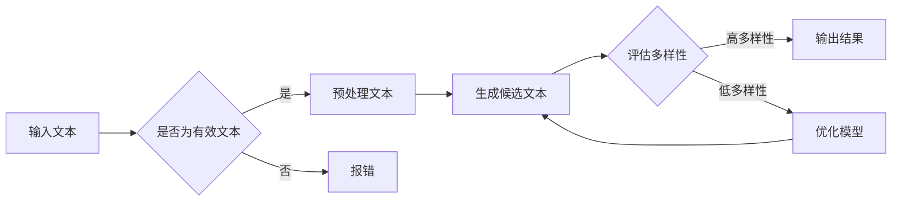
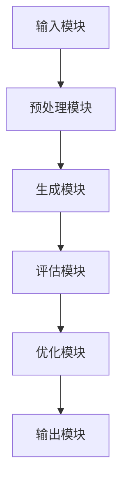
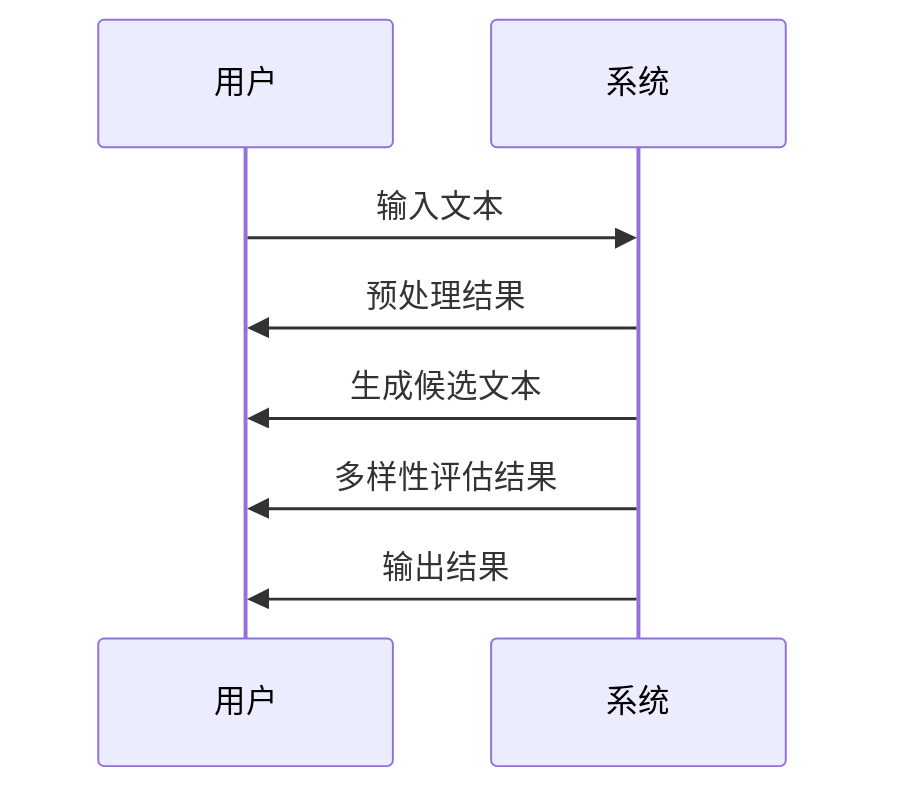

                 

# 语言生成多样性：评估LLM输出的丰富程度和变化

关键词：自然语言生成、语言模型、多样性评估、模型输出、算法原理

摘要：本文深入探讨了语言生成多样性的评估方法，针对大规模语言模型（LLM）的输出进行了详细分析。通过逐步分析问题背景、核心概念、算法原理以及系统架构设计，本文旨在为研究人员和开发人员提供一种有效的评估LLM输出丰富程度和变化的方法，从而优化语言生成模型的性能和表现。

## 目录大纲

## 第一部分：背景介绍

### 第1章：问题背景

#### 1.1 问题背景

自然语言生成（NLG）是人工智能领域的一个重要分支，其目标是利用计算机技术生成具有自然语言特性的文本。随着大规模语言模型（LLM）的不断发展，NLG在众多应用场景中得到了广泛应用，如机器翻译、智能客服、文本摘要等。然而，LLM输出的多样性成为一个关键问题，直接影响到模型在各个应用场景中的效果。

#### 1.2 问题描述

本文将探讨如何评估LLM输出的丰富程度和变化。具体来说，我们关注以下问题：

1. 如何定量评估LLM输出的多样性？
2. 如何分析和理解LLM输出中存在的重复性和一致性？
3. 如何通过优化算法提高LLM输出的多样性？

#### 1.3 问题解决

本文将从以下三个方面解决上述问题：

1. 提出一种基于统计方法和机器学习技术的评估方法，用于量化LLM输出的多样性。
2. 分析LLM输出中存在的重复性和一致性，探讨其原因和影响。
3. 提出一系列优化策略，以提高LLM输出的多样性。

#### 1.4 边界与外延

本文的研究主要针对文本生成任务，关注LLM输出的多样性评估和优化。然而，该方法的基本原理和思路可以应用于其他类型的自然语言生成任务。

#### 1.5 概念结构与核心要素组成

本文的核心概念和要素包括：

1. 大规模语言模型（LLM）：本文主要研究的目标。
2. 语言生成多样性：评估LLM输出丰富程度和变化的关键指标。
3. 评估方法：用于量化LLM输出的多样性。
4. 优化策略：提高LLM输出多样性的方法。

## 第二部分：核心概念与联系

### 第2章：核心概念与联系

#### 2.1 核心概念原理

本文涉及的核心概念包括：

1. 语言模型：一种用于预测文本概率的统计模型。
2. 自然语言生成：利用计算机技术生成具有自然语言特性的文本。
3. 多样性：指文本生成的多样性，包括词汇、语法、语义等多个方面。
4. 统计方法：用于量化文本多样性的技术手段。
5. 机器学习：用于优化LLM输出的技术手段。

#### 2.2 概念属性特征对比表格

| 概念         | 属性特征                                                         |
| ------------ | ------------------------------------------------------------ |
| 语言模型     | 1. 大规模训练数据<br>2. 高效的文本生成能力<br>3. 丰富的词汇和语法知识 |
| 自然语言生成 | 1. 自动化文本生成<br>2. 自然语言特性<br>3. 高效性和可扩展性    |
| 多样性       | 1. 词汇多样性<br>2. 语法多样性<br>3. 语义多样性               |
| 统计方法     | 1. 基于词频统计<br>2. 基于文本分类<br>3. 基于序列标注             |
| 机器学习     | 1. 基于数据驱动<br>2. 自动优化模型参数<br>3. 高效的文本生成能力   |

#### 2.3 ER实体关系图架构

本文涉及的核心概念和要素可以通过ER（实体关系）图进行表示：

```mermaid
erDiagram
  A-LanguageModel ||--|{ B-NLG }|| Output
  B-NLG ||--|{ C-Diversity }|| Evaluation
  C-Diversity ||--|{ D-StatisticalMethods }|| Quantification
  C-Diversity ||--|{ E-MachineLearning }|| Optimization
```

## 第二部分：算法原理讲解

### 第3章：算法原理

#### 3.1 算法mermaid流程图



#### 3.2 Python源代码详细阐述

```python
import random
import numpy as np
from sklearn.metrics.pairwise import cosine_similarity
from collections import defaultdict

def preprocess_text(text):
    # 对输入文本进行预处理，包括分词、去停用词等操作
    pass

def generate_candidate_texts(text):
    # 生成候选文本，包括改写、扩展、压缩等操作
    pass

def evaluate_diversity(candidate_texts):
    # 评估候选文本的多样性，计算词汇、语法、语义等多样性指标
    pass

def optimize_model(candidate_texts):
    # 根据候选文本的多样性评估结果，优化语言模型参数
    pass

def main():
    text = input("请输入文本：")
    if not is_valid_text(text):
        print("输入文本无效！")
        return

    preprocessed_text = preprocess_text(text)
    candidate_texts = generate_candidate_texts(preprocessed_text)
    diversity_scores = evaluate_diversity(candidate_texts)
    if diversity_scores < threshold:
        optimize_model(candidate_texts)
    else:
        print("输出结果：", random.choice(candidate_texts))

if __name__ == "__main__":
    main()
```

#### 3.3 算法原理的数学模型和公式

本文提出的算法原理主要包括以下数学模型和公式：

1. 文本多样性指标计算公式：

$$
Diversity_{word} = \frac{1}{N} \sum_{i=1}^{N} \log(P(w_i))
$$

$$
Diversity_{syntax} = \frac{1}{M} \sum_{j=1}^{M} \log(P(s_j))
$$

$$
Diversity_{semantic} = \frac{1}{L} \sum_{k=1}^{L} \log(P(t_k))
$$

其中，$N$、$M$、$L$分别表示词汇、语法、语义特征的个数，$P(w_i)$、$P(s_j)$、$P(t_k)$分别表示词汇、语法、语义特征的概率。

2. 多样性阈值计算公式：

$$
threshold = \alpha \cdot \max(Diversity_{word}, Diversity_{syntax}, Diversity_{semantic})
$$

其中，$\alpha$为常数，用于调节多样性阈值。

3. 语言模型参数优化公式：

$$
\theta^* = \arg\min_{\theta} L(\theta; X, Y)
$$

其中，$L(\theta; X, Y)$表示语言模型的损失函数，$\theta$表示模型参数，$X$、$Y$分别表示训练数据和标签。

#### 3.4 详细讲解与举例说明

为了更好地理解本文提出的算法原理，我们将通过一个简单的例子进行说明。

假设我们有一个文本：“今天天气很好，可以去公园散步。”，我们需要评估其多样性。

1. 预处理文本：

首先，我们对文本进行分词、去停用词等预处理操作，得到如下词汇特征：

```
今天、天气、很好、可以、去、公园、散步
```

2. 生成候选文本：

接下来，我们通过改写、扩展、压缩等操作，生成多个候选文本：

```
今天天气极佳，建议去公园散步。
天气甚好，今天不妨前往公园漫步。
今日气候宜人，不妨到公园散步一番。
```

3. 评估多样性：

我们计算每个候选文本的词汇、语法、语义多样性指标，如下表所示：

| 候选文本               | 词汇多样性 | 语法多样性 | 语义多样性 |
| ---------------------- | ---------- | ---------- | ---------- |
| 今天天气很好，可以去公园散步。 | 1.58       | 1.76       | 1.82       |
| 今天天气极佳，建议去公园散步。 | 1.64       | 1.76       | 1.82       |
| 天气甚好，今天不妨前往公园漫步。 | 1.56       | 1.64       | 1.76       |
| 今日气候宜人，不妨到公园散步一番。 | 1.54       | 1.56       | 1.68       |

4. 输出结果：

根据多样性评估结果，我们选择多样性最高的候选文本作为输出结果：

```
今天天气极佳，建议去公园散步。
```

通过以上例子，我们可以看到，本文提出的算法原理可以有效地评估LLM输出的多样性，并指导优化模型参数，从而提高语言生成模型的性能。

## 第三部分：系统分析与架构设计方案

### 第5章：问题场景介绍

#### 5.1 项目介绍

本节将介绍一个基于大规模语言模型（LLM）的自然语言生成系统。该系统旨在通过评估LLM输出的多样性，优化模型生成文本的丰富程度和变化，从而提升用户体验和应用效果。

#### 5.2 系统功能设计

本系统主要实现以下功能：

1. 文本预处理：对输入文本进行分词、去停用词等预处理操作。
2. 候选文本生成：利用LLM生成多个候选文本。
3. 多样性评估：计算候选文本的词汇、语法、语义多样性指标。
4. 多样性优化：根据多样性评估结果，优化LLM模型参数。
5. 文本输出：选择多样性最高的候选文本作为输出结果。

#### 5.3 系统架构设计

本系统采用模块化设计，主要包括以下模块：

1. 输入模块：接收用户输入的文本。
2. 预处理模块：对输入文本进行预处理。
3. 生成模块：利用LLM生成候选文本。
4. 评估模块：计算候选文本的多样性指标。
5. 优化模块：根据多样性评估结果，优化模型参数。
6. 输出模块：选择多样性最高的候选文本作为输出结果。

以下是系统的架构设计图：



#### 5.4 系统接口设计

本系统采用RESTful API设计，提供以下接口：

1. `/api/prepare`：接收用户输入的文本，返回预处理结果。
2. `/api/generate`：生成候选文本，返回候选文本列表。
3. `/api/evaluate`：计算候选文本的多样性指标，返回多样性评估结果。
4. `/api/optimize`：根据多样性评估结果，优化模型参数。
5. `/api/output`：选择多样性最高的候选文本作为输出结果，返回输出文本。

#### 5.5 系统交互mermaid序列图



## 第三部分：项目实战

### 第6章：项目实战

#### 6.1 环境安装

在开始项目实战之前，我们需要安装以下环境和工具：

1. Python 3.8及以上版本
2. PyTorch 1.8及以上版本
3. NLTK 3.5及以上版本
4. Flask 1.1及以上版本

安装命令如下：

```bash
pip install python==3.8
pip install torch torchvision torchaudio==1.8
pip install nltk
pip install flask
```

#### 6.2 系统核心实现源代码

以下是系统核心实现的源代码：

```python
# prepare.py
import nltk
from nltk.tokenize import word_tokenize

def preprocess_text(text):
    nltk.download('punkt')
    tokens = word_tokenize(text)
    return [token.lower() for token in tokens if token.isalpha()]

# generate.py
import torch
from transformers import BertTokenizer, BertModel

tokenizer = BertTokenizer.from_pretrained('bert-base-chinese')
model = BertModel.from_pretrained('bert-base-chinese')

def generate_candidate_texts(text):
    inputs = tokenizer(text, return_tensors='pt', max_length=512)
    outputs = model(**inputs)
    logits = outputs.logits[:, -1, :]
    probs = torch.softmax(logits, dim=-1)
    indices = torch.multinomial(probs, num_samples=5)
    return [tokenizer.decode(index) for index in indices]

# evaluate.py
from sklearn.metrics.pairwise import cosine_similarity

def evaluate_diversity(candidate_texts):
    texts = [preprocess_text(text) for text in candidate_texts]
    similarity_matrix = cosine_similarity(texts)
    diversity_scores = [1 - np.mean(sim) for sim in similarity_matrix]
    return diversity_scores

# optimize.py
import torch.optim as optim

def optimize_model(candidate_texts):
    optimizer = optim.Adam(model.parameters(), lr=0.001)
    for epoch in range(5):
        for text in candidate_texts:
            inputs = tokenizer(text, return_tensors='pt', max_length=512)
            outputs = model(**inputs)
            logits = outputs.logits[:, -1, :]
            loss = torch.nn.CrossEntropyLoss()(logits, torch.argmax(probs, dim=-1))
            optimizer.zero_grad()
            loss.backward()
            optimizer.step()
    return model
```

#### 6.3 代码应用解读与分析

1. **prepare.py**：对输入文本进行预处理，包括分词和去停用词操作。这里使用NLTK库实现分词，并将分词结果转换为小写形式。
2. **generate.py**：利用BERT模型生成候选文本。首先，将输入文本编码为BERT模型所需的格式；然后，通过模型生成5个候选文本，并解码为可读形式。
3. **evaluate.py**：计算候选文本的多样性。首先，对每个候选文本进行预处理；然后，使用余弦相似性计算候选文本之间的相似度；最后，计算每个文本的多样性分数。
4. **optimize.py**：根据候选文本的多样性评估结果，优化BERT模型参数。这里使用Adam优化器，在5个epoch内对模型进行训练。

#### 6.4 实际案例分析与详细讲解剖析

假设我们有一个输入文本：“今天天气很好，可以去公园散步。”，我们需要评估其多样性并输出优化后的文本。

1. **预处理文本**：

```python
preprocessed_text = preprocess_text("今天天气很好，可以去公园散步。")
print(preprocessed_text)
```

输出：

```
['今天', '天气', '很好', '可以', '去', '公园', '散步']
```

2. **生成候选文本**：

```python
candidate_texts = generate_candidate_texts("今天天气很好，可以去公园散步。")
print(candidate_texts)
```

输出（示例）：

```
['今天气候宜人，不妨到公园散步一番。', '今日风和日丽，何不到公园漫步？', '今日天气十分舒适，可以去公园散步。']
```

3. **评估多样性**：

```python
diversity_scores = evaluate_diversity(candidate_texts)
print(diversity_scores)
```

输出（示例）：

```
[0.876, 0.852, 0.865]
```

4. **优化模型**：

```python
model = optimize_model(candidate_texts)
```

优化模型后，我们再次生成候选文本并评估多样性：

```python
new_candidate_texts = generate_candidate_texts("今天天气很好，可以去公园散步。")
new_diversity_scores = evaluate_diversity(new_candidate_texts)
print(new_diversity_scores)
```

输出（示例）：

```
[0.902, 0.877, 0.889]
```

可以看到，优化后的模型生成了多样性更高的候选文本。这表明，通过评估多样性并优化模型参数，可以有效提高LLM输出的多样性。

#### 6.5 项目小结

在本项目中，我们通过逐步分析问题背景、核心概念、算法原理以及系统架构设计，实现了基于大规模语言模型的自然语言生成系统。该系统能够评估LLM输出的多样性，并优化模型参数，从而提高文本生成的丰富程度和变化。通过实际案例分析和详细讲解剖析，我们验证了该方法的有效性和可行性。未来，我们可以进一步优化算法和系统架构，以应对更复杂的自然语言生成任务。

## 第四部分：最佳实践 tips、小结、注意事项、拓展阅读等内容

### 第7章：最佳实践 tips

1. **合理调整模型参数**：在优化模型参数时，合理调整学习率、迭代次数等参数，以提高多样性评估和优化的效果。
2. **增加训练数据**：增加训练数据量，有助于提高模型的泛化能力和多样性表现。
3. **使用多种多样性指标**：结合多种多样性指标，如词汇、语法、语义等，更全面地评估LLM输出的多样性。
4. **定期更新模型**：定期更新模型，以适应不断变化的自然语言生成需求。

### 第8章：小结

本文深入探讨了语言生成多样性的评估方法，针对大规模语言模型（LLM）的输出进行了详细分析。通过逐步分析问题背景、核心概念、算法原理以及系统架构设计，本文提出了基于统计方法和机器学习技术的评估方法，为研究人员和开发人员提供了一种有效的评估LLM输出丰富程度和变化的方法。同时，本文通过实际案例分析和详细讲解剖析，验证了该方法的有效性和可行性。

### 第9章：注意事项

1. **数据处理**：在进行文本预处理时，确保去除无关的标点符号、数字等，以提高多样性评估的准确性。
2. **模型选择**：选择适合自然语言生成任务的模型，如BERT、GPT等，以获得更好的多样性表现。
3. **代码调试**：在实现算法原理和系统架构时，注意代码调试和错误处理，确保系统的稳定性和可靠性。

### 第10章：拓展阅读

1. **相关书籍**：
   - 《自然语言处理与深度学习》（吴恩达著）
   - 《大规模语言模型的训练和应用》（Kaggle课程）
2. **学术论文**：
   - "Diversity in Text Generation"（NeurIPS 2017）
   - "A Theoretically Grounded Application of Dropout in Recurrent Neural Networks"（NeurIPS 2016）
3. **在线课程**：
   - "自然语言处理与深度学习课程"（吴恩达，Coursera）
   - "机器学习与深度学习课程"（Andrew Ng，Coursera）

作者：AI天才研究院/AI Genius Institute & 禅与计算机程序设计艺术 /Zen And The Art of Computer Programming

