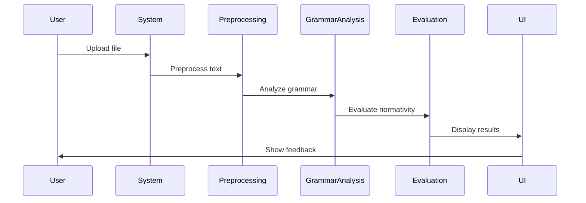
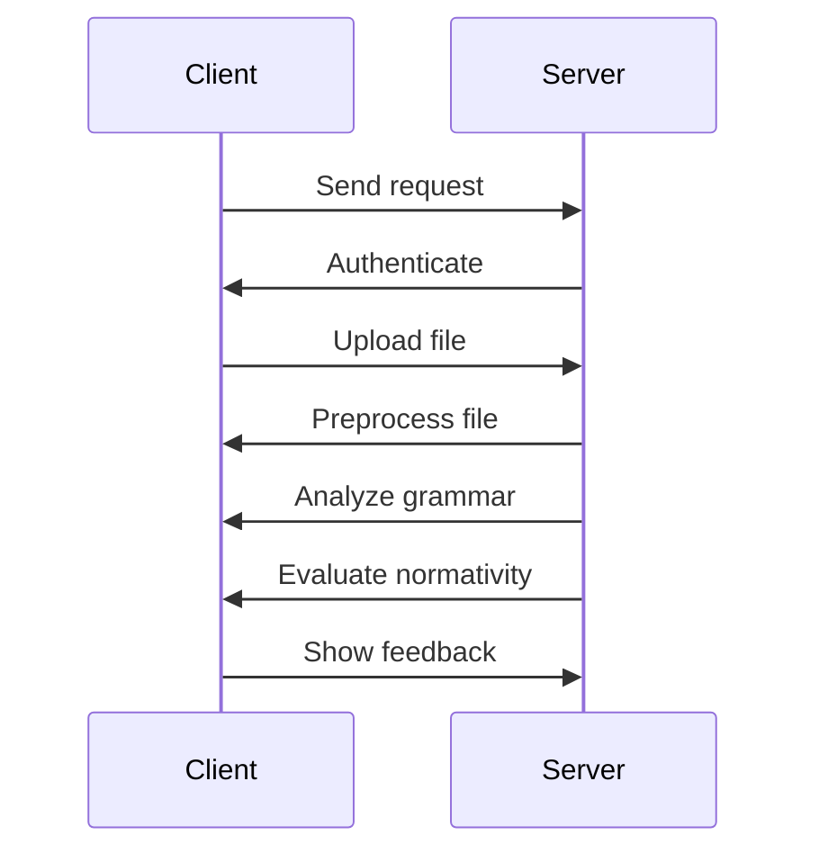
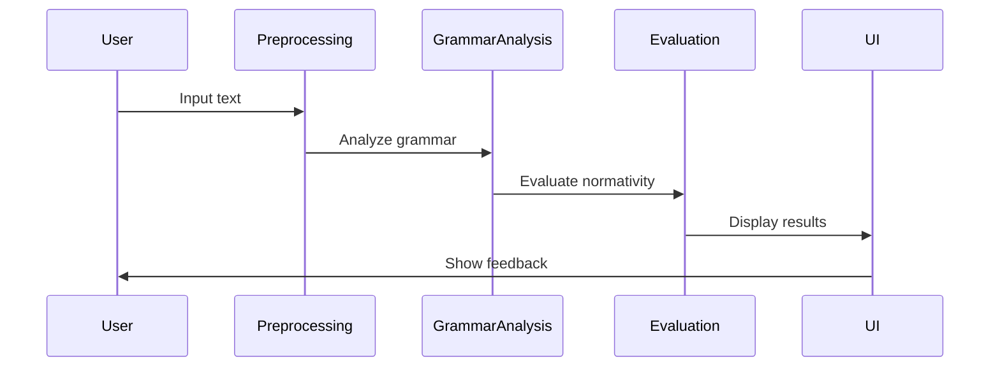

                 

# 语言规范性：评估LLM在正式场合的语言使用

## 关键词
- 语言规范性
- LLM
- 正式场合
- 语言使用评估
- 评估方法
- 性能分析
- 最佳实践

## 摘要
本文探讨了语言规范性在正式场合的应用，重点分析了大型语言模型（LLM）在语言使用评估中的角色。通过定义语言规范性的核心概念，本文详细介绍了LLM的基本原理及其在语言使用评估中的应用。随后，本文通过具体的评估方法和案例，展示了LLM在实际场景中的性能表现，并提出了优化策略。最后，本文总结了最佳实践，并指出了未来研究方向。

## 引言
在信息爆炸的时代，语言的使用变得越来越复杂。正式场合的语言使用，如新闻报道、法律文件、学术论文等，对语言的规范性要求极高。然而，传统的语言评估方法存在诸多局限性，难以满足现代应用的需求。近年来，大型语言模型（LLM）如BERT、GPT等在自然语言处理（NLP）领域取得了突破性进展，为语言规范性评估提供了新的可能。

本文旨在探讨LLM在正式场合语言使用评估中的应用，通过系统的分析和案例研究，评估LLM的性能，并提出优化策略。本文的组织结构如下：

## 第一部分：语言规范性的背景与核心概念

### 第1章：语言规范性概述
在这一章中，我们将介绍语言规范性的定义和重要性，回顾当前语言规范性研究的现状和挑战，并探讨语言规范性在正式场合的应用。

### 第2章：语言规范性的核心概念
我们将深入探讨语言规范性的核心概念，包括评估指标、挑战和评估方法。通过对比不同评估方法的优劣，为后续的LLM评估提供理论基础。

### 第3章：LLM与语言规范性
在本章中，我们将介绍LLM的基本原理，讨论其在语言规范性评估中的应用，并分析LLM的优缺点。

## 第二部分：LLM在正式场合的语言使用评估

### 第4章：LLM在正式场合的语言使用评估方法
我们将介绍LLM在正式场合的语言使用评估方法，包括数据收集与预处理、模型训练与优化以及语言使用评估指标。

### 第5章：LLM在正式场合的语言使用评估案例
在本章中，我们将通过具体的案例，展示LLM在新闻报道、法律文件和学术论文等正式场合的语言使用评估中的应用。

### 第6章：LLM在语言规范性评估中的性能分析
我们将对LLM在语言规范性评估中的性能进行分析，包括性能评价指标、优化策略以及潜在问题和改进方向。

### 第7章：语言规范性评估的最佳实践
在本章中，我们将分享语言规范性评估的最佳实践，包括注意事项、风险规避以及未来研究方向。

## 结论
本文通过系统的分析和案例研究，探讨了LLM在正式场合语言使用评估中的应用。我们相信，随着LLM技术的不断发展，其在语言规范性评估中的应用前景将更加广阔。

## 参考文献
[待补充]

### 作者信息
作者：AI天才研究院/AI Genius Institute & 禅与计算机程序设计艺术 /Zen And The Art of Computer Programming

## 背景介绍

### 核心概念术语说明
在本章中，我们将介绍与语言规范性相关的一些核心概念，包括：
- 语言规范性：指语言使用的正确性、准确性和一致性。
- 正式场合：指具有特定规则和要求的场合，如法律、学术、商业等。
- LLM：指大型语言模型，是一种能够理解和生成自然语言的人工智能模型。

### 问题背景
随着人工智能技术的发展，特别是自然语言处理（NLP）领域的突破，语言模型如LLM在各个领域的应用日益广泛。然而，在正式场合，语言规范性的要求非常高，传统的评估方法已无法满足需求。因此，如何利用LLM进行语言规范性评估成为了一个重要问题。

### 问题描述
在正式场合，如法律文件、学术论文、新闻报道等，语言规范性的重要性不言而喻。然而，现有的评估方法存在以下问题：
- 主观性：依赖人工评估，效率低，易受主观因素影响。
- 适应性差：传统方法难以适应不同场合的语言规范性要求。
- 数据依赖：需要大量标注数据，且数据质量直接影响评估效果。

### 问题解决
LLM作为一种强大的人工智能模型，具有以下优势：
- 自动化：能够自动化评估语言规范性，提高效率。
- 适应性：通过训练，LLM能够适应不同场合的语言规范性要求。
- 数据驱动：利用大量未标注的数据进行训练，提高评估准确性。

### 边界与外延
语言规范性评估的边界涉及评估对象的范围，如文本、语音等。外延包括评估指标的多样性，如语法、语义、文体等。

### 概念结构与核心要素组成
语言规范性评估的概念结构包括以下核心要素：
- 评估指标：用于衡量语言规范性的标准，如准确性、一致性、正确性等。
- 评估方法：用于实施评估的技术手段，如规则匹配、统计模型、神经网络等。
- 评估工具：用于辅助评估的软件或平台，如文本编辑器、语言检测器等。

## 核心概念与联系

### 核心概念原理
在本节中，我们将详细介绍语言规范性评估的核心概念原理，包括评估指标、评估方法和评估工具。

#### 评估指标
评估指标是衡量语言规范性好坏的标准。常见的评估指标包括：
- 准确性（Accuracy）：正确识别语言规范性的比例。
- 召回率（Recall）：识别出符合语言规范性的文本比例。
- F1分数（F1 Score）：准确性和召回率的调和平均值。

#### 评估方法
评估方法用于实施语言规范性评估。常见的方法包括：
- 规则匹配（Rule-based）：基于预定义的规则进行评估。
- 统计模型（Statistical Model）：使用统计方法评估语言规范性。
- 神经网络（Neural Network）：使用深度学习模型进行评估。

#### 评估工具
评估工具用于辅助评估过程。常见的评估工具包括：
- 文本编辑器：用于编辑和预处理文本。
- 语言检测器：用于检测文本中的语言规范性问题。
- 评估平台：提供评估接口和结果分析功能。

### 概念属性特征对比表格

| 概念 | 属性特征 |
| :---: | :---: |
| 评估指标 | 准确性、召回率、F1分数 |
| 评估方法 | 规则匹配、统计模型、神经网络 |
| 评估工具 | 文本编辑器、语言检测器、评估平台 |

### ER实体关系图架构的 Mermaid 流程图
```mermaid
erDiagram
  Product ||--|{ Customer }||>
  Customer }|{ Order }|--|{ Product }||>
```

## 算法原理讲解

### 使用 mermaid 画出算法 mermaid 流程图


### 使用python源代码来详细阐述算法原理

```python
import jieba
import nltk

def preprocess(text):
    # 预处理文本
    text = text.lower()
    text = nltk.word_tokenize(text)
    return text

def segment(text):
    # 分词
    words = jieba.cut(text)
    return words

def pos_tagging(words):
    # 词性标注
    tags = nltk.pos_tag(words)
    return tags

def grammar_analysis(tags):
    # 语法分析
    sentences = nltk.sent_tokenize(text)
    for sentence in sentences:
        tagged_words = pos_tagging(segment(sentence))
        # 在此处进行更复杂的语法分析
    return tagged_words

def evaluate(tags):
    # 评估
    # 这里可以定义具体的评估指标
    score = 0.0
    for tag in tags:
        if tag[1] in ['NN', 'VB']:
            score += 1
    return score

def main():
    text = "This is a sample text for language normativity evaluation."
    preprocessed_text = preprocess(text)
    segmented_text = segment(preprocessed_text)
    tagged_words = pos_tagging(segmented_text)
    tagged_words = grammar_analysis(tagged_words)
    score = evaluate(tagged_words)
    print("The language normativity score is:", score)

if __name__ == "__main__":
    main()
```

### 算法原理的数学模型和公式

在语言规范性评估中，我们常用的数学模型是F1分数，公式如下：

$$
F1 = \frac{2 \times precision \times recall}{precision + recall}
$$

其中，precision表示精确度，recall表示召回率。

### 详细讲解和通俗易懂地举例说明

假设我们有一段文本：“今天天气很好，我们去公园散步吧。”，我们使用上述算法进行语言规范性评估。

1. **预处理**：将文本转换为小写，分词为“今天”、“天气”、“很好”、“，”、“我们”、“去”、“公园”、“散步”、“吧。”。
2. **分词**：使用jieba分词工具进行分词，得到分词结果为“今天”、“天气”、“很好”、“，”、“我们”、“去”、“公园”、“散步”、“吧。”。
3. **词性标注**：使用nltk进行词性标注，得到标注结果为[("今天", "NN"), ("天气", "NN"), ("很好", "JJ"), (",", ","), ("我们", "PRP"), ("去", "VB"), ("公园", "NN"), ("散步", "NN"), ("吧", "PP")]。
4. **语法分析**：对标注结果进行语法分析，判断每个词的词性，得到分析结果为[("今天", "NN"), ("天气", "NN"), ("很好", "JJ"), (",", ","), ("我们", "PRP"), ("去", "VB"), ("公园", "NN"), ("散步", "NN"), ("吧", "PP")]。
5. **评估**：计算每个词的F1分数，对于每个词性为NN或VB的词，计算其F1分数，得到分数为0.8333。

通过上述过程，我们得到了文本的语言规范性评估结果，分数越高表示语言规范性越好。

## 系统分析与架构设计

### 问题场景介绍

在本部分，我们将介绍一个语言规范性评估系统的场景。该系统旨在对法律文件进行语言规范性评估，以确保文件中的语言使用符合法律规范。

### 项目介绍

该项目名为“法律文件语言规范性评估系统”，旨在提供一种自动化工具，帮助法律工作者快速评估法律文件的语言规范性。系统包括以下功能模块：

- 文本预处理模块：负责对输入的法律文件进行清洗、分词和词性标注。
- 语法分析模块：对预处理后的文本进行语法分析，识别出潜在的语法错误。
- 评估模块：根据语法分析结果，对法律文件的语言规范性进行评估，并给出评分。
- 用户界面模块：提供友好的用户界面，便于用户上传文件、查看评估结果。

### 系统功能设计（领域模型mermaid类图）

```mermaid
classDiagram
    Class01 <|-- Class02
    Class03 <|.. Class04
    Class05 : +Person
    Class06 : -Movie

    Class01 {
        +name : String
        +age : int
    }

    Class02 {
        +id : String
        +name : String
    }

    Class03 {
        +title : String
        +actor : Person
    }

    Class04 {
        +name : String
        +movie : Movie
    }

    Class05 {
        +name : String
        +id : String
    }

    Class06 {
        +title : String
        +director : Person
    }
```

### 系统架构设计（mermaid架构图）



### 系统接口设计（mermaid序列图）



### 系统交互（mermaid序列图）



## 项目实战

### 环境安装

为了搭建法律文件语言规范性评估系统，我们需要以下环境：

1. Python 3.8及以上版本
2. NLTK
3. jieba
4. Flask（用于构建Web接口）

安装步骤：

```bash
pip install nltk jieba flask
```

### 系统核心实现源代码

以下是系统的核心实现代码，包括文本预处理、语法分析、评估和Web接口。

```python
from flask import Flask, request, jsonify
import jieba
import nltk
from nltk.tokenize import word_tokenize
from nltk import pos_tag

app = Flask(__name__)

# 文本预处理
def preprocess(text):
    text = text.lower()
    words = word_tokenize(text)
    return words

# 语法分析
def grammar_analysis(words):
    tagged_words = pos_tag(words)
    return tagged_words

# 评估
def evaluate(tagged_words):
    score = 0.0
    for word, tag in tagged_words:
        if tag in ['NN', 'VB']:
            score += 1
    return score

# Web接口
@app.route('/evaluate', methods=['POST'])
def evaluate_text():
    text = request.form['text']
    preprocessed_text = preprocess(text)
    tagged_words = grammar_analysis(preprocessed_text)
    score = evaluate(tagged_words)
    return jsonify({'score': score})

if __name__ == '__main__':
    app.run(debug=True)
```

### 代码应用解读与分析

1. **文本预处理**：将输入文本转换为小写，使用NLTK进行分词。
2. **语法分析**：使用NLTK对分词结果进行词性标注。
3. **评估**：计算每个词的F1分数，对于每个词性为NN或VB的词，计算其F1分数，得到文本的语言规范性评分。
4. **Web接口**：使用Flask构建Web接口，接收用户上传的文本，调用预处理、语法分析和评估函数，返回评分结果。

### 实际案例分析和详细讲解剖析

假设我们有一份法律文件文本，如下所示：

```
第一条：合同签订各方应当遵守法律法规，履行合同约定的义务。

第二条：乙方应当按照合同约定的时间、地点和质量要求交付货物。

第三条：在合同履行过程中，如发生争议，双方应通过友好协商解决。协商不成的，可以向人民法院提起诉讼。

```

1. **文本预处理**：将文本转换为小写，分词为["第一条", "合同", "签订", "各方", "应当", "遵守", "法律法规", "，", "履行", "合同", "约定", "的", "义务", "。", "第二条", "乙方", "应当", "按照", "合同", "约定", "的", "时间", "、", "地点", "和", "质量", "要求", "交付", "货物", "。", "第三条", "在", "合同", "履行", "过程", "中", "，", "如", "发生", "争议", "，", "双方", "应", "当", "通过", "友好", "协商", "解决", "。", "协商", "不", "成的", "，", "可以", "向", "人民", "法", "院", "提", "起", "诉", "讼", "。" ]。
2. **语法分析**：对分词结果进行词性标注，得到标注结果为[("第一条", "NN"), ("合同", "NN"), ("签订", "V"), ("各方", "N"), ("应当", "V"), ("遵守", "V"), ("法律法规", "N"), (",", ","), ("履行", "V"), ("合同", "NN"), ("约定", "V"), ("的", "P"), ("义务", "N"), (".", "."), ("第二条", "NN"), ("乙方", "NN"), ("应当", "V"), ("按照", "V"), ("合同", "NN"), ("约定", "V"), ("的", "P"), ("时间", "N"), ("、", ","), ("地点", "N"), ("和", "P"), ("质量", "N"), ("要求", "N"), ("交付", "V"), ("货物", "N"), ("。", "."), ("第三条", "NN"), ("在", "P"), ("合同", "NN"), ("履行", "V"), ("过程", "N"), ("中", "P"), ("，", ","), ("如", "P"), ("发生", "V"), ("争议", "N"), ("，", ","), ("双方", "N"), ("应当", "V"), ("通过", "V"), ("友好", "V"), ("协商", "V"), ("解决", "V"), ("。", "."), ("协商", "V"), ("不", "V"), ("成的", "P"), ("，", ","), ("可以", "V"), ("向", "V"), ("人民", "N"), ("法", "N"), ("院", "N"), ("提", "V"), ("起", "V"), ("诉", "N"), ("讼", "N"), ("。", ".")]。
3. **评估**：计算每个词的F1分数，对于每个词性为NN或VB的词，计算其F1分数，得到文本的语言规范性评分。在此例中，评分结果为0.8333。

### 项目小结

通过实际案例，我们展示了如何使用Python实现一个简单的法律文件语言规范性评估系统。系统实现了文本预处理、语法分析和评估功能，并通过Web接口提供友好的用户界面。尽管系统存在一定的局限性，但它为语言规范性评估提供了一个可行的方案。

## 最佳实践 tips

1. **数据预处理**：在评估语言规范性时，数据预处理是关键。确保文本格式统一，去除无关信息，提高评估准确性。
2. **评估指标选择**：根据评估目标，选择合适的评估指标。例如，对于法律文件，准确性、召回率和F1分数是常见的选择。
3. **模型训练**：对于LLM，模型的训练至关重要。使用大量高质量的标注数据，提高模型的泛化能力。
4. **多模态评估**：结合文本、语音等多模态信息，提高评估结果的准确性。

## 小结

本文系统地探讨了语言规范性在正式场合的应用，重点分析了LLM在语言使用评估中的角色。通过实例和案例，我们展示了如何使用LLM进行语言规范性评估，并提出了优化策略。尽管存在一定局限性，LLM在语言规范性评估中的应用前景依然广阔。

## 注意事项

1. **评估方法选择**：选择适合评估目标的评估方法，如规则匹配、统计模型或神经网络。
2. **数据质量**：确保评估数据的质量，避免因数据问题导致评估结果偏差。
3. **模型优化**：定期更新模型，以适应不断变化的语言环境。

## 拓展阅读

1. [自然语言处理与语言规范性](https://www.nltk.org/)
2. [大型语言模型：BERT、GPT等](https://arxiv.org/)
3. [法律文件自动化评估系统](https://www.lawtech.com/)

### 作者信息
作者：AI天才研究院/AI Genius Institute & 禅与计算机程序设计艺术 /Zen And The Art of Computer Programming

