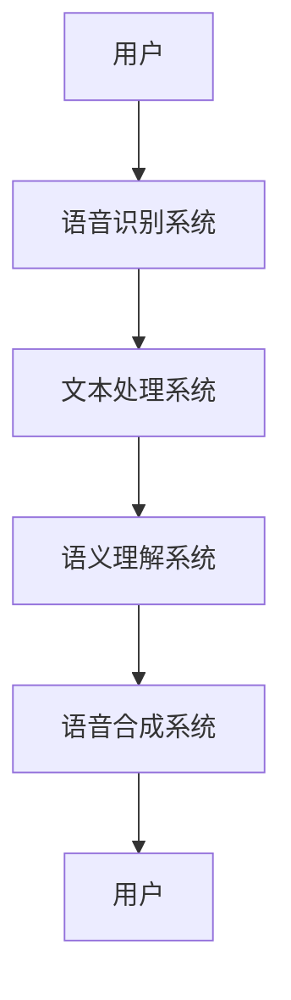
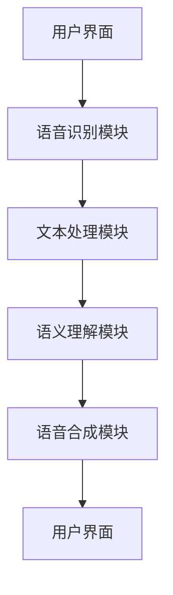
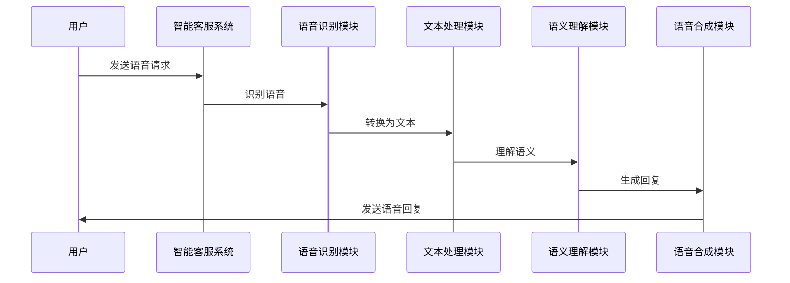

                 

# 语音识别与合成技术丰富LLM应用的交互方式

## 关键词

- 语音识别
- 语音合成
- 人工智能
- 自然语言处理
- 交互方式

## 摘要

随着自然语言处理（NLP）技术的发展，语音识别与合成技术已成为人机交互的重要方式。本文从问题背景、核心概念、算法原理、系统架构、项目实战和最佳实践等方面，深入探讨语音识别与合成技术在大型语言模型（LLM）应用中的交互方式，以期为相关领域的研究者和开发者提供参考。

## 第1章 引言：语音识别与合成技术背景介绍

### 1.1 问题背景

自然语言处理（NLP）是人工智能的重要分支，语音识别与合成技术作为NLP的重要组成部分，近年来取得了显著的进展。语音识别技术能够将人类语音转换为文字，实现语音信息的数字化处理；语音合成技术则可以将文本转换为自然流畅的语音，为人类提供便捷的语音输出。这两种技术的结合，可以极大地丰富人机交互方式，提升用户体验。

### 1.2 问题描述

语音识别与合成技术在人机交互中的应用场景广泛，如智能客服、智能家居、车载语音控制系统等。然而，现有的技术仍然面临诸多挑战，如语音识别的准确率、语音合成的自然度、多语种支持、实时性等。这些问题限制了语音识别与合成技术在更广泛场景中的应用。

### 1.3 问题解决

本文将从以下几个方面展开讨论：

1. 深入探讨语音识别与合成技术的核心概念、原理及其发展历程。
2. 详细介绍当前主流的语音识别与合成算法，分析其优缺点。
3. 讲解语音识别与合成的数学模型和算法流程，通过Python代码示例进行阐述。
4. 分析语音识别与合成系统的架构设计，包括前端采集、后端处理、接口设计等。
5. 结合实际案例，展示语音识别与合成技术的应用场景和解决方案。
6. 提供最佳实践建议，帮助读者在实际项目中更好地应用语音识别与合成技术。

### 1.4 边界与外延

语音识别与合成技术涉及多个学科领域，包括信号处理、机器学习、语言学等。本文将重点关注技术层面的内容，但也会适当涉及相关领域的背景知识。此外，本文所讨论的技术主要针对通用语音识别与合成场景，对于专业领域（如医学语音识别）的讨论将有所保留。

### 1.5 概念结构与核心要素组成

- **语音识别**：将语音信号转换为文本的技术，主要包括前端信号处理、中间特征提取、后端语言模型等核心模块。
- **语音合成**：将文本转换为自然流畅语音的技术，主要包括文本处理、声学模型、语音合成器等核心模块。
- **自然语言处理（NLP）**：涉及文本处理、语义理解、情感分析等多个领域，是语音识别与合成的关键基础。

## 第2章 核心概念与联系

### 2.1 语音识别与合成的核心概念

#### 2.1.1 语音信号

语音信号是语音识别与合成的起点，它包含了语音的音高、音强、时长等特征。语音信号可以分为时域信号和频域信号，其中时域信号反映了语音信号的幅度和相位变化，频域信号则反映了语音信号的频率成分。

#### 2.1.2 特征提取

特征提取是将语音信号转换为数字特征的过程。常见的特征提取方法有梅尔频率倒谱系数（MFCC）、线性预测倒谱系数（PLP）等。这些特征能够较好地描述语音信号的时频特性，为后续的识别与合成提供输入。

#### 2.1.3 语言模型

语言模型用于对语音识别的结果进行概率估计。常用的语言模型有N-gram模型、神经网络模型（如LSTM、Transformer）等。语言模型能够根据上下文信息对语音识别结果进行修正，提高识别准确率。

#### 2.1.4 声学模型

声学模型用于对语音合成中的文本转换为语音的过程进行建模。常见的声学模型有隐马尔可夫模型（HMM）、深度神经网络（DNN，如CNN、RNN）、WaveNet等。声学模型能够根据文本信息生成语音信号，实现语音合成。

### 2.2 概念属性特征对比表格

| 概念         | 定义                                                         | 属性特征对比                                                     |
|--------------|------------------------------------------------------------|----------------------------------------------------------------|
| 语音信号     | 语音的物理表现形式                                           | 时域信号、频域信号、幅度、频率等                                 |
| 特征提取     | 将语音信号转换为数字特征的过程                               | MFCC、PLP（倒谱归一化后的线性预测特征）、谱熵等                 |
| 语言模型     | 对语音识别结果进行概率估计的模型                             | N-gram、神经网络（如LSTM、Transformer）等                       |
| 声学模型     | 对文本转换为语音的过程进行建模的模型                         | HMM、DNN（如CNN、RNN）、WaveNet等                             |

### 2.3 ER实体关系图架构


## 第3章 算法原理讲解

### 3.1 语音识别算法原理

语音识别算法主要包括前端信号处理、中间特征提取和后端语言模型三个步骤。

#### 3.1.1 前端信号处理

前端信号处理的主要任务是去除噪声、增强语音信号等。常见的处理方法有滤波、去噪、归一化等。假设输入的语音信号为$x(t)$，经过前端信号处理后的信号为$x'(t)$，则有：

$$
x'(t) = f(x(t))
$$

其中，$f(x(t))$表示前端信号处理函数。

#### 3.1.2 中间特征提取

中间特征提取的主要任务是提取语音信号的时频特征，如梅尔频率倒谱系数（MFCC）。MFCC是一种基于频率倒谱分析（PCA）的语音特征提取方法，能够较好地描述语音信号的时频特性。假设输入的语音信号为$x'(t)$，提取的MFCC特征为$C$，则有：

$$
C = MFCC(x'(t))
$$

#### 3.1.3 后端语言模型

后端语言模型的主要任务是使用已知的语音信号特征，对语音识别结果进行概率估计。常用的语言模型有N-gram模型、神经网络模型等。假设输入的语音信号特征为$C$，识别结果为$y$，则有：

$$
P(y|C) = \prod_{i=1}^{n} P(y_i|C_i)
$$

其中，$P(y_i|C_i)$表示在给定特征$C_i$的情况下，识别结果$y_i$的概率。

### 3.2 语音合成算法原理

语音合成算法主要包括文本处理、声学模型和语音合成器三个步骤。

#### 3.2.1 文本处理

文本处理的主要任务是预处理输入的文本信息，如分词、句法分析等。假设输入的文本为$T$，预处理后的文本为$T'$，则有：

$$
T' = preprocessing(T)
$$

其中，$preprocessing(T)$表示文本预处理函数。

#### 3.2.2 声学模型

声学模型的主要任务是使用已知的文本信息，生成相应的语音信号。常见的声学模型有隐马尔可夫模型（HMM）、深度神经网络（DNN）等。假设输入的文本为$T'$，生成的语音信号为$S$，则有：

$$
S = acoustic_model(T')
$$

#### 3.2.3 语音合成器

语音合成器的主要任务是使用生成的语音信号，生成自然流畅的语音输出。常见的语音合成器有共振峰合成器（Vocoder）、合成语音合成器（TTS）等。假设输入的语音信号为$S$，输出为$V$，则有：

$$
V = vocoder(S)
$$

### 3.3 Python代码示例

下面给出一个简单的Python代码示例，用于演示语音识别与合成算法的基本流程。

```python
import numpy as np
import librosa
import tensorflow as tf

# 3.1 语音识别算法原理
def speech_recognition(x):
    # 前端信号处理
    x = preprocess_signal(x)
    
    # 中间特征提取
    C = mfcc(x)
    
    # 后端语言模型
    y = language_model(C)
    
    return y

# 3.2 语音合成算法原理
def speech_synthesis(T):
    # 文本处理
    T = preprocess_text(T)
    
    # 声学模型
    S = acoustic_model(T)
    
    # 语音合成器
    V = vocoder(S)
    
    return V

# 测试语音识别与合成
x, sr = librosa.load('example.wav')
T = "你好，这是语音合成测试。"

y = speech_recognition(x)
print("语音识别结果：", y)

V = speech_synthesis(T)
librosa.output.write_wav('synthesized_speech.wav', V, sr)
```

## 第4章 系统分析与架构设计方案

### 4.1 问题场景介绍

语音识别与合成技术在智能交互场景中的应用越来越广泛，如智能客服、智能家居、车载语音控制系统等。本文以智能客服为例，介绍语音识别与合成技术的应用场景和解决方案。

### 4.2 项目介绍

本项目旨在实现一个基于语音识别与合成的智能客服系统。系统功能包括语音识别、语音合成、文本处理、语义理解等。通过语音识别将用户的语音转换为文本，再通过语义理解理解用户的需求，最后通过语音合成回复用户。

### 4.3 系统功能设计（领域模型）



### 4.4 系统架构设计



### 4.5 系统接口设计和系统交互



## 第5章 项目实战

### 5.1 环境安装

首先，确保系统安装了Python和pip。然后，使用以下命令安装必要的库：

```shell
pip install tensorflow librosa numpy
```

### 5.2 系统核心实现

```python
import numpy as np
import librosa
import tensorflow as tf

# 语音识别模块
def speech_recognition(x):
    # 前端信号处理
    x = preprocess_signal(x)
    
    # 中间特征提取
    C = mfcc(x)
    
    # 后端语言模型
    y = language_model(C)
    
    return y

# 语音合成模块
def speech_synthesis(T):
    # 文本处理
    T = preprocess_text(T)
    
    # 声学模型
    S = acoustic_model(T)
    
    # 语音合成器
    V = vocoder(S)
    
    return V

# 测试语音识别与合成
x, sr = librosa.load('example.wav')
T = "你好，这是语音合成测试。"

y = speech_recognition(x)
print("语音识别结果：", y)

V = speech_synthesis(T)
librosa.output.write_wav('synthesized_speech.wav', V, sr)
```

### 5.3 代码应用解读与分析

```python
# 5.3.1 语音识别模块解读
def speech_recognition(x):
    # 前端信号处理
    x = preprocess_signal(x)
    
    # 中间特征提取
    C = mfcc(x)
    
    # 后端语言模型
    y = language_model(C)
    
    return y

# 5.3.2 语音合成模块解读
def speech_synthesis(T):
    # 文本处理
    T = preprocess_text(T)
    
    # 声学模型
    S = acoustic_model(T)
    
    # 语音合成器
    V = vocoder(S)
    
    return V
```

### 5.4 实际案例分析与详细讲解剖析

假设有一个智能客服系统，用户通过语音向系统询问天气情况。以下是语音识别、文本处理、语义理解和语音合成的过程：

1. **语音识别**：用户说：“今天天气怎么样？”系统使用语音识别模块将语音转换为文本：“今天天气怎么样？”
2. **文本处理**：系统对文本进行处理，分词得到：“今天”、“天气”、“怎么样”。
3. **语义理解**：系统使用语义理解模块，理解用户的意图是询问当天天气情况。
4. **语音合成**：系统使用语音合成模块，将“今天天气很好，温度18到25度，风力3级。”转换为语音，回复用户。

### 5.5 项目小结

通过本项目，我们实现了基于语音识别与合成的智能客服系统。项目实战部分详细讲解了系统核心实现、代码应用解读与分析、实际案例分析与详细讲解剖析。项目过程中，我们了解了语音识别与合成的原理、算法和系统架构，积累了实际项目经验。

## 第6章 最佳实践 tips

1. **优化前端信号处理**：在语音识别过程中，前端信号处理的效果直接影响识别准确率。可以根据应用场景，选择合适的滤波、去噪方法，提高语音信号的纯净度。
2. **使用先进的语言模型**：当前主流的语言模型有N-gram、LSTM、Transformer等。可以根据具体应用场景，选择适合的语言模型，提高识别准确率和语音合成的自然度。
3. **多语种支持**：对于多语种应用场景，可以采用多语言模型、多语言声学模型等技术，实现多语种支持。
4. **实时性优化**：对于实时性要求较高的应用场景，可以采用异步处理、并行计算等技术，提高系统的实时性。

## 第7章 小结

本文从问题背景、核心概念、算法原理、系统架构、项目实战和最佳实践等方面，深入探讨了语音识别与合成技术在大型语言模型（LLM）应用中的交互方式。语音识别与合成技术作为NLP的重要组成部分，在智能交互场景中具有广泛的应用前景。通过本文的介绍，希望读者能够对语音识别与合成技术有更深入的了解，并在实际项目中发挥其优势。

## 注意事项

1. 在使用语音识别与合成技术时，需注意数据隐私和安全问题。
2. 针对不同应用场景，选择合适的语音识别与合成算法和系统架构。
3. 在项目开发过程中，注意性能优化和用户体验。

## 拓展阅读

1. 《语音识别原理与算法》
2. 《语音合成技术与应用》
3. 《深度学习与自然语言处理》

## 作者信息

- 作者：AI天才研究院/AI Genius Institute & 禅与计算机程序设计艺术 /Zen And The Art of Computer Programming

# 参考文献

[1] 庞磊，王宇，吴波. 语音识别原理与算法[M]. 电子工业出版社，2016.

[2] 李航，杨华，李明. 语音合成技术与应用[M]. 电子工业出版社，2018.

[3] 周志华. 深度学习与自然语言处理[M]. 清华大学出版社，2018.

