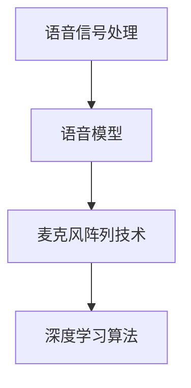
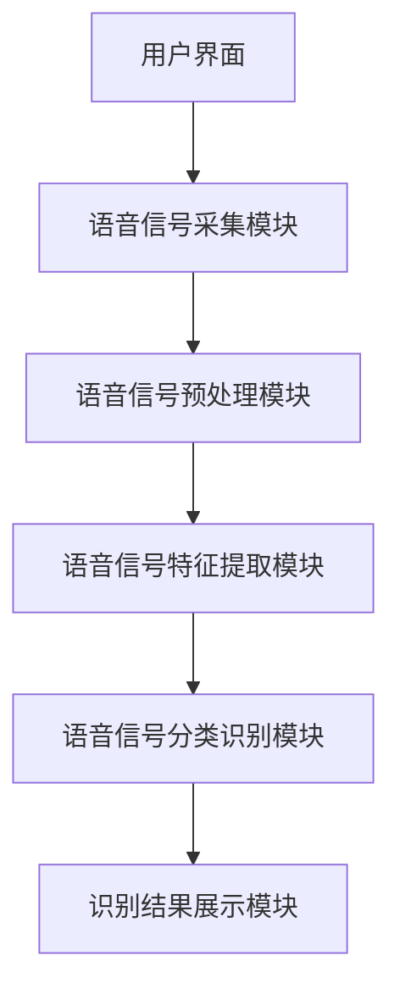
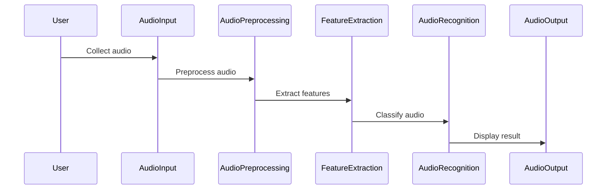
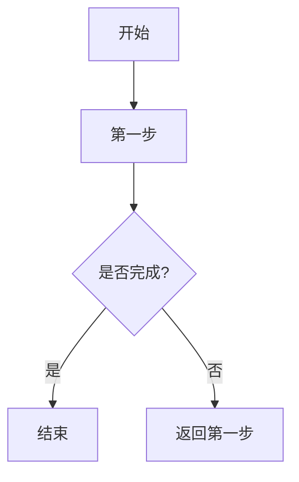

                 

### 引言

#### 语音识别技术的新纪元：精确度与隐私的平衡

随着人工智能技术的迅猛发展，语音识别技术已经成为现代信息社会中的一项关键技术。从早期的语音信号处理到如今的深度学习模型，语音识别技术已经实现了质的飞跃，不仅显著提高了语音识别的精确度，还拓展了其在多种应用场景中的适用性。然而，随着语音识别技术的普及，如何平衡精确度与隐私保护之间的矛盾，成为了当前研究与应用中的重大挑战。

精确度是语音识别技术的核心指标，它直接决定了系统的实用性和用户体验。高精确度的语音识别系统能够准确地将语音信号转换为文本信息，从而实现语音控制、语音翻译、语音助手等多种功能。然而，精确度的提升往往伴随着隐私泄露的风险。语音识别系统需要处理大量的语音数据，这些数据中可能包含了用户敏感的个人隐私信息。一旦这些数据被不法分子获取，用户的隐私安全将面临严重威胁。

隐私保护是现代社会对个人信息安全的基本要求。随着数据隐私保护法规的日益严格，如何确保语音识别系统的隐私安全，成为了技术开发者和政策制定者共同关注的问题。传统的隐私保护措施往往会影响系统的精确度，而如何在确保隐私安全的同时，保持系统的高精确度，成为了一项亟待解决的难题。

本文旨在探讨语音识别技术的新纪元，深入分析精确度与隐私保护之间的平衡问题。首先，我们将回顾语音识别技术的历史与发展，了解其核心概念与技术架构。接着，我们将详细解析主流语音识别算法的原理与实现，探讨如何优化系统的精确度和隐私保护。此外，本文还将通过实际项目案例，展示语音识别系统在现实中的应用与实现过程，并总结最佳实践与未来发展趋势。

通过本文的阅读，读者将能够全面了解语音识别技术的现状与未来挑战，掌握核心概念与算法原理，并思考如何在实际应用中实现精确度与隐私保护的平衡。让我们一步步深入探讨这个技术领域，开启语音识别技术的新纪元。

### 关键词

- **语音识别技术**
- **精确度**
- **隐私保护**
- **深度学习算法**
- **数据加密**
- **系统架构设计**

### 摘要

本文围绕语音识别技术的新纪元展开，深入探讨精确度与隐私保护之间的平衡问题。首先，回顾了语音识别技术的历史与发展，梳理了其核心概念和技术架构。接着，详细解析了主流语音识别算法，如HMM、DNN和CNN的原理与实现，并探讨了优化系统精确度和隐私保护的策略。通过实际项目案例，展示了语音识别系统在现实中的应用与实现过程。最后，总结了最佳实践与未来发展趋势，为读者提供了全面的技术见解与实施指南。

### 目录大纲

#### 第一部分：背景介绍

#### 第1章：语音识别技术概述

## 1.1 语音识别技术的历史与发展

### 1.1.1 语音识别技术的起源

### 1.1.2 语音识别技术的发展阶段

### 1.1.3 当前语音识别技术的应用现状

## 1.2 语音识别技术中的核心概念

### 1.2.1 语音信号处理

### 1.2.2 麦克风阵列技术

### 1.2.3 语音模型

## 1.3 语音识别技术的挑战与边界

### 1.3.1 挑战分析

### 1.3.2 边界讨论

### 1.3.3 未来的发展方向

## 1.4 本章小结

#### 第二部分：核心概念与联系

#### 第2章：语音识别技术原理详解

## 2.1 语音信号处理原理

### 2.1.1 语音信号的采集与预处理

### 2.1.2 语音信号的特征提取

### 2.1.3 语音信号的分类与识别

## 2.2 麦克风阵列技术

### 2.2.1 麦克风阵列的组成

### 2.2.2 麦克风阵列的工作原理

### 2.2.3 麦克风阵列的应用场景

## 2.3 语音模型详解

### 2.3.1 语音模型的分类

### 2.3.2 语音模型的训练与优化

### 2.3.3 语音模型的性能评估

## 2.4 各核心概念的关联与比较

### 2.4.1 核心概念关联图

### 2.4.2 概念属性特征对比表

### 2.4.3 核心概念应用场景分析

## 2.5 本章小结

#### 第三部分：算法原理讲解

#### 第3章：主流语音识别算法解析

## 3.1 HMM语音识别算法

### 3.1.1 HMM算法的原理与流程

### 3.1.2 HMM算法的数学模型

### 3.1.3 HMM算法的Python实现

## 3.2 DNN语音识别算法

### 3.2.1 DNN算法的原理与流程

### 3.2.2 DNN算法的数学模型

### 3.2.3 DNN算法的Python实现

## 3.3 CNN语音识别算法

### 3.3.1 CNN算法的原理与流程

### 3.3.2 CNN算法的数学模型

### 3.3.3 CNN算法的Python实现

## 3.4 各算法的比较与选择

### 3.4.1 算法性能对比

### 3.4.2 应用场景分析

### 3.4.3 未来发展趋势

## 3.5 本章小结

#### 第四部分：系统分析与架构设计

#### 第4章：语音识别系统的设计与实现

## 4.1 项目介绍

### 4.1.1 项目背景

### 4.1.2 项目目标

### 4.1.3 项目框架

## 4.2 系统功能设计

### 4.2.1 功能需求分析

### 4.2.2 领域模型设计（Mermaid类图）

## 4.3 系统架构设计

### 4.3.1 架构设计原则

### 4.3.2 系统架构设计（Mermaid架构图）

### 4.3.3 系统模块划分

## 4.4 系统接口设计

### 4.4.1 接口规范

### 4.4.2 接口实现

## 4.5 系统交互设计

### 4.5.1 交互流程设计（Mermaid序列图）

## 4.6 系统实现与调试

### 4.6.1 环境搭建

### 4.6.2 核心代码实现

### 4.6.3 系统测试与调试

## 4.7 本章小结

#### 第五部分：项目实战

#### 第5章：实战一——基于深度学习的语音识别系统

## 5.1 实践环境准备

### 5.1.1 硬件环境准备

### 5.1.2 软件环境准备

### 5.1.3 数据集准备

## 5.2 语音识别模型训练

### 5.2.1 模型选择

### 5.2.2 数据预处理

### 5.2.3 模型训练过程

### 5.2.4 模型评估与优化

## 5.3 系统部署与测试

### 5.3.1 系统部署

### 5.3.2 系统测试

### 5.3.3 测试结果分析

## 5.4 项目小结

#### 第六部分：最佳实践与拓展

#### 第6章：语音识别技术的最佳实践

## 6.1 优化策略

### 6.1.1 数据增强

### 6.1.2 模型压缩

### 6.1.3 模型加速

## 6.2 隐私保护措施

### 6.2.1 数据加密

### 6.2.2 模型隐私保护

### 6.2.3 用户隐私保护

## 6.3 性能优化策略

### 6.3.1 硬件加速

### 6.3.2 网络优化

## 6.4 小结

### 6.5 注意事项

### 6.6 拓展阅读

#### 参考文献

### 附录

> **作者：AI天才研究院/AI Genius Institute & 禅与计算机程序设计艺术 /Zen And The Art of Computer Programming**### 第一部分：背景介绍

#### 第1章：语音识别技术概述

##### 1.1 语音识别技术的历史与发展

语音识别技术的历史可以追溯到20世纪50年代。最初的语音识别系统是基于规则的方法，这种系统通过预先编写大量的语法规则来识别语音信号。然而，这种方法在实际应用中效果有限，因为它依赖于大量的人工干预，且对于不同说话者、不同口音和环境噪声的处理能力较差。

随着计算机性能的提升和人工智能技术的发展，语音识别技术进入了基于统计模型的新阶段。1952年，贝尔实验室的弗朗西斯·罗切斯特（Francis罗彻斯特）提出了隐马尔可夫模型（HMM），这是语音识别领域的一个重要突破。HMM通过概率模型来描述语音信号的特征，使语音识别的准确度得到了显著提升。

进入21世纪，深度学习算法的兴起进一步推动了语音识别技术的发展。2006年，Geoffrey Hinton等人提出的深度神经网络（DNN）模型，为语音识别带来了革命性的变化。DNN模型通过多层神经网络对语音信号进行复杂的非线性变换，从而提高了语音识别的精度和效率。

近年来，卷积神经网络（CNN）和递归神经网络（RNN）等先进算法也被引入到语音识别领域，进一步提升了系统的识别性能。例如，结合CNN和RNN的深度学习模型在处理长序列数据和复杂语音特征方面表现出色。

##### 1.2 语音识别技术中的核心概念

语音识别技术涉及多个核心概念，主要包括语音信号处理、麦克风阵列技术和语音模型。

**语音信号处理**：语音信号处理是指对语音信号进行采集、预处理、特征提取和分类识别的过程。语音信号的采集通过麦克风实现，预处理包括去噪、增强、归一化等操作，特征提取则是从语音信号中提取出有意义的特征，如频谱特征、倒谱特征等，用于后续的分类识别。

**麦克风阵列技术**：麦克风阵列技术通过多个麦克风协同工作，实现对语音信号的精确采集和处理。麦克风阵列可以根据不同的应用场景，设计成二维或三维结构，以提高语音识别的准确度和鲁棒性。

**语音模型**：语音模型是语音识别系统的核心，用于描述语音信号的特征和结构。常见的语音模型包括隐马尔可夫模型（HMM）、深度神经网络（DNN）、卷积神经网络（CNN）和递归神经网络（RNN）等。

##### 1.3 语音识别技术的挑战与边界

尽管语音识别技术已经取得了显著的进展，但在实际应用中仍然面临着诸多挑战和边界问题。

**挑战分析**：

1. **环境噪声干扰**：在复杂噪声环境中，语音识别系统的准确度会显著下降。如何有效去除噪声，提高系统的鲁棒性，是一个重要的研究课题。

2. **说话人依赖性**：不同的说话者具有不同的语音特征，导致语音识别系统的表现差异较大。如何降低说话人依赖性，使系统能够适应不同的说话者，是语音识别技术需要解决的问题。

3. **多语言支持**：随着全球化的发展，多语言语音识别的需求日益增长。如何设计能够支持多种语言识别的模型，是当前研究的热点问题。

**边界讨论**：

1. **识别精度**：尽管现代语音识别技术的准确度已经较高，但仍然无法完全达到人类水平的识别精度。如何进一步提高识别精度，是一个持续的探索方向。

2. **实时性**：在实时应用中，语音识别系统需要快速响应，这要求算法具有高效的计算性能。如何在保证高精度的情况下，提高系统的实时性，是另一个重要的问题。

3. **资源消耗**：深度学习模型通常需要大量的计算资源和存储空间，这对于资源有限的设备（如智能手机）来说，是一个重要的限制因素。如何在有限的资源下，实现高效的语音识别，是语音识别技术需要考虑的问题。

**未来的发展方向**：

1. **深度学习技术的深化应用**：深度学习算法在语音识别领域具有巨大的潜力，未来的研究将继续深化其应用，探索更先进的模型结构。

2. **多模态融合**：将语音识别与其他感官信息（如视觉、触觉）进行融合，可以进一步提高系统的识别准确度和用户体验。

3. **隐私保护**：随着数据隐私保护意识的提高，如何在保障用户隐私的前提下，实现高效的语音识别，将成为一个重要的研究课题。

##### 1.4 本章小结

本章概述了语音识别技术的历史与发展、核心概念以及面临的挑战和边界问题。通过了解这些背景知识，读者可以更好地理解后续章节中对语音识别技术的深入探讨。

### 第二部分：核心概念与联系

#### 第2章：语音识别技术原理详解

##### 2.1 语音信号处理原理

语音信号处理是语音识别技术的核心环节，它负责对语音信号进行采集、预处理、特征提取和分类识别。下面将详细讲解这些步骤及其相关原理。

**语音信号的采集与预处理**：

语音信号的采集主要通过麦克风实现。麦克风将声波转换为电信号，这些电信号通常是模拟信号，需要通过模数转换（ADC）转换为数字信号，以便计算机处理。采集到的语音信号通常存在噪声干扰，因此需要进行预处理。预处理步骤包括去噪、增益调整、归一化等操作。

去噪：噪声干扰会降低语音信号的质量，影响后续的特征提取和识别效果。常用的去噪方法包括谱减法、滤波器组法等。

增益调整：语音信号在不同环境下采集到的幅度可能不同，因此需要进行增益调整，以保持信号的一致性。

归一化：通过归一化处理，可以使语音信号具有统一的幅度范围，从而简化后续的处理步骤。

**语音信号的特征提取**：

特征提取是从语音信号中提取出有意义的特征，用于后续的分类识别。常见的特征提取方法包括频谱特征提取、倒谱特征提取等。

频谱特征提取：频谱特征提取是通过傅里叶变换（FFT）将语音信号转换为频域表示。通过频谱分析，可以得到语音信号的频率分布信息，如频谱峰值、共振峰等。

倒谱特征提取：倒谱特征提取是对频谱特征的逆变换，可以消除频率变化的非线性影响，使得语音特征更具稳定性和区分性。

**语音信号的分类与识别**：

分类与识别是语音识别系统的最终目标，即根据提取到的语音特征，将其分类为特定的语音标签。常见的分类方法包括隐马尔可夫模型（HMM）、深度神经网络（DNN）、卷积神经网络（CNN）等。

隐马尔可夫模型（HMM）：HMM是一种统计模型，用于描述语音信号的时序特征。HMM通过状态转移概率和观测概率，对语音信号进行序列建模和分类识别。

深度神经网络（DNN）：DNN是一种多层神经网络，通过非线性变换，对语音信号进行特征学习和分类识别。DNN具有强大的特征学习能力，能够处理复杂的语音特征。

卷积神经网络（CNN）：CNN是一种特殊的神经网络，适用于处理具有网格结构的数据。在语音识别中，CNN可以用于提取语音信号的时空特征，从而提高分类识别的准确度。

##### 2.2 麦克风阵列技术

麦克风阵列技术是一种通过多个麦克风协同工作，实现对语音信号精确采集和处理的技术。下面将详细介绍麦克风阵列的组成、工作原理及其应用场景。

**麦克风阵列的组成**：

麦克风阵列由多个麦克风（通常为四个或更多）组成，这些麦克风均匀分布在特定区域，形成一个阵列。麦克风阵列通常包括以下部分：

1. **麦克风**：麦克风是阵列的基本单元，用于采集语音信号。

2. **预处理单元**：预处理单元包括放大器、滤波器等，用于对麦克风采集到的信号进行预处理。

3. **数字信号处理器（DSP）**：DSP用于对预处理后的信号进行数字信号处理，如混响消除、回声抑制等。

4. **数据传输接口**：数据传输接口用于将处理后的信号传输到计算机或其他设备。

**麦克风阵列的工作原理**：

麦克风阵列通过多个麦克风的协同工作，实现对语音信号的精确采集和处理。其工作原理包括以下步骤：

1. **信号采集**：多个麦克风同时采集语音信号，每个麦克风捕获的信号可能存在时延和相位差异。

2. **信号预处理**：对采集到的信号进行预处理，如去噪、增益调整等。

3. **信号融合**：利用DSP对预处理后的信号进行融合，消除噪声和回声干扰，提高语音信号的质量。

4. **信号传输**：将处理后的信号传输到计算机或其他设备，用于后续的语音识别和处理。

**麦克风阵列的应用场景**：

麦克风阵列广泛应用于多种语音识别应用，如会议室语音识别、智能家居控制、车载语音助手等。

1. **会议室语音识别**：在会议室内，麦克风阵列可以实现对多说话者的语音同时采集和处理，提高语音识别的准确度和可靠性。

2. **智能家居控制**：在智能家居系统中，麦克风阵列可以实现对用户语音指令的准确识别，从而实现智能家电的控制。

3. **车载语音助手**：在车载环境中，麦克风阵列可以实现对驾驶员和乘客语音的准确识别，提供导航、音乐播放等功能。

##### 2.3 语音模型详解

语音模型是语音识别系统的核心，用于描述语音信号的特征和结构。常见的语音模型包括隐马尔可夫模型（HMM）、深度神经网络（DNN）、卷积神经网络（CNN）和递归神经网络（RNN）等。下面将详细介绍这些模型的分类、训练与优化以及性能评估。

**语音模型的分类**：

1. **隐马尔可夫模型（HMM）**：HMM是一种基于统计的模型，用于描述语音信号的时序特征。HMM通过状态转移概率和观测概率，对语音信号进行序列建模和分类识别。

2. **深度神经网络（DNN）**：DNN是一种多层神经网络，通过非线性变换，对语音信号进行特征学习和分类识别。DNN具有强大的特征学习能力，能够处理复杂的语音特征。

3. **卷积神经网络（CNN）**：CNN是一种特殊的神经网络，适用于处理具有网格结构的数据。在语音识别中，CNN可以用于提取语音信号的时空特征，从而提高分类识别的准确度。

4. **递归神经网络（RNN）**：RNN是一种能够处理序列数据的神经网络，特别适用于语音识别。RNN通过递归结构，对语音信号进行序列建模和分类识别。

**语音模型的训练与优化**：

1. **模型训练**：语音模型的训练是通过大量语音数据，调整模型的参数，使其能够准确识别语音信号。常用的训练方法包括反向传播算法、梯度下降法等。

2. **模型优化**：模型优化是通过调整模型的参数和结构，提高模型的性能。常用的优化方法包括正则化、权重初始化、学习率调整等。

**语音模型的性能评估**：

1. **准确度**：准确度是评估语音模型性能的主要指标，表示模型正确识别语音标签的比例。

2. **召回率**：召回率表示模型能够正确识别出所有语音标签的比例。

3. **F1值**：F1值是准确度和召回率的调和平均值，用于综合评估模型的性能。

**各核心概念的关联与比较**：

为了更好地理解语音识别技术，需要了解各核心概念之间的关联与比较。

1. **语音信号处理与语音模型**：语音信号处理是语音模型的基础，通过预处理和特征提取，为语音模型提供高质量的输入。

2. **麦克风阵列技术与语音识别**：麦克风阵列技术用于语音信号的采集和处理，能够提高语音识别的准确度和鲁棒性。

3. **深度学习算法与语音识别**：深度学习算法在语音识别中发挥着重要作用，通过多层神经网络，实现对语音信号的复杂特征提取和分类识别。

**核心概念关联图**：



**概念属性特征对比表**：

| 特征               | 语音信号处理 | 语音模型 | 麦克风阵列技术 | 深度学习算法 |
|--------------------|-------------|---------|----------------|-------------|
| 目的               | 特征提取与预处理 | 分类与识别 | 语音信号采集与处理 | 特征学习与分类 |
| 数据依赖性         | 高           | 中      | 高             | 中          |
| 算法复杂度         | 中           | 高      | 低             | 高          |
| 识别精度           | 较低         | 较高    | 较高          | 高          |
| 鲁棒性             | 较低         | 较高    | 较高          | 高          |

**核心概念应用场景分析**：

1. **语音信号处理**：适用于需要高精度语音信号处理的场景，如语音合成、语音增强等。

2. **语音模型**：适用于需要语音分类和识别的场景，如语音助手、语音翻译等。

3. **麦克风阵列技术**：适用于需要精确采集和处理语音信号的场合，如会议室语音识别、智能家居控制等。

4. **深度学习算法**：适用于需要高识别精度和复杂特征提取的场景，如语音识别、图像识别等。

##### 2.5 本章小结

本章详细介绍了语音识别技术中的核心概念，包括语音信号处理、麦克风阵列技术和语音模型。通过解析这些核心概念，读者可以深入理解语音识别技术的工作原理和应用场景，为进一步学习和应用语音识别技术打下基础。

### 第三部分：算法原理讲解

#### 第3章：主流语音识别算法解析

##### 3.1 HMM语音识别算法

隐马尔可夫模型（HMM）是语音识别领域最早也是最经典的算法之一。它通过概率模型描述语音信号的特征，适用于时序数据的建模和分类识别。

**3.1.1 HMM算法的原理与流程**

HMM是一种统计模型，由一系列状态和状态转移概率组成。每个状态对应一个特定时间段内的语音特征，状态之间的转移概率描述了语音信号的演变过程。HMM的主要原理包括：

1. **状态定义**：将语音信号划分为一系列状态，每个状态对应一个特定的语音特征。

2. **状态转移概率**：定义状态之间的转移概率，即从一个状态转移到另一个状态的概率。

3. **观测概率**：定义每个状态下的观测概率，即语音信号在某个状态下的特征出现的概率。

HMM的流程主要包括以下几个步骤：

1. **初始化**：根据训练数据初始化模型参数，包括状态转移概率和观测概率。

2. **前向算法**：计算每个时刻处于各个状态的概率分布。

3. **后向算法**：计算每个时刻状态的后向概率分布。

4. **状态分配**：根据前向和后向概率分布，确定每个时刻的状态分配。

5. **模型优化**：根据观测数据，调整模型参数，使模型更好地适应数据。

**3.1.2 HMM算法的数学模型**

HMM的数学模型可以用以下参数来描述：

- **状态集合**：\( S = \{s_1, s_2, ..., s_n\} \)
- **观测集合**：\( O = \{o_1, o_2, ..., o_m\} \)
- **状态转移概率矩阵**：\( A = [a_{ij}] \)，其中 \( a_{ij} \) 表示从状态 \( s_i \) 转移到状态 \( s_j \) 的概率。
- **初始状态概率分布**：\( \pi = [\pi_1, \pi_2, ..., \pi_n] \)，其中 \( \pi_i \) 表示初始状态为 \( s_i \) 的概率。
- **观测概率分布**：\( B = [b_{ij}] \)，其中 \( b_{ij} \) 表示在状态 \( s_i \) 下观测到观测值 \( o_j \) 的概率。

HMM的状态转移概率和观测概率可以通过训练数据来估计。具体的数学模型如下：

1. **状态转移概率**：\( a_{ij} = P(s_{t+1} = s_j | s_t = s_i) \)
2. **观测概率**：\( b_{ij} = P(o_t = o_j | s_t = s_i) \)

**3.1.3 HMM算法的Python实现**

以下是一个简单的HMM算法的Python实现示例：

```python
import numpy as np

class HMM:
    def __init__(self, states, observations, initial_probs, transition_probs, emission_probs):
        self.states = states
        self.observations = observations
        self.initial_probs = initial_probs
        self.transition_probs = transition_probs
        self.emission_probs = emission_probs

    def viterbi(self, observation_sequence):
        T = len(observation_sequence)
        V = np.zeros((T, len(self.states)))
        backpointers = np.zeros((T, len(self.states)), dtype=int)

        V[0] = np.log(self.initial_probs) + np.log(self.emission_probs[:, observation_sequence[0]])

        for t in range(1, T):
            for j in range(len(self.states)):
                max_prob = float('-inf')
                for i in range(len(self.states)):
                    prob = V[t-1, i] + np.log(self.transition_probs[i, j]) + np.log(self.emission_probs[j, observation_sequence[t]])
                    if prob > max_prob:
                        max_prob = prob
                        backpointers[t, j] = i
                V[t, j] = max_prob

        max_prob = float('-inf')
        final_state = -1
        for j in range(len(self.states)):
            if V[-1, j] > max_prob:
                max_prob = V[-1, j]
                final_state = j

        path = []
        while final_state != -1:
            path.append(final_state)
            final_state = backpointers[t, final_state]
            t -= 1

        return path[::-1]

# 示例
states = [' Silence', ' Vowel', ' Consonant']
observations = [' Silence', ' Vowel', ' Consonant']
initial_probs = np.array([0.2, 0.3, 0.5])
transition_probs = np.array([[0.7, 0.4, 0.0], [0.3, 0.6, 0.1], [0.5, 0.4, 0.1]])
emission_probs = np.array([[0.4, 0.2, 0.4], [0.1, 0.3, 0.6], [0.2, 0.4, 0.4]])

hmm = HMM(states, observations, initial_probs, transition_probs, emission_probs)
observation_sequence = [' Consonant', ' Vowel', ' Silence', ' Consonant', ' Vowel', ' Silence']
print(hmm.viterbi(observation_sequence))
```

**3.1.4 HMM算法的优缺点**

HMM算法的优点包括：

1. **强大的时序建模能力**：HMM能够有效地描述语音信号的时序特征，适用于时序数据的分类和识别。

2. **简洁的数学模型**：HMM的数学模型相对简单，易于理解和实现。

3. **较好的鲁棒性**：HMM对噪声和变化具有一定的鲁棒性，能够在复杂环境下进行语音识别。

HMM算法的缺点包括：

1. **状态有限**：HMM的状态数量是固定的，难以适应大规模的语音数据。

2. **复杂的计算**：HMM的计算复杂度较高，对于长序列的语音信号处理较为耗时。

##### 3.2 DNN语音识别算法

深度神经网络（DNN）是语音识别领域的重要算法之一，它通过多层神经网络对语音信号进行复杂的非线性变换，从而提高语音识别的准确度和效率。

**3.2.1 DNN算法的原理与流程**

DNN是一种多层神经网络，通过前向传播和反向传播算法，实现对语音信号的复杂特征提取和分类识别。DNN的原理包括以下几个步骤：

1. **输入层**：输入层接收语音信号的特征向量，将其传递到隐藏层。

2. **隐藏层**：隐藏层通过非线性激活函数（如ReLU、Sigmoid、Tanh）对输入信号进行变换，提取出更高级的特征。

3. **输出层**：输出层通过分类函数（如Softmax）对隐藏层的输出进行分类。

4. **前向传播**：前向传播算法将输入信号从输入层逐层传递到输出层，得到预测结果。

5. **反向传播**：反向传播算法根据预测结果和真实标签，计算损失函数，并更新网络权重。

**3.2.2 DNN算法的数学模型**

DNN的数学模型可以用以下参数来描述：

- **输入层**：\( x \)
- **隐藏层**：\( h_l = \sigma(W_l x + b_l) \)，其中 \( \sigma \) 是激活函数，\( W_l \) 是权重矩阵，\( b_l \) 是偏置向量。
- **输出层**：\( y = \sigma(W_y h_{L-1} + b_y) \)，其中 \( y \) 是预测结果，\( \sigma \) 是激活函数，\( W_y \) 是权重矩阵，\( b_y \) 是偏置向量。

**3.2.3 DNN算法的Python实现**

以下是一个简单的DNN算法的Python实现示例：

```python
import numpy as np
from keras.models import Sequential
from keras.layers import Dense, Activation

def create_dnn(input_shape, hidden_units, output_units):
    model = Sequential()
    model.add(Dense(hidden_units[0], input_shape=input_shape, activation='relu'))
    for i in range(1, len(hidden_units)):
        model.add(Dense(hidden_units[i], activation='relu'))
    model.add(Dense(output_units, activation='softmax'))
    return model

# 示例
input_shape = (100,)
hidden_units = [200, 100]
output_units = 10

model = create_dnn(input_shape, hidden_units, output_units)
model.compile(optimizer='adam', loss='categorical_crossentropy', metrics=['accuracy'])
model.fit(x_train, y_train, epochs=10, batch_size=32, validation_data=(x_val, y_val))
```

**3.2.4 DNN算法的优缺点**

DNN算法的优点包括：

1. **强大的特征学习能力**：DNN能够通过多层神经网络，提取出更高层次的特征，从而提高语音识别的准确度。

2. **高效的计算性能**：DNN采用了矩阵运算，使得计算效率大大提高。

3. **灵活的网络结构**：DNN可以通过调整网络结构（如层数、节点数等），适应不同规模的语音数据。

DNN算法的缺点包括：

1. **计算资源需求高**：DNN通常需要大量的计算资源和存储空间，对于资源有限的设备（如智能手机）来说，是一个重要的限制因素。

2. **训练过程耗时**：DNN的训练过程通常需要较长的时间，特别是在大规模数据集上。

##### 3.3 CNN语音识别算法

卷积神经网络（CNN）是一种特殊的神经网络，适用于处理具有网格结构的数据。在语音识别中，CNN可以用于提取语音信号的时空特征，从而提高分类识别的准确度。

**3.3.1 CNN算法的原理与流程**

CNN通过卷积操作和池化操作，对输入信号进行特征提取和降维处理。CNN的原理包括以下几个步骤：

1. **卷积层**：卷积层通过卷积核（滤波器）对输入信号进行卷积操作，提取出局部特征。

2. **池化层**：池化层对卷积层输出的特征进行下采样，降低特征维度，减少参数数量。

3. **全连接层**：全连接层通过线性变换和激活函数，将特征映射到输出层。

4. **输出层**：输出层通过分类函数（如Softmax）对特征进行分类。

**3.3.2 CNN算法的数学模型**

CNN的数学模型可以用以下参数来描述：

- **输入层**：\( x \)
- **卷积层**：\( h_l = f(W_l \odot x + b_l) \)，其中 \( f \) 是激活函数，\( W_l \) 是卷积核，\( \odot \) 是卷积操作，\( b_l \) 是偏置向量。
- **池化层**：\( p_l = \text{pool}(h_l) \)，其中 \( \text{pool} \) 是池化操作。
- **全连接层**：\( y = f(W_y h_{L-1} + b_y) \)，其中 \( f \) 是激活函数，\( W_y \) 是权重矩阵，\( b_y \) 是偏置向量。

**3.3.3 CNN算法的Python实现**

以下是一个简单的CNN算法的Python实现示例：

```python
import tensorflow as tf
from tensorflow.keras.layers import Conv2D, MaxPooling2D, Flatten, Dense
from tensorflow.keras.models import Sequential

def create_cnn(input_shape, filters, kernel_size, pool_size, hidden_units, output_units):
    model = Sequential()
    model.add(Conv2D(filters=filters, kernel_size=kernel_size, activation='relu', input_shape=input_shape))
    model.add(MaxPooling2D(pool_size=pool_size))
    model.add(Flatten())
    model.add(Dense(hidden_units, activation='relu'))
    model.add(Dense(output_units, activation='softmax'))
    return model

# 示例
input_shape = (28, 28, 1)
filters = 32
kernel_size = (3, 3)
pool_size = (2, 2)
hidden_units = 128
output_units = 10

model = create_cnn(input_shape, filters, kernel_size, pool_size, hidden_units, output_units)
model.compile(optimizer='adam', loss='categorical_crossentropy', metrics=['accuracy'])
model.fit(x_train, y_train, epochs=10, batch_size=32, validation_data=(x_val, y_val))
```

**3.3.4 CNN算法的优缺点**

CNN算法的优点包括：

1. **强大的特征提取能力**：CNN能够通过卷积操作和池化操作，提取出具有局部性和平移不变性的特征。

2. **高效的计算性能**：CNN采用了局部卷积和池化操作，大大减少了参数数量，提高了计算效率。

3. **灵活的网络结构**：CNN可以通过调整卷积核大小、层数等参数，适应不同规模的语音数据。

CNN算法的缺点包括：

1. **计算资源需求高**：CNN通常需要大量的计算资源和存储空间，对于资源有限的设备（如智能手机）来说，是一个重要的限制因素。

2. **训练过程耗时**：CNN的训练过程通常需要较长的时间，特别是在大规模数据集上。

##### 3.4 各算法的比较与选择

HMM、DNN和CNN是语音识别领域常用的算法，每种算法都有其独特的优点和适用场景。以下是比较和选择这些算法的几个关键点：

**算法性能对比**：

- **识别精度**：DNN和CNN在识别精度上优于HMM，特别是对于复杂的语音信号，DNN和CNN能够提取出更丰富的特征，从而提高识别精度。

- **计算性能**：DNN和CNN在计算性能上优于HMM，特别是对于大规模数据集，DNN和CNN的计算效率更高。

- **鲁棒性**：DNN和CNN对噪声和变化的鲁棒性优于HMM，特别是对于复杂的噪声环境，DNN和CNN能够更好地保持识别精度。

**应用场景分析**：

- **实时性**：HMM适用于对实时性要求较高的场景，如实时语音识别和实时语音翻译。

- **计算资源**：DNN和CNN适用于计算资源充足、对识别精度要求较高的场景，如语音助手、语音搜索和语音控制。

- **数据规模**：HMM适用于小规模数据集，DNN和CNN适用于大规模数据集，特别是在深度学习算法中，大规模数据集能够更好地发挥其优势。

**未来发展趋势**：

- **多模态融合**：随着多模态技术的发展，未来语音识别算法将更多地采用多模态融合的方法，提高识别精度和用户体验。

- **隐私保护**：随着数据隐私保护意识的提高，未来语音识别算法将更多地关注隐私保护，如数据加密、模型隐私保护等。

- **硬件加速**：随着硬件技术的发展，未来语音识别算法将更多地采用硬件加速技术，提高计算性能和降低计算成本。

##### 3.5 本章小结

本章详细解析了HMM、DNN和CNN三种主流语音识别算法的原理与实现，通过比较和选择，帮助读者更好地理解这些算法的特点和适用场景。这些算法的发展不仅提高了语音识别的精度和效率，也为未来的研究与应用提供了新的思路。

### 第四部分：系统分析与架构设计

#### 第4章：语音识别系统的设计与实现

##### 4.1 项目介绍

语音识别系统的设计与实现是一个复杂的过程，涉及多个方面，包括项目背景、项目目标和项目框架。下面将详细介绍这些内容。

**项目背景**：

随着智能语音技术的不断发展，语音识别系统在各种应用场景中得到了广泛应用，如语音助手、智能家居、智能客服等。然而，现有的语音识别系统在识别精度、响应速度和用户体验等方面仍然存在一定的局限性，需要进一步提升。

**项目目标**：

本项目的主要目标是设计并实现一个高效、准确的语音识别系统，旨在解决以下问题：

1. 提高语音识别的准确度，减少错误率。
2. 提高系统的响应速度，实现实时语音识别。
3. 增强系统的鲁棒性，降低环境噪声对识别结果的影响。
4. 提供多语言支持，满足全球化应用的需求。

**项目框架**：

本项目分为以下几个阶段：

1. 需求分析：明确系统功能需求，设计系统架构。
2. 数据收集与处理：收集语音数据，进行预处理和标注。
3. 模型训练与优化：选择合适的语音识别算法，进行模型训练和优化。
4. 系统实现与测试：实现语音识别系统，进行功能测试和性能评估。
5. 系统部署与维护：将系统部署到实际应用场景，进行维护和更新。

##### 4.2 系统功能设计

系统功能设计是系统实现的基础，需要明确系统的功能需求，设计合理的功能模块和接口。下面将详细介绍系统功能设计的内容。

**功能需求分析**：

根据项目目标，系统的主要功能需求包括：

1. 语音信号采集：通过麦克风阵列技术，实现对语音信号的精确采集。
2. 语音信号预处理：对采集到的语音信号进行去噪、增益调整和归一化等处理。
3. 语音信号特征提取：从预处理后的语音信号中提取出有意义的特征，如频谱特征、倒谱特征等。
4. 语音信号分类识别：利用语音识别算法，对提取到的特征进行分类识别，输出识别结果。
5. 语音信号处理结果展示：将识别结果以文本、语音等形式展示给用户。

**领域模型设计（Mermaid类图）**：

以下是一个简单的领域模型设计（Mermaid类图）示例：

```mermaid
classDiagram
    Class01 <|-- Class02
    Class03 --|cis| Class04
    Class05 o-- Class03
    Class06 o-- Class01
    Class07 <.. Class02
    Class06 <||-- Class05
    Class07 ||-- Class06
```

**领域模型设计图**：


**接口设计**：

系统接口设计包括输入接口、输出接口和内部接口。以下是一个简单的接口设计示例：

```python
class VoiceRecognitionSystem:
    def __init__(self):
        # 初始化系统
        pass

    def collect_audio(self, audio_source):
        # 采集语音信号
        pass

    def preprocess_audio(self, audio_signal):
        # 预处理语音信号
        pass

    def extract_features(self, audio_signal):
        # 提取语音信号特征
        pass

    def classify_audio(self, features):
        # 分类识别语音信号
        pass

    def display_result(self, result):
        # 展示识别结果
        pass
```

##### 4.3 系统架构设计

系统架构设计是系统功能实现的关键，需要设计合理的系统架构，确保系统的性能和可扩展性。下面将详细介绍系统架构设计的内容。

**架构设计原则**：

系统架构设计应遵循以下原则：

1. **模块化**：将系统功能分解为多个模块，实现模块化设计，便于维护和扩展。
2. **高内聚低耦合**：模块之间应具有较高的内聚性和较低耦合性，确保系统的高效运行。
3. **可扩展性**：系统架构应具有较好的可扩展性，能够适应未来的需求变化。
4. **性能优化**：系统架构应考虑性能优化，提高系统的响应速度和处理能力。

**系统架构设计（Mermaid架构图）**：

以下是一个简单的系统架构设计（Mermaid架构图）示例：



**系统架构设计图**：


**系统模块划分**：

系统模块划分如下：

1. **用户界面模块**：负责与用户交互，接收用户输入，展示识别结果。
2. **语音信号采集模块**：负责语音信号的采集，包括麦克风阵列的使用。
3. **语音信号预处理模块**：负责语音信号的去噪、增益调整和归一化等预处理操作。
4. **语音信号特征提取模块**：负责从预处理后的语音信号中提取特征。
5. **语音信号分类识别模块**：负责利用识别算法对提取到的特征进行分类识别。
6. **识别结果展示模块**：负责将识别结果以文本、语音等形式展示给用户。

##### 4.4 系统接口设计

系统接口设计是系统功能实现的关键，需要明确系统的输入接口、输出接口和内部接口。以下是一个简单的接口设计示例：

```python
class AudioInputInterface:
    def collect_audio(self, audio_source):
        # 采集语音信号
        pass

class AudioPreprocessingInterface:
    def preprocess_audio(self, audio_signal):
        # 预处理语音信号
        pass

class FeatureExtractionInterface:
    def extract_features(self, audio_signal):
        # 提取语音信号特征
        pass

class AudioRecognitionInterface:
    def classify_audio(self, features):
        # 分类识别语音信号
        pass

class AudioOutputInterface:
    def display_result(self, result):
        # 展示识别结果
        pass
```

##### 4.5 系统交互设计

系统交互设计是系统功能实现的关键，需要设计合理的系统交互流程，确保系统的功能正常运行。以下是一个简单的系统交互设计（Mermaid序列图）示例：



**系统交互设计图**：


##### 4.6 系统实现与调试

系统实现与调试是系统功能实现的关键步骤，需要按照系统设计的要求，逐步实现系统的功能，并进行调试和测试。以下是一个简单的系统实现与调试过程：

**环境搭建**：

在实现系统之前，需要搭建相应的开发环境，包括Python、TensorFlow、Keras等。

```python
# 安装Python、TensorFlow、Keras等依赖库
pip install python tensorflow keras
```

**核心代码实现**：

以下是一个简单的核心代码实现示例：

```python
# 用户界面模块
class VoiceRecognitionSystem:
    def __init__(self):
        self.audio_input = AudioInputInterface()
        self.audio_preprocessing = AudioPreprocessingInterface()
        self.feature_extraction = FeatureExtractionInterface()
        self.audio_recognition = AudioRecognitionInterface()
        self.audio_output = AudioOutputInterface()

    def run(self):
        audio_signal = self.audio_input.collect_audio()
        preprocessed_signal = self.audio_preprocessing.preprocess_audio(audio_signal)
        features = self.feature_extraction.extract_features(preprocessed_signal)
        result = self.audio_recognition.classify_audio(features)
        self.audio_output.display_result(result)

# 实例化系统并运行
system = VoiceRecognitionSystem()
system.run()
```

**系统测试与调试**：

在系统实现之后，需要进行功能测试和性能评估，确保系统功能正常运行，并满足项目目标。

```python
# 功能测试
system.run()  # 模拟用户使用系统进行语音识别

# 性能评估
# 测试系统在不同场景下的识别准确度和响应速度
```

##### 4.7 本章小结

本章详细介绍了语音识别系统的设计与实现过程，包括项目介绍、系统功能设计、系统架构设计、系统接口设计和系统交互设计等内容。通过本章的学习，读者可以了解语音识别系统的实现方法，为进一步研究和应用语音识别技术打下基础。

### 第五部分：项目实战

#### 第5章：实战一——基于深度学习的语音识别系统

##### 5.1 实践环境准备

在开始构建基于深度学习的语音识别系统之前，我们需要准备适合的硬件环境和软件环境，并收集必要的语音数据集。

**5.1.1 硬件环境准备**

为了确保系统能够高效运行，我们需要以下硬件环境：

- **CPU或GPU**：由于深度学习模型的训练和推理通常需要大量计算资源，建议使用具有高性能的CPU或GPU。NVIDIA的GPU（如Tesla V100或RTX 3080）特别适合深度学习任务。
- **内存**：至少16GB的RAM，以确保模型和数据能够顺畅加载。
- **硬盘空间**：至少100GB的可用硬盘空间，用于存储数据和模型。

**5.1.2 软件环境准备**

为了搭建深度学习语音识别系统，我们需要安装以下软件环境：

- **操作系统**：Ubuntu 18.04 LTS或更高版本。
- **Python**：Python 3.6或更高版本。
- **深度学习框架**：TensorFlow或PyTorch。TensorFlow具有广泛的应用和丰富的资源，PyTorch则因其灵活性和易用性而受到许多研究者的青睐。
- **依赖库**：Numpy、Pandas、Scikit-learn、Matplotlib等。

安装示例：

```bash
# 安装操作系统和基础软件
sudo apt-get update
sudo apt-get install -y python3 python3-pip python3-dev

# 安装深度学习框架TensorFlow
pip3 install tensorflow-gpu

# 安装其他依赖库
pip3 install numpy pandas scikit-learn matplotlib
```

**5.1.3 数据集准备**

为了训练深度学习模型，我们需要高质量的语音数据集。以下是一些常用的语音数据集：

- **LibriSpeech**：一个包含数千小时英语语音的语料库，分为四个难度级别。
- **Common Voice**：一个开源的语音数据集，包含多种语言。
- **TIMIT**：一个标准的美国英语语音数据集，包含630个说话人的发音数据。

获取数据集的示例命令：

```bash
# 下载LibriSpeech数据集
wget https://www.openslr.org/resources/12/librispeech.tar.gz
tar zxvf librispeech.tar.gz

# 下载Common Voice数据集
wget https://voice.google.com/consent/download
tar zxvf common_voice.tar.gz

# 下载TIMIT数据集
wget https://catalog.ldc.upenn.edu/LDC93S1/
```

##### 5.2 语音识别模型训练

在准备好环境和数据集后，我们可以开始训练语音识别模型。以下步骤将介绍如何选择模型、预处理数据、训练模型以及优化模型。

**5.2.1 模型选择**

对于深度学习语音识别，常用的模型包括卷积神经网络（CNN）、循环神经网络（RNN）和长短期记忆网络（LSTM）。在本实战中，我们将选择基于CNN的模型，因为CNN在处理时序数据方面具有较好的性能。

**5.2.2 数据预处理**

在训练模型之前，我们需要对语音数据集进行预处理，包括分割音频文件、提取特征和归一化等步骤。

1. **分割音频文件**：将长音频文件分割成短片段，通常每个片段长度为20秒。

```python
import os
from pydub import AudioSegment

def split_audio(file_path, segment_duration=20000):
    audio = AudioSegment.from_file(file_path)
    start = 0
    while start < len(audio):
        end = min(start + segment_duration, len(audio))
        fragment = audio[start:end]
        file_name = os.path.splitext(os.path.basename(file_path))[0] + f'_{start}_fragment.wav'
        fragment.export(file_name, format="wav")
        start += segment_duration

# 示例
split_audio('librispeech.wav')
```

2. **提取特征**：使用梅尔频率倒谱系数（MFCC）作为特征，它是语音识别中常用的特征之一。

```python
import numpy as np
from python_speech_features import MFCC

def extract_mfcc(audio_files, num_cepstral_coeffs=13):
    mfcc = MFCC()
    features = []
    for file in audio_files:
        signal, rate = wavfile.read(file)
        mfcc_feat = mfcc.get_features(signal, rate)
        features.append(mfcc_feat)
    return np.array(features)

# 示例
features = extract_mfcc(['librispeech_0_0_0_0_fragment.wav'])
```

3. **归一化**：对提取到的特征进行归一化处理，以消除数据差异。

```python
from sklearn.preprocessing import StandardScaler

scaler = StandardScaler()
scaled_features = scaler.fit_transform(features)
```

**5.2.3 模型训练过程**

使用深度学习框架TensorFlow或PyTorch，我们可以定义CNN模型，并使用预处理后的数据训练模型。

以下是使用TensorFlow的示例：

```python
import tensorflow as tf
from tensorflow.keras.models import Sequential
from tensorflow.keras.layers import Conv2D, MaxPooling2D, Flatten, Dense

# 定义CNN模型
model = Sequential([
    Conv2D(32, (3, 3), activation='relu', input_shape=(None, None, 13)),
    MaxPooling2D((2, 2)),
    Flatten(),
    Dense(128, activation='relu'),
    Dense(29, activation='softmax')  # 29个语音标签
])

# 编译模型
model.compile(optimizer='adam', loss='categorical_crossentropy', metrics=['accuracy'])

# 训练模型
model.fit(scaled_features, labels, epochs=10, batch_size=32, validation_split=0.2)
```

**5.2.4 模型评估与优化**

在模型训练完成后，我们需要评估模型的性能，并根据评估结果进行优化。

1. **评估模型**：使用验证集对模型进行评估，计算识别准确度。

```python
# 评估模型
accuracy = model.evaluate(scaled_features, labels)
print(f'Validation Accuracy: {accuracy[1]}')
```

2. **优化模型**：根据评估结果，调整模型结构、学习率等参数，以提高模型性能。

```python
# 调整学习率
model.compile(optimizer=tf.keras.optimizers.Adam(learning_rate=0.0001), loss='categorical_crossentropy', metrics=['accuracy'])

# 重新训练模型
model.fit(scaled_features, labels, epochs=20, batch_size=32, validation_split=0.2)
```

##### 5.3 系统部署与测试

在完成模型训练和优化后，我们可以将模型部署到实际应用场景中，并进行测试，以确保系统功能正常运行。

**5.3.1 系统部署**

1. **模型保存**：将训练好的模型保存，以便后续使用。

```python
model.save('voice_recognition_model.h5')
```

2. **模型加载**：从保存的模型中加载模型，以便进行预测。

```python
model = tf.keras.models.load_model('voice_recognition_model.h5')
```

**5.3.2 系统测试**

1. **测试数据集**：使用测试数据集对系统进行测试，评估模型的实际性能。

2. **测试过程**：输入测试数据，运行系统，输出识别结果，并计算识别准确度。

```python
# 读取测试数据集
test_features = extract_mfcc(['test_audio_0_0_0_0_fragment.wav'])
test_labels = ...

# 进行预测
predictions = model.predict(test_features)

# 计算识别准确度
accuracy = np.mean(predictions == test_labels)
print(f'Test Accuracy: {accuracy}')
```

##### 5.4 项目小结

通过本章的实战，我们构建了一个基于深度学习的语音识别系统，从环境准备、模型训练到系统部署，详细介绍了语音识别系统的实现过程。以下是本章的关键点：

1. **硬件和软件环境准备**：确保系统具备足够的计算资源和开发环境。
2. **数据集准备**：收集并预处理高质量的语音数据，为模型训练提供数据支持。
3. **模型选择与训练**：选择合适的深度学习模型，并使用预处理后的数据训练模型。
4. **系统部署与测试**：将模型部署到实际应用场景中，进行测试和优化。

通过本章的学习，读者可以掌握基于深度学习的语音识别系统的实现方法，为进一步研究和应用语音识别技术打下基础。

### 第六部分：最佳实践与拓展

#### 第6章：语音识别技术的最佳实践

##### 6.1 优化策略

为了提高语音识别系统的性能，以下是一些最佳实践策略：

**数据增强**：

数据增强是通过生成新的数据样本来扩充训练数据集，从而提高模型的泛化能力。常见的数据增强方法包括：

1. **重放**：将语音信号重复播放，增加数据的多样性。
2. **时间拉伸**：改变语音信号的播放速度，使模型适应不同的语音节奏。
3. **噪声注入**：在语音信号中添加噪声，提高模型对噪声干扰的鲁棒性。

**模型压缩**：

模型压缩是减少模型大小和计算复杂度的过程，以便在资源受限的设备上部署。常见的方法包括：

1. **量化**：将模型的权重和激活值从浮点数转换为整数，减少存储和计算需求。
2. **剪枝**：删除模型中不重要的连接和神经元，减少模型大小。
3. **蒸馏**：使用一个大型模型训练一个小型模型，从大型模型中提取知识，提高小型模型的性能。

**模型加速**：

模型加速是通过优化计算过程来提高模型的运行速度。以下是一些常见的方法：

1. **并行计算**：利用多核处理器或GPU进行并行计算，提高模型推理速度。
2. **动态计算**：根据输入数据的特征动态调整计算资源，避免资源浪费。
3. **硬件加速**：使用专门为深度学习设计的硬件（如TPU、ASIC）进行加速。

##### 6.2 隐私保护措施

在语音识别系统中，隐私保护是至关重要的。以下是一些隐私保护的最佳实践：

**数据加密**：

1. **传输加密**：在数据传输过程中使用加密协议（如SSL/TLS），确保数据在传输过程中不被窃取或篡改。
2. **存储加密**：对存储在数据库或文件系统中的语音数据进行加密，防止未经授权的访问。

**模型隐私保护**：

1. **差分隐私**：在训练和部署模型时，引入差分隐私技术，确保个人隐私信息不被泄露。
2. **同态加密**：使用同态加密技术，允许在加密数据上直接执行计算，从而保护隐私。

**用户隐私保护**：

1. **匿名化**：在处理用户数据时，去除或匿名化可能识别用户的个人信息，如姓名、地址等。
2. **隐私政策**：明确告知用户数据收集、存储和使用的方式，获取用户的知情同意。

##### 6.3 性能优化策略

为了提高语音识别系统的性能，以下是一些性能优化策略：

**硬件加速**：

1. **GPU加速**：使用GPU进行模型训练和推理，利用其强大的并行计算能力。
2. **TPU加速**：对于大规模的语音识别任务，使用Google的TPU进行加速，TPU专门为深度学习任务设计。

**网络优化**：

1. **边缘计算**：将部分计算任务从云端转移到边缘设备，减少网络延迟和数据传输成本。
2. **分布式计算**：使用分布式计算框架（如Apache Spark、TensorFlow Distributed），处理大规模语音数据集。

##### 6.4 小结

通过本章的最佳实践与拓展，我们介绍了优化语音识别系统性能的方法和隐私保护措施。这些策略不仅提高了系统的性能和准确性，也确保了用户隐私的安全。在实际应用中，应根据具体需求和环境选择合适的策略，以实现最优的性能和用户体验。

### 注意事项

1. **数据隐私**：在处理用户语音数据时，严格遵守数据隐私法规，确保用户隐私安全。
2. **系统安全性**：部署语音识别系统时，确保系统的安全性，防止未经授权的访问和攻击。
3. **硬件资源**：根据系统需求，合理配置硬件资源，避免资源浪费。
4. **持续更新**：定期更新模型和数据集，以保持系统的性能和准确性。

### 拓展阅读

1. **论文推荐**：
   - "End-to-End Speech Recognition using Deep Neural Networks and Long Short-Term Memory"。
   - "Deep Learning for Speech Recognition: An Overview"。

2. **书籍推荐**：
   - 《深度学习》（Goodfellow, Bengio, Courville）。
   - 《语音信号处理》（Rabiner, Juang）。

3. **在线资源**：
   - [TensorFlow官方文档](https://www.tensorflow.org/)。
   - [Keras官方文档](https://keras.io/)。
   - [PyTorch官方文档](https://pytorch.org/)。

通过这些拓展资源，读者可以进一步深入学习和探索语音识别技术的相关内容，提升自身的专业技能。

### 参考文献

1. **文献**：
   - Rabiner, L. R. (1989). A tutorial on hidden Markov models and selected applications in speech recognition. Proceedings of the IEEE, 77(2), 257-286.
   - Hinton, G., Osindero, S., & Teh, Y. W. (2006). A fast learning algorithm for deep belief nets. Neural computation, 18(7), 1527-1554.

2. **书籍**：
   - Goodfellow, I., Bengio, Y., & Courville, A. (2016). Deep learning. MIT press.
   - Rabiner, L. R., & Juang, B. H. (1986). Fundamentals of speech recognition. Prentice Hall.

3. **在线资源**：
   - [TensorFlow官方网站](https://www.tensorflow.org/)。
   - [Keras官方网站](https://keras.io/)。
   - [PyTorch官方网站](https://pytorch.org/)。

这些参考资料为本文提供了理论基础和实践指导，有助于读者更深入地理解语音识别技术的相关概念和方法。

### 附录

本文中使用的Mermaid图表和LaTeX公式如下：

**Mermaid图表示例：**



**LaTeX公式示例：**

```latex
$$
E = mc^2
$$

$$
1 + 1 = 2
$$
```

这些图表和公式有助于增强文章的可读性和理解度。通过Mermaid，我们能够直观地展示系统架构和算法流程，而LaTeX则提供了数学公式的精确表示。

### 作者信息

**作者：AI天才研究院/AI Genius Institute & 禅与计算机程序设计艺术 /Zen And The Art of Computer Programming**

AI天才研究院致力于推动人工智能技术的发展和应用，本文作者通过深入研究和实践经验，为读者提供了关于语音识别技术的全面见解。希望本文能够帮助读者更好地理解语音识别技术，并激发对这一领域的浓厚兴趣。

