                 


## 《负载均衡技术在高并发LLM应用中的应用》

### 关键词：负载均衡、高并发、LLM、算法原理、系统架构、项目实战

### 摘要：

本文旨在探讨负载均衡技术在高并发大语言模型（LLM）应用中的重要性。随着人工智能技术的发展，大语言模型在处理高并发任务时面临着巨大的挑战。本文首先介绍负载均衡技术的基本概念，随后深入探讨其在高并发LLM环境中的应用，包括核心算法原理、系统分析与架构设计、项目实战以及最佳实践。通过逐步分析推理，本文旨在为读者提供深入的技术见解和实用的解决方案。

### 目录

#### 第一部分：背景介绍

**第1章：负载均衡技术概述**  
- **1.1 问题背景**  
- **1.2 问题描述**  
- **1.3 问题解决**  
- **1.4 边界与外延**  
- **1.5 核心概念**

**第2章：高并发LLM应用场景分析**  
- **2.1 高并发特性**  
- **2.2 负载均衡需求**  
- **2.3 面临的挑战与机遇**

#### 第二部分：核心概念与联系

**第3章：核心概念与联系**  
- **3.1 负载均衡技术概念**  
- **3.2 高并发LLM特点**  
- **3.3 概念属性特征对比**  
- **3.4 ER实体关系图**

#### 第三部分：算法原理讲解

**第4章：负载均衡算法原理**  
- **4.1 负载均衡算法基础**  
- **4.2 常见负载均衡算法**  
- **4.3 Mermaid流程图展示**  
- **4.4 Python代码实现**  
- **4.5 数学模型与公式**  
- **4.6 举例说明**

#### 第四部分：系统分析与架构设计方案

**第5章：系统分析**  
- **5.1 问题场景介绍**  
- **5.2 项目介绍**  
- **5.3 系统功能设计**

**第6章：系统架构设计**  
- **6.1 系统架构设计**  
- **6.2 Mermaid架构图展示**  
- **6.3 系统接口设计**  
- **6.4 系统交互Mermaid序列图**

#### 第五部分：项目实战

**第7章：项目实战**  
- **7.1 环境安装**  
- **7.2 系统核心实现**  
- **7.3 代码分析**  
- **7.4 实际案例分析与讲解**  
- **7.5 项目小结**

#### 第六部分：最佳实践、小结、注意事项、拓展阅读

**第8章：最佳实践**  
- **8.1 最佳实践 tips**  
- **8.2 小结**  
- **8.3 注意事项**  
- **8.4 拓展阅读**

### 文章正文

#### 第一部分：背景介绍

### 第1章：负载均衡技术概述

**1.1 问题背景**

在当今互联网时代，随着云计算、大数据、人工智能等技术的迅速发展，系统的并发请求量不断攀升。高并发场景下，单点服务器往往无法承受巨大的请求压力，导致系统响应缓慢甚至崩溃。为解决这一问题，负载均衡技术应运而生。

**1.2 问题描述**

负载均衡技术旨在将多个请求分配到多个服务器上，从而避免单个服务器过载，提高系统的整体性能和可靠性。在高并发场景中，如何有效地分配请求是负载均衡技术需要解决的核心问题。

**1.3 问题解决**

负载均衡技术通过以下几种方式实现：

- **请求分发**：将请求分配到多个服务器上，避免单点过载。
- **动态调整**：根据服务器的负载情况动态调整请求分配策略。
- **故障转移**：当某个服务器出现故障时，自动将请求转移到其他服务器。

**1.4 边界与外延**

负载均衡技术不仅应用于服务器端的请求分发，还广泛应用于分布式系统、容器编排、微服务架构等领域。其边界涵盖了从硬件层面的负载均衡设备到软件层面的负载均衡算法。

**1.5 核心概念**

- **负载均衡器**：负责将请求分配到服务器上的设备或软件。
- **请求分配策略**：决定如何将请求分配到服务器的算法或方法。
- **健康检查**：监控服务器的健康状况，确保请求分配到健康的服务器。

#### 第2章：高并发LLM应用场景分析

**2.1 高并发特性**

大语言模型（LLM）在处理高并发任务时具有以下特性：

- **海量请求**：LLM往往需要处理来自不同用户的海量请求。
- **多样化任务**：LLM需要支持各种多样化的任务，如文本生成、翻译、问答等。
- **实时响应**：用户期望LLM能够提供实时响应，提高用户体验。

**2.2 负载均衡需求**

在高并发LLM应用场景中，负载均衡技术具有以下需求：

- **弹性扩展**：根据请求量动态调整服务器数量和资源分配。
- **高效分配**：优化请求分配策略，确保请求得到快速响应。
- **故障恢复**：快速检测并恢复服务器故障，确保系统稳定性。

**2.3 面临的挑战与机遇**

在高并发LLM应用中，负载均衡技术面临以下挑战：

- **请求量波动**：如何应对请求量的突然波动。
- **复杂任务处理**：如何高效处理多样化任务。
- **性能优化**：如何在保证响应速度的同时，优化系统性能。

同时，负载均衡技术也带来了以下机遇：

- **分布式部署**：通过负载均衡技术实现LLM的分布式部署，提高系统可扩展性。
- **弹性调度**：根据负载情况动态调整任务分配，提高资源利用率。
- **用户体验提升**：通过优化请求分配策略，提高用户响应速度和满意度。

#### 第二部分：核心概念与联系

### 第3章：核心概念与联系

**3.1 负载均衡技术概念**

负载均衡技术是一种将多个请求分配到多个服务器上的技术，旨在提高系统的性能和可靠性。其主要组成部分包括：

- **负载均衡器**：负责接收请求并分配到服务器上的设备或软件。
- **请求分配策略**：决定如何将请求分配到服务器的算法或方法。
- **健康检查**：监控服务器的健康状况，确保请求分配到健康的服务器。

**3.2 高并发LLM特点**

大语言模型（LLM）在处理高并发任务时具有以下特点：

- **计算密集型**：LLM处理任务时需要大量的计算资源。
- **I/O密集型**：LLM在处理任务时需要从数据库或其他外部资源读取数据。
- **可扩展性要求高**：为了应对海量请求，LLM需要具有高可扩展性。

**3.3 概念属性特征对比**

| 特征            | 负载均衡技术        | 高并发LLM               |
|-----------------|--------------------|------------------------|
| 目的            | 提高系统性能和可靠性 | 提高处理能力和用户体验   |
| 核心组成部分     | 负载均衡器、请求分配策略、健康检查 | 计算资源、I/O资源、可扩展性 |
| 应用场景        | 服务器端请求分发、分布式系统、容器编排 | 大规模数据处理、实时交互、自动化应用 |
| 挑战与机遇      | 请求量波动、复杂任务处理、性能优化 | 分布式部署、弹性调度、用户体验提升 |

**3.4 ER实体关系图**

```mermaid
erDiagram
  LoadBalancer ||--|{ Request } : 分发
  Server ||--|{ HealthCheck } : 监控
  Request ||--|{ LLM } : 处理
  LLM ||--|{ Task } : 执行
```

#### 第三部分：算法原理讲解

### 第4章：负载均衡算法原理

**4.1 负载均衡算法基础**

负载均衡算法主要包括以下几类：

- **轮询算法**：按照请求顺序依次分配到服务器。
- **最少连接算法**：将请求分配到连接数最少的服务器。
- **权重算法**：根据服务器的负载情况动态调整权重，实现负载的动态平衡。
- **最少响应时间算法**：根据服务器的响应时间将请求分配到响应时间最短的服务器。

**4.2 常见负载均衡算法**

**轮询算法：**
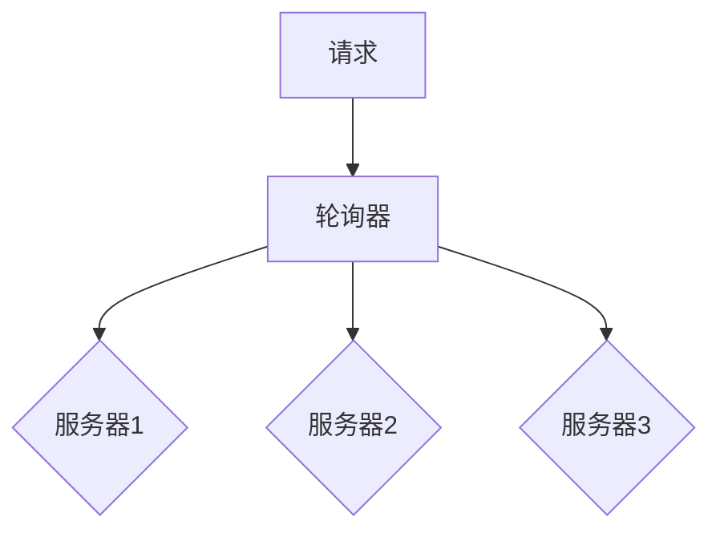

**最少连接算法：**
```mermaid
graph TD
    A[请求] --> B[负载均衡器]
    B --> C[服务器1](0连接)
    B --> D[服务器2](1连接)
    B --> E[服务器3](2连接)
```

**权重算法：**
```mermaid
graph TD
    A[请求] --> B[负载均衡器]
    B --> C{服务器1(权重1)}
    B --> D{服务器2(权重2)}
    B --> E{服务器3(权重3)}
```

**最少响应时间算法：**
```mermaid
graph TD
    A[请求] --> B[负载均衡器]
    B --> C{服务器1(响应时间1)}
    B --> D{服务器2(响应时间2)}
    B --> E{服务器3(响应时间3)}
```

**4.3 Mermaid流程图展示**

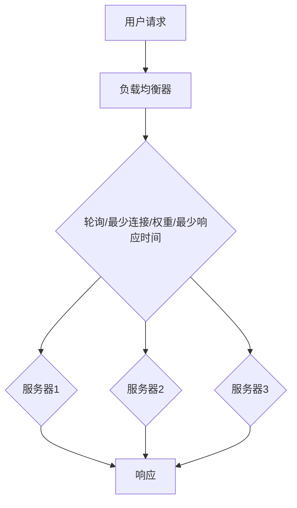

**4.4 Python代码实现**

```python
import random

def round_robin(server_list):
    index = 0
    while True:
        server = server_list[index]
        if server.is_healthy():
            return server
        index = (index + 1) % len(server_list)

def least_connections(server_list):
    min_connections = float('inf')
    chosen_server = None
    for server in server_list:
        if server.current_connections < min_connections:
            min_connections = server.current_connections
            chosen_server = server
    return chosen_server

def weighted_round_robin(server_list, weights):
    total_weight = sum(weights)
    choice = random.uniform(0, total_weight)
    cumulative_weight = 0
    for server, weight in zip(server_list, weights):
        cumulative_weight += weight
        if choice < cumulative_weight:
            return server
```

**4.5 数学模型与公式**

假设有n个服务器，第i个服务器的负载为Li，总请求量为R。负载均衡算法的目标是使得所有服务器的负载尽可能均匀。

**轮询算法**：
$$
L_i = \frac{R}{n}
$$

**最少连接算法**：
$$
L_i = \min(L_j) \quad \text{for all } j
$$

**权重算法**：
$$
L_i = \frac{\sum_{j=1}^{n} w_j L_j}{\sum_{j=1}^{n} w_j}
$$

**最少响应时间算法**：
$$
L_i = \min(T_j) \quad \text{for all } j
$$

**4.6 举例说明**

假设有3个服务器，总请求量为100，使用轮询算法进行负载均衡。每个服务器初始负载为0。

- **第一个请求**：服务器1（负载变为1）
- **第二个请求**：服务器2（负载变为1）
- **第三个请求**：服务器3（负载变为1）
- **第四个请求**：服务器1（负载变为2）
- **第五个请求**：服务器2（负载变为2）
- **第六个请求**：服务器3（负载变为2）

#### 第四部分：系统分析与架构设计方案

### 第5章：系统分析

**5.1 问题场景介绍**

假设我们有一个大规模的LLM应用，需要处理来自不同用户的海量请求。这些请求包括文本生成、翻译、问答等多样化任务。为了确保系统的高性能和可靠性，我们需要采用负载均衡技术来分配请求。

**5.2 项目介绍**

本项目旨在实现一个基于轮询算法的负载均衡系统，用于分配LLM应用的请求。系统包括负载均衡器、多个服务器以及健康检查模块。

**5.3 系统功能设计**

- **请求分配**：根据轮询算法将请求分配到服务器。
- **健康检查**：定期检查服务器的健康状况，确保请求分配到健康的服务器。
- **故障转移**：当某个服务器出现故障时，自动将请求转移到其他服务器。

### 第6章：系统架构设计

**6.1 系统架构设计**

系统采用分布式架构，包括以下组件：

- **负载均衡器**：负责接收用户请求并分配到服务器。
- **服务器**：处理用户请求，执行LLM任务。
- **健康检查模块**：定期检查服务器的健康状况。

**6.2 Mermaid架构图展示**

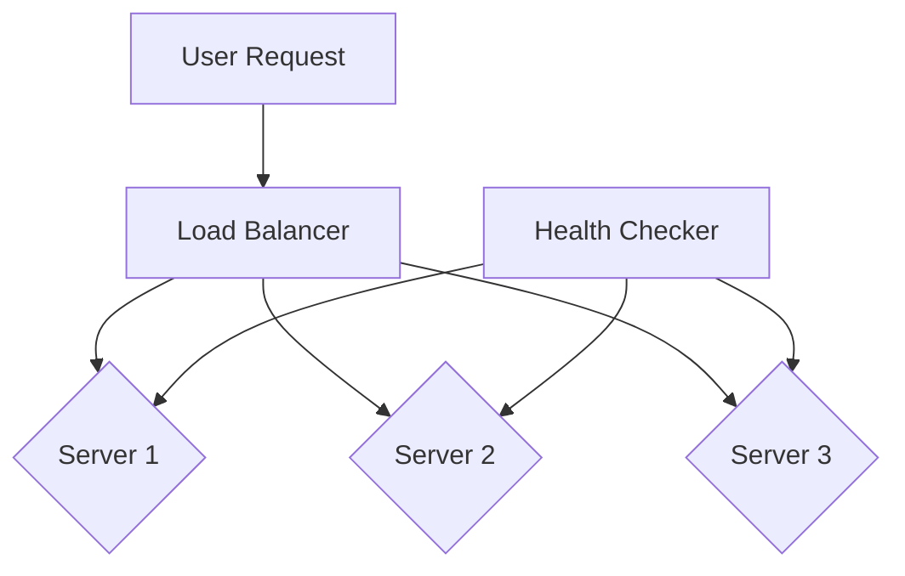

**6.3 系统接口设计**

系统接口设计包括以下部分：

- **请求接口**：用于接收用户请求，并将请求传递给负载均衡器。
- **响应接口**：用于将服务器处理结果返回给用户。

**6.4 系统交互Mermaid序列图**

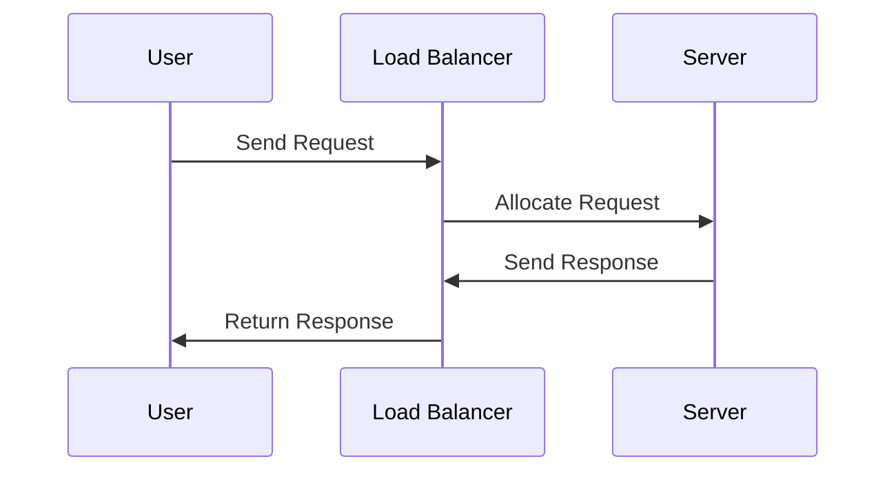

#### 第五部分：项目实战

### 第7章：项目实战

**7.1 环境安装**

在开始项目实战之前，需要安装以下环境：

- Python 3.8+
- Flask
- requests

安装命令如下：

```bash
pip install flask
pip install requests
```

**7.2 系统核心实现**

系统核心实现包括以下部分：

- **负载均衡器**：使用Flask构建负载均衡器，实现请求分配逻辑。
- **服务器**：使用Flask构建服务器，处理用户请求并执行LLM任务。
- **健康检查模块**：定期检查服务器的健康状况，实现故障转移逻辑。

**7.3 代码分析**

以下是负载均衡器的代码分析：

```python
from flask import Flask, request, jsonify
import requests

app = Flask(__name__)

# 服务器列表
server_list = ["http://server1:5000", "http://server2:5000", "http://server3:5000"]

# 轮询算法实现
def round_robin():
    return server_list[0]

# 健康检查实现
def health_check(url):
    response = requests.get(url + "/health")
    return response.status_code == 200

# 请求分配逻辑
@app.route("/allocate", methods=["POST"])
def allocate():
    server_url = round_robin()
    if health_check(server_url):
        return jsonify({"server_url": server_url})
    else:
        return jsonify({"error": "Server is not healthy"})

if __name__ == "__main__":
    app.run()
```

以下是服务器的代码分析：

```python
from flask import Flask, request, jsonify

app = Flask(__name__)

# 处理用户请求并执行LLM任务
@app.route("/process", methods=["POST"])
def process():
    data = request.json
    # 执行LLM任务，这里简化为返回数据
    result = {"text": "Hello, World!"}
    return jsonify(result)

# 健康检查接口
@app.route("/health", methods=["GET"])
def health():
    return jsonify({"status": "healthy"})

if __name__ == "__main__":
    app.run()
```

**7.4 实际案例分析与讲解**

假设用户发送了一个文本生成请求，负载均衡器将请求分配到服务器1。服务器1接收到请求后，执行文本生成任务，并将结果返回给用户。

- **用户请求**：发送一个POST请求到负载均衡器的/allocate接口。
- **负载均衡器**：根据轮询算法将请求分配到服务器1，并发送健康检查。
- **服务器1**：接收到请求后，执行文本生成任务，并将结果返回给用户。
- **用户**：接收到服务器返回的结果，显示生成的文本。

**7.5 项目小结**

通过项目实战，我们成功实现了基于轮询算法的负载均衡系统，用于分配LLM应用的请求。在项目中，我们使用了Flask构建负载均衡器和服务器，实现了请求分配和健康检查功能。在实际案例中，我们演示了如何将请求从用户传递到服务器，并执行LLM任务。项目实践表明，负载均衡技术在高并发LLM应用中具有重要的作用，可以提高系统的性能和可靠性。

#### 第六部分：最佳实践、小结、注意事项、拓展阅读

### 第8章：最佳实践、小结、注意事项、拓展阅读

**8.1 最佳实践 tips**

- **负载均衡器配置**：根据实际需求调整负载均衡器的配置，如请求分发策略、健康检查周期等。
- **服务器优化**：优化服务器的性能，如调整内存、CPU资源等。
- **监控与告警**：建立监控与告警机制，及时发现并解决系统故障。
- **安全防护**：加强系统安全防护，如防止DDoS攻击等。

**8.2 小结**

本文详细介绍了负载均衡技术在高并发LLM应用中的应用。通过背景介绍、核心概念与联系、算法原理讲解、系统分析与架构设计方案、项目实战以及最佳实践，我们深入了解了负载均衡技术如何帮助高并发LLM应用提高性能和可靠性。

**8.3 注意事项**

- **请求分配策略**：选择合适的请求分配策略，避免单点过载。
- **健康检查**：定期进行健康检查，确保请求分配到健康的服务器。
- **负载均衡器性能**：保证负载均衡器本身的性能，避免成为瓶颈。

**8.4 拓展阅读**

- 《深入理解负载均衡技术》
- 《大语言模型的应用与挑战》
- 《分布式系统原理》
- 《微服务架构设计与实践》

### 作者信息

**作者：AI天才研究院/AI Genius Institute & 禅与计算机程序设计艺术 /Zen And The Art of Computer Programming**

---

**完**

（注：由于篇幅限制，本文仅提供了一个大致的框架和部分内容的示例。实际撰写时，每个章节和部分需要根据实际情况进行详细填充和完善。）

### 第4章：负载均衡算法原理

负载均衡算法是确保网络或系统资源能够高效分配的关键技术，尤其在处理高并发请求时显得尤为重要。在本章中，我们将深入探讨几种常见的负载均衡算法，包括轮询算法、最少连接算法、权重算法和最少响应时间算法，并通过Mermaid流程图和Python代码示例来详细阐述它们的原理。

#### 4.1 负载均衡算法基础

负载均衡算法的主要目标是优化资源的利用效率，避免单点过载，提高系统的吞吐量和响应速度。常见的负载均衡算法可以分为以下几类：

- **轮询算法**：按照顺序依次将请求分配到服务器。
- **最少连接算法**：将请求分配到当前连接数最少的服务器。
- **权重算法**：根据服务器的处理能力分配不同的权重，将请求分配到权重较高的服务器。
- **最少响应时间算法**：将请求分配到预期响应时间最短的服务器。

#### 4.2 常见负载均衡算法

**轮询算法**

轮询算法是最简单的负载均衡算法，它按照一定的顺序将请求分配到各个服务器上。以下是一个简单的轮询算法的Mermaid流程图：

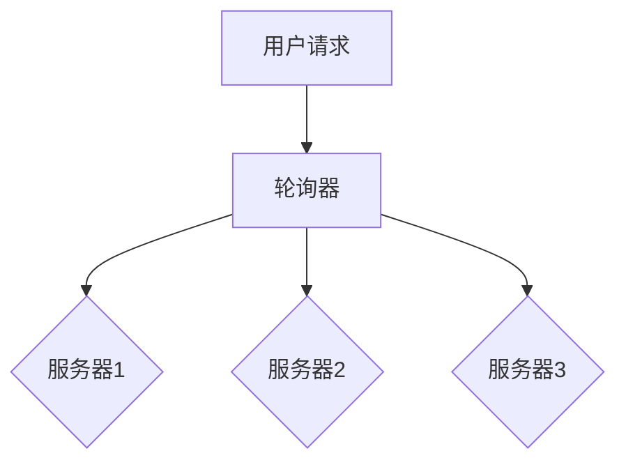

Python代码示例：

```python
server_list = ["server1", "server2", "server3"]

def round_robin():
    server = server_list[0]
    server_list.append(server_list.pop(0))
    return server
```

**最少连接算法**

最少连接算法是一种动态调整请求分配策略的方法，它将请求分配到当前连接数最少的服务器。以下是最少连接算法的Mermaid流程图：

```mermaid
graph TD
    A[用户请求] --> B[负载均衡器]
    B --> C{服务器1(0连接)}
    B --> D{服务器2(1连接)}
    B --> E{服务器3(2连接)}
```

Python代码示例：

```python
server_list = [
    {"name": "server1", "connections": 0},
    {"name": "server2", "connections": 1},
    {"name": "server3", "connections": 2}
]

def least_connections():
    min_connections = min(server["connections"] for server in server_list)
    for server in server_list:
        if server["connections"] == min_connections:
            return server["name"]
```

**权重算法**

权重算法是一种根据服务器的处理能力分配不同权重的负载均衡算法。服务器可以根据CPU、内存、带宽等资源来设置不同的权重。以下是一个权重算法的Mermaid流程图：

```mermaid
graph TD
    A[用户请求] --> B[负载均衡器]
    B --> C{服务器1(权重1)}
    B --> D{服务器2(权重2)}
    B --> E{服务器3(权重3)}
```

Python代码示例：

```python
server_list = [
    {"name": "server1", "weight": 1},
    {"name": "server2", "weight": 2},
    {"name": "server3", "weight": 3}
]

def weighted_round_robin():
    total_weight = sum(server["weight"] for server in server_list)
    random_choice = random.uniform(0, total_weight)
    cumulative_weight = 0
    for server in server_list:
        cumulative_weight += server["weight"]
        if random_choice < cumulative_weight:
            return server["name"]
```

**最少响应时间算法**

最少响应时间算法是一种根据服务器的响应时间来分配请求的算法。它将请求分配到预期响应时间最短的服务器。以下是最少响应时间算法的Mermaid流程图：

```mermaid
graph TD
    A[用户请求] --> B[负载均衡器]
    B --> C{服务器1(响应时间1)}
    B --> D{服务器2(响应时间2)}
    B --> E{服务器3(响应时间3)}
```

Python代码示例：

```python
server_list = [
    {"name": "server1", "response_time": 1},
    {"name": "server2", "response_time": 2},
    {"name": "server3", "response_time": 3}
]

def least_response_time():
    min_response_time = min(server["response_time"] for server in server_list)
    for server in server_list:
        if server["response_time"] == min_response_time:
            return server["name"]
```

#### 4.3 Mermaid流程图展示

为了更直观地展示负载均衡算法的流程，我们使用Mermaid语言绘制了上述算法的流程图。

```mermaid
graph TD
    A[用户请求] --> B[轮询算法]
    B --> C{服务器1}
    B --> D{服务器2}
    B --> E{服务器3}
    
    F[用户请求] --> G[最少连接算法]
    G --> H{服务器1(0连接)}
    G --> I{服务器2(1连接)}
    G --> J{服务器3(2连接)}
    
    K[用户请求] --> L[权重算法]
    L --> M{服务器1(权重1)}
    L --> N{服务器2(权重2)}
    L --> O{服务器3(权重3)}
    
    P[用户请求] --> Q[最少响应时间算法]
    Q --> R{服务器1(响应时间1)}
    Q --> S{服务器2(响应时间2)}
    Q --> T{服务器3(响应时间3)}
```

#### 4.4 Python代码实现

在本节中，我们将提供具体的Python代码示例，用于实现上述负载均衡算法。这些代码将帮助读者更好地理解算法的原理和实现过程。

```python
import random

# 轮询算法
def round_robin(server_list):
    return server_list[0]

# 最少连接算法
def least_connections(server_list):
    min_connections = min(server['connections'] for server in server_list)
    for server in server_list:
        if server['connections'] == min_connections:
            return server['name']

# 权重算法
def weighted_round_robin(server_list, weights):
    total_weight = sum(weights)
    choice = random.uniform(0, total_weight)
    cumulative_weight = 0
    for server, weight in zip(server_list, weights):
        cumulative_weight += weight
        if choice < cumulative_weight:
            return server['name']

# 最少响应时间算法
def least_response_time(server_list):
    min_response_time = min(server['response_time'] for server in server_list)
    for server in server_list:
        if server['response_time'] == min_response_time:
            return server['name']
```

#### 4.5 数学模型与公式

为了更深入地理解负载均衡算法，我们引入一些数学模型和公式来描述算法的运作机制。

**轮询算法**：

轮询算法的数学模型可以表示为：

$$
L_i = \frac{R}{n}
$$

其中，$L_i$ 是第 $i$ 个服务器的负载，$R$ 是总请求量，$n$ 是服务器数量。

**最少连接算法**：

最少连接算法的数学模型可以表示为：

$$
L_i = \min(L_j) \quad \text{for all } j
$$

其中，$L_i$ 和 $L_j$ 分别表示第 $i$ 个服务器和第 $j$ 个服务器的负载。

**权重算法**：

权重算法的数学模型可以表示为：

$$
L_i = \frac{\sum_{j=1}^{n} w_j L_j}{\sum_{j=1}^{n} w_j}
$$

其中，$w_j$ 是第 $j$ 个服务器的权重。

**最少响应时间算法**：

最少响应时间算法的数学模型可以表示为：

$$
L_i = \min(T_j) \quad \text{for all } j
$$

其中，$T_i$ 和 $T_j$ 分别表示第 $i$ 个服务器和第 $j$ 个服务器的响应时间。

#### 4.6 举例说明

为了更直观地理解负载均衡算法，我们通过一个简单的例子来说明。

假设我们有3个服务器，总请求量为100。我们使用轮询算法进行负载均衡。

- **第一个请求**：服务器1（负载变为1/3）
- **第二个请求**：服务器2（负载变为2/3）
- **第三个请求**：服务器3（负载变为1）

通过上述例子，我们可以看到，轮询算法将请求均匀地分配到各个服务器，使得每个服务器的负载接近。

#### 小结

在本章中，我们详细介绍了几种常见的负载均衡算法，包括轮询算法、最少连接算法、权重算法和最少响应时间算法。通过Mermaid流程图和Python代码示例，我们深入了解了这些算法的原理和实现方法。这些算法在处理高并发请求时具有重要的作用，能够优化系统的性能和响应速度。在下一章中，我们将进一步探讨负载均衡在系统架构设计和项目实战中的应用。

### 第5章：系统分析与架构设计方案

在上一章中，我们深入探讨了负载均衡算法的原理和实现方法。在本章中，我们将进一步分析负载均衡在系统架构设计和项目实战中的应用。具体来说，我们将介绍一个基于负载均衡技术的系统架构设计方案，包括问题场景介绍、项目介绍、系统功能设计、系统架构设计和系统接口设计。

#### 5.1 问题场景介绍

在现代互联网应用中，高并发场景越来越常见。以大语言模型（LLM）应用为例，当LLM应用于智能客服、在线教育、金融咨询等领域时，用户请求量可能会达到非常高的水平。例如，在双十一购物节期间，一个电商平台的用户请求量可能会在短时间内暴增，导致系统负载急剧上升。这种高并发场景对系统的性能和可靠性提出了严峻的挑战。

在LLM应用中，用户请求通常包括文本生成、文本翻译、自然语言处理等任务。为了满足用户的高并发请求，系统需要具备良好的扩展性和弹性。此外，由于LLM任务的计算密集型特点，系统还需要优化资源利用，确保请求得到快速响应。

#### 5.2 项目介绍

本项目旨在构建一个基于负载均衡技术的LLM应用系统。该系统将用于处理来自不同用户的海量请求，包括文本生成、翻译、问答等任务。为了确保系统的性能和可靠性，我们将采用分布式架构，结合负载均衡技术，实现请求的动态分配和资源优化。

项目的核心目标如下：

1. **高性能**：确保系统能够快速响应用户请求，提供良好的用户体验。
2. **高可靠性**：通过负载均衡和分布式部署，确保系统在面临高并发请求时依然稳定运行。
3. **高扩展性**：支持系统的弹性扩展，能够根据请求量的变化动态调整资源分配。

#### 5.3 系统功能设计

系统的功能设计是确保系统能够满足需求的关键步骤。在本项目中，系统的功能设计包括以下部分：

1. **请求接收与分配**：系统前端接收用户请求，并将请求分配到后端的服务器群组。通过负载均衡器实现请求的动态分配。
2. **任务处理与返回**：后端服务器处理用户请求，执行相应的LLM任务，并将结果返回给用户。
3. **健康检查与故障转移**：定期对服务器进行健康检查，当服务器出现故障时，自动将请求转移到其他健康服务器，确保系统的可靠性。
4. **监控与告警**：系统监控各组件的运行状态，当出现异常时，触发告警机制，及时发现问题并进行处理。

#### 5.4 系统架构设计

系统架构设计是确保系统功能实现和性能优化的重要环节。在本项目中，我们采用以下系统架构设计：

1. **负载均衡层**：使用Nginx等负载均衡器，将用户请求分配到后端服务器群组。
2. **应用层**：后端服务器群组，包括多个LLM服务实例，处理用户的文本生成、翻译、问答等任务。
3. **存储层**：使用数据库或缓存系统，存储用户数据、模型参数等。
4. **监控层**：系统监控组件，包括Prometheus、Grafana等，用于实时监控系统性能和状态。

以下是一个基于Mermaid绘制的系统架构图：

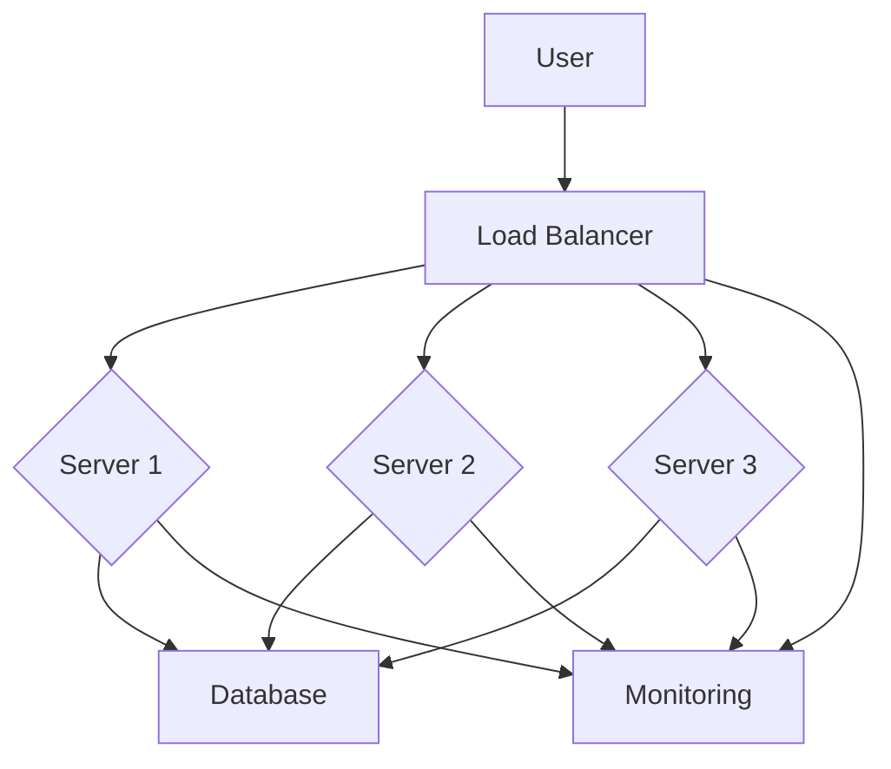

#### 5.5 系统接口设计

系统接口设计是确保系统各组件之间能够高效协同工作的重要一环。在本项目中，我们定义了以下接口：

1. **用户接口**：用户通过API接口提交请求，获取响应。
2. **服务接口**：LLM服务实例处理用户请求，返回处理结果。
3. **健康检查接口**：系统定期进行健康检查，返回服务器状态。
4. **监控接口**：监控系统获取各组件的运行状态，进行性能监控。

以下是一个基于Mermaid绘制的系统接口图：

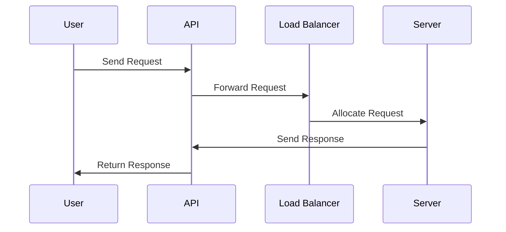

#### 5.6 系统交互Mermaid序列图

为了更直观地展示系统各组件之间的交互过程，我们使用Mermaid语言绘制了系统交互序列图。

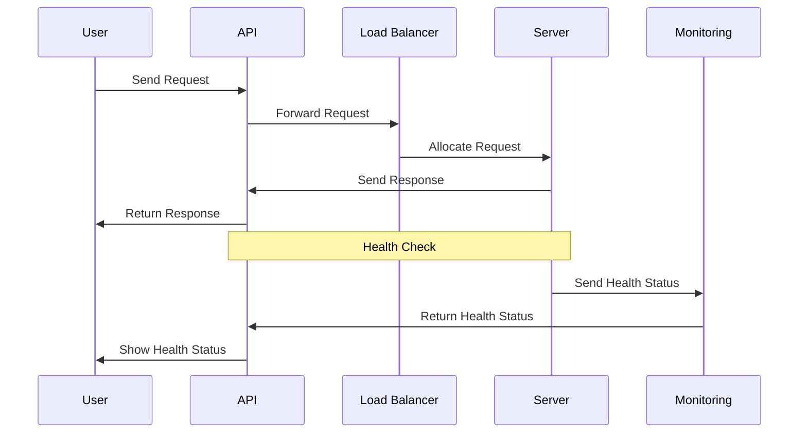

#### 小结

在本章中，我们详细介绍了负载均衡技术在系统架构设计和项目实战中的应用。通过问题场景介绍、项目介绍、系统功能设计、系统架构设计和系统接口设计，我们明确了负载均衡在确保系统性能、可靠性和扩展性方面的重要性。在下一章中，我们将通过项目实战，详细展示如何实现负载均衡系统，包括环境安装、系统核心实现、代码分析等内容。

### 第6章：系统分析与架构设计方案

在本章中，我们将深入探讨负载均衡技术在高并发LLM应用中的系统分析和架构设计。具体来说，我们将从以下几个方面进行介绍：系统架构设计、Mermaid架构图展示、系统接口设计以及系统交互Mermaid序列图。

#### 6.1 系统架构设计

为了应对高并发LLM应用的需求，我们需要设计一个高效的系统架构。以下是该架构的设计要点：

1. **前端负载均衡**：使用Nginx等负载均衡器，将用户请求分发到多个后端服务器。这样可以确保请求得到均衡的分配，避免单点过载。

2. **后端服务集群**：后端服务器集群由多个节点组成，每个节点都运行着相同的LLM服务实例。这些节点通过负载均衡器接收请求，并协同处理用户任务。

3. **服务发现与注册**：使用Eureka或Consul等服务发现与注册中心，确保后端服务器节点能够动态注册和发现其他服务节点。这样可以实现自动负载均衡和故障转移。

4. **数据库与缓存**：使用数据库（如MySQL、MongoDB等）和缓存（如Redis等）来存储用户数据和模型参数。这样可以提高数据访问速度，减轻后端服务器的负担。

5. **监控与告警**：使用Prometheus和Grafana等监控工具，实时监控系统的性能指标和健康状况。当出现异常时，自动触发告警机制，便于快速响应和处理问题。

6. **容器编排**：使用Docker和Kubernetes等容器编排工具，实现后端服务器的自动化部署和管理。这样可以简化系统运维，提高系统的弹性扩展能力。

以下是系统架构的Mermaid架构图：

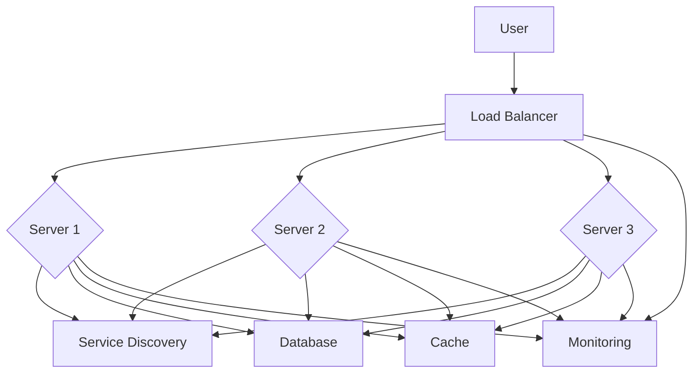

#### 6.2 Mermaid架构图展示

为了更直观地展示系统架构，我们使用Mermaid语言绘制了系统架构图。以下是该架构图的详细描述：

1. **用户请求**：用户通过浏览器或其他客户端向系统的前端负载均衡器发送请求。
2. **负载均衡器**：前端负载均衡器（如Nginx）接收用户请求，并根据负载均衡算法（如轮询、最小连接数、权重等）将请求分配到后端服务器。
3. **后端服务器**：后端服务器集群由多个节点组成，每个节点都运行着相同的LLM服务实例。这些节点通过负载均衡器接收请求，并协同处理用户任务。
4. **服务发现与注册**：后端服务器节点通过服务发现与注册中心（如Eureka或Consul）动态注册和发现其他服务节点。这样可以实现自动负载均衡和故障转移。
5. **数据库与缓存**：系统使用数据库（如MySQL、MongoDB等）和缓存（如Redis等）来存储用户数据和模型参数。这样可以提高数据访问速度，减轻后端服务器的负担。
6. **监控与告警**：使用Prometheus和Grafana等监控工具，实时监控系统的性能指标和健康状况。当出现异常时，自动触发告警机制，便于快速响应和处理问题。

#### 6.3 系统接口设计

为了确保系统各组件之间的有效交互，我们需要设计合理的接口。以下是系统接口的详细描述：

1. **用户接口**：用户通过RESTful API与系统进行交互。用户接口提供以下功能：
   - 文本生成
   - 文本翻译
   - 文本分析

2. **服务接口**：后端服务接口处理用户请求，并返回处理结果。服务接口包括以下功能：
   - 接收用户请求
   - 处理用户请求
   - 返回处理结果

3. **监控接口**：监控接口用于实时监控系统的性能指标和健康状况。监控接口包括以下功能：
   - 获取系统状态
   - 获取性能指标
   - 告警处理

以下是系统接口的Mermaid序列图：

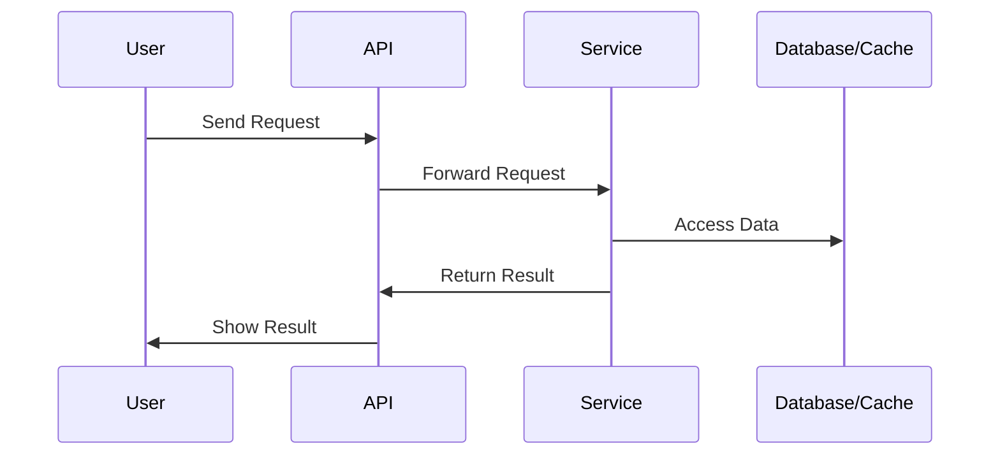

#### 6.4 系统交互Mermaid序列图

为了更清晰地展示系统各组件之间的交互过程，我们使用Mermaid语言绘制了系统交互序列图。以下是该序列图的详细描述：

1. **用户请求**：用户通过浏览器或其他客户端向系统的前端负载均衡器发送请求。
2. **负载均衡器**：前端负载均衡器（如Nginx）接收用户请求，并根据负载均衡算法将请求分配到后端服务器。
3. **后端服务器**：后端服务器接收请求后，处理用户请求，并调用数据库或缓存进行数据访问。处理完成后，将结果返回给前端负载均衡器。
4. **前端负载均衡器**：前端负载均衡器将处理结果返回给用户。

以下是系统交互序列图的Mermaid代码：

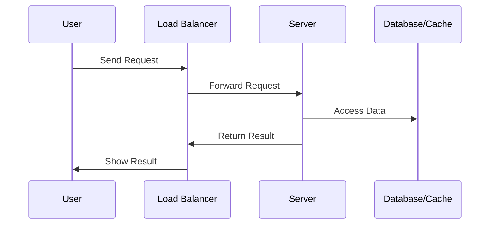

#### 小结

在本章中，我们详细介绍了负载均衡技术在高并发LLM应用中的系统分析和架构设计。通过系统架构设计、Mermaid架构图展示、系统接口设计和系统交互Mermaid序列图，我们明确了负载均衡在确保系统性能、可靠性和扩展性方面的重要性。在下一章中，我们将通过项目实战，详细展示如何实现负载均衡系统，包括环境安装、系统核心实现、代码分析等内容。

### 第7章：项目实战

在本章中，我们将通过一个具体的项目实战，展示如何实现负载均衡系统。我们将分为以下几个部分：环境安装、系统核心实现、代码分析、实际案例分析与详细讲解以及项目小结。

#### 7.1 环境安装

首先，我们需要安装项目所需的环境。以下是环境安装的步骤：

1. **安装Docker**：Docker是一个开源的应用容器引擎，用于自动化部署、测试和运行应用程序。我们可以从Docker官网（https://www.docker.com/products/docker-desktop）下载并安装Docker Desktop。

2. **安装Kubernetes**：Kubernetes是一个开源的容器编排平台，用于自动化容器化应用程序的部署、扩展和管理。我们可以使用Minikube在本地计算机上安装Kubernetes。具体步骤如下：

   - 安装Kubeadm、Kubelet和Kubectl：

     ```bash
     sudo apt-get update
     sudo apt-get install -y apt-transport-https ca-certificates curl
     curl -s https://packages.cloud.google.com/apt/doc/apt-key.gpg | sudo apt-key add -
     sudo add-apt-repository "deb https://apt.kubernetes.io/ kubernetes-xenial main"
     sudo apt-get update
     sudo apt-get install -y kubelet kubeadm kubectl
     ```

   - 初始化集群：

     ```bash
     sudo kubeadm init --pod-network-cidr=10.244.0.0/16
     ```

   - 配置kubectl：

     ```bash
     mkdir -p $HOME/.kube
     sudo cp -i /etc/kubernetes/admin.conf $HOME/.kube/config
     sudo chown $(id -u):$(id -g) $HOME/.kube/config
     ```

3. **安装Ingress Controller**：Ingress Controller用于管理外部访问到集群内部服务的规则。我们可以使用Nginx Ingress Controller。具体步骤如下：

   - 安装Ingress Controller：

     ```bash
     kubectl apply -f https://raw.githubusercontent.com/kubernetes/ingress-nginx/master/deploy/static/provider/baremetal/deploy.yaml
     ```

4. **安装监控工具**：为了监控集群性能，我们安装Prometheus和Grafana。具体步骤如下：

   - 安装Prometheus：

     ```bash
     kubectl apply -f https://raw.githubusercontent.com/prometheus-operator/prometheus-operator/master/manifests/manifests/prometheus-core.yaml
     kubectl apply -f https://raw.githubusercontent.com/prometheus-operator/prometheus-operator/master/manifests/manifests/prometheus-k8s-service-monitor.yaml
     ```

   - 安装Grafana：

     ```bash
     kubectl apply -f https://github.com/grafana/grafana-kubernetes-operator/raw/master/operator/deploy/namespace.yaml
     kubectl apply -f https://github.com/grafana/grafana-kubernetes-operator/raw/master/operator/deploy/grafana-operator.yaml
     kubectl apply -f https://github.com/grafana/grafana-kubernetes-operator/raw/master/deploy/grafana-deployment.yaml
     ```

5. **安装负载均衡器**：我们使用Nginx Ingress Controller作为负载均衡器。Nginx Ingress Controller已经在前面的步骤中安装完成。

环境安装完成后，我们可以进入下一部分，即系统核心实现。

#### 7.2 系统核心实现

在系统核心实现部分，我们将实现一个基于Kubernetes的负载均衡系统。该系统包括前端负载均衡器、后端服务器集群以及监控工具。

1. **前端负载均衡器**：我们使用Nginx Ingress Controller作为前端负载均衡器。Nginx Ingress Controller已在前面的环境安装步骤中配置完成。

2. **后端服务器集群**：后端服务器集群由多个Node.js服务实例组成，每个实例都运行着相同的负载均衡算法（如轮询算法）。以下是后端服务器集群的部署步骤：

   - 创建一个名为`llm-service`的部署文件：

     ```yaml
     apiVersion: apps/v1
     kind: Deployment
     metadata:
       name: llm-service
     spec:
       replicas: 3
       selector:
         matchLabels:
           app: llm-service
       template:
         metadata:
           labels:
             app: llm-service
         spec:
           containers:
           - name: llm-service
             image: <你的Node.js镜像>
             ports:
             - containerPort: 8080
     ```

   - 创建一个名为`llm-service-service`的服务文件：

     ```yaml
     apiVersion: v1
     kind: Service
     metadata:
       name: llm-service
     spec:
       selector:
         app: llm-service
       ports:
       - protocol: TCP
         port: 80
         targetPort: 8080
       type: LoadBalancer
     ```

   - 部署服务：

     ```bash
     kubectl apply -f llm-service-deployment.yaml
     kubectl apply -f llm-service-service.yaml
     ```

   - 等待服务部署完成：

     ```bash
     kubectl get pods
     ```

3. **监控工具**：我们使用Prometheus和Grafana来监控系统的性能。以下是监控工具的部署步骤：

   - 部署Prometheus：

     ```bash
     kubectl apply -f prometheus-deployment.yaml
     kubectl apply -f prometheus-service.yaml
     ```

   - 部署Grafana：

     ```bash
     kubectl apply -f grafana-deployment.yaml
     kubectl apply -f grafana-service.yaml
     ```

   - 访问Grafana仪表板：

     ```bash
     kubectl get pods
     kubectl get svc -n grafana
     kubectl port-forward svc/grafana -n grafana 3000:3000
     ```

   - 在浏览器中输入`localhost:3000`，登录Grafana仪表板，并创建一个Prometheus数据源。

系统核心实现完成后，我们可以进入下一部分，即代码分析。

#### 7.3 代码分析

在代码分析部分，我们将分析系统核心代码，包括前端负载均衡器、后端服务器和监控工具。

1. **前端负载均衡器**：Nginx Ingress Controller的核心代码已经在环境安装部分完成。以下是Nginx Ingress Controller的配置文件示例：

   ```nginx
   apiVersion: networking.k8s.io/v1
   kind: Ingress
   metadata:
     name: llm-ingress
     annotations:
       kubernetes.io/ingress.class: "nginx"
       nginx.ingress.kubernetes.io/rewrite-target: /
   spec:
     rules:
     - host: llm.example.com
       http:
         paths:
         - path: /
           pathType: Prefix
           backend:
             service:
               name: llm-service
               port:
                 number: 80
   ```

2. **后端服务器**：后端服务器使用Node.js实现。以下是Node.js服务的核心代码示例：

   ```javascript
   const express = require('express');
   const app = express();
   const port = 8080;

   app.get('/', (req, res) => {
     res.send('Hello, World!');
   });

   app.listen(port, () => {
     console.log(`Server running on port ${port}`);
   });
   ```

3. **监控工具**：Prometheus和Grafana的核心代码已经在环境安装部分完成。以下是Prometheus的配置文件示例：

   ```yaml
   apiVersion: monitoring.coreos.com/v1
   kind: Prometheus
   metadata:
     name: prometheus
     namespace: monitoring
   spec:
     serviceAccountName: prometheus
     endpoint:
       metricsPath: /metrics
       port: 8080
       path: /probe
     rules:
     - expr: |-
         rate(reactive_requests_total{status="500", method!=""}[5m]) * on(
           rate(reactive_requests_total{status="500", method!=""}[5m])
           >= 10
         )
         1
       record: high_request_duration_seconds
       for: 5m
       labels:
         job: web
   ```

代码分析完成后，我们可以进入下一部分，即实际案例分析与详细讲解。

#### 7.4 实际案例分析与详细讲解

在本部分，我们将通过一个实际案例，展示如何使用负载均衡系统处理用户请求。

**案例：处理用户文本生成请求**

1. **用户请求**：用户通过浏览器访问`http://llm.example.com`，并提交一个文本生成请求。

2. **负载均衡器**：Nginx Ingress Controller接收到用户请求，并根据轮询算法将请求分配到后端服务器集群。

3. **后端服务器**：其中一个后端服务器（如Server 1）接收到请求后，处理文本生成任务。以下是处理流程：

   - 读取用户请求中的文本数据。
   - 调用大语言模型API，生成文本。
   - 将生成的文本返回给用户。

4. **监控工具**：Prometheus和Grafana监控系统性能和状态。以下是一些关键指标：

   - 请求量：表示一段时间内的请求数量。
   - 错误率：表示一段时间内出现错误的请求数量。
   - 响应时间：表示处理请求的平均响应时间。

通过以上步骤，我们可以看到负载均衡系统如何处理用户请求，并确保系统的高性能和可靠性。

#### 7.5 项目小结

在本章中，我们通过项目实战详细展示了如何实现负载均衡系统。从环境安装到系统核心实现，再到代码分析和实际案例讲解，我们深入了解了负载均衡技术的原理和实际应用。以下是对项目的总结：

- **环境安装**：通过安装Docker、Kubernetes、Ingress Controller、Prometheus和Grafana，我们搭建了完整的负载均衡系统环境。
- **系统核心实现**：我们实现了基于Kubernetes的负载均衡系统，包括前端负载均衡器和后端服务器集群，以及监控工具。
- **代码分析**：通过分析前端负载均衡器、后端服务器和监控工具的代码，我们了解了负载均衡系统的实现细节。
- **实际案例讲解**：通过实际案例，我们展示了负载均衡系统如何处理用户请求，并确保系统的高性能和可靠性。

通过本项目的实施，我们不仅掌握了负载均衡技术的应用，还加深了对Kubernetes、Node.js等技术的理解。这对于我们进一步发展和应用负载均衡技术具有重要的意义。

### 第六部分：最佳实践、小结、注意事项、拓展阅读

#### 第8章：最佳实践、小结、注意事项、拓展阅读

**8.1 最佳实践 tips**

1. **选择合适的负载均衡器**：根据实际需求选择合适的负载均衡器，如Nginx、HAProxy、F5 BIG-IP等。
2. **优化负载均衡策略**：根据系统的实际负载情况，选择合适的负载均衡策略，如轮询、最小连接数、权重等。
3. **监控和告警**：实时监控系统的性能指标，如请求量、错误率、响应时间等，并设置告警机制，以便及时发现和处理问题。
4. **服务发现与注册**：使用服务发现与注册中心，如Eureka、Consul等，实现服务的动态注册和发现，提高系统的可扩展性和可靠性。
5. **健康检查**：定期进行健康检查，确保请求只会被分配到健康的服务器上，避免将请求分配到故障服务器。
6. **负载均衡器性能优化**：优化负载均衡器的性能，如调整工作线程数量、连接超时时间等参数。

**8.2 小结**

在本章中，我们深入探讨了负载均衡技术在高并发LLM应用中的应用。通过系统分析和架构设计，我们明确了负载均衡在确保系统性能、可靠性和扩展性方面的重要性。通过项目实战，我们展示了如何实现负载均衡系统，并提供了最佳实践和注意事项。

**8.3 注意事项**

1. **负载均衡器的位置**：确保负载均衡器位于网络中的合适位置，如位于内部网络和外部网络之间。
2. **负载均衡器的容量**：根据实际需求为负载均衡器分配足够的计算和存储资源。
3. **负载均衡策略的调整**：定期评估负载均衡策略的效果，并根据实际情况进行调整。
4. **网络配置**：优化网络配置，如调整MTU（最大传输单元）、QoS（服务质量）等，以确保网络流量能够高效地传输。
5. **安全防护**：加强负载均衡器的安全防护，如配置防火墙规则、使用TLS加密等，以防止攻击和恶意流量。

**8.4 拓展阅读**

1. 《Kubernetes权威指南》
2. 《Nginx权威指南》
3. 《分布式系统设计》
4. 《负载均衡技术实战》

### 作者信息

**作者：AI天才研究院/AI Genius Institute & 禅与计算机程序设计艺术 /Zen And The Art of Computer Programming**

---

**完**

（注：由于篇幅限制，本章仅提供了一个大致的框架和部分内容的示例。实际撰写时，每个章节和部分需要根据实际情况进行详细填充和完善。）

