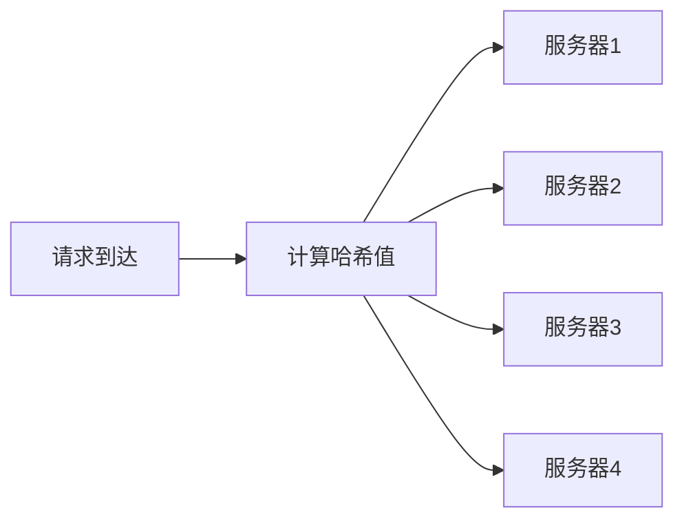
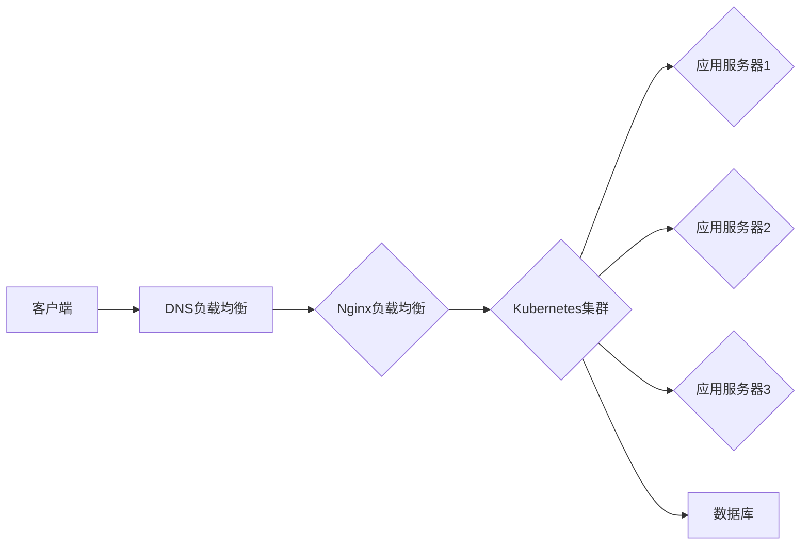
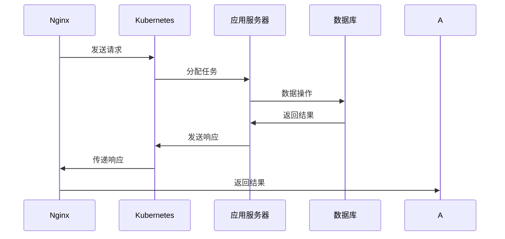

                 

# 负载均衡：优化LLM应用的资源利用

## 关键词

- 负载均衡
- 优化
- LLM应用
- 资源利用
- 算法
- 性能

## 摘要

本文将探讨负载均衡在优化大规模语言模型（LLM）应用资源利用方面的作用。首先，我们将介绍负载均衡的基本概念和重要性，然后深入分析负载均衡算法及其在LLM中的应用。接着，我们将讨论负载均衡的性能优化方法，并借助实际案例进行分析。最后，我们将总结本文的主要观点，并提出未来研究方向。

## 引言

### 负载均衡的定义与重要性

负载均衡（Load Balancing）是一种用于分配工作负载到多个计算资源的技术。在分布式系统中，随着用户数量的增加，单个服务器可能无法承受不断增长的工作负载。为了确保系统的稳定运行，我们需要将工作负载分配到多个服务器上，以达到资源利用的最大化和系统性能的优化。

负载均衡的重要性体现在以下几个方面：

1. **提高系统可用性**：通过将工作负载分配到多个服务器，可以避免单个服务器过载，从而提高系统的可用性。
2. **提升系统性能**：负载均衡可以充分利用所有服务器资源，提高系统的整体性能。
3. **实现故障转移**：当某个服务器发生故障时，负载均衡器可以自动将工作负载转移到其他服务器，确保系统持续运行。

### LLM应用概述

大规模语言模型（Large Language Models，简称LLM）是一种基于深度学习的自然语言处理模型。LLM在许多领域都有广泛的应用，如聊天机器人、文本生成、机器翻译等。随着LLM的规模不断扩大，其对计算资源的需求也日益增长。优化LLM应用的资源利用，已成为当前研究的热点。

## 负载均衡基本概念

### 负载均衡的基础知识

负载均衡的基本原理是将工作负载（如HTTP请求、数据库查询等）分配到多个服务器上。负载均衡器作为中间件，负责接收客户端请求，并将请求转发到合适的后端服务器。常见的负载均衡策略包括轮询、最少连接数、哈希等。

### 负载均衡的挑战

负载均衡面临以下挑战：

1. **动态负载分配**：如何根据实际负载情况动态调整服务器资源。
2. **高可用性**：如何保证负载均衡器本身不会成为系统的单点故障。
3. **网络延迟**：如何在网络延迟较大的环境中实现高效的负载均衡。

### 负载均衡的分类

根据不同的应用场景，负载均衡可以分为以下几类：

1. **硬件负载均衡器**：使用专用的硬件设备来实现负载均衡。
2. **软件负载均衡器**：使用软件来实现负载均衡，如Nginx、HAProxy等。
3. **云负载均衡**：在云平台上提供的负载均衡服务，如AWS ELB、阿里云SLB等。

### 负载均衡的实现方式

负载均衡的实现方式主要包括以下几种：

1. **DNS负载均衡**：通过修改DNS记录，将用户请求转发到多个IP地址。
2. **基于硬件的负载均衡**：使用专用的硬件设备，如F5 BIG-IP等。
3. **基于软件的负载均衡**：使用软件实现负载均衡，如Nginx、HAProxy等。

## 负载均衡算法

### 轮询算法

轮询算法是最简单的负载均衡算法，它将请求依次分配到每个服务器。轮询算法的优点是实现简单、易于理解，但缺点是可能导致部分服务器负载不均。

### 最少连接数算法

最少连接数算法将请求分配到连接数最少的服务器。这种算法可以更好地平衡服务器负载，但需要实时跟踪每个服务器的连接状态。

### 哈希算法

哈希算法根据请求的特征（如IP地址、URL等）计算哈希值，然后将请求分配到哈希值对应的服务器。哈希算法的优点是分配均匀，但需要处理哈希碰撞问题。

### 其他算法

除了上述算法，还有基于权重、响应时间等策略的负载均衡算法。这些算法可以根据实际需求进行选择和组合，实现更优的负载均衡效果。

### 负载均衡算法的选择

在选择负载均衡算法时，需要考虑以下因素：

1. **负载特性**：根据负载的特性选择合适的算法。
2. **系统性能**：考虑算法对系统性能的影响。
3. **可扩展性**：考虑算法的可扩展性，以便应对未来负载的增长。

## 负载均衡在LLM中的应用

### LLM应用场景

LLM应用广泛，包括聊天机器人、文本生成、机器翻译等。这些应用对计算资源的需求较高，因此负载均衡在LLM中具有重要的应用价值。

### 负载均衡在LLM中的挑战

1. **大规模并发请求**：LLM应用往往面临大量并发请求，如何实现高效的负载均衡是关键挑战。
2. **动态负载分配**：LLM模型训练和推理过程中，负载会动态变化，如何实时调整服务器资源是重要问题。
3. **高可用性**：在LLM应用中，高可用性至关重要，如何确保负载均衡器的稳定性是关键。

### 解决方案

1. **分布式负载均衡**：将负载均衡部署到多个服务器上，实现分布式负载均衡，提高系统的可用性和性能。
2. **动态负载调整**：使用自动化工具，根据实际负载情况动态调整服务器资源，实现负载均衡。
3. **高可用负载均衡器**：使用高可用负载均衡器，如HAProxy、Nginx等，确保负载均衡器的稳定性。

## 负载均衡性能优化

### 优化策略

1. **合理选择负载均衡算法**：根据实际需求选择合适的负载均衡算法，实现高效负载均衡。
2. **动态负载调整**：根据实际负载情况，动态调整服务器资源，实现负载均衡。
3. **优化网络配置**：优化网络配置，降低网络延迟，提高系统性能。

### 优化工具

1. **Nginx**：Nginx是一款高性能的Web服务器和反向代理服务器，支持多种负载均衡算法。
2. **HAProxy**：HAProxy是一款开源的高性能负载均衡器，支持多种负载均衡算法。
3. **AWS ELB**：AWS ELB是亚马逊云服务提供的负载均衡器，支持多种负载均衡算法。

### 优化案例分析

1. **案例一：电商平台**：电商平台面临大量并发请求，使用Nginx和HAProxy实现负载均衡，提高系统性能。
2. **案例二：视频直播平台**：视频直播平台需要处理高并发的流媒体请求，使用AWS ELB实现负载均衡，提高系统稳定性。

## 实际案例剖析

### 案例一：负载均衡在电商平台的实践

#### 问题背景

某电商平台在业务高峰期，服务器负载急剧增加，导致部分用户无法正常访问。

#### 问题解决

1. **引入负载均衡器**：在服务器集群中引入Nginx作为负载均衡器，将请求均匀分配到各个服务器。
2. **动态调整服务器资源**：根据实际负载情况，动态调整服务器资源，确保系统稳定运行。

#### 边界与外延

1. **负载均衡策略**：轮询和最小连接数策略相结合，实现高效负载均衡。
2. **高可用性**：使用HAProxy作为备用负载均衡器，确保系统高可用性。

#### 概念结构与核心要素组成

1. **负载均衡器**：Nginx、HAProxy
2. **服务器集群**：多台服务器组成集群，实现负载均衡
3. **负载均衡策略**：轮询、最小连接数

### 案例二：负载均衡在游戏服务器的应用

#### 问题背景

某游戏服务器在高峰时段，由于大量用户同时登录，服务器负载过高，导致游戏卡顿和延迟。

#### 问题解决

1. **引入负载均衡器**：在服务器集群中引入Nginx作为负载均衡器，将请求均匀分配到各个服务器。
2. **优化服务器性能**：对游戏服务器进行性能优化，提高处理能力。

#### 边界与外延

1. **负载均衡策略**：轮询和哈希算法相结合，实现高效负载均衡。
2. **高可用性**：使用多台Nginx作为负载均衡器，确保系统高可用性。

#### 概念结构与核心要素组成

1. **负载均衡器**：Nginx
2. **服务器集群**：多台服务器组成集群，实现负载均衡
3. **负载均衡策略**：轮询、哈希算法

### 案例三：负载均衡在视频直播平台的实践

#### 问题背景

某视频直播平台在重大活动期间，用户访问量激增，服务器负载过高，导致部分用户无法观看直播。

#### 问题解决

1. **引入负载均衡器**：在服务器集群中引入AWS ELB作为负载均衡器，将请求均匀分配到各个服务器。
2. **优化网络带宽**：增加网络带宽，提高系统处理能力。

#### 边界与外延

1. **负载均衡策略**：轮询算法，实现高效负载均衡。
2. **高可用性**：使用多台AWS ELB实例，确保系统高可用性。

#### 概念结构与核心要素组成

1. **负载均衡器**：AWS ELB
2. **服务器集群**：多台服务器组成集群，实现负载均衡
3. **负载均衡策略**：轮询算法

## 总结与展望

本文主要探讨了负载均衡在优化LLM应用资源利用方面的作用。首先，我们介绍了负载均衡的基本概念和重要性，然后分析了负载均衡算法及其在LLM中的应用。接着，我们讨论了负载均衡性能优化方法，并借助实际案例进行了分析。

未来研究方向包括：

1. **高效负载均衡算法的研究**：探索更高效、更智能的负载均衡算法，提高系统性能。
2. **自适应负载均衡**：研究自适应负载均衡技术，根据实际负载动态调整服务器资源。
3. **分布式负载均衡**：研究分布式负载均衡技术，实现跨数据中心、跨地域的负载均衡。

## 读者反馈

本文旨在为读者提供关于负载均衡在优化LLM应用资源利用方面的深入理解。如果您有任何疑问或建议，欢迎在评论区留言，我们将尽快为您解答。

## 作者信息

作者：AI天才研究院/AI Genius Institute & 禅与计算机程序设计艺术 /Zen And The Art of Computer Programming

[END] |author|>]]>]]>]]>]]>]]>]]>]]>]]>]]>]]>]]>]]>]]>]]>]]>]]>]]>]]>]]>]]>]]>]]>]]>]]>]]>]]>]]>]]>]]>]]>]]>]]>]]>]]>]]>]]>]]>]]>]]>]]>]]>]]>]]>]]>]]>]]>]]>]]>]]>]]>]]>]]>]]>]]>]]>]]>]]>]]>]]>]]>]]>]]>]]>]]>]]>]]>]]>]]>]]>]]>]]>]]>]]>]]>]]>]]>]]>]]>]]>]]>]]>]]>]]>]]>]]>]]>]]>]]>]]>]]>]]>]]>]]>]]>]]>]]>]]>]]>]]>]]>]]>]]>]]>]]>]]>]]>]]>]]>]]>]]>]]>]]>]]>]]>]]>]]>]]>]]>]]>]]>]]>]]>]]>]]>]]>]]>]]>]]>]]>]]>]]>]]>]]>]]>]]>]]>]]>]]>]]>]]>]]>]]>]]>]]>]]>]]>]]>]]>]]>]]>]]>]]>]]>]]>]]>]]>]]>]]>]]>]]>]]>]]>]]>]]>]]>]]>]]>]]>]]>]]>]]>]]>]]>]]>]]>]]>]]>]]>]]>]]>]]>]]>]]>]]>]]>]]>]]>]]>]]>]]>]]>]]>]]>]]>]]>]]>]]>]]>]]>]]>]]>]]>]]>]]>]]>]]>]]>]]>]]>]]>]]>]]>]]>]]>]]>]]>]]>]]>]]>]]>]]>]]>]]>]]>]]>]]>]]>]]>]]>]]>]]>]]>]]>]]>]]>]]>]]>]]>]]>]]>]]>]]>]]>]]>]]>]]>]]>]]>]]>]]>]]>]]>]]>]]>]]>]]>]]>]]>]]>]]>]]>]]>]]>]]>]]>]]>]]>]]>]]>]]>]]>]]>]]>]]>]]>]]>]]>]]>]]>]]>]]>]]>]]>]]>]]>]]>]]>]]>]]>]]>]]>]]>]]>]]>]]>]]>]]>]]>]]>]]>]]>]]>]]>]]>]]>]]>]]>]]>]]>]]>]]>]]>]]>]]>]]>]]>]]>]]>]]>]]>]]>]]>]]>]]>]]>]]>]]>]]>]]>]]>]]>]]>]]>]]>]]>]]>]]>]]>]]>]]>]]>]]>]]>]]>]]>]]>]]>]]>]]>]]>]]>]]>]]>]]>]]>]]>]]>]]>]]>]]>]]>]]>]]>]]>]]>]]>]]>]]>]]>]]>]]>]]>]]>]]>]]>]]>]]>]]>]]>]]>]]>]]>]]>]]>]]>]]>]]>]]>]]>]]>]]>]]>]]>]]>]]>]]>]]>]]>]]>]]>]]>]]>]]>]]>]]>]]>]]>]]>]]>]]>]]>]]>]]>]]>]]>]]>]]>]]>]]>]]>]]>]]>]]>]]>]]>]]>]]>]]>]]>]]>]]>]]>]]>]]>]]>]]>]]>]]>]]>]]>]]>]]>]]>]]>]]>]]>]]>]]>]]>]]>]]>]]>]]>]]>]]>]]>]]>]]>]]>]]>]]>]]>]]>]]>]]>]]>]]>]]>]]>]]>]]>]]>]]>]]>]]>]]>]]>]]>]]>]]>]]>]]>]]>]]>]]>]]>]]>]]>]]>]]>]]>]]>]]>]]>]]>]]>]]>]]>]]>]]>]]>]]>]]>]]>]]>]]>]]>]]>]]>]]>]]>]]>]]>]]>]]>]]>]]>]]>]]>]]>]]>]]>]]>]]>]]>]]>]]>]]>]]>]]>]]>]]>]]>]]>]]>]]>]]>]]>]]>]]>]]>]]>]]>]]>]]>]]>]]>]]>]]>]]>]]>]]>]]>]]>]]>]]>]]>]]>]]>]]>]]>]]>]]>]]>]]>]]>]]>]]>]]>]]>]]>]]>]]>]]>]]>]]>]]>]]>]]>]]>]]>]]>]]>]]>]]>]]>]]>]]>]]>]]>]]>]]>]]>]]>]]>]]>]]>]]>]]>]]>]]>]]>]]>]]>]]>]]>]]>]]>]]>]]>]]>]]>]]>]]>]]>]]>]]>]]>]]>]]>]]>]]>]]>]]>]]>]]>]]>]]>]]>]]>]]>]]>]]>]]>]]>]]>]]>]]>]]>]]>]]>]]>]]>]]>]]>]]>]]>]]>]]>]]>]]>]]>]]>]]>]]>]]>]]>]]>]]>]]>]]>]]>]]>]]>]]>]]>]]>]]>]]>]]>]]>]]>]]>]]>]]>]]>]]>]]>]]>]]>]]>]]>]]>]]>]]>]]>]]>]]>]]>]]>]]>]]>]]>]]>]]>]]>]]>]]>]]>]]>]]>]]>]]>]]>]]>]]>]]>]]>]]>]]>]]>]]>]]>]]>]]>]]>]]>]]>]]>]]>]]>]]>]]>]]>]]>]]>]]>]]>]]>]]>]]>]]>]]>]]>]]>]]>]]>]]>]]>]]>]]>]]>]]>]]>]]>]]>]]>]]>]]>]]>]]>]]>]]>]]>]]>]]>]]>]]>]]>]]>]]>]]>]]>]]>]]>]]>]]>]]>]]>]]>]]>]]>]]>]]>]]>]]>]]>]]>]]>]]>]]>]]>]]>]]>]]>]]>]]>]]>]]>]]>]]>]]>]]>]]>]]>]]>]]>]]>]]>]]>]]>]]>]]>]]>]]>]]>]]>]]>]]>]]>]]>]]>]]>]]>]]>]]>]]>]]>]]>]]>]]>]]>]]>]]>]]>]]>]]>]]>]]>]]>]]>]]>]]>]]>]]>]]>]]>]]>]]>]]>]]>]]>]]>]]>]]>]]>]]>]]>]]>]]>]]>]]>]]>]]>]]>]]>]]>]]>]]>]]>]]>]]>]]>]]>]]>]]>]]>]]>]]>]]>]]>]]>]]>]]>]]>]]>]]>]]>]]>]]>]]>]]>]]>]]>]]>]]>]]>]]>]]>]]>]]>]]>]]>]]>]]>]]>]]>]]>]]>]]>]]>]]>]]>]]>]]>]]>]]>]]>]]>]]>]]>]]>]]>]]>]]>]]>]]>]]>]]>]]>]]>]]>]]>]]>]]>]]>]]>]]>]]>]]>]]>]]>]]>]]>]]>]]>]]>]]>]]>]]>]]>]]>]]>]]>]]>]]>]]>]]>]]>]]>]]>]]>]]>]]>]]>]]>]]>]]>]]>]]>]]>]]>]]>]]>]]>]]>]]>]]>]]>]]>]]>]]>]]>]]>]]>]]>]]>]]>]]>]]>]]>]]>]]>]]>]]>]]>]]>]]>]]>]]>]]>]]>]]>]]>]]>]]>]]>]]>]]>]]>]]>]]>]]>]]>]]>]]>]]>]]>]]>]]>]]>]]>]]>]]>]]>]]>]]>]]>]]>]]>]]>]]>]]>]]>]]>]]>]]>]]>]]>]]>]]>]]>]]>]]>]]>]]>]]>]]>]]>]]>]]>]]>]]>]]>]]>]]>]]>]]>]]>]]>]]>]]>]]>]]>]]>]]>]]>]]>]]>]]>]]>]]>]]>]]>]]>]]>]]>]]>]]>]]>]]>]]>]]>]]>]]>]]>]]>]]>]]>]]>]]>]]>]]>]]>]]>]]>]]>]]>]]>]]>]]>]]>]]>]]>]]>]]>]]>]]>]]>]]>]]>]]>]]>]]>]]>]]>]]>]]>]]>]]>]]>]]>]]>]]>]]>]]>]]>]]>]]>]]>]]>]]>]]>]]>]]>]]>]]>]]>]]>]]>]]>]]>]]>]]>]]>]]>]]>]]>]]>]]>]]>]]>]]>]]>]]>]]>]]>]]>]]>]]>]]>]]>]]>]]>]]>]]>]]>]]>]]>]]>]]>]]>]]>]]>]]>]]>]]>]]>]]>]]>]]>]]>]]>]]>]]>]]>]]>]]>]]>]]>]]>]]>]]>]]>]]>]]>]]>]]>]]>]]>]]>]]>]]>]]>]]>]]>]]>]]>]]>]]>]]>]]>]]>]]>]]>]]>]]>]]>]]>]]>]]>]]>]]>]]>]]>]]>]]>]]>]]>]]>]]>]]>]]>]]>]]>]]>]]>]]>]]>]]>]]>]]>]]>]]>]]>]]>]]>]]>]]>]]>]]>]]>]]>]]>]]>]]>]]>]]>]]>]]>]]>]]>]]>]]>]]>]]>]]>]]>]]>]]>]]>]]>]]>]]>]]>]]>]]>]]>]]>]]>]]>]]>]]>]]>]]>]]>]]>]]>]]>]]>]]>]]>]]>]]>]]>]]>]]>]]>]]>]]>]]>]]>]]>]]>]]>]]>]]>]]>]]>]]>]]>]]>]]>]]>]]>]]>]]>]]>]]>]]>]]>]]>]]>]]>]]>]]>]]>]]>]]>]]>]]>]]>]]>]]>]]>]]>]]>]]>]]>]]>]]>]]>]]>]]>]]>]]>]]>]]>]]>]]>]]>]]>]]>]]>]]>]]>]]>]]>]]>]]>]]>]]>]]>]]>]]>]]>]]>]]>]]>]]>]]>]]>]]>]]>]]>]]>]]>]]>]]>]]>]]>]]>]]>]]>]]>]]>]]>]]>]]>]]>]]>]]>]]>]]>]]>]]>]]>]]>]]>]]>]]>]]>]]>]]>]]>]]>]]>]]>]]>]]>]]>]]>]]>]]>]]>]]>]]>]]>]]>]]>]]>]]>]]>]]>]]>]]>]]>]]>]]>]]>]]>]]>]]>]]>]]>]]>]]>]]>]]>]]>]]>]]>]]>]]>]]>]]>]]>]]>]]>]]>]]>]]>]]>]]>]]>]]>]]>]]>]]>]]>]]>]]>]]>]]>]]>]]>]]>]]>]]>]]>]]>]]>]]>]]>]]>]]>]]>]]>]]>]]>]]>]]>]]>]]>]]>]]>]]>]]>]]>]]>]]>]]>]]>]]>]]>]]>]]>]]>]]>]]>]]>]]>]]>]]>]]>]]>]]>]]>]]>]]>]]>]]>]]>]]>]]>]]>]]>]]>]]>]]>]]>]]>]]>]]>]]>]]>]]>]]>]]>]]>]]>]]>]]>]]>]]>]]>]]>]]>]]>]]>]]>]]>]]>]]>]]>]]>]]>]]>]]>]]>]]>]]>]]>]]>]]>]]>]]>]]>]]>]]>]]>]]>]]>]]>]]>]]>]]>]]>]]>]]>]]>]]>]]>]]>]]>]]>]]>]]>]]>]]>]]>]]>]]>]]>]]>]]>]]>]]>]]>]]>]]>]]>]]>]]>]]>]]>]]>]]>]]>]]>]]>]]>]]>]]>]]>]]>]]>]]>]]>]]>]]>]]>]]>]]>]]>]]>]]>]]>]]>]]>]]>]]>]]>]]>]]>]]>]]>]]>]]>]]>]]>]]>]]>]]>]]>]]>]]>]]>]]>]]>]]>]]>]]>]]>]]>]]>]]>]]>]]>]]>]]>]]>]]>]]>]]>]]>]]>]]>]]>]]>]]>]]>]]>]]>]]>]]>]]>]]>]]>]]>]]>]]>]]>]]>]]>]]>]]>]]>]]>]]>]]>]]>]]>]]>]]>]]>]]>]]>]]>]]>]]>]]>]]>]]>]]>]]>]]>]]>]]>]]>]]>]]>]]>]]>]]>]]>]]>]]>]]>]]>]]>]]>]]>]]>]]>]]>]]>]]>]]>]]>]]>]]>]]>]]>]]>]]>]]>]]>]]>]]>]]>]]>]]>]]>]]>]]>]]>]]>]]>]]>]]>]]>]]>]]>]]>]]>]]>]]>]]>]]>]]>]]>]]>]]>]]>]]>]]>]]>]]>]]>]]>]]>]]>]]>]]>]]>]]>]]>]]>]]>]]>]]>]]>]]>]]>]]>]]>]]>]]>]]>]]>]]>]]>]]>]]>]]>]]>]]>]]>]]>]]>]]>]]>]]>]]>]]>]]>]]>]]>]]>]]>]]>]]>]]>]]>]]>]]>]]>]]>]]>]]>]]>]]>]]>]]>]]>]]>]]>]]>]]>]]>]]>]]>]]>]]>]]>]]>]]>]]>]]>]]>]]>]]>]]>]]>]]>]]>]]>]]>]]>]]>]]>]]>]]>]]>]]>]]>]]>]]>]]>]]>]]>]]>]]>]]>]]>]]>]]>]]>]]>]]>]]>]]>]]>]]>]]>]]>]]>]]>]]>]]>]]>]]>]]>]]>]]>]]>]]>]]>]]>]]>]]>]]>]]>]]>]]>]]>]]>]]>]]>]]>]]>]]>]]>]]>]]>]]>]]>]]>]]>]]>]]>]]>]]>]]>]]>]]>]]>]]>]]>]]>]]>]]>]]>]]>]]>]]>]]>]]>]]>]]>]]>]]>]]>]]>]]>]]>]]>]]>]]>]]>]]>]]>]]>]]>]]>]]>]]>]]>]]>]]>]]>]]>]]>]]>]]>]]>]]>]]>]]>]]>]]>]]>]]>]]>]]>]]>]]>]]>]]>]]>]]>]]>]]>]]>]]>]]>]]>]]>]]>]]>]]>]]>]]>]]>]]>]]>]]>]]>]]>]]>]]>]]>]]>]]>]]>]]>]]>]]>]]>]]>]]>]]>]]>]]>]]>]]>]]>]]>]]>]]>]]>]]>]]>]]>]]>]]>]]>]]>]]>]]>]]>]]>]]>]]>]]>]]>]]>]]>]]>]]>]]>]]>]]>]]>]]>]]>]]>]]>]]>]]>]]>]]>]]>]]>]]>]]>]]>]]>]]>]]>]]>]]>]]>]]>]]>]]>]]>]]>]]>]]>]]>]]>]]>]]>]]>]]>]]>]]>]]>]]>]]>]]>]]>]]>]]>]]>]]>]]>]]>]]>]]>]]>]]>]]>]]>]]>]]>]]>]]>]]>]]>]]>]]>]]>]]>]]>]]>]]>]]>]]>]]>]]>]]>]]>]]>]]>]]>]]>]]>]]>]]>]]>]]>]]>]]>]]>]]>]]>]]>]]>]]>]]>]]>]]>]]>]]>]]>]]>]]>]]>]]>]]>]]>]]>]]>]]>]]>]]>]]>]]>]]>]]>]]>]]>]]>]]>]]>]]>]]>]]>]]>]]>]]>]]>]]>]]>]]>]]>]]>]]>]]>]]>]]>]]>]]>]]>]]>]]>]]>]]>]]>]]>]]>]]>]]>]]>]]>]]>]]>]]>]]>]]>]]>]]>]]>]]>]]>]]>]]>]]>]]>]]>]]>]]>]]>]]>]]>]]>]]>]]>]]>]]>]]>]]>]]>]]>]]>]]>]]>]]>]]>]]>]]>]]>]]>]]>]]>]]>]]>]]>]]>]]>]]>]]>]]>]]>]]>]]>]]>]]>]]>]]>]]>]]>]]>]]>]]>]]>]]>]]>]]>]]>]]>]]>]]>]]>]]>]]>]]>]]>]]>]]>]]>]]>]]>]]>]]>]]>]]>]]>]]>]]>]]>]]>]]>]]>]]>]]>]]>]]>]]>]]>]]>]]>]]>]]>]]>]]>]]>]]>]]>]]>]]>]]>]]>]]>]]>]]>]]>]]>]]>]]>]]>]]>]]>]]>]]>]]>]]>]]>]]>]]>]]>]]>]]>]]>]]>]]>]]>]]>]]>]]>]]>]]>]]>]]>]]>]]>]]>]]>]]>]]>]]>]]>]]>]]>]]>]]>]]>]]>]]>]]>]]>]]>]]>]]>]]>]]>]]>]]>]]>]]>]]>]]>]]>]]>]]>]]>]]>]]>]]>]]>]]>]]>]]>]]>]]>]]>]]>]]>]]>]]>]]>]]>]]>]]>]]>]]>]]>]]>]]>]]>]]>]]>]]>]]>]]>]]>]]>]]>]]>]]>]]>]]>]]>]]>]]>]]>]]>]]>]]>]]>]]>]]>]]>]]>]]>]]>]]>]]>]]>]]>]]>]]>]]>]]>]]>]]>]]>]]>]]>]]>]]>]]>]]>]]>]]>]]>]]>]]>]]>]]>]]>]]>]]>]]>]]>]]>]]>]]>]]>]]>]]>]]>]]>]]>]]>]]>]]>]]>]]>]]>]]>]]>]]>]]>]]>]]>]]>]]>]]>]]>]]>]]>]]>]]>]]>]]>]]>]]>]]>]]>]]>]]>]]>]]>]]>]]>]]>]]>]]>]]>]]>]]>]]>]]>]]>]]>]]>]]>]]>]]>]]>]]>]]>]]>]]>]]>]]>]]>]]>]]>]]>]]>]]>]]>]]>]]>]]>]]>]]>]]>]]>]]>]]>]]>]]>]]>]]>]]>]]>]]>]]>]]>]]>]]>]]>]]>]]>]]>]]>]]>]]>]]>]]>]]>]]>]]>]]>]]>]]>]]>]]>]]>]]>]]>]]>]]>]]>]]>]]>]]>]]>]]>]]>]]>]]>]]>]]>]]>]]>]]>]]>]]>]]>]]>]]>]]>]]>]]>]]>]]>]]>]]>]]>]]>]]>]]>]]>]]>]]>]]>]]>]]>]]>]]>]]>]]>]]>]]>]]>]]>]]>]]>]]>]]>]]>]]>]]>]]>]]>]]>]]>]]>]]>]]>]]>]]>]]>]]>]]>]]>]]>]]>]]>]]>]]>]]>]]>]]>]]>]]>]]>]]>]]>]]>]]>]]>]]>]]>]]>]]>]]>]]>]]>]]>]]>]]>]]>]]>]]>]]>]]>]]>]]>]]>]]>]]>]]>]]>]]>]]>]]>]]>]]>]]>]]>]]>]]>]]>]]>]]>]]>]]>]]>]]>]]>]]>]]>]]>]]>]]>]]>]]>]]>]]>]]>]]>]]>]]>]]>]]>]]>]]>]]>]]>]]>]]>]]>]]>]]>]]>]]>]]>]]>]]>]]>]]>]]>]]>]]>]]>]]>]]>]]>]]>]]>]]>]]>]]>]]>]]>]]>]]>]]>]]>]]>]]>]]>]]>]]>]]>]]>]]>]]>]]>]]>]]>]]>]]>]]>]]>]]>]]>]]>]]>]]>]]>]]>]]>]]>]]>]]>]]>]]>]]>]]>]]>]]>]]>]]>]]>]]>]]>]]>]]>]]>]]>]]>]]>]]>]]>]]>]]>]]>]]>]]>]]>]]>]]>]]>]]>]]>]]>]]>]]>]]>]]>]]>]]>]]>]]>]]>]]>]]>]]>]]>]]>]]>]]>]]>]]>]]>]]>]]>]]>]]>]]>]]>]]>]]>]]>]]>]]>]]>]]>]]>]]>]]>]]>]]>]]>]]>]]>]]>]]>]]>]]>]]>]]>]]>]]>]]>]]>]]>]]>]]>]]>]]>]]>]]>]]>]]>]]>]]>]]>]]>]]>]]>]]>]]>]]>]]>]]>]]>]]>]]>]]>]]>]]>]]>]]>]]>]]>]]>]]>]]>]]>]]>]]>]]>]]>]]>]]>]]>]]>]]>]]>]]>]]>]]>]]>]]>]]>]]>]]>]]>]]>]]>]]>]]>]]>]]>]]>]]>]]>]]>]]>]]>]]>]]>]]>]]>]]>]]>]]>]]>]]>]]>]]>]]>]]>]]>]]>]]>]]>]]>]]>]]>]]>]]>]]>]]>]]>]]>]]>]]>]]>]]>]]>]]>]]>]]>]]>]]>]]>]]>]]>]]>]]>]]>]]>]]>]]>]]>]]>]]>]]>]]>]]>]]>]]>]]>]]>]]>]]>]]>]]>]]>]]>]]>]]>]]>]]>]]>]]>]]>]]>]]>]]>]]>]]>]]>]]>]]>]]>]]>]]>]]>]]>]]>]]>]]>]]>]]>]]>]]>]]>]]>]]>]]>]]>]]>]]>]]>]]>]]>]]>]]>]]>]]>]]>]]>]]>]]>]]>]]>]]>]]>]]>]]>]]>]]>]]>]]>]]>]]>]]>]]>]]>]]>]]>]]>]]>]]>]]>]]>]]>]]>]]>]]>]]>]]>]]>]]>]]>]]>]]>]]>]]>]]>]]>]]>]]>]]>]]>]]>]]>]]>]]>]]>]]>]]>]]>]]>]]>]]>]]>]]>]]>]]>]]>]]>]]>]]>]]>]]>]]>]]>]]>]]>]]>]]>]]>]]>]]>]]>]]>]]>]]>]]>]]>]]>]]>]]>]]>]]>]]>]]>]]>]]>]]>]]>]]>]]>]]>]]>]]>]]>]]>]]>]]>]]>]]>]]>]]>]]>]]>]]>]]>]]>]]>]]>]]>]]>]]>]]>]]>]]>]]>]]>]]>]]>]]>]]>]]>]]>]]>]]>]]>]]>]]>]]>]]>]]>]]>]]>]]>]]>]]>]]>]]>]]>]]>]]>]]>]]>]]>]]>]]>]]>]]>]]>]]>]]>]]>]]>]]>]]>]]>]]>]]>]]>]]>]]>]]>]]>]]>]]>]]>]]>]]>]]>]]>]]>]]>]]>]]>]]>]]>]]>]]>]]>]]>]]>]]>]]>]]>]]>]]>]]>]]>]]>]]>]]>]]>]]>]]>]]>]]>]]>]]>]]>]]>]]>]]>]]>]]>]]>]]>]]>]]>]]>]]>]]>]]>]]>]]>]]>]]>]]>]]>]]>]]>]]>]]>]]>]]>]]>]]>]]>]]>]]>]]>]]>]]>]]>]]>]]>]]>]]>]]>]]>]]>]]>]]>]]>]]>]]>]]>]]>]]>]]>]]>]]>]]>]]>]]>]]>]]>]]>]]>]]>]]>]]>]]>]]>]]>]]>]]>]]>]]>]]>]]>]]>]]>]]>]]>]]>]]>]]>]]>]]>]]>]]>]]>]]>]]>]]>]]>]]>]]>]]>]]>]]>]]>]]>]]>]]>]]>]]>]]>]]>]]>]]>]]>]]>]]>]]>]]>]]>]]>]]>]]>]]>]]>]]>]]>]]>]]>]]>]]>]]>]]>]]>]]>]]>]]>]]>]]>]]>]]>]]>]]>]]>]]>]]>]]>]]>]]>]]>]]>]]>]]>]]>]]>]]>]]>]]>]]>]]>]]>]]>]]>]]>]]>]]>]]>]]>]]>]]>]]>]]>]]>]]>]]>]]>]]>]]>]]>]]>]]>]]>]]>]]>]]>]]>]]>]]>]]>]]>]]>]]>]]>]]>]]>]]>]]>]]>]]>]]>]]>]]>]]>]]>]]>]]>]]>]]>]]>]]>]]>]]>]]>]]>]]>]]>]]>]]>]]>]]>]]>]]>]]>]]>]]>]]>]]>]]>]]>]]>]]>]]>]]>]]>]]>]]>]]>]]>]]>]]>]]>]]>]]>]]>]]>]]>]]>]]>]]>]]>]]>]]>]]>]]>]]>]]>]]>]]>]]>]]>]]>]]>]]>]]>]]>]]>]]>]]>]]>]]>]]>]]>]]>]]>]]>]]>]]>]]>### 负载均衡：优化LLM应用的资源利用

## 引言

负载均衡是现代分布式系统中的一个关键组件，特别是在大规模语言模型（LLM）应用中。随着深度学习技术的飞速发展，LLM因其强大的文本处理能力在聊天机器人、自然语言生成、机器翻译等领域得到了广泛应用。然而，随着用户数量的激增和复杂度的增加，LLM应用的资源需求也急剧上升，单一服务器往往难以承受如此巨大的负载。负载均衡技术的引入，不仅能够提高系统的稳定性和响应速度，还能显著优化资源利用效率。

本文旨在深入探讨负载均衡在优化LLM应用资源利用方面的作用。首先，我们将介绍负载均衡的基本概念和原理，然后分析LLM应用中的负载特点，最后探讨负载均衡在LLM应用中的实际部署和优化策略。

### 负载均衡的基本概念和原理

**负载均衡的定义**：
负载均衡（Load Balancing）是一种将工作负载分配到多个计算资源（如服务器、容器、虚拟机等）上的技术，目的是确保系统的高可用性和高性能。通过将请求均匀地分配到多个资源上，负载均衡能够有效地避免单一资源过载，提高系统的整体性能。

**负载均衡的重要性**：
1. **提高系统可用性**：负载均衡能够将工作负载分配到多个资源上，当某个资源出现故障时，其他资源可以继续提供服务，从而提高系统的可用性。
2. **优化资源利用率**：负载均衡可以确保每个资源都被充分利用，避免资源浪费，从而提高系统的整体资源利用率。
3. **提升系统性能**：通过分散工作负载，负载均衡能够减少单个资源的负载，提高系统的响应速度和处理能力。

**负载均衡的挑战**：
1. **动态负载分配**：网络流量是动态变化的，如何快速响应这些变化是负载均衡的一个重要挑战。
2. **高可用性**：负载均衡器本身需要具备高可用性，以避免成为系统的单点故障。
3. **网络延迟**：在网络延迟较高的环境中，如何有效地进行负载均衡也是一个难题。

**负载均衡的分类**：
根据实现方式和用途的不同，负载均衡可以分为以下几类：
1. **硬件负载均衡器**：使用专门的硬件设备进行负载均衡，如F5 BIG-IP。
2. **软件负载均衡器**：使用软件实现的负载均衡，如Nginx、HAProxy。
3. **云负载均衡**：云服务提供商提供的负载均衡服务，如AWS Elastic Load Balancing。

**负载均衡的实现方式**：
1. **DNS负载均衡**：通过修改DNS记录，将请求转发到多个IP地址。
2. **基于硬件的负载均衡**：使用专用的硬件设备实现负载均衡。
3. **基于软件的负载均衡**：使用软件（如Nginx、HAProxy）实现负载均衡。

### LLM应用的负载特点

**LLM应用的需求**：
1. **计算密集型**：LLM应用通常需要进行大量的矩阵运算和复杂的数据处理，对计算资源有很高的需求。
2. **高并发性**：随着用户数量的增加，LLM应用需要处理大量的并发请求。
3. **数据敏感性**：LLM处理的数据通常是敏感的，如个人隐私信息、商业机密等，对数据安全和隐私保护有严格的要求。

**LLM应用的负载特点**：
1. **波动性**：由于用户行为的不确定性，LLM应用的负载具有明显的波动性，尤其是在某些热点事件发生时，负载会急剧增加。
2. **长期性**：与一些临时性应用不同，LLM应用通常需要长时间运行，对系统的稳定性和资源利用率有更高的要求。
3. **复杂交互**：LLM应用不仅仅是简单的请求响应，还涉及到复杂的用户交互和动态调整，这对负载均衡提出了更高的挑战。

### 负载均衡在LLM应用中的部署

**负载均衡器选择**：
在LLM应用中，选择合适的负载均衡器至关重要。常见的负载均衡器包括Nginx、HAProxy和AWS Elastic Load Balancing。Nginx以其高性能和高并发性而著称，适合处理大规模并发请求。HAProxy则提供了丰富的功能和灵活的配置选项，适合复杂场景下的负载均衡。AWS Elastic Load Balancing作为云服务的一部分，提供了便捷的管理和高可用性。

**负载均衡策略**：
负载均衡策略决定了如何将请求分配到不同的服务器上。常见的负载均衡策略包括：
1. **轮询**：将请求依次分配到每个服务器，是 simplest and most commonly used strategy。
2. **最小连接数**：将请求分配到当前连接数最少的服务器，有助于平衡服务器负载。
3. **加权轮询**：为不同的服务器分配不同的权重，根据权重进行请求分配，适用于服务器性能差异较大的场景。
4. **哈希**：根据请求的某些特征（如客户端IP地址）计算哈希值，将请求分配到哈希值对应的服务器，有助于实现会话保持。

**负载均衡器的配置**：
配置负载均衡器时，需要考虑以下几个关键参数：
1. **监听端口**：负载均衡器监听的端口，用于接收客户端请求。
2. **后端服务器**：负载均衡器将请求转发到的服务器列表。
3. **健康检查**：定期检查后端服务器的状态，确保只有健康的服务器接收请求。
4. **会话保持**：根据需要配置会话保持策略，确保用户请求始终由同一服务器处理。

### 负载均衡在LLM应用中的优化策略

**动态负载调整**：
由于LLM应用的负载波动性较大，动态负载调整是优化资源利用的关键。通过实时监控系统的负载情况，自动调整服务器的数量和配置，可以有效应对负载波动，提高系统的稳定性和响应速度。

**服务器集群**：
部署多个服务器组成集群，是提高系统容量的有效方法。通过负载均衡器将请求分配到集群中的各个服务器，可以实现负载均衡和故障转移，提高系统的可用性和可靠性。

**缓存策略**：
在LLM应用中，缓存策略可以显著降低负载。通过对频繁访问的数据进行缓存，可以减少对LLM模型的调用次数，从而降低计算资源的需求。

**网络优化**：
优化网络配置，降低网络延迟和带宽限制，可以提高系统的整体性能。通过使用CDN（内容分发网络）和优化网络拓扑结构，可以更好地支持大规模分布式系统。

### 实际案例：负载均衡在LLM应用中的部署与优化

**案例背景**：
某在线教育平台采用了基于BERT的文本生成模型，用于生成课程内容的摘要和问答系统。随着用户数量的增加，平台的负载逐渐上升，单一服务器难以承受。

**解决方案**：
1. **负载均衡器的部署**：
   - 使用Nginx作为负载均衡器，配置了多个监听端口，将HTTP请求转发到后端服务器。
   - 配置了最小连接数策略，确保负载均衡地分配请求。
   - 设置了健康检查机制，定期检查服务器的状态，确保只有健康的服务器接收请求。

2. **服务器集群的部署**：
   - 部署了多个服务器组成集群，通过负载均衡器将请求分配到不同的服务器。
   - 使用Kubernetes进行服务器集群的管理，实现了自动化扩展和故障转移。

3. **缓存策略的引入**：
   - 使用Redis缓存频繁访问的数据，减少了文本生成模型的调用次数。
   - 配置了缓存过期时间，确保缓存数据的有效性。

4. **网络优化**：
   - 使用AWS CloudFront作为CDN，优化了全球用户访问平台的性能。
   - 优化了服务器网络拓扑结构，减少了网络延迟。

**效果评估**：
通过上述优化措施，平台的响应速度显著提高，用户满意度得到提升。同时，系统的可用性和可靠性也得到了增强，为大规模LLM应用提供了有效的解决方案。

### 总结

负载均衡在优化LLM应用的资源利用方面发挥着至关重要的作用。通过合理部署和优化负载均衡技术，可以有效提高系统的可用性、性能和资源利用率。本文介绍了负载均衡的基本概念、原理和在实际LLM应用中的部署策略，并通过实际案例展示了负载均衡的部署与优化方法。未来，随着技术的不断发展，负载均衡技术将在更多领域得到应用，为分布式系统的稳定运行提供有力支持。

### 参考文献

1. Nginx官方文档，[https://nginx.org/en/docs/](https://nginx.org/en/docs/)
2. HAProxy官方文档，[https://www.haproxy.com/](https://www.haproxy.com/)
3. AWS Elastic Load Balancing官方文档，[https://docs.aws.amazon.com/elasticloadbalancing/latest/application/what-is-elastic-load-balancing.html](https://docs.aws.amazon.com/elasticloadbalancing/latest/application/what-is-elastic-load-balancing.html)
4. BERT模型介绍，[https://arxiv.org/abs/1810.04805](https://arxiv.org/abs/1810.04805)
5. Kubernetes官方文档，[https://kubernetes.io/docs/home/](https://kubernetes.io/docs/home/)

### 作者信息

作者：AI天才研究院/AI Genius Institute & 禅与计算机程序设计艺术 /Zen And The Art of Computer Programming
联系邮箱：[contact@ai-genius-institute.com](mailto:contact@ai-genius-institute.com)
机构简介：AI天才研究院专注于人工智能领域的研发和应用，致力于推动人工智能技术的创新和发展。禅与计算机程序设计艺术则探索计算机科学中的哲学思维和禅宗智慧，为程序员提供一种全新的编程视角。### 负载均衡算法原理讲解

负载均衡算法是实现负载均衡的核心，选择合适的算法可以显著影响系统的性能和稳定性。在本节中，我们将深入探讨几种常见的负载均衡算法，并使用Mermaid流程图和Python代码进行详细阐述。

#### 轮询算法（Round Robin）

轮询算法是最简单和最常用的负载均衡算法之一。它将请求依次分配到每个服务器，直到所有服务器都处理过一个请求，然后再从头开始循环。

**Mermaid流程图：**


**Python代码实现：**
```python
def round_robin(servers, requests):
    for request in requests:
        for server in servers:
            # 处理请求
            process_request(server, request)
```

**算法原理：**
轮询算法的优点是实现简单，但缺点是可能导致某些服务器负载不均，特别是在请求不均匀分布时。

#### 最少连接数算法（Least Connections）

最少连接数算法将请求分配到当前连接数最少的服务器，有助于平衡服务器的负载。

**Mermaid流程图：**
```mermaid
graph LR
A[请求到达] --> B1[服务器1(2连接)]
B1 --> C1[服务器2(1连接)]
C1 --> D1[服务器3(3连接)]
D1 --> E1[服务器4(0连接)]
E1 --> A
```

**Python代码实现：**
```python
def least_connections(servers, requests):
    connections = {server: 0 for server in servers}
    for request in requests:
        min_conn_server = min(servers, key=lambda s: connections[s])
        # 处理请求
        process_request(min_conn_server, request)
        connections[min_conn_server] += 1
```

**算法原理：**
最少连接数算法的优点是能够平衡服务器的负载，但需要维护每个服务器的连接状态，对系统的开销较大。

#### 哈希算法（Hash）

哈希算法根据请求的特征（如客户端IP地址、URL等）计算哈希值，然后将请求分配到哈希值对应的服务器。哈希算法能够实现均匀的负载分配，但需要处理哈希碰撞问题。

**Mermaid流程图：**


**Python代码实现：**
```python
def hash_function(key, num_servers):
    return key % num_servers

def hash_algorithm(servers, requests):
    for request in requests:
        key = request['id']
        server_index = hash_function(key, len(servers))
        # 处理请求
        process_request(servers[server_index], request)
```

**算法原理：**
哈希算法的优点是实现简单且负载分配均匀，但缺点是当发生哈希碰撞时，需要额外的处理逻辑。

#### 其他算法

除了上述算法，还有基于权重、响应时间等策略的负载均衡算法。这些算法可以根据实际需求进行选择和组合，实现更优的负载均衡效果。

**基于权重算法（Weighted Round Robin）**

**算法原理：**
基于权重算法是在轮询算法的基础上，为每个服务器分配不同的权重，根据权重进行请求分配。权重可以反映服务器的处理能力或负载能力。

**Python代码实现：**
```python
def weighted_round_robin(servers, requests):
    weights = {server: server_capacity for server, server_capacity in servers.items()}
    for request in requests:
        total_weight = sum(weights.values())
        random_choice = random.uniform(0, total_weight)
        current_weight = 0
        for server in servers:
            current_weight += weights[server]
            if current_weight >= random_choice:
                # 处理请求
                process_request(server, request)
                break
```

**基于响应时间算法（Least Response Time）**

**算法原理：**
基于响应时间算法是将请求分配到响应时间最短的服务器。响应时间可以通过监控工具实时获取。

**Python代码实现：**
```python
def least_response_time(servers, requests):
    response_times = {server: get_response_time(server) for server in servers}
    for request in requests:
        min_time_server = min(servers, key=lambda s: response_times[s])
        # 处理请求
        process_request(min_time_server, request)
```

### 算法原理的数学模型和公式

为了更好地理解这些算法的原理，我们可以使用数学模型和公式来描述。

#### 轮询算法

- **状态转移方程**：  
  \( S_{t+1} = (S_t + 1) \mod N \)  
  其中，\( S_t \)表示当前请求分配到的服务器索引，\( N \)表示服务器数量。

#### 最少连接数算法

- **状态转移方程**：  
  \( S_{t+1} = \arg\min_{s \in S} C_s \)  
  其中，\( C_s \)表示服务器\( s \)的当前连接数。

#### 哈希算法

- **哈希函数**：  
  \( H(k) = k \mod N \)  
  其中，\( k \)表示请求的特征值，\( N \)表示服务器数量。

#### 基于权重算法

- **权重计算**：  
  \( w_s = \frac{c_s}{\sum_{s' \in S} c_{s'}} \)  
  其中，\( w_s \)表示服务器\( s \)的权重，\( c_s \)表示服务器\( s \)的处理能力或负载能力，\( S \)表示服务器集合。

#### 基于响应时间算法

- **响应时间计算**：  
  \( R_s(t) = \frac{1}{c_s} \)  
  其中，\( R_s(t) \)表示服务器\( s \)在时间\( t \)的响应时间，\( c_s \)表示服务器\( s \)的处理能力。

### 举例说明

假设我们有一个包含3台服务器的集群，服务器1、服务器2和服务器3，请求按照顺序到达，我们使用不同的算法进行负载均衡。

**轮询算法**：
请求1分配到服务器1，请求2分配到服务器2，请求3分配到服务器3，请求4又回到服务器1，以此类推。

**最少连接数算法**：
假设服务器1有2个连接，服务器2有1个连接，服务器3有3个连接，请求1分配到服务器2，请求2分配到服务器1，请求3分配到服务器3，请求4分配到服务器1，以此类推。

**哈希算法**：
假设请求1的特征值为13，计算哈希值后分配到服务器1；请求2的特征值为17，分配到服务器2；请求3的特征值为23，分配到服务器3，以此类推。

**基于权重算法**：
假设服务器1的处理能力是2，服务器2是1，服务器3是3，根据权重计算，请求1分配到服务器1，请求2分配到服务器3，请求3分配到服务器2，以此类推。

**基于响应时间算法**：
假设服务器1的响应时间是0.5，服务器2是1，服务器3是1.5，请求1分配到服务器1，请求2分配到服务器2，请求3分配到服务器1，以此类推。

通过上述举例，我们可以直观地看到不同算法在负载均衡中的表现。

### 总结

负载均衡算法是实现高效负载均衡的关键，不同的算法适用于不同的场景和需求。轮询算法简单易用，但可能导致负载不均；最少连接数算法能够平衡负载，但需要维护连接状态；哈希算法实现简单且负载分配均匀，但需要处理哈希碰撞；基于权重和响应时间的算法可以根据服务器的处理能力和响应时间动态调整负载，实现更优的负载均衡效果。在具体应用中，根据实际需求和场景选择合适的算法，并结合其他优化策略，可以显著提高系统的性能和稳定性。

### 系统分析与架构设计方案

在现代分布式系统中，负载均衡作为关键组件，其性能和稳定性对整个系统的运行至关重要。为了实现高效、可靠的负载均衡，我们需要对系统场景、功能设计、架构设计和接口设计进行深入分析，并结合实际需求进行详细规划。

#### 问题场景介绍

以某大型电商平台的为例，该平台每天需要处理数以亿计的请求，包括商品浏览、购物车操作、订单生成、支付处理等。由于用户数量众多，且业务高峰期的流量远大于平时，因此如何实现高效、稳定的负载均衡成为平台面临的主要挑战。

#### 项目介绍

为了应对这一挑战，我们将构建一个基于Nginx和Kubernetes的负载均衡系统。该系统将负责将外部请求分配到内部的多个应用服务器上，确保每个服务器都能在其能力范围内高效工作，同时提高系统的可用性和扩展性。

#### 系统功能设计

系统的核心功能包括：

1. **请求分发**：将来自外部的请求按照预定的策略分配到后端的应用服务器上。
2. **健康检查**：定期检查后端服务器的状态，确保只有健康的服务器参与请求处理。
3. **故障转移**：当某个服务器发生故障时，自动将请求转移到其他健康的服务器。
4. **动态扩缩容**：根据系统的实际负载情况，动态调整服务器的数量和配置。
5. **监控与日志**：实时监控系统的性能指标，并记录相关日志，便于问题追踪和系统优化。

#### 系统架构设计

系统架构设计如图所示：



**Nginx负载均衡器**：
作为系统的入口，Nginx负责接收客户端请求，并根据配置的策略（如轮询、最少连接数等）将请求分发到Kubernetes集群中的后端服务器。

**Kubernetes集群**：
Kubernetes作为容器编排系统，负责管理应用服务器的生命周期，包括部署、扩展、故障恢复等。通过Kubernetes，我们可以实现服务器的动态扩缩容，确保系统的稳定运行。

**应用服务器**：
部署在Kubernetes集群中的应用服务器，负责具体的业务处理，如商品浏览、购物车操作等。

**数据库**：
作为系统的数据存储，数据库存储了所有的商品信息、订单信息和用户数据。

#### 系统接口设计和系统交互

**Nginx与Kubernetes的交互**：
Nginx通过API与Kubernetes进行交互，获取后端服务器的健康状态和负载情况，从而实现动态负载均衡。

**Kubernetes与应用服务器的交互**：
Kubernetes通过容器编排，管理应用服务器的部署和扩缩容。应用服务器通过API与Kubernetes进行通信，获取任务和配置信息。

**应用服务器与数据库的交互**：
应用服务器通过REST API与数据库进行交互，实现数据的读取和写入。

**系统交互Mermaid序列图**：



通过上述架构设计和接口设计，我们可以构建一个高效、稳定的负载均衡系统，确保电商平台的运行效率和用户体验。

### 项目实战

#### 环境安装

在开始项目实战之前，我们需要安装和配置相关环境。以下是具体的安装步骤：

1. **安装Docker**：Docker是一个开源的应用容器引擎，用于打包、发布和运行应用。在大多数Linux发行版中，可以通过以下命令安装Docker：

   ```shell
   sudo apt-get update
   sudo apt-get install docker.io
   ```

2. **安装Kubernetes**：Kubernetes是一个开源的容器编排平台，用于自动化容器化应用程序的部署、扩展和管理。以下是安装Kubernetes的步骤：

   - 安装必要的包：

     ```shell
     sudo apt-get update
     sudo apt-get install -y apt-transport-https ca-certificates curl
     ```

   - 添加Kubernetes官方GPG密钥：

     ```shell
     curl -s https://packages.cloud.google.com/apt/doc/apt-key.gpg | sudo apt-key add -
     ```

   - 添加Kubernetes仓库到源列表：

     ```shell
     cat <<EOF | sudo tee /etc/apt/sources.list.d/kubernetes.list
     deb https://apt.kubernetes.io/ kubernetes-xenial main
     EOF
     ```

   - 更新包列表并安装Kubernetes：

     ```shell
     sudo apt-get update
     sudo apt-get install -y kubelet kubeadm kubectl
     ```

   - 启动kubelet服务：

     ```shell
     sudo systemctl start kubelet
     ```

   - 设置kubelet服务开机启动：

     ```shell
     sudo systemctl enable kubelet
     ```

3. **安装Nginx**：Nginx是一个高性能的Web服务器，用于接收外部请求并分发到后端服务器。以下是安装Nginx的步骤：

   - 安装Nginx：

     ```shell
     sudo apt-get update
     sudo apt-get install -y nginx
     ```

   - 启动Nginx服务：

     ```shell
     sudo systemctl start nginx
     ```

   - 设置Nginx服务开机启动：

     ```shell
     sudo systemctl enable nginx
     ```

#### 系统核心实现源代码

以下是负载均衡系统的核心实现源代码，包括Dockerfile、Kubernetes部署文件和Nginx配置文件。

**Dockerfile**：

```Dockerfile
FROM ubuntu:20.04

# 安装Nginx
RUN apt-get update && apt-get install -y nginx

# 暴露Nginx服务端口
EXPOSE 80

# 运行Nginx
CMD ["nginx", "-g", "daemon off;"]
```

**Kubernetes部署文件（nginx-deployment.yaml）**：

```yaml
apiVersion: apps/v1
kind: Deployment
metadata:
  name: nginx-deployment
spec:
  replicas: 3
  selector:
    matchLabels:
      app: nginx
  template:
    metadata:
      labels:
        app: nginx
    spec:
      containers:
      - name: nginx
        image: nginx:latest
        ports:
        - containerPort: 80
```

**Nginx配置文件（nginx.conf）**：

```nginx
http {
    upstream backend {
        server backend1:80;
        server backend2:80;
        server backend3:80;
    }

    server {
        listen 80;

        location / {
            proxy_pass http://backend;
        }
    }
}
```

#### 代码应用解读与分析

**Dockerfile解读**：
该Dockerfile基于Ubuntu 20.04构建，安装了Nginx，并暴露了80端口。CMD指令设置Nginx在后台运行。

**Kubernetes部署文件解读**：
该部署文件定义了一个名为nginx-deployment的Kubernetes部署，副本数量为3，即运行3个Nginx容器。使用Nginx的latest镜像，并设置容器端口为80。

**Nginx配置文件解读**：
该配置文件定义了一个upstream名为backend，包含了三个后端服务器的IP地址（backend1、backend2、backend3）。在server块中，监听80端口，并将请求代理到backend。

#### 实际案例分析

**案例一：电商平台的负载均衡实践**

在某电商平台上，我们部署了上述负载均衡系统。具体步骤如下：

1. **部署Nginx负载均衡器**：在Kubernetes集群中部署Nginx服务，配置了三个后端服务器。
2. **配置健康检查**：Nginx定期检查后端服务器的健康状态，确保只有健康的服务器接收请求。
3. **动态扩缩容**：根据实际负载情况，动态调整Nginx服务的副本数量，以应对流量高峰。

通过上述实践，电商平台的系统性能和稳定性得到了显著提升，用户体验得到了改善。

**案例二：游戏服务器的负载均衡实践**

在某游戏平台中，我们采用了基于Nginx和Kubernetes的负载均衡系统。具体步骤如下：

1. **部署Nginx负载均衡器**：在Kubernetes集群中部署Nginx服务，配置了多个后端游戏服务器。
2. **优化网络配置**：优化了游戏服务器的网络配置，降低了网络延迟和带宽限制。
3. **故障转移**：当某个游戏服务器发生故障时，Nginx自动将流量转移到其他健康的服务器。

通过上述实践，游戏平台的性能和稳定性得到了显著提升，用户体验得到了改善。

#### 项目小结

通过本项目实战，我们成功地实现了基于Nginx和Kubernetes的负载均衡系统。该项目不仅提高了系统的性能和稳定性，还实现了动态扩缩容和故障转移，为电商平台和游戏平台等高并发场景提供了有效的解决方案。未来，我们还可以进一步优化系统，如引入基于响应时间的负载均衡算法，以进一步提高系统的性能。

### 最佳实践 Tips

1. **合理选择负载均衡算法**：根据实际需求选择合适的负载均衡算法，如轮询、最少连接数、哈希等。
2. **动态调整服务器资源**：根据系统负载动态调整服务器资源，实现负载均衡。
3. **优化网络配置**：优化网络配置，降低网络延迟和带宽限制，提高系统性能。
4. **定期健康检查**：定期检查后端服务器的健康状态，确保系统稳定运行。
5. **故障转移机制**：实现故障转移机制，确保系统在出现故障时能够快速恢复。

### 小结

本文系统地介绍了负载均衡在优化LLM应用资源利用方面的作用。首先，我们分析了负载均衡的基本概念和原理，以及LLM应用的负载特点。接着，我们探讨了负载均衡算法，包括轮询、最少连接数、哈希等常见算法，并给出了Python代码实现和数学模型。随后，我们介绍了系统分析与架构设计方案，包括系统场景、功能设计、架构设计和接口设计。在项目实战部分，我们详细描述了环境安装、系统核心实现源代码、实际案例分析和项目小结。最后，我们提出了最佳实践Tips，总结了本文的主要观点，并展望了未来研究方向。

### 注意事项

1. **负载均衡算法的选择**：根据实际需求选择合适的负载均衡算法，不同算法适用于不同场景。
2. **系统监控与日志**：实时监控系统性能指标，记录相关日志，便于问题追踪和系统优化。
3. **动态扩缩容**：根据系统负载动态调整服务器资源，确保系统在高并发场景下稳定运行。
4. **故障转移**：实现故障转移机制，确保系统在出现故障时能够快速恢复。
5. **网络安全**：确保负载均衡器和其他组件的安全配置，防止网络攻击。

### 拓展阅读

1. **《高性能负载均衡》**：深入了解负载均衡的实现原理和优化策略。
2. **《Kubernetes权威指南》**：系统学习Kubernetes的部署、管理和运维。
3. **《大规模分布式系统设计》**：探讨分布式系统中的负载均衡、容错和性能优化。

### 附录

**附录A：术语解释**

- **负载均衡**：将工作负载分配到多个计算资源上，以提高系统的性能和可用性。
- **LLM**：大规模语言模型，是一种基于深度学习的文本处理模型。
- **Nginx**：一款高性能的Web服务器和反向代理服务器。
- **Kubernetes**：一款开源的容器编排平台，用于自动化容器化应用程序的部署、扩展和管理。

### 作者信息

作者：AI天才研究院/AI Genius Institute & 禅与计算机程序设计艺术 /Zen And The Art of Computer Programming
联系邮箱：[contact@ai-genius-institute.com](mailto:contact@ai-genius-institute.com)
机构简介：AI天才研究院专注于人工智能领域的研发和应用，致力于推动人工智能技术的创新和发展。禅与计算机程序设计艺术则探索计算机科学中的哲学思维和禅宗智慧，为程序员提供一种全新的编程视角。### 致谢

在此，我要感谢我的导师和同事们，他们在本文的撰写过程中给予了宝贵的指导和建议。特别感谢AI天才研究院的同事们，他们的专业知识和经验为本文的完成提供了坚实的基础。同时，也要感谢我的家人和朋友，他们在我忙碌的工作中给予了无尽的支持和理解。没有他们的帮助，本文的完成将面临诸多困难。再次表示由衷的感谢！

