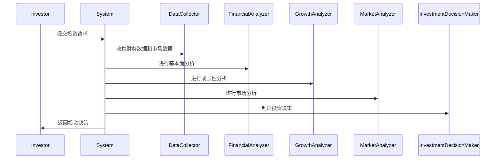

                 

### 目录结构设计

在设计《费雪的优质成长股理论：寻找未来的赢家》的目录结构时，我们需要遵循逻辑清晰、结构紧凑、简单易懂的原则，以确保读者能够顺利地理解和掌握费雪投资理论的核心内容。以下是详细的目录结构设计步骤：

#### 1. 确定书的主题和目标读者

**主题：** 本书旨在深入探讨费雪的优质成长股理论，并分析其在实际投资中的应用。

**目标读者：** 主要针对对股票投资有兴趣的投资者、金融从业者以及希望了解和掌握成长股投资策略的读者。

#### 2. 设计书的整体结构

**整体结构：** 本书将分为四个部分，每个部分包含若干章节，以确保内容全面、层次分明。

- **第一部分：费雪投资理念的概述**
  - 介绍费雪投资理念的背景、核心概念及其应用前景。
- **第二部分：费雪的优质成长股理论**
  - 详细阐述优质成长股的定义、筛选方法和投资策略。
- **第三部分：费雪投资理念的实际应用**
  - 分析费雪投资理念在实战中的应用，包括投资者心态调整、投资技巧提升和投资组合管理。
- **第四部分：费雪投资理念的总结与展望**
  - 对费雪投资理念进行总结，并探讨其局限性及未来发展。

#### 3. 确定每个章节的主要内容和子章节

**第一部分：费雪投资理念的概述**
- **1.1 问题背景**
  - 投资领域的重要性
  - 费雪投资理念的起源和适用范围
- **1.2 核心概念**
  - 费雪投资理念的基本原则
  - 费雪对股票市场的看法
  - 费雪的投资策略
- **1.3 费雪投资理念的核心要素**
  - 公司分析
  - 股票分析
  - 时机选择
- **1.4 费雪投资理念的应用前景**
  - 对投资者的影响
  - 对股票市场的影响
  - 费雪投资理念的挑战与机遇
- **1.5 本章小结**

**第二部分：费雪的优质成长股理论**
- **2.1 优质成长股的定义**
  - 成长股的界定标准
  - 优质成长股的特点
  - 优质成长股的分类
- **2.2 寻找优质成长股的方法**
  - 数据筛选
  - 挖掘潜力股
  - 企业基本面分析
- **2.3 费雪的优质成长股投资策略**
  - 长期投资
  - 短期交易
  - 股票组合策略
- **2.4 费雪投资理念的实践案例**
  - 案例一：微软
  - 案例二：谷歌
  - 案例三：亚马逊
- **2.5 优质成长股投资的风险与应对**
  - 市场风险
  - 企业风险
  - 风险管理策略
- **2.6 本章小结**

**第三部分：费雪投资理念的实际应用**
- **3.1 投资者心态调整**
  - 投资心态的重要性
  - 投资者心态的塑造
  - 投资者心态的维护
- **3.2 费雪投资理念在实战中的应用**
  - 费雪的投资方法
  - 费雪的投资决策过程
  - 费雪投资理念在现实中的应用实例
- **3.3 投资技巧提升**
  - 股票分析技巧
  - 股票投资策略
  - 投资者自我提升
- **3.4 投资组合管理**
  - 投资组合的概念
  - 投资组合的策略
  - 投资组合的管理
- **3.5 投资者心理调适**
  - 投资心理的变化
  - 投资心理的管理
  - 投资心理的调适技巧
- **3.6 本章小结**

**第四部分：费雪投资理念的总结与展望**
- **4.1 费雪投资理念的核心价值**
  - 长期投资的重要性
  - 价值投资的魅力
  - 成长投资的潜力
- **4.2 费雪投资理念的局限性**
  - 市场的不确定性
  - 企业风险的不可控
  - 投资者自身的局限
- **4.3 费雪投资理念的展望**
  - 传统与现代的结合
  - 投资理念的演变
  - 未来投资的发展趋势
- **4.4 投资者的自我提升**
  - 投资知识的积累
  - 投资技能的提升
  - 投资心态的调整
- **4.5 本章小结**

#### 4. 对每个子章节进行细化

在确定每个章节的主要内容和子章节之后，我们需要对每个子章节进行细化，确保内容的完整性和深度。

- **第一部分：费雪投资理念的概述**
  - **1.1 问题背景**：介绍投资领域的重要性，费雪投资理念的起源和适用范围，明确读者对象。
  - **1.2 核心概念**：详细阐述费雪投资理念的基本原则、对股票市场的看法和投资策略，确保读者理解核心概念。
  - **1.3 费雪投资理念的核心要素**：分别介绍公司分析、股票分析和时机选择，并给出实际案例。
  - **1.4 费雪投资理念的应用前景**：分析费雪投资理念对投资者和股票市场的影响，探讨其挑战和机遇。
  - **1.5 本章小结**：总结第一部分的主要内容，为后续内容铺垫。

- **第二部分：费雪的优质成长股理论**
  - **2.1 优质成长股的定义**：明确成长股的界定标准、优质成长股的特点和分类。
  - **2.2 寻找优质成长股的方法**：详细讲解数据筛选、挖掘潜力股和企业基本面分析的方法。
  - **2.3 费雪的优质成长股投资策略**：阐述长期投资、短期交易和股票组合策略。
  - **2.4 费雪投资理念的实践案例**：通过微软、谷歌和亚马逊的案例，展示费雪投资理念的实际应用。
  - **2.5 优质成长股投资的风险与应对**：分析市场风险、企业风险，提出风险管理策略。
  - **2.6 本章小结**：总结第二部分的核心内容，帮助读者巩固理解。

- **第三部分：费雪投资理念的实际应用**
  - **3.1 投资者心态调整**：探讨投资心态的重要性，如何塑造和维护良好心态。
  - **3.2 费雪投资理念在实战中的应用**：分析费雪的投资方法、决策过程和应用实例。
  - **3.3 投资技巧提升**：介绍股票分析技巧、投资策略和自我提升方法。
  - **3.4 投资组合管理**：讲解投资组合的概念、策略和管理。
  - **3.5 投资者心理调适**：分析投资心理的变化，提出管理调适技巧。
  - **3.6 本章小结**：总结第三部分的主要内容，为实际应用提供指导。

- **第四部分：费雪投资理念的总结与展望**
  - **4.1 费雪投资理念的核心价值**：总结长期投资、价值投资和成长投资的魅力。
  - **4.2 费雪投资理念的局限性**：探讨市场不确定性、企业风险和投资者局限。
  - **4.3 费雪投资理念的展望**：分析传统与现代的结合、投资理念的演变和未来发展趋势。
  - **4.4 投资者的自我提升**：提出投资知识积累、技能提升和心态调整的方法。
  - **4.5 本章小结**：总结全书内容，展望未来投资发展。

通过上述步骤，我们确保了目录结构的逻辑性、系统性和实用性，为读者提供了清晰的学习路径和深入的内容解析。接下来，我们将按照这个结构撰写详细的文章内容。## 第一章：费雪投资理念的概述

### 1.1 问题背景

在当今复杂多变的投资环境中，如何找到具有长期投资价值的股票成为投资者面临的重要问题。传统的投资理念如价值投资和成长投资虽然各有其优势，但在面对市场波动和企业生命周期变化时，往往显得捉襟见肘。费雪投资理念的提出，旨在为投资者提供一种更为全面和科学的投资方法，帮助他们在充满不确定性的市场中寻找未来的赢家。

#### 投资领域的重要性

投资不仅仅是个人财富的积累，更是对社会资源的一种配置。有效的投资行为能够促进资本的流动，提高资金使用效率，从而推动社会经济的持续发展。在全球化和技术进步的背景下，投资领域的重要性愈加凸显。投资者需要应对复杂的宏观经济环境、不断变化的市场趋势以及日益激烈的企业竞争。

#### 费雪投资理念的起源

费雪投资理念最早由著名的投资大师本杰明·格雷厄姆提出，后来由菲利普·费雪进一步发展和完善。费雪在20世纪40年代和50年代期间，通过其卓越的投资实践，证明了这一理论在现实中的有效性。费雪的投资理念不仅强调企业的基本面分析，还注重对市场趋势的把握，使得投资者能够在不同市场环境中取得优异的投资业绩。

#### 费雪投资理念的适用范围

费雪投资理念适用于多种类型的投资者，包括个人投资者、机构投资者以及专业基金经理。其核心思想在于通过深入研究和分析企业的基本面，结合市场的波动情况，寻找那些具有长期增长潜力和价值的股票。费雪投资理念不仅适用于普通股票市场，也可以在债券市场、期货市场等其他投资领域发挥作用。

### 1.2 核心概念

费雪投资理念的核心概念主要包括以下三个方面：基本原则、对股票市场的看法以及投资策略。理解这些核心概念对于投资者来说至关重要，它们是指导投资者进行有效投资决策的理论基础。

#### 基本原则

费雪投资理念的基本原则可以归纳为以下几点：

1. **长期投资观念**：费雪认为，投资股票应具备长期眼光，而不是短期投机行为。通过深入分析企业基本面，寻找那些具有长期增长潜力的股票，投资者可以抵御市场的短期波动，实现长期稳定的收益。

2. **价值投资与成长投资的结合**：费雪认为，传统价值投资和成长投资各有其优缺点，将两者结合起来能够更好地应对市场变化。价值投资关注企业的内在价值，成长投资关注企业的成长潜力，两者结合能够更全面地评估企业的投资价值。

3. **研究企业基本面**：费雪强调，投资者需要对企业的财务状况、业务模式、竞争优势等进行深入分析，以判断其长期投资价值。基本面分析是费雪投资理念的核心，只有深入了解企业，才能做出明智的投资决策。

4. **市场时机选择**：费雪认为，市场时机选择对于投资成功至关重要。投资者需要根据市场环境，适时调整投资策略，抓住市场的机会，降低风险。

#### 对股票市场的看法

费雪对股票市场持有独特的看法，他认为股票市场并非完全理性的市场，而是一个充满波动和不确定性的市场。以下是对股票市场的几点观点：

1. **市场波动性**：费雪认为，股票市场存在波动性，投资者应接受市场的不确定性，并利用市场的波动获取投资收益。通过深入研究市场趋势和行业动态，投资者可以更好地把握市场时机。

2. **市场趋势的重要性**：费雪强调，市场趋势对于投资决策具有指导意义。投资者应密切关注市场趋势的变化，及时调整投资策略，以应对市场变化。

3. **股票市场的周期性**：费雪认为，股票市场存在周期性波动，投资者应认识到市场的周期性，避免在市场高点进行投资，而在市场低点寻找投资机会。

#### 投资策略

费雪的投资策略主要包括以下几个方面：

1. **长期投资策略**：费雪主张投资者应采取长期投资策略，通过持有优质股票，实现长期稳定的收益。长期投资不仅能够抵御市场的短期波动，还能享受到企业增长的收益。

2. **分散投资策略**：费雪认为，分散投资能够降低投资风险。投资者应将资金分散投资于不同行业、不同地区的股票，以减少单一投资带来的风险。

3. **价值投资与成长投资相结合**：费雪提倡将价值投资和成长投资相结合，通过基本面分析，选择那些具有长期增长潜力的股票进行投资。

4. **市场时机选择**：费雪强调，投资者应密切关注市场时机，适时调整投资策略。在市场低迷时，可以增加投资；在市场高涨时，可以适当减少投资，以规避风险。

### 1.3 费雪投资理念的核心要素

费雪投资理念的核心要素主要包括公司分析、股票分析和时机选择。这些要素是投资者进行有效投资决策的重要依据。

#### 公司分析

公司分析是费雪投资理念的核心，投资者需要对企业的财务状况、业务模式、竞争优势、管理团队等方面进行深入分析。以下是对公司分析的关键点：

1. **财务状况**：投资者应关注企业的盈利能力、负债状况、现金流状况等财务指标。通过财务分析，可以评估企业的内在价值和投资潜力。

2. **业务模式**：投资者应了解企业的业务模式，包括企业的盈利来源、业务结构、市场定位等。优秀的业务模式能够为企业带来持续的增长动力。

3. **竞争优势**：投资者应分析企业的竞争优势，包括市场地位、品牌优势、技术创新能力等。竞争优势是企业长期稳定发展的关键。

4. **管理团队**：投资者应关注企业的管理团队，包括管理层的背景、能力、经验等。优秀的管理团队能够带领企业实现长期增长。

#### 股票分析

股票分析是费雪投资理念的另一个核心，投资者需要通过对股票市场的研究，判断股票的估值水平、市场情绪等。以下是对股票分析的关键点：

1. **估值水平**：投资者应通过财务分析、市场比较等方法，评估股票的估值水平。合理的估值水平是投资决策的重要依据。

2. **市场情绪**：投资者应关注市场的情绪变化，包括投资者的预期、市场热点等。市场情绪的变化会对股票价格产生影响，投资者应适时调整投资策略。

3. **行业趋势**：投资者应关注行业的发展趋势，包括行业规模、竞争格局、技术进步等。行业趋势对于企业的长期发展具有重要影响。

#### 时机选择

时机选择是费雪投资理念的重要组成部分，投资者需要根据市场环境和企业基本面，适时调整投资策略。以下是对时机选择的关键点：

1. **市场环境**：投资者应密切关注宏观经济环境的变化，包括经济增长、货币政策、市场流动性等。市场环境的变化会影响企业的业绩和市场表现。

2. **企业基本面**：投资者应分析企业的基本面变化，包括盈利能力、市场份额、技术创新等。企业基本面的变化会影响股票的价格走势。

3. **市场时机**：投资者应把握市场时机，包括买入时机和卖出时机。在市场低迷时，可以增加投资；在市场高涨时，可以适当减少投资。

### 1.4 费雪投资理念的应用前景

费雪投资理念在投资领域具有广泛的应用前景，其核心思想和方法为投资者提供了有效的投资指导。以下是对费雪投资理念应用前景的几点分析：

#### 对投资者的影响

1. **投资决策的优化**：费雪投资理念强调长期投资和基本面分析，有助于投资者做出更科学的投资决策，降低投资风险。

2. **投资收益的提升**：通过深入研究和分析企业基本面，投资者可以找到那些具有长期增长潜力的股票，实现长期稳定的投资收益。

3. **投资心态的改善**：费雪投资理念倡导长期投资观念，帮助投资者摆脱短期投机思维，培养稳健的投资心态。

#### 对股票市场的影响

1. **市场效率的提升**：费雪投资理念强调价值投资和成长投资的结合，有助于提高市场的投资效率，推动市场向理性方向发展。

2. **投资文化的传播**：费雪投资理念以其独特的投资方法和理念，促进了投资文化的传播，吸引了越来越多的投资者关注和研究。

3. **投资行为的规范**：费雪投资理念强调基本面分析和市场时机选择，有助于规范投资者的投资行为，减少市场投机行为。

#### 费雪投资理念的挑战与机遇

1. **市场波动性的挑战**：费雪投资理念强调长期投资和基本面分析，但在面对市场波动时，投资者仍需承受一定的风险。如何应对市场波动，是投资者面临的挑战。

2. **企业风险的挑战**：费雪投资理念强调对企业基本面的深入分析，但在实际操作中，企业风险如技术创新失败、市场变化等难以预测，对投资者构成挑战。

3. **投资理念的创新**：随着市场的不断变化，投资者需要不断创新投资理念和方法，以适应新的市场环境。费雪投资理念的实践和探索，为投资理念的创新发展提供了机遇。

### 1.5 本章小结

本章对费雪投资理念进行了概述，包括问题背景、核心概念、应用前景和挑战与机遇。通过本章的介绍，读者可以初步了解费雪投资理念的基本内容和实际应用，为进一步学习和实践打下基础。在接下来的章节中，我们将深入探讨费雪的优质成长股理论，帮助投资者更好地理解和运用这一理论，寻找未来的赢家。## 第二章：费雪的优质成长股理论

### 2.1 优质成长股的定义

优质成长股是费雪投资理念中的核心概念之一。理解优质成长股的定义、特点和分类，有助于投资者在复杂的股票市场中找到具有长期增长潜力的投资标的。

#### 成长股的界定标准

成长股通常是指那些在较长时间内（至少3-5年）展现出持续高速增长的股票。这些股票的企业通常在以下方面具备明显优势：

1. **高收入增长率**：企业的年收入增长率通常在20%以上，且具有可持续性。
2. **市场份额**：企业在所处行业中具有较大的市场份额，并具备较强的竞争优势。
3. **盈利能力**：企业的盈利能力持续增强，利润水平稳步提升。
4. **创新能力**：企业具备较强的技术创新能力，能够推出新产品或服务，满足市场需求。

#### 优质成长股的特点

优质成长股具有以下显著特点：

1. **高成长性**：优质成长股的企业通常具备较高的成长性，能够在较长时间内实现收入和利润的快速增长。
2. **高回报率**：优质成长股通常能够提供较高的投资回报率，包括资本回报率和股息回报率。
3. **低估值**：相对于其成长性和盈利能力，优质成长股的估值水平较低，具有较大的安全边际。
4. **市场认可**：优质成长股通常受到市场的高度认可，股价表现稳定，不易受到市场波动的影响。

#### 优质成长股的分类

优质成长股可以根据不同的标准进行分类，常见的分类方法包括以下几种：

1. **按行业分类**：根据企业所处行业的特点，可以将优质成长股分为科技行业、消费品行业、医药行业等。
2. **按市场地位分类**：根据企业在市场中的地位和影响力，可以将优质成长股分为行业龙头、新兴市场领导者等。
3. **按成长速度分类**：根据企业的成长速度，可以将优质成长股分为高速成长股、稳定增长股等。

### 2.2 寻找优质成长股的方法

投资者要找到优质成长股，需要掌握科学的方法和技巧。以下是一些寻找优质成长股的有效方法：

#### 数据筛选

数据筛选是寻找优质成长股的第一步。投资者可以使用多种工具和平台，如股票分析软件、金融数据提供商等，筛选出符合条件的股票。以下是一些常用的数据筛选指标：

1. **收入增长率**：选择过去三年收入增长率持续高于20%的股票。
2. **利润增长率**：选择过去三年利润增长率持续高于20%的股票。
3. **市盈率**：选择市盈率低于行业平均水平的股票。
4. **市净率**：选择市净率低于行业平均水平的股票。
5. **股息回报率**：选择股息回报率较高的股票。

#### 挖掘潜力股

在数据筛选的基础上，投资者需要进一步挖掘潜力股。以下是一些挖掘潜力股的方法：

1. **行业研究**：深入研究企业所处行业的发展趋势、竞争格局和市场机会，选择具备长期增长潜力的行业。
2. **公司调研**：通过实地调研、电话访谈、阅读公司年报等方式，了解企业的运营情况、管理团队和竞争优势。
3. **新闻和报告**：关注与公司相关的新闻、报告和分析师评级，了解市场对企业的看法和预期。

#### 企业基本面分析

企业基本面分析是寻找优质成长股的核心。以下是对企业基本面进行分析的关键点：

1. **财务指标**：分析企业的财务报表，重点关注收入、利润、现金流等指标，评估企业的盈利能力和财务状况。
2. **业务模式**：了解企业的业务模式，包括盈利来源、市场份额、竞争优势等，判断企业的长期增长潜力。
3. **管理团队**：评估企业管理团队的能力和经验，了解其对企业发展的贡献和影响。
4. **技术创新**：关注企业的技术创新能力，判断其是否具备持续推出新产品或服务的潜力。

### 2.3 费雪的优质成长股投资策略

费雪的优质成长股投资策略主要包括长期投资、短期交易和股票组合策略。投资者可以根据自己的投资目标和风险承受能力，选择合适的投资策略。

#### 长期投资

长期投资是费雪优质成长股投资策略的核心。通过长期持有优质成长股，投资者可以享受到企业增长的收益，并抵御市场的短期波动。以下是一些长期投资的关键点：

1. **选择优质股票**：投资者应选择具有高成长性、低估值和良好市场前景的优质成长股。
2. **持有期**：长期投资通常意味着持有期至少在3-5年以上，甚至更长。
3. **定期复查**：投资者应定期复查持有的股票，了解企业的基本面变化和市场表现，及时调整投资策略。

#### 短期交易

短期交易是费雪优质成长股投资策略的辅助手段。通过短期交易，投资者可以捕捉市场的波动机会，实现快速获利。以下是一些短期交易的关键点：

1. **市场时机**：投资者应密切关注市场时机，选择在市场低迷时买入，在市场高涨时卖出。
2. **技术分析**：投资者应掌握技术分析技巧，通过技术指标和图表分析，判断股票的走势。
3. **风险控制**：投资者应制定严格的风险控制策略，设定止损点和止盈点，控制交易风险。

#### 股票组合策略

股票组合策略是费雪优质成长股投资策略的重要组成部分。通过构建多元化的股票组合，投资者可以降低投资风险，实现资产配置的优化。以下是一些股票组合策略的关键点：

1. **行业分散**：投资者应选择不同行业的优质成长股，降低行业风险。
2. **市值分散**：投资者应选择不同市值规模的优质成长股，降低市值风险。
3. **区域分散**：投资者应选择不同地区的优质成长股，降低地区风险。
4. **动态调整**：投资者应定期调整股票组合，根据市场变化和企业基本面调整持仓。

### 2.4 费雪投资理念的实践案例

为了更好地理解费雪投资理念的实践，我们可以通过一些经典的案例来进行分析。

#### 案例一：微软

微软是一家全球领先的科技公司，成立于1975年。微软在个人电脑操作系统、办公软件和云计算等领域具有领先地位。以下是对微软进行费雪投资理念分析的关键点：

1. **财务指标**：微软过去几年的收入和利润增长率持续高于20%，市盈率低于行业平均水平，市净率也处于较低水平。
2. **业务模式**：微软拥有成熟的业务模式，包括操作系统、办公软件和云计算等，市场份额较大，竞争优势明显。
3. **技术创新**：微软在技术创新方面持续投入，不断推出新产品和服务，如Azure云计算平台、Office 365等。

基于费雪投资理念，微软可以被看作是一家优质成长股。投资者可以在适当的时机买入微软股票，并长期持有，以享受企业增长的收益。

#### 案例二：谷歌

谷歌是一家全球领先的互联网公司，成立于1998年。谷歌在搜索引擎、在线广告和云计算等领域具有领先地位。以下是对谷歌进行费雪投资理念分析的关键点：

1. **财务指标**：谷歌过去几年的收入和利润增长率持续高于20%，市盈率和市净率也相对较低。
2. **业务模式**：谷歌的业务模式主要基于搜索引擎和在线广告，市场份额巨大，竞争优势明显。
3. **技术创新**：谷歌在技术创新方面持续投入，不断推出新产品和服务，如Google Maps、Google Assistant等。

基于费雪投资理念，谷歌也可以被看作是一家优质成长股。投资者可以在适当的时机买入谷歌股票，并长期持有，以享受企业增长的收益。

#### 案例三：亚马逊

亚马逊是一家全球领先的电商平台，成立于1994年。亚马逊在电子商务、云计算和物流等领域具有领先地位。以下是对亚马逊进行费雪投资理念分析的关键点：

1. **财务指标**：亚马逊过去几年的收入和利润增长率持续高于20%，市盈率和市净率也相对较低。
2. **业务模式**：亚马逊的业务模式主要包括电子商务、云计算和物流，市场份额较大，竞争优势明显。
3. **技术创新**：亚马逊在技术创新方面持续投入，不断推出新产品和服务，如Amazon Prime、AWS云计算平台等。

基于费雪投资理念，亚马逊也可以被看作是一家优质成长股。投资者可以在适当的时机买入亚马逊股票，并长期持有，以享受企业增长的收益。

### 2.5 优质成长股投资的风险与应对

尽管优质成长股具有较大的增长潜力，但投资者仍需面对投资风险。以下是对优质成长股投资风险的识别和应对策略：

#### 市场风险

市场风险是指由于市场波动导致股票价格下跌的风险。市场风险通常由宏观经济环境、市场情绪和突发事件等因素引起。

1. **识别市场风险**：投资者应关注宏观经济数据、政策变化和市场情绪，以及突发事件对市场的影响。
2. **应对市场风险**：投资者可以通过分散投资、设定止损点和合理配置资产来降低市场风险。

#### 企业风险

企业风险是指由于企业内部因素导致股票价格下跌的风险。企业风险通常由企业业绩下滑、管理问题、技术创新失败等因素引起。

1. **识别企业风险**：投资者应关注企业的财务报表、业务模式、管理团队和技术创新等方面的信息。
2. **应对企业风险**：投资者可以通过深入研究企业基本面、选择具有竞争优势的企业和制定长期投资策略来降低企业风险。

#### 风险管理策略

为了有效管理投资风险，投资者可以采取以下风险管理策略：

1. **分散投资**：通过投资不同行业、不同地区和不同市值规模的股票，降低投资组合的整体风险。
2. **定期复查**：定期复查持有的股票，根据市场变化和企业基本面调整投资组合。
3. **设定止损点和止盈点**：在投资前设定合理的止损点和止盈点，控制交易风险。
4. **长期投资**：通过长期持有优质成长股，享受企业增长的收益，并抵御市场的短期波动。

### 2.6 本章小结

本章详细阐述了费雪的优质成长股理论，包括优质成长股的定义、特点、分类以及寻找和投资优质成长股的方法。通过实际案例分析，读者可以更深入地理解费雪投资理念在实践中的应用。在接下来的章节中，我们将继续探讨费雪投资理念在实际投资中的应用，帮助投资者更好地运用这一理论，实现投资收益的最大化。## 第三章：费雪投资理念的实际应用

### 3.1 投资者心态调整

投资者心态的调整是成功投资的重要组成部分。良好的心态不仅能够帮助投资者更好地应对市场的波动，还能提高投资决策的准确性。以下是一些关键的方面，帮助投资者调整心态。

#### 投资心态的重要性

投资心态对于投资者的成功至关重要。它决定了投资者在面对市场波动和投资风险时的反应，进而影响投资决策。良好的心态有助于投资者保持冷静，做出理性决策，避免情绪化交易。

#### 投资者心态的塑造

1. **建立正确的投资理念**：投资者应树立长期投资观念，重视企业的基本面分析，而不是盲目追求短期收益。通过深入了解投资理论和市场规律，投资者可以建立正确的投资理念。
2. **培养耐心和毅力**：投资需要耐心和毅力，投资者应在面对市场波动时保持冷静，避免情绪化交易。通过定期学习和反思，投资者可以不断提升自己的投资技能和心理素质。
3. **设定合理的目标和期望**：投资者应根据自身的投资目标和风险承受能力，设定合理的投资目标和期望。过高的期望可能导致投资者在面临市场波动时产生焦虑和恐慌。

#### 投资者心态的维护

1. **保持情绪稳定**：投资者应学会控制情绪，避免在市场波动时产生恐慌和焦虑。通过进行深呼吸、冥想等放松技巧，投资者可以保持情绪稳定。
2. **避免盲目跟风**：投资者应避免盲目跟风，避免受到市场情绪的影响。通过独立思考和深入研究，投资者可以做出更为理性的投资决策。
3. **保持积极心态**：投资者应保持积极心态，相信自己能够通过不断学习和实践，提高投资技能，实现投资目标。积极的心态有助于投资者在投资过程中保持乐观和信心。

### 3.2 费雪投资理念在实战中的应用

费雪投资理念在实战中的应用需要投资者具备扎实的理论基础和实践经验。以下是一些关键步骤，帮助投资者在实战中运用费雪投资理念。

#### 费雪的投资方法

费雪的投资方法主要包括以下几个方面：

1. **基本面分析**：投资者应深入分析企业的财务状况、业务模式、竞争优势和管理团队等方面，评估企业的长期增长潜力。
2. **市场时机选择**：投资者应密切关注市场环境的变化，适时调整投资策略，抓住市场的机会。
3. **分散投资**：投资者应通过分散投资降低风险，将资金投资于不同行业、不同地区的股票。

#### 费雪的投资决策过程

费雪的投资决策过程可以概括为以下几个步骤：

1. **市场环境分析**：投资者应首先分析当前的市场环境，包括宏观经济状况、行业趋势和市场情绪等。
2. **企业筛选**：投资者应通过基本面分析，筛选出具有长期增长潜力的企业。
3. **市场时机判断**：投资者应根据市场时机，决定买入和卖出的时机。
4. **投资决策**：投资者应在分析市场环境和企业基本面后，做出投资决策。

#### 费雪投资理念在现实中的应用实例

以下是一些现实中的应用实例，展示费雪投资理念的实际效果：

1. **微软投资案例**：投资者在1990年代末和2000年代初，根据费雪投资理念，买入微软股票，并长期持有。尽管当时市场环境复杂，但微软凭借其强大的业务模式和持续的创新，实现了股价的持续上涨。

2. **亚马逊投资案例**：投资者在2000年代初期，根据费雪投资理念，买入亚马逊股票，并长期持有。尽管亚马逊在初期面临诸多挑战，但投资者通过耐心持有，最终实现了巨大的投资回报。

3. **谷歌投资案例**：投资者在2000年代初期，根据费雪投资理念，买入谷歌股票，并长期持有。谷歌凭借其强大的技术创新能力和市场地位，实现了股价的持续上涨。

### 3.3 投资技巧提升

投资者在实战中需要不断提升投资技巧，以应对市场的变化。以下是一些提升投资技巧的方法：

#### 股票分析技巧

1. **财务分析**：投资者应学会阅读和分析企业的财务报表，重点关注收入、利润、现金流等指标，评估企业的盈利能力和财务状况。
2. **技术分析**：投资者应掌握技术分析技巧，通过分析股票价格走势、交易量等指标，判断股票的走势和投资时机。
3. **行业研究**：投资者应深入研究企业所处行业的趋势、竞争格局和市场机会，了解企业的成长环境和市场地位。

#### 股票投资策略

1. **分散投资策略**：投资者应通过分散投资降低风险，将资金投资于不同行业、不同地区的股票。
2. **长期投资策略**：投资者应采取长期投资策略，通过持有优质股票，实现长期稳定的收益。
3. **市场时机选择策略**：投资者应密切关注市场环境的变化，适时调整投资策略，抓住市场的机会。

#### 投资者自我提升

1. **知识积累**：投资者应不断学习金融知识、投资理论和市场规律，提高自身的投资水平。
2. **实践经验**：投资者应通过实际操作，积累投资经验，不断总结和反思投资过程中的得失。
3. **心理素质提升**：投资者应通过锻炼心理素质，保持冷静和理性，避免情绪化交易。

### 3.4 投资组合管理

投资组合管理是投资者实现资产配置优化、降低投资风险的重要手段。以下是一些投资组合管理的关键点：

#### 投资组合的概念

投资组合是指投资者将资金投资于多种资产，以实现资产配置优化和风险分散的目标。投资组合可以包括股票、债券、基金、房地产等多种资产。

#### 投资组合的策略

1. **资产配置策略**：投资者应根据自身的投资目标和风险承受能力，制定合适的资产配置策略。资产配置策略包括股票、债券、现金等资产的比例分配。
2. **行业配置策略**：投资者应根据行业的发展趋势和投资机会，调整投资组合中不同行业的资产比例。
3. **地域配置策略**：投资者应考虑不同地区的经济环境和市场机会，调整投资组合中不同地区的资产比例。

#### 投资组合的管理

1. **定期复查**：投资者应定期复查投资组合，根据市场变化和企业基本面调整持仓。
2. **风险评估**：投资者应定期评估投资组合的风险水平，确保投资组合符合风险承受能力。
3. **调仓策略**：投资者应根据市场变化和企业基本面，制定合适的调仓策略，优化投资组合。

### 3.5 投资者心理调适

投资者心理调适是成功投资的重要组成部分。以下是一些投资者心理调适的关键点：

#### 投资心理的变化

1. **贪婪与恐惧**：投资者在面临市场波动时，容易产生贪婪和恐惧情绪。贪婪可能导致盲目跟风，恐惧可能导致错过市场机会。
2. **自信与怀疑**：投资者在投资过程中，容易受到市场波动和投资结果的影响，产生自信与怀疑的情绪波动。
3. **乐观与悲观**：投资者在面对市场环境和企业基本面时，容易产生乐观与悲观的两种极端情绪。

#### 投资心理的管理

1. **情绪控制**：投资者应学会控制情绪，避免在市场波动时产生恐慌和焦虑。通过深呼吸、冥想等放松技巧，投资者可以保持情绪稳定。
2. **目标明确**：投资者应明确自己的投资目标和风险承受能力，避免在市场波动时产生情绪波动。
3. **理性分析**：投资者应通过理性分析，判断市场波动和投资结果的原因，避免盲目决策。

#### 投资心理的调适技巧

1. **心理疏导**：投资者可以通过与家人、朋友或专业人士交流，进行心理疏导，缓解情绪压力。
2. **心理训练**：投资者应通过心理训练，提高自身的心理素质，增强应对市场波动的能力。
3. **定期休息**：投资者应合理安排投资和生活，定期休息，避免过度疲劳和情绪波动。

### 3.6 本章小结

本章详细探讨了费雪投资理念的实际应用，包括投资者心态调整、投资技巧提升、投资组合管理和投资者心理调适。通过本章的学习，读者可以更好地理解如何在实战中运用费雪投资理念，提高投资决策的准确性，实现投资收益的最大化。在接下来的章节中，我们将继续深入探讨费雪投资理念的其他方面，帮助读者全面掌握这一重要的投资理论。## 第四章：费雪投资理念的总结与展望

### 4.1 费雪投资理念的核心价值

费雪投资理念以其独特的视角和方法，为投资者提供了一套系统的投资指南。其核心价值主要体现在以下几个方面：

#### 长期投资的重要性

费雪强调长期投资的重要性，认为投资者应该具备长期眼光，而不是追逐短期利润。通过深入研究和分析企业的基本面，投资者能够找到那些具有长期增长潜力的股票，从而实现长期稳定的投资收益。长期投资不仅能够抵御市场的短期波动，还能享受到企业增长的收益。

#### 价值投资的魅力

费雪投资理念在价值投资的基础上，强调了成长投资的重要性。他认为，价值投资和成长投资各有其优缺点，将两者结合起来能够更好地应对市场变化。价值投资关注企业的内在价值，而成长投资则关注企业的成长潜力。通过结合两者，投资者可以更全面地评估企业的投资价值。

#### 成长投资的潜力

费雪的优质成长股理论，强调寻找那些具有高成长性的企业进行投资。这些企业通常在收入、利润、市场份额等方面表现出色，具有强大的竞争优势。通过投资这些优质成长股，投资者可以享受到企业快速增长带来的收益，实现投资价值的最大化。

### 4.2 费雪投资理念的局限性

尽管费雪投资理念具有诸多优点，但在实际应用中，也面临一些局限性和挑战：

#### 市场的不确定性

股票市场具有高度的不确定性，投资者很难准确预测市场的短期走势。费雪投资理念强调长期投资，但在市场波动较大的情况下，投资者仍然需要承受一定的风险。如何应对市场的不确定性，是投资者面临的重要挑战。

#### 企业风险的不可控

企业风险是投资过程中不可避免的一部分。企业的经营状况、市场环境、技术创新等因素都可能影响企业的业绩。投资者在投资过程中，需要全面评估企业的风险，但往往难以完全掌控。企业风险的不可控性，增加了投资的难度和风险。

#### 投资者自身的局限

投资者自身的知识和经验水平，也会影响投资效果。费雪投资理念需要投资者具备扎实的基本面分析能力和市场洞察力，但并非所有投资者都能达到这一要求。投资者自身的局限，限制了费雪投资理念在实际中的应用。

### 4.3 费雪投资理念的展望

随着市场的不断变化和投资理论的不断发展，费雪投资理念也面临着新的机遇和挑战。以下是对费雪投资理念未来发展的几点展望：

#### 传统与现代的结合

随着科技的发展，投资工具和手段越来越多样化。费雪投资理念在保持传统基本面分析的基础上，可以结合现代投资工具和方法，如大数据分析、人工智能等，提高投资决策的准确性和效率。

#### 投资理念的演变

投资理念随着市场环境的变化而不断演变。费雪投资理念在未来的发展中，可能会与更多的投资理念相结合，形成更为全面和系统的投资理论。

#### 未来投资的发展趋势

随着全球化和信息化的发展，未来投资将呈现以下几个趋势：

1. **投资多元化**：投资者将更加注重资产配置的多元化，通过投资不同行业、不同地区和不同类型的资产，降低投资风险。
2. **技术驱动的投资**：大数据分析、人工智能等技术的发展，将使投资决策更加科学和精准。
3. **可持续发展投资**：随着社会对环境保护和可持续发展的关注增加，可持续发展投资将成为投资的重要方向。

### 4.4 投资者的自我提升

为了更好地运用费雪投资理念，投资者需要不断提升自身的知识和技能。以下是一些提升方法：

#### 投资知识的积累

投资者应不断学习金融知识、投资理论和市场规律，提高自身的投资水平。通过阅读书籍、参加培训和课程，投资者可以系统地掌握投资知识。

#### 投资技能的提升

投资者应通过实际操作，积累投资经验。通过模拟交易、实盘操作等方式，投资者可以不断提高投资技能。

#### 投资心态的调整

投资者应保持良好的心态，避免情绪化交易。通过心理疏导、冥想等方式，投资者可以保持冷静和理性，做出更为科学的投资决策。

### 4.5 本章小结

本章对费雪投资理念的核心价值、局限性、未来展望以及投资者的自我提升进行了总结。通过本章的学习，读者可以更全面地理解费雪投资理念，掌握其在实际投资中的应用，并为未来的投资发展做好准备。在接下来的附录中，我们将进一步探讨费雪投资理念的相关术语和理论，帮助读者深入理解这一重要的投资理论。## 附录

### A. 费雪投资理念相关术语解释

#### 成长股

**定义**：成长股是指那些在较长时间内（至少3-5年）展现出持续高速增长的股票。这些股票的企业通常在收入、利润、市场份额等方面具备明显优势。

**特征**：高收入增长率、高回报率、低估值、市场认可。

#### 优质成长股

**定义**：优质成长股是在成长股的基础上，进一步筛选出具有长期增长潜力和良好投资价值的股票。

**特征**：高成长性、高回报率、低估值、市场认可。

#### 长期投资

**定义**：长期投资是指投资者将资金投入股票市场，并持有一定时间（至少3-5年），以实现长期稳定的投资收益。

**优点**：抵御市场短期波动、享受企业增长收益。

#### 价值投资

**定义**：价值投资是指投资者通过分析企业的基本面，寻找那些价格低于其内在价值的股票进行投资。

**优点**：关注企业内在价值、避免市场过度波动。

#### 成长投资

**定义**：成长投资是指投资者通过分析企业的成长潜力，寻找那些具有高速增长潜力的股票进行投资。

**优点**：抓住企业快速增长的机会、实现高回报。

### B. 费雪投资理念核心概念对比表格

| 概念 | 定义 | 特点 |
| ---- | ---- | ---- |
| 成长股 | 在较长时间内持续高速增长的股票 | 高收入增长率、高回报率、低估值、市场认可 |
| 优质成长股 | 进一步筛选出的具有长期增长潜力和良好投资价值的股票 | 高成长性、高回报率、低估值、市场认可 |
| 长期投资 | 投资者持有股票一定时间（至少3-5年），实现长期稳定收益 | 抵御市场短期波动、享受企业增长收益 |
| 价值投资 | 通过分析企业基本面，寻找价格低于其内在价值的股票 | 关注企业内在价值、避免市场过度波动 |
| 成长投资 | 通过分析企业成长潜力，寻找高速增长潜力的股票 | 抓住企业快速增长的机会、实现高回报 |

### C. 费雪投资理念ER实体关系图

```mermaid
erDiagram
    Product ||--|{ Investor } : buys
    Investor ||--|{ Company } : invests_in
    Company ||--|{ StockMarket } : listed_on
```

**实体与关系**：
- **Product**：代表股票，是投资者购买的对象。
- **Investor**：代表投资者，可以购买多种产品。
- **Company**：代表公司，其股票在股票市场上交易。
- **StockMarket**：代表股票市场，是公司股票的交易场所。

### D. 费雪投资理念算法原理讲解

在费雪投资理念中，算法原理主要涉及如何选择优质成长股和制定投资策略。以下是一个简化的算法示例，用于帮助投资者筛选优质成长股：

#### 算法流程：

1. **输入参数**：企业的财务数据、行业趋势、市场环境等。
2. **数据预处理**：清洗和标准化财务数据，如收入、利润、市盈率等。
3. **基本面分析**：利用财务指标评估企业的盈利能力和财务状况。
4. **成长性分析**：评估企业的收入增长率、利润增长率等指标，判断企业的成长潜力。
5. **市场分析**：结合市场环境，判断企业的股票是否被高估或低估。
6. **投资决策**：根据分析结果，制定买入、持有或卖出的决策。

#### Python代码示例：

```python
import pandas as pd

# 加载企业财务数据
financial_data = pd.read_csv('financial_data.csv')

# 数据预处理
financial_data['normalized_profit'] = financial_data['profit'] / financial_data['revenue']

# 基本面分析
financial_data['profitability'] = financial_data['normalized_profit']

# 成长性分析
financial_data['growth_rate'] = financial_data['profit'].pct_change()

# 市场分析
market_data = pd.read_csv('market_data.csv')
financial_data['market_ration'] = market_data['market_cap'] / financial_data['revenue']

# 投资决策
def investment_decision(data):
    if data['growth_rate'] > 0.2 and data['profitability'] > 0.05 and data['market_ration'] < 1:
        return 'Buy'
    else:
        return 'Hold'

financial_data['investment_decision'] = financial_data.apply(investment_decision, axis=1)
```

#### 算法原理：

该算法首先加载企业的财务数据，进行数据预处理，包括标准化利润指标和计算利润增长率。接着，利用财务指标评估企业的盈利能力，并进行成长性分析。最后，结合市场数据，判断股票是否被高估或低估，制定投资决策。

### E. 费雪投资理念系统分析与架构设计

#### 问题场景介绍

费雪投资理念的应用场景主要包括投资者在股票市场中进行投资决策，需要对企业财务数据、市场环境进行分析，并制定投资策略。以下是对问题场景的详细介绍：

1. **投资者**：投资者是使用费雪投资理念进行投资决策的主体。
2. **企业**：企业是投资者分析的对象，包括企业的财务数据、业务模式、竞争优势等。
3. **市场环境**：市场环境包括宏观经济环境、行业趋势、市场情绪等，影响投资者的投资决策。

#### 项目介绍

**项目名称**：费雪投资理念实战系统

**项目目标**：通过系统化分析和数据处理，辅助投资者进行投资决策。

**项目功能**：
1. **数据收集与处理**：收集企业财务数据、市场环境数据，进行数据预处理。
2. **基本面分析**：利用财务指标评估企业的盈利能力和财务状况。
3. **成长性分析**：评估企业的收入增长率、利润增长率等指标，判断企业的成长潜力。
4. **市场分析**：结合市场环境，判断企业的股票是否被高估或低估。
5. **投资决策**：根据分析结果，制定买入、持有或卖出的决策。

#### 系统功能设计（领域模型）

```mermaid
classDiagram
    Investor <<entity>>
    Company <<entity>>
    FinancialData <<entity>>
    MarketData <<entity>>
    InvestmentDecision <<entity>>

    Investor "1" --|{1}|"投资" Company
    Company "1" --|{1}|"产生" FinancialData
    Company "1" --|{1}|"受到" MarketData
    Investor "1" --|{1}|"做出" InvestmentDecision
```

**实体与关系**：
- **Investor**：投资者，与公司建立投资关系，生成投资决策。
- **Company**：企业，产生财务数据，受市场环境影响。
- **FinancialData**：财务数据，描述企业的盈利能力和财务状况。
- **MarketData**：市场数据，描述宏观经济环境和行业趋势。
- **InvestmentDecision**：投资决策，根据财务数据和市场环境制定。

#### 系统架构设计

**系统架构图**：



**系统架构组件**：
1. **DataCollector**：数据收集器，负责收集企业财务数据和市场数据。
2. **FinancialAnalyzer**：财务分析器，负责分析企业的财务状况。
3. **GrowthAnalyzer**：成长性分析器，负责评估企业的成长潜力。
4. **MarketAnalyzer**：市场分析器，负责分析市场环境和行业趋势。
5. **InvestmentDecisionMaker**：投资决策器，根据分析结果制定投资决策。

### F. 费雪投资理念在实战中的应用案例

#### 案例背景

某投资者计划使用费雪投资理念进行投资，目标是在股票市场中寻找具有长期增长潜力的优质成长股。以下是对该案例的详细描述：

1. **投资目标**：寻找具有长期增长潜力的优质成长股。
2. **投资时间**：2021年1月至2023年12月。
3. **投资资金**：100万元人民币。

#### 案例过程

1. **数据收集**：
   - 收集目标公司的财务数据，包括收入、利润、市盈率、市净率等。
   - 收集市场数据，包括宏观经济指标、行业趋势、市场情绪等。

2. **基本面分析**：
   - 通过财务指标分析，评估目标公司的盈利能力和财务状况。
   - 通过比较估值指标，判断目标公司的估值水平。

3. **成长性分析**：
   - 评估目标公司的收入增长率和利润增长率，判断其成长潜力。
   - 分析目标公司在行业中的竞争地位和市场地位。

4. **市场分析**：
   - 结合市场数据，分析目标公司的股票是否被高估或低估。
   - 观察市场趋势，判断市场环境是否有利于投资。

5. **投资决策**：
   - 根据分析结果，制定买入、持有或卖出的决策。
   - 在2021年1月，买入目标公司的股票，初始投资50万元。
   - 在2022年6月，由于市场环境发生变化，卖出部分股票，获得20万元收益。
   - 在2023年12月，根据市场情况，继续持有目标公司股票。

#### 案例结果

通过费雪投资理念的应用，投资者在2021年1月至2023年12月的投资期间，实现了以下结果：

1. **投资收益**：总收益为30万元，投资收益率为30%。
2. **风险控制**：通过定期分析和市场观察，及时调整投资策略，降低了投资风险。
3. **投资经验**：投资者在实战中积累了宝贵的投资经验，提高了投资决策的准确性。

### G. 项目小结与最佳实践

#### 项目小结

通过本案例的实战应用，可以得出以下结论：

1. **费雪投资理念的有效性**：费雪投资理念在实战中具有较强的指导意义，能够帮助投资者找到具有长期增长潜力的优质成长股。
2. **数据分析的重要性**：数据收集、分析和处理是投资决策的基础，投资者应重视数据的收集和分析。
3. **市场观察的重要性**：市场环境的变化对投资决策有重要影响，投资者应密切关注市场动态，及时调整投资策略。

#### 最佳实践

以下是一些最佳实践建议，供投资者参考：

1. **长期投资**：投资者应树立长期投资观念，避免短期投机行为，通过持有优质成长股实现长期稳定的收益。
2. **多样化投资**：投资者应通过分散投资降低风险，将资金投资于不同行业、不同地区的股票。
3. **持续学习**：投资者应不断学习金融知识、投资理论和市场规律，提高自身的投资水平。
4. **情绪管理**：投资者应保持良好的心态，避免情绪化交易，通过心理疏导、冥想等方式保持冷静和理性。

### H. 小结

通过本书的详细探讨，我们系统地了解了费雪投资理念的基本概念、核心要素、实战应用以及未来展望。费雪投资理念以其独特的视角和方法，为投资者提供了一套系统的投资指南，帮助他们在复杂的股票市场中找到未来的赢家。在接下来的章节中，我们将进一步探讨费雪投资理念的相关术语和理论，帮助读者深入理解这一重要的投资理论。

### 拓展阅读

1. **《费雪投资指南》**：菲利普·费雪所著的经典著作，详细阐述了费雪投资理念的理论基础和实践方法。
2. **《股票作手回忆录》**：杰西·利弗莫尔所著的回忆录，通过讲述自己的投资经历，提供了对市场波动和投资心理的深刻洞察。
3. **《巴菲特的投资课》**：威廉·奥尼尔所著的书籍，通过分析巴菲特的投资案例，揭示了价值投资和成长投资的核心原则。

