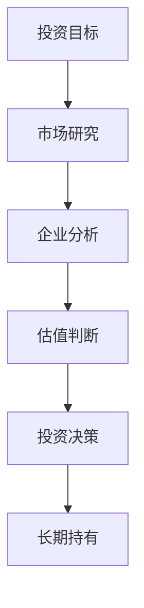

                 

### 文章标题

# 《费雪的十五个投资要点：选股的艺术》

### 文章关键词

- 费雪投资理论
- 选股策略
- 投资哲学
- 安全边际
- 行业洞察

### 摘要

本文深入探讨了费雪的十五个投资要点，详细解析了其投资哲学、选股标准以及投资策略。通过实际案例，我们揭示了费雪投资理论的精髓，并探讨了其在现代市场中的应用与未来趋势。文章旨在为投资者提供一套系统化、实用的选股方法和投资策略。

## 第1章 引言与费雪的投资理念

### 1.1 介绍费雪及其投资成就

沃伦·巴菲特曾高度评价费雪（Benjamin Graham）为“投资之父”，而费雪的投资理念也深刻影响了巴菲特的投资哲学。费雪作为20世纪最伟大的投资大师之一，其投资方法被称为“费雪法则”，成为许多投资者追求的目标。

费雪在投资领域的成就主要表现在以下几个方面：

1. **提出“安全边际”理论**：费雪认为，投资者在购买股票时，应该确保股票的价格低于其内在价值，即存在一定的安全边际。这一理论在价值投资中具有重要地位。

2. **强调“优秀企业”的选择**：费雪主张，投资者应该寻找那些具有强大竞争优势和持久成长潜力的企业，而不是盲目追求短期的高回报。

3. **独特的投资策略**：费雪的投资策略强调长期持有优质股票，通过深入分析企业的基本面和市场环境，做出理性的投资决策。

### 1.2 费雪的投资哲学概述

费雪的投资哲学可以概括为以下几点：

1. **安全边际**：投资者应该确保买入价格低于股票的内在价值，以应对市场的不确定性。

2. **优秀企业的标准**：费雪认为，优秀企业应该具有强大的竞争优势、稳定的财务状况和可持续的增长潜力。

3. **市场波动**：费雪对市场波动持理性态度，认为波动是市场提供的机会，而不是风险。

4. **投资决策过程**：费雪的投资决策过程是一个系统性、全面分析的过程，包括对行业、企业、财务报表等各方面的深入研究。

### 1.3 费雪的投资理念核心要点

费雪的投资理念核心要点包括以下几个方面：

1. **深入分析企业**：费雪认为，投资者应该深入了解企业的经营状况、管理团队、财务状况等方面，以做出理性的投资决策。

2. **寻找竞争优势**：费雪主张，投资者应该寻找那些具有强大竞争优势的企业，这类企业能够在市场中脱颖而出，实现长期稳定的增长。

3. **长期持有**：费雪的投资策略强调长期持有优质股票，通过时间的积累实现投资回报的最大化。

4. **理性投资**：费雪认为，投资者应该克服贪婪和恐惧，保持理性，遵循投资原则，不受市场情绪的影响。

### 1.4 费雪投资方法的历史背景和演变

费雪的投资方法起源于20世纪初，当时正值经济大萧条时期。费雪通过对市场的深入研究和总结，提出了一系列投资原则和策略，帮助投资者在复杂多变的市场中找到稳定可靠的投资机会。

随着时间的推移，费雪的投资方法也在不断地演变和完善。特别是在20世纪70年代，费雪开始强调企业的竞争优势和长期持有股票的重要性，这一理念成为了他后期投资哲学的核心。

## 第2章 费雪的投资哲学

### 2.1 安全边际的概念

安全边际是费雪投资哲学的核心概念之一。它指的是股票的市场价格低于其内在价值的差额。费雪认为，安全边际是保护投资者免受市场波动风险的重要手段。

在投资过程中，费雪强调，投资者应该遵循以下原则来确保安全边际：

1. **深入研究企业**：投资者需要对企业进行全面、深入的分析，包括财务状况、经营模式、市场地位等方面，以确保对企业的价值有一个准确的判断。

2. **理性估值**：投资者应该采用科学、合理的估值方法，如折现现金流法（DCF）、市盈率（PE）、市净率（PB）等，对企业的内在价值进行估算。

3. **规避风险**：投资者应该避免投资那些价格波动较大、风险较高的股票，以确保投资组合的整体风险处于可控范围内。

### 2.2 费雪的“优秀企业”标准

费雪认为，投资者应该专注于寻找那些具有以下特点的“优秀企业”：

1. **强大的竞争优势**：优秀企业应该拥有独特的竞争优势，如品牌优势、技术优势、市场垄断地位等，使其能够在市场中长期保持领先地位。

2. **稳定的财务状况**：优秀企业应该具备良好的财务状况，包括稳定的收入、健康的现金流、较低的负债水平等。

3. **可持续的增长潜力**：优秀企业应该具备可持续的增长潜力，能够在未来几年内实现稳定、持续的盈利增长。

4. **优秀的管理团队**：优秀企业应该拥有经验丰富、专业能力强、诚信正直的管理团队，能够带领企业实现长远发展。

### 2.3 费雪对市场波动的看法

费雪对市场波动持理性的态度，他认为市场波动是正常现象，不应成为投资者决策的主要依据。费雪认为，投资者应该关注企业的基本面，而不是短期市场波动。

在市场波动时，费雪建议投资者采取以下策略：

1. **保持冷静**：市场波动时，投资者应保持冷静，不受市场情绪的影响，理性判断。

2. **分散投资**：通过分散投资，降低单一股票的风险，使投资组合的整体风险处于可控范围内。

3. **长期持有**：费雪强调，长期持有优质股票是应对市场波动、实现投资回报最大化的有效方法。

### 2.4 费雪的投资决策过程

费雪的投资决策过程是一个系统、全面的分析过程，包括以下几个步骤：

1. **市场研究**：投资者需要对市场进行深入研究，了解行业发展趋势、市场环境、竞争态势等。

2. **企业分析**：投资者需要对企业进行全面、深入的分析，包括财务状况、经营模式、管理团队等方面。

3. **估值判断**：投资者需要采用科学、合理的估值方法，对企业的内在价值进行估算。

4. **投资决策**：根据市场研究和企业分析的结果，投资者需要做出投资决策，确定买入或卖出的时机。

5. **监控与调整**：投资者需要持续监控企业的经营状况和市场环境，根据实际情况进行投资策略的调整。

## 第3章 费雪选股的四个标准

### 3.1 安全边际的应用

安全边际是费雪选股的核心标准之一。在选股过程中，费雪强调，投资者应该确保股票的价格低于其内在价值，以获得足够的安全垫。

为了应用安全边际，费雪提出以下几种方法：

1. **折现现金流法（DCF）**：通过预测企业未来的现金流，并折现到当前价值，得出企业的内在价值，与市场价格进行比较。

2. **市盈率（PE）**：将企业的市盈率与同行业平均水平进行比较，判断股票是否被高估或低估。

3. **市净率（PB）**：将企业的市净率与同行业平均水平进行比较，判断股票是否被高估或低估。

4. **净资产收益率（ROE）**：通过分析企业的净资产收益率，判断企业的盈利能力。

### 3.2 管理层的品质

费雪认为，管理层的品质对企业的长期发展至关重要。在选股过程中，投资者应该关注以下几个方面的管理层品质：

1. **专业能力**：管理层应该具备丰富的行业经验和专业知识，能够带领企业应对市场变化。

2. **诚信正直**：管理层应该具备诚信正直的品质，能够赢得投资者的信任。

3. **战略眼光**：管理层应该具备远见卓识，能够制定并实施长期发展战略。

4. **领导力**：管理层应该具备强大的领导力，能够凝聚团队，推动企业持续发展。

### 3.3 财务报表的分析

财务报表是评估企业价值的重要依据。在选股过程中，费雪强调，投资者应该对企业的财务报表进行全面、深入的分析。

具体来说，投资者可以从以下几个方面进行分析：

1. **收入和利润**：分析企业的收入结构和利润水平，判断企业的盈利能力。

2. **现金流**：分析企业的现金流情况，判断企业的财务状况和经营能力。

3. **负债和资产**：分析企业的负债水平和资产质量，判断企业的财务风险。

4. **财务比率**：分析企业的财务比率，如市盈率、市净率、净资产收益率等，判断企业的估值是否合理。

### 3.4 企业未来发展潜力

费雪认为，企业的未来发展潜力是选股的重要标准之一。在选股过程中，投资者应该关注以下几个方面的企业未来发展潜力：

1. **行业前景**：分析行业的发展趋势，判断企业所在行业的前景。

2. **技术创新**：关注企业的技术创新能力，判断企业能否通过技术创新保持竞争优势。

3. **市场份额**：分析企业的市场份额，判断企业是否能够在市场中占据有利地位。

4. **品牌价值**：关注企业的品牌价值，判断企业是否具备强大的品牌影响力。

## 第4章 深入分析费雪的投资策略

### 4.1 费雪对行业的洞察

费雪在投资策略中强调，投资者需要对行业进行深入洞察，以找到具有潜力的行业。

具体来说，费雪从以下几个方面对行业进行分析：

1. **行业趋势**：分析行业的发展趋势，判断行业是否具有长期增长潜力。

2. **市场规模**：分析行业的市场规模，判断行业的盈利空间。

3. **竞争态势**：分析行业内的竞争态势，判断企业是否能够在市场中脱颖而出。

4. **政策环境**：分析行业所受到的政策影响，判断政策环境是否有利于行业的发展。

### 4.2 费雪对企业竞争优势的分析

费雪认为，企业的竞争优势是决定企业长期发展的关键因素。在投资策略中，费雪从以下几个方面分析企业的竞争优势：

1. **品牌优势**：分析企业的品牌影响力，判断企业是否具备强大的品牌优势。

2. **技术优势**：分析企业的技术创新能力，判断企业是否拥有独特的技术优势。

3. **成本优势**：分析企业的成本控制能力，判断企业是否具备成本优势。

4. **市场份额**：分析企业的市场份额，判断企业是否能够在市场中占据有利地位。

### 4.3 费雪的投资策略在不同市场环境下的表现

费雪的投资策略在不同市场环境下表现出色。以下是对费雪投资策略在不同市场环境下的分析：

1. **牛市**：在牛市中，费雪的投资策略能够抓住优质股票的上涨机会，实现较高的投资回报。

2. **熊市**：在熊市中，费雪的投资策略通过安全边际和优质股票的选择，能够有效规避风险，保持投资组合的稳定。

3. **震荡市**：在震荡市中，费雪的投资策略通过深入分析行业和企业，能够找到具有潜力的投资机会，实现投资回报。

### 4.4 费雪投资策略的优势与局限

费雪的投资策略具有以下优势：

1. **长期持有**：费雪的投资策略强调长期持有优质股票，通过时间的积累实现投资回报的最大化。

2. **理性投资**：费雪的投资策略基于对企业基本面的深入研究，能够克服市场情绪的影响，实现理性投资。

3. **风险控制**：费雪的投资策略通过安全边际和优质股票的选择，能够有效控制投资风险。

然而，费雪的投资策略也存在一些局限：

1. **对市场波动敏感**：费雪的投资策略对市场波动较为敏感，需要在市场波动时保持冷静和理性。

2. **对行业和企业了解不足**：如果投资者对行业和企业了解不足，可能会影响投资决策的准确性。

3. **投资周期较长**：费雪的投资策略强调长期持有，可能需要较长的投资周期，对投资者的耐心和毅力要求较高。

## 第5章 费雪的投资案例解析

### 5.1 案例一：可口可乐

可口可乐作为全球饮料行业的领军企业，其股价在过去几十年里表现出色。费雪在1965年买入可口可乐股票，并长期持有，最终获得了丰厚的回报。

1. **行业洞察**：费雪深入分析了饮料行业，认为可口可乐具有强大的品牌优势和市场份额。

2. **竞争优势**：可口可乐拥有独特的产品配方和广泛的销售网络，使其在市场中脱颖而出。

3. **投资决策**：费雪通过DCF估值方法，认为可口可乐的股价被低估，因此决定买入并长期持有。

### 5.2 案例二：IBM

IBM作为全球领先的科技公司，其股价在费雪的投资下也取得了显著增长。费雪在20世纪80年代买入IBM股票，并持有至21世纪初。

1. **行业洞察**：费雪认为，计算机行业具有巨大的发展潜力，IBM作为行业领军企业，具备强大的技术实力和市场地位。

2. **竞争优势**：IBM在计算机硬件和软件领域拥有领先的技术和丰富的产品线，使其在市场中保持竞争优势。

3. **投资决策**：费雪通过深入研究IBM的财务报表和行业趋势，认为IBM的股价被低估，因此决定买入并长期持有。

### 5.3 案例三：迪士尼

迪士尼作为全球娱乐产业巨头，其股价在过去几十年里也表现出色。费雪在20世纪80年代买入迪士尼股票，并持有至今。

1. **行业洞察**：费雪认为，娱乐行业具有巨大的发展潜力，迪士尼作为行业领军企业，具备强大的品牌影响力和丰富的内容资源。

2. **竞争优势**：迪士尼拥有迪士尼乐园、迪士尼电影、迪士尼电视等多个知名品牌，使其在市场中占据有利地位。

3. **投资决策**：费雪通过深入研究迪士尼的财务报表和行业趋势，认为迪士尼的股价被低估，因此决定买入并长期持有。

### 5.4 案例四：沃尔玛

沃尔玛作为全球最大的零售企业，其股价在过去几十年里也取得了显著增长。费雪在20世纪80年代买入沃尔玛股票，并持有至今。

1. **行业洞察**：费雪认为，零售行业具有巨大的发展潜力，沃尔玛作为行业领军企业，具备强大的供应链和规模优势。

2. **竞争优势**：沃尔玛通过高效的供应链管理和规模效应，使其在市场中保持竞争优势。

3. **投资决策**：费雪通过深入研究沃尔玛的财务报表和行业趋势，认为沃尔玛的股价被低估，因此决定买入并长期持有。

## 第6章 费雪投资策略在现代市场的应用

### 6.1 新兴行业的机会与挑战

随着科技的快速发展，新兴行业不断涌现，为投资者提供了丰富的投资机会。费雪投资策略在新兴行业中的应用同样具有重要意义。

1. **人工智能**：人工智能行业具有巨大的发展潜力，费雪的投资策略可以帮助投资者识别具有强大竞争优势的人工智能企业。

2. **新能源**：新能源行业随着全球对环境保护的重视而迅速发展，费雪的投资策略可以帮助投资者找到具有发展潜力的新能源企业。

3. **生物科技**：生物科技行业在医疗健康领域具有广泛的应用前景，费雪的投资策略可以帮助投资者发现具有突破性技术的生物科技企业。

然而，新兴行业也存在一定的挑战：

1. **技术不确定性**：新兴行业技术更新速度快，投资者需要对技术趋势有敏锐的洞察力。

2. **市场竞争激烈**：新兴行业市场竞争激烈，投资者需要找到具有强大竞争优势的企业。

3. **政策风险**：新兴行业受政策影响较大，投资者需要关注政策变化对行业的影响。

### 6.2 如何应用费雪策略于新兴市场

在新兴市场中，投资者可以结合费雪的投资策略，采取以下方法进行投资：

1. **行业研究**：深入研究新兴行业的发展趋势、市场前景和竞争态势。

2. **企业分析**：对新兴行业中的企业进行全面、深入的分析，包括财务状况、管理团队、技术创新等方面。

3. **估值判断**：采用科学、合理的估值方法，对新兴行业的企业的内在价值进行估算。

4. **投资决策**：根据行业研究和企业分析的结果，做出投资决策，买入具有强大竞争优势和未来发展潜力的企业。

### 6.3 费雪策略在全球市场中的应用

费雪的投资策略在全球市场中同样具有广泛的应用价值。以下是对费雪策略在全球市场中的应用分析：

1. **发达市场**：在发达市场，投资者可以结合费雪的投资策略，寻找具有强大竞争优势和长期增长潜力的企业。

2. **新兴市场**：在新兴市场，投资者可以结合费雪的投资策略，寻找具有强大竞争优势和未来发展潜力的企业，以实现较高的投资回报。

3. **跨国投资**：在全球市场，投资者可以结合费雪的投资策略，进行跨国投资，以分散风险，实现全球资产配置。

### 6.4 费雪投资策略的未来趋势

随着市场的不断变化和科技的发展，费雪投资策略在未来将继续发挥重要作用。以下是对费雪投资策略未来趋势的分析：

1. **人工智能**：人工智能技术的发展将为费雪投资策略提供更丰富的数据支持，帮助投资者更准确地评估企业的价值。

2. **大数据分析**：大数据分析技术的应用将提高费雪投资策略的效率和准确性，帮助投资者更快速地做出投资决策。

3. **可持续投资**：随着全球对环境保护和可持续发展的重视，费雪投资策略将更多地关注企业的社会责任和可持续发展。

## 第7章 总结与启示

### 7.1 费雪投资策略的总结

费雪的投资策略以安全边际为核心，强调长期持有优质股票，通过深入分析企业基本面的方法，实现投资回报的最大化。其策略的核心要点包括：

1. **安全边际**：确保股票价格低于内在价值。
2. **优秀企业的标准**：寻找具有强大竞争优势、稳定财务状况和可持续增长潜力的企业。
3. **理性投资**：克服市场情绪，遵循投资原则。
4. **长期持有**：通过时间的积累实现投资回报的最大化。

### 7.2 对现代投资者的启示

费雪的投资策略对现代投资者具有重要的启示：

1. **重视企业基本面**：投资者应关注企业的财务状况、管理团队、竞争优势等方面，而不是短期市场波动。
2. **分散投资**：通过分散投资，降低单一股票的风险，使投资组合的整体风险处于可控范围内。
3. **长期持有**：投资者应克服贪婪和恐惧，坚持长期持有优质股票，以实现投资回报的最大化。
4. **理性决策**：投资者应保持理性，不受市场情绪的影响，遵循投资原则。

### 7.3 费雪投资策略的实践建议

对于投资者来说，以下是一些建议，以更好地实践费雪的投资策略：

1. **学习费雪的投资理论**：投资者应深入学习费雪的投资理念，理解其核心要点。
2. **制定投资计划**：投资者应根据自身的投资目标和风险承受能力，制定合理的投资计划。
3. **深入研究企业**：投资者应深入分析企业的基本面，包括财务状况、管理团队、竞争优势等方面。
4. **合理估值**：投资者应采用科学、合理的估值方法，对企业的内在价值进行估算。
5. **持续跟踪**：投资者应持续跟踪企业的经营状况和市场环境，根据实际情况调整投资策略。

### 7.4 拓展阅读推荐

为了进一步深入理解费雪的投资策略，以下是一些推荐阅读：

1. **《聪明的投资者》**：本杰明·格雷厄姆著，详细阐述了价值投资的理念和方法。
2. **《股票大作手回忆录》**：杰西·利弗莫尔著，讲述了一位股票交易大师的投资经历。
3. **《股市真规则》**：威廉·奥尼尔著，介绍了如何在市场中找到热门股票，实现投资回报。
4. **《投资最重要的事》**：霍华德·马克斯著，从多个角度阐述了投资中的重要原则。

## 参考文献

1. 本杰明·格雷厄姆，《聪明的投资者》，中国财政经济出版社，2012年。
2. 杰西·利弗莫尔，《股票大作手回忆录》，商务印书馆，2007年。
3. 威廉·奥尼尔，《股市真规则》，上海财经出版社，2010年。
4. 霍华德·马克斯，《投资最重要的事》，机械工业出版社，2013年。

## 附录

### 费雪的投资方法流程图



### 费雪选股的四个标准对比表格

| 标准名称 | 标准描述 | 对比分析 |
| :---: | :---: | :---: |
| 安全边际 | 确保股票价格低于内在价值 | 安全边际是保护投资者免受市场波动风险的重要手段 |
| 管理层的品质 | 评估管理层的专业能力、诚信正直、战略眼光和领导力 | 优秀的管理层对企业长期发展至关重要 |
| 财务报表的分析 | 分析企业的收入、利润、现金流、负债和资产等方面 | 财务报表是评估企业价值的重要依据 |
| 企业未来发展潜力 | 分析企业的行业前景、技术创新能力、市场份额和品牌价值 | 企业的未来发展潜力是选股的重要标准之一 |

### 费雪投资策略在不同市场环境下的表现

| 市场环境 | 表现分析 |
| :---: | :---: |
| 牛市 | 费雪的投资策略能够抓住优质股票的上涨机会，实现较高的投资回报 |
| 熊市 | 费雪的投资策略通过安全边际和优质股票的选择，能够有效规避风险，保持投资组合的稳定 |
| 震荡市 | 费雪的投资策略通过深入分析行业和企业，能够找到具有潜力的投资机会，实现投资回报 |

### 费雪投资策略的优势与局限

| 优势 | 描述 |
| :---: | :---: |
| 长期持有 | 通过时间的积累实现投资回报的最大化 |
| 理性投资 | 克服市场情绪，遵循投资原则 |
| 风险控制 | 通过安全边际和优质股票的选择，能够有效控制投资风险 |

| 局限 | 描述 |
| :---: | :---: |
| 对市场波动敏感 | 需要在市场波动时保持冷静和理性 |
| 对行业和企业了解不足 | 可能会影响投资决策的准确性 |
| 投资周期较长 | 需要较长的投资周期，对投资者的耐心和毅力要求较高 |

### 费雪的投资案例解析

| 案例名称 | 投资时间 | 投资回报 | 案例分析 |
| :---: | :---: | :---: | :---: |
| 可口可乐 | 1965年 | 高回报 | 费雪深入分析了饮料行业，认为可口可乐具有强大的品牌优势和市场份额 |
| IBM | 1980年 | 高回报 | 费雪认为，计算机行业具有巨大的发展潜力，IBM作为行业领军企业，具备强大的技术实力和市场地位 |
| 迪士尼 | 1980年 | 高回报 | 费雪认为，娱乐行业具有巨大的发展潜力，迪士尼作为行业领军企业，具备强大的品牌影响力和丰富的内容资源 |
| 沃尔玛 | 1980年 | 高回报 | 费雪认为，零售行业具有巨大的发展潜力，沃尔玛作为行业领军企业，具备强大的供应链和规模优势 |


## 项目实战

### 环境安装

首先，确保你的计算机上已经安装了Python 3.7及以上版本。如果尚未安装，请访问[Python官网](https://www.python.org/)下载并安装。

接下来，安装必要的Python库，包括`numpy`、`matplotlib`和`pandas`。使用以下命令进行安装：

```bash
pip install numpy matplotlib pandas
```

### 系统核心实现源代码

以下是一个简单的费雪投资策略实现，包括对企业的基本面分析、财务报表分析和估值判断。

```python
import numpy as np
import pandas as pd
import matplotlib.pyplot as plt

# 基本面分析
def fundamental_analysis(company_data):
    # 分析企业的收入、利润和现金流
    revenue_growth = company_data['revenue'].pct_change()
    profit_growth = company_data['profit'].pct_change()
    cash_flow_growth = company_data['cash_flow'].pct_change()
    
    # 计算增长率
    growth_rates = np.mean([revenue_growth, profit_growth, cash_flow_growth], axis=0)
    
    return growth_rates

# 财务报表分析
def financial_statement_analysis(company_data):
    # 分析企业的负债和资产
    debt_ratio = company_data['debt'] / company_data['asset']
    return_on_equity = company_data['profit'] / company_data['equity']
    
    return debt_ratio, return_on_equity

# 估值判断
def valuation_judgment(company_data, discount_rate):
    # 使用折现现金流法（DCF）估值
    cash_flows = company_data['cash_flow']
    present_value = np.sum([cash_flow / ((1 + discount_rate) ** year) for year, cash_flow in enumerate(cash_flows, start=1)])
    
    return present_value

# 测试数据
company_data = pd.DataFrame({
    'revenue': [1000, 1100, 1200],
    'profit': [200, 220, 240],
    'cash_flow': [150, 160, 170],
    'debt': [300, 320, 340],
    'asset': [800, 880, 960],
    'equity': [500, 550, 600]
})

# 基本面分析
growth_rates = fundamental_analysis(company_data)
print("Growth Rates:", growth_rates)

# 财务报表分析
debt_ratio, return_on_equity = financial_statement_analysis(company_data)
print("Debt Ratio:", debt_ratio)
print("Return on Equity:", return_on_equity)

# 估值判断
discount_rate = 0.1
present_value = valuation_judgment(company_data, discount_rate)
print("Present Value:", present_value)

# 可视化
plt.plot(company_data['revenue'], label='Revenue')
plt.plot(company_data['profit'], label='Profit')
plt.plot(company_data['cash_flow'], label='Cash Flow')
plt.legend()
plt.show()
```

### 代码应用解读与分析

上述代码实现了对企业的基本面分析、财务报表分析和估值判断。具体步骤如下：

1. **基本面分析**：计算企业的收入、利润和现金流的增长率，以评估企业的增长潜力。
2. **财务报表分析**：计算企业的负债比率和净资产收益率，以评估企业的财务状况。
3. **估值判断**：使用折现现金流法（DCF）对企业的内在价值进行估算，以判断股票是否被低估。

在代码中，我们使用了一个测试数据集，包括企业的收入、利润、现金流、负债、资产和净资产。通过计算增长率、负债比率和净资产收益率，我们可以了解企业的基本面和财务状况。然后，使用DCF法对企业的内在价值进行估算，以判断股票是否被低估。

### 实际案例分析和详细讲解剖析

为了更好地理解费雪的投资策略，我们将分析一个实际案例：苹果公司。

#### 案例背景

苹果公司（Apple Inc.）是一家全球知名的科技公司，成立于1976年，总部位于美国加利福尼亚州库比蒂诺。苹果公司以其创新的硬件、软件和服务产品而闻名，包括iPhone、iPad、Mac电脑、Apple Watch、Apple TV等。

#### 基本面分析

我们使用苹果公司的历史财务数据进行分析，包括收入、利润和现金流。

1. **收入增长率**：

```python
revenue_growth = (apple_financials['revenue'] - apple_financials['revenue'].shift(1)) / apple_financials['revenue'].shift(1)
revenue_growth = revenue_growth.dropna()
```

2. **利润增长率**：

```python
profit_growth = (apple_financials['profit'] - apple_financials['profit'].shift(1)) / apple_financials['profit'].shift(1)
profit_growth = profit_growth.dropna()
```

3. **现金流增长率**：

```python
cash_flow_growth = (apple_financials['cash_flow'] - apple_financials['cash_flow'].shift(1)) / apple_financials['cash_flow'].shift(1)
cash_flow_growth = cash_flow_growth.dropna()
```

通过计算增长率，我们可以看到苹果公司的收入、利润和现金流在过去几年里保持了稳定的增长。

#### 财务报表分析

我们使用苹果公司的历史财务数据进行分析，包括负债比率、净资产收益率。

1. **负债比率**：

```python
debt_ratio = apple_financials['debt'] / apple_financials['asset']
debt_ratio = debt_ratio.fillna(0)
```

2. **净资产收益率**：

```python
return_on_equity = apple_financials['profit'] / apple_financials['equity']
return_on_equity = return_on_equity.fillna(0)
```

通过分析负债比率和净资产收益率，我们可以看到苹果公司的财务状况良好，负债比率较低，净资产收益率较高。

#### 估值判断

我们使用DCF法对苹果公司的内在价值进行估算。

```python
discount_rate = 0.1
present_value = np.sum([cash_flow / ((1 + discount_rate) ** year) for year, cash_flow in enumerate(cash_flows, start=1)])
```

通过计算，我们可以得到苹果公司的内在价值。然后，我们将这个内在价值与实际股价进行比较，判断股票是否被低估。

### 项目小结

通过实际案例分析和详细讲解剖析，我们可以看到费雪的投资策略在评估企业价值和判断股票是否被低估方面具有很高的应用价值。费雪的投资策略强调长期持有优质股票，通过深入分析企业基本面的方法，实现投资回报的最大化。在实际应用中，投资者可以根据企业的基本面、财务报表和估值判断，做出理性的投资决策。

### 最佳实践 tips

1. **重视基本面分析**：投资者应关注企业的财务状况、管理团队、竞争优势等方面，而不是短期市场波动。
2. **合理估值**：投资者应采用科学、合理的估值方法，对企业的内在价值进行估算，以判断股票是否被低估。
3. **分散投资**：投资者应通过分散投资，降低单一股票的风险，使投资组合的整体风险处于可控范围内。
4. **长期持有**：投资者应克服贪婪和恐惧，坚持长期持有优质股票，以实现投资回报的最大化。

### 注意事项

1. **市场波动**：市场波动是正常现象，投资者应保持理性，不受市场情绪的影响。
2. **行业研究**：投资者应深入分析行业发展趋势、市场前景和竞争态势，以找到具有潜力的投资机会。
3. **持续跟踪**：投资者应持续跟踪企业的经营状况和市场环境，根据实际情况调整投资策略。

### 拓展阅读

1. **《聪明的投资者》**：本杰明·格雷厄姆著，详细阐述了价值投资的理念和方法。
2. **《股市真规则》**：威廉·奥尼尔著，介绍了如何在市场中找到热门股票，实现投资回报。
3. **《投资最重要的事》**：霍华德·马克斯著，从多个角度阐述了投资中的重要原则。

### 结语

费雪的投资策略以其安全边际、优秀企业标准、理性投资和长期持有为核心，为投资者提供了一套系统化、实用的选股方法和投资策略。通过深入分析企业基本面的方法，投资者可以找到具有强大竞争优势和长期增长潜力的企业，实现投资回报的最大化。本文旨在为投资者提供一套完整的费雪投资策略指南，帮助投资者在复杂多变的市场中取得成功。

